**概述<a name="section4537382116410"></a>**

本文档适用于指导用户进行WS53芯片模组的产测导入。目前WS53芯片模组已有多家客户处于导入或批量试制阶段。

固件版本和产测软件经过多次迭代已经基本稳定。

在前期产测导入过程中，研发和客户直接对接，发现并解决了不少问题。现将产测导入容易遇到的问题和解决方法、注意事项等记录，输出指导文档，供用户参考。

# FAQ<a name="ZH-CN_TOPIC_0000002088567968"></a>

-   **[WiFi](#ZH-CN_TOPIC_0000002088727840)**  

-   **[BLE/SLLE](#ZH-CN_TOPIC_0000002088567972)**  

-   **[产测软件](#ZH-CN_TOPIC_0000002088567948)**  

## WiFi<a name="ZH-CN_TOPIC_0000002088727840"></a>

-   **[产线是怎么使用产测版本？](#ZH-CN_TOPIC_0000002088567988)**  

-   **[版本转测时使用哪个版本？](#ZH-CN_TOPIC_0000002124327581)**  

-   **[研发给客户出维测版本支撑产测？](#ZH-CN_TOPIC_0000002108860584)**  

-   **[产测校准，运行wifi rx verify用例时，per不达标导致用例失败？](#ZH-CN_TOPIC_0000002124247249)**  

-   **[产测有验证rx灵敏度吗？](#ZH-CN_TOPIC_0000002124327561)**  

-   **[产测版本的默认发射功率是多少？怎么调默认发射功率？](#ZH-CN_TOPIC_0000002088727832)**  

-   **[怎么调整国家码？](#ZH-CN_TOPIC_0000002088727856)**  

-   **[怎么关闭过温保护？](#ZH-CN_TOPIC_0000002088567980)**  

-   **[校准参数保存在哪？](#ZH-CN_TOPIC_0000002088567984)**  

-   **[用户要过无委认证？](#ZH-CN_TOPIC_0000002124247229)**  

-   **[AT+FTM=0使用？](#ZH-CN_TOPIC_0000002124327549)**  

-   **[功率、频偏、温度写efuse写不进去？](#ZH-CN_TOPIC_0000002088567964)**  

-   **[如何优化产测时间？](#ZH-CN_TOPIC_0000002088567960)**  

-   **[常收性能测试时，同时收到mpdu和ampdu包？](#ZH-CN_TOPIC_0000002124327569)**  

-   **[写完频偏后一定要写温度吗？](#ZH-CN_TOPIC_0000002088727820)**  

-   **[AT+FTM=0切APP模式失败？](#ZH-CN_TOPIC_0000002088567952)**  

-   **[11n40M带宽制式使用](#ZH-CN_TOPIC_0000002088727848)**  

### 产线是怎么使用产测版本？<a name="ZH-CN_TOPIC_0000002088567988"></a>

**问题描述<a name="section839182920469"></a>**

模组厂怎么使用产测版本？

**解决方法<a name="section3636174715466"></a>**

1.  对于商用SDK包，使用./build.py -c ws53\_liteos\_app  -def=PACKET\_MFG\_BIN命令编译二合一镜像，参考《WS53V100 产线工装 用户指南》第1章节“测试软件准备”中“步骤一”。

    注：./build.py -c ws53\_liteos\_app命令只能编译单app镜像。

2.  对于产测SDK包，使用./build.py -c ws53\_liteos\_mfg或者./build.py -c ws53编译ws53\_liteos\_mfg.bin，取ws53\_liteos\_mfg.bin文件，替换商用SDK包中ws53\_liteos\_mfg.bin。

### 版本转测时使用哪个版本？<a name="ZH-CN_TOPIC_0000002124327581"></a>

**问题描述<a name="section839182920469"></a>**

版本转测使用哪个版本？

**解决方法<a name="section3636174715466"></a>**

因为客户使用商用分支SDK包编译产测版本。

版本获取方法：

1.  获取转测邮件CMC上的商用分支的SDK包，参考[1.1.10小节方法1](#ZH-CN_TOPIC_0000002088567988)。

注：为了完全覆盖模组产线场景，要求和客户使用相同的编译方法和版本转测。

### 研发给客户出维测版本支撑产测？<a name="ZH-CN_TOPIC_0000002108860584"></a>

**问题描述<a name="section839182920469"></a>**

mfg模式下，有客户发现1.10.102版本mfg模式下，执行AT+EFUSEMAC?读到NV WIFI MAC是0x0的问题。客户希望海思给临时patch，支撑产线量产？

**解决方法<a name="section3636174715466"></a>**

因为问题在app模式和mfg模式都会存在，而且代码修改部分对客户开源。所以，要提供app模式下的开源diff.patch和mfg模式下的闭源二进制ws53\_liteos\_mfg.bin。

1.  app模式，取客户版本对应的TAG节点拉取商用代码，提供diff.patch让客户合入。
2.  mfg模式，取客户版本mfg模式对应的TAG节点拉取产测代码或者拉取最新的产测分支代码，编译ws53\_liteos\_mfg.bin，通过hisupport单给到客户。

### 产测校准，运行wifi rx verify用例时，per不达标导致用例失败？<a name="ZH-CN_TOPIC_0000002124247249"></a>

**问题描述<a name="section839182920469"></a>**

产测校准，运行wifi rx verify用例时，per不达标导致用例失败？

**解决方法<a name="section3636174715466"></a>**

当前per是仪表发包200个，11b协议的per阈值是8%，11g/n/ax协议的per阈值是10%。

per对环境比较敏感，建议在屏蔽环境复测。

### 产测有验证rx灵敏度吗？<a name="ZH-CN_TOPIC_0000002124327561"></a>

**问题描述<a name="section839182920469"></a>**

产测有验证rx灵敏度吗？

**解决方法<a name="section3636174715466"></a>**

极致汇仪支持验证rx灵敏度测试，即WT\_VERIFY\_SWEEP，扫描灵敏度。因为该用例比较耗时，所以目前都是指定功率验证per。

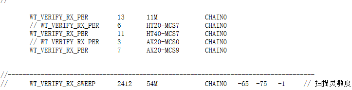

### 产测版本的默认发射功率是多少？怎么调默认发射功率？<a name="ZH-CN_TOPIC_0000002088727832"></a>

**问题描述<a name="section839182920469"></a>**

产测版本的默认发射功率是多少？怎么调默认发射功率？

**解决方法<a name="section3636174715466"></a>**

查询默认发射功率，参考《middleware/chips/ws53/nv/nv\_config/cfg/acore/app.json》。

方法一：

1.  可以直接修改app.json

    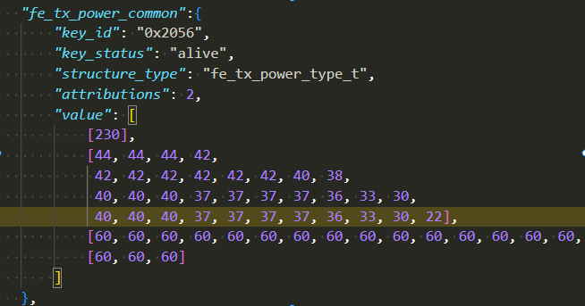

2.  重新编译ws53\_liteos\_app.pkg镜像

方法二：

1.  AT+NVWRITE配置默认功率，参考《WS53 NV功率调整.xlsx》调整功率，重启后生效。

### 怎么调整国家码？<a name="ZH-CN_TOPIC_0000002088727856"></a>

**问题描述<a name="section839182920469"></a>**

如果想配置FCC国家码？

**解决方法<a name="section3636174715466"></a>**

默认是大区功率配置通用，即NV\_ID=0x2003。

可以通过AT命令修改，举例：比如说想配置美国国家码，则AT+CC=US。

注：不能通过NVWRITE命令修改国家码，因为属性是永久属性，不允许以任何方式修改，只能以烧录方式改变。

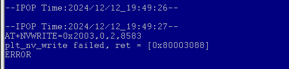

烧录方式：

1.  修改app.json中nv\_id=0x2003的attr为1

    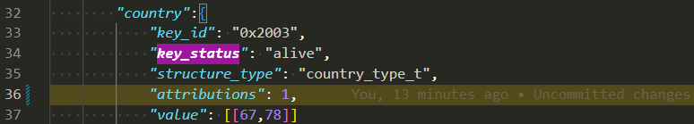

2.  编译烧录ws53\_liteos\_mfg\_all\_in\_one.fwpkg

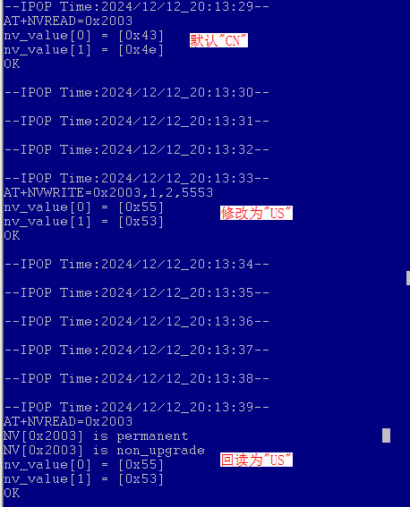

### 怎么关闭过温保护？<a name="ZH-CN_TOPIC_0000002088567980"></a>

**问题描述<a name="section839182920469"></a>**

怎么关闭过温保护？

**解决方法<a name="section3636174715466"></a>**

散热性不好的模组，长时间开常发，会触发过温保护，导致芯片降功率。仪表上会看到功率会有一些波动。可以关闭过温保护，让功率稳定下来，但是有烧芯片风险。

答：输入执行以下两条命令。

```
AT+CCPRIV=wlan0,alg_cfg,temp_pro_debug,1
AT+CCPRIV=wlan0,alg_cfg,temp_pro_temp_set,10
```

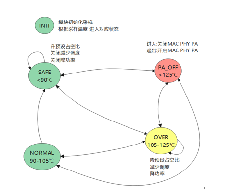

### 校准参数保存在哪？<a name="ZH-CN_TOPIC_0000002088567984"></a>

**问题描述<a name="section839182920469"></a>**

WS53产线校准校准和mac等有几次写efuse的机会？

**解决方法<a name="section3636174715466"></a>**

有些校准值存在NV区域，参考《WS53V100 NV存储 用户指南》有些校准值写到efuse。

写efuse说明如下。

<a name="table1569991411524"></a>
<table><thead align="left"><tr id="row769981475210"><th class="cellrowborder" valign="top" width="23%" id="mcps1.1.4.1.1"><p id="p269911417522"><a name="p269911417522"></a><a name="p269911417522"></a><strong id="b26991214155210"><a name="b26991214155210"></a><a name="b26991214155210"></a>efuse项</strong></p>
</th>
<th class="cellrowborder" valign="top" width="13%" id="mcps1.1.4.1.2"><p id="p5699614195213"><a name="p5699614195213"></a><a name="p5699614195213"></a><strong id="b1969991417529"><a name="b1969991417529"></a><a name="b1969991417529"></a>可写次数</strong></p>
</th>
<th class="cellrowborder" valign="top" width="64%" id="mcps1.1.4.1.3"><p id="p869931425213"><a name="p869931425213"></a><a name="p869931425213"></a><strong id="b186991214155214"><a name="b186991214155214"></a><a name="b186991214155214"></a>说明</strong></p>
</th>
</tr>
</thead>
<tbody><tr id="row12699151411525"><td class="cellrowborder" valign="top" width="23%" headers="mcps1.1.4.1.1 "><p id="p5699131410523"><a name="p5699131410523"></a><a name="p5699131410523"></a>wifi功率校准</p>
</td>
<td class="cellrowborder" valign="top" width="13%" headers="mcps1.1.4.1.2 "><p id="p7699214165215"><a name="p7699214165215"></a><a name="p7699214165215"></a>3</p>
</td>
<td class="cellrowborder" valign="top" width="64%" headers="mcps1.1.4.1.3 "><p id="p116997149523"><a name="p116997149523"></a><a name="p116997149523"></a>/</p>
</td>
</tr>
<tr id="row1969951410528"><td class="cellrowborder" valign="top" width="23%" headers="mcps1.1.4.1.1 "><p id="p1699914125210"><a name="p1699914125210"></a><a name="p1699914125210"></a>频偏校准</p>
</td>
<td class="cellrowborder" valign="top" width="13%" headers="mcps1.1.4.1.2 "><p id="p176992014185215"><a name="p176992014185215"></a><a name="p176992014185215"></a>3</p>
</td>
<td class="cellrowborder" valign="top" width="64%" headers="mcps1.1.4.1.3 "><p id="p166999146525"><a name="p166999146525"></a><a name="p166999146525"></a>wifi和ble/sle共用efuse频偏补偿值。</p>
</td>
</tr>
<tr id="row1469911410522"><td class="cellrowborder" valign="top" width="23%" headers="mcps1.1.4.1.1 "><p id="p2699914105214"><a name="p2699914105214"></a><a name="p2699914105214"></a>产测温度</p>
</td>
<td class="cellrowborder" valign="top" width="13%" headers="mcps1.1.4.1.2 "><p id="p3699191419529"><a name="p3699191419529"></a><a name="p3699191419529"></a>3</p>
</td>
<td class="cellrowborder" valign="top" width="64%" headers="mcps1.1.4.1.3 "><p id="p1369921418524"><a name="p1369921418524"></a><a name="p1369921418524"></a>wifi和ble/sle共用efuse温度补偿值，必须在写频偏efuse后写入 。</p>
</td>
</tr>
<tr id="row7699181416520"><td class="cellrowborder" valign="top" width="23%" headers="mcps1.1.4.1.1 "><p id="p4700414125216"><a name="p4700414125216"></a><a name="p4700414125216"></a>ble/sle功率校准</p>
</td>
<td class="cellrowborder" valign="top" width="13%" headers="mcps1.1.4.1.2 "><p id="p570061455216"><a name="p570061455216"></a><a name="p570061455216"></a>3</p>
</td>
<td class="cellrowborder" valign="top" width="64%" headers="mcps1.1.4.1.3 "><p id="p19700111411523"><a name="p19700111411523"></a><a name="p19700111411523"></a>ble和sle共用功率校准补偿值。</p>
</td>
</tr>
<tr id="row16700141435218"><td class="cellrowborder" valign="top" width="23%" headers="mcps1.1.4.1.1 "><p id="p1270013147527"><a name="p1270013147527"></a><a name="p1270013147527"></a>wifi mac</p>
</td>
<td class="cellrowborder" valign="top" width="13%" headers="mcps1.1.4.1.2 "><p id="p17001143525"><a name="p17001143525"></a><a name="p17001143525"></a>3</p>
</td>
<td class="cellrowborder" valign="top" width="64%" headers="mcps1.1.4.1.3 "><p id="p77007149526"><a name="p77007149526"></a><a name="p77007149526"></a>ble mac根据芯片形态，设置为wifi mac或从wifi mac派生。</p>
</td>
</tr>
<tr id="row167001714145211"><td class="cellrowborder" valign="top" width="23%" headers="mcps1.1.4.1.1 "><p id="p970071410524"><a name="p970071410524"></a><a name="p970071410524"></a>sle mac</p>
</td>
<td class="cellrowborder" valign="top" width="13%" headers="mcps1.1.4.1.2 "><p id="p15700914155211"><a name="p15700914155211"></a><a name="p15700914155211"></a>0</p>
</td>
<td class="cellrowborder" valign="top" width="64%" headers="mcps1.1.4.1.3 "><p id="p10700714125213"><a name="p10700714125213"></a><a name="p10700714125213"></a>不支持</p>
</td>
</tr>
</tbody>
</table>

### 用户要过无委认证？<a name="ZH-CN_TOPIC_0000002124247229"></a>

**问题描述<a name="section839182920469"></a>**

用户要过无委认证，怎么打开无委认证开关？

**解决方法<a name="section3636174715466"></a>**

产测分支和商用分支，默认关闭无委认证开关。如果需要打开开关，则直接修改SDK包中app.json后重新编译，或者AT+NVWRITE配置。

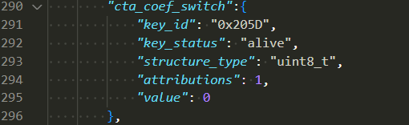

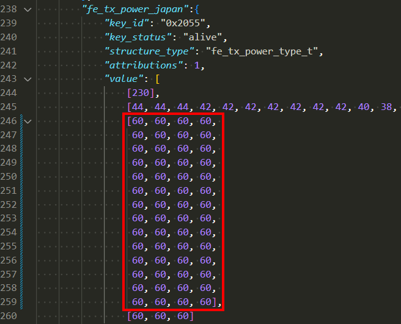

注：AT+NVWRITE和修改app.json都需要重启才能生效。

### AT+FTM=0使用？<a name="ZH-CN_TOPIC_0000002124327549"></a>

**问题描述<a name="section839182920469"></a>**

AT+FTM=0有什么作用和影响？

**解决方法<a name="section3636174715466"></a>**

1.  用于从产测版本切换到业务模式，重启后生效（不支持从业务版本切回产测模式，即业务模式下，执行AT+FTM=1无效）。AT+FTM=?，如果回显的是factory mode，则加载的是产测镜像，如果加载的是non\_factory mode，则加载的APP镜像。
2.  完成主NV区到从NV区的备份动作，将校准参数和sle mac从主NV区备份到从NV区。

注意：模组经产线校准，如果没有执行AT+FTM=0，则 1、下次升级单APP镜像或产测二合一镜像，模组重启还是会进入mfg模式；

2、下次升级单APP镜像或产测二合一镜像，会将主分区的Wi-Fi MAC和SLE MAC擦除。

### 功率、频偏、温度写efuse写不进去？<a name="ZH-CN_TOPIC_0000002088567964"></a>

**问题描述<a name="section839182920469"></a>**

功率、频偏、温度写efuse写不进去？

**解决方法<a name="section3636174715466"></a>**

1.  校准次数有限制，参考“[校准参数保存在哪？](#ZH-CN_TOPIC_0000002088567984)”章节。
2.  有些客户会将调试阶段写过efuse的模组，重新上产线。
3.  执行AT+RCALDATA查询射频参数剩余次数。

### 如何优化产测时间？<a name="ZH-CN_TOPIC_0000002088567960"></a>

**问题描述<a name="section839182920469"></a>**

如何优化产测时间？

**解决方法<a name="section3636174715466"></a>**

针对不同的量产场景，提供两种优化产测时间的方案。

1.  A标，支持wifi trx校准，使用极致汇仪在36S左右，请参考《WS53产测A标和B标方案》。
2.  B标，量产后基于大数据支持做免wifi trx校准，使用极致汇仪在18S左右。免校准方案参考《WS53 产线指导》1.2章节B标免校准方案。

### 常收性能测试时，同时收到mpdu和ampdu包？<a name="ZH-CN_TOPIC_0000002124327569"></a>

**问题描述<a name="section839182920469"></a>**

常收性能测试时，同时收到mpdu和ampdu包？

**解决方法<a name="section3636174715466"></a>**

WS53只负责接收解析报文，al\_rx\_info统计的成功收包数时，要算mpdu包和ampdu包总数。包类型依赖波形文件。

### 写完频偏后一定要写温度吗？<a name="ZH-CN_TOPIC_0000002088727820"></a>

**问题描述<a name="section15776123851711"></a>**

写完频偏一定要写温度吗？

**解决方法<a name="section247334571715"></a>**

写完频偏efuse没有约束必须要写温度efuse。

1.  没有温补，温度实际上用不到。
2.  如果要写温度efuse，一定要在写频偏efuse后。
3.  如果写了温度efuse，则会将对应的频偏和温度efuse位域上锁，无法再写频偏和温度efuse。

### AT+FTM=0切APP模式失败？<a name="ZH-CN_TOPIC_0000002088567952"></a>

**问题描述<a name="section075235651720"></a>**

产测的模式下，怎么确认是否切APP成功？

**解决方法<a name="section1934217720188"></a>**

1.  执行AT+FTM=0，有打印FTM SWITCH XXX, size:xxx OK。
2.  重启后执行AT+FTM=?，有打印non\_factory mode。则表示切APP成功。

注：1、红框内容打印仅表示NV反备份失败，不影响NV备份和切APP，可忽略。

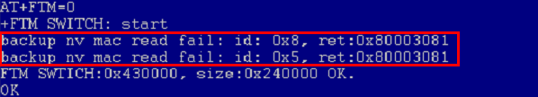

2、空模组使用normal/erase all模式烧录产测版本，重启后执行AT+FTM=0切APP也会触发上述打印。

### 11n40M带宽制式使用<a name="ZH-CN_TOPIC_0000002088727848"></a>

**问题描述<a name="section8471362619"></a>**

为什么配置wlan0 freq 3、11n40M制式，仪表上配置chn3会有20M偏移，仪表得配置chn5中心频点才能对齐。

**解决方法<a name="section1669951911260"></a>**

产测校准时，使用AT+CCPRIV配置协议模式和开常发。（AT+ALTX常发命令不能用于产测校准，但是可以用来更改中心频点的偏移方式）。11n40M带宽制式，常发配置1\~10信道时，中心频点默认上偏，常发配置11\~13信道时，中心频点默认下偏。

例：如果AT+CCPRIV=wlan0,freq,7和AT+CCPRIV=wlan0,mode,11n2g40，则中心频点对应chn9。

如果AT+CCPRIV=wlan0,freq,11和AT+CCPRIV=wlan0,mode,11n2g40，则中心频点对应chn9。

## BLE/SLLE<a name="ZH-CN_TOPIC_0000002088567972"></a>

-   **[默认产测用BLE校准，可以使用SLE校准吗？](#ZH-CN_TOPIC_0000002124247237)**  

-   **[功率按档位发，档位已经定死了吗，不能改吗，如果想要最高功率12dBm左右，可以改档位吗？](#ZH-CN_TOPIC_0000002088727816)**  

-   **[BLE和 SLE是否不需要RSSI校准？](#ZH-CN_TOPIC_0000002124247233)**  

-   **[BLE和SLE在全信道功率不平，在2402M、2477M\~2480M发送功率偏低是什么原因？](#ZH-CN_TOPIC_0000002124327589)**  

-   **[打开无委认证降功率开关后，功率还是偏高，需要继续调节边带的功率，要怎么做？](#ZH-CN_TOPIC_0000002124247265)**  

-   **[当前默认功率是20dBm，我想要18dBm或17dBm的功率要怎么做？](#ZH-CN_TOPIC_0000002124327585)**  

-   **[测试BLE或SLE GFSK的TX时，仪表没有抓到freq drift、ΔF1、ΔF2等参数。](#ZH-CN_TOPIC_0000002088567976)**  

-   **[未写过BLE MAC，但是上电读取到的BLE MAC是一串非0值。](#ZH-CN_TOPIC_0000002124247245)**  

-   **[SLE RX测试，发包1000包，但收包只有500包、250包或0包。](#ZH-CN_TOPIC_0000002124327577)**  

-   **[星闪RF认证，怎么获取RSSI？](#ZH-CN_TOPIC_0000002124327557)**  

-   **[使用WT（极致汇仪itest仪表）手动测试星闪的TX时，没有信号，或没有解调信息，怎么设置？](#ZH-CN_TOPIC_0000002124327573)**  

### 默认产测用BLE校准，可以使用SLE校准吗？<a name="ZH-CN_TOPIC_0000002124247237"></a>

**问题描述<a name="section839182920469"></a>**

默认产测用BLE校准，可以使用SLE校准吗？

**解决方法<a name="section3636174715466"></a>**

可以，修改极致汇仪用例即可。

### 功率按档位发，档位已经定死了吗，不能改吗，如果想要最高功率12dBm左右，可以改档位吗？<a name="ZH-CN_TOPIC_0000002088727816"></a>

**问题描述<a name="section839182920469"></a>**

功率按档位发，档位已经定死了吗，不能改吗，如果想要最高功率12dBm左右，可以改档位吗？

**解决方法<a name="section3636174715466"></a>**

目前仅支持以下几个功率配置

默认的各档位配置功率为（0\~7档）：

GFSK     =   \[-14,    -10,    -6,    -2,     2,      6,     10,    14\]dBm

PSK       =   \[-16,    -12,    -8,    -4,     0,      4,      8,     12\]dBm

可通过AT指令修改档位：

1.读当前设置的最高功率档位

AT+NVREAD=0x20a4

2.设置当前最高功率档位为7档

AT+NVWRITE=0x20a4,0,1,07

设置当前最高功率档位为5档

AT+NVWRITE=0x20a4,0,1,05

注意：BLE常发由配置文件设定功率档位，SLE常发由命令参数设定功率档位。AT指令修改档位后需要重启生效。

### BLE和 SLE是否不需要RSSI校准？<a name="ZH-CN_TOPIC_0000002124247233"></a>

**问题描述<a name="section839182920469"></a>**

BLE和 SLE是否不需要RSSI校准？

**解决方法<a name="section3636174715466"></a>**

不需要，BLE和SLE暂不支持RSSI校准。

### BLE和SLE在全信道功率不平，在2402M、2477M\~2480M发送功率偏低是什么原因？<a name="ZH-CN_TOPIC_0000002124327589"></a>

**问题描述<a name="section839182920469"></a>**

BLE和SLE在全信道功率不平，在以下频点发送功率偏低是什么原因？

GFSK :2402\\2480 MHz

4M8PSK :2477MHz

QPSK : 2477MHz

**解决方法<a name="section3636174715466"></a>**

版本默认打开了无委认证降功率开关，将这5个信道的发送功率降低了。若不需要边带降功率，则将无委认证降功率开关即可。具体操作：

1.  发送AT指令：AT+NVWRITE=0x20a5,0,1,00 关闭认证开关，如下图。

    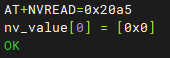

2.  重新上电。

### 打开无委认证降功率开关后，功率还是偏高，需要继续调节边带的功率，要怎么做？<a name="ZH-CN_TOPIC_0000002124247265"></a>

**问题描述<a name="section839182920469"></a>**

打开无委认证降功率开关后，功率还是偏高，需要继续调节边带的功率，要怎么做？

**解决方法<a name="section3636174715466"></a>**

目前不支持修改

### 当前默认功率是20dBm，我想要18dBm或17dBm的功率要怎么做？<a name="ZH-CN_TOPIC_0000002124327585"></a>

**问题描述<a name="section839182920469"></a>**

当前默认功率是20dBm，我想要18dBm或17dBm的功率要怎么做？

**解决方法<a name="section3636174715466"></a>**

目前仅支持最大功率档位修改

### 测试BLE或SLE GFSK的TX时，仪表没有抓到freq drift、ΔF1、ΔF2等参数。<a name="ZH-CN_TOPIC_0000002088567976"></a>

**问题描述<a name="section839182920469"></a>**

测试BLE或SLE GFSK的TX时，仪表没有抓到freq drift、ΔF1、ΔF2等参数。

**解决方法<a name="section3636174715466"></a>**

确认payload type是使用的“11110000”和“10101010”。

### 未写过BLE  MAC，但是上电读取到的BLE MAC是一串非0值。<a name="ZH-CN_TOPIC_0000002124247245"></a>

**问题描述<a name="section839182920469"></a>**

COB\(chip on board\)方式（星闪路由网关）的产测，未写过BLE  MAC，但是上电读取到的BLE MAC是一串非0值。

**解决方法<a name="section3636174715466"></a>**

系统启动时会优先从NV中获取mac，NV获取失败或者获取mac地址全0，则会继续从eFuse中获取最后一次写入的mac地址，如果获取失败，或者eFuse mac未写入，则会产生一个随机mac地址作为基础mac地址。业务启动时sta直接使用基础mac地址，BLE使用基础mac地址最高位mac加1之后派生的mac地址，softAP使用基础mac地址次高位mac加2之后派生的mac地址。假设基础mac为00:22:33:44:55:66，则业务启动后sta mac地址为00:22:33:44:55:66，softap mac地址为00:22:33:44:57:66，BLE mac 为00:22:33:44:55:67。

目前101版本在重新烧版本后回读MAC均为0，下个版本修复该问题。

```
AT+EFUSEMAC?     #查询
```

```
+EFUSEMAC:00:00:00:00:00:00   #eFuse和NV均未写过有效MAC地址
+EFUSEMAC:Efuse mac chance(s) left:3 times.  #提示eFUSE还能写几次MAC地址，仅当NV未配置有效MAC地址时显示
OK
AT+EFUSEMAC=50:21:00:33:02:49,1  #写入MAC地址到NV
OK
AT+EFUSEMAC?    #回读查询
+EFUSEMAC: NV MAC 00:22:33:44:55:cc
+EFUSEMAC: EFUSE MAC 00:22:33:44:55:cc
+EFUSEMAC: Efuse mac chance(s) left: 2 times.
+EFUSEMAC: EFUSE SLE MAC 00:00:00:00:00:00
+EFUSEMAC: NV SLE MAC 00:22:33:44:55:44
OK
```

### SLE RX测试，发包1000包，但收包只有500包、250包或0包。<a name="ZH-CN_TOPIC_0000002124327577"></a>

**问题描述<a name="section839182920469"></a>**

SLE RX测试，发包1000包，但收包只有500包、250包或0包。

**解决方法<a name="section3636174715466"></a>**

SLE RX测试时，需要仪表TX和芯片RX的时间窗口一致。若不一致，则会导致芯片RX开窗和TX不同步，导致丢包，而收到500包的情况是每2个包丢1个，250包的情况为每4个包丢3个。

下图为RX与TX之间的关系，其中：

-   intval为SLE RX的最后一个参数，单位为slot，表示RX开窗时间，1slot = 125μs。
-   TX wava length为仪器发的波形的长度\(包含0的部分\)。
-   IFG表示仪器两包之间的时间间隔，在仪器上配置。

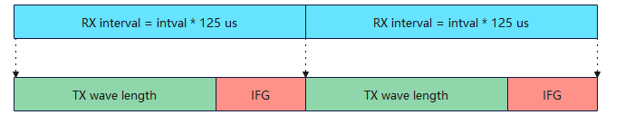

需要满足：RX interval = TX wave length + IFG，才能保证RX完全收包。

### 星闪RF认证，怎么获取RSSI？<a name="ZH-CN_TOPIC_0000002124327557"></a>

**问题描述<a name="section839182920469"></a>**

星闪RF认证，怎么获取RSSI？

**解决方法<a name="section3636174715466"></a>**

命令：AT+SLETRXEND

使用说明：

-   命令格式：AT+SLETRXEND

-   参数说明：无

-   响应：

    OK

    status：<value1\>，num\_packet：<value2\>，rssi：<value3\>

    -   value1：status，返回状态，0表示成功，其他值表示错误;
    -   value2：num\_packet，16进制表示。结束SLE TX时，表示发包数；结束SLE RX时，表示收包数；
    -   value3：rssi，表示接收信号强度，16进制表示，最高位为符号位。

-   RSSI获取命令使用前提

    已经下发了sle rx命令，处于射频测试的SLE RX状态，并接收50包以上数据后，可以在结束rx之前或之后，使用这条命令获取这次SLE RX测试的RSSI，发送sle\_reset命令可清空rssi数据。

注意：未收满50包，则没有有效的rssi数据上报。

### 使用WT（极致汇仪itest仪表）手动测试星闪的TX时，没有信号，或没有解调信息，怎么设置？<a name="ZH-CN_TOPIC_0000002124327573"></a>

**问题描述<a name="section839182920469"></a>**

使用WT（极致汇仪itest仪表）手动测试星闪的TX时，没有信号，或没有解调信息，怎么设置？

**解决方法<a name="section3636174715466"></a>**

默认界面的协议、带宽、信道、频偏、参考电平、采样长度均正确时。排查步骤：

1.  首先在meter软件【端口设置】查看对应的端口是否设置为“VSA”；
2.  正确设置【分析设置】，如下：

    SLE的TX，仪器解析时，需要正确设置分析设置，如下：

    -   GFSK分析设置

        分析帧类型： FrameType1

        带宽：1M/2M/4M \(根据发送的波形Phy而定\)

        控制信息类型：A7

        同步模式：AccessCode

        接入码：10100011011011010111000110111001

        CRC类型：CRC24A

        CRC种子\(hex\)：555555

    -   PSK分析设置

        分析帧类型： FrameType2

        带宽：1M/2M/4M \(根据发送的波形Phy而定\)

        控制信息类型：A6

        同步模式：AccessCode

        接入码：1010001101101101011100011011100110111101001000110001010001010110

        CRC类型：CRC24A

        CRC种子\(hex\)：555555

        payload分析模式：User Defined

        MCS：根据设置参数而定

        QPSK：

        polar=3/4：MCS6

        polar=1：MCS8

        8PSK：MCS10, MCS12

        polar=3/4：MCS10

        polar=1：MCS12

        导频密度：根据设置参数而定，（polar = 1时，导频密度需为0）

## 产测软件<a name="ZH-CN_TOPIC_0000002088567948"></a>

-   **[客户应该使用哪个海思固件版本和极致汇仪版本？](#ZH-CN_TOPIC_0000002124247269)**  

### 客户应该使用哪个海思固件版本和极致汇仪版本？<a name="ZH-CN_TOPIC_0000002124247269"></a>

**问题描述<a name="section839182920469"></a>**

新导入客户应该用哪个海思固件和极致汇仪版本？

**解决方法<a name="section3636174715466"></a>**

参考《WS53V100 产线工装 用户指南》第四章节“WLAN Facility与海思固件版本”。

# 注意事项<a name="ZH-CN_TOPIC_0000002088727852"></a>

-   **[产测版本使用](#ZH-CN_TOPIC_0000002088727828)**  

-   **[WIFI](#ZH-CN_TOPIC_0000002124247261)**  

-   **[BLE/SLE](#ZH-CN_TOPIC_0000002124247241)**  

-   **[产测软件](#ZH-CN_TOPIC_0000002124247257)**  

## 产测版本使用<a name="ZH-CN_TOPIC_0000002088727828"></a>

1.  客户要用商用版本SDK包编译二合一ws53\_liteos\_app\_all\_in\_one.fwpkg镜像包做产测校准，参考[《WS53V100 产测FAQ》1.1.2章节](#ZH-CN_TOPIC_0000002088567988)。
2.  当前产测分支上默认关闭无委认证开关。建议在APP模式下做无委认证和其他wifi业务，不要在mfg模式下做无委认证和其他wifi业务。

## WIFI<a name="ZH-CN_TOPIC_0000002124247261"></a>

1.  修改app.json可以改变默认发射功率，类似于ws73的ws73\_cfg.ini文件。修改完后，需要重新编译，上电启动。

1.  mfg模式下还保留业务功能，但是不建议跑wifi业务。
2.  产测方案只做高功率校准，不做低功率校准。所有的功率点都用高功率曲线去校准。
3.  没有用到温补，所以写完频偏efuse后不必须写温度efuse，如果要写温度efuse，则一定要放在写频偏efuse后。
4.  产线只做高功率点校准，不做低功率点校准，低功率曲线也用不到。

## BLE/SLE<a name="ZH-CN_TOPIC_0000002124247241"></a>

1.  实测功率和目标功率差值的绝对值在4dB以内，都要进行功率校准，BLE/SLE功率校准efuse值依赖校准过程获得，不能从命令下发，所以功率校准过程不可裁剪掉。
2.  BLE/SLE频偏校准与WiFi共用，当WiFi不做频偏校准而芯片需要做频偏校准时（裁剪掉WiFi），采用BLE/SLE的频偏校准命令进行频偏校准。
3.  校准时，发的帧的包长度要大于37 bytes，payload类型采用PRBS9，否则可能导致仪表抓不到有效信息，建议包长度200以上。
4.  GFSK射频测试使用“11110000”和“10101010”的payload类型，PSK射频测试使用PRBS9的payload类型。
5.  若客户使用自己开发的产测软件平台，校验命令执行结果是否正确请参考《WS53V100模组产线工装 用户指南》中“测试命令”章节的每一条命令的执行状态返回字段，status：<value\> ，value = 0 表示成功，其他的表示失败。
6.  BLE/SLE功率校准建议在14dBm档位\(ini配置的第7档功率\)下进行校准，将这个功率值作为目标功率。使用其他档位和功率进行校准，功率一致性不能保证在±2dB内。
7.  整个产线校准流程做完后，客户确保要做星闪efuse mac回读校验，确保星闪mac按照预期写入。

## 产测软件<a name="ZH-CN_TOPIC_0000002124247257"></a>

使用极致汇仪上位机软件前，请参考《WS53V100 产线工装 用户指南》“WLAN Facility与固件版本”章节，或者找AE同事确认应该使用版本。

# 版本问题记录<a name="ZH-CN_TOPIC_0000002116041018"></a>


