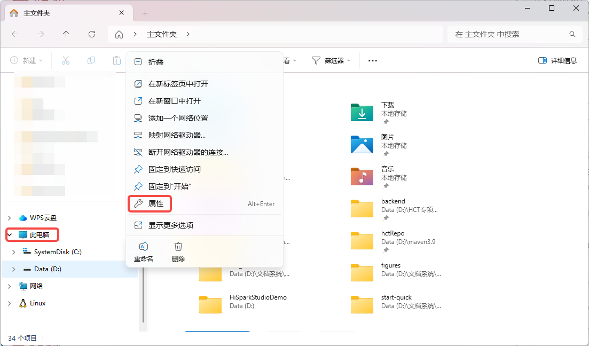
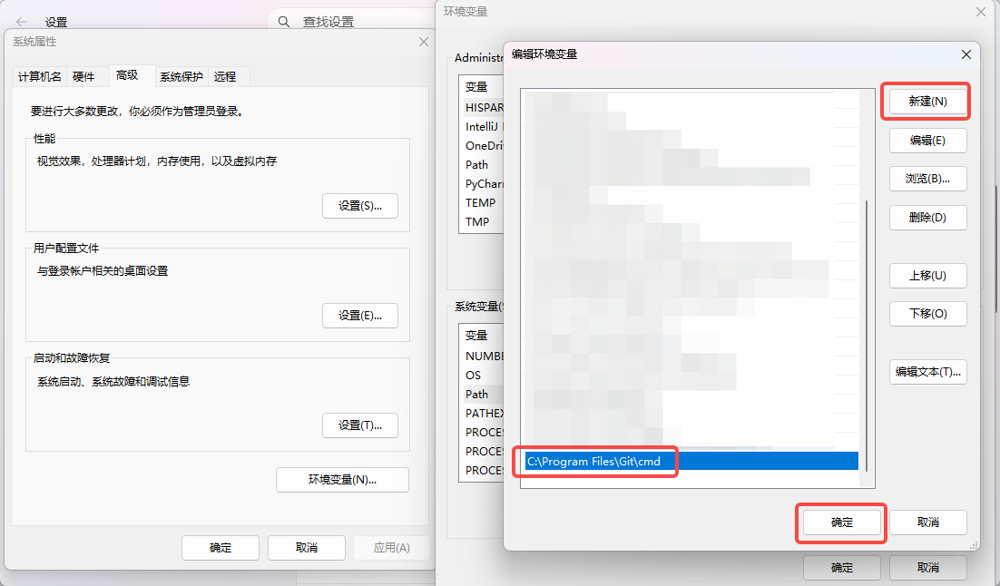
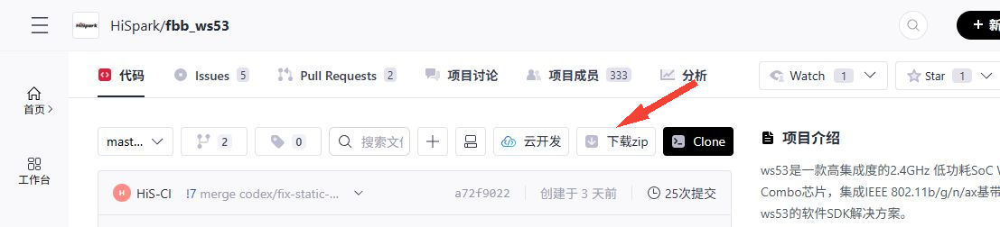

# 环境搭建

本文档介绍如何在 Windows 系统上搭建 WS53 开发环境，包括安装 IDE（Integrated Development Environment）、配置工具链、获取 SDK 以及验证环境。

## 环境要求

| 项目 | 要求 |
|---|---|
| 操作系统 | 64 位 Windows 10 或 Windows 11 |
| VS Code | 1.85.0 及以上 |
| 硬盘空间 | 至少 900 MB（安装 HiSpark Studio 插件） |
| 内存 | 最低 1 GB RAM（Random Access Memory），建议 4 GB 及以上 |
| CPU | 1.6 GHz 或更高 |
| C 盘空间 | 建议至少 1 GB 剩余空间 |
| 网络 | 需要网络连接，用于下载工具链和 SDK |

## 硬件配件

| 物品 | 用途 | 获取方式 |
|---|---|---|
| Type-C USB（Universal Serial Bus）数据线 | 连接开发板与电脑，用于供电和烧录 | 开发板通常自带 |

## 安装串口驱动

开发板通过 USB 转串口（USB-TTL）与电脑通信，用于烧录固件和串口调试。需要安装与开发板 USB 转串口芯片匹配的驱动；使用 CH340/CH341 芯片的开发板可安装 CH341SER 驱动。

访问 [CH341SER 驱动下载](https://www.wch.cn/downloads/CH341SER_EXE.html){ target=_blank }下载驱动包，双击进行安装。

## 安装 VS Code

1. 下载并安装最新版 [Visual Studio Code](https://code.visualstudio.com/Download){ target=_blank }。

2. 安装简体中文语言包（可选）。打开 VS Code，进入扩展市场（快捷键 `Ctrl+Shift+X`），搜索 `Chinese`，选择中文简体插件并安装。安装完成后重启 VS Code 即可使用中文界面。本文以 VS Code 中文界面为例。

    

## 安装 Git

HiSpark Studio 插件的“从 HiSpark 下载 SDK”功能依赖 Git 命令工具。请先确认电脑已安装 Git，已安装时可跳过本节。

### 下载安装 Git

1. 访问 [Git for Windows](https://git-scm.com/install/windows){ target=_blank }下载安装包。
2. 下载完成后运行安装程序，按提示完成安装。

### 配置环境变量

以下步骤以 Windows 11 为例，界面以实际显示为准。安装完成后，需要将 Git 安装路径添加到系统环境变量 `PATH` 中。

1. 找到 Git 安装目录，默认为 `C:\Program Files\Git\cmd`。点击文件夹地址栏并复制实际路径。

    

2. 使用快捷键 `Win+E` 打开文件资源管理器，右键左侧“此电脑”，选择“属性”。

    

3. 选择“高级系统设置”。

    

4. 打开“环境变量”配置窗口，选择 `Path` 后点击“编辑”。

    

5. 点击“新建”，粘贴 Git 安装路径，点击“确定”完成配置。

    

### 验证安装

使用快捷键 `Win+R`，输入 `cmd` 并打开命令提示符，执行以下命令：

```cmd
git --version
:: 输出示例: git version 2.47.1.windows.1
```

## 安装 HiSpark Studio 插件

WS53 开发推荐使用 `HiSpark Studio for VS Code` 插件，该插件提供代码编辑、编译、烧录和调试等一站式开发环境。

1. 打开 VS Code。
2. 进入扩展市场（快捷键 `Ctrl+Shift+X`），搜索 `HiSpark Studio`，安装 HiSpark Studio 插件。

    

3. 安装完成后，左侧活动栏会出现 HiSpark Studio 图标，点击即可进入插件界面。

    

## 安装工具链

HiSpark Studio 插件编译工程需要依赖工具链、Python 和 pip 依赖环境，可通过以下步骤下载安装。

1. 点击左侧 HiSpark Studio 图标进入插件界面，点击“下载工具链”。在弹出的窗口中选择保存目录，目录层级不要过深且不要包含中文字符，然后点击“选择保存位置”开始下载。

    

2. 安装过程会依次下载以下内容：

    | 安装项 | 说明 |
    |---|---|
    | Python 3.11.4 | 嵌入式 Python 环境 |
    | pip 依赖 | wheel、setuptools、cmake、kconfiglib、pycparser、pillow、numpy、opencv-python、windows-curses、ffmpeg-python、pyelftools、openpyxl、pandas 和 tkinter-embed |
    | 编译工具链 | WS53 使用的 RISC-V 交叉编译工具链及其他构建工具 |

3. 自动安装完成后，界面右下角会提示“环境准备完成”。

    

> **注意：**
>
> - 如果自动安装工具链时 Python 安装失败，通常是网络或本地代理问题，请更换网络或修改代理后重试。
> - 如果提示依赖下载失败，可重复执行“下载工具链”。
> - 多次尝试仍然失败时，请参阅[开发环境搭建](environment-setup/manual/index.md)中的命令行环境搭建说明。

## 获取 SDK

### 方法一：通过 HiSpark Studio 插件下载（推荐）

> 使用此方法前需要先完成本页前述的 Git 安装和环境变量配置。

1. 在 HiSpark Studio 插件页面点击“从 HiSpark 下载 SDK”，在下载列表中选择 `WS53 SDK`。

    

2. 选择 SDK 保存位置。建议选择空文件夹，路径不要太深且不要包含中文字符。

    

3. 右下角会显示下载进度，等待下载完成。

    

### 方法二：手动下载

1. 访问 [fbb_ws53](https://gitcode.com/HiSpark/fbb_ws53){ target=_blank } 代码仓页面，点击“下载 ZIP”直接下载 SDK 压缩包。

    

2. 下载完成后，将 SDK 压缩包解压到本地目录。目录层级不要过深且不要包含中文字符。

## 快速开始

环境已搭建完成，快速开始第一个程序：[快速开始](quick-start.md)


## 常见问题

### Q：端口无法识别？

A：确认开发板使用的 USB 转串口芯片及对应驱动，重新插拔 USB 数据线，并检查设备管理器中是否出现串口设备。

### Q：烧录失败？

A：按以下顺序检查：

1. 确认开发板已进入烧录模式。
2. 检查串口连接和端口选择是否正确。
3. 确认串口驱动已正确安装。
4. 尝试更换 USB 数据线或 USB 端口。

---

> 如需了解 Linux 命令行环境、Menuconfig 和组件编译方式，请阅读[开发环境搭建](environment-setup/manual/index.md)。
