**概述**

本文档介绍WS53芯片SDK开发环境（包括：SDK编译、应用程序的开发等），用于帮助用户在快速了解开发环境后编译出可执行文件进行二次开发。

# 开发环境搭建

-   **[SDK开发环境简介](#ZH-CN_TOPIC_0000001823873929)**  

-   **[搭建Linux开发环境](#ZH-CN_TOPIC_0000001823873925)**  

## SDK开发环境简介

典型的SDK开发环境主要包括：

-   Linux服务器

    Linux服务器主要用于建立交叉编译环境，实现在Linux服务器上编译出可以在目标板上运行的可执行代码。

-   工作台

    工作台主要用于目标板烧录和调试，通过串口与目标板连接，开发人员可以在工作台中烧录目标板的镜像、调试程序。工作台通常需要安装终端工具，用于登录Linux服务器和目标板，查看目标板的打印输出信息。工作台一般为Windows或Linux操作系统，在Windows或Linux工作台运行的终端工具通常有SecureCRT、Putty、miniCom等，这些软件需要从其官网下载。

-   目标板

    本文的目标板以DEMO板为例，DEMO板与工作台通过USB转串口连接。工作台将交叉编译出来的DEMO板镜像通过串口烧录到DEMO板。如[图1](#fig1236915206315)所示。

    **图 1**  SDK 开发环境  
    
    

## 搭建Linux开发环境

Linux系统推荐使用Ubuntu 18.04及以上版本，Shell使用bash ，SDK使用Cmake编译（3.14.1以上），编译工具还包括Python（3.8.0以上）等。

-   **[配置Shell](#ZH-CN_TOPIC_0000001777394006)**  

-   **[安装Cmake](#ZH-CN_TOPIC_0000001823993865)**  

-   **[安装Python环境](#ZH-CN_TOPIC_0000001777394014)**  

### 配置Shell

配置默认使用 bash。打开Linux终端，执行命令“sudo dpkg-reconfigure dash”，选择 no。

### 安装Cmake

打开Linux终端，执行命令“sudo apt install cmake”，完成Cmake的安装。

### 安装Python环境

1.  打开Linux终端，输入命令“python3 -V”，查看Python版本号，推荐python3.8.0以上版本。
2.  如果Python版本太低，请使用命令“sudo apt-get update”更新系统到最新，或通过命令“sudo apt-get install python3 -y”安装Python3（需root/sudo权限安装），安装后再次确认Python版本。

    如果仍不能满足版本要求，请从“[https://www.python.org/downloads/source/](https://www.python.org/downloads/source/)  ”下载对应版本源码包，下载与安装方法请阅读  [https://wiki.python.org/moin/BeginnersGuide/Download](https://wiki.python.org/moin/BeginnersGuide/Download)  和源码包内README内容。

3.  安装Python包管理工具，运行命令“sudo apt-get install python3-setuptools python3-pip -y”（需root/sudo权限安装）。
4.  安装Kconfiglib 14.1.0+，使用命令“sudo pip3 install kconfiglib”（需root/sudo权限安装），或从“[https://pypi.org/project/kconfiglib](https://pypi.org/project/kconfiglib)”下载.whl文件（例如：kconfiglib-14.1.0-py2.py3-none-any.whl）后，使用“pip3 install kconfiglib-xxx.whl”进行安装（需root/sudo权限安装），或者下载源码包到本地并解压，使用“python setup.py install”进行安装（需root/sudo权限安装）。安装完成界面如[图1](#fig743717512220)所示。

    **图 1**  安装Kconfiglib组件包完成示例  
    

5.  安装升级文件签名依赖的Python组件包。

    安装pycparser：

    从“[https://pypi.org/project/pycparser/](https://pypi.org/project/pycparser/)”下载.whl文件（例如：pycparser-2.21-py2.py3-none-any.whl）后，使用“pip3 install pycparser-xxx.whl”进行安装（需root/sudo权限安装），或者下载源码包到本地并解压，使用“python setup.py install”进行安装（需root/sudo权限安装）。安装完成后界面会提示“Successfully intalled pycparser-2.21”。

> **说明：** 
>如果构建环境中包含多个python，特别是多个同版本的python，而用户无法辨认正在使用的是其中的哪个版本，此情况下，在安装python组件包时，推荐使用组件包源码进行安装。

# 编译

-   **[SDK目录结构介绍](#ZH-CN_TOPIC_0000001777394018)**  

-   **[编译（Cmake）](#ZH-CN_TOPIC_0000001777234346)**  

## SDK目录结构介绍

解压缩SDK后的根目录，如[图1](#fig3274131411460)所示。（编译后生成output目录）

**图 1**  解压缩SDK示例  
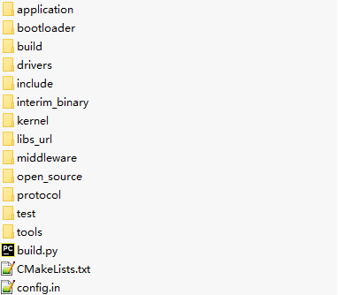

SDK根目录结构如[表1](#table13927142512394)所示。

**表 1**  SDK根目录

<table><thead align="left"><tr id="row15927132514396"><th class="cellrowborder" valign="top" width="27.38%" id="mcps1.2.3.1.1">
目录

</th>
<th class="cellrowborder" valign="top" width="72.61999999999999%" id="mcps1.2.3.1.2">
说明

</th>
</tr>
</thead>
<tbody><tr id="row292882517399"><td class="cellrowborder" valign="top" width="27.38%" headers="mcps1.2.3.1.1 ">
application

</td>
<td class="cellrowborder" valign="top" width="72.61999999999999%" headers="mcps1.2.3.1.2 ">
应用层代码（其中包含demo程序为参考示例）。

</td>
</tr>
<tr id="row9528141355717"><td class="cellrowborder" valign="top" width="27.38%" headers="mcps1.2.3.1.1 ">
bootloader

</td>
<td class="cellrowborder" valign="top" width="72.61999999999999%" headers="mcps1.2.3.1.2 ">
boot引导文件目录。

</td>
</tr>
<tr id="row19928225163913"><td class="cellrowborder" valign="top" width="27.38%" headers="mcps1.2.3.1.1 ">
build

</td>
<td class="cellrowborder" valign="top" width="72.61999999999999%" headers="mcps1.2.3.1.2 ">
SDK构建所需的脚本、配置文件。

</td>
</tr>
<tr id="row109286253399"><td class="cellrowborder" valign="top" width="27.38%" headers="mcps1.2.3.1.1 ">
drivers

</td>
<td class="cellrowborder" valign="top" width="72.61999999999999%" headers="mcps1.2.3.1.2 ">
驱动代码。

</td>
</tr>
<tr id="row15928132512396"><td class="cellrowborder" valign="top" width="27.38%" headers="mcps1.2.3.1.1 ">
include

</td>
<td class="cellrowborder" valign="top" width="72.61999999999999%" headers="mcps1.2.3.1.2 ">
API头文件存放目录。

</td>
</tr>
<tr id="row415218166102"><td class="cellrowborder" valign="top" width="27.38%" headers="mcps1.2.3.1.1 ">
interim_binary

</td>
<td class="cellrowborder" valign="top" width="72.61999999999999%" headers="mcps1.2.3.1.2 ">
库存放目录。

</td>
</tr>
<tr id="row75842056117"><td class="cellrowborder" valign="top" width="27.38%" headers="mcps1.2.3.1.1 ">
kernel

</td>
<td class="cellrowborder" valign="top" width="72.61999999999999%" headers="mcps1.2.3.1.2 ">
内核代码和OS接口适配层代码。

</td>
</tr>
<tr id="row66711609211"><td class="cellrowborder" valign="top" width="27.38%" headers="mcps1.2.3.1.1 ">
libs_url

</td>
<td class="cellrowborder" valign="top" width="72.61999999999999%" headers="mcps1.2.3.1.2 ">
二进制bin校对文件目录。

</td>
</tr>
<tr id="row152262035269"><td class="cellrowborder" valign="top" width="27.38%" headers="mcps1.2.3.1.1 ">
middleware

</td>
<td class="cellrowborder" valign="top" width="72.61999999999999%" headers="mcps1.2.3.1.2 ">
中间件代码。

</td>
</tr>
<tr id="row07472124410"><td class="cellrowborder" valign="top" width="27.38%" headers="mcps1.2.3.1.1 ">
open_source

</td>
<td class="cellrowborder" valign="top" width="72.61999999999999%" headers="mcps1.2.3.1.2 ">
开源代码。

</td>
</tr>
<tr id="row26011201747"><td class="cellrowborder" valign="top" width="27.38%" headers="mcps1.2.3.1.1 ">
protocol

</td>
<td class="cellrowborder" valign="top" width="72.61999999999999%" headers="mcps1.2.3.1.2 ">
WiFi、BT、Radar等组件代码。

</td>
</tr>
<tr id="row17392173512420"><td class="cellrowborder" valign="top" width="27.38%" headers="mcps1.2.3.1.1 ">
test

</td>
<td class="cellrowborder" valign="top" width="72.61999999999999%" headers="mcps1.2.3.1.2 ">
testsuite代码。

</td>
</tr>
<tr id="row17747172410413"><td class="cellrowborder" valign="top" width="27.38%" headers="mcps1.2.3.1.1 ">
tools

</td>
<td class="cellrowborder" valign="top" width="72.61999999999999%" headers="mcps1.2.3.1.2 ">
包含编译工具链（包括linux和windows）、镜像打包脚本、NV制作工具和签名脚本等。

</td>
</tr>
<tr id="row768611001510"><td class="cellrowborder" valign="top" width="27.38%" headers="mcps1.2.3.1.1 ">
output

</td>
<td class="cellrowborder" valign="top" width="72.61999999999999%" headers="mcps1.2.3.1.2 ">
编译时生成的目标文件与中间文件（包括库文件、打印log、生成的二进制文件等）。

</td>
</tr>
<tr id="row74261653608"><td class="cellrowborder" valign="top" width="27.38%" headers="mcps1.2.3.1.1 ">
build.py

</td>
<td class="cellrowborder" valign="top" width="72.61999999999999%" headers="mcps1.2.3.1.2 ">
编译入口脚本。

</td>
</tr>
<tr id="row1927612418117"><td class="cellrowborder" valign="top" width="27.38%" headers="mcps1.2.3.1.1 ">
CMakeLists.txt

</td>
<td class="cellrowborder" valign="top" width="72.61999999999999%" headers="mcps1.2.3.1.2 ">
Cmake工程顶层“CMakeLists.txt”文件。

</td>
</tr>
<tr id="row175646591908"><td class="cellrowborder" valign="top" width="27.38%" headers="mcps1.2.3.1.1 ">
config.in

</td>
<td class="cellrowborder" valign="top" width="72.61999999999999%" headers="mcps1.2.3.1.2 ">
Kconfig配置文件。

</td>
</tr>
</tbody>
</table>

## 编译（Cmake）

-   **[内核依赖配置](#ZH-CN_TOPIC_0000001987379681)**  

-   **[编译方法](#ZH-CN_TOPIC_0000001823993877)**  

-   **[Flash分区表配置](#ZH-CN_TOPIC_0000002079231697)**  

-   **[Menuconfig配置](#ZH-CN_TOPIC_0000001777234354)**  

-   **[UART配置方法](#ZH-CN_TOPIC_0000001949361268)**  

-   **[注意事项](#ZH-CN_TOPIC_0000001823993861)**  

### 内核依赖配置

SDK编译默认包含Syschannel Host驱动编译，编译SDK前，需要修改“/middleware/utils/syschannel/syschannel\_host/Makefile”指定正确的内核路径。

详细配置方法参考《WS53V100 Syschannel 使用指南》 的“Syschannel 组件编译”章节。

如果不需要编译Syschannel Host驱动，可以修改"build/config/target\_config/ws53/config.py"文件，删除或注释掉ram\_component中的"syschannel\_host\_ko"组件。

### 编译方法

根目录下执行“python3 build.py ws53\_liteos\_app”指令运行脚本编译ws53\_liteos\_app。编译命令列表如[表1](#table1646491114816)所示。

**表 1**  build.sh参数列表

<table><thead align="left"><tr id="row44654114810"><th class="cellrowborder" valign="top" width="12.76%" id="mcps1.2.4.1.1">
参数

</th>
<th class="cellrowborder" valign="top" width="37.480000000000004%" id="mcps1.2.4.1.2">
示例

</th>
<th class="cellrowborder" valign="top" width="49.76%" id="mcps1.2.4.1.3">
说明

</th>
</tr>
</thead>
<tbody><tr id="row746513144812"><td class="cellrowborder" valign="top" width="12.76%" headers="mcps1.2.4.1.1 ">
无

</td>
<td class="cellrowborder" valign="top" width="37.480000000000004%" headers="mcps1.2.4.1.2 ">
python3 build.py ws53_liteos_app

</td>
<td class="cellrowborder" valign="top" width="49.76%" headers="mcps1.2.4.1.3 ">
启动ws53_liteos_app目标的增量编译。

</td>
</tr>
<tr id="row04651218489"><td class="cellrowborder" valign="top" width="12.76%" headers="mcps1.2.4.1.1 ">
-c

</td>
<td class="cellrowborder" valign="top" width="37.480000000000004%" headers="mcps1.2.4.1.2 ">
python3 build.py -c ws53_liteos_app

</td>
<td class="cellrowborder" valign="top" width="49.76%" headers="mcps1.2.4.1.3 ">
启动ws53_liteos_app目标的全量编译。

</td>
</tr>
<tr id="row11696675533"><td class="cellrowborder" valign="top" width="12.76%" headers="mcps1.2.4.1.1 ">
menuconfig

</td>
<td class="cellrowborder" valign="top" width="37.480000000000004%" headers="mcps1.2.4.1.2 ">
python3 build.py  ws53_liteos_app menuconfig

</td>
<td class="cellrowborder" valign="top" width="49.76%" headers="mcps1.2.4.1.3 ">
启动ws53_liteos_app目标的menuconfig图形配置界面。

</td>
</tr>
</tbody>
</table>

编译得到的烧录全量镜像在“output/ws53/fwpkg/pack\_all\_core/ws53\_liteos\_app”目录下（如[表2](#table5535429403)所示）。

**表 2**  烧录镜像

<table><thead align="left"><tr id="row1353722184019"><th class="cellrowborder" valign="top" width="21.45%" id="mcps1.2.3.1.1">
文件名

</th>
<th class="cellrowborder" valign="top" width="78.55%" id="mcps1.2.3.1.2">
说明

</th>
</tr>
</thead>
<tbody><tr id="row75376234019"><td class="cellrowborder" valign="top" width="21.45%" headers="mcps1.2.3.1.1 ">
ws53_liteos_app_all_in_one.fwpkg

</td>
<td class="cellrowborder" valign="top" width="78.55%" headers="mcps1.2.3.1.2 ">
空片烧录时，需要烧录此文件。包含了所有的需要升级的内容。包含：loaderboot_sign.bin、root_params_sign.bin、flashboot_sign_a.bin、flashboot_sign_b.bin、application_sign.bin、control_ws53_sign.bin、ws53_all_nv.bin。

各文件介绍如下：

loaderboot_sign.bin：loaderboot的镜像文件。升级开始时，芯片中固化的romboot会接收此镜像文件，加载到内存并运行，loadboot负责接收后续的镜像文件。注：此镜像只在升级阶段放在RAM中运行，并不存放在flash中。

root_params_sign.bin：flash分区信息的镜像文件。分区信息供romboot、loaderboot和flashboot使用。

flashboot_sign_a.bin：flashboot的镜像文件。

flashboot_sing_b.bin： flashboot的备份镜像文件。

application_sign.bin：版本镜像文件。

control_ws53_sign.bin：c核镜像文件。

ws53_all_nv.bin：参数区的镜像文件。

</td>
</tr>
<tr id="row15537132114020"><td class="cellrowborder" valign="top" width="21.45%" headers="mcps1.2.3.1.1 ">
ws53_liteos_app_load_only.fwpkg

</td>
<td class="cellrowborder" valign="top" width="78.55%" headers="mcps1.2.3.1.2 ">
版本升级打包文件，包含：loaderboot_sign.bin和application_sign.bin。不包含flashboot相关内容。

当芯片烧录过“ws53_liteos_app_all_in_one.fwpkg”镜像后，如果后续修改不涉及root_params、flash_boot、nv的修改，则可以用此文件升级。

</td>
</tr>
</tbody>
</table>

> **说明：** 
>注：编译得到的中间文件在“output/ws53/acore/ws53\_liteos\_app”目录下。

### Flash分区表配置

分区表配置文件路径：sdk\\build\\config\\target\_config\\ws53\\param\_sector\\param\_sector.json

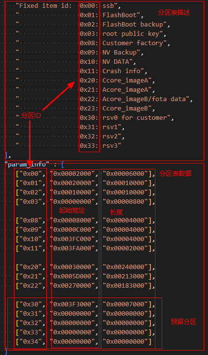

> **说明：** 
>上图内容仅作文件内容说明，具体分区信息请参考《WS53V100 FOTA 开发指南》“升级包保存”章节的“注意事项”中分区信息。
>分区表ID限制16个分区数量，默认Flash共4M大小，预留5个分区ID，可通过uapi\_partition\_get\_info接口传入分区ID获取对应地址和长度。

根据当前Flash分区方案，Flash划分情况如下图：

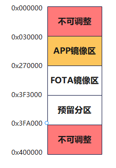

调整分区时，需要遵守以下原则：

1.  地址段0x000000\~0x030000为不可调整区，**任何改动都可能会导致无法启动而变砖。**
2.  地址段0x030000\~0x270000为APP镜像区，地址段信息来源于分区表中ID为0x20对应的APP镜像区，**该地址段仅支持调整分区大小，分区首地址不支持调整**，调整分区首地址同样会导致无法启动。
3.  地址段0x270000\~0x3F3000为FOTA镜像区，地址段信息来源于分区表中ID为0x22对应的压缩分区/OTA升级分区/产测镜像分区/B面分区，**该分区首地址必须为APP镜像区的结束地址**；**使用压缩升级方案时，该分区大小至少配置为APP镜像区大小的0.7倍及以上**。
4.  地址段0x3F3000\~0x3FA000为预留分区，该分区首地址为FOTA镜像区的结束地址，支持划分为5个不同分区ID的单独分区。
5.  地址段0x3FA000\~0x400000为其他功能区，包括死机信息\(0x11\)以及NV分区\(0x10\)，**该分区不支持调整**。
6.  调整分区时，除不可调整区以外，其他分区的首地址以及大小均要4K对齐。

调整分区示例：

根据分区表中分区信息，想要调整分区ID为0x30的预留分区的大小。

1.  假设在APP镜像分区有8K的空间余量，则调整APP镜像区的大小，0x20以及0x21分区大小同步减少8K，同步修改文件drivers/boards/ws53/memory\_config/include/memory\_config\_common.h，将文件中宏APP\_PROGRAM\_LENGTH的值\(默认为'\(0x213000 - CODE\_INFO\_OFFSET\)'\)修改为调整后分区大小\(如'\(0x211000 - CODE\_INFO\_OFFSET\)'\)。
2.  FOTA分区受APP镜像区的影响，首地址前移8K，调整为0x26E000，压缩升级方案中FOTA分区大小需同步调整，4K对齐后为减少4K，最终FOTA分区结束地址为0x3F0000。
3.  APP镜像分区以及FOTA分区总计调整出12K的余量，可合并到预留分区中，预留分区首地址前移12K，为0x3F0000，同时大小增加12K，结束地址保持为0x3FA000。

### Menuconfig配置

运行“python3 build.py -c ws53\_liteos\_app menuconfig”脚本会启动Menuconfig程序，用户可通过Menuconfig对编译和系统功能进行配置，如[图1](#fig155343385597)所示。

SDK集成了默认配置，但建议用户首次运行时进行相应配置，从而减少因为配置原因引起的问题。用户随时可以运行“python3 build.py -c ws53\_liteos\_app menuconfig”更改配置。

**图 1**  Menuconfig运行界面  

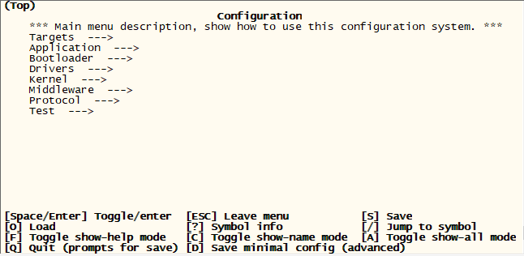

注：界面如存在差异，以实际版本为准。

Menuconfig操作说明如[表1](#table364152210248)所示，在Menuconfig界面中可输入快捷键进行配置。

**表 1**  Menuconfig常用操作命令

<table><thead align="left"><tr id="row2642122213247"><th class="cellrowborder" valign="top" width="17%" id="mcps1.2.3.1.1">
快捷键

</th>
<th class="cellrowborder" valign="top" width="83%" id="mcps1.2.3.1.2">
说明

</th>
</tr>
</thead>
<tbody><tr id="row146421622162417"><td class="cellrowborder" valign="top" width="17%" headers="mcps1.2.3.1.1 ">
空格、回车

</td>
<td class="cellrowborder" valign="top" width="83%" headers="mcps1.2.3.1.2 ">
选中，反选。

</td>
</tr>
<tr id="row0235155732813"><td class="cellrowborder" valign="top" width="17%" headers="mcps1.2.3.1.1 ">
ESC

</td>
<td class="cellrowborder" valign="top" width="83%" headers="mcps1.2.3.1.2 ">
返回上级菜单，退出界面。

</td>
</tr>
<tr id="row1425985152914"><td class="cellrowborder" valign="top" width="17%" headers="mcps1.2.3.1.1 ">
Q

</td>
<td class="cellrowborder" valign="top" width="83%" headers="mcps1.2.3.1.2 ">
退出界面。

</td>
</tr>
<tr id="row161871942143019"><td class="cellrowborder" valign="top" width="17%" headers="mcps1.2.3.1.1 ">
S

</td>
<td class="cellrowborder" valign="top" width="83%" headers="mcps1.2.3.1.2 ">
保存配置。

</td>
</tr>
<tr id="row1661115053113"><td class="cellrowborder" valign="top" width="17%" headers="mcps1.2.3.1.1 ">
F

</td>
<td class="cellrowborder" valign="top" width="83%" headers="mcps1.2.3.1.2 ">
显示帮助菜单。

</td>
</tr>
</tbody>
</table>

所有命令可在Menuconfig界面的下方查看Menuconfig官方说明解释，如[图2](#fig14504171214012)所示。

**图 2**  Menuconfig命令帮助栏  

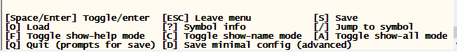

**表 2**  常用Menuconfig配置

<table><thead align="left"><tr id="row16821213352"><th class="cellrowborder" valign="top" width="33.33333333333333%" id="mcps1.2.4.1.1">
配置项

</th>
<th class="cellrowborder" valign="top" width="33.33333333333333%" id="mcps1.2.4.1.2">
menuconfig路径

</th>
<th class="cellrowborder" valign="top" width="33.33333333333333%" id="mcps1.2.4.1.3">
描述

</th>
</tr>
</thead>
<tbody><tr id="row98215132054"><td class="cellrowborder" valign="top" width="33.33333333333333%" headers="mcps1.2.4.1.1 ">
ccpriv at debug command

</td>
<td class="cellrowborder" valign="top" width="33.33333333333333%" headers="mcps1.2.4.1.2 ">
Middleware → Utils → AT→ Config AT→ccpriv at debug command

</td>
<td class="cellrowborder" valign="top" width="33.33333333333333%" headers="mcps1.2.4.1.3 ">
打开WiFi模块的调试命令开关

</td>
</tr>
<tr id="row15703124135819"><td class="cellrowborder" valign="top" width="33.33333333333333%" headers="mcps1.2.4.1.1 ">
Support bluetooth/sparklink host save smp keys

</td>
<td class="cellrowborder" valign="top" width="33.33333333333333%" headers="mcps1.2.4.1.2 ">
Protocol → bt_host → Support bluetooth → sparklink host save smp keys

</td>
<td class="cellrowborder" valign="top" width="33.33333333333333%" headers="mcps1.2.4.1.3 ">
打开星闪/蓝牙模块的密钥持久化能力（需要同时打开Middleware → Chips → Chip Configurations for ws53 → NV）

</td>
</tr>
</tbody>
</table>

### UART配置方法

WS53总共有3个UART，SDK默认配置如下。

<table><thead align="left"><tr id="row12271050193018"><th class="cellrowborder" valign="top" width="19.06%" id="mcps1.1.5.1.1">
UART序号

</th>
<th class="cellrowborder" valign="top" width="22.52%" id="mcps1.1.5.1.2">
波特率

</th>
<th class="cellrowborder" valign="top" width="31.269999999999996%" id="mcps1.1.5.1.3">
默认配置

</th>
<th class="cellrowborder" valign="top" width="27.150000000000002%" id="mcps1.1.5.1.4">
用途

</th>
</tr>
</thead>
<tbody><tr id="row8279503302"><td class="cellrowborder" valign="top" width="19.06%" headers="mcps1.1.5.1.1 ">
0 H1

</td>
<td class="cellrowborder" valign="top" width="22.52%" headers="mcps1.1.5.1.2 ">
115200

</td>
<td class="cellrowborder" valign="top" width="31.269999999999996%" headers="mcps1.1.5.1.3 ">
空闲不使用

</td>
<td class="cellrowborder" valign="top" width="27.150000000000002%" headers="mcps1.1.5.1.4 ">
支持DEBUG、AT、HSO

</td>
</tr>
<tr id="row182785073016"><td class="cellrowborder" valign="top" width="19.06%" headers="mcps1.1.5.1.1 ">
1 H0

</td>
<td class="cellrowborder" valign="top" width="22.52%" headers="mcps1.1.5.1.2 ">
921600

</td>
<td class="cellrowborder" valign="top" width="31.269999999999996%" headers="mcps1.1.5.1.3 ">
HSO（连接HSO工具用于WiFi日志抓取）

</td>
<td class="cellrowborder" valign="top" width="27.150000000000002%" headers="mcps1.1.5.1.4 ">
支持HSO、DEBUG

</td>
</tr>
<tr id="row1327155093018"><td class="cellrowborder" valign="top" width="19.06%" headers="mcps1.1.5.1.1 ">
2 L0

</td>
<td class="cellrowborder" valign="top" width="22.52%" headers="mcps1.1.5.1.2 ">
115200

</td>
<td class="cellrowborder" valign="top" width="31.269999999999996%" headers="mcps1.1.5.1.3 ">
烧录、DEBUG、AT

</td>
<td class="cellrowborder" valign="top" width="27.150000000000002%" headers="mcps1.1.5.1.4 ">
支持烧录、DEBUG、AT、HSO

</td>
</tr>
</tbody>
</table>

-   烧录功能，固定用UART-L0，不可更改。

-   HSO串口默认是UART-H0, 可以配置为UART-L0或UART-H1，波特率可以通过menuconfig进行定制，默认使用921600，支持关闭。

    menuconfig的配置路径为Drivers-\>Chips-\>Chip Configurations for ws53。

    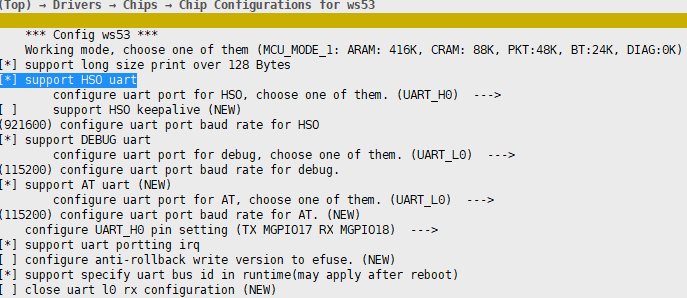

-   AT串口默认是UART-L0，可通过menuconfig配置串口号（可选UART-L0、UART-H1）和波特率，默认使用UART-L0，波特率默认为115200，支持关闭。 menuconfig的配置路径为Drivers-\>Chips-\>Chip Configurations for ws53。

    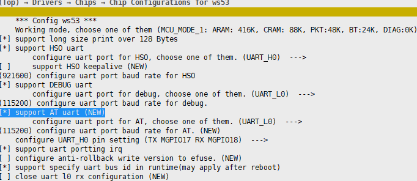

-   DEBUG串口可通过menuconfig配置串口号（可选UART-L0、UART-H1、UART-H0）和波特率，默认使用UART-L0，波特率默认为115200，支持关闭。

    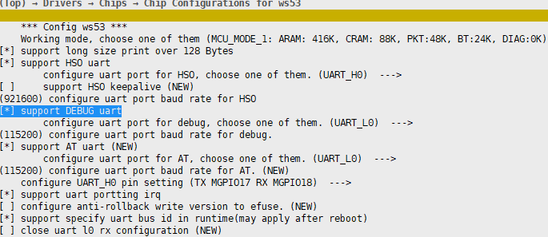

-   支持UART-L0 RX管脚复用为普通GPIO，仅保留TX功能。可通过打开CONFIG\_UART\_L0\_NOT\_SUPPORT\_RX实现，默认未打开，menuconfig配置方法如下。

    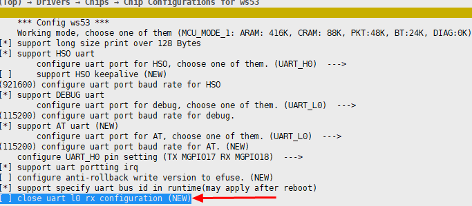

-   支持AT、DEBUG串口功能合一到HSO口上，可以用HSO工具完成AT命令及回显、DEBUG日志、HSO日志功能。需要先打开**CONFIG\_AT\_SUPPORT\_ZDIAG**宏，再通过menuconfig配置HSO/AT/DEBUG为同一串口，波特率一致，可以选择是否打开HSO心跳功能。以下是将AT、DEBUG功能都合一到HSO上，并使用L0作为串口的配置示例如下。
    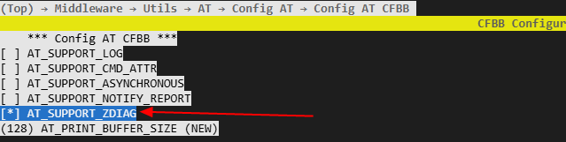

    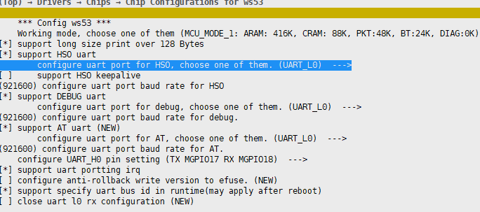

    -   AT、DEBUG串口功能合到HSO口，使用时需要注意以下事项：
        1.  连接HSO工具前要配置关闭低功耗。
        2.  想要退出HSO工具连接，切换普通串口连接，需要在HSO工具主动发起断连，确保已退出HSO连接。
        3.  不支持串口合一到H0，深睡时H0不支持唤醒，会导致AT无法使用。
        4.  合一时HSO、AT、DEBUG波特率建议都配置为921600及以上。
        5.  HSO工具的版本号，需要选择3.0.120版本及以上。

-   串口管脚复用配置：

    1.  debug串口方案上A/C核共用串口，debug串口管脚跟随选择的串口选择对应管脚。如果选择UART L0，串口管脚采用AGPIO1和AGPIO2; 如果选择UART H1，串口管脚TX采用MGPIO12，RX采用AGPIO4。为了串口输入能唤醒系统，RX管脚都会采用AGPIO。
    2.  AT口/HSO口，可以选择与debug口复用串口，此时管脚与debug口一致。如果选择其他串口，可以更改管脚配置。配置代码位于文件uart\_porting.c，参考函数uart\_port\_config\_pinmux, 该函数配置了对应串口管脚的模式和上拉。硬件管脚如果与默认配置不一样，需要修改函数中对应管脚定义的宏。
    3.  对于AT命令 UART RX管脚，建议选择AGPIO管脚，否则AT命令本身无法唤醒系统，需要由其它管脚唤醒或者关闭低功耗模式才能输入串口。
    4.  UART RX管脚配置下拉可能导致误触发串口中断，建议针对该管脚在低功耗初始化函数uapi\_pm\_lpc\_init调用pm\_port\_skip\_pull\_down配置跳过睡眠流程下拉处理。

> **须知：** 
>1.  UART波特率建议配置典型值，如115200/921600/1M等，考虑到兼容性，不建议配置不常用的特殊值，比如115623此类波特率值。
>2.  修改UART序号请慎重，必须要与板级硬件工程师确认uart硬件连接，确保软件配置与硬件板级的实际电路连接匹配，否则无法正常工作。

### 注意事项

-   如果执行“./build.py”提示无权限，可执行命令“chmod +x build.py”添加执行权限或执行“python3 ./build.py”。
-   编译过程中，报错找不到某个包，请检查环境中的python是否已经安装了相应组件。如果构建环境中包含多个python，特别是多个同版本的python，而用户无法辨认正在使用的是其中的哪个版本，此情况下，在安装python组件包时，推荐使用组件包源码进行安装。
-   系统优先使用用户通过Menuconfig所做的配置，如果用户未配置，系统将使用默认配置进行编译。

# 新建APP

-   **[建立源码目录](#ZH-CN_TOPIC_0000001823993869)**  

-   **[开发代码](#ZH-CN_TOPIC_0000001823873917)**  

-   **[镜像烧录](#ZH-CN_TOPIC_0000001777234342)**  

## 建立源码目录

> **说明：** 
>用户可在“application/ws53”同级目录下参考“ws53\_application”目录建立app，以下均以建立“my\_demo”为例。

步骤如下：

1.  新建“application/ws53/my\_demo”目录，用来存放“my\_demo”的源文件。
2.  复制“application/ws53/ws53\_application/CMakeLists.txt”到“application/ws53/my\_demo/CmakeLists.txt”，并将源文件放在“application/ws53/my\_demo”目录下。
3.  修改“application/ws53/my\_demo/CmakeLists.txt”文件。其中各个变量的含义如[表1](#table89969106362)所示。

    **表 1**  组件的CmakeLists.txt中的变量含义

    
    <table><thead align="left"><tr id="row69971710143612"><th class="cellrowborder" valign="top" width="27.900000000000002%" id="mcps1.2.3.1.1">
变量名称

    </th>
    <th class="cellrowborder" valign="top" width="72.1%" id="mcps1.2.3.1.2">
变量含义

    </th>
    </tr>
    </thead>
    <tbody><tr id="row77088920486"><td class="cellrowborder" valign="top" width="27.900000000000002%" headers="mcps1.2.3.1.1 ">
COMPONENT_NAME

    </td>
    <td class="cellrowborder" valign="top" width="72.1%" headers="mcps1.2.3.1.2 ">
当前组件名称，如“my_demo”。

    </td>
    </tr>
    <tr id="row99971710133619"><td class="cellrowborder" valign="top" width="27.900000000000002%" headers="mcps1.2.3.1.1 ">
SOURCES

    </td>
    <td class="cellrowborder" valign="top" width="72.1%" headers="mcps1.2.3.1.2 ">
当前组件的C文件列表，其中CMAKE_CURRENT_SOURCE_DIR变量标识当前CMakeLists.txt所在的路径。

    </td>
    </tr>
    <tr id="row5997910163618"><td class="cellrowborder" valign="top" width="27.900000000000002%" headers="mcps1.2.3.1.1 ">
PUBLIC_HEADER

    </td>
    <td class="cellrowborder" valign="top" width="72.1%" headers="mcps1.2.3.1.2 ">
当前组件需要对外提供的头文件的路径。

    </td>
    </tr>
    <tr id="row1199791011363"><td class="cellrowborder" valign="top" width="27.900000000000002%" headers="mcps1.2.3.1.1 ">
PRIVATE_HEADER

    </td>
    <td class="cellrowborder" valign="top" width="72.1%" headers="mcps1.2.3.1.2 ">
当前组件内部的头文件搜索路径。

    </td>
    </tr>
    <tr id="row99971610193616"><td class="cellrowborder" valign="top" width="27.900000000000002%" headers="mcps1.2.3.1.1 ">
PRIVATE_DEFINES

    </td>
    <td class="cellrowborder" valign="top" width="72.1%" headers="mcps1.2.3.1.2 ">
当前组件内部生效的宏定义。

    </td>
    </tr>
    <tr id="row12997210203618"><td class="cellrowborder" valign="top" width="27.900000000000002%" headers="mcps1.2.3.1.1 ">
PUBLIC_DEFINES

    </td>
    <td class="cellrowborder" valign="top" width="72.1%" headers="mcps1.2.3.1.2 ">
当前组件需要对外提供的宏定义。

    </td>
    </tr>
    <tr id="row12716914103914"><td class="cellrowborder" valign="top" width="27.900000000000002%" headers="mcps1.2.3.1.1 ">
COMPONENT_PUBLIC_CCFLAGS

    </td>
    <td class="cellrowborder" valign="top" width="72.1%" headers="mcps1.2.3.1.2 ">
当前组件需要对外提供的编译选项。

    </td>
    </tr>
    <tr id="row22992182396"><td class="cellrowborder" valign="top" width="27.900000000000002%" headers="mcps1.2.3.1.1 ">
COMPONENT_CCFLAGS

    </td>
    <td class="cellrowborder" valign="top" width="72.1%" headers="mcps1.2.3.1.2 ">
当前组件内部生效的编译选项。

    </td>
    </tr>
    </tbody>
    </table>

4.  修改“application/ws53/CMakeLists.txt”，将my\_demo目录加入编译。
5.  修改“build/config/target\_config/ws53/config.py”，在ram\_component字段中加入‘my\_demo’，向编译系统中注册my\_demo组件。

## 开发代码

目录结构建立完成后开始启动开发代码（用户可参考“application/samples”进行移植），代码开发完成后即可使用“python3 build.py -c ws53\_liteos\_app -component=my\_demo”编译my\_demo进行代码编译调试。

## 镜像烧录

镜像烧录方法，请参见《WS53V100 BurnTool工具 使用指南》中“操作指南”章节。

