# 快速开始

本文档介绍如何快速完成 WS53 系列开发板的工程创建、编译、烧录和运行验证。

## 第一个程序：Hello World

本节默认当前用户已完成环境搭建，将引导用户从创建工程开始，完成编译、烧录，最终在串口输出 "hello world"。

> 安装 IDE（Integrated Development Environment，集成开发环境）、插件、配置工具链和获取 SDK 等准备工作，请参考[环境搭建](environment-setup.md)。


### 新建工程 {#新建工程}

1. 打开 HiSpark Studio 插件，进入“欢迎使用”页面，然后单击“新建工程”。

    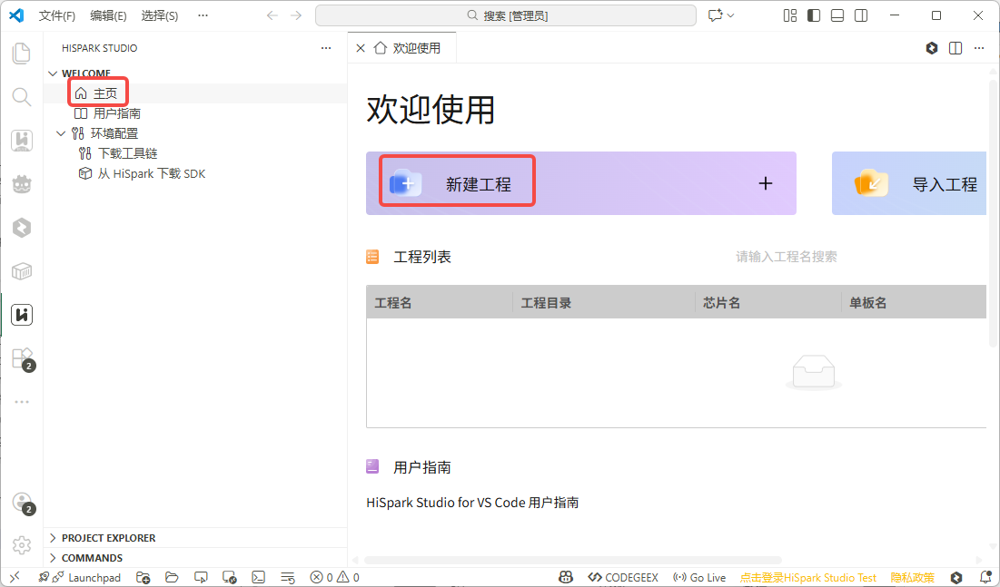

2. 在“新建工程”窗口配置参数：

    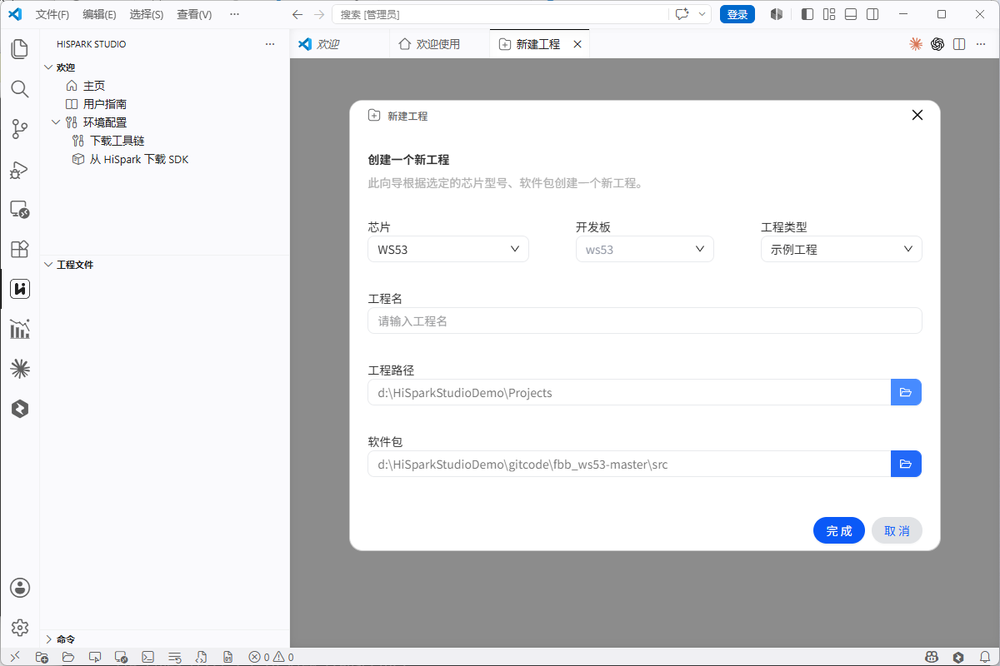

    - **芯片**：选择 `WS53`
    - **开发板**：选择芯片后会自动填充芯片的开发板名称
    - **工程类型**：选择“示例工程”
    - **工程名**：自定义工程名称（如 `HelloWorld`）
    - **工程路径**：选择工程存放目录
    - **软件包**：选择已下载 WS53 SDK 的 `src` 目录

3. 单击“完成”创建工程。
4. 如弹出“是否信任此文件夹中的文件的作者”确认窗口，单击“是，我信任此作者”。

### 编译工程

1. 工程创建成功后，HiSpark Studio 会自动打开新工程。再次单击 HiSpark Studio 图标进入插件页面。

    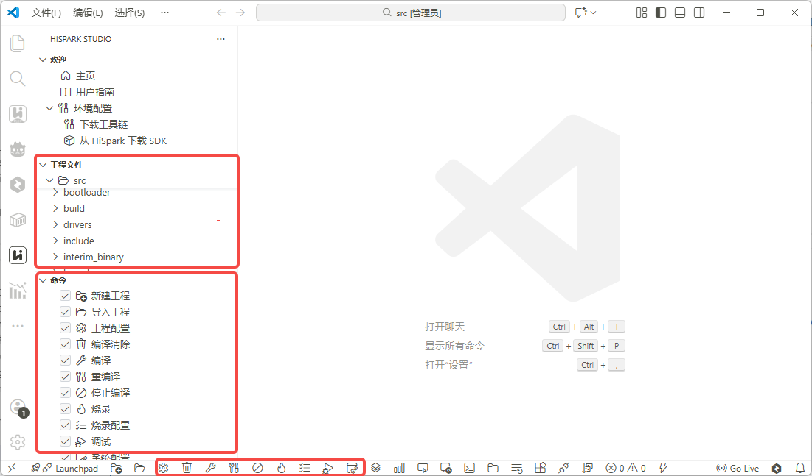

    - **工程文件**：包含 `src` 目录下的所有文件，以及 `include` 目录下的头文件。
    - **命令**：包含编译、调试、烧录等操作按钮。
    - **底部快捷按钮**：与“命令”面板中的按钮对应。

2. 单击“命令”面板中的“系统配置”，在配置窗口中依次选择 `Application` → `Enable Sample` → `Enable the Sample of peripheral` → `Support hello world Sample`。

    如果 `Enable the Sample of BT` 或其他示例已经启用，请先将其关闭，避免多个示例同时编译和运行。单击 `Save` 后，确认窗口底部显示的保存路径以 `build/config/target_config/ws53/menuconfig/acore/ws53_liteos_app.config` 结尾，然后关闭配置窗口。

    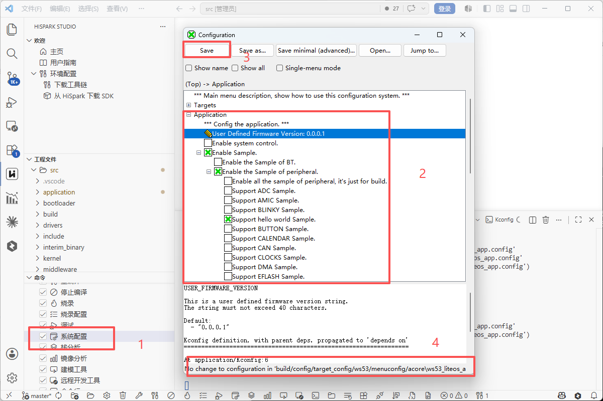

3. 单击左侧“命令”面板中的“编译”；如需先清理已有产物，可选择“重编译”。终端窗口输出 `SUCCESS` 表示编译成功。

    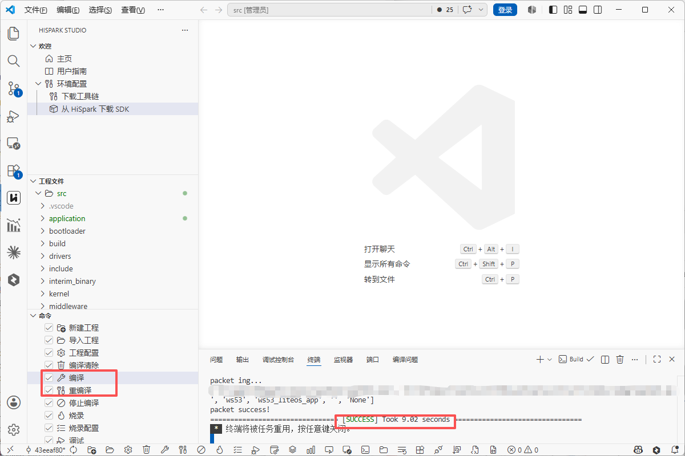


### 硬件连接

1. 使用快捷键 `Win + X` 打开菜单，然后选择“设备管理器”。

    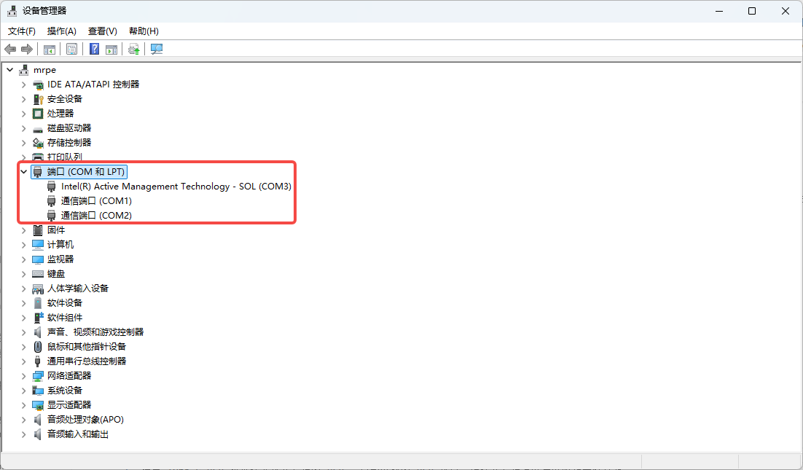

2. 使用 Type-C USB（Universal Serial Bus，通用串行总线）数据线连接开发板与电脑，确认开发板上电且电源指示灯亮起。
3. 查看设备管理器中新出现的串口，通常显示为 CH340 设备。记录实际端口号，后续烧录和监视均使用该端口。

    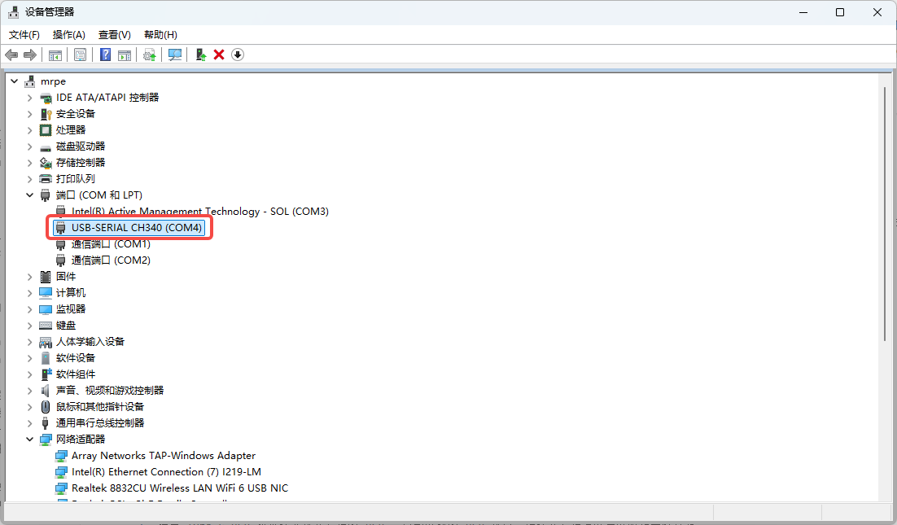

### 配置烧录

1. 单击左侧“命令”面板中的“工程配置”，在配置窗口中选择“程序加载”。

    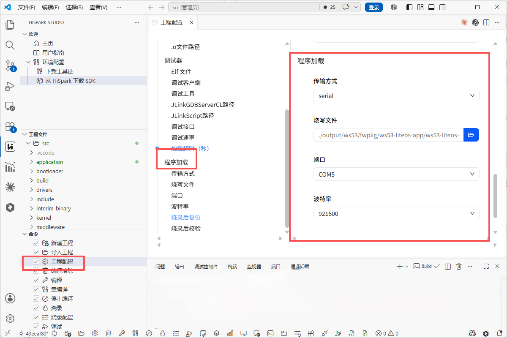

2. 配置烧录参数：

    - **传输方式**：选择 `serial`（串口烧录）
    - **烧写文件**：使用当前工程目录下的 `output\ws53\fwpkg\pack_all_core\ws53_liteos_app\ws53_liteos_app_all_in_one.fwpkg`
    - **端口选择**：选择硬件连接步骤中记录的实际 COM 口
    - **波特率**：选择 `921600`

### 开始烧录

1. 单击左侧“命令”面板中的“烧录”。当控制台显示 `Connect the device by pressing the reset button...` 或类似复位提示时，按下开发板上的 `RST` 按钮。

    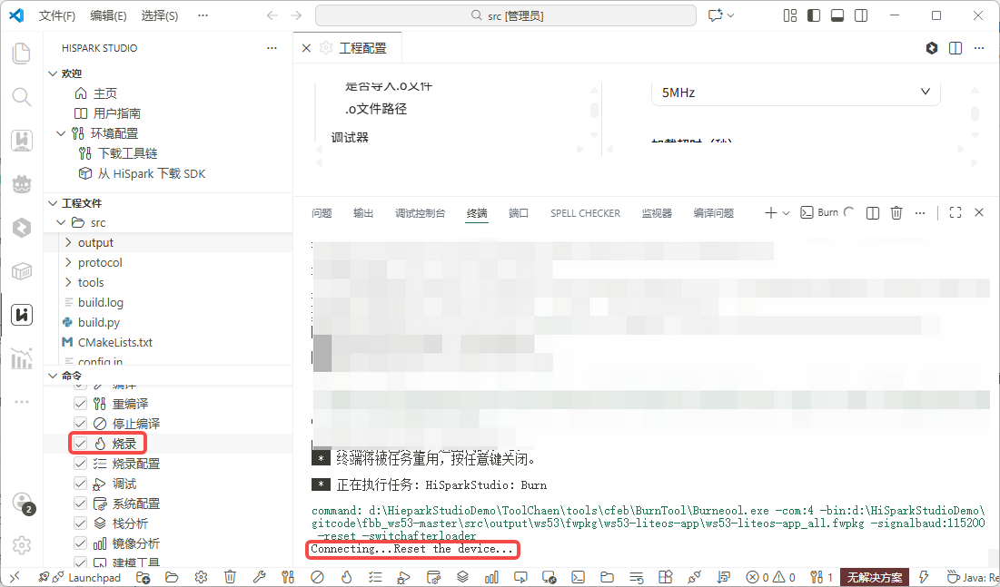

    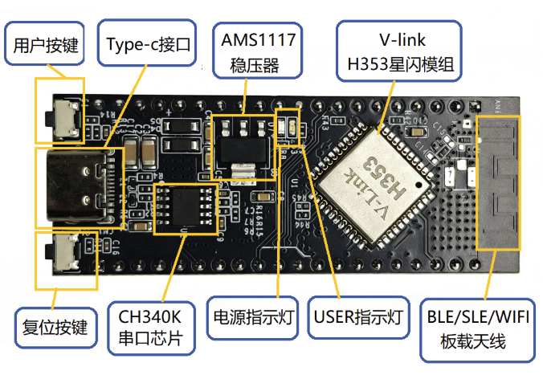

2. 等待烧录完成。控制台显示 `All images burnt successfully` 表示烧录成功。

    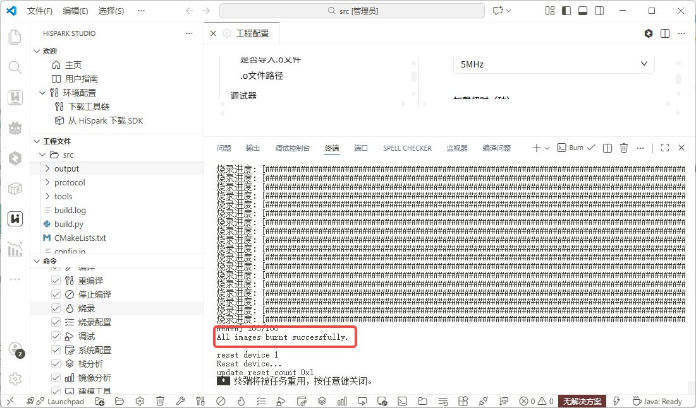

### 验证结果

1. 单击左侧“命令”面板中的“命令行”打开终端窗口，然后选择“监视器”。监视模式选择 `Serial`，端口选择烧录时使用的 COM 口，波特率设置为 `115200`，再单击“开始监视”。

    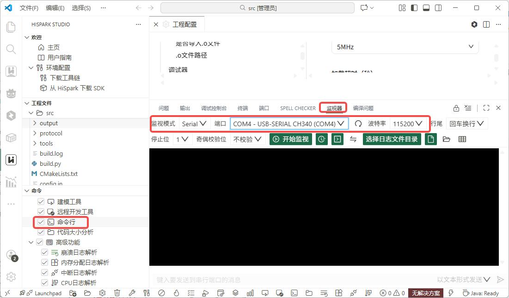

2. 串口输出如下图示：

    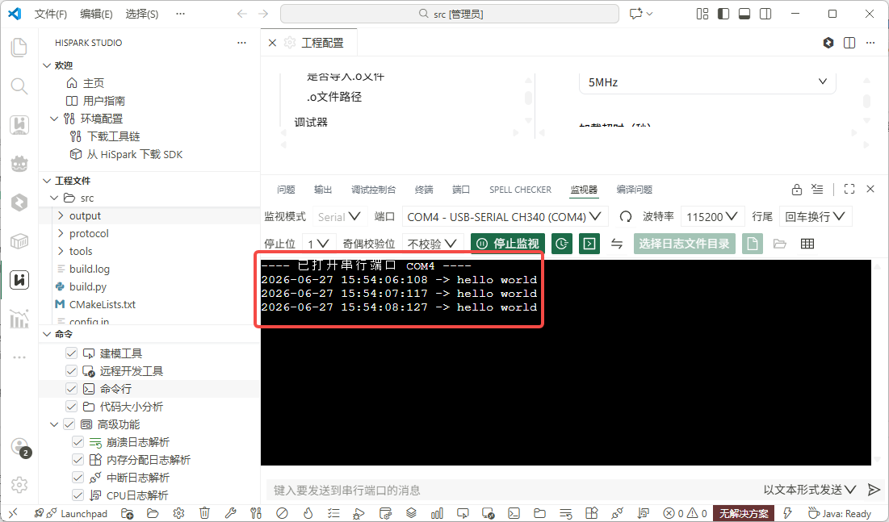

每秒输出一行 `hello world`，表示程序运行成功！

### Sample 代码说明

本示例使用的源码位于 `src/application/samples/peripheral/helloworld/helloworld.c`，核心代码如下：

```c
#define DEFAULT_TASK_STACK_SIZE         0x1000
#define DEFAULT_TASK_PRIORITY           26
#define DELAYS_MS                       1000

static void *hw_task(const char *arg)
{
    unused(arg);
    osal_printk("start helloworld sample\r\n");
    for (;;) {
        osal_printk("hello world\r\n");
        osal_msleep(DELAYS_MS);
    }
    return NULL;
}

static void helloworld_entry(void)
{
    osal_task *task_handle = NULL;
    osal_kthread_lock();
    task_handle = osal_kthread_create((osal_kthread_handler)hw_task, NULL,
                                       "HW_Task", DEFAULT_TASK_STACK_SIZE);
    if (task_handle != NULL) {
        osal_kthread_set_priority(task_handle, DEFAULT_TASK_PRIORITY);
    }
    osal_kthread_unlock();
}

/* Run the helloworld_entry. */
app_run(helloworld_entry);
```

**代码解析：**

| 函数/宏                  | 说明                       |
| --------------------- | ------------------------ |
| `helloworld_entry`    | 程序入口，创建内核线程              |
| `osal_kthread_create` | 创建内核线程，执行 `hw_task`      |
| `hw_task`             | 任务主函数，循环打印 "hello world" |
| `osal_msleep(1000)`   | 每次打印后休眠 1000ms（1秒）       |
| `app_run`             | 注册程序入口，系统启动时自动调用         |


---

> 更多案例请参考[参考案例](../samples/index.md)
