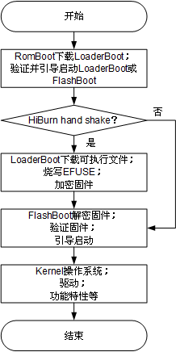
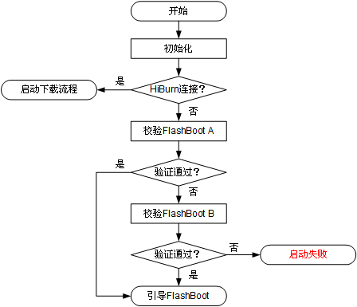
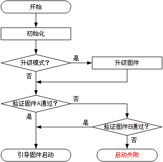

**概述**

本文档描述了WS53V100 RomBoot、LoaderBoot及FlashBoot工作流程，用户可参考此文档对FlashBoot进行二次开发。

# Boot简介

WS53V100 Boot分为三部分：RomBoot、FlashBoot、LoaderBoot。

-   RomBoot功能包括：
    -   加载LoaderBoot到RAM，进一步利用LoaderBoot下载镜像到Flash，烧写EFUSE等。
    -   校验并引导FlashBoot。FlashBoot分为AB面，A面校验成功直接启动，校验失败校验B面，B面校验成功，则从B面启动，否则复位重启。

-   FlashBoot功能包括：
    -   升级固件。
    -   校验并引导固件。

-   LoaderBoot功能包括：
    -   下载镜像到Flash。
    -   烧写EFUSE（例如：安全启动/Flash加密相关密钥等）。

**图 1**  Boot启动流程  

# RomBoot功能说明

-   **[下载镜像及烧写EFUSE](#ZH-CN_TOPIC_0000001934865157)**  

-   **[检验及引导FlashBoot](#ZH-CN_TOPIC_0000001891945430)**  

## 下载镜像及烧写EFUSE

RomBoot通过加载LoaderBoot实现下载镜像到Flash及烧写EFUSE的功能，具体操作请参见 [BurnTool](../../../tools/BurnToolUserGuide/BurnToolUserGuide.md)。

## 检验及引导FlashBoot

校验并引导FlashBoot流程如[图1](#fig1578634595518)所示。

**图 1**  校验并引导FlashBoot流程图  

# LoaderBoot功能说明

LoaderBoot是直接与BurnTool进行交互的组件，RomBoot无法直接实现烧写的功能，需要将LoaderBoot加载到RAM后，跳转到LoaderBoot，进一步通过LoaderBoot完成相关内容的烧写，LoaderBoot可烧写的内容包括：

-   FlashBoot
-   EFUSE参数配置文件
-   固件镜像（包括NV参数）
-   产测镜像

> **说明：** 
>LoaderBoot一般不涉及二次开发。

# FlashBoot说明

-   **[FlashBoot启动流程](#ZH-CN_TOPIC_0000001934865161)**  

## FlashBoot启动流程

校验并引导固件流程如[图1](#fig921910011115)所示。

**图 1**  校验并引导固件流程图  

