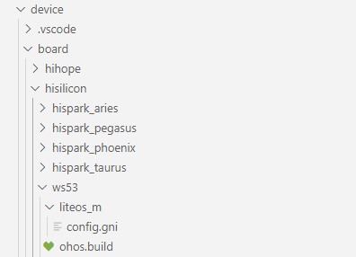
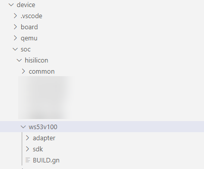
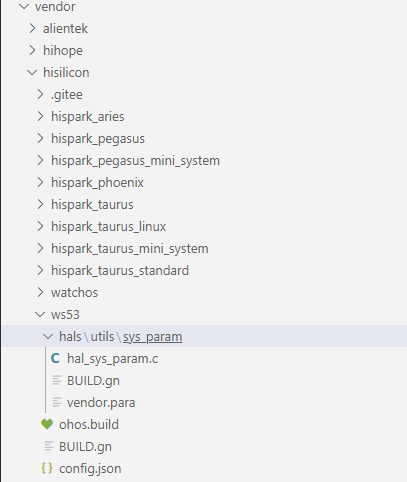
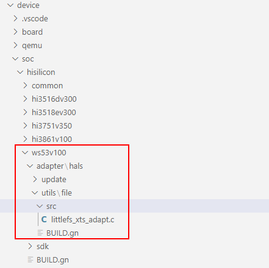
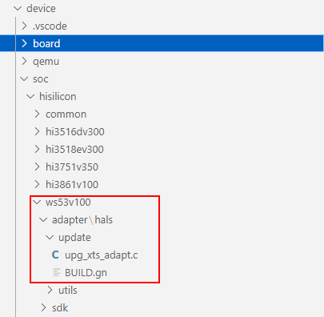
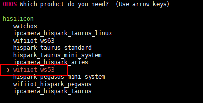
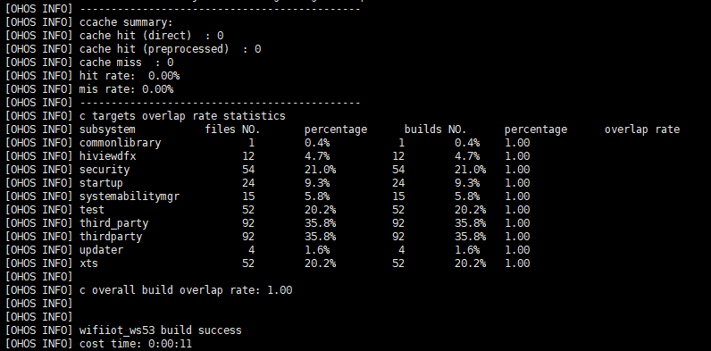
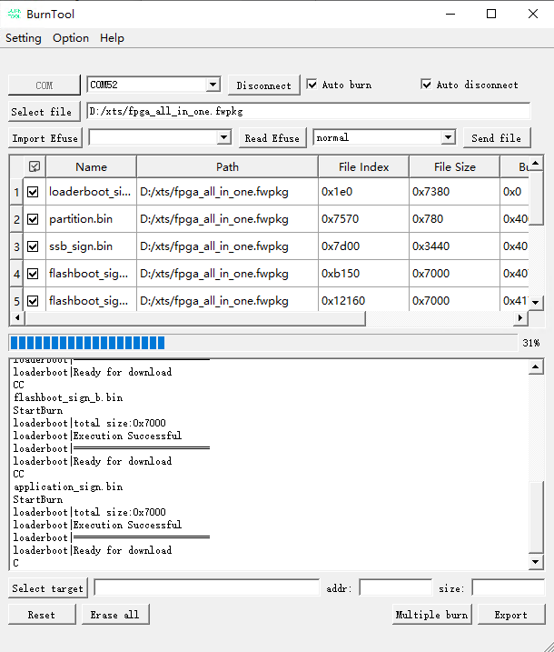
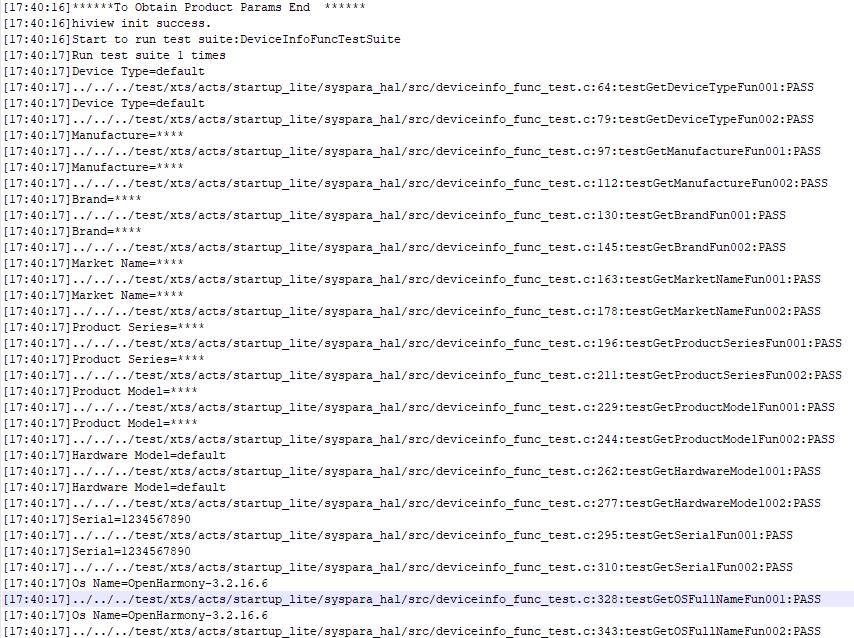

**概述<a name="section213mcpsimp"></a>**

本文档详细描述WS53V100 SDK适配openharmony XTS认证操作指导。

# 概述<a name="ZH-CN_TOPIC_0000001999714917"></a>

openharmony XTS认证具体描述与要求，请参考[openharmony官网XTS](https://www.openharmony.cn/certification/document/guid)信息。

WS53属于轻量级系统，只需要关注轻量级系统的测试项，当前最新自检表为《OpenHarmony设备兼容性规范3.2自检表\_轻量系统.xlsx》，筛选出如下测试套：

<a name="table295mcpsimp"></a>
<table><thead align="left"><tr id="row308mcpsimp"><th class="cellrowborder" valign="top" width="7.000000000000001%" id="mcps1.1.11.1.1"><p id="p310mcpsimp"><a name="p310mcpsimp"></a><a name="p310mcpsimp"></a>中文名称*</p>
</th>
<th class="cellrowborder" valign="top" width="7.000000000000001%" id="mcps1.1.11.1.2"><p id="p312mcpsimp"><a name="p312mcpsimp"></a><a name="p312mcpsimp"></a>英文名称*</p>
</th>
<th class="cellrowborder" valign="top" width="7.000000000000001%" id="mcps1.1.11.1.3"><p id="p314mcpsimp"><a name="p314mcpsimp"></a><a name="p314mcpsimp"></a>子系统</p>
</th>
<th class="cellrowborder" valign="top" width="6%" id="mcps1.1.11.1.4"><p id="p316mcpsimp"><a name="p316mcpsimp"></a><a name="p316mcpsimp"></a>归属</p>
</th>
<th class="cellrowborder" valign="top" width="7.000000000000001%" id="mcps1.1.11.1.5"><p id="p318mcpsimp"><a name="p318mcpsimp"></a><a name="p318mcpsimp"></a>适配系统类型</p>
</th>
<th class="cellrowborder" valign="top" width="20%" id="mcps1.1.11.1.6"><p id="p320mcpsimp"><a name="p320mcpsimp"></a><a name="p320mcpsimp"></a>开源仓</p>
</th>
<th class="cellrowborder" valign="top" width="16%" id="mcps1.1.11.1.7"><p id="p322mcpsimp"><a name="p322mcpsimp"></a><a name="p322mcpsimp"></a>源码仓</p>
</th>
<th class="cellrowborder" valign="top" width="7.000000000000001%" id="mcps1.1.11.1.8"><p id="p324mcpsimp"><a name="p324mcpsimp"></a><a name="p324mcpsimp"></a>轻量系统最小系统</p>
</th>
<th class="cellrowborder" valign="top" width="6%" id="mcps1.1.11.1.9"><p id="p326mcpsimp"><a name="p326mcpsimp"></a><a name="p326mcpsimp"></a>运动表</p>
</th>
<th class="cellrowborder" valign="top" width="17%" id="mcps1.1.11.1.10"><p id="p328mcpsimp"><a name="p328mcpsimp"></a><a name="p328mcpsimp"></a>轻量系统ACTS测试套件集合</p>
</th>
</tr>
</thead>
<tbody><tr id="row330mcpsimp"><td class="cellrowborder" valign="top" width="7.000000000000001%" headers="mcps1.1.11.1.1 "><p id="p332mcpsimp"><a name="p332mcpsimp"></a><a name="p332mcpsimp"></a>轻量系统服务管理</p>
</td>
<td class="cellrowborder" valign="top" width="7.000000000000001%" headers="mcps1.1.11.1.2 "><p id="p334mcpsimp"><a name="p334mcpsimp"></a><a name="p334mcpsimp"></a>samgr_lite</p>
</td>
<td class="cellrowborder" valign="top" width="7.000000000000001%" headers="mcps1.1.11.1.3 "><p id="p336mcpsimp"><a name="p336mcpsimp"></a><a name="p336mcpsimp"></a>系统服务管理</p>
</td>
<td class="cellrowborder" valign="top" width="6%" headers="mcps1.1.11.1.4 "><p id="p338mcpsimp"><a name="p338mcpsimp"></a><a name="p338mcpsimp"></a>芯片系统公共</p>
</td>
<td class="cellrowborder" valign="top" width="7.000000000000001%" headers="mcps1.1.11.1.5 "><p id="p340mcpsimp"><a name="p340mcpsimp"></a><a name="p340mcpsimp"></a>轻量|小型</p>
</td>
<td class="cellrowborder" valign="top" width="20%" headers="mcps1.1.11.1.6 "><p id="p342mcpsimp"><a name="p342mcpsimp"></a><a name="p342mcpsimp"></a>https://gitee.com/openharmony/systemabilitymgr_samgr_lite</p>
</td>
<td class="cellrowborder" valign="top" width="16%" headers="mcps1.1.11.1.7 "><p id="p344mcpsimp"><a name="p344mcpsimp"></a><a name="p344mcpsimp"></a>foundation/systemabilitymgr/samgr_lite</p>
</td>
<td class="cellrowborder" valign="top" width="7.000000000000001%" headers="mcps1.1.11.1.8 "><p id="p346mcpsimp"><a name="p346mcpsimp"></a><a name="p346mcpsimp"></a>Y</p>
</td>
<td class="cellrowborder" valign="top" width="6%" headers="mcps1.1.11.1.9 "><p id="p348mcpsimp"><a name="p348mcpsimp"></a><a name="p348mcpsimp"></a>Y</p>
</td>
<td class="cellrowborder" valign="top" width="17%" headers="mcps1.1.11.1.10 "><p id="p350mcpsimp"><a name="p350mcpsimp"></a><a name="p350mcpsimp"></a>ActsSamgrTest</p>
</td>
</tr>
<tr id="row351mcpsimp"><td class="cellrowborder" valign="top" width="7.000000000000001%" headers="mcps1.1.11.1.1 "><p id="p353mcpsimp"><a name="p353mcpsimp"></a><a name="p353mcpsimp"></a>轻量系统工具库</p>
</td>
<td class="cellrowborder" valign="top" width="7.000000000000001%" headers="mcps1.1.11.1.2 "><p id="p355mcpsimp"><a name="p355mcpsimp"></a><a name="p355mcpsimp"></a>utils_lite</p>
</td>
<td class="cellrowborder" valign="top" width="7.000000000000001%" headers="mcps1.1.11.1.3 "><p id="p357mcpsimp"><a name="p357mcpsimp"></a><a name="p357mcpsimp"></a>公共基础类库</p>
</td>
<td class="cellrowborder" valign="top" width="6%" headers="mcps1.1.11.1.4 "><p id="p359mcpsimp"><a name="p359mcpsimp"></a><a name="p359mcpsimp"></a>芯片系统公共</p>
</td>
<td class="cellrowborder" valign="top" width="7.000000000000001%" headers="mcps1.1.11.1.5 "><p id="p361mcpsimp"><a name="p361mcpsimp"></a><a name="p361mcpsimp"></a>轻量|小型</p>
</td>
<td class="cellrowborder" valign="top" width="20%" headers="mcps1.1.11.1.6 "><p id="p363mcpsimp"><a name="p363mcpsimp"></a><a name="p363mcpsimp"></a>https://gitee.com/openharmony/commonlibrary_utils_lite</p>
</td>
<td class="cellrowborder" valign="top" width="16%" headers="mcps1.1.11.1.7 "><p id="p365mcpsimp"><a name="p365mcpsimp"></a><a name="p365mcpsimp"></a>commonlibrary/utils_lite</p>
</td>
<td class="cellrowborder" valign="top" width="7.000000000000001%" headers="mcps1.1.11.1.8 "><p id="p367mcpsimp"><a name="p367mcpsimp"></a><a name="p367mcpsimp"></a>Y</p>
</td>
<td class="cellrowborder" valign="top" width="6%" headers="mcps1.1.11.1.9 "><p id="p369mcpsimp"><a name="p369mcpsimp"></a><a name="p369mcpsimp"></a>Y</p>
</td>
<td class="cellrowborder" valign="top" width="17%" headers="mcps1.1.11.1.10 "><p id="p371mcpsimp"><a name="p371mcpsimp"></a><a name="p371mcpsimp"></a>ActsUtilsFileTest</p>
</td>
</tr>
<tr id="row372mcpsimp"><td class="cellrowborder" valign="top" width="7.000000000000001%" headers="mcps1.1.11.1.1 "><p id="p374mcpsimp"><a name="p374mcpsimp"></a><a name="p374mcpsimp"></a>设备密钥管理</p>
</td>
<td class="cellrowborder" valign="top" width="7.000000000000001%" headers="mcps1.1.11.1.2 "><p id="p376mcpsimp"><a name="p376mcpsimp"></a><a name="p376mcpsimp"></a>huks</p>
</td>
<td class="cellrowborder" valign="top" width="7.000000000000001%" headers="mcps1.1.11.1.3 "><p id="p378mcpsimp"><a name="p378mcpsimp"></a><a name="p378mcpsimp"></a>安全基础能力</p>
</td>
<td class="cellrowborder" valign="top" width="6%" headers="mcps1.1.11.1.4 "><p id="p380mcpsimp"><a name="p380mcpsimp"></a><a name="p380mcpsimp"></a>芯片系统公共</p>
</td>
<td class="cellrowborder" valign="top" width="7.000000000000001%" headers="mcps1.1.11.1.5 "><p id="p382mcpsimp"><a name="p382mcpsimp"></a><a name="p382mcpsimp"></a>轻量|小型|标准</p>
</td>
<td class="cellrowborder" valign="top" width="20%" headers="mcps1.1.11.1.6 "><p id="p384mcpsimp"><a name="p384mcpsimp"></a><a name="p384mcpsimp"></a>https://gitee.com/openharmony/security_huks</p>
</td>
<td class="cellrowborder" valign="top" width="16%" headers="mcps1.1.11.1.7 "><p id="p386mcpsimp"><a name="p386mcpsimp"></a><a name="p386mcpsimp"></a>base/security/huks</p>
</td>
<td class="cellrowborder" valign="top" width="7.000000000000001%" headers="mcps1.1.11.1.8 "><p id="p388mcpsimp"><a name="p388mcpsimp"></a><a name="p388mcpsimp"></a>Y</p>
</td>
<td class="cellrowborder" valign="top" width="6%" headers="mcps1.1.11.1.9 "><p id="p390mcpsimp"><a name="p390mcpsimp"></a><a name="p390mcpsimp"></a>Y</p>
</td>
<td class="cellrowborder" valign="top" width="17%" headers="mcps1.1.11.1.10 "><p id="p392mcpsimp"><a name="p392mcpsimp"></a><a name="p392mcpsimp"></a>ActsHuksHalFunctionTest</p>
</td>
</tr>
<tr id="row393mcpsimp"><td class="cellrowborder" valign="top" width="7.000000000000001%" headers="mcps1.1.11.1.1 "><p id="p395mcpsimp"><a name="p395mcpsimp"></a><a name="p395mcpsimp"></a>init</p>
</td>
<td class="cellrowborder" valign="top" width="7.000000000000001%" headers="mcps1.1.11.1.2 "><p id="p397mcpsimp"><a name="p397mcpsimp"></a><a name="p397mcpsimp"></a>init</p>
</td>
<td class="cellrowborder" valign="top" width="7.000000000000001%" headers="mcps1.1.11.1.3 "><p id="p399mcpsimp"><a name="p399mcpsimp"></a><a name="p399mcpsimp"></a>启动恢复</p>
</td>
<td class="cellrowborder" valign="top" width="6%" headers="mcps1.1.11.1.4 "><p id="p401mcpsimp"><a name="p401mcpsimp"></a><a name="p401mcpsimp"></a>芯片系统公共</p>
</td>
<td class="cellrowborder" valign="top" width="7.000000000000001%" headers="mcps1.1.11.1.5 "><p id="p403mcpsimp"><a name="p403mcpsimp"></a><a name="p403mcpsimp"></a>轻量|小型|标准</p>
</td>
<td class="cellrowborder" valign="top" width="20%" headers="mcps1.1.11.1.6 "><p id="p405mcpsimp"><a name="p405mcpsimp"></a><a name="p405mcpsimp"></a>https://gitee.com/openharmony/startup_init</p>
</td>
<td class="cellrowborder" valign="top" width="16%" headers="mcps1.1.11.1.7 "><p id="p407mcpsimp"><a name="p407mcpsimp"></a><a name="p407mcpsimp"></a>base/startup/init</p>
</td>
<td class="cellrowborder" valign="top" width="7.000000000000001%" headers="mcps1.1.11.1.8 "><p id="p409mcpsimp"><a name="p409mcpsimp"></a><a name="p409mcpsimp"></a>Y</p>
</td>
<td class="cellrowborder" valign="top" width="6%" headers="mcps1.1.11.1.9 "><p id="p411mcpsimp"><a name="p411mcpsimp"></a><a name="p411mcpsimp"></a>Y</p>
</td>
<td class="cellrowborder" valign="top" width="17%" headers="mcps1.1.11.1.10 "><p id="p413mcpsimp"><a name="p413mcpsimp"></a><a name="p413mcpsimp"></a>ActsBootstrapTest</p>
<p id="p414mcpsimp"><a name="p414mcpsimp"></a><a name="p414mcpsimp"></a>ActsParameterTest</p>
</td>
</tr>
<tr id="row415mcpsimp"><td class="cellrowborder" valign="top" width="7.000000000000001%" headers="mcps1.1.11.1.1 "><p id="p417mcpsimp"><a name="p417mcpsimp"></a><a name="p417mcpsimp"></a>轻量流水日志</p>
</td>
<td class="cellrowborder" valign="top" width="7.000000000000001%" headers="mcps1.1.11.1.2 "><p id="p419mcpsimp"><a name="p419mcpsimp"></a><a name="p419mcpsimp"></a>hilog_lite</p>
</td>
<td class="cellrowborder" valign="top" width="7.000000000000001%" headers="mcps1.1.11.1.3 "><p id="p421mcpsimp"><a name="p421mcpsimp"></a><a name="p421mcpsimp"></a>DFX</p>
</td>
<td class="cellrowborder" valign="top" width="6%" headers="mcps1.1.11.1.4 "><p id="p423mcpsimp"><a name="p423mcpsimp"></a><a name="p423mcpsimp"></a>芯片系统公共</p>
</td>
<td class="cellrowborder" valign="top" width="7.000000000000001%" headers="mcps1.1.11.1.5 "><p id="p425mcpsimp"><a name="p425mcpsimp"></a><a name="p425mcpsimp"></a>轻量|小型</p>
</td>
<td class="cellrowborder" valign="top" width="20%" headers="mcps1.1.11.1.6 "><p id="p427mcpsimp"><a name="p427mcpsimp"></a><a name="p427mcpsimp"></a>https://gitee.com/openharmony/hiviewdfx_hilog_lite</p>
</td>
<td class="cellrowborder" valign="top" width="16%" headers="mcps1.1.11.1.7 "><p id="p429mcpsimp"><a name="p429mcpsimp"></a><a name="p429mcpsimp"></a>base/hiviewdfx/hilog_lite</p>
</td>
<td class="cellrowborder" valign="top" width="7.000000000000001%" headers="mcps1.1.11.1.8 "><p id="p431mcpsimp"><a name="p431mcpsimp"></a><a name="p431mcpsimp"></a>Y</p>
</td>
<td class="cellrowborder" valign="top" width="6%" headers="mcps1.1.11.1.9 "><p id="p433mcpsimp"><a name="p433mcpsimp"></a><a name="p433mcpsimp"></a>Y</p>
</td>
<td class="cellrowborder" valign="top" width="17%" headers="mcps1.1.11.1.10 "><p id="p435mcpsimp"><a name="p435mcpsimp"></a><a name="p435mcpsimp"></a>ActsDfxFuncTest</p>
<p id="p436mcpsimp"><a name="p436mcpsimp"></a><a name="p436mcpsimp"></a>ActsHieventLiteTest</p>
</td>
</tr>
<tr id="row437mcpsimp"><td class="cellrowborder" valign="top" width="7.000000000000001%" headers="mcps1.1.11.1.1 "><p id="p439mcpsimp"><a name="p439mcpsimp"></a><a name="p439mcpsimp"></a>轻量系统安装</p>
</td>
<td class="cellrowborder" valign="top" width="7.000000000000001%" headers="mcps1.1.11.1.2 "><p id="p441mcpsimp"><a name="p441mcpsimp"></a><a name="p441mcpsimp"></a>sys_installer_lite</p>
</td>
<td class="cellrowborder" valign="top" width="7.000000000000001%" headers="mcps1.1.11.1.3 "><p id="p443mcpsimp"><a name="p443mcpsimp"></a><a name="p443mcpsimp"></a>升级服务</p>
</td>
<td class="cellrowborder" valign="top" width="6%" headers="mcps1.1.11.1.4 "><p id="p445mcpsimp"><a name="p445mcpsimp"></a><a name="p445mcpsimp"></a>系统组件</p>
</td>
<td class="cellrowborder" valign="top" width="7.000000000000001%" headers="mcps1.1.11.1.5 "><p id="p447mcpsimp"><a name="p447mcpsimp"></a><a name="p447mcpsimp"></a>轻量|小型</p>
</td>
<td class="cellrowborder" valign="top" width="20%" headers="mcps1.1.11.1.6 "><p id="p449mcpsimp"><a name="p449mcpsimp"></a><a name="p449mcpsimp"></a>https://gitee.com/openharmony/update_sys_installer_lite</p>
</td>
<td class="cellrowborder" valign="top" width="16%" headers="mcps1.1.11.1.7 "><p id="p451mcpsimp"><a name="p451mcpsimp"></a><a name="p451mcpsimp"></a>base/update/sys_installer_lite</p>
</td>
<td class="cellrowborder" valign="top" width="7.000000000000001%" headers="mcps1.1.11.1.8 "><p id="p453mcpsimp"><a name="p453mcpsimp"></a><a name="p453mcpsimp"></a>Y</p>
</td>
<td class="cellrowborder" valign="top" width="6%" headers="mcps1.1.11.1.9 "><p id="p455mcpsimp"><a name="p455mcpsimp"></a><a name="p455mcpsimp"></a>Y</p>
</td>
<td class="cellrowborder" valign="top" width="17%" headers="mcps1.1.11.1.10 "><p id="p457mcpsimp"><a name="p457mcpsimp"></a><a name="p457mcpsimp"></a>ActsUpdaterFuncTest</p>
</td>
</tr>
</tbody>
</table>

本文档指导适配XTS认证所需的openharmonyAPI接口，按照[《L0设备OpenHarmony适配通用指导》](https://gitee.com/great-god-dudu/docs/tree/master)思路执行，本文档不再赘述。

# 准备工作<a name="ZH-CN_TOPIC_0000001963234670"></a>

1.  搭建openharmony编译环境（请参考openharmony官网环境搭建说明）。
2.  下载openharmony源码（release 3.2）。
3.  完成openharmony预编译。
4.  并在该环境上完成WS53V100 SDK环境搭建，请参见《WS53V100 SDK开发环境搭建 用户指南》。

# 编译openharmony静态库<a name="ZH-CN_TOPIC_0000001963074838"></a>

进入openharmony源码根目录，完成以下配置。

-   **[创建WS53V100工程](#ZH-CN_TOPIC_0000001999755525)**  

-   **[子系统配置](#ZH-CN_TOPIC_0000001999714921)**  

-   **[工具链配置](#ZH-CN_TOPIC_0000001963234674)**  

-   **[文件系统接口适配](#ZH-CN_TOPIC_0000001963074842)**  

-   **[升级接口适配](#ZH-CN_TOPIC_0000001999755533)**  

-   **[编译openharmony工程](#ZH-CN_TOPIC_0000001999714925)**  

## 创建WS53V100工程<a name="ZH-CN_TOPIC_0000001999755525"></a>

1.  拷贝device/board/hisilicon/hispark\_pegasus文件夹， 重命名为“ws53

    cp -r device/board/hisilicon/hispark\_pegasus device/board/hisilicon/ws53”。

    

2.  在“device/soc/hisilicon”下创建ws53v100文件夹。

    cd device/soc/hisilicon 

    ```
    mkdir ws53v100
    ```

3.  添加编译文件device/soc/hisilicon/ws53v100/BUILD.gn，文件内容如下：

    \# Copyright \(C\) 2024 Hisilicon \(Shanghai\) Technologies Co., Ltd. All rights reserved. 

    ```
    group("ws53v100") { 
    ```

    ```
    }
    ```

4.  进入ws53v100目录，将WS53V100 SDK拷贝到该目录下，并创建文件夹adapter/hals用存放升级及文件系统接口适配源码。

    cd device/soc/hisilicon/ws53v100 

    ```
    cp -r ***/sdk ./ 
    ```

    ```
    mkdir adapter 
    ```

    ```
    cd adapter 
    ```

    ```
    mkdir hals
    ```

    

5.  拷贝vendor/hisilicon/hispark\_pegasus目录到vendor/hisilicon，并重命名为ws53；去掉demo，audio以及token，仅保留下图所示文件。

    cp -r vendor/hisilicon/hispark\_pegasus vendor/hisilicon/ws53 

    ```
    cd vendor/hisilicon/ws53 
    ```

    ```
    rm -rf demo 
    ```

    ```
    cd hals 
    ```

    ```
    rm -rf audio 
    ```

    ```
    rm -rf utils/token
    ```

    

## 子系统配置<a name="ZH-CN_TOPIC_0000001999714921"></a>

1.  子系统配置 vendor/hisilicon/ws53/config.json 设置L0认证所必要的子系统，可以根据自己实际情况裁剪和添加。配置如下：

    ```
    { 
        "product_name": "wifiiot_ws53", 
        "type": "mini", 
        "version": "3.0", 
        "ohos_version": "OpenHarmony 1.0", 
        "device_company": "hisilicon", 
        "device_build_path": "device/board/hisilicon/ws53", 
        "board": "ws53", 
        "kernel_type": "liteos_m", 
        "kernel_is_prebuilt": true, 
        "kernel_version": "", 
        "subsystems": [ 
          { 
            "subsystem": "hiviewdfx", 
            "components": [ 
              { "component": "hilog_lite", "features":[] }, 
              { "component": "hievent_lite", "features":[] } 
            ] 
          }, 
          { 
            "subsystem": "systemabilitymgr", 
            "components": [ 
              { "component": "samgr_lite", "features":[] } 
            ] 
          }, 
          { 
            "subsystem": "security", 
            "components": [ 
              { "component": "huks", "features": 
                [ 
                  "disable_huks_binary = false", 
                  "disable_authenticate = false", 
                  "huks_use_lite_storage = true", 
                  "huks_use_hardware_root_key = true", 
                  "huks_config_file = \"hks_config_lite.h\"" 
                ] 
              } 
            ] 
          }, 
          { 
            "subsystem": "startup", 
            "components": [ 
              { "component": "bootstrap_lite", "features":[] }, 
              { "component": "syspara_lite", "features":[] }, 
              { "component": "init_lite", "features": 
                [ 
                  "enable_ohos_startup_init_feature_begetctl_liteos = true" 
                ] 
              } 
            ] 
          }, 
          { 
            "subsystem": "updater", 
            "components": [ 
              { "component": "ota_lite", "features":[] } 
            ] 
          }, 
          { 
            "subsystem": "commonlibrary", 
            "components": [ 
              { "component": "file", "features":[] } 
            ] 
          }, 
          { 
           "subsystem": "xts", 
           "components": [ 
             { "component": "xts_acts", "features":[]}, 
             { "component": "xts_tools", "features":[] } 
            ] 
          } 
        ], 
        "third_party_dir": "//third_party", 
        "product_adapter_dir": "//vendor/hisilicon/ws53/hals" 
      } 
    
    ```

2.  编译适配ohos.build

    修改“vendor/hisilicon/ws53/ohos.build”，文件内容如下：

    ```
    { 
      "parts": { 
        "product_wifiiot_ws53": { 
          "module_list": [ 
            "//vendor/hisilicon/ws53:ws53" 
          ] 
        } 
      }, 
      "subsystem": "product_wifiiot_ws53" 
    }
    ```

3.  编译适配 BUILD.gn

    修改“vendor/hisilicon/ws53/BUILD.gn”，文件内容如下：

    ```
    # Copyright (C) 2024 Hisilicon (Shanghai) Technologies Co., Ltd. All rights reserved. 
    group("ws53") { 
    }
    ```

## 工具链配置<a name="ZH-CN_TOPIC_0000001963234674"></a>

1.  配置编译工具链文件“device/board/hisilicon/ws53/liteos\_m/config.gni”，文件内容如下：

    ```
    # Copyright (C) 2024 Hisilicon (Shanghai) Technologies Co., Ltd. All rights reserved. 
    
    ```

    ```
    # Kernel type, e.g. "linux", "liteos_a", "liteos_m". 
    kernel_type = "liteos_m" 
     
    # Kernel version. 
    kernel_version = "" 
     
    # Board CPU type, e.g. "cortex-a7", "riscv32". 
    board_cpu = "" 
     
    # Board arch, e.g.  "armv7-a", "rv32imac". 
    board_arch = "rv32imac" 
     
    # Toolchain name used for system compiling. 
    # E.g. gcc-arm-none-eabi, arm-linux-harmonyeabi-gcc, ohos-clang,  riscv32-unknown-elf. 
    # Note: The default toolchain is "ohos-clang". It's not mandatory if you use the default toolchain. 
    board_toolchain = "riscv32-linux-musl" 
     
    # The toolchain path installed, it's not mandatory if you have added toolchain path to your ~/.bashrc. 
    board_toolchain_path = "" 
     
    # Compiler prefix. 
    board_toolchain_prefix = "riscv32-linux-musl-" 
     
    # Compiler type, "gcc" or "clang". 
    board_toolchain_type = "gcc" 
     
    # Board related common compile flags. 
    board_cflags = [ 
      "-mabi=ilp32", 
      "-falign-functions=2", 
      "-msave-restore", 
      "-fno-optimize-strlen", 
      "-freorder-blocks-algorithm=simple", 
      "-fno-schedule-insns", 
      "-fno-inline-small-functions", 
      "-fno-inline-functions-called-once", 
      "-mtune=size", 
      "-mno-small-data-limit=0", 
      "-fno-aggressive-loop-optimizations", 
      "-std=c99", 
      "-Wpointer-arith", 
      "-Wstrict-prototypes", 
      "-ffunction-sections", 
      "-fdata-sections", 
      "-fno-exceptions", 
      "-fno-short-enums", 
      "-Wextra", 
      "-Wundef", 
      "-U", 
      "PRODUCT_CFG_BUILD_TIME", 
      "-D__LITEOS__", 
      "-DCMSIS_OS_VER=2", 
      "-DLOSCFG_COMPAT_CMSIS_VER_2", 
      "-DCHIP_WS53=1", 
      "-DCHIP_VER_Hi3861", 
      "-DLOSCFG_XTS_SUPPORT", 
    ] 
    board_cxx_flags = board_cflags 
    board_ld_flags = [] 
     
    # Board related headfiles search path. 
    board_include_dirs = [ 
      "${ohos_root_path}commonlibrary/utils_lite/include",
    "${ohos_root_path}device/soc/hisilicon/ws53v100/sdk/include",
    "${ohos_root_path}device/soc/hisilicon/ws53v100/sdk/include/driver",
    "${ohos_root_path}device/soc/hisilicon/ws53v100/sdk/include/middleware/utils",
    "${ohos_root_path}device/soc/hisilicon/ws53v100/sdk/middleware/chips/ws53/update/include",
    "${ohos_root_path}device/soc/hisilicon/ws53v100/sdk/middleware/chips/ws53/partition/include",
    "${ohos_root_path}device/soc/hisilicon/ws53v100/sdk/middleware/chips/ws53/littlefs",
    "${ohos_root_path}device/soc/hisilicon/ws53v100/sdk/middleware/utils/update/inner_include",
    "${ohos_root_path}device/soc/hisilicon/ws53v100/sdk/middleware/utils/common_headers",
    "${ohos_root_path}device/soc/hisilicon/ws53v100/sdk/drivers/chips/ws53/include",
    "${ohos_root_path}device/soc/hisilicon/ws53v100/sdk/drivers/chips/ws53/include/acore",
    "${ohos_root_path}device/soc/hisilicon/ws53v100/sdk/drivers/boards/ws53_fpga/memory_config/include/product",
    "${ohos_root_path}device/soc/hisilicon/ws53v100/sdk/kernel/liteos/liteos_v208.5.0/Huawei_LiteOS/kernel/include",
    "${ohos_root_path}device/soc/hisilicon/ws53v100/sdk/kernel/liteos/liteos_v208.5.0/Huawei_LiteOS/platform/libsec/include",
    "${ohos_root_path}device/soc/hisilicon/ws53v100/sdk/kernel/liteos/liteos_v208.5.0/Huawei_LiteOS/drivers/interrupt/include",
    "${ohos_root_path}device/soc/hisilicon/ws53v100/sdk/kernel/liteos/liteos_v208.5.0/Huawei_LiteOS/drivers/timer/include",
    "${ohos_root_path}device/soc/hisilicon/ws53v100/sdk/kernel/liteos/liteos_v208.5.0/Huawei_LiteOS/targets/ws53/include",
    "${ohos_root_path}device/soc/hisilicon/ws53v100/sdk/kernel/liteos/liteos_v208.5.0/Huawei_LiteOS/arch/riscv/include",
    "${ohos_root_path}device/soc/hisilicon/ws53v100/sdk/kernel/liteos/liteos_v208.5.0/Huawei_LiteOS/arch/riscv/include/arch",
    "${ohos_root_path}device/soc/hisilicon/ws53v100/sdk/kernel/liteos/liteos_v208.5.0/Huawei_LiteOS/compat/cmsis",
    "${ohos_root_path}device/soc/hisilicon/ws53v100/sdk/kernel/liteos/liteos_v208.5.0/Huawei_LiteOS/open_source/CMSIS/CMSIS/RTOS2/Include",
    "${ohos_root_path}device/soc/hisilicon/ws53v100/sdk/kernel/liteos/liteos_v208.5.0/Huawei_LiteOS/open_source/incubator-nuttx/include",
    ] 
     
    # Board adapter dir for OHOS components. 
    board_adapter_dir = "//device/soc/hisilicon/ws53v100/adapter" 
     
    # Sysroot path. 
    board_configed_sysroot = "" 
     
    # Board storage type, it used for file system generation. 
    storage_type = ""
    ```

2.  编译适配 device/board/hisilicon/ws53/ohos.build，文件内容如下：

    \{ 

    ```
      "parts": { 
    ```

    ```
        "device_ws53": { 
    ```

    ```
          "module_list": [ 
    ```

    ```
            "//device/soc/hisilicon/ws53v100:ws53v100" 
    ```

    ```
          ] 
    ```

    ```
        } 
    ```

    ```
      }, 
    ```

    ```
      "subsystem": "device_ws53" 
    ```

    ```
    }
    ```

## 文件系统接口适配<a name="ZH-CN_TOPIC_0000001963074842"></a>

1.  拷贝WS53V100 SDK 文件系统接口适配文件到openharmony工程（把WS53V100 SDK中“littlefs\_xts\_adapt.c”文件拷贝到openharmony源码中“device/soc/hisilicon/ws53v100/adapter/hals/utils/file/src”目录）：

    ```
    cd device/soc/hisilicon/ws53v100/adapter/hals/ 
    mkdir utils 
    cd utils 
    mkdir file 
    cd file 
    mkdir src 
    cd src 
    cp ~/ws53/sdk/middleware/utils/fs/adapter/xts/littlefs_xts_adapt.c ./
    ```

2.  添加编译脚本“device/soc/hisilicon/ws53v100/adapter/hals/utils/file/BUILD.gn”，文件内容如下：

    ```
    import("//build/lite/config/component/lite_component.gni") 
     
    static_library("hal_file_static") { 
      sources = [ "src/littlefs_xts_adapt.c" ] 
      include_dirs = [ 
        "//commonlibrary/utils_lite/hals/file", 
        "//device/soc/hisilicon/ws53v100/sdk/include", 
      ] 
    }
    ```

    文件目录结构如下图所示。

    

## 升级接口适配<a name="ZH-CN_TOPIC_0000001999755533"></a>

1.  拷贝 WS53V100 SDK升级适配文件到openharmony工程，（把WS53V100 SDK中upg\_xts\_adapt.c文件拷贝到openharmony源码中“device/soc/hisilicon/ws53v100/adapter/hals/update”目录）：

    ```
    cd device/soc/hisilicon/ws53v100/adapter/hals/ 
    mkdir update 
    cd update 
    cp ~/ws53/sdk/middleware/utils/update/adapter/xts/upg_xts_adapt.c ./
    ```

    文件upg\_xts\_adapt.c包含数组g\_pub\_key\_buf为xts OTA升级所需要的公钥，应用时数组内容和长度需要修改。

    公私密钥生成请参考openharmony开发指南，开源指导可参考：https://gitee.com/openharmony/docs/blob/master/zh-cn/device-dev/subsystems/subsys-ota-guide.md#%E7%94%9F%E6%88%90%E5%85%AC%E7%A7%81%E9%92%A5%E5%AF%B9。

2.  添加编译脚本“device/soc/hisilicon/ws53v100/adapter/hals/update/BUILD.gn”，文件内容如下：

    ```
    import("//build/lite/config/component/lite_component.gni") 
     
    static_library("hal_update_static") { 
      sources = [ "upg_xts_adapt.c" ] 
      include_dirs = [ 
        "//base/update/ota_lite/hals", 
        "//base/update/ota_lite/interfaces/kits", 
        "//device/soc/hisilicon/ws53v100/sdk/include", 
      ] 
    }
    ```

    文件目录结构如下图所示。

    

## 编译openharmony工程<a name="ZH-CN_TOPIC_0000001999714925"></a>

1.  进入openharmony源码根目录，执行hb set，选择“wifiiot\_ws53”。

    

2.  执行编译命令“hb build -f -b debug --gn-args build\_xts=true”。编译成功后在“out\\ws53\\wifiiot\_ws53\\libs”路径下生成静态库

    编译成功打印如下：

    

# XTS版本编译和执行<a name="ZH-CN_TOPIC_0000001963234678"></a>

-   **[SDK 链接openharmony静态库](#ZH-CN_TOPIC_0000001963074846)**  

-   **[编译XTS目标](#ZH-CN_TOPIC_0000001999755537)**  

-   **[执行用例](#ZH-CN_TOPIC_0000001999714929)**  

## SDK 链接openharmony静态库<a name="ZH-CN_TOPIC_0000001963074846"></a>

1.  将编译的openharmony静态库拷贝到WS53 SDK的二进制库目录下，命令依次为（请根据自己的目录修改命令）。

    ```
    cd ws53/sdk/interim_binary/ws53/libs/ 
    mkdir ohos 
    cd ohos/ 
    mkdir ws53_liteos_xts 
    cd ws53_liteos_xts / 
    cp ~/openharmony/adapt_3_2/out/ws53/wifiiot_ws53/libs/* ./
    ```

2.  修改xts编译目标，链接上述库。

    打开文件“ws53\\sdk\\build\\config\\target\_config\\ws53\\config.py”，搜索" ws53\_liteos\_xts "，在'ram\_component中加入如下库：

    ```
    'bootstrap','broadcast','inithook','init_utils','begetutil','hctest', 
    'native_file','hal_file_static','init_log','hilog_static', 
    'hievent_lite_static','hiview_lite_static','hilog_lite_static', 
    'hota','hal_update_static', 
    'huks_3.0_sdk','huks_test_common', 
    'hal_sysparam','param_client_lite',  
    'samgr_source','samgr_adapter','samgr', 
    'module_ActsParameterTest','module_ActsBootstrapTest','module_ActsHieventLiteTest', 
    'module_ActsUtilsFileTest','module_ActsUpdaterFuncTest','module_ActsHuksHalFunctionTest', 
    'module_ActsDfxFuncTest', 
    'module_ActsSamgrTest',
    ```

## 编译XTS目标<a name="ZH-CN_TOPIC_0000001999755537"></a>

进入SDK根目录，执行xts编译：

```
cd ~/ws53/sdk/ 
./build.py -c ws53_liteos_xts
```

## 执行用例<a name="ZH-CN_TOPIC_0000001999714929"></a>

1.  将“ws53\\sdk\\output\\ws53\\fwpkg\\pack\_all\_core\\ws53\_liteos\_xts\\fpga\_all\_in\_one.fwpkg”文件烧录到单板中，烧录配置与烧录APP版本一致。

    

2.  烧录完成后重启单板，单板自动开始执行用例。

    

3.  待用例执行完后，搜索日志中fail字段，查看是否存在未通过的用例（正常是全部通过）。


