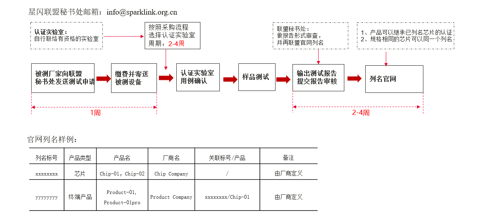
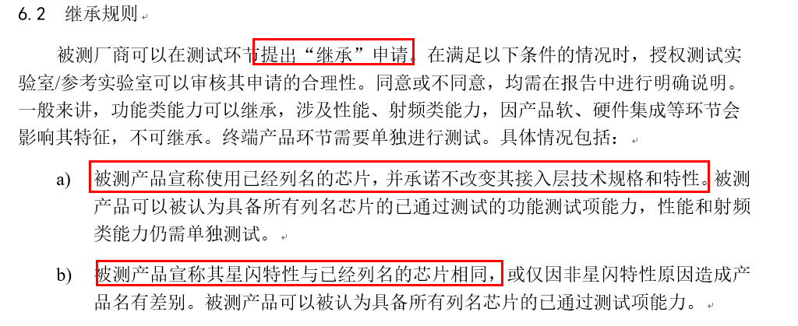
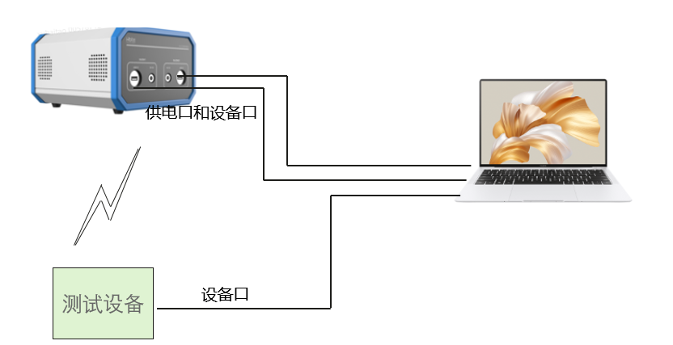
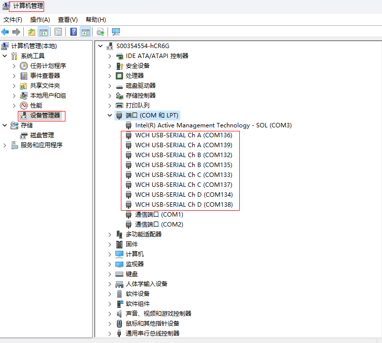
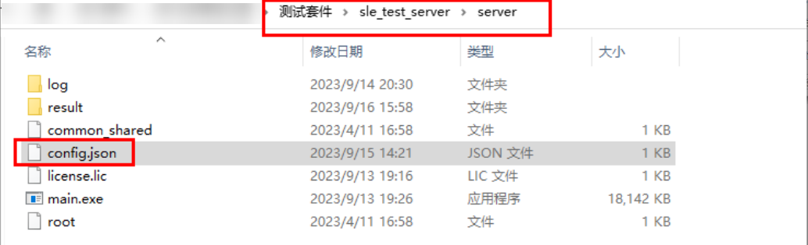
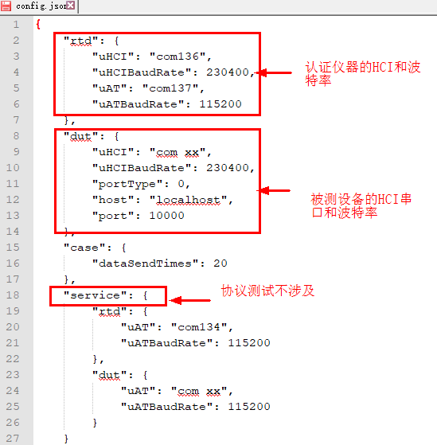
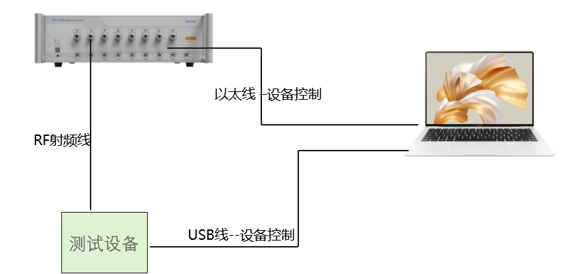
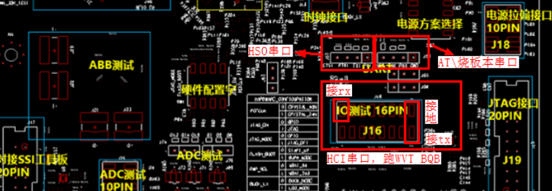

**概述<a name="section4537382116410"></a>**

本文针对WS53所应用产品如何通过星闪认证以及提供建议。

# 星闪认证简介<a name="ZH-CN_TOPIC_0000001956227376"></a>

-   **[概述](#ZH-CN_TOPIC_0000001956227364)**  

-   **[认证类型](#ZH-CN_TOPIC_0000001993226685)**  

-   **[认证流程](#ZH-CN_TOPIC_0000001956227368)**  

-   **[认证仪器和机构](#ZH-CN_TOPIC_0000001956227356)**  

-   **[认证继承](#ZH-CN_TOPIC_0000001956227380)**  

## 概述<a name="ZH-CN_TOPIC_0000001956227364"></a>

星闪联盟正式成立于2020年9月22日，星闪联盟是致力于全球化的产业联盟，目标是推动新一代无线短距通信技术Sparklink的创新和产业的生态，承载智能汽车，智能家居、智能终端和智能制造等快速发展的新场景应用，满足极致性能需求。

星闪联盟测试流程涉及多个组织，包括星闪联盟、被测设备厂家、授权测试实验室或参考实验室。各组织间互相融合、共同参与，提高测试转化效率，形成完整生态。

<a name="table196mcpsimp"></a>
<table><thead align="left"><tr id="row201mcpsimp"><th class="cellrowborder" valign="top" width="18.98%" id="mcps1.1.3.1.1"><p id="p203mcpsimp"><a name="p203mcpsimp"></a><a name="p203mcpsimp"></a>组织</p>
</th>
<th class="cellrowborder" valign="top" width="81.02000000000001%" id="mcps1.1.3.1.2"><p id="p205mcpsimp"><a name="p205mcpsimp"></a><a name="p205mcpsimp"></a>职责</p>
</th>
</tr>
</thead>
<tbody><tr id="row206mcpsimp"><td class="cellrowborder" valign="top" width="18.98%" headers="mcps1.1.3.1.1 "><p id="p208mcpsimp"><a name="p208mcpsimp"></a><a name="p208mcpsimp"></a>星闪联盟</p>
</td>
<td class="cellrowborder" valign="top" width="81.02000000000001%" headers="mcps1.1.3.1.2 "><p id="p210mcpsimp"><a name="p210mcpsimp"></a><a name="p210mcpsimp"></a>制定测试测试流程及规范，委托秘书处接收测试申请，收取测试申请费用，并根据测试结果在网站上进行公示列名</p>
</td>
</tr>
<tr id="row211mcpsimp"><td class="cellrowborder" valign="top" width="18.98%" headers="mcps1.1.3.1.1 "><p id="p213mcpsimp"><a name="p213mcpsimp"></a><a name="p213mcpsimp"></a>被测设备厂家</p>
</td>
<td class="cellrowborder" valign="top" width="81.02000000000001%" headers="mcps1.1.3.1.2 "><p id="p215mcpsimp"><a name="p215mcpsimp"></a><a name="p215mcpsimp"></a>通过邮件的方式向星闪联盟秘书处提交测试申请，选择授权测试实验室或参考实验室，完成产品测试过程。</p>
</td>
</tr>
<tr id="row216mcpsimp"><td class="cellrowborder" valign="top" width="18.98%" headers="mcps1.1.3.1.1 "><p id="p218mcpsimp"><a name="p218mcpsimp"></a><a name="p218mcpsimp"></a>授权测试实验室</p>
</td>
<td class="cellrowborder" valign="top" width="81.02000000000001%" headers="mcps1.1.3.1.2 "><p id="p220mcpsimp"><a name="p220mcpsimp"></a><a name="p220mcpsimp"></a>根据联盟发布的测试规范和测试用例，选择合适的测试系统与工具，为被测设备厂家提供测试服务。</p>
<p id="p883819015332"><a name="p883819015332"></a><a name="p883819015332"></a>测试结果通过测试报告反馈给厂商和秘书处。授权测试实验室或参考实验室由星闪联盟授权，对测试结果负责。</p>
</td>
</tr>
</tbody>
</table>

## 认证类型<a name="ZH-CN_TOPIC_0000001993226685"></a>

<a name="table223mcpsimp"></a>
<table><thead align="left"><tr id="row229mcpsimp"><th class="cellrowborder" valign="top" width="17.82178217821782%" id="mcps1.1.4.1.1"><p id="p231mcpsimp"><a name="p231mcpsimp"></a><a name="p231mcpsimp"></a>认证类型</p>
</th>
<th class="cellrowborder" valign="top" width="39.603960396039604%" id="mcps1.1.4.1.2"><p id="p233mcpsimp"><a name="p233mcpsimp"></a><a name="p233mcpsimp"></a>类型说明</p>
</th>
<th class="cellrowborder" valign="top" width="42.57425742574258%" id="mcps1.1.4.1.3"><p id="p235mcpsimp"><a name="p235mcpsimp"></a><a name="p235mcpsimp"></a>主要功能</p>
</th>
</tr>
</thead>
<tbody><tr id="row236mcpsimp"><td class="cellrowborder" valign="top" width="17.82178217821782%" headers="mcps1.1.4.1.1 "><p id="p238mcpsimp"><a name="p238mcpsimp"></a><a name="p238mcpsimp"></a>芯片或子系统</p>
</td>
<td class="cellrowborder" valign="top" width="39.603960396039604%" headers="mcps1.1.4.1.2 "><p id="p240mcpsimp"><a name="p240mcpsimp"></a><a name="p240mcpsimp"></a>一般指具备完整的芯片、模组或子系统的提供星闪通信技术元器件。</p>
</td>
<td class="cellrowborder" valign="top" width="42.57425742574258%" headers="mcps1.1.4.1.3 "><p id="p242mcpsimp"><a name="p242mcpsimp"></a><a name="p242mcpsimp"></a>其功能包含：星闪接入层等，也可以按需包括基础服务层和其他功能。</p>
</td>
</tr>
<tr id="row243mcpsimp"><td class="cellrowborder" valign="top" width="17.82178217821782%" headers="mcps1.1.4.1.1 "><p id="p245mcpsimp"><a name="p245mcpsimp"></a><a name="p245mcpsimp"></a>终端产品</p>
</td>
<td class="cellrowborder" valign="top" width="39.603960396039604%" headers="mcps1.1.4.1.2 "><p id="p247mcpsimp"><a name="p247mcpsimp"></a><a name="p247mcpsimp"></a>一般指具备完整星闪功能的、面向普通消费者销售使用的设备。</p>
</td>
<td class="cellrowborder" valign="top" width="42.57425742574258%" headers="mcps1.1.4.1.3 "><p id="p249mcpsimp"><a name="p249mcpsimp"></a><a name="p249mcpsimp"></a>其功能包含：星闪接入层、基础服务层、基础应用层等全套星闪功能。</p>
</td>
</tr>
</tbody>
</table>

星闪测试产品可能包括2种类型：芯片和子系统、终端产品。

## 认证流程<a name="ZH-CN_TOPIC_0000001956227368"></a>

**图 1**  认证流程图<a name="fig915611453617"></a>  


星闪联盟链接：http://sparklink.org.cn/cert/

## 认证仪器和机构<a name="ZH-CN_TOPIC_0000001956227356"></a>

目前已知的认证仪器，以及测试实验室信息如下，仅供参考。

**认证仪器**

1.  星闪协议一致性测试仪表：永谐SLE1000。
2.  星闪射频一致性测试仪表：
    -   极致汇仪WT328/WT328E。
    -   星河亮点SP9020。

**认证机构信息**：

1.  中国电子技术标准化研究院物联网中心。
2.  中国信息通信研究院，泰尔实验室。

详细认证机构及仪表信息以官网信息为准：http://sparklink.org.cn/cert/

## 认证继承<a name="ZH-CN_TOPIC_0000001956227380"></a>

认证状态：WS53芯片已进行星闪射频和协议认证，联盟网站已列名（2024.06.13更新\)。

产品或者模组厂商， 一般可以继承芯片厂商的协议认证，射频需要对应产品单独认证并列名。

详细认证规则以及需要的材料信息，建议咨询联盟或者认证实验室，以其信息为准。



# 星闪协议认证<a name="ZH-CN_TOPIC_0000001956227352"></a>

-   **[认证环境](#ZH-CN_TOPIC_0000001993106437)**  

-   **[认证仪使用](#ZH-CN_TOPIC_0000001993106449)**  

## 认证环境<a name="ZH-CN_TOPIC_0000001993106437"></a>

星闪认证环境由星闪认证仪，测试单板，测试电脑组成。

SLE认证仪和被测设备通过USB端口与电脑连接,通过无线通信交互进行协议验证测试。



物料准备：

1.  单板物料：
    -   USB单板
    -   USB线
    -   串口小板
    -   射频线
    -   外接天线

2.  辅助物料：
    -   2根公对公的USB线
    -   USB HUB

## 认证仪使用<a name="ZH-CN_TOPIC_0000001993106449"></a>

-   **[端口连接](#ZH-CN_TOPIC_0000001993226661)**  

-   **[认证仪端口配置](#ZH-CN_TOPIC_0000001993226689)**  

-   **[认证启动测试](#ZH-CN_TOPIC_0000001993226673)**  

### 端口连接<a name="ZH-CN_TOPIC_0000001993226661"></a>

SLE 1000认证仪使用方法，设备使用可自行认证实验室工作人员：

仪器上两个端口，一端是**供电口**，一端**设备口**，插上后可以识别2组单板设备。（默认一组BTC only版本，一组全系统版本）

-   A是HCI口 （发命令btc测试）。
-   B是Log口 （烧写版本的端口，烧写打包的接入层btc only版本）。
-   C是AT口。



### 认证仪端口配置<a name="ZH-CN_TOPIC_0000001993226689"></a>

修改测试套里面config.json文件：

1. 软件运行环境windows平台。

2.  打开server/config.json文件，将仪表中接入层测试单板的HCI口（M12M13）配置到rtd.uHCI、AT口（A12A13）配置到rtd.uAT。

3.  打开server/config.json文件，将被测设备（接入层）单板的HCI口（M12M13）配置到dut.uHCI。

4. 双击server/main.exe，出现 `http server Running on http://0.0.0.0:36066`，表示启动正常。

5. 双击web/index.html，打开的网页为仪表的操作界面，可执行相关测试操作。



将服务层的AT口，配置到server/config.json文件里面的service.rtd.uAT。

协议层的HCI口，配置到server/config.json文件里面的dut.uhci



### 认证启动测试<a name="ZH-CN_TOPIC_0000001993226673"></a>


测试完后保存如下路径log，以及导出测试结果。

1、\\测试套件\\sle\_test\_server\\server\\log

2、\\测试套件\\sle\_test\_server\\server\\result

# 星闪射频认证<a name="ZH-CN_TOPIC_0000001956227372"></a>

-   **[射频认证环境](#ZH-CN_TOPIC_0000001993226669)**  

-   **[认证准备和参数](#ZH-CN_TOPIC_0000001993106461)**  

## 射频认证环境<a name="ZH-CN_TOPIC_0000001993226669"></a>

星闪射频测试，主要涉及将WV-328射频仪器，测试设备，PC电脑。

如[图1](#fig5545144613366)所示连接后，启动射频测试，相关测试主要是认证实验室人员进行操作。

**图 1**  设备连接示意图<a name="fig5545144613366"></a>  


## 认证准备和参数<a name="ZH-CN_TOPIC_0000001993106461"></a>

相关接口及版本下载同协议认证。

认证中心会按照从官网根据勾选规格生成的模板，基于模板导入生成用例，然后点击开始测试。

# 星闪特性支持<a name="ZH-CN_TOPIC_0000001993106457"></a>

星闪认证用例详细描述请以星闪联盟发布的低功耗技术要求和测试方法为准。

https://sparklink.org.cn/standard/

-   **[协议一致性用例](#ZH-CN_TOPIC_0000001993106465)**  

-   **[射频认证用例](#ZH-CN_TOPIC_0000001993226681)**  

## 协议一致性用例<a name="ZH-CN_TOPIC_0000001993106465"></a>

WS73进行了星闪协议认证和射频认证，WS53规格同WS73继承认证结果。

终端、模组厂商可以直接继承芯片的认证结果。详细认证项目见如下列表：

<a name="table312mcpsimp"></a>
<table><thead align="left"><tr id="row320mcpsimp"><th class="cellrowborder" valign="top" width="11.881188118811883%" id="mcps1.1.6.1.1"><p id="p322mcpsimp"><a name="p322mcpsimp"></a><a name="p322mcpsimp"></a>测试类</p>
</th>
<th class="cellrowborder" valign="top" width="12.871287128712874%" id="mcps1.1.6.1.2"><p id="p325mcpsimp"><a name="p325mcpsimp"></a><a name="p325mcpsimp"></a>测试项</p>
</th>
<th class="cellrowborder" valign="top" width="17.821782178217823%" id="mcps1.1.6.1.3"><p id="p328mcpsimp"><a name="p328mcpsimp"></a><a name="p328mcpsimp"></a>测试子项</p>
</th>
<th class="cellrowborder" valign="top" width="42.57425742574258%" id="mcps1.1.6.1.4"><p id="p331mcpsimp"><a name="p331mcpsimp"></a><a name="p331mcpsimp"></a>测试内容</p>
</th>
<th class="cellrowborder" valign="top" width="14.851485148514854%" id="mcps1.1.6.1.5"><p id="p334mcpsimp"><a name="p334mcpsimp"></a><a name="p334mcpsimp"></a>执行用例</p>
</th>
</tr>
</thead>
<tbody><tr id="row336mcpsimp"><td class="cellrowborder" rowspan="16" valign="top" width="11.881188118811883%" headers="mcps1.1.6.1.1 "><p id="p338mcpsimp"><a name="p338mcpsimp"></a><a name="p338mcpsimp"></a><strong id="b339mcpsimp"><a name="b339mcpsimp"></a><a name="b339mcpsimp"></a>星闪 协议认证</strong></p>
</td>
<td class="cellrowborder" rowspan="6" valign="top" width="12.871287128712874%" headers="mcps1.1.6.1.2 "><p id="p341mcpsimp"><a name="p341mcpsimp"></a><a name="p341mcpsimp"></a>物理层特性</p>
</td>
<td class="cellrowborder" valign="top" width="17.821782178217823%" headers="mcps1.1.6.1.3 "><p id="p343mcpsimp"><a name="p343mcpsimp"></a><a name="p343mcpsimp"></a>系统带宽</p>
</td>
<td class="cellrowborder" valign="top" width="42.57425742574258%" headers="mcps1.1.6.1.4 "><p id="p345mcpsimp"><a name="p345mcpsimp"></a><a name="p345mcpsimp"></a>必选支持1MHz、2MHz、4MHz带宽。</p>
</td>
<td class="cellrowborder" valign="top" width="14.851485148514854%" headers="mcps1.1.6.1.5 "><p id="p347mcpsimp"><a name="p347mcpsimp"></a><a name="p347mcpsimp"></a>11.2.6-1</p>
</td>
</tr>
<tr id="row348mcpsimp"><td class="cellrowborder" valign="top" headers="mcps1.1.6.1.1 "><p id="p350mcpsimp"><a name="p350mcpsimp"></a><a name="p350mcpsimp"></a>调制方式</p>
</td>
<td class="cellrowborder" valign="top" headers="mcps1.1.6.1.2 "><p id="p352mcpsimp"><a name="p352mcpsimp"></a><a name="p352mcpsimp"></a>必选支持MCS8。</p>
</td>
<td class="cellrowborder" valign="top" headers="mcps1.1.6.1.3 "><p id="p354mcpsimp"><a name="p354mcpsimp"></a><a name="p354mcpsimp"></a>11.2.6-1</p>
</td>
</tr>
<tr id="row355mcpsimp"><td class="cellrowborder" valign="top" headers="mcps1.1.6.1.1 "><p id="p357mcpsimp"><a name="p357mcpsimp"></a><a name="p357mcpsimp"></a>无线帧类型</p>
</td>
<td class="cellrowborder" valign="top" headers="mcps1.1.6.1.2 "><p id="p359mcpsimp"><a name="p359mcpsimp"></a><a name="p359mcpsimp"></a>必选支持无线帧类型1。</p>
</td>
<td class="cellrowborder" valign="top" headers="mcps1.1.6.1.3 "><p id="p361mcpsimp"><a name="p361mcpsimp"></a><a name="p361mcpsimp"></a>11.1.7-1</p>
</td>
</tr>
<tr id="row362mcpsimp"><td class="cellrowborder" valign="top" headers="mcps1.1.6.1.1 "><p id="p364mcpsimp"><a name="p364mcpsimp"></a><a name="p364mcpsimp"></a>无线帧类型</p>
</td>
<td class="cellrowborder" valign="top" headers="mcps1.1.6.1.2 "><p id="p366mcpsimp"><a name="p366mcpsimp"></a><a name="p366mcpsimp"></a>必选支持无线帧类型2。</p>
</td>
<td class="cellrowborder" valign="top" headers="mcps1.1.6.1.3 "><p id="p368mcpsimp"><a name="p368mcpsimp"></a><a name="p368mcpsimp"></a>11.2.6-1</p>
</td>
</tr>
<tr id="row369mcpsimp"><td class="cellrowborder" valign="top" headers="mcps1.1.6.1.1 "><p id="p371mcpsimp"><a name="p371mcpsimp"></a><a name="p371mcpsimp"></a>收发间隔</p>
</td>
<td class="cellrowborder" valign="top" headers="mcps1.1.6.1.2 "><p id="p373mcpsimp"><a name="p373mcpsimp"></a><a name="p373mcpsimp"></a>收发间隔必选支持125μs。</p>
</td>
<td class="cellrowborder" valign="top" headers="mcps1.1.6.1.3 "><p id="p375mcpsimp"><a name="p375mcpsimp"></a><a name="p375mcpsimp"></a>11.2.6-1</p>
</td>
</tr>
<tr id="row376mcpsimp"><td class="cellrowborder" valign="top" headers="mcps1.1.6.1.1 "><p id="p378mcpsimp"><a name="p378mcpsimp"></a><a name="p378mcpsimp"></a>广播类型</p>
</td>
<td class="cellrowborder" valign="top" headers="mcps1.1.6.1.2 "><p id="p380mcpsimp"><a name="p380mcpsimp"></a><a name="p380mcpsimp"></a>必选支持基础广播和扩展广播。</p>
</td>
<td class="cellrowborder" valign="top" headers="mcps1.1.6.1.3 "><p id="p382mcpsimp"><a name="p382mcpsimp"></a><a name="p382mcpsimp"></a>11.1.2-1</p>
</td>
</tr>
<tr id="row383mcpsimp"><td class="cellrowborder" valign="top" headers="mcps1.1.6.1.1 "><p id="p385mcpsimp"><a name="p385mcpsimp"></a><a name="p385mcpsimp"></a>数据链路层</p>
</td>
<td class="cellrowborder" valign="top" headers="mcps1.1.6.1.2 "><p id="p387mcpsimp"><a name="p387mcpsimp"></a><a name="p387mcpsimp"></a>异步数据链路</p>
</td>
<td class="cellrowborder" valign="top" headers="mcps1.1.6.1.3 "><p id="p389mcpsimp"><a name="p389mcpsimp"></a><a name="p389mcpsimp"></a>必选支持异步数据链路。</p>
</td>
<td class="cellrowborder" valign="top" headers="mcps1.1.6.1.4 "><p id="p391mcpsimp"><a name="p391mcpsimp"></a><a name="p391mcpsimp"></a>11.2.6-1</p>
</td>
</tr>
<tr id="row392mcpsimp"><td class="cellrowborder" rowspan="7" valign="top" headers="mcps1.1.6.1.1 "><p id="p394mcpsimp"><a name="p394mcpsimp"></a><a name="p394mcpsimp"></a>控制面特性</p>
</td>
<td class="cellrowborder" valign="top" headers="mcps1.1.6.1.2 "><p id="p396mcpsimp"><a name="p396mcpsimp"></a><a name="p396mcpsimp"></a>特性交互</p>
</td>
<td class="cellrowborder" valign="top" headers="mcps1.1.6.1.3 "><p id="p398mcpsimp"><a name="p398mcpsimp"></a><a name="p398mcpsimp"></a>支持特性交互。</p>
</td>
<td class="cellrowborder" valign="top" headers="mcps1.1.6.1.4 "><p id="p400mcpsimp"><a name="p400mcpsimp"></a><a name="p400mcpsimp"></a>11.5.3-1</p>
</td>
</tr>
<tr id="row401mcpsimp"><td class="cellrowborder" valign="top" headers="mcps1.1.6.1.1 "><p id="p403mcpsimp"><a name="p403mcpsimp"></a><a name="p403mcpsimp"></a>版本交互</p>
</td>
<td class="cellrowborder" valign="top" headers="mcps1.1.6.1.2 "><p id="p405mcpsimp"><a name="p405mcpsimp"></a><a name="p405mcpsimp"></a>支持版本交互。</p>
</td>
<td class="cellrowborder" valign="top" headers="mcps1.1.6.1.3 "><p id="p407mcpsimp"><a name="p407mcpsimp"></a><a name="p407mcpsimp"></a>11.5.4-1</p>
</td>
</tr>
<tr id="row408mcpsimp"><td class="cellrowborder" valign="top" headers="mcps1.1.6.1.1 "><p id="p410mcpsimp"><a name="p410mcpsimp"></a><a name="p410mcpsimp"></a>数据长度更新</p>
</td>
<td class="cellrowborder" valign="top" headers="mcps1.1.6.1.2 "><p id="p412mcpsimp"><a name="p412mcpsimp"></a><a name="p412mcpsimp"></a>支持数据长度更新。</p>
</td>
<td class="cellrowborder" valign="top" headers="mcps1.1.6.1.3 "><p id="p414mcpsimp"><a name="p414mcpsimp"></a><a name="p414mcpsimp"></a>11.5.5-1</p>
</td>
</tr>
<tr id="row415mcpsimp"><td class="cellrowborder" valign="top" headers="mcps1.1.6.1.1 "><p id="p417mcpsimp"><a name="p417mcpsimp"></a><a name="p417mcpsimp"></a>跳频地图更新</p>
</td>
<td class="cellrowborder" valign="top" headers="mcps1.1.6.1.2 "><p id="p419mcpsimp"><a name="p419mcpsimp"></a><a name="p419mcpsimp"></a>支持跳频地图更新。</p>
</td>
<td class="cellrowborder" valign="top" headers="mcps1.1.6.1.3 "><p id="p421mcpsimp"><a name="p421mcpsimp"></a><a name="p421mcpsimp"></a>11.5.8-1</p>
</td>
</tr>
<tr id="row422mcpsimp"><td class="cellrowborder" valign="top" headers="mcps1.1.6.1.1 "><p id="p424mcpsimp"><a name="p424mcpsimp"></a><a name="p424mcpsimp"></a>物理层类型更新</p>
</td>
<td class="cellrowborder" valign="top" headers="mcps1.1.6.1.2 "><p id="p426mcpsimp"><a name="p426mcpsimp"></a><a name="p426mcpsimp"></a>支持物理层类型更新。</p>
</td>
<td class="cellrowborder" valign="top" headers="mcps1.1.6.1.3 "><p id="p428mcpsimp"><a name="p428mcpsimp"></a><a name="p428mcpsimp"></a>11.5.11-1</p>
</td>
</tr>
<tr id="row429mcpsimp"><td class="cellrowborder" valign="top" headers="mcps1.1.6.1.1 "><p id="p431mcpsimp"><a name="p431mcpsimp"></a><a name="p431mcpsimp"></a>链路断开</p>
</td>
<td class="cellrowborder" valign="top" headers="mcps1.1.6.1.2 "><p id="p433mcpsimp"><a name="p433mcpsimp"></a><a name="p433mcpsimp"></a>支持链路断开。</p>
</td>
<td class="cellrowborder" valign="top" headers="mcps1.1.6.1.3 "><p id="p435mcpsimp"><a name="p435mcpsimp"></a><a name="p435mcpsimp"></a>11.5.16-1</p>
</td>
</tr>
<tr id="row436mcpsimp"><td class="cellrowborder" valign="top" headers="mcps1.1.6.1.1 "><p id="p438mcpsimp"><a name="p438mcpsimp"></a><a name="p438mcpsimp"></a>参数更新</p>
</td>
<td class="cellrowborder" valign="top" headers="mcps1.1.6.1.2 "><p id="p440mcpsimp"><a name="p440mcpsimp"></a><a name="p440mcpsimp"></a>支持参数更新。</p>
</td>
<td class="cellrowborder" valign="top" headers="mcps1.1.6.1.3 "><p id="p442mcpsimp"><a name="p442mcpsimp"></a><a name="p442mcpsimp"></a>11.5.17-1</p>
</td>
</tr>
<tr id="row443mcpsimp"><td class="cellrowborder" rowspan="2" valign="top" headers="mcps1.1.6.1.1 "><p id="p445mcpsimp"><a name="p445mcpsimp"></a><a name="p445mcpsimp"></a>信息安全</p>
</td>
<td class="cellrowborder" rowspan="2" valign="top" headers="mcps1.1.6.1.2 "><p id="p447mcpsimp"><a name="p447mcpsimp"></a><a name="p447mcpsimp"></a>安全保护</p>
</td>
<td class="cellrowborder" valign="top" headers="mcps1.1.6.1.3 "><p id="p449mcpsimp"><a name="p449mcpsimp"></a><a name="p449mcpsimp"></a>G/T节点加密和完整性保护SM4。</p>
</td>
<td class="cellrowborder" valign="top" headers="mcps1.1.6.1.4 "><p id="p451mcpsimp"><a name="p451mcpsimp"></a><a name="p451mcpsimp"></a>13.2.1/2</p>
</td>
</tr>
<tr id="row452mcpsimp"><td class="cellrowborder" valign="top" headers="mcps1.1.6.1.1 "><p id="p454mcpsimp"><a name="p454mcpsimp"></a><a name="p454mcpsimp"></a>G/T节点加密和完整性保护AES。</p>
</td>
<td class="cellrowborder" valign="top" headers="mcps1.1.6.1.2 "><p id="p456mcpsimp"><a name="p456mcpsimp"></a><a name="p456mcpsimp"></a>13.2.1/2</p>
</td>
</tr>
</tbody>
</table>

## 射频认证用例<a name="ZH-CN_TOPIC_0000001993226681"></a>

<a name="table458mcpsimp"></a>
<table><thead align="left"><tr id="row466mcpsimp"><th class="cellrowborder" valign="top" width="11.881188118811883%" id="mcps1.1.6.1.1"><p id="p468mcpsimp"><a name="p468mcpsimp"></a><a name="p468mcpsimp"></a>测试类</p>
</th>
<th class="cellrowborder" valign="top" width="12.871287128712874%" id="mcps1.1.6.1.2"><p id="p471mcpsimp"><a name="p471mcpsimp"></a><a name="p471mcpsimp"></a>测试项</p>
</th>
<th class="cellrowborder" valign="top" width="17.821782178217823%" id="mcps1.1.6.1.3"><p id="p474mcpsimp"><a name="p474mcpsimp"></a><a name="p474mcpsimp"></a>测试子项</p>
</th>
<th class="cellrowborder" valign="top" width="41.584158415841586%" id="mcps1.1.6.1.4"><p id="p477mcpsimp"><a name="p477mcpsimp"></a><a name="p477mcpsimp"></a>测试内容</p>
</th>
<th class="cellrowborder" valign="top" width="15.841584158415845%" id="mcps1.1.6.1.5"><p id="p480mcpsimp"><a name="p480mcpsimp"></a><a name="p480mcpsimp"></a>执行用例</p>
</th>
</tr>
</thead>
<tbody><tr id="row482mcpsimp"><td class="cellrowborder" rowspan="13" valign="top" width="11.881188118811883%" headers="mcps1.1.6.1.1 "><p id="p484mcpsimp"><a name="p484mcpsimp"></a><a name="p484mcpsimp"></a>星闪射频</p>
<p id="p485mcpsimp"><a name="p485mcpsimp"></a><a name="p485mcpsimp"></a>认证</p>
</td>
<td class="cellrowborder" rowspan="7" valign="top" width="12.871287128712874%" headers="mcps1.1.6.1.2 "><p id="p487mcpsimp"><a name="p487mcpsimp"></a><a name="p487mcpsimp"></a>射频能力</p>
<p id="p23821430143520"><a name="p23821430143520"></a><a name="p23821430143520"></a>（发射机测试）</p>
</td>
<td class="cellrowborder" valign="top" width="17.821782178217823%" headers="mcps1.1.6.1.3 "><p id="p490mcpsimp"><a name="p490mcpsimp"></a><a name="p490mcpsimp"></a>输出功率范围</p>
</td>
<td class="cellrowborder" valign="top" width="41.584158415841586%" headers="mcps1.1.6.1.4 "><p id="p492mcpsimp"><a name="p492mcpsimp"></a><a name="p492mcpsimp"></a>功率等级0~4任意一种或多种。</p>
</td>
<td class="cellrowborder" valign="top" width="15.841584158415845%" headers="mcps1.1.6.1.5 "><p id="p494mcpsimp"><a name="p494mcpsimp"></a><a name="p494mcpsimp"></a>12.1.1-1</p>
</td>
</tr>
<tr id="row495mcpsimp"><td class="cellrowborder" valign="top" headers="mcps1.1.6.1.1 "><p id="p497mcpsimp"><a name="p497mcpsimp"></a><a name="p497mcpsimp"></a>带宽</p>
</td>
<td class="cellrowborder" valign="top" headers="mcps1.1.6.1.2 "><p id="p499mcpsimp"><a name="p499mcpsimp"></a><a name="p499mcpsimp"></a>1MHz/2MHz/4MHz。</p>
</td>
<td class="cellrowborder" valign="top" headers="mcps1.1.6.1.3 "><p id="p501mcpsimp"><a name="p501mcpsimp"></a><a name="p501mcpsimp"></a>12.1/2/3.1-1</p>
</td>
</tr>
<tr id="row502mcpsimp"><td class="cellrowborder" valign="top" headers="mcps1.1.6.1.1 "><p id="p504mcpsimp"><a name="p504mcpsimp"></a><a name="p504mcpsimp"></a>GFSK频率偏差</p>
</td>
<td class="cellrowborder" valign="top" headers="mcps1.1.6.1.2 "><p id="p506mcpsimp"><a name="p506mcpsimp"></a><a name="p506mcpsimp"></a>符合GFSK频率偏差要求。</p>
</td>
<td class="cellrowborder" valign="top" headers="mcps1.1.6.1.3 "><p id="p508mcpsimp"><a name="p508mcpsimp"></a><a name="p508mcpsimp"></a>12.1.2.1-1</p>
</td>
</tr>
<tr id="row509mcpsimp"><td class="cellrowborder" valign="top" headers="mcps1.1.6.1.1 "><p id="p511mcpsimp"><a name="p511mcpsimp"></a><a name="p511mcpsimp"></a>PSK误差矢量幅度</p>
</td>
<td class="cellrowborder" valign="top" headers="mcps1.1.6.1.2 "><p id="p513mcpsimp"><a name="p513mcpsimp"></a><a name="p513mcpsimp"></a>符合PSK调制EVM要求。</p>
</td>
<td class="cellrowborder" valign="top" headers="mcps1.1.6.1.3 "><p id="p515mcpsimp"><a name="p515mcpsimp"></a><a name="p515mcpsimp"></a>12.1.2.2-1</p>
</td>
</tr>
<tr id="row516mcpsimp"><td class="cellrowborder" valign="top" headers="mcps1.1.6.1.1 "><p id="p518mcpsimp"><a name="p518mcpsimp"></a><a name="p518mcpsimp"></a>频率容限</p>
</td>
<td class="cellrowborder" valign="top" headers="mcps1.1.6.1.2 "><p id="p520mcpsimp"><a name="p520mcpsimp"></a><a name="p520mcpsimp"></a>初始频率偏差、频率漂移。</p>
</td>
<td class="cellrowborder" valign="top" headers="mcps1.1.6.1.3 "><p id="p522mcpsimp"><a name="p522mcpsimp"></a><a name="p522mcpsimp"></a>12.1.2.3-1</p>
</td>
</tr>
<tr id="row523mcpsimp"><td class="cellrowborder" valign="top" headers="mcps1.1.6.1.1 "><p id="p525mcpsimp"><a name="p525mcpsimp"></a><a name="p525mcpsimp"></a>GFSK频段内发射</p>
</td>
<td class="cellrowborder" valign="top" headers="mcps1.1.6.1.2 "><p id="p527mcpsimp"><a name="p527mcpsimp"></a><a name="p527mcpsimp"></a>符合频谱模板要求。</p>
</td>
<td class="cellrowborder" valign="top" headers="mcps1.1.6.1.3 "><p id="p529mcpsimp"><a name="p529mcpsimp"></a><a name="p529mcpsimp"></a>12.1.3.1-1</p>
</td>
</tr>
<tr id="row530mcpsimp"><td class="cellrowborder" valign="top" headers="mcps1.1.6.1.1 "><p id="p532mcpsimp"><a name="p532mcpsimp"></a><a name="p532mcpsimp"></a>PSK频段内发射</p>
</td>
<td class="cellrowborder" valign="top" headers="mcps1.1.6.1.2 "><p id="p534mcpsimp"><a name="p534mcpsimp"></a><a name="p534mcpsimp"></a>符合频谱模板要求。</p>
</td>
<td class="cellrowborder" valign="top" headers="mcps1.1.6.1.3 "><p id="p536mcpsimp"><a name="p536mcpsimp"></a><a name="p536mcpsimp"></a>12.1.3.2-1</p>
</td>
</tr>
<tr id="row537mcpsimp"><td class="cellrowborder" rowspan="6" valign="top" headers="mcps1.1.6.1.1 "><p id="p539mcpsimp"><a name="p539mcpsimp"></a><a name="p539mcpsimp"></a>射频能力</p>
<p id="p439703913355"><a name="p439703913355"></a><a name="p439703913355"></a>(接收机测试)</p>
</td>
<td class="cellrowborder" valign="top" headers="mcps1.1.6.1.2 "><p id="p542mcpsimp"><a name="p542mcpsimp"></a><a name="p542mcpsimp"></a>参考灵敏度</p>
</td>
<td class="cellrowborder" valign="top" headers="mcps1.1.6.1.3 "><p id="p544mcpsimp"><a name="p544mcpsimp"></a><a name="p544mcpsimp"></a>符合参考灵敏度要求。</p>
</td>
<td class="cellrowborder" valign="top" headers="mcps1.1.6.1.4 "><p id="p546mcpsimp"><a name="p546mcpsimp"></a><a name="p546mcpsimp"></a>12.2.1.1-1</p>
</td>
</tr>
<tr id="row547mcpsimp"><td class="cellrowborder" valign="top" headers="mcps1.1.6.1.1 "><p id="p549mcpsimp"><a name="p549mcpsimp"></a><a name="p549mcpsimp"></a>最大输入电平</p>
</td>
<td class="cellrowborder" valign="top" headers="mcps1.1.6.1.2 "><p id="p551mcpsimp"><a name="p551mcpsimp"></a><a name="p551mcpsimp"></a>≥-10dBm。</p>
</td>
<td class="cellrowborder" valign="top" headers="mcps1.1.6.1.3 "><p id="p553mcpsimp"><a name="p553mcpsimp"></a><a name="p553mcpsimp"></a>12.2.1.2-1</p>
</td>
</tr>
<tr id="row554mcpsimp"><td class="cellrowborder" valign="top" headers="mcps1.1.6.1.1 "><p id="p556mcpsimp"><a name="p556mcpsimp"></a><a name="p556mcpsimp"></a>频段内选择性</p>
</td>
<td class="cellrowborder" valign="top" headers="mcps1.1.6.1.2 "><p id="p558mcpsimp"><a name="p558mcpsimp"></a><a name="p558mcpsimp"></a>有用信号为参考灵敏度+3dB，干扰信号符合接收机频段内选择性要求。</p>
</td>
<td class="cellrowborder" valign="top" headers="mcps1.1.6.1.3 "><p id="p560mcpsimp"><a name="p560mcpsimp"></a><a name="p560mcpsimp"></a>12.2.2.1-1</p>
</td>
</tr>
<tr id="row561mcpsimp"><td class="cellrowborder" valign="top" headers="mcps1.1.6.1.1 "><p id="p563mcpsimp"><a name="p563mcpsimp"></a><a name="p563mcpsimp"></a>频段外选择性</p>
</td>
<td class="cellrowborder" valign="top" headers="mcps1.1.6.1.2 "><p id="p565mcpsimp"><a name="p565mcpsimp"></a><a name="p565mcpsimp"></a>有用信号为参考灵敏度+3dB，干扰信号符合接收机频段外选择性要求。</p>
</td>
<td class="cellrowborder" valign="top" headers="mcps1.1.6.1.3 "><p id="p567mcpsimp"><a name="p567mcpsimp"></a><a name="p567mcpsimp"></a>12.2.2.2-1</p>
</td>
</tr>
<tr id="row568mcpsimp"><td class="cellrowborder" valign="top" headers="mcps1.1.6.1.1 "><p id="p570mcpsimp"><a name="p570mcpsimp"></a><a name="p570mcpsimp"></a>接收机干扰互调</p>
</td>
<td class="cellrowborder" valign="top" headers="mcps1.1.6.1.2 "><p id="p572mcpsimp"><a name="p572mcpsimp"></a><a name="p572mcpsimp"></a>有用信号为参考灵敏度+6dB，干扰信号为-50dBm</p>
</td>
<td class="cellrowborder" valign="top" headers="mcps1.1.6.1.3 "><p id="p574mcpsimp"><a name="p574mcpsimp"></a><a name="p574mcpsimp"></a>12.2.2.3-1</p>
</td>
</tr>
<tr id="row575mcpsimp"><td class="cellrowborder" valign="top" headers="mcps1.1.6.1.1 "><p id="p577mcpsimp"><a name="p577mcpsimp"></a><a name="p577mcpsimp"></a>接收机RSSI测量精度</p>
</td>
<td class="cellrowborder" valign="top" headers="mcps1.1.6.1.2 "><p id="p579mcpsimp"><a name="p579mcpsimp"></a><a name="p579mcpsimp"></a>验证星闪低功耗短距离通信设备满足接收机机RSSI测量精度要求。</p>
</td>
<td class="cellrowborder" valign="top" headers="mcps1.1.6.1.3 "><p id="p581mcpsimp"><a name="p581mcpsimp"></a><a name="p581mcpsimp"></a>12.2.3-1</p>
</td>
</tr>
</tbody>
</table>

# 常见问题&测试命令汇总（FAQ）<a name="ZH-CN_TOPIC_0000001993106453"></a>

-   **[软件版本获取](#ZH-CN_TOPIC_0000001993106445)**  

-   **[串口工具和驱动](#ZH-CN_TOPIC_0000001993226677)**  

-   **[软件启动加载](#ZH-CN_TOPIC_0000001956227360)**  

-   **[产测版本射频测试命令](#ZH-CN_TOPIC_0000001993106441)**  

## 软件版本获取<a name="ZH-CN_TOPIC_0000001993106445"></a>

<a name="table65219319519"></a>
<table><thead align="left"><tr id="row1012133751"><th class="cellrowborder" valign="top" width="12.3%" id="mcps1.1.6.1.1"><p id="p171212031358"><a name="p171212031358"></a><a name="p171212031358"></a>WS53</p>
</th>
<th class="cellrowborder" valign="top" width="10.79%" id="mcps1.1.6.1.2"><p id="p2121431654"><a name="p2121431654"></a><a name="p2121431654"></a>认证类型</p>
</th>
<th class="cellrowborder" valign="top" width="18.77%" id="mcps1.1.6.1.3"><p id="p74489297206"><a name="p74489297206"></a><a name="p74489297206"></a>软件版本</p>
</th>
<th class="cellrowborder" valign="top" width="18.77%" id="mcps1.1.6.1.4"><p id="p14611827112013"><a name="p14611827112013"></a><a name="p14611827112013"></a>测试接口</p>
</th>
<th class="cellrowborder" valign="top" width="39.37%" id="mcps1.1.6.1.5"><p id="p3121437514"><a name="p3121437514"></a><a name="p3121437514"></a>说明</p>
</th>
</tr>
</thead>
<tbody><tr id="row1712113310510"><td class="cellrowborder" rowspan="2" valign="top" width="12.3%" headers="mcps1.1.6.1.1 "><p id="p131219310518"><a name="p131219310518"></a><a name="p131219310518"></a>BLE BQB认证</p>
</td>
<td class="cellrowborder" valign="top" width="10.79%" headers="mcps1.1.6.1.2 "><p id="p17121123150"><a name="p17121123150"></a><a name="p17121123150"></a>协议认证</p>
</td>
<td class="cellrowborder" valign="top" width="18.77%" headers="mcps1.1.6.1.3 "><p id="p51211031356"><a name="p51211031356"></a><a name="p51211031356"></a>device only版本</p>
</td>
<td class="cellrowborder" valign="top" width="18.77%" headers="mcps1.1.6.1.4 "><p id="p6121431659"><a name="p6121431659"></a><a name="p6121431659"></a>HCI接口</p>
</td>
<td class="cellrowborder" rowspan="2" valign="top" width="39.37%" headers="mcps1.1.6.1.5 "><a name="ol3412204414207"></a><a name="ol3412204414207"></a><ol id="ol3412204414207"><li>BLE协议和射频认证，认证仪器需要使用到HCI发送协议消息，必须使用device only版本。</li><li>模组或者产品厂商需要外接HCI口。</li></ol>
</td>
</tr>
<tr id="row7121143751"><td class="cellrowborder" valign="top" headers="mcps1.1.6.1.1 "><p id="p1412111314510"><a name="p1412111314510"></a><a name="p1412111314510"></a>射频认证</p>
</td>
<td class="cellrowborder" valign="top" headers="mcps1.1.6.1.2 "><p id="p13121931852"><a name="p13121931852"></a><a name="p13121931852"></a>device only版本</p>
</td>
<td class="cellrowborder" valign="top" headers="mcps1.1.6.1.3 "><p id="p11211931958"><a name="p11211931958"></a><a name="p11211931958"></a>HCI接口</p>
</td>
</tr>
<tr id="row5121731252"><td class="cellrowborder" valign="top" width="12.3%" headers="mcps1.1.6.1.1 "><p id="p161222033519"><a name="p161222033519"></a><a name="p161222033519"></a>星闪SLE认证</p>
</td>
<td class="cellrowborder" valign="top" width="10.79%" headers="mcps1.1.6.1.2 "><p id="p31221430511"><a name="p31221430511"></a><a name="p31221430511"></a>协议认证</p>
</td>
<td class="cellrowborder" valign="top" width="18.77%" headers="mcps1.1.6.1.3 "><p id="p12122739513"><a name="p12122739513"></a><a name="p12122739513"></a>device only版本</p>
<p id="p111221931754"><a name="p111221931754"></a><a name="p111221931754"></a>/产测版本</p>
</td>
<td class="cellrowborder" valign="top" width="18.77%" headers="mcps1.1.6.1.4 "><p id="p10122031557"><a name="p10122031557"></a><a name="p10122031557"></a>HCI接口/AT接口</p>
</td>
<td class="cellrowborder" valign="top" width="39.37%" headers="mcps1.1.6.1.5 "><p id="p2012211315514"><a name="p2012211315514"></a><a name="p2012211315514"></a>星闪认证，产测版本可以支持射频测试命令发送。</p>
</td>
</tr>
</tbody>
</table>

默认软件版本对应的串口信息如下, 如果产品或者模组存在管脚占用，需要单独联系。

HCI串口：UART波特率115200, 对应UART2

AT串口：UART波特率115200，对应UART0

## 串口工具和驱动<a name="ZH-CN_TOPIC_0000001993226677"></a>

-   sscom.5.13.1

    https://mydown.yesky.com/pcsoft/413551036.html

-   串口小板的驱动

    https://www.driverguide.com/driver/detail.php?driverid=2041464

-   版本烧写，使用[BurnTool](https://gitcode.com/HiSpark/fbb_burntool)工具。

## 软件启动加载<a name="ZH-CN_TOPIC_0000001956227360"></a>

1.  下载软件，启动星闪服务：星闪协议认证 使用BTC only版本，接串口小板使用（位置J16）。

    HCI串口uart波特率115200

    

    2、软件启动：

    btc only烧完版本后直接复位即可本地启动，可以用于协议或者射频测试。

## 产测版本射频测试命令<a name="ZH-CN_TOPIC_0000001993106441"></a>

产测版本射频测试命令

产测版本可以使用AT命令进行星闪射频认证测试，详细方法请参考 [射频测试用户指南](../../../hardware/射频测试 用户指南/射频测试 用户指南.md)。

**//开启SLE**

AT+SLEENABLE

**//SLE注册回调，用于消息回显**

AT+SLEFACCALLBACK

**// SLE常发**

AT+SLETX=<channel\>,<power\>,<data\_len\>,<payload\_type\>,<phy\>,<format\>,<rate\>,<pilot\_ratio\>,<polar\>,<interval\>

```
AT+SLETX=0,7,255,0,0,0,0,0,0,50
```

样例表示：在0号信道，功率档位为7，发送包长度为255字节

（说明：参数中的ff00为发送数据长度，小端字节序表示，即0x00ff，转换成十进制表示为255），发送包类型PRBS9，1M Phy，GFSK的format和调制方式，无导频无编码，发包间隔6250μs（说明：SLE的1个slot为125μs，因此50slot时间间隔为50\*125=6250μs）。

**//SLE常收**

AT+SLERX=<channel\>,<phy\>,<format\>,<pilot\_ratio\>,<interval\>

```
AT+SLERX=0,0,0,0,50
```

样例表示：在0号信道接收1M PHY、GFSK帧格式的包，包间隔6250μs（说明：SLE的1个slot为125μs，因此时间间隔为50\*125=6250μs）

**//结束常发常收**

AT+SLETRXEND

**//SLE复位**

AT+SLERST


