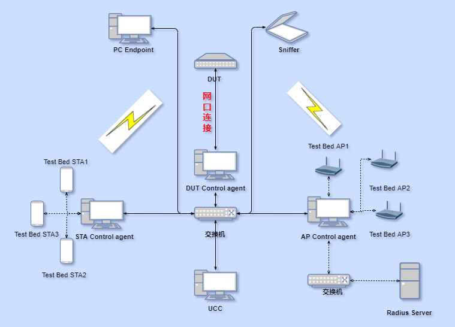
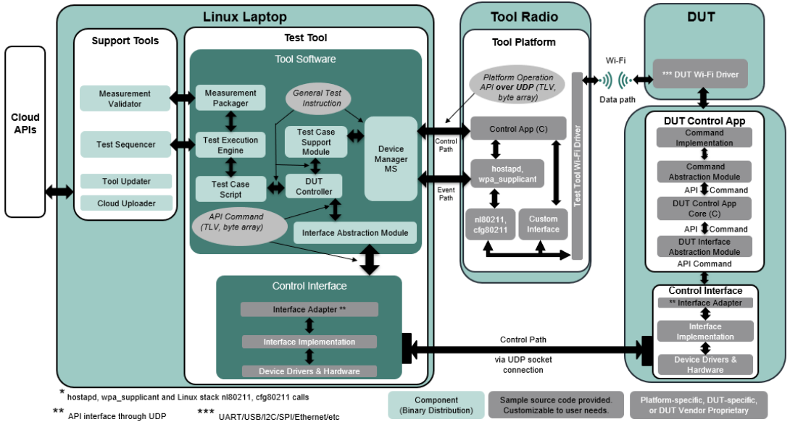
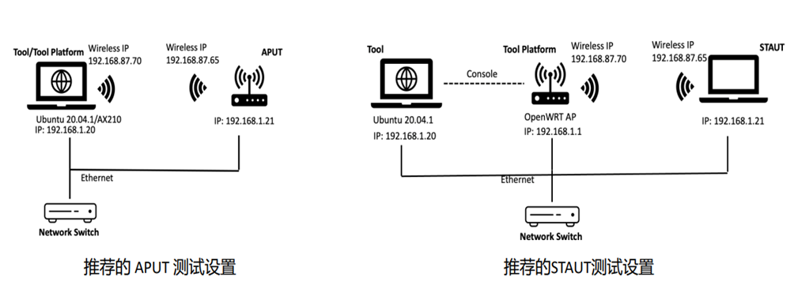
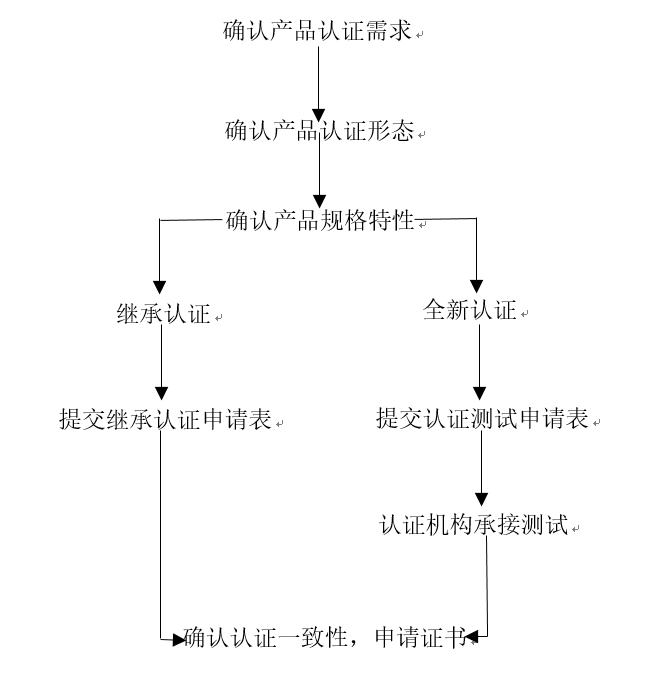
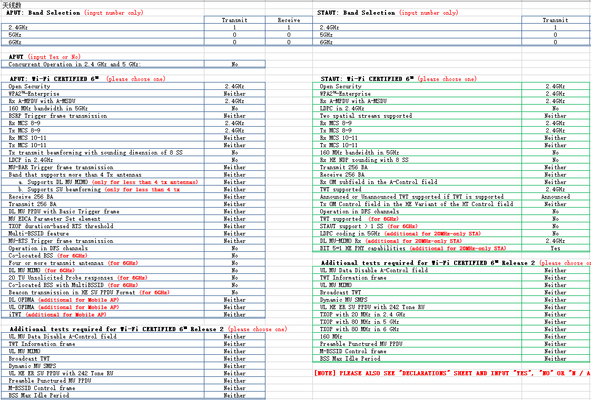

**概述<a name="section141mcpsimp"></a>**

本文针对WS53V100所应用产品如何通过WFA认证提供建议。

# WLAN WFA协议认证介绍<a name="ZH-CN_TOPIC_0000001956080320"></a>

-   **[Wi-Fi协议认证](#ZH-CN_TOPIC_0000001956080316)**  

-   **[WFA Sigma介绍](#ZH-CN_TOPIC_0000001956080328)**  

-   **[WFA QuickTrack介绍](#ZH-CN_TOPIC_0000001956080332)**  

## Wi-Fi协议认证<a name="ZH-CN_TOPIC_0000001956080316"></a>

-   **[概述](#ZH-CN_TOPIC_0000001992959445)**  

-   **[认证特性](#ZH-CN_TOPIC_0000001992799621)**  

### 概述<a name="ZH-CN_TOPIC_0000001992959445"></a>

WFA（Wi-Fi Alliance），即Wi-Fi联盟简称。Wi-Fi联盟认证是自愿性认证，它针对的是IEEE802.11标准的无线局域网产品，其核心为测试和认证。鉴于会员公司之间存在相互竞争，利益冲突难免存在，WFA制定了严格的规章制度和测试与认证的程序全权委托独立第三方机构来测试。由需要认证的公司在WFA官网提交认证申请后选择有资质的实验室进行测试。

通过WFA认证的产品，即可获得由WFA颁发的Wi-Fi兼容性证书，一个可以印在产品上的Wi-Fi logo:

### 认证特性<a name="ZH-CN_TOPIC_0000001992799621"></a>

Wi-Fi Alliance提供的认证特性主要包括：11AX/AC/N、WPA2、FFD（漏洞测试）、PMF、WPA3、MBO、OWE、WPS、WMM-PS、Direct STA \(P2P\)、Qos Management、Easy Mesh、WMM-AC等

WS53主要进行11AX 、11N、PMF 、WMMPS\_STA、WPA2/WPA3、MBO\_STA、FFD（漏洞测试）等特性测试。

## WFA Sigma介绍<a name="ZH-CN_TOPIC_0000001956080328"></a>

-   **[环境简介](#ZH-CN_TOPIC_0000001956080324)**  

-   **[控制设备（控制网络）](#ZH-CN_TOPIC_0000001992959433)**  

-   **[被控设备](#ZH-CN_TOPIC_0000001992959441)**  

-   **[Sigma测试组网](#ZH-CN_TOPIC_0000001992959429)**  

### 环境简介<a name="ZH-CN_TOPIC_0000001956080324"></a>

WFA认证测试是一个通过Sigma自动化完成的系统工程。 Sigma是Wi-Fi测试的一种执行方式，结构比较复杂，是由一系列的基本测试平台和Wi-Fi特性测试平台功能组成。根据传送数据的介质，可分为有线网络和无线网络；从测试的角度看可分为控制网络和测试网络，控制网络用于传输各种复杂的命令，反馈测试结果；测试网络用于测试设备与测试基准设备之间的通信。

为了实现Wi-Fi Sigma自动化，需要准备一些基础的测试平台和设备，以及各种特性测试的设备，这些基本的设备和平台是构成Sigma自动化测试平台的基础；包含的基础设备如下：

-   **UCC控制台：XP或WIN7系统**

    Wi-Fi Alliance为企业级测试提供Client Certificate，文件名：cas.pem、Wi-Fiuser.pem、caswin.pem。

-   **AP Agent：XP或WIN7\(64位\)系统**

    必须是两个以太口，一个连接测试网络，一个连接控制网络。

-   **PC Endpoint：Debian 6.X 、Ubuntu、Fedora Linux系统**

    必须是两个以太口，一个连接测试网络，一个连接控制网络。

-   **Sniffer：Debian、Ubuntu、Fedora系统**

### 控制设备（控制网络）<a name="ZH-CN_TOPIC_0000001992959433"></a>

控制网络主要是发送和解析控制命令，并返回测试结果； 主要包括UCC、DUT Control agent、AP Control agent、STA Control agent等设备，分别对应PC Endpoint、 DUT、Test Bed AP、Test Bed STA。

### 被控设备<a name="ZH-CN_TOPIC_0000001992959441"></a>

其他设备均可归结为被控设备，这些设备完成Wi-Fi的业务测试，从Wi-Fi业务测试角度看，被控设备有如下分类：

1.  被测设备DUT：被测设备是Sigma测试的核心，指的是待认证产品，所有的测试项目都是检测待测设备是否符合协议规范。
2.  基准测试设备：Sigma提供了一些商业的STA、AP作为测试基准，用于和被测设备进行业务交互。
3.  其他设备：
    -   Sniffer：用于空口抓包，通过tshark启动Wireshark。

        对于Sigma PMF自动化平台测试，Sniffer PC除了要抓取空口的协议帧外，还要通过以太网与测试网络有线连接，抓取有线的以太网包，特别是企业级加密AP与认证服务器之间的EAPOL帧。

    -   PC Endpoint：用于数据流量测试。
    -   EMT：无线攻击设备（MAC测试员）。
    -   Power Switch：电源切换，控制AP的电源通断。
    -   Radius Server：用于企业级测试，做加密服务器。

### Sigma测试组网<a name="ZH-CN_TOPIC_0000001992959429"></a>



## WFA QuickTrack介绍<a name="ZH-CN_TOPIC_0000001956080332"></a>

-   **[环境简介](#ZH-CN_TOPIC_0000001992959453)**  

-   **[控制设备](#ZH-CN_TOPIC_0000001992799673)**  

-   **[QuickTrack测试组网](#ZH-CN_TOPIC_0000001956080368)**  

### 环境简介<a name="ZH-CN_TOPIC_0000001992959453"></a>

QuickTrack是一致性测试流程和工具，可用于Wi-Fi Alliance会员对终端产品进行质量测试和认证，QuickTrack为Wi-Fi产品认证提供了更简单、更低成本的选项，这种认证方式允许Wi-Fi联盟成员构建基于合格解决方案的模块、芯片和其它解决方案创造了先决条件（上游solution provider通过全部认证生成了预认证，下游end-product developers使用上游的预认证仅仅进行QuickTrack认证即可），使用QuickTrack，产品开发人员可以开发更多符合Wi-Fi联盟标准的创新产品。

### 控制设备<a name="ZH-CN_TOPIC_0000001992799673"></a>

控制网络主要是发送和解析控制命令，并返回测试结果； 主要包括的设备Tool/Tool Platform、Network Switch、APUT、STAUT、DUT

QuickTrack架构和信号流：



### QuickTrack测试组网<a name="ZH-CN_TOPIC_0000001956080368"></a>



# WS53 WFA认证<a name="ZH-CN_TOPIC_0000001992799645"></a>

-   **[认证流程](#ZH-CN_TOPIC_0000002015644309)**  

-   **[认证环境搭建](#ZH-CN_TOPIC_0000001992959477)**  

-   **[认证测试启动](#ZH-CN_TOPIC_0000001992799649)**  

-   **[WS53特性支持情况](#ZH-CN_TOPIC_0000001956080344)**  

-   **[常见问题&测试命令汇总\(FAQ\)](#ZH-CN_TOPIC_0000001992799641)**  

## 认证流程<a name="ZH-CN_TOPIC_0000002015644309"></a>



## 认证环境搭建<a name="ZH-CN_TOPIC_0000001992959477"></a>

-   **[软件版本](#ZH-CN_TOPIC_0000001992959461)**  

-   **[组网方式](#ZH-CN_TOPIC_0000001992959485)**  

### 软件版本<a name="ZH-CN_TOPIC_0000001992959461"></a>

向芯片厂获取支持WFA认证的软件版本。

### 组网方式<a name="ZH-CN_TOPIC_0000001992959485"></a>

WS53单板不具备有线网口，单板需要通过串口小板外接串口服务器，再通过有线网络接通认证平台。Sigma测试采用TCP网络协议，QuickTrack测试采用UDP网络协议，串口服务器端口号与认证平台配置的端口号一致。

## 认证测试启动<a name="ZH-CN_TOPIC_0000001992799649"></a>

-   **[Sigma测试](#ZH-CN_TOPIC_0000001992799661)**  

-   **[QuickTrack测试](#ZH-CN_TOPIC_0000001992799653)**  

### Sigma测试<a name="ZH-CN_TOPIC_0000001992799661"></a>

单板上电后启动Sigma工具，命令如下：

```
AT+SIGMA=0
```

### QuickTrack测试<a name="ZH-CN_TOPIC_0000001992799653"></a>

单板上电后启动Sigma工具，命令如下：

AT+SIGMA=x

说明：x=1时为APUT模式，x=2时为STAUT模式。

## WS53特性支持情况<a name="ZH-CN_TOPIC_0000001956080344"></a>

-   **[11N](#ZH-CN_TOPIC_0000001992959449)**  

-   **[11AX](#ZH-CN_TOPIC_0000001992959469)**  

-   **[WPA3](#ZH-CN_TOPIC_0000001992799657)**  

-   **[MBO](#ZH-CN_TOPIC_0000001992959465)**  

-   **[WPA2](#ZH-CN_TOPIC_0000001992959437)**  

-   **[FFD](#ZH-CN_TOPIC_0000001956080352)**  

-   **[PMF](#ZH-CN_TOPIC_0000001956080336)**  

-   **[OWE](#ZH-CN_TOPIC_0000001992959473)**  

-   **[WMM-PS](#ZH-CN_TOPIC_0000001992959481)**  

### 11N<a name="ZH-CN_TOPIC_0000001992959449"></a>

<a name="table833mcpsimp"></a>
<table><tbody><tr id="row839mcpsimp"><td class="cellrowborder" valign="top" width="18.63%"><p id="p8594193517454"><a name="p8594193517454"></a><a name="p8594193517454"></a><a name="image859493514517"></a><a name="image859493514517"></a><span></span><strong id="b4594113516458"><a name="b4594113516458"></a><a name="b4594113516458"></a>11N STA</strong></p>
<p id="p841mcpsimp"><a name="p841mcpsimp"></a><a name="p841mcpsimp"></a><strong id="b844mcpsimp"><a name="b844mcpsimp"></a><a name="b844mcpsimp"></a><em id="i1359423554517"><a name="i1359423554517"></a><a name="i1359423554517"></a>（含Quick Track）</em></strong></p>
</td>
<td class="cellrowborder" valign="top" width="59.75%"><p id="p9816203413335"><a name="p9816203413335"></a><a name="p9816203413335"></a><em id="i849mcpsimp"><a name="i849mcpsimp"></a><a name="i849mcpsimp"></a>■Frequency Band Mode</em></p>
<p id="p850mcpsimp"><a name="p850mcpsimp"></a><a name="p850mcpsimp"></a><em id="i55931443615"><a name="i55931443615"></a><a name="i55931443615"></a>Selectable（</em><a name="image658910431419"></a><a name="image658910431419"></a><span></span><em id="i165381791827"><a name="i165381791827"></a><a name="i165381791827"></a>2.4GHz  </em><a name="image65341791323"></a><a name="image65341791323"></a><span></span><em id="i95177262023"><a name="i95177262023"></a><a name="i95177262023"></a>5GHz）</em><a name="image16516126728"></a><a name="image16516126728"></a><span></span><em id="i1751815264216"><a name="i1751815264216"></a><a name="i1751815264216"></a>Concurrent（2.4GHz and 5GHz, Simultaneous）</em></p>
<p id="p7742185211339"><a name="p7742185211339"></a><a name="p7742185211339"></a><em id="i186711434922"><a name="i186711434922"></a><a name="i186711434922"></a>■Spectrum & Regulatory ：   </em><a name="image2066920341729"></a><a name="image2066920341729"></a><span></span><em id="i74411361626"><a name="i74411361626"></a><a name="i74411361626"></a>11d    </em><a name="image9440193617210"></a><a name="image9440193617210"></a><span></span><em id="i1544163616213"><a name="i1544163616213"></a><a name="i1544163616213"></a>11h</em></p>
<p id="p1038295603311"><a name="p1038295603311"></a><a name="p1038295603311"></a><em id="i856mcpsimp"><a name="i856mcpsimp"></a><a name="i856mcpsimp"></a>■Optional 802.11n Capabilities</em></p>
<p id="p857mcpsimp"><a name="p857mcpsimp"></a><a name="p857mcpsimp"></a><a name="image1270858821"></a><a name="image1270858821"></a><span></span><em id="i77145813212"><a name="i77145813212"></a><a name="i77145813212"></a>A-MPDU Tx</em></p>
<p id="p859mcpsimp"><a name="p859mcpsimp"></a><a name="p859mcpsimp"></a><a name="image1871075814210"></a><a name="image1871075814210"></a><span></span><em id="i27116586215"><a name="i27116586215"></a><a name="i27116586215"></a>HT Duplicate Mode</em></p>
<p id="p861mcpsimp"><a name="p861mcpsimp"></a><a name="p861mcpsimp"></a><a name="image62108401622"></a><a name="image62108401622"></a><span></span><em id="i72141840025"><a name="i72141840025"></a><a name="i72141840025"></a>OBSS on Extension Channel</em></p>
<p id="p863mcpsimp"><a name="p863mcpsimp"></a><a name="p863mcpsimp"></a><a name="image350901430"></a><a name="image350901430"></a><span></span><em id="i05111711239"><a name="i05111711239"></a><a name="i05111711239"></a>Open network</em></p>
<p id="p865mcpsimp"><a name="p865mcpsimp"></a><a name="p865mcpsimp"></a><a name="image51002421122"></a><a name="image51002421122"></a><span></span><em id="i71015428210"><a name="i71015428210"></a><a name="i71015428210"></a>RIFS</em></p>
<p id="p867mcpsimp"><a name="p867mcpsimp"></a><a name="p867mcpsimp"></a><a name="image125019461523"></a><a name="image125019461523"></a><span></span><em id="i1851144614214"><a name="i1851144614214"></a><a name="i1851144614214"></a>Power Management</em></p>
<p id="p869mcpsimp"><a name="p869mcpsimp"></a><a name="p869mcpsimp"></a><a name="image209681941133"></a><a name="image209681941133"></a><span></span><em id="i1996911410313"><a name="i1996911410313"></a><a name="i1996911410313"></a>S</em><em id="i3181121639"><a name="i3181121639"></a><a name="i3181121639"></a>hort Guard Interval</em></p>
<p id="p871mcpsimp"><a name="p871mcpsimp"></a><a name="p871mcpsimp"></a><a name="image1162013101436"></a><a name="image1162013101436"></a><span></span><em id="i8621141013319"><a name="i8621141013319"></a><a name="i8621141013319"></a>STBC</em></p>
<p id="p873mcpsimp"><a name="p873mcpsimp"></a><a name="p873mcpsimp"></a><a name="image38101611239"></a><a name="image38101611239"></a><span></span><strong id="b19810911436"><a name="b19810911436"></a><a name="b19810911436"></a>WMM （</strong><em id="i875mcpsimp"><a name="i875mcpsimp"></a><a name="i875mcpsimp"></a>Mandatory Test for n mode，</em>If the product is only supporting bg mode，you could chose this item<strong id="b876mcpsimp"><a name="b876mcpsimp"></a><a name="b876mcpsimp"></a>）</strong></p>
<p id="p877mcpsimp"><a name="p877mcpsimp"></a><a name="p877mcpsimp"></a><a name="image69861571315"></a><a name="image69861571315"></a><span></span>WPA-Enterprise <a name="image939711406313"></a><a name="image939711406313"></a><span></span>WPA Personal</p>
<p id="p878mcpsimp"><a name="p878mcpsimp"></a><a name="p878mcpsimp"></a><a name="image720842383117"></a><a name="image720842383117"></a><span></span>WPA2-Enterprise <a name="image04351924173112"></a><a name="image04351924173112"></a><span></span>WPA2 Personal</p>
<p id="p879mcpsimp"><a name="p879mcpsimp"></a><a name="p879mcpsimp"></a><a name="image137277260311"></a><a name="image137277260311"></a><span></span>WEP<a name="image5315164610318"></a><a name="image5315164610318"></a><span></span>OPEN</p>
<p id="p880mcpsimp"><a name="p880mcpsimp"></a><a name="p880mcpsimp"></a>▶Standard EAP Types（for category 3–enterprise devices）</p>
<p id="p593911494327"><a name="p593911494327"></a><a name="p593911494327"></a><a name="image1093812492321"></a><a name="image1093812492321"></a><span></span>EAP AKA<a name="image7938134923220"></a><a name="image7938134923220"></a><span></span>EAP AKA Prime<a name="image893894911328"></a><a name="image893894911328"></a><span></span>EAP-FAST GTC <a name="image493834917326"></a><a name="image493834917326"></a><span></span>EAP-FAST MSCHAPv2<a name="image1993910493329"></a><a name="image1993910493329"></a><span></span>EAP-SIM <a name="image148010161226"></a><a name="image148010161226"></a><span></span>EAP-TLS <a name="image393984915326"></a><a name="image393984915326"></a><span></span>EAP-TTLS <a name="image1293910499328"></a><a name="image1293910499328"></a><span></span>PEAPv0 <a name="image17939154983217"></a><a name="image17939154983217"></a><span></span>PEAPv1<a name="image928168163317"></a><a name="image928168163317"></a><span></span>Preauthentication</p>
<p id="p882mcpsimp"><a name="p882mcpsimp"></a><a name="p882mcpsimp"></a><a name="image6966171114330"></a><a name="image6966171114330"></a><span></span>WPA2-Enterprise mixed mode</p>
</td>
<td class="cellrowborder" valign="top" width="21.62%"><p id="p884mcpsimp"><a name="p884mcpsimp"></a><a name="p884mcpsimp"></a><em id="i885mcpsimp"><a name="i885mcpsimp"></a><a name="i885mcpsimp"></a>Mandatory Test</em></p>
<p id="p886mcpsimp"><a name="p886mcpsimp"></a><a name="p886mcpsimp"></a><em id="i887mcpsimp"><a name="i887mcpsimp"></a><a name="i887mcpsimp"></a>throughput test tool</em></p>
<p id="p888mcpsimp"><a name="p888mcpsimp"></a><a name="p888mcpsimp"></a><a name="image68681834143420"></a><a name="image68681834143420"></a><span></span><em id="i10869183413344"><a name="i10869183413344"></a><a name="i10869183413344"></a>-WTS（Sigma）tool</em></p>
<p id="p890mcpsimp"><a name="p890mcpsimp"></a><a name="p890mcpsimp"></a><a name="image1925055015220"></a><a name="image1925055015220"></a><span></span><em id="i152510509216"><a name="i152510509216"></a><a name="i152510509216"></a>-Chariot endpoint</em></p>
<p id="p892mcpsimp"><a name="p892mcpsimp"></a><a name="p892mcpsimp"></a><a name="image486935117216"></a><a name="image486935117216"></a><span></span><em id="i48693511214"><a name="i48693511214"></a><a name="i48693511214"></a>-Iperf（ASD Testplan）</em></p>
</td>
</tr>
<tr id="row894mcpsimp"><td class="cellrowborder" valign="top" width="18.63%"><p id="p1295393714453"><a name="p1295393714453"></a><a name="p1295393714453"></a><a name="image6953237204518"></a><a name="image6953237204518"></a><span></span><strong id="b69531937154519"><a name="b69531937154519"></a><a name="b69531937154519"></a>11N AP</strong></p>
<p id="p896mcpsimp"><a name="p896mcpsimp"></a><a name="p896mcpsimp"></a><strong id="b899mcpsimp"><a name="b899mcpsimp"></a><a name="b899mcpsimp"></a><em id="i1895319371453"><a name="i1895319371453"></a><a name="i1895319371453"></a>（含Quick Track</em><em id="i8605747134219"><a name="i8605747134219"></a><a name="i8605747134219"></a>)</em></strong></p>
</td>
<td class="cellrowborder" valign="top" width="59.75%"><p id="p1679419524612"><a name="p1679419524612"></a><a name="p1679419524612"></a><em id="i904mcpsimp"><a name="i904mcpsimp"></a><a name="i904mcpsimp"></a>■Frequency Band Mode</em></p>
<p id="p905mcpsimp"><a name="p905mcpsimp"></a><a name="p905mcpsimp"></a><em id="i19186232174610"><a name="i19186232174610"></a><a name="i19186232174610"></a>Selectable（</em><a name="image5185932144615"></a><a name="image5185932144615"></a><span></span><em id="i16947439124615"><a name="i16947439124615"></a><a name="i16947439124615"></a>2.4GHz  </em><a name="image1294513399461"></a><a name="image1294513399461"></a><span></span><em id="i113704934612"><a name="i113704934612"></a><a name="i113704934612"></a>5GHz） </em><a name="image3136184964616"></a><a name="image3136184964616"></a><span></span><em id="i01371949124614"><a name="i01371949124614"></a><a name="i01371949124614"></a>Concurrent（2.4GHz and 5GHz, Simultaneous）</em></p>
<p id="p45041611144612"><a name="p45041611144612"></a><a name="p45041611144612"></a><em id="i48451054184618"><a name="i48451054184618"></a><a name="i48451054184618"></a>■Spectrum & Regulatory ：   </em><a name="image48444543461"></a><a name="image48444543461"></a><span></span><em id="i72360579463"><a name="i72360579463"></a><a name="i72360579463"></a>11d    </em><a name="image523675734612"></a><a name="image523675734612"></a><span></span><em id="i11236105764617"><a name="i11236105764617"></a><a name="i11236105764617"></a>11h</em></p>
<p id="p1443121212466"><a name="p1443121212466"></a><a name="p1443121212466"></a><em id="i911mcpsimp"><a name="i911mcpsimp"></a><a name="i911mcpsimp"></a>■Optional 802.11n Capabilities</em></p>
<p id="p912mcpsimp"><a name="p912mcpsimp"></a><a name="p912mcpsimp"></a><a name="image1044193114720"></a><a name="image1044193114720"></a><span></span><em id="i1844110319477"><a name="i1844110319477"></a><a name="i1844110319477"></a>A-MPDU Tx</em></p>
<p id="p914mcpsimp"><a name="p914mcpsimp"></a><a name="p914mcpsimp"></a><a name="image12584131174715"></a><a name="image12584131174715"></a><span></span><em id="i8586611475"><a name="i8586611475"></a><a name="i8586611475"></a>Concurrent multiband operation</em></p>
<p id="p916mcpsimp"><a name="p916mcpsimp"></a><a name="p916mcpsimp"></a><a name="image889518719477"></a><a name="image889518719477"></a><span></span><em id="i118962716473"><a name="i118962716473"></a><a name="i118962716473"></a>HT Duplicate Mode</em></p>
<p id="p918mcpsimp"><a name="p918mcpsimp"></a><a name="p918mcpsimp"></a><a name="image1713694214472"></a><a name="image1713694214472"></a><span></span><em id="i11136144215478"><a name="i11136144215478"></a><a name="i11136144215478"></a>OBSS on Extension Channel</em></p>
<p id="p920mcpsimp"><a name="p920mcpsimp"></a><a name="p920mcpsimp"></a><a name="image0634511184717"></a><a name="image0634511184717"></a><span></span><em id="i10636011194717"><a name="i10636011194717"></a><a name="i10636011194717"></a>Open network</em></p>
<p id="p922mcpsimp"><a name="p922mcpsimp"></a><a name="p922mcpsimp"></a><a name="image4295104414720"></a><a name="image4295104414720"></a><span></span><em id="i929524404718"><a name="i929524404718"></a><a name="i929524404718"></a>RIFS</em></p>
<p id="p924mcpsimp"><a name="p924mcpsimp"></a><a name="p924mcpsimp"></a><a name="image15275814204710"></a><a name="image15275814204710"></a><span></span><em id="i227741418473"><a name="i227741418473"></a><a name="i227741418473"></a>Short Guard Interval</em></p>
<p id="p926mcpsimp"><a name="p926mcpsimp"></a><a name="p926mcpsimp"></a><a name="image85088194471"></a><a name="image85088194471"></a><span></span><em id="i16509131964710"><a name="i16509131964710"></a><a name="i16509131964710"></a>STBC</em></p>
<p id="p928mcpsimp"><a name="p928mcpsimp"></a><a name="p928mcpsimp"></a><a name="image15305152064711"></a><a name="image15305152064711"></a><span></span><strong id="b5306192054720"><a name="b5306192054720"></a><a name="b5306192054720"></a>WMM <em id="i12306172094715"><a name="i12306172094715"></a><a name="i12306172094715"></a>（</em></strong><em id="i930mcpsimp"><a name="i930mcpsimp"></a><a name="i930mcpsimp"></a>Mandatory Test for n mode，</em>If the product is only supporting bg mode，you could chose this item）</p>
<p id="p932mcpsimp"><a name="p932mcpsimp"></a><a name="p932mcpsimp"></a><a name="image21961646184715"></a><a name="image21961646184715"></a><span></span>WPA-Enterprise <a name="image35657250474"></a><a name="image35657250474"></a><span></span>WPA Personal</p>
<p id="p933mcpsimp"><a name="p933mcpsimp"></a><a name="p933mcpsimp"></a><a name="image12736347104710"></a><a name="image12736347104710"></a><span></span>WPA2-Enterprise <a name="image16866726184711"></a><a name="image16866726184711"></a><span></span>WPA2 Personal</p>
<p id="p934mcpsimp"><a name="p934mcpsimp"></a><a name="p934mcpsimp"></a><a name="image1317117377476"></a><a name="image1317117377476"></a><span></span>WEP<a name="image636620368479"></a><a name="image636620368479"></a><span></span>OPEN</p>
<p id="p198532015114516"><a name="p198532015114516"></a><a name="p198532015114516"></a>Standard EAP Types<em id="i1676584218459"><a name="i1676584218459"></a><a name="i1676584218459"></a>（</em>for category 3 – enterprise devices）</p>
<p id="p935mcpsimp"><a name="p935mcpsimp"></a><a name="p935mcpsimp"></a><a name="image1875651174717"></a><a name="image1875651174717"></a><span></span>EAP AKA<a name="image1395695519476"></a><a name="image1395695519476"></a><span></span>EAP AKA Prime<a name="image95461659164712"></a><a name="image95461659164712"></a><span></span>EAP-FAST GTC <a name="image163161933483"></a><a name="image163161933483"></a><span></span>EAP-FAST MSCHAPv2<a name="image18366578481"></a><a name="image18366578481"></a><span></span>EAP-SIM <a name="image178560141484"></a><a name="image178560141484"></a><span></span>EAP-TLS <a name="image1465851615489"></a><a name="image1465851615489"></a><span></span>EAP-TTLS <a name="image14486112074812"></a><a name="image14486112074812"></a><span></span>PEAPv0 <a name="image77974224486"></a><a name="image77974224486"></a><span></span>PEAPv1</p>
</td>
<td class="cellrowborder" valign="top" width="21.62%"><p id="p938mcpsimp"><a name="p938mcpsimp"></a><a name="p938mcpsimp"></a><em id="i939mcpsimp"><a name="i939mcpsimp"></a><a name="i939mcpsimp"></a>Mandatory Test</em></p>
<p id="p940mcpsimp"><a name="p940mcpsimp"></a><a name="p940mcpsimp"></a><em id="i941mcpsimp"><a name="i941mcpsimp"></a><a name="i941mcpsimp"></a>throughput test tool</em></p>
<p id="p942mcpsimp"><a name="p942mcpsimp"></a><a name="p942mcpsimp"></a><a name="image860716424485"></a><a name="image860716424485"></a><span></span><em id="i1160964212486"><a name="i1160964212486"></a><a name="i1160964212486"></a>- WTS (Sigma) tool</em></p>
<p id="p944mcpsimp"><a name="p944mcpsimp"></a><a name="p944mcpsimp"></a><a name="image17647183564819"></a><a name="image17647183564819"></a><span></span><em id="i6649435164819"><a name="i6649435164819"></a><a name="i6649435164819"></a>- Chariot endpoint</em></p>
<p id="p946mcpsimp"><a name="p946mcpsimp"></a><a name="p946mcpsimp"></a><a name="image5636153618482"></a><a name="image5636153618482"></a><span></span><em id="i6636133617482"><a name="i6636133617482"></a><a name="i6636133617482"></a>- Iperf (ASD Testplan)</em></p>
</td>
</tr>
</tbody>
</table>

### 11AX<a name="ZH-CN_TOPIC_0000001992959469"></a>

<a name="table777mcpsimp"></a>
<table><tbody><tr id="row783mcpsimp"><td class="cellrowborder" valign="top" width="25.650000000000002%"><p id="p785mcpsimp"><a name="p785mcpsimp"></a><a name="p785mcpsimp"></a><a name="image35657250474"></a><a name="image35657250474"></a><span></span><strong id="b1176665314447"><a name="b1176665314447"></a><a name="b1176665314447"></a>802.11ax STA</strong></p>
<p id="p787mcpsimp"><a name="p787mcpsimp"></a><a name="p787mcpsimp"></a><a name="image426254911118"></a><a name="image426254911118"></a><span></span><strong id="b16344755174412"><a name="b16344755174412"></a><a name="b16344755174412"></a>802.11ax STA Release 2</strong></p>
<p id="p789mcpsimp"><a name="p789mcpsimp"></a><a name="p789mcpsimp"></a><a name="image103261158318"></a><a name="image103261158318"></a><span></span><strong id="b1363825864413"><a name="b1363825864413"></a><a name="b1363825864413"></a>802.11ax AP</strong></p>
<p id="p791mcpsimp"><a name="p791mcpsimp"></a><a name="p791mcpsimp"></a><a name="image13514175913447"></a><a name="image13514175913447"></a><span></span><strong id="b125142597443"><a name="b125142597443"></a><a name="b125142597443"></a>802.11ax AP Release 2</strong></p>
</td>
<td class="cellrowborder" valign="top" width="41.510000000000005%"><p class="msonormal" id="p794mcpsimp"><a name="p794mcpsimp"></a><a name="p794mcpsimp"></a>Please fill the optional case for AP or STA如<a href="#fig3741172114221">图1</a>所示。</p>
<p id="p14420246116"><a name="p14420246116"></a><a name="p14420246116"></a></p>
</td>
<td class="cellrowborder" valign="top" width="32.84%"><p id="p796mcpsimp"><a name="p796mcpsimp"></a><a name="p796mcpsimp"></a>Prerequisite:  WPA3、MBO、11AC、PMF、11N</p>
<p id="p797mcpsimp"><a name="p797mcpsimp"></a><a name="p797mcpsimp"></a><em id="i798mcpsimp"><a name="i798mcpsimp"></a><a name="i798mcpsimp"></a>Mandatory for </em>sigma tool for STA</p>
<p id="p799mcpsimp"><a name="p799mcpsimp"></a><a name="p799mcpsimp"></a>STA必须提供sigma工具</p>
<p id="p800mcpsimp"><a name="p800mcpsimp"></a><a name="p800mcpsimp"></a>/AP没有sigma工具时必须客户支持</p>
</td>
</tr>
</tbody>
</table>

**图 1**  Wi-Fi\_CERTIFIED\_6 information<a name="fig3741172114221"></a>  


### WPA3<a name="ZH-CN_TOPIC_0000001992799657"></a>

<a name="table709mcpsimp"></a>
<table><tbody><tr id="row715mcpsimp"><td class="cellrowborder" valign="top" width="23.23%"><p id="p717mcpsimp"><a name="p717mcpsimp"></a><a name="p717mcpsimp"></a><a name="image137161334174419"></a><a name="image137161334174419"></a><span></span><strong id="b137186341442"><a name="b137186341442"></a><a name="b137186341442"></a>WPA3 STA<em id="i11718234164415"><a name="i11718234164415"></a><a name="i11718234164415"></a>(含Quick Track)</em></strong></p>
<p id="p720mcpsimp"><a name="p720mcpsimp"></a><a name="p720mcpsimp"></a><a name="image1937619353447"></a><a name="image1937619353447"></a><span></span><strong id="b143761635144416"><a name="b143761635144416"></a><a name="b143761635144416"></a>WPA3 AP<em id="i5376183514420"><a name="i5376183514420"></a><a name="i5376183514420"></a>(含Quick Track)</em></strong></p>
</td>
<td class="cellrowborder" valign="top" width="53.54%"><p id="p724mcpsimp"><a name="p724mcpsimp"></a><a name="p724mcpsimp"></a><a name="image35657250474"></a><a name="image35657250474"></a><span></span>WPA3 Personal AP</p>
<p id="p725mcpsimp"><a name="p725mcpsimp"></a><a name="p725mcpsimp"></a><a name="image19898052433"></a><a name="image19898052433"></a><span></span>WPA3-Personal  AP--group 的20</p>
<p id="p726mcpsimp"><a name="p726mcpsimp"></a><a name="p726mcpsimp"></a><a name="image16448155315314"></a><a name="image16448155315314"></a><span></span>WPA3-Personal  AP--group 的21</p>
<p id="p727mcpsimp"><a name="p727mcpsimp"></a><a name="p727mcpsimp"></a><a name="image95461659164712"></a><a name="image95461659164712"></a><span></span>Fast Transition OTA on WPA3-Personal</p>
<p id="p728mcpsimp"><a name="p728mcpsimp"></a><a name="p728mcpsimp"></a><a name="image15518211113710"></a><a name="image15518211113710"></a><span></span>Fast Transition OTA on WPA3- Personal transition mode</p>
<p id="p729mcpsimp"><a name="p729mcpsimp"></a><a name="p729mcpsimp"></a><a name="image68514247373"></a><a name="image68514247373"></a><span></span>Fast Transition OTDS on WPA3- Personal</p>
<p id="p730mcpsimp"><a name="p730mcpsimp"></a><a name="p730mcpsimp"></a><a name="image17227102817374"></a><a name="image17227102817374"></a><span></span>WPA3 Personal STA</p>
<p id="p731mcpsimp"><a name="p731mcpsimp"></a><a name="p731mcpsimp"></a><a name="image10746811740"></a><a name="image10746811740"></a><span></span>WPA3-Personal  STA--group 的20</p>
<p id="p732mcpsimp"><a name="p732mcpsimp"></a><a name="p732mcpsimp"></a><a name="image81977122415"></a><a name="image81977122415"></a><span></span>WPA3-Personal  STA--group 的21</p>
<p id="p733mcpsimp"><a name="p733mcpsimp"></a><a name="p733mcpsimp"></a><a name="image1295716333378"></a><a name="image1295716333378"></a><span></span>Fast Transition OTA on WPA3-Personal</p>
<p id="p734mcpsimp"><a name="p734mcpsimp"></a><a name="p734mcpsimp"></a><a name="image8728103453719"></a><a name="image8728103453719"></a><span></span>Fast Transition OTA on WPA3- Personal transition mode</p>
<p id="p735mcpsimp"><a name="p735mcpsimp"></a><a name="p735mcpsimp"></a><a name="image53875353378"></a><a name="image53875353378"></a><span></span>Fast Transition OTDS on WPA3- Personal</p>
<p id="p736mcpsimp"><a name="p736mcpsimp"></a><a name="p736mcpsimp"></a><a name="image753916496382"></a><a name="image753916496382"></a><span></span>WPA3Enterprise   <a name="image1790916012392"></a><a name="image1790916012392"></a><span></span>STA   <a name="image619710515392"></a><a name="image619710515392"></a><span></span>AP</p>
<p id="p737mcpsimp"><a name="p737mcpsimp"></a><a name="p737mcpsimp"></a><a name="image336854153713"></a><a name="image336854153713"></a><span></span>WPA3 - Suit B (Optional for 192bit-enterprise)   <a name="image82566452373"></a><a name="image82566452373"></a><span></span>IPv6  <a name="image884744683717"></a><a name="image884744683717"></a><span></span>PMk caching</p>
<p id="p738mcpsimp"><a name="p738mcpsimp"></a><a name="p738mcpsimp"></a><a name="image7556144993714"></a><a name="image7556144993714"></a><span></span>Fast Transition OTA on WPA3-Enterprise</p>
<p id="p739mcpsimp"><a name="p739mcpsimp"></a><a name="p739mcpsimp"></a><a name="image1194785015370"></a><a name="image1194785015370"></a><span></span>Fast Transition OTA on WPA3-Enterprise transition mode</p>
<p id="p740mcpsimp"><a name="p740mcpsimp"></a><a name="p740mcpsimp"></a><a name="image18557165420371"></a><a name="image18557165420371"></a><span></span>Fast Transition OTDS on WPA3-Enterprise</p>
<p id="p741mcpsimp"><a name="p741mcpsimp"></a><a name="p741mcpsimp"></a>Server Certificate Validation  (SCV)(Conditional) Mandatory</p>
<p id="p742mcpsimp"><a name="p742mcpsimp"></a><a name="p742mcpsimp"></a>针对STA: 支持 WPA2-enterprise，必须测试WPA3-SCV，请勾选如下内容：</p>
<p id="p743mcpsimp"><a name="p743mcpsimp"></a><a name="p743mcpsimp"></a>(For STA: WPA2-enterprise support, WPA3-SCV must be tested),Please check the following:</p>
<p id="p746mcpsimp"><a name="p746mcpsimp"></a><a name="p746mcpsimp"></a><a name="image31071814382"></a><a name="image31071814382"></a><span></span>UOSC=enabled <a name="image715315203396"></a><a name="image715315203396"></a><span></span>UOSC=disabled</p>
<p id="p747mcpsimp"><a name="p747mcpsimp"></a><a name="p747mcpsimp"></a>EAP credential configuration:</p>
<p id="p748mcpsimp"><a name="p748mcpsimp"></a><a name="p748mcpsimp"></a><a name="image14837775380"></a><a name="image14837775380"></a><span></span>(a) explicitly-configured server certificate</p>
<p id="p749mcpsimp"><a name="p749mcpsimp"></a><a name="p749mcpsimp"></a><a name="image17957161013810"></a><a name="image17957161013810"></a><span></span>(b) server domain (FQDN) + root CA</p>
<p id="p750mcpsimp"><a name="p750mcpsimp"></a><a name="p750mcpsimp"></a><a name="image9738141203814"></a><a name="image9738141203814"></a><span></span>(c) server domain suffix + root CA?</p>
<p id="p751mcpsimp"><a name="p751mcpsimp"></a><a name="p751mcpsimp"></a><a name="image39281123173910"></a><a name="image39281123173910"></a><span></span>(d) root CA only</p>
<p id="p752mcpsimp"><a name="p752mcpsimp"></a><a name="p752mcpsimp"></a><a name="image556751610385"></a><a name="image556751610385"></a><span></span>(e) server domain (FQDN) + root store</p>
<p id="p753mcpsimp"><a name="p753mcpsimp"></a><a name="p753mcpsimp"></a><a name="image860721763814"></a><a name="image860721763814"></a><span></span>(f) server domain suffix + root store</p>
<p id="p754mcpsimp"><a name="p754mcpsimp"></a><a name="p754mcpsimp"></a><a name="image1668132013816"></a><a name="image1668132013816"></a><span></span>Network Profile Configuration</p>
<p id="p755mcpsimp"><a name="p755mcpsimp"></a><a name="p755mcpsimp"></a><a name="image1130716211381"></a><a name="image1130716211381"></a><span></span>IMSI privacy protection(WPA3 Enterprise)</p>
<p id="p756mcpsimp"><a name="p756mcpsimp"></a><a name="p756mcpsimp"></a>Note：WPA3 STA 的企业级的加密方式功能和WPA2基本相同</p>
<p id="p757mcpsimp"><a name="p757mcpsimp"></a><a name="p757mcpsimp"></a>Note: The enterprise-level encryption function of WPA3 STA is almost the same with WPA2</p>
</td>
<td class="cellrowborder" valign="top" width="23.23%"><p id="p759mcpsimp"><a name="p759mcpsimp"></a><a name="p759mcpsimp"></a><em id="i760mcpsimp"><a name="i760mcpsimp"></a><a name="i760mcpsimp"></a>Mandatory Test</em></p>
</td>
</tr>
<tr id="row761mcpsimp"><td class="cellrowborder" valign="top" width="23.23%"><p id="p763mcpsimp"><a name="p763mcpsimp"></a><a name="p763mcpsimp"></a><a name="image3971112711442"></a><a name="image3971112711442"></a><span></span><strong id="b99744271440"><a name="b99744271440"></a><a name="b99744271440"></a>WPA3 R3 STA</strong></p>
<p id="p765mcpsimp"><a name="p765mcpsimp"></a><a name="p765mcpsimp"></a><a name="image12985328194419"></a><a name="image12985328194419"></a><span></span><strong id="b2986102864420"><a name="b2986102864420"></a><a name="b2986102864420"></a>WPA3 R3 AP</strong></p>
</td>
<td class="cellrowborder" valign="top" width="53.54%"><p id="p768mcpsimp"><a name="p768mcpsimp"></a><a name="p768mcpsimp"></a>Optional Case</p>
<p id="p769mcpsimp"><a name="p769mcpsimp"></a><a name="p769mcpsimp"></a><a name="image19508202712389"></a><a name="image19508202712389"></a><span></span>Beacon Protection</p>
<p id="p770mcpsimp"><a name="p770mcpsimp"></a><a name="p770mcpsimp"></a><a name="image26587299386"></a><a name="image26587299386"></a><span></span>Public Key</p>
<p id="p771mcpsimp"><a name="p771mcpsimp"></a><a name="p771mcpsimp"></a><a name="image697163033816"></a><a name="image697163033816"></a><span></span>Privacy Extensions</p>
<p id="p772mcpsimp"><a name="p772mcpsimp"></a><a name="p772mcpsimp"></a><a name="image117370306389"></a><a name="image117370306389"></a><span></span>Operation Channel Validation</p>
</td>
<td class="cellrowborder" valign="top" width="23.23%"><p id="p774mcpsimp"><a name="p774mcpsimp"></a><a name="p774mcpsimp"></a><em id="i775mcpsimp"><a name="i775mcpsimp"></a><a name="i775mcpsimp"></a>Mandatory Test(after 2021.12.1)</em></p>
</td>
</tr>
</tbody>
</table>

### MBO<a name="ZH-CN_TOPIC_0000001992959465"></a>

<a name="table111mcpsimp"></a>
<table><tbody><tr id="row117mcpsimp"><td class="cellrowborder" valign="top" width="23.23%"><p id="p119mcpsimp"><a name="p119mcpsimp"></a><a name="p119mcpsimp"></a><a name="image12985328194419"></a><a name="image12985328194419"></a><span></span><strong id="b724519413468"><a name="b724519413468"></a><a name="b724519413468"></a>MBO STA</strong></p>
<p id="p121mcpsimp"><a name="p121mcpsimp"></a><a name="p121mcpsimp"></a><a name="image95461659164712"></a><a name="image95461659164712"></a><span></span><strong id="b103241257124511"><a name="b103241257124511"></a><a name="b103241257124511"></a>MBO  AP</strong></p>
</td>
<td class="cellrowborder" valign="top" width="53.54%"><p id="p124mcpsimp"><a name="p124mcpsimp"></a><a name="p124mcpsimp"></a><strong id="b125mcpsimp"><a name="b125mcpsimp"></a><a name="b125mcpsimp"></a><em id="i126mcpsimp"><a name="i126mcpsimp"></a><a name="i126mcpsimp"></a>STA:</em></strong></p>
<p id="p127mcpsimp"><a name="p127mcpsimp"></a><a name="p127mcpsimp"></a><a name="image659311715462"></a><a name="image659311715462"></a><span></span>Q1 Is the STAUT cellular data capable?</p>
<p id="p128mcpsimp"><a name="p128mcpsimp"></a><a name="p128mcpsimp"></a><a name="image1113381819467"></a><a name="image1113381819467"></a><span></span>Q2 Does STAUT support ANQP?</p>
<p id="p129mcpsimp"><a name="p129mcpsimp"></a><a name="p129mcpsimp"></a><a name="image5734161844618"></a><a name="image5734161844618"></a><span></span>Q3 Does STAUT support FT with WPA2-Enterprise (802.1X)?</p>
<p id="p130mcpsimp"><a name="p130mcpsimp"></a><a name="p130mcpsimp"></a><a name="image87549814611"></a><a name="image87549814611"></a><span></span>Q4 Does STAUT support FT with WPA2-Personal?</p>
<p id="p131mcpsimp"><a name="p131mcpsimp"></a><a name="p131mcpsimp"></a><a name="image153832109461"></a><a name="image153832109461"></a><span></span>Q5 Does STAUT support BTM Query?</p>
<p id="p132mcpsimp"><a name="p132mcpsimp"></a><a name="p132mcpsimp"></a><a name="image1171361117465"></a><a name="image1171361117465"></a><span></span>Q6 Which Beacon Report Measurement Modes are supported by the STAUT?  Passive</p>
<p id="p133mcpsimp"><a name="p133mcpsimp"></a><a name="p133mcpsimp"></a><a name="image71531915114620"></a><a name="image71531915114620"></a><span></span>Q7 Which Beacon Report Measurement Modes are supported by the STAUT?  Active</p>
<p id="p134mcpsimp"><a name="p134mcpsimp"></a><a name="p134mcpsimp"></a><a name="image892362194613"></a><a name="image892362194613"></a><span></span>Q8 Does the APUT support 6 GHz band operation?</p>
<p id="p135mcpsimp"><a name="p135mcpsimp"></a><a name="p135mcpsimp"></a><strong id="b136mcpsimp"><a name="b136mcpsimp"></a><a name="b136mcpsimp"></a><em id="i137mcpsimp"><a name="i137mcpsimp"></a><a name="i137mcpsimp"></a>AP:</em></strong></p>
<p id="p138mcpsimp"><a name="p138mcpsimp"></a><a name="p138mcpsimp"></a><a name="image1875373174610"></a><a name="image1875373174610"></a><span></span>Q1 Is the APUT cellular data aware?</p>
<p id="p139mcpsimp"><a name="p139mcpsimp"></a><a name="p139mcpsimp"></a><a name="image1148373284616"></a><a name="image1148373284616"></a><span></span>Q2 Does the APUT support 4-frame GAS exchange?</p>
<p id="p140mcpsimp"><a name="p140mcpsimp"></a><a name="p140mcpsimp"></a><a name="image197318320462"></a><a name="image197318320462"></a><span></span>Q3 Does the APUT automatically populate the BSS Transition Candidate List?</p>
<p id="p141mcpsimp"><a name="p141mcpsimp"></a><a name="p141mcpsimp"></a><a name="image166420338468"></a><a name="image166420338468"></a><span></span>Q4 Does APUT support FT with WPA2-Enterprise (802.1X)?</p>
<p id="p142mcpsimp"><a name="p142mcpsimp"></a><a name="p142mcpsimp"></a><a name="image16114163444611"></a><a name="image16114163444611"></a><span></span>Q5 Does APUT support FT with WPA2-Personal?</p>
<p id="p143mcpsimp"><a name="p143mcpsimp"></a><a name="p143mcpsimp"></a><a name="image093143518469"></a><a name="image093143518469"></a><span></span>Q6 Does the APUT support 6 GHz band operation?</p>
</td>
<td class="cellrowborder" valign="top" width="23.23%"><p id="p145mcpsimp"><a name="p145mcpsimp"></a><a name="p145mcpsimp"></a><em id="i146mcpsimp"><a name="i146mcpsimp"></a><a name="i146mcpsimp"></a>Mandatory for </em>sigma tool for STA</p>
<p id="p147mcpsimp"><a name="p147mcpsimp"></a><a name="p147mcpsimp"></a>STA必须提供sigma 工具</p>
</td>
</tr>
</tbody>
</table>

### WPA2<a name="ZH-CN_TOPIC_0000001992959437"></a>

<a name="table509mcpsimp"></a>
<table><tbody><tr id="row515mcpsimp"><td class="cellrowborder" valign="top" width="44.41%"><p id="p517mcpsimp"><a name="p517mcpsimp"></a><a name="p517mcpsimp"></a><a name="image87549814611"></a><a name="image87549814611"></a><span></span><strong id="b18474311468"><a name="b18474311468"></a><a name="b18474311468"></a><em id="i18841143104618"><a name="i18841143104618"></a><a name="i18841143104618"></a>WPA2 Security Improvement STA/Quick Track</em></strong></p>
<p id="p520mcpsimp"><a name="p520mcpsimp"></a><a name="p520mcpsimp"></a><a name="image16442204654619"></a><a name="image16442204654619"></a><span></span><strong id="b1544411469463"><a name="b1544411469463"></a><a name="b1544411469463"></a><em id="i1644416460460"><a name="i1644416460460"></a><a name="i1644416460460"></a>WPA2 Security Improvement AP/Quick Track</em></strong></p>
</td>
<td class="cellrowborder" valign="top" width="32.36%"><p id="p524mcpsimp"><a name="p524mcpsimp"></a><a name="p524mcpsimp"></a>-</p>
</td>
<td class="cellrowborder" valign="top" width="23.23%"><p id="p527mcpsimp"><a name="p527mcpsimp"></a><a name="p527mcpsimp"></a><em id="i528mcpsimp"><a name="i528mcpsimp"></a><a name="i528mcpsimp"></a>Mandatory Test</em></p>
</td>
</tr>
</tbody>
</table>

### FFD<a name="ZH-CN_TOPIC_0000001956080352"></a>

<a name="table408mcpsimp"></a>
<table><tbody><tr id="row414mcpsimp"><td class="cellrowborder" valign="top" width="23.23%"><p id="p416mcpsimp"><a name="p416mcpsimp"></a><a name="p416mcpsimp"></a><a name="image87549814611"></a><a name="image87549814611"></a><span></span><strong id="b733412034711"><a name="b733412034711"></a><a name="b733412034711"></a><em id="i17334140184720"><a name="i17334140184720"></a><a name="i17334140184720"></a>Vulnerability Detection Test</em> STA<em id="i193348064714"><a name="i193348064714"></a><a name="i193348064714"></a>/Quick Track</em></strong></p>
<p id="p420mcpsimp"><a name="p420mcpsimp"></a><a name="p420mcpsimp"></a><a name="image639316194711"></a><a name="image639316194711"></a><span></span><strong id="b10394101164710"><a name="b10394101164710"></a><a name="b10394101164710"></a><em id="i8394513478"><a name="i8394513478"></a><a name="i8394513478"></a>Vulnerability Detection Test</em> AP<em id="i03941614473"><a name="i03941614473"></a><a name="i03941614473"></a>/Quick Track</em></strong></p>
<p id="p424mcpsimp"><a name="p424mcpsimp"></a><a name="p424mcpsimp"></a><strong id="b425mcpsimp"><a name="b425mcpsimp"></a><a name="b425mcpsimp"></a><em id="i426mcpsimp"><a name="i426mcpsimp"></a><a name="i426mcpsimp"></a>(漏洞测试)</em></strong></p>
</td>
<td class="cellrowborder" valign="top" width="53.54%"><p id="p428mcpsimp"><a name="p428mcpsimp"></a><a name="p428mcpsimp"></a>-</p>
</td>
<td class="cellrowborder" valign="top" width="23.23%"><p id="p431mcpsimp"><a name="p431mcpsimp"></a><a name="p431mcpsimp"></a><em id="i432mcpsimp"><a name="i432mcpsimp"></a><a name="i432mcpsimp"></a>Mandatory for all STA and 802.11r AP and FILS SK authentication test AP</em></p>
</td>
</tr>
</tbody>
</table>

### PMF<a name="ZH-CN_TOPIC_0000001956080336"></a>

<a name="table482mcpsimp"></a>
<table><tbody><tr id="row488mcpsimp"><td class="cellrowborder" valign="top" width="35.839999999999996%"><p id="p490mcpsimp"><a name="p490mcpsimp"></a><a name="p490mcpsimp"></a><a name="image87549814611"></a><a name="image87549814611"></a><span></span><strong id="b12236747174719"><a name="b12236747174719"></a><a name="b12236747174719"></a>PMF STA<em id="i102361647194713"><a name="i102361647194713"></a><a name="i102361647194713"></a>(含Quick Track)</em></strong></p>
<p id="p493mcpsimp"><a name="p493mcpsimp"></a><a name="p493mcpsimp"></a><a name="image113544489476"></a><a name="image113544489476"></a><span></span><strong id="b9355134819475"><a name="b9355134819475"></a><a name="b9355134819475"></a>PMF AP<em id="i1355164854716"><a name="i1355164854716"></a><a name="i1355164854716"></a>(含Quick Track)</em></strong></p>
</td>
<td class="cellrowborder" valign="top" width="40.93%"><p id="p497mcpsimp"><a name="p497mcpsimp"></a><a name="p497mcpsimp"></a>-</p>
</td>
<td class="cellrowborder" valign="top" width="23.23%"><p id="p500mcpsimp"><a name="p500mcpsimp"></a><a name="p500mcpsimp"></a><em id="i501mcpsimp"><a name="i501mcpsimp"></a><a name="i501mcpsimp"></a>Mandatory Test</em></p>
</td>
</tr>
</tbody>
</table>

### OWE<a name="ZH-CN_TOPIC_0000001992959473"></a>

<a name="table389mcpsimp"></a>
<table><tbody><tr id="row395mcpsimp"><td class="cellrowborder" valign="top" width="36.720000000000006%"><p id="p397mcpsimp"><a name="p397mcpsimp"></a><a name="p397mcpsimp"></a><a name="image87549814611"></a><a name="image87549814611"></a><span></span><strong id="b129705924819"><a name="b129705924819"></a><a name="b129705924819"></a>Enhanced Open (OWE) STA</strong></p>
<p id="p399mcpsimp"><a name="p399mcpsimp"></a><a name="p399mcpsimp"></a><a name="image093143518469"></a><a name="image093143518469"></a><span></span><strong id="b17864755134713"><a name="b17864755134713"></a><a name="b17864755134713"></a>Enhanced Open (OWE) AP</strong></p>
</td>
<td class="cellrowborder" valign="top" width="35.44%"><p id="p8701199114716"><a name="p8701199114716"></a><a name="p8701199114716"></a>-</p>
</td>
<td class="cellrowborder" valign="top" width="27.839999999999996%"><p id="p404mcpsimp"><a name="p404mcpsimp"></a><a name="p404mcpsimp"></a>Optional <em id="i405mcpsimp"><a name="i405mcpsimp"></a><a name="i405mcpsimp"></a>Test</em></p>
<p id="p406mcpsimp"><a name="p406mcpsimp"></a><a name="p406mcpsimp"></a>Prerequisite: Open</p>
</td>
</tr>
</tbody>
</table>

### WMM-PS<a name="ZH-CN_TOPIC_0000001992959481"></a>

<a name="table255832016613"></a>
<table><tbody><tr id="row75771120963"><td class="cellrowborder" valign="top" width="23.51%"><p id="p12577132017613"><a name="p12577132017613"></a><a name="p12577132017613"></a><strong id="b246611261165"><a name="b246611261165"></a><a name="b246611261165"></a></strong><a name="image87549814611"></a><a name="image87549814611"></a><span></span><strong id="b14664261465"><a name="b14664261465"></a><a name="b14664261465"></a>WMM-Power Save STA </strong>(WMM-PS)</p>
<p id="p957717201266"><a name="p957717201266"></a><a name="p957717201266"></a><a name="image093143518469"></a><a name="image093143518469"></a><span></span><strong id="b1782482818611"><a name="b1782482818611"></a><a name="b1782482818611"></a> WMM- Power Save AP </strong> (WMM-PS<strong id="b1257722013617"><a name="b1257722013617"></a><a name="b1257722013617"></a>)</strong></p>
</td>
<td class="cellrowborder" valign="top" width="48.94%"><p id="p1357792015613"><a name="p1357792015613"></a><a name="p1357792015613"></a>/</p>
</td>
<td class="cellrowborder" valign="top" width="27.55%"><p id="p15577920762"><a name="p15577920762"></a><a name="p15577920762"></a><em id="i057712018616"><a name="i057712018616"></a><a name="i057712018616"></a>Mandatory for </em>sigma tool for STA</p>
<p id="p1577122015614"><a name="p1577122015614"></a><a name="p1577122015614"></a>STA必须提供sigma 工具</p>
</td>
</tr>
</tbody>
</table>

## 常见问题&测试命令汇总\(FAQ\)<a name="ZH-CN_TOPIC_0000001992799641"></a>

-   **[11AX 认证项](#ZH-CN_TOPIC_0000001956080364)**  

-   **[11N认证项](#ZH-CN_TOPIC_0000001992799665)**  

-   **[4.5 MBO认证项](#ZH-CN_TOPIC_0000001992799625)**  

### 11AX 认证项<a name="ZH-CN_TOPIC_0000001956080364"></a>

-   **[5.72.1](#ZH-CN_TOPIC_0000001956080360)**  

-   **[4.24.1](#ZH-CN_TOPIC_0000001992959457)**  

-   **[5.61.1](#ZH-CN_TOPIC_0000001992961877)**  

#### 5.72.1<a name="ZH-CN_TOPIC_0000001956080360"></a>

测试开始前执行以下命令开启multi\_bssid：

```
AT+CCPRIV=wlan0,set_sta_pm,0
AT+CCPRIV=wlan0,multi_bssid_enable,1
```

测试结束后下发以下命令关闭multi\_bssid：

```
AT+CCPRIV=wlan0,set_sta_pm,1
AT+CCPRIV=wlan0,multi_bssid_enable,0
```

#### 4.24.1<a name="ZH-CN_TOPIC_0000001992959457"></a>

WS53只支持BCC，此用例测试过程中辅测STA配置GI、MCS时会默认配置为LDPC发包，导致ping不通，测试时需要知会认证机构测试工程师修改测试脚本STA1-4.24.1-WPA2-PSK.txt，在配置BRCM station关联DUT之前使能BCC并关闭LDPC。

测试脚本使能BCC命令如下：

```
$STA1_control_agent!sta_set_wireless,interface,$STA1_IF,prog,HE,BCC,Enable
$STA1_control_agent!sta_set_wireless,interface,$STA1_IF,prog,HE,LDPC,Disable
```

#### 5.61.1<a name="ZH-CN_TOPIC_0000001992961877"></a>

对端默认不开启AMSDU聚合，DUT需要强制开启AMSDU进行测试，测试前下发如下命令，测试完毕后重启单板：

```
AT+CCPRIV=wlan0,ampdu_amsdu,1,1,1
```

### 11N认证项<a name="ZH-CN_TOPIC_0000001992799665"></a>

-   **[5.2.5&5.2.28&5.2.30](#ZH-CN_TOPIC_0000001956080340)**  

-   **[5.2.31](#ZH-CN_TOPIC_0000001992799669)**  

-   **[5.2.32](#ZH-CN_TOPIC_0000001956080348)**  

-   **[4.2.22&4.2.23](#ZH-CN_TOPIC_0000001956080356)**  

-   **[4.2.40](#ZH-CN_TOPIC_0000001992799633)**  

#### 5.2.5&5.2.28&5.2.30<a name="ZH-CN_TOPIC_0000001956080340"></a>

需要关闭EDCA参数调整。

测试命令：

```
AT+CCPRIV=wlan0,alg_cfg,edca_opt_en_sta,0
```

测试完毕后改回：

```
AT+CCPRIV=wlan0,alg_cfg,edca_opt_en_sta,1
```

#### 5.2.31<a name="ZH-CN_TOPIC_0000001992799669"></a>

测试时需要关闭EDCA、动态窄带。

测试命令：

```
AT+CCPRIV=wlan0,alg_cfg,edca_opt_en_sta,0
AT+CCPRIV=wlan0,set_sta_dnb_on,0
```

测试完毕后改回：

```
AT+CCPRIV=wlan0,alg_cfg,edca_opt_en_sta,1
AT+CCPRIV=wlan0,set_sta_dnb_on,1
```

#### 5.2.32<a name="ZH-CN_TOPIC_0000001956080348"></a>

测试时需要关闭动态窄带。

测试命令：

```
AT+CCPRIV=wlan0,set_sta_dnb_on,0
```

测试完毕后改回：

```
AT+CCPRIV=wlan0,set_sta_dnb_on,1
```

#### 4.2.22&4.2.23<a name="ZH-CN_TOPIC_0000001956080356"></a>

TX方向调度策略需要修改为严格优先级调度，执行如下命令：

```
AT+CCPRIV=wlan0,alg_cfg,sch_method,2
```

测试完毕后需要重启单板恢复默认状态。

#### 4.2.40<a name="ZH-CN_TOPIC_0000001992799633"></a>

开启VO聚合，执行如下命令：

```
AT+CCPRIV=ap0,alg_cfg,aggr_vo_en,1
```

测试完毕后需要重启单板恢复默认状态。

### 4.5 MBO认证项<a name="ZH-CN_TOPIC_0000001992799625"></a>

用例5.2.6需要关闭over ds，执行如下命令：

AT+NVWRITE=0x2006,0,1,00

测试完毕后重启恢复。

# 缩略语<a name="ZH-CN_TOPIC_0000001992799637"></a>

<a name="table267mcpsimp"></a>
<table><tbody><tr id="row279mcpsimp"><td class="nocellnorowborder" style="border:none" valign="top" width="21.81%"><p id="p281mcpsimp"><a name="p281mcpsimp"></a><a name="p281mcpsimp"></a><strong id="b282mcpsimp"><a name="b282mcpsimp"></a><a name="b282mcpsimp"></a>D</strong></p>
</td>
<td class="nocellnorowborder" style="border:none" valign="top" width="45.190000000000005%">&nbsp;&nbsp;</td>
<td class="cell-norowborder" style="border:none" valign="top" width="33%">&nbsp;&nbsp;</td>
</tr>
<tr id="row285mcpsimp"><td class="nocellnorowborder" style="border:none" valign="top" width="21.81%"><p id="p287mcpsimp"><a name="p287mcpsimp"></a><a name="p287mcpsimp"></a><strong id="b41651603392"><a name="b41651603392"></a><a name="b41651603392"></a>DUT</strong></p>
</td>
<td class="nocellnorowborder" style="border:none" valign="top" width="45.190000000000005%"><p id="p289mcpsimp"><a name="p289mcpsimp"></a><a name="p289mcpsimp"></a>Device Under Test</p>
</td>
<td class="cell-norowborder" style="border:none" valign="top" width="33%"><p id="p294mcpsimp"><a name="p294mcpsimp"></a><a name="p294mcpsimp"></a>待认证设备</p>
</td>
</tr>
<tr id="row295mcpsimp"><td class="nocellnorowborder" style="border:none" valign="top" width="21.81%">&nbsp;&nbsp;</td>
<td class="nocellnorowborder" style="border:none" valign="top" width="45.190000000000005%">&nbsp;&nbsp;</td>
<td class="cell-norowborder" style="border:none" valign="top" width="33%">&nbsp;&nbsp;</td>
</tr>
<tr id="row299mcpsimp"><td class="nocellnorowborder" style="border:none" valign="top" width="21.81%"><p id="p301mcpsimp"><a name="p301mcpsimp"></a><a name="p301mcpsimp"></a><strong id="b302mcpsimp"><a name="b302mcpsimp"></a><a name="b302mcpsimp"></a>P</strong></p>
</td>
<td class="nocellnorowborder" style="border:none" valign="top" width="45.190000000000005%">&nbsp;&nbsp;</td>
<td class="cell-norowborder" style="border:none" valign="top" width="33%">&nbsp;&nbsp;</td>
</tr>
<tr id="row305mcpsimp"><td class="nocellnorowborder" style="border:none" valign="top" width="21.81%"><p id="p307mcpsimp"><a name="p307mcpsimp"></a><a name="p307mcpsimp"></a><strong id="b917614015398"><a name="b917614015398"></a><a name="b917614015398"></a>PMF</strong></p>
</td>
<td class="nocellnorowborder" style="border:none" valign="top" width="45.190000000000005%"><p id="p309mcpsimp"><a name="p309mcpsimp"></a><a name="p309mcpsimp"></a>Protected Management Frames</p>
</td>
<td class="cell-norowborder" style="border:none" valign="top" width="33%"><p id="p314mcpsimp"><a name="p314mcpsimp"></a><a name="p314mcpsimp"></a>保护的管理帧</p>
</td>
</tr>
<tr id="row315mcpsimp"><td class="nocellnorowborder" style="border:none" valign="top" width="21.81%">&nbsp;&nbsp;</td>
<td class="nocellnorowborder" style="border:none" valign="top" width="45.190000000000005%">&nbsp;&nbsp;</td>
<td class="cell-norowborder" style="border:none" valign="top" width="33%">&nbsp;&nbsp;</td>
</tr>
<tr id="row319mcpsimp"><td class="nocellnorowborder" style="border:none" valign="top" width="21.81%"><p id="p321mcpsimp"><a name="p321mcpsimp"></a><a name="p321mcpsimp"></a><strong id="b322mcpsimp"><a name="b322mcpsimp"></a><a name="b322mcpsimp"></a>S</strong></p>
</td>
<td class="nocellnorowborder" style="border:none" valign="top" width="45.190000000000005%">&nbsp;&nbsp;</td>
<td class="cell-norowborder" style="border:none" valign="top" width="33%">&nbsp;&nbsp;</td>
</tr>
<tr id="row325mcpsimp"><td class="nocellnorowborder" style="border:none" valign="top" width="21.81%"><p id="p327mcpsimp"><a name="p327mcpsimp"></a><a name="p327mcpsimp"></a><strong id="b517613011395"><a name="b517613011395"></a><a name="b517613011395"></a>STAUT</strong></p>
</td>
<td class="nocellnorowborder" style="border:none" valign="top" width="45.190000000000005%"><p id="p329mcpsimp"><a name="p329mcpsimp"></a><a name="p329mcpsimp"></a>Station Under Test</p>
</td>
<td class="cell-norowborder" style="border:none" valign="top" width="33%"><p id="p334mcpsimp"><a name="p334mcpsimp"></a><a name="p334mcpsimp"></a>待认证终端设备（如WS53）</p>
</td>
</tr>
<tr id="row335mcpsimp"><td class="nocellnorowborder" style="border:none" valign="top" width="21.81%">&nbsp;&nbsp;</td>
<td class="nocellnorowborder" style="border:none" valign="top" width="45.190000000000005%">&nbsp;&nbsp;</td>
<td class="cell-norowborder" style="border:none" valign="top" width="33%">&nbsp;&nbsp;</td>
</tr>
<tr id="row339mcpsimp"><td class="nocellnorowborder" style="border:none" valign="top" width="21.81%"><p id="p341mcpsimp"><a name="p341mcpsimp"></a><a name="p341mcpsimp"></a><strong id="b342mcpsimp"><a name="b342mcpsimp"></a><a name="b342mcpsimp"></a>W</strong></p>
</td>
<td class="nocellnorowborder" style="border:none" valign="top" width="45.190000000000005%">&nbsp;&nbsp;</td>
<td class="cell-norowborder" style="border:none" valign="top" width="33%">&nbsp;&nbsp;</td>
</tr>
<tr id="row345mcpsimp"><td class="nocellnorowborder" style="border:none" valign="top" width="21.81%"><p id="p347mcpsimp"><a name="p347mcpsimp"></a><a name="p347mcpsimp"></a><strong id="b1217714019395"><a name="b1217714019395"></a><a name="b1217714019395"></a>WMM</strong></p>
</td>
<td class="nocellnorowborder" style="border:none" valign="top" width="45.190000000000005%"><p id="p349mcpsimp"><a name="p349mcpsimp"></a><a name="p349mcpsimp"></a>Wi-Fi Multimedia</p>
</td>
<td class="cell-norowborder" style="border:none" valign="top" width="33%"><p id="p354mcpsimp"><a name="p354mcpsimp"></a><a name="p354mcpsimp"></a>Wi-Fi多媒体</p>
</td>
</tr>
<tr id="row355mcpsimp"><td class="row-nocellborder" style="border:none" valign="top" width="21.81%"><p id="p357mcpsimp"><a name="p357mcpsimp"></a><a name="p357mcpsimp"></a><strong id="b917714093916"><a name="b917714093916"></a><a name="b917714093916"></a>WMMPS</strong></p>
</td>
<td class="row-nocellborder" style="border:none" valign="top" width="45.190000000000005%"><p id="p359mcpsimp"><a name="p359mcpsimp"></a><a name="p359mcpsimp"></a>Wi-Fi Multimedia Power Save</p>
</td>
<td class="cellrowborder" style="border:none" valign="top" width="33%"><p id="p366mcpsimp"><a name="p366mcpsimp"></a><a name="p366mcpsimp"></a>Wi-Fi多媒体省电</p>
</td>
</tr>
</tbody>
</table>


