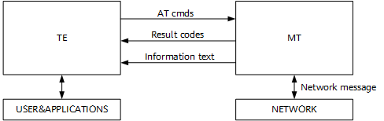

**概述<a name="section4537382116410"></a>**

本文介绍WS53V100的AT指令式及场景，为用户提供相应的指令格式和参数示例解释。

# 指令说明<a name="ZH-CN_TOPIC_0000001777234670"></a>

-   **[命令简介](#ZH-CN_TOPIC_0000001823994221)**  

-   **[指令类型](#ZH-CN_TOPIC_0000001777234678)**  

-   **[注意事项](#ZH-CN_TOPIC_0000001777234706)**  

## 命令简介<a name="ZH-CN_TOPIC_0000001823994221"></a>

AT命令用于TE（例如：PC等用户终端）和MT（例如：移动台等移动终端）之间控制信息的交互，如[图1](#_fig171281854102013)所示。

**图 1**  AT命令示意图<a name="_fig171281854102013"></a>  



## 指令类型<a name="ZH-CN_TOPIC_0000001777234678"></a>

AT指令类型如[表1](#_table838912210233)所示。

**表 1**  AT指令类型说明

<a name="_table838912210233"></a>
<table><thead align="left"><tr id="row3095mcpsimp"><th class="cellrowborder" valign="top" width="18.96189618961896%" id="mcps1.2.4.1.1"><p id="p3097mcpsimp"><a name="p3097mcpsimp"></a><a name="p3097mcpsimp"></a>类型</p>
</th>
<th class="cellrowborder" valign="top" width="32.93329332933293%" id="mcps1.2.4.1.2"><p id="p3099mcpsimp"><a name="p3099mcpsimp"></a><a name="p3099mcpsimp"></a>格式</p>
</th>
<th class="cellrowborder" valign="top" width="48.10481048104811%" id="mcps1.2.4.1.3"><p id="p3101mcpsimp"><a name="p3101mcpsimp"></a><a name="p3101mcpsimp"></a>用途</p>
</th>
</tr>
</thead>
<tbody><tr id="row3103mcpsimp"><td class="cellrowborder" valign="top" width="18.96189618961896%" headers="mcps1.2.4.1.1 "><p id="p3105mcpsimp"><a name="p3105mcpsimp"></a><a name="p3105mcpsimp"></a>测试指令</p>
</td>
<td class="cellrowborder" valign="top" width="32.93329332933293%" headers="mcps1.2.4.1.2 "><p id="p3107mcpsimp"><a name="p3107mcpsimp"></a><a name="p3107mcpsimp"></a>AT+&lt;cmd&gt;=?</p>
</td>
<td class="cellrowborder" valign="top" width="48.10481048104811%" headers="mcps1.2.4.1.3 "><p id="p3109mcpsimp"><a name="p3109mcpsimp"></a><a name="p3109mcpsimp"></a>该命令用于查询设置指令的参数以及取值范围。</p>
</td>
</tr>
<tr id="row3110mcpsimp"><td class="cellrowborder" valign="top" width="18.96189618961896%" headers="mcps1.2.4.1.1 "><p id="p3112mcpsimp"><a name="p3112mcpsimp"></a><a name="p3112mcpsimp"></a>查询指令</p>
</td>
<td class="cellrowborder" valign="top" width="32.93329332933293%" headers="mcps1.2.4.1.2 "><p id="p3114mcpsimp"><a name="p3114mcpsimp"></a><a name="p3114mcpsimp"></a>AT+&lt;cmd&gt;?</p>
</td>
<td class="cellrowborder" valign="top" width="48.10481048104811%" headers="mcps1.2.4.1.3 "><p id="p3116mcpsimp"><a name="p3116mcpsimp"></a><a name="p3116mcpsimp"></a>该命令用于返回参数的当前值。</p>
</td>
</tr>
<tr id="row3117mcpsimp"><td class="cellrowborder" valign="top" width="18.96189618961896%" headers="mcps1.2.4.1.1 "><p id="p3119mcpsimp"><a name="p3119mcpsimp"></a><a name="p3119mcpsimp"></a>设置指令</p>
</td>
<td class="cellrowborder" valign="top" width="32.93329332933293%" headers="mcps1.2.4.1.2 "><p id="p3121mcpsimp"><a name="p3121mcpsimp"></a><a name="p3121mcpsimp"></a>AT+&lt;cmd&gt;=&lt;parameter&gt;,…</p>
</td>
<td class="cellrowborder" valign="top" width="48.10481048104811%" headers="mcps1.2.4.1.3 "><p id="p3123mcpsimp"><a name="p3123mcpsimp"></a><a name="p3123mcpsimp"></a>设置参数值或执行。</p>
</td>
</tr>
<tr id="row3124mcpsimp"><td class="cellrowborder" valign="top" width="18.96189618961896%" headers="mcps1.2.4.1.1 "><p id="p3126mcpsimp"><a name="p3126mcpsimp"></a><a name="p3126mcpsimp"></a>执行指令</p>
</td>
<td class="cellrowborder" valign="top" width="32.93329332933293%" headers="mcps1.2.4.1.2 "><p id="p3128mcpsimp"><a name="p3128mcpsimp"></a><a name="p3128mcpsimp"></a>AT+&lt;cmd&gt;</p>
</td>
<td class="cellrowborder" valign="top" width="48.10481048104811%" headers="mcps1.2.4.1.3 "><p id="p3130mcpsimp"><a name="p3130mcpsimp"></a><a name="p3130mcpsimp"></a>用于执行本指令的功能。</p>
</td>
</tr>
</tbody>
</table>

## 注意事项<a name="ZH-CN_TOPIC_0000001777234706"></a>

-   不是每一条指令都具备[表1](#_table838912210233)中的4种类型的命令。
-   如果存在当前软件版本不支持的AT指令，会返回ERROR。
-   双引号表示字符串数据 "string"，例如：AT+SCANSSID="XXX"。
-   串口通信默认：波特率为115200、8个数据位、1个停止位、无校验，无流量控制。
-   <\>为必选参数；\[ \]内为可选值，参数可选。
-   命令中的参数以“,”作为分隔符，除双引号括起来的字符串参数外，不支持参数本身带“,”。
-   AT指令中的参数不能有多余的空格。
-   AT指令必须大写，且必须以回车换行符作为结尾（CR LF），部分串口工具在用户敲击键盘回车键时只有回车符（CR）没有换行符（LF），导致AT指令无法识别，如需使用串口工具手动输入AT指令，需在串口工具中将回车键设置为回车符（CR）+换行符（LF）。以IPOP V4.1为例，说明如[图1](#_fig69728515262)所示。

    **图 1**  IPOP V4.1 CR+LF设置示例<a name="_fig69728515262"></a>  
    

# Wi-Fi模块AT指令<a name="ZH-CN_TOPIC_0000001777234614"></a>

-   **[通用AT指令](#ZH-CN_TOPIC_0000001777234638)**  

-   **[STA相关AT指令](#ZH-CN_TOPIC_0000001777394278)**  

-   **[SoftAP相关AT指令](#ZH-CN_TOPIC_0000001823874245)**  

-   **[TCP/IP相关AT指令](#ZH-CN_TOPIC_0000001823994133)**  

-   **[测试调试相关AT指令](#ZH-CN_TOPIC_0000001823994237)**  

-   **[使用场景示例](#ZH-CN_TOPIC_0000001777234662)**  

## 通用AT指令<a name="ZH-CN_TOPIC_0000001777234638"></a>

-   **[通用AT指令一览表](#ZH-CN_TOPIC_0000001777394306)**  

-   **[通用AT指令描述](#ZH-CN_TOPIC_0000001823874237)**  

### 通用AT指令一览表<a name="ZH-CN_TOPIC_0000001777394306"></a>

<a name="table3151mcpsimp"></a>
<table><thead align="left"><tr id="row3156mcpsimp"><th class="cellrowborder" valign="top" width="28.59%" id="mcps1.1.3.1.1"><p id="p3158mcpsimp"><a name="p3158mcpsimp"></a><a name="p3158mcpsimp"></a>指令</p>
</th>
<th class="cellrowborder" valign="top" width="71.41%" id="mcps1.1.3.1.2"><p id="p3160mcpsimp"><a name="p3160mcpsimp"></a><a name="p3160mcpsimp"></a>描述</p>
</th>
</tr>
</thead>
<tbody><tr id="row3167mcpsimp"><td class="cellrowborder" valign="top" width="28.59%" headers="mcps1.1.3.1.1 "><p id="p3169mcpsimp"><a name="p3169mcpsimp"></a><a name="p3169mcpsimp"></a>AT+HELP</p>
</td>
<td class="cellrowborder" valign="top" width="71.41%" headers="mcps1.1.3.1.2 "><p id="p3171mcpsimp"><a name="p3171mcpsimp"></a><a name="p3171mcpsimp"></a>查看当前可用AT命令。</p>
</td>
</tr>
<tr id="row3172mcpsimp"><td class="cellrowborder" valign="top" width="28.59%" headers="mcps1.1.3.1.1 "><p id="p3174mcpsimp"><a name="p3174mcpsimp"></a><a name="p3174mcpsimp"></a>AT+MAC</p>
</td>
<td class="cellrowborder" valign="top" width="71.41%" headers="mcps1.1.3.1.2 "><p id="p3176mcpsimp"><a name="p3176mcpsimp"></a><a name="p3176mcpsimp"></a>MAC地址管理。</p>
</td>
</tr>
<tr id="row3177mcpsimp"><td class="cellrowborder" valign="top" width="28.59%" headers="mcps1.1.3.1.1 "><p id="p3179mcpsimp"><a name="p3179mcpsimp"></a><a name="p3179mcpsimp"></a>AT+IPERF</p>
</td>
<td class="cellrowborder" valign="top" width="71.41%" headers="mcps1.1.3.1.2 "><p id="p3181mcpsimp"><a name="p3181mcpsimp"></a><a name="p3181mcpsimp"></a>性能测试。</p>
</td>
</tr>
<tr id="row3182mcpsimp"><td class="cellrowborder" valign="top" width="28.59%" headers="mcps1.1.3.1.1 "><p id="p3184mcpsimp"><a name="p3184mcpsimp"></a><a name="p3184mcpsimp"></a>AT+SYSINFO</p>
</td>
<td class="cellrowborder" valign="top" width="71.41%" headers="mcps1.1.3.1.2 "><p id="p3186mcpsimp"><a name="p3186mcpsimp"></a><a name="p3186mcpsimp"></a>查看系统信息。</p>
</td>
</tr>
<tr id="row3187mcpsimp"><td class="cellrowborder" valign="top" width="28.59%" headers="mcps1.1.3.1.1 "><p id="p3189mcpsimp"><a name="p3189mcpsimp"></a><a name="p3189mcpsimp"></a>AT+PING</p>
</td>
<td class="cellrowborder" valign="top" width="71.41%" headers="mcps1.1.3.1.2 "><p id="p3191mcpsimp"><a name="p3191mcpsimp"></a><a name="p3191mcpsimp"></a>测试IPV4网络连接。</p>
</td>
</tr>
<tr id="row3192mcpsimp"><td class="cellrowborder" valign="top" width="28.59%" headers="mcps1.1.3.1.1 "><p id="p3194mcpsimp"><a name="p3194mcpsimp"></a><a name="p3194mcpsimp"></a>AT+PING6</p>
</td>
<td class="cellrowborder" valign="top" width="71.41%" headers="mcps1.1.3.1.2 "><p id="p3196mcpsimp"><a name="p3196mcpsimp"></a><a name="p3196mcpsimp"></a>测试IPV6网络连接。</p>
</td>
</tr>
<tr id="row3197mcpsimp"><td class="cellrowborder" valign="top" width="28.59%" headers="mcps1.1.3.1.1 "><p id="p3199mcpsimp"><a name="p3199mcpsimp"></a><a name="p3199mcpsimp"></a>AT+DNS</p>
</td>
<td class="cellrowborder" valign="top" width="71.41%" headers="mcps1.1.3.1.2 "><p id="p3201mcpsimp"><a name="p3201mcpsimp"></a><a name="p3201mcpsimp"></a>设置单板dns服务器地址。</p>
</td>
</tr>
<tr id="row3202mcpsimp"><td class="cellrowborder" valign="top" width="28.59%" headers="mcps1.1.3.1.1 "><p id="p3204mcpsimp"><a name="p3204mcpsimp"></a><a name="p3204mcpsimp"></a>AT+NETSTAT</p>
</td>
<td class="cellrowborder" valign="top" width="71.41%" headers="mcps1.1.3.1.2 "><p id="p3206mcpsimp"><a name="p3206mcpsimp"></a><a name="p3206mcpsimp"></a>查看网络状态。</p>
</td>
</tr>
<tr id="row3207mcpsimp"><td class="cellrowborder" valign="top" width="28.59%" headers="mcps1.1.3.1.1 "><p id="p3209mcpsimp"><a name="p3209mcpsimp"></a><a name="p3209mcpsimp"></a>AT+DHCP</p>
</td>
<td class="cellrowborder" valign="top" width="71.41%" headers="mcps1.1.3.1.2 "><p id="p3211mcpsimp"><a name="p3211mcpsimp"></a><a name="p3211mcpsimp"></a>dhcp客户端命令。</p>
</td>
</tr>
<tr id="row3212mcpsimp"><td class="cellrowborder" valign="top" width="28.59%" headers="mcps1.1.3.1.1 "><p id="p3214mcpsimp"><a name="p3214mcpsimp"></a><a name="p3214mcpsimp"></a>AT+DHCPS</p>
</td>
<td class="cellrowborder" valign="top" width="71.41%" headers="mcps1.1.3.1.2 "><p id="p3216mcpsimp"><a name="p3216mcpsimp"></a><a name="p3216mcpsimp"></a>dhcps服务器端命令。</p>
</td>
</tr>
<tr id="row9682181915116"><td class="cellrowborder" valign="top" width="28.59%" headers="mcps1.1.3.1.1 "><p id="p96821619165116"><a name="p96821619165116"></a><a name="p96821619165116"></a>AT+GETRATE</p>
</td>
<td class="cellrowborder" valign="top" width="71.41%" headers="mcps1.1.3.1.2 "><p id="p1250610172520"><a name="p1250610172520"></a><a name="p1250610172520"></a>获取最近一次发给指定关联设备的报文空口速率。</p>
</td>
</tr>
<tr id="row3217mcpsimp"><td class="cellrowborder" valign="top" width="28.59%" headers="mcps1.1.3.1.1 "><p id="p3219mcpsimp"><a name="p3219mcpsimp"></a><a name="p3219mcpsimp"></a>AT+IFCFG</p>
</td>
<td class="cellrowborder" valign="top" width="71.41%" headers="mcps1.1.3.1.2 "><p id="p3221mcpsimp"><a name="p3221mcpsimp"></a><a name="p3221mcpsimp"></a>接口配置。</p>
</td>
</tr>
<tr id="row3222mcpsimp"><td class="cellrowborder" valign="top" width="28.59%" headers="mcps1.1.3.1.1 "><p id="p3224mcpsimp"><a name="p3224mcpsimp"></a><a name="p3224mcpsimp"></a>AT+PS</p>
</td>
<td class="cellrowborder" valign="top" width="71.41%" headers="mcps1.1.3.1.2 "><p id="p3226mcpsimp"><a name="p3226mcpsimp"></a><a name="p3226mcpsimp"></a>Wi-Fi低功耗设置。</p>
</td>
</tr>
<tr id="row3227mcpsimp"><td class="cellrowborder" valign="top" width="28.59%" headers="mcps1.1.3.1.1 "><p id="p3229mcpsimp"><a name="p3229mcpsimp"></a><a name="p3229mcpsimp"></a>AT+RST</p>
</td>
<td class="cellrowborder" valign="top" width="71.41%" headers="mcps1.1.3.1.2 "><p id="p3231mcpsimp"><a name="p3231mcpsimp"></a><a name="p3231mcpsimp"></a>复位单板。</p>
</td>
</tr>
<tr id="row1162374191312"><td class="cellrowborder" valign="top" width="28.59%" headers="mcps1.1.3.1.1 "><p id="p362315481316"><a name="p362315481316"></a><a name="p362315481316"></a>AT+SYSCHANNEL</p>
</td>
<td class="cellrowborder" valign="top" width="71.41%" headers="mcps1.1.3.1.2 "><p id="p206238431312"><a name="p206238431312"></a><a name="p206238431312"></a>启动Syschannel并等卡。</p>
</td>
</tr>
<tr id="row7811381158"><td class="cellrowborder" valign="top" width="28.59%" headers="mcps1.1.3.1.1 "><p id="p118103891516"><a name="p118103891516"></a><a name="p118103891516"></a>AT+QUERYFILTER</p>
</td>
<td class="cellrowborder" valign="top" width="71.41%" headers="mcps1.1.3.1.2 "><p id="p18813385158"><a name="p18813385158"></a><a name="p18813385158"></a>查询Syschannel过滤规则。</p>
</td>
</tr>
<tr id="row1493965616138"><td class="cellrowborder" valign="top" width="28.59%" headers="mcps1.1.3.1.1 "><p id="p1940115611314"><a name="p1940115611314"></a><a name="p1940115611314"></a>AT+ADDFILTER</p>
</td>
<td class="cellrowborder" valign="top" width="71.41%" headers="mcps1.1.3.1.2 "><p id="p14940165612132"><a name="p14940165612132"></a><a name="p14940165612132"></a>添加指定Syschannel过滤规则。</p>
</td>
</tr>
<tr id="row13981125719157"><td class="cellrowborder" valign="top" width="28.59%" headers="mcps1.1.3.1.1 "><p id="p1398195714154"><a name="p1398195714154"></a><a name="p1398195714154"></a>AT+DELFILTER</p>
</td>
<td class="cellrowborder" valign="top" width="71.41%" headers="mcps1.1.3.1.2 "><p id="p10981357171517"><a name="p10981357171517"></a><a name="p10981357171517"></a>删除指定Syschannel过滤规则。</p>
</td>
</tr>
<tr id="row18241145175720"><td class="cellrowborder" valign="top" width="28.59%" headers="mcps1.1.3.1.1 "><p id="p324110511574"><a name="p324110511574"></a><a name="p324110511574"></a>AT+SYSCHANIF</p>
</td>
<td class="cellrowborder" valign="top" width="71.41%" headers="mcps1.1.3.1.2 "><p id="p1324115165715"><a name="p1324115165715"></a><a name="p1324115165715"></a>指定Syschannel使用的网络设备接口。</p>
</td>
</tr>
<tr id="row32981432897"><td class="cellrowborder" valign="top" width="28.59%" headers="mcps1.1.3.1.1 "><p id="p182991132397"><a name="p182991132397"></a><a name="p182991132397"></a>AT+SENDPKT</p>
</td>
<td class="cellrowborder" valign="top" width="71.41%" headers="mcps1.1.3.1.2 "><p id="p82991232495"><a name="p82991232495"></a><a name="p82991232495"></a>发送任意帧。</p>
</td>
</tr>
<tr id="row1893493474112"><td class="cellrowborder" valign="top" width="28.59%" headers="mcps1.1.3.1.1 "><p id="p14935123414115"><a name="p14935123414115"></a><a name="p14935123414115"></a>AT+HEAPSTAT</p>
</td>
<td class="cellrowborder" valign="top" width="71.41%" headers="mcps1.1.3.1.2 "><p id="p393510348417"><a name="p393510348417"></a><a name="p393510348417"></a>打印堆使用情况。</p>
</td>
</tr>
<tr id="row13221745144111"><td class="cellrowborder" valign="top" width="28.59%" headers="mcps1.1.3.1.1 "><p id="p10221145154112"><a name="p10221145154112"></a><a name="p10221145154112"></a>AT+TASKSTACK</p>
</td>
<td class="cellrowborder" valign="top" width="71.41%" headers="mcps1.1.3.1.2 "><p id="p182213451419"><a name="p182213451419"></a><a name="p182213451419"></a>打印每个任务栈使用情况。</p>
</td>
</tr>
<tr id="row663524016419"><td class="cellrowborder" valign="top" width="28.59%" headers="mcps1.1.3.1.1 "><p id="p13635240204112"><a name="p13635240204112"></a><a name="p13635240204112"></a>AT+TASKMALLOC</p>
</td>
<td class="cellrowborder" valign="top" width="71.41%" headers="mcps1.1.3.1.2 "><p id="p14635114084116"><a name="p14635114084116"></a><a name="p14635114084116"></a>打印每个任务内存申请情况。</p>
</td>
</tr>
</tbody>
</table>

### 通用AT指令描述<a name="ZH-CN_TOPIC_0000001823874237"></a>

-   **[AT+HELP 查看当前可用AT命令](#ZH-CN_TOPIC_0000001777234686)**  

-   **[AT+MAC MAC地址管理](#ZH-CN_TOPIC_0000001777394318)**  

-   **[AT+IPERF 性能测试](#ZH-CN_TOPIC_0000001777394358)**  

-   **[AT+SYSINFO 查看系统信息](#ZH-CN_TOPIC_0000001777394290)**  

-   **[AT+PING 测试IPV4网络连接](#ZH-CN_TOPIC_0000001823874229)**  

-   **[AT+PING6 测试IPV6网络连接](#ZH-CN_TOPIC_0000001777234654)**  

-   **[AT+DNS 设置单板dns服务器地址](#ZH-CN_TOPIC_0000001777234690)**  

-   **[AT+NETSTAT 查看网络状态](#ZH-CN_TOPIC_0000001823994173)**  

-   **[AT+DHCP dhcp客户端命令](#ZH-CN_TOPIC_0000001823994213)**  

-   **[AT+DHCPS dhcps服务器端命令](#ZH-CN_TOPIC_0000001823994193)**  

-   **[AT+IFCFG 接口配置](#ZH-CN_TOPIC_0000001777394294)**  

-   **[AT+PS Wi-Fi 低功耗设置](#ZH-CN_TOPIC_0000001823874201)**  

-   **[AT+RST 复位单板](#ZH-CN_TOPIC_0000001823874273)**  

-   **[AT+SYSCHANNEL 启动Syschannel并等卡](#ZH-CN_TOPIC_0000001944221641)**  

-   **[AT+QUERYFILTER 查询Syschannel过滤规则](#ZH-CN_TOPIC_0000001944223565)**  

-   **[AT+ADDFILTER 添加Syschannel过滤规则](#ZH-CN_TOPIC_0000001944224477)**  

-   **[AT+DELFILTER 删除Syschannel过滤规则](#ZH-CN_TOPIC_0000001910545274)**  

-   **[AT+SYSCHANIF 指定Syschannel使用的网络设备接口](#ZH-CN_TOPIC_0000002112884464)**  

-   **[AT+GETRATE 查询最近一次发送给指定设备的报文速率](#ZH-CN_TOPIC_0000002267571246)**  

-   **[AT+SENDPKT 发送任意帧](#ZH-CN_TOPIC_0000002318526505)**  

-   **[AT+HEAPSTAT 打印堆使用情况](#ZH-CN_TOPIC_0000002532177168)**  

-   **[AT+TASKSTACK 打印每个任务栈使用情况](#ZH-CN_TOPIC_0000002563057105)**  

#### AT+HELP 查看当前可用AT命令<a name="ZH-CN_TOPIC_0000001777234686"></a>

<a name="table102mcpsimp"></a>
<table><tbody><tr id="row107mcpsimp"><th class="firstcol" valign="top" width="18.08%" id="mcps1.1.3.1.1"><p id="p109mcpsimp"><a name="p109mcpsimp"></a><a name="p109mcpsimp"></a>格式</p>
</th>
<td class="cellrowborder" valign="top" width="81.92%" headers="mcps1.1.3.1.1 "><p id="p111mcpsimp"><a name="p111mcpsimp"></a><a name="p111mcpsimp"></a>AT+HELP</p>
</td>
</tr>
<tr id="row112mcpsimp"><th class="firstcol" valign="top" width="18.08%" id="mcps1.1.3.2.1"><p id="p114mcpsimp"><a name="p114mcpsimp"></a><a name="p114mcpsimp"></a>响应</p>
</th>
<td class="cellrowborder" valign="top" width="81.92%" headers="mcps1.1.3.2.1 "><p id="p116mcpsimp"><a name="p116mcpsimp"></a><a name="p116mcpsimp"></a>+HELP:</p>
<p id="p117mcpsimp"><a name="p117mcpsimp"></a><a name="p117mcpsimp"></a>显示当前支持的AT命令</p>
<p id="p118mcpsimp"><a name="p118mcpsimp"></a><a name="p118mcpsimp"></a>OK</p>
</td>
</tr>
<tr id="row119mcpsimp"><th class="firstcol" valign="top" width="18.08%" id="mcps1.1.3.3.1"><p id="p121mcpsimp"><a name="p121mcpsimp"></a><a name="p121mcpsimp"></a>参数说明</p>
</th>
<td class="cellrowborder" valign="top" width="81.92%" headers="mcps1.1.3.3.1 "><p id="p123mcpsimp"><a name="p123mcpsimp"></a><a name="p123mcpsimp"></a>-</p>
</td>
</tr>
<tr id="row124mcpsimp"><th class="firstcol" valign="top" width="18.08%" id="mcps1.1.3.4.1"><p id="p126mcpsimp"><a name="p126mcpsimp"></a><a name="p126mcpsimp"></a>示例</p>
</th>
<td class="cellrowborder" valign="top" width="81.92%" headers="mcps1.1.3.4.1 "><p id="p128mcpsimp"><a name="p128mcpsimp"></a><a name="p128mcpsimp"></a>AT+HELP</p>
</td>
</tr>
<tr id="row129mcpsimp"><th class="firstcol" valign="top" width="18.08%" id="mcps1.1.3.5.1"><p id="p131mcpsimp"><a name="p131mcpsimp"></a><a name="p131mcpsimp"></a>注意</p>
</th>
<td class="cellrowborder" valign="top" width="81.92%" headers="mcps1.1.3.5.1 "><p id="p133mcpsimp"><a name="p133mcpsimp"></a><a name="p133mcpsimp"></a>包含Wi-Fi、BLE、GLE命令。默认不使能。</p>
</td>
</tr>
</tbody>
</table>

#### AT+MAC MAC地址管理<a name="ZH-CN_TOPIC_0000001777394318"></a>

<a name="table135mcpsimp"></a>
<table><tbody><tr id="row141mcpsimp"><th class="firstcol" valign="top" width="18.011801180118013%" id="mcps1.1.4.1.1"><p id="p143mcpsimp"><a name="p143mcpsimp"></a><a name="p143mcpsimp"></a>格式</p>
</th>
<td class="cellrowborder" valign="top" width="41.64416441644164%" headers="mcps1.1.4.1.1 "><p id="p145mcpsimp"><a name="p145mcpsimp"></a><a name="p145mcpsimp"></a>设置命令：</p>
<p id="p146mcpsimp"><a name="p146mcpsimp"></a><a name="p146mcpsimp"></a>AT+MAC=&lt;MAC&gt;</p>
</td>
<td class="cellrowborder" valign="top" width="40.34403440344035%" headers="mcps1.1.4.1.1 "><p id="p148mcpsimp"><a name="p148mcpsimp"></a><a name="p148mcpsimp"></a>查询命令：</p>
<p id="p149mcpsimp"><a name="p149mcpsimp"></a><a name="p149mcpsimp"></a>AT+MAC?</p>
</td>
</tr>
<tr id="row150mcpsimp"><th class="firstcol" valign="top" width="18.011801180118013%" id="mcps1.1.4.2.1"><p id="p152mcpsimp"><a name="p152mcpsimp"></a><a name="p152mcpsimp"></a>响应</p>
</th>
<td class="cellrowborder" valign="top" width="41.64416441644164%" headers="mcps1.1.4.2.1 "><a name="ul2488103861514"></a><a name="ul2488103861514"></a><ul id="ul2488103861514"><li>成功：OK</li><li>失败：ERROR</li></ul>
</td>
<td class="cellrowborder" valign="top" width="40.34403440344035%" headers="mcps1.1.4.2.1 "><p id="p158mcpsimp"><a name="p158mcpsimp"></a><a name="p158mcpsimp"></a>+MAC: &lt;MAC&gt;</p>
<a name="ul66651152131513"></a><a name="ul66651152131513"></a><ul id="ul66651152131513"><li>成功：OK</li><li>失败：ERROR</li></ul>
</td>
</tr>
<tr id="row162mcpsimp"><th class="firstcol" valign="top" width="18.011801180118013%" id="mcps1.1.4.3.1"><p id="p164mcpsimp"><a name="p164mcpsimp"></a><a name="p164mcpsimp"></a>参数说明</p>
</th>
<td class="cellrowborder" valign="top" width="41.64416441644164%" headers="mcps1.1.4.3.1 "><p id="p166mcpsimp"><a name="p166mcpsimp"></a><a name="p166mcpsimp"></a>&lt;MAC&gt;：MAC地址</p>
</td>
<td class="cellrowborder" valign="top" width="40.34403440344035%" headers="mcps1.1.4.3.1 "><p id="p168mcpsimp"><a name="p168mcpsimp"></a><a name="p168mcpsimp"></a>-</p>
</td>
</tr>
<tr id="row169mcpsimp"><th class="firstcol" valign="top" width="18.011801180118013%" id="mcps1.1.4.4.1"><p id="p171mcpsimp"><a name="p171mcpsimp"></a><a name="p171mcpsimp"></a>示例</p>
</th>
<td class="cellrowborder" valign="top" width="41.64416441644164%" headers="mcps1.1.4.4.1 "><p id="p173mcpsimp"><a name="p173mcpsimp"></a><a name="p173mcpsimp"></a>AT+MAC=90:2B:D2:E4:CE:28</p>
</td>
<td class="cellrowborder" valign="top" width="40.34403440344035%" headers="mcps1.1.4.4.1 "><p id="p175mcpsimp"><a name="p175mcpsimp"></a><a name="p175mcpsimp"></a>AT+MAC?</p>
</td>
</tr>
<tr id="row176mcpsimp"><th class="firstcol" valign="top" id="mcps1.1.4.5.1"><p id="p178mcpsimp"><a name="p178mcpsimp"></a><a name="p178mcpsimp"></a>注意</p>
</th>
<td class="cellrowborder" colspan="2" valign="top" headers="mcps1.1.4.5.1 "><p id="p180mcpsimp"><a name="p180mcpsimp"></a><a name="p180mcpsimp"></a>设置命令在AT+STARTSTA/AT+STARTAP前下发有效。</p>
</td>
</tr>
</tbody>
</table>

#### AT+IPERF 性能测试<a name="ZH-CN_TOPIC_0000001777394358"></a>

<a name="table182mcpsimp"></a>
<table><tbody><tr id="row187mcpsimp"><th class="firstcol" valign="top" width="17.810000000000002%" id="mcps1.1.3.1.1"><p id="p189mcpsimp"><a name="p189mcpsimp"></a><a name="p189mcpsimp"></a>格式</p>
</th>
<td class="cellrowborder" valign="top" width="82.19%" headers="mcps1.1.3.1.1 "><p id="p191mcpsimp"><a name="p191mcpsimp"></a><a name="p191mcpsimp"></a>AT+IPERF=&lt;-x&gt;</p>
</td>
</tr>
<tr id="row192mcpsimp"><th class="firstcol" valign="top" width="17.810000000000002%" id="mcps1.1.3.2.1"><p id="p194mcpsimp"><a name="p194mcpsimp"></a><a name="p194mcpsimp"></a>响应</p>
</th>
<td class="cellrowborder" valign="top" width="82.19%" headers="mcps1.1.3.2.1 "><p id="p196mcpsimp"><a name="p196mcpsimp"></a><a name="p196mcpsimp"></a>+IPERF:</p>
<p id="p197mcpsimp"><a name="p197mcpsimp"></a><a name="p197mcpsimp"></a>&lt;Interval&gt;  &lt;Bandwidth&gt;</p>
<a name="ul2488103861514"></a><a name="ul2488103861514"></a><ul id="ul2488103861514"><li>成功：OK</li><li>失败：ERROR</li></ul>
</td>
</tr>
<tr id="row201mcpsimp"><th class="firstcol" valign="top" width="17.810000000000002%" id="mcps1.1.3.3.1"><p id="p203mcpsimp"><a name="p203mcpsimp"></a><a name="p203mcpsimp"></a>参数说明</p>
</th>
<td class="cellrowborder" valign="top" width="82.19%" headers="mcps1.1.3.3.1 "><a name="ul1053181051615"></a><a name="ul1053181051615"></a><ul id="ul1053181051615"><li>&lt;-x&gt;：参数类型<p id="p206mcpsimp"><a name="p206mcpsimp"></a><a name="p206mcpsimp"></a>-s：以server模式启动</p>
<p id="p207mcpsimp"><a name="p207mcpsimp"></a><a name="p207mcpsimp"></a>-c,IP：以client模式启动，IP为server端地址</p>
<p id="p208mcpsimp"><a name="p208mcpsimp"></a><a name="p208mcpsimp"></a>-u：使用udp协议</p>
<p id="p209mcpsimp"><a name="p209mcpsimp"></a><a name="p209mcpsimp"></a>-i,sec：以秒为单位显示报告间隔</p>
<p id="p210mcpsimp"><a name="p210mcpsimp"></a><a name="p210mcpsimp"></a>-t,sec：测试时间，默认30s</p>
<p id="p211mcpsimp"><a name="p211mcpsimp"></a><a name="p211mcpsimp"></a>-b,Bandwidth：udp发送带宽，单位为bps，如设置为10K、20M，默认值为1Mbps</p>
<p id="p212mcpsimp"><a name="p212mcpsimp"></a><a name="p212mcpsimp"></a>-l,length：单次发送数据长度，单位为字节</p>
<p id="p213mcpsimp"><a name="p213mcpsimp"></a><a name="p213mcpsimp"></a>-B,IP：绑定一个主机IP地址，当主机有多个地址或接口时使用该参数</p>
<p id="p214mcpsimp"><a name="p214mcpsimp"></a><a name="p214mcpsimp"></a>-S,value：指定tos，value不同取值范围分别对应tid0~tid7，value取值与tid对应关系如下：</p>
<p id="p215mcpsimp"><a name="p215mcpsimp"></a><a name="p215mcpsimp"></a>0~31：tid0</p>
<p id="p216mcpsimp"><a name="p216mcpsimp"></a><a name="p216mcpsimp"></a>32~63：tid1</p>
<p id="p217mcpsimp"><a name="p217mcpsimp"></a><a name="p217mcpsimp"></a>64~95：tid2</p>
<p id="p218mcpsimp"><a name="p218mcpsimp"></a><a name="p218mcpsimp"></a>96~127：tid3</p>
<p id="p219mcpsimp"><a name="p219mcpsimp"></a><a name="p219mcpsimp"></a>128~159：tid4</p>
<p id="p220mcpsimp"><a name="p220mcpsimp"></a><a name="p220mcpsimp"></a>160~191：tid5</p>
<p id="p221mcpsimp"><a name="p221mcpsimp"></a><a name="p221mcpsimp"></a>192~223：tid6</p>
<p id="p222mcpsimp"><a name="p222mcpsimp"></a><a name="p222mcpsimp"></a>224~255：tid7</p>
<p id="p223mcpsimp"><a name="p223mcpsimp"></a><a name="p223mcpsimp"></a>-p,portNum：指定服务器端使用的端口或客户端所连接的端口</p>
<p id="p224mcpsimp"><a name="p224mcpsimp"></a><a name="p224mcpsimp"></a>-k：停止iperf服务</p>
</li><li>&lt;Interval&gt;：统计时间间隔，单位为s。</li><li>&lt;Bandwidth&gt;：测试吞吐量，显示统计间隔内的平均吞吐量。</li></ul>
</td>
</tr>
<tr id="row227mcpsimp"><th class="firstcol" valign="top" width="17.810000000000002%" id="mcps1.1.3.4.1"><p id="p229mcpsimp"><a name="p229mcpsimp"></a><a name="p229mcpsimp"></a>示例</p>
</th>
<td class="cellrowborder" valign="top" width="82.19%" headers="mcps1.1.3.4.1 "><a name="ul12292443181610"></a><a name="ul12292443181610"></a><ul id="ul12292443181610"><li>AT+IPERF=-s,-i,1：以server模式启动iperf，使用协议默认为tcp，显示报告以1s为间隔。</li><li>AT+IPERF=-s,-u,-i,1：以server模式启动iperf，使用协议udp，显示报告以1s为间隔。</li><li>AT+IPERF=-c,192.168.3.1,-t,5,-i,1：以client模式启动iperf，使用协议默认为tcp，测试5s，显示报告以1s为间隔。</li><li>AT+IPERF=-c,192.168.3.1,-u,-b,10M,-t,5,-i,1：以client模式启动iperf，使用协议udp，发送带宽为10Mbps，测试5s，显示报告以1s为间隔。</li><li>AT+IPERF=-c,192.168.3.1,-u,-b,10M,-t,5,-i,1,-l,1000,-B,192.168.3.2,-p,5001,-S,28：以client模式启动iperf，使用协议udp，发送带宽为10Mbps，测试5s，显示报告以1s为间隔，单次发送数据包最大为1000Byte，绑定本次iperf命令的主机IP地址为192.168.3.2，设定使用端口5001，指定tos为28。</li><li>AT+IPERF=-k：手动停止iperf性能测试。</li></ul>
</td>
</tr>
<tr id="row237mcpsimp"><th class="firstcol" valign="top" width="17.810000000000002%" id="mcps1.1.3.5.1"><p id="p239mcpsimp"><a name="p239mcpsimp"></a><a name="p239mcpsimp"></a>注意</p>
</th>
<td class="cellrowborder" valign="top" width="82.19%" headers="mcps1.1.3.5.1 "><a name="ul241mcpsimp"></a><a name="ul241mcpsimp"></a><ul id="ul241mcpsimp"><li>-c或者-s须放在第一个参数位置。</li><li>-s使用时，须使用-k结束才能进行下一次启动。</li><li>仅支持一次执行，不支持多实例同时进行。</li></ul>
</td>
</tr>
</tbody>
</table>

#### AT+SYSINFO 查看系统信息<a name="ZH-CN_TOPIC_0000001777394290"></a>

<a name="table246mcpsimp"></a>
<table><tbody><tr id="row251mcpsimp"><th class="firstcol" valign="top" width="18.17%" id="mcps1.1.3.1.1"><p id="p253mcpsimp"><a name="p253mcpsimp"></a><a name="p253mcpsimp"></a>格式</p>
</th>
<td class="cellrowborder" valign="top" width="81.83%" headers="mcps1.1.3.1.1 "><p id="p255mcpsimp"><a name="p255mcpsimp"></a><a name="p255mcpsimp"></a>AT+SYSINFO</p>
</td>
</tr>
<tr id="row256mcpsimp"><th class="firstcol" valign="top" width="18.17%" id="mcps1.1.3.2.1"><p id="p258mcpsimp"><a name="p258mcpsimp"></a><a name="p258mcpsimp"></a>响应</p>
</th>
<td class="cellrowborder" valign="top" width="81.83%" headers="mcps1.1.3.2.1 "><p id="p260mcpsimp"><a name="p260mcpsimp"></a><a name="p260mcpsimp"></a>+SYSINFO:</p>
<p id="p261mcpsimp"><a name="p261mcpsimp"></a><a name="p261mcpsimp"></a>显示内存使用、系统资源、任务调度、系统运行时间等信息。</p>
<a name="ul2488103861514"></a><a name="ul2488103861514"></a><ul id="ul2488103861514"><li>成功：OK</li><li>失败：ERROR</li></ul>
</td>
</tr>
<tr id="row265mcpsimp"><th class="firstcol" valign="top" width="18.17%" id="mcps1.1.3.3.1"><p id="p267mcpsimp"><a name="p267mcpsimp"></a><a name="p267mcpsimp"></a>参数说明</p>
</th>
<td class="cellrowborder" valign="top" width="81.83%" headers="mcps1.1.3.3.1 "><p id="p269mcpsimp"><a name="p269mcpsimp"></a><a name="p269mcpsimp"></a>-</p>
</td>
</tr>
<tr id="row270mcpsimp"><th class="firstcol" valign="top" width="18.17%" id="mcps1.1.3.4.1"><p id="p272mcpsimp"><a name="p272mcpsimp"></a><a name="p272mcpsimp"></a>示例</p>
</th>
<td class="cellrowborder" valign="top" width="81.83%" headers="mcps1.1.3.4.1 "><p id="p274mcpsimp"><a name="p274mcpsimp"></a><a name="p274mcpsimp"></a>AT+SYSINFO</p>
</td>
</tr>
<tr id="row275mcpsimp"><th class="firstcol" valign="top" width="18.17%" id="mcps1.1.3.5.1"><p id="p277mcpsimp"><a name="p277mcpsimp"></a><a name="p277mcpsimp"></a>注意</p>
</th>
<td class="cellrowborder" valign="top" width="81.83%" headers="mcps1.1.3.5.1 "><p id="p279mcpsimp"><a name="p279mcpsimp"></a><a name="p279mcpsimp"></a>-</p>
</td>
</tr>
</tbody>
</table>

#### AT+PING 测试IPV4网络连接<a name="ZH-CN_TOPIC_0000001823874229"></a>

<a name="table281mcpsimp"></a>
<table><tbody><tr id="row286mcpsimp"><th class="firstcol" valign="top" width="18.81%" id="mcps1.1.3.1.1"><p id="p288mcpsimp"><a name="p288mcpsimp"></a><a name="p288mcpsimp"></a>格式</p>
</th>
<td class="cellrowborder" valign="top" width="81.19%" headers="mcps1.1.3.1.1 "><p id="p290mcpsimp"><a name="p290mcpsimp"></a><a name="p290mcpsimp"></a>AT+PING=[&lt;-x&gt;,]&lt;IP&gt;</p>
</td>
</tr>
<tr id="row291mcpsimp"><th class="firstcol" valign="top" width="18.81%" id="mcps1.1.3.2.1"><p id="p293mcpsimp"><a name="p293mcpsimp"></a><a name="p293mcpsimp"></a>响应</p>
</th>
<td class="cellrowborder" valign="top" width="81.19%" headers="mcps1.1.3.2.1 "><p id="p351mcpsimp"><a name="p351mcpsimp"></a><a name="p351mcpsimp"></a>[&lt;index&gt;]Reply from &lt;IP&gt;: time=&lt;time&gt; TTL=&lt;TTL&gt;</p>
<p id="p352mcpsimp"><a name="p352mcpsimp"></a><a name="p352mcpsimp"></a>&lt;tx_count&gt; packets transmitted, &lt;rx_count&gt; received, &lt;loss_count&gt; loss</p>
<a name="ul2488103861514"></a><a name="ul2488103861514"></a><ul id="ul2488103861514"><li>成功：OK</li><li>失败：ERROR</li></ul>
</td>
</tr>
<tr id="row301mcpsimp"><th class="firstcol" valign="top" width="18.81%" id="mcps1.1.3.3.1"><p id="p303mcpsimp"><a name="p303mcpsimp"></a><a name="p303mcpsimp"></a>参数说明</p>
</th>
<td class="cellrowborder" valign="top" width="81.19%" headers="mcps1.1.3.3.1 "><a name="ul1694443315177"></a><a name="ul1694443315177"></a><ul id="ul1694443315177"><li>&lt;-x&gt;：参数类型。<p id="p306mcpsimp"><a name="p306mcpsimp"></a><a name="p306mcpsimp"></a>-n,count：发送count指定的数据包数，默认值为4</p>
<p id="p307mcpsimp"><a name="p307mcpsimp"></a><a name="p307mcpsimp"></a>-t：Ping指定的主机，直到AT+PING=-k停止</p>
<p id="p308mcpsimp"><a name="p308mcpsimp"></a><a name="p308mcpsimp"></a>-w,interval：相邻两次ping包的时间间隔，单位为毫秒</p>
<p id="p172414113118"><a name="p172414113118"></a><a name="p172414113118"></a>-W,timeout：ping超时时间设置，单位为毫秒</p>
<p id="p309mcpsimp"><a name="p309mcpsimp"></a><a name="p309mcpsimp"></a>-l,size：单次发送数据长度，单位为字节，默认48字节</p>
<p id="p310mcpsimp"><a name="p310mcpsimp"></a><a name="p310mcpsimp"></a>-k：停止ping包，-k后不带参数</p>
</li><li>&lt;IP&gt;：目的主机IP地址。</li><li>&lt;index&gt;：ping包序号。</li><li>&lt;time&gt;：ping包耗时。</li><li>&lt;TTL&gt;：生存时间TTL。</li><li>&lt;tx_count&gt;：发包数。</li><li>&lt;rx_count&gt;：收包数。</li><li>&lt;loss_count&gt;：丢包数。</li></ul>
</td>
</tr>
<tr id="row319mcpsimp"><th class="firstcol" valign="top" width="18.81%" id="mcps1.1.3.4.1"><p id="p321mcpsimp"><a name="p321mcpsimp"></a><a name="p321mcpsimp"></a>示例</p>
</th>
<td class="cellrowborder" valign="top" width="81.19%" headers="mcps1.1.3.4.1 "><a name="ul1680115581719"></a><a name="ul1680115581719"></a><ul id="ul1680115581719"><li>AT+PING=192.168.3.1：执行ping 192.168.3.1，默认ping 4个包。</li><li>AT+PING=-n,6,192.168.3.1：执行ping 192.168.3.1，ping 6个包。</li><li>AT+PING=-w,1,192.168.3.1：执行ping 192.168.3.1，相邻两次ping包的时间间隔为1ms。</li><li>AT+PING=-l,100,192.168.3.1：执行ping 192.168.3.1，设置单次发送包长最大为100Byte。</li><li>AT+PING=-t,192.168.3.1：执行ping 192.168.3.1，直到输入ping的-k命令停止。</li><li>AT+PING=-k：停止ping包。</li></ul>
</td>
</tr>
<tr id="row329mcpsimp"><th class="firstcol" valign="top" width="18.81%" id="mcps1.1.3.5.1"><p id="p331mcpsimp"><a name="p331mcpsimp"></a><a name="p331mcpsimp"></a>注意</p>
</th>
<td class="cellrowborder" valign="top" width="81.19%" headers="mcps1.1.3.5.1 "><p id="p198011345185"><a name="p198011345185"></a><a name="p198011345185"></a>-</p>
</td>
</tr>
</tbody>
</table>

#### AT+PING6 测试IPV6网络连接<a name="ZH-CN_TOPIC_0000001777234654"></a>

<a name="table335mcpsimp"></a>
<table><tbody><tr id="row340mcpsimp"><th class="firstcol" valign="top" width="18.15%" id="mcps1.1.3.1.1"><p id="p342mcpsimp"><a name="p342mcpsimp"></a><a name="p342mcpsimp"></a>格式</p>
</th>
<td class="cellrowborder" valign="top" width="81.85%" headers="mcps1.1.3.1.1 "><p id="p344mcpsimp"><a name="p344mcpsimp"></a><a name="p344mcpsimp"></a>AT+PING6=[&lt;-x&gt;,]&lt; IP&gt;</p>
</td>
</tr>
<tr id="row345mcpsimp"><th class="firstcol" valign="top" width="18.15%" id="mcps1.1.3.2.1"><p id="p347mcpsimp"><a name="p347mcpsimp"></a><a name="p347mcpsimp"></a>响应</p>
</th>
<td class="cellrowborder" valign="top" width="81.85%" headers="mcps1.1.3.2.1 "><a name="ul18566722151810"></a><a name="ul18566722151810"></a><ul id="ul18566722151810"><li>[&lt;index&gt;]Reply from &lt;IP&gt;: time=&lt;time&gt;</li><li>&lt;tx_count&gt; packets transmitted, &lt;rx_count&gt; received, &lt;loss_count&gt; loss</li></ul>
<a name="ul2488103861514"></a><a name="ul2488103861514"></a><ul id="ul2488103861514"><li>成功：OK</li><li>失败：ERROR</li></ul>
</td>
</tr>
<tr id="row356mcpsimp"><th class="firstcol" valign="top" width="18.15%" id="mcps1.1.3.3.1"><p id="p358mcpsimp"><a name="p358mcpsimp"></a><a name="p358mcpsimp"></a>参数说明</p>
</th>
<td class="cellrowborder" valign="top" width="81.85%" headers="mcps1.1.3.3.1 "><a name="ul1859816309189"></a><a name="ul1859816309189"></a><ul id="ul1859816309189"><li>&lt;-x&gt;：参数类型<p id="p361mcpsimp"><a name="p361mcpsimp"></a><a name="p361mcpsimp"></a>-c,count：执行count值对应次数，默认为4次</p>
<p id="p307mcpsimp"><a name="p307mcpsimp"></a><a name="p307mcpsimp"></a>-t：Ping指定的主机，直到AT+PING6=-k停止</p>
<p id="p362mcpsimp"><a name="p362mcpsimp"></a><a name="p362mcpsimp"></a>-k：停止ping包，-k后不带-I和IP参数</p>
</li><li>&lt; IP &gt;：目的主机IPV6地址</li><li>&lt;index&gt;：发包序列号</li><li>&lt;time&gt;：单次ping包耗时时长</li><li>&lt;tx_count&gt;：总发包数</li><li>&lt;rx_count&gt;：总收包数</li><li>&lt;loss_count&gt;：丢包数</li></ul>
</td>
</tr>
<tr id="row373mcpsimp"><th class="firstcol" valign="top" width="18.15%" id="mcps1.1.3.4.1"><p id="p375mcpsimp"><a name="p375mcpsimp"></a><a name="p375mcpsimp"></a>示例</p>
</th>
<td class="cellrowborder" valign="top" width="81.85%" headers="mcps1.1.3.4.1 "><a name="ul16109133831816"></a><a name="ul16109133831816"></a><ul id="ul16109133831816"><li>AT+PING6=2001:a:b:c:d:e:f:b</li><li>AT+PING6=-c,100,2001:a:b:c:d:e:f:b</li><li>AT+PING6=-k</li></ul>
</td>
</tr>
<tr id="row380mcpsimp"><th class="firstcol" valign="top" width="18.15%" id="mcps1.1.3.5.1"><p id="p382mcpsimp"><a name="p382mcpsimp"></a><a name="p382mcpsimp"></a>注意</p>
</th>
<td class="cellrowborder" valign="top" width="81.85%" headers="mcps1.1.3.5.1 "><p id="p384mcpsimp"><a name="p384mcpsimp"></a><a name="p384mcpsimp"></a>-</p>
</td>
</tr>
</tbody>
</table>

#### AT+DNS 设置单板dns服务器地址<a name="ZH-CN_TOPIC_0000001777234690"></a>

<a name="table386mcpsimp"></a>
<table><tbody><tr id="row392mcpsimp"><th class="firstcol" valign="top" width="17.67176717671767%" id="mcps1.1.4.1.1"><p id="p394mcpsimp"><a name="p394mcpsimp"></a><a name="p394mcpsimp"></a>格式</p>
</th>
<td class="cellrowborder" valign="top" width="35.93359335933594%" headers="mcps1.1.4.1.1 "><p id="p396mcpsimp"><a name="p396mcpsimp"></a><a name="p396mcpsimp"></a>设置命令：</p>
<p id="p397mcpsimp"><a name="p397mcpsimp"></a><a name="p397mcpsimp"></a>AT+DNS=&lt;dns_num&gt;,&lt;IP&gt;</p>
</td>
<td class="cellrowborder" valign="top" width="46.39463946394639%" headers="mcps1.1.4.1.1 "><p id="p399mcpsimp"><a name="p399mcpsimp"></a><a name="p399mcpsimp"></a>查询命令：</p>
<p id="p400mcpsimp"><a name="p400mcpsimp"></a><a name="p400mcpsimp"></a>AT+DNS?</p>
</td>
</tr>
<tr id="row401mcpsimp"><th class="firstcol" valign="top" width="17.67176717671767%" id="mcps1.1.4.2.1"><p id="p403mcpsimp"><a name="p403mcpsimp"></a><a name="p403mcpsimp"></a>响应</p>
</th>
<td class="cellrowborder" valign="top" width="35.93359335933594%" headers="mcps1.1.4.2.1 "><a name="ul2488103861514"></a><a name="ul2488103861514"></a><ul id="ul2488103861514"><li>成功：OK</li><li>失败：ERROR</li></ul>
</td>
<td class="cellrowborder" valign="top" width="46.39463946394639%" headers="mcps1.1.4.2.1 "><p id="p409mcpsimp"><a name="p409mcpsimp"></a><a name="p409mcpsimp"></a>+DNS:</p>
<p id="p410mcpsimp"><a name="p410mcpsimp"></a><a name="p410mcpsimp"></a>&lt;Dns1_IP&gt;</p>
<p id="p411mcpsimp"><a name="p411mcpsimp"></a><a name="p411mcpsimp"></a>&lt;Dns2_IP&gt;</p>
<a name="ul2682229181915"></a><a name="ul2682229181915"></a><ul id="ul2682229181915"><li>成功：OK</li><li>失败：ERROR</li></ul>
</td>
</tr>
<tr id="row415mcpsimp"><th class="firstcol" valign="top" id="mcps1.1.4.3.1"><p id="p417mcpsimp"><a name="p417mcpsimp"></a><a name="p417mcpsimp"></a>参数说明</p>
</th>
<td class="cellrowborder" colspan="2" valign="top" headers="mcps1.1.4.3.1 "><a name="ul14112832201916"></a><a name="ul14112832201916"></a><ul id="ul14112832201916"><li>&lt;dns_num&gt;：选择设置第一个还是第二个DNS服务器。<p id="p420mcpsimp"><a name="p420mcpsimp"></a><a name="p420mcpsimp"></a>1：第一个DNS服务器。</p>
<p id="p421mcpsimp"><a name="p421mcpsimp"></a><a name="p421mcpsimp"></a>2：第二个DNS服务器。</p>
</li><li>&lt;IP&gt;：服务器IP地址。</li><li>&lt;Dns1_IP&gt;：DNS1的IP地址。</li><li>&lt;Dns2_IP&gt;：DNS2的IP地址。</li></ul>
</td>
</tr>
<tr id="row425mcpsimp"><th class="firstcol" valign="top" id="mcps1.1.4.4.1"><p id="p427mcpsimp"><a name="p427mcpsimp"></a><a name="p427mcpsimp"></a>示例</p>
</th>
<td class="cellrowborder" colspan="2" valign="top" headers="mcps1.1.4.4.1 "><a name="ul56211841171915"></a><a name="ul56211841171915"></a><ul id="ul56211841171915"><li>AT+DNS?</li><li>AT+DNS=1,192.168.3.1</li><li>AT+DNS=2,192.168.3.2</li></ul>
</td>
</tr>
<tr id="row432mcpsimp"><th class="firstcol" valign="top" id="mcps1.1.4.5.1"><p id="p434mcpsimp"><a name="p434mcpsimp"></a><a name="p434mcpsimp"></a>注意</p>
</th>
<td class="cellrowborder" colspan="2" valign="top" headers="mcps1.1.4.5.1 "><p id="p436mcpsimp"><a name="p436mcpsimp"></a><a name="p436mcpsimp"></a>-</p>
</td>
</tr>
</tbody>
</table>

#### AT+NETSTAT 查看网络状态<a name="ZH-CN_TOPIC_0000001823994173"></a>

<a name="table438mcpsimp"></a>
<table><tbody><tr id="row443mcpsimp"><th class="firstcol" valign="top" width="17.169999999999998%" id="mcps1.1.3.1.1"><p id="p445mcpsimp"><a name="p445mcpsimp"></a><a name="p445mcpsimp"></a>格式</p>
</th>
<td class="cellrowborder" valign="top" width="82.83%" headers="mcps1.1.3.1.1 "><p id="p447mcpsimp"><a name="p447mcpsimp"></a><a name="p447mcpsimp"></a>AT+NETSTAT</p>
</td>
</tr>
<tr id="row448mcpsimp"><th class="firstcol" valign="top" width="17.169999999999998%" id="mcps1.1.3.2.1"><p id="p450mcpsimp"><a name="p450mcpsimp"></a><a name="p450mcpsimp"></a>响应</p>
</th>
<td class="cellrowborder" valign="top" width="82.83%" headers="mcps1.1.3.2.1 "><p id="p93113619522"><a name="p93113619522"></a><a name="p93113619522"></a>Proto   Recv-Q      Send-Q      Local Address           Foreign Address      State</p>
<a name="ul2488103861514"></a><a name="ul2488103861514"></a><ul id="ul2488103861514"><li>成功：OK</li><li>失败：ERROR</li></ul>
</td>
</tr>
<tr id="row456mcpsimp"><th class="firstcol" valign="top" width="17.169999999999998%" id="mcps1.1.3.3.1"><p id="p458mcpsimp"><a name="p458mcpsimp"></a><a name="p458mcpsimp"></a>参数说明</p>
</th>
<td class="cellrowborder" valign="top" width="82.83%" headers="mcps1.1.3.3.1 "><a name="ul1444315551918"></a><a name="ul1444315551918"></a><ul id="ul1444315551918"><li>Proto：协议类型。<p id="p461mcpsimp"><a name="p461mcpsimp"></a><a name="p461mcpsimp"></a>tcp</p>
<p id="p5224020144120"><a name="p5224020144120"></a><a name="p5224020144120"></a>udp</p>
</li><li>Resv-Q：未被用户读取的数据量。</li><li>Send-Q：对TCP连接，已发送但未确认的数据量；对UDP连接，由于IP地址解析未完成而缓存的数据量。</li><li>Local Address：本地地址和端口。</li><li>Foreign Address：远程地址和端口。</li><li>State：TCP连接状态；UDP不包含此项。</li></ul>
<p id="p470mcpsimp"><a name="p470mcpsimp"></a><a name="p470mcpsimp"></a>TCP连接态描述如下：</p>
<a name="ul14210151520203"></a><a name="ul14210151520203"></a><ul id="ul14210151520203"><li>CLOSED，即没有任何连接状态。</li><li>LISTEN，即侦听来自远方的TCP端口的连接请求。</li><li>SYN_SENT，即在发送连接请求后等待匹配的连接请求。</li><li>SYN_RCVD，即在收到和发送一个连接请求后等待对方对连接请求的确认。</li><li>ESTABLISHED，即代表一个打开的连接。</li><li>FIN_WAIT_1，即等待远程TCP连接中断请求，或先前的连接中断请求的确认。</li><li>FIN_WAIT_2，即从远程TCP等待连接中断请求。</li><li>CLOSE_WAIT，即等待从本地用户发来的连接中断请求。</li><li>CLOSING，即等待远程TCP对连接中断的确认。</li><li>LAST_ACK，即等待原来的发向远程TCP的连接中断请求的确认。</li><li>TIME_WAIT，即等待足够的时间以确保远程TCP接收到连接中断请求的确认。</li></ul>
</td>
</tr>
<tr id="row482mcpsimp"><th class="firstcol" valign="top" width="17.169999999999998%" id="mcps1.1.3.4.1"><p id="p484mcpsimp"><a name="p484mcpsimp"></a><a name="p484mcpsimp"></a>示例</p>
</th>
<td class="cellrowborder" valign="top" width="82.83%" headers="mcps1.1.3.4.1 "><p id="p486mcpsimp"><a name="p486mcpsimp"></a><a name="p486mcpsimp"></a>AT+NETSTAT</p>
</td>
</tr>
<tr id="row487mcpsimp"><th class="firstcol" valign="top" width="17.169999999999998%" id="mcps1.1.3.5.1"><p id="p489mcpsimp"><a name="p489mcpsimp"></a><a name="p489mcpsimp"></a>注意</p>
</th>
<td class="cellrowborder" valign="top" width="82.83%" headers="mcps1.1.3.5.1 "><p id="p491mcpsimp"><a name="p491mcpsimp"></a><a name="p491mcpsimp"></a>-</p>
</td>
</tr>
</tbody>
</table>

#### AT+DHCP dhcp客户端命令<a name="ZH-CN_TOPIC_0000001823994213"></a>

<a name="table493mcpsimp"></a>
<table><tbody><tr id="row498mcpsimp"><th class="firstcol" valign="top" width="16.82%" id="mcps1.1.3.1.1"><p id="p500mcpsimp"><a name="p500mcpsimp"></a><a name="p500mcpsimp"></a>格式</p>
</th>
<td class="cellrowborder" valign="top" width="83.17999999999999%" headers="mcps1.1.3.1.1 "><p id="p502mcpsimp"><a name="p502mcpsimp"></a><a name="p502mcpsimp"></a>AT+DHCP=&lt;ifname&gt;,&lt;stat&gt;</p>
</td>
</tr>
<tr id="row503mcpsimp"><th class="firstcol" valign="top" width="16.82%" id="mcps1.1.3.2.1"><p id="p505mcpsimp"><a name="p505mcpsimp"></a><a name="p505mcpsimp"></a>响应</p>
</th>
<td class="cellrowborder" valign="top" width="83.17999999999999%" headers="mcps1.1.3.2.1 "><a name="ul2488103861514"></a><a name="ul2488103861514"></a><ul id="ul2488103861514"><li>成功：OK</li><li>失败：ERROR</li></ul>
</td>
</tr>
<tr id="row510mcpsimp"><th class="firstcol" valign="top" width="16.82%" id="mcps1.1.3.3.1"><p id="p512mcpsimp"><a name="p512mcpsimp"></a><a name="p512mcpsimp"></a>参数说明</p>
</th>
<td class="cellrowborder" valign="top" width="83.17999999999999%" headers="mcps1.1.3.3.1 "><a name="ul72491932162017"></a><a name="ul72491932162017"></a><ul id="ul72491932162017"><li>&lt;ifname&gt;：网卡名称。</li><li>&lt;stat&gt;：DHCP开关。<p id="p516mcpsimp"><a name="p516mcpsimp"></a><a name="p516mcpsimp"></a>0：停止</p>
<p id="p517mcpsimp"><a name="p517mcpsimp"></a><a name="p517mcpsimp"></a>1：启动</p>
</li></ul>
</td>
</tr>
<tr id="row518mcpsimp"><th class="firstcol" valign="top" width="16.82%" id="mcps1.1.3.4.1"><p id="p520mcpsimp"><a name="p520mcpsimp"></a><a name="p520mcpsimp"></a>示例</p>
</th>
<td class="cellrowborder" valign="top" width="83.17999999999999%" headers="mcps1.1.3.4.1 "><p id="p522mcpsimp"><a name="p522mcpsimp"></a><a name="p522mcpsimp"></a>AT+DHCP=wlan0,1</p>
</td>
</tr>
<tr id="row523mcpsimp"><th class="firstcol" valign="top" width="16.82%" id="mcps1.1.3.5.1"><p id="p525mcpsimp"><a name="p525mcpsimp"></a><a name="p525mcpsimp"></a>注意</p>
</th>
<td class="cellrowborder" valign="top" width="83.17999999999999%" headers="mcps1.1.3.5.1 "><p id="p527mcpsimp"><a name="p527mcpsimp"></a><a name="p527mcpsimp"></a>网卡名称与AT+IFCFG查看的STA网卡名称保持一致。</p>
</td>
</tr>
</tbody>
</table>

#### AT+DHCPS dhcps服务器端命令<a name="ZH-CN_TOPIC_0000001823994193"></a>

<a name="table529mcpsimp"></a>
<table><tbody><tr id="row534mcpsimp"><th class="firstcol" valign="top" width="17.34%" id="mcps1.1.3.1.1"><p id="p536mcpsimp"><a name="p536mcpsimp"></a><a name="p536mcpsimp"></a>格式</p>
</th>
<td class="cellrowborder" valign="top" width="82.66%" headers="mcps1.1.3.1.1 "><p id="p538mcpsimp"><a name="p538mcpsimp"></a><a name="p538mcpsimp"></a>AT+DHCPS=&lt;ifname&gt;,&lt;stat&gt;</p>
</td>
</tr>
<tr id="row539mcpsimp"><th class="firstcol" valign="top" width="17.34%" id="mcps1.1.3.2.1"><p id="p541mcpsimp"><a name="p541mcpsimp"></a><a name="p541mcpsimp"></a>响应</p>
</th>
<td class="cellrowborder" valign="top" width="82.66%" headers="mcps1.1.3.2.1 "><a name="ul2488103861514"></a><a name="ul2488103861514"></a><ul id="ul2488103861514"><li>成功：OK</li><li>失败：ERROR</li></ul>
</td>
</tr>
<tr id="row546mcpsimp"><th class="firstcol" valign="top" width="17.34%" id="mcps1.1.3.3.1"><p id="p548mcpsimp"><a name="p548mcpsimp"></a><a name="p548mcpsimp"></a>参数说明</p>
</th>
<td class="cellrowborder" valign="top" width="82.66%" headers="mcps1.1.3.3.1 "><a name="ul1936614314204"></a><a name="ul1936614314204"></a><ul id="ul1936614314204"><li>&lt;ifname&gt;：网卡名称。</li><li>&lt;stat&gt;：DHCPS开关。<p id="p552mcpsimp"><a name="p552mcpsimp"></a><a name="p552mcpsimp"></a>0：停止</p>
<p id="p553mcpsimp"><a name="p553mcpsimp"></a><a name="p553mcpsimp"></a>1：启动</p>
</li></ul>
</td>
</tr>
<tr id="row554mcpsimp"><th class="firstcol" valign="top" width="17.34%" id="mcps1.1.3.4.1"><p id="p556mcpsimp"><a name="p556mcpsimp"></a><a name="p556mcpsimp"></a>示例</p>
</th>
<td class="cellrowborder" valign="top" width="82.66%" headers="mcps1.1.3.4.1 "><p id="p558mcpsimp"><a name="p558mcpsimp"></a><a name="p558mcpsimp"></a>AT+DHCPS=ap0,1</p>
</td>
</tr>
<tr id="row559mcpsimp"><th class="firstcol" valign="top" width="17.34%" id="mcps1.1.3.5.1"><p id="p561mcpsimp"><a name="p561mcpsimp"></a><a name="p561mcpsimp"></a>注意</p>
</th>
<td class="cellrowborder" valign="top" width="82.66%" headers="mcps1.1.3.5.1 "><p id="p527mcpsimp"><a name="p527mcpsimp"></a><a name="p527mcpsimp"></a>网卡名称与AT+IFCFG查看的AP网卡名称保持一致。</p>
</td>
</tr>
</tbody>
</table>

#### AT+IFCFG 接口配置<a name="ZH-CN_TOPIC_0000001777394294"></a>

<a name="table565mcpsimp"></a>
<table><tbody><tr id="row571mcpsimp"><th class="firstcol" valign="top" width="16.67166716671667%" id="mcps1.1.4.1.1"><p id="p573mcpsimp"><a name="p573mcpsimp"></a><a name="p573mcpsimp"></a>格式</p>
</th>
<td class="cellrowborder" valign="top" width="37.063706370637064%" headers="mcps1.1.4.1.1 "><p id="p575mcpsimp"><a name="p575mcpsimp"></a><a name="p575mcpsimp"></a>设置指令：</p>
<p id="p576mcpsimp"><a name="p576mcpsimp"></a><a name="p576mcpsimp"></a>AT+IFCFG=&lt;ifname&gt;,&lt;IP&gt;,netmask,&lt;netmask&gt;, gateway,&lt;gateway&gt;</p>
<p id="p577mcpsimp"><a name="p577mcpsimp"></a><a name="p577mcpsimp"></a>AT+IFCFG=&lt;ifname&gt;[,&lt;switch&gt;]</p>
</td>
<td class="cellrowborder" valign="top" width="46.26462646264626%" headers="mcps1.1.4.1.1 "><p id="p579mcpsimp"><a name="p579mcpsimp"></a><a name="p579mcpsimp"></a>查询指令：</p>
<p id="p580mcpsimp"><a name="p580mcpsimp"></a><a name="p580mcpsimp"></a>AT+ IFCFG</p>
</td>
</tr>
<tr id="row581mcpsimp"><th class="firstcol" valign="top" width="16.67166716671667%" id="mcps1.1.4.2.1"><p id="p583mcpsimp"><a name="p583mcpsimp"></a><a name="p583mcpsimp"></a>响应</p>
</th>
<td class="cellrowborder" valign="top" width="37.063706370637064%" headers="mcps1.1.4.2.1 "><a name="ul2488103861514"></a><a name="ul2488103861514"></a><ul id="ul2488103861514"><li>成功：OK</li><li>失败：ERROR</li></ul>
</td>
<td class="cellrowborder" valign="top" width="46.26462646264626%" headers="mcps1.1.4.2.1 "><p id="p589mcpsimp"><a name="p589mcpsimp"></a><a name="p589mcpsimp"></a>+IFCFG:&lt;ifname&gt;,ip=&lt;IP&gt;,netmask =&lt;netmask&gt;,gateway =&lt;gateway&gt;, ip6=&lt;IP6&gt;, HWaddr =&lt;HWaddr&gt;,MTU=&lt;MTU value&gt;,  RunStatus =&lt;RunStatus&gt;</p>
<a name="ul178231354172016"></a><a name="ul178231354172016"></a><ul id="ul178231354172016"><li>成功：OK</li><li>失败：ERROR</li></ul>
</td>
</tr>
<tr id="row593mcpsimp"><th class="firstcol" valign="top" id="mcps1.1.4.3.1"><p id="p595mcpsimp"><a name="p595mcpsimp"></a><a name="p595mcpsimp"></a>参数说明</p>
</th>
<td class="cellrowborder" colspan="2" valign="top" headers="mcps1.1.4.3.1 "><a name="ul152385792016"></a><a name="ul152385792016"></a><ul id="ul152385792016"><li>&lt;ifname&gt;：网卡名称。</li><li>&lt;IP&gt;：IP 地址。</li><li>&lt;netmask&gt;：子网掩码。</li><li>&lt;gateway&gt;：网关地址。</li><li>&lt;switch&gt;：网卡开关。<p id="p602mcpsimp"><a name="p602mcpsimp"></a><a name="p602mcpsimp"></a>up：启用网卡；</p>
<p id="p603mcpsimp"><a name="p603mcpsimp"></a><a name="p603mcpsimp"></a>down：停用网卡。</p>
</li><li>&lt;IP6&gt;：IPV6 地址。</li><li>&lt;HWaddr&gt;：硬件地址。</li><li>&lt;MTU value&gt;：数据帧最大长度。</li><li>&lt;RunStatus&gt;：网卡是否正在运行。<p id="p611mcpsimp"><a name="p611mcpsimp"></a><a name="p611mcpsimp"></a>0：网卡没有运行；</p>
<p id="p612mcpsimp"><a name="p612mcpsimp"></a><a name="p612mcpsimp"></a>1：网卡正在运行。</p>
</li></ul>
</td>
</tr>
<tr id="row613mcpsimp"><th class="firstcol" valign="top" id="mcps1.1.4.4.1"><p id="p615mcpsimp"><a name="p615mcpsimp"></a><a name="p615mcpsimp"></a>示例</p>
</th>
<td class="cellrowborder" colspan="2" valign="top" headers="mcps1.1.4.4.1 "><a name="ul14130172217210"></a><a name="ul14130172217210"></a><ul id="ul14130172217210"><li>AT+IFCFG=ap0,192.168.3.1,netmask,255.255.255.0,gateway,192.168.3.1：配置网卡ap0的IP、子网掩码、网关。</li><li>AT+IFCFG=ap0,up：启动网卡ap0。</li><li>AT+IFCFG=ap0,down：停用网卡ap0。</li><li>AT+IFCFG：查询网卡各类配置信息。</li></ul>
</td>
</tr>
<tr id="row621mcpsimp"><th class="firstcol" valign="top" id="mcps1.1.4.5.1"><p id="p623mcpsimp"><a name="p623mcpsimp"></a><a name="p623mcpsimp"></a>注意</p>
</th>
<td class="cellrowborder" colspan="2" valign="top" headers="mcps1.1.4.5.1 "><a name="ul625mcpsimp"></a><a name="ul625mcpsimp"></a><ul id="ul625mcpsimp"><li>启动STA/SOFTAP后，方可查询到有效&lt;HWaddr&gt;。</li><li>配置IP地址时，需将&lt;IP&gt;紧跟&lt;ifname&gt;之后。</li><li>启用/关闭网卡时，需将&lt;switch&gt;紧跟&lt;ifname&gt;之后。</li><li>启用/关闭网卡和网卡的IP/netmask/gateway配置，不能在同一条命令中配置。</li></ul>
</td>
</tr>
</tbody>
</table>

#### AT+PS Wi-Fi 低功耗设置<a name="ZH-CN_TOPIC_0000001823874201"></a>

<a name="table631mcpsimp"></a>
<table><tbody><tr id="row636mcpsimp"><th class="firstcol" valign="top" width="17.18%" id="mcps1.1.3.1.1"><p id="p638mcpsimp"><a name="p638mcpsimp"></a><a name="p638mcpsimp"></a>格式</p>
</th>
<td class="cellrowborder" valign="top" width="82.82000000000001%" headers="mcps1.1.3.1.1 "><p id="p640mcpsimp"><a name="p640mcpsimp"></a><a name="p640mcpsimp"></a>AT+PS=&lt;switch&gt;[,&lt;sleep_time&gt;]</p>
</td>
</tr>
<tr id="row641mcpsimp"><th class="firstcol" valign="top" width="17.18%" id="mcps1.1.3.2.1"><p id="p643mcpsimp"><a name="p643mcpsimp"></a><a name="p643mcpsimp"></a>响应</p>
</th>
<td class="cellrowborder" valign="top" width="82.82000000000001%" headers="mcps1.1.3.2.1 "><a name="ul2488103861514"></a><a name="ul2488103861514"></a><ul id="ul2488103861514"><li>成功：OK</li><li>失败：ERROR</li></ul>
</td>
</tr>
<tr id="row648mcpsimp"><th class="firstcol" valign="top" width="17.18%" id="mcps1.1.3.3.1"><p id="p650mcpsimp"><a name="p650mcpsimp"></a><a name="p650mcpsimp"></a>参数说明</p>
</th>
<td class="cellrowborder" valign="top" width="82.82000000000001%" headers="mcps1.1.3.3.1 "><a name="ul818652715217"></a><a name="ul818652715217"></a><ul id="ul818652715217"><li>&lt;switch&gt;：低功耗模式使能开关。<p id="p653mcpsimp"><a name="p653mcpsimp"></a><a name="p653mcpsimp"></a>0：关闭低功耗；</p>
<p id="p654mcpsimp"><a name="p654mcpsimp"></a><a name="p654mcpsimp"></a>1：使能FAST-PS低功耗模式；</p>
<p id="p645894842515"><a name="p645894842515"></a><a name="p645894842515"></a>2：使能PS-POLL低功耗模式；</p>
<p id="p12203735262"><a name="p12203735262"></a><a name="p12203735262"></a>3：关闭PS-POLL模式，使能FAST-PS低功耗模式；</p>
<p id="p127611716269"><a name="p127611716269"></a><a name="p127611716269"></a>255：永久关闭低功耗设置（仅认证使用，重启后恢复）。</p>
</li><li>&lt;sleep_time&gt;：低功耗睡眠时间，取值范围0~4000，缺省为0<p id="p1477913493152"><a name="p1477913493152"></a><a name="p1477913493152"></a>0：跟随AP的dtim设置；</p>
<p id="p1217295217169"><a name="p1217295217169"></a><a name="p1217295217169"></a>100：设置dtim_count为1；</p>
<p id="p1463215620172"><a name="p1463215620172"></a><a name="p1463215620172"></a>1000：设置dtim_count为10。</p>
<p id="p166661118111710"><a name="p166661118111710"></a><a name="p166661118111710"></a>参数可选，在switch为1时，sleep_time才生效。</p>
</li></ul>
</td>
</tr>
<tr id="row655mcpsimp"><th class="firstcol" valign="top" width="17.18%" id="mcps1.1.3.4.1"><p id="p657mcpsimp"><a name="p657mcpsimp"></a><a name="p657mcpsimp"></a>示例</p>
</th>
<td class="cellrowborder" valign="top" width="82.82000000000001%" headers="mcps1.1.3.4.1 "><p id="p659mcpsimp"><a name="p659mcpsimp"></a><a name="p659mcpsimp"></a>AT+PS=0 关闭低功耗</p>
<p id="p1867763512"><a name="p1867763512"></a><a name="p1867763512"></a>AT+PS=1 开启低功耗</p>
<p id="p4484114915418"><a name="p4484114915418"></a><a name="p4484114915418"></a>AT+PS=1,1000 开启低功耗并设置dtim_count=10</p>
</td>
</tr>
<tr id="row665mcpsimp"><th class="firstcol" valign="top" width="17.18%" id="mcps1.1.3.5.1"><p id="p667mcpsimp"><a name="p667mcpsimp"></a><a name="p667mcpsimp"></a>注意</p>
</th>
<td class="cellrowborder" valign="top" width="82.82000000000001%" headers="mcps1.1.3.5.1 "><p id="entry668mcpsimpp0"><a name="entry668mcpsimpp0"></a><a name="entry668mcpsimpp0"></a>低功耗命令，需要在起STA之后下发，否则有可能不生效。</p>
</td>
</tr>
</tbody>
</table>

#### AT+RST 复位单板<a name="ZH-CN_TOPIC_0000001823874273"></a>

<a name="table670mcpsimp"></a>
<table><tbody><tr id="row675mcpsimp"><th class="firstcol" valign="top" width="18%" id="mcps1.1.3.1.1"><p id="p677mcpsimp"><a name="p677mcpsimp"></a><a name="p677mcpsimp"></a>格式</p>
</th>
<td class="cellrowborder" valign="top" width="82%" headers="mcps1.1.3.1.1 "><p id="p679mcpsimp"><a name="p679mcpsimp"></a><a name="p679mcpsimp"></a>执行命令：</p>
<p id="p680mcpsimp"><a name="p680mcpsimp"></a><a name="p680mcpsimp"></a>AT+RST=[&lt;type&gt;]</p>
</td>
</tr>
<tr id="row681mcpsimp"><th class="firstcol" valign="top" width="18%" id="mcps1.1.3.2.1"><p id="p683mcpsimp"><a name="p683mcpsimp"></a><a name="p683mcpsimp"></a>响应</p>
</th>
<td class="cellrowborder" valign="top" width="82%" headers="mcps1.1.3.2.1 "><a name="ul2488103861514"></a><a name="ul2488103861514"></a><ul id="ul2488103861514"><li>成功：OK</li><li>失败：ERROR</li></ul>
</td>
</tr>
<tr id="row688mcpsimp"><th class="firstcol" valign="top" width="18%" id="mcps1.1.3.3.1"><p id="p690mcpsimp"><a name="p690mcpsimp"></a><a name="p690mcpsimp"></a>参数说明</p>
</th>
<td class="cellrowborder" valign="top" width="82%" headers="mcps1.1.3.3.1 "><a name="ul730171354613"></a><a name="ul730171354613"></a><ul id="ul730171354613"><li>&lt;type&gt;：软/硬重启选择开关，缺省参数，缺省为0。<p id="p3345142415476"><a name="p3345142415476"></a><a name="p3345142415476"></a>0：硬重启：整芯片掉电后重启。</p>
<p id="p1545154274715"><a name="p1545154274715"></a><a name="p1545154274715"></a>1：软重启：除常电域的其他区域掉电后重启。支持重启过程中及重启后常电域GPIO口（AGPIO1-5）维持输出方向电平保持不变。上电流程和硬重启一致。</p>
</li></ul>
</td>
</tr>
<tr id="row693mcpsimp"><th class="firstcol" valign="top" width="18%" id="mcps1.1.3.4.1"><p id="p695mcpsimp"><a name="p695mcpsimp"></a><a name="p695mcpsimp"></a>示例</p>
</th>
<td class="cellrowborder" valign="top" width="82%" headers="mcps1.1.3.4.1 "><p id="p697mcpsimp"><a name="p697mcpsimp"></a><a name="p697mcpsimp"></a>AT+RST</p>
</td>
</tr>
<tr id="row698mcpsimp"><th class="firstcol" valign="top" width="18%" id="mcps1.1.3.5.1"><p id="p700mcpsimp"><a name="p700mcpsimp"></a><a name="p700mcpsimp"></a>注意</p>
</th>
<td class="cellrowborder" valign="top" width="82%" headers="mcps1.1.3.5.1 "><p id="p16840203104618"><a name="p16840203104618"></a><a name="p16840203104618"></a>AT+RST缺省是AT+RST=0</p>
</td>
</tr>
</tbody>
</table>

#### AT+SYSCHANNEL 启动Syschannel并等卡<a name="ZH-CN_TOPIC_0000001944221641"></a>

<a name="table1246222542712"></a>
<table><tbody><tr id="row846292522720"><th class="firstcol" valign="top" width="18%" id="mcps1.1.3.1.1"><p id="p1046252562719"><a name="p1046252562719"></a><a name="p1046252562719"></a>格式</p>
</th>
<td class="cellrowborder" valign="top" width="82%" headers="mcps1.1.3.1.1 "><p id="p1346210256270"><a name="p1346210256270"></a><a name="p1346210256270"></a>AT+SYSCHANNEL</p>
</td>
</tr>
<tr id="row546292517277"><th class="firstcol" valign="top" width="18%" id="mcps1.1.3.2.1"><p id="p17462122517273"><a name="p17462122517273"></a><a name="p17462122517273"></a>响应</p>
</th>
<td class="cellrowborder" valign="top" width="82%" headers="mcps1.1.3.2.1 "><a name="ul17462152502719"></a><a name="ul17462152502719"></a><ul id="ul17462152502719"><li>成功：OK</li><li>失败：ERROR</li></ul>
</td>
</tr>
<tr id="row1546282582720"><th class="firstcol" valign="top" width="18%" id="mcps1.1.3.3.1"><p id="p7462152532715"><a name="p7462152532715"></a><a name="p7462152532715"></a>参数说明</p>
</th>
<td class="cellrowborder" valign="top" width="82%" headers="mcps1.1.3.3.1 "><p id="p1446217254274"><a name="p1446217254274"></a><a name="p1446217254274"></a>-</p>
</td>
</tr>
<tr id="row94621255275"><th class="firstcol" valign="top" width="18%" id="mcps1.1.3.4.1"><p id="p646242592712"><a name="p646242592712"></a><a name="p646242592712"></a>示例</p>
</th>
<td class="cellrowborder" valign="top" width="82%" headers="mcps1.1.3.4.1 "><p id="p20462125182717"><a name="p20462125182717"></a><a name="p20462125182717"></a>AT+SYSCHANNEL</p>
</td>
</tr>
<tr id="row246222522715"><th class="firstcol" valign="top" width="18%" id="mcps1.1.3.5.1"><p id="p124621025162719"><a name="p124621025162719"></a><a name="p124621025162719"></a>注意</p>
</th>
<td class="cellrowborder" valign="top" width="82%" headers="mcps1.1.3.5.1 "><a name="ul12753145831012"></a><a name="ul12753145831012"></a><ul id="ul12753145831012"><li>启动WS53侧Syschannel并等卡。</li></ul>
</td>
</tr>
</tbody>
</table>

#### AT+QUERYFILTER 查询Syschannel过滤规则<a name="ZH-CN_TOPIC_0000001944223565"></a>

<a name="table176731713123713"></a>
<table><tbody><tr id="row146731713153720"><th class="firstcol" valign="top" width="17.560000000000002%" id="mcps1.1.3.1.1"><p id="p66731713183710"><a name="p66731713183710"></a><a name="p66731713183710"></a>格式</p>
</th>
<td class="cellrowborder" valign="top" width="82.44%" headers="mcps1.1.3.1.1 "><p id="p12673413183720"><a name="p12673413183720"></a><a name="p12673413183720"></a>AT+QUERYFILTER=&lt;filter&gt;,&lt;length&gt;,&lt;type&gt;</p>
</td>
</tr>
<tr id="row16673181353715"><th class="firstcol" valign="top" width="17.560000000000002%" id="mcps1.1.3.2.1"><p id="p467317136371"><a name="p467317136371"></a><a name="p467317136371"></a>响应</p>
</th>
<td class="cellrowborder" valign="top" width="82.44%" headers="mcps1.1.3.2.1 "><a name="ul16673113183716"></a><a name="ul16673113183716"></a><ul id="ul16673113183716"><li>成功：OK</li><li>失败：ERROR</li></ul>
</td>
</tr>
<tr id="row1967381353717"><th class="firstcol" valign="top" width="17.560000000000002%" id="mcps1.1.3.3.1"><p id="p1467341319379"><a name="p1467341319379"></a><a name="p1467341319379"></a>参数说明</p>
</th>
<td class="cellrowborder" valign="top" width="82.44%" headers="mcps1.1.3.3.1 "><a name="ul171781944172216"></a><a name="ul171781944172216"></a><ul id="ul171781944172216"><li>&lt;filter&gt;：是否查询filter。<p id="p912mcpsimp"><a name="p912mcpsimp"></a><a name="p912mcpsimp"></a>0：不查询；</p>
<p id="p913mcpsimp"><a name="p913mcpsimp"></a><a name="p913mcpsimp"></a>1：查询。</p>
</li><li>&lt;length&gt;：是否查询filter个数。<p id="p1267817911584"><a name="p1267817911584"></a><a name="p1267817911584"></a>0：不查询；</p>
<p id="p206789916581"><a name="p206789916581"></a><a name="p206789916581"></a>1：查询。</p>
</li><li>&lt;type&gt;：查询filter类型。<p id="p18128181310"><a name="p18128181310"></a><a name="p18128181310"></a>0：IPV4类型；</p>
<p id="p12128181918"><a name="p12128181918"></a><a name="p12128181918"></a>1：IPV6类型。</p>
</li></ul>
</td>
</tr>
<tr id="row20673151319373"><th class="firstcol" valign="top" width="17.560000000000002%" id="mcps1.1.3.4.1"><p id="p19673113193710"><a name="p19673113193710"></a><a name="p19673113193710"></a>示例</p>
</th>
<td class="cellrowborder" valign="top" width="82.44%" headers="mcps1.1.3.4.1 "><p id="p96731113123713"><a name="p96731113123713"></a><a name="p96731113123713"></a>AT+QUERYFILTER=1,1,0</p>
</td>
</tr>
<tr id="row1467391316375"><th class="firstcol" valign="top" width="17.560000000000002%" id="mcps1.1.3.5.1"><p id="p96739136374"><a name="p96739136374"></a><a name="p96739136374"></a>注意</p>
</th>
<td class="cellrowborder" valign="top" width="82.44%" headers="mcps1.1.3.5.1 "><a name="ul710519288211"></a><a name="ul710519288211"></a><ul id="ul710519288211"><li>type为必填参数，其他为选填。</li><li>Sychannel功能初始化完成后可以查询到默认的过滤规则。</li></ul>
</td>
</tr>
</tbody>
</table>

#### AT+ADDFILTER 添加Syschannel过滤规则<a name="ZH-CN_TOPIC_0000001944224477"></a>

<a name="table72251485319"></a>
<table><tbody><tr id="row822513481834"><th class="firstcol" valign="top" width="17.28%" id="mcps1.1.3.1.1"><p id="p422511486312"><a name="p422511486312"></a><a name="p422511486312"></a>格式</p>
</th>
<td class="cellrowborder" valign="top" width="82.72%" headers="mcps1.1.3.1.1 "><p id="p122511481731"><a name="p122511481731"></a><a name="p122511481731"></a>AT+ADDFILTER=&lt;local_port&gt;,&lt;packet_type&gt;,&lt;match_mask&gt;</p>
<p id="p13142144812410"><a name="p13142144812410"></a><a name="p13142144812410"></a>&lt;config_type&gt;,&lt;len&gt;,&lt;type&gt;</p>
</td>
</tr>
<tr id="row15225648933"><th class="firstcol" valign="top" width="17.28%" id="mcps1.1.3.2.1"><p id="p72259489318"><a name="p72259489318"></a><a name="p72259489318"></a>响应</p>
</th>
<td class="cellrowborder" valign="top" width="82.72%" headers="mcps1.1.3.2.1 "><a name="ul62252484315"></a><a name="ul62252484315"></a><ul id="ul62252484315"><li>成功：OK</li><li>失败：ERROR</li></ul>
</td>
</tr>
<tr id="row12225148234"><th class="firstcol" valign="top" width="17.28%" id="mcps1.1.3.3.1"><p id="p182251848633"><a name="p182251848633"></a><a name="p182251848633"></a>参数说明</p>
</th>
<td class="cellrowborder" valign="top" width="82.72%" headers="mcps1.1.3.3.1 "><a name="ul1122554812315"></a><a name="ul1122554812315"></a><ul id="ul1122554812315"><li>&lt;local_port&gt;：本地端口号。</li><li>&lt;packet_type&gt;：数据包类型。<p id="p52269481834"><a name="p52269481834"></a><a name="p52269481834"></a>17：UDP数据包；</p>
<p id="p622611482314"><a name="p622611482314"></a><a name="p622611482314"></a>6：TCP数据包。</p>
</li><li>&lt;match_mask&gt;：匹配掩码。<p id="p1464013945812"><a name="p1464013945812"></a><a name="p1464013945812"></a>0x01：WIFI_FILTER_MASK_IP；</p>
<p id="p13854205013561"><a name="p13854205013561"></a><a name="p13854205013561"></a>0x02：WIFI_FILTER_MASK_PROTOCOL；</p>
<p id="p2854750125616"><a name="p2854750125616"></a><a name="p2854750125616"></a>0x04：WIFI_FILTER_MASK_LOCAL_PORT；</p>
<p id="p15854250175611"><a name="p15854250175611"></a><a name="p15854250175611"></a>0x08：WIFI_FILTER_MASK_LOCAL_PORT_RANGE；</p>
<p id="p246520582579"><a name="p246520582579"></a><a name="p246520582579"></a>0x10：WIFI_FILTER_MASK_REMOTE_PORT；</p>
<p id="p285417500561"><a name="p285417500561"></a><a name="p285417500561"></a>0x20： WIFI_FILTER_MASK_REMOTE_PORT_RANGE。</p>
</li><li>&lt;packet_type&gt;：数据包类型。<p id="p173081446105813"><a name="p173081446105813"></a><a name="p173081446105813"></a>17：UDP数据包；</p>
<p id="p53081546185817"><a name="p53081546185817"></a><a name="p53081546185817"></a>6：TCP数据包。</p>
</li><li>&lt;config_type&gt;：配置类型。<p id="p1739225165916"><a name="p1739225165916"></a><a name="p1739225165916"></a>0：WIFI_FILTER_LWIP；</p>
<p id="p93942505915"><a name="p93942505915"></a><a name="p93942505915"></a>1：WIFI_FILTER_VLWIP；</p>
<p id="p173972505912"><a name="p173972505912"></a><a name="p173972505912"></a>2：WIFI_FILTER_BOTH 。</p>
</li><li>&lt;len&gt;：数据包类型。<p id="p268564725817"><a name="p268564725817"></a><a name="p268564725817"></a>20：IPV4；</p>
<p id="p186851247105816"><a name="p186851247105816"></a><a name="p186851247105816"></a>32：IPV6。</p>
</li><li>&lt;type&gt;：类型。<p id="p17546172017216"><a name="p17546172017216"></a><a name="p17546172017216"></a>0：IPV4类型；</p>
<p id="p165461200216"><a name="p165461200216"></a><a name="p165461200216"></a>1：IPV6类型。</p>
</li></ul>
</td>
</tr>
<tr id="row1322610484319"><th class="firstcol" valign="top" width="17.28%" id="mcps1.1.3.4.1"><p id="p12261248731"><a name="p12261248731"></a><a name="p12261248731"></a>示例</p>
</th>
<td class="cellrowborder" valign="top" width="82.72%" headers="mcps1.1.3.4.1 "><p id="p120919116420"><a name="p120919116420"></a><a name="p120919116420"></a>AT+ADDFILTER=6001,17,31,2,,0</p>
</td>
</tr>
<tr id="row1222615482314"><th class="firstcol" valign="top" width="17.28%" id="mcps1.1.3.5.1"><p id="p12226104814313"><a name="p12226104814313"></a><a name="p12226104814313"></a>注意</p>
</th>
<td class="cellrowborder" valign="top" width="82.72%" headers="mcps1.1.3.5.1 "><a name="ul1122614489314"></a><a name="ul1122614489314"></a><ul id="ul1122614489314"><li>len为选填参数，其他为必填参数。</li></ul>
</td>
</tr>
</tbody>
</table>

#### AT+DELFILTER 删除Syschannel过滤规则<a name="ZH-CN_TOPIC_0000001910545274"></a>

<a name="table10111134912314"></a>
<table><tbody><tr id="row13111144917311"><th class="firstcol" valign="top" width="17.1%" id="mcps1.1.3.1.1"><p id="p311115490313"><a name="p311115490313"></a><a name="p311115490313"></a>格式</p>
</th>
<td class="cellrowborder" valign="top" width="82.89999999999999%" headers="mcps1.1.3.1.1 "><p id="p1269913444515"><a name="p1269913444515"></a><a name="p1269913444515"></a>AT+DELFILTER=&lt;local_port&gt;,&lt;packet_type&gt;,&lt;match_mask&gt;</p>
<p id="p5699154416518"><a name="p5699154416518"></a><a name="p5699154416518"></a>&lt;config_type&gt;,&lt;len&gt;,&lt;type&gt;</p>
</td>
</tr>
<tr id="row161114496316"><th class="firstcol" valign="top" width="17.1%" id="mcps1.1.3.2.1"><p id="p711116499315"><a name="p711116499315"></a><a name="p711116499315"></a>响应</p>
</th>
<td class="cellrowborder" valign="top" width="82.89999999999999%" headers="mcps1.1.3.2.1 "><a name="ul0111049233"></a><a name="ul0111049233"></a><ul id="ul0111049233"><li>成功：OK</li><li>失败：ERROR</li></ul>
</td>
</tr>
<tr id="row31112496314"><th class="firstcol" valign="top" width="17.1%" id="mcps1.1.3.3.1"><p id="p211120493310"><a name="p211120493310"></a><a name="p211120493310"></a>参数说明</p>
</th>
<td class="cellrowborder" valign="top" width="82.89999999999999%" headers="mcps1.1.3.3.1 "><a name="ul101851302617"></a><a name="ul101851302617"></a><ul id="ul101851302617"><li>&lt;local_port&gt;：本地端口号。</li><li>&lt;packet_type&gt;：数据包类型。<p id="p1418550865"><a name="p1418550865"></a><a name="p1418550865"></a>17：UDP数据包；</p>
<p id="p9185120664"><a name="p9185120664"></a><a name="p9185120664"></a>6：TCP数据包。</p>
</li><li>&lt;match_mask&gt;：匹配掩码。<p id="p864519356611"><a name="p864519356611"></a><a name="p864519356611"></a>0x01：WIFI_FILTER_MASK_IP；</p>
<p id="p318516011610"><a name="p318516011610"></a><a name="p318516011610"></a>0x02：WIFI_FILTER_MASK_PROTOCOL；</p>
<p id="p4185170369"><a name="p4185170369"></a><a name="p4185170369"></a>0x04：WIFI_FILTER_MASK_LOCAL_PORT；</p>
<p id="p6989041360"><a name="p6989041360"></a><a name="p6989041360"></a>0x08：WIFI_FILTER_MASK_LOCAL_PORT_RANGE；</p>
<p id="p918590463"><a name="p918590463"></a><a name="p918590463"></a>0x10：WIFI_FILTER_MASK_REMOTE_PORT；</p>
<p id="p171851305610"><a name="p171851305610"></a><a name="p171851305610"></a>0x20： WIFI_FILTER_MASK_REMOTE_PORT_RANGE。</p>
</li><li>&lt;packet_type&gt;：数据包类型。<p id="p18185301066"><a name="p18185301066"></a><a name="p18185301066"></a>17：UDP数据包；</p>
<p id="p718580568"><a name="p718580568"></a><a name="p718580568"></a>6：TCP数据包。</p>
</li><li>&lt;config_type&gt;：配置类型。<p id="p16185601065"><a name="p16185601065"></a><a name="p16185601065"></a>0：WIFI_FILTER_LWIP；</p>
<p id="p16185408616"><a name="p16185408616"></a><a name="p16185408616"></a>1：WIFI_FILTER_VLWIP；</p>
<p id="p14185601664"><a name="p14185601664"></a><a name="p14185601664"></a>2：WIFI_FILTER_BOTH 。</p>
</li><li>&lt;len&gt;：数据包类型。<p id="p31851503617"><a name="p31851503617"></a><a name="p31851503617"></a>20：IPV4；</p>
<p id="p0185150160"><a name="p0185150160"></a><a name="p0185150160"></a>32：IPV6。</p>
</li><li>&lt;type&gt;：类型。<p id="p17185120867"><a name="p17185120867"></a><a name="p17185120867"></a>0：IPV4类型；</p>
<p id="p19185805616"><a name="p19185805616"></a><a name="p19185805616"></a>1：IPV6类型。</p>
</li></ul>
</td>
</tr>
<tr id="row8112849235"><th class="firstcol" valign="top" width="17.1%" id="mcps1.1.3.4.1"><p id="p1811214491335"><a name="p1811214491335"></a><a name="p1811214491335"></a>示例</p>
</th>
<td class="cellrowborder" valign="top" width="82.89999999999999%" headers="mcps1.1.3.4.1 "><p id="p82412541168"><a name="p82412541168"></a><a name="p82412541168"></a>AT+DELFILTER=6001,17,31,2,,0</p>
</td>
</tr>
<tr id="row1311254911314"><th class="firstcol" valign="top" width="17.1%" id="mcps1.1.3.5.1"><p id="p171124491316"><a name="p171124491316"></a><a name="p171124491316"></a>注意</p>
</th>
<td class="cellrowborder" valign="top" width="82.89999999999999%" headers="mcps1.1.3.5.1 "><a name="ul3112349630"></a><a name="ul3112349630"></a><ul id="ul3112349630"><li>len为选填参数，其他为必填参数。</li></ul>
</td>
</tr>
</tbody>
</table>

#### AT+SYSCHANIF 指定Syschannel使用的网络设备接口<a name="ZH-CN_TOPIC_0000002112884464"></a>

<a name="table10111134912314"></a>
<table><tbody><tr id="row13111144917311"><th class="firstcol" valign="top" width="15.82%" id="mcps1.1.3.1.1"><p id="p311115490313"><a name="p311115490313"></a><a name="p311115490313"></a>格式</p>
</th>
<td class="cellrowborder" valign="top" width="84.17999999999999%" headers="mcps1.1.3.1.1 "><p id="p1269913444515"><a name="p1269913444515"></a><a name="p1269913444515"></a>AT+SYSCHANIF=&lt;netif_name&gt;</p>
</td>
</tr>
<tr id="row161114496316"><th class="firstcol" valign="top" width="15.82%" id="mcps1.1.3.2.1"><p id="p711116499315"><a name="p711116499315"></a><a name="p711116499315"></a>响应</p>
</th>
<td class="cellrowborder" valign="top" width="84.17999999999999%" headers="mcps1.1.3.2.1 "><a name="ul0111049233"></a><a name="ul0111049233"></a><ul id="ul0111049233"><li>成功：OK</li><li>失败：ERROR</li></ul>
</td>
</tr>
<tr id="row31112496314"><th class="firstcol" valign="top" width="15.82%" id="mcps1.1.3.3.1"><p id="p211120493310"><a name="p211120493310"></a><a name="p211120493310"></a>参数说明</p>
</th>
<td class="cellrowborder" valign="top" width="84.17999999999999%" headers="mcps1.1.3.3.1 "><a name="ul1866892802416"></a><a name="ul1866892802416"></a><ul id="ul1866892802416"><li>&lt;netif_name&gt;：网络设备接口。</li><li>wlan0：STA设备的默认物理网络接口。</li><li>ap0：AP设备的默认物理网络接口。</li><li>sle0：星闪设备的默认物理网络接口。</li></ul>
</td>
</tr>
<tr id="row8112849235"><th class="firstcol" valign="top" width="15.82%" id="mcps1.1.3.4.1"><p id="p1811214491335"><a name="p1811214491335"></a><a name="p1811214491335"></a>示例</p>
</th>
<td class="cellrowborder" valign="top" width="84.17999999999999%" headers="mcps1.1.3.4.1 "><p id="p82412541168"><a name="p82412541168"></a><a name="p82412541168"></a>AT+SYSCHANIF=wlan0</p>
</td>
</tr>
<tr id="row1311254911314"><th class="firstcol" valign="top" width="15.82%" id="mcps1.1.3.5.1"><p id="p171124491316"><a name="p171124491316"></a><a name="p171124491316"></a>注意</p>
</th>
<td class="cellrowborder" valign="top" width="84.17999999999999%" headers="mcps1.1.3.5.1 "><a name="ul532685213611"></a><a name="ul532685213611"></a><ul id="ul532685213611"><li>网络接口切换后，主控侧需要配合修改为对应网络设备的mac地址和ip地址。</li><li>网络接口切换后，需要对应的网络设备处于UP状态，Syschannel才能正常工作。</li></ul>
</td>
</tr>
</tbody>
</table>

#### AT+GETRATE 查询最近一次发送给指定设备的报文速率<a name="ZH-CN_TOPIC_0000002267571246"></a>

<a name="table10111134912314"></a>
<table><tbody><tr id="row13111144917311"><th class="firstcol" valign="top" width="15.82%" id="mcps1.1.3.1.1"><p id="p311115490313"><a name="p311115490313"></a><a name="p311115490313"></a>格式</p>
</th>
<td class="cellrowborder" valign="top" width="84.17999999999999%" headers="mcps1.1.3.1.1 "><p id="p1269913444515"><a name="p1269913444515"></a><a name="p1269913444515"></a>AT+GETRATE=&lt;mac_addr&gt;</p>
</td>
</tr>
<tr id="row161114496316"><th class="firstcol" valign="top" width="15.82%" id="mcps1.1.3.2.1"><p id="p711116499315"><a name="p711116499315"></a><a name="p711116499315"></a>响应</p>
</th>
<td class="cellrowborder" valign="top" width="84.17999999999999%" headers="mcps1.1.3.2.1 "><a name="ul0111049233"></a><a name="ul0111049233"></a><ul id="ul0111049233"><li>成功：OK</li><li>失败：ERROR</li></ul>
</td>
</tr>
<tr id="row31112496314"><th class="firstcol" valign="top" width="15.82%" id="mcps1.1.3.3.1"><p id="p211120493310"><a name="p211120493310"></a><a name="p211120493310"></a>参数说明</p>
</th>
<td class="cellrowborder" valign="top" width="84.17999999999999%" headers="mcps1.1.3.3.1 "><a name="ul1866892802416"></a><a name="ul1866892802416"></a><ul id="ul1866892802416"><li>&lt;mac_addr&gt;：待查询设备MAC。</li></ul>
</td>
</tr>
<tr id="row8112849235"><th class="firstcol" valign="top" width="15.82%" id="mcps1.1.3.4.1"><p id="p1811214491335"><a name="p1811214491335"></a><a name="p1811214491335"></a>示例</p>
</th>
<td class="cellrowborder" valign="top" width="84.17999999999999%" headers="mcps1.1.3.4.1 "><p id="p82412541168"><a name="p82412541168"></a><a name="p82412541168"></a>AT+GETRATE=00:11:22:33:44:55</p>
</td>
</tr>
<tr id="row1311254911314"><th class="firstcol" valign="top" width="15.82%" id="mcps1.1.3.5.1"><p id="p171124491316"><a name="p171124491316"></a><a name="p171124491316"></a>注意</p>
</th>
<td class="cellrowborder" valign="top" width="84.17999999999999%" headers="mcps1.1.3.5.1 "><a name="ol11957183921012"></a><a name="ol11957183921012"></a><ol id="ol11957183921012"><li>设备作为STA模式时，MAC地址为关联AP的BSSID。</li><li>设备作为SOFTAP模式时，MAC为待查询关联STA的MAC。</li></ol>
</td>
</tr>
</tbody>
</table>

#### AT+SENDPKT 发送任意帧<a name="ZH-CN_TOPIC_0000002318526505"></a>

<a name="table670mcpsimp"></a>
<table><tbody><tr id="row675mcpsimp"><th class="firstcol" valign="top" width="15.89%" id="mcps1.1.3.1.1"><p id="p677mcpsimp"><a name="p677mcpsimp"></a><a name="p677mcpsimp"></a>格式</p>
</th>
<td class="cellrowborder" valign="top" width="84.11%" headers="mcps1.1.3.1.1 "><p id="p679mcpsimp"><a name="p679mcpsimp"></a><a name="p679mcpsimp"></a>AT+SENDPKT=&lt;type&gt;,&lt;data&gt;</p>
</td>
</tr>
<tr id="row681mcpsimp"><th class="firstcol" valign="top" width="15.89%" id="mcps1.1.3.2.1"><p id="p683mcpsimp"><a name="p683mcpsimp"></a><a name="p683mcpsimp"></a>响应</p>
</th>
<td class="cellrowborder" valign="top" width="84.11%" headers="mcps1.1.3.2.1 "><a name="ul2488103861514"></a><a name="ul2488103861514"></a><ul id="ul2488103861514"><li>成功：OK</li><li>失败：ERROR</li></ul>
</td>
</tr>
<tr id="row688mcpsimp"><th class="firstcol" valign="top" width="15.89%" id="mcps1.1.3.3.1"><p id="p690mcpsimp"><a name="p690mcpsimp"></a><a name="p690mcpsimp"></a>参数说明</p>
</th>
<td class="cellrowborder" valign="top" width="84.11%" headers="mcps1.1.3.3.1 "><p id="p989mcpsimp"><a name="p989mcpsimp"></a><a name="p989mcpsimp"></a>&lt;type&gt;：vap类型，取值范围0,1，依次为STA、AP。</p>
<p id="p972118329222"><a name="p972118329222"></a><a name="p972118329222"></a>&lt;data&gt;：报文内容，字符长度最大为2800，即报文最大为1400字节。</p>
</td>
</tr>
<tr id="row693mcpsimp"><th class="firstcol" valign="top" width="15.89%" id="mcps1.1.3.4.1"><p id="p695mcpsimp"><a name="p695mcpsimp"></a><a name="p695mcpsimp"></a>示例</p>
</th>
<td class="cellrowborder" valign="top" width="84.11%" headers="mcps1.1.3.4.1 "><p id="p1257992211513"><a name="p1257992211513"></a><a name="p1257992211513"></a>以下已关联状态的STA发送RST帧为例，其他类型报文请自行参考报文结构构造：</p>
<p id="p697mcpsimp"><a name="p697mcpsimp"></a><a name="p697mcpsimp"></a>AT+SENDPKT=0,B4010000D45D64A4CCD05CED93A10503</p>
<a name="ul11552438111"></a><a name="ul11552438111"></a><ul id="ul11552438111"><li>0~1位：B4，表示报文的SubType和Type。</li><li>2~3位：01，表示报文的Frame Control Flag字段。</li><li>4~7位：0000, 表示报文的Duration字段。</li><li>8~19位：D45D64A4CCD0，根据RTS报文，表示RA地址。</li><li>20~31位：5CED93A10503，根据RTS报文，表示TA地址。</li></ul>
</td>
</tr>
<tr id="row698mcpsimp"><th class="firstcol" valign="top" width="15.89%" id="mcps1.1.3.5.1"><p id="p700mcpsimp"><a name="p700mcpsimp"></a><a name="p700mcpsimp"></a>注意</p>
</th>
<td class="cellrowborder" valign="top" width="84.11%" headers="mcps1.1.3.5.1 "><p id="p5130112551716"><a name="p5130112551716"></a><a name="p5130112551716"></a>STA未关联场景，如果需要发送任意帧，请先指定信道。</p>
</td>
</tr>
</tbody>
</table>

#### AT+HEAPSTAT 打印堆使用情况<a name="ZH-CN_TOPIC_0000002532177168"></a>

<a name="table2808141614710"></a>
<table><tbody><tr id="row19808191613470"><th class="firstcol" valign="top" width="17.8%" id="mcps1.1.3.1.1"><p id="p580831644714"><a name="p580831644714"></a><a name="p580831644714"></a>格式</p>
</th>
<td class="cellrowborder" valign="top" width="82.19999999999999%" headers="mcps1.1.3.1.1 "><p id="p280801614478"><a name="p280801614478"></a><a name="p280801614478"></a>AT+HEAPSTAT</p>
</td>
</tr>
<tr id="row1480851684713"><th class="firstcol" valign="top" width="17.8%" id="mcps1.1.3.2.1"><p id="p1808101604720"><a name="p1808101604720"></a><a name="p1808101604720"></a>响应</p>
</th>
<td class="cellrowborder" valign="top" width="82.19999999999999%" headers="mcps1.1.3.2.1 "><p id="p380851664714"><a name="p380851664714"></a><a name="p380851664714"></a>打印所有线程堆内存申请信息</p>
<p id="p13808201613479"><a name="p13808201613479"></a><a name="p13808201613479"></a>OK</p>
</td>
</tr>
<tr id="row10808616134718"><th class="firstcol" valign="top" width="17.8%" id="mcps1.1.3.3.1"><p id="p15808191694720"><a name="p15808191694720"></a><a name="p15808191694720"></a>参数说明</p>
</th>
<td class="cellrowborder" valign="top" width="82.19999999999999%" headers="mcps1.1.3.3.1 "><p id="p128089163478"><a name="p128089163478"></a><a name="p128089163478"></a>-</p>
</td>
</tr>
<tr id="row178081616134718"><th class="firstcol" valign="top" width="17.8%" id="mcps1.1.3.4.1"><p id="p138081116154715"><a name="p138081116154715"></a><a name="p138081116154715"></a>示例</p>
</th>
<td class="cellrowborder" valign="top" width="82.19999999999999%" headers="mcps1.1.3.4.1 "><p id="p2808151611476"><a name="p2808151611476"></a><a name="p2808151611476"></a>AT+HEAPSTAT</p>
</td>
</tr>
<tr id="row1808616174711"><th class="firstcol" valign="top" width="17.8%" id="mcps1.1.3.5.1"><p id="p580851619474"><a name="p580851619474"></a><a name="p580851619474"></a>注意</p>
</th>
<td class="cellrowborder" valign="top" width="82.19999999999999%" headers="mcps1.1.3.5.1 "><p id="p68089163478"><a name="p68089163478"></a><a name="p68089163478"></a>-</p>
</td>
</tr>
</tbody>
</table>

#### AT+TASKSTACK 打印每个任务栈使用情况<a name="ZH-CN_TOPIC_0000002563057105"></a>

<a name="table2361134374718"></a>
<table><tbody><tr id="row8361943114719"><th class="firstcol" valign="top" width="17.8%" id="mcps1.1.3.1.1"><p id="p6361124316470"><a name="p6361124316470"></a><a name="p6361124316470"></a>格式</p>
</th>
<td class="cellrowborder" valign="top" width="82.19999999999999%" headers="mcps1.1.3.1.1 "><p id="p836174319474"><a name="p836174319474"></a><a name="p836174319474"></a>AT+TASKSTACK</p>
</td>
</tr>
<tr id="row53613436470"><th class="firstcol" valign="top" width="17.8%" id="mcps1.1.3.2.1"><p id="p1836116435472"><a name="p1836116435472"></a><a name="p1836116435472"></a>响应</p>
</th>
<td class="cellrowborder" valign="top" width="82.19999999999999%" headers="mcps1.1.3.2.1 "><p id="p93611843194711"><a name="p93611843194711"></a><a name="p93611843194711"></a>打印所有线程栈信息</p>
<p id="p13361184334718"><a name="p13361184334718"></a><a name="p13361184334718"></a>OK</p>
</td>
</tr>
<tr id="row16361164315471"><th class="firstcol" valign="top" width="17.8%" id="mcps1.1.3.3.1"><p id="p1236134374713"><a name="p1236134374713"></a><a name="p1236134374713"></a>参数说明</p>
</th>
<td class="cellrowborder" valign="top" width="82.19999999999999%" headers="mcps1.1.3.3.1 "><p id="p2036154354714"><a name="p2036154354714"></a><a name="p2036154354714"></a>-</p>
</td>
</tr>
<tr id="row1362164354718"><th class="firstcol" valign="top" width="17.8%" id="mcps1.1.3.4.1"><p id="p43621443164711"><a name="p43621443164711"></a><a name="p43621443164711"></a>示例</p>
</th>
<td class="cellrowborder" valign="top" width="82.19999999999999%" headers="mcps1.1.3.4.1 "><p id="p16362643154711"><a name="p16362643154711"></a><a name="p16362643154711"></a>AT+TASKSTACK</p>
</td>
</tr>
<tr id="row33624439473"><th class="firstcol" valign="top" width="17.8%" id="mcps1.1.3.5.1"><p id="p43621843184719"><a name="p43621843184719"></a><a name="p43621843184719"></a>注意</p>
</th>
<td class="cellrowborder" valign="top" width="82.19999999999999%" headers="mcps1.1.3.5.1 "><p id="p123621443204716"><a name="p123621443204716"></a><a name="p123621443204716"></a>-</p>
</td>
</tr>
</tbody>
</table>

## STA相关AT指令<a name="ZH-CN_TOPIC_0000001777394278"></a>

-   **[STA相关AT指令一览表](#ZH-CN_TOPIC_0000001823994241)**  

-   **[STA相关AT指令描述](#ZH-CN_TOPIC_0000001777234714)**  

### STA相关AT指令一览表<a name="ZH-CN_TOPIC_0000001823994241"></a>

<a name="table709mcpsimp"></a>
<table><thead align="left"><tr id="row714mcpsimp"><th class="cellrowborder" valign="top" width="26.919999999999998%" id="mcps1.1.3.1.1"><p id="p716mcpsimp"><a name="p716mcpsimp"></a><a name="p716mcpsimp"></a>指令</p>
</th>
<th class="cellrowborder" valign="top" width="73.08%" id="mcps1.1.3.1.2"><p id="p718mcpsimp"><a name="p718mcpsimp"></a><a name="p718mcpsimp"></a>描述</p>
</th>
</tr>
</thead>
<tbody><tr id="row720mcpsimp"><td class="cellrowborder" valign="top" width="26.919999999999998%" headers="mcps1.1.3.1.1 "><p id="p722mcpsimp"><a name="p722mcpsimp"></a><a name="p722mcpsimp"></a>AT+STARTSTA</p>
</td>
<td class="cellrowborder" valign="top" width="73.08%" headers="mcps1.1.3.1.2 "><p id="p724mcpsimp"><a name="p724mcpsimp"></a><a name="p724mcpsimp"></a>启动STA。</p>
</td>
</tr>
<tr id="row725mcpsimp"><td class="cellrowborder" valign="top" width="26.919999999999998%" headers="mcps1.1.3.1.1 "><p id="p727mcpsimp"><a name="p727mcpsimp"></a><a name="p727mcpsimp"></a>AT+STOPSTA</p>
</td>
<td class="cellrowborder" valign="top" width="73.08%" headers="mcps1.1.3.1.2 "><p id="p729mcpsimp"><a name="p729mcpsimp"></a><a name="p729mcpsimp"></a>关闭STA。</p>
</td>
</tr>
<tr id="row730mcpsimp"><td class="cellrowborder" valign="top" width="26.919999999999998%" headers="mcps1.1.3.1.1 "><p id="p732mcpsimp"><a name="p732mcpsimp"></a><a name="p732mcpsimp"></a>AT+RECONN</p>
</td>
<td class="cellrowborder" valign="top" width="73.08%" headers="mcps1.1.3.1.2 "><p id="p734mcpsimp"><a name="p734mcpsimp"></a><a name="p734mcpsimp"></a>配置重连策略。</p>
</td>
</tr>
<tr id="row735mcpsimp"><td class="cellrowborder" valign="top" width="26.919999999999998%" headers="mcps1.1.3.1.1 "><p id="p737mcpsimp"><a name="p737mcpsimp"></a><a name="p737mcpsimp"></a>AT+SCAN</p>
</td>
<td class="cellrowborder" valign="top" width="73.08%" headers="mcps1.1.3.1.2 "><p id="p739mcpsimp"><a name="p739mcpsimp"></a><a name="p739mcpsimp"></a>发起STA扫描。</p>
</td>
</tr>
<tr id="row740mcpsimp"><td class="cellrowborder" valign="top" width="26.919999999999998%" headers="mcps1.1.3.1.1 "><p id="p742mcpsimp"><a name="p742mcpsimp"></a><a name="p742mcpsimp"></a>AT+SCANCHN</p>
</td>
<td class="cellrowborder" valign="top" width="73.08%" headers="mcps1.1.3.1.2 "><p id="p744mcpsimp"><a name="p744mcpsimp"></a><a name="p744mcpsimp"></a>指定信道扫描。</p>
</td>
</tr>
<tr id="row745mcpsimp"><td class="cellrowborder" valign="top" width="26.919999999999998%" headers="mcps1.1.3.1.1 "><p id="p747mcpsimp"><a name="p747mcpsimp"></a><a name="p747mcpsimp"></a>AT+SCANSSID</p>
</td>
<td class="cellrowborder" valign="top" width="73.08%" headers="mcps1.1.3.1.2 "><p id="p749mcpsimp"><a name="p749mcpsimp"></a><a name="p749mcpsimp"></a>指定ssid扫描。</p>
</td>
</tr>
<tr id="row750mcpsimp"><td class="cellrowborder" valign="top" width="26.919999999999998%" headers="mcps1.1.3.1.1 "><p id="p752mcpsimp"><a name="p752mcpsimp"></a><a name="p752mcpsimp"></a>AT+SCANRESULT</p>
</td>
<td class="cellrowborder" valign="top" width="73.08%" headers="mcps1.1.3.1.2 "><p id="p754mcpsimp"><a name="p754mcpsimp"></a><a name="p754mcpsimp"></a>查看STA扫描结果。</p>
</td>
</tr>
<tr id="row760mcpsimp"><td class="cellrowborder" valign="top" width="26.919999999999998%" headers="mcps1.1.3.1.1 "><p id="p762mcpsimp"><a name="p762mcpsimp"></a><a name="p762mcpsimp"></a>AT+CONN</p>
</td>
<td class="cellrowborder" valign="top" width="73.08%" headers="mcps1.1.3.1.2 "><p id="p764mcpsimp"><a name="p764mcpsimp"></a><a name="p764mcpsimp"></a>发起与AP的连接。</p>
</td>
</tr>
<tr id="row765mcpsimp"><td class="cellrowborder" valign="top" width="26.919999999999998%" headers="mcps1.1.3.1.1 "><p id="p767mcpsimp"><a name="p767mcpsimp"></a><a name="p767mcpsimp"></a>AT+FCONN</p>
</td>
<td class="cellrowborder" valign="top" width="73.08%" headers="mcps1.1.3.1.2 "><p id="p769mcpsimp"><a name="p769mcpsimp"></a><a name="p769mcpsimp"></a>发起与AP的快速连接。</p>
</td>
</tr>
<tr id="row770mcpsimp"><td class="cellrowborder" valign="top" width="26.919999999999998%" headers="mcps1.1.3.1.1 "><p id="p772mcpsimp"><a name="p772mcpsimp"></a><a name="p772mcpsimp"></a>AT+DISCONN</p>
</td>
<td class="cellrowborder" valign="top" width="73.08%" headers="mcps1.1.3.1.2 "><p id="p774mcpsimp"><a name="p774mcpsimp"></a><a name="p774mcpsimp"></a>断开与AP的连接。</p>
</td>
</tr>
<tr id="row775mcpsimp"><td class="cellrowborder" valign="top" width="26.919999999999998%" headers="mcps1.1.3.1.1 "><p id="p777mcpsimp"><a name="p777mcpsimp"></a><a name="p777mcpsimp"></a>AT+STASTAT</p>
</td>
<td class="cellrowborder" valign="top" width="73.08%" headers="mcps1.1.3.1.2 "><p id="p779mcpsimp"><a name="p779mcpsimp"></a><a name="p779mcpsimp"></a>查看STA状态。</p>
</td>
</tr>
<tr id="row780mcpsimp"><td class="cellrowborder" valign="top" width="26.919999999999998%" headers="mcps1.1.3.1.1 "><p id="p782mcpsimp"><a name="p782mcpsimp"></a><a name="p782mcpsimp"></a>AT+PBC</p>
</td>
<td class="cellrowborder" valign="top" width="73.08%" headers="mcps1.1.3.1.2 "><p id="p784mcpsimp"><a name="p784mcpsimp"></a><a name="p784mcpsimp"></a>wps pbc连接。</p>
</td>
</tr>
<tr id="row785mcpsimp"><td class="cellrowborder" valign="top" width="26.919999999999998%" headers="mcps1.1.3.1.1 "><p id="p787mcpsimp"><a name="p787mcpsimp"></a><a name="p787mcpsimp"></a>AT+PIN</p>
</td>
<td class="cellrowborder" valign="top" width="73.08%" headers="mcps1.1.3.1.2 "><p id="p789mcpsimp"><a name="p789mcpsimp"></a><a name="p789mcpsimp"></a>wps_pin连接。</p>
</td>
</tr>
<tr id="row790mcpsimp"><td class="cellrowborder" valign="top" width="26.919999999999998%" headers="mcps1.1.3.1.1 "><p id="p792mcpsimp"><a name="p792mcpsimp"></a><a name="p792mcpsimp"></a>AT+PINSHOW</p>
</td>
<td class="cellrowborder" valign="top" width="73.08%" headers="mcps1.1.3.1.2 "><p id="p794mcpsimp"><a name="p794mcpsimp"></a><a name="p794mcpsimp"></a>显示生成的pin码。</p>
</td>
</tr>
</tbody>
</table>

### STA相关AT指令描述<a name="ZH-CN_TOPIC_0000001777234714"></a>

-   **[AT+STARTSTA 启动STA](#ZH-CN_TOPIC_0000001823994201)**  

-   **[AT+STOPSTA 关闭STA](#ZH-CN_TOPIC_0000001823994217)**  

-   **[AT+RECONN 配置重连策略](#ZH-CN_TOPIC_0000001777234626)**  

-   **[AT+SCAN 启动STA扫描](#ZH-CN_TOPIC_0000001777394394)**  

-   **[AT+SCANCHN 指定信道扫描](#ZH-CN_TOPIC_0000001823874309)**  

-   **[AT+SCANSSID 指定ssid扫描](#ZH-CN_TOPIC_0000001777234646)**  

-   **[AT+SCANRESULT 查看STA扫描结果](#ZH-CN_TOPIC_0000001777394402)**  

-   **[AT+CONN 发起与AP的连接](#ZH-CN_TOPIC_0000001823874249)**  

-   **[AT+FCONN 发起与AP的快速连接](#ZH-CN_TOPIC_0000001777394382)**  

-   **[AT+DISCONN 断开与AP的连接](#ZH-CN_TOPIC_0000001823874241)**  

-   **[AT+STASTAT 查看STA连接状态](#ZH-CN_TOPIC_0000001823874193)**  

-   **[AT+PBC PBC连接](#ZH-CN_TOPIC_0000001777394370)**  

-   **[AT+PIN PIN连接](#ZH-CN_TOPIC_0000001777234674)**  

-   **[AT+PINSHOW 生成PIN码](#ZH-CN_TOPIC_0000001777394398)**  

#### AT+STARTSTA 启动STA<a name="ZH-CN_TOPIC_0000001823994201"></a>

<a name="table797mcpsimp"></a>
<table><tbody><tr id="row803mcpsimp"><th class="firstcol" valign="top" width="15.58%" id="mcps1.1.4.1.1"><p id="p805mcpsimp"><a name="p805mcpsimp"></a><a name="p805mcpsimp"></a>格式</p>
</th>
<td class="cellrowborder" valign="top" width="52.76%" headers="mcps1.1.4.1.1 "><p id="p807mcpsimp"><a name="p807mcpsimp"></a><a name="p807mcpsimp"></a>带参数执行指令：AT+STARTSTA=[&lt;protocol_mode&gt;],[&lt;pmf&gt;]</p>
</td>
<td class="cellrowborder" valign="top" width="31.66%" headers="mcps1.1.4.1.1 "><p id="p809mcpsimp"><a name="p809mcpsimp"></a><a name="p809mcpsimp"></a>不带参数执行指令：</p>
<p id="p810mcpsimp"><a name="p810mcpsimp"></a><a name="p810mcpsimp"></a>AT+STARTSTA</p>
</td>
</tr>
<tr id="row811mcpsimp"><th class="firstcol" valign="top" width="15.58%" id="mcps1.1.4.2.1"><p id="p813mcpsimp"><a name="p813mcpsimp"></a><a name="p813mcpsimp"></a>响应</p>
</th>
<td class="cellrowborder" valign="top" width="52.76%" headers="mcps1.1.4.2.1 "><a name="ul2488103861514"></a><a name="ul2488103861514"></a><ul id="ul2488103861514"><li>成功：OK</li><li>失败：ERROR</li></ul>
</td>
<td class="cellrowborder" valign="top" width="31.66%" headers="mcps1.1.4.2.1 "><a name="ul080314814227"></a><a name="ul080314814227"></a><ul id="ul080314814227"><li>成功：OK</li><li>失败：ERROR</li></ul>
</td>
</tr>
<tr id="row822mcpsimp"><th class="firstcol" valign="top" width="15.58%" id="mcps1.1.4.3.1"><p id="p824mcpsimp"><a name="p824mcpsimp"></a><a name="p824mcpsimp"></a>参数说明</p>
</th>
<td class="cellrowborder" valign="top" width="52.76%" headers="mcps1.1.4.3.1 "><a name="ul32391114152216"></a><a name="ul32391114152216"></a><ul id="ul32391114152216"><li>&lt;protocol_mode&gt;：协议类型，默认为4<p id="p827mcpsimp"><a name="p827mcpsimp"></a><a name="p827mcpsimp"></a>0：未配置；</p>
<p id="p828mcpsimp"><a name="p828mcpsimp"></a><a name="p828mcpsimp"></a>1：802.11b；</p>
<p id="p829mcpsimp"><a name="p829mcpsimp"></a><a name="p829mcpsimp"></a>2：802.11b+802.11g；</p>
<p id="p830mcpsimp"><a name="p830mcpsimp"></a><a name="p830mcpsimp"></a>3：802.11b+802.11g+802.11n；</p>
<p id="p194171021123115"><a name="p194171021123115"></a><a name="p194171021123115"></a>4：802.11b+802.11g+802.11n+802.11ax。</p>
</li><li>&lt;pmf&gt;：管理帧保护策略，默认为1。<p id="p834mcpsimp"><a name="p834mcpsimp"></a><a name="p834mcpsimp"></a>0：不保护；</p>
<p id="p835mcpsimp"><a name="p835mcpsimp"></a><a name="p835mcpsimp"></a>1：自适应；</p>
<p id="p836mcpsimp"><a name="p836mcpsimp"></a><a name="p836mcpsimp"></a>2：强制保护。</p>
</li></ul>
</td>
<td class="cellrowborder" valign="top" width="31.66%" headers="mcps1.1.4.3.1 "><p id="p838mcpsimp"><a name="p838mcpsimp"></a><a name="p838mcpsimp"></a>-</p>
</td>
</tr>
<tr id="row839mcpsimp"><th class="firstcol" valign="top" width="15.58%" id="mcps1.1.4.4.1"><p id="p841mcpsimp"><a name="p841mcpsimp"></a><a name="p841mcpsimp"></a>示例</p>
</th>
<td class="cellrowborder" valign="top" width="52.76%" headers="mcps1.1.4.4.1 "><p id="p843mcpsimp"><a name="p843mcpsimp"></a><a name="p843mcpsimp"></a>AT+STARTSTA</p>
<p id="p844mcpsimp"><a name="p844mcpsimp"></a><a name="p844mcpsimp"></a>AT+STARTSTA=1,1</p>
</td>
<td class="cellrowborder" valign="top" width="31.66%" headers="mcps1.1.4.4.1 "><p id="p846mcpsimp"><a name="p846mcpsimp"></a><a name="p846mcpsimp"></a>AT+STARTSTA</p>
</td>
</tr>
<tr id="row847mcpsimp"><th class="firstcol" valign="top" id="mcps1.1.4.5.1"><p id="p849mcpsimp"><a name="p849mcpsimp"></a><a name="p849mcpsimp"></a>注意</p>
</th>
<td class="cellrowborder" colspan="2" valign="top" headers="mcps1.1.4.5.1 "><a name="ul851mcpsimp"></a><a name="ul851mcpsimp"></a><ul id="ul851mcpsimp"><li>不带参数指令执行时，上述参数使用系统默认值。</li><li>不支持重复启动STA。</li></ul>
</td>
</tr>
</tbody>
</table>

#### AT+STOPSTA 关闭STA<a name="ZH-CN_TOPIC_0000001823994217"></a>

<a name="table857mcpsimp"></a>
<table><tbody><tr id="row862mcpsimp"><th class="firstcol" valign="top" width="18%" id="mcps1.1.3.1.1"><p id="p864mcpsimp"><a name="p864mcpsimp"></a><a name="p864mcpsimp"></a>格式</p>
</th>
<td class="cellrowborder" valign="top" width="82%" headers="mcps1.1.3.1.1 "><p id="p866mcpsimp"><a name="p866mcpsimp"></a><a name="p866mcpsimp"></a>AT+STOPSTA</p>
</td>
</tr>
<tr id="row867mcpsimp"><th class="firstcol" valign="top" width="18%" id="mcps1.1.3.2.1"><p id="p869mcpsimp"><a name="p869mcpsimp"></a><a name="p869mcpsimp"></a>响应</p>
</th>
<td class="cellrowborder" valign="top" width="82%" headers="mcps1.1.3.2.1 "><a name="ul2488103861514"></a><a name="ul2488103861514"></a><ul id="ul2488103861514"><li>成功：OK</li><li>失败：ERROR</li></ul>
</td>
</tr>
<tr id="row874mcpsimp"><th class="firstcol" valign="top" width="18%" id="mcps1.1.3.3.1"><p id="p876mcpsimp"><a name="p876mcpsimp"></a><a name="p876mcpsimp"></a>参数说明</p>
</th>
<td class="cellrowborder" valign="top" width="82%" headers="mcps1.1.3.3.1 "><p id="p878mcpsimp"><a name="p878mcpsimp"></a><a name="p878mcpsimp"></a>-</p>
</td>
</tr>
<tr id="row879mcpsimp"><th class="firstcol" valign="top" width="18%" id="mcps1.1.3.4.1"><p id="p881mcpsimp"><a name="p881mcpsimp"></a><a name="p881mcpsimp"></a>示例</p>
</th>
<td class="cellrowborder" valign="top" width="82%" headers="mcps1.1.3.4.1 "><p id="p883mcpsimp"><a name="p883mcpsimp"></a><a name="p883mcpsimp"></a>AT+STOPSTA</p>
</td>
</tr>
<tr id="row884mcpsimp"><th class="firstcol" valign="top" width="18%" id="mcps1.1.3.5.1"><p id="p886mcpsimp"><a name="p886mcpsimp"></a><a name="p886mcpsimp"></a>注意</p>
</th>
<td class="cellrowborder" valign="top" width="82%" headers="mcps1.1.3.5.1 "><p id="p888mcpsimp"><a name="p888mcpsimp"></a><a name="p888mcpsimp"></a>执行AT+STOPSTA后，无需先执行"AT+DHCP=wlan0，0"关闭DHCP服务，会自动关闭DHCP服务。</p>
</td>
</tr>
</tbody>
</table>

#### AT+RECONN 配置重连策略<a name="ZH-CN_TOPIC_0000001777234626"></a>

<a name="table890mcpsimp"></a>
<table><tbody><tr id="row895mcpsimp"><th class="firstcol" valign="top" width="18.099999999999998%" id="mcps1.1.3.1.1"><p id="p897mcpsimp"><a name="p897mcpsimp"></a><a name="p897mcpsimp"></a>格式</p>
</th>
<td class="cellrowborder" valign="top" width="81.89999999999999%" headers="mcps1.1.3.1.1 "><p id="p899mcpsimp"><a name="p899mcpsimp"></a><a name="p899mcpsimp"></a>AT+RECONN=&lt;enable&gt;[,&lt;period&gt;,&lt;count&gt;[,&lt;timeout&gt;]]</p>
</td>
</tr>
<tr id="row900mcpsimp"><th class="firstcol" valign="top" width="18.099999999999998%" id="mcps1.1.3.2.1"><p id="p902mcpsimp"><a name="p902mcpsimp"></a><a name="p902mcpsimp"></a>响应</p>
</th>
<td class="cellrowborder" valign="top" width="81.89999999999999%" headers="mcps1.1.3.2.1 "><a name="ul2488103861514"></a><a name="ul2488103861514"></a><ul id="ul2488103861514"><li>成功：OK</li><li>失败：ERROR</li></ul>
</td>
</tr>
<tr id="row907mcpsimp"><th class="firstcol" valign="top" width="18.099999999999998%" id="mcps1.1.3.3.1"><p id="p909mcpsimp"><a name="p909mcpsimp"></a><a name="p909mcpsimp"></a>参数说明</p>
</th>
<td class="cellrowborder" valign="top" width="81.89999999999999%" headers="mcps1.1.3.3.1 "><a name="ul171781944172216"></a><a name="ul171781944172216"></a><ul id="ul171781944172216"><li>&lt;enable&gt;：重连使能。<p id="p912mcpsimp"><a name="p912mcpsimp"></a><a name="p912mcpsimp"></a>0：不执行重连；</p>
<p id="p913mcpsimp"><a name="p913mcpsimp"></a><a name="p913mcpsimp"></a>1：执行重连。</p>
</li><li>&lt;period&gt;：重连间隔周期，单位为s，取值范围：1～65535。</li><li>&lt;count&gt;：重连最大次数，取值范围：1～65535。</li><li>&lt;timeout&gt;：单次重连超时时间，取值范围：2~65535，默认2，当取值为65535时，表示无限次循环重连。</li></ul>
</td>
</tr>
<tr id="row917mcpsimp"><th class="firstcol" valign="top" width="18.099999999999998%" id="mcps1.1.3.4.1"><p id="p919mcpsimp"><a name="p919mcpsimp"></a><a name="p919mcpsimp"></a>示例</p>
</th>
<td class="cellrowborder" valign="top" width="81.89999999999999%" headers="mcps1.1.3.4.1 "><p id="p921mcpsimp"><a name="p921mcpsimp"></a><a name="p921mcpsimp"></a>AT+RECONN=1,10,3600,50</p>
<p id="p922mcpsimp"><a name="p922mcpsimp"></a><a name="p922mcpsimp"></a>AT+RECONN=1,10,3600,</p>
<p id="p923mcpsimp"><a name="p923mcpsimp"></a><a name="p923mcpsimp"></a>AT+RECONN=0</p>
</td>
</tr>
<tr id="row924mcpsimp"><th class="firstcol" valign="top" width="18.099999999999998%" id="mcps1.1.3.5.1"><p id="p926mcpsimp"><a name="p926mcpsimp"></a><a name="p926mcpsimp"></a>注意</p>
</th>
<td class="cellrowborder" valign="top" width="81.89999999999999%" headers="mcps1.1.3.5.1 "><a name="ul928mcpsimp"></a><a name="ul928mcpsimp"></a><ul id="ul928mcpsimp"><li>当重连使能位为0（关闭使能）时，不用再输入后面的参数，否则会响应ERROR。</li><li>当重连使能位为1（开启使能）时，需要输入后面的参数，参数个数必须3个，或者4个。</li><li>命令在AT+STARTSTA之后才能使用，执行AT+STOPSTA关闭STA以后，本命令配置的参数会恢复成默认值。</li></ul>
</td>
</tr>
</tbody>
</table>

#### AT+SCAN 启动STA扫描<a name="ZH-CN_TOPIC_0000001777394394"></a>

<a name="table932mcpsimp"></a>
<table><tbody><tr id="row937mcpsimp"><th class="firstcol" valign="top" width="17.080000000000002%" id="mcps1.1.3.1.1"><p id="p939mcpsimp"><a name="p939mcpsimp"></a><a name="p939mcpsimp"></a>格式</p>
</th>
<td class="cellrowborder" valign="top" width="82.92%" headers="mcps1.1.3.1.1 "><p id="p941mcpsimp"><a name="p941mcpsimp"></a><a name="p941mcpsimp"></a>AT+SCAN</p>
</td>
</tr>
<tr id="row942mcpsimp"><th class="firstcol" valign="top" width="17.080000000000002%" id="mcps1.1.3.2.1"><p id="p944mcpsimp"><a name="p944mcpsimp"></a><a name="p944mcpsimp"></a>响应</p>
</th>
<td class="cellrowborder" valign="top" width="82.92%" headers="mcps1.1.3.2.1 "><a name="ul2488103861514"></a><a name="ul2488103861514"></a><ul id="ul2488103861514"><li>成功：OK</li><li>失败：ERROR</li></ul>
</td>
</tr>
<tr id="row949mcpsimp"><th class="firstcol" valign="top" width="17.080000000000002%" id="mcps1.1.3.3.1"><p id="p951mcpsimp"><a name="p951mcpsimp"></a><a name="p951mcpsimp"></a>参数说明</p>
</th>
<td class="cellrowborder" valign="top" width="82.92%" headers="mcps1.1.3.3.1 "><p id="p953mcpsimp"><a name="p953mcpsimp"></a><a name="p953mcpsimp"></a>-</p>
</td>
</tr>
<tr id="row954mcpsimp"><th class="firstcol" valign="top" width="17.080000000000002%" id="mcps1.1.3.4.1"><p id="p956mcpsimp"><a name="p956mcpsimp"></a><a name="p956mcpsimp"></a>示例</p>
</th>
<td class="cellrowborder" valign="top" width="82.92%" headers="mcps1.1.3.4.1 "><p id="p958mcpsimp"><a name="p958mcpsimp"></a><a name="p958mcpsimp"></a>AT+SCAN</p>
</td>
</tr>
<tr id="row959mcpsimp"><th class="firstcol" valign="top" width="17.080000000000002%" id="mcps1.1.3.5.1"><p id="p961mcpsimp"><a name="p961mcpsimp"></a><a name="p961mcpsimp"></a>注意</p>
</th>
<td class="cellrowborder" valign="top" width="82.92%" headers="mcps1.1.3.5.1 "><a name="ul963mcpsimp"></a><a name="ul963mcpsimp"></a><ul id="ul963mcpsimp"><li>此命令为非阻塞式命令。</li><li>命令返回OK表示启动扫描成功，执行“AT+SCANRESULT”查看扫描结果。</li></ul>
</td>
</tr>
</tbody>
</table>

#### AT+SCANCHN 指定信道扫描<a name="ZH-CN_TOPIC_0000001823874309"></a>

<a name="table968mcpsimp"></a>
<table><tbody><tr id="row973mcpsimp"><th class="firstcol" valign="top" width="17.18%" id="mcps1.1.3.1.1"><p id="p975mcpsimp"><a name="p975mcpsimp"></a><a name="p975mcpsimp"></a>格式</p>
</th>
<td class="cellrowborder" valign="top" width="82.82000000000001%" headers="mcps1.1.3.1.1 "><p id="p977mcpsimp"><a name="p977mcpsimp"></a><a name="p977mcpsimp"></a>AT+SCANCHN=&lt;chn&gt;</p>
</td>
</tr>
<tr id="row978mcpsimp"><th class="firstcol" valign="top" width="17.18%" id="mcps1.1.3.2.1"><p id="p980mcpsimp"><a name="p980mcpsimp"></a><a name="p980mcpsimp"></a>响应</p>
</th>
<td class="cellrowborder" valign="top" width="82.82000000000001%" headers="mcps1.1.3.2.1 "><a name="ul2488103861514"></a><a name="ul2488103861514"></a><ul id="ul2488103861514"><li>成功：OK</li><li>失败：ERROR</li></ul>
</td>
</tr>
<tr id="row985mcpsimp"><th class="firstcol" valign="top" width="17.18%" id="mcps1.1.3.3.1"><p id="p987mcpsimp"><a name="p987mcpsimp"></a><a name="p987mcpsimp"></a>参数说明</p>
</th>
<td class="cellrowborder" valign="top" width="82.82000000000001%" headers="mcps1.1.3.3.1 "><p id="p989mcpsimp"><a name="p989mcpsimp"></a><a name="p989mcpsimp"></a>&lt;chn&gt;：信道号，取值范围1~14，只支持单信道扫描。</p>
</td>
</tr>
<tr id="row990mcpsimp"><th class="firstcol" valign="top" width="17.18%" id="mcps1.1.3.4.1"><p id="p992mcpsimp"><a name="p992mcpsimp"></a><a name="p992mcpsimp"></a>示例</p>
</th>
<td class="cellrowborder" valign="top" width="82.82000000000001%" headers="mcps1.1.3.4.1 "><p id="p994mcpsimp"><a name="p994mcpsimp"></a><a name="p994mcpsimp"></a>AT+SCANCHN=3</p>
</td>
</tr>
<tr id="row997mcpsimp"><th class="firstcol" valign="top" width="17.18%" id="mcps1.1.3.5.1"><p id="p999mcpsimp"><a name="p999mcpsimp"></a><a name="p999mcpsimp"></a>注意</p>
</th>
<td class="cellrowborder" valign="top" width="82.82000000000001%" headers="mcps1.1.3.5.1 "><a name="ul1001mcpsimp"></a><a name="ul1001mcpsimp"></a><ul id="ul1001mcpsimp"><li>此命令为非阻塞式命令。</li><li>命令返回OK表示启动扫描成功。</li><li>&lt;chn&gt;不同区域取值范围有差异，中国为1～13。</li></ul>
</td>
</tr>
</tbody>
</table>

#### AT+SCANSSID 指定ssid扫描<a name="ZH-CN_TOPIC_0000001777234646"></a>

<a name="table1007mcpsimp"></a>
<table><tbody><tr id="row1012mcpsimp"><th class="firstcol" valign="top" width="16.91%" id="mcps1.1.3.1.1"><p id="p1014mcpsimp"><a name="p1014mcpsimp"></a><a name="p1014mcpsimp"></a>格式</p>
</th>
<td class="cellrowborder" valign="top" width="83.09%" headers="mcps1.1.3.1.1 "><p id="p1016mcpsimp"><a name="p1016mcpsimp"></a><a name="p1016mcpsimp"></a>AT+SCANSSID=&lt;ssid&gt;</p>
</td>
</tr>
<tr id="row1017mcpsimp"><th class="firstcol" valign="top" width="16.91%" id="mcps1.1.3.2.1"><p id="p1019mcpsimp"><a name="p1019mcpsimp"></a><a name="p1019mcpsimp"></a>响应</p>
</th>
<td class="cellrowborder" valign="top" width="83.09%" headers="mcps1.1.3.2.1 "><a name="ul2488103861514"></a><a name="ul2488103861514"></a><ul id="ul2488103861514"><li>成功：OK</li><li>失败：ERROR</li></ul>
</td>
</tr>
<tr id="row1024mcpsimp"><th class="firstcol" valign="top" width="16.91%" id="mcps1.1.3.3.1"><p id="p1026mcpsimp"><a name="p1026mcpsimp"></a><a name="p1026mcpsimp"></a>参数说明</p>
</th>
<td class="cellrowborder" valign="top" width="83.09%" headers="mcps1.1.3.3.1 "><p id="p1028mcpsimp"><a name="p1028mcpsimp"></a><a name="p1028mcpsimp"></a>&lt;ssid&gt;：服务集标识符，即路由器名称，参数需使用双引号。</p>
</td>
</tr>
<tr id="row1029mcpsimp"><th class="firstcol" valign="top" width="16.91%" id="mcps1.1.3.4.1"><p id="p1031mcpsimp"><a name="p1031mcpsimp"></a><a name="p1031mcpsimp"></a>示例</p>
</th>
<td class="cellrowborder" valign="top" width="83.09%" headers="mcps1.1.3.4.1 "><p id="p1033mcpsimp"><a name="p1033mcpsimp"></a><a name="p1033mcpsimp"></a>AT+SCANSSID="XXX"</p>
<p id="p1034mcpsimp"><a name="p1034mcpsimp"></a><a name="p1034mcpsimp"></a>AT+SCANSSID=P"\\xe4\\xb8\\xad\\xe5\\x9b\\xbd"：指定ssid为“中国”并启动扫描</p>
</td>
</tr>
<tr id="row1035mcpsimp"><th class="firstcol" valign="top" width="16.91%" id="mcps1.1.3.5.1"><p id="p1037mcpsimp"><a name="p1037mcpsimp"></a><a name="p1037mcpsimp"></a>注意</p>
</th>
<td class="cellrowborder" valign="top" width="83.09%" headers="mcps1.1.3.5.1 "><a name="ul1039mcpsimp"></a><a name="ul1039mcpsimp"></a><ul id="ul1039mcpsimp"><li>此命令为非阻塞式命令。</li><li>命令返回OK表示启动扫描成功。</li><li>&lt;ssid&gt;如果为非ASCll编码的字符（例如：名称为“中国”的ssid），按照如下格式输入“中国”的编码：P"\\xe4\\xb8\\xad\\xe5\\x9b\\xbd"。</li><li>&lt;ssid&gt;内容包含特殊符号“或者，需使用\转义，如ssid名称为"ab,c"，命令参数应为"ab\,c"。</li></ul>
</td>
</tr>
</tbody>
</table>

#### AT+SCANRESULT 查看STA扫描结果<a name="ZH-CN_TOPIC_0000001777394402"></a>

<a name="table1046mcpsimp"></a>
<table><tbody><tr id="row1051mcpsimp"><th class="firstcol" valign="top" width="16.36%" id="mcps1.1.3.1.1"><p id="p1053mcpsimp"><a name="p1053mcpsimp"></a><a name="p1053mcpsimp"></a>格式</p>
</th>
<td class="cellrowborder" valign="top" width="83.64%" headers="mcps1.1.3.1.1 "><p id="p1055mcpsimp"><a name="p1055mcpsimp"></a><a name="p1055mcpsimp"></a>AT+SCANRESULT</p>
</td>
</tr>
<tr id="row1056mcpsimp"><th class="firstcol" valign="top" width="16.36%" id="mcps1.1.3.2.1"><p id="p1058mcpsimp"><a name="p1058mcpsimp"></a><a name="p1058mcpsimp"></a>响应</p>
</th>
<td class="cellrowborder" valign="top" width="83.64%" headers="mcps1.1.3.2.1 "><p id="p1060mcpsimp"><a name="p1060mcpsimp"></a><a name="p1060mcpsimp"></a>+SCANRESULT:&lt;ssid&gt;,&lt;bssid&gt;,&lt;chn&gt;,&lt;rssi&gt;,&lt;auth_type&gt;</p>
<a name="ul2488103861514"></a><a name="ul2488103861514"></a><ul id="ul2488103861514"><li>成功：OK</li><li>失败：ERROR</li></ul>
</td>
</tr>
<tr id="row1064mcpsimp"><th class="firstcol" valign="top" width="16.36%" id="mcps1.1.3.3.1"><p id="p1066mcpsimp"><a name="p1066mcpsimp"></a><a name="p1066mcpsimp"></a>参数说明</p>
</th>
<td class="cellrowborder" valign="top" width="83.64%" headers="mcps1.1.3.3.1 "><a name="ul2096272416232"></a><a name="ul2096272416232"></a><ul id="ul2096272416232"><li>&lt;ssid&gt;：服务集标识符，即路由器名称</li><li>&lt;bssid&gt;：基本服务集标识符，通常为路由器MAC地址</li><li>&lt;chn&gt;：信道号，取值范围1～14</li><li>&lt;rssi&gt;：信号强度</li><li>&lt;auth_type&gt;：认证方式。<p id="p21771214535"><a name="p21771214535"></a><a name="p21771214535"></a>-1：无效安全类型</p>
<p id="p1073mcpsimp"><a name="p1073mcpsimp"></a><a name="p1073mcpsimp"></a>0：OPEN</p>
<p id="p1074mcpsimp"><a name="p1074mcpsimp"></a><a name="p1074mcpsimp"></a>1：WEP</p>
<p id="p1075mcpsimp"><a name="p1075mcpsimp"></a><a name="p1075mcpsimp"></a>2：WPA2_PSK</p>
<p id="p1076mcpsimp"><a name="p1076mcpsimp"></a><a name="p1076mcpsimp"></a>3：WPA_WPA2_PSK</p>
<p id="p1077mcpsimp"><a name="p1077mcpsimp"></a><a name="p1077mcpsimp"></a>4：WPA_PSK</p>
<p id="p1078mcpsimp"><a name="p1078mcpsimp"></a><a name="p1078mcpsimp"></a>5：WPA</p>
<p id="p1079mcpsimp"><a name="p1079mcpsimp"></a><a name="p1079mcpsimp"></a>6：WPA2</p>
<p id="p1080mcpsimp"><a name="p1080mcpsimp"></a><a name="p1080mcpsimp"></a>7：SAE</p>
<p id="p1081mcpsimp"><a name="p1081mcpsimp"></a><a name="p1081mcpsimp"></a>8：WPA3_WPA2_PSK_MIX</p>
<p id="p166052173435"><a name="p166052173435"></a><a name="p166052173435"></a>9：WPA3-Enterprise</p>
<p id="p0711538540"><a name="p0711538540"></a><a name="p0711538540"></a>10：OWE</p>
<p id="p13796134714319"><a name="p13796134714319"></a><a name="p13796134714319"></a>11：WAPI-PSK</p>
<p id="p164624103448"><a name="p164624103448"></a><a name="p164624103448"></a>12：WAPI-CERT</p>
<p id="p64237183440"><a name="p64237183440"></a><a name="p64237183440"></a>13：WPA3/WPA2-Enterprise MIX</p>
<p id="p1551813119452"><a name="p1551813119452"></a><a name="p1551813119452"></a>14：未知类型</p>
</li></ul>
</td>
</tr>
<tr id="row1085mcpsimp"><th class="firstcol" valign="top" width="16.36%" id="mcps1.1.3.4.1"><p id="p1087mcpsimp"><a name="p1087mcpsimp"></a><a name="p1087mcpsimp"></a>示例</p>
</th>
<td class="cellrowborder" valign="top" width="83.64%" headers="mcps1.1.3.4.1 "><p id="p1089mcpsimp"><a name="p1089mcpsimp"></a><a name="p1089mcpsimp"></a>AT+SCANRESULT</p>
</td>
</tr>
<tr id="row1090mcpsimp"><th class="firstcol" valign="top" width="16.36%" id="mcps1.1.3.5.1"><p id="p1092mcpsimp"><a name="p1092mcpsimp"></a><a name="p1092mcpsimp"></a>注意</p>
</th>
<td class="cellrowborder" valign="top" width="83.64%" headers="mcps1.1.3.5.1 "><a name="ul1094mcpsimp"></a><a name="ul1094mcpsimp"></a><ul id="ul1094mcpsimp"><li>&lt;chn&gt;：不同区域取值范围有差异，中国为1～13。</li><li>执行扫描命令成功后才能查询到扫描结果。</li><li>&lt;ssid&gt;如果为非ASCll编码的字符，则按照原编码显示。例如：名称为“中国”的ssid，显示格式为：P"\xe4\xb8\xad\xe5\x9b\xbd"。</li></ul>
</td>
</tr>
</tbody>
</table>

#### AT+CONN 发起与AP的连接<a name="ZH-CN_TOPIC_0000001823874249"></a>

<a name="table1146mcpsimp"></a>
<table><tbody><tr id="row1151mcpsimp"><th class="firstcol" valign="top" width="16.45%" id="mcps1.1.3.1.1"><p id="p1153mcpsimp"><a name="p1153mcpsimp"></a><a name="p1153mcpsimp"></a>格式</p>
</th>
<td class="cellrowborder" valign="top" width="83.55%" headers="mcps1.1.3.1.1 "><p id="p1155mcpsimp"><a name="p1155mcpsimp"></a><a name="p1155mcpsimp"></a>AT+CONN=&lt;ssid&gt;[,&lt;bssid&gt;,&lt;passwd&gt;][,&lt;psk_type&gt;]</p>
</td>
</tr>
<tr id="row1156mcpsimp"><th class="firstcol" valign="top" width="16.45%" id="mcps1.1.3.2.1"><p id="p1158mcpsimp"><a name="p1158mcpsimp"></a><a name="p1158mcpsimp"></a>响应</p>
</th>
<td class="cellrowborder" valign="top" width="83.55%" headers="mcps1.1.3.2.1 "><a name="ul2488103861514"></a><a name="ul2488103861514"></a><ul id="ul2488103861514"><li>成功：OK</li><li>失败：ERROR</li></ul>
</td>
</tr>
<tr id="row1163mcpsimp"><th class="firstcol" valign="top" width="16.45%" id="mcps1.1.3.3.1"><p id="p1165mcpsimp"><a name="p1165mcpsimp"></a><a name="p1165mcpsimp"></a>参数说明</p>
</th>
<td class="cellrowborder" valign="top" width="83.55%" headers="mcps1.1.3.3.1 "><a name="ul134743341891"></a><a name="ul134743341891"></a><ul id="ul134743341891"><li>&lt;ssid&gt;：服务集标识符，即路由器名称，参数需使用双引号。</li><li>&lt;bssid&gt;：基本服务集标识符，通常为路由器MAC地址。</li><li>&lt;passwd&gt;：密码，需使用双引号。</li><li>&lt;psk_type&gt;：密码类型，0表示ASCII格式，1表示HEX格式，默认值为0。</li></ul>
</td>
</tr>
<tr id="row1184mcpsimp"><th class="firstcol" valign="top" width="16.45%" id="mcps1.1.3.4.1"><p id="p1186mcpsimp"><a name="p1186mcpsimp"></a><a name="p1186mcpsimp"></a>示例</p>
</th>
<td class="cellrowborder" valign="top" width="83.55%" headers="mcps1.1.3.4.1 "><a name="ul10590104311919"></a><a name="ul10590104311919"></a><ul id="ul10590104311919"><li>AT+CONN="XXX"：连接名称为XXX，且加密方式为open的路由器。</li><li>AT+CONN="XXX",,"123456789"：连接名称为XXX，且加密方式非open的路由器。</li><li>AT+CONN=,90:2B:D2:E4:CE:28,"123456789" ：连接bssid为90:2B:D2:E4:CE:28的路由器。</li><li>AT+CONN= P"\\xe4\\xb8\\xad\\xe5\\x9b\\xbd",,"123456789"：连接名称为“中国”的路由器。</li><li>AT+CONN="XXX",,"3132333435",1 ：路由器设置认证方式为WEP，且密码为HEX格式，需要将psk_type置为1。</li></ul>
</td>
</tr>
<tr id="row1192mcpsimp"><th class="firstcol" valign="top" width="16.45%" id="mcps1.1.3.5.1"><p id="p1194mcpsimp"><a name="p1194mcpsimp"></a><a name="p1194mcpsimp"></a>注意</p>
</th>
<td class="cellrowborder" valign="top" width="83.55%" headers="mcps1.1.3.5.1 "><a name="ul1196mcpsimp"></a><a name="ul1196mcpsimp"></a><ul id="ul1196mcpsimp"><li>&lt;ssid&gt;与&lt;bssid&gt;不能同时为空。</li><li>&lt;ssid&gt;与&lt;bssid&gt;都不为空时，如果&lt;ssid&gt;与&lt;bssid&gt;不匹配，则连接失败。</li><li>&lt;ssid&gt;如果为非ASCll编码的字符（例如：名称为“中国”的ssid），按照如下格式输入“中国”的编码：P"\\xe4\\xb8\\xad\\xe5\\x9b\\xbd"。</li><li>&lt;ssid&gt;和&lt;passwd&gt;内容如果包含特殊符号“或者，需使用\转义，如ssid名称为"ab,c"，命令参数应为"ab\,c"。</li><li>如果密码为HEX类型，需要将psk_type置为1。</li><li>此命令为非阻塞式命令。</li><li>命令返回OK表示连接命令下发成功，连接结果通过+NOTICE上报，+NOTICE信息如下：<p id="p1204mcpsimp"><a name="p1204mcpsimp"></a><a name="p1204mcpsimp"></a>+NOTICE:CONNECTED，表示连接成功；</p>
<p id="p1205mcpsimp"><a name="p1205mcpsimp"></a><a name="p1205mcpsimp"></a>+NOTICE:DISCONNECTED，表示连接失败。</p>
</li></ul>
</td>
</tr>
</tbody>
</table>

#### AT+FCONN 发起与AP的快速连接<a name="ZH-CN_TOPIC_0000001777394382"></a>

<a name="table1207mcpsimp"></a>
<table><tbody><tr id="row1212mcpsimp"><th class="firstcol" valign="top" width="16.36%" id="mcps1.1.3.1.1"><p id="p1214mcpsimp"><a name="p1214mcpsimp"></a><a name="p1214mcpsimp"></a>格式</p>
</th>
<td class="cellrowborder" valign="top" width="83.64%" headers="mcps1.1.3.1.1 "><p id="p1216mcpsimp"><a name="p1216mcpsimp"></a><a name="p1216mcpsimp"></a>AT+FCONN=&lt;ssid&gt;,&lt;bssid&gt;,&lt;chn&gt;,&lt;auth_type&gt;[,&lt;passwd&gt;]</p>
</td>
</tr>
<tr id="row1217mcpsimp"><th class="firstcol" valign="top" width="16.36%" id="mcps1.1.3.2.1"><p id="p1219mcpsimp"><a name="p1219mcpsimp"></a><a name="p1219mcpsimp"></a>响应</p>
</th>
<td class="cellrowborder" valign="top" width="83.64%" headers="mcps1.1.3.2.1 "><a name="ul2488103861514"></a><a name="ul2488103861514"></a><ul id="ul2488103861514"><li>成功：OK</li><li>失败：ERROR</li></ul>
</td>
</tr>
<tr id="row1224mcpsimp"><th class="firstcol" valign="top" width="16.36%" id="mcps1.1.3.3.1"><p id="p1226mcpsimp"><a name="p1226mcpsimp"></a><a name="p1226mcpsimp"></a>参数说明</p>
</th>
<td class="cellrowborder" valign="top" width="83.64%" headers="mcps1.1.3.3.1 "><a name="ul899313536920"></a><a name="ul899313536920"></a><ul id="ul899313536920"><li>&lt;ssid&gt;：服务集标识符，即路由器名称，参数需使用双引号。</li><li>&lt;bssid&gt;：基本服务集标识符，通常为路由器MAC地址。</li><li>&lt;chn&gt;：信道号，取值范围1～14。</li><li>&lt;auth_type&gt;：认证方式。<p id="p1232mcpsimp"><a name="p1232mcpsimp"></a><a name="p1232mcpsimp"></a>0：OPEN</p>
<p id="p1233mcpsimp"><a name="p1233mcpsimp"></a><a name="p1233mcpsimp"></a>1：WEP</p>
<p id="p1234mcpsimp"><a name="p1234mcpsimp"></a><a name="p1234mcpsimp"></a>2：WPA2_PSK</p>
<p id="p1235mcpsimp"><a name="p1235mcpsimp"></a><a name="p1235mcpsimp"></a>3：WPA_WPA2_PSK</p>
<p id="p125734276145"><a name="p125734276145"></a><a name="p125734276145"></a>7：WPA3-SAE</p>
<p id="p9573132715142"><a name="p9573132715142"></a><a name="p9573132715142"></a>8：WPA2_PSK_WPA3-SAE</p>
<p id="p1457317271141"><a name="p1457317271141"></a><a name="p1457317271141"></a>11：WAPI-PSK</p>
</li><li>&lt;passwd&gt;：密码，需使用双引号，如果对端网络认证方式为WEP，并且密码为ASCII格式，此处密码输入需要双层双引号。</li></ul>
</td>
</tr>
<tr id="row1237mcpsimp"><th class="firstcol" valign="top" width="16.36%" id="mcps1.1.3.4.1"><p id="p1239mcpsimp"><a name="p1239mcpsimp"></a><a name="p1239mcpsimp"></a>示例</p>
</th>
<td class="cellrowborder" valign="top" width="83.64%" headers="mcps1.1.3.4.1 "><a name="ul1618717912100"></a><a name="ul1618717912100"></a><ul id="ul1618717912100"><li>AT+FCONN="XXX",,6,3,"123456789"：连接名称为XXX的路由器，指定6信道。</li><li>AT+FCONN= P"\\xe4\\xb8\\xad\\xe5\\x9b\\xbd",,6,3,"123456789"：连接名称为“中国”的路由器，指定6信道。</li><li>AT+FCONN=,90:2B:D2:E4:CE:28,6,3,"123456789"：连接bssid为90:2B:D2:E4:CE:28的路由器，指定6信道。</li><li>AT+FCONN="XXX",,6,1,""1234567890123"" ：连接名称为XXX的路由器，对端路由器设置的认证方式为WEP，密码为ASCII格式，此处使用双层双引号。</li></ul>
</td>
</tr>
<tr id="row1245mcpsimp"><th class="firstcol" valign="top" width="16.36%" id="mcps1.1.3.5.1"><p id="p1247mcpsimp"><a name="p1247mcpsimp"></a><a name="p1247mcpsimp"></a>注意</p>
</th>
<td class="cellrowborder" valign="top" width="83.64%" headers="mcps1.1.3.5.1 "><a name="ul1249mcpsimp"></a><a name="ul1249mcpsimp"></a><ul id="ul1249mcpsimp"><li>&lt;ssid&gt;与&lt;bssid&gt;不能同时为空。</li><li>&lt;ssid&gt;与&lt;bssid&gt;都不为空时，如果&lt;ssid&gt;与&lt;bssid&gt;不匹配则连接失败。</li><li>&lt;ssid&gt;如果为非ASCll编码的字符（例如：名称为“中国”的ssid），按照如下格式输入“中国”的编码：P"\\xe4\\xb8\\xad\\xe5\\x9b\\xbd"。</li><li>&lt;ssid&gt;和&lt;passwd&gt;内容如果包含特殊符号“或者，需使用\转义，如ssid名称为"ab,c"，命令参数应为"ab\,c"。</li><li>&lt;auth_type&gt;设置为OPEN时，无需&lt;passwd&gt;参数及参数前的逗号。</li><li>&lt;chn&gt;不同区域取值范围有差异，中国为1～13。</li><li>此命令为阻塞式命令，先返回连接结果再返回OK或ERROR。</li><li>连接结果通过+NOTICE上报，+NOTICE信息如下：<p id="p1258mcpsimp"><a name="p1258mcpsimp"></a><a name="p1258mcpsimp"></a>+NOTICE:CONNECTED，表示连接成功；</p>
<p id="p1259mcpsimp"><a name="p1259mcpsimp"></a><a name="p1259mcpsimp"></a>+NOTICE:DISCONNECTED，表示连接失败。</p>
</li></ul>
</td>
</tr>
</tbody>
</table>

#### AT+DISCONN 断开与AP的连接<a name="ZH-CN_TOPIC_0000001823874241"></a>

<a name="table1262mcpsimp"></a>
<table><tbody><tr id="row1267mcpsimp"><th class="firstcol" valign="top" width="16.18%" id="mcps1.1.3.1.1"><p id="p1269mcpsimp"><a name="p1269mcpsimp"></a><a name="p1269mcpsimp"></a>格式</p>
</th>
<td class="cellrowborder" valign="top" width="83.82%" headers="mcps1.1.3.1.1 "><p id="p1271mcpsimp"><a name="p1271mcpsimp"></a><a name="p1271mcpsimp"></a>AT+DISCONN</p>
</td>
</tr>
<tr id="row1272mcpsimp"><th class="firstcol" valign="top" width="16.18%" id="mcps1.1.3.2.1"><p id="p1274mcpsimp"><a name="p1274mcpsimp"></a><a name="p1274mcpsimp"></a>响应</p>
</th>
<td class="cellrowborder" valign="top" width="83.82%" headers="mcps1.1.3.2.1 "><a name="ul2488103861514"></a><a name="ul2488103861514"></a><ul id="ul2488103861514"><li>成功：OK</li><li>失败：ERROR</li></ul>
</td>
</tr>
<tr id="row1279mcpsimp"><th class="firstcol" valign="top" width="16.18%" id="mcps1.1.3.3.1"><p id="p1281mcpsimp"><a name="p1281mcpsimp"></a><a name="p1281mcpsimp"></a>参数说明</p>
</th>
<td class="cellrowborder" valign="top" width="83.82%" headers="mcps1.1.3.3.1 "><p id="p1283mcpsimp"><a name="p1283mcpsimp"></a><a name="p1283mcpsimp"></a>-</p>
</td>
</tr>
<tr id="row1284mcpsimp"><th class="firstcol" valign="top" width="16.18%" id="mcps1.1.3.4.1"><p id="p1286mcpsimp"><a name="p1286mcpsimp"></a><a name="p1286mcpsimp"></a>示例</p>
</th>
<td class="cellrowborder" valign="top" width="83.82%" headers="mcps1.1.3.4.1 "><p id="p1288mcpsimp"><a name="p1288mcpsimp"></a><a name="p1288mcpsimp"></a>AT+DISCONN</p>
</td>
</tr>
<tr id="row1289mcpsimp"><th class="firstcol" valign="top" width="16.18%" id="mcps1.1.3.5.1"><p id="p1291mcpsimp"><a name="p1291mcpsimp"></a><a name="p1291mcpsimp"></a>注意</p>
</th>
<td class="cellrowborder" valign="top" width="83.82%" headers="mcps1.1.3.5.1 "><a name="ul1293mcpsimp"></a><a name="ul1293mcpsimp"></a><ul id="ul1293mcpsimp"><li>此命令为非阻塞式命令。</li><li>命令返回OK表示断开连接命令下发成功。</li></ul>
</td>
</tr>
</tbody>
</table>

#### AT+STASTAT 查看STA连接状态<a name="ZH-CN_TOPIC_0000001823874193"></a>

<a name="table1298mcpsimp"></a>
<table><tbody><tr id="row1303mcpsimp"><th class="firstcol" valign="top" width="15.8%" id="mcps1.1.3.1.1"><p id="p1305mcpsimp"><a name="p1305mcpsimp"></a><a name="p1305mcpsimp"></a>格式</p>
</th>
<td class="cellrowborder" valign="top" width="84.2%" headers="mcps1.1.3.1.1 "><p id="p1307mcpsimp"><a name="p1307mcpsimp"></a><a name="p1307mcpsimp"></a>AT+STASTAT</p>
</td>
</tr>
<tr id="row1308mcpsimp"><th class="firstcol" valign="top" width="15.8%" id="mcps1.1.3.2.1"><p id="p1310mcpsimp"><a name="p1310mcpsimp"></a><a name="p1310mcpsimp"></a>响应</p>
</th>
<td class="cellrowborder" valign="top" width="84.2%" headers="mcps1.1.3.2.1 "><p id="p1312mcpsimp"><a name="p1312mcpsimp"></a><a name="p1312mcpsimp"></a>+STASTAT: &lt;status&gt;,&lt;ssid&gt;, &lt;bssid &gt;,&lt;chn&gt;,&lt;rssi&gt;</p>
<a name="ul2488103861514"></a><a name="ul2488103861514"></a><ul id="ul2488103861514"><li>成功：OK</li><li>失败：ERROR</li></ul>
</td>
</tr>
<tr id="row1316mcpsimp"><th class="firstcol" valign="top" width="15.8%" id="mcps1.1.3.3.1"><p id="p1318mcpsimp"><a name="p1318mcpsimp"></a><a name="p1318mcpsimp"></a>参数说明</p>
</th>
<td class="cellrowborder" valign="top" width="84.2%" headers="mcps1.1.3.3.1 "><a name="ul194160257108"></a><a name="ul194160257108"></a><ul id="ul194160257108"><li>&lt;status&gt;：当前连接状态。<p id="p1321mcpsimp"><a name="p1321mcpsimp"></a><a name="p1321mcpsimp"></a>0：未连接；</p>
<p id="p1322mcpsimp"><a name="p1322mcpsimp"></a><a name="p1322mcpsimp"></a>1：已连接。</p>
</li><li>&lt;ssid&gt;：服务集标识符，即路由器名称。</li><li>&lt;bssid &gt;：基本服务集标识符，通常为路由器MAC地址。</li><li>&lt;chn&gt;：信道号，取值范围1～14。</li><li>&lt;rssi&gt;：路由器信号强度，取值范围-100 ~ 0。</li></ul>
</td>
</tr>
<tr id="row1326mcpsimp"><th class="firstcol" valign="top" width="15.8%" id="mcps1.1.3.4.1"><p id="p1328mcpsimp"><a name="p1328mcpsimp"></a><a name="p1328mcpsimp"></a>示例</p>
</th>
<td class="cellrowborder" valign="top" width="84.2%" headers="mcps1.1.3.4.1 "><p id="p1330mcpsimp"><a name="p1330mcpsimp"></a><a name="p1330mcpsimp"></a>AT+STASTAT</p>
</td>
</tr>
<tr id="row1331mcpsimp"><th class="firstcol" valign="top" width="15.8%" id="mcps1.1.3.5.1"><p id="p1333mcpsimp"><a name="p1333mcpsimp"></a><a name="p1333mcpsimp"></a>注意</p>
</th>
<td class="cellrowborder" valign="top" width="84.2%" headers="mcps1.1.3.5.1 "><a name="ul21021649144711"></a><a name="ul21021649144711"></a><ul id="ul21021649144711"><li>&lt;chn&gt;不同区域取值范围有差异，中国为1～13。</li><li>&lt;ssid&gt;如果为非ASCll编码的字符，则按照原编码显示。例如：名称为“中国”的ssid，显示格式为：P"\xe4\xb8\xad\xe5\x9b\xbd"。</li></ul>
</td>
</tr>
</tbody>
</table>

#### AT+PBC PBC连接<a name="ZH-CN_TOPIC_0000001777394370"></a>

<a name="table1338mcpsimp"></a>
<table><tbody><tr id="row1343mcpsimp"><th class="firstcol" valign="top" width="15.909999999999998%" id="mcps1.1.3.1.1"><p id="p1345mcpsimp"><a name="p1345mcpsimp"></a><a name="p1345mcpsimp"></a>格式</p>
</th>
<td class="cellrowborder" valign="top" width="84.09%" headers="mcps1.1.3.1.1 "><p id="p1347mcpsimp"><a name="p1347mcpsimp"></a><a name="p1347mcpsimp"></a>AT+PBC</p>
</td>
</tr>
<tr id="row1348mcpsimp"><th class="firstcol" valign="top" width="15.909999999999998%" id="mcps1.1.3.2.1"><p id="p1350mcpsimp"><a name="p1350mcpsimp"></a><a name="p1350mcpsimp"></a>响应</p>
</th>
<td class="cellrowborder" valign="top" width="84.09%" headers="mcps1.1.3.2.1 "><a name="ul2488103861514"></a><a name="ul2488103861514"></a><ul id="ul2488103861514"><li>成功：OK</li><li>失败：ERROR</li></ul>
</td>
</tr>
<tr id="row1355mcpsimp"><th class="firstcol" valign="top" width="15.909999999999998%" id="mcps1.1.3.3.1"><p id="p1357mcpsimp"><a name="p1357mcpsimp"></a><a name="p1357mcpsimp"></a>参数说明</p>
</th>
<td class="cellrowborder" valign="top" width="84.09%" headers="mcps1.1.3.3.1 "><p id="p1359mcpsimp"><a name="p1359mcpsimp"></a><a name="p1359mcpsimp"></a>-</p>
</td>
</tr>
<tr id="row1360mcpsimp"><th class="firstcol" valign="top" width="15.909999999999998%" id="mcps1.1.3.4.1"><p id="p1362mcpsimp"><a name="p1362mcpsimp"></a><a name="p1362mcpsimp"></a>示例</p>
</th>
<td class="cellrowborder" valign="top" width="84.09%" headers="mcps1.1.3.4.1 "><p id="p1364mcpsimp"><a name="p1364mcpsimp"></a><a name="p1364mcpsimp"></a>AT+PBC</p>
</td>
</tr>
<tr id="row1365mcpsimp"><th class="firstcol" valign="top" width="15.909999999999998%" id="mcps1.1.3.5.1"><p id="p1367mcpsimp"><a name="p1367mcpsimp"></a><a name="p1367mcpsimp"></a>注意</p>
</th>
<td class="cellrowborder" valign="top" width="84.09%" headers="mcps1.1.3.5.1 "><a name="ul1369mcpsimp"></a><a name="ul1369mcpsimp"></a><ul id="ul1369mcpsimp"><li>默认未使能。</li><li>此命令为非阻塞式命令。</li><li>命令返回OK表示PBC连接命令下发成功，连接结果通过+NOTICE上报，+NOTICE信息如下：<p id="p1372mcpsimp"><a name="p1372mcpsimp"></a><a name="p1372mcpsimp"></a>+NOTICE:CONNECTED，表示连接成功。</p>
</li></ul>
</td>
</tr>
</tbody>
</table>

#### AT+PIN PIN连接<a name="ZH-CN_TOPIC_0000001777234674"></a>

<a name="table1375mcpsimp"></a>
<table><tbody><tr id="row1380mcpsimp"><th class="firstcol" valign="top" width="18%" id="mcps1.1.3.1.1"><p id="p1382mcpsimp"><a name="p1382mcpsimp"></a><a name="p1382mcpsimp"></a>格式</p>
</th>
<td class="cellrowborder" valign="top" width="82%" headers="mcps1.1.3.1.1 "><p id="p1384mcpsimp"><a name="p1384mcpsimp"></a><a name="p1384mcpsimp"></a>AT+PIN=&lt;pin&gt;</p>
</td>
</tr>
<tr id="row1385mcpsimp"><th class="firstcol" valign="top" width="18%" id="mcps1.1.3.2.1"><p id="p1387mcpsimp"><a name="p1387mcpsimp"></a><a name="p1387mcpsimp"></a>响应</p>
</th>
<td class="cellrowborder" valign="top" width="82%" headers="mcps1.1.3.2.1 "><a name="ul2488103861514"></a><a name="ul2488103861514"></a><ul id="ul2488103861514"><li>成功：OK</li><li>失败：ERROR</li></ul>
</td>
</tr>
<tr id="row1392mcpsimp"><th class="firstcol" valign="top" width="18%" id="mcps1.1.3.3.1"><p id="p1394mcpsimp"><a name="p1394mcpsimp"></a><a name="p1394mcpsimp"></a>参数说明</p>
</th>
<td class="cellrowborder" valign="top" width="82%" headers="mcps1.1.3.3.1 "><p id="p1396mcpsimp"><a name="p1396mcpsimp"></a><a name="p1396mcpsimp"></a>&lt;pin&gt;：PIN码</p>
</td>
</tr>
<tr id="row1397mcpsimp"><th class="firstcol" valign="top" width="18%" id="mcps1.1.3.4.1"><p id="p1399mcpsimp"><a name="p1399mcpsimp"></a><a name="p1399mcpsimp"></a>示例</p>
</th>
<td class="cellrowborder" valign="top" width="82%" headers="mcps1.1.3.4.1 "><p id="p1401mcpsimp"><a name="p1401mcpsimp"></a><a name="p1401mcpsimp"></a>AT+PIN=03882368</p>
</td>
</tr>
<tr id="row1402mcpsimp"><th class="firstcol" valign="top" width="18%" id="mcps1.1.3.5.1"><p id="p1404mcpsimp"><a name="p1404mcpsimp"></a><a name="p1404mcpsimp"></a>注意</p>
</th>
<td class="cellrowborder" valign="top" width="82%" headers="mcps1.1.3.5.1 "><a name="ul1406mcpsimp"></a><a name="ul1406mcpsimp"></a><ul id="ul1406mcpsimp"><li>默认未使能。</li><li>此命令为非阻塞式命令。</li><li>命令返回OK表示PIN连接命令下发成功，连接结果通过+NOTICE上报，+NOTICE信息如下：<p id="p1409mcpsimp"><a name="p1409mcpsimp"></a><a name="p1409mcpsimp"></a>+NOTICE:CONNECTED，表示连接成功。</p>
</li></ul>
</td>
</tr>
</tbody>
</table>

#### AT+PINSHOW 生成PIN码<a name="ZH-CN_TOPIC_0000001777394398"></a>

<a name="table1412mcpsimp"></a>
<table><tbody><tr id="row1417mcpsimp"><th class="firstcol" valign="top" width="18%" id="mcps1.1.3.1.1"><p id="p1419mcpsimp"><a name="p1419mcpsimp"></a><a name="p1419mcpsimp"></a>查询指令</p>
</th>
<td class="cellrowborder" valign="top" width="82%" headers="mcps1.1.3.1.1 "><p id="p1421mcpsimp"><a name="p1421mcpsimp"></a><a name="p1421mcpsimp"></a>AT+PINSHOW</p>
</td>
</tr>
<tr id="row1422mcpsimp"><th class="firstcol" valign="top" width="18%" id="mcps1.1.3.2.1"><p id="p1424mcpsimp"><a name="p1424mcpsimp"></a><a name="p1424mcpsimp"></a>响应</p>
</th>
<td class="cellrowborder" valign="top" width="82%" headers="mcps1.1.3.2.1 "><p id="p1426mcpsimp"><a name="p1426mcpsimp"></a><a name="p1426mcpsimp"></a>+PINSHOW:&lt;pin&gt;</p>
<a name="ul2488103861514"></a><a name="ul2488103861514"></a><ul id="ul2488103861514"><li>成功：OK</li><li>失败：ERROR</li></ul>
</td>
</tr>
<tr id="row1430mcpsimp"><th class="firstcol" valign="top" width="18%" id="mcps1.1.3.3.1"><p id="p1432mcpsimp"><a name="p1432mcpsimp"></a><a name="p1432mcpsimp"></a>参数说明</p>
</th>
<td class="cellrowborder" valign="top" width="82%" headers="mcps1.1.3.3.1 "><p id="p1434mcpsimp"><a name="p1434mcpsimp"></a><a name="p1434mcpsimp"></a>&lt;pin&gt;：PIN码</p>
</td>
</tr>
<tr id="row1435mcpsimp"><th class="firstcol" valign="top" width="18%" id="mcps1.1.3.4.1"><p id="p1437mcpsimp"><a name="p1437mcpsimp"></a><a name="p1437mcpsimp"></a>示例</p>
</th>
<td class="cellrowborder" valign="top" width="82%" headers="mcps1.1.3.4.1 "><p id="p1439mcpsimp"><a name="p1439mcpsimp"></a><a name="p1439mcpsimp"></a>AT+PINSHOW</p>
</td>
</tr>
<tr id="row1440mcpsimp"><th class="firstcol" valign="top" width="18%" id="mcps1.1.3.5.1"><p id="p1442mcpsimp"><a name="p1442mcpsimp"></a><a name="p1442mcpsimp"></a>注意</p>
</th>
<td class="cellrowborder" valign="top" width="82%" headers="mcps1.1.3.5.1 "><p id="p1062910410217"><a name="p1062910410217"></a><a name="p1062910410217"></a>默认未使能。</p>
<p id="p1444mcpsimp"><a name="p1444mcpsimp"></a><a name="p1444mcpsimp"></a></p>
</td>
</tr>
</tbody>
</table>

## SoftAP相关AT指令<a name="ZH-CN_TOPIC_0000001823874245"></a>

-   **[SoftAP相关AT指令一览表](#ZH-CN_TOPIC_0000001777234698)**  

-   **[SoftAP相关AT指令描述](#ZH-CN_TOPIC_0000001823994265)**  

### SoftAP相关AT指令一览表<a name="ZH-CN_TOPIC_0000001777234698"></a>

<a name="table1451mcpsimp"></a>
<table><thead align="left"><tr id="row1456mcpsimp"><th class="cellrowborder" valign="top" width="32%" id="mcps1.1.3.1.1"><p id="p1458mcpsimp"><a name="p1458mcpsimp"></a><a name="p1458mcpsimp"></a>指令</p>
</th>
<th class="cellrowborder" valign="top" width="68%" id="mcps1.1.3.1.2"><p id="p1460mcpsimp"><a name="p1460mcpsimp"></a><a name="p1460mcpsimp"></a>描述</p>
</th>
</tr>
</thead>
<tbody><tr id="row1462mcpsimp"><td class="cellrowborder" valign="top" width="32%" headers="mcps1.1.3.1.1 "><p id="p1464mcpsimp"><a name="p1464mcpsimp"></a><a name="p1464mcpsimp"></a>AT+STARTAP</p>
</td>
<td class="cellrowborder" valign="top" width="68%" headers="mcps1.1.3.1.2 "><p id="p1466mcpsimp"><a name="p1466mcpsimp"></a><a name="p1466mcpsimp"></a>普通模式启动SoftAP。</p>
</td>
</tr>
<tr id="row1467mcpsimp"><td class="cellrowborder" valign="top" width="32%" headers="mcps1.1.3.1.1 "><p id="p1469mcpsimp"><a name="p1469mcpsimp"></a><a name="p1469mcpsimp"></a>AT+SETAPADV</p>
</td>
<td class="cellrowborder" valign="top" width="68%" headers="mcps1.1.3.1.2 "><p id="p1471mcpsimp"><a name="p1471mcpsimp"></a><a name="p1471mcpsimp"></a>配置SoftAP启动参数。</p>
</td>
</tr>
<tr id="row1472mcpsimp"><td class="cellrowborder" valign="top" width="32%" headers="mcps1.1.3.1.1 "><p id="p1474mcpsimp"><a name="p1474mcpsimp"></a><a name="p1474mcpsimp"></a>AT+STOPAP</p>
</td>
<td class="cellrowborder" valign="top" width="68%" headers="mcps1.1.3.1.2 "><p id="p1476mcpsimp"><a name="p1476mcpsimp"></a><a name="p1476mcpsimp"></a>停止SoftAP。</p>
</td>
</tr>
<tr id="row1477mcpsimp"><td class="cellrowborder" valign="top" width="32%" headers="mcps1.1.3.1.1 "><p id="p1479mcpsimp"><a name="p1479mcpsimp"></a><a name="p1479mcpsimp"></a>AT+SHOWSTA</p>
</td>
<td class="cellrowborder" valign="top" width="68%" headers="mcps1.1.3.1.2 "><p id="p1481mcpsimp"><a name="p1481mcpsimp"></a><a name="p1481mcpsimp"></a>AP显示当前连接的STA信息。</p>
</td>
</tr>
<tr id="row1482mcpsimp"><td class="cellrowborder" valign="top" width="32%" headers="mcps1.1.3.1.1 "><p id="p1484mcpsimp"><a name="p1484mcpsimp"></a><a name="p1484mcpsimp"></a>AT+DEAUTHSTA</p>
</td>
<td class="cellrowborder" valign="top" width="68%" headers="mcps1.1.3.1.2 "><p id="p1486mcpsimp"><a name="p1486mcpsimp"></a><a name="p1486mcpsimp"></a>AP断开STA连接。</p>
</td>
</tr>
</tbody>
</table>

### SoftAP相关AT指令描述<a name="ZH-CN_TOPIC_0000001823994265"></a>

-   **[AT+STARTAP 普通模式启动SoftAP](#ZH-CN_TOPIC_0000001823994245)**  

-   **[AT+SETAPADV 配置SoftAP启动参数](#ZH-CN_TOPIC_0000001777394302)**  

-   **[AT+STOPAP 停止SoftAP](#ZH-CN_TOPIC_0000001823874281)**  

-   **[AT+SHOWSTA 显示当前连接的STA信息](#ZH-CN_TOPIC_0000001777234642)**  

-   **[AT+DEAUTHSTA 断开STA连接](#ZH-CN_TOPIC_0000001823874269)**  

#### AT+STARTAP 普通模式启动SoftAP<a name="ZH-CN_TOPIC_0000001823994245"></a>

<a name="table1489mcpsimp"></a>
<table><tbody><tr id="row1494mcpsimp"><th class="firstcol" valign="top" width="18%" id="mcps1.1.3.1.1"><p id="p1496mcpsimp"><a name="p1496mcpsimp"></a><a name="p1496mcpsimp"></a>格式</p>
</th>
<td class="cellrowborder" valign="top" width="82%" headers="mcps1.1.3.1.1 "><p id="p1498mcpsimp"><a name="p1498mcpsimp"></a><a name="p1498mcpsimp"></a>AT+STARTAP=&lt;ssid&gt;,&lt;chn&gt;,&lt;auth_type&gt;[,&lt;passwd&gt;]</p>
</td>
</tr>
<tr id="row1499mcpsimp"><th class="firstcol" valign="top" width="18%" id="mcps1.1.3.2.1"><p id="p1501mcpsimp"><a name="p1501mcpsimp"></a><a name="p1501mcpsimp"></a>响应</p>
</th>
<td class="cellrowborder" valign="top" width="82%" headers="mcps1.1.3.2.1 "><a name="ul2488103861514"></a><a name="ul2488103861514"></a><ul id="ul2488103861514"><li>成功：OK</li><li>失败：ERROR</li></ul>
</td>
</tr>
<tr id="row1506mcpsimp"><th class="firstcol" valign="top" width="18%" id="mcps1.1.3.3.1"><p id="p1508mcpsimp"><a name="p1508mcpsimp"></a><a name="p1508mcpsimp"></a>参数说明</p>
</th>
<td class="cellrowborder" valign="top" width="82%" headers="mcps1.1.3.3.1 "><a name="ul3979124491014"></a><a name="ul3979124491014"></a><ul id="ul3979124491014"><li>&lt;ssid&gt;：服务集标识符，即路由器名称，参数需使用双引号，最长为32个字符，超过不生效。</li><li>&lt;chn&gt;：信道号，取值范围1～14或者取值0表示不指定信道，使用自动信道选择（ACS）算法，此时会触发一次自动信道扫描。</li><li>&lt;auth_type&gt;：认证方式。<p id="p1516mcpsimp"><a name="p1516mcpsimp"></a><a name="p1516mcpsimp"></a>0：OPEN</p>
<p id="p10754440125512"><a name="p10754440125512"></a><a name="p10754440125512"></a>1：WEP-SHARED</p>
<p id="p1517mcpsimp"><a name="p1517mcpsimp"></a><a name="p1517mcpsimp"></a>2：WPA2_PSK</p>
<p id="p1518mcpsimp"><a name="p1518mcpsimp"></a><a name="p1518mcpsimp"></a>3：WPA_WPA2_PSK</p>
<p id="p1519mcpsimp"><a name="p1519mcpsimp"></a><a name="p1519mcpsimp"></a>7：WPA3-SAE</p>
<p id="p1521mcpsimp"><a name="p1521mcpsimp"></a><a name="p1521mcpsimp"></a>8：WPA2_PSK_WPA3-SAE</p>
<p id="p13707174311167"><a name="p13707174311167"></a><a name="p13707174311167"></a>14：WEP-OPEN</p>
</li><li>&lt;passwd&gt;：密码，参数需使用双引号，认证方式为2/3/7/8要求密码长度为8位或以上，1/14密码为固定长度5/10/13/26。</li></ul>
</td>
</tr>
<tr id="row1524mcpsimp"><th class="firstcol" valign="top" width="18%" id="mcps1.1.3.4.1"><p id="p1526mcpsimp"><a name="p1526mcpsimp"></a><a name="p1526mcpsimp"></a>示例</p>
</th>
<td class="cellrowborder" valign="top" width="82%" headers="mcps1.1.3.4.1 "><p id="p1528mcpsimp"><a name="p1528mcpsimp"></a><a name="p1528mcpsimp"></a>AT+STARTAP="XXX",6,2,"123456789"</p>
<p id="p1529mcpsimp"><a name="p1529mcpsimp"></a><a name="p1529mcpsimp"></a>AT+STARTAP="XXX",6,0</p>
</td>
</tr>
<tr id="row1530mcpsimp"><th class="firstcol" valign="top" width="18%" id="mcps1.1.3.5.1"><p id="p1532mcpsimp"><a name="p1532mcpsimp"></a><a name="p1532mcpsimp"></a>注意</p>
</th>
<td class="cellrowborder" valign="top" width="82%" headers="mcps1.1.3.5.1 "><a name="ul1534mcpsimp"></a><a name="ul1534mcpsimp"></a><ul id="ul1534mcpsimp"><li>&lt;chn&gt;不同区域取值范围有差异，中国为1～13。</li><li>&lt;auth_type&gt;设置为OPEN时，无&lt;passwd&gt;参数及参数前的逗号。</li><li>&lt;auth_type&gt;设置为WEP-SHARED或WEP-OPEN时，&lt;passwd&gt;参数长度只能为5/10/13/26。</li><li>&lt;ssid&gt;和&lt;passwd&gt;内容如果包含特殊符号“或者，需使用\转义，如ssid名称为"ab,c"，命令参数应为"ab\\,c"。</li><li>如需进行高级参数配置，请先执行AT+SETAPADV，再启动AP；</li></ul>
</td>
</tr>
</tbody>
</table>

#### AT+SETAPADV 配置SoftAP启动参数<a name="ZH-CN_TOPIC_0000001777394302"></a>

<a name="table1539mcpsimp"></a>
<table><tbody><tr id="row1544mcpsimp"><th class="firstcol" valign="top" width="17.91%" id="mcps1.1.3.1.1"><p id="p1546mcpsimp"><a name="p1546mcpsimp"></a><a name="p1546mcpsimp"></a>格式</p>
</th>
<td class="cellrowborder" valign="top" width="82.09%" headers="mcps1.1.3.1.1 "><p id="p1548mcpsimp"><a name="p1548mcpsimp"></a><a name="p1548mcpsimp"></a>AT+SETAPADV=[&lt;protocol_mode&gt;],[&lt;bcn_period&gt;],[&lt;dtim_period&gt;],[&lt;group_rekey&gt;],[&lt;ssid_hide&gt;],[&lt;sgi&gt;]</p>
</td>
</tr>
<tr id="row1549mcpsimp"><th class="firstcol" valign="top" width="17.91%" id="mcps1.1.3.2.1"><p id="p1551mcpsimp"><a name="p1551mcpsimp"></a><a name="p1551mcpsimp"></a>响应</p>
</th>
<td class="cellrowborder" valign="top" width="82.09%" headers="mcps1.1.3.2.1 "><a name="ul2488103861514"></a><a name="ul2488103861514"></a><ul id="ul2488103861514"><li>成功：OK</li><li>失败：ERROR</li></ul>
</td>
</tr>
<tr id="row1556mcpsimp"><th class="firstcol" valign="top" width="17.91%" id="mcps1.1.3.3.1"><p id="p1558mcpsimp"><a name="p1558mcpsimp"></a><a name="p1558mcpsimp"></a>参数说明</p>
</th>
<td class="cellrowborder" valign="top" width="82.09%" headers="mcps1.1.3.3.1 "><a name="ul129181713112"></a><a name="ul129181713112"></a><ul id="ul129181713112"><li>&lt;protocol_mode&gt;：协议类型，默认为4<p id="p828mcpsimp"><a name="p828mcpsimp"></a><a name="p828mcpsimp"></a>1：802.11b</p>
<p id="p829mcpsimp"><a name="p829mcpsimp"></a><a name="p829mcpsimp"></a>2：802.11b + 802.11g</p>
<p id="p830mcpsimp"><a name="p830mcpsimp"></a><a name="p830mcpsimp"></a>3：802.11b + 802.11g + 802.11n</p>
<p id="p194171021123115"><a name="p194171021123115"></a><a name="p194171021123115"></a>4：802.11b + 802.11g + 802.11n + 802.11ax</p>
</li><li>&lt;bcn_period&gt;：beacon周期，参数取值范围25～1000，单位为ms，默认为100。</li><li>&lt;dtim_period&gt;：DTIM周期，参数取值范围1~30，默认为2。</li><li>&lt;group_rekey&gt;：配置组播秘钥更新时间，参数取值范围30~86400，单位为秒，默认86400。</li><li>&lt;ssid_hide&gt;：softap是否隐藏ssid，默认值为1。<p id="p66952331713"><a name="p66952331713"></a><a name="p66952331713"></a>1：不隐藏；</p>
<p id="p869515332011"><a name="p869515332011"></a><a name="p869515332011"></a>2：隐藏。</p>
</li><li>&lt;sgi&gt;：short GI开关，默认为1。<p id="p1571mcpsimp"><a name="p1571mcpsimp"></a><a name="p1571mcpsimp"></a>0：关闭short GI；</p>
<p id="p1572mcpsimp"><a name="p1572mcpsimp"></a><a name="p1572mcpsimp"></a>1：开启short GI。</p>
</li></ul>
</td>
</tr>
<tr id="row1573mcpsimp"><th class="firstcol" valign="top" width="17.91%" id="mcps1.1.3.4.1"><p id="p1575mcpsimp"><a name="p1575mcpsimp"></a><a name="p1575mcpsimp"></a>示例</p>
</th>
<td class="cellrowborder" valign="top" width="82.09%" headers="mcps1.1.3.4.1 "><p id="p91443131969"><a name="p91443131969"></a><a name="p91443131969"></a>AT+SETAPADV=3,100,2,3600,1,1</p>
<p id="p1578mcpsimp"><a name="p1578mcpsimp"></a><a name="p1578mcpsimp"></a>AT+SETAPADV=,100,2,3600,</p>
</td>
</tr>
<tr id="row1579mcpsimp"><th class="firstcol" valign="top" width="17.91%" id="mcps1.1.3.5.1"><p id="p1581mcpsimp"><a name="p1581mcpsimp"></a><a name="p1581mcpsimp"></a>注意</p>
</th>
<td class="cellrowborder" valign="top" width="82.09%" headers="mcps1.1.3.5.1 "><a name="ul1583mcpsimp"></a><a name="ul1583mcpsimp"></a><ul id="ul1583mcpsimp"><li>此命令需在AT+STARTAP前下发。</li><li>如果不需要改变上述参数默认值，无需下发此命令。</li><li>AT+STOPAP不会改变上述参数设置值。</li><li>参数可以省略，省略的参数使用系统默认值。</li><li>&nbsp;</li></ul>
</td>
</tr>
</tbody>
</table>

#### AT+STOPAP 停止SoftAP<a name="ZH-CN_TOPIC_0000001823874281"></a>

<a name="table1590mcpsimp"></a>
<table><tbody><tr id="row1595mcpsimp"><th class="firstcol" valign="top" width="17.18%" id="mcps1.1.3.1.1"><p id="p1597mcpsimp"><a name="p1597mcpsimp"></a><a name="p1597mcpsimp"></a>格式</p>
</th>
<td class="cellrowborder" valign="top" width="82.82000000000001%" headers="mcps1.1.3.1.1 "><p id="p1599mcpsimp"><a name="p1599mcpsimp"></a><a name="p1599mcpsimp"></a>AT+STOPAP</p>
</td>
</tr>
<tr id="row1600mcpsimp"><th class="firstcol" valign="top" width="17.18%" id="mcps1.1.3.2.1"><p id="p1602mcpsimp"><a name="p1602mcpsimp"></a><a name="p1602mcpsimp"></a>响应</p>
</th>
<td class="cellrowborder" valign="top" width="82.82000000000001%" headers="mcps1.1.3.2.1 "><a name="ul2488103861514"></a><a name="ul2488103861514"></a><ul id="ul2488103861514"><li>成功：OK</li><li>失败：ERROR</li></ul>
</td>
</tr>
<tr id="row1607mcpsimp"><th class="firstcol" valign="top" width="17.18%" id="mcps1.1.3.3.1"><p id="p1609mcpsimp"><a name="p1609mcpsimp"></a><a name="p1609mcpsimp"></a>参数说明</p>
</th>
<td class="cellrowborder" valign="top" width="82.82000000000001%" headers="mcps1.1.3.3.1 "><p id="p1611mcpsimp"><a name="p1611mcpsimp"></a><a name="p1611mcpsimp"></a>-</p>
</td>
</tr>
<tr id="row1612mcpsimp"><th class="firstcol" valign="top" width="17.18%" id="mcps1.1.3.4.1"><p id="p1614mcpsimp"><a name="p1614mcpsimp"></a><a name="p1614mcpsimp"></a>示例</p>
</th>
<td class="cellrowborder" valign="top" width="82.82000000000001%" headers="mcps1.1.3.4.1 "><p id="p1616mcpsimp"><a name="p1616mcpsimp"></a><a name="p1616mcpsimp"></a>AT+STOPAP</p>
</td>
</tr>
<tr id="row1617mcpsimp"><th class="firstcol" valign="top" width="17.18%" id="mcps1.1.3.5.1"><p id="p1619mcpsimp"><a name="p1619mcpsimp"></a><a name="p1619mcpsimp"></a>注意</p>
</th>
<td class="cellrowborder" valign="top" width="82.82000000000001%" headers="mcps1.1.3.5.1 "><p id="p1621mcpsimp"><a name="p1621mcpsimp"></a><a name="p1621mcpsimp"></a>执行AT+STOPAP后，无需先执行"AT+DHCPS=AP0,0"关闭DHCP服务。</p>
</td>
</tr>
</tbody>
</table>

#### AT+SHOWSTA 显示当前连接的STA信息<a name="ZH-CN_TOPIC_0000001777234642"></a>

<a name="table1623mcpsimp"></a>
<table><tbody><tr id="row1628mcpsimp"><th class="firstcol" valign="top" width="17.349999999999998%" id="mcps1.1.3.1.1"><p id="p1630mcpsimp"><a name="p1630mcpsimp"></a><a name="p1630mcpsimp"></a>格式</p>
</th>
<td class="cellrowborder" valign="top" width="82.65%" headers="mcps1.1.3.1.1 "><p id="p1632mcpsimp"><a name="p1632mcpsimp"></a><a name="p1632mcpsimp"></a>AT+SHOWSTA</p>
</td>
</tr>
<tr id="row1633mcpsimp"><th class="firstcol" valign="top" width="17.349999999999998%" id="mcps1.1.3.2.1"><p id="p1635mcpsimp"><a name="p1635mcpsimp"></a><a name="p1635mcpsimp"></a>响应</p>
</th>
<td class="cellrowborder" valign="top" width="82.65%" headers="mcps1.1.3.2.1 "><p id="p1637mcpsimp"><a name="p1637mcpsimp"></a><a name="p1637mcpsimp"></a>+SHOWSTA:&lt;STA_MAC&gt;, rssi: &lt;RSSI&gt;,rate&lt;RATE&gt;</p>
<a name="ul2488103861514"></a><a name="ul2488103861514"></a><ul id="ul2488103861514"><li>成功：OK</li><li>失败：ERROR</li></ul>
</td>
</tr>
<tr id="row1641mcpsimp"><th class="firstcol" valign="top" width="17.349999999999998%" id="mcps1.1.3.3.1"><p id="p1643mcpsimp"><a name="p1643mcpsimp"></a><a name="p1643mcpsimp"></a>参数说明</p>
</th>
<td class="cellrowborder" valign="top" width="82.65%" headers="mcps1.1.3.3.1 "><a name="ul64931045151116"></a><a name="ul64931045151116"></a><ul id="ul64931045151116"><li>&lt;STA_MAC&gt;：当前已连接的STA MAC地址。</li><li>&lt;RSSI&gt;：信号接收强度。</li><li>&lt;RATE&gt;：当前速率</li></ul>
</td>
</tr>
<tr id="row1646mcpsimp"><th class="firstcol" valign="top" width="17.349999999999998%" id="mcps1.1.3.4.1"><p id="p1648mcpsimp"><a name="p1648mcpsimp"></a><a name="p1648mcpsimp"></a>示例</p>
</th>
<td class="cellrowborder" valign="top" width="82.65%" headers="mcps1.1.3.4.1 "><p id="p1650mcpsimp"><a name="p1650mcpsimp"></a><a name="p1650mcpsimp"></a>AT+SHOWSTA</p>
</td>
</tr>
<tr id="row1651mcpsimp"><th class="firstcol" valign="top" width="17.349999999999998%" id="mcps1.1.3.5.1"><p id="p1653mcpsimp"><a name="p1653mcpsimp"></a><a name="p1653mcpsimp"></a>注意</p>
</th>
<td class="cellrowborder" valign="top" width="82.65%" headers="mcps1.1.3.5.1 "><p id="p1655mcpsimp"><a name="p1655mcpsimp"></a><a name="p1655mcpsimp"></a>-</p>
</td>
</tr>
</tbody>
</table>

#### AT+DEAUTHSTA 断开STA连接<a name="ZH-CN_TOPIC_0000001823874269"></a>

<a name="table1657mcpsimp"></a>
<table><tbody><tr id="row1662mcpsimp"><th class="firstcol" valign="top" width="16.91%" id="mcps1.1.3.1.1"><p id="p1664mcpsimp"><a name="p1664mcpsimp"></a><a name="p1664mcpsimp"></a>格式</p>
</th>
<td class="cellrowborder" valign="top" width="83.09%" headers="mcps1.1.3.1.1 "><p id="p1666mcpsimp"><a name="p1666mcpsimp"></a><a name="p1666mcpsimp"></a>AT+DEAUTHSTA=&lt;MAC&gt;</p>
</td>
</tr>
<tr id="row1667mcpsimp"><th class="firstcol" valign="top" width="16.91%" id="mcps1.1.3.2.1"><p id="p1669mcpsimp"><a name="p1669mcpsimp"></a><a name="p1669mcpsimp"></a>响应</p>
</th>
<td class="cellrowborder" valign="top" width="83.09%" headers="mcps1.1.3.2.1 "><a name="ul2488103861514"></a><a name="ul2488103861514"></a><ul id="ul2488103861514"><li>成功：OK</li><li>失败：ERROR</li></ul>
</td>
</tr>
<tr id="row1674mcpsimp"><th class="firstcol" valign="top" width="16.91%" id="mcps1.1.3.3.1"><p id="p1676mcpsimp"><a name="p1676mcpsimp"></a><a name="p1676mcpsimp"></a>参数说明</p>
</th>
<td class="cellrowborder" valign="top" width="83.09%" headers="mcps1.1.3.3.1 "><p id="p1678mcpsimp"><a name="p1678mcpsimp"></a><a name="p1678mcpsimp"></a>&lt;MAC&gt;：要断开的STA MAC地址。</p>
</td>
</tr>
<tr id="row1679mcpsimp"><th class="firstcol" valign="top" width="16.91%" id="mcps1.1.3.4.1"><p id="p1681mcpsimp"><a name="p1681mcpsimp"></a><a name="p1681mcpsimp"></a>示例</p>
</th>
<td class="cellrowborder" valign="top" width="83.09%" headers="mcps1.1.3.4.1 "><p id="p1683mcpsimp"><a name="p1683mcpsimp"></a><a name="p1683mcpsimp"></a>AT+DEAUTHSTA=90:2B:D2:E4:CE:28</p>
</td>
</tr>
<tr id="row1684mcpsimp"><th class="firstcol" valign="top" width="16.91%" id="mcps1.1.3.5.1"><p id="p1686mcpsimp"><a name="p1686mcpsimp"></a><a name="p1686mcpsimp"></a>注意</p>
</th>
<td class="cellrowborder" valign="top" width="83.09%" headers="mcps1.1.3.5.1 "><p id="p1688mcpsimp"><a name="p1688mcpsimp"></a><a name="p1688mcpsimp"></a>-</p>
</td>
</tr>
</tbody>
</table>

## TCP/IP相关AT指令<a name="ZH-CN_TOPIC_0000001823994133"></a>

-   **[TCP/IP相关AT指令一览表](#ZH-CN_TOPIC_0000001823994181)**  

-   **[TCP/IP相关AT指令描述](#ZH-CN_TOPIC_0000001823874213)**  

### TCP/IP相关AT指令一览表<a name="ZH-CN_TOPIC_0000001823994181"></a>

<a name="table2249mcpsimp"></a>
<table><thead align="left"><tr id="row2254mcpsimp"><th class="cellrowborder" valign="top" width="32%" id="mcps1.1.3.1.1"><p id="p2256mcpsimp"><a name="p2256mcpsimp"></a><a name="p2256mcpsimp"></a>指令</p>
</th>
<th class="cellrowborder" valign="top" width="68%" id="mcps1.1.3.1.2"><p id="p2258mcpsimp"><a name="p2258mcpsimp"></a><a name="p2258mcpsimp"></a>描述</p>
</th>
</tr>
</thead>
<tbody><tr id="row2260mcpsimp"><td class="cellrowborder" valign="top" width="32%" headers="mcps1.1.3.1.1 "><p id="p2262mcpsimp"><a name="p2262mcpsimp"></a><a name="p2262mcpsimp"></a>AT+IPSTART</p>
</td>
<td class="cellrowborder" valign="top" width="68%" headers="mcps1.1.3.1.2 "><p id="p2264mcpsimp"><a name="p2264mcpsimp"></a><a name="p2264mcpsimp"></a>创建socket，TCP协议发起连接。</p>
</td>
</tr>
<tr id="row2265mcpsimp"><td class="cellrowborder" valign="top" width="32%" headers="mcps1.1.3.1.1 "><p id="p2267mcpsimp"><a name="p2267mcpsimp"></a><a name="p2267mcpsimp"></a>AT+IPSEND</p>
</td>
<td class="cellrowborder" valign="top" width="68%" headers="mcps1.1.3.1.2 "><p id="p2269mcpsimp"><a name="p2269mcpsimp"></a><a name="p2269mcpsimp"></a>发送TCP/UDP数据。</p>
</td>
</tr>
<tr id="row2270mcpsimp"><td class="cellrowborder" valign="top" width="32%" headers="mcps1.1.3.1.1 "><p id="p2272mcpsimp"><a name="p2272mcpsimp"></a><a name="p2272mcpsimp"></a>AT+IPLISTEN</p>
</td>
<td class="cellrowborder" valign="top" width="68%" headers="mcps1.1.3.1.2 "><p id="p2274mcpsimp"><a name="p2274mcpsimp"></a><a name="p2274mcpsimp"></a>启动TCP监听。</p>
</td>
</tr>
<tr id="row2275mcpsimp"><td class="cellrowborder" valign="top" width="32%" headers="mcps1.1.3.1.1 "><p id="p2277mcpsimp"><a name="p2277mcpsimp"></a><a name="p2277mcpsimp"></a>AT+IPCLOSE</p>
</td>
<td class="cellrowborder" valign="top" width="68%" headers="mcps1.1.3.1.2 "><p id="p2279mcpsimp"><a name="p2279mcpsimp"></a><a name="p2279mcpsimp"></a>删除socket ，TCP协议断开连接。</p>
</td>
</tr>
<tr id="row2280mcpsimp"><td class="cellrowborder" valign="top" width="32%" headers="mcps1.1.3.1.1 "><p id="p2282mcpsimp"><a name="p2282mcpsimp"></a><a name="p2282mcpsimp"></a>+IPD</p>
</td>
<td class="cellrowborder" valign="top" width="68%" headers="mcps1.1.3.1.2 "><p id="p2284mcpsimp"><a name="p2284mcpsimp"></a><a name="p2284mcpsimp"></a>接收TCP/UDP数据的主动上报。</p>
</td>
</tr>
</tbody>
</table>

### TCP/IP相关AT指令描述<a name="ZH-CN_TOPIC_0000001823874213"></a>

-   **[AT+IPSTART 创建socket，TCP协议发起连接](#ZH-CN_TOPIC_0000001777394298)**  

-   **[AT+IPSEND 发送TCP/UDP数据](#ZH-CN_TOPIC_0000001823994185)**  

-   **[AT+IPLISTEN 启动TCP监听](#ZH-CN_TOPIC_0000001777234694)**  

-   **[AT+IPCLOSE 关闭连接](#ZH-CN_TOPIC_0000001823874301)**  

-   **[+IPD 接收网络数据](#ZH-CN_TOPIC_0000001777234718)**  

#### AT+IPSTART 创建socket，TCP协议发起连接<a name="ZH-CN_TOPIC_0000001777394298"></a>

<a name="table2287mcpsimp"></a>
<table><tbody><tr id="row2293mcpsimp"><th class="firstcol" valign="top" width="17.351735173517348%" id="mcps1.1.4.1.1"><p id="p2295mcpsimp"><a name="p2295mcpsimp"></a><a name="p2295mcpsimp"></a>格式</p>
</th>
<td class="cellrowborder" valign="top" width="39.54395439543954%" headers="mcps1.1.4.1.1 "><p id="p2297mcpsimp"><a name="p2297mcpsimp"></a><a name="p2297mcpsimp"></a>TCP：</p>
<p id="p2298mcpsimp"><a name="p2298mcpsimp"></a><a name="p2298mcpsimp"></a>AT+IPSTART=&lt;link_ID&gt;,&lt;IP_protocol&gt;,&lt;remote_IP&gt;,&lt;remote_port&gt;</p>
</td>
<td class="cellrowborder" valign="top" width="43.1043104310431%" headers="mcps1.1.4.1.1 "><p id="p2300mcpsimp"><a name="p2300mcpsimp"></a><a name="p2300mcpsimp"></a>UDP：</p>
<p id="p2301mcpsimp"><a name="p2301mcpsimp"></a><a name="p2301mcpsimp"></a>AT+IPSTART=&lt;link _ID&gt;,&lt;IP_protocol&gt;,&lt;local_port&gt;</p>
</td>
</tr>
<tr id="row2302mcpsimp"><th class="firstcol" valign="top" id="mcps1.1.4.2.1"><p id="p2304mcpsimp"><a name="p2304mcpsimp"></a><a name="p2304mcpsimp"></a>响应</p>
</th>
<td class="cellrowborder" colspan="2" valign="top" headers="mcps1.1.4.2.1 "><a name="ul2488103861514"></a><a name="ul2488103861514"></a><ul id="ul2488103861514"><li>成功：OK</li><li>失败：ERROR</li></ul>
</td>
</tr>
<tr id="row2312mcpsimp"><th class="firstcol" valign="top" id="mcps1.1.4.3.1"><p id="p2314mcpsimp"><a name="p2314mcpsimp"></a><a name="p2314mcpsimp"></a>参数说明</p>
</th>
<td class="cellrowborder" colspan="2" valign="top" headers="mcps1.1.4.3.1 "><a name="ul7672857201115"></a><a name="ul7672857201115"></a><ul id="ul7672857201115"><li>&lt;link_ID&gt;：网络连接号，与本机socket绑定，取值范围需要根据业务场景确定，配置网络协议栈socket资源，AT场景仅做功能验证，支持6个TCP连接和4个UDP传输，但总数不超过8个，取值范围0~7。</li><li>&lt;IP_protocol&gt;：IP协议类型。</li><li>TCP：TCP连接。</li><li>UDP：UDP监听。</li><li>&lt;remote_IP&gt;：远端 IP地址。</li><li>&lt;remote_port&gt;：远端端口号。</li><li>&lt;local_port&gt;：本地端⼝号。</li></ul>
</td>
</tr>
<tr id="row2323mcpsimp"><th class="firstcol" valign="top" id="mcps1.1.4.4.1"><p id="p2325mcpsimp"><a name="p2325mcpsimp"></a><a name="p2325mcpsimp"></a>示例</p>
</th>
<td class="cellrowborder" colspan="2" valign="top" headers="mcps1.1.4.4.1 "><p id="p2327mcpsimp"><a name="p2327mcpsimp"></a><a name="p2327mcpsimp"></a>AT+IPSTART=0,tcp,192.168.3.1,5001</p>
<p id="p2328mcpsimp"><a name="p2328mcpsimp"></a><a name="p2328mcpsimp"></a>AT+IPSTART=0,udp,5001</p>
</td>
</tr>
<tr id="row2329mcpsimp"><th class="firstcol" valign="top" id="mcps1.1.4.5.1"><p id="p2331mcpsimp"><a name="p2331mcpsimp"></a><a name="p2331mcpsimp"></a>注意</p>
</th>
<td class="cellrowborder" colspan="2" valign="top" headers="mcps1.1.4.5.1 "><p id="p2333mcpsimp"><a name="p2333mcpsimp"></a><a name="p2333mcpsimp"></a>-</p>
</td>
</tr>
</tbody>
</table>

#### AT+IPSEND 发送TCP/UDP数据<a name="ZH-CN_TOPIC_0000001823994185"></a>

<a name="table2335mcpsimp"></a>
<table><tbody><tr id="row2341mcpsimp"><th class="firstcol" valign="top" id="mcps1.1.4.1.1"><p id="p2343mcpsimp"><a name="p2343mcpsimp"></a><a name="p2343mcpsimp"></a>格式</p>
</th>
<td class="cellrowborder" colspan="2" valign="top" headers="mcps1.1.4.1.1 "><a name="ul32961750131418"></a><a name="ul32961750131418"></a><ul id="ul32961750131418"><li>发送TCP数据：<p id="p16662151171419"><a name="p16662151171419"></a><a name="p16662151171419"></a>AT+IPSEND=&lt;link_ID&gt;,&lt;len&gt;,&lt;string&gt;</p>
</li><li>发送UDP数据：<p id="p2349mcpsimp"><a name="p2349mcpsimp"></a><a name="p2349mcpsimp"></a>AT+IPSEND=&lt;link_ID&gt;,&lt;len&gt;,&lt;remote IP&gt;,&lt;remote port&gt;,&lt;string&gt;</p>
</li></ul>
</td>
</tr>
<tr id="row2350mcpsimp"><th class="firstcol" valign="top" id="mcps1.1.4.2.1"><p id="p2352mcpsimp"><a name="p2352mcpsimp"></a><a name="p2352mcpsimp"></a>响应</p>
</th>
<td class="cellrowborder" colspan="2" valign="top" headers="mcps1.1.4.2.1 "><a name="ul1234132101313"></a><a name="ul1234132101313"></a><ul id="ul1234132101313"><li>成功：OK</li><li>失败：ERROR</li></ul>
</td>
</tr>
<tr id="row2360mcpsimp"><th class="firstcol" valign="top" id="mcps1.1.4.3.1"><p id="p2362mcpsimp"><a name="p2362mcpsimp"></a><a name="p2362mcpsimp"></a>参数说明</p>
</th>
<td class="cellrowborder" colspan="2" valign="top" headers="mcps1.1.4.3.1 "><a name="ul1040192419126"></a><a name="ul1040192419126"></a><ul id="ul1040192419126"><li>&lt;link ID&gt;：网络连接号，与本机socket绑定，取值范围：0～7。</li><li>&lt;len&gt;：发送数据的长度，最大长度为1024。</li><li>&lt;remote_IP&gt;：远端IP地址。</li><li>&lt;remote_port&gt;：远端端口号。</li><li>&lt;string&gt;：要发送的数据。</li></ul>
</td>
</tr>
<tr id="row2368mcpsimp"><th class="firstcol" valign="top" id="mcps1.1.4.4.1"><p id="p2370mcpsimp"><a name="p2370mcpsimp"></a><a name="p2370mcpsimp"></a>示例</p>
</th>
<td class="cellrowborder" colspan="2" valign="top" headers="mcps1.1.4.4.1 "><p id="p2372mcpsimp"><a name="p2372mcpsimp"></a><a name="p2372mcpsimp"></a>AT+IPSEND=0,9,data test</p>
<p id="p2375mcpsimp"><a name="p2375mcpsimp"></a><a name="p2375mcpsimp"></a>OK</p>
<p id="p2376mcpsimp"><a name="p2376mcpsimp"></a><a name="p2376mcpsimp"></a>AT+IPSEND=0,9,192.168.3.1,5001,data test</p>
<p id="p2379mcpsimp"><a name="p2379mcpsimp"></a><a name="p2379mcpsimp"></a>OK</p>
</td>
</tr>
<tr id="row2380mcpsimp"><th class="firstcol" valign="top" id="mcps1.1.4.5.1"><p id="p2382mcpsimp"><a name="p2382mcpsimp"></a><a name="p2382mcpsimp"></a>注意</p>
</th>
<td class="cellrowborder" colspan="2" valign="top" headers="mcps1.1.4.5.1 "><a name="ul1779012712521"></a><a name="ul1779012712521"></a><ul id="ul1779012712521"><li>\0作为发送结束符，如果要发送\0，需转义成\\0。</li><li>TCP和UDP发送数据场景，需要组网内开启Server端接收数据。</li></ul>
</td>
</tr>
</tbody>
</table>

#### AT+IPLISTEN 启动TCP监听<a name="ZH-CN_TOPIC_0000001777234694"></a>

<a name="table2386mcpsimp"></a>
<table><tbody><tr id="row2391mcpsimp"><th class="firstcol" valign="top" width="17.98%" id="mcps1.1.3.1.1"><p id="p2393mcpsimp"><a name="p2393mcpsimp"></a><a name="p2393mcpsimp"></a>格式</p>
</th>
<td class="cellrowborder" valign="top" width="82.02000000000001%" headers="mcps1.1.3.1.1 "><p id="p2395mcpsimp"><a name="p2395mcpsimp"></a><a name="p2395mcpsimp"></a>AT+IPLISTEN=&lt;control&gt;[,&lt;local_port&gt;]</p>
</td>
</tr>
<tr id="row2396mcpsimp"><th class="firstcol" valign="top" width="17.98%" id="mcps1.1.3.2.1"><p id="p2398mcpsimp"><a name="p2398mcpsimp"></a><a name="p2398mcpsimp"></a>响应</p>
</th>
<td class="cellrowborder" valign="top" width="82.02000000000001%" headers="mcps1.1.3.2.1 "><a name="ul1234132101313"></a><a name="ul1234132101313"></a><ul id="ul1234132101313"><li>成功：OK</li><li>失败：ERROR</li></ul>
</td>
</tr>
<tr id="row2403mcpsimp"><th class="firstcol" valign="top" width="17.98%" id="mcps1.1.3.3.1"><p id="p2405mcpsimp"><a name="p2405mcpsimp"></a><a name="p2405mcpsimp"></a>参数说明</p>
</th>
<td class="cellrowborder" valign="top" width="82.02000000000001%" headers="mcps1.1.3.3.1 "><a name="ul9865330151211"></a><a name="ul9865330151211"></a><ul id="ul9865330151211"><li>&lt;control&gt;：<p id="p2408mcpsimp"><a name="p2408mcpsimp"></a><a name="p2408mcpsimp"></a>0：关闭TCP监听</p>
<p id="p2409mcpsimp"><a name="p2409mcpsimp"></a><a name="p2409mcpsimp"></a>1：启动TCP监听</p>
</li></ul>
<a name="ul1529511321125"></a><a name="ul1529511321125"></a><ul id="ul1529511321125"><li>&lt;local_port&gt;：本地端口号。</li></ul>
</td>
</tr>
<tr id="row2411mcpsimp"><th class="firstcol" valign="top" width="17.98%" id="mcps1.1.3.4.1"><p id="p2413mcpsimp"><a name="p2413mcpsimp"></a><a name="p2413mcpsimp"></a>示例</p>
</th>
<td class="cellrowborder" valign="top" width="82.02000000000001%" headers="mcps1.1.3.4.1 "><p id="p2415mcpsimp"><a name="p2415mcpsimp"></a><a name="p2415mcpsimp"></a>AT+IPLISTEN=1,5001</p>
<p id="p2416mcpsimp"><a name="p2416mcpsimp"></a><a name="p2416mcpsimp"></a>AT+IPLISTEN=0</p>
</td>
</tr>
<tr id="row2417mcpsimp"><th class="firstcol" valign="top" width="17.98%" id="mcps1.1.3.5.1"><p id="p2419mcpsimp"><a name="p2419mcpsimp"></a><a name="p2419mcpsimp"></a>注意</p>
</th>
<td class="cellrowborder" valign="top" width="82.02000000000001%" headers="mcps1.1.3.5.1 "><p id="p2421mcpsimp"><a name="p2421mcpsimp"></a><a name="p2421mcpsimp"></a>&lt;control&gt;取值为0时不需要&lt;local_port&gt;参数。</p>
</td>
</tr>
</tbody>
</table>

#### AT+IPCLOSE 关闭连接<a name="ZH-CN_TOPIC_0000001823874301"></a>

<a name="table2423mcpsimp"></a>
<table><tbody><tr id="row2428mcpsimp"><th class="firstcol" valign="top" width="18.64%" id="mcps1.1.3.1.1"><p id="p2430mcpsimp"><a name="p2430mcpsimp"></a><a name="p2430mcpsimp"></a>格式</p>
</th>
<td class="cellrowborder" valign="top" width="81.36%" headers="mcps1.1.3.1.1 "><p id="p2432mcpsimp"><a name="p2432mcpsimp"></a><a name="p2432mcpsimp"></a>AT+IPCLOSE=&lt;link_ID&gt;</p>
</td>
</tr>
<tr id="row2433mcpsimp"><th class="firstcol" valign="top" width="18.64%" id="mcps1.1.3.2.1"><p id="p2435mcpsimp"><a name="p2435mcpsimp"></a><a name="p2435mcpsimp"></a>响应</p>
</th>
<td class="cellrowborder" valign="top" width="81.36%" headers="mcps1.1.3.2.1 "><a name="ul1234132101313"></a><a name="ul1234132101313"></a><ul id="ul1234132101313"><li>成功：OK</li><li>失败：ERROR</li></ul>
</td>
</tr>
<tr id="row2440mcpsimp"><th class="firstcol" valign="top" width="18.64%" id="mcps1.1.3.3.1"><p id="p2442mcpsimp"><a name="p2442mcpsimp"></a><a name="p2442mcpsimp"></a>参数说明</p>
</th>
<td class="cellrowborder" valign="top" width="81.36%" headers="mcps1.1.3.3.1 "><p id="p2444mcpsimp"><a name="p2444mcpsimp"></a><a name="p2444mcpsimp"></a>&lt;link_ID&gt;：网络连接号，与本机socket绑定，取值范围：0～7。</p>
</td>
</tr>
<tr id="row2445mcpsimp"><th class="firstcol" valign="top" width="18.64%" id="mcps1.1.3.4.1"><p id="p2447mcpsimp"><a name="p2447mcpsimp"></a><a name="p2447mcpsimp"></a>示例</p>
</th>
<td class="cellrowborder" valign="top" width="81.36%" headers="mcps1.1.3.4.1 "><p id="p2449mcpsimp"><a name="p2449mcpsimp"></a><a name="p2449mcpsimp"></a>AT+IPCLOSE=0</p>
</td>
</tr>
<tr id="row2450mcpsimp"><th class="firstcol" valign="top" width="18.64%" id="mcps1.1.3.5.1"><p id="p2452mcpsimp"><a name="p2452mcpsimp"></a><a name="p2452mcpsimp"></a>注意</p>
</th>
<td class="cellrowborder" valign="top" width="81.36%" headers="mcps1.1.3.5.1 "><p id="p2454mcpsimp"><a name="p2454mcpsimp"></a><a name="p2454mcpsimp"></a>-</p>
</td>
</tr>
</tbody>
</table>

#### +IPD 接收网络数据<a name="ZH-CN_TOPIC_0000001777234718"></a>

<a name="table2456mcpsimp"></a>
<table><tbody><tr id="row2461mcpsimp"><th class="firstcol" valign="top" width="18.92%" id="mcps1.1.3.1.1"><p id="p2463mcpsimp"><a name="p2463mcpsimp"></a><a name="p2463mcpsimp"></a>格式</p>
</th>
<td class="cellrowborder" valign="top" width="81.08%" headers="mcps1.1.3.1.1 "><p id="p2465mcpsimp"><a name="p2465mcpsimp"></a><a name="p2465mcpsimp"></a>+IPD,&lt;link_ID&gt;,&lt;len&gt;,&lt;remote_IP&gt;,&lt;remote_port&gt;:&lt;data&gt;</p>
</td>
</tr>
<tr id="row2466mcpsimp"><th class="firstcol" valign="top" width="18.92%" id="mcps1.1.3.2.1"><p id="p2468mcpsimp"><a name="p2468mcpsimp"></a><a name="p2468mcpsimp"></a>响应</p>
</th>
<td class="cellrowborder" valign="top" width="81.08%" headers="mcps1.1.3.2.1 "><p id="p2470mcpsimp"><a name="p2470mcpsimp"></a><a name="p2470mcpsimp"></a>当系统处于TCP连接态或UDP监听态时，如果收到远端TCP/UDP数据，会主动上报：+IPD,&lt;link_ID&gt;,&lt;len&gt;,&lt;remote_IP&gt;,&lt;remote_port&gt;:&lt;data&gt;</p>
</td>
</tr>
<tr id="row2471mcpsimp"><th class="firstcol" valign="top" width="18.92%" id="mcps1.1.3.3.1"><p id="p2473mcpsimp"><a name="p2473mcpsimp"></a><a name="p2473mcpsimp"></a>参数说明</p>
</th>
<td class="cellrowborder" valign="top" width="81.08%" headers="mcps1.1.3.3.1 "><a name="ul146261548172419"></a><a name="ul146261548172419"></a><ul id="ul146261548172419"><li>&lt;link_ID&gt;：网络连接号，与本机socket绑定，取值范围：0～7。</li><li>&lt;len&gt;：本次接收数据的长度。</li><li>&lt;remote_IP&gt;：远端 IP 地址。</li><li>&lt;remote_port&gt;：远端端口号。</li><li>&lt;data&gt;：收到的数据。</li></ul>
</td>
</tr>
<tr id="row2480mcpsimp"><th class="firstcol" valign="top" width="18.92%" id="mcps1.1.3.4.1"><p id="p2482mcpsimp"><a name="p2482mcpsimp"></a><a name="p2482mcpsimp"></a>示例</p>
</th>
<td class="cellrowborder" valign="top" width="81.08%" headers="mcps1.1.3.4.1 "><p id="p2484mcpsimp"><a name="p2484mcpsimp"></a><a name="p2484mcpsimp"></a>+IPD,0,4,192.168.3.1,5001:abcd</p>
</td>
</tr>
<tr id="row2485mcpsimp"><th class="firstcol" valign="top" width="18.92%" id="mcps1.1.3.5.1"><p id="p2487mcpsimp"><a name="p2487mcpsimp"></a><a name="p2487mcpsimp"></a>注意</p>
</th>
<td class="cellrowborder" valign="top" width="81.08%" headers="mcps1.1.3.5.1 "><p id="p2489mcpsimp"><a name="p2489mcpsimp"></a><a name="p2489mcpsimp"></a>单次接收数据长度最大为1024，长度超过1024的数据分多次上报。</p>
</td>
</tr>
</tbody>
</table>

## 测试调试相关AT指令<a name="ZH-CN_TOPIC_0000001823994237"></a>

-   **[测试调试相关AT指令一览表](#ZH-CN_TOPIC_0000001823994261)**  

-   **[测试调试相关AT指令描述](#ZH-CN_TOPIC_0000001823994233)**  

### 测试调试相关AT指令一览表<a name="ZH-CN_TOPIC_0000001823994261"></a>

<a name="table2496mcpsimp"></a>
<table><thead align="left"><tr id="row2501mcpsimp"><th class="cellrowborder" valign="top" width="32%" id="mcps1.1.3.1.1"><p id="p2503mcpsimp"><a name="p2503mcpsimp"></a><a name="p2503mcpsimp"></a>指令</p>
</th>
<th class="cellrowborder" valign="top" width="68%" id="mcps1.1.3.1.2"><p id="p2505mcpsimp"><a name="p2505mcpsimp"></a><a name="p2505mcpsimp"></a>描述</p>
</th>
</tr>
</thead>
<tbody><tr id="row2512mcpsimp"><td class="cellrowborder" valign="top" width="32%" headers="mcps1.1.3.1.1 "><p id="p2514mcpsimp"><a name="p2514mcpsimp"></a><a name="p2514mcpsimp"></a>AT+ALTX</p>
</td>
<td class="cellrowborder" valign="top" width="68%" headers="mcps1.1.3.1.2 "><p id="p2516mcpsimp"><a name="p2516mcpsimp"></a><a name="p2516mcpsimp"></a>设置常发功能。</p>
</td>
</tr>
<tr id="row2517mcpsimp"><td class="cellrowborder" valign="top" width="32%" headers="mcps1.1.3.1.1 "><p id="p2519mcpsimp"><a name="p2519mcpsimp"></a><a name="p2519mcpsimp"></a>AT+ALRX</p>
</td>
<td class="cellrowborder" valign="top" width="68%" headers="mcps1.1.3.1.2 "><p id="p2521mcpsimp"><a name="p2521mcpsimp"></a><a name="p2521mcpsimp"></a>设置常收功能。</p>
</td>
</tr>
<tr id="row2522mcpsimp"><td class="cellrowborder" valign="top" width="32%" headers="mcps1.1.3.1.1 "><p id="p2524mcpsimp"><a name="p2524mcpsimp"></a><a name="p2524mcpsimp"></a>AT+RXINFO</p>
</td>
<td class="cellrowborder" valign="top" width="68%" headers="mcps1.1.3.1.2 "><p id="p2526mcpsimp"><a name="p2526mcpsimp"></a><a name="p2526mcpsimp"></a>查询常收。</p>
</td>
</tr>
<tr id="row1627414431582"><td class="cellrowborder" valign="top" width="32%" headers="mcps1.1.3.1.1 "><p id="p1127518436817"><a name="p1127518436817"></a><a name="p1127518436817"></a>AT+SETRPWR</p>
</td>
<td class="cellrowborder" valign="top" width="68%" headers="mcps1.1.3.1.2 "><p id="p62757437813"><a name="p62757437813"></a><a name="p62757437813"></a>设置功率。</p>
</td>
</tr>
<tr id="row26132058517"><td class="cellrowborder" valign="top" width="32%" headers="mcps1.1.3.1.1 "><p id="p8613258618"><a name="p8613258618"></a><a name="p8613258618"></a>AT+CALIONLINE</p>
</td>
<td class="cellrowborder" valign="top" width="68%" headers="mcps1.1.3.1.2 "><p id="p126131558016"><a name="p126131558016"></a><a name="p126131558016"></a>触发动态校准。</p>
</td>
</tr>
</tbody>
</table>

### 测试调试相关AT指令描述<a name="ZH-CN_TOPIC_0000001823994233"></a>

-   **[AT+ALTX 设置常发功能](#ZH-CN_TOPIC_0000001777394378)**  

-   **[AT+ALRX 设置常收功能](#ZH-CN_TOPIC_0000001777234682)**  

-   **[AT+RXINFO 查询常收](#ZH-CN_TOPIC_0000001777394282)**  

-   **[AT+SETRPWR 设置功率](#ZH-CN_TOPIC_0000001823994229)**  

-   **[AT+CALIONLINE 触发动态校准](#ZH-CN_TOPIC_0000001999785278)**  

#### AT+ALTX 设置常发功能<a name="ZH-CN_TOPIC_0000001777394378"></a>

<a name="table2606mcpsimp"></a>
<table><tbody><tr id="row2611mcpsimp"><th class="firstcol" valign="top" width="18%" id="mcps1.1.3.1.1"><p id="p2613mcpsimp"><a name="p2613mcpsimp"></a><a name="p2613mcpsimp"></a>格式</p>
</th>
<td class="cellrowborder" valign="top" width="82%" headers="mcps1.1.3.1.1 "><p id="p2615mcpsimp"><a name="p2615mcpsimp"></a><a name="p2615mcpsimp"></a>AT+ALTX=&lt;control&gt;[,&lt;protocol_mode&gt;,&lt;bw&gt;,&lt;chn&gt;]</p>
</td>
</tr>
<tr id="row2616mcpsimp"><th class="firstcol" valign="top" width="18%" id="mcps1.1.3.2.1"><p id="p2618mcpsimp"><a name="p2618mcpsimp"></a><a name="p2618mcpsimp"></a>响应</p>
</th>
<td class="cellrowborder" valign="top" width="82%" headers="mcps1.1.3.2.1 "><a name="ul2488103861514"></a><a name="ul2488103861514"></a><ul id="ul2488103861514"><li>成功：OK</li><li>失败：ERROR</li></ul>
</td>
</tr>
<tr id="row2623mcpsimp"><th class="firstcol" valign="top" width="18%" id="mcps1.1.3.3.1"><p id="p2625mcpsimp"><a name="p2625mcpsimp"></a><a name="p2625mcpsimp"></a>参数说明</p>
</th>
<td class="cellrowborder" valign="top" width="82%" headers="mcps1.1.3.3.1 "><a name="ul1287124417395"></a><a name="ul1287124417395"></a><ul id="ul1287124417395"><li>&lt;control&gt;：使能开关<p id="p2628mcpsimp"><a name="p2628mcpsimp"></a><a name="p2628mcpsimp"></a>0：关闭</p>
<p id="p2629mcpsimp"><a name="p2629mcpsimp"></a><a name="p2629mcpsimp"></a>1：打开</p>
</li><li>&lt;protocol_mode&gt;：协议类型<p id="p2631mcpsimp"><a name="p2631mcpsimp"></a><a name="p2631mcpsimp"></a>0：802.11n</p>
<p id="p2632mcpsimp"><a name="p2632mcpsimp"></a><a name="p2632mcpsimp"></a>1：802.11g</p>
<p id="p2633mcpsimp"><a name="p2633mcpsimp"></a><a name="p2633mcpsimp"></a>2：802.11b</p>
<p id="p2634mcpsimp"><a name="p2634mcpsimp"></a><a name="p2634mcpsimp"></a>3：802.11ax</p>
<p id="p035375718436"><a name="p035375718436"></a><a name="p035375718436"></a>5：11n 40plus</p>
<p id="p9353757134314"><a name="p9353757134314"></a><a name="p9353757134314"></a>6：11n 40minus</p>
</li><li>&lt;bw&gt;：带宽<p id="p2636mcpsimp"><a name="p2636mcpsimp"></a><a name="p2636mcpsimp"></a>20：20MHz带宽</p>
<p id="p05431059184520"><a name="p05431059184520"></a><a name="p05431059184520"></a>40：40MHz带宽</p>
</li><li>&lt;chn&gt;：信道号，取值范围1～14</li></ul>
</td>
</tr>
<tr id="row2643mcpsimp"><th class="firstcol" valign="top" width="18%" id="mcps1.1.3.4.1"><p id="p2645mcpsimp"><a name="p2645mcpsimp"></a><a name="p2645mcpsimp"></a>示例</p>
</th>
<td class="cellrowborder" valign="top" width="82%" headers="mcps1.1.3.4.1 "><a name="ul8506131054019"></a><a name="ul8506131054019"></a><ul id="ul8506131054019"><li>开启常发功能<p id="p027414610435"><a name="p027414610435"></a><a name="p027414610435"></a>AT+STARTSTA</p>
<p id="p10141045164418"><a name="p10141045164418"></a><a name="p10141045164418"></a>AT+ALTX=1,0,20,2</p>
<p id="p514134511446"><a name="p514134511446"></a><a name="p514134511446"></a>其中：1表示使能开关开启，0表示11n协议，20表示20M带宽，2表示2信道。</p>
</li></ul>
<a name="ul654121220408"></a><a name="ul654121220408"></a><ul id="ul654121220408"><li>开启11n 40M常发时<p id="p33879916442"><a name="p33879916442"></a><a name="p33879916442"></a>AT+ALTX=1,5,40,1     其中：5表示40plus</p>
<p id="p2038711917448"><a name="p2038711917448"></a><a name="p2038711917448"></a>AT+ALTX=1,6,40,11   其中：6表示40minus</p>
</li></ul>
</td>
</tr>
<tr id="row2649mcpsimp"><th class="firstcol" valign="top" width="18%" id="mcps1.1.3.5.1"><p id="p2651mcpsimp"><a name="p2651mcpsimp"></a><a name="p2651mcpsimp"></a>注意</p>
</th>
<td class="cellrowborder" valign="top" width="82%" headers="mcps1.1.3.5.1 "><a name="ul2653mcpsimp"></a><a name="ul2653mcpsimp"></a><ul id="ul2653mcpsimp"><li>&lt;chn&gt;不同区域取值范围有差异，中国为1～13。</li><li>&lt;control&gt;设置为0时，其他参数不配置。</li></ul>
</td>
</tr>
</tbody>
</table>

#### AT+ALRX 设置常收功能<a name="ZH-CN_TOPIC_0000001777234682"></a>

<a name="table2661mcpsimp"></a>
<table><tbody><tr id="row2666mcpsimp"><th class="firstcol" valign="top" width="18%" id="mcps1.1.3.1.1"><p id="p2668mcpsimp"><a name="p2668mcpsimp"></a><a name="p2668mcpsimp"></a>格式</p>
</th>
<td class="cellrowborder" valign="top" width="82%" headers="mcps1.1.3.1.1 "><p id="p2670mcpsimp"><a name="p2670mcpsimp"></a><a name="p2670mcpsimp"></a>AT+ALRX=&lt;control&gt;[,&lt;protocol_mode&gt;,&lt;bw&gt;,&lt;chn&gt;,&lt;mac_filter&gt;]</p>
</td>
</tr>
<tr id="row2671mcpsimp"><th class="firstcol" valign="top" width="18%" id="mcps1.1.3.2.1"><p id="p2673mcpsimp"><a name="p2673mcpsimp"></a><a name="p2673mcpsimp"></a>响应</p>
</th>
<td class="cellrowborder" valign="top" width="82%" headers="mcps1.1.3.2.1 "><a name="ul2488103861514"></a><a name="ul2488103861514"></a><ul id="ul2488103861514"><li>成功：OK</li><li>失败：ERROR</li></ul>
</td>
</tr>
<tr id="row2678mcpsimp"><th class="firstcol" valign="top" width="18%" id="mcps1.1.3.3.1"><p id="p2680mcpsimp"><a name="p2680mcpsimp"></a><a name="p2680mcpsimp"></a>参数说明</p>
</th>
<td class="cellrowborder" valign="top" width="82%" headers="mcps1.1.3.3.1 "><a name="ul19071105257"></a><a name="ul19071105257"></a><ul id="ul19071105257"><li>&lt;control&gt;：使能开关。<p id="p2683mcpsimp"><a name="p2683mcpsimp"></a><a name="p2683mcpsimp"></a>0：关闭</p>
<p id="p2684mcpsimp"><a name="p2684mcpsimp"></a><a name="p2684mcpsimp"></a>1：打开</p>
</li><li>&lt;protocol_mode&gt;：协议类型。<p id="p2686mcpsimp"><a name="p2686mcpsimp"></a><a name="p2686mcpsimp"></a>0：802.11n</p>
<p id="p2687mcpsimp"><a name="p2687mcpsimp"></a><a name="p2687mcpsimp"></a>1：802.11g</p>
<p id="p2688mcpsimp"><a name="p2688mcpsimp"></a><a name="p2688mcpsimp"></a>2：802.11b</p>
<p id="p2689mcpsimp"><a name="p2689mcpsimp"></a><a name="p2689mcpsimp"></a>3：802.11ax</p>
<p id="p656117501451"><a name="p656117501451"></a><a name="p656117501451"></a>5：11n 40plus</p>
<p id="p1156120503456"><a name="p1156120503456"></a><a name="p1156120503456"></a>6：11n 40minus</p>
<p id="p2690mcpsimp"><a name="p2690mcpsimp"></a><a name="p2690mcpsimp"></a>&lt;bw&gt;：带宽</p>
<p id="p2636mcpsimp"><a name="p2636mcpsimp"></a><a name="p2636mcpsimp"></a>20：20M带宽</p>
<p id="p05431059184520"><a name="p05431059184520"></a><a name="p05431059184520"></a>40：40M带宽</p>
</li></ul>
<a name="ul1093719642517"></a><a name="ul1093719642517"></a><ul id="ul1093719642517"><li>&lt;chn&gt;：信道号，取值范围1～14。</li><li>&lt;mac_filter&gt;：MAC地址过滤使能开关（暂不支持）。<p id="p2694mcpsimp"><a name="p2694mcpsimp"></a><a name="p2694mcpsimp"></a>0：关闭</p>
<p id="p2695mcpsimp"><a name="p2695mcpsimp"></a><a name="p2695mcpsimp"></a>1：打开</p>
</li></ul>
</td>
</tr>
<tr id="row2696mcpsimp"><th class="firstcol" valign="top" width="18%" id="mcps1.1.3.4.1"><p id="p2698mcpsimp"><a name="p2698mcpsimp"></a><a name="p2698mcpsimp"></a>示例</p>
</th>
<td class="cellrowborder" valign="top" width="82%" headers="mcps1.1.3.4.1 "><p id="p2700mcpsimp"><a name="p2700mcpsimp"></a><a name="p2700mcpsimp"></a>AT+ALRX=1,0,20,1,1</p>
<p id="p6789160164712"><a name="p6789160164712"></a><a name="p6789160164712"></a>开启常收11n 40M时：</p>
<a name="ul34531232132514"></a><a name="ul34531232132514"></a><ul id="ul34531232132514"><li>AT+ALRX=1,5,40,1,0   40plus</li><li>AT+ALRX=1,6,40,11,0  40minus</li></ul>
</td>
</tr>
<tr id="row2702mcpsimp"><th class="firstcol" valign="top" width="18%" id="mcps1.1.3.5.1"><p id="p2704mcpsimp"><a name="p2704mcpsimp"></a><a name="p2704mcpsimp"></a>注意</p>
</th>
<td class="cellrowborder" valign="top" width="82%" headers="mcps1.1.3.5.1 "><a name="ul2706mcpsimp"></a><a name="ul2706mcpsimp"></a><ul id="ul2706mcpsimp"><li>&lt;chn&gt;不同区域取值范围有差异，中国为1～13。</li><li>&lt;control&gt;设置为0时，其他参数不配置。</li></ul>
</td>
</tr>
</tbody>
</table>

#### AT+RXINFO 查询常收<a name="ZH-CN_TOPIC_0000001777394282"></a>

<a name="table2714mcpsimp"></a>
<table><tbody><tr id="row2719mcpsimp"><th class="firstcol" valign="top" width="18.6%" id="mcps1.1.3.1.1"><p id="p2721mcpsimp"><a name="p2721mcpsimp"></a><a name="p2721mcpsimp"></a>格式</p>
</th>
<td class="cellrowborder" valign="top" width="81.39999999999999%" headers="mcps1.1.3.1.1 "><p id="p2723mcpsimp"><a name="p2723mcpsimp"></a><a name="p2723mcpsimp"></a>AT+RXINFO</p>
</td>
</tr>
<tr id="row2724mcpsimp"><th class="firstcol" valign="top" width="18.6%" id="mcps1.1.3.2.1"><p id="p2726mcpsimp"><a name="p2726mcpsimp"></a><a name="p2726mcpsimp"></a>响应</p>
</th>
<td class="cellrowborder" valign="top" width="81.39999999999999%" headers="mcps1.1.3.2.1 "><p id="p1797711375405"><a name="p1797711375405"></a><a name="p1797711375405"></a>+RXINFO: rx succ num[mpdu,ampdu]:&lt;pkt&gt;&lt;pkt&gt; fail num:&lt;pkt&gt; rssi:&lt;d&gt;</p>
<p id="p927117485817"><a name="p927117485817"></a><a name="p927117485817"></a>mac mpdu[&lt;pkt&gt;,&lt;pkt&gt;] ampdu[&lt;pkt&gt;,&lt;pkt&gt;]</p>
<p id="p58161324171114"><a name="p58161324171114"></a><a name="p58161324171114"></a>phy dotb[&lt;pkt&gt;,&lt;pkt&gt;] ht[&lt;pkt&gt;,&lt;pkt&gt;] vht[&lt;pkt&gt;,&lt;pkt&gt;] lega[&lt;pkt&gt;,&lt;pkt&gt;]</p>
<a name="ul2488103861514"></a><a name="ul2488103861514"></a><ul id="ul2488103861514"><li>成功：OK</li><li>失败：ERROR</li></ul>
</td>
</tr>
<tr id="row2732mcpsimp"><th class="firstcol" valign="top" width="18.6%" id="mcps1.1.3.3.1"><p id="p2734mcpsimp"><a name="p2734mcpsimp"></a><a name="p2734mcpsimp"></a>参数说明</p>
</th>
<td class="cellrowborder" valign="top" width="81.39999999999999%" headers="mcps1.1.3.3.1 "><a name="ul151814172513"></a><a name="ul151814172513"></a><ul id="ul151814172513"><li>&lt;pkt&gt;：接收报文数量。</li><li>rssi:&lt;d&gt;:最后一个收包rssi强度。</li></ul>
</td>
</tr>
<tr id="row2737mcpsimp"><th class="firstcol" valign="top" width="18.6%" id="mcps1.1.3.4.1"><p id="p2739mcpsimp"><a name="p2739mcpsimp"></a><a name="p2739mcpsimp"></a>示例</p>
</th>
<td class="cellrowborder" valign="top" width="81.39999999999999%" headers="mcps1.1.3.4.1 "><p id="p2741mcpsimp"><a name="p2741mcpsimp"></a><a name="p2741mcpsimp"></a>AT+RXINFO</p>
</td>
</tr>
<tr id="row2742mcpsimp"><th class="firstcol" valign="top" width="18.6%" id="mcps1.1.3.5.1"><p id="p2744mcpsimp"><a name="p2744mcpsimp"></a><a name="p2744mcpsimp"></a>注意</p>
</th>
<td class="cellrowborder" valign="top" width="81.39999999999999%" headers="mcps1.1.3.5.1 "><p id="p2746mcpsimp"><a name="p2746mcpsimp"></a><a name="p2746mcpsimp"></a>仪器发包完成后再执行，执行后会清除当前统计值。</p>
</td>
</tr>
</tbody>
</table>

#### AT+SETRPWR 设置功率<a name="ZH-CN_TOPIC_0000001823994229"></a>

<a name="table2714mcpsimp"></a>
<table><tbody><tr id="row2719mcpsimp"><th class="firstcol" valign="top" width="19.28%" id="mcps1.1.3.1.1"><p id="p2721mcpsimp"><a name="p2721mcpsimp"></a><a name="p2721mcpsimp"></a>格式</p>
</th>
<td class="cellrowborder" valign="top" width="80.72%" headers="mcps1.1.3.1.1 "><p id="p2723mcpsimp"><a name="p2723mcpsimp"></a><a name="p2723mcpsimp"></a>AT+SETRPWR=&lt;protocol_mode&gt;,&lt;rate&gt;,&lt;power_offset&gt;</p>
</td>
</tr>
<tr id="row2724mcpsimp"><th class="firstcol" valign="top" width="19.28%" id="mcps1.1.3.2.1"><p id="p2726mcpsimp"><a name="p2726mcpsimp"></a><a name="p2726mcpsimp"></a>响应</p>
</th>
<td class="cellrowborder" valign="top" width="80.72%" headers="mcps1.1.3.2.1 "><a name="ul2488103861514"></a><a name="ul2488103861514"></a><ul id="ul2488103861514"><li>成功：OK</li><li>失败：ERROR</li></ul>
</td>
</tr>
<tr id="row2732mcpsimp"><th class="firstcol" valign="top" width="19.28%" id="mcps1.1.3.3.1"><p id="p2734mcpsimp"><a name="p2734mcpsimp"></a><a name="p2734mcpsimp"></a>参数说明</p>
</th>
<td class="cellrowborder" valign="top" width="80.72%" headers="mcps1.1.3.3.1 "><a name="ul797574912517"></a><a name="ul797574912517"></a><ul id="ul797574912517"><li>&lt;protocol_mode&gt;：协议模式<p id="p2631mcpsimp"><a name="p2631mcpsimp"></a><a name="p2631mcpsimp"></a>0：802.11b</p>
<p id="p2632mcpsimp"><a name="p2632mcpsimp"></a><a name="p2632mcpsimp"></a>1：802.11g</p>
<p id="p2633mcpsimp"><a name="p2633mcpsimp"></a><a name="p2633mcpsimp"></a>2：802.11n 20M/802.11ax 20M</p>
<p id="p2634mcpsimp"><a name="p2634mcpsimp"></a><a name="p2634mcpsimp"></a>3：802.11n 40M</p>
</li><li>&lt;rate&gt;：速率<p id="p2639mcpsimp"><a name="p2639mcpsimp"></a><a name="p2639mcpsimp"></a>802.11b：0~3表示1、2、5.5、11Mbps；4表示全速率修改；</p>
<p id="p6135924142118"><a name="p6135924142118"></a><a name="p6135924142118"></a>802.11g：0~7表示6、9、12、18、24、36、48、54Mbps；8表示全速率修改；</p>
<p id="p18105848151619"><a name="p18105848151619"></a><a name="p18105848151619"></a>11n/11ax 20M：0~9表示mcs0~mcs9；10表示全速率修改；</p>
<p id="p145499438167"><a name="p145499438167"></a><a name="p145499438167"></a>11n 40M：0~9表示mcs0~mcs9；10表示mcs32；11表示全速率修改。</p>
</li><li>&lt;power_offset&gt;：功率偏移值。<p id="p1317921812617"><a name="p1317921812617"></a><a name="p1317921812617"></a>范围：-100~+40，单位0.1dB，表示相对当前功率的偏移值。</p>
</li></ul>
</td>
</tr>
<tr id="row2737mcpsimp"><th class="firstcol" valign="top" width="19.28%" id="mcps1.1.3.4.1"><p id="p2739mcpsimp"><a name="p2739mcpsimp"></a><a name="p2739mcpsimp"></a>示例</p>
</th>
<td class="cellrowborder" valign="top" width="80.72%" headers="mcps1.1.3.4.1 "><p id="p2741mcpsimp"><a name="p2741mcpsimp"></a><a name="p2741mcpsimp"></a>AT+SETRPWR=0,0,-10</p>
</td>
</tr>
<tr id="row2742mcpsimp"><th class="firstcol" valign="top" width="19.28%" id="mcps1.1.3.5.1"><p id="p2744mcpsimp"><a name="p2744mcpsimp"></a><a name="p2744mcpsimp"></a>注意</p>
</th>
<td class="cellrowborder" valign="top" width="80.72%" headers="mcps1.1.3.5.1 "><p id="p2746mcpsimp"><a name="p2746mcpsimp"></a><a name="p2746mcpsimp"></a>此命令需在AT+STARTAP/AT+STARTSTA执行后下发。</p>
<p id="p0814155361612"><a name="p0814155361612"></a><a name="p0814155361612"></a>11n 20M和11n 40M最大支持到mcs7。</p>
</td>
</tr>
</tbody>
</table>

#### AT+CALIONLINE 触发动态校准<a name="ZH-CN_TOPIC_0000001999785278"></a>

<a name="table2714mcpsimp"></a>
<table><tbody><tr id="row2719mcpsimp"><th class="firstcol" valign="top" width="18.92%" id="mcps1.1.3.1.1"><p id="p2721mcpsimp"><a name="p2721mcpsimp"></a><a name="p2721mcpsimp"></a>格式</p>
</th>
<td class="cellrowborder" valign="top" width="81.08%" headers="mcps1.1.3.1.1 "><p id="p2723mcpsimp"><a name="p2723mcpsimp"></a><a name="p2723mcpsimp"></a>AT+CALIONLINE=&lt;online_type&gt;</p>
</td>
</tr>
<tr id="row2724mcpsimp"><th class="firstcol" valign="top" width="18.92%" id="mcps1.1.3.2.1"><p id="p2726mcpsimp"><a name="p2726mcpsimp"></a><a name="p2726mcpsimp"></a>响应</p>
</th>
<td class="cellrowborder" valign="top" width="81.08%" headers="mcps1.1.3.2.1 "><a name="ul2488103861514"></a><a name="ul2488103861514"></a><ul id="ul2488103861514"><li>成功：online cali complete:type[type_bit]</li><li>失败：ERROR或无日志</li></ul>
</td>
</tr>
<tr id="row2732mcpsimp"><th class="firstcol" valign="top" width="18.92%" id="mcps1.1.3.3.1"><p id="p2734mcpsimp"><a name="p2734mcpsimp"></a><a name="p2734mcpsimp"></a>参数说明</p>
</th>
<td class="cellrowborder" valign="top" width="81.08%" headers="mcps1.1.3.3.1 "><a name="ul797574912517"></a><a name="ul797574912517"></a><ul id="ul797574912517"><li>&lt;online_type&gt;：校准项参数。<p id="p2631mcpsimp"><a name="p2631mcpsimp"></a><a name="p2631mcpsimp"></a>0：退出动态校准状态；</p>
<p id="p2633mcpsimp"><a name="p2633mcpsimp"></a><a name="p2633mcpsimp"></a>2：动态TX IQ校准；</p>
<p id="p2634mcpsimp"><a name="p2634mcpsimp"></a><a name="p2634mcpsimp"></a>4：动态RX IQ校准。</p>
</li></ul>
</td>
</tr>
<tr id="row2737mcpsimp"><th class="firstcol" valign="top" width="18.92%" id="mcps1.1.3.4.1"><p id="p2739mcpsimp"><a name="p2739mcpsimp"></a><a name="p2739mcpsimp"></a>示例</p>
</th>
<td class="cellrowborder" valign="top" width="81.08%" headers="mcps1.1.3.4.1 "><p id="p2741mcpsimp"><a name="p2741mcpsimp"></a><a name="p2741mcpsimp"></a>AT+CALIONLINE=2</p>
</td>
</tr>
<tr id="row2742mcpsimp"><th class="firstcol" valign="top" width="18.92%" id="mcps1.1.3.5.1"><p id="p2744mcpsimp"><a name="p2744mcpsimp"></a><a name="p2744mcpsimp"></a>注意</p>
</th>
<td class="cellrowborder" valign="top" width="81.08%" headers="mcps1.1.3.5.1 "><p id="p2746mcpsimp"><a name="p2746mcpsimp"></a><a name="p2746mcpsimp"></a>此命令需在启动SoftAP模式或已关联的STA模式下执行。</p>
<p id="p176111509121"><a name="p176111509121"></a><a name="p176111509121"></a>此命令执行时需确保非常发和常收状态。</p>
<p id="p8271428181314"><a name="p8271428181314"></a><a name="p8271428181314"></a>触发校准后需执行 AT+CALIONLINE=0 退出校准状态。</p>
</td>
</tr>
</tbody>
</table>

## 使用场景示例<a name="ZH-CN_TOPIC_0000001777234662"></a>

-   **[启动/停止SoftAP](#ZH-CN_TOPIC_0000001777394286)**  

-   **[启动/停止STA](#ZH-CN_TOPIC_0000001823994141)**  

-   **[吞吐量测试](#ZH-CN_TOPIC_0000001777394374)**  

-   **[RF 测试](#ZH-CN_TOPIC_0000001777394310)**  

### 启动/停止SoftAP<a name="ZH-CN_TOPIC_0000001777394286"></a>

<a name="table2761mcpsimp"></a>
<table><thead align="left"><tr id="row2765mcpsimp"><th class="cellrowborder" valign="top" width="100%" id="mcps1.1.2.1.1"><p id="p2767mcpsimp"><a name="p2767mcpsimp"></a><a name="p2767mcpsimp"></a>启动SoftAP示例</p>
</th>
</tr>
</thead>
<tbody><tr id="row2768mcpsimp"><td class="cellrowborder" valign="top" width="100%" headers="mcps1.1.2.1.1 "><p id="p2770mcpsimp"><a name="p2770mcpsimp"></a><a name="p2770mcpsimp"></a>AT+MAC=90:2B:D2:E4:CE:28</p>
<p id="p2771mcpsimp"><a name="p2771mcpsimp"></a><a name="p2771mcpsimp"></a>AT+STARTAP="XXX",6,2,"12345678"</p>
<p id="p2772mcpsimp"><a name="p2772mcpsimp"></a><a name="p2772mcpsimp"></a>AT+IFCFG=ap0,192.168.3.1,netmask,255.255.255.0,gateway,192.168.3.1</p>
<p id="p2773mcpsimp"><a name="p2773mcpsimp"></a><a name="p2773mcpsimp"></a>AT+DHCPS=ap0,1</p>
</td>
</tr>
<tr id="row2774mcpsimp"><td class="cellrowborder" valign="top" width="100%" headers="mcps1.1.2.1.1 "><p id="p2776mcpsimp"><a name="p2776mcpsimp"></a><a name="p2776mcpsimp"></a>注意：设置MAC地址命令可选，如果不设置则使用随机MAC；设置的MAC地址为STA的地址，SoftAP的地址为STA的地址+1。</p>
</td>
</tr>
</tbody>
</table>

<a name="table2777mcpsimp"></a>
<table><thead align="left"><tr id="row2781mcpsimp"><th class="cellrowborder" valign="top" width="100%" id="mcps1.1.2.1.1"><p id="p2783mcpsimp"><a name="p2783mcpsimp"></a><a name="p2783mcpsimp"></a>停止SoftAP示例</p>
</th>
</tr>
</thead>
<tbody><tr id="row2784mcpsimp"><td class="cellrowborder" valign="top" width="100%" headers="mcps1.1.2.1.1 "><p id="p2787mcpsimp"><a name="p2787mcpsimp"></a><a name="p2787mcpsimp"></a>AT+STOPAP</p>
</td>
</tr>
</tbody>
</table>

### 启动/停止STA<a name="ZH-CN_TOPIC_0000001823994141"></a>

<a name="table2792mcpsimp"></a>
<table><thead align="left"><tr id="row2796mcpsimp"><th class="cellrowborder" valign="top" width="100%" id="mcps1.1.2.1.1"><p id="p2798mcpsimp"><a name="p2798mcpsimp"></a><a name="p2798mcpsimp"></a>启动STA示例</p>
</th>
</tr>
</thead>
<tbody><tr id="row2799mcpsimp"><td class="cellrowborder" valign="top" width="100%" headers="mcps1.1.2.1.1 "><p id="p2801mcpsimp"><a name="p2801mcpsimp"></a><a name="p2801mcpsimp"></a>AT+MAC=90:2B:D2:E4:CE:28</p>
<p id="p2802mcpsimp"><a name="p2802mcpsimp"></a><a name="p2802mcpsimp"></a>AT+STARTSTA</p>
<p id="p2803mcpsimp"><a name="p2803mcpsimp"></a><a name="p2803mcpsimp"></a>AT+SCAN</p>
<p id="p2804mcpsimp"><a name="p2804mcpsimp"></a><a name="p2804mcpsimp"></a>AT+SCANRESULT</p>
<p id="p2805mcpsimp"><a name="p2805mcpsimp"></a><a name="p2805mcpsimp"></a>AT+CONN="XXX",,"123456789"</p>
<p id="p2806mcpsimp"><a name="p2806mcpsimp"></a><a name="p2806mcpsimp"></a>AT+STASTAT</p>
<p id="p2807mcpsimp"><a name="p2807mcpsimp"></a><a name="p2807mcpsimp"></a>AT+DHCP=wlan0,1</p>
</td>
</tr>
<tr id="row2808mcpsimp"><td class="cellrowborder" valign="top" width="100%" headers="mcps1.1.2.1.1 "><p id="p2810mcpsimp"><a name="p2810mcpsimp"></a><a name="p2810mcpsimp"></a>注意：设置MAC地址命令可选，如果不设置则使用随机MAC；设置的MAC地址为STA的地址，SoftAP的地址为STA的地址+1。</p>
</td>
</tr>
</tbody>
</table>

<a name="table2811mcpsimp"></a>
<table><thead align="left"><tr id="row2815mcpsimp"><th class="cellrowborder" valign="top" width="100%" id="mcps1.1.2.1.1"><p id="p2817mcpsimp"><a name="p2817mcpsimp"></a><a name="p2817mcpsimp"></a>停止STA示例</p>
</th>
</tr>
</thead>
<tbody><tr id="row2818mcpsimp"><td class="cellrowborder" valign="top" width="100%" headers="mcps1.1.2.1.1 "><p id="p2821mcpsimp"><a name="p2821mcpsimp"></a><a name="p2821mcpsimp"></a>AT+STOPSTA</p>
</td>
</tr>
<tr id="row2822mcpsimp"><td class="cellrowborder" valign="top" width="100%" headers="mcps1.1.2.1.1 "><p id="p2824mcpsimp"><a name="p2824mcpsimp"></a><a name="p2824mcpsimp"></a>注意：-</p>
</td>
</tr>
</tbody>
</table>

### 吞吐量测试<a name="ZH-CN_TOPIC_0000001777394374"></a>

<a name="table2826mcpsimp"></a>
<table><thead align="left"><tr id="row2830mcpsimp"><th class="cellrowborder" valign="top" width="100%" id="mcps1.1.2.1.1"><p id="p2832mcpsimp"><a name="p2832mcpsimp"></a><a name="p2832mcpsimp"></a>吞吐量测试示例</p>
</th>
</tr>
</thead>
<tbody><tr id="row2833mcpsimp"><td class="cellrowborder" valign="top" width="100%" headers="mcps1.1.2.1.1 "><p id="p2835mcpsimp"><a name="p2835mcpsimp"></a><a name="p2835mcpsimp"></a>AT+STARTSTA</p>
<p id="p2836mcpsimp"><a name="p2836mcpsimp"></a><a name="p2836mcpsimp"></a>AT+SCAN</p>
<p id="p2837mcpsimp"><a name="p2837mcpsimp"></a><a name="p2837mcpsimp"></a>AT+SCANRESULT</p>
<p id="p2838mcpsimp"><a name="p2838mcpsimp"></a><a name="p2838mcpsimp"></a>AT+CONN="XXX",,0</p>
<p id="p2839mcpsimp"><a name="p2839mcpsimp"></a><a name="p2839mcpsimp"></a>AT+DHCP=wlan0,1</p>
<p id="p2840mcpsimp"><a name="p2840mcpsimp"></a><a name="p2840mcpsimp"></a>AT+IFCFG</p>
<p id="p184209401554"><a name="p184209401554"></a><a name="p184209401554"></a>AT+PING=192.168.3.1</p>
<p id="p146257503512"><a name="p146257503512"></a><a name="p146257503512"></a>AT+PING=-k</p>
<p id="p86989212415"><a name="p86989212415"></a><a name="p86989212415"></a>#UDP测试，192.168.3.1为对端iperf server IP地址</p>
<p id="p2841mcpsimp"><a name="p2841mcpsimp"></a><a name="p2841mcpsimp"></a>AT+IPERF=-c,192.168.3.1,-u,-b,100M,-t,30,-i,1</p>
<p id="p2065791219413"><a name="p2065791219413"></a><a name="p2065791219413"></a>AT+IPERF=-s,-i,1,-u</p>
<p id="p49619581347"><a name="p49619581347"></a><a name="p49619581347"></a>#TCP测试</p>
<p id="p17197216510"><a name="p17197216510"></a><a name="p17197216510"></a>AT+IPERF=-c,192.168.3.1,-i,1,-t,30</p>
<p id="p189515135510"><a name="p189515135510"></a><a name="p189515135510"></a>AT+IPERF=-s,-i,1</p>
<p id="p06276581657"><a name="p06276581657"></a><a name="p06276581657"></a>AT+IPERF=-k</p>
</td>
</tr>
<tr id="row2842mcpsimp"><td class="cellrowborder" valign="top" width="100%" headers="mcps1.1.2.1.1 "><p id="p2844mcpsimp"><a name="p2844mcpsimp"></a><a name="p2844mcpsimp"></a>注意：AT+IPERF测试启动前，要保证对端IP可ping通。</p>
</td>
</tr>
</tbody>
</table>

### RF 测试<a name="ZH-CN_TOPIC_0000001777394310"></a>

-   **[RF常发测试](#ZH-CN_TOPIC_0000001823994153)**  

-   **[RF常收测试](#ZH-CN_TOPIC_0000001777234622)**  

#### RF常发测试<a name="ZH-CN_TOPIC_0000001823994153"></a>

<a name="table2847mcpsimp"></a>
<table><thead align="left"><tr id="row2851mcpsimp"><th class="cellrowborder" valign="top" width="100%" id="mcps1.1.2.1.1"><p id="p2853mcpsimp"><a name="p2853mcpsimp"></a><a name="p2853mcpsimp"></a>RF常发</p>
</th>
</tr>
</thead>
<tbody><tr id="row2854mcpsimp"><td class="cellrowborder" valign="top" width="100%" headers="mcps1.1.2.1.1 "><p id="p2856mcpsimp"><a name="p2856mcpsimp"></a><a name="p2856mcpsimp"></a>AT+RST</p>
<p id="p2857mcpsimp"><a name="p2857mcpsimp"></a><a name="p2857mcpsimp"></a>AT+STARTSTA</p>
<p id="p2859mcpsimp"><a name="p2859mcpsimp"></a><a name="p2859mcpsimp"></a>AT+ALTX=1,0,20,1</p>
</td>
</tr>
</tbody>
</table>

#### RF常收测试<a name="ZH-CN_TOPIC_0000001777234622"></a>

<a name="table2864mcpsimp"></a>
<table><thead align="left"><tr id="row2868mcpsimp"><th class="cellrowborder" valign="top" width="100%" id="mcps1.1.2.1.1"><p id="p2870mcpsimp"><a name="p2870mcpsimp"></a><a name="p2870mcpsimp"></a>RF常收</p>
</th>
</tr>
</thead>
<tbody><tr id="row2871mcpsimp"><td class="cellrowborder" valign="top" width="100%" headers="mcps1.1.2.1.1 "><p id="p2873mcpsimp"><a name="p2873mcpsimp"></a><a name="p2873mcpsimp"></a>AT+RST</p>
<p id="p2874mcpsimp"><a name="p2874mcpsimp"></a><a name="p2874mcpsimp"></a>AT+MAC=90:2B:D2:E4:CE:28</p>
<p id="p2875mcpsimp"><a name="p2875mcpsimp"></a><a name="p2875mcpsimp"></a>AT+STARTSTA</p>
<p id="p2877mcpsimp"><a name="p2877mcpsimp"></a><a name="p2877mcpsimp"></a>AT+ALRX=1,0,20,1,1</p>
<p id="p2878mcpsimp"><a name="p2878mcpsimp"></a><a name="p2878mcpsimp"></a>…</p>
<p id="p2879mcpsimp"><a name="p2879mcpsimp"></a><a name="p2879mcpsimp"></a>AT+RXINFO</p>
</td>
</tr>
<tr id="row2880mcpsimp"><td class="cellrowborder" valign="top" width="100%" headers="mcps1.1.2.1.1 "><p id="p2882mcpsimp"><a name="p2882mcpsimp"></a><a name="p2882mcpsimp"></a>注意：AT+RXINFO为查看常收结果命令。</p>
</td>
</tr>
</tbody>
</table>

# BLE&SLE模块AT指令<a name="ZH-CN_TOPIC_0000001823874257"></a>

-   **[BLE](#ZH-CN_TOPIC_0000001777234702)**  

-   **[SLE](#ZH-CN_TOPIC_0000001823994177)**  

## BLE<a name="ZH-CN_TOPIC_0000001777234702"></a>

-   **[BLE AT指令一览表](#ZH-CN_TOPIC_0000001777234634)**  

-   **[BLE AT指令描述](#ZH-CN_TOPIC_0000001823994205)**  

-   **[BLE测试模式AT指令](#ZH-CN_TOPIC_0000001944058177)**  

### BLE AT指令一览表<a name="ZH-CN_TOPIC_0000001777234634"></a>

-   **[gap模块AT命令](#ZH-CN_TOPIC_0000001840938512)**  

-   **[gatts模块AT命令](#ZH-CN_TOPIC_0000001887178229)**  

#### gap模块AT命令<a name="ZH-CN_TOPIC_0000001840938512"></a>

<a name="table26801527135418"></a>
<table><thead align="left"><tr id="row17800122775416"><th class="cellrowborder" valign="top" width="44.75%" id="mcps1.1.3.1.1"><p id="p1280042718544"><a name="p1280042718544"></a><a name="p1280042718544"></a>指令</p>
</th>
<th class="cellrowborder" valign="top" width="55.25%" id="mcps1.1.3.1.2"><p id="p380052735420"><a name="p380052735420"></a><a name="p380052735420"></a>描述</p>
</th>
</tr>
</thead>
<tbody><tr id="row5800122713541"><td class="cellrowborder" valign="top" width="44.75%" headers="mcps1.1.3.1.1 "><p id="p88001227165412"><a name="p88001227165412"></a><a name="p88001227165412"></a>AT+BLEENABLE</p>
</td>
<td class="cellrowborder" valign="top" width="55.25%" headers="mcps1.1.3.1.2 "><p id="p1380072745419"><a name="p1380072745419"></a><a name="p1380072745419"></a>使能BLE协议栈。</p>
</td>
</tr>
<tr id="row28002027185411"><td class="cellrowborder" valign="top" width="44.75%" headers="mcps1.1.3.1.1 "><p id="p18800142716540"><a name="p18800142716540"></a><a name="p18800142716540"></a>AT+BLEDISABLE</p>
</td>
<td class="cellrowborder" valign="top" width="55.25%" headers="mcps1.1.3.1.2 "><p id="p38001427135412"><a name="p38001427135412"></a><a name="p38001427135412"></a>关闭BLE协议栈。</p>
</td>
</tr>
<tr id="row2800182716546"><td class="cellrowborder" valign="top" width="44.75%" headers="mcps1.1.3.1.1 "><p id="p118001327125414"><a name="p118001327125414"></a><a name="p118001327125414"></a>AT+BLESETADDR=&lt;参数&gt;</p>
</td>
<td class="cellrowborder" valign="top" width="55.25%" headers="mcps1.1.3.1.2 "><p id="p1980042735416"><a name="p1980042735416"></a><a name="p1980042735416"></a>设置本地设备地址。</p>
</td>
</tr>
<tr id="row138001727195414"><td class="cellrowborder" valign="top" width="44.75%" headers="mcps1.1.3.1.1 "><p id="p5800162755417"><a name="p5800162755417"></a><a name="p5800162755417"></a>AT+BLEGETADDR</p>
</td>
<td class="cellrowborder" valign="top" width="55.25%" headers="mcps1.1.3.1.2 "><p id="p1680018271549"><a name="p1680018271549"></a><a name="p1680018271549"></a>获取本地设备地址。</p>
</td>
</tr>
<tr id="row1280013274540"><td class="cellrowborder" valign="top" width="44.75%" headers="mcps1.1.3.1.1 "><p id="p15800152755416"><a name="p15800152755416"></a><a name="p15800152755416"></a>AT+BLESETNAME=&lt;参数&gt;</p>
</td>
<td class="cellrowborder" valign="top" width="55.25%" headers="mcps1.1.3.1.2 "><p id="p7800192718545"><a name="p7800192718545"></a><a name="p7800192718545"></a>设置本地设备名称。</p>
</td>
</tr>
<tr id="row880072795416"><td class="cellrowborder" valign="top" width="44.75%" headers="mcps1.1.3.1.1 "><p id="p780062735419"><a name="p780062735419"></a><a name="p780062735419"></a>AT+BLEGETNAME</p>
</td>
<td class="cellrowborder" valign="top" width="55.25%" headers="mcps1.1.3.1.2 "><p id="p8800172714542"><a name="p8800172714542"></a><a name="p8800172714542"></a>获取本地设备名称。</p>
</td>
</tr>
<tr id="row380042718543"><td class="cellrowborder" valign="top" width="44.75%" headers="mcps1.1.3.1.1 "><p id="p380062785416"><a name="p380062785416"></a><a name="p380062785416"></a>AT+BLESETAPPEARANCE=&lt;参数&gt;</p>
</td>
<td class="cellrowborder" valign="top" width="55.25%" headers="mcps1.1.3.1.2 "><p id="p1800172720549"><a name="p1800172720549"></a><a name="p1800172720549"></a>设置本地设备外观。</p>
</td>
</tr>
<tr id="row1980052725410"><td class="cellrowborder" valign="top" width="44.75%" headers="mcps1.1.3.1.1 "><p id="p880012775414"><a name="p880012775414"></a><a name="p880012775414"></a>AT+BLESETADVDATA=&lt;参数&gt;</p>
</td>
<td class="cellrowborder" valign="top" width="55.25%" headers="mcps1.1.3.1.2 "><p id="p10800727135411"><a name="p10800727135411"></a><a name="p10800727135411"></a>设置BLE广播数据。</p>
</td>
</tr>
<tr id="row13800112745410"><td class="cellrowborder" valign="top" width="44.75%" headers="mcps1.1.3.1.1 "><p id="p1180072795419"><a name="p1180072795419"></a><a name="p1180072795419"></a>AT+BLESETADVPAR=&lt;参数&gt;</p>
</td>
<td class="cellrowborder" valign="top" width="55.25%" headers="mcps1.1.3.1.2 "><p id="p7801112745416"><a name="p7801112745416"></a><a name="p7801112745416"></a>设置BLE广播参数。</p>
</td>
</tr>
<tr id="row13801112720541"><td class="cellrowborder" valign="top" width="44.75%" headers="mcps1.1.3.1.1 "><p id="p108011327135418"><a name="p108011327135418"></a><a name="p108011327135418"></a>AT+BLESTARTADV=&lt;参数&gt;</p>
</td>
<td class="cellrowborder" valign="top" width="55.25%" headers="mcps1.1.3.1.2 "><p id="p118011127195420"><a name="p118011127195420"></a><a name="p118011127195420"></a>开始发送BLE广播。</p>
</td>
</tr>
<tr id="row1080122720541"><td class="cellrowborder" valign="top" width="44.75%" headers="mcps1.1.3.1.1 "><p id="p208018274549"><a name="p208018274549"></a><a name="p208018274549"></a>AT+BLESTOPADV=&lt;参数&gt;</p>
</td>
<td class="cellrowborder" valign="top" width="55.25%" headers="mcps1.1.3.1.2 "><p id="p480112273542"><a name="p480112273542"></a><a name="p480112273542"></a>停止发送BLE广播。</p>
</td>
</tr>
<tr id="row2801182710541"><td class="cellrowborder" valign="top" width="44.75%" headers="mcps1.1.3.1.1 "><p id="p1380182717547"><a name="p1380182717547"></a><a name="p1380182717547"></a>AT+BLEGETPAIREDNUM</p>
</td>
<td class="cellrowborder" valign="top" width="55.25%" headers="mcps1.1.3.1.2 "><p id="p2080111274540"><a name="p2080111274540"></a><a name="p2080111274540"></a>获取BLE设备配对设备数量。</p>
</td>
</tr>
<tr id="row580102718542"><td class="cellrowborder" valign="top" width="44.75%" headers="mcps1.1.3.1.1 "><p id="p38011727165410"><a name="p38011727165410"></a><a name="p38011727165410"></a>AT+BLEGETPAIREDDEV</p>
</td>
<td class="cellrowborder" valign="top" width="55.25%" headers="mcps1.1.3.1.2 "><p id="p128011127105412"><a name="p128011127105412"></a><a name="p128011127105412"></a>获取BLE设备配对设备。</p>
</td>
</tr>
<tr id="row148011427105413"><td class="cellrowborder" valign="top" width="44.75%" headers="mcps1.1.3.1.1 "><p id="p6801427135416"><a name="p6801427135416"></a><a name="p6801427135416"></a>AT+BLEGETPAIREDSTA=&lt;参数&gt;</p>
</td>
<td class="cellrowborder" valign="top" width="55.25%" headers="mcps1.1.3.1.2 "><p id="p2080122712543"><a name="p2080122712543"></a><a name="p2080122712543"></a>获取BLE设备配对状态。</p>
</td>
</tr>
<tr id="row11801102720545"><td class="cellrowborder" valign="top" width="44.75%" headers="mcps1.1.3.1.1 "><p id="p168011527155412"><a name="p168011527155412"></a><a name="p168011527155412"></a>AT+BLECONNPARUPD=&lt;参数&gt;</p>
</td>
<td class="cellrowborder" valign="top" width="55.25%" headers="mcps1.1.3.1.2 "><p id="p8801132717549"><a name="p8801132717549"></a><a name="p8801132717549"></a>连接参数更新。</p>
</td>
</tr>
<tr id="row88011427205411"><td class="cellrowborder" valign="top" width="44.75%" headers="mcps1.1.3.1.1 "><p id="p68011427195416"><a name="p68011427195416"></a><a name="p68011427195416"></a>AT+BLEGAPREGCBK</p>
</td>
<td class="cellrowborder" valign="top" width="55.25%" headers="mcps1.1.3.1.2 "><p id="p9801202785416"><a name="p9801202785416"></a><a name="p9801202785416"></a>注册gap回调函数。</p>
</td>
</tr>
</tbody>
</table>

#### gatts模块AT命令<a name="ZH-CN_TOPIC_0000001887178229"></a>

<a name="table63229348554"></a>
<table><thead align="left"><tr id="row335443435510"><th class="cellrowborder" valign="top" width="50%" id="mcps1.1.3.1.1"><p id="p935453495513"><a name="p935453495513"></a><a name="p935453495513"></a>指令</p>
</th>
<th class="cellrowborder" valign="top" width="50%" id="mcps1.1.3.1.2"><p id="p113541534125518"><a name="p113541534125518"></a><a name="p113541534125518"></a>描述</p>
</th>
</tr>
</thead>
<tbody><tr id="row18354134175517"><td class="cellrowborder" valign="top" width="50%" headers="mcps1.1.3.1.1 "><p id="p535418345556"><a name="p535418345556"></a><a name="p535418345556"></a>AT+GATTSREGSRV=&lt;参数&gt;</p>
</td>
<td class="cellrowborder" valign="top" width="50%" headers="mcps1.1.3.1.2 "><p id="p2354734195518"><a name="p2354734195518"></a><a name="p2354734195518"></a>创建一个GATT server。</p>
</td>
</tr>
<tr id="row14354163455514"><td class="cellrowborder" valign="top" width="50%" headers="mcps1.1.3.1.1 "><p id="p133545345552"><a name="p133545345552"></a><a name="p133545345552"></a>AT+GATTSUNREG=&lt;参数&gt;</p>
</td>
<td class="cellrowborder" valign="top" width="50%" headers="mcps1.1.3.1.2 "><p id="p14354193410552"><a name="p14354193410552"></a><a name="p14354193410552"></a>删除GATT server，释放资源。</p>
</td>
</tr>
<tr id="row4354193415554"><td class="cellrowborder" valign="top" width="50%" headers="mcps1.1.3.1.1 "><p id="p1435419343552"><a name="p1435419343552"></a><a name="p1435419343552"></a>AT+GATTSSYNCADDSERV=&lt;参数&gt;</p>
</td>
<td class="cellrowborder" valign="top" width="50%" headers="mcps1.1.3.1.2 "><p id="p1435419345558"><a name="p1435419345558"></a><a name="p1435419345558"></a>添加一个GATT服务（同步）。</p>
</td>
</tr>
<tr id="row1935483410557"><td class="cellrowborder" valign="top" width="50%" headers="mcps1.1.3.1.1 "><p id="p535417347558"><a name="p535417347558"></a><a name="p535417347558"></a>AT+GATTSSYNCADDCHAR=&lt;参数&gt;</p>
</td>
<td class="cellrowborder" valign="top" width="50%" headers="mcps1.1.3.1.2 "><p id="p19354934165519"><a name="p19354934165519"></a><a name="p19354934165519"></a>为GATT服务添加一个特征（同步）。</p>
</td>
</tr>
<tr id="row2035443455511"><td class="cellrowborder" valign="top" width="50%" headers="mcps1.1.3.1.1 "><p id="p435416344556"><a name="p435416344556"></a><a name="p435416344556"></a>AT+GATTSSYNCADDDESCR=&lt;参数&gt;</p>
</td>
<td class="cellrowborder" valign="top" width="50%" headers="mcps1.1.3.1.2 "><p id="p53547343551"><a name="p53547343551"></a><a name="p53547343551"></a>为最新的特征添加一个描述符（同步）。</p>
</td>
</tr>
<tr id="row435493485515"><td class="cellrowborder" valign="top" width="50%" headers="mcps1.1.3.1.1 "><p id="p133541934135515"><a name="p133541934135515"></a><a name="p133541934135515"></a>AT+GATTSSTARTSERV=&lt;参数&gt;</p>
</td>
<td class="cellrowborder" valign="top" width="50%" headers="mcps1.1.3.1.2 "><p id="p5354103425520"><a name="p5354103425520"></a><a name="p5354103425520"></a>启动指定的GATT服务。</p>
</td>
</tr>
<tr id="row5354103413552"><td class="cellrowborder" valign="top" width="50%" headers="mcps1.1.3.1.1 "><p id="p8354153417554"><a name="p8354153417554"></a><a name="p8354153417554"></a>AT+GATTSDELALLSERV=&lt;参数&gt;</p>
</td>
<td class="cellrowborder" valign="top" width="50%" headers="mcps1.1.3.1.2 "><p id="p11354153415518"><a name="p11354153415518"></a><a name="p11354153415518"></a>删除指定server上的所有服务。</p>
</td>
</tr>
<tr id="row13354163419551"><td class="cellrowborder" valign="top" width="50%" headers="mcps1.1.3.1.1 "><p id="p14354934125516"><a name="p14354934125516"></a><a name="p14354934125516"></a>AT+GATTSSENDRSP=&lt;参数&gt;</p>
</td>
<td class="cellrowborder" valign="top" width="50%" headers="mcps1.1.3.1.2 "><p id="p33541334145519"><a name="p33541334145519"></a><a name="p33541334145519"></a>发送响应。</p>
</td>
</tr>
<tr id="row10354143420557"><td class="cellrowborder" valign="top" width="50%" headers="mcps1.1.3.1.1 "><p id="p83549349558"><a name="p83549349558"></a><a name="p83549349558"></a>AT+GATTSSNDNTFY=&lt;参数&gt;</p>
</td>
<td class="cellrowborder" valign="top" width="50%" headers="mcps1.1.3.1.2 "><p id="p163544345557"><a name="p163544345557"></a><a name="p163544345557"></a>发送通知或指示。</p>
</td>
</tr>
<tr id="row7354133485511"><td class="cellrowborder" valign="top" width="50%" headers="mcps1.1.3.1.1 "><p id="p12354123435510"><a name="p12354123435510"></a><a name="p12354123435510"></a>AT+GATTSSNDNTFYBYUUID=&lt;参数&gt;</p>
</td>
<td class="cellrowborder" valign="top" width="50%" headers="mcps1.1.3.1.2 "><p id="p11355113405511"><a name="p11355113405511"></a><a name="p11355113405511"></a>根据uuid发送通知或指示。</p>
</td>
</tr>
<tr id="row235593465511"><td class="cellrowborder" valign="top" width="50%" headers="mcps1.1.3.1.1 "><p id="p435520345552"><a name="p435520345552"></a><a name="p435520345552"></a>AT+GATTSREGCBK</p>
</td>
<td class="cellrowborder" valign="top" width="50%" headers="mcps1.1.3.1.2 "><p id="p123551034135515"><a name="p123551034135515"></a><a name="p123551034135515"></a>注册GATT服务端回调函数。</p>
</td>
</tr>
<tr id="row12355534115514"><td class="cellrowborder" valign="top" width="50%" headers="mcps1.1.3.1.1 "><p id="p13551634105517"><a name="p13551634105517"></a><a name="p13551634105517"></a>AT+GATTSSETMTU=&lt;参数&gt;</p>
</td>
<td class="cellrowborder" valign="top" width="50%" headers="mcps1.1.3.1.2 "><p id="p18355143412552"><a name="p18355143412552"></a><a name="p18355143412552"></a>在连接之前设置server rx mtu。</p>
</td>
</tr>
</tbody>
</table>

### BLE AT指令描述<a name="ZH-CN_TOPIC_0000001823994205"></a>

-   **[gap模块AT命令](#ZH-CN_TOPIC_0000001841109488)**  

-   **[gatts模块AT命令](#ZH-CN_TOPIC_0000001887310049)**  

#### gap模块AT命令<a name="ZH-CN_TOPIC_0000001841109488"></a>

-   **[AT+BLEENABLE 使能ble协议栈](#ZH-CN_TOPIC_0000001887310025)**  

-   **[AT+BLEDISABLE 关闭ble协议栈](#ZH-CN_TOPIC_0000001840950792)**  

-   **[AT+BLESETADDR 设置本地设备地址](#ZH-CN_TOPIC_0000001887190489)**  

-   **[AT+BLEGETADDR 获取本地设备地址](#ZH-CN_TOPIC_0000001841109492)**  

-   **[AT+BLESETNAME 设置本地设备名称](#ZH-CN_TOPIC_0000001887310029)**  

-   **[AT+BLEGETNAME 获取本地设备名称](#ZH-CN_TOPIC_0000001840950796)**  

-   **[AT+BLESETAPPEARANCE 设置本地设备外观](#ZH-CN_TOPIC_0000001887190493)**  

-   **[AT+BLESETADVDATA 设置BLE广播数据](#ZH-CN_TOPIC_0000001841109496)**  

-   **[AT+BLESETADVPAR 设置广播数据参数](#ZH-CN_TOPIC_0000001887310033)**  

-   **[AT+BLESTARTADV 开始发送BLE广播](#ZH-CN_TOPIC_0000001840950800)**  

-   **[AT+BLESTOPADV 停止发送BLE广播](#ZH-CN_TOPIC_0000001887190497)**  

-   **[AT+BLEGETPAIREDNUM 获取BLE设备配对设备数量](#ZH-CN_TOPIC_0000001841109504)**  

-   **[AT+BLEGETPAIREDDEV 获取BLE设备配对设备](#ZH-CN_TOPIC_0000001887310041)**  

-   **[AT+BLEGETPAIREDSTA 获取BLE设备配对状态](#ZH-CN_TOPIC_0000001840950808)**  

-   **[AT+BLECONNPARUPD 更新连接参数](#ZH-CN_TOPIC_0000001887310045)**  

-   **[AT+BLEGAPREGCBK 注册BLE回调函数](#ZH-CN_TOPIC_0000001841109512)**  

-   **[AT+BLEREADPEERRSSI 读取RSSI值](#ZH-CN_TOPIC_0000001978752201)**  

-   **[AT+BLESETPHY 设置 BLE PHY](#ZH-CN_TOPIC_0000002207616133)**  

##### AT+BLEENABLE 使能ble协议栈<a name="ZH-CN_TOPIC_0000001887310025"></a>

<a name="table9251447946"></a>
<table><tbody><tr id="row114119471643"><th class="firstcol" valign="top" width="18%" id="mcps1.1.3.1.1"><p id="p54117472049"><a name="p54117472049"></a><a name="p54117472049"></a>格式</p>
</th>
<td class="cellrowborder" valign="top" width="82%" headers="mcps1.1.3.1.1 "><p id="p154114472412"><a name="p154114472412"></a><a name="p154114472412"></a>AT+BLEENABLE</p>
</td>
</tr>
<tr id="row14194712419"><th class="firstcol" valign="top" width="18%" id="mcps1.1.3.2.1"><p id="p941147848"><a name="p941147848"></a><a name="p941147848"></a>响应</p>
</th>
<td class="cellrowborder" valign="top" width="82%" headers="mcps1.1.3.2.1 "><p id="p1684587132"><a name="p1684587132"></a><a name="p1684587132"></a>打开BLE开关</p>
<p id="p94281448151317"><a name="p94281448151317"></a><a name="p94281448151317"></a>成功：OK</p>
</td>
</tr>
<tr id="row11419478414"><th class="firstcol" valign="top" width="18%" id="mcps1.1.3.3.1"><p id="p3411747244"><a name="p3411747244"></a><a name="p3411747244"></a>参数说明</p>
</th>
<td class="cellrowborder" valign="top" width="82%" headers="mcps1.1.3.3.1 "><p id="p5415477411"><a name="p5415477411"></a><a name="p5415477411"></a>-</p>
</td>
</tr>
<tr id="row17411247440"><th class="firstcol" valign="top" width="18%" id="mcps1.1.3.4.1"><p id="p74114472414"><a name="p74114472414"></a><a name="p74114472414"></a>示例</p>
</th>
<td class="cellrowborder" valign="top" width="82%" headers="mcps1.1.3.4.1 "><p id="p174124713414"><a name="p174124713414"></a><a name="p174124713414"></a>AT+BLEENABLE</p>
</td>
</tr>
<tr id="row10415470414"><th class="firstcol" valign="top" width="18%" id="mcps1.1.3.5.1"><p id="p54115471940"><a name="p54115471940"></a><a name="p54115471940"></a>注意</p>
</th>
<td class="cellrowborder" valign="top" width="82%" headers="mcps1.1.3.5.1 "><p id="p4411547545"><a name="p4411547545"></a><a name="p4411547545"></a>-</p>
</td>
</tr>
</tbody>
</table>

##### AT+BLEDISABLE 关闭ble协议栈<a name="ZH-CN_TOPIC_0000001840950792"></a>

<a name="table1983240851"></a>
<table><tbody><tr id="row58435019518"><th class="firstcol" valign="top" width="18.61%" id="mcps1.1.3.1.1"><p id="p68431501355"><a name="p68431501355"></a><a name="p68431501355"></a>格式</p>
</th>
<td class="cellrowborder" valign="top" width="81.39%" headers="mcps1.1.3.1.1 "><p id="p0843100054"><a name="p0843100054"></a><a name="p0843100054"></a>AT+BLEDISABLE</p>
</td>
</tr>
<tr id="row15843207510"><th class="firstcol" valign="top" width="18.61%" id="mcps1.1.3.2.1"><p id="p11843202052"><a name="p11843202052"></a><a name="p11843202052"></a>响应</p>
</th>
<td class="cellrowborder" valign="top" width="81.39%" headers="mcps1.1.3.2.1 "><p id="p486414818143"><a name="p486414818143"></a><a name="p486414818143"></a>关闭BLE开关</p>
<p id="p94281448151317"><a name="p94281448151317"></a><a name="p94281448151317"></a>成功：OK</p>
</td>
</tr>
<tr id="row9843901258"><th class="firstcol" valign="top" width="18.61%" id="mcps1.1.3.3.1"><p id="p78431800510"><a name="p78431800510"></a><a name="p78431800510"></a>参数说明</p>
</th>
<td class="cellrowborder" valign="top" width="81.39%" headers="mcps1.1.3.3.1 "><p id="p484330155"><a name="p484330155"></a><a name="p484330155"></a>-</p>
</td>
</tr>
<tr id="row14843601359"><th class="firstcol" valign="top" width="18.61%" id="mcps1.1.3.4.1"><p id="p148431601458"><a name="p148431601458"></a><a name="p148431601458"></a>示例</p>
</th>
<td class="cellrowborder" valign="top" width="81.39%" headers="mcps1.1.3.4.1 "><p id="p3843607516"><a name="p3843607516"></a><a name="p3843607516"></a>AT+BLEDISABLE</p>
</td>
</tr>
<tr id="row9843507518"><th class="firstcol" valign="top" width="18.61%" id="mcps1.1.3.5.1"><p id="p2843701759"><a name="p2843701759"></a><a name="p2843701759"></a>注意</p>
</th>
<td class="cellrowborder" valign="top" width="81.39%" headers="mcps1.1.3.5.1 "><p id="p13843901558"><a name="p13843901558"></a><a name="p13843901558"></a>-</p>
</td>
</tr>
</tbody>
</table>

##### AT+BLESETADDR 设置本地设备地址<a name="ZH-CN_TOPIC_0000001887190489"></a>

<a name="table206451191050"></a>
<table><tbody><tr id="row1657161915513"><th class="firstcol" valign="top" width="18.77%" id="mcps1.1.3.1.1"><p id="p14657919454"><a name="p14657919454"></a><a name="p14657919454"></a>格式</p>
</th>
<td class="cellrowborder" valign="top" width="81.23%" headers="mcps1.1.3.1.1 "><p id="p19657619455"><a name="p19657619455"></a><a name="p19657619455"></a>AT+BLESETADDR=&lt;addr_type,addr&gt;</p>
</td>
</tr>
<tr id="row96571519355"><th class="firstcol" valign="top" width="18.77%" id="mcps1.1.3.2.1"><p id="p196571191513"><a name="p196571191513"></a><a name="p196571191513"></a>响应</p>
</th>
<td class="cellrowborder" valign="top" width="81.23%" headers="mcps1.1.3.2.1 "><a name="ul1513171018487"></a><a name="ul1513171018487"></a><ul id="ul1513171018487"><li>成功：OK</li><li>失败：ERROR</li></ul>
</td>
</tr>
<tr id="row86572191458"><th class="firstcol" valign="top" width="18.77%" id="mcps1.1.3.3.1"><p id="p19657131916518"><a name="p19657131916518"></a><a name="p19657131916518"></a>参数说明</p>
</th>
<td class="cellrowborder" valign="top" width="81.23%" headers="mcps1.1.3.3.1 "><a name="ul191911329164011"></a><a name="ul191911329164011"></a><ul id="ul191911329164011"><li>&lt;addr_type&gt;：蓝牙设备类型</li><li>&lt;addr&gt;：蓝牙设备地址</li></ul>
</td>
</tr>
<tr id="row06574194512"><th class="firstcol" valign="top" width="18.77%" id="mcps1.1.3.4.1"><p id="p96571199520"><a name="p96571199520"></a><a name="p96571199520"></a>示例</p>
</th>
<td class="cellrowborder" valign="top" width="81.23%" headers="mcps1.1.3.4.1 "><p id="p146579193516"><a name="p146579193516"></a><a name="p146579193516"></a>AT+BLESETADDR=0,0x112233445566</p>
</td>
</tr>
<tr id="row46576199515"><th class="firstcol" valign="top" width="18.77%" id="mcps1.1.3.5.1"><p id="p16657111919512"><a name="p16657111919512"></a><a name="p16657111919512"></a>注意</p>
</th>
<td class="cellrowborder" valign="top" width="81.23%" headers="mcps1.1.3.5.1 "><p id="p1465715192057"><a name="p1465715192057"></a><a name="p1465715192057"></a>设备类型取值范围为{0（公共设备地址）,1（随机设备地址）,2（公共本端地址）,3（随机静态本端地址）},设备地址为长度为14的字符串</p>
</td>
</tr>
</tbody>
</table>

##### AT+BLEGETADDR 获取本地设备地址<a name="ZH-CN_TOPIC_0000001841109492"></a>

<a name="table16101113019519"></a>
<table><tbody><tr id="row91116306518"><th class="firstcol" valign="top" width="18.05%" id="mcps1.1.3.1.1"><p id="p1011110302510"><a name="p1011110302510"></a><a name="p1011110302510"></a>格式</p>
</th>
<td class="cellrowborder" valign="top" width="81.95%" headers="mcps1.1.3.1.1 "><p id="p2111133018514"><a name="p2111133018514"></a><a name="p2111133018514"></a>AT+BLEGETADDR</p>
</td>
</tr>
<tr id="row121112307518"><th class="firstcol" valign="top" width="18.05%" id="mcps1.1.3.2.1"><p id="p2011123017518"><a name="p2011123017518"></a><a name="p2011123017518"></a>响应</p>
</th>
<td class="cellrowborder" valign="top" width="81.95%" headers="mcps1.1.3.2.1 "><a name="ul1513171018487"></a><a name="ul1513171018487"></a><ul id="ul1513171018487"><li>成功：本地设备地址</li><li>失败：ERROR</li></ul>
</td>
</tr>
<tr id="row111111930753"><th class="firstcol" valign="top" width="18.05%" id="mcps1.1.3.3.1"><p id="p17111113014510"><a name="p17111113014510"></a><a name="p17111113014510"></a>参数说明</p>
</th>
<td class="cellrowborder" valign="top" width="81.95%" headers="mcps1.1.3.3.1 "><p id="p191114304516"><a name="p191114304516"></a><a name="p191114304516"></a>-</p>
</td>
</tr>
<tr id="row1711163019520"><th class="firstcol" valign="top" width="18.05%" id="mcps1.1.3.4.1"><p id="p411153012511"><a name="p411153012511"></a><a name="p411153012511"></a>示例</p>
</th>
<td class="cellrowborder" valign="top" width="81.95%" headers="mcps1.1.3.4.1 "><p id="p811110301854"><a name="p811110301854"></a><a name="p811110301854"></a>AT+BLEGETADDR</p>
</td>
</tr>
<tr id="row14111103016510"><th class="firstcol" valign="top" width="18.05%" id="mcps1.1.3.5.1"><p id="p711183017516"><a name="p711183017516"></a><a name="p711183017516"></a>注意</p>
</th>
<td class="cellrowborder" valign="top" width="81.95%" headers="mcps1.1.3.5.1 "><p id="p151111030157"><a name="p151111030157"></a><a name="p151111030157"></a>-</p>
</td>
</tr>
</tbody>
</table>

##### AT+BLESETNAME 设置本地设备名称<a name="ZH-CN_TOPIC_0000001887310029"></a>

<a name="table126521503519"></a>
<table><tbody><tr id="row7664165012517"><th class="firstcol" valign="top" width="17.73%" id="mcps1.1.3.1.1"><p id="p2066418501159"><a name="p2066418501159"></a><a name="p2066418501159"></a>格式</p>
</th>
<td class="cellrowborder" valign="top" width="82.27%" headers="mcps1.1.3.1.1 "><p id="p166411501356"><a name="p166411501356"></a><a name="p166411501356"></a>AT+BLESETNAME=&lt;len,name&gt;</p>
</td>
</tr>
<tr id="row1066415012510"><th class="firstcol" valign="top" width="17.73%" id="mcps1.1.3.2.1"><p id="p36644501750"><a name="p36644501750"></a><a name="p36644501750"></a>响应</p>
</th>
<td class="cellrowborder" valign="top" width="82.27%" headers="mcps1.1.3.2.1 "><a name="ul1513171018487"></a><a name="ul1513171018487"></a><ul id="ul1513171018487"><li>成功：OK</li><li>失败：ERROR</li></ul>
</td>
</tr>
<tr id="row96644509515"><th class="firstcol" valign="top" width="17.73%" id="mcps1.1.3.3.1"><p id="p156642508517"><a name="p156642508517"></a><a name="p156642508517"></a>参数说明</p>
</th>
<td class="cellrowborder" valign="top" width="82.27%" headers="mcps1.1.3.3.1 "><p id="p1766413501458"><a name="p1766413501458"></a><a name="p1766413501458"></a>&lt;len&gt;：本地设备名称长度；</p>
<p id="p566415501955"><a name="p566415501955"></a><a name="p566415501955"></a>&lt;name&gt;：本地设备名称</p>
</td>
</tr>
<tr id="row176641350555"><th class="firstcol" valign="top" width="17.73%" id="mcps1.1.3.4.1"><p id="p3664185011519"><a name="p3664185011519"></a><a name="p3664185011519"></a>示例</p>
</th>
<td class="cellrowborder" valign="top" width="82.27%" headers="mcps1.1.3.4.1 "><p id="p1866418501355"><a name="p1866418501355"></a><a name="p1866418501355"></a>AT+BLESETNAME=9,atcmdtest</p>
</td>
</tr>
<tr id="row16642501853"><th class="firstcol" valign="top" width="17.73%" id="mcps1.1.3.5.1"><p id="p766485018515"><a name="p766485018515"></a><a name="p766485018515"></a>注意</p>
</th>
<td class="cellrowborder" valign="top" width="82.27%" headers="mcps1.1.3.5.1 "><p id="p1466415502050"><a name="p1466415502050"></a><a name="p1466415502050"></a>名称长度取值范围为1~31，设备名称长度为len的字符串。</p>
</td>
</tr>
</tbody>
</table>

##### AT+BLEGETNAME 获取本地设备名称<a name="ZH-CN_TOPIC_0000001840950796"></a>

<a name="table58001551462"></a>
<table><tbody><tr id="row58096518615"><th class="firstcol" valign="top" width="17.91%" id="mcps1.1.3.1.1"><p id="p158091158615"><a name="p158091158615"></a><a name="p158091158615"></a>格式</p>
</th>
<td class="cellrowborder" valign="top" width="82.09%" headers="mcps1.1.3.1.1 "><p id="p080916519616"><a name="p080916519616"></a><a name="p080916519616"></a>AT+BLEGETNAME</p>
</td>
</tr>
<tr id="row19809659618"><th class="firstcol" valign="top" width="17.91%" id="mcps1.1.3.2.1"><p id="p58091157612"><a name="p58091157612"></a><a name="p58091157612"></a>响应</p>
</th>
<td class="cellrowborder" valign="top" width="82.09%" headers="mcps1.1.3.2.1 "><a name="ul1513171018487"></a><a name="ul1513171018487"></a><ul id="ul1513171018487"><li>成功：本地设备名称</li><li>失败：ERROR</li></ul>
</td>
</tr>
<tr id="row16809125569"><th class="firstcol" valign="top" width="17.91%" id="mcps1.1.3.3.1"><p id="p98097510617"><a name="p98097510617"></a><a name="p98097510617"></a>参数说明</p>
</th>
<td class="cellrowborder" valign="top" width="82.09%" headers="mcps1.1.3.3.1 "><p id="p10809175266"><a name="p10809175266"></a><a name="p10809175266"></a>-</p>
</td>
</tr>
<tr id="row1980919517620"><th class="firstcol" valign="top" width="17.91%" id="mcps1.1.3.4.1"><p id="p148092054618"><a name="p148092054618"></a><a name="p148092054618"></a>示例</p>
</th>
<td class="cellrowborder" valign="top" width="82.09%" headers="mcps1.1.3.4.1 "><p id="p4809205665"><a name="p4809205665"></a><a name="p4809205665"></a>AT+BLEGETNAME</p>
</td>
</tr>
<tr id="row68091151864"><th class="firstcol" valign="top" width="17.91%" id="mcps1.1.3.5.1"><p id="p380916514612"><a name="p380916514612"></a><a name="p380916514612"></a>注意</p>
</th>
<td class="cellrowborder" valign="top" width="82.09%" headers="mcps1.1.3.5.1 "><p id="p68091853619"><a name="p68091853619"></a><a name="p68091853619"></a>-</p>
</td>
</tr>
</tbody>
</table>

##### AT+BLESETAPPEARANCE 设置本地设备外观<a name="ZH-CN_TOPIC_0000001887190493"></a>

<a name="table1970421813612"></a>
<table><tbody><tr id="row07173181268"><th class="firstcol" valign="top" width="18%" id="mcps1.1.3.1.1"><p id="p4717191817611"><a name="p4717191817611"></a><a name="p4717191817611"></a>格式</p>
</th>
<td class="cellrowborder" valign="top" width="82%" headers="mcps1.1.3.1.1 "><p id="p157174188613"><a name="p157174188613"></a><a name="p157174188613"></a>AT+BLESETAPPEARANCE=&lt;appearance&gt;</p>
</td>
</tr>
<tr id="row771714181765"><th class="firstcol" valign="top" width="18%" id="mcps1.1.3.2.1"><p id="p1717018069"><a name="p1717018069"></a><a name="p1717018069"></a>响应</p>
</th>
<td class="cellrowborder" valign="top" width="82%" headers="mcps1.1.3.2.1 "><a name="ul1513171018487"></a><a name="ul1513171018487"></a><ul id="ul1513171018487"><li>成功：OK</li><li>失败：ERROR</li></ul>
</td>
</tr>
<tr id="row18717518463"><th class="firstcol" valign="top" width="18%" id="mcps1.1.3.3.1"><p id="p77171118861"><a name="p77171118861"></a><a name="p77171118861"></a>参数说明</p>
</th>
<td class="cellrowborder" valign="top" width="82%" headers="mcps1.1.3.3.1 "><p id="p671741820612"><a name="p671741820612"></a><a name="p671741820612"></a>&lt;appearance&gt;：本地设备外观；</p>
</td>
</tr>
<tr id="row117178185617"><th class="firstcol" valign="top" width="18%" id="mcps1.1.3.4.1"><p id="p1371716187611"><a name="p1371716187611"></a><a name="p1371716187611"></a>示例</p>
</th>
<td class="cellrowborder" valign="top" width="82%" headers="mcps1.1.3.4.1 "><p id="p1471712189610"><a name="p1471712189610"></a><a name="p1471712189610"></a>AT+BLESETAPPEARANCE=961</p>
</td>
</tr>
<tr id="row19717718763"><th class="firstcol" valign="top" width="18%" id="mcps1.1.3.5.1"><p id="p1371714181564"><a name="p1371714181564"></a><a name="p1371714181564"></a>注意</p>
</th>
<td class="cellrowborder" valign="top" width="82%" headers="mcps1.1.3.5.1 "><p id="p147172018566"><a name="p147172018566"></a><a name="p147172018566"></a>参数值应为规定值，示例中961为键盘的外观值，具体请参考 USB HID Usage Tables 中的设备外观值定义。</p>
</td>
</tr>
</tbody>
</table>

##### AT+BLESETADVDATA 设置BLE广播数据<a name="ZH-CN_TOPIC_0000001841109496"></a>

<a name="table8933383620"></a>
<table><tbody><tr id="row31094383616"><th class="firstcol" valign="top" width="18%" id="mcps1.1.3.1.1"><p id="p1510910388612"><a name="p1510910388612"></a><a name="p1510910388612"></a>格式</p>
</th>
<td class="cellrowborder" valign="top" width="82%" headers="mcps1.1.3.1.1 "><p id="p1510910381618"><a name="p1510910381618"></a><a name="p1510910381618"></a>AT+BLESETADVDATA=&lt;adv_length,adv_data,scan_rsp_length,scan_rsp_data,adv_id&gt;</p>
</td>
</tr>
<tr id="row210973810612"><th class="firstcol" valign="top" width="18%" id="mcps1.1.3.2.1"><p id="p910923817613"><a name="p910923817613"></a><a name="p910923817613"></a>响应</p>
</th>
<td class="cellrowborder" valign="top" width="82%" headers="mcps1.1.3.2.1 "><a name="ul1513171018487"></a><a name="ul1513171018487"></a><ul id="ul1513171018487"><li>成功：OK</li><li>失败：ERROR</li></ul>
</td>
</tr>
<tr id="row10109153815610"><th class="firstcol" valign="top" width="18%" id="mcps1.1.3.3.1"><p id="p101091838669"><a name="p101091838669"></a><a name="p101091838669"></a>参数说明</p>
</th>
<td class="cellrowborder" valign="top" width="82%" headers="mcps1.1.3.3.1 "><a name="ul1081116491153"></a><a name="ul1081116491153"></a><ul id="ul1081116491153"><li>&lt;adv_length&gt;：广播数据长度（最大190字节，≤31是传统广播，＞31是拓展广播）</li><li>&lt;adv_data&gt;：广播数据（广播数据的设定需符合蓝牙协议规定, 自行定义的数据可能导致对端设备无法识别）</li><li>&lt;scan_rsp_length&gt;：扫描返回数据长度（长度限制与广播数据一致）</li><li>&lt;scan_rsp_data&gt;：扫描返回数据（当对端设备扫描到本端广播后会发送req, 此时如果配置了rsp_data, 则本端可主动给对端回复rsp, 若设置为0则不回复）</li><li>&lt;adv_id&gt;：广播id[1, 0xEF]</li></ul>
</td>
</tr>
<tr id="row151091238967"><th class="firstcol" valign="top" width="18%" id="mcps1.1.3.4.1"><p id="p111091381361"><a name="p111091381361"></a><a name="p111091381361"></a>示例</p>
</th>
<td class="cellrowborder" valign="top" width="82%" headers="mcps1.1.3.4.1 "><p id="p1210912381068"><a name="p1210912381068"></a><a name="p1210912381068"></a>AT+BLESETADVDATA=6,0x112233445566,0,0,1</p>
</td>
</tr>
<tr id="row9109938261"><th class="firstcol" valign="top" width="18%" id="mcps1.1.3.5.1"><p id="p1910915380615"><a name="p1910915380615"></a><a name="p1910915380615"></a>注意</p>
</th>
<td class="cellrowborder" valign="top" width="82%" headers="mcps1.1.3.5.1 "><p id="p10109638362"><a name="p10109638362"></a><a name="p10109638362"></a>广播数据长度单位为字节，所以广播数据应为长度两倍的字符串，扫描返回数据同理，广播ID取值范围为[1,0xEF]</p>
</td>
</tr>
</tbody>
</table>

##### AT+BLESETADVPAR 设置广播数据参数<a name="ZH-CN_TOPIC_0000001887310033"></a>

<a name="table88371058777"></a>
<table><tbody><tr id="row1585112581979"><th class="firstcol" valign="top" width="17.29%" id="mcps1.1.3.1.1"><p id="p158511158070"><a name="p158511158070"></a><a name="p158511158070"></a>格式</p>
</th>
<td class="cellrowborder" valign="top" width="82.71%" headers="mcps1.1.3.1.1 "><p id="p58514581074"><a name="p58514581074"></a><a name="p58514581074"></a>AT+BLESETADVPAR=&lt;min_interval,max_interval,adv_type,own_addr,peer_addr_type,peer_addr,channel_map,adv_filter_policy,tx_power,duration,adv_id&gt;</p>
</td>
</tr>
<tr id="row188510589715"><th class="firstcol" valign="top" width="17.29%" id="mcps1.1.3.2.1"><p id="p98510583715"><a name="p98510583715"></a><a name="p98510583715"></a>响应</p>
</th>
<td class="cellrowborder" valign="top" width="82.71%" headers="mcps1.1.3.2.1 "><a name="ul1513171018487"></a><a name="ul1513171018487"></a><ul id="ul1513171018487"><li>成功：OK</li><li>失败：ERROR</li></ul>
</td>
</tr>
<tr id="row13851125817716"><th class="firstcol" valign="top" width="17.29%" id="mcps1.1.3.3.1"><p id="p13851145813718"><a name="p13851145813718"></a><a name="p13851145813718"></a>参数说明</p>
</th>
<td class="cellrowborder" valign="top" width="82.71%" headers="mcps1.1.3.3.1 "><a name="ul9679212151915"></a><a name="ul9679212151915"></a><ul id="ul9679212151915"><li>&lt;min_interval&gt;：最小扫描间隔；取值范围[0x20, 0x4000],Time=N×0.625ms</li><li>&lt;max_interval&gt;：最大扫描间隔；取值范围[0x20, 0x4000],Time=N×0.625ms</li><li>&lt;adv_type&gt;：广播类型<p id="p16575448304"><a name="p16575448304"></a><a name="p16575448304"></a>0：可连接可扫描非定向广播；</p>
<p id="p6898175517203"><a name="p6898175517203"></a><a name="p6898175517203"></a>1：可连接不可扫描高频定向广播；</p>
<p id="p178595173011"><a name="p178595173011"></a><a name="p178595173011"></a>2：不可连接可扫描非定向广播；</p>
<p id="p13398153202111"><a name="p13398153202111"></a><a name="p13398153202111"></a>3：不可连接不可扫描非定向广播；</p>
<p id="p18464185822117"><a name="p18464185822117"></a><a name="p18464185822117"></a>4：可连接不可扫描低频定向广播；</p>
</li><li>&lt;own_addr&gt;：本端地址；</li><li>&lt;peer_addr_type&gt;：对端地址类型；</li><li>&lt;peer_addr&gt;：对端地址；</li><li>&lt;channel_map&gt;：信道；取值范围为[0x01, 0x07]；</li><li>&lt;adv_filter_policy&gt;：过滤策略；</li><li>&lt;tx_power&gt;：扫描功率（传值范围[-127, 20] 或 0x7F, 传0x7F时表示使用BTC的默认值）；</li><li>&lt;duration&gt;：扫描周期；仅取值为0；</li><li>&lt;adv_id&gt;：广播ID；取值范围[1, 0xEF]；</li></ul>
</td>
</tr>
<tr id="row18518582078"><th class="firstcol" valign="top" width="17.29%" id="mcps1.1.3.4.1"><p id="p485155816714"><a name="p485155816714"></a><a name="p485155816714"></a>示例</p>
</th>
<td class="cellrowborder" valign="top" width="82.71%" headers="mcps1.1.3.4.1 "><p id="p085145813710"><a name="p085145813710"></a><a name="p085145813710"></a>AT+BLESETADVPAR=48,48,0,0x112233445577,0,0x112233445566,7,0,1,0,1</p>
</td>
</tr>
<tr id="row385117581716"><th class="firstcol" valign="top" width="17.29%" id="mcps1.1.3.5.1"><p id="p17851125814713"><a name="p17851125814713"></a><a name="p17851125814713"></a>注意</p>
</th>
<td class="cellrowborder" valign="top" width="82.71%" headers="mcps1.1.3.5.1 "><p id="p28510588717"><a name="p28510588717"></a><a name="p28510588717"></a>1. 广播参数里的本端地址主要用于起广播，set_addr主要用于设置mac地址和发起广播。当广播参数里的本端地址全0时，set_addr既用于设置mac地址，也用于起广播；当广播参数里的本端地址非全0时，set_addr就用来设置mac地址，广播参数里的非全0地址用来起广播。</p>
<p id="p1692705318361"><a name="p1692705318361"></a><a name="p1692705318361"></a>2. 用广播参数设置地址后, 广播类型默认是1, 连接时需用指定广播类型为1去连接。</p>
</td>
</tr>
</tbody>
</table>

##### AT+BLESTARTADV 开始发送BLE广播<a name="ZH-CN_TOPIC_0000001840950800"></a>

<a name="table161885231785"></a>
<table><tbody><tr id="row161991823382"><th class="firstcol" valign="top" width="16.97%" id="mcps1.1.3.1.1"><p id="p1219919231286"><a name="p1219919231286"></a><a name="p1219919231286"></a>格式</p>
</th>
<td class="cellrowborder" valign="top" width="83.03%" headers="mcps1.1.3.1.1 "><p id="p12199423185"><a name="p12199423185"></a><a name="p12199423185"></a>AT+BLESTARTADV=&lt;adv_id&gt;</p>
</td>
</tr>
<tr id="row18199423681"><th class="firstcol" valign="top" width="16.97%" id="mcps1.1.3.2.1"><p id="p1019922314818"><a name="p1019922314818"></a><a name="p1019922314818"></a>响应</p>
</th>
<td class="cellrowborder" valign="top" width="83.03%" headers="mcps1.1.3.2.1 "><a name="ul1513171018487"></a><a name="ul1513171018487"></a><ul id="ul1513171018487"><li>成功：OK</li><li>失败：ERROR</li></ul>
</td>
</tr>
<tr id="row81990231486"><th class="firstcol" valign="top" width="16.97%" id="mcps1.1.3.3.1"><p id="p6199202313817"><a name="p6199202313817"></a><a name="p6199202313817"></a>参数说明</p>
</th>
<td class="cellrowborder" valign="top" width="83.03%" headers="mcps1.1.3.3.1 "><p id="p187191574716"><a name="p187191574716"></a><a name="p187191574716"></a>&lt;adv_id&gt;：广播id，对应set_adv_para里的adv_id, [1-0xEF]</p>
</td>
</tr>
<tr id="row8200223483"><th class="firstcol" valign="top" width="16.97%" id="mcps1.1.3.4.1"><p id="p1320022318814"><a name="p1320022318814"></a><a name="p1320022318814"></a>示例</p>
</th>
<td class="cellrowborder" valign="top" width="83.03%" headers="mcps1.1.3.4.1 "><p id="p1120013231185"><a name="p1120013231185"></a><a name="p1120013231185"></a>AT+BLESTARTADV=1</p>
</td>
</tr>
<tr id="row620011232087"><th class="firstcol" valign="top" width="16.97%" id="mcps1.1.3.5.1"><p id="p1200523286"><a name="p1200523286"></a><a name="p1200523286"></a>注意</p>
</th>
<td class="cellrowborder" valign="top" width="83.03%" headers="mcps1.1.3.5.1 "><p id="p13200192319820"><a name="p13200192319820"></a><a name="p13200192319820"></a>-</p>
</td>
</tr>
</tbody>
</table>

##### AT+BLESTOPADV 停止发送BLE广播<a name="ZH-CN_TOPIC_0000001887190497"></a>

<a name="table11491342816"></a>
<table><tbody><tr id="row121601134887"><th class="firstcol" valign="top" width="17.24%" id="mcps1.1.3.1.1"><p id="p71606341684"><a name="p71606341684"></a><a name="p71606341684"></a>格式</p>
</th>
<td class="cellrowborder" valign="top" width="82.76%" headers="mcps1.1.3.1.1 "><p id="p131607342088"><a name="p131607342088"></a><a name="p131607342088"></a>AT+BLESTOPADV=&lt;adv_id&gt;</p>
</td>
</tr>
<tr id="row416020349814"><th class="firstcol" valign="top" width="17.24%" id="mcps1.1.3.2.1"><p id="p0160133419814"><a name="p0160133419814"></a><a name="p0160133419814"></a>响应</p>
</th>
<td class="cellrowborder" valign="top" width="82.76%" headers="mcps1.1.3.2.1 "><a name="ul1513171018487"></a><a name="ul1513171018487"></a><ul id="ul1513171018487"><li>成功：OK</li><li>失败：ERROR</li></ul>
</td>
</tr>
<tr id="row121600341381"><th class="firstcol" valign="top" width="17.24%" id="mcps1.1.3.3.1"><p id="p1116013413815"><a name="p1116013413815"></a><a name="p1116013413815"></a>参数说明</p>
</th>
<td class="cellrowborder" valign="top" width="82.76%" headers="mcps1.1.3.3.1 "><p id="p816017341584"><a name="p816017341584"></a><a name="p816017341584"></a>&lt;adv_id&gt;：广播id</p>
</td>
</tr>
<tr id="row81604348820"><th class="firstcol" valign="top" width="17.24%" id="mcps1.1.3.4.1"><p id="p1616012341582"><a name="p1616012341582"></a><a name="p1616012341582"></a>示例</p>
</th>
<td class="cellrowborder" valign="top" width="82.76%" headers="mcps1.1.3.4.1 "><p id="p9160834788"><a name="p9160834788"></a><a name="p9160834788"></a>AT+BLESTOPADV=1</p>
</td>
</tr>
<tr id="row131601534184"><th class="firstcol" valign="top" width="17.24%" id="mcps1.1.3.5.1"><p id="p16160434481"><a name="p16160434481"></a><a name="p16160434481"></a>注意</p>
</th>
<td class="cellrowborder" valign="top" width="82.76%" headers="mcps1.1.3.5.1 "><p id="p17160173419816"><a name="p17160173419816"></a><a name="p17160173419816"></a>-</p>
</td>
</tr>
</tbody>
</table>

##### AT+BLEGETPAIREDNUM 获取BLE设备配对设备数量<a name="ZH-CN_TOPIC_0000001841109504"></a>

<a name="table119176371099"></a>
<table><tbody><tr id="row1192663715911"><th class="firstcol" valign="top" width="17.560000000000002%" id="mcps1.1.3.1.1"><p id="p1926163711920"><a name="p1926163711920"></a><a name="p1926163711920"></a>格式</p>
</th>
<td class="cellrowborder" valign="top" width="82.44%" headers="mcps1.1.3.1.1 "><p id="p3926103714915"><a name="p3926103714915"></a><a name="p3926103714915"></a>AT+BLEGETPAIREDNUM</p>
</td>
</tr>
<tr id="row119261037598"><th class="firstcol" valign="top" width="17.560000000000002%" id="mcps1.1.3.2.1"><p id="p69261371091"><a name="p69261371091"></a><a name="p69261371091"></a>响应</p>
</th>
<td class="cellrowborder" valign="top" width="82.44%" headers="mcps1.1.3.2.1 "><a name="ul1513171018487"></a><a name="ul1513171018487"></a><ul id="ul1513171018487"><li>成功：配对设备数量</li><li>失败：ERROR</li></ul>
</td>
</tr>
<tr id="row189261371198"><th class="firstcol" valign="top" width="17.560000000000002%" id="mcps1.1.3.3.1"><p id="p169261037491"><a name="p169261037491"></a><a name="p169261037491"></a>参数说明</p>
</th>
<td class="cellrowborder" valign="top" width="82.44%" headers="mcps1.1.3.3.1 "><p id="p1992693717910"><a name="p1992693717910"></a><a name="p1992693717910"></a>-</p>
</td>
</tr>
<tr id="row19265371196"><th class="firstcol" valign="top" width="17.560000000000002%" id="mcps1.1.3.4.1"><p id="p592611374911"><a name="p592611374911"></a><a name="p592611374911"></a>示例</p>
</th>
<td class="cellrowborder" valign="top" width="82.44%" headers="mcps1.1.3.4.1 "><p id="p592616376913"><a name="p592616376913"></a><a name="p592616376913"></a>AT+BLEGETPAIREDNUM</p>
</td>
</tr>
<tr id="row2092617371695"><th class="firstcol" valign="top" width="17.560000000000002%" id="mcps1.1.3.5.1"><p id="p16926133711917"><a name="p16926133711917"></a><a name="p16926133711917"></a>注意</p>
</th>
<td class="cellrowborder" valign="top" width="82.44%" headers="mcps1.1.3.5.1 "><p id="p119262379919"><a name="p119262379919"></a><a name="p119262379919"></a>-</p>
</td>
</tr>
</tbody>
</table>

##### AT+BLEGETPAIREDDEV 获取BLE设备配对设备<a name="ZH-CN_TOPIC_0000001887310041"></a>

<a name="table17656950997"></a>
<table><tbody><tr id="row12666165017915"><th class="firstcol" valign="top" width="17.34%" id="mcps1.1.3.1.1"><p id="p1866617508917"><a name="p1866617508917"></a><a name="p1866617508917"></a>格式</p>
</th>
<td class="cellrowborder" valign="top" width="82.66%" headers="mcps1.1.3.1.1 "><p id="p13666135016916"><a name="p13666135016916"></a><a name="p13666135016916"></a>AT+BLEGETPAIREDDEV</p>
</td>
</tr>
<tr id="row466618501390"><th class="firstcol" valign="top" width="17.34%" id="mcps1.1.3.2.1"><p id="p866611501910"><a name="p866611501910"></a><a name="p866611501910"></a>响应</p>
</th>
<td class="cellrowborder" valign="top" width="82.66%" headers="mcps1.1.3.2.1 "><a name="ul1513171018487"></a><a name="ul1513171018487"></a><ul id="ul1513171018487"><li>成功：配对设备地址</li><li>失败：ERROR</li></ul>
</td>
</tr>
<tr id="row1366618506910"><th class="firstcol" valign="top" width="17.34%" id="mcps1.1.3.3.1"><p id="p126666505912"><a name="p126666505912"></a><a name="p126666505912"></a>参数说明</p>
</th>
<td class="cellrowborder" valign="top" width="82.66%" headers="mcps1.1.3.3.1 "><p id="p136661450890"><a name="p136661450890"></a><a name="p136661450890"></a>-</p>
</td>
</tr>
<tr id="row126661450398"><th class="firstcol" valign="top" width="17.34%" id="mcps1.1.3.4.1"><p id="p16666175019918"><a name="p16666175019918"></a><a name="p16666175019918"></a>示例</p>
</th>
<td class="cellrowborder" valign="top" width="82.66%" headers="mcps1.1.3.4.1 "><p id="p126661250295"><a name="p126661250295"></a><a name="p126661250295"></a>AT+BLEGETPAIREDDEV</p>
</td>
</tr>
<tr id="row156665501490"><th class="firstcol" valign="top" width="17.34%" id="mcps1.1.3.5.1"><p id="p1266611508913"><a name="p1266611508913"></a><a name="p1266611508913"></a>注意</p>
</th>
<td class="cellrowborder" valign="top" width="82.66%" headers="mcps1.1.3.5.1 "><p id="p5666950993"><a name="p5666950993"></a><a name="p5666950993"></a>-</p>
</td>
</tr>
</tbody>
</table>

##### AT+BLEGETPAIREDSTA 获取BLE设备配对状态<a name="ZH-CN_TOPIC_0000001840950808"></a>

<a name="table194971837106"></a>
<table><tbody><tr id="row650816310103"><th class="firstcol" valign="top" width="17.73%" id="mcps1.1.3.1.1"><p id="p1750863131015"><a name="p1750863131015"></a><a name="p1750863131015"></a>格式</p>
</th>
<td class="cellrowborder" valign="top" width="82.27%" headers="mcps1.1.3.1.1 "><p id="p350843141020"><a name="p350843141020"></a><a name="p350843141020"></a>AT+BLEGETPAIREDSTA=&lt;addr_type,addr&gt;</p>
</td>
</tr>
<tr id="row8508134104"><th class="firstcol" valign="top" width="17.73%" id="mcps1.1.3.2.1"><p id="p135084314107"><a name="p135084314107"></a><a name="p135084314107"></a>响应</p>
</th>
<td class="cellrowborder" valign="top" width="82.27%" headers="mcps1.1.3.2.1 "><a name="ul1513171018487"></a><a name="ul1513171018487"></a><ul id="ul1513171018487"><li>成功：BLE设备配对状态</li><li>失败：ERROR</li></ul>
</td>
</tr>
<tr id="row165081315103"><th class="firstcol" valign="top" width="17.73%" id="mcps1.1.3.3.1"><p id="p19508133181017"><a name="p19508133181017"></a><a name="p19508133181017"></a>参数说明</p>
</th>
<td class="cellrowborder" valign="top" width="82.27%" headers="mcps1.1.3.3.1 "><p id="p050813171020"><a name="p050813171020"></a><a name="p050813171020"></a>&lt;addr_type&gt;：蓝牙设备类型</p>
<p id="p1508113111013"><a name="p1508113111013"></a><a name="p1508113111013"></a>&lt;addr&gt;：蓝牙设备地址</p>
</td>
</tr>
<tr id="row11508030105"><th class="firstcol" valign="top" width="17.73%" id="mcps1.1.3.4.1"><p id="p175089361018"><a name="p175089361018"></a><a name="p175089361018"></a>示例</p>
</th>
<td class="cellrowborder" valign="top" width="82.27%" headers="mcps1.1.3.4.1 "><p id="p15081133108"><a name="p15081133108"></a><a name="p15081133108"></a>AT+BLEGETPAIREDSTA=0,0x112233445566</p>
</td>
</tr>
<tr id="row1150814301019"><th class="firstcol" valign="top" width="17.73%" id="mcps1.1.3.5.1"><p id="p0508730100"><a name="p0508730100"></a><a name="p0508730100"></a>注意</p>
</th>
<td class="cellrowborder" valign="top" width="82.27%" headers="mcps1.1.3.5.1 "><p id="p1465715192057"><a name="p1465715192057"></a><a name="p1465715192057"></a>设备类型取值范围：</p>
<a name="ul09146499304"></a><a name="ul09146499304"></a><ul id="ul09146499304"><li>0：公共设备地址</li><li>1：随机设备地址</li><li>2：公共本端地址</li><li>3：随机静态本端地址</li></ul>
<p id="p59804519302"><a name="p59804519302"></a><a name="p59804519302"></a>设备地址为长度为14的字符串。</p>
</td>
</tr>
</tbody>
</table>

##### AT+BLECONNPARUPD 更新连接参数<a name="ZH-CN_TOPIC_0000001887310045"></a>

<a name="table14298164410100"></a>
<table><tbody><tr id="row17314184441012"><th class="firstcol" valign="top" width="18%" id="mcps1.1.3.1.1"><p id="p1831411447106"><a name="p1831411447106"></a><a name="p1831411447106"></a>格式</p>
</th>
<td class="cellrowborder" valign="top" width="82%" headers="mcps1.1.3.1.1 "><p id="p1631404416103"><a name="p1631404416103"></a><a name="p1631404416103"></a>AT+BLECONNPARUPD=&lt;conn_handle,interval_min,interval_max,slave_latency,timeout_multiplier&gt;</p>
</td>
</tr>
<tr id="row3314194415106"><th class="firstcol" valign="top" width="18%" id="mcps1.1.3.2.1"><p id="p73141944121011"><a name="p73141944121011"></a><a name="p73141944121011"></a>响应</p>
</th>
<td class="cellrowborder" valign="top" width="82%" headers="mcps1.1.3.2.1 "><a name="ul1513171018487"></a><a name="ul1513171018487"></a><ul id="ul1513171018487"><li>成功：OK</li><li>失败：ERROR</li></ul>
</td>
</tr>
<tr id="row431434410107"><th class="firstcol" valign="top" width="18%" id="mcps1.1.3.3.1"><p id="p9314144419106"><a name="p9314144419106"></a><a name="p9314144419106"></a>参数说明</p>
</th>
<td class="cellrowborder" valign="top" width="82%" headers="mcps1.1.3.3.1 "><a name="ul156921535142018"></a><a name="ul156921535142018"></a><ul id="ul156921535142018"><li>&lt;conn_handle&gt;：连接句柄</li><li>&lt;interval_min&gt;：链路调度最小间隔，[0x06, 0x0C80]，Time=N×1.25ms</li><li>&lt;interval_max&gt;：链路调度最大间隔，[0x06, 0x0C80]，Time=N×1.25ms</li><li>&lt;slave_latency&gt;：延迟周期，单位slot（该值表示在设置值的周期内可以不回复, 为0时则表示每包都需回复）</li><li>&lt;timeout_multiplier&gt;：超时断连间隔</li></ul>
</td>
</tr>
<tr id="row93148444104"><th class="firstcol" valign="top" width="18%" id="mcps1.1.3.4.1"><p id="p93148442106"><a name="p93148442106"></a><a name="p93148442106"></a>示例</p>
</th>
<td class="cellrowborder" valign="top" width="82%" headers="mcps1.1.3.4.1 "><p id="p1731484401019"><a name="p1731484401019"></a><a name="p1731484401019"></a>AT+BLECONNPARUPD=0,0x48,0x48,0,500</p>
</td>
</tr>
<tr id="row1831434411108"><th class="firstcol" valign="top" width="18%" id="mcps1.1.3.5.1"><p id="p5314134416105"><a name="p5314134416105"></a><a name="p5314134416105"></a>注意</p>
</th>
<td class="cellrowborder" valign="top" width="82%" headers="mcps1.1.3.5.1 "><p id="p93142447105"><a name="p93142447105"></a><a name="p93142447105"></a>interval_min需要小于等于interval_max</p>
</td>
</tr>
</tbody>
</table>

##### AT+BLEGAPREGCBK 注册BLE回调函数<a name="ZH-CN_TOPIC_0000001841109512"></a>

<a name="table1447522613114"></a>
<table><tbody><tr id="row1248662641115"><th class="firstcol" valign="top" width="18.11%" id="mcps1.1.3.1.1"><p id="p10486626131120"><a name="p10486626131120"></a><a name="p10486626131120"></a>格式</p>
</th>
<td class="cellrowborder" valign="top" width="81.89%" headers="mcps1.1.3.1.1 "><p id="p17486726191118"><a name="p17486726191118"></a><a name="p17486726191118"></a>AT+BLEGAPREGCBK</p>
</td>
</tr>
<tr id="row4486526131110"><th class="firstcol" valign="top" width="18.11%" id="mcps1.1.3.2.1"><p id="p748642610119"><a name="p748642610119"></a><a name="p748642610119"></a>响应</p>
</th>
<td class="cellrowborder" valign="top" width="81.89%" headers="mcps1.1.3.2.1 "><a name="ul1513171018487"></a><a name="ul1513171018487"></a><ul id="ul1513171018487"><li>成功：OK</li><li>失败：ERROR</li></ul>
</td>
</tr>
<tr id="row24861326111115"><th class="firstcol" valign="top" width="18.11%" id="mcps1.1.3.3.1"><p id="p348614267116"><a name="p348614267116"></a><a name="p348614267116"></a>参数说明</p>
</th>
<td class="cellrowborder" valign="top" width="81.89%" headers="mcps1.1.3.3.1 "><p id="p1148652611111"><a name="p1148652611111"></a><a name="p1148652611111"></a>-</p>
</td>
</tr>
<tr id="row54861326161112"><th class="firstcol" valign="top" width="18.11%" id="mcps1.1.3.4.1"><p id="p10486202641117"><a name="p10486202641117"></a><a name="p10486202641117"></a>示例</p>
</th>
<td class="cellrowborder" valign="top" width="81.89%" headers="mcps1.1.3.4.1 "><p id="p1486726151110"><a name="p1486726151110"></a><a name="p1486726151110"></a>AT+BLEGAPREGCBK</p>
</td>
</tr>
<tr id="row15486726111113"><th class="firstcol" valign="top" width="18.11%" id="mcps1.1.3.5.1"><p id="p948616268113"><a name="p948616268113"></a><a name="p948616268113"></a>注意</p>
</th>
<td class="cellrowborder" valign="top" width="81.89%" headers="mcps1.1.3.5.1 "><p id="p948662616114"><a name="p948662616114"></a><a name="p948662616114"></a>-</p>
</td>
</tr>
</tbody>
</table>

##### AT+BLEREADPEERRSSI  读取RSSI值<a name="ZH-CN_TOPIC_0000001978752201"></a>

<a name="table1447522613114"></a>
<table><tbody><tr id="row1248662641115"><th class="firstcol" valign="top" width="19.3%" id="mcps1.1.3.1.1"><p id="p10486626131120"><a name="p10486626131120"></a><a name="p10486626131120"></a>格式</p>
</th>
<td class="cellrowborder" valign="top" width="80.7%" headers="mcps1.1.3.1.1 "><p id="p17486726191118"><a name="p17486726191118"></a><a name="p17486726191118"></a>AT+BLEREADPEERRSSI=&lt;conn_handle&gt;</p>
</td>
</tr>
<tr id="row4486526131110"><th class="firstcol" valign="top" width="19.3%" id="mcps1.1.3.2.1"><p id="p748642610119"><a name="p748642610119"></a><a name="p748642610119"></a>响应</p>
</th>
<td class="cellrowborder" valign="top" width="80.7%" headers="mcps1.1.3.2.1 "><a name="ul1513171018487"></a><a name="ul1513171018487"></a><ul id="ul1513171018487"><li>成功：OK</li><li>失败：ERROR</li></ul>
</td>
</tr>
<tr id="row24861326111115"><th class="firstcol" valign="top" width="19.3%" id="mcps1.1.3.3.1"><p id="p348614267116"><a name="p348614267116"></a><a name="p348614267116"></a>参数说明</p>
</th>
<td class="cellrowborder" valign="top" width="80.7%" headers="mcps1.1.3.3.1 "><a name="ul91942026122212"></a><a name="ul91942026122212"></a><ul id="ul91942026122212"><li>&lt;conn_handle&gt;：连接句柄</li></ul>
</td>
</tr>
<tr id="row54861326161112"><th class="firstcol" valign="top" width="19.3%" id="mcps1.1.3.4.1"><p id="p10486202641117"><a name="p10486202641117"></a><a name="p10486202641117"></a>示例</p>
</th>
<td class="cellrowborder" valign="top" width="80.7%" headers="mcps1.1.3.4.1 "><p id="p1486726151110"><a name="p1486726151110"></a><a name="p1486726151110"></a>AT+BLEREADPEERRSSI=0</p>
</td>
</tr>
<tr id="row15486726111113"><th class="firstcol" valign="top" width="19.3%" id="mcps1.1.3.5.1"><p id="p948616268113"><a name="p948616268113"></a><a name="p948616268113"></a>注意</p>
</th>
<td class="cellrowborder" valign="top" width="80.7%" headers="mcps1.1.3.5.1 "><p id="p948662616114"><a name="p948662616114"></a><a name="p948662616114"></a>-</p>
</td>
</tr>
</tbody>
</table>

##### AT+BLESETPHY 设置 BLE PHY<a name="ZH-CN_TOPIC_0000002207616133"></a>

<a name="table1447522613114"></a>
<table><tbody><tr id="row1248662641115"><th class="firstcol" valign="top" width="19.11%" id="mcps1.1.3.1.1"><p id="p10486626131120"><a name="p10486626131120"></a><a name="p10486626131120"></a>格式</p>
</th>
<td class="cellrowborder" valign="top" width="80.89%" headers="mcps1.1.3.1.1 "><p id="p4156414335"><a name="p4156414335"></a><a name="p4156414335"></a>AT+BLESETPHY=&lt;conn_handle&gt;,&lt;all_phys&gt;,&lt;tx_phys&gt;,&lt;rx_phys&gt;,&lt;phy_options&gt;</p>
</td>
</tr>
<tr id="row4486526131110"><th class="firstcol" valign="top" width="19.11%" id="mcps1.1.3.2.1"><p id="p748642610119"><a name="p748642610119"></a><a name="p748642610119"></a>响应</p>
</th>
<td class="cellrowborder" valign="top" width="80.89%" headers="mcps1.1.3.2.1 "><a name="ul1513171018487"></a><a name="ul1513171018487"></a><ul id="ul1513171018487"><li>成功：OK</li><li>失败：ERROR</li></ul>
</td>
</tr>
<tr id="row24861326111115"><th class="firstcol" valign="top" width="19.11%" id="mcps1.1.3.3.1"><p id="p348614267116"><a name="p348614267116"></a><a name="p348614267116"></a>参数说明</p>
</th>
<td class="cellrowborder" valign="top" width="80.89%" headers="mcps1.1.3.3.1 "><a name="ul91942026122212"></a><a name="ul91942026122212"></a><ul id="ul91942026122212"><li>&lt;conn_handle&gt;：连接句柄</li><li>&lt;all_phys&gt;:  host配置phy信息，按bit配置，bit0是tx phy mask，bit1是rx phy mask，配0生效，配1不生效<p id="p11167812194320"><a name="p11167812194320"></a><a name="p11167812194320"></a>0：tx rx phy生效</p>
<p id="p111671512154312"><a name="p111671512154312"></a><a name="p111671512154312"></a>1：tx phy不生效，rx phy生效</p>
<p id="p316721244315"><a name="p316721244315"></a><a name="p316721244315"></a>2：tx phy生效，rx phy不生效</p>
<p id="p1116716120438"><a name="p1116716120438"></a><a name="p1116716120438"></a>3：tx rx phy都不生效</p>
</li></ul>
<a name="ul13929113155219"></a><a name="ul13929113155219"></a><ul id="ul13929113155219"><li>&lt;tx_phy&gt;：tx phys配置，按bit配置<p id="p16601154116431"><a name="p16601154116431"></a><a name="p16601154116431"></a>0：1M PHY</p>
<p id="p7929193135216"><a name="p7929193135216"></a><a name="p7929193135216"></a>1：2M PHY</p>
<p id="p189293355215"><a name="p189293355215"></a><a name="p189293355215"></a>2：Code PHY</p>
</li><li>&lt;rx_phy&gt;：rx phy值，按bit 配置<p id="p129298310526"><a name="p129298310526"></a><a name="p129298310526"></a>0：1M PHY</p>
<p id="p1492983135217"><a name="p1492983135217"></a><a name="p1492983135217"></a>1：2M PHY</p>
<p id="p109296305217"><a name="p109296305217"></a><a name="p109296305217"></a>2：Code PHY</p>
</li><li>&lt;phy_options&gt;: phy编码选项，coded phy生效<p id="p977012311918"><a name="p977012311918"></a><a name="p977012311918"></a>0: 主机没有首选编码</p>
<p id="p1361471015115"><a name="p1361471015115"></a><a name="p1361471015115"></a>1: 使用S=2编码PHY(1M/2=512k)</p>
<p id="p11969155261113"><a name="p11969155261113"></a><a name="p11969155261113"></a>2: 使用S=8编码PHY(1M/8=128k)</p>
</li></ul>
</td>
</tr>
<tr id="row54861326161112"><th class="firstcol" valign="top" width="19.11%" id="mcps1.1.3.4.1"><p id="p10486202641117"><a name="p10486202641117"></a><a name="p10486202641117"></a>示例</p>
</th>
<td class="cellrowborder" valign="top" width="80.89%" headers="mcps1.1.3.4.1 "><p id="p1486726151110"><a name="p1486726151110"></a><a name="p1486726151110"></a>AT+BLESETPHY=0,2,1,1,0</p>
</td>
</tr>
<tr id="row15486726111113"><th class="firstcol" valign="top" width="19.11%" id="mcps1.1.3.5.1"><p id="p948616268113"><a name="p948616268113"></a><a name="p948616268113"></a>注意</p>
</th>
<td class="cellrowborder" valign="top" width="80.89%" headers="mcps1.1.3.5.1 "><p id="p948662616114"><a name="p948662616114"></a><a name="p948662616114"></a>上述各参数中没有列出的示例值为预留字段, AT侧不做拦截, 下发后BTC会回复异常参数, 请关注回调中的异常日志打印。</p>
</td>
</tr>
</tbody>
</table>

#### gatts模块AT命令<a name="ZH-CN_TOPIC_0000001887310049"></a>

-   **[AT+GATTSREGSRV 创建一个GATT server](#ZH-CN_TOPIC_0000001840950816)**  

-   **[AT+GATTSUNREG 删除GATT server，释放资源](#ZH-CN_TOPIC_0000001887190513)**  

-   **[AT+GATTSSYNCADDSERV 添加一个GATT服务（同步）](#ZH-CN_TOPIC_0000001887310053)**  

-   **[AT+GATTSSYNCADDCHAR 为GATT服务添加一个特征（同步）](#ZH-CN_TOPIC_0000001887190517)**  

-   **[AT+GATTSSYNCADDDESCR 为最新的特征添加一个描述符（同步）](#ZH-CN_TOPIC_0000001887310057)**  

-   **[AT+GATTSSTARTSERV 启动指定的GATT服务](#ZH-CN_TOPIC_0000001840950824)**  

-   **[AT+GATTSDELALLSERV 删除指定server上的所有服务](#ZH-CN_TOPIC_0000001887190521)**  

-   **[AT+GATTSSENDRSP 发送响应](#ZH-CN_TOPIC_0000001841109524)**  

-   **[AT+GATTSSNDNTFY 发送通知或指示](#ZH-CN_TOPIC_0000001887310061)**  

-   **[AT+GATTSSNDNTFYBYUUID 根据uuid发送通知或指示](#ZH-CN_TOPIC_0000001840950828)**  

-   **[AT+GATTSREGCBK 注册GATT服务端回调函数](#ZH-CN_TOPIC_0000001887190525)**  

-   **[AT+GATTSSETMTU 在连接之前设置server rx mtu](#ZH-CN_TOPIC_0000001841109528)**  

##### AT+GATTSREGSRV 创建一个GATT server<a name="ZH-CN_TOPIC_0000001840950816"></a>

<a name="table269484015112"></a>
<table><tbody><tr id="row12703114016118"><th class="firstcol" valign="top" width="18%" id="mcps1.1.3.1.1"><p id="p470312404112"><a name="p470312404112"></a><a name="p470312404112"></a>格式</p>
</th>
<td class="cellrowborder" valign="top" width="82%" headers="mcps1.1.3.1.1 "><p id="p14703040171113"><a name="p14703040171113"></a><a name="p14703040171113"></a>AT+GATTSREGSRV=&lt;uuid&gt;</p>
</td>
</tr>
<tr id="row14703184019119"><th class="firstcol" valign="top" width="18%" id="mcps1.1.3.2.1"><p id="p12703194021117"><a name="p12703194021117"></a><a name="p12703194021117"></a>响应</p>
</th>
<td class="cellrowborder" valign="top" width="82%" headers="mcps1.1.3.2.1 "><a name="ul1513171018487"></a><a name="ul1513171018487"></a><ul id="ul1513171018487"><li>成功：OK</li><li>失败：ERROR</li></ul>
</td>
</tr>
<tr id="row870364091117"><th class="firstcol" valign="top" width="18%" id="mcps1.1.3.3.1"><p id="p870354019112"><a name="p870354019112"></a><a name="p870354019112"></a>参数说明</p>
</th>
<td class="cellrowborder" valign="top" width="82%" headers="mcps1.1.3.3.1 "><p id="p77034404118"><a name="p77034404118"></a><a name="p77034404118"></a>&lt;uuid&gt;：应用uuid</p>
</td>
</tr>
<tr id="row07036408117"><th class="firstcol" valign="top" width="18%" id="mcps1.1.3.4.1"><p id="p127039409111"><a name="p127039409111"></a><a name="p127039409111"></a>示例</p>
</th>
<td class="cellrowborder" valign="top" width="82%" headers="mcps1.1.3.4.1 "><p id="p6703134014118"><a name="p6703134014118"></a><a name="p6703134014118"></a>AT+GATTSREGSRV=0x1122</p>
</td>
</tr>
<tr id="row117038409112"><th class="firstcol" valign="top" width="18%" id="mcps1.1.3.5.1"><p id="p19703104011116"><a name="p19703104011116"></a><a name="p19703104011116"></a>注意</p>
</th>
<td class="cellrowborder" valign="top" width="82%" headers="mcps1.1.3.5.1 "><p id="p1703144018116"><a name="p1703144018116"></a><a name="p1703144018116"></a>-</p>
</td>
</tr>
</tbody>
</table>

##### AT+GATTSUNREG 删除GATT server，释放资源<a name="ZH-CN_TOPIC_0000001887190513"></a>

<a name="table559210122129"></a>
<table><tbody><tr id="row7603161201220"><th class="firstcol" valign="top" width="18.13%" id="mcps1.1.3.1.1"><p id="p0603161211210"><a name="p0603161211210"></a><a name="p0603161211210"></a>格式</p>
</th>
<td class="cellrowborder" valign="top" width="81.87%" headers="mcps1.1.3.1.1 "><p id="p16033126124"><a name="p16033126124"></a><a name="p16033126124"></a>AT+GATTSUNREG=&lt;server_id&gt;</p>
</td>
</tr>
<tr id="row16603412101212"><th class="firstcol" valign="top" width="18.13%" id="mcps1.1.3.2.1"><p id="p106033128121"><a name="p106033128121"></a><a name="p106033128121"></a>响应</p>
</th>
<td class="cellrowborder" valign="top" width="81.87%" headers="mcps1.1.3.2.1 "><a name="ul1513171018487"></a><a name="ul1513171018487"></a><ul id="ul1513171018487"><li>成功：OK</li><li>失败：ERROR</li></ul>
</td>
</tr>
<tr id="row1260341241215"><th class="firstcol" valign="top" width="18.13%" id="mcps1.1.3.3.1"><p id="p156031512131211"><a name="p156031512131211"></a><a name="p156031512131211"></a>参数说明</p>
</th>
<td class="cellrowborder" valign="top" width="81.87%" headers="mcps1.1.3.3.1 "><p id="p13839236113911"><a name="p13839236113911"></a><a name="p13839236113911"></a>&lt;server_id&gt;：注册server时生成的server id，默认为1</p>
</td>
</tr>
<tr id="row860351219125"><th class="firstcol" valign="top" width="18.13%" id="mcps1.1.3.4.1"><p id="p660391212129"><a name="p660391212129"></a><a name="p660391212129"></a>示例</p>
</th>
<td class="cellrowborder" valign="top" width="81.87%" headers="mcps1.1.3.4.1 "><p id="p1603181251220"><a name="p1603181251220"></a><a name="p1603181251220"></a>AT+GATTSUNREG=1</p>
</td>
</tr>
<tr id="row2060341218129"><th class="firstcol" valign="top" width="18.13%" id="mcps1.1.3.5.1"><p id="p9603141215129"><a name="p9603141215129"></a><a name="p9603141215129"></a>注意</p>
</th>
<td class="cellrowborder" valign="top" width="81.87%" headers="mcps1.1.3.5.1 "><p id="p1603312181217"><a name="p1603312181217"></a><a name="p1603312181217"></a>-</p>
</td>
</tr>
</tbody>
</table>

##### AT+GATTSSYNCADDSERV 添加一个GATT服务（同步）<a name="ZH-CN_TOPIC_0000001887310053"></a>

<a name="table41157380122"></a>
<table><tbody><tr id="row161265388120"><th class="firstcol" valign="top" width="18.73%" id="mcps1.1.3.1.1"><p id="p1812653841218"><a name="p1812653841218"></a><a name="p1812653841218"></a>格式</p>
</th>
<td class="cellrowborder" valign="top" width="81.27%" headers="mcps1.1.3.1.1 "><p id="p61268389128"><a name="p61268389128"></a><a name="p61268389128"></a>AT+GATTSSYNCADDSERV=&lt;server_id,svc_uuid,is_primary_flag&gt;</p>
</td>
</tr>
<tr id="row5126193891213"><th class="firstcol" valign="top" width="18.73%" id="mcps1.1.3.2.1"><p id="p1212643801219"><a name="p1212643801219"></a><a name="p1212643801219"></a>响应</p>
</th>
<td class="cellrowborder" valign="top" width="81.27%" headers="mcps1.1.3.2.1 "><a name="ul1513171018487"></a><a name="ul1513171018487"></a><ul id="ul1513171018487"><li>成功：OK</li><li>失败：ERROR</li></ul>
</td>
</tr>
<tr id="row1126173813123"><th class="firstcol" valign="top" width="18.73%" id="mcps1.1.3.3.1"><p id="p12126738161218"><a name="p12126738161218"></a><a name="p12126738161218"></a>参数说明</p>
</th>
<td class="cellrowborder" valign="top" width="81.27%" headers="mcps1.1.3.3.1 "><a name="ul1220861310213"></a><a name="ul1220861310213"></a><ul id="ul1220861310213"><li>&lt;server_id&gt;：服务端id</li><li>&lt;svc_uuid&gt;：服务uuid</li><li>&lt;is_primary_flag&gt;：是否是首要服务</li></ul>
</td>
</tr>
<tr id="row191261538181215"><th class="firstcol" valign="top" width="18.73%" id="mcps1.1.3.4.1"><p id="p21262387129"><a name="p21262387129"></a><a name="p21262387129"></a>示例</p>
</th>
<td class="cellrowborder" valign="top" width="81.27%" headers="mcps1.1.3.4.1 "><p id="p512623819124"><a name="p512623819124"></a><a name="p512623819124"></a>AT+GATTSSYNCADDSERV=1,0x1812,1</p>
</td>
</tr>
<tr id="row1512612384126"><th class="firstcol" valign="top" width="18.73%" id="mcps1.1.3.5.1"><p id="p1912611380129"><a name="p1912611380129"></a><a name="p1912611380129"></a>注意</p>
</th>
<td class="cellrowborder" valign="top" width="81.27%" headers="mcps1.1.3.5.1 "><p id="p1312633831212"><a name="p1312633831212"></a><a name="p1312633831212"></a>-</p>
</td>
</tr>
</tbody>
</table>

##### AT+GATTSSYNCADDCHAR 为GATT服务添加一个特征（同步）<a name="ZH-CN_TOPIC_0000001887190517"></a>

<a name="table13486151451310"></a>
<table><tbody><tr id="row649819148137"><th class="firstcol" valign="top" width="18.2%" id="mcps1.1.3.1.1"><p id="p249913142138"><a name="p249913142138"></a><a name="p249913142138"></a>格式</p>
</th>
<td class="cellrowborder" valign="top" width="81.8%" headers="mcps1.1.3.1.1 "><p id="p749911411314"><a name="p749911411314"></a><a name="p749911411314"></a>AT+GATTSSYNCADDCHAR=&lt;server_id,service_handle,chara_uuid,permissions,properties,value_len,value&gt;</p>
</td>
</tr>
<tr id="row549931417135"><th class="firstcol" valign="top" width="18.2%" id="mcps1.1.3.2.1"><p id="p849941413132"><a name="p849941413132"></a><a name="p849941413132"></a>响应</p>
</th>
<td class="cellrowborder" valign="top" width="81.8%" headers="mcps1.1.3.2.1 "><a name="ul1513171018487"></a><a name="ul1513171018487"></a><ul id="ul1513171018487"><li>成功：OK</li><li>失败：ERROR</li></ul>
</td>
</tr>
<tr id="row1349951418134"><th class="firstcol" valign="top" width="18.2%" id="mcps1.1.3.3.1"><p id="p2499151401310"><a name="p2499151401310"></a><a name="p2499151401310"></a>参数说明</p>
</th>
<td class="cellrowborder" valign="top" width="81.8%" headers="mcps1.1.3.3.1 "><a name="ul4580230172112"></a><a name="ul4580230172112"></a><ul id="ul4580230172112"><li>&lt;server_id&gt;：服务端id</li><li>&lt;service_handle&gt;：服务句柄</li><li>&lt;chara_uuid&gt;：特征uuid</li><li>&lt;permissions&gt;：权限<p id="p740333662518"><a name="p740333662518"></a><a name="p740333662518"></a>0x01：可读</p>
<p id="p10853163414258"><a name="p10853163414258"></a><a name="p10853163414258"></a>0x02：可写</p>
<p id="p01833543312"><a name="p01833543312"></a><a name="p01833543312"></a>0x04：需要加密</p>
<p id="p1870485415"><a name="p1870485415"></a><a name="p1870485415"></a>0x08：需要认证</p>
<p id="p1271118161347"><a name="p1271118161347"></a><a name="p1271118161347"></a>0x10：需要授权</p>
<p id="p2097592612420"><a name="p2097592612420"></a><a name="p2097592612420"></a>0x20：需要MITM保护</p>
<p id="p1994514593345"><a name="p1994514593345"></a><a name="p1994514593345"></a>注：多个权限类型使用'|'后的值, 如可读可写需要授权为, 0x01|0x02|0x08 值为0x0B</p>
</li><li>&lt;propertise&gt;：特性<p id="p150235411413"><a name="p150235411413"></a><a name="p150235411413"></a>0x01：广播特征值</p>
<p id="p14287197453"><a name="p14287197453"></a><a name="p14287197453"></a>0x02：读特征值</p>
<p id="p1890313196516"><a name="p1890313196516"></a><a name="p1890313196516"></a>0x04：写特征值并且不需要响应</p>
<p id="p103507431052"><a name="p103507431052"></a><a name="p103507431052"></a>0x08：写特征值</p>
<p id="p1155811559515"><a name="p1155811559515"></a><a name="p1155811559515"></a>0x10：通知特征值</p>
<p id="p16957202067"><a name="p16957202067"></a><a name="p16957202067"></a>0x20：指示特征值</p>
<p id="p1691016291467"><a name="p1691016291467"></a><a name="p1691016291467"></a>0x40：签名写特征值</p>
<p id="p346573916388"><a name="p346573916388"></a><a name="p346573916388"></a>注：多个特征类型使用'|'后的值, 如读写特征为, 0x02|0x08 值为0x0A</p>
</li><li>&lt;value_len&gt;：值长度</li><li>&lt;value&gt;：值</li></ul>
</td>
</tr>
<tr id="row1349915149137"><th class="firstcol" valign="top" width="18.2%" id="mcps1.1.3.4.1"><p id="p194991414181319"><a name="p194991414181319"></a><a name="p194991414181319"></a>示例</p>
</th>
<td class="cellrowborder" valign="top" width="81.8%" headers="mcps1.1.3.4.1 "><p id="p5499114191313"><a name="p5499114191313"></a><a name="p5499114191313"></a>AT+GATTSSYNCADDCHAR=1,14,0x1234,0x01,0x02,4,01010003</p>
</td>
</tr>
<tr id="row1849911417137"><th class="firstcol" valign="top" width="18.2%" id="mcps1.1.3.5.1"><p id="p174994148133"><a name="p174994148133"></a><a name="p174994148133"></a>注意</p>
</th>
<td class="cellrowborder" valign="top" width="81.8%" headers="mcps1.1.3.5.1 "><p id="p6499181471314"><a name="p6499181471314"></a><a name="p6499181471314"></a>值是长度为值长度两倍的字符串</p>
</td>
</tr>
</tbody>
</table>

##### AT+GATTSSYNCADDDESCR 为最新的特征添加一个描述符（同步）<a name="ZH-CN_TOPIC_0000001887310057"></a>

<a name="table16765155161312"></a>
<table><tbody><tr id="row7777205151312"><th class="firstcol" valign="top" width="18.02%" id="mcps1.1.3.1.1"><p id="p167771851191319"><a name="p167771851191319"></a><a name="p167771851191319"></a>格式</p>
</th>
<td class="cellrowborder" valign="top" width="81.98%" headers="mcps1.1.3.1.1 "><p id="p3777851171312"><a name="p3777851171312"></a><a name="p3777851171312"></a>AT+GATTSSYNCADDDESCR=&lt;server_id,service_handle,chara_uuid,permissions,value_len,value&gt;</p>
</td>
</tr>
<tr id="row1577785116131"><th class="firstcol" valign="top" width="18.02%" id="mcps1.1.3.2.1"><p id="p14777105115134"><a name="p14777105115134"></a><a name="p14777105115134"></a>响应</p>
</th>
<td class="cellrowborder" valign="top" width="81.98%" headers="mcps1.1.3.2.1 "><a name="ul1513171018487"></a><a name="ul1513171018487"></a><ul id="ul1513171018487"><li>成功：OK</li><li>失败：ERROR</li></ul>
</td>
</tr>
<tr id="row57771051141316"><th class="firstcol" valign="top" width="18.02%" id="mcps1.1.3.3.1"><p id="p1177725110130"><a name="p1177725110130"></a><a name="p1177725110130"></a>参数说明</p>
</th>
<td class="cellrowborder" valign="top" width="81.98%" headers="mcps1.1.3.3.1 "><a name="ul1628815410228"></a><a name="ul1628815410228"></a><ul id="ul1628815410228"><li>&lt;server_id&gt;：服务端id</li><li>&lt;service_handle&gt;：服务句柄</li><li>&lt;chara_uuid&gt;：特征uuid</li><li>&lt;permissions&gt;：权限<p id="p740333662518"><a name="p740333662518"></a><a name="p740333662518"></a>0x01：可读</p>
<p id="p10853163414258"><a name="p10853163414258"></a><a name="p10853163414258"></a>0x02：可写</p>
<p id="p01833543312"><a name="p01833543312"></a><a name="p01833543312"></a>0x04：需要加密</p>
<p id="p1870485415"><a name="p1870485415"></a><a name="p1870485415"></a>0x08：需要认证</p>
<p id="p1271118161347"><a name="p1271118161347"></a><a name="p1271118161347"></a>0x10：需要授权</p>
<p id="p2097592612420"><a name="p2097592612420"></a><a name="p2097592612420"></a>0x20：需要MITM保护</p>
<p id="p1994514593345"><a name="p1994514593345"></a><a name="p1994514593345"></a>注：多个特征类型使用|后的值, 如可读可写需要授权为, 0x01|0x02|0x08 值为0x0B</p>
</li><li>&lt;value_len&gt;：值长度</li><li>&lt;value&gt;：值</li></ul>
</td>
</tr>
<tr id="row13777451121320"><th class="firstcol" valign="top" width="18.02%" id="mcps1.1.3.4.1"><p id="p8777251191311"><a name="p8777251191311"></a><a name="p8777251191311"></a>示例</p>
</th>
<td class="cellrowborder" valign="top" width="81.98%" headers="mcps1.1.3.4.1 "><p id="p977719516136"><a name="p977719516136"></a><a name="p977719516136"></a>AT+GATTSSYNCADDDESCR=1,14,0x2902,0x03,2,0100</p>
</td>
</tr>
<tr id="row57771251171312"><th class="firstcol" valign="top" width="18.02%" id="mcps1.1.3.5.1"><p id="p377765113136"><a name="p377765113136"></a><a name="p377765113136"></a>注意</p>
</th>
<td class="cellrowborder" valign="top" width="81.98%" headers="mcps1.1.3.5.1 "><p id="p157771751171315"><a name="p157771751171315"></a><a name="p157771751171315"></a>值是长度为值长度两倍的字符串</p>
</td>
</tr>
</tbody>
</table>

##### AT+GATTSSTARTSERV 启动指定的GATT服务<a name="ZH-CN_TOPIC_0000001840950824"></a>

<a name="table83904461416"></a>
<table><tbody><tr id="row240210416144"><th class="firstcol" valign="top" width="18.240000000000002%" id="mcps1.1.3.1.1"><p id="p2402442146"><a name="p2402442146"></a><a name="p2402442146"></a>格式</p>
</th>
<td class="cellrowborder" valign="top" width="81.76%" headers="mcps1.1.3.1.1 "><p id="p64025461414"><a name="p64025461414"></a><a name="p64025461414"></a>AT+GATTSSTARTSERV=&lt;server_id,service_handle&gt;</p>
</td>
</tr>
<tr id="row204029417143"><th class="firstcol" valign="top" width="18.240000000000002%" id="mcps1.1.3.2.1"><p id="p1640294121410"><a name="p1640294121410"></a><a name="p1640294121410"></a>响应</p>
</th>
<td class="cellrowborder" valign="top" width="81.76%" headers="mcps1.1.3.2.1 "><a name="ul1513171018487"></a><a name="ul1513171018487"></a><ul id="ul1513171018487"><li>成功：OK</li><li>失败：ERROR</li></ul>
</td>
</tr>
<tr id="row1440244131415"><th class="firstcol" valign="top" width="18.240000000000002%" id="mcps1.1.3.3.1"><p id="p2040214418149"><a name="p2040214418149"></a><a name="p2040214418149"></a>参数说明</p>
</th>
<td class="cellrowborder" valign="top" width="81.76%" headers="mcps1.1.3.3.1 "><a name="ul1611251411228"></a><a name="ul1611251411228"></a><ul id="ul1611251411228"><li>&lt;server_id&gt;：服务端id</li><li>&lt;service_handle&gt;：服务句柄</li></ul>
</td>
</tr>
<tr id="row1140219401410"><th class="firstcol" valign="top" width="18.240000000000002%" id="mcps1.1.3.4.1"><p id="p184027421416"><a name="p184027421416"></a><a name="p184027421416"></a>示例</p>
</th>
<td class="cellrowborder" valign="top" width="81.76%" headers="mcps1.1.3.4.1 "><p id="p440216481411"><a name="p440216481411"></a><a name="p440216481411"></a>AT+GATTSSTARTSERV=1,14</p>
</td>
</tr>
<tr id="row7402104101414"><th class="firstcol" valign="top" width="18.240000000000002%" id="mcps1.1.3.5.1"><p id="p20402442149"><a name="p20402442149"></a><a name="p20402442149"></a>注意</p>
</th>
<td class="cellrowborder" valign="top" width="81.76%" headers="mcps1.1.3.5.1 "><p id="p1340219411144"><a name="p1340219411144"></a><a name="p1340219411144"></a>-</p>
</td>
</tr>
</tbody>
</table>

##### AT+GATTSDELALLSERV 删除指定server上的所有服务<a name="ZH-CN_TOPIC_0000001887190521"></a>

<a name="table499165341416"></a>
<table><tbody><tr id="row8185471419"><th class="firstcol" valign="top" width="18.17%" id="mcps1.1.3.1.1"><p id="p1135413148"><a name="p1135413148"></a><a name="p1135413148"></a>格式</p>
</th>
<td class="cellrowborder" valign="top" width="81.83%" headers="mcps1.1.3.1.1 "><p id="p15195431419"><a name="p15195431419"></a><a name="p15195431419"></a>AT+GATTSDELALLSERV=&lt;server_id&gt;</p>
</td>
</tr>
<tr id="row10112548142"><th class="firstcol" valign="top" width="18.17%" id="mcps1.1.3.2.1"><p id="p315549149"><a name="p315549149"></a><a name="p315549149"></a>响应</p>
</th>
<td class="cellrowborder" valign="top" width="81.83%" headers="mcps1.1.3.2.1 "><a name="ul1513171018487"></a><a name="ul1513171018487"></a><ul id="ul1513171018487"><li>成功：OK</li><li>失败：ERROR</li></ul>
</td>
</tr>
<tr id="row17125411149"><th class="firstcol" valign="top" width="18.17%" id="mcps1.1.3.3.1"><p id="p101754191417"><a name="p101754191417"></a><a name="p101754191417"></a>参数说明</p>
</th>
<td class="cellrowborder" valign="top" width="81.83%" headers="mcps1.1.3.3.1 "><p id="p4117540141"><a name="p4117540141"></a><a name="p4117540141"></a>&lt;server_id&gt;：服务端id</p>
</td>
</tr>
<tr id="row0112548143"><th class="firstcol" valign="top" width="18.17%" id="mcps1.1.3.4.1"><p id="p11155419144"><a name="p11155419144"></a><a name="p11155419144"></a>示例</p>
</th>
<td class="cellrowborder" valign="top" width="81.83%" headers="mcps1.1.3.4.1 "><p id="p31185441414"><a name="p31185441414"></a><a name="p31185441414"></a>AT+GATTSDELALLSERV=1</p>
</td>
</tr>
<tr id="row9145491417"><th class="firstcol" valign="top" width="18.17%" id="mcps1.1.3.5.1"><p id="p712548142"><a name="p712548142"></a><a name="p712548142"></a>注意</p>
</th>
<td class="cellrowborder" valign="top" width="81.83%" headers="mcps1.1.3.5.1 "><p id="p2011654101412"><a name="p2011654101412"></a><a name="p2011654101412"></a>-</p>
</td>
</tr>
</tbody>
</table>

##### AT+GATTSSENDRSP 发送响应<a name="ZH-CN_TOPIC_0000001841109524"></a>

<a name="table27412831512"></a>
<table><tbody><tr id="row975415820153"><th class="firstcol" valign="top" width="17.75%" id="mcps1.1.3.1.1"><p id="p9754138151512"><a name="p9754138151512"></a><a name="p9754138151512"></a>格式</p>
</th>
<td class="cellrowborder" valign="top" width="82.25%" headers="mcps1.1.3.1.1 "><p id="p177543819156"><a name="p177543819156"></a><a name="p177543819156"></a>AT+GATTSSENDRSP=&lt;server_id,conn_handle,request_id,status,offset,value_len,value&gt;</p>
</td>
</tr>
<tr id="row375415841510"><th class="firstcol" valign="top" width="17.75%" id="mcps1.1.3.2.1"><p id="p1175418811515"><a name="p1175418811515"></a><a name="p1175418811515"></a>响应</p>
</th>
<td class="cellrowborder" valign="top" width="82.25%" headers="mcps1.1.3.2.1 "><a name="ul1513171018487"></a><a name="ul1513171018487"></a><ul id="ul1513171018487"><li>成功：OK</li><li>失败：ERROR</li></ul>
</td>
</tr>
<tr id="row775518815157"><th class="firstcol" valign="top" width="17.75%" id="mcps1.1.3.3.1"><p id="p475538141510"><a name="p475538141510"></a><a name="p475538141510"></a>参数说明</p>
</th>
<td class="cellrowborder" valign="top" width="82.25%" headers="mcps1.1.3.3.1 "><a name="ul91942026122212"></a><a name="ul91942026122212"></a><ul id="ul91942026122212"><li>&lt;server_id&gt;：服务端id</li><li>&lt;conn_handle&gt;：连接句柄</li><li>&lt;request_id&gt;：请求id</li><li>&lt;status&gt;：请求结果</li><li>&lt;offset&gt;：偏移</li><li>&lt;value_len&gt;：值长度</li><li>&lt;value&gt;：值</li></ul>
</td>
</tr>
<tr id="row3755108201511"><th class="firstcol" valign="top" width="17.75%" id="mcps1.1.3.4.1"><p id="p0755188131512"><a name="p0755188131512"></a><a name="p0755188131512"></a>示例</p>
</th>
<td class="cellrowborder" valign="top" width="82.25%" headers="mcps1.1.3.4.1 "><p id="p1475512812159"><a name="p1475512812159"></a><a name="p1475512812159"></a>AT+GATTSSENDRSP=1,0,1,0,0,2,0x4562</p>
</td>
</tr>
<tr id="row07559881515"><th class="firstcol" valign="top" width="17.75%" id="mcps1.1.3.5.1"><p id="p47552821512"><a name="p47552821512"></a><a name="p47552821512"></a>注意</p>
</th>
<td class="cellrowborder" valign="top" width="82.25%" headers="mcps1.1.3.5.1 "><p id="p075520881512"><a name="p075520881512"></a><a name="p075520881512"></a>值是长度为值长度两倍的字符串</p>
</td>
</tr>
</tbody>
</table>

##### AT+GATTSSNDNTFY 发送通知或指示<a name="ZH-CN_TOPIC_0000001887310061"></a>

<a name="table1531212221513"></a>
<table><tbody><tr id="row4327152212152"><th class="firstcol" valign="top" width="17.52%" id="mcps1.1.3.1.1"><p id="p632720227153"><a name="p632720227153"></a><a name="p632720227153"></a>格式</p>
</th>
<td class="cellrowborder" valign="top" width="82.48%" headers="mcps1.1.3.1.1 "><p id="p15327172218152"><a name="p15327172218152"></a><a name="p15327172218152"></a>AT+GATTSSNDNTFY=&lt;server_id,conn_handle,attr_handle,value_len,value&gt;</p>
</td>
</tr>
<tr id="row163271422131518"><th class="firstcol" valign="top" width="17.52%" id="mcps1.1.3.2.1"><p id="p732762211151"><a name="p732762211151"></a><a name="p732762211151"></a>响应</p>
</th>
<td class="cellrowborder" valign="top" width="82.48%" headers="mcps1.1.3.2.1 "><a name="ul1513171018487"></a><a name="ul1513171018487"></a><ul id="ul1513171018487"><li>成功：OK</li><li>失败：ERROR</li></ul>
</td>
</tr>
<tr id="row1932782217154"><th class="firstcol" valign="top" width="17.52%" id="mcps1.1.3.3.1"><p id="p6327142219153"><a name="p6327142219153"></a><a name="p6327142219153"></a>参数说明</p>
</th>
<td class="cellrowborder" valign="top" width="82.48%" headers="mcps1.1.3.3.1 "><a name="ul992952892213"></a><a name="ul992952892213"></a><ul id="ul992952892213"><li>&lt;server_id&gt;：服务端id</li><li>&lt;conn_handle&gt;：连接句柄</li><li>&lt;attr_handle&gt;：偏移</li><li>&lt;value_len&gt;：值长度</li><li>&lt;value&gt;：值</li></ul>
</td>
</tr>
<tr id="row15327182221512"><th class="firstcol" valign="top" width="17.52%" id="mcps1.1.3.4.1"><p id="p132792201519"><a name="p132792201519"></a><a name="p132792201519"></a>示例</p>
</th>
<td class="cellrowborder" valign="top" width="82.48%" headers="mcps1.1.3.4.1 "><p id="p20327822101520"><a name="p20327822101520"></a><a name="p20327822101520"></a>AT+GATTSSNDNTFY=1,0,9,7,0x00000000000014</p>
</td>
</tr>
<tr id="row83271622101515"><th class="firstcol" valign="top" width="17.52%" id="mcps1.1.3.5.1"><p id="p10327822171513"><a name="p10327822171513"></a><a name="p10327822171513"></a>注意</p>
</th>
<td class="cellrowborder" valign="top" width="82.48%" headers="mcps1.1.3.5.1 "><p id="p13276220154"><a name="p13276220154"></a><a name="p13276220154"></a>值是长度为值长度两倍的字符串</p>
</td>
</tr>
</tbody>
</table>

##### AT+GATTSSNDNTFYBYUUID 根据uuid发送通知或指示<a name="ZH-CN_TOPIC_0000001840950828"></a>

<a name="table11851174131510"></a>
<table><tbody><tr id="row1086244117159"><th class="firstcol" valign="top" width="18.11%" id="mcps1.1.3.1.1"><p id="p9862341131512"><a name="p9862341131512"></a><a name="p9862341131512"></a>格式</p>
</th>
<td class="cellrowborder" valign="top" width="81.89%" headers="mcps1.1.3.1.1 "><p id="p16862174112151"><a name="p16862174112151"></a><a name="p16862174112151"></a>AT+GATTSSNDNTFYBYUUID=&lt;server_id,conn_handle,chara_uuid,start_handle,end_handle,value_len,value&gt;</p>
</td>
</tr>
<tr id="row586212413150"><th class="firstcol" valign="top" width="18.11%" id="mcps1.1.3.2.1"><p id="p158621741131510"><a name="p158621741131510"></a><a name="p158621741131510"></a>响应</p>
</th>
<td class="cellrowborder" valign="top" width="81.89%" headers="mcps1.1.3.2.1 "><a name="ul1513171018487"></a><a name="ul1513171018487"></a><ul id="ul1513171018487"><li>成功：OK</li><li>失败：ERROR</li></ul>
</td>
</tr>
<tr id="row17862104117157"><th class="firstcol" valign="top" width="18.11%" id="mcps1.1.3.3.1"><p id="p486254115159"><a name="p486254115159"></a><a name="p486254115159"></a>参数说明</p>
</th>
<td class="cellrowborder" valign="top" width="81.89%" headers="mcps1.1.3.3.1 "><a name="ul4841044142214"></a><a name="ul4841044142214"></a><ul id="ul4841044142214"><li>&lt;server_id&gt;：服务端id</li><li>&lt;conn_handle&gt;：连接句柄</li><li>&lt;chara_uuid&gt;：特征uuid</li><li>&lt;start_handle&gt;：起始句柄（0~255）</li><li>&lt;end_handle&gt;：结束句柄（0~255）</li><li>&lt;value_len&gt;：值长度</li><li>&lt;value&gt;：值</li></ul>
</td>
</tr>
<tr id="row18631841121510"><th class="firstcol" valign="top" width="18.11%" id="mcps1.1.3.4.1"><p id="p286311411156"><a name="p286311411156"></a><a name="p286311411156"></a>示例</p>
</th>
<td class="cellrowborder" valign="top" width="81.89%" headers="mcps1.1.3.4.1 "><p id="p3863541181517"><a name="p3863541181517"></a><a name="p3863541181517"></a>AT+GATTSSNDNTFYBYUUID=1,0,0x2a4d,1,9,7,0x00000000000014</p>
</td>
</tr>
<tr id="row986384181516"><th class="firstcol" valign="top" width="18.11%" id="mcps1.1.3.5.1"><p id="p11863241151518"><a name="p11863241151518"></a><a name="p11863241151518"></a>注意</p>
</th>
<td class="cellrowborder" valign="top" width="81.89%" headers="mcps1.1.3.5.1 "><p id="p686314413152"><a name="p686314413152"></a><a name="p686314413152"></a>值是长度为值长度两倍的字符串</p>
</td>
</tr>
</tbody>
</table>

##### AT+GATTSREGCBK 注册GATT服务端回调函数<a name="ZH-CN_TOPIC_0000001887190525"></a>

<a name="table783795616151"></a>
<table><tbody><tr id="row9846956141515"><th class="firstcol" valign="top" width="18.459999999999997%" id="mcps1.1.3.1.1"><p id="p884635641510"><a name="p884635641510"></a><a name="p884635641510"></a>格式</p>
</th>
<td class="cellrowborder" valign="top" width="81.54%" headers="mcps1.1.3.1.1 "><p id="p3846556151511"><a name="p3846556151511"></a><a name="p3846556151511"></a>AT+GATTSREGCBK</p>
</td>
</tr>
<tr id="row5846175641513"><th class="firstcol" valign="top" width="18.459999999999997%" id="mcps1.1.3.2.1"><p id="p58461756141512"><a name="p58461756141512"></a><a name="p58461756141512"></a>响应</p>
</th>
<td class="cellrowborder" valign="top" width="81.54%" headers="mcps1.1.3.2.1 "><a name="ul1513171018487"></a><a name="ul1513171018487"></a><ul id="ul1513171018487"><li>成功：OK</li><li>失败：ERROR</li></ul>
</td>
</tr>
<tr id="row384635621513"><th class="firstcol" valign="top" width="18.459999999999997%" id="mcps1.1.3.3.1"><p id="p18461856151512"><a name="p18461856151512"></a><a name="p18461856151512"></a>参数说明</p>
</th>
<td class="cellrowborder" valign="top" width="81.54%" headers="mcps1.1.3.3.1 "><p id="p484615611511"><a name="p484615611511"></a><a name="p484615611511"></a>-</p>
</td>
</tr>
<tr id="row20846056201519"><th class="firstcol" valign="top" width="18.459999999999997%" id="mcps1.1.3.4.1"><p id="p1684615651514"><a name="p1684615651514"></a><a name="p1684615651514"></a>示例</p>
</th>
<td class="cellrowborder" valign="top" width="81.54%" headers="mcps1.1.3.4.1 "><p id="p1884615621518"><a name="p1884615621518"></a><a name="p1884615621518"></a>AT+GATTSREGCBK</p>
</td>
</tr>
<tr id="row1846556181514"><th class="firstcol" valign="top" width="18.459999999999997%" id="mcps1.1.3.5.1"><p id="p6846145612158"><a name="p6846145612158"></a><a name="p6846145612158"></a>注意</p>
</th>
<td class="cellrowborder" valign="top" width="81.54%" headers="mcps1.1.3.5.1 "><p id="p13846256141513"><a name="p13846256141513"></a><a name="p13846256141513"></a>-</p>
</td>
</tr>
</tbody>
</table>

##### AT+GATTSSETMTU 在连接之前设置server rx mtu<a name="ZH-CN_TOPIC_0000001841109528"></a>

<a name="table149086112160"></a>
<table><tbody><tr id="row16918191117162"><th class="firstcol" valign="top" width="18%" id="mcps1.1.3.1.1"><p id="p209181811141614"><a name="p209181811141614"></a><a name="p209181811141614"></a>格式</p>
</th>
<td class="cellrowborder" valign="top" width="82%" headers="mcps1.1.3.1.1 "><p id="p11918151101617"><a name="p11918151101617"></a><a name="p11918151101617"></a>AT+GATTSSETMTU=&lt;server_id,mtu_size&gt;</p>
</td>
</tr>
<tr id="row8918211111615"><th class="firstcol" valign="top" width="18%" id="mcps1.1.3.2.1"><p id="p1191881112164"><a name="p1191881112164"></a><a name="p1191881112164"></a>响应</p>
</th>
<td class="cellrowborder" valign="top" width="82%" headers="mcps1.1.3.2.1 "><a name="ul1513171018487"></a><a name="ul1513171018487"></a><ul id="ul1513171018487"><li>成功：OK</li><li>失败：ERROR</li></ul>
</td>
</tr>
<tr id="row109181411121617"><th class="firstcol" valign="top" width="18%" id="mcps1.1.3.3.1"><p id="p4918181161616"><a name="p4918181161616"></a><a name="p4918181161616"></a>参数说明</p>
</th>
<td class="cellrowborder" valign="top" width="82%" headers="mcps1.1.3.3.1 "><a name="ul455419503229"></a><a name="ul455419503229"></a><ul id="ul455419503229"><li>&lt;server_id&gt;：服务端id</li><li>&lt;mtu_size&gt;：mtu大小（最大值：517）</li></ul>
</td>
</tr>
<tr id="row29181311141619"><th class="firstcol" valign="top" width="18%" id="mcps1.1.3.4.1"><p id="p99181711171613"><a name="p99181711171613"></a><a name="p99181711171613"></a>示例</p>
</th>
<td class="cellrowborder" valign="top" width="82%" headers="mcps1.1.3.4.1 "><p id="p89186111169"><a name="p89186111169"></a><a name="p89186111169"></a>AT+GATTSSETMTU=1,23</p>
</td>
</tr>
<tr id="row14918161111160"><th class="firstcol" valign="top" width="18%" id="mcps1.1.3.5.1"><p id="p1791801151619"><a name="p1791801151619"></a><a name="p1791801151619"></a>注意</p>
</th>
<td class="cellrowborder" valign="top" width="82%" headers="mcps1.1.3.5.1 "><p id="p13918131113161"><a name="p13918131113161"></a><a name="p13918131113161"></a>MTU默认值为23。</p>
</td>
</tr>
</tbody>
</table>

### BLE测试模式AT指令<a name="ZH-CN_TOPIC_0000001944058177"></a>

-   **[BLE测试模式AT指令一览表](#ZH-CN_TOPIC_0000001910226714)**  

-   **[BLE测试模式AT指令描述](#ZH-CN_TOPIC_0000001910188306)**  

#### BLE测试模式AT指令一览表<a name="ZH-CN_TOPIC_0000001910226714"></a>

<a name="table924mcpsimp"></a>
<table><thead align="left"><tr id="row929mcpsimp"><th class="cellrowborder" valign="top" width="31%" id="mcps1.1.3.1.1"><p id="p931mcpsimp"><a name="p931mcpsimp"></a><a name="p931mcpsimp"></a>指令</p>
</th>
<th class="cellrowborder" valign="top" width="69%" id="mcps1.1.3.1.2"><p id="p933mcpsimp"><a name="p933mcpsimp"></a><a name="p933mcpsimp"></a>描述</p>
</th>
</tr>
</thead>
<tbody><tr id="row1150616561211"><td class="cellrowborder" valign="top" width="31%" headers="mcps1.1.3.1.1 "><p id="p195061856029"><a name="p195061856029"></a><a name="p195061856029"></a>AT+BLEFACCALLBACK</p>
</td>
<td class="cellrowborder" valign="top" width="69%" headers="mcps1.1.3.1.2 "><p id="p14506195619210"><a name="p14506195619210"></a><a name="p14506195619210"></a>注册BLE命令回调（没有相应退出操作）</p>
</td>
</tr>
<tr id="row934mcpsimp"><td class="cellrowborder" valign="top" width="31%" headers="mcps1.1.3.1.1 "><p id="p936mcpsimp"><a name="p936mcpsimp"></a><a name="p936mcpsimp"></a>AT+BLETX</p>
</td>
<td class="cellrowborder" valign="top" width="69%" headers="mcps1.1.3.1.2 "><p id="p939mcpsimp"><a name="p939mcpsimp"></a><a name="p939mcpsimp"></a>BLE常发指令</p>
</td>
</tr>
<tr id="row940mcpsimp"><td class="cellrowborder" valign="top" width="31%" headers="mcps1.1.3.1.1 "><p id="p942mcpsimp"><a name="p942mcpsimp"></a><a name="p942mcpsimp"></a>AT+BLERX</p>
</td>
<td class="cellrowborder" valign="top" width="69%" headers="mcps1.1.3.1.2 "><p id="p945mcpsimp"><a name="p945mcpsimp"></a><a name="p945mcpsimp"></a>BLE常收指令</p>
</td>
</tr>
<tr id="row946mcpsimp"><td class="cellrowborder" valign="top" width="31%" headers="mcps1.1.3.1.1 "><p id="p948mcpsimp"><a name="p948mcpsimp"></a><a name="p948mcpsimp"></a>AT+BLETRXEND</p>
</td>
<td class="cellrowborder" valign="top" width="69%" headers="mcps1.1.3.1.2 "><p id="p951mcpsimp"><a name="p951mcpsimp"></a><a name="p951mcpsimp"></a>BLE常发、常收停止指令</p>
</td>
</tr>
<tr id="row952mcpsimp"><td class="cellrowborder" valign="top" width="31%" headers="mcps1.1.3.1.1 "><p id="p954mcpsimp"><a name="p954mcpsimp"></a><a name="p954mcpsimp"></a>AT+BLERST</p>
</td>
<td class="cellrowborder" valign="top" width="69%" headers="mcps1.1.3.1.2 "><p id="p957mcpsimp"><a name="p957mcpsimp"></a><a name="p957mcpsimp"></a>BLE软件复位指令</p>
</td>
</tr>
<tr id="row106370376445"><td class="cellrowborder" valign="top" width="31%" headers="mcps1.1.3.1.1 "><p id="p648144317444"><a name="p648144317444"></a><a name="p648144317444"></a>AT+SLEENABLE</p>
</td>
<td class="cellrowborder" valign="top" width="69%" headers="mcps1.1.3.1.2 "><p id="p4637153717449"><a name="p4637153717449"></a><a name="p4637153717449"></a>SLE使能指令（没有相应退出操作）</p>
</td>
</tr>
<tr id="row148978381669"><td class="cellrowborder" valign="top" width="31%" headers="mcps1.1.3.1.1 "><p id="p38982431364"><a name="p38982431364"></a><a name="p38982431364"></a>AT+BLEFACCALLBACK</p>
</td>
<td class="cellrowborder" valign="top" width="69%" headers="mcps1.1.3.1.2 "><p id="p163352047560"><a name="p163352047560"></a><a name="p163352047560"></a>注册SLE命令回调（没有相应退出操作）</p>
</td>
</tr>
<tr id="row958mcpsimp"><td class="cellrowborder" valign="top" width="31%" headers="mcps1.1.3.1.1 "><p id="p960mcpsimp"><a name="p960mcpsimp"></a><a name="p960mcpsimp"></a>AT+SLETX</p>
</td>
<td class="cellrowborder" valign="top" width="69%" headers="mcps1.1.3.1.2 "><p id="p963mcpsimp"><a name="p963mcpsimp"></a><a name="p963mcpsimp"></a>SLE常发指令</p>
</td>
</tr>
<tr id="row964mcpsimp"><td class="cellrowborder" valign="top" width="31%" headers="mcps1.1.3.1.1 "><p id="p966mcpsimp"><a name="p966mcpsimp"></a><a name="p966mcpsimp"></a>AT+SLERX</p>
</td>
<td class="cellrowborder" valign="top" width="69%" headers="mcps1.1.3.1.2 "><p id="p969mcpsimp"><a name="p969mcpsimp"></a><a name="p969mcpsimp"></a>SLE常收指令</p>
</td>
</tr>
<tr id="row970mcpsimp"><td class="cellrowborder" valign="top" width="31%" headers="mcps1.1.3.1.1 "><p id="p972mcpsimp"><a name="p972mcpsimp"></a><a name="p972mcpsimp"></a>AT+SLETRXEND</p>
</td>
<td class="cellrowborder" valign="top" width="69%" headers="mcps1.1.3.1.2 "><p id="p975mcpsimp"><a name="p975mcpsimp"></a><a name="p975mcpsimp"></a>SLE常发、常收停止指令</p>
</td>
</tr>
<tr id="row976mcpsimp"><td class="cellrowborder" valign="top" width="31%" headers="mcps1.1.3.1.1 "><p id="p978mcpsimp"><a name="p978mcpsimp"></a><a name="p978mcpsimp"></a>AT+SLERST</p>
</td>
<td class="cellrowborder" valign="top" width="69%" headers="mcps1.1.3.1.2 "><p id="p981mcpsimp"><a name="p981mcpsimp"></a><a name="p981mcpsimp"></a>SLE软件复位指令</p>
</td>
</tr>
<tr id="row988mcpsimp"><td class="cellrowborder" valign="top" width="31%" headers="mcps1.1.3.1.1 "><p id="p990mcpsimp"><a name="p990mcpsimp"></a><a name="p990mcpsimp"></a>AT+BTTXLO</p>
</td>
<td class="cellrowborder" valign="top" width="69%" headers="mcps1.1.3.1.2 "><p id="p993mcpsimp"><a name="p993mcpsimp"></a><a name="p993mcpsimp"></a>射频单音指令</p>
</td>
</tr>
</tbody>
</table>

#### BLE测试模式AT指令描述<a name="ZH-CN_TOPIC_0000001910188306"></a>

> **说明：** 
>BLE测试模式命令，在AT+BLEENABLE指令下发后可用。

-   **[AT+BLEFACCALLBACK 注册ble状态回调](#ZH-CN_TOPIC_0000001944078925)**  

-   **[AT+BLETX 开始ble常发](#ZH-CN_TOPIC_0000001910239734)**  

-   **[AT+BLERX 开始ble常收](#ZH-CN_TOPIC_0000001910199734)**  

-   **[AT+BLETRXEND 结束ble常发或常收](#ZH-CN_TOPIC_0000001944078929)**  

-   **[AT+BLERST 软复位ble](#ZH-CN_TOPIC_0000001910239742)**  

##### AT+BLEFACCALLBACK 注册ble状态回调<a name="ZH-CN_TOPIC_0000001944078925"></a>

<a name="table710mcpsimp"></a>
<table><tbody><tr id="row715mcpsimp"><th class="firstcol" valign="top" width="18%" id="mcps1.1.3.1.1"><p id="p717mcpsimp"><a name="p717mcpsimp"></a><a name="p717mcpsimp"></a>格式</p>
</th>
<td class="cellrowborder" valign="top" width="82%" headers="mcps1.1.3.1.1 "><p id="p719mcpsimp"><a name="p719mcpsimp"></a><a name="p719mcpsimp"></a>AT+BLEFACCALLBACK</p>
</td>
</tr>
<tr id="row721mcpsimp"><th class="firstcol" valign="top" width="18%" id="mcps1.1.3.2.1"><p id="p723mcpsimp"><a name="p723mcpsimp"></a><a name="p723mcpsimp"></a>响应</p>
</th>
<td class="cellrowborder" valign="top" width="82%" headers="mcps1.1.3.2.1 "><a name="ul1559736151712"></a><a name="ul1559736151712"></a><ul id="ul1559736151712"><li>成功：OK</li><li>失败：ERROR</li></ul>
</td>
</tr>
<tr id="row754mcpsimp"><th class="firstcol" valign="top" width="18%" id="mcps1.1.3.3.1"><p id="p756mcpsimp"><a name="p756mcpsimp"></a><a name="p756mcpsimp"></a>示例</p>
</th>
<td class="cellrowborder" valign="top" width="82%" headers="mcps1.1.3.3.1 "><p id="p1342815521314"><a name="p1342815521314"></a><a name="p1342815521314"></a>AT+BLEFACCALLBACK</p>
</td>
</tr>
<tr id="row760mcpsimp"><th class="firstcol" valign="top" width="18%" id="mcps1.1.3.4.1"><p id="p762mcpsimp"><a name="p762mcpsimp"></a><a name="p762mcpsimp"></a>注意</p>
</th>
<td class="cellrowborder" valign="top" width="82%" headers="mcps1.1.3.4.1 "><p id="p764mcpsimp"><a name="p764mcpsimp"></a><a name="p764mcpsimp"></a>BLE测试前先注册回调，没有相应退出操作，测试BLE指令的前置条件，上电后发一次即可，重复发易出现问题。</p>
</td>
</tr>
</tbody>
</table>

##### AT+BLETX 开始ble常发<a name="ZH-CN_TOPIC_0000001910239734"></a>

<a name="table710mcpsimp"></a>
<table><tbody><tr id="row715mcpsimp"><th class="firstcol" valign="top" width="18%" id="mcps1.1.3.1.1"><p id="p717mcpsimp"><a name="p717mcpsimp"></a><a name="p717mcpsimp"></a>格式</p>
</th>
<td class="cellrowborder" valign="top" width="82%" headers="mcps1.1.3.1.1 "><p id="p719mcpsimp"><a name="p719mcpsimp"></a><a name="p719mcpsimp"></a>AT+BLETX=&lt;freq&gt;,&lt;payload_len&gt;,&lt;payload_type&gt;,&lt;phy&gt;</p>
</td>
</tr>
<tr id="row721mcpsimp"><th class="firstcol" valign="top" width="18%" id="mcps1.1.3.2.1"><p id="p723mcpsimp"><a name="p723mcpsimp"></a><a name="p723mcpsimp"></a>响应</p>
</th>
<td class="cellrowborder" valign="top" width="82%" headers="mcps1.1.3.2.1 "><a name="ul19456745191713"></a><a name="ul19456745191713"></a><ul id="ul19456745191713"><li>成功：OK<p id="p11523145415176"><a name="p11523145415176"></a><a name="p11523145415176"></a>status:0x0</p>
</li><li>失败：ERROR</li></ul>
</td>
</tr>
<tr id="row728mcpsimp"><th class="firstcol" valign="top" width="18%" id="mcps1.1.3.3.1"><p id="p730mcpsimp"><a name="p730mcpsimp"></a><a name="p730mcpsimp"></a>参数说明</p>
</th>
<td class="cellrowborder" valign="top" width="82%" headers="mcps1.1.3.3.1 "><a name="ul43281136162820"></a><a name="ul43281136162820"></a><ul id="ul43281136162820"><li>&lt;freq&gt;：发送频点<p id="p13339165516457"><a name="p13339165516457"></a><a name="p13339165516457"></a>发送频率范围是（2N+2402）MHz，其中N即freq，范围0～39，频率有效范围为2402～2480 MHz</p>
</li><li>&lt;payload_len&gt;：包长度<p id="p737mcpsimp"><a name="p737mcpsimp"></a><a name="p737mcpsimp"></a>37～255 Byte。</p>
</li><li>&lt;payload_type&gt;：发包模式<p id="p1514317493432"><a name="p1514317493432"></a><a name="p1514317493432"></a>0：PRBS9</p>
<p id="p1714344914312"><a name="p1714344914312"></a><a name="p1714344914312"></a>1：11110000</p>
<p id="p5143134913437"><a name="p5143134913437"></a><a name="p5143134913437"></a>2：10101010</p>
<p id="p191441749104314"><a name="p191441749104314"></a><a name="p191441749104314"></a>3：PRBS15</p>
<p id="p1214454934316"><a name="p1214454934316"></a><a name="p1214454934316"></a>4：11111111</p>
<p id="p614412499435"><a name="p614412499435"></a><a name="p614412499435"></a>5：00000000</p>
<p id="p19144349124316"><a name="p19144349124316"></a><a name="p19144349124316"></a>6：00001111</p>
<p id="p2144549164310"><a name="p2144549164310"></a><a name="p2144549164310"></a>7：01010101</p>
</li><li>&lt;phy&gt;：PHY类型<p id="p750mcpsimp"><a name="p750mcpsimp"></a><a name="p750mcpsimp"></a>1：1M PHY</p>
<p id="p751mcpsimp"><a name="p751mcpsimp"></a><a name="p751mcpsimp"></a>2：2M PHY</p>
<p id="p752mcpsimp"><a name="p752mcpsimp"></a><a name="p752mcpsimp"></a>3：Coded PHY with S=8 data coding</p>
<p id="p753mcpsimp"><a name="p753mcpsimp"></a><a name="p753mcpsimp"></a>4：Coded PHY with S=2 data coding</p>
</li></ul>
</td>
</tr>
<tr id="row754mcpsimp"><th class="firstcol" valign="top" width="18%" id="mcps1.1.3.4.1"><p id="p756mcpsimp"><a name="p756mcpsimp"></a><a name="p756mcpsimp"></a>示例</p>
</th>
<td class="cellrowborder" valign="top" width="82%" headers="mcps1.1.3.4.1 "><p id="p758mcpsimp"><a name="p758mcpsimp"></a><a name="p758mcpsimp"></a>AT+BLETX=0,255,0,1</p>
</td>
</tr>
<tr id="row760mcpsimp"><th class="firstcol" valign="top" width="18%" id="mcps1.1.3.5.1"><p id="p762mcpsimp"><a name="p762mcpsimp"></a><a name="p762mcpsimp"></a>注意</p>
</th>
<td class="cellrowborder" valign="top" width="82%" headers="mcps1.1.3.5.1 "><p id="p764mcpsimp"><a name="p764mcpsimp"></a><a name="p764mcpsimp"></a>参数为十进制,中间“,”不可省略</p>
</td>
</tr>
</tbody>
</table>

##### AT+BLERX 开始ble常收<a name="ZH-CN_TOPIC_0000001910199734"></a>

<a name="table300mcpsimp"></a>
<table><tbody><tr id="row305mcpsimp"><th class="firstcol" valign="top" width="18%" id="mcps1.1.3.1.1"><p id="p307mcpsimp"><a name="p307mcpsimp"></a><a name="p307mcpsimp"></a>格式</p>
</th>
<td class="cellrowborder" valign="top" width="82%" headers="mcps1.1.3.1.1 "><p id="p309mcpsimp"><a name="p309mcpsimp"></a><a name="p309mcpsimp"></a>AT+BLERX=&lt;freq&gt;,&lt;phy&gt;,&lt;modulation_index&gt;</p>
</td>
</tr>
<tr id="row311mcpsimp"><th class="firstcol" valign="top" width="18%" id="mcps1.1.3.2.1"><p id="p313mcpsimp"><a name="p313mcpsimp"></a><a name="p313mcpsimp"></a>响应</p>
</th>
<td class="cellrowborder" valign="top" width="82%" headers="mcps1.1.3.2.1 "><a name="ul19456745191713"></a><a name="ul19456745191713"></a><ul id="ul19456745191713"><li>成功：OK<p id="p11523145415176"><a name="p11523145415176"></a><a name="p11523145415176"></a>status:0x0</p>
</li><li>失败：ERROR</li></ul>
</td>
</tr>
<tr id="row318mcpsimp"><th class="firstcol" valign="top" width="18%" id="mcps1.1.3.3.1"><p id="p320mcpsimp"><a name="p320mcpsimp"></a><a name="p320mcpsimp"></a>参数说明</p>
</th>
<td class="cellrowborder" valign="top" width="82%" headers="mcps1.1.3.3.1 "><a name="ul89431242152913"></a><a name="ul89431242152913"></a><ul id="ul89431242152913"><li>&lt;freq&gt;：发送频点<p id="p324mcpsimp"><a name="p324mcpsimp"></a><a name="p324mcpsimp"></a>发送频率范围是（2N+2402）MHz，其中N即freq，范围0～39，频率有效范围2402～2480 MHz</p>
</li></ul>
<a name="ul1699614419296"></a><a name="ul1699614419296"></a><ul id="ul1699614419296"><li>&lt;phy&gt;：PHY类型<p id="p327mcpsimp"><a name="p327mcpsimp"></a><a name="p327mcpsimp"></a>1：1M PHY</p>
<p id="p328mcpsimp"><a name="p328mcpsimp"></a><a name="p328mcpsimp"></a>2：2M PHY</p>
<p id="p329mcpsimp"><a name="p329mcpsimp"></a><a name="p329mcpsimp"></a>3：Coded PHY with S=8 data coding</p>
<p id="p330mcpsimp"><a name="p330mcpsimp"></a><a name="p330mcpsimp"></a>4：Coded PHY with S=2 data coding</p>
</li></ul>
<a name="ul118264142918"></a><a name="ul118264142918"></a><ul id="ul118264142918"><li>&lt; modulation_index &gt;：调制指数<p id="p333mcpsimp"><a name="p333mcpsimp"></a><a name="p333mcpsimp"></a>0：Assume transmitter will have a standard modulation index</p>
<p id="p334mcpsimp"><a name="p334mcpsimp"></a><a name="p334mcpsimp"></a>1：Assume transmitter will have a stable modulation index （不支持）</p>
<p id="p335mcpsimp"><a name="p335mcpsimp"></a><a name="p335mcpsimp"></a>2～256：Reserved</p>
</li></ul>
</td>
</tr>
<tr id="row336mcpsimp"><th class="firstcol" valign="top" width="18%" id="mcps1.1.3.4.1"><p id="p338mcpsimp"><a name="p338mcpsimp"></a><a name="p338mcpsimp"></a>示例</p>
</th>
<td class="cellrowborder" valign="top" width="82%" headers="mcps1.1.3.4.1 "><p id="p340mcpsimp"><a name="p340mcpsimp"></a><a name="p340mcpsimp"></a>AT+BLERX=0,1,0</p>
</td>
</tr>
<tr id="row342mcpsimp"><th class="firstcol" valign="top" width="18%" id="mcps1.1.3.5.1"><p id="p344mcpsimp"><a name="p344mcpsimp"></a><a name="p344mcpsimp"></a>注意</p>
</th>
<td class="cellrowborder" valign="top" width="82%" headers="mcps1.1.3.5.1 "><p id="p346mcpsimp"><a name="p346mcpsimp"></a><a name="p346mcpsimp"></a>参数为十进制,中间“,”不可省略</p>
</td>
</tr>
</tbody>
</table>

##### AT+BLETRXEND 结束ble常发或常收<a name="ZH-CN_TOPIC_0000001944078929"></a>

<a name="table766mcpsimp"></a>
<table><tbody><tr id="row771mcpsimp"><th class="firstcol" valign="top" width="18%" id="mcps1.1.3.1.1"><p id="p773mcpsimp"><a name="p773mcpsimp"></a><a name="p773mcpsimp"></a>格式</p>
</th>
<td class="cellrowborder" valign="top" width="82%" headers="mcps1.1.3.1.1 "><p id="p775mcpsimp"><a name="p775mcpsimp"></a><a name="p775mcpsimp"></a>AT+BLETRXEND</p>
</td>
</tr>
<tr id="row777mcpsimp"><th class="firstcol" valign="top" width="18%" id="mcps1.1.3.2.1"><p id="p779mcpsimp"><a name="p779mcpsimp"></a><a name="p779mcpsimp"></a>响应</p>
</th>
<td class="cellrowborder" valign="top" width="82%" headers="mcps1.1.3.2.1 "><a name="ul19456745191713"></a><a name="ul19456745191713"></a><ul id="ul19456745191713"><li>成功：OK<p id="p11523145415176"><a name="p11523145415176"></a><a name="p11523145415176"></a>status:0x0, num_packets:0x3e8</p>
</li><li>失败：ERROR</li></ul>
</td>
</tr>
<tr id="row784mcpsimp"><th class="firstcol" valign="top" width="18%" id="mcps1.1.3.3.1"><p id="p786mcpsimp"><a name="p786mcpsimp"></a><a name="p786mcpsimp"></a>示例</p>
</th>
<td class="cellrowborder" valign="top" width="82%" headers="mcps1.1.3.3.1 "><p id="p788mcpsimp"><a name="p788mcpsimp"></a><a name="p788mcpsimp"></a>AT+BLETRXEND</p>
<p id="p19282152019551"><a name="p19282152019551"></a><a name="p19282152019551"></a>回复：</p>
<p id="p738851413553"><a name="p738851413553"></a><a name="p738851413553"></a>OK</p>
<p id="p193881147559"><a name="p193881147559"></a><a name="p193881147559"></a>status:0x0, num_packets:0x3e8</p>
<p id="p20977240165510"><a name="p20977240165510"></a><a name="p20977240165510"></a>说明：在RX结束后发送收包指令得到回复num_packets:0x3e8说明收到1000包。</p>
</td>
</tr>
<tr id="row790mcpsimp"><th class="firstcol" valign="top" width="18%" id="mcps1.1.3.4.1"><p id="p792mcpsimp"><a name="p792mcpsimp"></a><a name="p792mcpsimp"></a>注意</p>
</th>
<td class="cellrowborder" valign="top" width="82%" headers="mcps1.1.3.4.1 "><p id="p794mcpsimp"><a name="p794mcpsimp"></a><a name="p794mcpsimp"></a>停止RX时保证在仪表发完包后执行。num_packet在RX结束后关注， num_packet：收包数</p>
<p id="p834mcpsimp"><a name="p834mcpsimp"></a><a name="p834mcpsimp"></a>为避免丢包，停止RX时要保证在仪表完成发包后执行。</p>
</td>
</tr>
</tbody>
</table>

##### AT+BLERST 软复位ble<a name="ZH-CN_TOPIC_0000001910239742"></a>

<a name="table170mcpsimp"></a>
<table><tbody><tr id="row175mcpsimp"><th class="firstcol" valign="top" width="18.59%" id="mcps1.1.3.1.1"><p id="p177mcpsimp"><a name="p177mcpsimp"></a><a name="p177mcpsimp"></a>格式</p>
</th>
<td class="cellrowborder" valign="top" width="81.41000000000001%" headers="mcps1.1.3.1.1 "><p id="p179mcpsimp"><a name="p179mcpsimp"></a><a name="p179mcpsimp"></a>AT+BLERST</p>
</td>
</tr>
<tr id="row181mcpsimp"><th class="firstcol" valign="top" width="18.59%" id="mcps1.1.3.2.1"><p id="p183mcpsimp"><a name="p183mcpsimp"></a><a name="p183mcpsimp"></a>响应</p>
</th>
<td class="cellrowborder" valign="top" width="81.41000000000001%" headers="mcps1.1.3.2.1 "><a name="ul19456745191713"></a><a name="ul19456745191713"></a><ul id="ul19456745191713"><li>成功：OK<p id="p46621428151819"><a name="p46621428151819"></a><a name="p46621428151819"></a>status:0x0</p>
</li><li>失败：ERROR</li></ul>
</td>
</tr>
<tr id="row188mcpsimp"><th class="firstcol" valign="top" width="18.59%" id="mcps1.1.3.3.1"><p id="p190mcpsimp"><a name="p190mcpsimp"></a><a name="p190mcpsimp"></a>示例</p>
</th>
<td class="cellrowborder" valign="top" width="81.41000000000001%" headers="mcps1.1.3.3.1 "><p id="p192mcpsimp"><a name="p192mcpsimp"></a><a name="p192mcpsimp"></a>AT+BLERST</p>
</td>
</tr>
<tr id="row194mcpsimp"><th class="firstcol" valign="top" width="18.59%" id="mcps1.1.3.4.1"><p id="p196mcpsimp"><a name="p196mcpsimp"></a><a name="p196mcpsimp"></a>注意</p>
</th>
<td class="cellrowborder" valign="top" width="81.41000000000001%" headers="mcps1.1.3.4.1 "><p id="p189327169570"><a name="p189327169570"></a><a name="p189327169570"></a>BLE软件复位指令，在进行BLE RF测试前先发BLE复位指令恢复软件状态。</p>
</td>
</tr>
</tbody>
</table>

## SLE<a name="ZH-CN_TOPIC_0000001823994177"></a>

-   **[SLE AT指令一览表](#ZH-CN_TOPIC_0000001823874225)**  

-   **[SLE AT指令描述](#ZH-CN_TOPIC_0000001823874197)**  

-   **[SLE测试模式AT指令](#ZH-CN_TOPIC_0000001910179082)**  

### SLE AT指令一览表<a name="ZH-CN_TOPIC_0000001823874225"></a>

<a name="table2154132319579"></a>
<table><thead align="left"><tr id="row0193132317579"><th class="cellrowborder" valign="top" width="32%" id="mcps1.1.3.1.1"><p id="p12193423175714"><a name="p12193423175714"></a><a name="p12193423175714"></a>指令</p>
</th>
<th class="cellrowborder" valign="top" width="68%" id="mcps1.1.3.1.2"><p id="p61931723115716"><a name="p61931723115716"></a><a name="p61931723115716"></a>描述</p>
</th>
</tr>
</thead>
<tbody><tr id="row8193202319572"><td class="cellrowborder" valign="top" width="32%" headers="mcps1.1.3.1.1 "><p id="p31931223155712"><a name="p31931223155712"></a><a name="p31931223155712"></a>AT+SLEENABLE</p>
</td>
<td class="cellrowborder" valign="top" width="68%" headers="mcps1.1.3.1.2 "><p id="p151931238570"><a name="p151931238570"></a><a name="p151931238570"></a>SLE使能。</p>
</td>
</tr>
<tr id="row819314233577"><td class="cellrowborder" valign="top" width="32%" headers="mcps1.1.3.1.1 "><p id="p20193623135712"><a name="p20193623135712"></a><a name="p20193623135712"></a>AT+SLESETADVPAR</p>
</td>
<td class="cellrowborder" valign="top" width="68%" headers="mcps1.1.3.1.2 "><p id="p1619342313572"><a name="p1619342313572"></a><a name="p1619342313572"></a>设置SLE广播参数。</p>
</td>
</tr>
<tr id="row1019342311574"><td class="cellrowborder" valign="top" width="32%" headers="mcps1.1.3.1.1 "><p id="p18193142314572"><a name="p18193142314572"></a><a name="p18193142314572"></a>AT+SLESETADVDATA</p>
</td>
<td class="cellrowborder" valign="top" width="68%" headers="mcps1.1.3.1.2 "><p id="p819352305717"><a name="p819352305717"></a><a name="p819352305717"></a>设置指令。</p>
</td>
</tr>
<tr id="row319392313574"><td class="cellrowborder" valign="top" width="32%" headers="mcps1.1.3.1.1 "><p id="p91931723115717"><a name="p91931723115717"></a><a name="p91931723115717"></a>AT+SLESTARTADV</p>
</td>
<td class="cellrowborder" valign="top" width="68%" headers="mcps1.1.3.1.2 "><p id="p2019372395720"><a name="p2019372395720"></a><a name="p2019372395720"></a>起SLE广播。</p>
</td>
</tr>
<tr id="row2193182365711"><td class="cellrowborder" valign="top" width="32%" headers="mcps1.1.3.1.1 "><p id="p14193192345719"><a name="p14193192345719"></a><a name="p14193192345719"></a>AT+SLESTOPADV</p>
</td>
<td class="cellrowborder" valign="top" width="68%" headers="mcps1.1.3.1.2 "><p id="p2019342315710"><a name="p2019342315710"></a><a name="p2019342315710"></a>停SLE广播。</p>
</td>
</tr>
<tr id="row1919342319576"><td class="cellrowborder" valign="top" width="32%" headers="mcps1.1.3.1.1 "><p id="p719342375719"><a name="p719342375719"></a><a name="p719342375719"></a>AT+SLESETNAME</p>
</td>
<td class="cellrowborder" valign="top" width="68%" headers="mcps1.1.3.1.2 "><p id="p10193723155710"><a name="p10193723155710"></a><a name="p10193723155710"></a>设置本端名称。</p>
</td>
</tr>
<tr id="row10193182314579"><td class="cellrowborder" valign="top" width="32%" headers="mcps1.1.3.1.1 "><p id="p919312236573"><a name="p919312236573"></a><a name="p919312236573"></a>AT+SLEGETNAME</p>
</td>
<td class="cellrowborder" valign="top" width="68%" headers="mcps1.1.3.1.2 "><p id="p5193423175718"><a name="p5193423175718"></a><a name="p5193423175718"></a>获取本端名称。</p>
</td>
</tr>
<tr id="row7193112313573"><td class="cellrowborder" valign="top" width="32%" headers="mcps1.1.3.1.1 "><p id="p11193523195719"><a name="p11193523195719"></a><a name="p11193523195719"></a>AT+SLESETADDR</p>
</td>
<td class="cellrowborder" valign="top" width="68%" headers="mcps1.1.3.1.2 "><p id="p201937236579"><a name="p201937236579"></a><a name="p201937236579"></a>设置本端地址。</p>
</td>
</tr>
<tr id="row1119382310571"><td class="cellrowborder" valign="top" width="32%" headers="mcps1.1.3.1.1 "><p id="p5193223105716"><a name="p5193223105716"></a><a name="p5193223105716"></a>AT+SLEGETADDR</p>
</td>
<td class="cellrowborder" valign="top" width="68%" headers="mcps1.1.3.1.2 "><p id="p15193823145715"><a name="p15193823145715"></a><a name="p15193823145715"></a>获取本端地址。</p>
</td>
</tr>
<tr id="row4193923135714"><td class="cellrowborder" valign="top" width="32%" headers="mcps1.1.3.1.1 "><p id="p1319382355715"><a name="p1319382355715"></a><a name="p1319382355715"></a>AT+SLESETPHY</p>
</td>
<td class="cellrowborder" valign="top" width="68%" headers="mcps1.1.3.1.2 "><p id="p71931123185717"><a name="p71931123185717"></a><a name="p71931123185717"></a>设置SLE PHY。</p>
</td>
</tr>
<tr id="row1019312395717"><td class="cellrowborder" valign="top" width="32%" headers="mcps1.1.3.1.1 "><p id="p161931823195714"><a name="p161931823195714"></a><a name="p161931823195714"></a>AT+SLESETDEFAULTCONNP</p>
</td>
<td class="cellrowborder" valign="top" width="68%" headers="mcps1.1.3.1.2 "><p id="p16193123115712"><a name="p16193123115712"></a><a name="p16193123115712"></a>设置SLE 默认连接参数。</p>
</td>
</tr>
<tr id="row1030718015169"><td class="cellrowborder" valign="top" width="32%" headers="mcps1.1.3.1.1 "><p id="p7308404162"><a name="p7308404162"></a><a name="p7308404162"></a>AT+SLESETMCS</p>
</td>
<td class="cellrowborder" valign="top" width="68%" headers="mcps1.1.3.1.2 "><p id="p15308701168"><a name="p15308701168"></a><a name="p15308701168"></a>设置SLE连接mcs传输特性。</p>
</td>
</tr>
<tr id="row16193172318578"><td class="cellrowborder" valign="top" width="32%" headers="mcps1.1.3.1.1 "><p id="p1119372313579"><a name="p1119372313579"></a><a name="p1119372313579"></a>AT+SLEGETBONDDEV</p>
</td>
<td class="cellrowborder" valign="top" width="68%" headers="mcps1.1.3.1.2 "><p id="p6193102385710"><a name="p6193102385710"></a><a name="p6193102385710"></a>获取绑定设备状态。</p>
</td>
</tr>
<tr id="row819310230572"><td class="cellrowborder" valign="top" width="32%" headers="mcps1.1.3.1.1 "><p id="p19193122355713"><a name="p19193122355713"></a><a name="p19193122355713"></a>AT+SLECONNPARUPD</p>
</td>
<td class="cellrowborder" valign="top" width="68%" headers="mcps1.1.3.1.2 "><p id="p9193172365717"><a name="p9193172365717"></a><a name="p9193172365717"></a>星闪逻辑链路更新参数。</p>
</td>
</tr>
<tr id="row131931235572"><td class="cellrowborder" valign="top" width="32%" headers="mcps1.1.3.1.1 "><p id="p219302315571"><a name="p219302315571"></a><a name="p219302315571"></a>AT+SLEREADPEERRSSI</p>
</td>
<td class="cellrowborder" valign="top" width="68%" headers="mcps1.1.3.1.2 "><p id="p11193323145717"><a name="p11193323145717"></a><a name="p11193323145717"></a>读取对端rssi。</p>
</td>
</tr>
<tr id="row31930233570"><td class="cellrowborder" valign="top" width="32%" headers="mcps1.1.3.1.1 "><p id="p17193323105717"><a name="p17193323105717"></a><a name="p17193323105717"></a>AT+SSAPSADDSRV</p>
</td>
<td class="cellrowborder" valign="top" width="68%" headers="mcps1.1.3.1.2 "><p id="p619492317579"><a name="p619492317579"></a><a name="p619492317579"></a>注册服务端。</p>
</td>
</tr>
<tr id="row6194023185716"><td class="cellrowborder" valign="top" width="32%" headers="mcps1.1.3.1.1 "><p id="p1819416238577"><a name="p1819416238577"></a><a name="p1819416238577"></a>AT+SSAPSDELALLSRV</p>
</td>
<td class="cellrowborder" valign="top" width="68%" headers="mcps1.1.3.1.2 "><p id="p111941023165711"><a name="p111941023165711"></a><a name="p111941023165711"></a>删除服务端。</p>
</td>
</tr>
<tr id="row13194182355716"><td class="cellrowborder" valign="top" width="32%" headers="mcps1.1.3.1.1 "><p id="p119422315710"><a name="p119422315710"></a><a name="p119422315710"></a>AT+SSAPSSYNCADDSERV</p>
</td>
<td class="cellrowborder" valign="top" width="68%" headers="mcps1.1.3.1.2 "><p id="p319402395711"><a name="p319402395711"></a><a name="p319402395711"></a>添加服务同步。</p>
</td>
</tr>
<tr id="row1194132314578"><td class="cellrowborder" valign="top" width="32%" headers="mcps1.1.3.1.1 "><p id="p1519402312576"><a name="p1519402312576"></a><a name="p1519402312576"></a>AT+SSAPSSYNCADDPROPERTY</p>
</td>
<td class="cellrowborder" valign="top" width="68%" headers="mcps1.1.3.1.2 "><p id="p319472385719"><a name="p319472385719"></a><a name="p319472385719"></a>添加属性同步。</p>
</td>
</tr>
<tr id="row519411232577"><td class="cellrowborder" valign="top" width="32%" headers="mcps1.1.3.1.1 "><p id="p2194102319571"><a name="p2194102319571"></a><a name="p2194102319571"></a>AT+SSAPSSYNCADDDESCR</p>
</td>
<td class="cellrowborder" valign="top" width="68%" headers="mcps1.1.3.1.2 "><p id="p19194152315714"><a name="p19194152315714"></a><a name="p19194152315714"></a>添加属性描述符同步。</p>
</td>
</tr>
<tr id="row1119472317572"><td class="cellrowborder" valign="top" width="32%" headers="mcps1.1.3.1.1 "><p id="p2194112312577"><a name="p2194112312577"></a><a name="p2194112312577"></a>AT+SSAPSSTARTSERV</p>
</td>
<td class="cellrowborder" valign="top" width="68%" headers="mcps1.1.3.1.2 "><p id="p31942239576"><a name="p31942239576"></a><a name="p31942239576"></a>start service。</p>
</td>
</tr>
<tr id="row51945232572"><td class="cellrowborder" valign="top" width="32%" headers="mcps1.1.3.1.1 "><p id="p19194172315712"><a name="p19194172315712"></a><a name="p19194172315712"></a>AT+SSAPSSNDNTFY</p>
</td>
<td class="cellrowborder" valign="top" width="68%" headers="mcps1.1.3.1.2 "><p id="p17194142312576"><a name="p17194142312576"></a><a name="p17194142312576"></a>服务端向客户端发送通知。</p>
</td>
</tr>
<tr id="row9194112395716"><td class="cellrowborder" valign="top" width="32%" headers="mcps1.1.3.1.1 "><p id="p1519402355719"><a name="p1519402355719"></a><a name="p1519402355719"></a>AT+SSAPSNTFYBYUUID</p>
</td>
<td class="cellrowborder" valign="top" width="68%" headers="mcps1.1.3.1.2 "><p id="p1119402310579"><a name="p1119402310579"></a><a name="p1119402310579"></a>服务端向客户端通过uuid发送通知。</p>
</td>
</tr>
<tr id="row519411230572"><td class="cellrowborder" valign="top" width="32%" headers="mcps1.1.3.1.1 "><p id="p17194202315716"><a name="p17194202315716"></a><a name="p17194202315716"></a>AT+SSAPSSNDRESP</p>
</td>
<td class="cellrowborder" valign="top" width="68%" headers="mcps1.1.3.1.2 "><p id="p171947238576"><a name="p171947238576"></a><a name="p171947238576"></a>服务端向客户端发送响应。</p>
</td>
</tr>
<tr id="row3194023185716"><td class="cellrowborder" valign="top" width="32%" headers="mcps1.1.3.1.1 "><p id="p819432313571"><a name="p819432313571"></a><a name="p819432313571"></a>AT+SSAPSREGCBK</p>
</td>
<td class="cellrowborder" valign="top" width="68%" headers="mcps1.1.3.1.2 "><p id="p151940230571"><a name="p151940230571"></a><a name="p151940230571"></a>服务端注册回调函数。</p>
</td>
</tr>
</tbody>
</table>

### SLE AT指令描述<a name="ZH-CN_TOPIC_0000001823874197"></a>

-   **[SLE使能](#ZH-CN_TOPIC_0000001823874205)**  

-   **[SLE去使能](#ZH-CN_TOPIC_0000001887214133)**  

-   **[注册启停广播与扫描回调](#ZH-CN_TOPIC_0000001992307393)**  

-   **[设置SLE广播参数](#ZH-CN_TOPIC_0000001777394366)**  

-   **[设置SLE广播数据](#ZH-CN_TOPIC_0000001823994157)**  

-   **[起SLE广播](#ZH-CN_TOPIC_0000001823874209)**  

-   **[停SLE广播](#ZH-CN_TOPIC_0000001823874277)**  

-   **[设置本端名称](#ZH-CN_TOPIC_0000001887214137)**  

-   **[获取本端名称](#ZH-CN_TOPIC_0000001840974430)**  

-   **[设置本端地址](#ZH-CN_TOPIC_0000001841133148)**  

-   **[获取本端地址](#ZH-CN_TOPIC_0000001887333677)**  

-   **[星闪逻辑链路更新参数](#ZH-CN_TOPIC_0000001840974434)**  

-   **[星闪读取远端rssi](#ZH-CN_TOPIC_0000001841133152)**  

-   **[设置SLE PHY](#ZH-CN_TOPIC_0000001887214145)**  

-   **[设置SLE连接mcs传输特性](#ZH-CN_TOPIC_0000002246709165)**  

-   **[获取绑定设备](#ZH-CN_TOPIC_0000001887214157)**  

-   **[注册服务端](#ZH-CN_TOPIC_0000001840974446)**  

-   **[去注册服务端](#ZH-CN_TOPIC_0000001841133164)**  

-   **[添加服务同步](#ZH-CN_TOPIC_0000001887214161)**  

-   **[添加属性同步](#ZH-CN_TOPIC_0000001841133168)**  

-   **[添加属性描述符同步](#ZH-CN_TOPIC_0000001887214165)**  

-   **[服务端向客户端发送通知](#ZH-CN_TOPIC_0000001840974454)**  

-   **[服务端向客户端通过uuid发送通知](#ZH-CN_TOPIC_0000001841133172)**  

-   **[服务端发送响应](#ZH-CN_TOPIC_0000001887333701)**  

-   **[服务端注册回调](#ZH-CN_TOPIC_0000001887214169)**  

-   **[start service](#ZH-CN_TOPIC_0000001840974458)**  

-   **[服务端发起信息交换](#ZH-CN_TOPIC_0000002206145672)**  

#### SLE使能<a name="ZH-CN_TOPIC_0000001823874205"></a>

<a name="table66675445915"></a>
<table><tbody><tr id="row11693144391"><th class="firstcol" valign="top" width="18%" id="mcps1.1.3.1.1"><p id="p76932441992"><a name="p76932441992"></a><a name="p76932441992"></a>设置指令</p>
</th>
<td class="cellrowborder" valign="top" width="82%" headers="mcps1.1.3.1.1 "><p id="p869314442099"><a name="p869314442099"></a><a name="p869314442099"></a>AT+SLEENABLE</p>
</td>
</tr>
<tr id="row269304419916"><th class="firstcol" valign="top" width="18%" id="mcps1.1.3.2.1"><p id="p1869313447916"><a name="p1869313447916"></a><a name="p1869313447916"></a>响应</p>
</th>
<td class="cellrowborder" valign="top" width="82%" headers="mcps1.1.3.2.1 "><a name="ul2488103861514"></a><a name="ul2488103861514"></a><ul id="ul2488103861514"><li>成功：OK</li><li>失败：ERROR</li></ul>
</td>
</tr>
<tr id="row96931844493"><th class="firstcol" valign="top" width="18%" id="mcps1.1.3.3.1"><p id="p16933441997"><a name="p16933441997"></a><a name="p16933441997"></a>参数说明</p>
</th>
<td class="cellrowborder" valign="top" width="82%" headers="mcps1.1.3.3.1 "><p id="p76930441910"><a name="p76930441910"></a><a name="p76930441910"></a>-</p>
</td>
</tr>
<tr id="row1069319446915"><th class="firstcol" valign="top" width="18%" id="mcps1.1.3.4.1"><p id="p169354416910"><a name="p169354416910"></a><a name="p169354416910"></a>示例</p>
</th>
<td class="cellrowborder" valign="top" width="82%" headers="mcps1.1.3.4.1 "><p id="p941216421846"><a name="p941216421846"></a><a name="p941216421846"></a>AT+SLEENABLE</p>
</td>
</tr>
<tr id="row8693154418913"><th class="firstcol" valign="top" width="18%" id="mcps1.1.3.5.1"><p id="p96935449914"><a name="p96935449914"></a><a name="p96935449914"></a>注意</p>
</th>
<td class="cellrowborder" valign="top" width="82%" headers="mcps1.1.3.5.1 ">&nbsp;&nbsp;</td>
</tr>
</tbody>
</table>

#### SLE去使能<a name="ZH-CN_TOPIC_0000001887214133"></a>

<a name="table288273051914"></a>
<table><tbody><tr id="row68921730141917"><th class="firstcol" valign="top" width="17.59%" id="mcps1.1.3.1.1"><p id="p989283012194"><a name="p989283012194"></a><a name="p989283012194"></a>设置指令</p>
</th>
<td class="cellrowborder" valign="top" width="82.41000000000001%" headers="mcps1.1.3.1.1 "><p id="p17892193020192"><a name="p17892193020192"></a><a name="p17892193020192"></a>AT+SLEDISABLE</p>
</td>
</tr>
<tr id="row11892183013198"><th class="firstcol" valign="top" width="17.59%" id="mcps1.1.3.2.1"><p id="p1189213021912"><a name="p1189213021912"></a><a name="p1189213021912"></a>响应</p>
</th>
<td class="cellrowborder" valign="top" width="82.41000000000001%" headers="mcps1.1.3.2.1 "><a name="ul1513171018487"></a><a name="ul1513171018487"></a><ul id="ul1513171018487"><li>成功：OK</li><li>失败：ERROR</li></ul>
</td>
</tr>
<tr id="row12892173021911"><th class="firstcol" valign="top" width="17.59%" id="mcps1.1.3.3.1"><p id="p78921030151913"><a name="p78921030151913"></a><a name="p78921030151913"></a>参数说明</p>
</th>
<td class="cellrowborder" valign="top" width="82.41000000000001%" headers="mcps1.1.3.3.1 "><p id="p38921330101920"><a name="p38921330101920"></a><a name="p38921330101920"></a>-</p>
</td>
</tr>
<tr id="row5893130171920"><th class="firstcol" valign="top" width="17.59%" id="mcps1.1.3.4.1"><p id="p118931530191913"><a name="p118931530191913"></a><a name="p118931530191913"></a>示例</p>
</th>
<td class="cellrowborder" valign="top" width="82.41000000000001%" headers="mcps1.1.3.4.1 "><p id="p989353018190"><a name="p989353018190"></a><a name="p989353018190"></a>AT+SLEDISABLE</p>
</td>
</tr>
<tr id="row5893183001918"><th class="firstcol" valign="top" width="17.59%" id="mcps1.1.3.5.1"><p id="p198931830111915"><a name="p198931830111915"></a><a name="p198931830111915"></a>注意</p>
</th>
<td class="cellrowborder" valign="top" width="82.41000000000001%" headers="mcps1.1.3.5.1 "><p id="p1189313308197"><a name="p1189313308197"></a><a name="p1189313308197"></a>-</p>
</td>
</tr>
</tbody>
</table>

#### 注册启停广播与扫描回调<a name="ZH-CN_TOPIC_0000001992307393"></a>

**表 1** 

<a name="table15584123018524"></a>
<table><tbody><tr id="row1858433017523"><th class="firstcol" valign="top" width="17.48%" id="mcps1.2.3.1.1"><p id="p125953911525"><a name="p125953911525"></a><a name="p125953911525"></a>设置指令</p>
</th>
<td class="cellrowborder" valign="top" width="82.52000000000001%" headers="mcps1.2.3.1.1 "><p id="p18921144105219"><a name="p18921144105219"></a><a name="p18921144105219"></a>AT+SLEATCOMMONREGCBK</p>
</td>
</tr>
<tr id="row858473015523"><th class="firstcol" valign="top" width="17.48%" id="mcps1.2.3.2.1"><p id="p1359203913523"><a name="p1359203913523"></a><a name="p1359203913523"></a>响应</p>
</th>
<td class="cellrowborder" valign="top" width="82.52000000000001%" headers="mcps1.2.3.2.1 "><a name="ul2092184465211"></a><a name="ul2092184465211"></a><ul id="ul2092184465211"><li>成功：OK</li><li>失败：ERROR</li></ul>
</td>
</tr>
<tr id="row4584030145216"><th class="firstcol" valign="top" width="17.48%" id="mcps1.2.3.3.1"><p id="p115993919527"><a name="p115993919527"></a><a name="p115993919527"></a>参数说明</p>
</th>
<td class="cellrowborder" valign="top" width="82.52000000000001%" headers="mcps1.2.3.3.1 "><p id="p6921144145215"><a name="p6921144145215"></a><a name="p6921144145215"></a>-</p>
</td>
</tr>
<tr id="row13584193010520"><th class="firstcol" valign="top" width="17.48%" id="mcps1.2.3.4.1"><p id="p25943917529"><a name="p25943917529"></a><a name="p25943917529"></a>示例</p>
</th>
<td class="cellrowborder" valign="top" width="82.52000000000001%" headers="mcps1.2.3.4.1 "><p id="p69214446529"><a name="p69214446529"></a><a name="p69214446529"></a>AT+SLEATCOMMONREGCBK</p>
</td>
</tr>
<tr id="row155844301524"><th class="firstcol" valign="top" width="17.48%" id="mcps1.2.3.5.1"><p id="p135915399521"><a name="p135915399521"></a><a name="p135915399521"></a>注意</p>
</th>
<td class="cellrowborder" valign="top" width="82.52000000000001%" headers="mcps1.2.3.5.1 "><p id="p092194416523"><a name="p092194416523"></a><a name="p092194416523"></a>此命令需在SLE使能AT+SLEENABLE后下发, 注册该回调后才会启停广播与扫描的回调结果。</p>
</td>
</tr>
</tbody>
</table>

#### 设置SLE广播参数<a name="ZH-CN_TOPIC_0000001777394366"></a>

<a name="table792924619190"></a>
<table><tbody><tr id="row169451446101918"><th class="firstcol" valign="top" width="17.41%" id="mcps1.1.3.1.1"><p id="p109451946141911"><a name="p109451946141911"></a><a name="p109451946141911"></a>设置指令</p>
</th>
<td class="cellrowborder" valign="top" width="82.59%" headers="mcps1.1.3.1.1 "><p id="p1945164614194"><a name="p1945164614194"></a><a name="p1945164614194"></a>AT+SLESETADVPAR=&lt;announce_handle&gt;,&lt;announce_mode&gt;,&lt;announce_interval_min&gt;,&lt;announce_interval_max&gt;,&lt;own_addr_type&gt;,&lt;own_addr_addr&gt;,&lt;peer_addr_type&gt;,&lt;peer_addr_addr&gt;</p>
</td>
</tr>
<tr id="row99452046151917"><th class="firstcol" valign="top" width="17.41%" id="mcps1.1.3.2.1"><p id="p1494534616194"><a name="p1494534616194"></a><a name="p1494534616194"></a>响应</p>
</th>
<td class="cellrowborder" valign="top" width="82.59%" headers="mcps1.1.3.2.1 "><a name="ul1513171018487"></a><a name="ul1513171018487"></a><ul id="ul1513171018487"><li>成功：OK</li><li>失败：ERROR</li></ul>
</td>
</tr>
<tr id="row179451846131913"><th class="firstcol" valign="top" width="17.41%" id="mcps1.1.3.3.1"><p id="p694510461197"><a name="p694510461197"></a><a name="p694510461197"></a>参数说明</p>
</th>
<td class="cellrowborder" valign="top" width="82.59%" headers="mcps1.1.3.3.1 "><a name="ul1578915377236"></a><a name="ul1578915377236"></a><ul id="ul1578915377236"><li>&lt;announce_handle&gt;：广播句柄，取值范围[1, 0x10]</li><li>&lt;announce_mode&gt;：广播类型<p id="p1935614242322"><a name="p1935614242322"></a><a name="p1935614242322"></a>0x00：不可连接不可扫描</p>
<p id="p1978911484194"><a name="p1978911484194"></a><a name="p1978911484194"></a>0x01：可连接不可扫描</p>
<p id="p1180346326"><a name="p1180346326"></a><a name="p1180346326"></a>0x02：不可连接可扫描</p>
<p id="p350644463216"><a name="p350644463216"></a><a name="p350644463216"></a>0x03：可连接可扫描</p>
<p id="p7518185814329"><a name="p7518185814329"></a><a name="p7518185814329"></a>0x07：可连接可扫描定向</p>
</li><li>&lt;announce_interval_min&gt;：广播周期最小值，0x000020~0xffffff，单位125μs</li><li>&lt;announce_interval_max&gt;：广播周期最大值，0x000020~0xffffff，单位125μs</li><li>&lt;own_addr_type&gt;：SLE本端地址类型<p id="p15395185222320"><a name="p15395185222320"></a><a name="p15395185222320"></a>0：公有地址</p>
<p id="p964974232310"><a name="p964974232310"></a><a name="p964974232310"></a>6：随机地址</p>
</li><li>&lt;own_addr_addr&gt;：SLE本端设备地址</li><li>&lt;peer_addr_type&gt;：SLE对端设备地址类型<p id="p16726122112412"><a name="p16726122112412"></a><a name="p16726122112412"></a>0：公有地址</p>
<p id="p167273210240"><a name="p167273210240"></a><a name="p167273210240"></a>6：随机地址</p>
</li><li>&lt;peer_addr_addr&gt;：SLE对端设备地址</li></ul>
</td>
</tr>
<tr id="row149458467199"><th class="firstcol" valign="top" width="17.41%" id="mcps1.1.3.4.1"><p id="p1094518463195"><a name="p1094518463195"></a><a name="p1094518463195"></a>示例</p>
</th>
<td class="cellrowborder" valign="top" width="82.59%" headers="mcps1.1.3.4.1 "><p id="p49451746101914"><a name="p49451746101914"></a><a name="p49451746101914"></a>AT+SLESETADVPAR=1,3,200,200,0,000000000000,0,000000000000</p>
</td>
</tr>
<tr id="row99451746131919"><th class="firstcol" valign="top" width="17.41%" id="mcps1.1.3.5.1"><p id="p1294564618194"><a name="p1294564618194"></a><a name="p1294564618194"></a>注意</p>
</th>
<td class="cellrowborder" valign="top" width="82.59%" headers="mcps1.1.3.5.1 "><p id="p13945144619199"><a name="p13945144619199"></a><a name="p13945144619199"></a>此命令需在SLE使能AT+SLEENABLE后下发, SLE会使用own_addr_addr作为地址起广播。</p>
</td>
</tr>
</tbody>
</table>

#### 设置SLE广播数据<a name="ZH-CN_TOPIC_0000001823994157"></a>

<a name="table16512195814918"></a>
<table><tbody><tr id="row5530858893"><th class="firstcol" valign="top" width="18.02%" id="mcps1.1.3.1.1"><p id="p115301587918"><a name="p115301587918"></a><a name="p115301587918"></a>设置指令</p>
</th>
<td class="cellrowborder" valign="top" width="81.98%" headers="mcps1.1.3.1.1 "><p id="p15301658890"><a name="p15301658890"></a><a name="p15301658890"></a>AT+SLESETADVDATA=&lt;adv_handle&gt;,&lt;announce_data_len&gt;,&lt;seek_rsp_data_len&gt;,&lt;announce_data&gt;,&lt;seek_rsp_data&gt;</p>
</td>
</tr>
<tr id="row4530135812915"><th class="firstcol" valign="top" width="18.02%" id="mcps1.1.3.2.1"><p id="p053018581396"><a name="p053018581396"></a><a name="p053018581396"></a>响应</p>
</th>
<td class="cellrowborder" valign="top" width="81.98%" headers="mcps1.1.3.2.1 "><a name="ul2488103861514"></a><a name="ul2488103861514"></a><ul id="ul2488103861514"><li>成功：OK</li><li>失败：ERROR</li></ul>
</td>
</tr>
<tr id="row9530558293"><th class="firstcol" valign="top" width="18.02%" id="mcps1.1.3.3.1"><p id="p145301058293"><a name="p145301058293"></a><a name="p145301058293"></a>参数说明</p>
</th>
<td class="cellrowborder" valign="top" width="81.98%" headers="mcps1.1.3.3.1 "><a name="ul1261112142321"></a><a name="ul1261112142321"></a><ul id="ul1261112142321"><li>&lt;adv_handle&gt;：广播句柄，取值范围：[1, 0x10]</li><li>&lt;announce_data_len&gt;：广播数据长度，取值范围：一个字节, 0-231, 剩余字段预留</li><li>&lt;seek_rsp_data_len&gt;：扫描响应数据长度，取值范围：一个字节, 0-231, 剩余字段预留</li><li>&lt;announce_data&gt;：广播数据，hex类型字符串，announce_data_len个字节, 最大长度462个字符</li><li>&lt;seek_rsp_data&gt;：扫描响应数据，hex类型字符串，seek_rsp_data_len个字节, 最大长度462个字符</li></ul>
</td>
</tr>
<tr id="row1053011586913"><th class="firstcol" valign="top" width="18.02%" id="mcps1.1.3.4.1"><p id="p1753075814918"><a name="p1753075814918"></a><a name="p1753075814918"></a>示例</p>
</th>
<td class="cellrowborder" valign="top" width="81.98%" headers="mcps1.1.3.4.1 "><p id="p217711191867"><a name="p217711191867"></a><a name="p217711191867"></a>AT+SLESETADVDATA=1,10,4,aabbccddeeff11223344,11224455</p>
</td>
</tr>
<tr id="row55300589915"><th class="firstcol" valign="top" width="18.02%" id="mcps1.1.3.5.1"><p id="p14530358194"><a name="p14530358194"></a><a name="p14530358194"></a>注意</p>
</th>
<td class="cellrowborder" valign="top" width="81.98%" headers="mcps1.1.3.5.1 "><p id="p15530155817912"><a name="p15530155817912"></a><a name="p15530155817912"></a>此命令需在SLE使能AT+SLEENABLE后下发。</p>
</td>
</tr>
</tbody>
</table>

#### 起SLE广播<a name="ZH-CN_TOPIC_0000001823874209"></a>

<a name="table19844519172020"></a>
<table><tbody><tr id="row1885511911207"><th class="firstcol" valign="top" width="17.22%" id="mcps1.1.3.1.1"><p id="p1285531922011"><a name="p1285531922011"></a><a name="p1285531922011"></a>设置指令</p>
</th>
<td class="cellrowborder" valign="top" width="82.78%" headers="mcps1.1.3.1.1 "><p id="p14855181912018"><a name="p14855181912018"></a><a name="p14855181912018"></a>AT+SLESTARTADV=&lt;adv_handle&gt;</p>
</td>
</tr>
<tr id="row68551619142016"><th class="firstcol" valign="top" width="17.22%" id="mcps1.1.3.2.1"><p id="p185511932011"><a name="p185511932011"></a><a name="p185511932011"></a>响应</p>
</th>
<td class="cellrowborder" valign="top" width="82.78%" headers="mcps1.1.3.2.1 "><a name="ul1513171018487"></a><a name="ul1513171018487"></a><ul id="ul1513171018487"><li>成功：OK</li><li>失败：ERROR</li></ul>
</td>
</tr>
<tr id="row785591918205"><th class="firstcol" valign="top" width="17.22%" id="mcps1.1.3.3.1"><p id="p585671910203"><a name="p585671910203"></a><a name="p585671910203"></a>参数说明</p>
</th>
<td class="cellrowborder" valign="top" width="82.78%" headers="mcps1.1.3.3.1 "><p id="p13856101910209"><a name="p13856101910209"></a><a name="p13856101910209"></a>&lt;adv_handle&gt;：广播句柄，取值范围：1, 0x10</p>
</td>
</tr>
<tr id="row1285641902013"><th class="firstcol" valign="top" width="17.22%" id="mcps1.1.3.4.1"><p id="p19856161911209"><a name="p19856161911209"></a><a name="p19856161911209"></a>示例</p>
</th>
<td class="cellrowborder" valign="top" width="82.78%" headers="mcps1.1.3.4.1 "><p id="p2856819202012"><a name="p2856819202012"></a><a name="p2856819202012"></a>AT+SLESTARTADV=1</p>
</td>
</tr>
<tr id="row1885616190209"><th class="firstcol" valign="top" width="17.22%" id="mcps1.1.3.5.1"><p id="p985615197209"><a name="p985615197209"></a><a name="p985615197209"></a>注意</p>
</th>
<td class="cellrowborder" valign="top" width="82.78%" headers="mcps1.1.3.5.1 "><p id="p13856141918207"><a name="p13856141918207"></a><a name="p13856141918207"></a>此命令需在SLE使能AT+SLEENABLE后下发。</p>
</td>
</tr>
</tbody>
</table>

#### 停SLE广播<a name="ZH-CN_TOPIC_0000001823874277"></a>

<a name="table148643022014"></a>
<table><tbody><tr id="row1749663012020"><th class="firstcol" valign="top" width="18%" id="mcps1.1.3.1.1"><p id="p114971830142014"><a name="p114971830142014"></a><a name="p114971830142014"></a>设置指令</p>
</th>
<td class="cellrowborder" valign="top" width="82%" headers="mcps1.1.3.1.1 "><p id="p249711303202"><a name="p249711303202"></a><a name="p249711303202"></a>AT+SLESTOPADV=&lt;adv_handle&gt;</p>
</td>
</tr>
<tr id="row5497730142010"><th class="firstcol" valign="top" width="18%" id="mcps1.1.3.2.1"><p id="p154979306209"><a name="p154979306209"></a><a name="p154979306209"></a>响应</p>
</th>
<td class="cellrowborder" valign="top" width="82%" headers="mcps1.1.3.2.1 "><a name="ul1513171018487"></a><a name="ul1513171018487"></a><ul id="ul1513171018487"><li>成功：OK</li><li>失败：ERROR</li></ul>
</td>
</tr>
<tr id="row14497630122014"><th class="firstcol" valign="top" width="18%" id="mcps1.1.3.3.1"><p id="p3497103012010"><a name="p3497103012010"></a><a name="p3497103012010"></a>参数说明</p>
</th>
<td class="cellrowborder" valign="top" width="82%" headers="mcps1.1.3.3.1 "><p id="p8497830132015"><a name="p8497830132015"></a><a name="p8497830132015"></a>&lt;adv_handle&gt;：广播句柄，取值范围：[1, 0x10]</p>
</td>
</tr>
<tr id="row17497630182013"><th class="firstcol" valign="top" width="18%" id="mcps1.1.3.4.1"><p id="p16497173092010"><a name="p16497173092010"></a><a name="p16497173092010"></a>示例</p>
</th>
<td class="cellrowborder" valign="top" width="82%" headers="mcps1.1.3.4.1 "><p id="p84977302200"><a name="p84977302200"></a><a name="p84977302200"></a>AT+SLESTOPADV=1</p>
</td>
</tr>
<tr id="row164974305207"><th class="firstcol" valign="top" width="18%" id="mcps1.1.3.5.1"><p id="p14497123062016"><a name="p14497123062016"></a><a name="p14497123062016"></a>注意</p>
</th>
<td class="cellrowborder" valign="top" width="82%" headers="mcps1.1.3.5.1 "><p id="p17497630152018"><a name="p17497630152018"></a><a name="p17497630152018"></a>此命令需在SLE起广播AT+SLESTARTADV=1后下发。</p>
</td>
</tr>
</tbody>
</table>

#### 设置本端名称<a name="ZH-CN_TOPIC_0000001887214137"></a>

<a name="table1576910282218"></a>
<table><tbody><tr id="row6778628172111"><th class="firstcol" valign="top" width="17.77%" id="mcps1.1.3.1.1"><p id="p1877892872119"><a name="p1877892872119"></a><a name="p1877892872119"></a>设置指令</p>
</th>
<td class="cellrowborder" valign="top" width="82.23%" headers="mcps1.1.3.1.1 "><p id="p17796282219"><a name="p17796282219"></a><a name="p17796282219"></a>AT+SLESETNAME</p>
</td>
</tr>
<tr id="row2779192816210"><th class="firstcol" valign="top" width="17.77%" id="mcps1.1.3.2.1"><p id="p137792282213"><a name="p137792282213"></a><a name="p137792282213"></a>响应</p>
</th>
<td class="cellrowborder" valign="top" width="82.23%" headers="mcps1.1.3.2.1 "><a name="ul1513171018487"></a><a name="ul1513171018487"></a><ul id="ul1513171018487"><li>成功：OK</li><li>失败：ERROR</li></ul>
</td>
</tr>
<tr id="row2779182812217"><th class="firstcol" valign="top" width="17.77%" id="mcps1.1.3.3.1"><p id="p37791028102117"><a name="p37791028102117"></a><a name="p37791028102117"></a>参数说明</p>
</th>
<td class="cellrowborder" valign="top" width="82.23%" headers="mcps1.1.3.3.1 "><p id="p3779152815219"><a name="p3779152815219"></a><a name="p3779152815219"></a>&lt;len&gt;：name长度</p>
<p id="p2779228142116"><a name="p2779228142116"></a><a name="p2779228142116"></a>&lt;name&gt;：名字</p>
</td>
</tr>
<tr id="row777992822116"><th class="firstcol" valign="top" width="17.77%" id="mcps1.1.3.4.1"><p id="p1477922814211"><a name="p1477922814211"></a><a name="p1477922814211"></a>示例</p>
</th>
<td class="cellrowborder" valign="top" width="82.23%" headers="mcps1.1.3.4.1 "><p id="p977922811210"><a name="p977922811210"></a><a name="p977922811210"></a>AT+SLESETNAME=7,SDKTEST</p>
</td>
</tr>
<tr id="row577952842114"><th class="firstcol" valign="top" width="17.77%" id="mcps1.1.3.5.1"><p id="p11779102817211"><a name="p11779102817211"></a><a name="p11779102817211"></a>注意</p>
</th>
<td class="cellrowborder" valign="top" width="82.23%" headers="mcps1.1.3.5.1 "><p id="p6779628142111"><a name="p6779628142111"></a><a name="p6779628142111"></a>-</p>
</td>
</tr>
</tbody>
</table>

#### 获取本端名称<a name="ZH-CN_TOPIC_0000001840974430"></a>

<a name="table88521346122120"></a>
<table><tbody><tr id="row108621846192113"><th class="firstcol" valign="top" width="17.59%" id="mcps1.1.3.1.1"><p id="p686234642117"><a name="p686234642117"></a><a name="p686234642117"></a>设置指令</p>
</th>
<td class="cellrowborder" valign="top" width="82.41000000000001%" headers="mcps1.1.3.1.1 "><p id="p1286216469215"><a name="p1286216469215"></a><a name="p1286216469215"></a>AT+SLEGETNAME</p>
</td>
</tr>
<tr id="row108621846122111"><th class="firstcol" valign="top" width="17.59%" id="mcps1.1.3.2.1"><p id="p8862184632115"><a name="p8862184632115"></a><a name="p8862184632115"></a>响应</p>
</th>
<td class="cellrowborder" valign="top" width="82.41000000000001%" headers="mcps1.1.3.2.1 "><a name="ul1513171018487"></a><a name="ul1513171018487"></a><ul id="ul1513171018487"><li>成功：OK</li><li>失败：ERROR</li></ul>
</td>
</tr>
<tr id="row17862194612212"><th class="firstcol" valign="top" width="17.59%" id="mcps1.1.3.3.1"><p id="p786204632110"><a name="p786204632110"></a><a name="p786204632110"></a>参数说明</p>
</th>
<td class="cellrowborder" valign="top" width="82.41000000000001%" headers="mcps1.1.3.3.1 "><p id="p586211462214"><a name="p586211462214"></a><a name="p586211462214"></a>-</p>
</td>
</tr>
<tr id="row118621546112113"><th class="firstcol" valign="top" width="17.59%" id="mcps1.1.3.4.1"><p id="p4862184662116"><a name="p4862184662116"></a><a name="p4862184662116"></a>示例</p>
</th>
<td class="cellrowborder" valign="top" width="82.41000000000001%" headers="mcps1.1.3.4.1 "><p id="p1786314619217"><a name="p1786314619217"></a><a name="p1786314619217"></a>AT+SLEGETNAME</p>
</td>
</tr>
<tr id="row1086344617212"><th class="firstcol" valign="top" width="17.59%" id="mcps1.1.3.5.1"><p id="p1886319463217"><a name="p1886319463217"></a><a name="p1886319463217"></a>注意</p>
</th>
<td class="cellrowborder" valign="top" width="82.41000000000001%" headers="mcps1.1.3.5.1 "><p id="p68639468213"><a name="p68639468213"></a><a name="p68639468213"></a>-</p>
</td>
</tr>
</tbody>
</table>

#### 设置本端地址<a name="ZH-CN_TOPIC_0000001841133148"></a>

<a name="table179119562215"></a>
<table><tbody><tr id="row1592116512226"><th class="firstcol" valign="top" width="17.41%" id="mcps1.1.3.1.1"><p id="p1592195182217"><a name="p1592195182217"></a><a name="p1592195182217"></a>设置指令</p>
</th>
<td class="cellrowborder" valign="top" width="82.59%" headers="mcps1.1.3.1.1 "><p id="p9921856226"><a name="p9921856226"></a><a name="p9921856226"></a>AT+SLESETADDR</p>
</td>
</tr>
<tr id="row14921135152216"><th class="firstcol" valign="top" width="17.41%" id="mcps1.1.3.2.1"><p id="p59211854225"><a name="p59211854225"></a><a name="p59211854225"></a>响应</p>
</th>
<td class="cellrowborder" valign="top" width="82.59%" headers="mcps1.1.3.2.1 "><a name="ul1513171018487"></a><a name="ul1513171018487"></a><ul id="ul1513171018487"><li>成功：OK</li><li>失败：ERROR</li></ul>
</td>
</tr>
<tr id="row119211511222"><th class="firstcol" valign="top" width="17.41%" id="mcps1.1.3.3.1"><p id="p15921165122211"><a name="p15921165122211"></a><a name="p15921165122211"></a>参数说明</p>
</th>
<td class="cellrowborder" valign="top" width="82.59%" headers="mcps1.1.3.3.1 "><a name="ul8833101072610"></a><a name="ul8833101072610"></a><ul id="ul8833101072610"><li>&lt;addr_type&gt;：地址类型, 当前仅支持联盟分配地址标识-0</li><li>&lt;addr&gt;：地址</li></ul>
</td>
</tr>
<tr id="row59218562216"><th class="firstcol" valign="top" width="17.41%" id="mcps1.1.3.4.1"><p id="p1692118517226"><a name="p1692118517226"></a><a name="p1692118517226"></a>示例</p>
</th>
<td class="cellrowborder" valign="top" width="82.59%" headers="mcps1.1.3.4.1 "><p id="p2921175142213"><a name="p2921175142213"></a><a name="p2921175142213"></a>AT+SLESETADDR=0,0x000000000001</p>
</td>
</tr>
<tr id="row6921175152212"><th class="firstcol" valign="top" width="17.41%" id="mcps1.1.3.5.1"><p id="p179211758226"><a name="p179211758226"></a><a name="p179211758226"></a>注意</p>
</th>
<td class="cellrowborder" valign="top" width="82.59%" headers="mcps1.1.3.5.1 "><p id="p1792116511221"><a name="p1792116511221"></a><a name="p1792116511221"></a>-</p>
</td>
</tr>
</tbody>
</table>

#### 获取本端地址<a name="ZH-CN_TOPIC_0000001887333677"></a>

<a name="table410182010224"></a>
<table><tbody><tr id="row1219320172218"><th class="firstcol" valign="top" width="17.22%" id="mcps1.1.3.1.1"><p id="p31911208228"><a name="p31911208228"></a><a name="p31911208228"></a>设置指令</p>
</th>
<td class="cellrowborder" valign="top" width="82.78%" headers="mcps1.1.3.1.1 "><p id="p101982022216"><a name="p101982022216"></a><a name="p101982022216"></a>AT+SLEGETADDR</p>
</td>
</tr>
<tr id="row14191620102215"><th class="firstcol" valign="top" width="17.22%" id="mcps1.1.3.2.1"><p id="p419152022212"><a name="p419152022212"></a><a name="p419152022212"></a>响应</p>
</th>
<td class="cellrowborder" valign="top" width="82.78%" headers="mcps1.1.3.2.1 "><a name="ul1513171018487"></a><a name="ul1513171018487"></a><ul id="ul1513171018487"><li>成功：OK</li><li>失败：ERROR</li></ul>
</td>
</tr>
<tr id="row1819122013223"><th class="firstcol" valign="top" width="17.22%" id="mcps1.1.3.3.1"><p id="p61902012220"><a name="p61902012220"></a><a name="p61902012220"></a>参数说明</p>
</th>
<td class="cellrowborder" valign="top" width="82.78%" headers="mcps1.1.3.3.1 "><p id="p1919720102220"><a name="p1919720102220"></a><a name="p1919720102220"></a>-</p>
</td>
</tr>
<tr id="row151912203227"><th class="firstcol" valign="top" width="17.22%" id="mcps1.1.3.4.1"><p id="p12191220112212"><a name="p12191220112212"></a><a name="p12191220112212"></a>示例</p>
</th>
<td class="cellrowborder" valign="top" width="82.78%" headers="mcps1.1.3.4.1 "><p id="p319820192217"><a name="p319820192217"></a><a name="p319820192217"></a>AT+SLEGETADDR</p>
</td>
</tr>
<tr id="row141918206226"><th class="firstcol" valign="top" width="17.22%" id="mcps1.1.3.5.1"><p id="p1193208220"><a name="p1193208220"></a><a name="p1193208220"></a>注意</p>
</th>
<td class="cellrowborder" valign="top" width="82.78%" headers="mcps1.1.3.5.1 "><p id="p5191020132210"><a name="p5191020132210"></a><a name="p5191020132210"></a>-</p>
</td>
</tr>
</tbody>
</table>

#### 星闪逻辑链路更新参数<a name="ZH-CN_TOPIC_0000001840974434"></a>

<a name="table741411241239"></a>
<table><tbody><tr id="row13428424182318"><th class="firstcol" valign="top" width="16.68%" id="mcps1.1.3.1.1"><p id="p1642813247231"><a name="p1642813247231"></a><a name="p1642813247231"></a>设置指令</p>
</th>
<td class="cellrowborder" valign="top" width="83.32000000000001%" headers="mcps1.1.3.1.1 "><p id="p184281224192311"><a name="p184281224192311"></a><a name="p184281224192311"></a>AT+SLECONNPARUPD=&lt;conn_id&gt;,&lt;interval_min&gt;,&lt;interval_max&gt;,&lt;max_latency&gt;,&lt;supervision_timeout&gt;</p>
</td>
</tr>
<tr id="row11428152411232"><th class="firstcol" valign="top" width="16.68%" id="mcps1.1.3.2.1"><p id="p144281224192312"><a name="p144281224192312"></a><a name="p144281224192312"></a>响应</p>
</th>
<td class="cellrowborder" valign="top" width="83.32000000000001%" headers="mcps1.1.3.2.1 "><a name="ul1513171018487"></a><a name="ul1513171018487"></a><ul id="ul1513171018487"><li>成功：OK</li><li>失败：ERROR</li></ul>
</td>
</tr>
<tr id="row16428132452317"><th class="firstcol" valign="top" width="16.68%" id="mcps1.1.3.3.1"><p id="p16428524112316"><a name="p16428524112316"></a><a name="p16428524112316"></a>参数说明</p>
</th>
<td class="cellrowborder" valign="top" width="83.32000000000001%" headers="mcps1.1.3.3.1 "><a name="ul1062763642619"></a><a name="ul1062763642619"></a><ul id="ul1062763642619"><li>&lt;conn_id&gt;：连接ID</li><li>&lt;interval_min&gt;：链路调度最小间隔，取值范围：[0x0002, 0x7D00]，单位125μs</li><li>&lt;interval_max&gt;：链路调度最大间隔，取值范围：[0x0002, 0x7D00]，单位125μs</li><li>&lt;max_latency&gt;：延迟周期，单位slot，该值表示在设置值的周期内可以不回复，为0时则表示每包都需回复, 取值范围[0, 0x1F3]</li><li>&lt;supervision_timeout&gt;：超时时间，单位10ms, 取值范围[0xA, 0xC80]</li></ul>
</td>
</tr>
<tr id="row142832414236"><th class="firstcol" valign="top" width="16.68%" id="mcps1.1.3.4.1"><p id="p1042822492313"><a name="p1042822492313"></a><a name="p1042822492313"></a>示例</p>
</th>
<td class="cellrowborder" valign="top" width="83.32000000000001%" headers="mcps1.1.3.4.1 "><p id="p1428424202315"><a name="p1428424202315"></a><a name="p1428424202315"></a>AT+SLECONNPARUPD=0,20,20,0,500</p>
</td>
</tr>
<tr id="row8428524152315"><th class="firstcol" valign="top" width="16.68%" id="mcps1.1.3.5.1"><p id="p14428224112317"><a name="p14428224112317"></a><a name="p14428224112317"></a>注意</p>
</th>
<td class="cellrowborder" valign="top" width="83.32000000000001%" headers="mcps1.1.3.5.1 "><p id="p15428152462312"><a name="p15428152462312"></a><a name="p15428152462312"></a>1. 参数配置需满足公式:supervision_timeout * 10 &gt; ((1 + max_latency) * (interval_max &gt;&gt; 2)</p>
<p id="p940812340426"><a name="p940812340426"></a><a name="p940812340426"></a>2. interval_min需要小于等于interval_max</p>
</td>
</tr>
</tbody>
</table>

#### 星闪读取远端rssi<a name="ZH-CN_TOPIC_0000001841133152"></a>

该命令的作用：读取当前SLE ACB 链路的RSSI信号强度，RSSI（Received Signal Strength Indicator）是接收信号的强度指示。具体含义

<a name="table5420838142314"></a>
<table><tbody><tr id="row543363813239"><th class="firstcol" valign="top" width="17.68%" id="mcps1.1.3.1.1"><p id="p04331638122319"><a name="p04331638122319"></a><a name="p04331638122319"></a>设置指令</p>
</th>
<td class="cellrowborder" valign="top" width="82.32000000000001%" headers="mcps1.1.3.1.1 "><p id="p12433638152312"><a name="p12433638152312"></a><a name="p12433638152312"></a>AT+SLEREADPEERRSSI=&lt;conn_id&gt;</p>
</td>
</tr>
<tr id="row54337380235"><th class="firstcol" valign="top" width="17.68%" id="mcps1.1.3.2.1"><p id="p54331738172318"><a name="p54331738172318"></a><a name="p54331738172318"></a>响应</p>
</th>
<td class="cellrowborder" valign="top" width="82.32000000000001%" headers="mcps1.1.3.2.1 "><a name="ul1513171018487"></a><a name="ul1513171018487"></a><ul id="ul1513171018487"><li>成功：OK</li><li>失败：ERROR</li></ul>
</td>
</tr>
<tr id="row10433838132319"><th class="firstcol" valign="top" width="17.68%" id="mcps1.1.3.3.1"><p id="p134331838132317"><a name="p134331838132317"></a><a name="p134331838132317"></a>参数说明</p>
</th>
<td class="cellrowborder" valign="top" width="82.32000000000001%" headers="mcps1.1.3.3.1 "><p id="p143310385230"><a name="p143310385230"></a><a name="p143310385230"></a>&lt;conn_id&gt;：连接ID</p>
</td>
</tr>
<tr id="row74333381234"><th class="firstcol" valign="top" width="17.68%" id="mcps1.1.3.4.1"><p id="p1343383822315"><a name="p1343383822315"></a><a name="p1343383822315"></a>示例</p>
</th>
<td class="cellrowborder" valign="top" width="82.32000000000001%" headers="mcps1.1.3.4.1 "><p id="p043383817239"><a name="p043383817239"></a><a name="p043383817239"></a>AT+SLEREADPEERRSSI=0</p>
</td>
</tr>
<tr id="row4433173812312"><th class="firstcol" valign="top" width="17.68%" id="mcps1.1.3.5.1"><p id="p134346389231"><a name="p134346389231"></a><a name="p134346389231"></a>注意</p>
</th>
<td class="cellrowborder" valign="top" width="82.32000000000001%" headers="mcps1.1.3.5.1 "><p id="p144347389235"><a name="p144347389235"></a><a name="p144347389235"></a>-</p>
</td>
</tr>
</tbody>
</table>

#### 设置SLE PHY<a name="ZH-CN_TOPIC_0000001887214145"></a>

默认1M 4M暂时不支持

该命令作用：某些场景下需要高的传输速率，此时就通过设置tx\_phy、rx\_phy参数为2M。如果两端都支持2M,才能设置成功。

<a name="table2903272240"></a>
<table><tbody><tr id="row791812762411"><th class="firstcol" valign="top" width="18%" id="mcps1.1.3.1.1"><p id="p79186710245"><a name="p79186710245"></a><a name="p79186710245"></a>设置指令</p>
</th>
<td class="cellrowborder" valign="top" width="82%" headers="mcps1.1.3.1.1 "><p id="p991816715246"><a name="p991816715246"></a><a name="p991816715246"></a>AT+SLESETPHY=&lt;conn_id&gt;,&lt;tx_phy&gt;,&lt;rx_phy&gt;,&lt;tx_format&gt;,&lt;rx_format&gt;,&lt;tx_pilot_density&gt;,&lt;rx_pilot_density&gt;,&lt;g_feedback&gt;,&lt;t_feedback&gt;</p>
</td>
</tr>
<tr id="row1591817712419"><th class="firstcol" valign="top" width="18%" id="mcps1.1.3.2.1"><p id="p1391816772417"><a name="p1391816772417"></a><a name="p1391816772417"></a>响应</p>
</th>
<td class="cellrowborder" valign="top" width="82%" headers="mcps1.1.3.2.1 "><a name="ul1513171018487"></a><a name="ul1513171018487"></a><ul id="ul1513171018487"><li>成功：OK</li><li>失败：ERROR</li></ul>
</td>
</tr>
<tr id="row169181772419"><th class="firstcol" valign="top" width="18%" id="mcps1.1.3.3.1"><p id="p9918127172418"><a name="p9918127172418"></a><a name="p9918127172418"></a>参数说明</p>
</th>
<td class="cellrowborder" valign="top" width="82%" headers="mcps1.1.3.3.1 "><a name="ul1361610250272"></a><a name="ul1361610250272"></a><ul id="ul1361610250272"><li>&lt;conn_id&gt;：连接id</li><li>&lt;tx_phy&gt;：tx phy值<p id="p2067133319276"><a name="p2067133319276"></a><a name="p2067133319276"></a>0：1M PHY</p>
<p id="p3732103520275"><a name="p3732103520275"></a><a name="p3732103520275"></a>1：2M PHY</p>
<p id="p263122818278"><a name="p263122818278"></a><a name="p263122818278"></a>2：4M PHY</p>
</li><li>&lt;rx_phy&gt;：tx phy值<p id="p3532135012714"><a name="p3532135012714"></a><a name="p3532135012714"></a>0：1M PHY</p>
<p id="p184611452182717"><a name="p184611452182717"></a><a name="p184611452182717"></a>1：2M PHY</p>
<p id="p92167482272"><a name="p92167482272"></a><a name="p92167482272"></a>2：4M PHY</p>
</li><li>&lt;tx_format&gt;：取值范围为0~13</li><li>&lt;rx_format&gt;：取值范围为0~13</li><li>&lt;tx_pilot_density&gt;：取值范围为0~3</li><li>&lt;rx_pilot_density&gt;：取值范围为0~3</li><li>&lt;g_feedback&gt;：取值范围为0~63</li><li>&lt;t_feedback&gt;：取值范围为0~7</li></ul>
</td>
</tr>
<tr id="row169186752410"><th class="firstcol" valign="top" width="18%" id="mcps1.1.3.4.1"><p id="p291887192412"><a name="p291887192412"></a><a name="p291887192412"></a>示例</p>
</th>
<td class="cellrowborder" valign="top" width="82%" headers="mcps1.1.3.4.1 "><p id="p291812792417"><a name="p291812792417"></a><a name="p291812792417"></a>AT+SLESETPHY=0,1,1,1,1,2,2,0,0</p>
</td>
</tr>
<tr id="row17918107112420"><th class="firstcol" valign="top" width="18%" id="mcps1.1.3.5.1"><p id="p1291847142412"><a name="p1291847142412"></a><a name="p1291847142412"></a>注意</p>
</th>
<td class="cellrowborder" valign="top" width="82%" headers="mcps1.1.3.5.1 "><p id="p5918187192410"><a name="p5918187192410"></a><a name="p5918187192410"></a>tx_ph与rx_phy的取值范围: 0-0xFF, 其余字段为保留字段, 下发后不生效</p>
</td>
</tr>
</tbody>
</table>

#### 设置SLE连接mcs传输特性<a name="ZH-CN_TOPIC_0000002246709165"></a>

<a name="table65261020132415"></a>
<table><tbody><tr id="row854232082419"><th class="firstcol" valign="top" width="18%" id="mcps1.1.3.1.1"><p id="p12542122017241"><a name="p12542122017241"></a><a name="p12542122017241"></a>设置指令</p>
</th>
<td class="cellrowborder" valign="top" width="82%" headers="mcps1.1.3.1.1 "><p id="p65421020152414"><a name="p65421020152414"></a><a name="p65421020152414"></a>AT+SLESETMCS =&lt;conn_id&gt;,&lt;mcs&gt;</p>
</td>
</tr>
<tr id="row1654222014242"><th class="firstcol" valign="top" width="18%" id="mcps1.1.3.2.1"><p id="p12542112052419"><a name="p12542112052419"></a><a name="p12542112052419"></a>响应</p>
</th>
<td class="cellrowborder" valign="top" width="82%" headers="mcps1.1.3.2.1 "><a name="ul1513171018487"></a><a name="ul1513171018487"></a><ul id="ul1513171018487"><li>成功：OK</li><li>失败：ERROR</li></ul>
</td>
</tr>
<tr id="row454215202249"><th class="firstcol" valign="top" width="18%" id="mcps1.1.3.3.1"><p id="p2542152022418"><a name="p2542152022418"></a><a name="p2542152022418"></a>参数说明</p>
</th>
<td class="cellrowborder" valign="top" width="82%" headers="mcps1.1.3.3.1 "><p id="p766813217126"><a name="p766813217126"></a><a name="p766813217126"></a>&lt;conn_id&gt;：SLE连接id（AT+SLECONN指令执行成功以后，返回的回调里面打印）</p>
<p id="p6668821101214"><a name="p6668821101214"></a><a name="p6668821101214"></a>&lt;mcs&gt;：conn_id对应的连接的传输方式</p>
<a name="ul280269123"></a><a name="ul280269123"></a><ul id="ul280269123"><li>最小值：0；</li><li>最大值：12；</li></ul>
</td>
</tr>
<tr id="row854242013245"><th class="firstcol" valign="top" width="18%" id="mcps1.1.3.4.1"><p id="p19542182017245"><a name="p19542182017245"></a><a name="p19542182017245"></a>示例</p>
</th>
<td class="cellrowborder" valign="top" width="82%" headers="mcps1.1.3.4.1 "><p id="p254217205247"><a name="p254217205247"></a><a name="p254217205247"></a>AT+SLESETMCS=0,6</p>
</td>
</tr>
<tr id="row5542192032420"><th class="firstcol" valign="top" width="18%" id="mcps1.1.3.5.1"><p id="p105421205243"><a name="p105421205243"></a><a name="p105421205243"></a>注意</p>
</th>
<td class="cellrowborder" valign="top" width="82%" headers="mcps1.1.3.5.1 "><p id="p13542162016245"><a name="p13542162016245"></a><a name="p13542162016245"></a>-</p>
</td>
</tr>
</tbody>
</table>

#### 获取绑定设备<a name="ZH-CN_TOPIC_0000001887214157"></a>

<a name="table15514174732517"></a>
<table><tbody><tr id="row552344714257"><th class="firstcol" valign="top" width="17.41%" id="mcps1.1.3.1.1"><p id="p2052318477259"><a name="p2052318477259"></a><a name="p2052318477259"></a>设置指令</p>
</th>
<td class="cellrowborder" valign="top" width="82.59%" headers="mcps1.1.3.1.1 "><p id="p11523647182511"><a name="p11523647182511"></a><a name="p11523647182511"></a>AT+SLEGETBONDDEV</p>
</td>
</tr>
<tr id="row5523144711255"><th class="firstcol" valign="top" width="17.41%" id="mcps1.1.3.2.1"><p id="p052394742516"><a name="p052394742516"></a><a name="p052394742516"></a>响应</p>
</th>
<td class="cellrowborder" valign="top" width="82.59%" headers="mcps1.1.3.2.1 "><a name="ul1513171018487"></a><a name="ul1513171018487"></a><ul id="ul1513171018487"><li>成功：OK</li><li>失败：ERROR</li></ul>
</td>
</tr>
<tr id="row105231347112517"><th class="firstcol" valign="top" width="17.41%" id="mcps1.1.3.3.1"><p id="p125237471252"><a name="p125237471252"></a><a name="p125237471252"></a>参数说明</p>
</th>
<td class="cellrowborder" valign="top" width="82.59%" headers="mcps1.1.3.3.1 "><p id="p752318476258"><a name="p752318476258"></a><a name="p752318476258"></a>-</p>
</td>
</tr>
<tr id="row14523347192511"><th class="firstcol" valign="top" width="17.41%" id="mcps1.1.3.4.1"><p id="p0523047192511"><a name="p0523047192511"></a><a name="p0523047192511"></a>示例</p>
</th>
<td class="cellrowborder" valign="top" width="82.59%" headers="mcps1.1.3.4.1 "><p id="p16523124710258"><a name="p16523124710258"></a><a name="p16523124710258"></a>AT+SLEGETBONDDEV</p>
</td>
</tr>
<tr id="row752354718257"><th class="firstcol" valign="top" width="17.41%" id="mcps1.1.3.5.1"><p id="p1152344711250"><a name="p1152344711250"></a><a name="p1152344711250"></a>注意</p>
</th>
<td class="cellrowborder" valign="top" width="82.59%" headers="mcps1.1.3.5.1 "><p id="p125231147172520"><a name="p125231147172520"></a><a name="p125231147172520"></a>-</p>
</td>
</tr>
</tbody>
</table>

#### 注册服务端<a name="ZH-CN_TOPIC_0000001840974446"></a>

<a name="table874485420267"></a>
<table><tbody><tr id="row27547547261"><th class="firstcol" valign="top" width="17.22%" id="mcps1.1.3.1.1"><p id="p1754105415261"><a name="p1754105415261"></a><a name="p1754105415261"></a>设置指令</p>
</th>
<td class="cellrowborder" valign="top" width="82.78%" headers="mcps1.1.3.1.1 "><p id="p37541554162612"><a name="p37541554162612"></a><a name="p37541554162612"></a>AT+SSAPSADDSRV=&lt;uuid&gt;</p>
</td>
</tr>
<tr id="row147541549265"><th class="firstcol" valign="top" width="17.22%" id="mcps1.1.3.2.1"><p id="p1975445472619"><a name="p1975445472619"></a><a name="p1975445472619"></a>响应</p>
</th>
<td class="cellrowborder" valign="top" width="82.78%" headers="mcps1.1.3.2.1 "><a name="ul1513171018487"></a><a name="ul1513171018487"></a><ul id="ul1513171018487"><li>成功：OK</li><li>失败：ERROR</li></ul>
</td>
</tr>
<tr id="row8754145432611"><th class="firstcol" valign="top" width="17.22%" id="mcps1.1.3.3.1"><p id="p12754195415266"><a name="p12754195415266"></a><a name="p12754195415266"></a>参数说明</p>
</th>
<td class="cellrowborder" valign="top" width="82.78%" headers="mcps1.1.3.3.1 "><p id="p10754354192614"><a name="p10754354192614"></a><a name="p10754354192614"></a>-</p>
</td>
</tr>
<tr id="row15754155414264"><th class="firstcol" valign="top" width="17.22%" id="mcps1.1.3.4.1"><p id="p775465442610"><a name="p775465442610"></a><a name="p775465442610"></a>示例</p>
</th>
<td class="cellrowborder" valign="top" width="82.78%" headers="mcps1.1.3.4.1 "><p id="p77541354152614"><a name="p77541354152614"></a><a name="p77541354152614"></a>AT+SSAPSADDSRV=0x1234</p>
</td>
</tr>
<tr id="row27541854112615"><th class="firstcol" valign="top" width="17.22%" id="mcps1.1.3.5.1"><p id="p167548546266"><a name="p167548546266"></a><a name="p167548546266"></a>注意</p>
</th>
<td class="cellrowborder" valign="top" width="82.78%" headers="mcps1.1.3.5.1 "><p id="p57545548263"><a name="p57545548263"></a><a name="p57545548263"></a>-</p>
</td>
</tr>
</tbody>
</table>

#### 去注册服务端<a name="ZH-CN_TOPIC_0000001841133164"></a>

<a name="table68365132719"></a>
<table><tbody><tr id="row1191135112718"><th class="firstcol" valign="top" width="17.22%" id="mcps1.1.3.1.1"><p id="p18913592720"><a name="p18913592720"></a><a name="p18913592720"></a>设置指令</p>
</th>
<td class="cellrowborder" valign="top" width="82.78%" headers="mcps1.1.3.1.1 "><p id="p191205112711"><a name="p191205112711"></a><a name="p191205112711"></a>AT+SSAPSDELALLSRV</p>
</td>
</tr>
<tr id="row1891251273"><th class="firstcol" valign="top" width="17.22%" id="mcps1.1.3.2.1"><p id="p69111572717"><a name="p69111572717"></a><a name="p69111572717"></a>响应</p>
</th>
<td class="cellrowborder" valign="top" width="82.78%" headers="mcps1.1.3.2.1 "><a name="ul1513171018487"></a><a name="ul1513171018487"></a><ul id="ul1513171018487"><li>成功：OK</li><li>失败：ERROR</li></ul>
</td>
</tr>
<tr id="row15915572717"><th class="firstcol" valign="top" width="17.22%" id="mcps1.1.3.3.1"><p id="p149120512274"><a name="p149120512274"></a><a name="p149120512274"></a>参数说明</p>
</th>
<td class="cellrowborder" valign="top" width="82.78%" headers="mcps1.1.3.3.1 "><p id="p17914542719"><a name="p17914542719"></a><a name="p17914542719"></a>-</p>
</td>
</tr>
<tr id="row99112582716"><th class="firstcol" valign="top" width="17.22%" id="mcps1.1.3.4.1"><p id="p6922512274"><a name="p6922512274"></a><a name="p6922512274"></a>示例</p>
</th>
<td class="cellrowborder" valign="top" width="82.78%" headers="mcps1.1.3.4.1 "><p id="p39215516278"><a name="p39215516278"></a><a name="p39215516278"></a>AT+SSAPSDELALLSRV</p>
</td>
</tr>
<tr id="row392755273"><th class="firstcol" valign="top" width="17.22%" id="mcps1.1.3.5.1"><p id="p292755279"><a name="p292755279"></a><a name="p292755279"></a>注意</p>
</th>
<td class="cellrowborder" valign="top" width="82.78%" headers="mcps1.1.3.5.1 "><p id="p29218552711"><a name="p29218552711"></a><a name="p29218552711"></a>-</p>
</td>
</tr>
</tbody>
</table>

#### 添加服务同步<a name="ZH-CN_TOPIC_0000001887214161"></a>

<a name="table35004413282"></a>
<table><tbody><tr id="row185131949281"><th class="firstcol" valign="top" width="18%" id="mcps1.1.3.1.1"><p id="p1513134182815"><a name="p1513134182815"></a><a name="p1513134182815"></a>设置指令</p>
</th>
<td class="cellrowborder" valign="top" width="82%" headers="mcps1.1.3.1.1 "><p id="p15131441287"><a name="p15131441287"></a><a name="p15131441287"></a>AT+SSAPSSYNCADDSERV=&lt;uuid&gt;,&lt;is_primary&gt;</p>
</td>
</tr>
<tr id="row1651374202816"><th class="firstcol" valign="top" width="18%" id="mcps1.1.3.2.1"><p id="p1513449281"><a name="p1513449281"></a><a name="p1513449281"></a>响应</p>
</th>
<td class="cellrowborder" valign="top" width="82%" headers="mcps1.1.3.2.1 "><a name="ul1513171018487"></a><a name="ul1513171018487"></a><ul id="ul1513171018487"><li>成功：OK</li><li>失败：ERROR</li></ul>
</td>
</tr>
<tr id="row55132462816"><th class="firstcol" valign="top" width="18%" id="mcps1.1.3.3.1"><p id="p1151314192812"><a name="p1151314192812"></a><a name="p1151314192812"></a>参数说明</p>
</th>
<td class="cellrowborder" valign="top" width="82%" headers="mcps1.1.3.3.1 "><p id="p155134482812"><a name="p155134482812"></a><a name="p155134482812"></a>-</p>
</td>
</tr>
<tr id="row751320419284"><th class="firstcol" valign="top" width="18%" id="mcps1.1.3.4.1"><p id="p15131042286"><a name="p15131042286"></a><a name="p15131042286"></a>示例</p>
</th>
<td class="cellrowborder" valign="top" width="82%" headers="mcps1.1.3.4.1 "><p id="p65131417280"><a name="p65131417280"></a><a name="p65131417280"></a>AT+SSAPSSYNCADDSERV=0x2222,1</p>
</td>
</tr>
<tr id="row2513164162810"><th class="firstcol" valign="top" width="18%" id="mcps1.1.3.5.1"><p id="p1513142289"><a name="p1513142289"></a><a name="p1513142289"></a>注意</p>
</th>
<td class="cellrowborder" valign="top" width="82%" headers="mcps1.1.3.5.1 "><p id="p65137419288"><a name="p65137419288"></a><a name="p65137419288"></a>-</p>
</td>
</tr>
</tbody>
</table>

属性参数说明：

```
typedef enum {
SSAP_PERMISSION_READ                     = 0x01,      /*可读*/
SSAP_PERMISSION_WRITE                    = 0x02,      /*可写*/
SSAP_PERMISSION_ENCRYPTION_NEED        = 0x04,      /*需要加密*/
SSAP_PERMISSION_AUTHENTICATION_NEED   = 0x08,      /*需要认证*/
SSAP_PERMISSION_AUTHORIZATION_NEED    = 0x10,      /*需要授权*/
} ssap_permission_t;
```

```
typedef enum {
SSAP_OPERATE_INDICATION_BIT_READ = 0x01,     /*数据值可被读取*/
SSAP_OPERATE_INDICATION_BIT_WRITE_NO_RSP = 0x02,  /*数据值可被写入，写入后无反馈*/
SSAP_OPERATE_INDICATION_BIT_WRITE = 0x04,    /*数据值可被写入，写入后产生反馈给客户端*/
SSAP_OPERATE_INDICATION_BIT_NOTIFY = 0x08,     /*数据值通过通知方式传递给客户端*/
SSAP_OPERATE_INDICATION_BIT_INDICATE = 0x10,    /*数据值通过指示方式传递给客户端*/
SSAP_OPERATE_INDICATION_BIT_BROADCAST = 0x20,   /*数据值可携带在广播中*/
SSAP_OPERATE_INDICATION_BIT_DESCRITOR_WRITE = 0x100,  /*数据值说明描述符可被写入*/
SSAP_OPERATE_INDICATION_MAX,                      /*操作指示最大值 */
} ssap_operate_indication_t;
```

#### 添加属性同步<a name="ZH-CN_TOPIC_0000001841133168"></a>

<a name="table1513153117286"></a>
<table><tbody><tr id="row1125931112810"><th class="firstcol" valign="top" width="18%" id="mcps1.1.3.1.1"><p id="p1825123117285"><a name="p1825123117285"></a><a name="p1825123117285"></a>设置指令</p>
</th>
<td class="cellrowborder" valign="top" width="82%" headers="mcps1.1.3.1.1 "><p id="p2257318286"><a name="p2257318286"></a><a name="p2257318286"></a>AT+SSAPSSYNCADDPROPERTY=&lt;service_handle&gt;,&lt;uuid&gt;,&lt;permissions&gt;,&lt;operate_indication&gt;,&lt;value_len&gt;,&lt;value&gt;</p>
</td>
</tr>
<tr id="row125133162810"><th class="firstcol" valign="top" width="18%" id="mcps1.1.3.2.1"><p id="p325031112816"><a name="p325031112816"></a><a name="p325031112816"></a>响应</p>
</th>
<td class="cellrowborder" valign="top" width="82%" headers="mcps1.1.3.2.1 "><a name="ul1513171018487"></a><a name="ul1513171018487"></a><ul id="ul1513171018487"><li>成功：OK</li><li>失败：ERROR</li></ul>
</td>
</tr>
<tr id="row112615315280"><th class="firstcol" valign="top" width="18%" id="mcps1.1.3.3.1"><p id="p192633112814"><a name="p192633112814"></a><a name="p192633112814"></a>参数说明</p>
</th>
<td class="cellrowborder" valign="top" width="82%" headers="mcps1.1.3.3.1 "><a name="ul1426711287308"></a><a name="ul1426711287308"></a><ul id="ul1426711287308"><li>&lt;service_handle&gt;：服务的hadle</li><li>&lt;uuid&gt;：SSAP 特征 UUID</li><li>&lt;permissions&gt;：特征权限<p id="p0110175617320"><a name="p0110175617320"></a><a name="p0110175617320"></a>0x01：可读</p>
<p id="p1911117560318"><a name="p1911117560318"></a><a name="p1911117560318"></a>0x02：可写</p>
<p id="p311112564310"><a name="p311112564310"></a><a name="p311112564310"></a>0x04：需要加密</p>
<p id="p21115561235"><a name="p21115561235"></a><a name="p21115561235"></a>0x08：需要认证</p>
<p id="p511185615319"><a name="p511185615319"></a><a name="p511185615319"></a>0x10：需要授权</p>
<p id="p1994514593345"><a name="p1994514593345"></a><a name="p1994514593345"></a>注：多个权限类型使用'|'后的值, 如可读可写需要授权为, 0x01|0x02|0x08 值为0x0B</p>
</li><li>&lt;operate_indication&gt;：操作指示<p id="p185319191105"><a name="p185319191105"></a><a name="p185319191105"></a>0x01：数据值可被读取</p>
<p id="p118531192107"><a name="p118531192107"></a><a name="p118531192107"></a>0x02：数据值可被写入，写入后无反馈</p>
<p id="p1853141961014"><a name="p1853141961014"></a><a name="p1853141961014"></a>0x04：数据值可被写入，写入后产生反馈给客户端</p>
<p id="p18853151941014"><a name="p18853151941014"></a><a name="p18853151941014"></a>0x08：数据值通过通知方式传递给客户端</p>
<p id="p68531119151012"><a name="p68531119151012"></a><a name="p68531119151012"></a>0x10：数据值通过指示方式传递给客户端</p>
<p id="p1685381951010"><a name="p1685381951010"></a><a name="p1685381951010"></a>0x20：数据值可携带在广播中</p>
<p id="p985381991013"><a name="p985381991013"></a><a name="p985381991013"></a>0x100：数据值说明描述符可被写入</p>
<p id="p77691459539"><a name="p77691459539"></a><a name="p77691459539"></a>0x200：客户端描述符可被写入</p>
<p id="p890113595533"><a name="p890113595533"></a><a name="p890113595533"></a>0x400：服务端描述符可被写入</p>
<p id="p106024528379"><a name="p106024528379"></a><a name="p106024528379"></a>注：多个权限类型使用'|'后的值, 如可读可写需要授权为, 0x01|0x02 值为0x03</p>
</li><li>&lt;value_len&gt;：响应的数据长度</li><li>&lt;value&gt;：响应的数据</li></ul>
</td>
</tr>
<tr id="row132683117284"><th class="firstcol" valign="top" width="18%" id="mcps1.1.3.4.1"><p id="p62643152817"><a name="p62643152817"></a><a name="p62643152817"></a>示例</p>
</th>
<td class="cellrowborder" valign="top" width="82%" headers="mcps1.1.3.4.1 "><p id="p1426153116280"><a name="p1426153116280"></a><a name="p1426153116280"></a>AT+SSAPSSYNCADDPROPERTY=1,0x2323,5,5,2,0x1234</p>
</td>
</tr>
<tr id="row16268315284"><th class="firstcol" valign="top" width="18%" id="mcps1.1.3.5.1"><p id="p1026143172811"><a name="p1026143172811"></a><a name="p1026143172811"></a>注意</p>
</th>
<td class="cellrowborder" valign="top" width="82%" headers="mcps1.1.3.5.1 "><p id="p1826153110288"><a name="p1826153110288"></a><a name="p1826153110288"></a>数据读写时，会依据&lt;permissions&gt;和&lt;operate_indication&gt;中的具体bit位来判断操作是否允许。比如&lt;operate_indication&gt;为0（不允许读写数据），则对端读写数据会被拒绝</p>
</td>
</tr>
</tbody>
</table>

#### 添加属性描述符同步<a name="ZH-CN_TOPIC_0000001887214165"></a>

<a name="table613518252296"></a>
<table><tbody><tr id="row9148825182910"><th class="firstcol" valign="top" width="18%" id="mcps1.1.3.1.1"><p id="p191485257293"><a name="p191485257293"></a><a name="p191485257293"></a>设置指令</p>
</th>
<td class="cellrowborder" valign="top" width="82%" headers="mcps1.1.3.1.1 "><p id="p10148025172911"><a name="p10148025172911"></a><a name="p10148025172911"></a>AT+SSAPSSYNCADDDESCR=&lt;service_handle&gt;,&lt;property_handle&gt;,&lt;uuid&gt;,&lt;permissions&gt;,&lt;operate_indication&gt;,&lt;type&gt;,&lt;value_len&gt;,&lt;value&gt;</p>
</td>
</tr>
<tr id="row171485251293"><th class="firstcol" valign="top" width="18%" id="mcps1.1.3.2.1"><p id="p21481925192914"><a name="p21481925192914"></a><a name="p21481925192914"></a>响应</p>
</th>
<td class="cellrowborder" valign="top" width="82%" headers="mcps1.1.3.2.1 "><a name="ul1513171018487"></a><a name="ul1513171018487"></a><ul id="ul1513171018487"><li>成功：OK</li><li>失败：ERROR</li></ul>
</td>
</tr>
<tr id="row9148112562914"><th class="firstcol" valign="top" width="18%" id="mcps1.1.3.3.1"><p id="p8148102519295"><a name="p8148102519295"></a><a name="p8148102519295"></a>参数说明</p>
</th>
<td class="cellrowborder" valign="top" width="82%" headers="mcps1.1.3.3.1 "><a name="ul5876338203018"></a><a name="ul5876338203018"></a><ul id="ul5876338203018"><li>&lt;service_handle&gt;：服务handle</li><li>&lt;property_handle&gt;：属性handle</li><li>&lt;uuid&gt;：SSAP 描述符 UUID</li><li>&lt;permissions&gt;：特征权限<p id="p0110175617320"><a name="p0110175617320"></a><a name="p0110175617320"></a>0x01：可读</p>
<p id="p1911117560318"><a name="p1911117560318"></a><a name="p1911117560318"></a>0x02：可写</p>
<p id="p311112564310"><a name="p311112564310"></a><a name="p311112564310"></a>0x04：需要加密</p>
<p id="p21115561235"><a name="p21115561235"></a><a name="p21115561235"></a>0x08：需要认证</p>
<p id="p511185615319"><a name="p511185615319"></a><a name="p511185615319"></a>0x10：需要授权</p>
<p id="p1994514593345"><a name="p1994514593345"></a><a name="p1994514593345"></a>注：多个权限类型使用'|'后的值, 如可读可写需要授权为, 0x01|0x02|0x08 值为0x0B</p>
</li><li>&lt;operate_indication&gt;：操作指示<p id="p185319191105"><a name="p185319191105"></a><a name="p185319191105"></a>0x01：数据值可被读取</p>
<p id="p118531192107"><a name="p118531192107"></a><a name="p118531192107"></a>0x02：数据值可被写入，写入后无反馈</p>
<p id="p1853141961014"><a name="p1853141961014"></a><a name="p1853141961014"></a>0x04：数据值可被写入，写入后产生反馈给客户端</p>
<p id="p18853151941014"><a name="p18853151941014"></a><a name="p18853151941014"></a>0x08：数据值通过通知方式传递给客户端</p>
<p id="p68531119151012"><a name="p68531119151012"></a><a name="p68531119151012"></a>0x10：数据值通过指示方式传递给客户端</p>
<p id="p1685381951010"><a name="p1685381951010"></a><a name="p1685381951010"></a>0x20: 数据值可携带在广播中</p>
<p id="p985381991013"><a name="p985381991013"></a><a name="p985381991013"></a>0x100：数据值说明描述符可被写入</p>
<p id="p106024528379"><a name="p106024528379"></a><a name="p106024528379"></a>注：多个权限类型使用'|'后的值, 如可读可写需要授权为, 0x01|0x02 值为0x03</p>
</li><li>&lt;type&gt;：描述符类型</li><li>&lt;value_len&gt;：数据长度</li><li>&lt;value&gt;：数据</li></ul>
</td>
</tr>
<tr id="row121481225172912"><th class="firstcol" valign="top" width="18%" id="mcps1.1.3.4.1"><p id="p17148142532918"><a name="p17148142532918"></a><a name="p17148142532918"></a>示例</p>
</th>
<td class="cellrowborder" valign="top" width="82%" headers="mcps1.1.3.4.1 "><p id="p181481925122915"><a name="p181481925122915"></a><a name="p181481925122915"></a>AT+SSAPSSYNCADDDESCR=1,2,0x3333,5,5,2,2,0x0200</p>
</td>
</tr>
<tr id="row1814814257296"><th class="firstcol" valign="top" width="18%" id="mcps1.1.3.5.1"><p id="p1214872512293"><a name="p1214872512293"></a><a name="p1214872512293"></a>注意</p>
</th>
<td class="cellrowborder" valign="top" width="82%" headers="mcps1.1.3.5.1 "><p id="p61491825172913"><a name="p61491825172913"></a><a name="p61491825172913"></a>-</p>
</td>
</tr>
</tbody>
</table>

#### 服务端向客户端发送通知<a name="ZH-CN_TOPIC_0000001840974454"></a>

<a name="table556815486291"></a>
<table><tbody><tr id="row658314818299"><th class="firstcol" valign="top" width="18%" id="mcps1.1.3.1.1"><p id="p105831148162911"><a name="p105831148162911"></a><a name="p105831148162911"></a>设置指令</p>
</th>
<td class="cellrowborder" valign="top" width="82%" headers="mcps1.1.3.1.1 "><p id="p3583144815295"><a name="p3583144815295"></a><a name="p3583144815295"></a>AT+SSAPSSNDNTFY=&lt;conn_id&gt;,&lt;handle&gt;,&lt;type&gt;,&lt;value_len&gt;,&lt;value&gt;</p>
</td>
</tr>
<tr id="row25838482298"><th class="firstcol" valign="top" width="18%" id="mcps1.1.3.2.1"><p id="p10583114813290"><a name="p10583114813290"></a><a name="p10583114813290"></a>响应</p>
</th>
<td class="cellrowborder" valign="top" width="82%" headers="mcps1.1.3.2.1 "><a name="ul1513171018487"></a><a name="ul1513171018487"></a><ul id="ul1513171018487"><li>成功：OK</li><li>失败：ERROR</li></ul>
</td>
</tr>
<tr id="row25831548122914"><th class="firstcol" valign="top" width="18%" id="mcps1.1.3.3.1"><p id="p205831148142913"><a name="p205831148142913"></a><a name="p205831148142913"></a>参数说明</p>
</th>
<td class="cellrowborder" valign="top" width="82%" headers="mcps1.1.3.3.1 "><a name="ul279995253014"></a><a name="ul279995253014"></a><ul id="ul279995253014"><li>&lt;conn_id&gt;：服务handle</li><li>&lt;handle&gt;：属性handle</li><li>&lt;type&gt;：SSAP 特征类型<p id="p1941195683018"><a name="p1941195683018"></a><a name="p1941195683018"></a>0：特征值</p>
<p id="p241155673012"><a name="p241155673012"></a><a name="p241155673012"></a>1：属性说明描述符</p>
<p id="p18411656193016"><a name="p18411656193016"></a><a name="p18411656193016"></a>2：客户端配置描述符</p>
<p id="p134165611301"><a name="p134165611301"></a><a name="p134165611301"></a>3：服务端配置描述符</p>
<p id="p241145643015"><a name="p241145643015"></a><a name="p241145643015"></a>4：格式描述符</p>
<p id="p144110568307"><a name="p144110568307"></a><a name="p144110568307"></a>5：服务管理保留描述符，0x05–0x1F</p>
<p id="p057015581306"><a name="p057015581306"></a><a name="p057015581306"></a>0xFF：厂商自定义描述符</p>
</li><li>&lt;value_len&gt;：数据长度</li><li>&lt;value&gt;：数据</li></ul>
</td>
</tr>
<tr id="row25837489297"><th class="firstcol" valign="top" width="18%" id="mcps1.1.3.4.1"><p id="p20583154812919"><a name="p20583154812919"></a><a name="p20583154812919"></a>示例</p>
</th>
<td class="cellrowborder" valign="top" width="82%" headers="mcps1.1.3.4.1 "><p id="p45831486296"><a name="p45831486296"></a><a name="p45831486296"></a>AT+SSAPSSNDNTFY=0,2,0,2,0x0200</p>
</td>
</tr>
<tr id="row8583848122915"><th class="firstcol" valign="top" width="18%" id="mcps1.1.3.5.1"><p id="p19583144817292"><a name="p19583144817292"></a><a name="p19583144817292"></a>注意</p>
</th>
<td class="cellrowborder" valign="top" width="82%" headers="mcps1.1.3.5.1 "><p id="p758319485293"><a name="p758319485293"></a><a name="p758319485293"></a>-</p>
</td>
</tr>
</tbody>
</table>

#### 服务端向客户端通过uuid发送通知<a name="ZH-CN_TOPIC_0000001841133172"></a>

<a name="table284712820352"></a>
<table><tbody><tr id="row286202843510"><th class="firstcol" valign="top" width="18%" id="mcps1.1.3.1.1"><p id="p9862128143516"><a name="p9862128143516"></a><a name="p9862128143516"></a>设置指令</p>
</th>
<td class="cellrowborder" valign="top" width="82%" headers="mcps1.1.3.1.1 "><p id="p986282803511"><a name="p986282803511"></a><a name="p986282803511"></a>AT+SSAPSNTFYBYUUID=&lt;conn_id&gt;,&lt;uuid&gt;,&lt;start_hdl&gt;,&lt;end_hdl&gt;,&lt;type&gt;,&lt;value_len&gt;,&lt;value&gt;</p>
</td>
</tr>
<tr id="row786215281355"><th class="firstcol" valign="top" width="18%" id="mcps1.1.3.2.1"><p id="p1386222819357"><a name="p1386222819357"></a><a name="p1386222819357"></a>响应</p>
</th>
<td class="cellrowborder" valign="top" width="82%" headers="mcps1.1.3.2.1 "><a name="ul1513171018487"></a><a name="ul1513171018487"></a><ul id="ul1513171018487"><li>成功：OK</li><li>失败：ERROR</li></ul>
</td>
</tr>
<tr id="row7862132833516"><th class="firstcol" valign="top" width="18%" id="mcps1.1.3.3.1"><p id="p1286282819358"><a name="p1286282819358"></a><a name="p1286282819358"></a>参数说明</p>
</th>
<td class="cellrowborder" valign="top" width="82%" headers="mcps1.1.3.3.1 "><a name="ul547316893118"></a><a name="ul547316893118"></a><ul id="ul547316893118"><li>&lt;conn_id&gt;：服务handle</li><li>&lt;uuid&gt;：属性uuid</li><li>&lt;start_hdl&gt;：开始句柄</li><li>&lt;end_hdl&gt;：结束句柄</li><li>&lt;type&gt;：SSAP 特征类型<p id="p1081581803117"><a name="p1081581803117"></a><a name="p1081581803117"></a>0：特征值</p>
<p id="p178151318103112"><a name="p178151318103112"></a><a name="p178151318103112"></a>1：属性说明描述符</p>
<p id="p13815118123117"><a name="p13815118123117"></a><a name="p13815118123117"></a>2：客户端配置描述符</p>
<p id="p281591893113"><a name="p281591893113"></a><a name="p281591893113"></a>3：服务端配置描述符</p>
<p id="p5815191813111"><a name="p5815191813111"></a><a name="p5815191813111"></a>4：格式描述符</p>
<p id="p18815151816316"><a name="p18815151816316"></a><a name="p18815151816316"></a>5：服务管理保留描述符，0x05–0x1F</p>
<p id="p3815141843114"><a name="p3815141843114"></a><a name="p3815141843114"></a>0xFF：厂商自定义描述符</p>
</li><li>&lt;value_len&gt;：数据长度</li><li>&lt;value&gt;：数据</li></ul>
</td>
</tr>
<tr id="row58627284351"><th class="firstcol" valign="top" width="18%" id="mcps1.1.3.4.1"><p id="p8862192818357"><a name="p8862192818357"></a><a name="p8862192818357"></a>示例</p>
</th>
<td class="cellrowborder" valign="top" width="82%" headers="mcps1.1.3.4.1 "><p id="p14862728203515"><a name="p14862728203515"></a><a name="p14862728203515"></a>AT+SSAPSNTFYBYUUID=0,0x1234,0,0xFFFF,0,2,0x0200</p>
</td>
</tr>
<tr id="row9862142815355"><th class="firstcol" valign="top" width="18%" id="mcps1.1.3.5.1"><p id="p1386232819352"><a name="p1386232819352"></a><a name="p1386232819352"></a>注意</p>
</th>
<td class="cellrowborder" valign="top" width="82%" headers="mcps1.1.3.5.1 "><p id="p13862162803516"><a name="p13862162803516"></a><a name="p13862162803516"></a>-</p>
</td>
</tr>
</tbody>
</table>

#### 服务端发送响应<a name="ZH-CN_TOPIC_0000001887333701"></a>

发送响应原因说明：

```
typedef enum {
ERRCODE_SSAP_INVALID_PDU = ERRCODE_SLE_SSAP_BASE + 0x01,                   /*服务端接收的 PDU 无效*/
ERRCODE_SSAP_PDU_NOT_SUPPORT = ERRCODE_SLE_SSAP_BASE + 0x02,                  /*服务端不支持处理接收的PDU*/
ERRCODE_SSAP_UNKNOW = ERRCODE_SLE_SSAP_BASE + 0x03,                           /*服务端执行请求时发生未知错误*/
ERRCODE_SSAP_INVALID_HANDLE = ERRCODE_SLE_SSAP_BASE + 0x04,                   /*请求中的句柄无效*/
ERRCODE_SSAP_INSUFFICIENT_RESOURCES = ERRCODE_SLE_SSAP_BASE + 0x05,           /*服务端没有足够资源完成请求*/
ERRCODE_SSAP_PROHIBIT_READING = ERRCODE_SLE_SSAP_BASE + 0x06,                 /*服务端禁止客户端读取值*/
ERRCODE_SSAP_PROHIBIT_WRITE = ERRCODE_SLE_SSAP_BASE + 0x07,                   /*服务端禁止客户端写入值*/
ERRCODE_SSAP_CLIENT_NOT_AUTHENTICATED = ERRCODE_SLE_SSAP_BASE + 0x08,         /*客户端未经过认证*/
ERRCODE_SSAP_CLIENT_NOT_AUTHORIZATION = ERRCODE_SLE_SSAP_BASE + 0x09,         /*客户端未被授权*/
ERRCODE_SSAP_BEARER_NOT_ENCRYPTED = ERRCODE_SLE_SSAP_BASE + 0x0A,             /*传输 PDU 的承载未加密*/
ERRCODE_SSAP_ENTRIES_NOT_FOUND = ERRCODE_SLE_SSAP_BASE + 0x0B,                /*服务端未找到对应条目*/
ERRCODE_SSAP_DATA_NOT_FOUND = ERRCODE_SLE_SSAP_BASE + 0x0C,                   /*服务端未找到对应类型数据*/
ERRCODE_SSAP_INCORRECT_DATA_TYPE = ERRCODE_SLE_SSAP_BASE + 0x0D,              /*客户端发送写入数据类型不符的错误*/
ERRCODE_SSAP_INCORRECT_DATA_VALUE = ERRCODE_SLE_SSAP_BASE + 0x0E,             /*客户端发送写入值不符的错误*/
ERRCODE_SSAP_VALUE_OUT_OF_RANGE = ERRCODE_SLE_SSAP_BASE + 0x0F,               /*客户端写入的值超出范围*/
ERRCODE_SSAP_UPPERLAYER_APPLICATION_ERROR_MIN = ERRCODE_SLE_SSAP_BASE + 0xAF,        /*预留给上层协议定义应用错误*/
ERRCODE_SSAP_UPPERLAYER_APPLICATION_ERROR_MAX = ERRCODE_SLE_SSAP_BASE + 0xFF,        /*预留给上层协议定义应用错误*/
} errcode_sle_ssap_t;
```

<a name="table1866545483510"></a>
<table><tbody><tr id="row12679115483516"><th class="firstcol" valign="top" width="18%" id="mcps1.1.3.1.1"><p id="p268025433514"><a name="p268025433514"></a><a name="p268025433514"></a>设置指令</p>
</th>
<td class="cellrowborder" valign="top" width="82%" headers="mcps1.1.3.1.1 "><p id="p96801454133512"><a name="p96801454133512"></a><a name="p96801454133512"></a>AT+SSAPSSNDRESP=&lt;conn_id&gt;,&lt;request_id&gt;,&lt;status&gt;,&lt;value_len&gt;,&lt;value&gt;</p>
</td>
</tr>
<tr id="row10680155463520"><th class="firstcol" valign="top" width="18%" id="mcps1.1.3.2.1"><p id="p7680185419351"><a name="p7680185419351"></a><a name="p7680185419351"></a>响应</p>
</th>
<td class="cellrowborder" valign="top" width="82%" headers="mcps1.1.3.2.1 "><a name="ul1513171018487"></a><a name="ul1513171018487"></a><ul id="ul1513171018487"><li>成功：OK</li><li>失败：ERROR</li></ul>
</td>
</tr>
<tr id="row5680354183515"><th class="firstcol" valign="top" width="18%" id="mcps1.1.3.3.1"><p id="p1968035414353"><a name="p1968035414353"></a><a name="p1968035414353"></a>参数说明</p>
</th>
<td class="cellrowborder" valign="top" width="82%" headers="mcps1.1.3.3.1 "><a name="ul191745352312"></a><a name="ul191745352312"></a><ul id="ul191745352312"><li>&lt;conn_id&gt;：服务handle</li><li>&lt;request_id&gt;：请求id</li><li>&lt;status&gt;：发送响应原因</li><li>&lt;value_len&gt;：数据长度</li><li>&lt;value&gt;：数据</li></ul>
</td>
</tr>
<tr id="row13680454173513"><th class="firstcol" valign="top" width="18%" id="mcps1.1.3.4.1"><p id="p868016543356"><a name="p868016543356"></a><a name="p868016543356"></a>示例</p>
</th>
<td class="cellrowborder" valign="top" width="82%" headers="mcps1.1.3.4.1 "><p id="p1968055443512"><a name="p1968055443512"></a><a name="p1968055443512"></a>AT+SSAPSSNDRESP=0,0,1,2,0x0200</p>
</td>
</tr>
<tr id="row1768045403510"><th class="firstcol" valign="top" width="18%" id="mcps1.1.3.5.1"><p id="p1868015418356"><a name="p1868015418356"></a><a name="p1868015418356"></a>注意</p>
</th>
<td class="cellrowborder" valign="top" width="82%" headers="mcps1.1.3.5.1 "><p id="p1068014543358"><a name="p1068014543358"></a><a name="p1068014543358"></a>-</p>
</td>
</tr>
</tbody>
</table>

#### 服务端注册回调<a name="ZH-CN_TOPIC_0000001887214169"></a>

<a name="table1468013190363"></a>
<table><tbody><tr id="row2069018198364"><th class="firstcol" valign="top" width="18%" id="mcps1.1.3.1.1"><p id="p6690519183610"><a name="p6690519183610"></a><a name="p6690519183610"></a>设置指令</p>
</th>
<td class="cellrowborder" valign="top" width="82%" headers="mcps1.1.3.1.1 "><p id="p46906197366"><a name="p46906197366"></a><a name="p46906197366"></a>AT+SSAPSREGCBK</p>
</td>
</tr>
<tr id="row86901219143612"><th class="firstcol" valign="top" width="18%" id="mcps1.1.3.2.1"><p id="p136901219123611"><a name="p136901219123611"></a><a name="p136901219123611"></a>响应</p>
</th>
<td class="cellrowborder" valign="top" width="82%" headers="mcps1.1.3.2.1 "><a name="ul1513171018487"></a><a name="ul1513171018487"></a><ul id="ul1513171018487"><li>成功：OK</li><li>失败：ERROR</li></ul>
</td>
</tr>
<tr id="row2690619143615"><th class="firstcol" valign="top" width="18%" id="mcps1.1.3.3.1"><p id="p186902019113615"><a name="p186902019113615"></a><a name="p186902019113615"></a>参数说明</p>
</th>
<td class="cellrowborder" valign="top" width="82%" headers="mcps1.1.3.3.1 "><p id="p66901219123613"><a name="p66901219123613"></a><a name="p66901219123613"></a>-</p>
</td>
</tr>
<tr id="row76901119123614"><th class="firstcol" valign="top" width="18%" id="mcps1.1.3.4.1"><p id="p1869010195366"><a name="p1869010195366"></a><a name="p1869010195366"></a>示例</p>
</th>
<td class="cellrowborder" valign="top" width="82%" headers="mcps1.1.3.4.1 "><p id="p0690141917369"><a name="p0690141917369"></a><a name="p0690141917369"></a>AT+SSAPSREGCBK</p>
</td>
</tr>
<tr id="row969031933614"><th class="firstcol" valign="top" width="18%" id="mcps1.1.3.5.1"><p id="p146901919113610"><a name="p146901919113610"></a><a name="p146901919113610"></a>注意</p>
</th>
<td class="cellrowborder" valign="top" width="82%" headers="mcps1.1.3.5.1 "><p id="p16901219173618"><a name="p16901219173618"></a><a name="p16901219173618"></a>-</p>
</td>
</tr>
</tbody>
</table>

#### start service<a name="ZH-CN_TOPIC_0000001840974458"></a>

<a name="table1012914366366"></a>
<table><tbody><tr id="row4138153663619"><th class="firstcol" valign="top" width="18%" id="mcps1.1.3.1.1"><p id="p213816360368"><a name="p213816360368"></a><a name="p213816360368"></a>设置指令</p>
</th>
<td class="cellrowborder" valign="top" width="82%" headers="mcps1.1.3.1.1 "><p id="p313873611365"><a name="p313873611365"></a><a name="p313873611365"></a>AT+SSAPSSTARTSERV=&lt;service_handle&gt;</p>
</td>
</tr>
<tr id="row101382368369"><th class="firstcol" valign="top" width="18%" id="mcps1.1.3.2.1"><p id="p1113883611361"><a name="p1113883611361"></a><a name="p1113883611361"></a>响应</p>
</th>
<td class="cellrowborder" valign="top" width="82%" headers="mcps1.1.3.2.1 "><a name="ul1513171018487"></a><a name="ul1513171018487"></a><ul id="ul1513171018487"><li>成功：OK</li><li>失败：ERROR</li></ul>
</td>
</tr>
<tr id="row413810360363"><th class="firstcol" valign="top" width="18%" id="mcps1.1.3.3.1"><p id="p813815368367"><a name="p813815368367"></a><a name="p813815368367"></a>参数说明</p>
</th>
<td class="cellrowborder" valign="top" width="82%" headers="mcps1.1.3.3.1 "><p id="p9138036173617"><a name="p9138036173617"></a><a name="p9138036173617"></a>&lt;service_handle&gt;：服务handle</p>
</td>
</tr>
<tr id="row5138143623619"><th class="firstcol" valign="top" width="18%" id="mcps1.1.3.4.1"><p id="p513843612362"><a name="p513843612362"></a><a name="p513843612362"></a>示例</p>
</th>
<td class="cellrowborder" valign="top" width="82%" headers="mcps1.1.3.4.1 "><p id="p113810364369"><a name="p113810364369"></a><a name="p113810364369"></a>AT+SSAPSSTARTSERV=1</p>
</td>
</tr>
<tr id="row813853663611"><th class="firstcol" valign="top" width="18%" id="mcps1.1.3.5.1"><p id="p213816362365"><a name="p213816362365"></a><a name="p213816362365"></a>注意</p>
</th>
<td class="cellrowborder" valign="top" width="82%" headers="mcps1.1.3.5.1 "><p id="p13138636173610"><a name="p13138636173610"></a><a name="p13138636173610"></a>-</p>
</td>
</tr>
</tbody>
</table>

#### 服务端发起信息交换<a name="ZH-CN_TOPIC_0000002206145672"></a>

<a name="table1265225012378"></a>
<table><tbody><tr id="row2665175020378"><th class="firstcol" valign="top" width="18%" id="mcps1.1.3.1.1"><p id="p1166595010379"><a name="p1166595010379"></a><a name="p1166595010379"></a>设置指令</p>
</th>
<td class="cellrowborder" valign="top" width="82%" headers="mcps1.1.3.1.1 "><p id="p116658505373"><a name="p116658505373"></a><a name="p116658505373"></a>AT+SSAPSSETINFO=&lt;mtu_size&gt;,&lt;version&gt;</p>
</td>
</tr>
<tr id="row26656501375"><th class="firstcol" valign="top" width="18%" id="mcps1.1.3.2.1"><p id="p266585023719"><a name="p266585023719"></a><a name="p266585023719"></a>响应</p>
</th>
<td class="cellrowborder" valign="top" width="82%" headers="mcps1.1.3.2.1 "><a name="ul1513171018487"></a><a name="ul1513171018487"></a><ul id="ul1513171018487"><li>成功：OK</li><li>失败：ERROR</li></ul>
</td>
</tr>
<tr id="row11665185018376"><th class="firstcol" valign="top" width="18%" id="mcps1.1.3.3.1"><p id="p11665165018378"><a name="p11665165018378"></a><a name="p11665165018378"></a>参数说明</p>
</th>
<td class="cellrowborder" valign="top" width="82%" headers="mcps1.1.3.3.1 "><a name="ul13888169145910"></a><a name="ul13888169145910"></a><ul id="ul13888169145910"><li>&lt;mtu_size&gt;：ssap 通道mtu<p id="p349735110598"><a name="p349735110598"></a><a name="p349735110598"></a>最小值：251</p>
<p id="p6739547175913"><a name="p6739547175913"></a><a name="p6739547175913"></a>最大值：1500</p>
</li><li>&lt;version&gt;：版本号(预留字段)。</li></ul>
</td>
</tr>
<tr id="row136661550203712"><th class="firstcol" valign="top" width="18%" id="mcps1.1.3.4.1"><p id="p166625073712"><a name="p166625073712"></a><a name="p166625073712"></a>示例</p>
</th>
<td class="cellrowborder" valign="top" width="82%" headers="mcps1.1.3.4.1 "><p id="p36661150193714"><a name="p36661150193714"></a><a name="p36661150193714"></a>AT+SSAPSSETINFO=251,1</p>
</td>
</tr>
<tr id="row1666105033717"><th class="firstcol" valign="top" width="18%" id="mcps1.1.3.5.1"><p id="p366625013718"><a name="p366625013718"></a><a name="p366625013718"></a>注意</p>
</th>
<td class="cellrowborder" valign="top" width="82%" headers="mcps1.1.3.5.1 "><p id="p176662050133718"><a name="p176662050133718"></a><a name="p176662050133718"></a>-</p>
</td>
</tr>
</tbody>
</table>

### SLE测试模式AT指令<a name="ZH-CN_TOPIC_0000001910179082"></a>

-   **[SLE测试模式AT指令一览表](#ZH-CN_TOPIC_0000001944065925)**  

-   **[SLE测试模式AT指令描述](#ZH-CN_TOPIC_0000001944067485)**  

#### SLE测试模式AT指令一览表<a name="ZH-CN_TOPIC_0000001944065925"></a>

<a name="table924mcpsimp"></a>
<table><thead align="left"><tr id="row929mcpsimp"><th class="cellrowborder" valign="top" width="30.959999999999997%" id="mcps1.1.3.1.1"><p id="p931mcpsimp"><a name="p931mcpsimp"></a><a name="p931mcpsimp"></a>指令</p>
</th>
<th class="cellrowborder" valign="top" width="69.04%" id="mcps1.1.3.1.2"><p id="p933mcpsimp"><a name="p933mcpsimp"></a><a name="p933mcpsimp"></a>描述</p>
</th>
</tr>
</thead>
<tbody><tr id="row148978381669"><td class="cellrowborder" valign="top" width="30.959999999999997%" headers="mcps1.1.3.1.1 "><p id="p38982431364"><a name="p38982431364"></a><a name="p38982431364"></a>AT+SLEFACCALLBACK</p>
</td>
<td class="cellrowborder" valign="top" width="69.04%" headers="mcps1.1.3.1.2 "><p id="p163352047560"><a name="p163352047560"></a><a name="p163352047560"></a>注册SLE命令回调（没有相应退出操作）</p>
</td>
</tr>
<tr id="row958mcpsimp"><td class="cellrowborder" valign="top" width="30.959999999999997%" headers="mcps1.1.3.1.1 "><p id="p960mcpsimp"><a name="p960mcpsimp"></a><a name="p960mcpsimp"></a>AT+SLETX</p>
</td>
<td class="cellrowborder" valign="top" width="69.04%" headers="mcps1.1.3.1.2 "><p id="p963mcpsimp"><a name="p963mcpsimp"></a><a name="p963mcpsimp"></a>SLE常发指令</p>
</td>
</tr>
<tr id="row964mcpsimp"><td class="cellrowborder" valign="top" width="30.959999999999997%" headers="mcps1.1.3.1.1 "><p id="p966mcpsimp"><a name="p966mcpsimp"></a><a name="p966mcpsimp"></a>AT+SLERX</p>
</td>
<td class="cellrowborder" valign="top" width="69.04%" headers="mcps1.1.3.1.2 "><p id="p969mcpsimp"><a name="p969mcpsimp"></a><a name="p969mcpsimp"></a>SLE常收指令</p>
</td>
</tr>
<tr id="row970mcpsimp"><td class="cellrowborder" valign="top" width="30.959999999999997%" headers="mcps1.1.3.1.1 "><p id="p972mcpsimp"><a name="p972mcpsimp"></a><a name="p972mcpsimp"></a>AT+SLETRXEND</p>
</td>
<td class="cellrowborder" valign="top" width="69.04%" headers="mcps1.1.3.1.2 "><p id="p975mcpsimp"><a name="p975mcpsimp"></a><a name="p975mcpsimp"></a>SLE常发、常收停止指令</p>
</td>
</tr>
<tr id="row976mcpsimp"><td class="cellrowborder" valign="top" width="30.959999999999997%" headers="mcps1.1.3.1.1 "><p id="p978mcpsimp"><a name="p978mcpsimp"></a><a name="p978mcpsimp"></a>AT+SLERST</p>
</td>
<td class="cellrowborder" valign="top" width="69.04%" headers="mcps1.1.3.1.2 "><p id="p981mcpsimp"><a name="p981mcpsimp"></a><a name="p981mcpsimp"></a>SLE软件复位指令</p>
</td>
</tr>
</tbody>
</table>

#### SLE测试模式AT指令描述<a name="ZH-CN_TOPIC_0000001944067485"></a>

> **说明：** 
>SLE测试模式命令，在AT+SLEENABLE指令下发后可用。

-   **[AT+SLEFACCALLBACK 注册SLE状态回调](#ZH-CN_TOPIC_0000001910200930)**  

-   **[AT+SLETX 开始sle常发](#ZH-CN_TOPIC_0000001910240942)**  

-   **[AT+SLERX 开始sle常收](#ZH-CN_TOPIC_0000001944080125)**  

-   **[AT+SLETRXEND 结束sle常发或常收](#ZH-CN_TOPIC_0000001910200934)**  

-   **[AT+SLERST 软复位sle](#ZH-CN_TOPIC_0000001910240946)**  

##### AT+SLEFACCALLBACK 注册SLE状态回调<a name="ZH-CN_TOPIC_0000001910200930"></a>

<a name="table710mcpsimp"></a>
<table><tbody><tr id="row715mcpsimp"><th class="firstcol" valign="top" width="18%" id="mcps1.1.3.1.1"><p id="p717mcpsimp"><a name="p717mcpsimp"></a><a name="p717mcpsimp"></a>格式</p>
</th>
<td class="cellrowborder" valign="top" width="82%" headers="mcps1.1.3.1.1 "><p id="p719mcpsimp"><a name="p719mcpsimp"></a><a name="p719mcpsimp"></a>AT+SLEFACCALLBACK</p>
</td>
</tr>
<tr id="row721mcpsimp"><th class="firstcol" valign="top" width="18%" id="mcps1.1.3.2.1"><p id="p723mcpsimp"><a name="p723mcpsimp"></a><a name="p723mcpsimp"></a>响应</p>
</th>
<td class="cellrowborder" valign="top" width="82%" headers="mcps1.1.3.2.1 "><p id="p105131735151112"><a name="p105131735151112"></a><a name="p105131735151112"></a>[AT] sle factory register cbks.</p>
<a name="ul61181734142010"></a><a name="ul61181734142010"></a><ul id="ul61181734142010"><li>成功：OK</li><li>失败：ERROR</li></ul>
</td>
</tr>
<tr id="row754mcpsimp"><th class="firstcol" valign="top" width="18%" id="mcps1.1.3.3.1"><p id="p756mcpsimp"><a name="p756mcpsimp"></a><a name="p756mcpsimp"></a>示例</p>
</th>
<td class="cellrowborder" valign="top" width="82%" headers="mcps1.1.3.3.1 "><p id="p1342815521314"><a name="p1342815521314"></a><a name="p1342815521314"></a>AT+SLEFACCALLBACK</p>
</td>
</tr>
<tr id="row760mcpsimp"><th class="firstcol" valign="top" width="18%" id="mcps1.1.3.4.1"><p id="p762mcpsimp"><a name="p762mcpsimp"></a><a name="p762mcpsimp"></a>注意</p>
</th>
<td class="cellrowborder" valign="top" width="82%" headers="mcps1.1.3.4.1 "><p id="p764mcpsimp"><a name="p764mcpsimp"></a><a name="p764mcpsimp"></a>SLE测试前先注册回调，没有相应退出操作，测试SLE指令的前置条件之一。</p>
<p id="p434041243710"><a name="p434041243710"></a><a name="p434041243710"></a>上电后发一次即可，重复发易出现问题。</p>
</td>
</tr>
</tbody>
</table>

##### AT+SLETX 开始sle常发<a name="ZH-CN_TOPIC_0000001910240942"></a>

<a name="table836mcpsimp"></a>
<table><tbody><tr id="row841mcpsimp"><th class="firstcol" valign="top" width="18%" id="mcps1.1.3.1.1"><p id="p843mcpsimp"><a name="p843mcpsimp"></a><a name="p843mcpsimp"></a>格式</p>
</th>
<td class="cellrowborder" valign="top" width="82%" headers="mcps1.1.3.1.1 "><p id="p845mcpsimp"><a name="p845mcpsimp"></a><a name="p845mcpsimp"></a>AT+SLETX=&lt;freq&gt;,&lt;pwr&gt;,&lt;payload_len&gt;,&lt;payload_type&gt;,&lt;phy&gt;,&lt;format&gt;,&lt;TX_rate&gt;,&lt;pilot&gt;,&lt;polar&gt;,&lt;interval&gt;</p>
</td>
</tr>
<tr id="row847mcpsimp"><th class="firstcol" valign="top" width="18%" id="mcps1.1.3.2.1"><p id="p849mcpsimp"><a name="p849mcpsimp"></a><a name="p849mcpsimp"></a>响应</p>
</th>
<td class="cellrowborder" valign="top" width="82%" headers="mcps1.1.3.2.1 "><a name="ul1989318412206"></a><a name="ul1989318412206"></a><ul id="ul1989318412206"><li>成功：OK<p id="p473514451203"><a name="p473514451203"></a><a name="p473514451203"></a>status：0x0</p>
</li><li>失败：ERROR</li></ul>
</td>
</tr>
<tr id="row854mcpsimp"><th class="firstcol" valign="top" width="18%" id="mcps1.1.3.3.1"><p id="p856mcpsimp"><a name="p856mcpsimp"></a><a name="p856mcpsimp"></a>参数说明</p>
</th>
<td class="cellrowborder" valign="top" width="82%" headers="mcps1.1.3.3.1 "><a name="ul5234101317310"></a><a name="ul5234101317310"></a><ul id="ul5234101317310"><li>&lt;freq&gt;：发送频点<p id="p14713165513359"><a name="p14713165513359"></a><a name="p14713165513359"></a>0～78：射频信道号依次对应对应2402～2480 MHz。</p>
</li><li>&lt;pwr&gt;：发送功率<a name="ul11870527173711"></a><a name="ul11870527173711"></a><ul id="ul11870527173711"><li>GFSK：<p id="p19621558016"><a name="p19621558016"></a><a name="p19621558016"></a>0：4dBm</p>
<p id="p864mcpsimp"><a name="p864mcpsimp"></a><a name="p864mcpsimp"></a>1：6dBm</p>
<p id="p865mcpsimp"><a name="p865mcpsimp"></a><a name="p865mcpsimp"></a>2：8dBm</p>
<p id="p866mcpsimp"><a name="p866mcpsimp"></a><a name="p866mcpsimp"></a>3：10dBm</p>
<p id="p867mcpsimp"><a name="p867mcpsimp"></a><a name="p867mcpsimp"></a>4：12dBm</p>
<p id="p868mcpsimp"><a name="p868mcpsimp"></a><a name="p868mcpsimp"></a>5：14dBm</p>
</li><li>QPSK/8PSK：<p id="p167149351203"><a name="p167149351203"></a><a name="p167149351203"></a>0：2dBm</p>
<p id="p57141335802"><a name="p57141335802"></a><a name="p57141335802"></a>1：4dBm</p>
<p id="p271453515017"><a name="p271453515017"></a><a name="p271453515017"></a>2：6dBm</p>
<p id="p1871413511018"><a name="p1871413511018"></a><a name="p1871413511018"></a>3：8dBm</p>
<p id="p17714103518016"><a name="p17714103518016"></a><a name="p17714103518016"></a>4：10dBm</p>
<p id="p67141135401"><a name="p67141135401"></a><a name="p67141135401"></a>5：12dBm</p>
</li></ul>
</li><li>&lt;payload_len&gt;：包长度<p id="p871mcpsimp"><a name="p871mcpsimp"></a><a name="p871mcpsimp"></a>根据星闪协议，包长范围是0～255 Byte</p>
</li><li>&lt;payload_type&gt;：发包模式<p id="p874mcpsimp"><a name="p874mcpsimp"></a><a name="p874mcpsimp"></a>0：PRBS9</p>
<p id="p875mcpsimp"><a name="p875mcpsimp"></a><a name="p875mcpsimp"></a>1：11110000</p>
<p id="p876mcpsimp"><a name="p876mcpsimp"></a><a name="p876mcpsimp"></a>2：10101010</p>
<p id="p877mcpsimp"><a name="p877mcpsimp"></a><a name="p877mcpsimp"></a>3：PRBS15</p>
<p id="p878mcpsimp"><a name="p878mcpsimp"></a><a name="p878mcpsimp"></a>4：11111111</p>
<p id="p879mcpsimp"><a name="p879mcpsimp"></a><a name="p879mcpsimp"></a>5：00000000</p>
<p id="p880mcpsimp"><a name="p880mcpsimp"></a><a name="p880mcpsimp"></a>6：00001111</p>
<p id="p881mcpsimp"><a name="p881mcpsimp"></a><a name="p881mcpsimp"></a>7：01010101</p>
</li><li>&lt;phy&gt;：PHY类型<p id="p884mcpsimp"><a name="p884mcpsimp"></a><a name="p884mcpsimp"></a>0：1M</p>
<p id="p885mcpsimp"><a name="p885mcpsimp"></a><a name="p885mcpsimp"></a>1：2M</p>
<p id="p886mcpsimp"><a name="p886mcpsimp"></a><a name="p886mcpsimp"></a>4：4M</p>
</li><li>&lt;format&gt;：帧类型<p id="p311455218217"><a name="p311455218217"></a><a name="p311455218217"></a>0：无线帧类型1</p>
<p id="p131147524210"><a name="p131147524210"></a><a name="p131147524210"></a>2：无线帧类型2</p>
</li><li>&lt;TX_rate&gt;：速率<p id="p894mcpsimp"><a name="p894mcpsimp"></a><a name="p894mcpsimp"></a>0：GFSK</p>
<p id="p895mcpsimp"><a name="p895mcpsimp"></a><a name="p895mcpsimp"></a>2：QPSK</p>
<p id="p896mcpsimp"><a name="p896mcpsimp"></a><a name="p896mcpsimp"></a>3：8PSK</p>
</li><li>&lt;pilot&gt;：导频<p id="p899mcpsimp"><a name="p899mcpsimp"></a><a name="p899mcpsimp"></a>0：无导频</p>
<p id="p900mcpsimp"><a name="p900mcpsimp"></a><a name="p900mcpsimp"></a>1：1:1</p>
<p id="p901mcpsimp"><a name="p901mcpsimp"></a><a name="p901mcpsimp"></a>2：4:1</p>
<p id="p902mcpsimp"><a name="p902mcpsimp"></a><a name="p902mcpsimp"></a>3：16:1</p>
</li><li>&lt;polar&gt;：编码<p id="p905mcpsimp"><a name="p905mcpsimp"></a><a name="p905mcpsimp"></a>0：无编码</p>
<p id="p907mcpsimp"><a name="p907mcpsimp"></a><a name="p907mcpsimp"></a>2：3/4</p>
</li><li>&lt;interval&gt;：间隔<p id="p911mcpsimp"><a name="p911mcpsimp"></a><a name="p911mcpsimp"></a>经验证间隔需要[6,255] （单位125μs）, payload length为255Byte时，建议interval设置为50</p>
</li></ul>
</td>
</tr>
<tr id="row912mcpsimp"><th class="firstcol" valign="top" width="18%" id="mcps1.1.3.4.1"><p id="p914mcpsimp"><a name="p914mcpsimp"></a><a name="p914mcpsimp"></a>示例</p>
</th>
<td class="cellrowborder" valign="top" width="82%" headers="mcps1.1.3.4.1 "><p id="p916mcpsimp"><a name="p916mcpsimp"></a><a name="p916mcpsimp"></a>AT+SLETX=0,5,255,0,1,2,2,0,0,50</p>
</td>
</tr>
<tr id="row918mcpsimp"><th class="firstcol" valign="top" width="18%" id="mcps1.1.3.5.1"><p id="p920mcpsimp"><a name="p920mcpsimp"></a><a name="p920mcpsimp"></a>注意</p>
</th>
<td class="cellrowborder" valign="top" width="82%" headers="mcps1.1.3.5.1 "><p id="p922mcpsimp"><a name="p922mcpsimp"></a><a name="p922mcpsimp"></a>参数为十进制,中间“,”不可省略</p>
</td>
</tr>
</tbody>
</table>

##### AT+SLERX 开始sle常收<a name="ZH-CN_TOPIC_0000001944080125"></a>

<a name="table608mcpsimp"></a>
<table><tbody><tr id="row613mcpsimp"><th class="firstcol" valign="top" width="18%" id="mcps1.1.3.1.1"><p id="p615mcpsimp"><a name="p615mcpsimp"></a><a name="p615mcpsimp"></a>格式</p>
</th>
<td class="cellrowborder" valign="top" width="82%" headers="mcps1.1.3.1.1 "><p id="p617mcpsimp"><a name="p617mcpsimp"></a><a name="p617mcpsimp"></a>AT+SLERX=&lt;freq&gt;,&lt;phy&gt;,&lt;format&gt;&lt;pilot&gt;&lt;interval&gt;</p>
</td>
</tr>
<tr id="row619mcpsimp"><th class="firstcol" valign="top" width="18%" id="mcps1.1.3.2.1"><p id="p621mcpsimp"><a name="p621mcpsimp"></a><a name="p621mcpsimp"></a>响应</p>
</th>
<td class="cellrowborder" valign="top" width="82%" headers="mcps1.1.3.2.1 "><a name="ul1989318412206"></a><a name="ul1989318412206"></a><ul id="ul1989318412206"><li>成功：OK<p id="p473514451203"><a name="p473514451203"></a><a name="p473514451203"></a>status：0x0</p>
</li><li>失败：ERROR</li></ul>
</td>
</tr>
<tr id="row626mcpsimp"><th class="firstcol" valign="top" width="18%" id="mcps1.1.3.3.1"><p id="p628mcpsimp"><a name="p628mcpsimp"></a><a name="p628mcpsimp"></a>参数说明</p>
</th>
<td class="cellrowborder" valign="top" width="82%" headers="mcps1.1.3.3.1 "><a name="ul2073045574113"></a><a name="ul2073045574113"></a><ul id="ul2073045574113"><li>&lt;freq&gt;：发送频点<p id="p1801043154110"><a name="p1801043154110"></a><a name="p1801043154110"></a>0～78：射频信道号依次对应对应2402～2480 MHz。</p>
</li><li>&lt;phy&gt;：PHY类型<p id="p635mcpsimp"><a name="p635mcpsimp"></a><a name="p635mcpsimp"></a>0：1M</p>
<p id="p636mcpsimp"><a name="p636mcpsimp"></a><a name="p636mcpsimp"></a>1：2M</p>
<p id="p637mcpsimp"><a name="p637mcpsimp"></a><a name="p637mcpsimp"></a>4：4M</p>
</li><li>&lt;format&gt;：帧类型<p id="p95001325958"><a name="p95001325958"></a><a name="p95001325958"></a>0：无线帧类型1</p>
<p id="p55006251251"><a name="p55006251251"></a><a name="p55006251251"></a>2：无线帧类型2</p>
</li><li>&lt;pilot&gt;：导频<p id="p645mcpsimp"><a name="p645mcpsimp"></a><a name="p645mcpsimp"></a>0：无导频</p>
<p id="p646mcpsimp"><a name="p646mcpsimp"></a><a name="p646mcpsimp"></a>1：1:1</p>
<p id="p647mcpsimp"><a name="p647mcpsimp"></a><a name="p647mcpsimp"></a>2：4:1</p>
<p id="p648mcpsimp"><a name="p648mcpsimp"></a><a name="p648mcpsimp"></a>3：16:1</p>
</li><li>&lt;interval&gt;：间隔<p id="p911mcpsimp"><a name="p911mcpsimp"></a><a name="p911mcpsimp"></a>经验证间隔需要[6,255] （单位125μs）, payload length为255Byte时，建议interval设置为50</p>
</li></ul>
</td>
</tr>
<tr id="row652mcpsimp"><th class="firstcol" valign="top" width="18%" id="mcps1.1.3.4.1"><p id="p654mcpsimp"><a name="p654mcpsimp"></a><a name="p654mcpsimp"></a>示例</p>
</th>
<td class="cellrowborder" valign="top" width="82%" headers="mcps1.1.3.4.1 "><p id="p656mcpsimp"><a name="p656mcpsimp"></a><a name="p656mcpsimp"></a>AT+SLERX=0,0,0,0,50</p>
</td>
</tr>
<tr id="row658mcpsimp"><th class="firstcol" valign="top" width="18%" id="mcps1.1.3.5.1"><p id="p660mcpsimp"><a name="p660mcpsimp"></a><a name="p660mcpsimp"></a>注意</p>
</th>
<td class="cellrowborder" valign="top" width="82%" headers="mcps1.1.3.5.1 "><p id="p662mcpsimp"><a name="p662mcpsimp"></a><a name="p662mcpsimp"></a>参数为十进制,中间“,”不可省略</p>
</td>
</tr>
</tbody>
</table>

##### AT+SLETRXEND 结束sle常发或常收<a name="ZH-CN_TOPIC_0000001910200934"></a>

<a name="table796mcpsimp"></a>
<table><tbody><tr id="row801mcpsimp"><th class="firstcol" valign="top" width="18%" id="mcps1.1.3.1.1"><p id="p803mcpsimp"><a name="p803mcpsimp"></a><a name="p803mcpsimp"></a>格式</p>
</th>
<td class="cellrowborder" valign="top" width="82%" headers="mcps1.1.3.1.1 "><p id="p805mcpsimp"><a name="p805mcpsimp"></a><a name="p805mcpsimp"></a>AT+SLETRXEND</p>
</td>
</tr>
<tr id="row807mcpsimp"><th class="firstcol" valign="top" width="18%" id="mcps1.1.3.2.1"><p id="p809mcpsimp"><a name="p809mcpsimp"></a><a name="p809mcpsimp"></a>响应</p>
</th>
<td class="cellrowborder" valign="top" width="82%" headers="mcps1.1.3.2.1 "><a name="ul1989318412206"></a><a name="ul1989318412206"></a><ul id="ul1989318412206"><li>成功：OK<p id="p473514451203"><a name="p473514451203"></a><a name="p473514451203"></a>status：0x0,num_packet:0x3e8,rssi:0x81</p>
</li><li>失败：ERROR</li></ul>
</td>
</tr>
<tr id="row824mcpsimp"><th class="firstcol" valign="top" width="18%" id="mcps1.1.3.3.1"><p id="p826mcpsimp"><a name="p826mcpsimp"></a><a name="p826mcpsimp"></a>示例</p>
</th>
<td class="cellrowborder" valign="top" width="82%" headers="mcps1.1.3.3.1 "><p id="p941392314720"><a name="p941392314720"></a><a name="p941392314720"></a>AT+SLETRXEND</p>
<p id="p541311235715"><a name="p541311235715"></a><a name="p541311235715"></a>回复：</p>
<p id="p941317231572"><a name="p941317231572"></a><a name="p941317231572"></a>OK</p>
<p id="p641319231272"><a name="p641319231272"></a><a name="p641319231272"></a>status:0x0,num_packet:0x3e8,rssi:0x81</p>
<p id="p2413323272"><a name="p2413323272"></a><a name="p2413323272"></a>说明：如仪表发1000包后发结束指令，测试RX的收报数为1000包（0x3e8），测试RX的接收能量rssi为-127dbm（0x81）</p>
<p id="p1524191765310"><a name="p1524191765310"></a><a name="p1524191765310"></a>如果发TX后执行结束指令，则收报数为0， rssi为0。</p>
</td>
</tr>
<tr id="row830mcpsimp"><th class="firstcol" valign="top" width="18%" id="mcps1.1.3.4.1"><p id="p832mcpsimp"><a name="p832mcpsimp"></a><a name="p832mcpsimp"></a>注意</p>
</th>
<td class="cellrowborder" valign="top" width="82%" headers="mcps1.1.3.4.1 "><p id="p572817219348"><a name="p572817219348"></a><a name="p572817219348"></a>此指令在执行SLE RF TX、RX后需要停止时执行。rssi和num_packet在RX结束后关注，rssi：接收能量值， num_packet：收包数</p>
<p id="p834mcpsimp"><a name="p834mcpsimp"></a><a name="p834mcpsimp"></a>为避免丢包，停止RX时要保证在仪表完成发包后执行</p>
</td>
</tr>
</tbody>
</table>

##### AT+SLERST 软复位sle<a name="ZH-CN_TOPIC_0000001910240946"></a>

<a name="table137mcpsimp"></a>
<table><tbody><tr id="row142mcpsimp"><th class="firstcol" valign="top" width="18%" id="mcps1.1.3.1.1"><p id="p144mcpsimp"><a name="p144mcpsimp"></a><a name="p144mcpsimp"></a>格式</p>
</th>
<td class="cellrowborder" valign="top" width="82%" headers="mcps1.1.3.1.1 "><p id="p146mcpsimp"><a name="p146mcpsimp"></a><a name="p146mcpsimp"></a>AT+SLERST</p>
</td>
</tr>
<tr id="row148mcpsimp"><th class="firstcol" valign="top" width="18%" id="mcps1.1.3.2.1"><p id="p150mcpsimp"><a name="p150mcpsimp"></a><a name="p150mcpsimp"></a>响应</p>
</th>
<td class="cellrowborder" valign="top" width="82%" headers="mcps1.1.3.2.1 "><a name="ul1989318412206"></a><a name="ul1989318412206"></a><ul id="ul1989318412206"><li>成功：OK<p id="p71531444162118"><a name="p71531444162118"></a><a name="p71531444162118"></a>status：0x0</p>
</li><li>失败：ERROR</li></ul>
</td>
</tr>
<tr id="row155mcpsimp"><th class="firstcol" valign="top" width="18%" id="mcps1.1.3.3.1"><p id="p157mcpsimp"><a name="p157mcpsimp"></a><a name="p157mcpsimp"></a>示例</p>
</th>
<td class="cellrowborder" valign="top" width="82%" headers="mcps1.1.3.3.1 "><p id="p159mcpsimp"><a name="p159mcpsimp"></a><a name="p159mcpsimp"></a>AT+SLERST</p>
</td>
</tr>
<tr id="row161mcpsimp"><th class="firstcol" valign="top" width="18%" id="mcps1.1.3.4.1"><p id="p163mcpsimp"><a name="p163mcpsimp"></a><a name="p163mcpsimp"></a>注意</p>
</th>
<td class="cellrowborder" valign="top" width="82%" headers="mcps1.1.3.4.1 "><p id="p165mcpsimp"><a name="p165mcpsimp"></a><a name="p165mcpsimp"></a>软件复位指令</p>
</td>
</tr>
</tbody>
</table>

# PLAT模块AT指令<a name="ZH-CN_TOPIC_0000001880994502"></a>

-   **[读取NV项](#ZH-CN_TOPIC_0000001927074897)**  

-   **[修改NV项](#ZH-CN_TOPIC_0000001880996066)**  

-   **[打印版本号](#ZH-CN_TOPIC_0000001881000658)**  

-   **[打印死机信息](#ZH-CN_TOPIC_0000001881160574)**  

-   **[写入efuse mac](#ZH-CN_TOPIC_0000001927135781)**  

-   **[读取efuse mac](#ZH-CN_TOPIC_0000001927095401)**  

-   **[获取系统时间](#ZH-CN_TOPIC_0000001881236738)**  

-   **[设置系统时间](#ZH-CN_TOPIC_0000001927275569)**  

-   **[设置IO工作模式](#ZH-CN_TOPIC_0000001949157409)**  

-   **[查询IO工作模式](#ZH-CN_TOPIC_0000001920478164)**  

-   **[设置GPIO工作为输入或输出](#ZH-CN_TOPIC_0000001920318480)**  

-   **[设置GPIO的电平状态](#ZH-CN_TOPIC_0000001949157413)**  

-   **[读取GPIO的电平状态](#ZH-CN_TOPIC_0000001920478168)**  

-   **[写入厂商码](#ZH-CN_TOPIC_0000002042256317)**  

-   **[系统低功耗设置](#ZH-CN_TOPIC_0000002042791729)**  

-   **[超深睡设置](#ZH-CN_TOPIC_0000002010738922)**  

-   **[写入用户预留位](#ZH-CN_TOPIC_0000002138641345)**  

-   **[查询用户预留位](#ZH-CN_TOPIC_0000002138643185)**  

-   **[AT+SETUART 配置串口功能](#ZH-CN_TOPIC_0000002143971565)**  

-   **[写入第二个用户预留位](#ZH-CN_TOPIC_0000002287727606)**  

-   **[查询第二个用户预留位](#ZH-CN_TOPIC_0000002322303789)**  

-   **[设置打印等级](#ZH-CN_TOPIC_0000002287787054)**  

## 读取NV项<a name="ZH-CN_TOPIC_0000001927074897"></a>

<a name="table895135863813"></a>
<table><tbody><tr id="row1242135819382"><th class="firstcol" valign="top" width="18%" id="mcps1.1.3.1.1"><p id="p14242195814383"><a name="p14242195814383"></a><a name="p14242195814383"></a>设置指令</p>
</th>
<td class="cellrowborder" valign="top" width="82%" headers="mcps1.1.3.1.1 "><p id="p224225863816"><a name="p224225863816"></a><a name="p224225863816"></a>AT+NVREAD=&lt;key_id&gt;</p>
</td>
</tr>
<tr id="row14243175863814"><th class="firstcol" valign="top" width="18%" id="mcps1.1.3.2.1"><p id="p42431158153818"><a name="p42431158153818"></a><a name="p42431158153818"></a>响应</p>
</th>
<td class="cellrowborder" valign="top" width="82%" headers="mcps1.1.3.2.1 "><a name="ul2488103861514"></a><a name="ul2488103861514"></a><ul id="ul2488103861514"><li>成功：OK</li><li>失败：ERROR</li></ul>
</td>
</tr>
<tr id="row5243658153814"><th class="firstcol" valign="top" width="18%" id="mcps1.1.3.3.1"><p id="p13243155813383"><a name="p13243155813383"></a><a name="p13243155813383"></a>参数说明</p>
</th>
<td class="cellrowborder" valign="top" width="82%" headers="mcps1.1.3.3.1 "><a name="ul205101121132718"></a><a name="ul205101121132718"></a><ul id="ul205101121132718"><li>&lt;key_id&gt;：需要读取的NV项的ID</li></ul>
</td>
</tr>
<tr id="row324313589382"><th class="firstcol" valign="top" width="18%" id="mcps1.1.3.4.1"><p id="p1824310581389"><a name="p1824310581389"></a><a name="p1824310581389"></a>示例</p>
</th>
<td class="cellrowborder" valign="top" width="82%" headers="mcps1.1.3.4.1 "><p id="p106377571817"><a name="p106377571817"></a><a name="p106377571817"></a>AT+NVREAD=0x3  //读取ID为0x3的NV项</p>
<p id="p544945723919"><a name="p544945723919"></a><a name="p544945723919"></a>NV[0x3] is permanent  //该NV项持有永久属性，无法通过命令或者接口修改NV值</p>
<p id="p4449657123920"><a name="p4449657123920"></a><a name="p4449657123920"></a>NV[0x3] is non_upgrade //该NV项持有不可升级属性，无法通过OTA修改NV值</p>
<p id="p544985713395"><a name="p544985713395"></a><a name="p544985713395"></a>nv_value[0] = [0x1] //该NV项长度为一个字节，第一个字节值为1</p>
<p id="p12449185753919"><a name="p12449185753919"></a><a name="p12449185753919"></a>OK</p>
</td>
</tr>
<tr id="row7243258173816"><th class="firstcol" valign="top" width="18%" id="mcps1.1.3.5.1"><p id="p42439589386"><a name="p42439589386"></a><a name="p42439589386"></a>注意</p>
</th>
<td class="cellrowborder" valign="top" width="82%" headers="mcps1.1.3.5.1 "><p id="p1524325818388"><a name="p1524325818388"></a><a name="p1524325818388"></a>-</p>
</td>
</tr>
</tbody>
</table>

## 修改NV项<a name="ZH-CN_TOPIC_0000001880996066"></a>

<a name="table895135863813"></a>
<table><tbody><tr id="row1242135819382"><th class="firstcol" valign="top" width="18%" id="mcps1.1.3.1.1"><p id="p14242195814383"><a name="p14242195814383"></a><a name="p14242195814383"></a>设置指令</p>
</th>
<td class="cellrowborder" valign="top" width="82%" headers="mcps1.1.3.1.1 "><p id="p224225863816"><a name="p224225863816"></a><a name="p224225863816"></a>AT+NVWRITE=&lt;key_id&gt;,&lt;attr&gt;,&lt;length&gt;,&lt;value&gt;</p>
</td>
</tr>
<tr id="row14243175863814"><th class="firstcol" valign="top" width="18%" id="mcps1.1.3.2.1"><p id="p42431158153818"><a name="p42431158153818"></a><a name="p42431158153818"></a>响应</p>
</th>
<td class="cellrowborder" valign="top" width="82%" headers="mcps1.1.3.2.1 "><a name="ul2488103861514"></a><a name="ul2488103861514"></a><ul id="ul2488103861514"><li>成功：OK</li><li>失败：ERROR</li></ul>
</td>
</tr>
<tr id="row5243658153814"><th class="firstcol" valign="top" width="18%" id="mcps1.1.3.3.1"><p id="p13243155813383"><a name="p13243155813383"></a><a name="p13243155813383"></a>参数说明</p>
</th>
<td class="cellrowborder" valign="top" width="82%" headers="mcps1.1.3.3.1 "><p id="p16302103411587"><a name="p16302103411587"></a><a name="p16302103411587"></a>&lt;key_id&gt;：需要修改的NV项的ID</p>
<p id="p5302123475818"><a name="p5302123475818"></a><a name="p5302123475818"></a>&lt;attr&gt;：需要修改的属性值，</p>
<a name="ul168071036185819"></a><a name="ul168071036185819"></a><ul id="ul168071036185819"><li>0：普通NV</li><li>1：永久NV，不可修改/升级</li><li>2.  加密NV，可修改，不可OTA升级</li><li>4：不可升级NV，可修改，不可OTA升级</li></ul>
<p id="p5302734105814"><a name="p5302734105814"></a><a name="p5302734105814"></a>&lt;length&gt;：需要修改的值的长度，对于非加密NV项，支持最大值为4060；加密NV项为4032</p>
<p id="p1430253419582"><a name="p1430253419582"></a><a name="p1430253419582"></a>&lt;value&gt;：需要修改的值，每两个字符识别为一个字节</p>
</td>
</tr>
<tr id="row324313589382"><th class="firstcol" valign="top" width="18%" id="mcps1.1.3.4.1"><p id="p1824310581389"><a name="p1824310581389"></a><a name="p1824310581389"></a>示例</p>
</th>
<td class="cellrowborder" valign="top" width="82%" headers="mcps1.1.3.4.1 "><p id="p18973163962812"><a name="p18973163962812"></a><a name="p18973163962812"></a>AT+NVWRITE=0x5,0,6,010203040506  将ID为0x5的NV项的值修改为1~6。</p>
<p id="p144379276918"><a name="p144379276918"></a><a name="p144379276918"></a>nv_value[0] = [0x1]</p>
<p id="p84376271916"><a name="p84376271916"></a><a name="p84376271916"></a>nv_value[1] = [0x2]</p>
<p id="p1243716271899"><a name="p1243716271899"></a><a name="p1243716271899"></a>nv_value[2] = [0x3]</p>
<p id="p34377271191"><a name="p34377271191"></a><a name="p34377271191"></a>nv_value[3] = [0x4]</p>
<p id="p64372275913"><a name="p64372275913"></a><a name="p64372275913"></a>nv_value[4] = [0x5]</p>
<p id="p154377271917"><a name="p154377271917"></a><a name="p154377271917"></a>nv_value[5] = [0x6]</p>
<p id="p64377271997"><a name="p64377271997"></a><a name="p64377271997"></a>OK</p>
</td>
</tr>
<tr id="row7243258173816"><th class="firstcol" valign="top" width="18%" id="mcps1.1.3.5.1"><p id="p42439589386"><a name="p42439589386"></a><a name="p42439589386"></a>注意</p>
</th>
<td class="cellrowborder" valign="top" width="82%" headers="mcps1.1.3.5.1 "><a name="ul118841150101311"></a><a name="ul118841150101311"></a><ul id="ul118841150101311"><li>value输入时不要加'0x'头，不然会影响对length的判断</li></ul>
</td>
</tr>
</tbody>
</table>

## 打印版本号<a name="ZH-CN_TOPIC_0000001881000658"></a>

<a name="table895135863813"></a>
<table><tbody><tr id="row1242135819382"><th class="firstcol" valign="top" width="18%" id="mcps1.1.3.1.1"><p id="p14242195814383"><a name="p14242195814383"></a><a name="p14242195814383"></a>设置指令</p>
</th>
<td class="cellrowborder" valign="top" width="82%" headers="mcps1.1.3.1.1 "><p id="p224225863816"><a name="p224225863816"></a><a name="p224225863816"></a>AT+CSV</p>
</td>
</tr>
<tr id="row14243175863814"><th class="firstcol" valign="top" width="18%" id="mcps1.1.3.2.1"><p id="p42431158153818"><a name="p42431158153818"></a><a name="p42431158153818"></a>响应</p>
</th>
<td class="cellrowborder" valign="top" width="82%" headers="mcps1.1.3.2.1 "><a name="ul2488103861514"></a><a name="ul2488103861514"></a><ul id="ul2488103861514"><li>成功：OK</li><li>失败：ERROR</li></ul>
</td>
</tr>
<tr id="row5243658153814"><th class="firstcol" valign="top" width="18%" id="mcps1.1.3.3.1"><p id="p13243155813383"><a name="p13243155813383"></a><a name="p13243155813383"></a>参数说明</p>
</th>
<td class="cellrowborder" valign="top" width="82%" headers="mcps1.1.3.3.1 "><p id="p1172821185819"><a name="p1172821185819"></a><a name="p1172821185819"></a>-</p>
</td>
</tr>
<tr id="row324313589382"><th class="firstcol" valign="top" width="18%" id="mcps1.1.3.4.1"><p id="p1824310581389"><a name="p1824310581389"></a><a name="p1824310581389"></a>示例</p>
</th>
<td class="cellrowborder" valign="top" width="82%" headers="mcps1.1.3.4.1 "><p id="p822121710159"><a name="p822121710159"></a><a name="p822121710159"></a>AT+CSV</p>
</td>
</tr>
<tr id="row7243258173816"><th class="firstcol" valign="top" width="18%" id="mcps1.1.3.5.1"><p id="p42439589386"><a name="p42439589386"></a><a name="p42439589386"></a>注意</p>
</th>
<td class="cellrowborder" valign="top" width="82%" headers="mcps1.1.3.5.1 "><p id="p1524325818388"><a name="p1524325818388"></a><a name="p1524325818388"></a>-</p>
</td>
</tr>
</tbody>
</table>

## 打印死机信息<a name="ZH-CN_TOPIC_0000001881160574"></a>

<a name="table895135863813"></a>
<table><tbody><tr id="row1242135819382"><th class="firstcol" valign="top" width="18%" id="mcps1.1.3.1.1"><p id="p14242195814383"><a name="p14242195814383"></a><a name="p14242195814383"></a>设置指令</p>
</th>
<td class="cellrowborder" valign="top" width="82%" headers="mcps1.1.3.1.1 "><p id="p224225863816"><a name="p224225863816"></a><a name="p224225863816"></a>AT+DUMP</p>
</td>
</tr>
<tr id="row14243175863814"><th class="firstcol" valign="top" width="18%" id="mcps1.1.3.2.1"><p id="p42431158153818"><a name="p42431158153818"></a><a name="p42431158153818"></a>响应</p>
</th>
<td class="cellrowborder" valign="top" width="82%" headers="mcps1.1.3.2.1 "><a name="ul2488103861514"></a><a name="ul2488103861514"></a><ul id="ul2488103861514"><li>成功：OK，打印上一次死机时保存的信息</li><li>失败：ERROR</li></ul>
</td>
</tr>
<tr id="row5243658153814"><th class="firstcol" valign="top" width="18%" id="mcps1.1.3.3.1"><p id="p13243155813383"><a name="p13243155813383"></a><a name="p13243155813383"></a>参数说明</p>
</th>
<td class="cellrowborder" valign="top" width="82%" headers="mcps1.1.3.3.1 "><p id="p1172821185819"><a name="p1172821185819"></a><a name="p1172821185819"></a>-</p>
</td>
</tr>
<tr id="row324313589382"><th class="firstcol" valign="top" width="18%" id="mcps1.1.3.4.1"><p id="p1824310581389"><a name="p1824310581389"></a><a name="p1824310581389"></a>示例</p>
</th>
<td class="cellrowborder" valign="top" width="82%" headers="mcps1.1.3.4.1 "><p id="p822121710159"><a name="p822121710159"></a><a name="p822121710159"></a>AT+DUMP</p>
</td>
</tr>
<tr id="row7243258173816"><th class="firstcol" valign="top" width="18%" id="mcps1.1.3.5.1"><p id="p42439589386"><a name="p42439589386"></a><a name="p42439589386"></a>注意</p>
</th>
<td class="cellrowborder" valign="top" width="82%" headers="mcps1.1.3.5.1 "><p id="p1524325818388"><a name="p1524325818388"></a><a name="p1524325818388"></a>-</p>
</td>
</tr>
</tbody>
</table>

## 写入efuse mac<a name="ZH-CN_TOPIC_0000001927135781"></a>

<a name="table895135863813"></a>
<table><tbody><tr id="row1242135819382"><th class="firstcol" valign="top" width="18%" id="mcps1.1.3.1.1"><p id="p14242195814383"><a name="p14242195814383"></a><a name="p14242195814383"></a>设置指令</p>
</th>
<td class="cellrowborder" valign="top" width="82%" headers="mcps1.1.3.1.1 "><p id="p224225863816"><a name="p224225863816"></a><a name="p224225863816"></a>AT+EFUSEMAC=&lt;mac_addr&gt;,&lt;type&gt;</p>
</td>
</tr>
<tr id="row14243175863814"><th class="firstcol" valign="top" width="18%" id="mcps1.1.3.2.1"><p id="p42431158153818"><a name="p42431158153818"></a><a name="p42431158153818"></a>响应</p>
</th>
<td class="cellrowborder" valign="top" width="82%" headers="mcps1.1.3.2.1 "><a name="ul2488103861514"></a><a name="ul2488103861514"></a><ul id="ul2488103861514"><li>成功：OK</li><li>失败：ERROR</li></ul>
</td>
</tr>
<tr id="row5243658153814"><th class="firstcol" valign="top" width="18%" id="mcps1.1.3.3.1"><p id="p13243155813383"><a name="p13243155813383"></a><a name="p13243155813383"></a>参数说明</p>
</th>
<td class="cellrowborder" valign="top" width="82%" headers="mcps1.1.3.3.1 "><p id="p17652174085818"><a name="p17652174085818"></a><a name="p17652174085818"></a>&lt;mac_addr&gt;：需要设置的mac_addr，全0，全1，组播地址会自动返错，设置失败</p>
<p id="p165224015589"><a name="p165224015589"></a><a name="p165224015589"></a>&lt;type&gt;：设置mac地址的类型，</p>
<a name="ul54321942105812"></a><a name="ul54321942105812"></a><ul id="ul54321942105812"><li>0：写入wifi mac地址到eFuse</li><li>1：写入wifi mac地址到nv</li><li>2：写入sle mac地址到eFuse（不支持）</li><li>3：写入sle mac地址到nv</li></ul>
</td>
</tr>
<tr id="row324313589382"><th class="firstcol" valign="top" width="18%" id="mcps1.1.3.4.1"><p id="p1824310581389"><a name="p1824310581389"></a><a name="p1824310581389"></a>示例</p>
</th>
<td class="cellrowborder" valign="top" width="82%" headers="mcps1.1.3.4.1 "><p id="p822121710159"><a name="p822121710159"></a><a name="p822121710159"></a>AT+EFUSEMAC=00:22:33:44:55:cc,0  写入wifi mac地址，最多可写三次，软件使用最后一次写入值</p>
<p id="p131731213912"><a name="p131731213912"></a><a name="p131731213912"></a>OK</p>
<p id="p15678101881514"><a name="p15678101881514"></a><a name="p15678101881514"></a>AT+EFUSEMAC=00:22:33:44:55:44,3 写入sle mac地址到nv</p>
<p id="p2031091512396"><a name="p2031091512396"></a><a name="p2031091512396"></a>OK</p>
</td>
</tr>
<tr id="row7243258173816"><th class="firstcol" valign="top" width="18%" id="mcps1.1.3.5.1"><p id="p42439589386"><a name="p42439589386"></a><a name="p42439589386"></a>注意</p>
</th>
<td class="cellrowborder" valign="top" width="82%" headers="mcps1.1.3.5.1 "><p id="p1524325818388"><a name="p1524325818388"></a><a name="p1524325818388"></a>-</p>
</td>
</tr>
</tbody>
</table>

## 读取efuse mac<a name="ZH-CN_TOPIC_0000001927095401"></a>

<a name="table31061926111715"></a>
<table><tbody><tr id="row2010622614178"><th class="firstcol" valign="top" width="18%" id="mcps1.1.3.1.1"><p id="p310619264171"><a name="p310619264171"></a><a name="p310619264171"></a>设置指令</p>
</th>
<td class="cellrowborder" valign="top" width="82%" headers="mcps1.1.3.1.1 "><p id="p81062263172"><a name="p81062263172"></a><a name="p81062263172"></a>AT+EFUSEMAC?</p>
</td>
</tr>
<tr id="row171068269171"><th class="firstcol" valign="top" width="18%" id="mcps1.1.3.2.1"><p id="p1710662610174"><a name="p1710662610174"></a><a name="p1710662610174"></a>响应</p>
</th>
<td class="cellrowborder" valign="top" width="82%" headers="mcps1.1.3.2.1 "><a name="ul18106152631712"></a><a name="ul18106152631712"></a><ul id="ul18106152631712"><li>成功：OK</li><li>失败：ERROR</li></ul>
</td>
</tr>
<tr id="row9106926181713"><th class="firstcol" valign="top" width="18%" id="mcps1.1.3.3.1"><p id="p13106102631716"><a name="p13106102631716"></a><a name="p13106102631716"></a>参数说明</p>
</th>
<td class="cellrowborder" valign="top" width="82%" headers="mcps1.1.3.3.1 "><p id="p1065024261711"><a name="p1065024261711"></a><a name="p1065024261711"></a>-</p>
</td>
</tr>
<tr id="row1310602619175"><th class="firstcol" valign="top" width="18%" id="mcps1.1.3.4.1"><p id="p16106226191718"><a name="p16106226191718"></a><a name="p16106226191718"></a>示例</p>
</th>
<td class="cellrowborder" valign="top" width="82%" headers="mcps1.1.3.4.1 "><p id="p149811014191813"><a name="p149811014191813"></a><a name="p149811014191813"></a>AT+EFUSEMAC?</p>
<p id="p99811714131810"><a name="p99811714131810"></a><a name="p99811714131810"></a>+EFUSEMAC: NV MAC 00:00:00:00:**:**     // 打印NV存储的mac地址</p>
<p id="p1998181415189"><a name="p1998181415189"></a><a name="p1998181415189"></a>+EFUSEMAC: EFUSE MAC 00:22:33:44:**:**   // 打印写入efuse中的wifi mac地址（打印最后一次写入的地址）</p>
<p id="p198131410185"><a name="p198131410185"></a><a name="p198131410185"></a>+EFUSEMAC: Efuse mac chance(s) left: 0 times.  // 提示efuse中wifi的mac地址还能写几次（最多写三次）</p>
<p id="p119811714101817"><a name="p119811714101817"></a><a name="p119811714101817"></a>+EFUSEMAC: EFUSE SLE MAC 00:22:33:44:**:**  // 打印efuse中保存的sle mac地址</p>
<p id="p6977142814118"><a name="p6977142814118"></a><a name="p6977142814118"></a>+EFUSEMAC: NV SLE MAC 00:00:00:00:**:**     // 打印NV存储的sle mac地址</p>
<p id="p398121412184"><a name="p398121412184"></a><a name="p398121412184"></a>OK</p>
</td>
</tr>
<tr id="row810612631719"><th class="firstcol" valign="top" width="18%" id="mcps1.1.3.5.1"><p id="p810632611172"><a name="p810632611172"></a><a name="p810632611172"></a>注意</p>
</th>
<td class="cellrowborder" valign="top" width="82%" headers="mcps1.1.3.5.1 "><p id="p111067264173"><a name="p111067264173"></a><a name="p111067264173"></a>-</p>
</td>
</tr>
</tbody>
</table>

## 获取系统时间<a name="ZH-CN_TOPIC_0000001881236738"></a>

<a name="table10335112911"></a>
<table><tbody><tr id="row4355112919"><th class="firstcol" valign="top" width="18%" id="mcps1.1.3.1.1"><p id="p1631451152915"><a name="p1631451152915"></a><a name="p1631451152915"></a>设置指令</p>
</th>
<td class="cellrowborder" valign="top" width="82%" headers="mcps1.1.3.1.1 "><p id="p18335116295"><a name="p18335116295"></a><a name="p18335116295"></a>AT+DATE</p>
</td>
</tr>
<tr id="row0335118291"><th class="firstcol" valign="top" width="18%" id="mcps1.1.3.2.1"><p id="p131951142919"><a name="p131951142919"></a><a name="p131951142919"></a>响应</p>
</th>
<td class="cellrowborder" valign="top" width="82%" headers="mcps1.1.3.2.1 "><a name="ul2485119295"></a><a name="ul2485119295"></a><ul id="ul2485119295"><li>成功：OK</li><li>失败：ERROR</li></ul>
</td>
</tr>
<tr id="row1425113294"><th class="firstcol" valign="top" width="18%" id="mcps1.1.3.3.1"><p id="p14651122918"><a name="p14651122918"></a><a name="p14651122918"></a>参数说明</p>
</th>
<td class="cellrowborder" valign="top" width="82%" headers="mcps1.1.3.3.1 "><p id="p555010583580"><a name="p555010583580"></a><a name="p555010583580"></a>-</p>
</td>
</tr>
<tr id="row6412512290"><th class="firstcol" valign="top" width="18%" id="mcps1.1.3.4.1"><p id="p204351122913"><a name="p204351122913"></a><a name="p204351122913"></a>示例</p>
</th>
<td class="cellrowborder" valign="top" width="82%" headers="mcps1.1.3.4.1 "><p id="p173343168306"><a name="p173343168306"></a><a name="p173343168306"></a>AT+DATE</p>
<p id="p433451618305"><a name="p433451618305"></a><a name="p433451618305"></a>Thu Jan 1 09:46:06 1970</p>
<p id="p1133441683012"><a name="p1133441683012"></a><a name="p1133441683012"></a>OK</p>
</td>
</tr>
<tr id="row174155142919"><th class="firstcol" valign="top" width="18%" id="mcps1.1.3.5.1"><p id="p9445112915"><a name="p9445112915"></a><a name="p9445112915"></a>注意</p>
</th>
<td class="cellrowborder" valign="top" width="82%" headers="mcps1.1.3.5.1 "><p id="p16497125165916"><a name="p16497125165916"></a><a name="p16497125165916"></a>-</p>
</td>
</tr>
</tbody>
</table>

## 设置系统时间<a name="ZH-CN_TOPIC_0000001927275569"></a>

<a name="table10335112911"></a>
<table><tbody><tr id="row4355112919"><th class="firstcol" valign="top" width="18%" id="mcps1.1.3.1.1"><p id="p1631451152915"><a name="p1631451152915"></a><a name="p1631451152915"></a>设置指令</p>
</th>
<td class="cellrowborder" valign="top" width="82%" headers="mcps1.1.3.1.1 "><p id="p18335116295"><a name="p18335116295"></a><a name="p18335116295"></a>AT+DATE=&lt;time_format&gt;</p>
</td>
</tr>
<tr id="row0335118291"><th class="firstcol" valign="top" width="18%" id="mcps1.1.3.2.1"><p id="p131951142919"><a name="p131951142919"></a><a name="p131951142919"></a>响应</p>
</th>
<td class="cellrowborder" valign="top" width="82%" headers="mcps1.1.3.2.1 "><a name="ul2485119295"></a><a name="ul2485119295"></a><ul id="ul2485119295"><li>成功：OK</li><li>失败：ERROR</li></ul>
</td>
</tr>
<tr id="row1425113294"><th class="firstcol" valign="top" width="18%" id="mcps1.1.3.3.1"><p id="p14651122918"><a name="p14651122918"></a><a name="p14651122918"></a>参数说明</p>
</th>
<td class="cellrowborder" valign="top" width="82%" headers="mcps1.1.3.3.1 "><p id="p555010583580"><a name="p555010583580"></a><a name="p555010583580"></a>-</p>
</td>
</tr>
<tr id="row6412512290"><th class="firstcol" valign="top" width="18%" id="mcps1.1.3.4.1"><p id="p204351122913"><a name="p204351122913"></a><a name="p204351122913"></a>示例</p>
</th>
<td class="cellrowborder" valign="top" width="82%" headers="mcps1.1.3.4.1 "><p id="p173343168306"><a name="p173343168306"></a><a name="p173343168306"></a>AT+DATE=05/14</p>
<p id="p433451618305"><a name="p433451618305"></a><a name="p433451618305"></a>Thu May 14 09:46:15 1970</p>
<p id="p34607591232"><a name="p34607591232"></a><a name="p34607591232"></a>AT+DATE=05:14</p>
<p id="p546015591034"><a name="p546015591034"></a><a name="p546015591034"></a>Thu May 14 05:14:55 1970</p>
<p id="p1832374818412"><a name="p1832374818412"></a><a name="p1832374818412"></a>AT+DATE=2024/05</p>
<p id="p73231481248"><a name="p73231481248"></a><a name="p73231481248"></a>Thu May 14 05:16:55 2024</p>
<p id="p185396498610"><a name="p185396498610"></a><a name="p185396498610"></a>AT+DATE=05:14:15</p>
<p id="p953919495615"><a name="p953919495615"></a><a name="p953919495615"></a>Thu May 14 05:14:15 2024</p>
<p id="p1184414291171"><a name="p1184414291171"></a><a name="p1184414291171"></a>AT+DATE=20230413</p>
<p id="p4844182918711"><a name="p4844182918711"></a><a name="p4844182918711"></a>Thu Apr 13 05:15:14 2023</p>
<p id="p1463110296"><a name="p1463110296"></a><a name="p1463110296"></a>AT+DATE=2022/03/12</p>
<p id="p124634109919"><a name="p124634109919"></a><a name="p124634109919"></a>Thu Mar 12 05:16:14 2022</p>
</td>
</tr>
<tr id="row174155142919"><th class="firstcol" valign="top" width="18%" id="mcps1.1.3.5.1"><p id="p9445112915"><a name="p9445112915"></a><a name="p9445112915"></a>注意</p>
</th>
<td class="cellrowborder" valign="top" width="82%" headers="mcps1.1.3.5.1 "><p id="p16497125165916"><a name="p16497125165916"></a><a name="p16497125165916"></a>-</p>
</td>
</tr>
</tbody>
</table>

## 设置IO工作模式<a name="ZH-CN_TOPIC_0000001949157409"></a>

<a name="table10335112911"></a>
<table><tbody><tr id="row4355112919"><th class="firstcol" valign="top" width="18%" id="mcps1.1.3.1.1"><p id="p1631451152915"><a name="p1631451152915"></a><a name="p1631451152915"></a>设置指令</p>
</th>
<td class="cellrowborder" valign="top" width="82%" headers="mcps1.1.3.1.1 "><p id="p1386111426188"><a name="p1386111426188"></a><a name="p1386111426188"></a>AT+SETIOMODE=&lt;ID&gt;,&lt;MODE&gt;,&lt;PULL&gt;,&lt;DS&gt;</p>
</td>
</tr>
<tr id="row0335118291"><th class="firstcol" valign="top" width="18%" id="mcps1.1.3.2.1"><p id="p131951142919"><a name="p131951142919"></a><a name="p131951142919"></a>响应</p>
</th>
<td class="cellrowborder" valign="top" width="82%" headers="mcps1.1.3.2.1 "><a name="ul2485119295"></a><a name="ul2485119295"></a><ul id="ul2485119295"><li>成功：OK</li><li>失败：ERROR</li></ul>
</td>
</tr>
<tr id="row1425113294"><th class="firstcol" valign="top" width="18%" id="mcps1.1.3.3.1"><p id="p14651122918"><a name="p14651122918"></a><a name="p14651122918"></a>参数说明</p>
</th>
<td class="cellrowborder" valign="top" width="82%" headers="mcps1.1.3.3.1 "><a name="ul42264814217"></a><a name="ul42264814217"></a><ul id="ul42264814217"><li>&lt;ID&gt;：0~47</li><li>&lt;MODE&gt;：0~7，IO管脚复用模式，各管脚支持的复用模式不同，具体支持情况请联系技术支持人员确认。</li><li>&lt;PULL&gt;：引脚上下拉状态，范围0~2。<p id="p743712419269"><a name="p743712419269"></a><a name="p743712419269"></a>0：去使能；</p>
<p id="p18999113117219"><a name="p18999113117219"></a><a name="p18999113117219"></a>1：上拉；</p>
<p id="p195697715215"><a name="p195697715215"></a><a name="p195697715215"></a>2：下拉；</p>
</li><li>&lt;DS&gt;：0~7，引脚驱动能力，从7到0，驱动能力依次减弱</li></ul>
</td>
</tr>
<tr id="row6412512290"><th class="firstcol" valign="top" width="18%" id="mcps1.1.3.4.1"><p id="p204351122913"><a name="p204351122913"></a><a name="p204351122913"></a>示例</p>
</th>
<td class="cellrowborder" valign="top" width="82%" headers="mcps1.1.3.4.1 "><p id="p913289112814"><a name="p913289112814"></a><a name="p913289112814"></a>AT+SETIOMODE=2,2,2,2</p>
<p id="p1513217922815"><a name="p1513217922815"></a><a name="p1513217922815"></a>+SETIOMODE:&lt;ID&gt;,&lt;MODE&gt;,&lt;PULL&gt;,&lt;DS&gt;</p>
<p id="p4132799285"><a name="p4132799285"></a><a name="p4132799285"></a>OK</p>
</td>
</tr>
<tr id="row174155142919"><th class="firstcol" valign="top" width="18%" id="mcps1.1.3.5.1"><p id="p9445112915"><a name="p9445112915"></a><a name="p9445112915"></a>注意</p>
</th>
<td class="cellrowborder" valign="top" width="82%" headers="mcps1.1.3.5.1 "><p id="p1524325818388"><a name="p1524325818388"></a><a name="p1524325818388"></a>-</p>
</td>
</tr>
</tbody>
</table>

## 查询IO工作模式<a name="ZH-CN_TOPIC_0000001920478164"></a>

<a name="table10335112911"></a>
<table><tbody><tr id="row4355112919"><th class="firstcol" valign="top" width="18%" id="mcps1.1.3.1.1"><p id="p1631451152915"><a name="p1631451152915"></a><a name="p1631451152915"></a>设置指令</p>
</th>
<td class="cellrowborder" valign="top" width="82%" headers="mcps1.1.3.1.1 "><p id="p2086118423187"><a name="p2086118423187"></a><a name="p2086118423187"></a>AT+GETIOMODE=&lt;ID&gt;</p>
</td>
</tr>
<tr id="row0335118291"><th class="firstcol" valign="top" width="18%" id="mcps1.1.3.2.1"><p id="p131951142919"><a name="p131951142919"></a><a name="p131951142919"></a>响应</p>
</th>
<td class="cellrowborder" valign="top" width="82%" headers="mcps1.1.3.2.1 "><a name="ul2485119295"></a><a name="ul2485119295"></a><ul id="ul2485119295"><li>成功：OK</li><li>失败：ERROR</li></ul>
</td>
</tr>
<tr id="row1425113294"><th class="firstcol" valign="top" width="18%" id="mcps1.1.3.3.1"><p id="p14651122918"><a name="p14651122918"></a><a name="p14651122918"></a>参数说明</p>
</th>
<td class="cellrowborder" valign="top" width="82%" headers="mcps1.1.3.3.1 "><a name="ul42264814217"></a><a name="ul42264814217"></a><ul id="ul42264814217"><li>&lt;ID&gt;：0~47</li></ul>
</td>
</tr>
<tr id="row6412512290"><th class="firstcol" valign="top" width="18%" id="mcps1.1.3.4.1"><p id="p204351122913"><a name="p204351122913"></a><a name="p204351122913"></a>示例</p>
</th>
<td class="cellrowborder" valign="top" width="82%" headers="mcps1.1.3.4.1 "><p id="p1260152643211"><a name="p1260152643211"></a><a name="p1260152643211"></a>AT+GETIOMODE=1</p>
<p id="p16042653215"><a name="p16042653215"></a><a name="p16042653215"></a>+GETIOMODE:&lt;ID&gt;,&lt;MODE&gt;,&lt;PULL&gt;,&lt;DS&gt;</p>
<p id="p1960152643215"><a name="p1960152643215"></a><a name="p1960152643215"></a>OK</p>
<a name="ul164043019334"></a><a name="ul164043019334"></a><ul id="ul164043019334"><li>&lt;MODE&gt;：0~7，IO管脚复用模式，各管脚支持的复用模式不同，具体支持情况请联系技术支持人员确认。&lt;PULL&gt;：引脚上下拉状态。范围0~2，。<p id="p4914155319493"><a name="p4914155319493"></a><a name="p4914155319493"></a>0：去使能；</p>
<p id="p69141053124918"><a name="p69141053124918"></a><a name="p69141053124918"></a>1：上拉；</p>
<p id="p195697715215"><a name="p195697715215"></a><a name="p195697715215"></a>2：下拉；</p>
</li><li><p id="p788012277273"><a name="p788012277273"></a><a name="p788012277273"></a>&lt;DS&gt;：0~7，引脚驱动能力，从7到0，驱动能力依次减弱</p>
</li></ul>
</td>
</tr>
<tr id="row174155142919"><th class="firstcol" valign="top" width="18%" id="mcps1.1.3.5.1"><p id="p9445112915"><a name="p9445112915"></a><a name="p9445112915"></a>注意</p>
</th>
<td class="cellrowborder" valign="top" width="82%" headers="mcps1.1.3.5.1 "><p id="p1524325818388"><a name="p1524325818388"></a><a name="p1524325818388"></a>-</p>
</td>
</tr>
</tbody>
</table>

## 设置GPIO工作为输入或输出<a name="ZH-CN_TOPIC_0000001920318480"></a>

<a name="table10335112911"></a>
<table><tbody><tr id="row4355112919"><th class="firstcol" valign="top" width="18%" id="mcps1.1.3.1.1"><p id="p1631451152915"><a name="p1631451152915"></a><a name="p1631451152915"></a>设置指令</p>
</th>
<td class="cellrowborder" valign="top" width="82%" headers="mcps1.1.3.1.1 "><p id="p2086118423187"><a name="p2086118423187"></a><a name="p2086118423187"></a>AT+GPIODIR=&lt;ID&gt;,&lt;DIR&gt;</p>
</td>
</tr>
<tr id="row0335118291"><th class="firstcol" valign="top" width="18%" id="mcps1.1.3.2.1"><p id="p131951142919"><a name="p131951142919"></a><a name="p131951142919"></a>响应</p>
</th>
<td class="cellrowborder" valign="top" width="82%" headers="mcps1.1.3.2.1 "><a name="ul2485119295"></a><a name="ul2485119295"></a><ul id="ul2485119295"><li>成功：OK</li><li>失败：ERROR</li></ul>
</td>
</tr>
<tr id="row1425113294"><th class="firstcol" valign="top" width="18%" id="mcps1.1.3.3.1"><p id="p14651122918"><a name="p14651122918"></a><a name="p14651122918"></a>参数说明</p>
</th>
<td class="cellrowborder" valign="top" width="82%" headers="mcps1.1.3.3.1 "><a name="ul42264814217"></a><a name="ul42264814217"></a><ul id="ul42264814217"><li>&lt;ID&gt;：0~47</li><li>&lt;DIR&gt;：<p id="p13471517954"><a name="p13471517954"></a><a name="p13471517954"></a>0：输入；</p>
<p id="p1847117853"><a name="p1847117853"></a><a name="p1847117853"></a>1：输出。</p>
</li></ul>
</td>
</tr>
<tr id="row6412512290"><th class="firstcol" valign="top" width="18%" id="mcps1.1.3.4.1"><p id="p204351122913"><a name="p204351122913"></a><a name="p204351122913"></a>示例</p>
</th>
<td class="cellrowborder" valign="top" width="82%" headers="mcps1.1.3.4.1 "><p id="p2445155133313"><a name="p2445155133313"></a><a name="p2445155133313"></a>AT+GPIODIR=2,1</p>
<p id="p14456511339"><a name="p14456511339"></a><a name="p14456511339"></a>+GPIODIR:&lt;ID&gt;,&lt;DIR&gt;</p>
<p id="p044512515335"><a name="p044512515335"></a><a name="p044512515335"></a>OK</p>
</td>
</tr>
<tr id="row174155142919"><th class="firstcol" valign="top" width="18%" id="mcps1.1.3.5.1"><p id="p9445112915"><a name="p9445112915"></a><a name="p9445112915"></a>注意</p>
</th>
<td class="cellrowborder" valign="top" width="82%" headers="mcps1.1.3.5.1 "><p id="p1524325818388"><a name="p1524325818388"></a><a name="p1524325818388"></a>当查询的ID对应管脚不为GPIO复用状态时会返错</p>
</td>
</tr>
</tbody>
</table>

## 设置GPIO的电平状态<a name="ZH-CN_TOPIC_0000001949157413"></a>

<a name="table10335112911"></a>
<table><tbody><tr id="row4355112919"><th class="firstcol" valign="top" width="18%" id="mcps1.1.3.1.1"><p id="p1631451152915"><a name="p1631451152915"></a><a name="p1631451152915"></a>设置指令</p>
</th>
<td class="cellrowborder" valign="top" width="82%" headers="mcps1.1.3.1.1 "><p id="p2086118423187"><a name="p2086118423187"></a><a name="p2086118423187"></a>AT+WTGPIO=&lt;ID&gt;,&lt;LEVEL&gt;</p>
</td>
</tr>
<tr id="row0335118291"><th class="firstcol" valign="top" width="18%" id="mcps1.1.3.2.1"><p id="p131951142919"><a name="p131951142919"></a><a name="p131951142919"></a>响应</p>
</th>
<td class="cellrowborder" valign="top" width="82%" headers="mcps1.1.3.2.1 "><a name="ul2485119295"></a><a name="ul2485119295"></a><ul id="ul2485119295"><li>成功：OK</li><li>失败：ERROR</li></ul>
</td>
</tr>
<tr id="row1425113294"><th class="firstcol" valign="top" width="18%" id="mcps1.1.3.3.1"><p id="p14651122918"><a name="p14651122918"></a><a name="p14651122918"></a>参数说明</p>
</th>
<td class="cellrowborder" valign="top" width="82%" headers="mcps1.1.3.3.1 "><a name="ul42264814217"></a><a name="ul42264814217"></a><ul id="ul42264814217"><li>&lt;ID&gt;：0~47</li><li>&lt;LEVEL&gt;：0为低电平，1为高电平</li></ul>
</td>
</tr>
<tr id="row6412512290"><th class="firstcol" valign="top" width="18%" id="mcps1.1.3.4.1"><p id="p204351122913"><a name="p204351122913"></a><a name="p204351122913"></a>示例</p>
</th>
<td class="cellrowborder" valign="top" width="82%" headers="mcps1.1.3.4.1 "><p id="p1386616172531"><a name="p1386616172531"></a><a name="p1386616172531"></a>AT+WTGPIO=2,1</p>
<p id="p286691795318"><a name="p286691795318"></a><a name="p286691795318"></a>+WRGPIO:&lt;ID&gt;,&lt;DIR&gt;,&lt;LEVEL&gt;</p>
<p id="p13866317135311"><a name="p13866317135311"></a><a name="p13866317135311"></a>OK</p>
<a name="ul13562244172819"></a><a name="ul13562244172819"></a><ul id="ul13562244172819"><li>&lt;DIR&gt;：<p id="p13471517954"><a name="p13471517954"></a><a name="p13471517954"></a>0：输入；</p>
<p id="p1847117853"><a name="p1847117853"></a><a name="p1847117853"></a>1：输出。</p>
</li></ul>
</td>
</tr>
<tr id="row174155142919"><th class="firstcol" valign="top" width="18%" id="mcps1.1.3.5.1"><p id="p9445112915"><a name="p9445112915"></a><a name="p9445112915"></a>注意</p>
</th>
<td class="cellrowborder" valign="top" width="82%" headers="mcps1.1.3.5.1 "><p id="p1524325818388"><a name="p1524325818388"></a><a name="p1524325818388"></a>当查询的ID对应管脚不为输出模式时会返错</p>
</td>
</tr>
</tbody>
</table>

## 读取GPIO的电平状态<a name="ZH-CN_TOPIC_0000001920478168"></a>

<a name="table10335112911"></a>
<table><tbody><tr id="row4355112919"><th class="firstcol" valign="top" width="18%" id="mcps1.1.3.1.1"><p id="p1631451152915"><a name="p1631451152915"></a><a name="p1631451152915"></a>设置指令</p>
</th>
<td class="cellrowborder" valign="top" width="82%" headers="mcps1.1.3.1.1 "><p id="p9863242191813"><a name="p9863242191813"></a><a name="p9863242191813"></a>AT+RDGPIO=&lt;ID&gt;</p>
</td>
</tr>
<tr id="row0335118291"><th class="firstcol" valign="top" width="18%" id="mcps1.1.3.2.1"><p id="p131951142919"><a name="p131951142919"></a><a name="p131951142919"></a>响应</p>
</th>
<td class="cellrowborder" valign="top" width="82%" headers="mcps1.1.3.2.1 "><a name="ul2485119295"></a><a name="ul2485119295"></a><ul id="ul2485119295"><li>成功：OK</li><li>失败：ERROR</li></ul>
</td>
</tr>
<tr id="row1425113294"><th class="firstcol" valign="top" width="18%" id="mcps1.1.3.3.1"><p id="p14651122918"><a name="p14651122918"></a><a name="p14651122918"></a>参数说明</p>
</th>
<td class="cellrowborder" valign="top" width="82%" headers="mcps1.1.3.3.1 "><a name="ul42264814217"></a><a name="ul42264814217"></a><ul id="ul42264814217"><li>&lt;ID&gt;：0~47</li></ul>
</td>
</tr>
<tr id="row6412512290"><th class="firstcol" valign="top" width="18%" id="mcps1.1.3.4.1"><p id="p204351122913"><a name="p204351122913"></a><a name="p204351122913"></a>示例</p>
</th>
<td class="cellrowborder" valign="top" width="82%" headers="mcps1.1.3.4.1 "><p id="p5781114335119"><a name="p5781114335119"></a><a name="p5781114335119"></a>AT+RDGPIO=2</p>
<p id="p6781154318515"><a name="p6781154318515"></a><a name="p6781154318515"></a>+RDGPIO:&lt;ID&gt;,&lt;DIR&gt;,&lt;LEVEL&gt;</p>
<p id="p165919019112"><a name="p165919019112"></a><a name="p165919019112"></a>OK</p>
<a name="ul4264164916020"></a><a name="ul4264164916020"></a><ul id="ul4264164916020"><li>&lt;DIR&gt;：<p id="p13471517954"><a name="p13471517954"></a><a name="p13471517954"></a>0：输入；</p>
<p id="p1847117853"><a name="p1847117853"></a><a name="p1847117853"></a>1：输出。</p>
</li><li>&lt;LEVEL&gt;：<p id="p13738102132915"><a name="p13738102132915"></a><a name="p13738102132915"></a>0：低电平；</p>
<p id="p71081659112820"><a name="p71081659112820"></a><a name="p71081659112820"></a>1：高电平。</p>
</li></ul>
</td>
</tr>
<tr id="row174155142919"><th class="firstcol" valign="top" width="18%" id="mcps1.1.3.5.1"><p id="p9445112915"><a name="p9445112915"></a><a name="p9445112915"></a>注意</p>
</th>
<td class="cellrowborder" valign="top" width="82%" headers="mcps1.1.3.5.1 "><p id="p1524325818388"><a name="p1524325818388"></a><a name="p1524325818388"></a>-</p>
</td>
</tr>
</tbody>
</table>

## 写入厂商码<a name="ZH-CN_TOPIC_0000002042256317"></a>

<a name="table10335112911"></a>
<table><tbody><tr id="row4355112919"><th class="firstcol" valign="top" width="18%" id="mcps1.1.3.1.1"><p id="p1631451152915"><a name="p1631451152915"></a><a name="p1631451152915"></a>设置指令</p>
</th>
<td class="cellrowborder" valign="top" width="82%" headers="mcps1.1.3.1.1 "><p id="p9863242191813"><a name="p9863242191813"></a><a name="p9863242191813"></a>AT+WRITEACCC=&lt;vendor_code&gt;</p>
</td>
</tr>
<tr id="row0335118291"><th class="firstcol" valign="top" width="18%" id="mcps1.1.3.2.1"><p id="p131951142919"><a name="p131951142919"></a><a name="p131951142919"></a>响应</p>
</th>
<td class="cellrowborder" valign="top" width="82%" headers="mcps1.1.3.2.1 "><a name="ul2485119295"></a><a name="ul2485119295"></a><ul id="ul2485119295"><li>成功：OK</li><li>失败：ERROR</li></ul>
</td>
</tr>
<tr id="row1425113294"><th class="firstcol" valign="top" width="18%" id="mcps1.1.3.3.1"><p id="p14651122918"><a name="p14651122918"></a><a name="p14651122918"></a>参数说明</p>
</th>
<td class="cellrowborder" valign="top" width="82%" headers="mcps1.1.3.3.1 "><a name="ul42264814217"></a><a name="ul42264814217"></a><ul id="ul42264814217"><li>&lt;vendor_code&gt;：0x0~0xFFFF</li></ul>
</td>
</tr>
<tr id="row6412512290"><th class="firstcol" valign="top" width="18%" id="mcps1.1.3.4.1"><p id="p204351122913"><a name="p204351122913"></a><a name="p204351122913"></a>示例</p>
</th>
<td class="cellrowborder" valign="top" width="82%" headers="mcps1.1.3.4.1 "><p id="p5781114335119"><a name="p5781114335119"></a><a name="p5781114335119"></a>AT+WRITEACCC=0x1234</p>
<p id="p165919019112"><a name="p165919019112"></a><a name="p165919019112"></a>OK</p>
</td>
</tr>
<tr id="row174155142919"><th class="firstcol" valign="top" width="18%" id="mcps1.1.3.5.1"><p id="p9445112915"><a name="p9445112915"></a><a name="p9445112915"></a>注意</p>
</th>
<td class="cellrowborder" valign="top" width="82%" headers="mcps1.1.3.5.1 "><p id="p1524325818388"><a name="p1524325818388"></a><a name="p1524325818388"></a>-</p>
</td>
</tr>
</tbody>
</table>

## 系统低功耗设置<a name="ZH-CN_TOPIC_0000002042791729"></a>

<a name="table10335112911"></a>
<table><tbody><tr id="row4355112919"><th class="firstcol" valign="top" width="18%" id="mcps1.1.3.1.1"><p id="p1631451152915"><a name="p1631451152915"></a><a name="p1631451152915"></a>设置指令</p>
</th>
<td class="cellrowborder" valign="top" width="82%" headers="mcps1.1.3.1.1 "><p id="p9863242191813"><a name="p9863242191813"></a><a name="p9863242191813"></a>AT+SLP=&lt;sleep_mode&gt;</p>
</td>
</tr>
<tr id="row0335118291"><th class="firstcol" valign="top" width="18%" id="mcps1.1.3.2.1"><p id="p131951142919"><a name="p131951142919"></a><a name="p131951142919"></a>响应</p>
</th>
<td class="cellrowborder" valign="top" width="82%" headers="mcps1.1.3.2.1 "><a name="ul2485119295"></a><a name="ul2485119295"></a><ul id="ul2485119295"><li>成功：OK</li><li>失败：ERROR</li></ul>
</td>
</tr>
<tr id="row1425113294"><th class="firstcol" valign="top" width="18%" id="mcps1.1.3.3.1"><p id="p14651122918"><a name="p14651122918"></a><a name="p14651122918"></a>参数说明</p>
</th>
<td class="cellrowborder" valign="top" width="82%" headers="mcps1.1.3.3.1 "><a name="ul42264814217"></a><a name="ul42264814217"></a><ul id="ul42264814217"><li>&lt;sleep_mode&gt;：0~2<p id="p15584152082910"><a name="p15584152082910"></a><a name="p15584152082910"></a>0：关闭系统低功耗</p>
<p id="p65845207291"><a name="p65845207291"></a><a name="p65845207291"></a>1：系统低功耗配置浅睡模式</p>
<p id="p175847208299"><a name="p175847208299"></a><a name="p175847208299"></a>2：系统低功耗配置深睡模式</p>
</li></ul>
</td>
</tr>
<tr id="row6412512290"><th class="firstcol" valign="top" width="18%" id="mcps1.1.3.4.1"><p id="p204351122913"><a name="p204351122913"></a><a name="p204351122913"></a>示例</p>
</th>
<td class="cellrowborder" valign="top" width="82%" headers="mcps1.1.3.4.1 "><p id="p5781114335119"><a name="p5781114335119"></a><a name="p5781114335119"></a>AT+SLP=2</p>
<p id="p165919019112"><a name="p165919019112"></a><a name="p165919019112"></a>OK</p>
</td>
</tr>
<tr id="row174155142919"><th class="firstcol" valign="top" width="18%" id="mcps1.1.3.5.1"><p id="p9445112915"><a name="p9445112915"></a><a name="p9445112915"></a>注意</p>
</th>
<td class="cellrowborder" valign="top" width="82%" headers="mcps1.1.3.5.1 "><p id="p1524325818388"><a name="p1524325818388"></a><a name="p1524325818388"></a>-</p>
</td>
</tr>
</tbody>
</table>

## 超深睡设置<a name="ZH-CN_TOPIC_0000002010738922"></a>

<a name="table10335112911"></a>
<table><tbody><tr id="row4355112919"><th class="firstcol" valign="top" width="18%" id="mcps1.1.3.1.1"><p id="p1631451152915"><a name="p1631451152915"></a><a name="p1631451152915"></a>设置指令</p>
</th>
<td class="cellrowborder" valign="top" width="82%" headers="mcps1.1.3.1.1 "><p id="p9863242191813"><a name="p9863242191813"></a><a name="p9863242191813"></a>AT+USLP=&lt;AGPIO&gt;</p>
</td>
</tr>
<tr id="row0335118291"><th class="firstcol" valign="top" width="18%" id="mcps1.1.3.2.1"><p id="p131951142919"><a name="p131951142919"></a><a name="p131951142919"></a>响应</p>
</th>
<td class="cellrowborder" valign="top" width="82%" headers="mcps1.1.3.2.1 "><a name="ul2485119295"></a><a name="ul2485119295"></a><ul id="ul2485119295"><li>成功：OK</li><li>失败：ERROR</li></ul>
</td>
</tr>
<tr id="row1425113294"><th class="firstcol" valign="top" width="18%" id="mcps1.1.3.3.1"><p id="p14651122918"><a name="p14651122918"></a><a name="p14651122918"></a>参数说明</p>
</th>
<td class="cellrowborder" valign="top" width="82%" headers="mcps1.1.3.3.1 "><p id="p118263562313"><a name="p118263562313"></a><a name="p118263562313"></a>&lt;AGPIO&gt;：S_AGPIO软件标号。</p>
<p id="p2275834172313"><a name="p2275834172313"></a><a name="p2275834172313"></a>WS53（S_AGPIO0~S_AGPIO9编号对应32~41）</p>
</td>
</tr>
<tr id="row6412512290"><th class="firstcol" valign="top" width="18%" id="mcps1.1.3.4.1"><p id="p204351122913"><a name="p204351122913"></a><a name="p204351122913"></a>示例</p>
</th>
<td class="cellrowborder" valign="top" width="82%" headers="mcps1.1.3.4.1 "><p id="p8811144417492"><a name="p8811144417492"></a><a name="p8811144417492"></a>使用AGPIO3作为超深睡唤醒引脚。</p>
<p id="p5781114335119"><a name="p5781114335119"></a><a name="p5781114335119"></a>AT+USLP=35</p>
<p id="p165919019112"><a name="p165919019112"></a><a name="p165919019112"></a>OK</p>
</td>
</tr>
<tr id="row174155142919"><th class="firstcol" valign="top" width="18%" id="mcps1.1.3.5.1"><p id="p9445112915"><a name="p9445112915"></a><a name="p9445112915"></a>注意</p>
</th>
<td class="cellrowborder" valign="top" width="82%" headers="mcps1.1.3.5.1 "><p id="p1524325818388"><a name="p1524325818388"></a><a name="p1524325818388"></a>-</p>
</td>
</tr>
</tbody>
</table>

## 写入用户预留位<a name="ZH-CN_TOPIC_0000002138641345"></a>

<a name="table895135863813"></a>
<table><tbody><tr id="row1242135819382"><th class="firstcol" valign="top" width="18%" id="mcps1.1.3.1.1"><p id="p14242195814383"><a name="p14242195814383"></a><a name="p14242195814383"></a>设置指令</p>
</th>
<td class="cellrowborder" valign="top" width="82%" headers="mcps1.1.3.1.1 "><p id="p224225863816"><a name="p224225863816"></a><a name="p224225863816"></a>AT+CUSTOMEFUSE=&lt;efuse_data&gt;[,&lt;force&gt;]</p>
</td>
</tr>
<tr id="row14243175863814"><th class="firstcol" valign="top" width="18%" id="mcps1.1.3.2.1"><p id="p42431158153818"><a name="p42431158153818"></a><a name="p42431158153818"></a>响应</p>
</th>
<td class="cellrowborder" valign="top" width="82%" headers="mcps1.1.3.2.1 "><a name="ul2488103861514"></a><a name="ul2488103861514"></a><ul id="ul2488103861514"><li>成功：OK</li><li>失败：ERROR</li></ul>
</td>
</tr>
<tr id="row5243658153814"><th class="firstcol" valign="top" width="18%" id="mcps1.1.3.3.1"><p id="p13243155813383"><a name="p13243155813383"></a><a name="p13243155813383"></a>参数说明</p>
</th>
<td class="cellrowborder" valign="top" width="82%" headers="mcps1.1.3.3.1 "><a name="ul205101121132718"></a><a name="ul205101121132718"></a><ul id="ul205101121132718"><li>&lt;efuse_data&gt;：0x0123456789abcdef2546565487341248，0x开头的128bit 16进制数，高位与efuse高位对应</li><li>&lt;force&gt;：该参数为可选参数；表示是否强制写入，当设置为强制写入时，忽略要写入bit位的状态，efuse_data中为1的bit会确保为1，为0的bit不会被写入efuse；不输入该参数时，与该参数输入为0时效果相同<p id="p10441259163017"><a name="p10441259163017"></a><a name="p10441259163017"></a>0：不强制写</p>
<p id="p1444135914307"><a name="p1444135914307"></a><a name="p1444135914307"></a>1：强制写入</p>
</li></ul>
</td>
</tr>
<tr id="row324313589382"><th class="firstcol" valign="top" width="18%" id="mcps1.1.3.4.1"><p id="p1824310581389"><a name="p1824310581389"></a><a name="p1824310581389"></a>示例</p>
</th>
<td class="cellrowborder" valign="top" width="82%" headers="mcps1.1.3.4.1 "><p id="p268319160387"><a name="p268319160387"></a><a name="p268319160387"></a>按以下流程依次将最低位和次低位写1：</p>
<a name="ol667544334216"></a><a name="ol667544334216"></a><ol id="ol667544334216"><li>AT+CUSTOMEFUSE=0x00000000000000000000000000000001<p id="p101031855183417"><a name="p101031855183417"></a><a name="p101031855183417"></a>OK</p>
<p id="p10862164984212"><a name="p10862164984212"></a><a name="p10862164984212"></a>该命令可以把最低bit位写为1，需要将最低位配置为1，其他不需要写入的bit位配置为0</p>
</li><li>AT+CUSTOMEFUSE=0x00000000000000000000000000000002<p id="p83221052114213"><a name="p83221052114213"></a><a name="p83221052114213"></a>ERROR</p>
<p id="p65725531424"><a name="p65725531424"></a><a name="p65725531424"></a>由于整个客户预留位已有最低位被写入，因此不能继续写入</p>
</li><li>AT+CUSTOMEFUSE=0x00000000000000000000000000000002,1<p id="p207804584012"><a name="p207804584012"></a><a name="p207804584012"></a>OK</p>
</li></ol>
<p id="p22951479416"><a name="p22951479416"></a><a name="p22951479416"></a>配置第二个参数为1后，可再次写入客户预留位。该命令执行完后，结合第一条命令，此时最低位和次低位都写为1，需要注意，因此查询整个客户预留位结果为0x00000000000000000000000000000003</p>
</td>
</tr>
<tr id="row7243258173816"><th class="firstcol" valign="top" width="18%" id="mcps1.1.3.5.1"><p id="p42439589386"><a name="p42439589386"></a><a name="p42439589386"></a>注意</p>
</th>
<td class="cellrowborder" valign="top" width="82%" headers="mcps1.1.3.5.1 "><p id="p192957317410"><a name="p192957317410"></a><a name="p192957317410"></a>该命令只在产测版本可使用。</p>
<p id="p1524325818388"><a name="p1524325818388"></a><a name="p1524325818388"></a>efuse_data数据位宽必须为128bit，为0的数据位不可省略。</p>
<p id="p11874104116141"><a name="p11874104116141"></a><a name="p11874104116141"></a>写入eduse_data时需注意，要写入的bit位写1，不需要写入的bit位写0。</p>
<p id="p194621637161711"><a name="p194621637161711"></a><a name="p194621637161711"></a>写入的bit位不能与之前已写入的bit位有重叠。</p>
<p id="p121418277524"><a name="p121418277524"></a><a name="p121418277524"></a>由于efuse只能将bit位从0写为1，不能从1写为0，本命令也有同样的约束。</p>
</td>
</tr>
</tbody>
</table>

## 查询用户预留位<a name="ZH-CN_TOPIC_0000002138643185"></a>

<a name="table10335112911"></a>
<table><tbody><tr id="row4355112919"><th class="firstcol" valign="top" width="18%" id="mcps1.1.3.1.1"><p id="p1631451152915"><a name="p1631451152915"></a><a name="p1631451152915"></a>设置指令</p>
</th>
<td class="cellrowborder" valign="top" width="82%" headers="mcps1.1.3.1.1 "><p id="p18335116295"><a name="p18335116295"></a><a name="p18335116295"></a>AT+CUSTOMEFUSE?</p>
</td>
</tr>
<tr id="row0335118291"><th class="firstcol" valign="top" width="18%" id="mcps1.1.3.2.1"><p id="p131951142919"><a name="p131951142919"></a><a name="p131951142919"></a>响应</p>
</th>
<td class="cellrowborder" valign="top" width="82%" headers="mcps1.1.3.2.1 "><a name="ul2485119295"></a><a name="ul2485119295"></a><ul id="ul2485119295"><li>成功：OK</li><li>失败：ERROR</li></ul>
</td>
</tr>
<tr id="row1425113294"><th class="firstcol" valign="top" width="18%" id="mcps1.1.3.3.1"><p id="p14651122918"><a name="p14651122918"></a><a name="p14651122918"></a>参数说明</p>
</th>
<td class="cellrowborder" valign="top" width="82%" headers="mcps1.1.3.3.1 "><p id="p555010583580"><a name="p555010583580"></a><a name="p555010583580"></a>-</p>
</td>
</tr>
<tr id="row6412512290"><th class="firstcol" valign="top" width="18%" id="mcps1.1.3.4.1"><p id="p204351122913"><a name="p204351122913"></a><a name="p204351122913"></a>示例</p>
</th>
<td class="cellrowborder" valign="top" width="82%" headers="mcps1.1.3.4.1 "><p id="p173343168306"><a name="p173343168306"></a><a name="p173343168306"></a>AT+CUSTOMEFUSE?</p>
<p id="p133431615303"><a name="p133431615303"></a><a name="p133431615303"></a>RESERVED EFUSE:0x1032547698badcfeefcdab8967452301</p>
<p id="p1133441683012"><a name="p1133441683012"></a><a name="p1133441683012"></a>OK</p>
</td>
</tr>
<tr id="row174155142919"><th class="firstcol" valign="top" width="18%" id="mcps1.1.3.5.1"><p id="p9445112915"><a name="p9445112915"></a><a name="p9445112915"></a>注意</p>
</th>
<td class="cellrowborder" valign="top" width="82%" headers="mcps1.1.3.5.1 "><p id="p1524325818388"><a name="p1524325818388"></a><a name="p1524325818388"></a>该命令只在产测版本可使用</p>
</td>
</tr>
</tbody>
</table>

## AT+SETUART 配置串口功能<a name="ZH-CN_TOPIC_0000002143971565"></a>

<a name="table10335112911"></a>
<table><tbody><tr id="row4355112919"><th class="firstcol" valign="top" width="18%" id="mcps1.1.3.1.1"><p id="p1631451152915"><a name="p1631451152915"></a><a name="p1631451152915"></a>设置指令</p>
</th>
<td class="cellrowborder" valign="top" width="82%" headers="mcps1.1.3.1.1 "><p id="p112381822202317"><a name="p112381822202317"></a><a name="p112381822202317"></a>AT+SETUART=&lt;debug_uart&gt;,&lt;at_uart&gt;,&lt;hso_uart&gt;</p>
</td>
</tr>
<tr id="row0335118291"><th class="firstcol" valign="top" width="18%" id="mcps1.1.3.2.1"><p id="p131951142919"><a name="p131951142919"></a><a name="p131951142919"></a>响应</p>
</th>
<td class="cellrowborder" valign="top" width="82%" headers="mcps1.1.3.2.1 "><a name="ul2485119295"></a><a name="ul2485119295"></a><ul id="ul2485119295"><li>成功：OK</li><li>失败：ERROR</li></ul>
</td>
</tr>
<tr id="row1425113294"><th class="firstcol" valign="top" width="18%" id="mcps1.1.3.3.1"><p id="p14651122918"><a name="p14651122918"></a><a name="p14651122918"></a>参数说明</p>
</th>
<td class="cellrowborder" valign="top" width="82%" headers="mcps1.1.3.3.1 "><a name="ul87769252611"></a><a name="ul87769252611"></a><ul id="ul87769252611"><li>&lt;debug_uart&gt;：debug打印串口，取值范围：0～2，默认值为2</li><li>&lt;at_uart&gt;：AT命令串口，取值范围：0、2，默认值为2</li><li>&lt;hso_uart&gt;：HSO通信串口，取值范围：0～2，默认值为1</li></ul>
<p id="p162382225236"><a name="p162382225236"></a><a name="p162382225236"></a>三个UART取值0、1、2对应的串口如下：</p>
<a name="ul15977320104317"></a><a name="ul15977320104317"></a><ul id="ul15977320104317"><li>0：UART H1</li><li>1：UART H0</li><li>2：UART L0</li></ul>
</td>
</tr>
<tr id="row6412512290"><th class="firstcol" valign="top" width="18%" id="mcps1.1.3.4.1"><p id="p204351122913"><a name="p204351122913"></a><a name="p204351122913"></a>示例</p>
</th>
<td class="cellrowborder" valign="top" width="82%" headers="mcps1.1.3.4.1 "><p id="p22382225233"><a name="p22382225233"></a><a name="p22382225233"></a>AT+SETUART=0,0,1</p>
<p id="p8917114282918"><a name="p8917114282918"></a><a name="p8917114282918"></a>OK</p>
<p id="p11386116102912"><a name="p11386116102912"></a><a name="p11386116102912"></a>AT+SETUART=0,1,2</p>
<p id="p131241475297"><a name="p131241475297"></a><a name="p131241475297"></a>OK</p>
</td>
</tr>
<tr id="row174155142919"><th class="firstcol" valign="top" width="18%" id="mcps1.1.3.5.1"><p id="p9445112915"><a name="p9445112915"></a><a name="p9445112915"></a>注意</p>
</th>
<td class="cellrowborder" valign="top" width="82%" headers="mcps1.1.3.5.1 "><a name="ul1423862216237"></a><a name="ul1423862216237"></a><ul id="ul1423862216237"><li>HSO必须独占一个串口。</li><li>该命令配置在单板重启后才能生效。</li><li>该命令在产测版本不支持，产测版本仅有打印</li></ul>
</td>
</tr>
</tbody>
</table>

## 写入第二个用户预留位<a name="ZH-CN_TOPIC_0000002287727606"></a>

> **须知：** 
>该写入为不可逆操作，写入的EFUSE位为复用安全启动中根公钥HASH的EFUSE区域，写入该区域后，将无法使用安全启动功能。

<a name="table895135863813"></a>
<table><tbody><tr id="row1242135819382"><th class="firstcol" valign="top" width="18.099999999999998%" id="mcps1.1.3.1.1"><p id="p14242195814383"><a name="p14242195814383"></a><a name="p14242195814383"></a>设置指令</p>
</th>
<td class="cellrowborder" valign="top" width="81.89999999999999%" headers="mcps1.1.3.1.1 "><p id="p224225863816"><a name="p224225863816"></a><a name="p224225863816"></a>AT+CUSTOMEFUSEREUSEFAPC=&lt;efuse_data&gt;</p>
</td>
</tr>
<tr id="row14243175863814"><th class="firstcol" valign="top" width="18.099999999999998%" id="mcps1.1.3.2.1"><p id="p42431158153818"><a name="p42431158153818"></a><a name="p42431158153818"></a>响应</p>
</th>
<td class="cellrowborder" valign="top" width="81.89999999999999%" headers="mcps1.1.3.2.1 "><a name="ul2488103861514"></a><a name="ul2488103861514"></a><ul id="ul2488103861514"><li>成功：OK</li><li>失败：ERROR</li></ul>
</td>
</tr>
<tr id="row5243658153814"><th class="firstcol" valign="top" width="18.099999999999998%" id="mcps1.1.3.3.1"><p id="p13243155813383"><a name="p13243155813383"></a><a name="p13243155813383"></a>参数说明</p>
</th>
<td class="cellrowborder" valign="top" width="81.89999999999999%" headers="mcps1.1.3.3.1 "><a name="ul205101121132718"></a><a name="ul205101121132718"></a><ul id="ul205101121132718"><li>&lt;efuse_data&gt;：0x0123456789abcdef2546565487341248，0x开头的128bit 16进制数，高位与EFUSE高位对应</li></ul>
</td>
</tr>
<tr id="row324313589382"><th class="firstcol" valign="top" width="18.099999999999998%" id="mcps1.1.3.4.1"><p id="p1824310581389"><a name="p1824310581389"></a><a name="p1824310581389"></a>示例</p>
</th>
<td class="cellrowborder" valign="top" width="81.89999999999999%" headers="mcps1.1.3.4.1 "><p id="p224161310288"><a name="p224161310288"></a><a name="p224161310288"></a>AT+CUSTOMEFUSEREUSEFAPC=0x0123456789abcdef2546565487341248</p>
<p id="p26577158285"><a name="p26577158285"></a><a name="p26577158285"></a>OK</p>
</td>
</tr>
<tr id="row7243258173816"><th class="firstcol" valign="top" width="18.099999999999998%" id="mcps1.1.3.5.1"><p id="p42439589386"><a name="p42439589386"></a><a name="p42439589386"></a>注意</p>
</th>
<td class="cellrowborder" valign="top" width="81.89999999999999%" headers="mcps1.1.3.5.1 "><a name="ul187821352193116"></a><a name="ul187821352193116"></a><ul id="ul187821352193116"><li>efuse_data数据位宽必须为128bit，高位为0时不可省略，该命令只在产测版本可使用。</li><li>该命令最多可执行成功两次，第二次写入时为在第一次写入内容的尾部追加写入，非覆盖。</li></ul>
</td>
</tr>
</tbody>
</table>

## 查询第二个用户预留位<a name="ZH-CN_TOPIC_0000002322303789"></a>

<a name="table10335112911"></a>
<table><tbody><tr id="row4355112919"><th class="firstcol" valign="top" width="18.08%" id="mcps1.1.3.1.1"><p id="p1631451152915"><a name="p1631451152915"></a><a name="p1631451152915"></a>设置指令</p>
</th>
<td class="cellrowborder" valign="top" width="81.92%" headers="mcps1.1.3.1.1 "><p id="p18335116295"><a name="p18335116295"></a><a name="p18335116295"></a>AT+CUSTOMEFUSEREUSEFAPC?</p>
</td>
</tr>
<tr id="row0335118291"><th class="firstcol" valign="top" width="18.08%" id="mcps1.1.3.2.1"><p id="p131951142919"><a name="p131951142919"></a><a name="p131951142919"></a>响应</p>
</th>
<td class="cellrowborder" valign="top" width="81.92%" headers="mcps1.1.3.2.1 "><a name="ul2485119295"></a><a name="ul2485119295"></a><ul id="ul2485119295"><li>成功：OK</li><li>失败：ERROR</li></ul>
</td>
</tr>
<tr id="row1425113294"><th class="firstcol" valign="top" width="18.08%" id="mcps1.1.3.3.1"><p id="p14651122918"><a name="p14651122918"></a><a name="p14651122918"></a>参数说明</p>
</th>
<td class="cellrowborder" valign="top" width="81.92%" headers="mcps1.1.3.3.1 "><p id="p555010583580"><a name="p555010583580"></a><a name="p555010583580"></a>-</p>
</td>
</tr>
<tr id="row6412512290"><th class="firstcol" valign="top" width="18.08%" id="mcps1.1.3.4.1"><p id="p204351122913"><a name="p204351122913"></a><a name="p204351122913"></a>示例</p>
</th>
<td class="cellrowborder" valign="top" width="81.92%" headers="mcps1.1.3.4.1 "><p id="p173343168306"><a name="p173343168306"></a><a name="p173343168306"></a>AT+CUSTOMEFUSEREUSEFAPC?</p>
<p id="p133431615303"><a name="p133431615303"></a><a name="p133431615303"></a>RESERVED2 EFUSE:0x1032547698badcfeefcdab8967452301</p>
<p id="p1133441683012"><a name="p1133441683012"></a><a name="p1133441683012"></a>OK</p>
</td>
</tr>
<tr id="row174155142919"><th class="firstcol" valign="top" width="18.08%" id="mcps1.1.3.5.1"><p id="p9445112915"><a name="p9445112915"></a><a name="p9445112915"></a>注意</p>
</th>
<td class="cellrowborder" valign="top" width="81.92%" headers="mcps1.1.3.5.1 "><a name="ul5709567322"></a><a name="ul5709567322"></a><ul id="ul5709567322"><li>该命令只在产测版本可使用。</li><li>该命令优先读取第二组128bit数据，读取为空后(全0)会读取第一组数据，第一组数据也为空时，返回全0数据。</li></ul>
</td>
</tr>
</tbody>
</table>

## 设置打印等级<a name="ZH-CN_TOPIC_0000002287787054"></a>

<a name="table10335112911"></a>
<table><tbody><tr id="row4355112919"><th class="firstcol" valign="top" width="18.08%" id="mcps1.1.3.1.1"><p id="p1631451152915"><a name="p1631451152915"></a><a name="p1631451152915"></a>设置指令</p>
</th>
<td class="cellrowborder" valign="top" width="81.92%" headers="mcps1.1.3.1.1 "><p id="p18335116295"><a name="p18335116295"></a><a name="p18335116295"></a>AT+LOGL=&lt;level&gt;</p>
</td>
</tr>
<tr id="row0335118291"><th class="firstcol" valign="top" width="18.08%" id="mcps1.1.3.2.1"><p id="p131951142919"><a name="p131951142919"></a><a name="p131951142919"></a>响应</p>
</th>
<td class="cellrowborder" valign="top" width="81.92%" headers="mcps1.1.3.2.1 "><a name="ul2485119295"></a><a name="ul2485119295"></a><ul id="ul2485119295"><li>成功：OK</li><li>失败：ERROR</li></ul>
</td>
</tr>
<tr id="row1425113294"><th class="firstcol" valign="top" width="18.08%" id="mcps1.1.3.3.1"><p id="p14651122918"><a name="p14651122918"></a><a name="p14651122918"></a>参数说明</p>
</th>
<td class="cellrowborder" valign="top" width="81.92%" headers="mcps1.1.3.3.1 "><p id="p10152421193211"><a name="p10152421193211"></a><a name="p10152421193211"></a>&lt;level&gt;：</p>
<a name="ul205101121132718"></a><a name="ul205101121132718"></a><ul id="ul205101121132718"><li>0：debug级别</li><li>1：warn级别</li><li>2：error级别</li></ul>
</td>
</tr>
<tr id="row6412512290"><th class="firstcol" valign="top" width="18.08%" id="mcps1.1.3.4.1"><p id="p204351122913"><a name="p204351122913"></a><a name="p204351122913"></a>示例</p>
</th>
<td class="cellrowborder" valign="top" width="81.92%" headers="mcps1.1.3.4.1 "><p id="p467281194216"><a name="p467281194216"></a><a name="p467281194216"></a>AT+LOGL=1 //设置打印等级</p>
<p id="p4672211134216"><a name="p4672211134216"></a><a name="p4672211134216"></a>+LOGL:1</p>
<p id="p13672711174213"><a name="p13672711174213"></a><a name="p13672711174213"></a>OK</p>
<p id="p119781159104216"><a name="p119781159104216"></a><a name="p119781159104216"></a>AT+LOGL //查询打印等级</p>
<p id="p997818594425"><a name="p997818594425"></a><a name="p997818594425"></a>+LOGL:1</p>
<p id="p1697815916424"><a name="p1697815916424"></a><a name="p1697815916424"></a>OK</p>
</td>
</tr>
<tr id="row174155142919"><th class="firstcol" valign="top" width="18.08%" id="mcps1.1.3.5.1"><p id="p9445112915"><a name="p9445112915"></a><a name="p9445112915"></a>注意</p>
</th>
<td class="cellrowborder" valign="top" width="81.92%" headers="mcps1.1.3.5.1 "><a name="ul38151226318"></a><a name="ul38151226318"></a><ul id="ul38151226318"><li>无参数时为查询打印等级</li><li>产测版本不支持</li><li>该命令供客户使用，且仅对以下打印接口生效：<p id="p16721710113817"><a name="p16721710113817"></a><a name="p16721710113817"></a>dfx_print_info，dfx_print_warn，dfx_print_error，dfx_print</p>
</li></ul>
</td>
</tr>
</tbody>
</table>


