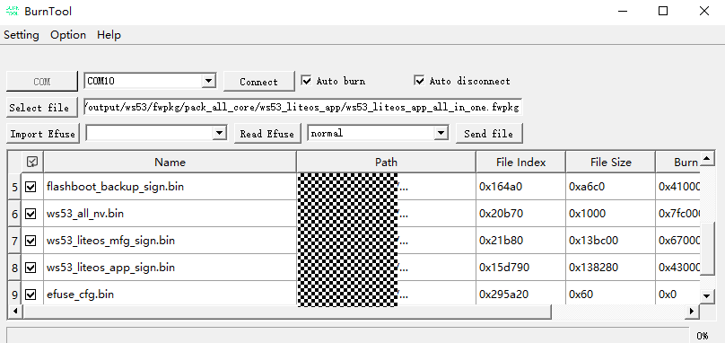
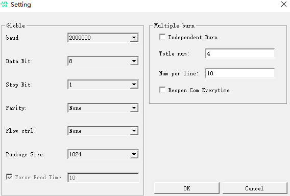
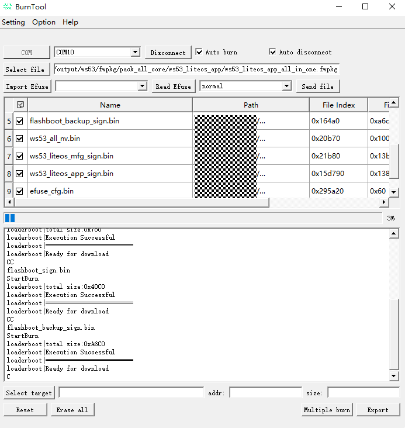
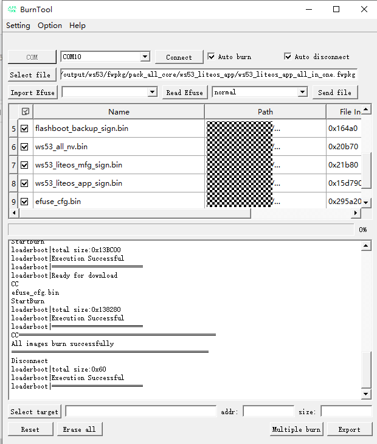
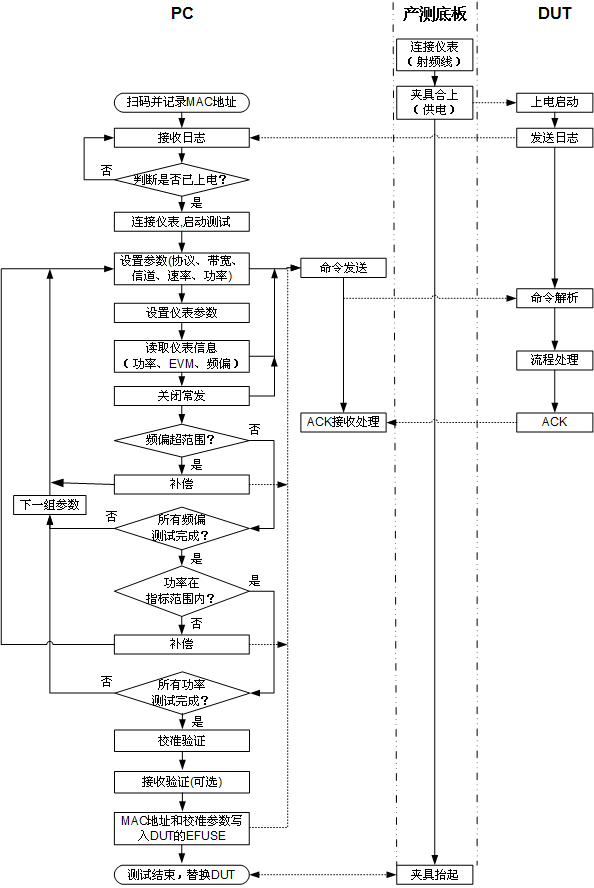
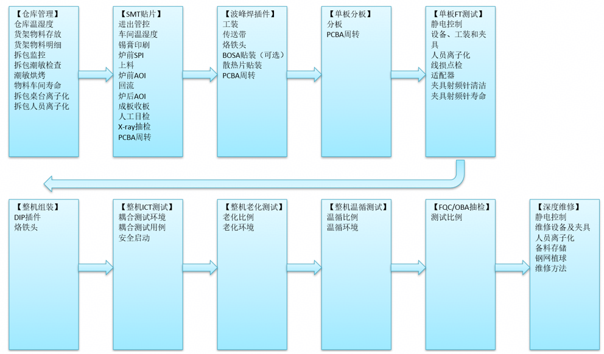

**概述<a name="section4537382116410"></a>**

本文档介绍了WS53V100 产品单板生产测试方案，包括软件加载、eFuse数据加载、测试项目和测试方法等内容。测试方法主要介绍与信号强度密切相关部分。

# 测试软件准备<a name="ZH-CN_TOPIC_0000001919234717"></a>

准备烧写工具“BurnTool”通过BurnTool工具烧写镜像。具体步骤如下：

1.  烧录镜像准备：

    在sdk中编译出镜像包，编译命令如下

    ```
    ./build.py -c ws53_liteos_app -def=PACKET_MFG_BIN
    ```

    > **说明：** 
    >默认是产测版本，产线校准完成后执行AT+FTM=0切换到业务版本，复位后生效。

2.  在BurnTool界面中，单击“Option”按钮，选择“Change chip”，从“Chip List”下拉菜单中选择“WS53”，并单击“OK”即可。
3.  在BurnTool界面中，单击“COM”按钮选择PC机串口（串口选择，请参考开发板使用指南）；单击“Select file”按钮，选择各产品编译生成的固件包（ws53\_liteos\_app\_all\_in\_one.fwpkg），并单击“OK”，如[图1](#fig5454104932819)所示。

    **图 1**  烧录文件选择示例<a name="fig5454104932819"></a>  
    
    

4.  勾选“Auto burn”以及“Auto disconnect”选项，烧录模式要求选择normal模式。

    选择“Setting”→“Settings”，配置串口参数，默认配置如[图2](#fig327052934116)所示，baud配置为2000000。

    > **说明：** 
    >Force Read Time：定时读取的时间，以毫秒为单位。勾选时为定时读取串口，不勾选时为事件触发读取串口。适用于不勾选该选项无法正常烧录的场景。

    **图 2**  串口设置示例<a name="fig327052934116"></a>  
    

    选择目标串口号并单击“Connect”按钮（单击后“Connect”变为“Disconnect”），复位单板。自动烧录效果如[图3](#fig1786964314118)所示。

    **图 3**  自动烧录示意图<a name="fig1786964314118"></a>  
    
    

    等待传输完成后结束烧写，烧写完成会出现“All images burn successfully”。烧写完成效果如[图4](#zh-cn_topic_0000001162123482_zh-cn_topic_0279549073_fig11410377529)所示。

    **图 4**  烧写完成示意图<a name="zh-cn_topic_0000001162123482_zh-cn_topic_0279549073_fig11410377529"></a>  
    
    

    > **说明：** 
    >如果镜像在服务器上，在速率不理想的外部状态下，若多次出现烧写镜像失败的情况，请拷贝产线镜像至串口连接电脑中进行烧写。

# 单板测试方案<a name="ZH-CN_TOPIC_0000001919355069"></a>

-   **[测试装备说明](#ZH-CN_TOPIC_0000001873275648)**  

-   **[产测测试流程](#ZH-CN_TOPIC_0000001919355061)**  

-   **[测试命令](#ZH-CN_TOPIC_0000001873275652)**  

-   **[常发固定速率表](#ZH-CN_TOPIC_0000001919355053)**  

## 测试装备说明<a name="ZH-CN_TOPIC_0000001873275648"></a>

测试分为产线性能测试和出厂功能测试。两个测试环节的测试系统关键设备相同（设备说明如[表1](#_table1785533110169)所示）。

**表 1**  测试系统关键设备说明

<a name="_table1785533110169"></a>
<table><thead align="left"><tr id="row327mcpsimp"><th class="cellrowborder" valign="top" width="31%" id="mcps1.2.3.1.1"><p id="p329mcpsimp"><a name="p329mcpsimp"></a><a name="p329mcpsimp"></a>设备名称</p>
</th>
<th class="cellrowborder" valign="top" width="69%" id="mcps1.2.3.1.2"><p id="p331mcpsimp"><a name="p331mcpsimp"></a><a name="p331mcpsimp"></a>说明</p>
</th>
</tr>
</thead>
<tbody><tr id="row333mcpsimp"><td class="cellrowborder" valign="top" width="31%" headers="mcps1.2.3.1.1 "><p id="p335mcpsimp"><a name="p335mcpsimp"></a><a name="p335mcpsimp"></a>PC机</p>
</td>
<td class="cellrowborder" valign="top" width="69%" headers="mcps1.2.3.1.2 "><p id="p337mcpsimp"><a name="p337mcpsimp"></a><a name="p337mcpsimp"></a>控制测试流程的主体。通过以太网连接Wi-Fi综测仪，通过串口与测试夹具进行连接，运行PC端测试软件，以实现整体工装测试的功能。</p>
</td>
</tr>
<tr id="row338mcpsimp"><td class="cellrowborder" valign="top" width="31%" headers="mcps1.2.3.1.1 "><p id="p340mcpsimp"><a name="p340mcpsimp"></a><a name="p340mcpsimp"></a>扫描枪</p>
</td>
<td class="cellrowborder" valign="top" width="69%" headers="mcps1.2.3.1.2 "><p id="p342mcpsimp"><a name="p342mcpsimp"></a><a name="p342mcpsimp"></a>每个DUT都有一个独立的MAC地址，通过扫描DUT上的唯一MAC地址，实现对DUT的编址功能（此为获取MAC地址码方法中的一种，还可通过从模组工厂的数据库获取唯一的Mac地址。获取的MAC地址，将写入模组芯片的eFuse）。</p>
</td>
</tr>
<tr id="row343mcpsimp"><td class="cellrowborder" valign="top" width="31%" headers="mcps1.2.3.1.1 "><p id="p345mcpsimp"><a name="p345mcpsimp"></a><a name="p345mcpsimp"></a>测试板（底板+测试夹具）</p>
</td>
<td class="cellrowborder" valign="top" width="69%" headers="mcps1.2.3.1.2 "><p id="p347mcpsimp"><a name="p347mcpsimp"></a><a name="p347mcpsimp"></a>承载电源，为DUT供电。通过串口分别连接DUT与PC，射频线连接DUT。</p>
</td>
</tr>
<tr id="row348mcpsimp"><td class="cellrowborder" valign="top" width="31%" headers="mcps1.2.3.1.1 "><p id="p350mcpsimp"><a name="p350mcpsimp"></a><a name="p350mcpsimp"></a>DUT（被测设备）</p>
</td>
<td class="cellrowborder" valign="top" width="69%" headers="mcps1.2.3.1.2 "><p id="p352mcpsimp"><a name="p352mcpsimp"></a><a name="p352mcpsimp"></a>被测设备，通过夹具接入工装，完成各项指标测试。</p>
</td>
</tr>
<tr id="row353mcpsimp"><td class="cellrowborder" valign="top" width="31%" headers="mcps1.2.3.1.1 "><p id="p355mcpsimp"><a name="p355mcpsimp"></a><a name="p355mcpsimp"></a>综测仪</p>
</td>
<td class="cellrowborder" valign="top" width="69%" headers="mcps1.2.3.1.2 "><p id="p357mcpsimp"><a name="p357mcpsimp"></a><a name="p357mcpsimp"></a>对DUT进行Wi-Fi和BT的非信令测试（功率测试、频偏测试）。</p>
</td>
</tr>
</tbody>
</table>

## 产测测试流程<a name="ZH-CN_TOPIC_0000001919355061"></a>

-   **[产测测试流程图](#ZH-CN_TOPIC_0000001873435484)**  

-   **[测试步骤](#ZH-CN_TOPIC_0000001919234713)**  

-   **[eFuse写入](#ZH-CN_TOPIC_0000001919234721)**  

-   **[efuse回读校验](#ZH-CN_TOPIC_0000001951903828)**  

-   **[切换产测bin到业务bin](#ZH-CN_TOPIC_0000001873435500)**  

### 产测测试流程图<a name="ZH-CN_TOPIC_0000001873435484"></a>

工装测试流程实现示例如[图1](#_fig185791617175113)所示。

**图 1**  产测测试流程示例<a name="_fig185791617175113"></a>  



### 测试步骤<a name="ZH-CN_TOPIC_0000001919234713"></a>

1.  PC扫描DUT上的MAC地址。并录入产测软件系统，后面将该mac地址写入eFuse中。
2.  PC 通过网线连接 itest 综测仪，将模组放入夹具并上电。
3.  PC接收DUT的日志并判断是否已经上电。如果检测已上电完成，进行下一步。
4.  <a name="li9139237165612"></a>进入命令行，开始测试。

    1.  读取DIEID，命令如下：

    ```
    AT+DIEID
    ```

    1.  初始化Wi-Fi，命令如下：

    ```
    AT+STARTSTA
    ```

    > **说明：** 
    >使用wifi相关测试命令前，均要在启动sta之后可以正常使用，即需要执行"AT+STARTSTA"此命令。

5.  <a name="li1356812552011"></a>在[步骤4](#li9139237165612)的基础上，进行频偏校准。
    1.  设置协议、信道、带宽、速率等参数的常发，参考“[2.3-测试命令](#ZH-CN_TOPIC_0000001873275652)”。以11n为例，命令如下：

        ```
        AT+ALTX=2  // 2：固定速率常发
        AT+TRC=0  // 0：固定速率，1：自动速率
        AT+SETRATE=36  // 设置固定速率
        AT+CCPRIV=wlan0,mode,11n2g20 // 设置协议模式
        AT+CCPRIV=wlan0,freq,7 // 设置信道
        AT+CCPRIV=wlan0,al_tx_ccpriv,1,2,1000
        ```

    2.  产测软件设置对应仪表相关参数，读取频偏信息并记录。
    3.  进行粗调频偏调整，首先产测软件校验读取的频偏信息，如果频偏超出粗调精度范围，则调整粗调校正码值，不同的校正码值对应不同的频率，校正码值越小，输出频率越大；校正码值越大，输出频率越小，使用二分法调整校正码值。粗调精度在±4ppm范围以内，或者校正码值达到边界（0或63），进行下一步。
        -   调整校正码值命令：

            ```
            AT+COARSE=<value>
            ```

        -   参数说明：

            value：粗调寄存器设置范围0\~63，value默认配置为9。如果调整到63或0仍达不到精度要求，继续细调。

    4.  进行细调频偏调整，首先校验频偏，如果频偏超出细调精度范围，调整细调校正码值，不同的校正码值对应不同的频率，同样校正码值越小，输出频率越大；校正码值越大，输出频率越小，使用二分法调整校正码值。细调精度在±3ppm范围以内，频偏校准完成。
        -   调整频偏命令：

            ```
            AT+FINE=<value>
            ```

        -   参数说明：

            value：细调寄存器值，参数范围 0\~15，value默认配置为0。如果调整到15或0仍达不到精度要求，则为坏片。

    5.  获取芯片温度。

        ```
        AT+TEMP
        ```

    6.  频偏校准完毕后，执行关闭常发，命令格式如下：

        ```
        AT+ALTX=0
        ```

6.  <a name="li1246571217"></a>在[步骤5](#li1356812552011)的基础上，进行Wi-Fi功率校准。

    > **说明：** 
    >如果线损补偿偏差太大，存在风险；下次功率校准时超±4dBm，判定异常退出，功率校准失败。

    1.  将放大系数与3个待测协议（速率）\(11b\(1M\)、11g 20M\(6M\)、11n 40M\(MCS0\)\)高低功率偏移值置为默认值（默认值由芯片SDK出厂预置）命令如下：

        ```
        AT+FACTOR=0
        AT+HIGHCURVE=0
        ```

    1.  <a name="li910974881413"></a>选取目标功率点，建议高功率取20dBm，可以根据实际使用的功率范围做调整，将2个目标功率下发到驱动，命令如下：

        ```
        AT+TARPOWER=200,130 // 第2个参数为低功率目标功率点，默认设置为130，不需要关注与修改
        ```

        > **说明：** 
        >此命令需要和下面[操作5](#li20128151911197)成对进行操作，切换协议模式需要再次下发该命令。

    2.  配置常发参数，参考“[测试命令](#ZH-CN_TOPIC_0000001873275652)”在开启常发时配置目标功率<tpc\_code\>，以11n协议为例，信道选取7信道，命令如下：

        ```
        AT+ALTX=0          // 如果没有关闭常发，先关闭常发
        AT+ALTX=2          // 2：固定速率常发
        AT+TRC=0           // 0：固定速率，1：自动速率
        AT+SETRATE=36      // 参数说明见"[表1](#table64602525173)"，例如：36表示11n, 20MHz频宽,mcs4
        AT+CCPRIV=wlan0,mode,11n2g20
        AT+CCPRIV=wlan0,freq,7
        AT+CCPRIV=wlan0,al_tx_ccpriv,1,2,1000,6
        ```

        参数说明：

        TPC code，与配置功率的对应关系为:（23dBm-配置功率）×2。

        11b的档位计算为：11b的档位=（23dBm-配置功率）×2+74。例如20dBm，应配置value为6，11b为80，13dBm应配置value为20，11b为94。

        > **说明：** 
        >开启常发后需要等待mfg pdet power saved字样打印出现，代表成功。

    3.  获取记录实际测试的功率，差值如果超过\[-4，+4\]dBm则异常退出，在\[-4，+4\]dBm以内，进行下一步。
    4.  <a name="li20128151911197"></a>测试完成先关闭常发，然后将测量出的实际功率值下发给驱动，命令如下：

        ```
        AT+ALTX=0
        AT+CALIPOWER=<param1>,<param2>
        ```

        -   参数说明：

            param1，param2：2个实测功率分别从tester读取到实际功率输出，param2默认130，不需要关注。

        -   参数范围：0\~300，单位0.1dBm。

    5.  重复执行[步骤6](#li1246571217)的[操作2](#li910974881413)\~[操作5](#li20128151911197)，分别设置三个协议（11b、11g 20M、11n 40M）的实际功率给驱动，测试不同的协议前，需要先关闭常发，然后再通过常发命令进行修改：

        ```
        AT+ALTX=0
        ```

    6.  <a name="li2078119579209"></a>下发命令获取高功率补偿值并记录。

        ```
        AT+HIGHCURVE?
        ```

        这里记录2条输出的9个值。

7.  Wi-Fi功率和频偏校准验证。
    1.  设置高功率补偿值，值来源于步骤6中的[操作7](#li2078119579209)（为防止测试过程中功率曲线被修改）

        ```
        AT+HIGHCURVE=1,<v1>…,<v9>
        ```

    2.  进行功率校验，校验3条曲线，协议\(速率\)选取11b\(11M\)，11ax 20M\(mcs9\)，11n 40M\(mcs7\)，建议功率取18dBm，也可以根据自己的需求，校验需要的功率点位。
    3.  发送如下常发命令，以11n协议为例，验证功率输出和频率输出是否满足规格。命令使用请参见“[测试命令](#ZH-CN_TOPIC_0000001873275652)”小节。

        ```
        AT+ALTX=0          // 如果没有关闭常发，先关闭常发
        AT+ALTX=2          // 2：固定速率常发
        AT+TRC=0           // 0：固定速率，1：自动速率
        AT+SETRATE=36   // 参数说明见"[表1](#table64602525173)"，例如：36表示11n, 20MHz频宽,mcs4
        AT+CCPRIV=wlan0,mode,11n2g20 // 设置协议模式
        AT+CCPRIV=wlan0,freq,7 // 设置信道
        AT+CCPRIV=wlan0,al_tx_ccpriv,1,2,1000,10  // 10：TPC code
        ```

        -   参数说明如下：

            TPC code，与配置功率的对应关系为：（23dBm-配置功率）×2。

            11b的档位计算为：11b的档位=（23dBm-配置功率）×2 +74。如果不满足±1.5dB规格，则提示错误，退出产测流程。

    4.  验证不同的协议前，需要先关闭常发，然后再通过操作2中的命令修改其中的协议模式以及tpc\_code参数。

        ```
        AT+ALTX=0
        ```

    5.  全部协议验证完毕后，执行关闭常发，命令如下:

        ```
        AT+ALTX=0
        ```

8.  Wi-Fi RSSI校准。

    > **说明：** 
    >如果不是首次进行rssi校准，则需要首先将各个信道（3、7、11）的补偿值恢复为0，命令如下：
    >AT+RSSICOMP=<信道\>,0
    >常收不支持mac帧过滤，固定为0。

    1.  设置指定协议、信道、带宽、天线等参数的常收，协议选取11n，20M，mcs0，信道分别选取3、7、11命令如下，以11n2g20M，3信道为例：

        ```
        AT+ALRX=1,0,20,7,0    // AT+ALRX=<flag>,<协议模式>,<带宽>,<freq>,<mac帧过滤>
        ```

    2.  设置仪表以-50dBm信号强度发射，配置相关参数、频点、功率、波形文件等信息。

        > **说明：** 
        >RSSI校准和测试时，要设置仪表保持常发状态，不能固定发包数，同时延时50ms或100ms后，查询单板RSSI信息，测试无问题后再关掉仪表常发，同时切换不同协议模式测试时，要先关掉单板常收。

    3.  读取RSSI信息。如果RSSI功率偏移在±2dBm范围内继续执行操作5，否则调用RSSI功率偏移命令到指标范围内。
        -   读取RSSI功率命令：

            ```
            AT+RXINFO
            ```

            **注意：获取RSSI功率单位为1dbm。**

        -   RSSI功率偏移命令：

            ```
            AT+RSSICOMP=<channel>,<offset>
            ```

        -   参数说明如下：
            -   channel：信道号，，范围：1\~14。
            -   offset：rssi偏移值，最大范围：\[-15，+15\]，1格代表1dB。

                **注意：**

                -   **channel需要和当前常收命令配置的参数一致。**
                -   **value为综测仪发包信号强度与命令读出数据差值的累加值**。

                    例如：发包信号强度为-50dBm，第一次命令读出-55，则命令需写入value为5，第二次读出-53，则命令需写入8（5+3）。

    4.  获取RSSI偏移数据是否与配置相同，如果相同，记录channel和value。

        ```
        AT+GETRSSICOMP=<channel>
        ```

        -   参数说明如下：

            channel：信道号，1\~14。

    5.  测试不同的频段/信道前，需要先关闭常收，通过如下命令修改信道参数：

        ```
        AT+ALRX=0
        AT+ALRX=<flag>,<协议模式>,<带宽>,<freq>,<mac帧过滤> // 具体测试命令请参见“2.3-测试命令”。
        ```

    6.  测试完成，关闭常收

        ```
        AT+ALRX=0
        ```

    7.  校验RSSI偏移调整结果，使用set命令，选取任意信道，设置其rssi偏移值。推荐校验协议信道：11ax 20M、11n 40M。

        ```
        AT+RSSICOMP=<信道>,<偏移>
        ```

        注：14个信道分为3组，1\~4信道设置的rssi偏移值使用3信道校准时得到的偏移值，5\~9信道设置的rssi偏移值使用7信道校准时得到的偏移值，10\~13\(14\)信道获取的rssi偏移值使用11信道校准时得到的偏移值。

    8.  验证不同的信道前，需要先关闭常收，然后再通过如下命令修改其中的<freq\>等参数，验证RSSI功率是否满足\[-3,+3\]dBm规格，如果不满足规格，则提示错误，退出产测流程，以11n2g20M为例。

        ```
        AT+ALRX=0
        AT+ALRX=1,0,20,7,0  // AT+ALRX=<flag>,<协议模式>,<带宽>,<freq>,<mac帧过滤>
        ```

    9.  信道验证完毕后，执行关闭常收，命令如下：

        ```
        AT+ALRX=0
        ```

9.  Wi-Fi Rx性能测试。
    1.  分别切换11b、11g、11n40M和11ax协议模式，在每个模式下抽测3、7、11信道的信号质量，速率选取最高速率：先执行芯片常收命令，以设置11ax2g20M协议，7信道的常收为例，命令格式：

        ```
        AT+ALRX=0
        AT+ALRX=1,0,20,7,0
        ```

        具体测试命令请参见“[测试命令](#ZH-CN_TOPIC_0000001873275652)”小节中的“常收命令”命令说明。

    2.  控制产测仪表，依次减小发包信号强度，在指定信道发送上述协议的报文n1个，然后执行如下接收统计命令，获取Wi-Fi芯片实际接收的报文n2个。n2/n1满足规格，则算通过。收包查询示例：

        ```
        AT+RXINFO
        ```

    3.  所有信道测试完毕后，执行关闭常收，命令如下：

        ```
        AT+ALRX=0
        ```

1.  <a name="li6260164753113"></a>BLE/SLE开始测试。
    1.  下发使能BLE命令

        ```
        AT+BLEENABLE
        ```

    2.  注册BLE回调

        ```
        AT+BLEFACCALLBACK
        ```

1.  在[步骤10](#li6260164753113)基础上，进行频偏校准（当进行了[步骤5](#li1356812552011)，则跳过本步骤）。
    1.  下发常发命令，设置为2442M频点、255包长度、PRBS9包类型、1M phy。

        ```
        AT+BLETX=20,255,0,1
        ```

        具体参数请参见“[测试命令](#ZH-CN_TOPIC_0000001873275652)”小节中的BLE常发命令。

    2.  PC装备从仪表端读取频偏值，然后根据频偏测试情况，决定是否下发调整晶振负载电容的指令。频偏上偏时，增大电容值，频偏下偏时，减少电容值。当频偏在\[-4ppm，4ppm\]范围以外时，使用二分法调用频偏粗调命令进行频率调整。当频偏值达到\[-4ppm，4ppm\]以内，或者粗调值到达边界（0或63），则开始细调。
    3.  粗调后，继续从仪表端读取频偏值，当频偏在\[-3ppm，3ppm\]范围以外时，使用二分法调用频偏细调命令进行频率调整。当达到\[-3ppm，3ppm\]以内，停止调整，校准成功；当细调值达到边界值（0或15），而频偏仍然没达到\[-3ppm，3ppm\]以内，则判定校准失败。频偏电容设置命令如下：

        ```
        AT+XOTRIM=<coarse>,<fine>
        ```

        参数说明如下：

        -   coarse：频偏粗调值，取值范围：0～63。
        -   fine：频偏细调值，取值范围：0～15。

        参数请参见“[测试命令](#ZH-CN_TOPIC_0000001873275652)”小节中的频偏校准命令。

    4.  校准步骤完成后，执行关闭常发，命令如下：

        ```
        AT+BLETRXEND
        ```

    5.  读取芯片温度，命令如下：

        ```
        AT+READTEMP
        ```

1.  在[步骤10](#li6260164753113)的基础上，开始BLE/SLE功率校准。
    1.  根据设定的目标功率下发命令。

        ```
        AT+PWRCALI=<target_pwr>,<target_pwr>
        ```

        参数说明：

        -   target\_pwr: 目标功率，单位0.1dBm，仅限14dBm校准。

    2.  下发功率校准命令，消除温度影响。

        ```
        AT+PWRCALI
        ```

    3.  下发常发命令，设置为2442M频点、255包长度、PRBS9包类型、1M phy。

        ```
        AT+BLETX=20,255,0,1
        ```

    4.  仪表读取功率值，当实测功率与目标功率相差绝对值大于3dB,  则校准失败。将目标功率和实测功率下发，计算补偿值，命令如下：

        ```
        AT+PWRCALI=<target_pwr>,<msr_pwr>
        ```

        参数说明：

        -   target\_pwr: 目标功率，单位0.1dBm，取值范围0～300，该值必须与软件设置的目标功率一致。
        -   msr\_pwr: 实测功率，单位0.1dBm，取值范围0～300。

        参数请参见“[测试命令](#ZH-CN_TOPIC_0000001873275652)”小节中的下发实测功率命令。

    5.  关闭常发，命令如下：

        ```
        AT+BLETRXEND
        ```

    6.  读取放大系数和补偿值，命令如下（可选）：

        ```
        AT+PWRCALI?
        ```

    7.  应用功率校准补偿值，命令如下：

        ```
        AT+PWRCALI
        ```

    8.  开启BLE常发，验证功率校准补偿结果，命令如下：

        ```
        AT+BLETX=20,255,0,1
        ```

        参数请参见“[测试命令](#ZH-CN_TOPIC_0000001873275652)”小节中的BLE常发命令。

    9.  仪器读取功率，验证是否达到目标，关闭BLE常发，命令如下：

        ```
        AT+BLETRXEND
        ```

> **说明：** 
>此处功率校只支持校准1个信道，不支持校准多个信道，要求在2442MHz频点进行BLE 1M常发或SLE GFSK 1M常发进行校准。

1.  在[步骤10](#li6260164753113)的基础上，进行BLE常发测试。
    1.  下发BLE软复位命令：

        ```
        AT+BLERST
        ```

    2.  下发BLE常发命令，命令格式如下：

        ```
        AT+BLETX=<channel>,<data_len>,<payload_type>,<phy>
        ```

        参数请参见“[测试命令](#ZH-CN_TOPIC_0000001873275652)”小节中的BLE常发命令。

    3.  测试完成后，执行关闭发送，命令如下：

        ```
        AT+BLETRXEND
        ```

2.  在[步骤10](#li6260164753113)的基础上，进行BLE常收测试。
    1.  下发BLE软复位命令：

        ```
        AT+BLERST
        ```

    2.  下发BLE常收命令格式如下：

        ```
        AT+BLERX=<chnl>,<phy>,<modulation>
        ```

        参数请参见“[测试命令](#ZH-CN_TOPIC_0000001873275652)”小节中的BLE常收命令。

    3.  仪器以测试点功率发送，通过产测软件在串口获取收包数并计算per，per小于30.8%，则通过测试。
    4.  测试完成后，执行关闭常收，命令如下：

        ```
        AT+BLETRXEND
        ```

1.  <a name="li382164417206"></a>开始SLE测试，设置SLE测试的前置条件。
    1.  下发使能SLE命令。

        ```
        AT+SLEENABLE
        ```

    1.  注册SLE回调

        ```
        AT+SLEFACCALLBACK
        ```

1.  在[步骤15](#li382164417206)的基础上，开始SLE常发测试。
    1.  下发SLE软复位命令：

        ```
        AT+SLERST
        ```

    2.  下发SLE常发命令，命令格式如下：

        ```
        AT+SLETX=<channel>,<tx_power>,<data_len>,<payload_type>,<phy>,<format>,<rate>,<pilot_ratio>,<polar>,<interval>
        ```

        参数请参见“[测试命令](#ZH-CN_TOPIC_0000001873275652)”小节中的SLE常发命令。

    3.  测试完成后，执行关闭发送，命令如下：

        ```
        AT+SLETRXEND
        ```

2.  在[步骤15](#li382164417206)的基础上，开始SLE常收测试。
    1.  下发SLE软复位命令：

        ```
        AT+SLERST
        ```

    2.  下发SLE常收命令，命令格式如下：

        ```
        AT+SLERX=<channel>,<phy>,<format>,<pilot_ratio>,<interval>
        ```

        参数请参见“[测试命令](#ZH-CN_TOPIC_0000001873275652)”小节中的SLE常收命令。

    3.  测试完成后，执行关闭发送，命令如下：

        ```
        AT+SLETRXEND
        ```

3.  校准参数写入eFuse，请参见“[eFuse写入](#ZH-CN_TOPIC_0000001919234721)”小节。
4.  efuse回读校验，请参见”  [efuse回读校验](#ZH-CN_TOPIC_0000001951903828)  ”小节。
5.  测试完成，下电，更换模组。

### eFuse写入<a name="ZH-CN_TOPIC_0000001919234721"></a>

产测自动化程序可以通过下面命令将校准数据（温度，MAC地址，频率偏移，功率偏移）写入eFuse，写入之前需完成上面校准操作，且单板未断电。

> **须知：** 
>**WS53校准数据只有3次写入eFuse的机会**。WiFi MAC地址有3次写入eFuse的机会，SLE MAC仅支持写入到NV。

1.  频偏校正码值写入eFuse的命令如下：

    ```
    AT+EFUSEXOTRIM
    ```

    说明：频偏校正码值和功率参数缺省会自动写入，参数值来源于内部寄存器。

2.  温度信息写入eFuse的命令如下：

    ```
    AT+EFUSETEMP=temp
    ```

1.  功率信息写入eFuse的命令如下：

    ```
    AT+EFUSEPOWER
    ```

    说明：功率需写入8个参数，命令不需要添加参数，功率偏移参数缺省会自动写入。

2.  RSSI校准信息写入eFuse的命令如下：

    ```
    AT+EFUSERSSI=<values1>,<values2>,<value3>
    ```

    参数说明如下：

    -   <value1\~3\>：RSSI偏移值，范围-15\~+15，单位1dBm

3.  BLE/SLE eFuse命令
    1.  频偏eFuse写入（WiFi产线校准未做频偏时使用）。

        ```
        AT+XOEFUSE
        ```

    1.  温度eFuse写入（WiFi产线校准未做频偏时使用）。

        ```
        AT+TEMPEFUSE=<temp>
        ```

        参数说明：

        -   temp: 温度，单位℃，取值范围-40～120。

        参数请参见“[测试命令](#ZH-CN_TOPIC_0000001873275652)”小节中的温度写eFuse命令。

        > **说明：** 
        >若wifi进行频偏校准，并写了频偏和温度efuse，则BLE/SLE不写频偏和温度efuse。

    2.  将BLE/SLE功率校准补偿值写入eFuse。

        ```
        AT+PWRCALIEFUSE
        ```

4.  WiFi MAC地址信息写入eFuse的命令示例如下：

    ```
    AT+EFUSEMAC=<mac>,0
    ```

    注意：写wifi的3MAC地址，最多有3次写入机会，最后一次生效，WiFi以及BLE MAC规则请参考“[测试命令](#ZH-CN_TOPIC_0000001873275652)”小节对应命令解析。

5.  SLE MAC地址写入eFuse的命令示例如下：

    ```
    AT+EFUSEMAC=<mac>,3
    ```

    注意：写SLE MAC地址，仅支持写到NV。

### efuse回读校验<a name="ZH-CN_TOPIC_0000001951903828"></a>

> **说明：** 
>为确认写入efuse的数据的正确性，在写入efuse步骤完成后，需将efuse值回读，与写入的目标值进行对比校验，目标值来自于校准过程。校验成功则通过测试，否则失败。

1.  查询WiFi产测eFuse所有数据

    ```
    AT+RCALDATA
    ```

    注：命令使用如[表1](#table923602775818)所示，“查询产测eFuse所有数据”项。

1.  查询BLE/SLE频偏校准efuse数据

    ```
    AT+XOEFUSE?
    ```

    注：命令使用如[表1](#table923602775818)所示，“频偏校准eFuse读取”项。

1.  查询BLE/SLE校准温度efuse数据

    ```
    AT+TEMPEFUSE?
    ```

    注：命令使用如[表1](#table923602775818)所示，“温度eFuse读取”项。

1.  查询BLE/SLE功率校准efuse数据

    ```
    AT+PWRCALIEFUSE?
    ```

    注：命令使用如[表1](#table923602775818)所示，“功率校准eFuse读取”。

### 切换产测bin到业务bin<a name="ZH-CN_TOPIC_0000001873435500"></a>

> **须知：** 
>建议不要使用产测分区后8K空间，否则，存在误进入产测模式的风险。

产测完成后，在产测模式下发“AT+FTM=0”命令，重启后模组由产测模式切换到业务模式。在业务模式不可重新回到产测模式。

产测完成，切到业务模式后，需复位模组（命令：AT+RST，或断电重启），检查能否正常启动。

> **说明：** 
>商用SDK编译出来的业务版本，不能使用AT+FTM=1切到产测模式。
>AT+FTM=0命令，除了执行切换到业务模式，还会将主NV区数据备份到从NV区。

## 测试命令<a name="ZH-CN_TOPIC_0000001873275652"></a>

**表 1**  测试命令

<a name="table923602775818"></a>
<table><thead align="left"><tr id="row52371827155819"><th class="cellrowborder" valign="top" width="9.220922092209221%" id="mcps1.2.4.1.1"><p id="p323782715585"><a name="p323782715585"></a><a name="p323782715585"></a>序号</p>
</th>
<th class="cellrowborder" valign="top" width="16.55165516551655%" id="mcps1.2.4.1.2"><p id="p11237827135815"><a name="p11237827135815"></a><a name="p11237827135815"></a>测试命令</p>
</th>
<th class="cellrowborder" valign="top" width="74.22742274227421%" id="mcps1.2.4.1.3"><p id="p22377272584"><a name="p22377272584"></a><a name="p22377272584"></a>命令说明</p>
</th>
</tr>
</thead>
<tbody><tr id="row3237827195811"><td class="cellrowborder" valign="top" width="9.220922092209221%" headers="mcps1.2.4.1.1 "><p id="p6237112719587"><a name="p6237112719587"></a><a name="p6237112719587"></a>1</p>
</td>
<td class="cellrowborder" valign="top" width="16.55165516551655%" headers="mcps1.2.4.1.2 "><p id="p1354965719016"><a name="p1354965719016"></a><a name="p1354965719016"></a>初始化wifi</p>
</td>
<td class="cellrowborder" valign="top" width="74.22742274227421%" headers="mcps1.2.4.1.3 "><pre class="codeblock" id="codeblock04791712164613"><a name="codeblock04791712164613"></a><a name="codeblock04791712164613"></a>AT+STARTSTA</pre>
<a name="ul101981534164511"></a><a name="ul101981534164511"></a><ul id="ul101981534164511"><li>响应<p id="p15635131644615"><a name="p15635131644615"></a><a name="p15635131644615"></a>OK或ERROR</p>
</li></ul>
</td>
</tr>
<tr id="row109204221326"><td class="cellrowborder" valign="top" width="9.220922092209221%" headers="mcps1.2.4.1.1 "><p id="p189206221427"><a name="p189206221427"></a><a name="p189206221427"></a>2</p>
</td>
<td class="cellrowborder" valign="top" width="16.55165516551655%" headers="mcps1.2.4.1.2 "><p id="p1792019221727"><a name="p1792019221727"></a><a name="p1792019221727"></a>常发命令</p>
</td>
<td class="cellrowborder" valign="top" width="74.22742274227421%" headers="mcps1.2.4.1.3 "><a name="ol34017387712"></a><a name="ol34017387712"></a><ol id="ol34017387712"><li><strong id="b720814910115"><a name="b720814910115"></a><a name="b720814910115"></a>配置协议模式</strong><div class="p" id="p122094915518"><a name="p122094915518"></a><a name="p122094915518"></a>AT+CCPRIV=wlan0,mode,&lt;mode&gt;<a name="ul9721132517510"></a><a name="ul9721132517510"></a><ul id="ul9721132517510"><li>响应<p id="p2405151014520"><a name="p2405151014520"></a><a name="p2405151014520"></a>OK或ERROR</p>
</li></ul>
</div>
<a name="ul1886217357010"></a><a name="ul1886217357010"></a><ul id="ul1886217357010"><li>参数说明：11b、11g2g20、11n2g20、11n2g40、11ax2g20</li><li><strong id="b467042212295"><a name="b467042212295"></a><a name="b467042212295"></a>注意：</strong><p id="p1111101892914"><a name="p1111101892914"></a><a name="p1111101892914"></a><strong id="b1261210242295"><a name="b1261210242295"></a><a name="b1261210242295"></a>对于11n2g40制式，</strong></p>
<p id="p1311161832916"><a name="p1311161832916"></a><a name="p1311161832916"></a><strong id="b11613112419294"><a name="b11613112419294"></a><a name="b11613112419294"></a>如果先配置频宽，后配置信道，则上偏，chn1&lt;=&lt;chn&gt;&lt;=chn11，中心频点=&lt;chn&gt;+10M</strong></p>
<p id="p1511111814296"><a name="p1511111814296"></a><a name="p1511111814296"></a><strong id="b76131824172915"><a name="b76131824172915"></a><a name="b76131824172915"></a>如果先配置信道，后配置频宽，则下偏，chn3&lt;=&lt;chn&gt;&lt;=chn13，中心频点=&lt;chn&gt;-10M</strong></p>
</li></ul>
</li></ol>
<a name="ol1062115194375"></a><a name="ol1062115194375"></a><ol id="ol1062115194375"><li><strong id="b232mcpsimp"><a name="b232mcpsimp"></a><a name="b232mcpsimp"></a>设置信道</strong><p id="p8923039125619"><a name="p8923039125619"></a><a name="p8923039125619"></a>AT+CCPRIV=wlan0,freq,&lt;freq&gt;</p>
<a name="ul15762114194415"></a><a name="ul15762114194415"></a><ul id="ul15762114194415"><li>响应<p id="p167413116529"><a name="p167413116529"></a><a name="p167413116529"></a>OK或ERROR</p>
</li><li>参数说明：信道1~14，只有11b有信道14。</li></ul>
</li><li><strong id="b121713187138"><a name="b121713187138"></a><a name="b121713187138"></a>开启常发</strong><a name="ul1225525313513"></a><a name="ul1225525313513"></a><ul id="ul1225525313513"><li>命令格式<p id="p2047174212562"><a name="p2047174212562"></a><a name="p2047174212562"></a>AT+ALTX=&lt;control&gt;[,&lt;protocol_mode&gt;,&lt;bw&gt;,&lt;chn&gt;]</p>
</li><li>响应<p id="p937117074713"><a name="p937117074713"></a><a name="p937117074713"></a>OK或ERROR</p>
</li><li>参数说明<p id="p2627mcpsimp"><a name="p2627mcpsimp"></a><a name="p2627mcpsimp"></a>&lt;control&gt;：使能开关</p>
<p id="p2628mcpsimp"><a name="p2628mcpsimp"></a><a name="p2628mcpsimp"></a>0：关闭</p>
<p id="p2629mcpsimp"><a name="p2629mcpsimp"></a><a name="p2629mcpsimp"></a>1：打开</p>
<p id="p1396104016522"><a name="p1396104016522"></a><a name="p1396104016522"></a>2：固定速率常发</p>
<p id="p2630mcpsimp"><a name="p2630mcpsimp"></a><a name="p2630mcpsimp"></a>&lt;protocol_mode&gt;：协议类型</p>
<p id="p2631mcpsimp"><a name="p2631mcpsimp"></a><a name="p2631mcpsimp"></a>0：802.11n</p>
<p id="p2632mcpsimp"><a name="p2632mcpsimp"></a><a name="p2632mcpsimp"></a>1：802.11g</p>
<p id="p2633mcpsimp"><a name="p2633mcpsimp"></a><a name="p2633mcpsimp"></a>2：802.11b</p>
<p id="p2634mcpsimp"><a name="p2634mcpsimp"></a><a name="p2634mcpsimp"></a>3：802.11ax</p>
<p id="p035375718436"><a name="p035375718436"></a><a name="p035375718436"></a>5：11n 40plus（上偏，chn1&lt;=&lt;chn&gt;&lt;=chn11，中心频点=&lt;chn&gt;+10M）</p>
<p id="p9353757134314"><a name="p9353757134314"></a><a name="p9353757134314"></a>6：11n 40minus（下偏，chn3&lt;=&lt;chn&gt;&lt;=chn13，中心频点=&lt;chn&gt;-10M）</p>
<p id="p2635mcpsimp"><a name="p2635mcpsimp"></a><a name="p2635mcpsimp"></a>&lt;bw&gt;：带宽</p>
<p id="p2636mcpsimp"><a name="p2636mcpsimp"></a><a name="p2636mcpsimp"></a>20：20MHz带宽</p>
<p id="p05431059184520"><a name="p05431059184520"></a><a name="p05431059184520"></a>40：40MHz带宽</p>
<p id="p2637mcpsimp"><a name="p2637mcpsimp"></a><a name="p2637mcpsimp"></a>&lt;chn&gt;：信道号，取值范围1～14</p>
<p id="p471754616293"><a name="p471754616293"></a><a name="p471754616293"></a><strong id="b89871854202914"><a name="b89871854202914"></a><a name="b89871854202914"></a>注意：</strong></p>
<p id="p1283715118297"><a name="p1283715118297"></a><a name="p1283715118297"></a><strong id="b398835422912"><a name="b398835422912"></a><a name="b398835422912"></a>如果protocol_mode配置为11n 40plus，则chn1&lt;=&lt;chn&gt;&lt;=chn11，中心频点=&lt;chn&gt;+10M。</strong></p>
<p id="p1483745132917"><a name="p1483745132917"></a><a name="p1483745132917"></a><strong id="b1798915432912"><a name="b1798915432912"></a><a name="b1798915432912"></a>如果protocol_mode配置为11n 40minus，则chn3&lt;=&lt;chn&gt;&lt;=chn13，中心频点=&lt;chn&gt;-10M。</strong></p>
</li></ul>
</li><li><strong id="b1763812391032"><a name="b1763812391032"></a><a name="b1763812391032"></a>配置固定\自动速率</strong><a name="ul092919105812"></a><a name="ul092919105812"></a><ul id="ul092919105812"><li>命令格式<p id="p2160847185611"><a name="p2160847185611"></a><a name="p2160847185611"></a>AT+TRC=&lt;val&gt;</p>
</li><li>参数说明<p id="p569620175917"><a name="p569620175917"></a><a name="p569620175917"></a>0：固定速率，1：自动速率</p>
</li></ul>
</li><li><strong id="b6488127175314"><a name="b6488127175314"></a><a name="b6488127175314"></a>配置常发速率</strong><a name="ul2855205215533"></a><a name="ul2855205215533"></a><ul id="ul2855205215533"><li>命令格式<p id="p893664995617"><a name="p893664995617"></a><a name="p893664995617"></a>AT+SETRATE=&lt;rate&gt;</p>
</li><li>响应<p id="p145275106551"><a name="p145275106551"></a><a name="p145275106551"></a>OK或ERROR</p>
</li><li>参数说明：参数说明见"<a href="#ZH-CN_TOPIC_0000001919355053">常发固定速率表</a>"，例如：36表示11n, 20MHz频宽,mcs4</li></ul>
</li><li><strong id="b962511229134"><a name="b962511229134"></a><a name="b962511229134"></a>开启常发</strong>（功率校准时需要配置tpc_code，以指定功率常发需要添加此命令，不配置不需要）<a name="ul189839315361"></a><a name="ul189839315361"></a><ul id="ul189839315361"><li>命令格式<p id="p201845526560"><a name="p201845526560"></a><a name="p201845526560"></a>AT+CCPRIV=wlan0,al_tx_ccpriv,&lt;flag&gt;,&lt;payload&gt;,&lt;len&gt;,&lt;tpc_code&gt;</p>
</li><li>响应<p id="p57511039135510"><a name="p57511039135510"></a><a name="p57511039135510"></a>OK或ERROR</p>
</li><li>参数说明<p id="p570194413711"><a name="p570194413711"></a><a name="p570194413711"></a>&lt;flag&gt;：</p>
<p id="p251161013386"><a name="p251161013386"></a><a name="p251161013386"></a>0：关闭常发</p>
<p id="p3511131014384"><a name="p3511131014384"></a><a name="p3511131014384"></a>1：打开常发</p>
<p id="p5281147123716"><a name="p5281147123716"></a><a name="p5281147123716"></a>&lt;payload&gt;：</p>
<p id="p1284102063814"><a name="p1284102063814"></a><a name="p1284102063814"></a>0：全0</p>
<p id="p2831153212388"><a name="p2831153212388"></a><a name="p2831153212388"></a>1：全1</p>
<p id="p137992367383"><a name="p137992367383"></a><a name="p137992367383"></a>2：全1010</p>
<p id="p5696144753817"><a name="p5696144753817"></a><a name="p5696144753817"></a>3：随机值</p>
<p id="p2478114933712"><a name="p2478114933712"></a><a name="p2478114933712"></a>&lt;len&gt;：payload长度：0-4000</p>
<p id="p87414911175"><a name="p87414911175"></a><a name="p87414911175"></a>&lt;tpc_code&gt;（可选参数）：11g/n/ax 是0~73，11b是74~146，tpc_code越小，功率越大，初始值 23dBm，每档下调0.5dBm；255表示使用功率表中的功率值。</p>
<p id="p1222352101715"><a name="p1222352101715"></a><a name="p1222352101715"></a>TPC code，与配置功率的对应关系为:（23dBm-配置功率）×2。</p>
<p id="p192216525173"><a name="p192216525173"></a><a name="p192216525173"></a>11b的档位计算为：11b的档位=（23dBm-配置功率）×2+74。</p>
<p id="p112781423173610"><a name="p112781423173610"></a><a name="p112781423173610"></a>不支持常发占空比配置。</p>
</li></ul>
</li></ol>
</td>
</tr>
<tr id="row380621613716"><td class="cellrowborder" valign="top" width="9.220922092209221%" headers="mcps1.2.4.1.1 "><p id="p180612161270"><a name="p180612161270"></a><a name="p180612161270"></a>3</p>
</td>
<td class="cellrowborder" valign="top" width="16.55165516551655%" headers="mcps1.2.4.1.2 "><p id="p1580617161376"><a name="p1580617161376"></a><a name="p1580617161376"></a>常收命令</p>
</td>
<td class="cellrowborder" valign="top" width="74.22742274227421%" headers="mcps1.2.4.1.3 "><a name="ol436113814422"></a><a name="ol436113814422"></a><ol id="ol436113814422"><li><strong id="b367mcpsimp"><a name="b367mcpsimp"></a><a name="b367mcpsimp"></a>关闭常收</strong></li></ol>
<a name="ul365mcpsimp"></a><a name="ul365mcpsimp"></a><ul id="ul365mcpsimp"><li>命令格式<p id="p335125814561"><a name="p335125814561"></a><a name="p335125814561"></a>AT+ALRX=0</p>
</li><li>响应<p id="p1163181213495"><a name="p1163181213495"></a><a name="p1163181213495"></a>OK或ERROR</p>
</li></ul>
<a name="ol162011549425"></a><a name="ol162011549425"></a><ol id="ol162011549425"><li><strong id="b371mcpsimp"><a name="b371mcpsimp"></a><a name="b371mcpsimp"></a>设置常收</strong></li></ol>
<a name="ul662771824214"></a><a name="ul662771824214"></a><ul id="ul662771824214"><li>命令格式<p id="p12667208578"><a name="p12667208578"></a><a name="p12667208578"></a>AT+ALRX=&lt;flag&gt;,&lt;协议模式&gt;,&lt;带宽&gt;,&lt;freq&gt;,&lt;mac帧过滤&gt;</p>
</li><li>响应<p id="p783813785610"><a name="p783813785610"></a><a name="p783813785610"></a>OK或ERROR</p>
</li><li>参数说明<a name="ul262791818429"></a><a name="ul262791818429"></a><ul id="ul262791818429"><li>&lt;flag&gt;：<p id="p9627218174219"><a name="p9627218174219"></a><a name="p9627218174219"></a>0：关闭常收</p>
<p id="p206271518154218"><a name="p206271518154218"></a><a name="p206271518154218"></a>1：开启常收</p>
<p id="p3627111824215"><a name="p3627111824215"></a><a name="p3627111824215"></a>2：修改速率（修改为广播）</p>
</li><li>&lt;协议模式&gt;：<p id="p4627171884217"><a name="p4627171884217"></a><a name="p4627171884217"></a>0：11n2g20</p>
<p id="p4627318184211"><a name="p4627318184211"></a><a name="p4627318184211"></a>1：11g2g20</p>
<p id="p262761816425"><a name="p262761816425"></a><a name="p262761816425"></a>2：11b</p>
<p id="p1162731894215"><a name="p1162731894215"></a><a name="p1162731894215"></a>3：11ax2g20</p>
<p id="p206273184422"><a name="p206273184422"></a><a name="p206273184422"></a>5：11n2g40（仅支持CH3~CH11）</p>
</li><li>&lt;带宽&gt;：<p id="p76278183421"><a name="p76278183421"></a><a name="p76278183421"></a>20：20M</p>
<p id="p162711894218"><a name="p162711894218"></a><a name="p162711894218"></a>40：40M</p>
</li><li>&lt; freq &gt;：频点，信道号，2.4G为1~14.<p id="p390mcpsimp"><a name="p390mcpsimp"></a><a name="p390mcpsimp"></a>只有11b有信道14</p>
</li></ul>
<a name="ul391mcpsimp"></a><a name="ul391mcpsimp"></a><ul id="ul391mcpsimp"><li>&lt;mac帧过滤&gt;<p id="p393mcpsimp"><a name="p393mcpsimp"></a><a name="p393mcpsimp"></a>MAC地址过滤使能开关</p>
<p id="p394mcpsimp"><a name="p394mcpsimp"></a><a name="p394mcpsimp"></a>0：关闭（默认）</p>
<p id="p193917377215"><a name="p193917377215"></a><a name="p193917377215"></a>1：打开</p>
</li><li>注意事项<p id="p8138154711336"><a name="p8138154711336"></a><a name="p8138154711336"></a>常收不支持mac帧过滤，固定为0。</p>
</li></ul>
</li></ul>
<a name="ol9544202944313"></a><a name="ol9544202944313"></a><ol id="ol9544202944313"><li><strong id="b397mcpsimp"><a name="b397mcpsimp"></a><a name="b397mcpsimp"></a>查询接收包数统计</strong><a name="ul398mcpsimp"></a><a name="ul398mcpsimp"></a><ul id="ul398mcpsimp"><li>命令格式<p id="p1793913324561"><a name="p1793913324561"></a><a name="p1793913324561"></a>AT+RXINFO</p>
</li><li>响应<p id="p16252193019567"><a name="p16252193019567"></a><a name="p16252193019567"></a>+RXINFO::rx succ num[mpdu,ampdu]:[45713,975] fail num:47959 rssi:-69</p>
</li></ul>
<a name="ul403mcpsimp"></a><a name="ul403mcpsimp"></a><ul id="ul403mcpsimp"><li>示例<p id="p405mcpsimp"><a name="p405mcpsimp"></a><a name="p405mcpsimp"></a>说明：接收成功45713个MPDU报文、975个AMPDU报文，接收失败47959个报文。</p>
</li></ul>
<a name="ul406mcpsimp"></a><a name="ul406mcpsimp"></a><ul id="ul406mcpsimp"><li>注意事项<p id="p408mcpsimp"><a name="p408mcpsimp"></a><a name="p408mcpsimp"></a>在设置常收命令后执行查询，在Host侧查看打印结果。</p>
</li></ul>
</li></ol>
</td>
</tr>
<tr id="row14273105131014"><td class="cellrowborder" valign="top" width="9.220922092209221%" headers="mcps1.2.4.1.1 "><p id="p1027325151014"><a name="p1027325151014"></a><a name="p1027325151014"></a>4</p>
</td>
<td class="cellrowborder" valign="top" width="16.55165516551655%" headers="mcps1.2.4.1.2 "><p id="p112732057103"><a name="p112732057103"></a><a name="p112732057103"></a>将MAC值写入eFUSE</p>
</td>
<td class="cellrowborder" valign="top" width="74.22742274227421%" headers="mcps1.2.4.1.3 "><p id="p11113142711566"><a name="p11113142711566"></a><a name="p11113142711566"></a>AT+EFUSEMAC=&lt;mac&gt;[,type]</p>
<p id="p611213273565"><a name="p611213273565"></a><a name="p611213273565"></a>AT+EFUSEMAC?</p>
<a name="ul046731104411"></a><a name="ul046731104411"></a><ul id="ul046731104411"><li>响应<p id="p715518537565"><a name="p715518537565"></a><a name="p715518537565"></a>OK或ERROR</p>
</li><li>参数说明：</li></ul>
<p id="p49331430161419"><a name="p49331430161419"></a><a name="p49331430161419"></a>mac：例如00:22:33:44:55:cc</p>
<p id="p1093343061416"><a name="p1093343061416"></a><a name="p1093343061416"></a>type：写入类型（可选，默认为0）</p>
<p id="p493333015141"><a name="p493333015141"></a><a name="p493333015141"></a>0：写mac到eFuse</p>
<p id="p1393383021410"><a name="p1393383021410"></a><a name="p1393383021410"></a>1：写mac到nvram</p>
<p id="p4748174512114"><a name="p4748174512114"></a><a name="p4748174512114"></a>2：写SLE mac到eFuse（暂不支持）</p>
<p id="p154615387288"><a name="p154615387288"></a><a name="p154615387288"></a>3：写SLE的mac到nvram</p>
<p id="p1933153051410"><a name="p1933153051410"></a><a name="p1933153051410"></a>查询命令说明：AT</p>
<p id="p2093393015144"><a name="p2093393015144"></a><a name="p2093393015144"></a>优先从nvram读取，如果无效，则从eFUSE读取MAC地址返回</p>
<p id="p102351947185211"><a name="p102351947185211"></a><a name="p102351947185211"></a><strong id="b56851423154114"><a name="b56851423154114"></a><a name="b56851423154114"></a>注意：使用场景是产测模式，不是业务模式。</strong></p>
<a name="ol35106302417"></a><a name="ol35106302417"></a><ol id="ol35106302417"><li><strong id="b19331130171420"><a name="b19331130171420"></a><a name="b19331130171420"></a>每块单板有3次写入eFuse Mac的机会。nvram的MAC地址配置优先级更高，会覆盖eFuse的MAC配置。</strong></li><li><strong id="b693413013147"><a name="b693413013147"></a><a name="b693413013147"></a>不支持组播MAC地址写入。以01:XX:XX:XX:XX:XX MAC地址为例，字节01的bit0为1表示组播，反之bit0为0表示单播。</strong></li><li><strong id="b1789171714164"><a name="b1789171714164"></a><a name="b1789171714164"></a>系统启动时会优先从NV中获取mac，NV获取失败或者获取mac地址全0，则会继续从eFuse中获取最后一次写入的mac地址，如果获取失败，或者eFuse mac未写入，则会产生一个随机mac地址作为基础mac地址。业务启动时sta可以使用基础mac地址，BLE可以使用基础mac地址最高位mac加1之后派生的mac地址，softAP可以使用基础mac地址次高位mac加2之后派生的mac地址。假设基础mac为00:22:33:44:55:66，则业务启动后sta mac地址为00:22:33:44:55:66，softap mac地址为00:22:33:44:57:66，BLE mac 为00:22:33:44:55:67。</strong></li></ol>
<p id="p14934173014145"><a name="p14934173014145"></a><a name="p14934173014145"></a>示例:</p>
<p id="p1397321135610"><a name="p1397321135610"></a><a name="p1397321135610"></a>AT+EFUSEMAC?     #查询</p>
<p id="p113979219564"><a name="p113979219564"></a><a name="p113979219564"></a>+EFUSEMAC:00:00:00:00:00:00   #eFuse和NV均未写过有效MAC地址</p>
<p id="p18397202110566"><a name="p18397202110566"></a><a name="p18397202110566"></a>+EFUSEMAC:Efuse mac chance(s) left:3 times.  #提示eFUSE还能写几次MAC地址，仅当NV未配置有效MAC地址时显示</p>
<p id="p1397182112562"><a name="p1397182112562"></a><a name="p1397182112562"></a>OK</p>
<p id="p143971121145612"><a name="p143971121145612"></a><a name="p143971121145612"></a>AT+EFUSEMAC=50:21:00:33:02:49,1  #写入MAC地址到NV</p>
<p id="p6397142111565"><a name="p6397142111565"></a><a name="p6397142111565"></a>OK</p>
<p id="p133978210568"><a name="p133978210568"></a><a name="p133978210568"></a>AT+EFUSEMAC?    #回读查询</p>
<p id="p9397172112567"><a name="p9397172112567"></a><a name="p9397172112567"></a>+EFUSEMAC: NV MAC 00:22:33:44:55:cc</p>
<p id="p103970211569"><a name="p103970211569"></a><a name="p103970211569"></a>+EFUSEMAC: EFUSE MAC 00:22:33:44:55:cc</p>
<p id="p239752115565"><a name="p239752115565"></a><a name="p239752115565"></a>+EFUSEMAC: Efuse mac chance(s) left: 2 times.</p>
<p id="p2397182185616"><a name="p2397182185616"></a><a name="p2397182185616"></a>+EFUSEMAC: EFUSE SLE MAC 00:00:00:00:00:00</p>
<p id="p2039716216568"><a name="p2039716216568"></a><a name="p2039716216568"></a>+EFUSEMAC: NV SLE MAC 00:22:33:44:55:44</p>
<p id="p039792155611"><a name="p039792155611"></a><a name="p039792155611"></a>OK</p>
<p id="p17397152115562"><a name="p17397152115562"></a><a name="p17397152115562"></a>注意：NV MAC和NV SLE MAC,会先读主NV区，如果主NV区读到的MAC为非法值，则继续读从NV区。</p>
</td>
</tr>
<tr id="row1492044161618"><td class="cellrowborder" valign="top" width="9.220922092209221%" headers="mcps1.2.4.1.1 "><p id="p159164412167"><a name="p159164412167"></a><a name="p159164412167"></a>5</p>
</td>
<td class="cellrowborder" valign="top" width="16.55165516551655%" headers="mcps1.2.4.1.2 "><p id="p14910440160"><a name="p14910440160"></a><a name="p14910440160"></a>频偏 设置粗调校正码值</p>
</td>
<td class="cellrowborder" valign="top" width="74.22742274227421%" headers="mcps1.2.4.1.3 "><a name="ul857112062911"></a><a name="ul857112062911"></a><ul id="ul857112062911"><li>命令格式<p id="p169641088575"><a name="p169641088575"></a><a name="p169641088575"></a>AT+COARSE=&lt;value&gt;</p>
</li></ul>
<a name="ul73141557259"></a><a name="ul73141557259"></a><ul id="ul73141557259"><li>响应<p id="p191900145573"><a name="p191900145573"></a><a name="p191900145573"></a>OK或ERROR</p>
</li><li>参数说明<p id="p102411430132518"><a name="p102411430132518"></a><a name="p102411430132518"></a>&lt;value&gt;：调校正码值，范围：0~63</p>
</li></ul>
</td>
</tr>
<tr id="row86332335277"><td class="cellrowborder" valign="top" width="9.220922092209221%" headers="mcps1.2.4.1.1 "><p id="p463316334276"><a name="p463316334276"></a><a name="p463316334276"></a>6</p>
</td>
<td class="cellrowborder" valign="top" width="16.55165516551655%" headers="mcps1.2.4.1.2 "><p id="p4633153322719"><a name="p4633153322719"></a><a name="p4633153322719"></a>频偏 设置细调校正码值</p>
</td>
<td class="cellrowborder" valign="top" width="74.22742274227421%" headers="mcps1.2.4.1.3 "><a name="ul9286228132917"></a><a name="ul9286228132917"></a><ul id="ul9286228132917"><li>命令格式<p id="p16851912145715"><a name="p16851912145715"></a><a name="p16851912145715"></a>AT+FINE=&lt;value&gt;</p>
</li><li>参数说明<p id="p378214123314"><a name="p378214123314"></a><a name="p378214123314"></a>&lt;value&gt;：调校正码值，范围：0~15</p>
</li></ul>
</td>
</tr>
<tr id="row2058112473410"><td class="cellrowborder" valign="top" width="9.220922092209221%" headers="mcps1.2.4.1.1 "><p id="p958144719415"><a name="p958144719415"></a><a name="p958144719415"></a>7</p>
</td>
<td class="cellrowborder" valign="top" width="16.55165516551655%" headers="mcps1.2.4.1.2 "><p id="p195814477410"><a name="p195814477410"></a><a name="p195814477410"></a>获取芯片温度</p>
</td>
<td class="cellrowborder" valign="top" width="74.22742274227421%" headers="mcps1.2.4.1.3 "><a name="ul798171104211"></a><a name="ul798171104211"></a><ul id="ul798171104211"><li>命令格式<p id="p17374215155712"><a name="p17374215155712"></a><a name="p17374215155712"></a>AT+TEMP</p>
</li><li>响应<p id="p101410558596"><a name="p101410558596"></a><a name="p101410558596"></a>OK或ERROR</p>
<p id="p11128131811574"><a name="p11128131811574"></a><a name="p11128131811574"></a>temperature 47</p>
</li><li>命令格式<p id="p43381320185713"><a name="p43381320185713"></a><a name="p43381320185713"></a>AT+RDTEMP</p>
</li><li>响应<p id="p7612823182119"><a name="p7612823182119"></a><a name="p7612823182119"></a>OK或ERROR</p>
<p id="p2953322175717"><a name="p2953322175717"></a><a name="p2953322175717"></a>+RDTEMP: 47</p>
</li></ul>
</td>
</tr>
<tr id="row8265559163310"><td class="cellrowborder" valign="top" width="9.220922092209221%" headers="mcps1.2.4.1.1 "><p id="p828433614219"><a name="p828433614219"></a><a name="p828433614219"></a>8</p>
</td>
<td class="cellrowborder" valign="top" width="16.55165516551655%" headers="mcps1.2.4.1.2 "><p id="p1626555915333"><a name="p1626555915333"></a><a name="p1626555915333"></a>校正码值回读</p>
</td>
<td class="cellrowborder" valign="top" width="74.22742274227421%" headers="mcps1.2.4.1.3 "><a name="ul4924883342"></a><a name="ul4924883342"></a><ul id="ul4924883342"><li>命令格式<p id="p138502025115716"><a name="p138502025115716"></a><a name="p138502025115716"></a>AT+XOTRIME?</p>
</li></ul>
<a name="ul243225725914"></a><a name="ul243225725914"></a><ul id="ul243225725914"><li>响应<p id="p18384185507"><a name="p18384185507"></a><a name="p18384185507"></a>OK或ERROR</p>
</li></ul>
</td>
</tr>
<tr id="row117454115363"><td class="cellrowborder" valign="top" width="9.220922092209221%" headers="mcps1.2.4.1.1 "><p id="p774516112366"><a name="p774516112366"></a><a name="p774516112366"></a>9</p>
</td>
<td class="cellrowborder" valign="top" width="16.55165516551655%" headers="mcps1.2.4.1.2 "><p id="p17745151153616"><a name="p17745151153616"></a><a name="p17745151153616"></a>设定功率放大系数</p>
</td>
<td class="cellrowborder" valign="top" width="74.22742274227421%" headers="mcps1.2.4.1.3 "><a name="ul16198202218363"></a><a name="ul16198202218363"></a><ul id="ul16198202218363"><li>命令格式<p id="p6259132865719"><a name="p6259132865719"></a><a name="p6259132865719"></a>AT+FACTOR=&lt;flag&gt;,[value1],[value2],[value3]</p>
</li><li>参数说明<a name="ul131412034144010"></a><a name="ul131412034144010"></a><ul id="ul131412034144010"><li>&lt;flag&gt;：<p id="p419mcpsimp"><a name="p419mcpsimp"></a><a name="p419mcpsimp"></a>0：使用ini默认值，后面参数不解析。</p>
<p id="p420mcpsimp"><a name="p420mcpsimp"></a><a name="p420mcpsimp"></a>1：设置高功率放大系数。</p>
<p id="p421mcpsimp"><a name="p421mcpsimp"></a><a name="p421mcpsimp"></a>2：设置低功率放大系数。</p>
</li><li>&lt;value&gt;：取值范围 0~31</li></ul>
</li></ul>
<a name="ul13156143311457"></a><a name="ul13156143311457"></a><ul id="ul13156143311457"><li><strong id="b115643334512"><a name="b115643334512"></a><a name="b115643334512"></a>设置默认放大系数</strong><a name="ul4156173384511"></a><a name="ul4156173384511"></a><ul id="ul4156173384511"><li>命令格式<p id="p828543155717"><a name="p828543155717"></a><a name="p828543155717"></a>AT+FACTOR=0</p>
</li></ul>
</li></ul>
<a name="ul1788751513476"></a><a name="ul1788751513476"></a><ul id="ul1788751513476"><li><strong id="b1335010143489"><a name="b1335010143489"></a><a name="b1335010143489"></a>查询当前放大系数</strong><a name="ul73168377479"></a><a name="ul73168377479"></a><ul id="ul73168377479"><li>命令格式<p id="p8870433115713"><a name="p8870433115713"></a><a name="p8870433115713"></a>AT+FACTOR?</p>
</li></ul>
</li><li>响应<p id="p195251152595"><a name="p195251152595"></a><a name="p195251152595"></a>OK或ERROR</p>
</li></ul>
</td>
</tr>
<tr id="row1286717278486"><td class="cellrowborder" valign="top" width="9.220922092209221%" headers="mcps1.2.4.1.1 "><p id="p1286802754817"><a name="p1286802754817"></a><a name="p1286802754817"></a>10</p>
</td>
<td class="cellrowborder" valign="top" width="16.55165516551655%" headers="mcps1.2.4.1.2 "><p id="p5868142724815"><a name="p5868142724815"></a><a name="p5868142724815"></a>功率曲线</p>
</td>
<td class="cellrowborder" valign="top" width="74.22742274227421%" headers="mcps1.2.4.1.3 "><a name="ul2032662734912"></a><a name="ul2032662734912"></a><ul id="ul2032662734912"><li><strong id="b12033511837"><a name="b12033511837"></a><a name="b12033511837"></a>设置高功率补偿参数：</strong><a name="ul953314135318"></a><a name="ul953314135318"></a><ul id="ul953314135318"><li>命令格式<p id="p11589113675713"><a name="p11589113675713"></a><a name="p11589113675713"></a>AT+HIGHCURVE=&lt;flag&gt;,[value1]....[value9]</p>
</li></ul>
</li><li><strong id="b14159454537"><a name="b14159454537"></a><a name="b14159454537"></a>设置低功率补偿参数：</strong><a name="ul18455920165317"></a><a name="ul18455920165317"></a><ul id="ul18455920165317"><li>命令格式<p id="p6555398571"><a name="p6555398571"></a><a name="p6555398571"></a>AT+LOWCURVE=&lt;flag&gt;,[value1]....[value9]</p>
</li></ul>
</li><li>参数说明<a name="ul13361234125012"></a><a name="ul13361234125012"></a><ul id="ul13361234125012"><li>&lt;flag&gt;：<p id="p527mcpsimp"><a name="p527mcpsimp"></a><a name="p527mcpsimp"></a>0：使用默认值。</p>
<p id="p528mcpsimp"><a name="p528mcpsimp"></a><a name="p528mcpsimp"></a>1：使用后面的9个参数。</p>
</li><li>&lt;value&gt;：<p id="p72962030195115"><a name="p72962030195115"></a><a name="p72962030195115"></a>取值范围：-32768～32767</p>
</li></ul>
</li><li>响应<p id="p450201211317"><a name="p450201211317"></a><a name="p450201211317"></a>OK或ERROR</p>
</li><li><strong id="b1270644435"><a name="b1270644435"></a><a name="b1270644435"></a>读取功率曲线</strong><a name="ul193096242310"></a><a name="ul193096242310"></a><ul id="ul193096242310"><li>命令格式<p id="p18302412571"><a name="p18302412571"></a><a name="p18302412571"></a>AT+HIGHCURVE?</p>
<p id="p7830134119573"><a name="p7830134119573"></a><a name="p7830134119573"></a>AT+LOWCURVE?</p>
</li></ul>
</li><li>响应<p id="p154261053100"><a name="p154261053100"></a><a name="p154261053100"></a>OK或ERROR</p>
<p id="p1050617444570"><a name="p1050617444570"></a><a name="p1050617444570"></a>AT+HIGHCURVE?</p>
<p id="p9506194418578"><a name="p9506194418578"></a><a name="p9506194418578"></a>OK</p>
<p id="p6506114417575"><a name="p6506114417575"></a><a name="p6506114417575"></a>21  302 -392 -620  630 -299 -543  571 -261</p>
<p id="p1650644413578"><a name="p1650644413578"></a><a name="p1650644413578"></a>OK</p>
<p id="p1550654417574"><a name="p1550654417574"></a><a name="p1550654417574"></a>AT+LOWCURVE?</p>
<p id="p6506244105711"><a name="p6506244105711"></a><a name="p6506244105711"></a>OK</p>
<p id="p750634416572"><a name="p750634416572"></a><a name="p750634416572"></a>21  302 -392 -620  630 -299 -543  571 -261</p>
<p id="p35061244115717"><a name="p35061244115717"></a><a name="p35061244115717"></a>OK</p>
</li></ul>
</td>
</tr>
<tr id="row2858142212520"><td class="cellrowborder" valign="top" width="9.220922092209221%" headers="mcps1.2.4.1.1 "><p id="p485852285219"><a name="p485852285219"></a><a name="p485852285219"></a>11</p>
</td>
<td class="cellrowborder" valign="top" width="16.55165516551655%" headers="mcps1.2.4.1.2 "><p id="p430mcpsimp"><a name="p430mcpsimp"></a><a name="p430mcpsimp"></a>设定目标功率</p>
</td>
<td class="cellrowborder" valign="top" width="74.22742274227421%" headers="mcps1.2.4.1.3 "><a name="ul432mcpsimp"></a><a name="ul432mcpsimp"></a><ul id="ul432mcpsimp"><li>命令格式：<p id="p842510476571"><a name="p842510476571"></a><a name="p842510476571"></a>AT+TARPOWER=&lt;value1&gt;,&lt;value2&gt;</p>
</li><li>参数说明<a name="ul438mcpsimp"></a><a name="ul438mcpsimp"></a><ul id="ul438mcpsimp"><li>&lt;value&gt;：目标功率值，单位0.1dBm。<p id="p440mcpsimp"><a name="p440mcpsimp"></a><a name="p440mcpsimp"></a>value1：高功率（大于或等于15dBm）测试设置的目标发射功率。</p>
<p id="p441mcpsimp"><a name="p441mcpsimp"></a><a name="p441mcpsimp"></a>value2：低功率（小于15dBm）测试设置的目标发射功率。固定写入130。</p>
</li><li>参数范围：100~230</li></ul>
</li><li>响应<p id="p14770203661219"><a name="p14770203661219"></a><a name="p14770203661219"></a>OK或ERROR</p>
</li><li>示例：<p id="p590950155712"><a name="p590950155712"></a><a name="p590950155712"></a>AT+TARPOWER=200,130</p>
</li><li>说明：目标功率严格按照从大到小排列。</li></ul>
</td>
</tr>
<tr id="row12392144575512"><td class="cellrowborder" valign="top" width="9.220922092209221%" headers="mcps1.2.4.1.1 "><p id="p1439204515515"><a name="p1439204515515"></a><a name="p1439204515515"></a>12</p>
</td>
<td class="cellrowborder" valign="top" width="16.55165516551655%" headers="mcps1.2.4.1.2 "><p id="p339254516550"><a name="p339254516550"></a><a name="p339254516550"></a>设置实际功率</p>
</td>
<td class="cellrowborder" valign="top" width="74.22742274227421%" headers="mcps1.2.4.1.3 "><a name="ul9256143115611"></a><a name="ul9256143115611"></a><ul id="ul9256143115611"><li>命令格式：<p id="p222745215577"><a name="p222745215577"></a><a name="p222745215577"></a>AT+CALIPOWER=&lt;value1&gt;,&lt;value2&gt;</p>
</li><li>响应<p id="p1417113620221"><a name="p1417113620221"></a><a name="p1417113620221"></a>OK或ERROR</p>
</li><li>参数说明<a name="ul1569512018593"></a><a name="ul1569512018593"></a><ul id="ul1569512018593"><li>&lt;value&gt;：目标功率值，单位0.1dBm。<p id="p66953202595"><a name="p66953202595"></a><a name="p66953202595"></a>value1：高功率（大于或等于15dBm）测试设置的目标发射功率。</p>
<p id="p3695132010590"><a name="p3695132010590"></a><a name="p3695132010590"></a>value2：低功率（小于15dBm）测试设置的目标发射功率。固定写入130。</p>
</li><li>参数范围：0~300</li></ul>
</li></ul>
</td>
</tr>
<tr id="row416718121024"><td class="cellrowborder" valign="top" width="9.220922092209221%" headers="mcps1.2.4.1.1 "><p id="p161688121823"><a name="p161688121823"></a><a name="p161688121823"></a>13</p>
</td>
<td class="cellrowborder" valign="top" width="16.55165516551655%" headers="mcps1.2.4.1.2 "><p id="p15168141217216"><a name="p15168141217216"></a><a name="p15168141217216"></a>获取rssi</p>
</td>
<td class="cellrowborder" valign="top" width="74.22742274227421%" headers="mcps1.2.4.1.3 "><a name="ul1974056741"></a><a name="ul1974056741"></a><ul id="ul1974056741"><li>命令格式：<p id="p787830125818"><a name="p787830125818"></a><a name="p787830125818"></a>AT+RXINFO</p>
</li><li>响应<p id="p149117575229"><a name="p149117575229"></a><a name="p149117575229"></a>OK或ERROR</p>
<p id="p8756185595710"><a name="p8756185595710"></a><a name="p8756185595710"></a>+RXINFO::rx succ num[mpdu,ampdu]:[0,0] fail num:0 rssi:100</p>
<p id="p1375635512575"><a name="p1375635512575"></a><a name="p1375635512575"></a>mac mpdu[0,0] ampdu[0,0]</p>
<p id="p975685517573"><a name="p975685517573"></a><a name="p975685517573"></a>phy dotb[0,0] ht[0,0] vht[0,0] lega[0,0]</p>
<p id="p2756115525720"><a name="p2756115525720"></a><a name="p2756115525720"></a>OK</p>
<p id="p17756155565715"><a name="p17756155565715"></a><a name="p17756155565715"></a>OK</p>
</li></ul>
</td>
</tr>
<tr id="row13787741076"><td class="cellrowborder" valign="top" width="9.220922092209221%" headers="mcps1.2.4.1.1 "><p id="p117871841676"><a name="p117871841676"></a><a name="p117871841676"></a>14</p>
</td>
<td class="cellrowborder" valign="top" width="16.55165516551655%" headers="mcps1.2.4.1.2 "><p id="p20787842712"><a name="p20787842712"></a><a name="p20787842712"></a>设置rssi偏移</p>
</td>
<td class="cellrowborder" valign="top" width="74.22742274227421%" headers="mcps1.2.4.1.3 "><a name="ul111931271177"></a><a name="ul111931271177"></a><ul id="ul111931271177"><li><strong>可选：</strong>命令格式：<p id="p1223885819572"><a name="p1223885819572"></a><a name="p1223885819572"></a>AT+RSSICOMP=&lt;channel&gt;,&lt;offset&gt;</p>
</li><li>响应<p id="p202824411237"><a name="p202824411237"></a><a name="p202824411237"></a>OK或ERROR</p>
</li><li>参数说明<a name="ul559mcpsimp"></a><a name="ul559mcpsimp"></a><ul id="ul559mcpsimp"><li>&lt;channel&gt;：信道号2.4G，参数范围1~14。</li><li>&lt;offset&gt;：最大范围&plusmn;15，单位1dB，同信道多次校准时表示相对目标功率调整的累加值。</li></ul>
</li></ul>
</td>
</tr>
<tr id="row149120287"><td class="cellrowborder" valign="top" width="9.220922092209221%" headers="mcps1.2.4.1.1 "><p id="p154914010812"><a name="p154914010812"></a><a name="p154914010812"></a>15</p>
</td>
<td class="cellrowborder" valign="top" width="16.55165516551655%" headers="mcps1.2.4.1.2 "><p id="p10499016815"><a name="p10499016815"></a><a name="p10499016815"></a>获取rssi偏移</p>
</td>
<td class="cellrowborder" valign="top" width="74.22742274227421%" headers="mcps1.2.4.1.3 "><a name="ul055312145815"></a><a name="ul055312145815"></a><ul id="ul055312145815"><li>命令格式：<p id="p16936146135817"><a name="p16936146135817"></a><a name="p16936146135817"></a>AT+GETRSSICOMP=&lt;channel&gt;</p>
</li><li>响应<p id="p1783757122315"><a name="p1783757122315"></a><a name="p1783757122315"></a>OK或ERROR</p>
</li><li>参数说明<a name="ul574mcpsimp"></a><a name="ul574mcpsimp"></a><ul id="ul574mcpsimp"><li>&lt;channel&gt;：信道号2.4G，参数范围1~14。</li></ul>
<p id="p576mcpsimp"><a name="p576mcpsimp"></a><a name="p576mcpsimp"></a>注意：channel需要和当前常发命令配置的参数一致。</p>
</li></ul>
</td>
</tr>
<tr id="row1595210012285"><td class="cellrowborder" valign="top" width="9.220922092209221%" headers="mcps1.2.4.1.1 "><p id="p395300152815"><a name="p395300152815"></a><a name="p395300152815"></a>16</p>
</td>
<td class="cellrowborder" valign="top" width="16.55165516551655%" headers="mcps1.2.4.1.2 "><p id="p8953600287"><a name="p8953600287"></a><a name="p8953600287"></a>eFuse频偏校正码值</p>
</td>
<td class="cellrowborder" valign="top" width="74.22742274227421%" headers="mcps1.2.4.1.3 "><p id="p128344714618"><a name="p128344714618"></a><a name="p128344714618"></a><strong id="b77341457174613"><a name="b77341457174613"></a><a name="b77341457174613"></a>写入eFuse频偏校正码值</strong></p>
<a name="ul584818406347"></a><a name="ul584818406347"></a><ul id="ul584818406347"><li>命令格式<p id="p45209975819"><a name="p45209975819"></a><a name="p45209975819"></a>AT+EFUSEXOTRIM</p>
</li></ul>
<a name="ul45279511252"></a><a name="ul45279511252"></a><ul id="ul45279511252"><li>响应<p id="p175273572510"><a name="p175273572510"></a><a name="p175273572510"></a>OK或ERROR</p>
</li></ul>
<p id="p15562122004717"><a name="p15562122004717"></a><a name="p15562122004717"></a><strong id="b17931182314478"><a name="b17931182314478"></a><a name="b17931182314478"></a>读取eFuse频偏校正码值</strong></p>
<a name="ul161351227164712"></a><a name="ul161351227164712"></a><ul id="ul161351227164712"><li>命令格式<p id="p12339111165813"><a name="p12339111165813"></a><a name="p12339111165813"></a>AT+EFUSEXOTRIM?</p>
</li><li>响应<p id="p1687234142313"><a name="p1687234142313"></a><a name="p1687234142313"></a>OK或ERROR</p>
<p id="p182031018105811"><a name="p182031018105811"></a><a name="p182031018105811"></a>cmu_xo_trim_coarse = 9 cmu_xo_trim_fine= 0</p>
</li></ul>
</td>
</tr>
<tr id="row112291653114218"><td class="cellrowborder" valign="top" width="9.220922092209221%" headers="mcps1.2.4.1.1 "><p id="p422918538421"><a name="p422918538421"></a><a name="p422918538421"></a>17</p>
</td>
<td class="cellrowborder" valign="top" width="16.55165516551655%" headers="mcps1.2.4.1.2 "><p id="p612473584715"><a name="p612473584715"></a><a name="p612473584715"></a>efuse温度</p>
</td>
<td class="cellrowborder" valign="top" width="74.22742274227421%" headers="mcps1.2.4.1.3 "><p id="p1114584684718"><a name="p1114584684718"></a><a name="p1114584684718"></a><strong id="b71459465479"><a name="b71459465479"></a><a name="b71459465479"></a>写入eFuse温度</strong></p>
<a name="ul29635554711"></a><a name="ul29635554711"></a><ul id="ul29635554711"><li>命令格式<p id="p581312175811"><a name="p581312175811"></a><a name="p581312175811"></a>AT+EFUSETEMP=&lt;value&gt;</p>
<p id="p7762226154817"><a name="p7762226154817"></a><a name="p7762226154817"></a>参数说明：value取值范围 -40~120</p>
</li></ul>
<p id="p8711592491"><a name="p8711592491"></a><a name="p8711592491"></a><strong id="b948612532499"><a name="b948612532499"></a><a name="b948612532499"></a>读取eFuse温度</strong></p>
<a name="ul1887662105019"></a><a name="ul1887662105019"></a><ul id="ul1887662105019"><li>命令格式<p id="p116861525165812"><a name="p116861525165812"></a><a name="p116861525165812"></a>AT+EFUSETEMP?</p>
</li><li>响应<p id="p14975205235819"><a name="p14975205235819"></a><a name="p14975205235819"></a>OK</p>
<p id="p16975452145814"><a name="p16975452145814"></a><a name="p16975452145814"></a>temperature 0</p>
</li><li>说明<p id="p2077118174514"><a name="p2077118174514"></a><a name="p2077118174514"></a>输出为温度转换后的温度档位信息，数据输出为温度档位，数据范围为0~15。温度涵盖范围-40℃~+120℃，每10℃为1档，共16档。计算方法：</p>
<p id="p177771894514"><a name="p177771894514"></a><a name="p177771894514"></a>输出温度档位值=（写入eFuse温度+40）/10。</p>
</li></ul>
</td>
</tr>
<tr id="row7796144474515"><td class="cellrowborder" valign="top" width="9.220922092209221%" headers="mcps1.2.4.1.1 "><p id="p107961944144516"><a name="p107961944144516"></a><a name="p107961944144516"></a>18</p>
</td>
<td class="cellrowborder" valign="top" width="16.55165516551655%" headers="mcps1.2.4.1.2 "><p id="p62931234155715"><a name="p62931234155715"></a><a name="p62931234155715"></a>eFuse功率校准信息</p>
</td>
<td class="cellrowborder" valign="top" width="74.22742274227421%" headers="mcps1.2.4.1.3 "><p id="p278471919563"><a name="p278471919563"></a><a name="p278471919563"></a><strong id="b18993120155719"><a name="b18993120155719"></a><a name="b18993120155719"></a>功率校准参数写入eFuse</strong></p>
<a name="ul161471310535"></a><a name="ul161471310535"></a><ul id="ul161471310535"><li>命令格式<p id="p186870281583"><a name="p186870281583"></a><a name="p186870281583"></a>AT+EFUSEPOWER</p>
</li></ul>
<a name="ul419212343333"></a><a name="ul419212343333"></a><ul id="ul419212343333"><li>响应<p id="p13917163710337"><a name="p13917163710337"></a><a name="p13917163710337"></a>OK或ERROR</p>
</li></ul>
<div class="p" id="p114019885714"><a name="p114019885714"></a><a name="p114019885714"></a><strong id="b1277122515576"><a name="b1277122515576"></a><a name="b1277122515576"></a>读取eFuse功率校准参数</strong><a name="ul251567578"></a><a name="ul251567578"></a><ul id="ul251567578"><li>命令格式<p id="p106241631205817"><a name="p106241631205817"></a><a name="p106241631205817"></a>AT+EFUSEPOWER?</p>
</li><li>响应<p id="p8935633125814"><a name="p8935633125814"></a><a name="p8935633125814"></a>0 0 -135 -58 -299 -51 -261 -50</p>
<p id="p13527114417312"><a name="p13527114417312"></a><a name="p13527114417312"></a>OK或ERROR</p>
</li></ul>
</div>
</td>
</tr>
<tr id="row14454654145516"><td class="cellrowborder" valign="top" width="9.220922092209221%" headers="mcps1.2.4.1.1 "><p id="p19454165485517"><a name="p19454165485517"></a><a name="p19454165485517"></a>19</p>
</td>
<td class="cellrowborder" valign="top" width="16.55165516551655%" headers="mcps1.2.4.1.2 "><p id="p7454155410556"><a name="p7454155410556"></a><a name="p7454155410556"></a>eFuse RSSI校准信息</p>
</td>
<td class="cellrowborder" valign="top" width="74.22742274227421%" headers="mcps1.2.4.1.3 "><p id="p19870142417013"><a name="p19870142417013"></a><a name="p19870142417013"></a><strong id="b133071512212"><a name="b133071512212"></a><a name="b133071512212"></a>写eFuse RSSI校准信息</strong></p>
<a name="ul108348481018"></a><a name="ul108348481018"></a><ul id="ul108348481018"><li>命令格式<p id="p78811351586"><a name="p78811351586"></a><a name="p78811351586"></a>AT+EFUSERSSI=&lt;value1&gt;,&lt;value2&gt;,&lt;value3&gt;</p>
</li></ul>
<a name="ul923710093112"></a><a name="ul923710093112"></a><ul id="ul923710093112"><li>响应<p id="p215114733118"><a name="p215114733118"></a><a name="p215114733118"></a>OK或ERROR</p>
</li></ul>
<p id="p1732815432414"><a name="p1732815432414"></a><a name="p1732815432414"></a><strong id="b1977820411926"><a name="b1977820411926"></a><a name="b1977820411926"></a>读eFuse RSSI校准信息</strong></p>
<a name="ul8354155013419"></a><a name="ul8354155013419"></a><ul id="ul8354155013419"><li>命令格式<p id="p114101638175819"><a name="p114101638175819"></a><a name="p114101638175819"></a>AT+EFUSERSSI?</p>
</li><li>响应<p id="p884751719319"><a name="p884751719319"></a><a name="p884751719319"></a>OK或ERROR</p>
<p id="p1862191218320"><a name="p1862191218320"></a><a name="p1862191218320"></a>AT+EFUSERSSI?</p>
<p id="p2852164015814"><a name="p2852164015814"></a><a name="p2852164015814"></a>0    0    0</p>
<p id="p1685234017586"><a name="p1685234017586"></a><a name="p1685234017586"></a>OK</p>
</li></ul>
</td>
</tr>
<tr id="row554813591144"><td class="cellrowborder" valign="top" width="9.220922092209221%" headers="mcps1.2.4.1.1 "><p id="p205482595414"><a name="p205482595414"></a><a name="p205482595414"></a>20</p>
</td>
<td class="cellrowborder" valign="top" width="16.55165516551655%" headers="mcps1.2.4.1.2 "><p id="p75489591749"><a name="p75489591749"></a><a name="p75489591749"></a>查询产测eFuse所有数据</p>
</td>
<td class="cellrowborder" valign="top" width="74.22742274227421%" headers="mcps1.2.4.1.3 "><a name="ul650mcpsimp"></a><a name="ul650mcpsimp"></a><ul id="ul650mcpsimp"><li>查询当前生效所有的校准数据：<p id="p189126548581"><a name="p189126548581"></a><a name="p189126548581"></a>AT+RCALDATA</p>
</li><li>返回实例：<p id="p22115446581"><a name="p22115446581"></a><a name="p22115446581"></a>OK</p>
<p id="p32118447584"><a name="p32118447584"></a><a name="p32118447584"></a>Group left count: 3 3 3 3</p>
<p id="p202194485814"><a name="p202194485814"></a><a name="p202194485814"></a>Power Calibration Param:</p>
<p id="p15211444125815"><a name="p15211444125815"></a><a name="p15211444125815"></a>Curve_factor,    0    0</p>
<p id="p62117444589"><a name="p62117444589"></a><a name="p62117444589"></a>11b_constant_offset:    0    0</p>
<p id="p14211644205810"><a name="p14211644205810"></a><a name="p14211644205810"></a>ofdm_20M_constant_offset:    0    0</p>
<p id="p221844145820"><a name="p221844145820"></a><a name="p221844145820"></a>ofdm_40M_constant_offset:    0    0</p>
<p id="p121184410584"><a name="p121184410584"></a><a name="p121184410584"></a>Temp:    0</p>
<p id="p3211444105817"><a name="p3211444105817"></a><a name="p3211444105817"></a>Freq Calibration Param:    0    0</p>
<p id="p021844195813"><a name="p021844195813"></a><a name="p021844195813"></a>Rssi Calibration Param:    0    0    0</p>
<p id="p172119447585"><a name="p172119447585"></a><a name="p172119447585"></a>Mac Addr: 00:00:00:00:00:00</p>
</li></ul>
</td>
</tr>
<tr id="row55985019711"><td class="cellrowborder" valign="top" width="9.220922092209221%" headers="mcps1.2.4.1.1 "><p id="p19598706710"><a name="p19598706710"></a><a name="p19598706710"></a>21</p>
</td>
<td class="cellrowborder" valign="top" width="16.55165516551655%" headers="mcps1.2.4.1.2 "><p id="p3598201179"><a name="p3598201179"></a><a name="p3598201179"></a>复位单板</p>
</td>
<td class="cellrowborder" valign="top" width="74.22742274227421%" headers="mcps1.2.4.1.3 "><a name="ul671mcpsimp"></a><a name="ul671mcpsimp"></a><ul id="ul671mcpsimp"><li>复位单板命令格式：<p id="p147174916584"><a name="p147174916584"></a><a name="p147174916584"></a>AT+RST</p>
</li></ul>
</td>
</tr>
<tr id="row13393837477"><td class="cellrowborder" valign="top" width="9.220922092209221%" headers="mcps1.2.4.1.1 "><p id="p83931637579"><a name="p83931637579"></a><a name="p83931637579"></a>22</p>
</td>
<td class="cellrowborder" valign="top" width="16.55165516551655%" headers="mcps1.2.4.1.2 "><p id="p139317371379"><a name="p139317371379"></a><a name="p139317371379"></a>切换到业务模式/擦除产测镜像</p>
</td>
<td class="cellrowborder" valign="top" width="74.22742274227421%" headers="mcps1.2.4.1.3 "><a name="ul161015491384"></a><a name="ul161015491384"></a><ul id="ul161015491384"><li>切换到业务模式命令格式：<p id="p181261652155810"><a name="p181261652155810"></a><a name="p181261652155810"></a>AT+FTM=0</p>
</li><li>查询当前模式命令格式：<p id="p65303218593"><a name="p65303218593"></a><a name="p65303218593"></a>AT+FTM=?</p>
</li><li>响应<p id="p431671810278"><a name="p431671810278"></a><a name="p431671810278"></a>OK或ERROR</p>
<p id="p129091412593"><a name="p129091412593"></a><a name="p129091412593"></a>factory mode 或者 non_factory mode</p>
</li><li>擦除产测镜像命令格式：<p id="p3441810203420"><a name="p3441810203420"></a><a name="p3441810203420"></a>AT+FTMERASE</p>
</li><li>响应<p id="p148425324353"><a name="p148425324353"></a><a name="p148425324353"></a>OK或ERROR</p>
<p id="p311127145911"><a name="p311127145911"></a><a name="p311127145911"></a>+FTMERASE:erase addr:0x, size:0x OK.</p>
<p id="p1510902719355"><a name="p1510902719355"></a><a name="p1510902719355"></a>注：app模式下使用，执行完后立即生效。</p>
</li></ul>
</td>
</tr>
<tr id="row29108378502"><td class="cellrowborder" valign="top" width="9.220922092209221%" headers="mcps1.2.4.1.1 "><p id="p179101537195017"><a name="p179101537195017"></a><a name="p179101537195017"></a>23</p>
</td>
<td class="cellrowborder" valign="top" width="16.55165516551655%" headers="mcps1.2.4.1.2 "><p id="p69101637155013"><a name="p69101637155013"></a><a name="p69101637155013"></a>GPIO相关</p>
</td>
<td class="cellrowborder" valign="top" width="74.22742274227421%" headers="mcps1.2.4.1.3 "><p id="p181133821016"><a name="p181133821016"></a><a name="p181133821016"></a><strong id="b1433959121010"><a name="b1433959121010"></a><a name="b1433959121010"></a>设置IO工作模式</strong></p>
<a name="ul396145531018"></a><a name="ul396145531018"></a><ul id="ul396145531018"><li>命令格式<p id="p799199175910"><a name="p799199175910"></a><a name="p799199175910"></a>AT+SETIOMODE=&lt;id&gt;,&lt;mode&gt;,&lt;pull&gt;,&lt;ds&gt;</p>
</li></ul>
<a name="ul53711223202913"></a><a name="ul53711223202913"></a><ul id="ul53711223202913"><li>参数说明<p id="p149401212171"><a name="p149401212171"></a><a name="p149401212171"></a>id：0~14</p>
<p id="p936151310175"><a name="p936151310175"></a><a name="p936151310175"></a>mode：0~7</p>
<p id="p12871163214215"><a name="p12871163214215"></a><a name="p12871163214215"></a>pull：0~7</p>
<p id="p479815583211"><a name="p479815583211"></a><a name="p479815583211"></a>ds：0~3</p>
</li></ul>
<p id="p323317436106"><a name="p323317436106"></a><a name="p323317436106"></a><strong id="b11711032118"><a name="b11711032118"></a><a name="b11711032118"></a>查询IO工作模式</strong></p>
<a name="ul1225675551017"></a><a name="ul1225675551017"></a><ul id="ul1225675551017"><li>命令格式<p id="p2436101375911"><a name="p2436101375911"></a><a name="p2436101375911"></a>AT+GETIOMODE=&lt;id&gt;</p>
</li></ul>
<p id="p163354246113"><a name="p163354246113"></a><a name="p163354246113"></a><strong id="b207413810312"><a name="b207413810312"></a><a name="b207413810312"></a>设置GPIO工作为输入或输出</strong></p>
<a name="ul521033711115"></a><a name="ul521033711115"></a><ul id="ul521033711115"><li>命令格式<p id="p7942131555910"><a name="p7942131555910"></a><a name="p7942131555910"></a>AT+GPIODIR=&lt;id&gt;,&lt;dir&gt;</p>
</li></ul>
<a name="ul10821904290"></a><a name="ul10821904290"></a><ul id="ul10821904290"><li>参数说明<p id="p17371141082319"><a name="p17371141082319"></a><a name="p17371141082319"></a>id：0~14</p>
<p id="p1848913151238"><a name="p1848913151238"></a><a name="p1848913151238"></a>dir：0：输入，1：输出</p>
</li></ul>
<p id="p1261713314212"><a name="p1261713314212"></a><a name="p1261713314212"></a><strong id="b15386174518215"><a name="b15386174518215"></a><a name="b15386174518215"></a>读取GPIO的电平状态</strong></p>
<a name="ul152261151112"></a><a name="ul152261151112"></a><ul id="ul152261151112"><li>命令格式<p id="p844171985913"><a name="p844171985913"></a><a name="p844171985913"></a>AT+RDGPIO=&lt;id&gt;</p>
</li></ul>
<a name="ul1450883132919"></a><a name="ul1450883132919"></a><ul id="ul1450883132919"><li>参数说明<p id="p128079752911"><a name="p128079752911"></a><a name="p128079752911"></a>id：0~14</p>
</li></ul>
<p id="p13190151815118"><a name="p13190151815118"></a><a name="p13190151815118"></a><strong id="b124861426121119"><a name="b124861426121119"></a><a name="b124861426121119"></a>设置GPIO的电平状态</strong></p>
<a name="ul1474555551110"></a><a name="ul1474555551110"></a><ul id="ul1474555551110"><li>命令格式<p id="p153761522145914"><a name="p153761522145914"></a><a name="p153761522145914"></a>AT+WTGPIO=&lt;id&gt;,&lt;level&gt;</p>
</li></ul>
<a name="ul117451955191110"></a><a name="ul117451955191110"></a><ul id="ul117451955191110"><li>参数说明<p id="p37453557119"><a name="p37453557119"></a><a name="p37453557119"></a>id：0~14</p>
<p id="p11511113631515"><a name="p11511113631515"></a><a name="p11511113631515"></a>level：0：低电平，1：高电平</p>
</li></ul>
</td>
</tr>
<tr id="row118112711111"><td class="cellrowborder" valign="top" width="9.220922092209221%" headers="mcps1.2.4.1.1 "><p id="p4181871110"><a name="p4181871110"></a><a name="p4181871110"></a>24</p>
</td>
<td class="cellrowborder" valign="top" width="16.55165516551655%" headers="mcps1.2.4.1.2 "><p id="p101811779112"><a name="p101811779112"></a><a name="p101811779112"></a>读DIEID</p>
</td>
<td class="cellrowborder" valign="top" width="74.22742274227421%" headers="mcps1.2.4.1.3 "><a name="ul962112424"></a><a name="ul962112424"></a><ul id="ul962112424"><li>命令格式<p id="p131392614591"><a name="p131392614591"></a><a name="p131392614591"></a>AT+DIEID</p>
</li><li>响应<p id="p9529628216"><a name="p9529628216"></a><a name="p9529628216"></a>OK</p>
<p id="p8529112812111"><a name="p8529112812111"></a><a name="p8529112812111"></a>CHIP_ID: 0x00</p>
<p id="p4529102815119"><a name="p4529102815119"></a><a name="p4529102815119"></a>DIE_ID: 0x: b41841970c5865285829340b5009021e73400000OK</p>
<p id="p15529728416"><a name="p15529728416"></a><a name="p15529728416"></a>OK</p>
</li></ul>
</td>
</tr>
<tr id="row32476562458"><td class="cellrowborder" valign="top" width="9.220922092209221%" headers="mcps1.2.4.1.1 "><p id="p152477565457"><a name="p152477565457"></a><a name="p152477565457"></a>25</p>
</td>
<td class="cellrowborder" valign="top" width="16.55165516551655%" headers="mcps1.2.4.1.2 "><p id="p4248356194510"><a name="p4248356194510"></a><a name="p4248356194510"></a>使能BLE</p>
</td>
<td class="cellrowborder" valign="top" width="74.22742274227421%" headers="mcps1.2.4.1.3 "><a name="ul3622152774614"></a><a name="ul3622152774614"></a><ul id="ul3622152774614"><li>命令格式<p id="p9943129145911"><a name="p9943129145911"></a><a name="p9943129145911"></a>AT+BLEENABLE</p>
</li><li>响应<p id="p116232279468"><a name="p116232279468"></a><a name="p116232279468"></a>OK或ERROR</p>
</li><li>说明<p id="p17623827114619"><a name="p17623827114619"></a><a name="p17623827114619"></a>在进行BLE测试和产线校准前，先运行本条命令，开启BLE协议栈。</p>
</li></ul>
</td>
</tr>
<tr id="row970925672113"><td class="cellrowborder" valign="top" width="9.220922092209221%" headers="mcps1.2.4.1.1 "><p id="p11710175672119"><a name="p11710175672119"></a><a name="p11710175672119"></a>26</p>
</td>
<td class="cellrowborder" valign="top" width="16.55165516551655%" headers="mcps1.2.4.1.2 "><p id="p271055662110"><a name="p271055662110"></a><a name="p271055662110"></a>注册BLE event回调</p>
</td>
<td class="cellrowborder" valign="top" width="74.22742274227421%" headers="mcps1.2.4.1.3 "><a name="ul134281445162811"></a><a name="ul134281445162811"></a><ul id="ul134281445162811"><li>命令格式<p id="p778023235917"><a name="p778023235917"></a><a name="p778023235917"></a>AT+BLEFACCALLBACK</p>
</li><li>响应<p id="p2564897586"><a name="p2564897586"></a><a name="p2564897586"></a>OK或ERROR</p>
</li><li>说明<p id="p1096020424292"><a name="p1096020424292"></a><a name="p1096020424292"></a>在进行BLE测试和BLE/SLE产线校准前，先运行本条命令，注册消息回显。</p>
</li></ul>
</td>
</tr>
<tr id="row283414742213"><td class="cellrowborder" valign="top" width="9.220922092209221%" headers="mcps1.2.4.1.1 "><p id="p08348718220"><a name="p08348718220"></a><a name="p08348718220"></a>27</p>
</td>
<td class="cellrowborder" valign="top" width="16.55165516551655%" headers="mcps1.2.4.1.2 "><p id="p083412782215"><a name="p083412782215"></a><a name="p083412782215"></a>BLE常发</p>
</td>
<td class="cellrowborder" valign="top" width="74.22742274227421%" headers="mcps1.2.4.1.3 "><a name="ul73067349339"></a><a name="ul73067349339"></a><ul id="ul73067349339"><li>命令格式<p id="p8325336145917"><a name="p8325336145917"></a><a name="p8325336145917"></a>AT+BLETX=&lt;channel&gt;,&lt;data_len&gt;,&lt;payload_type&gt;,&lt;phy&gt;</p>
</li><li>参数说明<a name="ul820mcpsimp"></a><a name="ul820mcpsimp"></a><ul id="ul820mcpsimp"><li>channel：0~39，对应BLE的40个channel。</li><li>data_len：37~255，表示发送测试包的长度，单位：Byte<strong id="b823mcpsimp"><a name="b823mcpsimp"></a><a name="b823mcpsimp"></a>。</strong></li><li>payload_type：0~7，表示发送测试包携带的内容。<p id="p825mcpsimp"><a name="p825mcpsimp"></a><a name="p825mcpsimp"></a>0：PRBS9</p>
<p id="p826mcpsimp"><a name="p826mcpsimp"></a><a name="p826mcpsimp"></a>1：'11110000'</p>
<p id="p827mcpsimp"><a name="p827mcpsimp"></a><a name="p827mcpsimp"></a>2：'10101010'</p>
<p id="p828mcpsimp"><a name="p828mcpsimp"></a><a name="p828mcpsimp"></a>3：PRBS15</p>
<p id="p829mcpsimp"><a name="p829mcpsimp"></a><a name="p829mcpsimp"></a>4：'11111111'</p>
<p id="p830mcpsimp"><a name="p830mcpsimp"></a><a name="p830mcpsimp"></a>5：'00000000'</p>
<p id="p831mcpsimp"><a name="p831mcpsimp"></a><a name="p831mcpsimp"></a>6：'00001111'</p>
<p id="p832mcpsimp"><a name="p832mcpsimp"></a><a name="p832mcpsimp"></a>7：'01010101'</p>
</li><li>phy：表示发送测试包使用的物理调试链路。<p id="p834mcpsimp"><a name="p834mcpsimp"></a><a name="p834mcpsimp"></a>1：LE 1MPhy</p>
<p id="p835mcpsimp"><a name="p835mcpsimp"></a><a name="p835mcpsimp"></a>2：LE 2MPhy</p>
<p id="p836mcpsimp"><a name="p836mcpsimp"></a><a name="p836mcpsimp"></a>3：LE CodedPhy (S=8)</p>
<p id="p837mcpsimp"><a name="p837mcpsimp"></a><a name="p837mcpsimp"></a>4：LE CodedPhy (S=2)</p>
</li></ul>
</li><li>响应<p id="p184551145377"><a name="p184551145377"></a><a name="p184551145377"></a>OK</p>
<p id="p2020611171370"><a name="p2020611171370"></a><a name="p2020611171370"></a>status：&lt;value&gt;</p>
<a name="ul1337962194016"></a><a name="ul1337962194016"></a><ul id="ul1337962194016"><li>value：返回状态，0表示成功，其他值表示错误。</li></ul>
</li></ul>
</td>
</tr>
<tr id="row0498201011228"><td class="cellrowborder" valign="top" width="9.220922092209221%" headers="mcps1.2.4.1.1 "><p id="p1498410112216"><a name="p1498410112216"></a><a name="p1498410112216"></a>28</p>
</td>
<td class="cellrowborder" valign="top" width="16.55165516551655%" headers="mcps1.2.4.1.2 "><p id="p24986103227"><a name="p24986103227"></a><a name="p24986103227"></a>BLE常收</p>
</td>
<td class="cellrowborder" valign="top" width="74.22742274227421%" headers="mcps1.2.4.1.3 "><a name="ul16677154134517"></a><a name="ul16677154134517"></a><ul id="ul16677154134517"><li>命令格式<p id="p143759411590"><a name="p143759411590"></a><a name="p143759411590"></a>AT+BLERX=&lt;channel&gt;,&lt;phy&gt;,&lt;modulation&gt;</p>
</li><li>参数说明<a name="ul858mcpsimp"></a><a name="ul858mcpsimp"></a><ul id="ul858mcpsimp"><li>channel：0~39，对应BLE的40个channel。</li><li>phy：监听的物理调试链路。<p id="p861mcpsimp"><a name="p861mcpsimp"></a><a name="p861mcpsimp"></a>1：LE 1MPhy</p>
<p id="p862mcpsimp"><a name="p862mcpsimp"></a><a name="p862mcpsimp"></a>2：LE 2MPhy</p>
<p id="p863mcpsimp"><a name="p863mcpsimp"></a><a name="p863mcpsimp"></a>3：LE CodedPhy</p>
</li><li>modulation：<p id="p865mcpsimp"><a name="p865mcpsimp"></a><a name="p865mcpsimp"></a>0：standard</p>
<p id="p866mcpsimp"><a name="p866mcpsimp"></a><a name="p866mcpsimp"></a>1：stable（不支持）</p>
</li></ul>
</li><li>响应<p id="p36788414513"><a name="p36788414513"></a><a name="p36788414513"></a>OK</p>
<p id="p16788464516"><a name="p16788464516"></a><a name="p16788464516"></a>status：&lt;value&gt;</p>
<a name="ul13678164154515"></a><a name="ul13678164154515"></a><ul id="ul13678164154515"><li>value：返回状态，0表示成功，其他值表示错误。</li></ul>
</li></ul>
</td>
</tr>
<tr id="row1140616149224"><td class="cellrowborder" valign="top" width="9.220922092209221%" headers="mcps1.2.4.1.1 "><p id="p74061214162215"><a name="p74061214162215"></a><a name="p74061214162215"></a>29</p>
</td>
<td class="cellrowborder" valign="top" width="16.55165516551655%" headers="mcps1.2.4.1.2 "><p id="p640631442214"><a name="p640631442214"></a><a name="p640631442214"></a>结束BLE常发/常收</p>
</td>
<td class="cellrowborder" valign="top" width="74.22742274227421%" headers="mcps1.2.4.1.3 "><a name="ul183631118114711"></a><a name="ul183631118114711"></a><ul id="ul183631118114711"><li>命令格式<p id="p383319452592"><a name="p383319452592"></a><a name="p383319452592"></a>AT+BLETRXEND</p>
</li><li>响应<p id="p33631018134717"><a name="p33631018134717"></a><a name="p33631018134717"></a>OK</p>
<p id="p1836391854718"><a name="p1836391854718"></a><a name="p1836391854718"></a>status：&lt;value1&gt;，num_packets：&lt;value2&gt;</p>
<a name="ul143631318114712"></a><a name="ul143631318114712"></a><ul id="ul143631318114712"><li>value1：返回状态，0表示成功，其他值表示错误；</li><li>value2：收包数，16进制表示，仅在结束BLE常收时有效。</li></ul>
</li></ul>
</td>
</tr>
<tr id="row1840520152212"><td class="cellrowborder" valign="top" width="9.220922092209221%" headers="mcps1.2.4.1.1 "><p id="p12840112022214"><a name="p12840112022214"></a><a name="p12840112022214"></a>30</p>
</td>
<td class="cellrowborder" valign="top" width="16.55165516551655%" headers="mcps1.2.4.1.2 "><p id="p15840102052217"><a name="p15840102052217"></a><a name="p15840102052217"></a>BLE Reset</p>
</td>
<td class="cellrowborder" valign="top" width="74.22742274227421%" headers="mcps1.2.4.1.3 "><a name="ul74546975015"></a><a name="ul74546975015"></a><ul id="ul74546975015"><li>命令格式<p id="p182667481599"><a name="p182667481599"></a><a name="p182667481599"></a>AT+BLERST</p>
</li><li>响应<p id="p2454169135012"><a name="p2454169135012"></a><a name="p2454169135012"></a>OK</p>
<p id="p194541099504"><a name="p194541099504"></a><a name="p194541099504"></a>status：&lt;value&gt;</p>
<a name="ul194548975017"></a><a name="ul194548975017"></a><ul id="ul194548975017"><li>value：返回状态，0表示成功，其他值表示错误。</li></ul>
</li></ul>
</td>
</tr>
<tr id="row468652392210"><td class="cellrowborder" valign="top" width="9.220922092209221%" headers="mcps1.2.4.1.1 "><p id="p1868652362214"><a name="p1868652362214"></a><a name="p1868652362214"></a>31</p>
</td>
<td class="cellrowborder" valign="top" width="16.55165516551655%" headers="mcps1.2.4.1.2 "><p id="p39276465576"><a name="p39276465576"></a><a name="p39276465576"></a>设置频偏校准码值</p>
</td>
<td class="cellrowborder" valign="top" width="74.22742274227421%" headers="mcps1.2.4.1.3 "><a name="ul44256205248"></a><a name="ul44256205248"></a><ul id="ul44256205248"><li>命令格式<p id="p1391535019593"><a name="p1391535019593"></a><a name="p1391535019593"></a>AT+XOTRIM=&lt;coarse&gt;,&lt;fine&gt;</p>
</li><li>参数说明<a name="ul1425102012248"></a><a name="ul1425102012248"></a><ul id="ul1425102012248"><li>coarse：0~63，频偏粗调码值。</li><li>fine：0~15，频偏细调码值。</li></ul>
</li><li>响应<p id="p154251520182416"><a name="p154251520182416"></a><a name="p154251520182416"></a>OK</p>
<p id="p342519201241"><a name="p342519201241"></a><a name="p342519201241"></a>status：&lt;value&gt;</p>
<a name="ul164257203248"></a><a name="ul164257203248"></a><ul id="ul164257203248"><li>value：返回状态，0表示成功，其他值表示错误。</li></ul>
</li></ul>
</td>
</tr>
<tr id="row1974142912227"><td class="cellrowborder" valign="top" width="9.220922092209221%" headers="mcps1.2.4.1.1 "><p id="p19974329182210"><a name="p19974329182210"></a><a name="p19974329182210"></a>32</p>
</td>
<td class="cellrowborder" valign="top" width="16.55165516551655%" headers="mcps1.2.4.1.2 "><p id="p897412920227"><a name="p897412920227"></a><a name="p897412920227"></a>读取频偏校准码值</p>
</td>
<td class="cellrowborder" valign="top" width="74.22742274227421%" headers="mcps1.2.4.1.3 "><a name="ul1128172214269"></a><a name="ul1128172214269"></a><ul id="ul1128172214269"><li>命令格式<p id="p9573115417597"><a name="p9573115417597"></a><a name="p9573115417597"></a>AT+XOTRIM?</p>
</li><li>响应<p id="p912882213264"><a name="p912882213264"></a><a name="p912882213264"></a>OK</p>
<p id="p712832214264"><a name="p712832214264"></a><a name="p712832214264"></a>status：&lt;value1&gt;，sel：&lt;value2&gt;，coarse：&lt;value3&gt;，fine：&lt;value4&gt;</p>
<a name="ul41281422132610"></a><a name="ul41281422132610"></a><ul id="ul41281422132610"><li>value1：status，返回状态，0表示成功，其他值表示错误;</li><li>value2：无实际意义；</li><li>value3：coarse，频偏粗调码值，16进制表示；</li><li>value4：fine，频偏细调码值，16进制表示。</li></ul>
</li></ul>
</td>
</tr>
<tr id="row994427152218"><td class="cellrowborder" valign="top" width="9.220922092209221%" headers="mcps1.2.4.1.1 "><p id="p99402722220"><a name="p99402722220"></a><a name="p99402722220"></a>33</p>
</td>
<td class="cellrowborder" valign="top" width="16.55165516551655%" headers="mcps1.2.4.1.2 "><p id="p19941278225"><a name="p19941278225"></a><a name="p19941278225"></a>频偏校准eFuse写入</p>
</td>
<td class="cellrowborder" valign="top" width="74.22742274227421%" headers="mcps1.2.4.1.3 "><a name="ul198362024143119"></a><a name="ul198362024143119"></a><ul id="ul198362024143119"><li>命令格式<p id="p759915810593"><a name="p759915810593"></a><a name="p759915810593"></a>AT+XOEFUSE</p>
</li><li>响应<p id="p1837224143110"><a name="p1837224143110"></a><a name="p1837224143110"></a>OK</p>
<p id="p1837142419312"><a name="p1837142419312"></a><a name="p1837142419312"></a>status：&lt;value&gt;</p>
<a name="ul6837142416316"></a><a name="ul6837142416316"></a><ul id="ul6837142416316"><li>value：返回状态，0表示成功，其他值表示错误。</li></ul>
</li></ul>
</td>
</tr>
<tr id="row7866181711229"><td class="cellrowborder" valign="top" width="9.220922092209221%" headers="mcps1.2.4.1.1 "><p id="p10866017192217"><a name="p10866017192217"></a><a name="p10866017192217"></a>34</p>
</td>
<td class="cellrowborder" valign="top" width="16.55165516551655%" headers="mcps1.2.4.1.2 "><p id="p168661179223"><a name="p168661179223"></a><a name="p168661179223"></a>频偏校准eFuse读取</p>
</td>
<td class="cellrowborder" valign="top" width="74.22742274227421%" headers="mcps1.2.4.1.3 "><a name="ul4779182614328"></a><a name="ul4779182614328"></a><ul id="ul4779182614328"><li>命令格式<p id="p1561421307"><a name="p1561421307"></a><a name="p1561421307"></a>AT+XOEFUSE?</p>
</li><li>响应<p id="p12779026123220"><a name="p12779026123220"></a><a name="p12779026123220"></a>OK</p>
<p id="p1177910269326"><a name="p1177910269326"></a><a name="p1177910269326"></a>status：&lt;value1&gt;，coarse：&lt;value2&gt;，fine：&lt;value3&gt;</p>
<a name="ul187791326183213"></a><a name="ul187791326183213"></a><ul id="ul187791326183213"><li>value1：status，返回状态，0表示成功，3表示该项efuse未写入过，其他值表示错误;</li><li>value2：coarse，频偏粗调码值，16进制表示；</li><li>value3：fine，频偏细调码值，16进制表示。</li></ul>
</li></ul>
</td>
</tr>
<tr id="row183571218227"><td class="cellrowborder" valign="top" width="9.220922092209221%" headers="mcps1.2.4.1.1 "><p id="p1035716122214"><a name="p1035716122214"></a><a name="p1035716122214"></a>35</p>
</td>
<td class="cellrowborder" valign="top" width="16.55165516551655%" headers="mcps1.2.4.1.2 "><p id="p53572010221"><a name="p53572010221"></a><a name="p53572010221"></a>读取温度</p>
</td>
<td class="cellrowborder" valign="top" width="74.22742274227421%" headers="mcps1.2.4.1.3 "><a name="ul193811637123310"></a><a name="ul193811637123310"></a><ul id="ul193811637123310"><li>命令格式<p id="p12215105609"><a name="p12215105609"></a><a name="p12215105609"></a>AT+READTEMP</p>
</li><li>响应<p id="p1338212373331"><a name="p1338212373331"></a><a name="p1338212373331"></a>OK</p>
<p id="p238219376338"><a name="p238219376338"></a><a name="p238219376338"></a>status：&lt;value1&gt;，chip_temp：&lt;value2&gt;</p>
<a name="ul1938243703318"></a><a name="ul1938243703318"></a><ul id="ul1938243703318"><li>value1：status，返回状态，0表示成功，3表示该项efuse未写入过，其他值表示错误;</li><li>value2：chip_temp，读取出来的温度，单位：摄氏度，16进制表示。</li></ul>
</li></ul>
</td>
</tr>
<tr id="row24424492216"><td class="cellrowborder" valign="top" width="9.220922092209221%" headers="mcps1.2.4.1.1 "><p id="p1442124182219"><a name="p1442124182219"></a><a name="p1442124182219"></a>36</p>
</td>
<td class="cellrowborder" valign="top" width="16.55165516551655%" headers="mcps1.2.4.1.2 "><p id="p1144234132217"><a name="p1144234132217"></a><a name="p1144234132217"></a>温度eFuse写入</p>
</td>
<td class="cellrowborder" valign="top" width="74.22742274227421%" headers="mcps1.2.4.1.3 "><a name="ul05281150153520"></a><a name="ul05281150153520"></a><ul id="ul05281150153520"><li>命令格式<p id="p139522081107"><a name="p139522081107"></a><a name="p139522081107"></a>AT+TEMPEFUSE=&lt;temp&gt;</p>
</li><li>参数说明<a name="ul852835011352"></a><a name="ul852835011352"></a><ul id="ul852835011352"><li>temp：-40~120，温度，单位：摄氏度。</li></ul>
</li><li>响应<p id="p7528125017353"><a name="p7528125017353"></a><a name="p7528125017353"></a>OK</p>
<p id="p15528165063514"><a name="p15528165063514"></a><a name="p15528165063514"></a>status：&lt;value&gt;</p>
<a name="ul10528145016353"></a><a name="ul10528145016353"></a><ul id="ul10528145016353"><li>value：返回状态，0表示成功，其他值表示错误。</li></ul>
</li></ul>
</td>
</tr>
<tr id="row1623618124020"><td class="cellrowborder" valign="top" width="9.220922092209221%" headers="mcps1.2.4.1.1 "><p id="p22366124018"><a name="p22366124018"></a><a name="p22366124018"></a>37</p>
</td>
<td class="cellrowborder" valign="top" width="16.55165516551655%" headers="mcps1.2.4.1.2 "><p id="p192361125017"><a name="p192361125017"></a><a name="p192361125017"></a>温度eFuse读取</p>
</td>
<td class="cellrowborder" valign="top" width="74.22742274227421%" headers="mcps1.2.4.1.3 "><a name="ul7681246391"></a><a name="ul7681246391"></a><ul id="ul7681246391"><li>命令格式<p id="p1542515125010"><a name="p1542515125010"></a><a name="p1542515125010"></a>AT+TEMPEFUSE?</p>
</li><li>响应<p id="p4687420397"><a name="p4687420397"></a><a name="p4687420397"></a>OK</p>
<p id="p11681640393"><a name="p11681640393"></a><a name="p11681640393"></a>status：&lt;value1&gt;，temp_level：&lt;value2&gt;</p>
<a name="ul1568164113917"></a><a name="ul1568164113917"></a><ul id="ul1568164113917"><li>value1：status，返回状态，0表示成功，3表示该项efuse未写入过，其他值表示错误;</li><li>value2：temp_level，温度码值，0~15对应-40~120℃，每10℃一个码值，16进制表示。</li></ul>
</li></ul>
</td>
</tr>
<tr id="row18197215709"><td class="cellrowborder" valign="top" width="9.220922092209221%" headers="mcps1.2.4.1.1 "><p id="p019713151002"><a name="p019713151002"></a><a name="p019713151002"></a>38</p>
</td>
<td class="cellrowborder" valign="top" width="16.55165516551655%" headers="mcps1.2.4.1.2 "><p id="p1197015706"><a name="p1197015706"></a><a name="p1197015706"></a>下发目标和实测功率</p>
</td>
<td class="cellrowborder" valign="top" width="74.22742274227421%" headers="mcps1.2.4.1.3 "><a name="ul7942495113"></a><a name="ul7942495113"></a><ul id="ul7942495113"><li>命令格式<p id="p340510154020"><a name="p340510154020"></a><a name="p340510154020"></a>AT+PWRCALI=&lt;target_pwr&gt;,&lt;msrd_pwr&gt;</p>
</li><li>参数说明<a name="ul399246512"></a><a name="ul399246512"></a><ul id="ul399246512"><li>target_pwr：0~300，目标功率，单位：0.1dBm，需与上电设置的目标功率一致;</li><li>msrd_pwr：0~300，实测功率，单位：0.1dBm，实测和目标功率相差需在3dB以内。</li></ul>
</li><li>响应<p id="p210524205118"><a name="p210524205118"></a><a name="p210524205118"></a>OK</p>
<p id="p1410724115111"><a name="p1410724115111"></a><a name="p1410724115111"></a>status：&lt;value&gt;</p>
<a name="ul1310132413515"></a><a name="ul1310132413515"></a><ul id="ul1310132413515"><li>value：返回状态，0表示成功，其他值表示错误。</li></ul>
</li></ul>
</td>
</tr>
<tr id="row20251018604"><td class="cellrowborder" valign="top" width="9.220922092209221%" headers="mcps1.2.4.1.1 "><p id="p32591817012"><a name="p32591817012"></a><a name="p32591817012"></a>39</p>
</td>
<td class="cellrowborder" valign="top" width="16.55165516551655%" headers="mcps1.2.4.1.2 "><p id="p825718601"><a name="p825718601"></a><a name="p825718601"></a>读取产线功率校准补偿值</p>
</td>
<td class="cellrowborder" valign="top" width="74.22742274227421%" headers="mcps1.2.4.1.3 "><a name="ul541333925315"></a><a name="ul541333925315"></a><ul id="ul541333925315"><li>命令格式<p id="p10837121811010"><a name="p10837121811010"></a><a name="p10837121811010"></a>AT+PWRCALI?</p>
</li><li>响应<p id="p124139397532"><a name="p124139397532"></a><a name="p124139397532"></a>OK</p>
<p id="p19413839135316"><a name="p19413839135316"></a><a name="p19413839135316"></a>status：&lt;value1&gt;，curve_c_offset：&lt;value2&gt;</p>
<a name="ul64131739145318"></a><a name="ul64131739145318"></a><ul id="ul64131739145318"><li>value1：status，返回状态，0表示成功，其他值表示错误;</li><li>value2：curve_c_offset，功率校准补偿值，16进制表示。</li></ul>
</li></ul>
</td>
</tr>
<tr id="row05554206015"><td class="cellrowborder" valign="top" width="9.220922092209221%" headers="mcps1.2.4.1.1 "><p id="p855519201016"><a name="p855519201016"></a><a name="p855519201016"></a>40</p>
</td>
<td class="cellrowborder" valign="top" width="16.55165516551655%" headers="mcps1.2.4.1.2 "><p id="p105553202016"><a name="p105553202016"></a><a name="p105553202016"></a>应用功率校准补偿值</p>
</td>
<td class="cellrowborder" valign="top" width="74.22742274227421%" headers="mcps1.2.4.1.3 "><a name="ul20159103015551"></a><a name="ul20159103015551"></a><ul id="ul20159103015551"><li>命令格式<p id="p16630121203"><a name="p16630121203"></a><a name="p16630121203"></a>AT+PWRCALI</p>
</li><li>响应<p id="p191592030155512"><a name="p191592030155512"></a><a name="p191592030155512"></a>OK</p>
<p id="p115923015513"><a name="p115923015513"></a><a name="p115923015513"></a>status：&lt;value&gt;</p>
<a name="ul0159430165510"></a><a name="ul0159430165510"></a><ul id="ul0159430165510"><li>value：status，返回状态，0表示成功，其他值表示错误;</li></ul>
</li></ul>
</td>
</tr>
<tr id="row661319231507"><td class="cellrowborder" valign="top" width="9.220922092209221%" headers="mcps1.2.4.1.1 "><p id="p106144237014"><a name="p106144237014"></a><a name="p106144237014"></a>41</p>
</td>
<td class="cellrowborder" valign="top" width="16.55165516551655%" headers="mcps1.2.4.1.2 "><p id="p261414231013"><a name="p261414231013"></a><a name="p261414231013"></a>功率校准eFuse写入</p>
</td>
<td class="cellrowborder" valign="top" width="74.22742274227421%" headers="mcps1.2.4.1.3 "><a name="ul149301255165511"></a><a name="ul149301255165511"></a><ul id="ul149301255165511"><li>命令格式<p id="p163731025708"><a name="p163731025708"></a><a name="p163731025708"></a>AT+PWRCALIEFUSE</p>
</li><li>响应<p id="p15931855195519"><a name="p15931855195519"></a><a name="p15931855195519"></a>OK</p>
<p id="p1593175512551"><a name="p1593175512551"></a><a name="p1593175512551"></a>status：&lt;value&gt;</p>
<a name="ul09312551552"></a><a name="ul09312551552"></a><ul id="ul09312551552"><li>value：status，返回状态，0表示成功，其他值表示错误。</li></ul>
</li></ul>
</td>
</tr>
<tr id="row791423026"><td class="cellrowborder" valign="top" width="9.220922092209221%" headers="mcps1.2.4.1.1 "><p id="p1092623923"><a name="p1092623923"></a><a name="p1092623923"></a>42</p>
</td>
<td class="cellrowborder" valign="top" width="16.55165516551655%" headers="mcps1.2.4.1.2 "><p id="p492623822"><a name="p492623822"></a><a name="p492623822"></a>功率校准eFuse读取</p>
</td>
<td class="cellrowborder" valign="top" width="74.22742274227421%" headers="mcps1.2.4.1.3 "><a name="ul9190113885616"></a><a name="ul9190113885616"></a><ul id="ul9190113885616"><li>命令格式<p id="p31023281006"><a name="p31023281006"></a><a name="p31023281006"></a>AT+PWRCALIEFUSE?</p>
</li><li>响应<p id="p20190153819569"><a name="p20190153819569"></a><a name="p20190153819569"></a>OK</p>
<p id="p191900389563"><a name="p191900389563"></a><a name="p191900389563"></a>status：&lt;value1&gt;，curve_c_offset：&lt;value2&gt;</p>
<a name="ul81901387568"></a><a name="ul81901387568"></a><ul id="ul81901387568"><li>value1：status，返回状态，0表示成功，3表示该项efuse未写入过，其他值表示错误;</li><li>value2：curve_c_offset，功率校准补偿值，16进制表示。</li></ul>
</li></ul>
</td>
</tr>
<tr id="row196068261523"><td class="cellrowborder" valign="top" width="9.220922092209221%" headers="mcps1.2.4.1.1 "><p id="p1860612614216"><a name="p1860612614216"></a><a name="p1860612614216"></a>43</p>
</td>
<td class="cellrowborder" valign="top" width="16.55165516551655%" headers="mcps1.2.4.1.2 "><p id="p760613265219"><a name="p760613265219"></a><a name="p760613265219"></a>使能SLE</p>
</td>
<td class="cellrowborder" valign="top" width="74.22742274227421%" headers="mcps1.2.4.1.3 "><a name="ul1945602714587"></a><a name="ul1945602714587"></a><ul id="ul1945602714587"><li>命令格式<p id="p1475514307013"><a name="p1475514307013"></a><a name="p1475514307013"></a>AT+SLEENABLE</p>
</li><li>响应<p id="p44563279582"><a name="p44563279582"></a><a name="p44563279582"></a>OK或ERROR</p>
</li><li>说明<p id="p194565271581"><a name="p194565271581"></a><a name="p194565271581"></a>在进行SLE测试前，先运行本条命令，开启SLE。</p>
</li></ul>
</td>
</tr>
<tr id="row3756629026"><td class="cellrowborder" valign="top" width="9.220922092209221%" headers="mcps1.2.4.1.1 "><p id="p1756122917212"><a name="p1756122917212"></a><a name="p1756122917212"></a>44</p>
</td>
<td class="cellrowborder" valign="top" width="16.55165516551655%" headers="mcps1.2.4.1.2 "><p id="p147561929925"><a name="p147561929925"></a><a name="p147561929925"></a>注册SLE event回调</p>
</td>
<td class="cellrowborder" valign="top" width="74.22742274227421%" headers="mcps1.2.4.1.3 "><a name="ul9752171613598"></a><a name="ul9752171613598"></a><ul id="ul9752171613598"><li>命令格式<p id="p342416331805"><a name="p342416331805"></a><a name="p342416331805"></a>AT+SLEFACCALLBACK</p>
</li><li>响应<p id="p1752121618599"><a name="p1752121618599"></a><a name="p1752121618599"></a>OK或ERROR</p>
</li><li>说明<p id="p17529169592"><a name="p17529169592"></a><a name="p17529169592"></a>在进行SLE测试前，在运行使能SLE命令后，先运行本条命令，注册SLE的消息回显回调。</p>
</li></ul>
</td>
</tr>
<tr id="row18147233924"><td class="cellrowborder" valign="top" width="9.220922092209221%" headers="mcps1.2.4.1.1 "><p id="p201472331127"><a name="p201472331127"></a><a name="p201472331127"></a>45</p>
</td>
<td class="cellrowborder" valign="top" width="16.55165516551655%" headers="mcps1.2.4.1.2 "><p id="p151474335220"><a name="p151474335220"></a><a name="p151474335220"></a>SLE常发</p>
</td>
<td class="cellrowborder" valign="top" width="74.22742274227421%" headers="mcps1.2.4.1.3 "><a name="ul906mcpsimp"></a><a name="ul906mcpsimp"></a><ul id="ul906mcpsimp"><li>命令格式<p id="p124979366010"><a name="p124979366010"></a><a name="p124979366010"></a>AT+SLETX=&lt;channel&gt;,&lt;power&gt;,&lt;data_len&gt;,&lt;payload_type&gt;,&lt;phy&gt;,&lt;format&gt;,&lt;rate&gt;,&lt;pilot_ratio&gt;,&lt;polar&gt;,&lt;interval&gt;</p>
</li><li>参数说明<a name="ul910mcpsimp"></a><a name="ul910mcpsimp"></a><ul id="ul910mcpsimp"><li>channel：0~78，表示信道（2402+channel）MHz。</li><li>power：发送功率档位。<p id="p73195910577"><a name="p73195910577"></a><a name="p73195910577"></a>GFSK调制信号功率对应如下：</p>
<p id="p913mcpsimp"><a name="p913mcpsimp"></a><a name="p913mcpsimp"></a>0：-14dBm</p>
<p id="p914mcpsimp"><a name="p914mcpsimp"></a><a name="p914mcpsimp"></a>1：-10dBm</p>
<p id="p915mcpsimp"><a name="p915mcpsimp"></a><a name="p915mcpsimp"></a>2：-6dBm</p>
<p id="p916mcpsimp"><a name="p916mcpsimp"></a><a name="p916mcpsimp"></a>3：-2dBm</p>
<p id="p917mcpsimp"><a name="p917mcpsimp"></a><a name="p917mcpsimp"></a>4：2dBm</p>
<p id="p918mcpsimp"><a name="p918mcpsimp"></a><a name="p918mcpsimp"></a>5：6dBm</p>
<p id="p586613714509"><a name="p586613714509"></a><a name="p586613714509"></a>6：10dBm</p>
<p id="p32961042175012"><a name="p32961042175012"></a><a name="p32961042175012"></a>7：14dBm</p>
<p id="p9931111165820"><a name="p9931111165820"></a><a name="p9931111165820"></a>QPSK/8PSK调制信号功率对应如下：</p>
<p id="p175201127155813"><a name="p175201127155813"></a><a name="p175201127155813"></a>0：-17dBm</p>
<p id="p552019271580"><a name="p552019271580"></a><a name="p552019271580"></a>1：-13dBm</p>
<p id="p14520227125811"><a name="p14520227125811"></a><a name="p14520227125811"></a>2：-9dBm</p>
<p id="p552092765811"><a name="p552092765811"></a><a name="p552092765811"></a>3：-5dBm</p>
<p id="p145206274580"><a name="p145206274580"></a><a name="p145206274580"></a>4：-1dBm</p>
<p id="p552192735820"><a name="p552192735820"></a><a name="p552192735820"></a>5：3dBm</p>
<p id="p117581557135116"><a name="p117581557135116"></a><a name="p117581557135116"></a>6：7dBm</p>
<p id="p10281422528"><a name="p10281422528"></a><a name="p10281422528"></a>7：11dBm</p>
</li><li>data_len：37~255，包长度，单位：Byte。</li><li>payload_type：包类型<p id="p923mcpsimp"><a name="p923mcpsimp"></a><a name="p923mcpsimp"></a>0：PRBS9</p>
<p id="p924mcpsimp"><a name="p924mcpsimp"></a><a name="p924mcpsimp"></a>1：'11110000'</p>
<p id="p925mcpsimp"><a name="p925mcpsimp"></a><a name="p925mcpsimp"></a>2：'10101010'</p>
<p id="p926mcpsimp"><a name="p926mcpsimp"></a><a name="p926mcpsimp"></a>3：PRBS15</p>
<p id="p927mcpsimp"><a name="p927mcpsimp"></a><a name="p927mcpsimp"></a>4：'11111111'</p>
<p id="p928mcpsimp"><a name="p928mcpsimp"></a><a name="p928mcpsimp"></a>5：'00000000'</p>
<p id="p929mcpsimp"><a name="p929mcpsimp"></a><a name="p929mcpsimp"></a>6：'00001111'</p>
<p id="p930mcpsimp"><a name="p930mcpsimp"></a><a name="p930mcpsimp"></a>7：'01010101'</p>
</li><li>phy：表示发送测试包使用的物理链路<p id="p932mcpsimp"><a name="p932mcpsimp"></a><a name="p932mcpsimp"></a>0：1M PHY</p>
<p id="p933mcpsimp"><a name="p933mcpsimp"></a><a name="p933mcpsimp"></a>1：2M PHY</p>
<p id="p934mcpsimp"><a name="p934mcpsimp"></a><a name="p934mcpsimp"></a>4：4M PHY</p>
</li><li>format：帧格式<p id="p936mcpsimp"><a name="p936mcpsimp"></a><a name="p936mcpsimp"></a>0：GFSK</p>
<p id="p937mcpsimp"><a name="p937mcpsimp"></a><a name="p937mcpsimp"></a>2：短帧（short frame）</p>
</li><li>rate：调制方式<p id="p940mcpsimp"><a name="p940mcpsimp"></a><a name="p940mcpsimp"></a>0：GFSK</p>
<p id="p941mcpsimp"><a name="p941mcpsimp"></a><a name="p941mcpsimp"></a>2：QPSK</p>
<p id="p942mcpsimp"><a name="p942mcpsimp"></a><a name="p942mcpsimp"></a>3：8PSK</p>
</li><li>pilot_ratio：导频密度<p id="p944mcpsimp"><a name="p944mcpsimp"></a><a name="p944mcpsimp"></a>0：no</p>
<p id="p945mcpsimp"><a name="p945mcpsimp"></a><a name="p945mcpsimp"></a>1：1:1</p>
<p id="p946mcpsimp"><a name="p946mcpsimp"></a><a name="p946mcpsimp"></a>2：4:1</p>
<p id="p947mcpsimp"><a name="p947mcpsimp"></a><a name="p947mcpsimp"></a>3：16:1</p>
</li><li>polar：编码方式，针对format取值含义不同<p id="p950mcpsimp"><a name="p950mcpsimp"></a><a name="p950mcpsimp"></a>0：no</p>
<p id="p951mcpsimp"><a name="p951mcpsimp"></a><a name="p951mcpsimp"></a>2：3/4</p>
</li><li>interval：两个packet之间的发送时间间隔，单位：125μs，大小范围：4~65535。根据桢长度选择适当的参数值，当包长度为255时，建议填50，即50*125=6250μs。</li></ul>
</li><li>响应<p id="p1916107679"><a name="p1916107679"></a><a name="p1916107679"></a>OK</p>
<p id="p13916975715"><a name="p13916975715"></a><a name="p13916975715"></a>status：&lt;value&gt;</p>
<a name="ul9916137979"></a><a name="ul9916137979"></a><ul id="ul9916137979"><li>value：status，返回状态，0表示成功，其他值表示错误。</li></ul>
</li></ul>
</td>
</tr>
<tr id="row755417201440"><td class="cellrowborder" valign="top" width="9.220922092209221%" headers="mcps1.2.4.1.1 "><p id="p1955462012413"><a name="p1955462012413"></a><a name="p1955462012413"></a>46</p>
</td>
<td class="cellrowborder" valign="top" width="16.55165516551655%" headers="mcps1.2.4.1.2 "><p id="p655462019414"><a name="p655462019414"></a><a name="p655462019414"></a>SLE常收</p>
</td>
<td class="cellrowborder" valign="top" width="74.22742274227421%" headers="mcps1.2.4.1.3 "><a name="ul972mcpsimp"></a><a name="ul972mcpsimp"></a><ul id="ul972mcpsimp"><li>命令格式<p id="p43150429013"><a name="p43150429013"></a><a name="p43150429013"></a>AT+SLERX=&lt;channel&gt;,&lt;phy&gt;,&lt;format&gt;,&lt;pilot_ratio&gt;,&lt;interval&gt;</p>
</li><li>参数说明<a name="ul976mcpsimp"></a><a name="ul976mcpsimp"></a><ul id="ul976mcpsimp"><li>channel：0～78，对应SLE的79个信道，频点：（2402+channel）MHz</li><li>phy：表示发送测试包使用的物理链路<p id="p979mcpsimp"><a name="p979mcpsimp"></a><a name="p979mcpsimp"></a>0：1M PHY</p>
<p id="p980mcpsimp"><a name="p980mcpsimp"></a><a name="p980mcpsimp"></a>1：2M PHY</p>
<p id="p981mcpsimp"><a name="p981mcpsimp"></a><a name="p981mcpsimp"></a>4：4M PHY</p>
</li><li>format：帧格式<p id="p983mcpsimp"><a name="p983mcpsimp"></a><a name="p983mcpsimp"></a>0：GFSK</p>
<p id="p984mcpsimp"><a name="p984mcpsimp"></a><a name="p984mcpsimp"></a>2：短帧（short frame）</p>
</li><li>pilot_ratio：导频密度，长帧必须插入导频，接收时该字段不生效<p id="p987mcpsimp"><a name="p987mcpsimp"></a><a name="p987mcpsimp"></a>0：no</p>
<p id="p988mcpsimp"><a name="p988mcpsimp"></a><a name="p988mcpsimp"></a>1：1:1</p>
<p id="p989mcpsimp"><a name="p989mcpsimp"></a><a name="p989mcpsimp"></a>2：4:1</p>
<p id="p990mcpsimp"><a name="p990mcpsimp"></a><a name="p990mcpsimp"></a>3：16:1</p>
</li><li>interval：表示两个packet之间的发送时间间隔，单位：125μs，大小范围：4~65535。和TX端的帧间隔设置为一致。</li></ul>
</li><li>响应<p id="p482692061013"><a name="p482692061013"></a><a name="p482692061013"></a>OK</p>
<p id="p118264206106"><a name="p118264206106"></a><a name="p118264206106"></a>status：&lt;value&gt;</p>
<a name="ul98261020141016"></a><a name="ul98261020141016"></a><ul id="ul98261020141016"><li>value：status，返回状态，0表示成功，其他值表示错误。</li></ul>
</li></ul>
</td>
</tr>
<tr id="row8262182618413"><td class="cellrowborder" valign="top" width="9.220922092209221%" headers="mcps1.2.4.1.1 "><p id="p152623266418"><a name="p152623266418"></a><a name="p152623266418"></a>47</p>
</td>
<td class="cellrowborder" valign="top" width="16.55165516551655%" headers="mcps1.2.4.1.2 "><p id="p6262026441"><a name="p6262026441"></a><a name="p6262026441"></a>结束SLE常发/常收</p>
</td>
<td class="cellrowborder" valign="top" width="74.22742274227421%" headers="mcps1.2.4.1.3 "><a name="ul144731566111"></a><a name="ul144731566111"></a><ul id="ul144731566111"><li>命令格式<p id="p28697468019"><a name="p28697468019"></a><a name="p28697468019"></a>AT+SLETRXEND</p>
</li><li>响应<p id="p647317618119"><a name="p647317618119"></a><a name="p647317618119"></a>OK</p>
<p id="p1647310631114"><a name="p1647310631114"></a><a name="p1647310631114"></a>status：&lt;value1&gt;，num_packet：&lt;value2&gt;，rssi：&lt;value3&gt;</p>
<a name="ul20473769113"></a><a name="ul20473769113"></a><ul id="ul20473769113"><li>value1：status，返回状态，0表示成功，其他值表示错误;</li><li>value2：num_packet，16进制表示。结束SLE TX时，表示发包数；结束SLE RX时，表示收包数；</li><li>value3：rssi，表示接收信号强度，16进制表示，最高位为符号位。</li></ul>
</li></ul>
</td>
</tr>
<tr id="row1282816521044"><td class="cellrowborder" valign="top" width="9.220922092209221%" headers="mcps1.2.4.1.1 "><p id="p1182895213411"><a name="p1182895213411"></a><a name="p1182895213411"></a>48</p>
</td>
<td class="cellrowborder" valign="top" width="16.55165516551655%" headers="mcps1.2.4.1.2 "><p id="p1382816521547"><a name="p1382816521547"></a><a name="p1382816521547"></a>SLE Reset</p>
</td>
<td class="cellrowborder" valign="top" width="74.22742274227421%" headers="mcps1.2.4.1.3 "><a name="ul054062001419"></a><a name="ul054062001419"></a><ul id="ul054062001419"><li>命令格式<p id="p3976949207"><a name="p3976949207"></a><a name="p3976949207"></a>AT+SLERST</p>
</li><li>响应<p id="p954017205142"><a name="p954017205142"></a><a name="p954017205142"></a>OK</p>
<p id="p16540420201410"><a name="p16540420201410"></a><a name="p16540420201410"></a>status：&lt;value&gt;</p>
<a name="ul1540820181416"></a><a name="ul1540820181416"></a><ul id="ul1540820181416"><li>value：返回状态，0表示成功，其他值表示错误。</li></ul>
</li></ul>
</td>
</tr>
<tr id="row156654734920"><td class="cellrowborder" valign="top" width="9.220922092209221%" headers="mcps1.2.4.1.1 "><p id="p126817478498"><a name="p126817478498"></a><a name="p126817478498"></a>49</p>
</td>
<td class="cellrowborder" valign="top" width="16.55165516551655%" headers="mcps1.2.4.1.2 "><p id="p1968847144914"><a name="p1968847144914"></a><a name="p1968847144914"></a>efuse用户预留位</p>
</td>
<td class="cellrowborder" valign="top" width="74.22742274227421%" headers="mcps1.2.4.1.3 "><a name="ul15245151417501"></a><a name="ul15245151417501"></a><ul id="ul15245151417501"><li><strong id="b1390718236571"><a name="b1390718236571"></a><a name="b1390718236571"></a>写入EFUSE用户预留位</strong></li><li>命令格式<p id="p1590415212011"><a name="p1590415212011"></a><a name="p1590415212011"></a>AT+CUSTOMEFUSE=&lt;efuse_data&gt;</p>
</li><li>&lt;efuse_data&gt;：0x0123456789abcdef2546565487341248，0x开头的256bit 16进制数，高位与efuse高位对应；efuse_data数据位宽必须为256bit，高位为0时不可省略。</li><li>响应<p id="p2246314205018"><a name="p2246314205018"></a><a name="p2246314205018"></a>OK</p>
</li><li><strong id="b54111517135310"><a name="b54111517135310"></a><a name="b54111517135310"></a>查询EFUSE用户预留位</strong></li><li>命令格式<p id="p5256756706"><a name="p5256756706"></a><a name="p5256756706"></a>AT+CUSTOMEFUSE?</p>
</li><li>响应<p id="p133431615303"><a name="p133431615303"></a><a name="p133431615303"></a>RESERVED EFUSE:0x1032547698badcfeefcdab8967452301</p>
<p id="p1133441683012"><a name="p1133441683012"></a><a name="p1133441683012"></a>OK</p>
</li></ul>
</td>
</tr>
<tr id="row15768708"><td class="cellrowborder" valign="top" width="9.220922092209221%" headers="mcps1.2.4.1.1 "><p id="p657168505"><a name="p657168505"></a><a name="p657168505"></a>50</p>
</td>
<td class="cellrowborder" valign="top" width="16.55165516551655%" headers="mcps1.2.4.1.2 "><p id="p14571185010"><a name="p14571185010"></a><a name="p14571185010"></a>flash用户工厂区</p>
</td>
<td class="cellrowborder" valign="top" width="74.22742274227421%" headers="mcps1.2.4.1.3 "><a name="ul437314371102"></a><a name="ul437314371102"></a><ul id="ul437314371102"><li><strong id="b980211362011"><a name="b980211362011"></a><a name="b980211362011"></a>写入FLASH用户工厂区</strong></li><li>命令格式<p id="p669716584018"><a name="p669716584018"></a><a name="p669716584018"></a>AT+LICENSE=&lt;data&gt;</p>
</li><li>&lt;data&gt;：0102030405060708090A，16进制数最大支持2K长度数据</li><li>响应<p id="p02753141614"><a name="p02753141614"></a><a name="p02753141614"></a>OK</p>
</li></ul>
</td>
</tr>
<tr id="row136714381197"><td class="cellrowborder" valign="top" width="9.220922092209221%" headers="mcps1.2.4.1.1 "><p id="p1136813386914"><a name="p1136813386914"></a><a name="p1136813386914"></a>51</p>
</td>
<td class="cellrowborder" valign="top" width="16.55165516551655%" headers="mcps1.2.4.1.2 "><p id="p1214995011013"><a name="p1214995011013"></a><a name="p1214995011013"></a>低功耗</p>
</td>
<td class="cellrowborder" valign="top" width="74.22742274227421%" headers="mcps1.2.4.1.3 "><a name="ul287333223812"></a><a name="ul287333223812"></a><ul id="ul287333223812"><li><strong id="b173316582393"><a name="b173316582393"></a><a name="b173316582393"></a>获取低功耗状态</strong></li><li>命令格式<p id="p12417911613"><a name="p12417911613"></a><a name="p12417911613"></a>AT+SLP</p>
</li><li>响应<p id="p10930236123815"><a name="p10930236123815"></a><a name="p10930236123815"></a>+SLP:&lt;SLP_MODE&gt;</p>
<p id="p2054813664217"><a name="p2054813664217"></a><a name="p2054813664217"></a>&lt;SLP_MODE&gt;：0：非低功耗，1、2：低功耗状态</p>
</li><li><strong id="b171912514425"><a name="b171912514425"></a><a name="b171912514425"></a>设置低功耗状态</strong></li><li>命令格式<p id="p17882631312"><a name="p17882631312"></a><a name="p17882631312"></a>AT+SLP=&lt;SLP_MODE&gt;</p>
</li><li>响应<p id="p31626312439"><a name="p31626312439"></a><a name="p31626312439"></a>+SLP:&lt;SLP_MODE&gt;</p>
<p id="p1344314812579"><a name="p1344314812579"></a><a name="p1344314812579"></a>+at_set_sleep_mode :&lt;SLP_MODE&gt;</p>
<p id="p7162173104314"><a name="p7162173104314"></a><a name="p7162173104314"></a>&lt;SLP_MODE&gt;：0：非低功耗，1、2：低功耗状态</p>
</li></ul>
</td>
</tr>
<tr id="row780526204"><td class="cellrowborder" valign="top" width="9.220922092209221%" headers="mcps1.2.4.1.1 "><p id="p98051364011"><a name="p98051364011"></a><a name="p98051364011"></a>52</p>
</td>
<td class="cellrowborder" valign="top" width="16.55165516551655%" headers="mcps1.2.4.1.2 "><p id="p28054613014"><a name="p28054613014"></a><a name="p28054613014"></a>读取全部校准补偿值</p>
</td>
<td class="cellrowborder" valign="top" width="74.22742274227421%" headers="mcps1.2.4.1.3 "><a name="ul113283512611"></a><a name="ul113283512611"></a><ul id="ul113283512611"><li>命令格式：</li></ul>
<p id="p16289611195814"><a name="p16289611195814"></a><a name="p16289611195814"></a>AT+EFUSEREADCALIINFO</p>
<a name="ul939316819613"></a><a name="ul939316819613"></a><ul id="ul939316819613"><li>响应</li></ul>
<p id="p25391043583"><a name="p25391043583"></a><a name="p25391043583"></a>Freq Param:  Remaining Group Counts: 3</p>
<p id="p1953974115814"><a name="p1953974115814"></a><a name="p1953974115814"></a>[0]    8   60    7</p>
<p id="p55399495812"><a name="p55399495812"></a><a name="p55399495812"></a>[1]    8   60    0</p>
<p id="p553910455818"><a name="p553910455818"></a><a name="p553910455818"></a>[2]    8   10    0</p>
<p id="p2053912414581"><a name="p2053912414581"></a><a name="p2053912414581"></a>WiFi Power Param:  Remaining Group Counts: 3</p>
<p id="p1453914485814"><a name="p1453914485814"></a><a name="p1453914485814"></a>[0] -133  -65 -306  -59 -273  -61</p>
<p id="p195393414584"><a name="p195393414584"></a><a name="p195393414584"></a>[1]    0    0    0    0    0    0</p>
<p id="p25391845589"><a name="p25391845589"></a><a name="p25391845589"></a>[2]    0    0    0    0    0    0</p>
<p id="p1153918416583"><a name="p1153918416583"></a><a name="p1153918416583"></a>WiFi Rssi Param:  Remaining Group Counts: 3</p>
<p id="p653917411585"><a name="p653917411585"></a><a name="p653917411585"></a>[0]    1    2   -1</p>
<p id="p053916417585"><a name="p053916417585"></a><a name="p053916417585"></a>[1]    0    0    0</p>
<p id="p115397475815"><a name="p115397475815"></a><a name="p115397475815"></a>[2]    0    0    0</p>
<p id="p65397405820"><a name="p65397405820"></a><a name="p65397405820"></a>WiFi Mac Addr:  Remaining Group Counts: 3</p>
<p id="p1539194205813"><a name="p1539194205813"></a><a name="p1539194205813"></a>[0] 50:21:00:33:02:49</p>
<p id="p1353916412581"><a name="p1353916412581"></a><a name="p1353916412581"></a>[1] 00:00:00:00:00:00</p>
<p id="p0539114175810"><a name="p0539114175810"></a><a name="p0539114175810"></a>[2] 00:00:00:00:00:00</p>
<p id="p1539164175817"><a name="p1539164175817"></a><a name="p1539164175817"></a>[3] 00:00:00:00:00:00</p>
<p id="p45390425818"><a name="p45390425818"></a><a name="p45390425818"></a>BSLE Power Param:  Remaining Group Counts: 0</p>
<p id="p1253974155814"><a name="p1253974155814"></a><a name="p1253974155814"></a>[0] 0xffffff7c</p>
<p id="p85391042580"><a name="p85391042580"></a><a name="p85391042580"></a>[1] 0x829</p>
<p id="p135396420582"><a name="p135396420582"></a><a name="p135396420582"></a>[2] 0x58c</p>
<p id="p353913425817"><a name="p353913425817"></a><a name="p353913425817"></a>SLE Mac Addr: 00:00:00:00:00:00</p>
<p id="p1853944175819"><a name="p1853944175819"></a><a name="p1853944175819"></a>OK</p>
<a name="ul768133614617"></a><a name="ul768133614617"></a><ul id="ul768133614617"><li>说明：</li></ul>
<p id="p716417301565"><a name="p716417301565"></a><a name="p716417301565"></a>该命令是维测命令。</p>
</td>
</tr>
</tbody>
</table>

## 常发固定速率表<a name="ZH-CN_TOPIC_0000001919355053"></a>

**表 1**  wifi常发固定速率表

<a name="table64602525173"></a>
<table><thead align="left"><tr id="row346019527175"><th class="cellrowborder" valign="top" width="65.45%" id="mcps1.2.3.1.1"><p id="p13325175517171"><a name="p13325175517171"></a><a name="p13325175517171"></a>协议模式</p>
</th>
<th class="cellrowborder" valign="top" width="34.55%" id="mcps1.2.3.1.2"><p id="p1132585591711"><a name="p1132585591711"></a><a name="p1132585591711"></a>SETRATE参数值</p>
</th>
</tr>
</thead>
<tbody><tr id="row1946115524177"><td class="cellrowborder" valign="top" width="65.45%" headers="mcps1.2.3.1.1 "><p id="p20618621816"><a name="p20618621816"></a><a name="p20618621816"></a>20M&11b&1 Mbps</p>
</td>
<td class="cellrowborder" valign="top" width="34.55%" headers="mcps1.2.3.1.2 "><p id="p1561962181"><a name="p1561962181"></a><a name="p1561962181"></a>0</p>
</td>
</tr>
<tr id="row204617522172"><td class="cellrowborder" valign="top" width="65.45%" headers="mcps1.2.3.1.1 "><p id="p1861467187"><a name="p1861467187"></a><a name="p1861467187"></a>20M&11b&2 Mbps</p>
</td>
<td class="cellrowborder" valign="top" width="34.55%" headers="mcps1.2.3.1.2 "><p id="p36156151810"><a name="p36156151810"></a><a name="p36156151810"></a>1</p>
</td>
</tr>
<tr id="row8461145215171"><td class="cellrowborder" valign="top" width="65.45%" headers="mcps1.2.3.1.1 "><p id="p176120631813"><a name="p176120631813"></a><a name="p176120631813"></a>20M&11b&5.5 Mbps</p>
</td>
<td class="cellrowborder" valign="top" width="34.55%" headers="mcps1.2.3.1.2 "><p id="p0610661815"><a name="p0610661815"></a><a name="p0610661815"></a>2</p>
</td>
</tr>
<tr id="row1746115211714"><td class="cellrowborder" valign="top" width="65.45%" headers="mcps1.2.3.1.1 "><p id="p10613616181"><a name="p10613616181"></a><a name="p10613616181"></a>20M&11b&11 Mbps</p>
</td>
<td class="cellrowborder" valign="top" width="34.55%" headers="mcps1.2.3.1.2 "><p id="p5617613185"><a name="p5617613185"></a><a name="p5617613185"></a>3</p>
</td>
</tr>
<tr id="row946125210171"><td class="cellrowborder" valign="top" width="65.45%" headers="mcps1.2.3.1.1 "><p id="p16120631819"><a name="p16120631819"></a><a name="p16120631819"></a>20M&11g&6 Mbps</p>
</td>
<td class="cellrowborder" valign="top" width="34.55%" headers="mcps1.2.3.1.2 "><p id="p161186181810"><a name="p161186181810"></a><a name="p161186181810"></a>27</p>
</td>
</tr>
<tr id="row546185220174"><td class="cellrowborder" valign="top" width="65.45%" headers="mcps1.2.3.1.1 "><p id="p17612612184"><a name="p17612612184"></a><a name="p17612612184"></a>20M&11g&9 Mbps</p>
</td>
<td class="cellrowborder" valign="top" width="34.55%" headers="mcps1.2.3.1.2 "><p id="p1561964187"><a name="p1561964187"></a><a name="p1561964187"></a>31</p>
</td>
</tr>
<tr id="row12461155241710"><td class="cellrowborder" valign="top" width="65.45%" headers="mcps1.2.3.1.1 "><p id="p156106101818"><a name="p156106101818"></a><a name="p156106101818"></a>20M&11g&12 Mbps</p>
</td>
<td class="cellrowborder" valign="top" width="34.55%" headers="mcps1.2.3.1.2 "><p id="p20611364187"><a name="p20611364187"></a><a name="p20611364187"></a>26</p>
</td>
</tr>
<tr id="row1146111527175"><td class="cellrowborder" valign="top" width="65.45%" headers="mcps1.2.3.1.1 "><p id="p2061468186"><a name="p2061468186"></a><a name="p2061468186"></a>20M&11g&18 Mbps</p>
</td>
<td class="cellrowborder" valign="top" width="34.55%" headers="mcps1.2.3.1.2 "><p id="p1161176161810"><a name="p1161176161810"></a><a name="p1161176161810"></a>30</p>
</td>
</tr>
<tr id="row16461952131720"><td class="cellrowborder" valign="top" width="65.45%" headers="mcps1.2.3.1.1 "><p id="p106196151814"><a name="p106196151814"></a><a name="p106196151814"></a>20M&11g&24 Mbps</p>
</td>
<td class="cellrowborder" valign="top" width="34.55%" headers="mcps1.2.3.1.2 "><p id="p15611611814"><a name="p15611611814"></a><a name="p15611611814"></a>25</p>
</td>
</tr>
<tr id="row20461175281714"><td class="cellrowborder" valign="top" width="65.45%" headers="mcps1.2.3.1.1 "><p id="p1461269186"><a name="p1461269186"></a><a name="p1461269186"></a>20M&11g&36 Mbps</p>
</td>
<td class="cellrowborder" valign="top" width="34.55%" headers="mcps1.2.3.1.2 "><p id="p461663181"><a name="p461663181"></a><a name="p461663181"></a>29</p>
</td>
</tr>
<tr id="row846165251712"><td class="cellrowborder" valign="top" width="65.45%" headers="mcps1.2.3.1.1 "><p id="p13611631820"><a name="p13611631820"></a><a name="p13611631820"></a>20M&11g&48 Mbps</p>
</td>
<td class="cellrowborder" valign="top" width="34.55%" headers="mcps1.2.3.1.2 "><p id="p0615612184"><a name="p0615612184"></a><a name="p0615612184"></a>24</p>
</td>
</tr>
<tr id="row946155213171"><td class="cellrowborder" valign="top" width="65.45%" headers="mcps1.2.3.1.1 "><p id="p7617619189"><a name="p7617619189"></a><a name="p7617619189"></a>20M&11g&54 Mbps</p>
</td>
<td class="cellrowborder" valign="top" width="34.55%" headers="mcps1.2.3.1.2 "><p id="p76118619188"><a name="p76118619188"></a><a name="p76118619188"></a>28</p>
</td>
</tr>
<tr id="row1446105261719"><td class="cellrowborder" valign="top" width="65.45%" headers="mcps1.2.3.1.1 "><p id="p9621763188"><a name="p9621763188"></a><a name="p9621763188"></a>20M&11n&MCS0 Mbps</p>
</td>
<td class="cellrowborder" valign="top" width="34.55%" headers="mcps1.2.3.1.2 "><p id="p1662206191819"><a name="p1662206191819"></a><a name="p1662206191819"></a>32</p>
</td>
</tr>
<tr id="row17461195241718"><td class="cellrowborder" valign="top" width="65.45%" headers="mcps1.2.3.1.1 "><p id="p26217601820"><a name="p26217601820"></a><a name="p26217601820"></a>20M&11n&MCS1 Mbps</p>
</td>
<td class="cellrowborder" valign="top" width="34.55%" headers="mcps1.2.3.1.2 "><p id="p7621061182"><a name="p7621061182"></a><a name="p7621061182"></a>33</p>
</td>
</tr>
<tr id="row204612529175"><td class="cellrowborder" valign="top" width="65.45%" headers="mcps1.2.3.1.1 "><p id="p18628618189"><a name="p18628618189"></a><a name="p18628618189"></a>20M&11n&MCS2 Mbps</p>
</td>
<td class="cellrowborder" valign="top" width="34.55%" headers="mcps1.2.3.1.2 "><p id="p14621966183"><a name="p14621966183"></a><a name="p14621966183"></a>34</p>
</td>
</tr>
<tr id="row446155211713"><td class="cellrowborder" valign="top" width="65.45%" headers="mcps1.2.3.1.1 "><p id="p16621861186"><a name="p16621861186"></a><a name="p16621861186"></a>20M&11n&MCS3 Mbps</p>
</td>
<td class="cellrowborder" valign="top" width="34.55%" headers="mcps1.2.3.1.2 "><p id="p46246171815"><a name="p46246171815"></a><a name="p46246171815"></a>35</p>
</td>
</tr>
<tr id="row946110528176"><td class="cellrowborder" valign="top" width="65.45%" headers="mcps1.2.3.1.1 "><p id="p66210631817"><a name="p66210631817"></a><a name="p66210631817"></a>20M&11n&MCS4 Mbps</p>
</td>
<td class="cellrowborder" valign="top" width="34.55%" headers="mcps1.2.3.1.2 "><p id="p136266101810"><a name="p136266101810"></a><a name="p136266101810"></a>36</p>
</td>
</tr>
<tr id="row54611352171715"><td class="cellrowborder" valign="top" width="65.45%" headers="mcps1.2.3.1.1 "><p id="p6626651817"><a name="p6626651817"></a><a name="p6626651817"></a>20M&11n&MCS5 Mbps</p>
</td>
<td class="cellrowborder" valign="top" width="34.55%" headers="mcps1.2.3.1.2 "><p id="p156215611184"><a name="p156215611184"></a><a name="p156215611184"></a>37</p>
</td>
</tr>
<tr id="row1446116528176"><td class="cellrowborder" valign="top" width="65.45%" headers="mcps1.2.3.1.1 "><p id="p9621767188"><a name="p9621767188"></a><a name="p9621767188"></a>20M&11n&MCS6 Mbps</p>
</td>
<td class="cellrowborder" valign="top" width="34.55%" headers="mcps1.2.3.1.2 "><p id="p562166131819"><a name="p562166131819"></a><a name="p562166131819"></a>38</p>
</td>
</tr>
<tr id="row13461165271719"><td class="cellrowborder" valign="top" width="65.45%" headers="mcps1.2.3.1.1 "><p id="p362106121811"><a name="p362106121811"></a><a name="p362106121811"></a>20M&11n&MCS7 Mbps</p>
</td>
<td class="cellrowborder" valign="top" width="34.55%" headers="mcps1.2.3.1.2 "><p id="p1627631814"><a name="p1627631814"></a><a name="p1627631814"></a>39</p>
</td>
</tr>
<tr id="row10461135217170"><td class="cellrowborder" valign="top" width="65.45%" headers="mcps1.2.3.1.1 "><p id="p1562463185"><a name="p1562463185"></a><a name="p1562463185"></a>20M&11ax&MCS0 Mbps</p>
</td>
<td class="cellrowborder" valign="top" width="34.55%" headers="mcps1.2.3.1.2 "><p id="p1862106121817"><a name="p1862106121817"></a><a name="p1862106121817"></a>64</p>
</td>
</tr>
<tr id="row8461155291718"><td class="cellrowborder" valign="top" width="65.45%" headers="mcps1.2.3.1.1 "><p id="p5624621812"><a name="p5624621812"></a><a name="p5624621812"></a>20M&11ax&MCS1 Mbps</p>
</td>
<td class="cellrowborder" valign="top" width="34.55%" headers="mcps1.2.3.1.2 "><p id="p76210617183"><a name="p76210617183"></a><a name="p76210617183"></a>65</p>
</td>
</tr>
<tr id="row13461752121713"><td class="cellrowborder" valign="top" width="65.45%" headers="mcps1.2.3.1.1 "><p id="p3621567187"><a name="p3621567187"></a><a name="p3621567187"></a>20M&11ax&MCS2 Mbps</p>
</td>
<td class="cellrowborder" valign="top" width="34.55%" headers="mcps1.2.3.1.2 "><p id="p1626619186"><a name="p1626619186"></a><a name="p1626619186"></a>66</p>
</td>
</tr>
<tr id="row1346195271710"><td class="cellrowborder" valign="top" width="65.45%" headers="mcps1.2.3.1.1 "><p id="p10628615187"><a name="p10628615187"></a><a name="p10628615187"></a>20M&11ax&MCS3 Mbps</p>
</td>
<td class="cellrowborder" valign="top" width="34.55%" headers="mcps1.2.3.1.2 "><p id="p17624601814"><a name="p17624601814"></a><a name="p17624601814"></a>67</p>
</td>
</tr>
<tr id="row12462152111712"><td class="cellrowborder" valign="top" width="65.45%" headers="mcps1.2.3.1.1 "><p id="p46217631817"><a name="p46217631817"></a><a name="p46217631817"></a>20M&11ax&MCS4 Mbps</p>
</td>
<td class="cellrowborder" valign="top" width="34.55%" headers="mcps1.2.3.1.2 "><p id="p196296171810"><a name="p196296171810"></a><a name="p196296171810"></a>68</p>
</td>
</tr>
<tr id="row10462152191714"><td class="cellrowborder" valign="top" width="65.45%" headers="mcps1.2.3.1.1 "><p id="p962126111817"><a name="p962126111817"></a><a name="p962126111817"></a>20M&11ax&MCS5 Mbps</p>
</td>
<td class="cellrowborder" valign="top" width="34.55%" headers="mcps1.2.3.1.2 "><p id="p162146111811"><a name="p162146111811"></a><a name="p162146111811"></a>69</p>
</td>
</tr>
<tr id="row146214529171"><td class="cellrowborder" valign="top" width="65.45%" headers="mcps1.2.3.1.1 "><p id="p18628661810"><a name="p18628661810"></a><a name="p18628661810"></a>20M&11ax&MCS6 Mbps</p>
</td>
<td class="cellrowborder" valign="top" width="34.55%" headers="mcps1.2.3.1.2 "><p id="p196226101816"><a name="p196226101816"></a><a name="p196226101816"></a>70</p>
</td>
</tr>
<tr id="row1546265271713"><td class="cellrowborder" valign="top" width="65.45%" headers="mcps1.2.3.1.1 "><p id="p36213601810"><a name="p36213601810"></a><a name="p36213601810"></a>20M&11ax&MCS7 Mbps</p>
</td>
<td class="cellrowborder" valign="top" width="34.55%" headers="mcps1.2.3.1.2 "><p id="p96215651813"><a name="p96215651813"></a><a name="p96215651813"></a>71</p>
</td>
</tr>
<tr id="row10462152141715"><td class="cellrowborder" valign="top" width="65.45%" headers="mcps1.2.3.1.1 "><p id="p196214661811"><a name="p196214661811"></a><a name="p196214661811"></a>20M&11ax&MCS8 Mbps</p>
</td>
<td class="cellrowborder" valign="top" width="34.55%" headers="mcps1.2.3.1.2 "><p id="p11627671816"><a name="p11627671816"></a><a name="p11627671816"></a>72</p>
</td>
</tr>
<tr id="row346215218174"><td class="cellrowborder" valign="top" width="65.45%" headers="mcps1.2.3.1.1 "><p id="p762165187"><a name="p762165187"></a><a name="p762165187"></a>20M&11ax&MCS9 Mbps</p>
</td>
<td class="cellrowborder" valign="top" width="34.55%" headers="mcps1.2.3.1.2 "><p id="p46218618185"><a name="p46218618185"></a><a name="p46218618185"></a>73</p>
</td>
</tr>
<tr id="row124621652191714"><td class="cellrowborder" valign="top" width="65.45%" headers="mcps1.2.3.1.1 "><p id="p862165181"><a name="p862165181"></a><a name="p862165181"></a>40M&11n&MCS0 Mbps</p>
</td>
<td class="cellrowborder" valign="top" width="34.55%" headers="mcps1.2.3.1.2 "><p id="p062156151819"><a name="p062156151819"></a><a name="p062156151819"></a>160</p>
</td>
</tr>
<tr id="row1046213524178"><td class="cellrowborder" valign="top" width="65.45%" headers="mcps1.2.3.1.1 "><p id="p26246171812"><a name="p26246171812"></a><a name="p26246171812"></a>40M&11n&MCS1 Mbps</p>
</td>
<td class="cellrowborder" valign="top" width="34.55%" headers="mcps1.2.3.1.2 "><p id="p86217661810"><a name="p86217661810"></a><a name="p86217661810"></a>161</p>
</td>
</tr>
<tr id="row1546217523176"><td class="cellrowborder" valign="top" width="65.45%" headers="mcps1.2.3.1.1 "><p id="p196356151810"><a name="p196356151810"></a><a name="p196356151810"></a>40M&11n&MCS2 Mbps</p>
</td>
<td class="cellrowborder" valign="top" width="34.55%" headers="mcps1.2.3.1.2 "><p id="p14632613182"><a name="p14632613182"></a><a name="p14632613182"></a>162</p>
</td>
</tr>
<tr id="row1462195215174"><td class="cellrowborder" valign="top" width="65.45%" headers="mcps1.2.3.1.1 "><p id="p66318631816"><a name="p66318631816"></a><a name="p66318631816"></a>40M&11n&MCS3 Mbps</p>
</td>
<td class="cellrowborder" valign="top" width="34.55%" headers="mcps1.2.3.1.2 "><p id="p10631360184"><a name="p10631360184"></a><a name="p10631360184"></a>163</p>
</td>
</tr>
<tr id="row3462452121710"><td class="cellrowborder" valign="top" width="65.45%" headers="mcps1.2.3.1.1 "><p id="p2636601816"><a name="p2636601816"></a><a name="p2636601816"></a>40M&11n&MCS4 Mbps</p>
</td>
<td class="cellrowborder" valign="top" width="34.55%" headers="mcps1.2.3.1.2 "><p id="p2631566184"><a name="p2631566184"></a><a name="p2631566184"></a>164</p>
</td>
</tr>
<tr id="row18462135271719"><td class="cellrowborder" valign="top" width="65.45%" headers="mcps1.2.3.1.1 "><p id="p146396171811"><a name="p146396171811"></a><a name="p146396171811"></a>40M&11n&MCS5 Mbps</p>
</td>
<td class="cellrowborder" valign="top" width="34.55%" headers="mcps1.2.3.1.2 "><p id="p6631567183"><a name="p6631567183"></a><a name="p6631567183"></a>165</p>
</td>
</tr>
<tr id="row1646245241711"><td class="cellrowborder" valign="top" width="65.45%" headers="mcps1.2.3.1.1 "><p id="p136318621815"><a name="p136318621815"></a><a name="p136318621815"></a>40M&11n&MCS6 Mbps</p>
</td>
<td class="cellrowborder" valign="top" width="34.55%" headers="mcps1.2.3.1.2 "><p id="p463186181810"><a name="p463186181810"></a><a name="p463186181810"></a>166</p>
</td>
</tr>
<tr id="row4462125216177"><td class="cellrowborder" valign="top" width="65.45%" headers="mcps1.2.3.1.1 "><p id="p7631564181"><a name="p7631564181"></a><a name="p7631564181"></a>40M&11n&MCS7 Mbps</p>
</td>
<td class="cellrowborder" valign="top" width="34.55%" headers="mcps1.2.3.1.2 "><p id="p36386151819"><a name="p36386151819"></a><a name="p36386151819"></a>167</p>
</td>
</tr>
</tbody>
</table>

# TX/RX测试参考<a name="ZH-CN_TOPIC_0000001919355065"></a>

-   **[WiFi TX/RX测试指标参考](#ZH-CN_TOPIC_0000001919355057)**  

-   **[BLE TX/RX测试指标参考](#ZH-CN_TOPIC_0000001873275656)**  

-   **[SLE TX/RX测试指标参考](#ZH-CN_TOPIC_0000001873275644)**  

## WiFi TX/RX测试指标参考<a name="ZH-CN_TOPIC_0000001919355057"></a>

> **说明：** 
>WIFI 此处是屏蔽环境下芯片口典型值，数据仅供参考，根据硬件实际情况进行调试。
>对于RX灵敏度：鉴于产线环境屏蔽效果未知，此处给的参考值为在芯片规格基础上取一定余量的值，建议实际产线RX灵敏度指标在协议值和[表1](#table1465mcpsimp)中参考值之间选取。

**表 1**  WiFi TX/RX 测试指标

<a name="table1465mcpsimp"></a>
<table><thead align="left"><tr id="row1474mcpsimp"><th class="cellrowborder" valign="top" width="20%" id="mcps1.2.6.1.1"><p id="p1476mcpsimp"><a name="p1476mcpsimp"></a><a name="p1476mcpsimp"></a>协议</p>
</th>
<th class="cellrowborder" valign="top" width="18.98%" id="mcps1.2.6.1.2"><p id="p1478mcpsimp"><a name="p1478mcpsimp"></a><a name="p1478mcpsimp"></a>速率</p>
</th>
<th class="cellrowborder" valign="top" width="21.02%" id="mcps1.2.6.1.3"><p id="p1480mcpsimp"><a name="p1480mcpsimp"></a><a name="p1480mcpsimp"></a>功率（dBm）</p>
</th>
<th class="cellrowborder" valign="top" width="19.98%" id="mcps1.2.6.1.4"><p id="p1482mcpsimp"><a name="p1482mcpsimp"></a><a name="p1482mcpsimp"></a>EVM</p>
</th>
<th class="cellrowborder" valign="top" width="20.02%" id="mcps1.2.6.1.5"><p id="p1484mcpsimp"><a name="p1484mcpsimp"></a><a name="p1484mcpsimp"></a>灵敏度</p>
</th>
</tr>
</thead>
<tbody><tr id="row1486mcpsimp"><td class="cellrowborder" rowspan="4" valign="top" width="20%" headers="mcps1.2.6.1.1 "><p id="p1488mcpsimp"><a name="p1488mcpsimp"></a><a name="p1488mcpsimp"></a>11b</p>
</td>
<td class="cellrowborder" valign="top" width="18.98%" headers="mcps1.2.6.1.2 "><p id="p1490mcpsimp"><a name="p1490mcpsimp"></a><a name="p1490mcpsimp"></a>1Mbps</p>
</td>
<td class="cellrowborder" valign="top" width="21.02%" headers="mcps1.2.6.1.3 "><p id="p569394718253"><a name="p569394718253"></a><a name="p569394718253"></a>22.0</p>
</td>
<td class="cellrowborder" valign="top" width="19.98%" headers="mcps1.2.6.1.4 "><p id="p1494mcpsimp"><a name="p1494mcpsimp"></a><a name="p1494mcpsimp"></a>≤-15</p>
</td>
<td class="cellrowborder" valign="top" width="20.02%" headers="mcps1.2.6.1.5 "><p id="p1496mcpsimp"><a name="p1496mcpsimp"></a><a name="p1496mcpsimp"></a>-97dbm</p>
</td>
</tr>
<tr id="row1497mcpsimp"><td class="cellrowborder" valign="top" headers="mcps1.2.6.1.1 "><p id="p1499mcpsimp"><a name="p1499mcpsimp"></a><a name="p1499mcpsimp"></a>2Mbps</p>
</td>
<td class="cellrowborder" valign="top" headers="mcps1.2.6.1.2 "><p id="p56931347122516"><a name="p56931347122516"></a><a name="p56931347122516"></a>22.0</p>
</td>
<td class="cellrowborder" valign="top" headers="mcps1.2.6.1.3 "><p id="p1503mcpsimp"><a name="p1503mcpsimp"></a><a name="p1503mcpsimp"></a>≤-15</p>
</td>
<td class="cellrowborder" valign="top" headers="mcps1.2.6.1.4 "><p id="p1505mcpsimp"><a name="p1505mcpsimp"></a><a name="p1505mcpsimp"></a>-94dbm</p>
</td>
</tr>
<tr id="row1506mcpsimp"><td class="cellrowborder" valign="top" headers="mcps1.2.6.1.1 "><p id="p1508mcpsimp"><a name="p1508mcpsimp"></a><a name="p1508mcpsimp"></a>5.5Mbps</p>
</td>
<td class="cellrowborder" valign="top" headers="mcps1.2.6.1.2 "><p id="p18693347182513"><a name="p18693347182513"></a><a name="p18693347182513"></a>22.0</p>
</td>
<td class="cellrowborder" valign="top" headers="mcps1.2.6.1.3 "><p id="p1512mcpsimp"><a name="p1512mcpsimp"></a><a name="p1512mcpsimp"></a>≤-15</p>
</td>
<td class="cellrowborder" valign="top" headers="mcps1.2.6.1.4 "><p id="p1514mcpsimp"><a name="p1514mcpsimp"></a><a name="p1514mcpsimp"></a>-92dbm</p>
</td>
</tr>
<tr id="row1515mcpsimp"><td class="cellrowborder" valign="top" headers="mcps1.2.6.1.1 "><p id="p1517mcpsimp"><a name="p1517mcpsimp"></a><a name="p1517mcpsimp"></a>11Mbps</p>
</td>
<td class="cellrowborder" valign="top" headers="mcps1.2.6.1.2 "><p id="p46931547152515"><a name="p46931547152515"></a><a name="p46931547152515"></a>20.5</p>
</td>
<td class="cellrowborder" valign="top" headers="mcps1.2.6.1.3 "><p id="p1521mcpsimp"><a name="p1521mcpsimp"></a><a name="p1521mcpsimp"></a>≤-15</p>
</td>
<td class="cellrowborder" valign="top" headers="mcps1.2.6.1.4 "><p id="p1523mcpsimp"><a name="p1523mcpsimp"></a><a name="p1523mcpsimp"></a>-89dbm</p>
</td>
</tr>
<tr id="row1524mcpsimp"><td class="cellrowborder" rowspan="8" valign="top" width="20%" headers="mcps1.2.6.1.1 "><p id="p1526mcpsimp"><a name="p1526mcpsimp"></a><a name="p1526mcpsimp"></a>11g2g20</p>
</td>
<td class="cellrowborder" valign="top" width="18.98%" headers="mcps1.2.6.1.2 "><p id="p1528mcpsimp"><a name="p1528mcpsimp"></a><a name="p1528mcpsimp"></a>6Mbps</p>
</td>
<td class="cellrowborder" valign="top" width="21.02%" headers="mcps1.2.6.1.3 "><p id="p1369324713253"><a name="p1369324713253"></a><a name="p1369324713253"></a>20.0</p>
</td>
<td class="cellrowborder" valign="top" width="19.98%" headers="mcps1.2.6.1.4 "><p id="p1532mcpsimp"><a name="p1532mcpsimp"></a><a name="p1532mcpsimp"></a>≤-7</p>
</td>
<td class="cellrowborder" valign="top" width="20.02%" headers="mcps1.2.6.1.5 "><p id="p1534mcpsimp"><a name="p1534mcpsimp"></a><a name="p1534mcpsimp"></a>-94dbm</p>
</td>
</tr>
<tr id="row1535mcpsimp"><td class="cellrowborder" valign="top" headers="mcps1.2.6.1.1 "><p id="p1537mcpsimp"><a name="p1537mcpsimp"></a><a name="p1537mcpsimp"></a>9Mbps</p>
</td>
<td class="cellrowborder" valign="top" headers="mcps1.2.6.1.2 "><p id="p1669314712254"><a name="p1669314712254"></a><a name="p1669314712254"></a>20.0</p>
</td>
<td class="cellrowborder" valign="top" headers="mcps1.2.6.1.3 "><p id="p1541mcpsimp"><a name="p1541mcpsimp"></a><a name="p1541mcpsimp"></a>≤-10</p>
</td>
<td class="cellrowborder" valign="top" headers="mcps1.2.6.1.4 "><p id="p1543mcpsimp"><a name="p1543mcpsimp"></a><a name="p1543mcpsimp"></a>-92dbm</p>
</td>
</tr>
<tr id="row1544mcpsimp"><td class="cellrowborder" valign="top" headers="mcps1.2.6.1.1 "><p id="p1546mcpsimp"><a name="p1546mcpsimp"></a><a name="p1546mcpsimp"></a>12Mbps</p>
</td>
<td class="cellrowborder" valign="top" headers="mcps1.2.6.1.2 "><p id="p11694154732520"><a name="p11694154732520"></a><a name="p11694154732520"></a>20.0</p>
</td>
<td class="cellrowborder" valign="top" headers="mcps1.2.6.1.3 "><p id="p1550mcpsimp"><a name="p1550mcpsimp"></a><a name="p1550mcpsimp"></a>≤-12</p>
</td>
<td class="cellrowborder" valign="top" headers="mcps1.2.6.1.4 "><p id="p1552mcpsimp"><a name="p1552mcpsimp"></a><a name="p1552mcpsimp"></a>-91dbm</p>
</td>
</tr>
<tr id="row1553mcpsimp"><td class="cellrowborder" valign="top" headers="mcps1.2.6.1.1 "><p id="p1555mcpsimp"><a name="p1555mcpsimp"></a><a name="p1555mcpsimp"></a>18Mbps</p>
</td>
<td class="cellrowborder" valign="top" headers="mcps1.2.6.1.2 "><p id="p86941147172515"><a name="p86941147172515"></a><a name="p86941147172515"></a>20.0</p>
</td>
<td class="cellrowborder" valign="top" headers="mcps1.2.6.1.3 "><p id="p1559mcpsimp"><a name="p1559mcpsimp"></a><a name="p1559mcpsimp"></a>≤-15</p>
</td>
<td class="cellrowborder" valign="top" headers="mcps1.2.6.1.4 "><p id="p1561mcpsimp"><a name="p1561mcpsimp"></a><a name="p1561mcpsimp"></a>-88dbm</p>
</td>
</tr>
<tr id="row1562mcpsimp"><td class="cellrowborder" valign="top" headers="mcps1.2.6.1.1 "><p id="p1564mcpsimp"><a name="p1564mcpsimp"></a><a name="p1564mcpsimp"></a>24Mbps</p>
</td>
<td class="cellrowborder" valign="top" headers="mcps1.2.6.1.2 "><p id="p36941347192510"><a name="p36941347192510"></a><a name="p36941347192510"></a>20.0</p>
</td>
<td class="cellrowborder" valign="top" headers="mcps1.2.6.1.3 "><p id="p1568mcpsimp"><a name="p1568mcpsimp"></a><a name="p1568mcpsimp"></a>≤-18</p>
</td>
<td class="cellrowborder" valign="top" headers="mcps1.2.6.1.4 "><p id="p1570mcpsimp"><a name="p1570mcpsimp"></a><a name="p1570mcpsimp"></a>-85dbm</p>
</td>
</tr>
<tr id="row1571mcpsimp"><td class="cellrowborder" valign="top" headers="mcps1.2.6.1.1 "><p id="p1573mcpsimp"><a name="p1573mcpsimp"></a><a name="p1573mcpsimp"></a>36Mbps</p>
</td>
<td class="cellrowborder" valign="top" headers="mcps1.2.6.1.2 "><p id="p1694104714251"><a name="p1694104714251"></a><a name="p1694104714251"></a>20.0</p>
</td>
<td class="cellrowborder" valign="top" headers="mcps1.2.6.1.3 "><p id="p1577mcpsimp"><a name="p1577mcpsimp"></a><a name="p1577mcpsimp"></a>≤-21</p>
</td>
<td class="cellrowborder" valign="top" headers="mcps1.2.6.1.4 "><p id="p1579mcpsimp"><a name="p1579mcpsimp"></a><a name="p1579mcpsimp"></a>-82dbm</p>
</td>
</tr>
<tr id="row1580mcpsimp"><td class="cellrowborder" valign="top" headers="mcps1.2.6.1.1 "><p id="p1582mcpsimp"><a name="p1582mcpsimp"></a><a name="p1582mcpsimp"></a>48Mbps</p>
</td>
<td class="cellrowborder" valign="top" headers="mcps1.2.6.1.2 "><p id="p14694134772510"><a name="p14694134772510"></a><a name="p14694134772510"></a>19.0</p>
</td>
<td class="cellrowborder" valign="top" headers="mcps1.2.6.1.3 "><p id="p1586mcpsimp"><a name="p1586mcpsimp"></a><a name="p1586mcpsimp"></a>≤-25</p>
</td>
<td class="cellrowborder" valign="top" headers="mcps1.2.6.1.4 "><p id="p1588mcpsimp"><a name="p1588mcpsimp"></a><a name="p1588mcpsimp"></a>-78dbm</p>
</td>
</tr>
<tr id="row1589mcpsimp"><td class="cellrowborder" valign="top" headers="mcps1.2.6.1.1 "><p id="p1591mcpsimp"><a name="p1591mcpsimp"></a><a name="p1591mcpsimp"></a>54Mbps</p>
</td>
<td class="cellrowborder" valign="top" headers="mcps1.2.6.1.2 "><p id="p1169434732519"><a name="p1169434732519"></a><a name="p1169434732519"></a>18.0</p>
</td>
<td class="cellrowborder" valign="top" headers="mcps1.2.6.1.3 "><p id="p1595mcpsimp"><a name="p1595mcpsimp"></a><a name="p1595mcpsimp"></a>≤-27</p>
</td>
<td class="cellrowborder" valign="top" headers="mcps1.2.6.1.4 "><p id="p1597mcpsimp"><a name="p1597mcpsimp"></a><a name="p1597mcpsimp"></a>-76dbm</p>
</td>
</tr>
<tr id="row1598mcpsimp"><td class="cellrowborder" rowspan="8" valign="top" width="20%" headers="mcps1.2.6.1.1 "><p id="p1600mcpsimp"><a name="p1600mcpsimp"></a><a name="p1600mcpsimp"></a>11n2g20</p>
</td>
<td class="cellrowborder" valign="top" width="18.98%" headers="mcps1.2.6.1.2 "><p id="p1602mcpsimp"><a name="p1602mcpsimp"></a><a name="p1602mcpsimp"></a>MCS0</p>
</td>
<td class="cellrowborder" valign="top" width="21.02%" headers="mcps1.2.6.1.3 "><p id="p069434792515"><a name="p069434792515"></a><a name="p069434792515"></a>19.0</p>
</td>
<td class="cellrowborder" valign="top" width="19.98%" headers="mcps1.2.6.1.4 "><p id="p1606mcpsimp"><a name="p1606mcpsimp"></a><a name="p1606mcpsimp"></a>≤-7</p>
</td>
<td class="cellrowborder" valign="top" width="20.02%" headers="mcps1.2.6.1.5 "><p id="p1608mcpsimp"><a name="p1608mcpsimp"></a><a name="p1608mcpsimp"></a>-93dbm</p>
</td>
</tr>
<tr id="row1609mcpsimp"><td class="cellrowborder" valign="top" headers="mcps1.2.6.1.1 "><p id="p1611mcpsimp"><a name="p1611mcpsimp"></a><a name="p1611mcpsimp"></a>MCS1</p>
</td>
<td class="cellrowborder" valign="top" headers="mcps1.2.6.1.2 "><p id="p13694134782517"><a name="p13694134782517"></a><a name="p13694134782517"></a>19.0</p>
</td>
<td class="cellrowborder" valign="top" headers="mcps1.2.6.1.3 "><p id="p1615mcpsimp"><a name="p1615mcpsimp"></a><a name="p1615mcpsimp"></a>≤-12</p>
</td>
<td class="cellrowborder" valign="top" headers="mcps1.2.6.1.4 "><p id="p1617mcpsimp"><a name="p1617mcpsimp"></a><a name="p1617mcpsimp"></a>-90dbm</p>
</td>
</tr>
<tr id="row1618mcpsimp"><td class="cellrowborder" valign="top" headers="mcps1.2.6.1.1 "><p id="p1620mcpsimp"><a name="p1620mcpsimp"></a><a name="p1620mcpsimp"></a>MCS2</p>
</td>
<td class="cellrowborder" valign="top" headers="mcps1.2.6.1.2 "><p id="p13694347152513"><a name="p13694347152513"></a><a name="p13694347152513"></a>19.0</p>
</td>
<td class="cellrowborder" valign="top" headers="mcps1.2.6.1.3 "><p id="p1624mcpsimp"><a name="p1624mcpsimp"></a><a name="p1624mcpsimp"></a>≤-15</p>
</td>
<td class="cellrowborder" valign="top" headers="mcps1.2.6.1.4 "><p id="p1626mcpsimp"><a name="p1626mcpsimp"></a><a name="p1626mcpsimp"></a>-88dbm</p>
</td>
</tr>
<tr id="row1627mcpsimp"><td class="cellrowborder" valign="top" headers="mcps1.2.6.1.1 "><p id="p1629mcpsimp"><a name="p1629mcpsimp"></a><a name="p1629mcpsimp"></a>MCS3</p>
</td>
<td class="cellrowborder" valign="top" headers="mcps1.2.6.1.2 "><p id="p269411474254"><a name="p269411474254"></a><a name="p269411474254"></a>17.5</p>
</td>
<td class="cellrowborder" valign="top" headers="mcps1.2.6.1.3 "><p id="p1633mcpsimp"><a name="p1633mcpsimp"></a><a name="p1633mcpsimp"></a>≤-18</p>
</td>
<td class="cellrowborder" valign="top" headers="mcps1.2.6.1.4 "><p id="p1635mcpsimp"><a name="p1635mcpsimp"></a><a name="p1635mcpsimp"></a>-85dbm</p>
</td>
</tr>
<tr id="row1636mcpsimp"><td class="cellrowborder" valign="top" headers="mcps1.2.6.1.1 "><p id="p1638mcpsimp"><a name="p1638mcpsimp"></a><a name="p1638mcpsimp"></a>MCS4</p>
</td>
<td class="cellrowborder" valign="top" headers="mcps1.2.6.1.2 "><p id="p26941447182517"><a name="p26941447182517"></a><a name="p26941447182517"></a>17.5</p>
</td>
<td class="cellrowborder" valign="top" headers="mcps1.2.6.1.3 "><p id="p1642mcpsimp"><a name="p1642mcpsimp"></a><a name="p1642mcpsimp"></a>≤-21</p>
</td>
<td class="cellrowborder" valign="top" headers="mcps1.2.6.1.4 "><p id="p1644mcpsimp"><a name="p1644mcpsimp"></a><a name="p1644mcpsimp"></a>-81dbm</p>
</td>
</tr>
<tr id="row1645mcpsimp"><td class="cellrowborder" valign="top" headers="mcps1.2.6.1.1 "><p id="p1647mcpsimp"><a name="p1647mcpsimp"></a><a name="p1647mcpsimp"></a>MCS5</p>
</td>
<td class="cellrowborder" valign="top" headers="mcps1.2.6.1.2 "><p id="p1769574713258"><a name="p1769574713258"></a><a name="p1769574713258"></a>17.5</p>
</td>
<td class="cellrowborder" valign="top" headers="mcps1.2.6.1.3 "><p id="p1651mcpsimp"><a name="p1651mcpsimp"></a><a name="p1651mcpsimp"></a>≤-24</p>
</td>
<td class="cellrowborder" valign="top" headers="mcps1.2.6.1.4 "><p id="p1653mcpsimp"><a name="p1653mcpsimp"></a><a name="p1653mcpsimp"></a>-77dbm</p>
</td>
</tr>
<tr id="row1654mcpsimp"><td class="cellrowborder" valign="top" headers="mcps1.2.6.1.1 "><p id="p1656mcpsimp"><a name="p1656mcpsimp"></a><a name="p1656mcpsimp"></a>MCS6</p>
</td>
<td class="cellrowborder" valign="top" headers="mcps1.2.6.1.2 "><p id="p669524742519"><a name="p669524742519"></a><a name="p669524742519"></a>17.5</p>
</td>
<td class="cellrowborder" valign="top" headers="mcps1.2.6.1.3 "><p id="p1660mcpsimp"><a name="p1660mcpsimp"></a><a name="p1660mcpsimp"></a>≤-27</p>
</td>
<td class="cellrowborder" valign="top" headers="mcps1.2.6.1.4 "><p id="p1662mcpsimp"><a name="p1662mcpsimp"></a><a name="p1662mcpsimp"></a>-75dbm</p>
</td>
</tr>
<tr id="row1663mcpsimp"><td class="cellrowborder" valign="top" headers="mcps1.2.6.1.1 "><p id="p1665mcpsimp"><a name="p1665mcpsimp"></a><a name="p1665mcpsimp"></a>MCS7</p>
</td>
<td class="cellrowborder" valign="top" headers="mcps1.2.6.1.2 "><p id="p176951347162512"><a name="p176951347162512"></a><a name="p176951347162512"></a>17.0</p>
</td>
<td class="cellrowborder" valign="top" headers="mcps1.2.6.1.3 "><p id="p1669mcpsimp"><a name="p1669mcpsimp"></a><a name="p1669mcpsimp"></a>≤-28</p>
</td>
<td class="cellrowborder" valign="top" headers="mcps1.2.6.1.4 "><p id="p1671mcpsimp"><a name="p1671mcpsimp"></a><a name="p1671mcpsimp"></a>-74dbm</p>
</td>
</tr>
<tr id="row1672mcpsimp"><td class="cellrowborder" rowspan="8" valign="top" width="20%" headers="mcps1.2.6.1.1 "><p id="p1674mcpsimp"><a name="p1674mcpsimp"></a><a name="p1674mcpsimp"></a>11n2g40</p>
</td>
<td class="cellrowborder" valign="top" width="18.98%" headers="mcps1.2.6.1.2 "><p id="p1676mcpsimp"><a name="p1676mcpsimp"></a><a name="p1676mcpsimp"></a>MCS0</p>
</td>
<td class="cellrowborder" valign="top" width="21.02%" headers="mcps1.2.6.1.3 "><p id="p1969524792520"><a name="p1969524792520"></a><a name="p1969524792520"></a>19.0</p>
</td>
<td class="cellrowborder" valign="top" width="19.98%" headers="mcps1.2.6.1.4 "><p id="p1680mcpsimp"><a name="p1680mcpsimp"></a><a name="p1680mcpsimp"></a>≤-7</p>
</td>
<td class="cellrowborder" valign="top" width="20.02%" headers="mcps1.2.6.1.5 "><p id="p1682mcpsimp"><a name="p1682mcpsimp"></a><a name="p1682mcpsimp"></a>-91dbm</p>
</td>
</tr>
<tr id="row1683mcpsimp"><td class="cellrowborder" valign="top" headers="mcps1.2.6.1.1 "><p id="p1685mcpsimp"><a name="p1685mcpsimp"></a><a name="p1685mcpsimp"></a>MCS1</p>
</td>
<td class="cellrowborder" valign="top" headers="mcps1.2.6.1.2 "><p id="p5695204702511"><a name="p5695204702511"></a><a name="p5695204702511"></a>19.0</p>
</td>
<td class="cellrowborder" valign="top" headers="mcps1.2.6.1.3 "><p id="p1689mcpsimp"><a name="p1689mcpsimp"></a><a name="p1689mcpsimp"></a>≤-12</p>
</td>
<td class="cellrowborder" valign="top" headers="mcps1.2.6.1.4 "><p id="p1691mcpsimp"><a name="p1691mcpsimp"></a><a name="p1691mcpsimp"></a>-88dbm</p>
</td>
</tr>
<tr id="row1692mcpsimp"><td class="cellrowborder" valign="top" headers="mcps1.2.6.1.1 "><p id="p1694mcpsimp"><a name="p1694mcpsimp"></a><a name="p1694mcpsimp"></a>MCS2</p>
</td>
<td class="cellrowborder" valign="top" headers="mcps1.2.6.1.2 "><p id="p26957472259"><a name="p26957472259"></a><a name="p26957472259"></a>19.0</p>
</td>
<td class="cellrowborder" valign="top" headers="mcps1.2.6.1.3 "><p id="p1698mcpsimp"><a name="p1698mcpsimp"></a><a name="p1698mcpsimp"></a>≤-15</p>
</td>
<td class="cellrowborder" valign="top" headers="mcps1.2.6.1.4 "><p id="p1700mcpsimp"><a name="p1700mcpsimp"></a><a name="p1700mcpsimp"></a>-85dbm</p>
</td>
</tr>
<tr id="row1701mcpsimp"><td class="cellrowborder" valign="top" headers="mcps1.2.6.1.1 "><p id="p1703mcpsimp"><a name="p1703mcpsimp"></a><a name="p1703mcpsimp"></a>MCS3</p>
</td>
<td class="cellrowborder" valign="top" headers="mcps1.2.6.1.2 "><p id="p869518470258"><a name="p869518470258"></a><a name="p869518470258"></a>17.5</p>
</td>
<td class="cellrowborder" valign="top" headers="mcps1.2.6.1.3 "><p id="p1707mcpsimp"><a name="p1707mcpsimp"></a><a name="p1707mcpsimp"></a>≤-18</p>
</td>
<td class="cellrowborder" valign="top" headers="mcps1.2.6.1.4 "><p id="p1709mcpsimp"><a name="p1709mcpsimp"></a><a name="p1709mcpsimp"></a>-82dbm</p>
</td>
</tr>
<tr id="row1710mcpsimp"><td class="cellrowborder" valign="top" headers="mcps1.2.6.1.1 "><p id="p1712mcpsimp"><a name="p1712mcpsimp"></a><a name="p1712mcpsimp"></a>MCS4</p>
</td>
<td class="cellrowborder" valign="top" headers="mcps1.2.6.1.2 "><p id="p56951247112514"><a name="p56951247112514"></a><a name="p56951247112514"></a>17.5</p>
</td>
<td class="cellrowborder" valign="top" headers="mcps1.2.6.1.3 "><p id="p1716mcpsimp"><a name="p1716mcpsimp"></a><a name="p1716mcpsimp"></a>≤-21</p>
</td>
<td class="cellrowborder" valign="top" headers="mcps1.2.6.1.4 "><p id="p1718mcpsimp"><a name="p1718mcpsimp"></a><a name="p1718mcpsimp"></a>-79dbm</p>
</td>
</tr>
<tr id="row1719mcpsimp"><td class="cellrowborder" valign="top" headers="mcps1.2.6.1.1 "><p id="p1721mcpsimp"><a name="p1721mcpsimp"></a><a name="p1721mcpsimp"></a>MCS5</p>
</td>
<td class="cellrowborder" valign="top" headers="mcps1.2.6.1.2 "><p id="p1369534718257"><a name="p1369534718257"></a><a name="p1369534718257"></a>17.5</p>
</td>
<td class="cellrowborder" valign="top" headers="mcps1.2.6.1.3 "><p id="p1725mcpsimp"><a name="p1725mcpsimp"></a><a name="p1725mcpsimp"></a>≤-24</p>
</td>
<td class="cellrowborder" valign="top" headers="mcps1.2.6.1.4 "><p id="p1727mcpsimp"><a name="p1727mcpsimp"></a><a name="p1727mcpsimp"></a>-74dbm</p>
</td>
</tr>
<tr id="row1728mcpsimp"><td class="cellrowborder" valign="top" headers="mcps1.2.6.1.1 "><p id="p1730mcpsimp"><a name="p1730mcpsimp"></a><a name="p1730mcpsimp"></a>MCS6</p>
</td>
<td class="cellrowborder" valign="top" headers="mcps1.2.6.1.2 "><p id="p16695114792513"><a name="p16695114792513"></a><a name="p16695114792513"></a>17.5</p>
</td>
<td class="cellrowborder" valign="top" headers="mcps1.2.6.1.3 "><p id="p1734mcpsimp"><a name="p1734mcpsimp"></a><a name="p1734mcpsimp"></a>≤-27</p>
</td>
<td class="cellrowborder" valign="top" headers="mcps1.2.6.1.4 "><p id="p1736mcpsimp"><a name="p1736mcpsimp"></a><a name="p1736mcpsimp"></a>-72dbm</p>
</td>
</tr>
<tr id="row1737mcpsimp"><td class="cellrowborder" valign="top" headers="mcps1.2.6.1.1 "><p id="p1739mcpsimp"><a name="p1739mcpsimp"></a><a name="p1739mcpsimp"></a>MCS7</p>
</td>
<td class="cellrowborder" valign="top" headers="mcps1.2.6.1.2 "><p id="p169514712519"><a name="p169514712519"></a><a name="p169514712519"></a>17.0</p>
</td>
<td class="cellrowborder" valign="top" headers="mcps1.2.6.1.3 "><p id="p1743mcpsimp"><a name="p1743mcpsimp"></a><a name="p1743mcpsimp"></a>≤-28</p>
</td>
<td class="cellrowborder" valign="top" headers="mcps1.2.6.1.4 "><p id="p1745mcpsimp"><a name="p1745mcpsimp"></a><a name="p1745mcpsimp"></a>-71dbm</p>
</td>
</tr>
<tr id="row1746mcpsimp"><td class="cellrowborder" rowspan="10" valign="top" width="20%" headers="mcps1.2.6.1.1 "><p id="p1748mcpsimp"><a name="p1748mcpsimp"></a><a name="p1748mcpsimp"></a>11ax2g20</p>
</td>
<td class="cellrowborder" valign="top" width="18.98%" headers="mcps1.2.6.1.2 "><p id="p1750mcpsimp"><a name="p1750mcpsimp"></a><a name="p1750mcpsimp"></a>MCS0</p>
</td>
<td class="cellrowborder" valign="top" width="21.02%" headers="mcps1.2.6.1.3 "><p id="p969524712516"><a name="p969524712516"></a><a name="p969524712516"></a>19.0</p>
</td>
<td class="cellrowborder" valign="top" width="19.98%" headers="mcps1.2.6.1.4 "><p id="p1754mcpsimp"><a name="p1754mcpsimp"></a><a name="p1754mcpsimp"></a>≤-7</p>
</td>
<td class="cellrowborder" valign="top" width="20.02%" headers="mcps1.2.6.1.5 "><p id="p1756mcpsimp"><a name="p1756mcpsimp"></a><a name="p1756mcpsimp"></a>-94dbm</p>
</td>
</tr>
<tr id="row1757mcpsimp"><td class="cellrowborder" valign="top" headers="mcps1.2.6.1.1 "><p id="p1759mcpsimp"><a name="p1759mcpsimp"></a><a name="p1759mcpsimp"></a>MCS1</p>
</td>
<td class="cellrowborder" valign="top" headers="mcps1.2.6.1.2 "><p id="p469674752516"><a name="p469674752516"></a><a name="p469674752516"></a>19.0</p>
</td>
<td class="cellrowborder" valign="top" headers="mcps1.2.6.1.3 "><p id="p1763mcpsimp"><a name="p1763mcpsimp"></a><a name="p1763mcpsimp"></a>≤-12</p>
</td>
<td class="cellrowborder" valign="top" headers="mcps1.2.6.1.4 "><p id="p1765mcpsimp"><a name="p1765mcpsimp"></a><a name="p1765mcpsimp"></a>-91dbm</p>
</td>
</tr>
<tr id="row1766mcpsimp"><td class="cellrowborder" valign="top" headers="mcps1.2.6.1.1 "><p id="p1768mcpsimp"><a name="p1768mcpsimp"></a><a name="p1768mcpsimp"></a>MCS2</p>
</td>
<td class="cellrowborder" valign="top" headers="mcps1.2.6.1.2 "><p id="p15696847102518"><a name="p15696847102518"></a><a name="p15696847102518"></a>19.0</p>
</td>
<td class="cellrowborder" valign="top" headers="mcps1.2.6.1.3 "><p id="p1772mcpsimp"><a name="p1772mcpsimp"></a><a name="p1772mcpsimp"></a>≤-15</p>
</td>
<td class="cellrowborder" valign="top" headers="mcps1.2.6.1.4 "><p id="p1774mcpsimp"><a name="p1774mcpsimp"></a><a name="p1774mcpsimp"></a>-89dbm</p>
</td>
</tr>
<tr id="row1775mcpsimp"><td class="cellrowborder" valign="top" headers="mcps1.2.6.1.1 "><p id="p1777mcpsimp"><a name="p1777mcpsimp"></a><a name="p1777mcpsimp"></a>MCS3</p>
</td>
<td class="cellrowborder" valign="top" headers="mcps1.2.6.1.2 "><p id="p186968479257"><a name="p186968479257"></a><a name="p186968479257"></a>17.5</p>
</td>
<td class="cellrowborder" valign="top" headers="mcps1.2.6.1.3 "><p id="p1781mcpsimp"><a name="p1781mcpsimp"></a><a name="p1781mcpsimp"></a>≤-18</p>
</td>
<td class="cellrowborder" valign="top" headers="mcps1.2.6.1.4 "><p id="p1783mcpsimp"><a name="p1783mcpsimp"></a><a name="p1783mcpsimp"></a>-86dbm</p>
</td>
</tr>
<tr id="row1784mcpsimp"><td class="cellrowborder" valign="top" headers="mcps1.2.6.1.1 "><p id="p1786mcpsimp"><a name="p1786mcpsimp"></a><a name="p1786mcpsimp"></a>MCS4</p>
</td>
<td class="cellrowborder" valign="top" headers="mcps1.2.6.1.2 "><p id="p1669694712255"><a name="p1669694712255"></a><a name="p1669694712255"></a>17.5</p>
</td>
<td class="cellrowborder" valign="top" headers="mcps1.2.6.1.3 "><p id="p1790mcpsimp"><a name="p1790mcpsimp"></a><a name="p1790mcpsimp"></a>≤-21</p>
</td>
<td class="cellrowborder" valign="top" headers="mcps1.2.6.1.4 "><p id="p1792mcpsimp"><a name="p1792mcpsimp"></a><a name="p1792mcpsimp"></a>-82dbm</p>
</td>
</tr>
<tr id="row1793mcpsimp"><td class="cellrowborder" valign="top" headers="mcps1.2.6.1.1 "><p id="p1795mcpsimp"><a name="p1795mcpsimp"></a><a name="p1795mcpsimp"></a>MCS5</p>
</td>
<td class="cellrowborder" valign="top" headers="mcps1.2.6.1.2 "><p id="p66961247142516"><a name="p66961247142516"></a><a name="p66961247142516"></a>17.5</p>
</td>
<td class="cellrowborder" valign="top" headers="mcps1.2.6.1.3 "><p id="p1799mcpsimp"><a name="p1799mcpsimp"></a><a name="p1799mcpsimp"></a>≤-24</p>
</td>
<td class="cellrowborder" valign="top" headers="mcps1.2.6.1.4 "><p id="p1801mcpsimp"><a name="p1801mcpsimp"></a><a name="p1801mcpsimp"></a>-78dbm</p>
</td>
</tr>
<tr id="row1802mcpsimp"><td class="cellrowborder" valign="top" headers="mcps1.2.6.1.1 "><p id="p1804mcpsimp"><a name="p1804mcpsimp"></a><a name="p1804mcpsimp"></a>MCS6</p>
</td>
<td class="cellrowborder" valign="top" headers="mcps1.2.6.1.2 "><p id="p3696114712250"><a name="p3696114712250"></a><a name="p3696114712250"></a>17.5</p>
</td>
<td class="cellrowborder" valign="top" headers="mcps1.2.6.1.3 "><p id="p1808mcpsimp"><a name="p1808mcpsimp"></a><a name="p1808mcpsimp"></a>≤-27</p>
</td>
<td class="cellrowborder" valign="top" headers="mcps1.2.6.1.4 "><p id="p1810mcpsimp"><a name="p1810mcpsimp"></a><a name="p1810mcpsimp"></a>-77dbm</p>
</td>
</tr>
<tr id="row1811mcpsimp"><td class="cellrowborder" valign="top" headers="mcps1.2.6.1.1 "><p id="p1813mcpsimp"><a name="p1813mcpsimp"></a><a name="p1813mcpsimp"></a>MCS7</p>
</td>
<td class="cellrowborder" valign="top" headers="mcps1.2.6.1.2 "><p id="p15696647182511"><a name="p15696647182511"></a><a name="p15696647182511"></a>17.0</p>
</td>
<td class="cellrowborder" valign="top" headers="mcps1.2.6.1.3 "><p id="p1817mcpsimp"><a name="p1817mcpsimp"></a><a name="p1817mcpsimp"></a>≤-28</p>
</td>
<td class="cellrowborder" valign="top" headers="mcps1.2.6.1.4 "><p id="p1819mcpsimp"><a name="p1819mcpsimp"></a><a name="p1819mcpsimp"></a>-75dbm</p>
</td>
</tr>
<tr id="row1820mcpsimp"><td class="cellrowborder" valign="top" headers="mcps1.2.6.1.1 "><p id="p1822mcpsimp"><a name="p1822mcpsimp"></a><a name="p1822mcpsimp"></a>MCS8</p>
</td>
<td class="cellrowborder" valign="top" headers="mcps1.2.6.1.2 "><p id="p136961147112515"><a name="p136961147112515"></a><a name="p136961147112515"></a>15.5</p>
</td>
<td class="cellrowborder" valign="top" headers="mcps1.2.6.1.3 "><p id="p1826mcpsimp"><a name="p1826mcpsimp"></a><a name="p1826mcpsimp"></a>≤-30</p>
</td>
<td class="cellrowborder" valign="top" headers="mcps1.2.6.1.4 "><p id="p1828mcpsimp"><a name="p1828mcpsimp"></a><a name="p1828mcpsimp"></a>-71dbm</p>
</td>
</tr>
<tr id="row1829mcpsimp"><td class="cellrowborder" valign="top" headers="mcps1.2.6.1.1 "><p id="p1831mcpsimp"><a name="p1831mcpsimp"></a><a name="p1831mcpsimp"></a>MCS9</p>
</td>
<td class="cellrowborder" valign="top" headers="mcps1.2.6.1.2 "><p id="p14696647102513"><a name="p14696647102513"></a><a name="p14696647102513"></a>14.0</p>
</td>
<td class="cellrowborder" valign="top" headers="mcps1.2.6.1.3 "><p id="p1835mcpsimp"><a name="p1835mcpsimp"></a><a name="p1835mcpsimp"></a>≤-32</p>
</td>
<td class="cellrowborder" valign="top" headers="mcps1.2.6.1.4 "><p id="p1837mcpsimp"><a name="p1837mcpsimp"></a><a name="p1837mcpsimp"></a>-69dbm</p>
</td>
</tr>
</tbody>
</table>

## BLE TX/RX测试指标参考<a name="ZH-CN_TOPIC_0000001873275656"></a>

> **说明：** 
>BLE 此处是屏蔽环境下芯片口典型值，数据仅供参考，根据硬件实际情况进行调试。
>对于RX灵敏度：鉴于产线环境屏蔽效果未知，此处给的参考值为在芯片规格基础上取一定余量的值，建议实际产线RX灵敏度指标在协议值和[表1](#table2887mcpsimp)中参考值之间选取。

**表 1**  BLE TX/RX的测试指标

<a name="table2887mcpsimp"></a>
<table><thead align="left"><tr id="row2895mcpsimp"><th class="cellrowborder" valign="top" width="8%" id="mcps1.2.5.1.1"><p id="p2897mcpsimp"><a name="p2897mcpsimp"></a><a name="p2897mcpsimp"></a>分类</p>
</th>
<th class="cellrowborder" valign="top" width="33%" id="mcps1.2.5.1.2"><p id="p2899mcpsimp"><a name="p2899mcpsimp"></a><a name="p2899mcpsimp"></a>指标</p>
</th>
<th class="cellrowborder" valign="top" width="33%" id="mcps1.2.5.1.3"><p id="p2901mcpsimp"><a name="p2901mcpsimp"></a><a name="p2901mcpsimp"></a>具体项</p>
</th>
<th class="cellrowborder" valign="top" width="26%" id="mcps1.2.5.1.4"><p id="p2903mcpsimp"><a name="p2903mcpsimp"></a><a name="p2903mcpsimp"></a>指标值</p>
</th>
</tr>
</thead>
<tbody><tr id="row2905mcpsimp"><td class="cellrowborder" rowspan="15" valign="top" width="8%" headers="mcps1.2.5.1.1 "><p id="p2907mcpsimp"><a name="p2907mcpsimp"></a><a name="p2907mcpsimp"></a>TX</p>
</td>
<td class="cellrowborder" valign="top" width="33%" headers="mcps1.2.5.1.2 "><p id="p2909mcpsimp"><a name="p2909mcpsimp"></a><a name="p2909mcpsimp"></a>Output Power</p>
</td>
<td class="cellrowborder" valign="top" width="33%" headers="mcps1.2.5.1.3 "><p id="p2911mcpsimp"><a name="p2911mcpsimp"></a><a name="p2911mcpsimp"></a>Output Power（dBm）</p>
</td>
<td class="cellrowborder" valign="top" width="26%" headers="mcps1.2.5.1.4 "><p id="p2913mcpsimp"><a name="p2913mcpsimp"></a><a name="p2913mcpsimp"></a>14&plusmn;2</p>
</td>
</tr>
<tr id="row2914mcpsimp"><td class="cellrowborder" rowspan="2" valign="top" headers="mcps1.2.5.1.1 "><p id="p2916mcpsimp"><a name="p2916mcpsimp"></a><a name="p2916mcpsimp"></a>Carrier Freq</p>
<p id="p2917mcpsimp"><a name="p2917mcpsimp"></a><a name="p2917mcpsimp"></a>offset&drift（LE1M&LE2M）</p>
</td>
<td class="cellrowborder" valign="top" headers="mcps1.2.5.1.2 "><p id="p2919mcpsimp"><a name="p2919mcpsimp"></a><a name="p2919mcpsimp"></a>Freq offset（kHz）</p>
</td>
<td class="cellrowborder" valign="top" headers="mcps1.2.5.1.3 "><p id="p2921mcpsimp"><a name="p2921mcpsimp"></a><a name="p2921mcpsimp"></a>≤150</p>
</td>
</tr>
<tr id="row2922mcpsimp"><td class="cellrowborder" valign="top" headers="mcps1.2.5.1.1 "><p id="p2924mcpsimp"><a name="p2924mcpsimp"></a><a name="p2924mcpsimp"></a>Initial freq drift（kHz）</p>
</td>
<td class="cellrowborder" valign="top" headers="mcps1.2.5.1.2 "><p id="p2926mcpsimp"><a name="p2926mcpsimp"></a><a name="p2926mcpsimp"></a>≤23</p>
</td>
</tr>
<tr id="row2927mcpsimp"><td class="cellrowborder" rowspan="3" valign="top" headers="mcps1.2.5.1.1 "><p id="p2929mcpsimp"><a name="p2929mcpsimp"></a><a name="p2929mcpsimp"></a>Modulation</p>
<p id="p2930mcpsimp"><a name="p2930mcpsimp"></a><a name="p2930mcpsimp"></a>characteristic（LE1M）</p>
</td>
<td class="cellrowborder" valign="top" headers="mcps1.2.5.1.2 "><p id="p2932mcpsimp"><a name="p2932mcpsimp"></a><a name="p2932mcpsimp"></a>△f1avg（kHz）</p>
</td>
<td class="cellrowborder" valign="top" headers="mcps1.2.5.1.3 "><p id="p2934mcpsimp"><a name="p2934mcpsimp"></a><a name="p2934mcpsimp"></a>225≤x≤275</p>
</td>
</tr>
<tr id="row2935mcpsimp"><td class="cellrowborder" valign="top" headers="mcps1.2.5.1.1 "><p id="p2937mcpsimp"><a name="p2937mcpsimp"></a><a name="p2937mcpsimp"></a>△f2avg（kHz）</p>
</td>
<td class="cellrowborder" valign="top" headers="mcps1.2.5.1.2 "><p id="p2939mcpsimp"><a name="p2939mcpsimp"></a><a name="p2939mcpsimp"></a>＞185</p>
</td>
</tr>
<tr id="row2940mcpsimp"><td class="cellrowborder" valign="top" headers="mcps1.2.5.1.1 "><p id="p2942mcpsimp"><a name="p2942mcpsimp"></a><a name="p2942mcpsimp"></a>△f2avg/△f1avg</p>
</td>
<td class="cellrowborder" valign="top" headers="mcps1.2.5.1.2 "><p id="p2944mcpsimp"><a name="p2944mcpsimp"></a><a name="p2944mcpsimp"></a>≥0.8</p>
</td>
</tr>
<tr id="row2945mcpsimp"><td class="cellrowborder" rowspan="3" valign="top" headers="mcps1.2.5.1.1 "><p id="p2947mcpsimp"><a name="p2947mcpsimp"></a><a name="p2947mcpsimp"></a>Modulation</p>
<p id="p2948mcpsimp"><a name="p2948mcpsimp"></a><a name="p2948mcpsimp"></a>characteristic（LE2M）</p>
</td>
<td class="cellrowborder" valign="top" headers="mcps1.2.5.1.2 "><p id="p2950mcpsimp"><a name="p2950mcpsimp"></a><a name="p2950mcpsimp"></a>△f1avg（kHz）</p>
</td>
<td class="cellrowborder" valign="top" headers="mcps1.2.5.1.3 "><p id="p2952mcpsimp"><a name="p2952mcpsimp"></a><a name="p2952mcpsimp"></a>450≤x≤550</p>
</td>
</tr>
<tr id="row2953mcpsimp"><td class="cellrowborder" valign="top" headers="mcps1.2.5.1.1 "><p id="p2955mcpsimp"><a name="p2955mcpsimp"></a><a name="p2955mcpsimp"></a>△f2avg（kHz）</p>
</td>
<td class="cellrowborder" valign="top" headers="mcps1.2.5.1.2 "><p id="p2957mcpsimp"><a name="p2957mcpsimp"></a><a name="p2957mcpsimp"></a>＞370</p>
</td>
</tr>
<tr id="row2958mcpsimp"><td class="cellrowborder" valign="top" headers="mcps1.2.5.1.1 "><p id="p2960mcpsimp"><a name="p2960mcpsimp"></a><a name="p2960mcpsimp"></a>△f2avg/△f1avg</p>
</td>
<td class="cellrowborder" valign="top" headers="mcps1.2.5.1.2 "><p id="p2962mcpsimp"><a name="p2962mcpsimp"></a><a name="p2962mcpsimp"></a>≥0.8</p>
</td>
</tr>
<tr id="row2963mcpsimp"><td class="cellrowborder" rowspan="3" valign="top" headers="mcps1.2.5.1.1 "><p id="p2965mcpsimp"><a name="p2965mcpsimp"></a><a name="p2965mcpsimp"></a>In-band Spurious</p>
<p id="p2966mcpsimp"><a name="p2966mcpsimp"></a><a name="p2966mcpsimp"></a>Emission（LE1M）</p>
</td>
<td class="cellrowborder" valign="top" headers="mcps1.2.5.1.2 "><p id="p2968mcpsimp"><a name="p2968mcpsimp"></a><a name="p2968mcpsimp"></a>&plusmn;2M offset（dBm)</p>
</td>
<td class="cellrowborder" valign="top" headers="mcps1.2.5.1.3 "><p id="p2970mcpsimp"><a name="p2970mcpsimp"></a><a name="p2970mcpsimp"></a>≤-20</p>
</td>
</tr>
<tr id="row2971mcpsimp"><td class="cellrowborder" valign="top" headers="mcps1.2.5.1.1 "><p id="p2973mcpsimp"><a name="p2973mcpsimp"></a><a name="p2973mcpsimp"></a>≥3MHz offset（dBm）</p>
</td>
<td class="cellrowborder" valign="top" headers="mcps1.2.5.1.2 "><p id="p2975mcpsimp"><a name="p2975mcpsimp"></a><a name="p2975mcpsimp"></a>≤-30</p>
</td>
</tr>
<tr id="row2976mcpsimp"><td class="cellrowborder" valign="top" headers="mcps1.2.5.1.1 "><p id="p2978mcpsimp"><a name="p2978mcpsimp"></a><a name="p2978mcpsimp"></a>≤-3MHz offset（dBm）</p>
</td>
<td class="cellrowborder" valign="top" headers="mcps1.2.5.1.2 "><p id="p2980mcpsimp"><a name="p2980mcpsimp"></a><a name="p2980mcpsimp"></a>≤-30</p>
</td>
</tr>
<tr id="row2981mcpsimp"><td class="cellrowborder" rowspan="3" valign="top" headers="mcps1.2.5.1.1 "><p id="p2983mcpsimp"><a name="p2983mcpsimp"></a><a name="p2983mcpsimp"></a>In-band Spurious</p>
<p id="p2984mcpsimp"><a name="p2984mcpsimp"></a><a name="p2984mcpsimp"></a>Emission（LE2M）</p>
</td>
<td class="cellrowborder" valign="top" headers="mcps1.2.5.1.2 "><p id="p2986mcpsimp"><a name="p2986mcpsimp"></a><a name="p2986mcpsimp"></a>&plusmn;4M offset（dBm）</p>
</td>
<td class="cellrowborder" valign="top" headers="mcps1.2.5.1.3 "><p id="p2988mcpsimp"><a name="p2988mcpsimp"></a><a name="p2988mcpsimp"></a>≤-20</p>
</td>
</tr>
<tr id="row2989mcpsimp"><td class="cellrowborder" valign="top" headers="mcps1.2.5.1.1 "><p id="p2991mcpsimp"><a name="p2991mcpsimp"></a><a name="p2991mcpsimp"></a>≥6MHz offset（dBm）</p>
</td>
<td class="cellrowborder" valign="top" headers="mcps1.2.5.1.2 "><p id="p2993mcpsimp"><a name="p2993mcpsimp"></a><a name="p2993mcpsimp"></a>≤-30</p>
</td>
</tr>
<tr id="row2994mcpsimp"><td class="cellrowborder" valign="top" headers="mcps1.2.5.1.1 "><p id="p2996mcpsimp"><a name="p2996mcpsimp"></a><a name="p2996mcpsimp"></a>≤-6MHz offset（dBm）</p>
</td>
<td class="cellrowborder" valign="top" headers="mcps1.2.5.1.2 "><p id="p2998mcpsimp"><a name="p2998mcpsimp"></a><a name="p2998mcpsimp"></a>≤-30</p>
</td>
</tr>
<tr id="row2999mcpsimp"><td class="cellrowborder" rowspan="4" valign="top" width="8%" headers="mcps1.2.5.1.1 "><p id="p3001mcpsimp"><a name="p3001mcpsimp"></a><a name="p3001mcpsimp"></a>RX</p>
</td>
<td class="cellrowborder" rowspan="4" valign="top" width="33%" headers="mcps1.2.5.1.2 "><p id="p3003mcpsimp"><a name="p3003mcpsimp"></a><a name="p3003mcpsimp"></a>Sensitivity</p>
</td>
<td class="cellrowborder" valign="top" width="33%" headers="mcps1.2.5.1.3 "><p id="p3005mcpsimp"><a name="p3005mcpsimp"></a><a name="p3005mcpsimp"></a>LE1M（dBm）</p>
</td>
<td class="cellrowborder" valign="top" width="26%" headers="mcps1.2.5.1.4 "><p id="p3007mcpsimp"><a name="p3007mcpsimp"></a><a name="p3007mcpsimp"></a>≤-97</p>
</td>
</tr>
<tr id="row131931511124516"><td class="cellrowborder" valign="top" headers="mcps1.2.5.1.1 "><p id="p71782314455"><a name="p71782314455"></a><a name="p71782314455"></a>LE2M（dBm）</p>
</td>
<td class="cellrowborder" valign="top" headers="mcps1.2.5.1.2 "><p id="p1417523114513"><a name="p1417523114513"></a><a name="p1417523114513"></a>≤-93</p>
</td>
</tr>
<tr id="row13130314164513"><td class="cellrowborder" valign="top" headers="mcps1.2.5.1.1 "><p id="p18880162384520"><a name="p18880162384520"></a><a name="p18880162384520"></a>S=2（dBm）</p>
</td>
<td class="cellrowborder" valign="top" headers="mcps1.2.5.1.2 "><p id="p118806233455"><a name="p118806233455"></a><a name="p118806233455"></a>≤-98</p>
</td>
</tr>
<tr id="row3008mcpsimp"><td class="cellrowborder" valign="top" headers="mcps1.2.5.1.1 "><p id="p3010mcpsimp"><a name="p3010mcpsimp"></a><a name="p3010mcpsimp"></a>S=8（dBm）</p>
</td>
<td class="cellrowborder" valign="top" headers="mcps1.2.5.1.2 "><p id="p3012mcpsimp"><a name="p3012mcpsimp"></a><a name="p3012mcpsimp"></a>≤-101</p>
</td>
</tr>
</tbody>
</table>

## SLE TX/RX测试指标参考<a name="ZH-CN_TOPIC_0000001873275644"></a>

SLE 此处是屏蔽环境下芯片口典型值，数据仅供参考，根据硬件实际情况进行调试。

对于RX灵敏度：鉴于产线环境屏蔽效果未知，此处给的参考值为在芯片规格基础上取一定余量的值，建议实际产线RX灵敏度指标在协议值和[表1](#table1943mcpsimp)中参考值之间选取。

> **说明：** 
>SLE 此处是屏蔽环境下芯片口典型值，数据仅供参考，根据硬件实际情况进行调试。
>对于RX灵敏度：鉴于产线环境屏蔽效果未知，此处给的参考值为在芯片规格基础上取一定余量的值，建议实际产线RX灵敏度指标在协议值和[表1](#table1943mcpsimp)中参考值之间选取。

**表 1**  SLE TX/RX的测试指标

<a name="table1943mcpsimp"></a>
<table><thead align="left"><tr id="row1951mcpsimp"><th class="cellrowborder" valign="top" width="8%" id="mcps1.2.5.1.1"><p id="p1953mcpsimp"><a name="p1953mcpsimp"></a><a name="p1953mcpsimp"></a>分类</p>
</th>
<th class="cellrowborder" valign="top" width="32%" id="mcps1.2.5.1.2"><p id="p1955mcpsimp"><a name="p1955mcpsimp"></a><a name="p1955mcpsimp"></a>指标</p>
</th>
<th class="cellrowborder" valign="top" width="34%" id="mcps1.2.5.1.3"><p id="p1957mcpsimp"><a name="p1957mcpsimp"></a><a name="p1957mcpsimp"></a>具体项</p>
</th>
<th class="cellrowborder" valign="top" width="26%" id="mcps1.2.5.1.4"><p id="p1959mcpsimp"><a name="p1959mcpsimp"></a><a name="p1959mcpsimp"></a>指标值</p>
</th>
</tr>
</thead>
<tbody><tr id="row1961mcpsimp"><td class="cellrowborder" rowspan="38" valign="top" width="8%" headers="mcps1.2.5.1.1 "><p id="p1963mcpsimp"><a name="p1963mcpsimp"></a><a name="p1963mcpsimp"></a>TX</p>
</td>
<td class="cellrowborder" rowspan="3" valign="top" width="32%" headers="mcps1.2.5.1.2 "><p id="p1965mcpsimp"><a name="p1965mcpsimp"></a><a name="p1965mcpsimp"></a>Output Power</p>
</td>
<td class="cellrowborder" valign="top" width="34%" headers="mcps1.2.5.1.3 "><p id="p1967mcpsimp"><a name="p1967mcpsimp"></a><a name="p1967mcpsimp"></a>GFSK 1M/2M/4M（dBm）</p>
</td>
<td class="cellrowborder" valign="top" width="26%" headers="mcps1.2.5.1.4 "><p id="p1969mcpsimp"><a name="p1969mcpsimp"></a><a name="p1969mcpsimp"></a>14&plusmn;2</p>
</td>
</tr>
<tr id="row1970mcpsimp"><td class="cellrowborder" valign="top" headers="mcps1.2.5.1.1 "><p id="p1972mcpsimp"><a name="p1972mcpsimp"></a><a name="p1972mcpsimp"></a>QPSK（dBm）</p>
</td>
<td class="cellrowborder" valign="top" headers="mcps1.2.5.1.2 "><p id="p1974mcpsimp"><a name="p1974mcpsimp"></a><a name="p1974mcpsimp"></a>11&plusmn;2</p>
</td>
</tr>
<tr id="row1975mcpsimp"><td class="cellrowborder" valign="top" headers="mcps1.2.5.1.1 "><p id="p1977mcpsimp"><a name="p1977mcpsimp"></a><a name="p1977mcpsimp"></a>8PSK（dBm）</p>
</td>
<td class="cellrowborder" valign="top" headers="mcps1.2.5.1.2 "><p id="p1979mcpsimp"><a name="p1979mcpsimp"></a><a name="p1979mcpsimp"></a>11&plusmn;2</p>
</td>
</tr>
<tr id="row1980mcpsimp"><td class="cellrowborder" rowspan="2" valign="top" headers="mcps1.2.5.1.1 "><p id="p1982mcpsimp"><a name="p1982mcpsimp"></a><a name="p1982mcpsimp"></a>Carrier Freq offset&drift</p>
</td>
<td class="cellrowborder" valign="top" headers="mcps1.2.5.1.2 "><p id="p1984mcpsimp"><a name="p1984mcpsimp"></a><a name="p1984mcpsimp"></a>Freq offset（kHz）</p>
</td>
<td class="cellrowborder" valign="top" headers="mcps1.2.5.1.3 "><p id="p1986mcpsimp"><a name="p1986mcpsimp"></a><a name="p1986mcpsimp"></a>≤150</p>
</td>
</tr>
<tr id="row1987mcpsimp"><td class="cellrowborder" valign="top" headers="mcps1.2.5.1.1 "><p id="p1989mcpsimp"><a name="p1989mcpsimp"></a><a name="p1989mcpsimp"></a>Initial freq drift（kHz）</p>
</td>
<td class="cellrowborder" valign="top" headers="mcps1.2.5.1.2 "><p id="p1991mcpsimp"><a name="p1991mcpsimp"></a><a name="p1991mcpsimp"></a>≤23</p>
</td>
</tr>
<tr id="row7389215153815"><td class="cellrowborder" rowspan="3" valign="top" headers="mcps1.2.5.1.1 "><p id="p1820262614381"><a name="p1820262614381"></a><a name="p1820262614381"></a>Modulation characteristic（GFSK 1M）</p>
</td>
<td class="cellrowborder" valign="top" headers="mcps1.2.5.1.2 "><p id="p6161951133817"><a name="p6161951133817"></a><a name="p6161951133817"></a>△f1avg（kHz）</p>
</td>
<td class="cellrowborder" valign="top" headers="mcps1.2.5.1.3 "><p id="p516851103813"><a name="p516851103813"></a><a name="p516851103813"></a>225≤x≤275</p>
</td>
</tr>
<tr id="row829132153811"><td class="cellrowborder" valign="top" headers="mcps1.2.5.1.1 "><p id="p61617515388"><a name="p61617515388"></a><a name="p61617515388"></a>△f2avg（kHz）</p>
</td>
<td class="cellrowborder" valign="top" headers="mcps1.2.5.1.2 "><p id="p1516195133817"><a name="p1516195133817"></a><a name="p1516195133817"></a>&gt;185</p>
</td>
</tr>
<tr id="row156251318123811"><td class="cellrowborder" valign="top" headers="mcps1.2.5.1.1 "><p id="p51617513381"><a name="p51617513381"></a><a name="p51617513381"></a>△f2avg/△f1avg</p>
</td>
<td class="cellrowborder" valign="top" headers="mcps1.2.5.1.2 "><p id="p12161651113811"><a name="p12161651113811"></a><a name="p12161651113811"></a>≥0.8</p>
</td>
</tr>
<tr id="row1992mcpsimp"><td class="cellrowborder" rowspan="3" valign="top" headers="mcps1.2.5.1.1 "><p id="p1994mcpsimp"><a name="p1994mcpsimp"></a><a name="p1994mcpsimp"></a>Modulation characteristic（GFSK 2M）</p>
</td>
<td class="cellrowborder" valign="top" headers="mcps1.2.5.1.2 "><p id="p1996mcpsimp"><a name="p1996mcpsimp"></a><a name="p1996mcpsimp"></a>△f1avg（kHz）</p>
</td>
<td class="cellrowborder" valign="top" headers="mcps1.2.5.1.3 "><p id="p1998mcpsimp"><a name="p1998mcpsimp"></a><a name="p1998mcpsimp"></a>450≤x≤550</p>
</td>
</tr>
<tr id="row1999mcpsimp"><td class="cellrowborder" valign="top" headers="mcps1.2.5.1.1 "><p id="p2001mcpsimp"><a name="p2001mcpsimp"></a><a name="p2001mcpsimp"></a>△f2avg（kHz）</p>
</td>
<td class="cellrowborder" valign="top" headers="mcps1.2.5.1.2 "><p id="p2003mcpsimp"><a name="p2003mcpsimp"></a><a name="p2003mcpsimp"></a>&gt;185</p>
</td>
</tr>
<tr id="row2004mcpsimp"><td class="cellrowborder" valign="top" headers="mcps1.2.5.1.1 "><p id="p2006mcpsimp"><a name="p2006mcpsimp"></a><a name="p2006mcpsimp"></a>△f2avg/△f1avg</p>
</td>
<td class="cellrowborder" valign="top" headers="mcps1.2.5.1.2 "><p id="p2008mcpsimp"><a name="p2008mcpsimp"></a><a name="p2008mcpsimp"></a>≥0.8</p>
</td>
</tr>
<tr id="row2009mcpsimp"><td class="cellrowborder" rowspan="3" valign="top" headers="mcps1.2.5.1.1 "><p id="p2011mcpsimp"><a name="p2011mcpsimp"></a><a name="p2011mcpsimp"></a>Modulation characteristic（GFSK 4M）</p>
</td>
<td class="cellrowborder" valign="top" headers="mcps1.2.5.1.2 "><p id="p2013mcpsimp"><a name="p2013mcpsimp"></a><a name="p2013mcpsimp"></a>△f1avg（kHz）</p>
</td>
<td class="cellrowborder" valign="top" headers="mcps1.2.5.1.3 "><p id="p2015mcpsimp"><a name="p2015mcpsimp"></a><a name="p2015mcpsimp"></a>900≤x≤1100</p>
</td>
</tr>
<tr id="row2016mcpsimp"><td class="cellrowborder" valign="top" headers="mcps1.2.5.1.1 "><p id="p2018mcpsimp"><a name="p2018mcpsimp"></a><a name="p2018mcpsimp"></a>△f2avg（kHz）</p>
</td>
<td class="cellrowborder" valign="top" headers="mcps1.2.5.1.2 "><p id="p2020mcpsimp"><a name="p2020mcpsimp"></a><a name="p2020mcpsimp"></a>＞740</p>
</td>
</tr>
<tr id="row2021mcpsimp"><td class="cellrowborder" valign="top" headers="mcps1.2.5.1.1 "><p id="p2023mcpsimp"><a name="p2023mcpsimp"></a><a name="p2023mcpsimp"></a>△f2avg/△f1avg</p>
</td>
<td class="cellrowborder" valign="top" headers="mcps1.2.5.1.2 "><p id="p2025mcpsimp"><a name="p2025mcpsimp"></a><a name="p2025mcpsimp"></a>≥0.8</p>
</td>
</tr>
<tr id="row2026mcpsimp"><td class="cellrowborder" rowspan="3" valign="top" headers="mcps1.2.5.1.1 "><p id="p2028mcpsimp"><a name="p2028mcpsimp"></a><a name="p2028mcpsimp"></a>TX EVM（QPSK）</p>
</td>
<td class="cellrowborder" valign="top" headers="mcps1.2.5.1.2 "><p id="p2030mcpsimp"><a name="p2030mcpsimp"></a><a name="p2030mcpsimp"></a>RMS EVM</p>
</td>
<td class="cellrowborder" valign="top" headers="mcps1.2.5.1.3 "><p id="p2032mcpsimp"><a name="p2032mcpsimp"></a><a name="p2032mcpsimp"></a>≤13%</p>
</td>
</tr>
<tr id="row2033mcpsimp"><td class="cellrowborder" valign="top" headers="mcps1.2.5.1.1 "><p id="p2035mcpsimp"><a name="p2035mcpsimp"></a><a name="p2035mcpsimp"></a>99% EVM</p>
</td>
<td class="cellrowborder" valign="top" headers="mcps1.2.5.1.2 "><p id="p2037mcpsimp"><a name="p2037mcpsimp"></a><a name="p2037mcpsimp"></a>≤28%</p>
</td>
</tr>
<tr id="row2038mcpsimp"><td class="cellrowborder" valign="top" headers="mcps1.2.5.1.1 "><p id="p2040mcpsimp"><a name="p2040mcpsimp"></a><a name="p2040mcpsimp"></a>Peak EVM</p>
</td>
<td class="cellrowborder" valign="top" headers="mcps1.2.5.1.2 "><p id="p2042mcpsimp"><a name="p2042mcpsimp"></a><a name="p2042mcpsimp"></a>≤32%</p>
</td>
</tr>
<tr id="row2043mcpsimp"><td class="cellrowborder" rowspan="3" valign="top" headers="mcps1.2.5.1.1 "><p id="p2045mcpsimp"><a name="p2045mcpsimp"></a><a name="p2045mcpsimp"></a>TX EVM（8PSK）</p>
</td>
<td class="cellrowborder" valign="top" headers="mcps1.2.5.1.2 "><p id="p2047mcpsimp"><a name="p2047mcpsimp"></a><a name="p2047mcpsimp"></a>RMS EVM</p>
</td>
<td class="cellrowborder" valign="top" headers="mcps1.2.5.1.3 "><p id="p2049mcpsimp"><a name="p2049mcpsimp"></a><a name="p2049mcpsimp"></a>≤9%</p>
</td>
</tr>
<tr id="row2050mcpsimp"><td class="cellrowborder" valign="top" headers="mcps1.2.5.1.1 "><p id="p2052mcpsimp"><a name="p2052mcpsimp"></a><a name="p2052mcpsimp"></a>99% EVM</p>
</td>
<td class="cellrowborder" valign="top" headers="mcps1.2.5.1.2 "><p id="p2054mcpsimp"><a name="p2054mcpsimp"></a><a name="p2054mcpsimp"></a>≤20%</p>
</td>
</tr>
<tr id="row2055mcpsimp"><td class="cellrowborder" valign="top" headers="mcps1.2.5.1.1 "><p id="p2057mcpsimp"><a name="p2057mcpsimp"></a><a name="p2057mcpsimp"></a>Peak EVM</p>
</td>
<td class="cellrowborder" valign="top" headers="mcps1.2.5.1.2 "><p id="p2059mcpsimp"><a name="p2059mcpsimp"></a><a name="p2059mcpsimp"></a>≤25%</p>
</td>
</tr>
<tr id="row83044227397"><td class="cellrowborder" rowspan="3" valign="top" headers="mcps1.2.5.1.1 "><p id="p49376296391"><a name="p49376296391"></a><a name="p49376296391"></a>In-band Spurious Emission（GFSK 1M）</p>
</td>
<td class="cellrowborder" valign="top" headers="mcps1.2.5.1.2 "><p id="p8142104713910"><a name="p8142104713910"></a><a name="p8142104713910"></a>&plusmn;2M offset（dBm）</p>
</td>
<td class="cellrowborder" valign="top" headers="mcps1.2.5.1.3 "><p id="p15142164783916"><a name="p15142164783916"></a><a name="p15142164783916"></a>≤-20</p>
</td>
</tr>
<tr id="row14734224163916"><td class="cellrowborder" valign="top" headers="mcps1.2.5.1.1 "><p id="p17142134715395"><a name="p17142134715395"></a><a name="p17142134715395"></a>≥3MHz offset（dBm）</p>
</td>
<td class="cellrowborder" valign="top" headers="mcps1.2.5.1.2 "><p id="p10142154711395"><a name="p10142154711395"></a><a name="p10142154711395"></a>≤-30</p>
</td>
</tr>
<tr id="row28517176393"><td class="cellrowborder" valign="top" headers="mcps1.2.5.1.1 "><p id="p161421447123910"><a name="p161421447123910"></a><a name="p161421447123910"></a>≤-3MHz offset（dBm）</p>
</td>
<td class="cellrowborder" valign="top" headers="mcps1.2.5.1.2 "><p id="p12142194710391"><a name="p12142194710391"></a><a name="p12142194710391"></a>≤-30</p>
</td>
</tr>
<tr id="row2060mcpsimp"><td class="cellrowborder" rowspan="3" valign="top" headers="mcps1.2.5.1.1 "><p id="p2062mcpsimp"><a name="p2062mcpsimp"></a><a name="p2062mcpsimp"></a>In-band Spurious Emission（GFSK 2M）</p>
</td>
<td class="cellrowborder" valign="top" headers="mcps1.2.5.1.2 "><p id="p2064mcpsimp"><a name="p2064mcpsimp"></a><a name="p2064mcpsimp"></a>&plusmn;4M offset（dBm）</p>
</td>
<td class="cellrowborder" valign="top" headers="mcps1.2.5.1.3 "><p id="p2066mcpsimp"><a name="p2066mcpsimp"></a><a name="p2066mcpsimp"></a>≤-20</p>
</td>
</tr>
<tr id="row2067mcpsimp"><td class="cellrowborder" valign="top" headers="mcps1.2.5.1.1 "><p id="p2069mcpsimp"><a name="p2069mcpsimp"></a><a name="p2069mcpsimp"></a>≥6MHz offset（dBm）</p>
</td>
<td class="cellrowborder" valign="top" headers="mcps1.2.5.1.2 "><p id="p2071mcpsimp"><a name="p2071mcpsimp"></a><a name="p2071mcpsimp"></a>≤-30</p>
</td>
</tr>
<tr id="row2072mcpsimp"><td class="cellrowborder" valign="top" headers="mcps1.2.5.1.1 "><p id="p2074mcpsimp"><a name="p2074mcpsimp"></a><a name="p2074mcpsimp"></a>≤-6MHz offset（dBm）</p>
</td>
<td class="cellrowborder" valign="top" headers="mcps1.2.5.1.2 "><p id="p2076mcpsimp"><a name="p2076mcpsimp"></a><a name="p2076mcpsimp"></a>≤-30</p>
</td>
</tr>
<tr id="row2077mcpsimp"><td class="cellrowborder" rowspan="3" valign="top" headers="mcps1.2.5.1.1 "><p id="p2079mcpsimp"><a name="p2079mcpsimp"></a><a name="p2079mcpsimp"></a>In-band Spurious Emission（GFSK 4M）</p>
</td>
<td class="cellrowborder" valign="top" headers="mcps1.2.5.1.2 "><p id="p2081mcpsimp"><a name="p2081mcpsimp"></a><a name="p2081mcpsimp"></a>&plusmn;7M offset（dBm）</p>
</td>
<td class="cellrowborder" valign="top" headers="mcps1.2.5.1.3 "><p id="p2083mcpsimp"><a name="p2083mcpsimp"></a><a name="p2083mcpsimp"></a>≤-20</p>
</td>
</tr>
<tr id="row2084mcpsimp"><td class="cellrowborder" valign="top" headers="mcps1.2.5.1.1 "><p id="p2086mcpsimp"><a name="p2086mcpsimp"></a><a name="p2086mcpsimp"></a>≥10MHz offset（dBm）</p>
</td>
<td class="cellrowborder" valign="top" headers="mcps1.2.5.1.2 "><p id="p2088mcpsimp"><a name="p2088mcpsimp"></a><a name="p2088mcpsimp"></a>≤-30</p>
</td>
</tr>
<tr id="row2089mcpsimp"><td class="cellrowborder" valign="top" headers="mcps1.2.5.1.1 "><p id="p2091mcpsimp"><a name="p2091mcpsimp"></a><a name="p2091mcpsimp"></a>≤-10MHz offset（dBm）</p>
</td>
<td class="cellrowborder" valign="top" headers="mcps1.2.5.1.2 "><p id="p2093mcpsimp"><a name="p2093mcpsimp"></a><a name="p2093mcpsimp"></a>≤-30</p>
</td>
</tr>
<tr id="row2094mcpsimp"><td class="cellrowborder" rowspan="3" valign="top" headers="mcps1.2.5.1.1 "><p id="p2096mcpsimp"><a name="p2096mcpsimp"></a><a name="p2096mcpsimp"></a>In-band Spurious Emission（PSK 1M）</p>
</td>
<td class="cellrowborder" valign="top" headers="mcps1.2.5.1.2 "><p id="p2098mcpsimp"><a name="p2098mcpsimp"></a><a name="p2098mcpsimp"></a>|Δf|=1MHz</p>
</td>
<td class="cellrowborder" valign="top" headers="mcps1.2.5.1.3 "><p id="p2100mcpsimp"><a name="p2100mcpsimp"></a><a name="p2100mcpsimp"></a>≤-26</p>
</td>
</tr>
<tr id="row2101mcpsimp"><td class="cellrowborder" valign="top" headers="mcps1.2.5.1.1 "><p id="p2103mcpsimp"><a name="p2103mcpsimp"></a><a name="p2103mcpsimp"></a>1.5MHz≤|Δf|≤2.5MHz</p>
</td>
<td class="cellrowborder" valign="top" headers="mcps1.2.5.1.2 "><p id="p2105mcpsimp"><a name="p2105mcpsimp"></a><a name="p2105mcpsimp"></a>≤-20</p>
</td>
</tr>
<tr id="row2106mcpsimp"><td class="cellrowborder" valign="top" headers="mcps1.2.5.1.1 "><p id="p2108mcpsimp"><a name="p2108mcpsimp"></a><a name="p2108mcpsimp"></a>|Δf|&gt;2.5MHz</p>
</td>
<td class="cellrowborder" valign="top" headers="mcps1.2.5.1.2 "><p id="p2110mcpsimp"><a name="p2110mcpsimp"></a><a name="p2110mcpsimp"></a>≤-35</p>
</td>
</tr>
<tr id="row2111mcpsimp"><td class="cellrowborder" rowspan="3" valign="top" headers="mcps1.2.5.1.1 "><p id="p2113mcpsimp"><a name="p2113mcpsimp"></a><a name="p2113mcpsimp"></a>In-band Spurious Emission（PSK 2M）</p>
</td>
<td class="cellrowborder" valign="top" headers="mcps1.2.5.1.2 "><p id="p2115mcpsimp"><a name="p2115mcpsimp"></a><a name="p2115mcpsimp"></a>|Δf|=2MHz</p>
</td>
<td class="cellrowborder" valign="top" headers="mcps1.2.5.1.3 "><p id="p2117mcpsimp"><a name="p2117mcpsimp"></a><a name="p2117mcpsimp"></a>≤-26</p>
</td>
</tr>
<tr id="row2118mcpsimp"><td class="cellrowborder" valign="top" headers="mcps1.2.5.1.1 "><p id="p2120mcpsimp"><a name="p2120mcpsimp"></a><a name="p2120mcpsimp"></a>2.5MHz≤|Δf|≤5.5MHz</p>
</td>
<td class="cellrowborder" valign="top" headers="mcps1.2.5.1.2 "><p id="p2122mcpsimp"><a name="p2122mcpsimp"></a><a name="p2122mcpsimp"></a>≤-20</p>
</td>
</tr>
<tr id="row2123mcpsimp"><td class="cellrowborder" valign="top" headers="mcps1.2.5.1.1 "><p id="p2125mcpsimp"><a name="p2125mcpsimp"></a><a name="p2125mcpsimp"></a>|Δf|&gt;5.5MHz</p>
</td>
<td class="cellrowborder" valign="top" headers="mcps1.2.5.1.2 "><p id="p2127mcpsimp"><a name="p2127mcpsimp"></a><a name="p2127mcpsimp"></a>≤-35</p>
</td>
</tr>
<tr id="row2128mcpsimp"><td class="cellrowborder" rowspan="3" valign="top" headers="mcps1.2.5.1.1 "><p id="p2130mcpsimp"><a name="p2130mcpsimp"></a><a name="p2130mcpsimp"></a>In-band Spurious Emission（PSK 4M）</p>
</td>
<td class="cellrowborder" valign="top" headers="mcps1.2.5.1.2 "><p id="p2132mcpsimp"><a name="p2132mcpsimp"></a><a name="p2132mcpsimp"></a>|Δf|=4MHz</p>
</td>
<td class="cellrowborder" valign="top" headers="mcps1.2.5.1.3 "><p id="p2134mcpsimp"><a name="p2134mcpsimp"></a><a name="p2134mcpsimp"></a>≤-26</p>
</td>
</tr>
<tr id="row2135mcpsimp"><td class="cellrowborder" valign="top" headers="mcps1.2.5.1.1 "><p id="p2137mcpsimp"><a name="p2137mcpsimp"></a><a name="p2137mcpsimp"></a>3.5MHz≤|Δf|≤7.5MHz</p>
</td>
<td class="cellrowborder" valign="top" headers="mcps1.2.5.1.2 "><p id="p2139mcpsimp"><a name="p2139mcpsimp"></a><a name="p2139mcpsimp"></a>≤-20</p>
</td>
</tr>
<tr id="row2140mcpsimp"><td class="cellrowborder" valign="top" headers="mcps1.2.5.1.1 "><p id="p2142mcpsimp"><a name="p2142mcpsimp"></a><a name="p2142mcpsimp"></a>|Δf|&gt;7.5MHz</p>
</td>
<td class="cellrowborder" valign="top" headers="mcps1.2.5.1.2 "><p id="p2144mcpsimp"><a name="p2144mcpsimp"></a><a name="p2144mcpsimp"></a>≤-35</p>
</td>
</tr>
<tr id="row2145mcpsimp"><td class="cellrowborder" rowspan="9" valign="top" width="8%" headers="mcps1.2.5.1.1 "><p id="p2147mcpsimp"><a name="p2147mcpsimp"></a><a name="p2147mcpsimp"></a>RX</p>
</td>
<td class="cellrowborder" rowspan="9" valign="top" width="32%" headers="mcps1.2.5.1.2 "><p id="p2149mcpsimp"><a name="p2149mcpsimp"></a><a name="p2149mcpsimp"></a>Sensitivity</p>
</td>
<td class="cellrowborder" valign="top" width="34%" headers="mcps1.2.5.1.3 "><p id="p2151mcpsimp"><a name="p2151mcpsimp"></a><a name="p2151mcpsimp"></a>SLE 1M GFSK（dBm）</p>
</td>
<td class="cellrowborder" valign="top" width="26%" headers="mcps1.2.5.1.4 "><p id="p2153mcpsimp"><a name="p2153mcpsimp"></a><a name="p2153mcpsimp"></a>-95</p>
</td>
</tr>
<tr id="row1066155014017"><td class="cellrowborder" valign="top" headers="mcps1.2.5.1.1 "><p id="p1554319585408"><a name="p1554319585408"></a><a name="p1554319585408"></a>SLE 2M GFSK（dBm）</p>
</td>
<td class="cellrowborder" valign="top" headers="mcps1.2.5.1.2 "><p id="p35435585401"><a name="p35435585401"></a><a name="p35435585401"></a>-92</p>
</td>
</tr>
<tr id="row2154mcpsimp"><td class="cellrowborder" valign="top" headers="mcps1.2.5.1.1 "><p id="p2156mcpsimp"><a name="p2156mcpsimp"></a><a name="p2156mcpsimp"></a>SLE 4M GFSK（dBm）</p>
</td>
<td class="cellrowborder" valign="top" headers="mcps1.2.5.1.2 "><p id="p2158mcpsimp"><a name="p2158mcpsimp"></a><a name="p2158mcpsimp"></a>-89</p>
</td>
</tr>
<tr id="row2159mcpsimp"><td class="cellrowborder" valign="top" headers="mcps1.2.5.1.1 "><p id="p2161mcpsimp"><a name="p2161mcpsimp"></a><a name="p2161mcpsimp"></a>SLE 1M QPSK（dBm）</p>
</td>
<td class="cellrowborder" valign="top" headers="mcps1.2.5.1.2 "><p id="p2163mcpsimp"><a name="p2163mcpsimp"></a><a name="p2163mcpsimp"></a>-98</p>
</td>
</tr>
<tr id="row2164mcpsimp"><td class="cellrowborder" valign="top" headers="mcps1.2.5.1.1 "><p id="p2166mcpsimp"><a name="p2166mcpsimp"></a><a name="p2166mcpsimp"></a>SLE 2M QPSK（dBm）</p>
</td>
<td class="cellrowborder" valign="top" headers="mcps1.2.5.1.2 "><p id="p2168mcpsimp"><a name="p2168mcpsimp"></a><a name="p2168mcpsimp"></a>-95</p>
</td>
</tr>
<tr id="row2169mcpsimp"><td class="cellrowborder" valign="top" headers="mcps1.2.5.1.1 "><p id="p2171mcpsimp"><a name="p2171mcpsimp"></a><a name="p2171mcpsimp"></a>SLE 4M QPSK（dBm）</p>
</td>
<td class="cellrowborder" valign="top" headers="mcps1.2.5.1.2 "><p id="p2173mcpsimp"><a name="p2173mcpsimp"></a><a name="p2173mcpsimp"></a>-92</p>
</td>
</tr>
<tr id="row3220515124117"><td class="cellrowborder" valign="top" headers="mcps1.2.5.1.1 "><p id="p5302129124118"><a name="p5302129124118"></a><a name="p5302129124118"></a>SLE 1M 8PSK（dBm）</p>
</td>
<td class="cellrowborder" valign="top" headers="mcps1.2.5.1.2 "><p id="p1330311298414"><a name="p1330311298414"></a><a name="p1330311298414"></a>-93</p>
</td>
</tr>
<tr id="row422919134113"><td class="cellrowborder" valign="top" headers="mcps1.2.5.1.1 "><p id="p479152834115"><a name="p479152834115"></a><a name="p479152834115"></a>SLE 2M 8PSK（dBm）</p>
</td>
<td class="cellrowborder" valign="top" headers="mcps1.2.5.1.2 "><p id="p107982812417"><a name="p107982812417"></a><a name="p107982812417"></a>-90</p>
</td>
</tr>
<tr id="row2174mcpsimp"><td class="cellrowborder" valign="top" headers="mcps1.2.5.1.1 "><p id="p2176mcpsimp"><a name="p2176mcpsimp"></a><a name="p2176mcpsimp"></a>SLE 4M 8PSK（dBm）</p>
</td>
<td class="cellrowborder" valign="top" headers="mcps1.2.5.1.2 "><p id="p2178mcpsimp"><a name="p2178mcpsimp"></a><a name="p2178mcpsimp"></a>-87</p>
</td>
</tr>
</tbody>
</table>

# WLAN Facility与固件版本<a name="ZH-CN_TOPIC_0000001873435492"></a>

<a name="table1318361117305"></a>
<table><thead align="left"><tr id="row10183151113301"><th class="cellrowborder" valign="top" width="20.927907209279073%" id="mcps1.1.5.1.1"><p id="p17535113143016"><a name="p17535113143016"></a><a name="p17535113143016"></a>WLAN Facility</p>
</th>
<th class="cellrowborder" valign="top" width="13.978602139786023%" id="mcps1.1.5.1.2"><p id="p15535131313015"><a name="p15535131313015"></a><a name="p15535131313015"></a>WS53固件</p>
</th>
<th class="cellrowborder" valign="top" width="20.35796420357964%" id="mcps1.1.5.1.3"><p id="p1518381173017"><a name="p1518381173017"></a><a name="p1518381173017"></a>固件时间</p>
</th>
<th class="cellrowborder" valign="top" width="44.73552644735527%" id="mcps1.1.5.1.4"><p id="p86011544163418"><a name="p86011544163418"></a><a name="p86011544163418"></a>修改点</p>
</th>
</tr>
</thead>
<tbody><tr id="row4923217529"><td class="cellrowborder" valign="top" width="20.927907209279073%" headers="mcps1.1.5.1.1 "><p id="p9578836125215"><a name="p9578836125215"></a><a name="p9578836125215"></a>3.9.19R1.A1T2及之后版本</p>
</td>
<td class="cellrowborder" valign="top" width="13.978602139786023%" headers="mcps1.1.5.1.2 "><p id="p9578336125211"><a name="p9578336125211"></a><a name="p9578336125211"></a>WS53 1.10.103</p>
</td>
<td class="cellrowborder" valign="top" width="20.35796420357964%" headers="mcps1.1.5.1.3 "><p id="p2912323527"><a name="p2912323527"></a><a name="p2912323527"></a>2025-02-10</p>
</td>
<td class="cellrowborder" valign="top" width="44.73552644735527%" headers="mcps1.1.5.1.4 "><p id="p1610163205217"><a name="p1610163205217"></a><a name="p1610163205217"></a>极致汇仪修改点：</p>
<a name="ol75784362527"></a><a name="ol75784362527"></a><ol id="ol75784362527"><li>增加打印软件版本号:</li><li>WIFI功率校准最大偏差可配置。</li></ol>
</td>
</tr>
<tr id="row21501313817"><td class="cellrowborder" valign="top" width="20.927907209279073%" headers="mcps1.1.5.1.1 "><p id="p815173116819"><a name="p815173116819"></a><a name="p815173116819"></a>3.9.19R1.A1T1及之后版本</p>
</td>
<td class="cellrowborder" valign="top" width="13.978602139786023%" headers="mcps1.1.5.1.2 "><p id="p7151123114819"><a name="p7151123114819"></a><a name="p7151123114819"></a>WS53 1.10.102</p>
</td>
<td class="cellrowborder" valign="top" width="20.35796420357964%" headers="mcps1.1.5.1.3 "><p id="p12151143119812"><a name="p12151143119812"></a><a name="p12151143119812"></a>2024-11-28</p>
</td>
<td class="cellrowborder" valign="top" width="44.73552644735527%" headers="mcps1.1.5.1.4 "><p id="p6980145217813"><a name="p6980145217813"></a><a name="p6980145217813"></a>极致汇仪修改点：</p>
<a name="ol58411113232"></a><a name="ol58411113232"></a><ol id="ol58411113232"><li>修改SLE pilot和 polar码；</li><li>flow配置修改。</li></ol>
</td>
</tr>
<tr id="row13608758820"><td class="cellrowborder" valign="top" width="20.927907209279073%" headers="mcps1.1.5.1.1 "><p id="p1960895819215"><a name="p1960895819215"></a><a name="p1960895819215"></a>3.8.17M2.A1及之后版本</p>
</td>
<td class="cellrowborder" valign="top" width="13.978602139786023%" headers="mcps1.1.5.1.2 "><p id="p1660812581821"><a name="p1660812581821"></a><a name="p1660812581821"></a>WS53 1.10.102</p>
</td>
<td class="cellrowborder" valign="top" width="20.35796420357964%" headers="mcps1.1.5.1.3 "><p id="p4608658926"><a name="p4608658926"></a><a name="p4608658926"></a>2024-11-28</p>
</td>
<td class="cellrowborder" valign="top" width="44.73552644735527%" headers="mcps1.1.5.1.4 "><p id="p59712713384"><a name="p59712713384"></a><a name="p59712713384"></a>WS53固件：</p>
<p id="p114693023814"><a name="p114693023814"></a><a name="p114693023814"></a>修复11ax mcs7 EVM差问题。</p>
<p id="p76082581023"><a name="p76082581023"></a><a name="p76082581023"></a>WLAN Facility修改点：</p>
<a name="ol1218210483225"></a><a name="ol1218210483225"></a><ol id="ol1218210483225"><li>修改蓝牙功率校准不外配信道信息等，支持蓝牙的校准项和SLE校准项二选一。</li><li>按客户要求配置flow等配置文件。</li></ol>
</td>
</tr>
<tr id="row65842390555"><td class="cellrowborder" valign="top" width="20.927907209279073%" headers="mcps1.1.5.1.1 "><p id="p13789854155519"><a name="p13789854155519"></a><a name="p13789854155519"></a>3.8.17.A1T3及之后的版本</p>
</td>
<td class="cellrowborder" valign="top" width="13.978602139786023%" headers="mcps1.1.5.1.2 "><p id="p478985425514"><a name="p478985425514"></a><a name="p478985425514"></a>WS53 1.10.101</p>
</td>
<td class="cellrowborder" valign="top" width="20.35796420357964%" headers="mcps1.1.5.1.3 "><p id="p187901954165514"><a name="p187901954165514"></a><a name="p187901954165514"></a>2024-09-02</p>
</td>
<td class="cellrowborder" valign="top" width="44.73552644735527%" headers="mcps1.1.5.1.4 "><p id="p167901654115515"><a name="p167901654115515"></a><a name="p167901654115515"></a>WS53固件：</p>
<a name="ol1979045425515"></a><a name="ol1979045425515"></a><ol id="ol1979045425515"><li>修复BLE功率校准首次写0后，efsue回读失败问题；</li><li>修复BLE S2/S8、SLE GFSK的△f1、△f2指标低概率测试fail问题；</li><li>优化NV数据保存流程，避免HiBurn升级覆盖NV区的产测数据（目前NV区保存了SLE MAC）。</li></ol>
</td>
</tr>
<tr id="row1563124314553"><td class="cellrowborder" valign="top" width="20.927907209279073%" headers="mcps1.1.5.1.1 "><p id="p1796815011561"><a name="p1796815011561"></a><a name="p1796815011561"></a>3.8.17.A1T3及之后的版本</p>
</td>
<td class="cellrowborder" valign="top" width="13.978602139786023%" headers="mcps1.1.5.1.2 "><p id="p1796820045619"><a name="p1796820045619"></a><a name="p1796820045619"></a>WS53 1.10.100</p>
</td>
<td class="cellrowborder" valign="top" width="20.35796420357964%" headers="mcps1.1.5.1.3 "><p id="p196818014561"><a name="p196818014561"></a><a name="p196818014561"></a>2024-08-14</p>
</td>
<td class="cellrowborder" valign="top" width="44.73552644735527%" headers="mcps1.1.5.1.4 "><p id="p1096816085612"><a name="p1096816085612"></a><a name="p1096816085612"></a>WS53固件：</p>
<a name="ol49681702566"></a><a name="ol49681702566"></a><ol id="ol49681702566"><li>烧录、AT命令的串口归一。</li><li>优化部分模组Wi-Fi 11n mcs7、11ax mcs9 evm偏低问题。</li></ol>
</td>
</tr>
<tr id="row19415104615555"><td class="cellrowborder" valign="top" width="20.927907209279073%" headers="mcps1.1.5.1.1 "><p id="p1534714514565"><a name="p1534714514565"></a><a name="p1534714514565"></a>3.8.17.A1T3及之后的版本</p>
</td>
<td class="cellrowborder" valign="top" width="13.978602139786023%" headers="mcps1.1.5.1.2 "><p id="p14347053560"><a name="p14347053560"></a><a name="p14347053560"></a>WS53 1.10.T7</p>
</td>
<td class="cellrowborder" valign="top" width="20.35796420357964%" headers="mcps1.1.5.1.3 "><p id="p93476512561"><a name="p93476512561"></a><a name="p93476512561"></a>2024-06-18</p>
</td>
<td class="cellrowborder" valign="top" width="44.73552644735527%" headers="mcps1.1.5.1.4 "><p id="p53475512567"><a name="p53475512567"></a><a name="p53475512567"></a>产测基础功能版本</p>
</td>
</tr>
</tbody>
</table>

# 产线生产ESD防护要求<a name="ZH-CN_TOPIC_0000002614000003"></a>

在产线生产过程中为避免芯片被损伤，需要做好全流程的芯片防护，包括防止物理损伤（芯片跌落或者承受异常物理应力），以及EOS和ESD，具体操作方法如下：

步骤一：梳理产线生产和测试全流程，常见产线生产流程如下，供参考。



步骤二：对各个生产和测试环节进行ESD风险排查，如下为重点ESD风险项和整改建议，全量检查项请结合实际工厂生产流程逐项确认。


