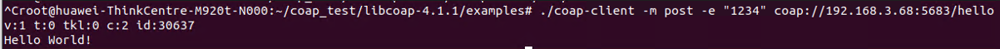
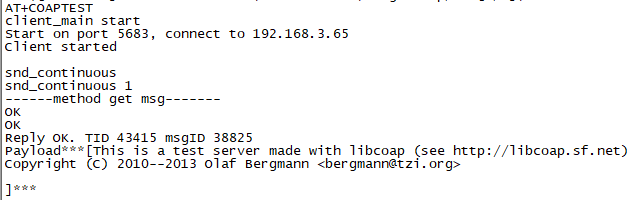

**概述<a name="section4537382116410"></a>**

CoAP，即Constrained Application Protocol（受限应用协议），是一种专为受限环境（如物联网设备）设计的轻量级网络协议。它旨在提供一种简单和有效的方式，使受限设备能够进行互联网通信。本文档介绍了基于libcoap的CoAP功能开发实现示例，以及基于lwIP（A Lightweight TCP/IP stack）协议栈对libcoap某些接口进行线程安全封装后的接口说明。

# API接口说明<a name="ZH-CN_TOPIC_0000001988322205"></a>

-   **[概述](#ZH-CN_TOPIC_0000001953722994)**  

## 概述<a name="ZH-CN_TOPIC_0000001953722994"></a>

CoAP使用开源库libcoap提供基础功能支持，基于CoAP的业务实现请调用libcoap接口。对于开源库自身提供的API的使用说明请参见开源API接口说明信息,对于当前提供的libcoap适配的lwip协议栈，开源提供以下接口：

-   coap\_new\_context   创建coap上下文
-   coap\_free\_context    释放或销毁coap上下文
-   coap\_check\_notify   检查是否需要发送通知
-   coap\_send                发送coap消息
-   coap\_send\_ack         发送coap ack
-   coap\_send\_error       发送coap error
-   coap\_send\_message\_type 定义发送的coap消息类型

# 开发指南<a name="ZH-CN_TOPIC_0000001988322213"></a>

-   **[开发约束](#ZH-CN_TOPIC_0000001953722998)**  

-   **[代码示例](#ZH-CN_TOPIC_0000001988162393)**  

## 开发约束<a name="ZH-CN_TOPIC_0000001953722998"></a>

-   **[资源配置](#ZH-CN_TOPIC_0000001988322217)**  

### 资源配置<a name="ZH-CN_TOPIC_0000001988322217"></a>

当前libcoap中使用的资源是在lwip中预分配的，资源包括支持的节点个数。context/endpoint/session/pdu/resource等个数的限制。请开发者根据需要支持的实际场景进行合理配置。具体配置的值在open\_source/libcoap/libcoap/examples/lwip/config/lwippools.h文件中进行设置，以宏的形式给出，开发者可以在该文件中进行适配修改。使用这些资源会使lwip预分配的内存池变大，增大的RAM的size,故代码中默认没有开启这些资源的预配置，需要修改build/cmake/open\_source/libcoap.cmake中全局宏定义为:

```
set(PUBLIC_DEFINES
    MEMP_USE_CUSTOM_POOLS=1
)
```

## 代码示例<a name="ZH-CN_TOPIC_0000001988162393"></a>

-   **[服务器](#ZH-CN_TOPIC_0000001953722990)**  

-   **[客户端](#ZH-CN_TOPIC_0000001988162401)**  

### 服务器<a name="ZH-CN_TOPIC_0000001953722990"></a>

以下为服务端开放get与post方法示例代码：

```
#include "lwip/netifapi.h"
#include "lwip/sockets.h"
#include "lwip/netifapi.h"
#include "lwip/sockets.h"
#include "coap3/coap.h"
#include "osal_debug.h"
#include "osal_task.h"

#define SERVER_PORT 5683
static int quit = 0;

static void hello_handler(coap_resource_t *resource, coap_session_t  *session,
             const coap_pdu_t *request, const coap_string_t *query,
             coap_pdu_t *response)
{
    unsigned char buf[3];
    const char *response_data = "Hello World!";
    char coap_msg[64] = {0};
    size_t len = 0;
    u32_t cnt;
    unsigned char *data = NULL;
    (void)resource;
    (void)query;
    if (coap_get_data(request, &len, (const uint8_t **)&data)) {
        if (len < 6) {
            osal_printk("[%s][%d] len %d\n", __FUNCTION__, __LINE__, len);
            (void)snprintf_s(coap_msg, sizeof(coap_msg), sizeof(coap_msg)-1, "%s", response_data);
            quit = 1;
        } else {
            memcpy(coap_msg, data, 4);
            (void)snprintf_s(coap_msg + 4, sizeof(coap_msg) - 4, sizeof(coap_msg) - 5, "%s", response_data);
            cnt = ntohl(*((u32_t *)data));
            len -= 4;
            data += 4;
            osal_printk("[%s][%d] <%u> len : %d, data : %.*s\n", __FUNCTION__, __LINE__, cnt, len, len, data);
            quit = 1;
        }
    }
    response->code = COAP_RESPONSE_CODE(205);
    coap_add_option(response, COAP_OPTION_CONTENT_TYPE, coap_encode_var_safe(buf, sizeof(buf),
        COAP_MEDIATYPE_TEXT_PLAIN), buf);
    coap_add_data(response, 4 + strlen(coap_msg + 4), (unsigned char *)coap_msg);
}

int server_main_task(void *p_data)
{
    coap_address_t serv_addr;
    coap_address_init(&serv_addr);
    serv_addr.port = SERVER_PORT;
    ipaddr_aton("192.168.3.68", &(serv_addr.addr)); /* 服务端ip地址 */
    coap_context_t *ctx = coap_new_context(&serv_addr);
    if (!ctx) {
        osal_printk("coap_new_context ctx = NULL\n");
        return 0;
    }

    coap_resource_t *hello_resource = coap_resource_init(coap_make_str_const("hello"), 0);
    if (hello_resource == NULL) {
        osal_printk("hello_resource = NULL\n");
    }
    coap_register_handler(hello_resource, COAP_REQUEST_GET, hello_handler);
    coap_register_handler(hello_resource, COAP_REQUEST_POST, hello_handler);
    coap_add_resource(ctx, hello_resource);
    /*Listen for incoming connections */
    osal_printk("Server listening for connections\n");

    while (!quit) { /* 根据需求改变停止条件 */
        osal_msleep(1000);
        uapi_watchdog_kick();
    }
    osal_printk("Process terminated\n");
    return 0;
}

int server_main(void)
{
    osal_task *coap_server_thread = osal_kthread_create(server_main_task, NULL, "coap_server", 0x1200);
    if (coap_server_thread == NULL) {
        osal_printk("create server_main_task kthread failed\n");
        return -1;
    }

    osal_kthread_set_priority(coap_server_thread, 20);
    return 0;
}
```

客户端用post方法获取服务端response结果如下图：



### 客户端<a name="ZH-CN_TOPIC_0000001988162401"></a>

以下为客户端以get方法获取服务端响应的示例代码：

```

#include "lwip/netifapi.h"
#include "lwip/sockets.h"
#include "coap3/coap.h"
#include "osal_debug.h"
#define SERVER_PORT 5683
#define PAYLOAD_SIZE 60
#define MICE_URI "/"
static coap_context_t *g_ctx = NULL;

static coap_response_t mice_handler(coap_session_t *session, const coap_pdu_t *sent, const coap_pdu_t *received,
    const coap_mid_t mid)
{
    unsigned char *data;
    size_t data_len;
    if (COAP_RESPONSE_CLASS(received->code) == 2) {
        if (coap_get_data(received, &data_len, (const uint8_t **)&data)) {
            osal_printk("Reply OK. TID %d msgID %d\n", mid, ntohs(received->mid));
            osal_printk("Payload***[%s]***\n", data);
        }
    } else {
        osal_printk("code error");
        osal_printk("Mice unsuccessful, code: %hu \n", received->code);
    }
}
static void coap_recv_client(void *arg, struct udp_pcb *upcb, struct pbuf *p, const ip_addr_t *addr, u16_t port)
{
    coap_session_t *session = arg;
    coap_pdu_t *pdu = coap_new_pdu(COAP_MESSAGE_CON, COAP_REQUEST_GET, session);
    memset_s(pdu, sizeof(coap_pdu_t), 0, sizeof(coap_pdu_t));
    pdu->max_hdr_size = COAP_PDU_MAX_UDP_HEADER_SIZE;
    pdu->pbuf = p;
    pdu->token = (uint8_t *)p->payload + pdu->max_hdr_size;
    pdu->alloc_size = p->tot_len - pdu->max_hdr_size;
    coap_pdu_clear(pdu, pdu->alloc_size);
    if (!coap_pdu_parse(COAP_PROTO_UDP, p->payload, p->len, pdu)) {
        return;
    }
    coap_dispatch(g_ctx, session, pdu);
    (void)pbuf_free(p);
    pdu->pbuf = NULL;
    coap_delete_pdu(pdu);
    udp_remove(session->sock.pcb);
    if (g_ctx != NULL) {
        coap_free_context(g_ctx);
        g_ctx = NULL;
    }
    coap_session_release(session);
}

void snd_msg(void)
{
    osal_printk("------method get msg-------\n");
    coap_pdu_t *request = coap_pdu_init(COAP_MESSAGE_CON, COAP_REQUEST_GET, coap_new_message_id(g_ctx->sessions),
        coap_session_max_pdu_size(g_ctx->sessions));
    if (request == NULL) {
        osal_printk("request init error");
        return;
    }
    coap_uri_t uri;
    coap_split_uri((const uint8_t *)MICE_URI, strlen(MICE_URI), &uri);
    coap_add_option(request, COAP_OPTION_URI_PATH, uri.path.length, uri.path.s);

    char *request_data = (char *)malloc(64);
    if (request_data == NULL) {
        osal_printk("[%s][%d]: malloc error\n", __FUNCTION__, __LINE__);
        return;
    }
    (void)snprintf_s(request_data + 4, sizeof(request_data) - 4, sizeof(request_data)-5, "%s", "testcoap");

    coap_add_data(request, 4 + strlen((const char *)(request_data+4)), (unsigned char *)request_data);
    free(request_data);
    if (coap_send(g_ctx->sessions, request) < 0) {
        osal_printk("[%s][%d]: coap send error\n", __FUNCTION__, __LINE__);
    }
    return;
}
void snd_continuous(char *address, int port)
{
    if (g_ctx == NULL) {
        osal_printk("snd_continuous 1\r\n");
        coap_address_t src_addr;
        coap_address_init(&src_addr);
        ip_addr_set_any(false, &(src_addr.addr));
        src_addr.port = port;
        g_ctx = coap_new_context(NULL);
        if (g_ctx == NULL) {
            osal_printk("new context error\n");
            return;
        }
        coap_context_set_keepalive(g_ctx, 60);
        coap_address_t dst_addr;
        coap_address_init(&dst_addr);
        ipaddr_aton(address, &(dst_addr.addr));
        dst_addr.port = port;
        coap_session_t *session = coap_new_client_session(g_ctx, NULL, &dst_addr, COAP_PROTO_UDP);
        if (session == NULL) {
            osal_printk("------session is null\n");
            return;
        }
        session->sock.pcb = udp_new_ip_type(IPADDR_TYPE_ANY);
        if (session->sock.pcb == NULL) {
            osal_printk("coap_new_endpoint: udp new fail\n");
            return;
        }
        session->sock.pcb->netif_idx = NETIF_NO_INDEX;
        udp_recv(session->sock.pcb, coap_recv_client, session);
        if (udp_bind(session->sock.pcb, &(src_addr.addr), 0)) {
            osal_printk("--------udp bind error\n");
            udp_remove(session->sock.pcb);
            return;
        }
        /* register mice handler */ 
        coap_register_response_handler(g_ctx, mice_handler);
    }
    snd_msg();
}

int coap_client(void)
{
    osal_printk("client_main start\n");
    int port = 5683; /* coap服务端口 */
    char *address = "192.168.3.65"; /* 服务端ip地址 */
    osal_printk("Start on port %d, connect to %s\n", port, address);
    osal_printk("Client started\n");
    osal_printk("\r\nsnd_continuous\r\n");
    snd_continuous(address, port);
    return 0;
}


```

服务端的响应如下图：




