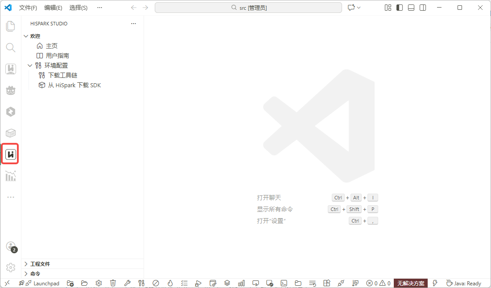
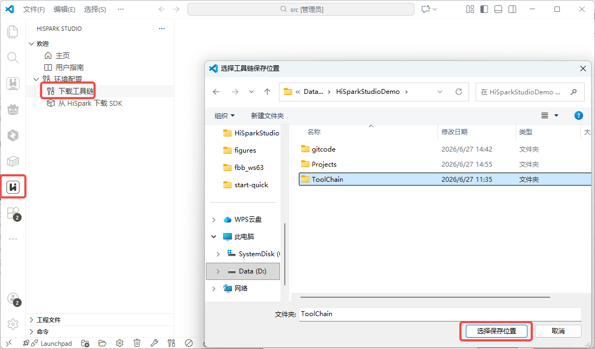
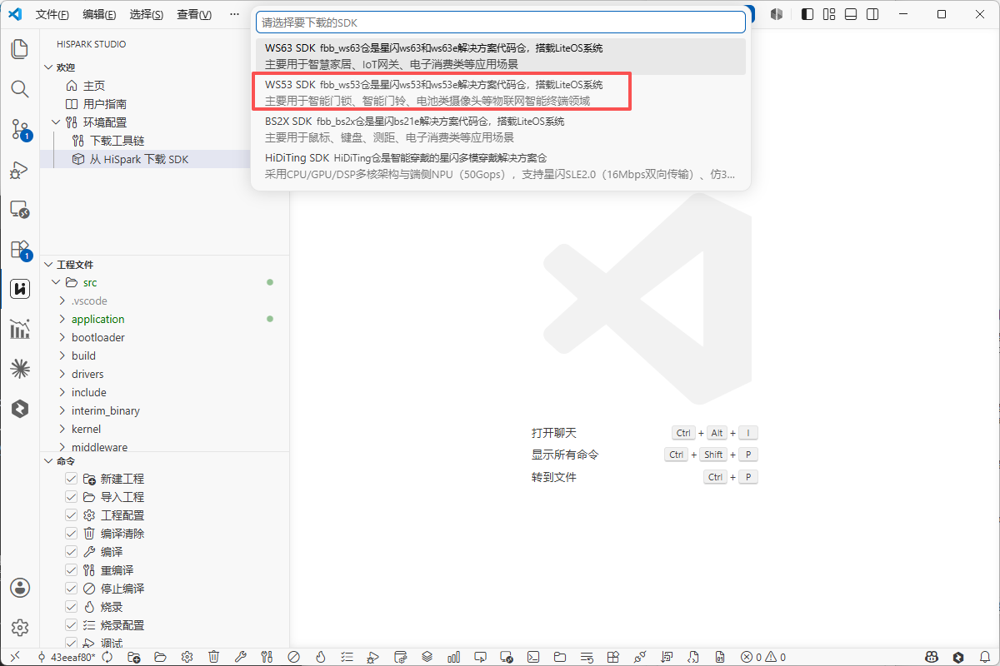
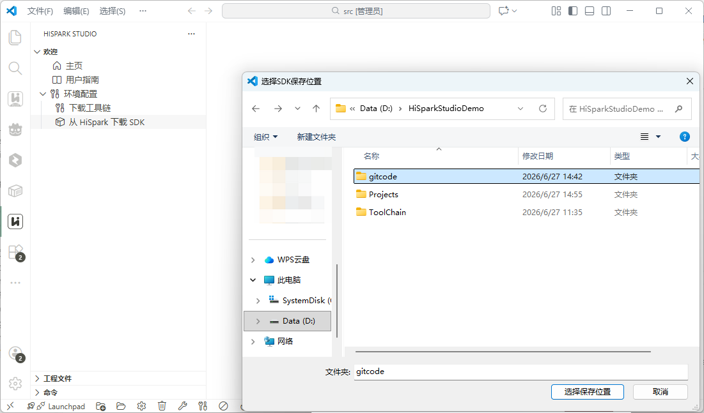
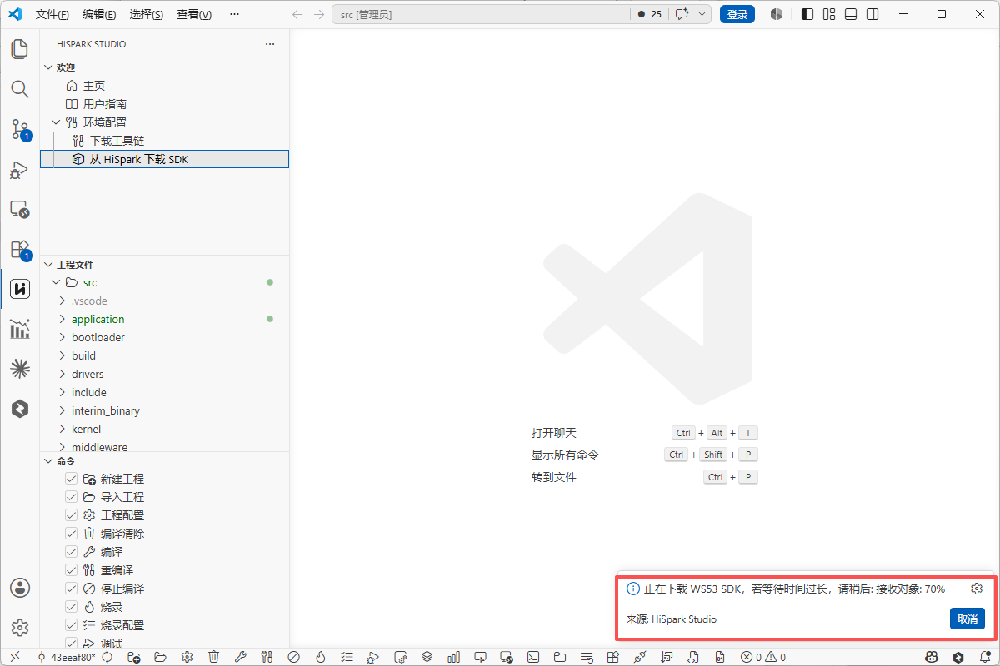

# 配置 WS53 开发环境

> 本页是 VS Code 环境配置 How-to。第一次开发请先从 Get Started 的[选择 WS53 开发方式](../../../get-started/index.md)进入，并只在需要详细安装步骤或排障时返回本页。

本文档面向 Windows 上使用 HiSpark Studio for VS Code 的开发者，介绍 IDE（Integrated Development Environment）、工具链、SDK 和串口环境的详细配置。使用 CLI 时请按[命令行环境准备](../build/index.md#cli-setup)操作；Linux 命令行环境请参见[开发环境搭建详解](manual/index.md)。环境准备完成后返回[VS Code 快速入门](../../../get-started/vscode.md)。

## 环境要求

| 项目 | 要求 |
|---|---|
| 操作系统 | 64 位 Windows 10 或 Windows 11 |
| VS Code | 1.85.0 及以上 |
| 硬盘空间 | 至少 900 MB（安装 HiSpark Studio 插件） |
| 内存 | 最低 1 GB RAM（Random Access Memory），建议 4 GB 及以上 |
| CPU | 1.6 GHz 或更高 |
| C 盘空间 | 建议至少 1 GB 剩余空间 |
| 网络 | 需要网络连接，用于下载工具链和 SDK |

## 硬件配件

| 物品 | 用途 | 获取方式 |
|---|---|---|
| Type-C USB（Universal Serial Bus）数据线 | 连接开发板与电脑，用于供电和烧录 | 开发板通常自带 |

<a name="serial-driver"></a>

## 安装串口驱动

开发板通过 USB 转串口（USB-TTL）与电脑通信，用于烧录固件和串口调试。需要安装与开发板 USB 转串口芯片匹配的驱动；使用 CH340/CH341 芯片的开发板可安装 CH341SER 驱动。

访问 [CH341SER 驱动下载](https://www.wch.cn/downloads/CH341SER_EXE.html) 下载驱动包，双击进行安装。

## 安装 VS Code

1. 下载并安装最新版 [Visual Studio Code](https://code.visualstudio.com/Download)。

2. 安装简体中文语言包（可选）。打开 VS Code，进入扩展市场（快捷键 `Ctrl+Shift+X`），搜索 `Chinese`，选择中文简体插件并安装。安装完成后重启 VS Code 即可使用中文界面。本文以 VS Code 中文界面为例。

    

## 安装 Git 和 Git LFS

HiSpark Studio 插件的“从 HiSpark 下载 SDK”功能会优先使用本机 Git 下载 SDK。相关说明可参考 [HiSpark Studio for VS Code 用户指南 - SDK下载](../../../tools/HiSparkStudioforVSCodeUserGuide/HiSparkStudioforVSCodeUserGuide.md#ZH-CN_TOPIC_0000002303416852)。

如电脑尚未安装 Git，请参考 [Git 官方下载与安装说明](https://git-scm.com/downloads/)安装 Git。再按 [Git LFS 官方安装说明](https://git-lfs.com/)安装 Git LFS。安装时建议保留将 Git 添加到命令行环境变量的默认选项；安装界面或选项变化时，以上游官方说明和安装向导为准。

安装完成后，关闭并重新打开命令提示符，执行以下命令确认 Git 可用：

```cmd
git --version
git lfs version
git lfs install
:: 输出示例: git version 2.x.x
```

> 如果命令提示“不是内部或外部命令”，说明 Git 或 Git LFS 未加入 `PATH`。请参考对应的官方安装说明重新配置；两项检查都通过后再下载 SDK。

## 安装 HiSpark Studio 插件

WS53 开发推荐使用 `HiSpark Studio for VS Code` 插件，该插件提供代码编辑、编译、烧录和调试等一站式开发环境。

1. 打开 VS Code。
2. 进入扩展市场（快捷键 `Ctrl+Shift+X`），搜索 `HiSpark Studio`，安装 HiSpark Studio 插件。

    

3. 安装完成后，左侧活动栏会出现 HiSpark Studio 图标，单击即可进入插件界面。

    

## 安装工具链

HiSpark Studio 插件编译工程需要依赖工具链、Python 和 pip 依赖环境，可通过以下步骤下载安装。

1. 单击左侧 HiSpark Studio 图标进入插件界面，单击“下载工具链”。在弹出的窗口中选择保存目录，目录层级不要过深且不要包含中文字符，然后单击“选择保存位置”开始下载。

    

2. 安装过程会依次下载以下内容。

    | 安装项 | 说明 |
    |---|---|
    | Python 3.11.4 | 嵌入式 Python 环境 |
    | pip 依赖 | wheel、setuptools、cmake、kconfiglib、pycparser、pillow、numpy、opencv-python、windows-curses、ffmpeg-python、pyelftools、openpyxl、pandas 和 tkinter-embed |
    | 编译工具链 | WS53 使用的 RISC-V 交叉编译工具链及其他构建工具 |

3. 自动安装完成后，界面右下角会提示“环境准备完成”。

    

> **注意：**
>
> - 如果自动安装工具链时 Python 安装失败，通常是网络或本地代理问题，请更换网络或修改代理后重试。
> - 如果提示依赖下载失败，可重复执行“下载工具链”。
> - 多次尝试仍然失败时，请参阅[开发环境搭建](manual/index.md)中的命令行环境搭建说明。

## 获取 SDK

使用 HiSpark Studio 插件下载 SDK 前，需要先完成本页前述的 Git 安装和环境变量配置。

1. 在 HiSpark Studio 插件页面单击“从 HiSpark 下载 SDK”，在下载列表中选择 `WS53 SDK`。

    

2. 选择 SDK 保存位置。建议选择空文件夹，路径不要太深且不要包含中文字符。

    

3. 右下角会显示下载进度，等待下载完成。

    

4. 在 PowerShell 中进入包含 `.git` 和 `src` 的 SDK 根目录，下载 Git LFS 对象并检查 Windows 编译器文件不是 LFS 指针：

    ```powershell
    git lfs pull
    $compiler = Get-Item .\src\tools\bin\compiler\riscv\cc_riscv32_musl_b010\cc_riscv32_musl_win\libexec\gcc\riscv32-linux-musl\7.3.0\cc1.exe
    if ($compiler.Length -lt 1MB) { throw "Git LFS objects are not hydrated" }
    ```

    命令无报错且文件大小不小于 1 MiB 后，才继续配置和构建。

## 下一步

环境检查完成后，按[VS Code 快速入门](../../../get-started/vscode.md)继续首次成功路径。


## 常见问题

### Q：端口无法识别？

A：确认开发板使用的 USB 转串口芯片及对应驱动，重新插拔 USB 数据线，并检查设备管理器中是否出现串口设备。

### Q：烧录失败？

A：按以下顺序检查：

1. 确认开发板已进入烧录模式。
2. 检查串口连接和端口选择是否正确。
3. 确认串口驱动已正确安装。
4. 尝试更换 USB 数据线或 USB 端口。

---

> 如需了解 Linux 命令行环境、menuconfig 和组件编译方式，请阅读[开发环境搭建](manual/index.md)。
