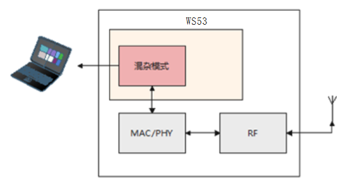
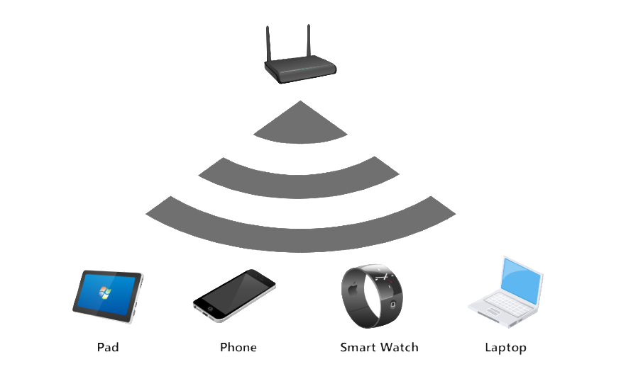
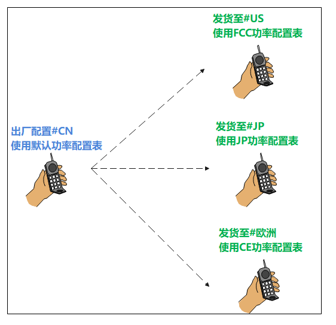
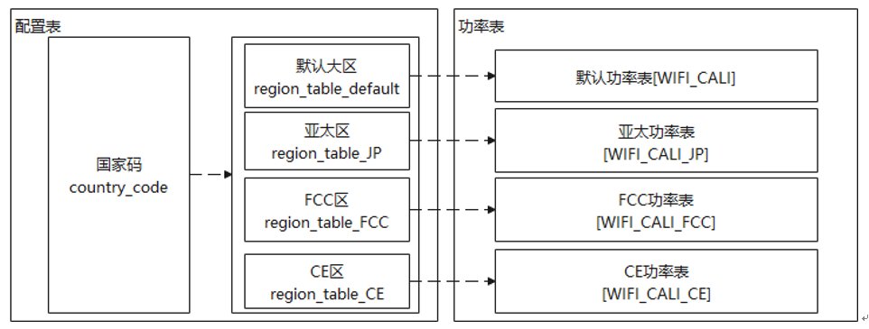
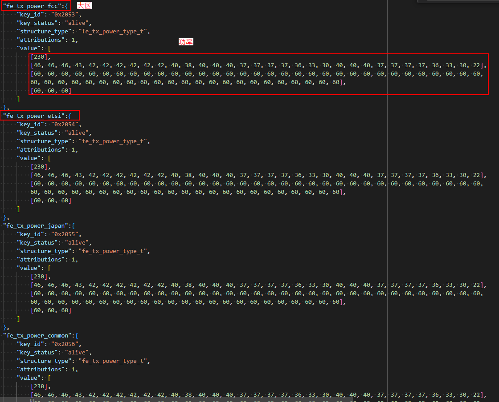
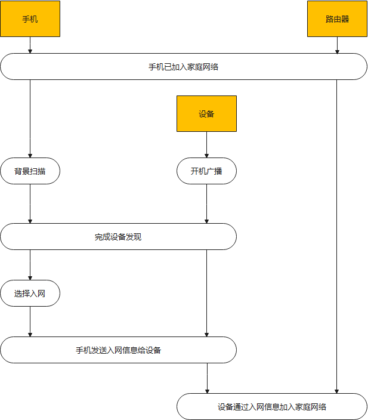
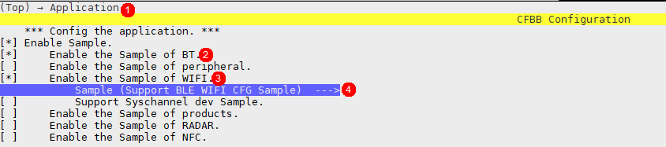
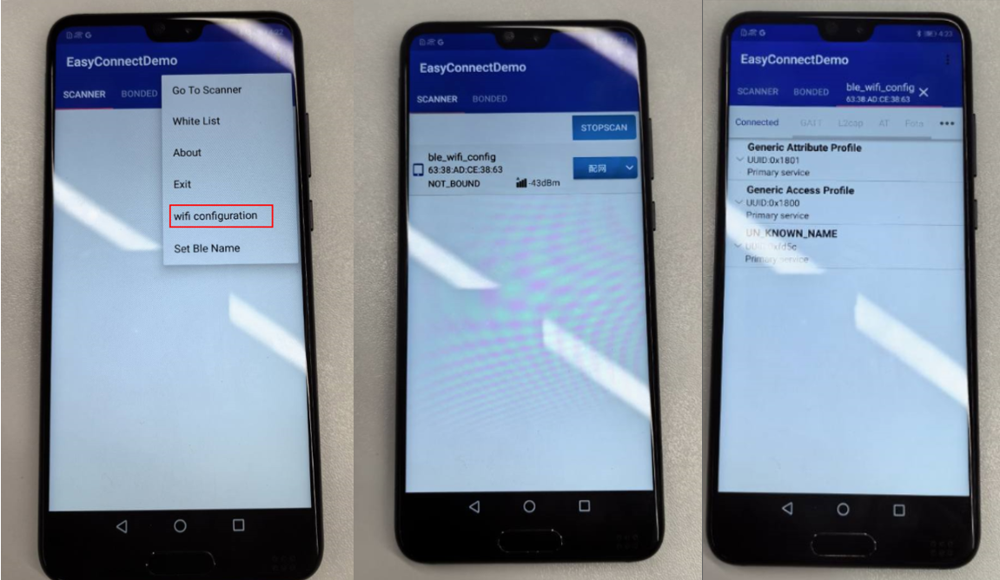
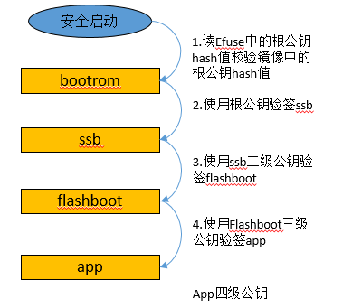
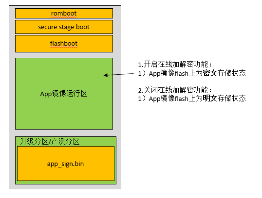

**概述<a name="section4537382116410"></a>**

本文档详细的描述了WS53V100相关特性的应用场景、实现原理及接口说明，方便读者了解并使用相关特性。

# 混杂模式特性说明<a name="ZH-CN_TOPIC_0000001911546738"></a>

-   **[概述](#ZH-CN_TOPIC_0000001944706045)**  

-   **[应用场景](#ZH-CN_TOPIC_0000001944706069)**  

-   **[实现原理](#ZH-CN_TOPIC_0000001911546786)**  

-   **[接口说明](#ZH-CN_TOPIC_0000001911426834)**  

-   **[使用示例](#ZH-CN_TOPIC_0000001944706029)**  

## 概述<a name="ZH-CN_TOPIC_0000001944706045"></a>

混杂模式特性用于抓取所有经过本设备的管理帧/数据帧，并将抓取到的报文保存到文件中，可通过抓包软件例如：WireShark、OmniPeek打开并查看报文信息。

## 应用场景<a name="ZH-CN_TOPIC_0000001944706069"></a>

WiFi混杂模式开启后，会抓取周边AP和STA之间的单播/组播的管理帧/数据帧，典型应用场景之一是支持作为抓包网卡。如下图，WS53芯片作为抓包网卡，通过串口与PC连接，抓取PC周边报文。

**图 1**  混杂模式进行空口抓包<a name="fig826561411215"></a>  



## 实现原理<a name="ZH-CN_TOPIC_0000001911546786"></a>

无线网络信号在传播过程中是以发射点为中心，像波纹一样往外辐射。理论上来讲，如果一个接收器处于无线信号经过的地方，它可以“听到”任何经过它的信号，只是它可能“听不懂”（无法解析报文内容）。

以下图为例，Phone与Smart Watch通信，Laptop完全有能力从空口监听他们的通信。空口抓包就是基于这个原理工作的。如果我们想要抓某个嵌入式设备的无线报文，只需在它附近运行一个具有监听功能的无线设备。

**图 1**  混杂模式<a name="fig981521318497"></a>  


## 接口说明<a name="ZH-CN_TOPIC_0000001911426834"></a>

-   **[混杂接口声明](#ZH-CN_TOPIC_0000001911426886)**  

-   **[开启和关闭混杂](#ZH-CN_TOPIC_0000001911546766)**  

### 混杂接口声明<a name="ZH-CN_TOPIC_0000001911426886"></a>

```
/**
 * @if Eng
 * @brief  Type of WiFi interface.
 * @else
 * @brief  Type of WiFi interface。
 * @endif
 */
typedef enum {
    IFTYPE_STA,         /*!< @if Eng STAION.
                             @else STAION。 @endif */
    IFTYPE_AP,          /*!< @if Eng HOTSPOT.
                             @else HOTSPOT。 @endif */
    IFTYPE_P2P_CLIENT,  /*!< @if Eng P2P CLIENT.
                             @else P2P CLIENT。 @endif */
    IFTYPE_P2P_GO,      /*!< @if Eng P2P GO.
                             @else P2P GO。 @endif */
    IFTYPE_P2P_DEVICE,  /*!< @if Eng P2P DEVICE.
                             @else P2P DEVICE。 @endif */
    IFTYPES_BUTT
} wifi_if_type_enum;

/**
 * @if Eng
 * @brief  Struct of frame filter config in monitor mode.
 * @else
 * @brief  混杂模式报文接收过滤设置。
 * @endif
 */
typedef struct {
    int8_t mdata_en  : 1;   /*!< @if Eng get multi-cast data frame flag.
                                 @else 使能接收组播(广播)数据包。 @endif */
    int8_t udata_en  : 1;   /*!< @if Eng get single-cast data frame flag.
                                 @else 使能接收单播数据包。 @endif */
    int8_t mmngt_en  : 1;   /*!< @if Eng get multi-cast mgmt frame flag.
                                 @else 使能接收组播(广播)管理包。 @endif */
    int8_t umngt_en  : 1;   /*!< @if Eng get single-cast mgmt frame flag.
                                 @else 使能接收单播管理包。 @endif */
    int8_t custom_en : 1;   /*!< @if Eng get beacon/probe response flag.
                                 @else 使能接收beacon/probe request包。 @endif */
    int8_t resvd     : 3;   /*!< @if Eng reserved bits.
                                 @else 保留字段。 @endif */
} wifi_ptype_filter_stru;

/**
 * @if Eng
 * @brief  Set monitor mode.
 * @param  [in]  iftype Interface type.
 * @param  [in]  enable Enable(1) or disable(0).
 * @param  [in]  filter Filtered frame type enum.
 * @retval EXT_WIFI_OK        Execute successfully.
 * @retval EXT_WIFI_FAIL      Execute failed.
 * @else
 * @brief  设置混杂模式。
 * @param  [in]  iftype 接口类型。
 * @param  [in]  enable 开启/关闭。
 * @param  [in]  filter 过滤列表。
 * @retval EXT_WIFI_OK   成功。
 * @retval EXT_WIFI_FAIL 失败。
 * @endif
 */
errcode_t wifi_set_promis_mode(wifi_if_type_enum iftype, int32_t enable, const wifi_ptype_filter_stru *filter);
```

### 开启和关闭混杂<a name="ZH-CN_TOPIC_0000001911546766"></a>

命令格式：AT+CCPRIV=$vap,set\_monitor,$switch,$val1,$val2,$val3,$val4

参数说明：

-   $vap：表示需要维测的vap名字，通常为wlan0。
-   $switch：表示功能开、关、或者暂停，对应1、0、2。
-   $val1：表示广播/组播数据帧过滤开关，对应0、1，0表示过滤，1表示不过滤。
-   $val2：表示单播数据帧过滤开关，对应0、1，0表示过滤，1表示不过滤。
-   $val3：表示广播/组播管理帧过滤开关，对应0、1，0表示过滤，1表示不过滤。
-   $val4：表示单播管理帧过滤开关，对应0、1，0表示过滤，1表示不过滤。

命令示例：

-   开启所有帧上报：AT+CCPRIV=wlan0,set\_monitor,1,1,1,1,1
-   查看混杂收包统计：AT+CCPRIV=wlan0,set\_monitor,2 （PS：命令下发成功后，会在DebugKits工具中打印收包统计信息。）
-   关闭混杂：AT+CCPRIV=wlan0,set\_monitor,0

## 使用示例<a name="ZH-CN_TOPIC_0000001944706029"></a>

1.  执行“[1.4 接口说明](#ZH-CN_TOPIC_0000001911426834)”相关命令后，按需求开启对应帧过滤开关，例如所有帧上报：AT+CCPRIV=wlan0,set\_monitor,1,1,1,1,1
2.  若想查看开启混杂后的收包计数统计，可输入命令AT+CCPRIV=wlan0,set\_monitor,2后，在DebugKits工具中查看。

# 动态国家码特性说明<a name="ZH-CN_TOPIC_0000001911546794"></a>

-   **[概述](#ZH-CN_TOPIC_0000001911426898)**  

-   **[应用场景](#ZH-CN_TOPIC_0000001944706061)**  

-   **[实现原理](#ZH-CN_TOPIC_0000001944706009)**  

-   **[接口说明](#ZH-CN_TOPIC_0000001944706053)**  

-   **[使用示例](#ZH-CN_TOPIC_0000001911426854)**  

## 概述<a name="ZH-CN_TOPIC_0000001911426898"></a>

动态国家码特性用于支持全球发货场景，根据设备预制的国家信息，自动调整发射功率表，以符合全球各地区对发射功率的法律规范。

## 应用场景<a name="ZH-CN_TOPIC_0000001944706061"></a>

在上网问题处理中，经常会碰到来自异国的设备出现扫描/连接/协商速率异常的情况，很多情况与802.11d协议（/国家码设置）相关。

国家码用来标识无线设备所在的国家，不同国家码规定了不同的无线设备射频特性，包括AP的发送功率、支持的信道等。配置国家码是为了使无线设备的射频特性符合不同国家或区域的法律法规要求。在第一次配置WLAN设备时，必须配置正确的国家码，以确保不违反当地的法律法规。

动态国家码提供一种配置方式，客户能够通过设置国家码，调整到国家对应大区（中国、亚太、北美、欧洲）的发射功率，从而符合法律规范

**图 1**  动态国家码应用场景<a name="fig9557113619505"></a>  


## 实现原理<a name="ZH-CN_TOPIC_0000001944706009"></a>

通过配置文件映射国家与大区的关系，每个国家码对应一个大区，每个大区对应一套功率表，国家码变动时，根据重新配置对应的功率表。

**图 1**  动态国家码设计原理图<a name="fig1792093211512"></a>  


## 接口说明<a name="ZH-CN_TOPIC_0000001944706053"></a>

-   **[国家码接口声明](#ZH-CN_TOPIC_0000001911426870)**  

-   **[设置和读取国家码](#ZH-CN_TOPIC_0000001911546750)**  

### 国家码接口声明<a name="ZH-CN_TOPIC_0000001911426870"></a>

```
/**
* @ingroup  soc_wifi_basic
* @brief  Set country code.CNcomment:设置国家码.CNend
*
* @par Description:
*           Set country code(two uppercases).CNcomment:设置国家码，由两个大写字符组成.CNend
*
* @attention  1.Before setting the country code, you must call uapi_wifi_init to complete the initialization.
*             CNcomment:设置国家码之前，必须调用uapi_wifi_init初始化完成.CNend\n
*             2.cc_len should be greater than or equal to 3.CNcomment:cc_len应大于等于3.CNend
* @param  cc               [IN]     Type  #const char *, country code.CNcomment:国家码.CNend
* @param  cc_len           [IN]     Type  #unsigned char, country code length.CNcomment:国家码长度.CNend
*
* @retval #EXT_WIFI_OK  Excute successfully
* @retval #Other           Error code
* @par Dependency:
*            @li soc_wifi_api.h: WiFi API
* @see  NULL
* @since
*/
td_s32 uapi_wifi_set_country(const td_char *cc, td_u8 cc_len);

/**
* @ingroup  soc_wifi_basic
* @brief  Get country code.CNcomment:获取国家码.CNend
*
* @par Description:
*           Get country code.CNcomment:获取国家码，由两个大写字符组成.CNend
*
* @attention  1.Before getting the country code, you must call uapi_wifi_init to complete the initialization.
*             CNcomment:获取国家码之前，必须调用uapi_wifi_init初始化完成.CNend
* @param  cc               [OUT]     Type  #char *, country code.CNcomment:国家码.CNend
* @param  len              [IN/OUT]  Type  #int *, country code length.CNcomment:国家码长度.CNend
*
* @retval #EXT_WIFI_OK  Excute successfully
* @retval #Other           Error code
* @par Dependency:
*            @li soc_wifi_api.h: WiFi API
* @see  NULL
* @since
*/
td_s32 uapi_wifi_get_country(td_char *cc, td_u8 *len);
```

### 设置和读取国家码<a name="ZH-CN_TOPIC_0000001911546750"></a>

```
AT+CC=&country
AT+CC?
```

> **说明：** 
>-   $COUNTRY：国家码，可配置范围：CN,JP,US,CA,KH,RU,AU,MY,ID,TR,PL,FR,PT,IT,DE,ES,AR,ZA,MA,PH,TH,GB,CO,MX,EC,PE,CL,SA,EG,AE.

## 使用示例<a name="ZH-CN_TOPIC_0000001911426854"></a>

加载驱动时，根据nv配置文件配置大区功率，如[图1](#fig153673315174)所示。

**图 1**  nv国家码配置示例<a name="fig153673315174"></a>  


# BLE配网特性说明<a name="ZH-CN_TOPIC_0000001911426894"></a>

-   **[概述](#ZH-CN_TOPIC_0000001911546806)**  

-   **[应用场景](#ZH-CN_TOPIC_0000001911546742)**  

-   **[实现原理](#ZH-CN_TOPIC_0000001944706057)**  

-   **[接口说明](#ZH-CN_TOPIC_0000001911426842)**  

-   **[使用示例](#ZH-CN_TOPIC_0000001911546782)**  

## 概述<a name="ZH-CN_TOPIC_0000001911546806"></a>

BLE配网是指通过BLE辅助WIFI入网。

## 应用场景<a name="ZH-CN_TOPIC_0000001911546742"></a>

在 BLE 配网模式下，设备在无网模式下通过BLE发送配网广播，附近的手机扫描到该广播，可通过多种方式与用户交互：

1.  手机应用主动弹框询问手机用户是否允许该设备加入家庭网络。
2.  手机应用主动扫描后显示在可用设备列表，用户手动选择将该设备加入家庭网络。

如用户选择加入，手机与设备建立BLE连接，再将WIFI入网信息（SSID、密码等）传输给设备。与SoftAP 配网相比，用户无需切换WIFI AP与STA模式，可以大大提升终端用户体验。

## 实现原理<a name="ZH-CN_TOPIC_0000001944706057"></a>

BLE配网参考流程如[图1](#fig07609154494)所示。

**图 1**  BLE配网流程<a name="fig07609154494"></a>  


使用WS53芯片的设备，在无网模式下启动，自动发送配网广播，用户可以调整广播持续时间、间隔以及重新广播的触发条件。

## 接口说明<a name="ZH-CN_TOPIC_0000001911426842"></a>

请参见《WS53V100 软件开发指南》中“BLE开发流程”章节。

## 使用示例<a name="ZH-CN_TOPIC_0000001911546782"></a>

1.  在SDK根目录下执行命令“python3 build.py  ws53-liteos-app menuconfig”，并按下图配置对应编译选项进行配置。

    **图 1**  BLE Demo配置选项<a name="fig161841164188"></a>  
    

2.  完成配置后执行命令“python3 build.py  ws53-liteos-app”，将生成的镜像通过BurnTool烧录进单板中。
3.  使用Android机安装“EasyConnect”软件，配置“wifi configuration”，使其与待连接热点一致；待Android设备扫描到WS53的BLE广播后，进行连接；待Android设备和53连接成功后，点击“配网”。

    **图 2**  Android设备进行WS53 BLE配网流程<a name="fig196274111185"></a>  
    

4.  等待WS53连接热点，待配网成功后会有语言播报。

> **说明：** 
>-   配网软件“EasyConnect”可通过技术支持获取。

# 安全启动特性说明<a name="ZH-CN_TOPIC_0000001944706081"></a>

-   **[概述](#ZH-CN_TOPIC_0000001944706041)**  

-   **[应用场景](#ZH-CN_TOPIC_0000001911426830)**  

-   **[实现原理](#ZH-CN_TOPIC_0000001911426902)**  

-   **[接口说明](#ZH-CN_TOPIC_0000001911426850)**  

## 概述<a name="ZH-CN_TOPIC_0000001944706041"></a>

安全启动是指在系统启动时，使用efuse中预先写入的秘钥对镜像逐级校验的功能。

## 应用场景<a name="ZH-CN_TOPIC_0000001911426830"></a>

安全启动用于保证镜像的完整性和安全性，防止镜像被破解和篡改。

> **须知：** 
>安全启动功能在产测阶段通过烧录efuse打开，开启该功能后仅能使用efuse中对应的秘钥组对镜像签名才能正常启动。

## 实现原理<a name="ZH-CN_TOPIC_0000001911426902"></a>

预先在efuse中写入根公钥HASH值和安全启动使能位；

系统复位后从bootrom启动，

1.  在bootrom中计算镜像中的根公钥HASH值与efuse中的进行校验；
2.  根公钥校验通过后，使用根公钥验签ssb镜像；
3.  Ssb镜像校验通过后，使用ssb镜像中的二级公钥校验Flashboot镜像；
4.  Flashboot镜像校验通过后，使用flashboot中的三级公钥校验App镜像；
5.  App镜像校验通过后，跳转到app镜像启动完成。

**图7.1 安全启动镜像逐级校验流程**



## 接口说明<a name="ZH-CN_TOPIC_0000001911426850"></a>

1.配置efuse安全启动使能位写1


2.配置根公钥HASH值烧写到efuse


> **说明：** 
>可参照《WS53V100 二次开发网络安全 注意事项》中安全启动配置章节进行配置

# FLASH在线解密特性说明<a name="ZH-CN_TOPIC_0000001944706077"></a>

-   **[概述](#ZH-CN_TOPIC_0000001911426858)**  

-   **[应用场景](#ZH-CN_TOPIC_0000001944706033)**  

-   **[实现原理](#ZH-CN_TOPIC_0000001944706065)**  

-   **[接口说明](#ZH-CN_TOPIC_0000001944706025)**  

## 概述<a name="ZH-CN_TOPIC_0000001911426858"></a>

FLASH在线解密是指CPU在访问FLASH上的加密镜像时在线解密后运行。

## 应用场景<a name="ZH-CN_TOPIC_0000001944706033"></a>

FLASH在线解密特性主要用于对加密存储在FLASH上的APP镜像进行解密运行。

> **须知：** 
>FLASH在线解密功能需要在编译前打开镜像加密，并将对应的秘钥派生参数写入efuse中。

## 实现原理<a name="ZH-CN_TOPIC_0000001944706065"></a>

开启FLASH在线解密功能后：

1.  在编译阶段签名后会对镜像加密。
2.  镜像烧写到flash上为加密存储状态。
3.  启动时会自动配置解密区域。
4.  pu运行时通过配置由硬件自动解密。

**图 1**  FLASH在线解密示意图<a name="fig1414916695718"></a>  



## 接口说明<a name="ZH-CN_TOPIC_0000001944706025"></a>

1.  在配置文件sdk/build/config/target\_config/ws53/sign\_config/ws53\_liteos\_app\_ecc.cfg中将SignSuite配置为1，并配置秘钥派生参数对应的IV和PlainKey。
2.  将秘钥派生参数写入efuse对应位置。


> **说明：** 
>可参照《WS53V100 二次开发网络安全 注意事项》中镜像加密配置章节进行配置


