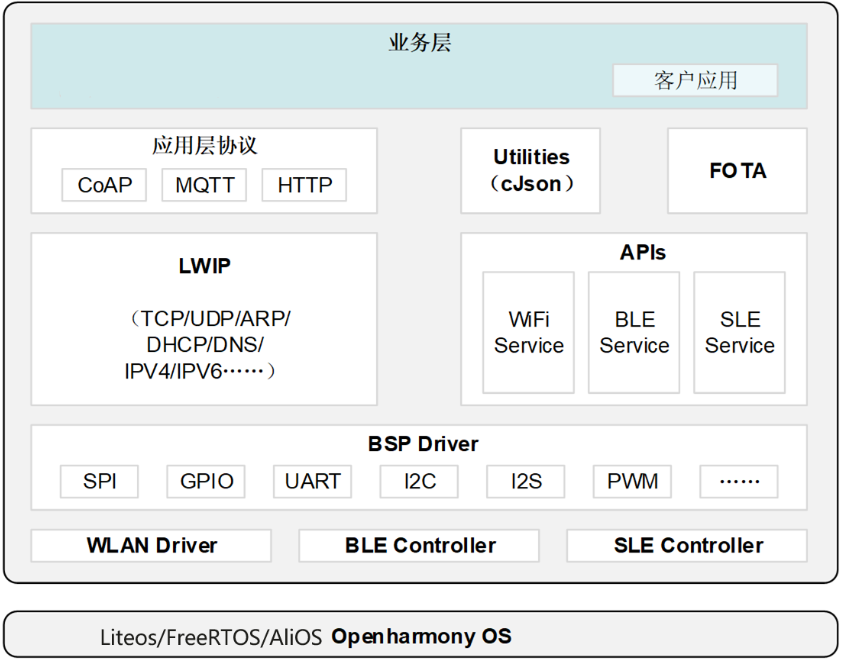
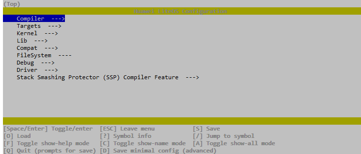
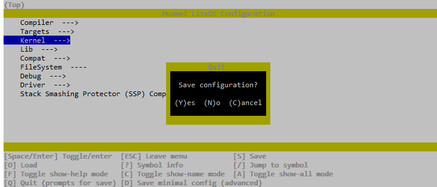
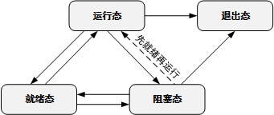

**概述<a name="section4537382116410"></a>**

本文档主要介绍WS53V100的SDK开发相关内容，包括SDK架构、接口实现机制与使用说明（包括工作原理、按场景描述接口使用方法和注意事项）。

# 概述<a name="ZH-CN_TOPIC_0000001946200682"></a>

-   **[背景介绍](#ZH-CN_TOPIC_0000001973319101)**  

-   **[SDK目录说明](#ZH-CN_TOPIC_0000001959871262)**  

-   **[使用约束](#ZH-CN_TOPIC_0000001946200694)**  

-   **[配置方法](#ZH-CN_TOPIC_0000001946362986)**  

## 背景介绍<a name="ZH-CN_TOPIC_0000001973319101"></a>

WS53系列的平台软件对应用层实现了底层屏蔽，并对应用软件直接提供API\(Application Programming Interface\)接口完成相应功能。典型的系统应用架构如下图所示。

SDK模块框架



**表 1**  SDK模块功能说明

<a name="table1762510212343"></a>
<table><thead align="left"><tr id="row136443213343"><th class="cellrowborder" valign="top" width="13.200000000000001%" id="mcps1.2.4.1.1"><p id="p164417273414"><a name="p164417273414"></a><a name="p164417273414"></a>序号</p>
</th>
<th class="cellrowborder" valign="top" width="31.380000000000003%" id="mcps1.2.4.1.2"><p id="p16644172153417"><a name="p16644172153417"></a><a name="p16644172153417"></a>模块名</p>
</th>
<th class="cellrowborder" valign="top" width="55.42%" id="mcps1.2.4.1.3"><p id="p164413220347"><a name="p164413220347"></a><a name="p164413220347"></a>功能介绍</p>
</th>
</tr>
</thead>
<tbody><tr id="row1864412173411"><td class="cellrowborder" valign="top" width="13.200000000000001%" headers="mcps1.2.4.1.1 "><p id="p064511216343"><a name="p064511216343"></a><a name="p064511216343"></a>1</p>
</td>
<td class="cellrowborder" valign="top" width="31.380000000000003%" headers="mcps1.2.4.1.2 "><p id="p146459213341"><a name="p146459213341"></a><a name="p146459213341"></a>CoAP</p>
</td>
<td class="cellrowborder" valign="top" width="55.42%" headers="mcps1.2.4.1.3 "><p id="p6669267416410"><a name="p6669267416410"></a><a name="p6669267416410"></a>CoAP，即Constrained Application Protocol（受限应用协议），是一种专为受限环境（如物联网设备）设计的轻量级网络协议。它旨在提供一种简单和有效的方式，使受限设备能够进行互联网通信。</p>
</td>
</tr>
<tr id="row96455273412"><td class="cellrowborder" valign="top" width="13.200000000000001%" headers="mcps1.2.4.1.1 "><p id="p176451263416"><a name="p176451263416"></a><a name="p176451263416"></a>2</p>
</td>
<td class="cellrowborder" valign="top" width="31.380000000000003%" headers="mcps1.2.4.1.2 "><p id="p14645182123418"><a name="p14645182123418"></a><a name="p14645182123418"></a>MQTT</p>
</td>
<td class="cellrowborder" valign="top" width="55.42%" headers="mcps1.2.4.1.3 "><p id="p364512210349"><a name="p364512210349"></a><a name="p364512210349"></a>MQTT（Message Queuing Telemetry Transport）是一个轻量级的消息协议，适用于低带宽、不可靠的网络连接，非常适合物联网（IoT）设备的通信。</p>
</td>
</tr>
<tr id="row1264515213417"><td class="cellrowborder" valign="top" width="13.200000000000001%" headers="mcps1.2.4.1.1 "><p id="p64352516429"><a name="p64352516429"></a><a name="p64352516429"></a>3</p>
</td>
<td class="cellrowborder" valign="top" width="31.380000000000003%" headers="mcps1.2.4.1.2 "><p id="p49931427114212"><a name="p49931427114212"></a><a name="p49931427114212"></a>HTTP</p>
</td>
<td class="cellrowborder" valign="top" width="55.42%" headers="mcps1.2.4.1.3 "><p id="p636812206479"><a name="p636812206479"></a><a name="p636812206479"></a>‌HTTP（Hyper Text Transfer Protocol）协议，是互联网上应用最为广泛的一种网络协议。它是‌Web浏览器和Web服务器之间数据传输的基础，所有WWW文件都必须遵守这个标准。HTTP是一个客户端与服务器端请求和应答的标准，属于应用层协议，建立在TCP协议基础之上。HTTP协议的特点包括简单快速、灵活、无连接、无状态等。‌</p>
</td>
</tr>
<tr id="row10343536134214"><td class="cellrowborder" valign="top" width="13.200000000000001%" headers="mcps1.2.4.1.1 "><p id="p53447365422"><a name="p53447365422"></a><a name="p53447365422"></a>4</p>
</td>
<td class="cellrowborder" valign="top" width="31.380000000000003%" headers="mcps1.2.4.1.2 "><p id="p173449362421"><a name="p173449362421"></a><a name="p173449362421"></a>cJson</p>
</td>
<td class="cellrowborder" valign="top" width="55.42%" headers="mcps1.2.4.1.3 "><p id="p18344123654211"><a name="p18344123654211"></a><a name="p18344123654211"></a>cJson是一个轻量级的C语言JSON解析库，‌它提供了一套简单易用的API，‌用于处理JSON数据的解析和生成。‌</p>
</td>
</tr>
<tr id="row9826744112011"><td class="cellrowborder" valign="top" width="13.200000000000001%" headers="mcps1.2.4.1.1 "><p id="p0826134402010"><a name="p0826134402010"></a><a name="p0826134402010"></a>5</p>
</td>
<td class="cellrowborder" valign="top" width="31.380000000000003%" headers="mcps1.2.4.1.2 "><p id="p158267445208"><a name="p158267445208"></a><a name="p158267445208"></a>FOTA</p>
</td>
<td class="cellrowborder" valign="top" width="55.42%" headers="mcps1.2.4.1.3 "><p id="p68261444202"><a name="p68261444202"></a><a name="p68261444202"></a>FOTA(UPG)升级功能模块。</p>
</td>
</tr>
<tr id="row119998485208"><td class="cellrowborder" valign="top" width="13.200000000000001%" headers="mcps1.2.4.1.1 "><p id="p149991548162011"><a name="p149991548162011"></a><a name="p149991548162011"></a>6</p>
</td>
<td class="cellrowborder" valign="top" width="31.380000000000003%" headers="mcps1.2.4.1.2 "><p id="p17999204842013"><a name="p17999204842013"></a><a name="p17999204842013"></a>LWIP</p>
</td>
<td class="cellrowborder" valign="top" width="55.42%" headers="mcps1.2.4.1.3 "><p id="p119999482202"><a name="p119999482202"></a><a name="p119999482202"></a>轻量级网络协议栈实现。</p>
</td>
</tr>
<tr id="row19637165310207"><td class="cellrowborder" valign="top" width="13.200000000000001%" headers="mcps1.2.4.1.1 "><p id="p563745312203"><a name="p563745312203"></a><a name="p563745312203"></a>7</p>
</td>
<td class="cellrowborder" valign="top" width="31.380000000000003%" headers="mcps1.2.4.1.2 "><p id="p8637175332012"><a name="p8637175332012"></a><a name="p8637175332012"></a>WIFI Service/BLE Service/SLE Service</p>
</td>
<td class="cellrowborder" valign="top" width="55.42%" headers="mcps1.2.4.1.3 "><p id="p5606102612304"><a name="p5606102612304"></a><a name="p5606102612304"></a>WIFI/BLE/SLE的业务接口层实现。</p>
</td>
</tr>
<tr id="row152917516205"><td class="cellrowborder" valign="top" width="13.200000000000001%" headers="mcps1.2.4.1.1 "><p id="p229111513204"><a name="p229111513204"></a><a name="p229111513204"></a>8</p>
</td>
<td class="cellrowborder" valign="top" width="31.380000000000003%" headers="mcps1.2.4.1.2 "><p id="p162918516206"><a name="p162918516206"></a><a name="p162918516206"></a>SPI/GPIO/UART/I2C/I2S/PWM</p>
</td>
<td class="cellrowborder" valign="top" width="55.42%" headers="mcps1.2.4.1.3 "><p id="p922105953015"><a name="p922105953015"></a><a name="p922105953015"></a>SPI/GPIO/UART/I2C/I2S/PWM等外设接口驱动。</p>
</td>
</tr>
<tr id="row11765184217268"><td class="cellrowborder" valign="top" width="13.200000000000001%" headers="mcps1.2.4.1.1 "><p id="p476544217261"><a name="p476544217261"></a><a name="p476544217261"></a>9</p>
</td>
<td class="cellrowborder" valign="top" width="31.380000000000003%" headers="mcps1.2.4.1.2 "><p id="p07651428267"><a name="p07651428267"></a><a name="p07651428267"></a>WLAN Driver/BLE Controller/SLE Controller</p>
</td>
<td class="cellrowborder" valign="top" width="55.42%" headers="mcps1.2.4.1.3 "><p id="p147651542162617"><a name="p147651542162617"></a><a name="p147651542162617"></a>wlan驱动层实现，ble/sle控制层实现。</p>
</td>
</tr>
<tr id="row2473184542619"><td class="cellrowborder" valign="top" width="13.200000000000001%" headers="mcps1.2.4.1.1 "><p id="p1147334519269"><a name="p1147334519269"></a><a name="p1147334519269"></a>10</p>
</td>
<td class="cellrowborder" valign="top" width="31.380000000000003%" headers="mcps1.2.4.1.2 "><p id="p847304510261"><a name="p847304510261"></a><a name="p847304510261"></a>Liteos</p>
</td>
<td class="cellrowborder" valign="top" width="55.42%" headers="mcps1.2.4.1.3 "><p id="p18473134512614"><a name="p18473134512614"></a><a name="p18473134512614"></a>Liteos实现代码。</p>
</td>
</tr>
</tbody>
</table>

## SDK目录说明<a name="ZH-CN_TOPIC_0000001959871262"></a>

SDK 源码统一位于 `src/` 目录，当前目录结构如下：

```text
src/
├── application/                  应用初始化代码目录
│   ├── samples/                  应用示例代码
│   └── ws53/                     WS53 应用初始化代码
├── bootloader/                   Boot 程序代码目录
│   ├── commonboot/               公共 Boot 代码
│   └── flashboot_ws53/           WS53 Flash Boot 代码
├── build/                        编译构建相关目录
│   ├── cmake/                    CMake 脚本
│   ├── config/                   编译配置文件
│   ├── script/                   构建脚本
│   └── toolchains/               编译工具链配置
├── drivers/                      外设驱动目录
│   ├── boards/                   板级配置和链接脚本
│   ├── chips/                    芯片适配层驱动
│   └── drivers/                  与芯片无关的通用驱动和 IP 驱动
├── include/                      对外头文件目录
│   ├── driver/                   外设驱动头文件
│   └── middleware/               中间件头文件
├── interim_binary/               二进制交付件目录
│   └── ws53/                     WS53 二进制交付件
├── kernel/                       内核源码目录
│   ├── liteos/                   LiteOS 源码
│   ├── non_os/                   Non-OS 源码（当前用于 Flash Boot）
│   ├── osal/                     OSAL 接口层实现
│   └── osal_adapt/               OSAL 适配层实现
├── middleware/                   中间件目录
│   ├── chips/                    芯片适配层
│   ├── services/                 中间件服务模块
│   └── utils/                    中间件工具实现
├── open_source/                  开源组件源码目录
│   ├── 7-zip-lzma-sdk/
│   ├── cjson/
│   ├── libboundscheck/
│   ├── libcoap/
│   ├── littlefs/
│   ├── lwip/
│   ├── mbedtls/
│   ├── mqtt/
│   └── wpa_supplicant/
├── protocol/                     协议组件目录
│   ├── bt/                       BLE/SLE 协议代码
│   └── wifi/                     Wi-Fi 协议代码
├── test/                         测试代码目录
│   └── common/                   通用测试代码
└── tools/                        工具目录
    ├── bin/                      工具二进制可执行程序
    ├── pkg/                      镜像打包脚本
    └── templates/                工具模板
```

**表 1**  SDK目录介绍

<a name="table7905519181320"></a>
<table><thead align="left"><tr id="row790614192138"><th class="cellrowborder" valign="top" width="9.4%" id="mcps1.2.5.1.1"><p id="p990614199136"><a name="p990614199136"></a><a name="p990614199136"></a>序号</p>
</th>
<th class="cellrowborder" valign="top" width="40.6%" id="mcps1.2.5.1.2"><p id="p8328150193912"><a name="p8328150193912"></a><a name="p8328150193912"></a>目录</p>
</th>
<th class="cellrowborder" valign="top" width="24.98%" id="mcps1.2.5.1.3"><p id="p11906419141315"><a name="p11906419141315"></a><a name="p11906419141315"></a>文件名/目录名</p>
</th>
<th class="cellrowborder" valign="top" width="25.019999999999996%" id="mcps1.2.5.1.4"><p id="p19061419121316"><a name="p19061419121316"></a><a name="p19061419121316"></a>功能介绍</p>
</th>
</tr>
</thead>
<tbody><tr id="row2906191916138"><td class="cellrowborder" valign="top" width="9.4%" headers="mcps1.2.5.1.1 "><p id="p13440101014318"><a name="p13440101014318"></a><a name="p13440101014318"></a>1</p>
</td>
<td class="cellrowborder" valign="top" width="40.6%" headers="mcps1.2.5.1.2 "><p id="p1290671914133"><a name="p1290671914133"></a><a name="p1290671914133"></a>application/ws53/ws53_application</p>
</td>
<td class="cellrowborder" valign="top" width="24.98%" headers="mcps1.2.5.1.3 "><p id="p3906181915137"><a name="p3906181915137"></a><a name="p3906181915137"></a>main.c</p>
<p id="p12453202663216"><a name="p12453202663216"></a><a name="p12453202663216"></a>app_os_init.c</p>
</td>
<td class="cellrowborder" valign="top" width="25.019999999999996%" headers="mcps1.2.5.1.4 "><p id="p1090611914139"><a name="p1090611914139"></a><a name="p1090611914139"></a>app系统初始化C语言入口；</p>
<p id="p16446330123216"><a name="p16446330123216"></a><a name="p16446330123216"></a>系统任务(线程)初始化代码；</p>
</td>
</tr>
<tr id="row1790617199134"><td class="cellrowborder" valign="top" width="9.4%" headers="mcps1.2.5.1.1 "><p id="p129061519111310"><a name="p129061519111310"></a><a name="p129061519111310"></a>2</p>
</td>
<td class="cellrowborder" valign="top" width="40.6%" headers="mcps1.2.5.1.2 "><p id="p990613193138"><a name="p990613193138"></a><a name="p990613193138"></a>build/config/target_config/ws53/menuconfig/acore</p>
</td>
<td class="cellrowborder" valign="top" width="24.98%" headers="mcps1.2.5.1.3 "><p id="p119061519181313"><a name="p119061519181313"></a><a name="p119061519181313"></a>ws53_liteos_app.config</p>
</td>
<td class="cellrowborder" valign="top" width="25.019999999999996%" headers="mcps1.2.5.1.4 "><p id="p9906191916132"><a name="p9906191916132"></a><a name="p9906191916132"></a>sdk编译menuconfig的配置文件</p>
</td>
</tr>
<tr id="row1890671916131"><td class="cellrowborder" valign="top" width="9.4%" headers="mcps1.2.5.1.1 "><p id="p19906141921318"><a name="p19906141921318"></a><a name="p19906141921318"></a>3</p>
</td>
<td class="cellrowborder" valign="top" width="40.6%" headers="mcps1.2.5.1.2 "><p id="p0906161951310"><a name="p0906161951310"></a><a name="p0906161951310"></a>drivers/drivers</p>
</td>
<td class="cellrowborder" valign="top" width="24.98%" headers="mcps1.2.5.1.3 "><p id="p129061194134"><a name="p129061194134"></a><a name="p129061194134"></a>driver</p>
</td>
<td class="cellrowborder" valign="top" width="25.019999999999996%" headers="mcps1.2.5.1.4 "><p id="p1590612192134"><a name="p1590612192134"></a><a name="p1590612192134"></a>外设驱动模块，与芯片无关的驱动层代码</p>
</td>
</tr>
<tr id="row79062196133"><td class="cellrowborder" valign="top" width="9.4%" headers="mcps1.2.5.1.1 "><p id="p590601911316"><a name="p590601911316"></a><a name="p590601911316"></a>4</p>
</td>
<td class="cellrowborder" valign="top" width="40.6%" headers="mcps1.2.5.1.2 "><p id="p675614283434"><a name="p675614283434"></a><a name="p675614283434"></a>drivers/drivers</p>
</td>
<td class="cellrowborder" valign="top" width="24.98%" headers="mcps1.2.5.1.3 "><p id="p89061319101319"><a name="p89061319101319"></a><a name="p89061319101319"></a>hal</p>
</td>
<td class="cellrowborder" valign="top" width="25.019999999999996%" headers="mcps1.2.5.1.4 "><p id="p1290621920139"><a name="p1290621920139"></a><a name="p1290621920139"></a>外设IP驱动代码</p>
</td>
</tr>
<tr id="row17906141913131"><td class="cellrowborder" valign="top" width="9.4%" headers="mcps1.2.5.1.1 "><p id="p690601971315"><a name="p690601971315"></a><a name="p690601971315"></a>5</p>
</td>
<td class="cellrowborder" valign="top" width="40.6%" headers="mcps1.2.5.1.2 "><p id="p7906101917130"><a name="p7906101917130"></a><a name="p7906101917130"></a>drivers/boards/ws53</p>
</td>
<td class="cellrowborder" valign="top" width="24.98%" headers="mcps1.2.5.1.3 "><p id="p12906161941315"><a name="p12906161941315"></a><a name="p12906161941315"></a>memory_config</p>
</td>
<td class="cellrowborder" valign="top" width="25.019999999999996%" headers="mcps1.2.5.1.4 "><p id="p8906171941311"><a name="p8906171941311"></a><a name="p8906171941311"></a>memory资源划分配置</p>
</td>
</tr>
<tr id="row11158124518443"><td class="cellrowborder" valign="top" width="9.4%" headers="mcps1.2.5.1.1 "><p id="p1915914454440"><a name="p1915914454440"></a><a name="p1915914454440"></a>6</p>
</td>
<td class="cellrowborder" valign="top" width="40.6%" headers="mcps1.2.5.1.2 "><p id="p515954518441"><a name="p515954518441"></a><a name="p515954518441"></a>drivers/boards/ws53</p>
</td>
<td class="cellrowborder" valign="top" width="24.98%" headers="mcps1.2.5.1.3 "><p id="p7159445144419"><a name="p7159445144419"></a><a name="p7159445144419"></a>linker</p>
</td>
<td class="cellrowborder" valign="top" width="25.019999999999996%" headers="mcps1.2.5.1.4 "><p id="p1715994594412"><a name="p1715994594412"></a><a name="p1715994594412"></a>链接脚本</p>
</td>
</tr>
<tr id="row12205124804418"><td class="cellrowborder" valign="top" width="9.4%" headers="mcps1.2.5.1.1 "><p id="p13205174824416"><a name="p13205174824416"></a><a name="p13205174824416"></a>7</p>
</td>
<td class="cellrowborder" valign="top" width="40.6%" headers="mcps1.2.5.1.2 "><p id="p5205048124415"><a name="p5205048124415"></a><a name="p5205048124415"></a>drivers/boards/ws53</p>
</td>
<td class="cellrowborder" valign="top" width="24.98%" headers="mcps1.2.5.1.3 "><p id="p1420504884416"><a name="p1420504884416"></a><a name="p1420504884416"></a>board_config</p>
</td>
<td class="cellrowborder" valign="top" width="25.019999999999996%" headers="mcps1.2.5.1.4 "><p id="p112059485448"><a name="p112059485448"></a><a name="p112059485448"></a>板级相关配置</p>
</td>
</tr>
<tr id="row1016218423459"><td class="cellrowborder" valign="top" width="9.4%" headers="mcps1.2.5.1.1 "><p id="p1716264210456"><a name="p1716264210456"></a><a name="p1716264210456"></a>8</p>
</td>
<td class="cellrowborder" valign="top" width="40.6%" headers="mcps1.2.5.1.2 "><p id="p316224218459"><a name="p316224218459"></a><a name="p316224218459"></a>drivers/chips</p>
</td>
<td class="cellrowborder" valign="top" width="24.98%" headers="mcps1.2.5.1.3 "><p id="p111621542174520"><a name="p111621542174520"></a><a name="p111621542174520"></a>ws53</p>
</td>
<td class="cellrowborder" valign="top" width="25.019999999999996%" headers="mcps1.2.5.1.4 "><p id="p181621542154514"><a name="p181621542154514"></a><a name="p181621542154514"></a>外设驱动、小系统WS53芯片级适配层代码</p>
</td>
</tr>
<tr id="row16390134514458"><td class="cellrowborder" valign="top" width="9.4%" headers="mcps1.2.5.1.1 "><p id="p8390154594515"><a name="p8390154594515"></a><a name="p8390154594515"></a>9</p>
</td>
<td class="cellrowborder" valign="top" width="40.6%" headers="mcps1.2.5.1.2 "><p id="p183901045114519"><a name="p183901045114519"></a><a name="p183901045114519"></a>middleware/utils</p>
</td>
<td class="cellrowborder" valign="top" width="24.98%" headers="mcps1.2.5.1.3 "><p id="p1239074520451"><a name="p1239074520451"></a><a name="p1239074520451"></a>at</p>
</td>
<td class="cellrowborder" valign="top" width="25.019999999999996%" headers="mcps1.2.5.1.4 "><p id="p10391154512450"><a name="p10391154512450"></a><a name="p10391154512450"></a>at命令实现</p>
</td>
</tr>
<tr id="row1141134854510"><td class="cellrowborder" valign="top" width="9.4%" headers="mcps1.2.5.1.1 "><p id="p18141124814520"><a name="p18141124814520"></a><a name="p18141124814520"></a>10</p>
</td>
<td class="cellrowborder" valign="top" width="40.6%" headers="mcps1.2.5.1.2 "><p id="p1722013132484"><a name="p1722013132484"></a><a name="p1722013132484"></a>middleware/utils</p>
</td>
<td class="cellrowborder" valign="top" width="24.98%" headers="mcps1.2.5.1.3 "><p id="p1914113483454"><a name="p1914113483454"></a><a name="p1914113483454"></a>app_init</p>
</td>
<td class="cellrowborder" valign="top" width="25.019999999999996%" headers="mcps1.2.5.1.4 "><p id="p4141748144512"><a name="p4141748144512"></a><a name="p4141748144512"></a>app_run接口实现</p>
</td>
</tr>
<tr id="row1161141684812"><td class="cellrowborder" valign="top" width="9.4%" headers="mcps1.2.5.1.1 "><p id="p516121684810"><a name="p516121684810"></a><a name="p516121684810"></a>11</p>
</td>
<td class="cellrowborder" valign="top" width="40.6%" headers="mcps1.2.5.1.2 "><p id="p716111168481"><a name="p716111168481"></a><a name="p716111168481"></a>middleware/utils</p>
</td>
<td class="cellrowborder" valign="top" width="24.98%" headers="mcps1.2.5.1.3 "><p id="p816191644816"><a name="p816191644816"></a><a name="p816191644816"></a>common_headers</p>
</td>
<td class="cellrowborder" valign="top" width="25.019999999999996%" headers="mcps1.2.5.1.4 "><p id="p31615167485"><a name="p31615167485"></a><a name="p31615167485"></a>公共头文件</p>
</td>
</tr>
<tr id="row152806209483"><td class="cellrowborder" valign="top" width="9.4%" headers="mcps1.2.5.1.1 "><p id="p19280192014810"><a name="p19280192014810"></a><a name="p19280192014810"></a>12</p>
</td>
<td class="cellrowborder" valign="top" width="40.6%" headers="mcps1.2.5.1.2 "><p id="p428117204482"><a name="p428117204482"></a><a name="p428117204482"></a>middleware/utils</p>
</td>
<td class="cellrowborder" valign="top" width="24.98%" headers="mcps1.2.5.1.3 "><p id="p162811620144812"><a name="p162811620144812"></a><a name="p162811620144812"></a>dfx</p>
</td>
<td class="cellrowborder" valign="top" width="25.019999999999996%" headers="mcps1.2.5.1.4 "><p id="p7281172013485"><a name="p7281172013485"></a><a name="p7281172013485"></a>dfx功能实现代码</p>
</td>
</tr>
<tr id="row1199442816487"><td class="cellrowborder" valign="top" width="9.4%" headers="mcps1.2.5.1.1 "><p id="p4995728194817"><a name="p4995728194817"></a><a name="p4995728194817"></a>13</p>
</td>
<td class="cellrowborder" valign="top" width="40.6%" headers="mcps1.2.5.1.2 "><p id="p29955283485"><a name="p29955283485"></a><a name="p29955283485"></a>middleware/utils</p>
</td>
<td class="cellrowborder" valign="top" width="24.98%" headers="mcps1.2.5.1.3 "><p id="p11995162817484"><a name="p11995162817484"></a><a name="p11995162817484"></a>error_code</p>
</td>
<td class="cellrowborder" valign="top" width="25.019999999999996%" headers="mcps1.2.5.1.4 "><p id="p099542818489"><a name="p099542818489"></a><a name="p099542818489"></a>errcode定义</p>
</td>
</tr>
<tr id="row19927132510486"><td class="cellrowborder" valign="top" width="9.4%" headers="mcps1.2.5.1.1 "><p id="p1892782519482"><a name="p1892782519482"></a><a name="p1892782519482"></a>14</p>
</td>
<td class="cellrowborder" valign="top" width="40.6%" headers="mcps1.2.5.1.2 "><p id="p392722518486"><a name="p392722518486"></a><a name="p392722518486"></a>middleware/utils</p>
</td>
<td class="cellrowborder" valign="top" width="24.98%" headers="mcps1.2.5.1.3 "><p id="p139271725154817"><a name="p139271725154817"></a><a name="p139271725154817"></a>hcc</p>
</td>
<td class="cellrowborder" valign="top" width="25.019999999999996%" headers="mcps1.2.5.1.4 "><p id="p592752584812"><a name="p592752584812"></a><a name="p592752584812"></a>hcc实现代码</p>
</td>
</tr>
<tr id="row75236231482"><td class="cellrowborder" valign="top" width="9.4%" headers="mcps1.2.5.1.1 "><p id="p952312319484"><a name="p952312319484"></a><a name="p952312319484"></a>15</p>
</td>
<td class="cellrowborder" valign="top" width="40.6%" headers="mcps1.2.5.1.2 "><p id="p952352374816"><a name="p952352374816"></a><a name="p952352374816"></a>middleware/utils</p>
</td>
<td class="cellrowborder" valign="top" width="24.98%" headers="mcps1.2.5.1.3 "><p id="p15523182314818"><a name="p15523182314818"></a><a name="p15523182314818"></a>nv</p>
</td>
<td class="cellrowborder" valign="top" width="25.019999999999996%" headers="mcps1.2.5.1.4 "><p id="p9523623154815"><a name="p9523623154815"></a><a name="p9523623154815"></a>nv实现代码</p>
</td>
</tr>
<tr id="row1859731975016"><td class="cellrowborder" valign="top" width="9.4%" headers="mcps1.2.5.1.1 "><p id="p1259791935011"><a name="p1259791935011"></a><a name="p1259791935011"></a>16</p>
</td>
<td class="cellrowborder" valign="top" width="40.6%" headers="mcps1.2.5.1.2 "><p id="p18597111915012"><a name="p18597111915012"></a><a name="p18597111915012"></a>middleware/utils</p>
</td>
<td class="cellrowborder" valign="top" width="24.98%" headers="mcps1.2.5.1.3 "><p id="p4597111945013"><a name="p4597111945013"></a><a name="p4597111945013"></a>partition</p>
</td>
<td class="cellrowborder" valign="top" width="25.019999999999996%" headers="mcps1.2.5.1.4 "><p id="p759713195507"><a name="p759713195507"></a><a name="p759713195507"></a>flash分区实现代码</p>
</td>
</tr>
<tr id="row1297282216501"><td class="cellrowborder" valign="top" width="9.4%" headers="mcps1.2.5.1.1 "><p id="p1097272211501"><a name="p1097272211501"></a><a name="p1097272211501"></a>17</p>
</td>
<td class="cellrowborder" valign="top" width="40.6%" headers="mcps1.2.5.1.2 "><p id="p1897262295016"><a name="p1897262295016"></a><a name="p1897262295016"></a>middleware/utils</p>
</td>
<td class="cellrowborder" valign="top" width="24.98%" headers="mcps1.2.5.1.3 "><p id="p397212211509"><a name="p397212211509"></a><a name="p397212211509"></a>pm</p>
</td>
<td class="cellrowborder" valign="top" width="25.019999999999996%" headers="mcps1.2.5.1.4 "><p id="p997202216509"><a name="p997202216509"></a><a name="p997202216509"></a>低功耗模块实现代码</p>
</td>
</tr>
<tr id="row1421072585015"><td class="cellrowborder" valign="top" width="9.4%" headers="mcps1.2.5.1.1 "><p id="p1721013258501"><a name="p1721013258501"></a><a name="p1721013258501"></a>18</p>
</td>
<td class="cellrowborder" valign="top" width="40.6%" headers="mcps1.2.5.1.2 "><p id="p15210325175019"><a name="p15210325175019"></a><a name="p15210325175019"></a>middleware/utils</p>
</td>
<td class="cellrowborder" valign="top" width="24.98%" headers="mcps1.2.5.1.3 "><p id="p16210132515507"><a name="p16210132515507"></a><a name="p16210132515507"></a>syschannel</p>
</td>
<td class="cellrowborder" valign="top" width="25.019999999999996%" headers="mcps1.2.5.1.4 "><p id="p1221042585016"><a name="p1221042585016"></a><a name="p1221042585016"></a>syschannel模块实现代码</p>
</td>
</tr>
<tr id="row12297113105110"><td class="cellrowborder" valign="top" width="9.4%" headers="mcps1.2.5.1.1 "><p id="p129793125116"><a name="p129793125116"></a><a name="p129793125116"></a>19</p>
</td>
<td class="cellrowborder" valign="top" width="40.6%" headers="mcps1.2.5.1.2 "><p id="p1729714317510"><a name="p1729714317510"></a><a name="p1729714317510"></a>middleware/utils</p>
</td>
<td class="cellrowborder" valign="top" width="24.98%" headers="mcps1.2.5.1.3 "><p id="p122975315514"><a name="p122975315514"></a><a name="p122975315514"></a>update</p>
</td>
<td class="cellrowborder" valign="top" width="25.019999999999996%" headers="mcps1.2.5.1.4 "><p id="p02985314519"><a name="p02985314519"></a><a name="p02985314519"></a>fota升级实现代码</p>
</td>
</tr>
<tr id="row883255915110"><td class="cellrowborder" valign="top" width="9.4%" headers="mcps1.2.5.1.1 "><p id="p19832165912515"><a name="p19832165912515"></a><a name="p19832165912515"></a>20</p>
</td>
<td class="cellrowborder" valign="top" width="40.6%" headers="mcps1.2.5.1.2 "><p id="p1783215975112"><a name="p1783215975112"></a><a name="p1783215975112"></a>middleware/services</p>
</td>
<td class="cellrowborder" valign="top" width="24.98%" headers="mcps1.2.5.1.3 "><p id="p8832185935110"><a name="p8832185935110"></a><a name="p8832185935110"></a>wifi_service</p>
</td>
<td class="cellrowborder" valign="top" width="25.019999999999996%" headers="mcps1.2.5.1.4 "><p id="p68321659185114"><a name="p68321659185114"></a><a name="p68321659185114"></a>wifi服务层接口实现代码</p>
</td>
</tr>
</tbody>
</table>

## 使用约束<a name="ZH-CN_TOPIC_0000001946200694"></a>

-   系统在启动过程中已经初始化了UART驱动、Flash驱动、看门狗、NV等。用户在开发过程中，请勿重复初始化这些模块，否则可能引起系统错误。
-   系统启动运行后，会占用一些系统资源：中断、内存、任务、消息队列、事件、信号量、定时器、互斥锁等。用户在做应用层开发当中释放资源时，用户仅可释放自己开发的模块申请的资源。
-   任务数、信号量数量等系统资源配置在os的配置文件\(kernel/liteos/liteos\_v208.5.0/Huawei\_LiteOS/tools/build/config/ws53.config\)中。目前，sdk使用的是liteos-2.8.5版本。可通过menuconfig界面对系统资源进行配置调整。

## 配置方法<a name="ZH-CN_TOPIC_0000001946362986"></a>

-   系统资源配置方法如下：

    ```
    cd kernel/liteos/liteos_v208.5.0
    ```

    ```
    python3 show_menuconfig.py ws53
    ```

    

    修改完对应配置之后，按Esc键退出menuconfig界面,会弹出保存对话框：

    

    此时按键Y，则配置会被保存到如下文件：kernel/liteos/liteos\_v208.5.0/Huawei\_LiteOS/tools/build/config/ws53.config。

    对于没有特殊依赖的规格类配置，如最大任务个数、最大信号量个数等配置，也可以直接修改menuconfig的配置文件来完成。

    **表 1**  menuconfig中的常用资源配置项

    <a name="table1130973994118"></a>
    <table><thead align="left"><tr id="row1730913924111"><th class="cellrowborder" valign="top" width="24.54%" id="mcps1.2.4.1.1"><p id="p1030911396414"><a name="p1030911396414"></a><a name="p1030911396414"></a>配置项</p>
    </th>
    <th class="cellrowborder" valign="top" width="29.189999999999998%" id="mcps1.2.4.1.2"><p id="p1034173017819"><a name="p1034173017819"></a><a name="p1034173017819"></a>menuconfig路径</p>
    </th>
    <th class="cellrowborder" valign="top" width="46.27%" id="mcps1.2.4.1.3"><p id="p163101039184114"><a name="p163101039184114"></a><a name="p163101039184114"></a>描述</p>
    </th>
    </tr>
    </thead>
    <tbody><tr id="row7310103920418"><td class="cellrowborder" valign="top" width="24.54%" headers="mcps1.2.4.1.1 "><p id="p0310939194115"><a name="p0310939194115"></a><a name="p0310939194115"></a>LOSCFG_BASE_CORE_TSK_LIMIT</p>
    </td>
    <td class="cellrowborder" valign="top" width="29.189999999999998%" headers="mcps1.2.4.1.2 "><p id="p15341330885"><a name="p15341330885"></a><a name="p15341330885"></a>Kernel → Basic Config → Task → Max Task Number</p>
    </td>
    <td class="cellrowborder" valign="top" width="46.27%" headers="mcps1.2.4.1.3 "><p id="p17310173918418"><a name="p17310173918418"></a><a name="p17310173918418"></a>系统任务数上限。创建任务时，数量超过此上限就会失败。</p>
    </td>
    </tr>
    <tr id="row6310193984115"><td class="cellrowborder" valign="top" width="24.54%" headers="mcps1.2.4.1.1 "><p id="p1794144221711"><a name="p1794144221711"></a><a name="p1794144221711"></a>LOSCFG_BASE_IPC_SEM_LIMIT</p>
    </td>
    <td class="cellrowborder" valign="top" width="29.189999999999998%" headers="mcps1.2.4.1.2 "><p id="p6341301688"><a name="p6341301688"></a><a name="p6341301688"></a>Kernel → Enable Sem → Max Semaphore Number</p>
    </td>
    <td class="cellrowborder" valign="top" width="46.27%" headers="mcps1.2.4.1.3 "><p id="p15310439124111"><a name="p15310439124111"></a><a name="p15310439124111"></a>系统信号量个数上限。创建信号量时，数量超过此上限就会失败。</p>
    </td>
    </tr>
    <tr id="row531015392416"><td class="cellrowborder" valign="top" width="24.54%" headers="mcps1.2.4.1.1 "><p id="p12549331122410"><a name="p12549331122410"></a><a name="p12549331122410"></a>LOSCFG_BASE_IPC_MUX_LIMIT</p>
    </td>
    <td class="cellrowborder" valign="top" width="29.189999999999998%" headers="mcps1.2.4.1.2 "><p id="p183411301883"><a name="p183411301883"></a><a name="p183411301883"></a>Kernel → Enable Mutex → Max Mutex Number</p>
    </td>
    <td class="cellrowborder" valign="top" width="46.27%" headers="mcps1.2.4.1.3 "><p id="p113107392415"><a name="p113107392415"></a><a name="p113107392415"></a>系统互斥锁个数上限。创建互斥锁时，数量超过此上限就会失败。</p>
    </td>
    </tr>
    <tr id="row18310173974113"><td class="cellrowborder" valign="top" width="24.54%" headers="mcps1.2.4.1.1 "><p id="p6310539154112"><a name="p6310539154112"></a><a name="p6310539154112"></a>LOSCFG_BASE_IPC_QUEUE_LIMIT</p>
    </td>
    <td class="cellrowborder" valign="top" width="29.189999999999998%" headers="mcps1.2.4.1.2 "><p id="p7226124112217"><a name="p7226124112217"></a><a name="p7226124112217"></a>Kernel → Enable Queue → Max Queue Number</p>
    </td>
    <td class="cellrowborder" valign="top" width="46.27%" headers="mcps1.2.4.1.3 "><p id="p8310173917417"><a name="p8310173917417"></a><a name="p8310173917417"></a>消息队列个数上限。创建消息队列时，数量超过此上限就会失败。</p>
    </td>
    </tr>
    <tr id="row4488132611506"><td class="cellrowborder" valign="top" width="24.54%" headers="mcps1.2.4.1.1 "><p id="p20540115352314"><a name="p20540115352314"></a><a name="p20540115352314"></a>LOSCFG_BASE_CORE_SWTMR_LIMIT</p>
    </td>
    <td class="cellrowborder" valign="top" width="29.189999999999998%" headers="mcps1.2.4.1.2 "><p id="p6341930888"><a name="p6341930888"></a><a name="p6341930888"></a>Kernel → Enable Software Timer → Max Swtmr Number</p>
    </td>
    <td class="cellrowborder" valign="top" width="46.27%" headers="mcps1.2.4.1.3 "><p id="p154891526185012"><a name="p154891526185012"></a><a name="p154891526185012"></a>软件定时器个数上限。创建软件定时器时，数量超过此上限就会失败。</p>
    </td>
    </tr>
    <tr id="row434413401517"><td class="cellrowborder" valign="top" width="24.54%" headers="mcps1.2.4.1.1 "><p id="p73451640155113"><a name="p73451640155113"></a><a name="p73451640155113"></a>LOSCFG_BASE_CORE_TSK_IDLE_STACK_SIZE</p>
    </td>
    <td class="cellrowborder" valign="top" width="29.189999999999998%" headers="mcps1.2.4.1.2 "><p id="p8344301084"><a name="p8344301084"></a><a name="p8344301084"></a>Kernel → Basic Config → Task → Idle Task Stack Size</p>
    </td>
    <td class="cellrowborder" valign="top" width="46.27%" headers="mcps1.2.4.1.3 "><p id="p1034520401512"><a name="p1034520401512"></a><a name="p1034520401512"></a>IDLE任务的栈大小。</p>
    </td>
    </tr>
    <tr id="row37134175535"><td class="cellrowborder" valign="top" width="24.54%" headers="mcps1.2.4.1.1 "><p id="p8713417155316"><a name="p8713417155316"></a><a name="p8713417155316"></a>LOSCFG_BASE_CORE_TSK_SWTMR_STACK_SIZE</p>
    </td>
    <td class="cellrowborder" valign="top" width="29.189999999999998%" headers="mcps1.2.4.1.2 "><p id="p1034230187"><a name="p1034230187"></a><a name="p1034230187"></a>Kernel → Basic Config → Task → Swtmr Task Stack Size</p>
    </td>
    <td class="cellrowborder" valign="top" width="46.27%" headers="mcps1.2.4.1.3 "><p id="p57131317195314"><a name="p57131317195314"></a><a name="p57131317195314"></a>软件定时器任务的栈大小。</p>
    </td>
    </tr>
    </tbody>
    </table>

# 系统接口<a name="ZH-CN_TOPIC_0000001946360030"></a>

-   **[概述](#ZH-CN_TOPIC_0000001973438833)**  

-   **[任务](#ZH-CN_TOPIC_0000001973319117)**  

-   **[内存管理](#ZH-CN_TOPIC_0000001973438869)**  

-   **[中断机制](#ZH-CN_TOPIC_0000001973438857)**  

-   **[消息队列](#ZH-CN_TOPIC_0000001946360042)**  

-   **[事件](#ZH-CN_TOPIC_0000001973319137)**  

-   **[互斥锁](#ZH-CN_TOPIC_0000001973319129)**  

-   **[信号量](#ZH-CN_TOPIC_0000001973438829)**  

-   **[时间管理](#ZH-CN_TOPIC_0000001973319081)**  

-   **[软件定时器](#ZH-CN_TOPIC_0000001946360038)**  

-   **[Flash分区与Flash保护](#ZH-CN_TOPIC_0000001973319085)**  

-   **[可维可测接口](#ZH-CN_TOPIC_0000001946200702)**  

## 概述<a name="ZH-CN_TOPIC_0000001973438833"></a>

系统接口是包括对任务、事件等系统资源进行所需操作的接口。SDK支持定制系统资源，系统资源配置方法参考“[配置方法](#ZH-CN_TOPIC_0000001946362986)”章节。

## 任务<a name="ZH-CN_TOPIC_0000001973319117"></a>

-   **[概述](#ZH-CN_TOPIC_0000001946200714)**  

-   **[开发流程](#ZH-CN_TOPIC_0000001946200722)**  

-   **[注意事项](#ZH-CN_TOPIC_0000001973438865)**  

-   **[编程实例](#ZH-CN_TOPIC_0000001946200726)**  

### 概述<a name="ZH-CN_TOPIC_0000001946200714"></a>

任务是竞争系统资源的最小运行单元。任务可以使用或等待CPU、使用内存空间等系统资源，并独立于其它任务运行。任务模块可以给用户提供多个任务，实现了任务之间的切换和通信，帮助用户管理业务程序流程。

-   支持多任务，一个任务表示一个线程。
-   任务是抢占式调度机制，同时支持时间片轮转调度方式。
-   高优先级的任务可打断低优先级任务，低优先级任务必须在高优先级任务阻塞或结束后才能得到调度。
-   相同优先级任务之间采用时间片轮转，时间片数量由LOSCFG\_BASE\_CORE\_TIMESLICE\_TIMEOUT配置宏确定，默认为2个tick。

**重要概念<a name="section068413489911"></a>**

-   **任务状态**

    系统中的每一个任务都有多种运行状态。系统初始化完成后，创建的任务就可以在系统中竞争一定的资源，由内核进行调度。

    任务状态通常分为以下4种：

    -   就绪（Ready）：该任务在就绪列表中，只等待CPU。
    -   运行（Running）：该任务正在执行。
    -   阻塞（Blocked）：该任务不在就绪列表中。包含任务被挂起、任务被延时、任务正在等待信号量、读写队列或者等待读事件等。
    -   退出态（Dead）：该任务运行结束，等待系统回收资源。

    **图 1**  任务状态示意图<a name="fig109201259173111"></a>  
    
    

    任务状态迁移说明：

    -   就绪态→运行态：

        任务创建后进入就绪态，发生任务切换时，就绪列表中最高优先级的任务被执行，从而进入运行态，但此刻该任务依旧在就绪列表中。

    -   运行态→阻塞态：

        正在运行的任务发生阻塞（挂起、延时、读信号量等）时，该任务会从就绪列表中删除，任务状态由运行态变成阻塞态，然后发生任务切换，运行就绪列表中剩余最高优先级任务。

    -   阻塞态→就绪态（阻塞态→运行态）：

        阻塞的任务被恢复后（任务恢复、延时时间超时、读信号量超时或读到信号量等），此时被恢复的任务会被加入就绪列表，从而由阻塞态变成就绪态；此时如果被恢复任务的优先级高于正在运行任务的优先级，则会发生任务切换，将该任务由就绪态变成运行态。

    -   就绪态→阻塞态：

        任务也有可能在就绪态时被阻塞（挂起），此时任务状态会有就绪态转变为阻塞态，该任务从就绪列表中删除，不会参与任务调度，直到该任务被恢复。

    -   运行态→就绪态：

        有更高优先级任务创建或者恢复后，会发生任务调度，此刻就绪列表中最高优先级任务变为运行态，那么原先运行的任务由运行态变为就绪态，依然在就绪列表中。

    -   运行态→退出态

        运行中的任务运行结束，任务状态由运行态变为退出态。退出态包含任务运行结束的正常退出以及Invalid状态。例如，未设置分离属性（LOS\_TASK\_STATUS\_DETACHED）的任务，运行结束后对外呈现的是Invalid状态，即退出态。

    -   阻塞态→退出态

        阻塞的任务调用删除接口，任务状态由阻塞态变为退出态。

-   **任务ID**

    任务ID，在任务创建时通过参数返回给用户，作为任务的一个非常重要的标识。用户可以通过任务ID对指定任务进行任务挂起、任务恢复、查询任务名等操作。

-   **任务优先级**

    优先级表示任务执行的优先顺序。任务的优先级决定了在发生任务切换时即将要执行的任务。在就绪列表中的最高优先级的任务将得到执行。

-   **任务入口函数**

    每个新任务得到调度后将执行的函数。该函数由用户实现，在任务创建时，通过任务创建结构体指定。

-   **任务控制块TCB**

    每一个任务都含有一个任务控制块\(TCB\)。TCB包含了任务上下文栈指针（stack pointer）、任务状态、任务优先级、任务ID、任务名、任务栈大小等信息。TCB可以反映出每个任务运行情况。

-   **任务栈**

    每一个任务都拥有一个独立的栈空间，我们称为任务栈。栈空间里保存的信息包含局部变量、寄存器、函数参数、函数返回地址等。任务在任务切换时会将切出任务的上下文信息保存在自身的任务栈空间里面，以便任务恢复时还原现场，从而在任务恢复后在切出点继续开始执行。

-   **任务上下文**

    任务在运行过程中使用到的一些资源，如寄存器等，我们称为任务上下文。当这个任务挂起时，其他任务继续执行，在任务恢复后，如果没有把任务上下文保存下来，有可能任务切换会修改寄存器中的值，从而导致未知错误。因此，在任务挂起的时候会将本任务的任务上下文信息，保存在自己的任务栈里面，以便任务恢复后，从栈空间中恢复挂起时的上下文信息，从而继续执行被挂起时被打断的代码。

-   **任务切换**

    任务切换包含获取就绪列表中最高优先级任务、切出任务上下文保存、切入任务上下文恢复等动作。

**运行机制<a name="section1860719353913"></a>**

系统任务管理模块提供如下功能：

-   任务创建
-   任务延时
-   任务挂起和任务恢复
-   锁任务调度和解锁任务调度
-   根据ID查询任务控制块信息

用户创建任务时，系统会将任务栈进行初始化，预置上下文。此外，系统还会将“任务入口函数”地址放在相应位置。这样在任务第一次启动进入运行态时，将会执行“任务入口函数”。

### 开发流程<a name="ZH-CN_TOPIC_0000001946200722"></a>

**使用场景<a name="section6187155810234"></a>**

任务创建后，内核可以执行锁任务调度，解锁任务调度，挂起，恢复，延时等操作，同时也可以设置任务优先级，获取任务优先级。任务结束的时候，如果任务的状态是自删除状态（LOS\_TASK\_STATUS\_DETACHED），则进行当前任务自删除操作。

用户的初始化操作可在application/ws53/ws53\_application/app\_os\_init.c中完成。如果用户需要多个任务，可在g\_app\_tasks数组最后增加新成员。

也可以参考application/samples/peripheral下面的外设sample，使用app\_run机制，将用户业务，封装成任务，这样可以更好的将用户代码与sdk代码隔离开来。

建议用户使用任务优先级范围是\[10,30\]。应用级任务建议使用低于系统级任务的优先级。

**功能<a name="section17138981244"></a>**

系统中的任务管理模块为用户提供的功能如[表1](#table1899129194418)所示。

**表 1**  系统任务管理模块接口描述

<a name="table1899129194418"></a>
<table><thead align="left"><tr id="row49915915447"><th class="cellrowborder" valign="top" width="27.99%" id="mcps1.2.3.1.1"><p id="p179911497446"><a name="p179911497446"></a><a name="p179911497446"></a>接口名称</p>
</th>
<th class="cellrowborder" valign="top" width="72.00999999999999%" id="mcps1.2.3.1.2"><p id="p1799129184416"><a name="p1799129184416"></a><a name="p1799129184416"></a>描述</p>
</th>
</tr>
</thead>
<tbody><tr id="row1999215994416"><td class="cellrowborder" valign="top" width="27.99%" headers="mcps1.2.3.1.1 "><p id="p8965201573713"><a name="p8965201573713"></a><a name="p8965201573713"></a>osal_kthread_create</p>
</td>
<td class="cellrowborder" valign="top" width="72.00999999999999%" headers="mcps1.2.3.1.2 "><p id="p188819218451"><a name="p188819218451"></a><a name="p188819218451"></a>创建任务。</p>
</td>
</tr>
<tr id="row1899220920447"><td class="cellrowborder" valign="top" width="27.99%" headers="mcps1.2.3.1.1 "><p id="p253018583818"><a name="p253018583818"></a><a name="p253018583818"></a>osal_kthread_destroy</p>
</td>
<td class="cellrowborder" valign="top" width="72.00999999999999%" headers="mcps1.2.3.1.2 "><p id="p1799210994414"><a name="p1799210994414"></a><a name="p1799210994414"></a>删除指定的任务</p>
</td>
</tr>
<tr id="row49921397448"><td class="cellrowborder" valign="top" width="27.99%" headers="mcps1.2.3.1.1 "><p id="p181952299377"><a name="p181952299377"></a><a name="p181952299377"></a>osal_kthread_set_priority</p>
</td>
<td class="cellrowborder" valign="top" width="72.00999999999999%" headers="mcps1.2.3.1.2 "><p id="p799209154420"><a name="p799209154420"></a><a name="p799209154420"></a>设置任务优先级。</p>
</td>
</tr>
<tr id="row1141917445544"><td class="cellrowborder" valign="top" width="27.99%" headers="mcps1.2.3.1.1 "><p id="p4350112818390"><a name="p4350112818390"></a><a name="p4350112818390"></a>osal_get_current_tid</p>
</td>
<td class="cellrowborder" valign="top" width="72.00999999999999%" headers="mcps1.2.3.1.2 "><p id="p5419134485412"><a name="p5419134485412"></a><a name="p5419134485412"></a>获取当前任务ID。</p>
</td>
</tr>
<tr id="row436565435417"><td class="cellrowborder" valign="top" width="27.99%" headers="mcps1.2.3.1.1 "><p id="p1911144110377"><a name="p1911144110377"></a><a name="p1911144110377"></a>osal_kthread_lock</p>
</td>
<td class="cellrowborder" valign="top" width="72.00999999999999%" headers="mcps1.2.3.1.2 "><p id="p193661154145417"><a name="p193661154145417"></a><a name="p193661154145417"></a>禁止系统任务调度。</p>
</td>
</tr>
<tr id="row1929216285520"><td class="cellrowborder" valign="top" width="27.99%" headers="mcps1.2.3.1.1 "><p id="p7883845193718"><a name="p7883845193718"></a><a name="p7883845193718"></a>osal_kthread_unlock</p>
</td>
<td class="cellrowborder" valign="top" width="72.00999999999999%" headers="mcps1.2.3.1.2 "><p id="p62921255519"><a name="p62921255519"></a><a name="p62921255519"></a>允许系统任务调度。</p>
</td>
</tr>
<tr id="row132351610145513"><td class="cellrowborder" valign="top" width="27.99%" headers="mcps1.2.3.1.1 "><p id="p97440053914"><a name="p97440053914"></a><a name="p97440053914"></a>osal_msleep</p>
</td>
<td class="cellrowborder" valign="top" width="72.00999999999999%" headers="mcps1.2.3.1.2 "><p id="p16236210175515"><a name="p16236210175515"></a><a name="p16236210175515"></a>任务睡眠。</p>
</td>
</tr>
</tbody>
</table>

**开发流程<a name="section8617161982617"></a>**

以创建任务为例，创建任务的开发流程：

1.  使用menuconfig配置LOSCFG\_BASE\_CORE\_TSK\_LIMIT，即系统支持最大任务数，建议根据具体需求配置。
2.  锁任务**osal\_kthread\_lock**，锁任务调度。
3.  创建任务**osal\_kthread\_create**。
4.  解锁任务**osal\_kthread\_unlock**，让任务按照优先级进行调度。

**错误码<a name="section713711582716"></a>**

osal任务接口的错误返回值，当前是直接使用的liteos的接口的错误码，是一组宏定义，以LOS\_ERRNO\_TSK\_前缀开头，如LOS\_ERRNO\_TSK\_NO\_MEMORY

位于如下文件：kernel/liteos/liteos\_v208.5.0/Huawei\_LiteOS/kernel/include/los\_task.h

### 注意事项<a name="ZH-CN_TOPIC_0000001973438865"></a>

-   创建新任务时，会对之前已删除任务的任务控制块和任务栈进行回收。
-   任务名指针没有分配空间，在设置任务名时，禁止将局部变量的地址赋值给任务名指针。
-   若指定的任务栈大小为0，则使用配置默认的任务栈大小。
-   任务栈的大小按16字节大小对齐。确定任务栈大小的原则为够用即可：多则浪费，少则任务栈溢出。
-   当前任务且已锁任务，不能被挂起。
-   Idle任务及软件定时器任务不能被挂起或删除。
-   锁任务调度，并不关中断，因此任务仍可被中断打断。
-   锁任务调度必须和解锁任务调度配对使用。
-   设置任务优先级时可能会发生任务调度。
-   系统可配置的任务资源个数是指整个系统的任务资源总个数，而非用户能使用的任务资源个数。例如：系统软件定时器多占用一个任务资源数，则系统可配置的任务资源就会减少一个。
-   禁止使用**osal\_kthread\_set\_priority**接口来修改软件定时器任务的优先级，这可能导致系统出现问题。
-   **osal\_kthread\_set\_priority**接口不能在中断中使用。
-   当任务退出后，需要显式调用osal\_kthread\_destroy接口删除该任务，否则会导致内存泄漏。
-   在删除任务前要保证任务申请的资源（如互斥锁、信号量等）已被释放。
-   尽量少创建task。

### 编程实例<a name="ZH-CN_TOPIC_0000001946200726"></a>

下面的示例介绍任务的基本操作方法包含：任务创建接口的应用。

**代码示例**参考SDK的application/samples/peripheral/tasks下的代码。

```

```

## 内存管理<a name="ZH-CN_TOPIC_0000001973438869"></a>

-   **[概述](#ZH-CN_TOPIC_0000001973319121)**  

-   **[开发流程](#ZH-CN_TOPIC_0000001946360054)**  

-   **[注意事项](#ZH-CN_TOPIC_0000001973438861)**  

-   **[编程实例](#ZH-CN_TOPIC_0000001973319125)**  

### 概述<a name="ZH-CN_TOPIC_0000001973319121"></a>

内存管理模块管理系统的内存资源，通过对内存的申请/释放操作来管理用户和OS对内存的使用，使内存的利用率和效率最优，最大限度地解决系统的内存碎片问题。其中，OS的内存管理为动态内存管理，也就是系统堆内存的管理。提供内存初始化、分配、释放等功能。

-   优点：按需分配。
-   缺点：堆内存中可能出现碎片。

### 开发流程<a name="ZH-CN_TOPIC_0000001946360054"></a>

**使用场景<a name="section103708451342"></a>**

内存管理的主要工作是动态的划分并管理用户分配好的内存区间。动态内存管理主要是在用户需要使用大小不等的内存块的场景中使用。当用户需要分配内存时，可以通过操作系统的动态内存申请函数索取指定大小内存块，一旦使用完毕，通过动态内存释放函数归还所占用内存，使之可以重复使用。

**功能<a name="section197367536413"></a>**

动态内存管理模块提供的接口如[表1](#table16057272231)所示。

**表 1**  动态内存管理接口描述

<a name="table16057272231"></a>
<table><thead align="left"><tr id="row15605427142315"><th class="cellrowborder" valign="top" width="20.630000000000003%" id="mcps1.2.3.1.1"><p id="p8567041112312"><a name="p8567041112312"></a><a name="p8567041112312"></a>接口名称</p>
</th>
<th class="cellrowborder" valign="top" width="79.36999999999999%" id="mcps1.2.3.1.2"><p id="p13567114118235"><a name="p13567114118235"></a><a name="p13567114118235"></a>描述</p>
</th>
</tr>
</thead>
<tbody><tr id="row20605162752314"><td class="cellrowborder" valign="top" width="20.630000000000003%" headers="mcps1.2.3.1.1 "><p id="p195671441162312"><a name="p195671441162312"></a><a name="p195671441162312"></a>osal_kmalloc</p>
</td>
<td class="cellrowborder" valign="top" width="79.36999999999999%" headers="mcps1.2.3.1.2 "><p id="p13567134162313"><a name="p13567134162313"></a><a name="p13567134162313"></a>从系统堆内存中申请size长度的内存，也可直接使用malloc函数。</p>
</td>
</tr>
<tr id="row11605192713236"><td class="cellrowborder" valign="top" width="20.630000000000003%" headers="mcps1.2.3.1.1 "><p id="p0567641122316"><a name="p0567641122316"></a><a name="p0567641122316"></a>osal_kfree</p>
</td>
<td class="cellrowborder" valign="top" width="79.36999999999999%" headers="mcps1.2.3.1.2 "><p id="p4567104118231"><a name="p4567104118231"></a><a name="p4567104118231"></a>释放已申请的内存，也可直接使用free函数。</p>
</td>
</tr>
</tbody>
</table>

> **说明：** 
>-   osal\_kmalloc/osal\_kfree和malloc/free这几个函数，都是会锁中断的，因此也是线程安全的接口。

### 注意事项<a name="ZH-CN_TOPIC_0000001973438861"></a>

-   系统中osal\_kmalloc函数如果分配成功，返回分配的空间。如果分配失败，则返回OSAL\_NULL。
-   osal\_kfree，没有返回值。对同一块内存进行多次重复释放会导致非法指针操作，结果不可预知。

### 编程实例<a name="ZH-CN_TOPIC_0000001973319125"></a>

实例一：演示APP层内存申请以及释放操作。

**代码示例**

```
#define EXAMPLE_MEM_SIZE 100
void example_mem(void)
{
    void *mem = osal_kmalloc(EXAMPLE_MEM_SIZE);
    if (mem == OSAL_NULL) {
        osal_printk("Malloc failed!\n");
        return;
    }

    osal_printk("Using memory as expected!\n");
    osal_kfree(mem);
}
```

**结果验证**

```
Using memory as expected!
```

## 中断机制<a name="ZH-CN_TOPIC_0000001973438857"></a>

-   **[概述](#ZH-CN_TOPIC_0000001946200710)**  

-   **[开发流程](#ZH-CN_TOPIC_0000001946360046)**  

-   **[注意事项](#ZH-CN_TOPIC_0000001973438853)**  

-   **[编程实例](#ZH-CN_TOPIC_0000001946200706)**  

### 概述<a name="ZH-CN_TOPIC_0000001946200710"></a>

中断是指CPU暂停执行当前程序，转而执行新程序的过程。中断相关的硬件可以划分为3类：

-   设备：发起中断的源，当设备需要请求CPU时，产生一个中断信号，该信号连接至中断控制器。
-   中断控制器：接收中断输入并上报给CPU。可以设置中断源的优先级、触发方式、打开和关闭等操作。
-   CPU：判断和执行中断任务。

中断相关的名词解释：

-   中断号：每个中断请求信号都会有特定的标志，使得计算机能够判断是哪个设备提出的中断请求，这个标志就是中断号。
-   中断请求：“紧急事件”需向CPU提出申请（发一个电脉冲信号），要求中断，及要求CPU暂停当前执行的任务，转而处理该“紧急事件”，这一申请过程称为中断申请。
-   中断优先级：为使系统能够及时响应并处理所有中断，系统根据中断事件的重要性和紧迫程度，将中断源分为若干个级别，称作中断优先级。系统中所有的中断源优先级相同，不支持中断嵌套或抢占。
-   中断处理程序：当外设产生中断请求后，CPU暂停当前的任务，转而响应中断申请，即执行中断处理程序。
-   中断触发：中断源发出并送给CPU控制信号，将接口卡上的中断触发器置“1”，表明该中断源产生了中断，要求CPU去响应该中断,CPU暂停当前任务，执行相应的中断处理程序。
-   中断触发类型：外部中断申请通过一个物理信号发送到CPU，可以是电平触发或边沿触发。
-   中断向量：中断服务程序的入口地址。
-   中断向量表：存储中断向量的存储区，中断向量与中断号对应，中断向量在中断向量表中按照中断号顺序存储。

### 开发流程<a name="ZH-CN_TOPIC_0000001946360046"></a>

**使用场景<a name="section1148812535378"></a>**

当有中断请求产生时，CPU暂停当前的任务，转而去响应外设请求。根据需要，用户通过中断申请，注册中断处理程序，可以指定CPU响应中断请求时所执行的具体操作。

**功能<a name="section472215313389"></a>**

系统支持的中断机制接口如[表1](#table1656932151615)所示。

**表 1**  中断机制接口描述

<a name="table1656932151615"></a>
<table><thead align="left"><tr id="row456920219161"><th class="cellrowborder" valign="top" width="20.51%" id="mcps1.2.3.1.1"><p id="p11569162151614"><a name="p11569162151614"></a><a name="p11569162151614"></a>接口名称</p>
</th>
<th class="cellrowborder" valign="top" width="79.49000000000001%" id="mcps1.2.3.1.2"><p id="p156932181615"><a name="p156932181615"></a><a name="p156932181615"></a>描述</p>
</th>
</tr>
</thead>
<tbody><tr id="row1156914231611"><td class="cellrowborder" valign="top" width="20.51%" headers="mcps1.2.3.1.1 "><p id="p19569132171613"><a name="p19569132171613"></a><a name="p19569132171613"></a>osal_irq_lock</p>
</td>
<td class="cellrowborder" valign="top" width="79.49000000000001%" headers="mcps1.2.3.1.2 "><p id="p59103382198"><a name="p59103382198"></a><a name="p59103382198"></a>关闭全部中断。</p>
<p id="p2056918218167"><a name="p2056918218167"></a><a name="p2056918218167"></a>关中断后不能执行引起调度的函数，如osal_msleep或其他阻塞接口。</p>
<p id="p6563184451720"><a name="p6563184451720"></a><a name="p6563184451720"></a>关中断仅保护可预期的短时间的操作，否则影响中断响应，可能引起性能问题。</p>
</td>
</tr>
<tr id="row11569926161"><td class="cellrowborder" valign="top" width="20.51%" headers="mcps1.2.3.1.1 "><p id="p1456911271614"><a name="p1456911271614"></a><a name="p1456911271614"></a>osal_irq_unlock</p>
</td>
<td class="cellrowborder" valign="top" width="79.49000000000001%" headers="mcps1.2.3.1.2 "><p id="p556918241620"><a name="p556918241620"></a><a name="p556918241620"></a>打开全部中断</p>
</td>
</tr>
<tr id="row99572612218"><td class="cellrowborder" valign="top" width="20.51%" headers="mcps1.2.3.1.1 "><p id="p1277187175719"><a name="p1277187175719"></a><a name="p1277187175719"></a>osal_irq_restore</p>
</td>
<td class="cellrowborder" valign="top" width="79.49000000000001%" headers="mcps1.2.3.1.2 "><p id="p7569202151617"><a name="p7569202151617"></a><a name="p7569202151617"></a>恢复关中断前的状态。</p>
<p id="p7952104312576"><a name="p7952104312576"></a><a name="p7952104312576"></a>入参必须是与之对应的osal_irq_lock()调用的返回值。</p>
</td>
</tr>
<tr id="row1286524419564"><td class="cellrowborder" valign="top" width="20.51%" headers="mcps1.2.3.1.1 "><p id="p71481545396"><a name="p71481545396"></a><a name="p71481545396"></a>osal_in_interrupt</p>
</td>
<td class="cellrowborder" valign="top" width="79.49000000000001%" headers="mcps1.2.3.1.2 "><p id="p78661444155617"><a name="p78661444155617"></a><a name="p78661444155617"></a>检查是否在中断上下文中。</p>
</td>
</tr>
<tr id="row35697271611"><td class="cellrowborder" valign="top" width="20.51%" headers="mcps1.2.3.1.1 "><p id="p185692215160"><a name="p185692215160"></a><a name="p185692215160"></a>osal_irq_enable</p>
</td>
<td class="cellrowborder" valign="top" width="79.49000000000001%" headers="mcps1.2.3.1.2 "><p id="p125698211612"><a name="p125698211612"></a><a name="p125698211612"></a>使能指定中断。</p>
</td>
</tr>
<tr id="row195694271617"><td class="cellrowborder" valign="top" width="20.51%" headers="mcps1.2.3.1.1 "><p id="p2569202181618"><a name="p2569202181618"></a><a name="p2569202181618"></a>osal_irq_disable</p>
</td>
<td class="cellrowborder" valign="top" width="79.49000000000001%" headers="mcps1.2.3.1.2 "><p id="p1056914251610"><a name="p1056914251610"></a><a name="p1056914251610"></a>去使能指定中断。</p>
</td>
</tr>
<tr id="row62036499187"><td class="cellrowborder" valign="top" width="20.51%" headers="mcps1.2.3.1.1 "><p id="p120464991817"><a name="p120464991817"></a><a name="p120464991817"></a>osal_irq_request</p>
</td>
<td class="cellrowborder" valign="top" width="79.49000000000001%" headers="mcps1.2.3.1.2 "><p id="p520494921815"><a name="p520494921815"></a><a name="p520494921815"></a>注册中断。</p>
</td>
</tr>
<tr id="row189171403192"><td class="cellrowborder" valign="top" width="20.51%" headers="mcps1.2.3.1.1 "><p id="p89181003195"><a name="p89181003195"></a><a name="p89181003195"></a>osal_irq_free</p>
</td>
<td class="cellrowborder" valign="top" width="79.49000000000001%" headers="mcps1.2.3.1.2 "><p id="p8918307196"><a name="p8918307196"></a><a name="p8918307196"></a>注销中断。</p>
</td>
</tr>
</tbody>
</table>

### 注意事项<a name="ZH-CN_TOPIC_0000001973438853"></a>

-   由于sdk提供了基本的外设驱动，用户通常不需要直接调用osal\_irq\_request/osal\_irq\_free这两个接口来注册和注销硬件中断。只需要根据驱动提供的uapi接口注册中断回调函数即可。如uart驱动的uapi\_uart\_register\_rx\_callback\(\)接口。
-   中断处理程序耗时不能过长，影响CPU对中断的及时响应，使用sdk的外设驱动，注册给驱动的中断回调函数，耗时也要尽可能短，否则可能会导致中断丢失、数据丢失或者其他系统问题。
-   中断回调函数中不能执行引起任务调度的函数，如果需要在中断中延时，推荐使用osal\_mdelay/osal\_udelay。
-   不能使用mutex、malloc、sleep、delay函数，代码须尽量短小、运行快速，对于较复杂的操作需通过抛事件给中断下半部处理。
-   当前osal\_irq\_lock是可以支持嵌套的

### 编程实例<a name="ZH-CN_TOPIC_0000001946200706"></a>

本实例实现如下功能：

-   关闭全部中断
-   恢复关闭中断前的状态

**代码示例**

```

uint32_t g_log_state = 0;

void set_log_state(uint32_t state)
{
    uint32_t irq = osal_irq_lock();
    g_log_state = state;
    osal_irq_restore(irq);
}

```

本实例实现如下功能：

-   中断开关嵌套

**代码示例**

```

uint32_t g_log_state = 0;
uint32_t g_buffer_state = 0;

void set_state(uint32_t log_state, uint32_t buffer_state)
{
    osal_irq_lock();
    g_log_state = log_state;
    osal_irq_lock();
    g_buffer_state = buffer_state;
    osal_irq_unlock();
    osal_irq_unlock();
}

```

## 消息队列<a name="ZH-CN_TOPIC_0000001946360042"></a>

-   **[概述](#ZH-CN_TOPIC_0000001973438849)**  

-   **[开发流程](#ZH-CN_TOPIC_0000001973319113)**  

-   **[注意事项](#ZH-CN_TOPIC_0000001973438845)**  

-   **[编程实例](#ZH-CN_TOPIC_0000001973319109)**  

### 概述<a name="ZH-CN_TOPIC_0000001973438849"></a>

消息队列，是一种常用于任务间通信的数据结构，实现了接收来自任务或中断的不固定长度的消息，接收方根据消息ID读取消息。

任务能够从队列里面读取消息：

-   当队列中的消息是空时，挂起读取任务。
-   当队列中有新消息时，挂起的读取任务被唤醒并处理新消息。
-   用户在处理业务时，消息队列提供了异步处理机制，允许将一个消息放入队列，但并不立即处理它，同时队列还能起到缓冲消息作用。

系统中使用队列数据结构实现任务异步通信工作，具有如下特性：

-   消息以先进先出方式排队，支持异步读写工作方式。
-   读队列和写队列都支持超时机制。
-   发送消息类型由通信双方约定，可以允许不同长度（不超过队列节点最大值）消息。
-   一个任务能够从任意一个消息队列接收和发送消息。
-   多个任务能够从同一个消息队列接收和发送消息。
-   当队列使用结束后，如果是动态申请的内存，需要通过释放内存函数回收。

### 开发流程<a name="ZH-CN_TOPIC_0000001973319113"></a>

**使用场景<a name="section1139054114508"></a>**

多任务间通信，可通过消息队列完成。

**功能<a name="section98536495216"></a>**

消息队列提供的接口如[表1](#table12647151885317)所示。

**表 1**  队列接口描述

<a name="table12647151885317"></a>
<table><thead align="left"><tr id="row1647161818530"><th class="cellrowborder" valign="top" width="35.68%" id="mcps1.2.3.1.1"><p id="p364720181536"><a name="p364720181536"></a><a name="p364720181536"></a>接口名称</p>
</th>
<th class="cellrowborder" valign="top" width="64.32%" id="mcps1.2.3.1.2"><p id="p1664771815539"><a name="p1664771815539"></a><a name="p1664771815539"></a>描述</p>
</th>
</tr>
</thead>
<tbody><tr id="row16471218135320"><td class="cellrowborder" valign="top" width="35.68%" headers="mcps1.2.3.1.1 "><p id="p466325121914"><a name="p466325121914"></a><a name="p466325121914"></a>osal_msg_queue_create</p>
</td>
<td class="cellrowborder" valign="top" width="64.32%" headers="mcps1.2.3.1.2 "><p id="p66471218175319"><a name="p66471218175319"></a><a name="p66471218175319"></a>创建消息队列。</p>
</td>
</tr>
<tr id="row206471118165319"><td class="cellrowborder" valign="top" width="35.68%" headers="mcps1.2.3.1.1 "><p id="p915192681911"><a name="p915192681911"></a><a name="p915192681911"></a>osal_msg_queue_delete</p>
</td>
<td class="cellrowborder" valign="top" width="64.32%" headers="mcps1.2.3.1.2 "><p id="p564718189532"><a name="p564718189532"></a><a name="p564718189532"></a>删除消息队列。</p>
</td>
</tr>
<tr id="row1647191875311"><td class="cellrowborder" valign="top" width="35.68%" headers="mcps1.2.3.1.1 "><p id="p5445113152012"><a name="p5445113152012"></a><a name="p5445113152012"></a>osal_msg_queue_write_copy</p>
</td>
<td class="cellrowborder" valign="top" width="64.32%" headers="mcps1.2.3.1.2 "><p id="p6647418205314"><a name="p6647418205314"></a><a name="p6647418205314"></a>往消息队列中发送消息。</p>
</td>
</tr>
<tr id="row13647191885318"><td class="cellrowborder" valign="top" width="35.68%" headers="mcps1.2.3.1.1 "><p id="p1231895892414"><a name="p1231895892414"></a><a name="p1231895892414"></a>osal_msg_queue_read_copy</p>
</td>
<td class="cellrowborder" valign="top" width="64.32%" headers="mcps1.2.3.1.2 "><p id="p1764713184532"><a name="p1764713184532"></a><a name="p1764713184532"></a>从消息队列中读取消息。</p>
</td>
</tr>
<tr id="row10711235165416"><td class="cellrowborder" valign="top" width="35.68%" headers="mcps1.2.3.1.1 "><p id="p12985985251"><a name="p12985985251"></a><a name="p12985985251"></a>osal_msg_queue_is_full</p>
</td>
<td class="cellrowborder" valign="top" width="64.32%" headers="mcps1.2.3.1.2 "><p id="p16721335165412"><a name="p16721335165412"></a><a name="p16721335165412"></a>检查消息队列是否已满。</p>
</td>
</tr>
<tr id="row1824574610542"><td class="cellrowborder" valign="top" width="35.68%" headers="mcps1.2.3.1.1 "><p id="p1271911160252"><a name="p1271911160252"></a><a name="p1271911160252"></a>osal_msg_queue_get_msg_num</p>
</td>
<td class="cellrowborder" valign="top" width="64.32%" headers="mcps1.2.3.1.2 "><p id="p424513460545"><a name="p424513460545"></a><a name="p424513460545"></a>获取消息队列深度。</p>
</td>
</tr>
</tbody>
</table>

**开发流程<a name="section12845154711528"></a>**

使用队列模块的典型流程：

1.  创建消息队列osal\_msg\_queue\_create。创建成功后，可以得到消息队列的ID值。
2.  发送消息（**osal\_msg\_queue\_write\_copy**）。
3.  消息等待接收（**osal\_msg\_queue\_read\_copy**）。
4.  队列状态管理（**osal\_msg\_queue\_is\_full**、**osal\_msg\_queue\_get\_msg\_num**）。
5.  删除队列**osal\_msg\_queue\_delete**。

**错误码<a name="section076573115314"></a>**

osal消息队列接口的错误返回值，当前是直接使用的liteos的接口的错误码，是一组宏定义，以LOS\_ERRNO\_QUEUE\_前缀开头，

如LOS\_ERRNO\_QUEUE\_NO\_MEMORY；

位于如下文件：kernel/liteos/liteos\_v208.5.0/Huawei\_LiteOS/kernel/include/los\_queue.h

### 注意事项<a name="ZH-CN_TOPIC_0000001973438845"></a>

-   等待消息：在中断、关中断、锁任务上下文禁止调用等待消息接口，进而产生不可控的异常调度。
-   发送消息：在关中断上下文禁止调用发送消息接口，进而产生不可控的异常调度。
-   发送消息（超时时间非0）：在中断、锁任务上下文禁止调用超时时间非0发送消息接口，进而产生不可控的异常调度。
-   系统可配置的队列资源个数是指整个系统的队列资源总个数，而非用户能使用的个数。例如：系统软件定时器多占用一个队列资源，那么系统可配置的队列资源就会减少一个。
-   队列接口函数中的入参timeout是指相对时间\(时间间隔\)。

### 编程实例<a name="ZH-CN_TOPIC_0000001973319109"></a>

创建一个队列，两个任务：

-   任务1调用发送接口发送消息
-   任务2通过接收接口接收消息

步骤如下：

1.  通过**osal\_kthread\_create**创建消息接收任务和消息发送任务。
2.  通过osal\_msg\_queue\_create创建一个消息队列。
3.  在发送任务中调用**osal\_msg\_queue\_write\_copy**中发送消息。
4.  在接收任务中调用osal\_msg\_queue\_read\_copy中接收消息。
5.  通过**osal\_msg\_queue\_delete**删除队列。

**代码示例**

\#define WAIT\_TMOUT\_MS 5000

\#define MSG\_SEND\_TIMES 5

```
static unsigned long g_msg_queue;
uint8_t abuf[] = "test is message x";
```

```
/*任务1发送数据*/
```

```
static void *msg_send_task(const char *arg)
{
    uint32_t i = 0,ret = 0;
    uint32_t uwlen = sizeof(abuf);
    unused(arg);
    while (i < MSG_SEND_TIMES) {
        abuf[uwlen - 2] = '0' + i; // 2：修改发送次数打印
        i++;
        /*将abuf里的数据写入队列*/
        ret = osal_msg_queue_write_copy(g_msg_queue, abuf, sizeof(abuf), 0);
        if(ret != OSAL_SUCCESS) {
            osal_printk("send message failure,error:%x\n",ret);
        }
        osal_msleep(WAIT_TMOUT_MS);
    }
    return NULL;
}

/*任务2接收数据*/
#define MSG_MAX_LEN 50
#define WAIT_TMOUT_MS 5000
static void *msg_recv_task(const char *arg)
{
    uint8_t msg[MSG_MAX_LEN] = {0};
    uint32_t ret = OSAL_FAILURE;
    uint32_t msg_size;
    unused(arg);
    while (true) {
        msg_size = sizeof(msg);
        /*读取队列里的数据存入msg里*/
        ret = osal_msg_queue_read_copy(g_msg_queue, msg, &msg_size， 0xFFFFFFFF); // 0xFFFFFFFF 表示一直等待
        if(ret != OSAL_SUCCESS) {
            osal_printk("recv message failure,error:%x\n",ret);
            break;
        }
        osal_printk("recv message:%s\n", (char *)msg);
        osal_msleep(WAIT_TMOUT_MS);
    }
    /*删除队列。需根据具体情况删除，大多数情况下无需删除队列，且在有任务占用等情况下删除队列会导致失败。以下代码仅供API展示*/
    if (osal_msg_queue_delete(g_msg_queue) != OSAL_SUCCESS) {
        osal_printk("delete the queue failed!\n");
    } else {
        osal_printk("delete the queue success!\n");
    }

    return NULL;
}

#define MSG_TASK_STACK_SIZE 4096
int32_t example_create_task(void)
{
    uint32_t ret = OSAL_FAILURE;
    uint32_t send_task, recv_task;
    
    /*创建接收任务*/
    recv_task = osal_kthread_create((osal_kthread_handler)msg_recv_task, 0, "msg rcv", MSG_TASK_STACK_SIZE);
    if(recv_task != NULL) {
        osal_printk("create task1 failed!,error:%x\n",ret);
        return ret;
    }
    /*创建发送任务*/
    send_task = osal_kthread_create((osal_kthread_handler)msg_send_task, 0, "msg send", MSG_TASK_STACK_SIZE);
    if(send_task != NULL) {
        osal_printk("create task1 failed!,error:%x\n",ret);
        return ret;
    }

    /*创建队列*/
    #define MSG_QUEUE_LEN 10
    #define MSG_SIZE  32
    ret = osal_msg_queue_create("test_msg", MSG_QUEUE_LEN, &g_msg_queue, 0, MSG_SIZE);
    if(ret != OSAL_SUCCESS) {
        osal_printk("create queue failure!,error:%x\n",ret);
    }
    osal_printk("create the queue success! queue_id = %d\n", g_msg_queue);
    return ret;
}

```

**结果验证**

```
create the queue success! queue_id = 2
recv message:test is message 0
recv message:test is message 1
recv message:test is message 2
recv message:test is message 3
recv message:test is message 4
```

## 事件<a name="ZH-CN_TOPIC_0000001973319137"></a>

-   **[概述](#ZH-CN_TOPIC_0000001946200730)**  

-   **[开发流程](#ZH-CN_TOPIC_0000001946360066)**  

-   **[注意事项](#ZH-CN_TOPIC_0000001973438873)**  

-   **[编程实例](#ZH-CN_TOPIC_0000001946360058)**  

### 概述<a name="ZH-CN_TOPIC_0000001946200730"></a>

事件是一种任务间通信的机制，可用于实现任务间的同步。一个任务可以等待多个事件的发生：

-   任意一个事件发生时唤醒任务进行事件处理。
-   几个事件都发生后才唤醒任务进行事件处理。

多任务环境下，任务之间往往需要同步操作，一个等待即是一个同步。事件可以提供一对多、多对多的同步操作。

-   一对多同步模型：一个任务等待多个事件的触发。
-   多对多同步模型：多个任务等待多个事件的触发。

任务可以通过创建事件控制块来实现对事件的触发和等待操作。

事件接口具有如下特点：

-   事件不与任务相关联，事件相互独立，内部实现为一个32位的无符号整型变量，用于标识该任务发生的事件类型，其中每一位表示一种事件类型：
    -   0：该事件类型未发生。
    -   1：该事件类型已经发生。

-   事件仅用于任务间的同步，不提供数据传输功能。
-   多次向任务发送同一事件类型等效于只发送一次。
-   多个任务可以对同一事件进行读写操作。
-   支持事件读写超时机制。

在读事件时，可以选择读取模式。读取模式如下：

-   所有事件（OSAL\_WAITMODE\_AND）：读取掩码中所有事件类型，只有读取的所有事件类型都发生了，才能读取成功。
-   任一事件（OSAL\_WAITMODE\_OR）： 读取掩码中任一事件类型，读取的事件中任意一种事件类型发生了，就可以读取成功。
-   清除事件（OSAL\_WAITMODE\_CLR）：这是一种附加读取模式，可以与 OSAL\_WAITMODE\_AND和OSAL\_WAITMODE\_OR结合使用（OSAL\_WAITMODE\_AND| OSAL\_WAITMODE\_CLR或 OSAL\_WAITMODE\_OR| OSAL\_WAITMODE\_CLR），设置该模式读取成功后，对应事件类型位会自动清除。

运行机制：

读事件时，可以根据入参事件掩码类型uwEventMask读取事件的单个或多个事件类型。事件读取成功后，如果设置HI\_EVENT\_WAITMODE\_CLR会清除已读取到的事件类型，反之不会清除已读到的事件类型，需显式清除。可以通过入参选择读取模式，读取事件掩码类型中所有事件还是读取事件掩码类型中任意事件。

-   写事件时，对指定事件写入指定的事件类型，可以一次同时写多个事件类型。写事件会触发任务调度。
-   清除事件时，根据入参事件和待清除的事件类型，对事件对应位进行清0操作。

### 开发流程<a name="ZH-CN_TOPIC_0000001946360066"></a>

**使用场景<a name="section57961452195911"></a>**

事件可应用于多种任务同步场景，在某些同步场景下可替代信号量。

**功能<a name="section1962095915597"></a>**

系统中的事件模块为用户提供的接口如[表1](#table15447173212416)所示。

**表 1**  事件接口描述

<a name="table15447173212416"></a>
<table><thead align="left"><tr id="row9561163274115"><th class="cellrowborder" valign="top" width="42.11%" id="mcps1.2.3.1.1"><p id="p85611032184113"><a name="p85611032184113"></a><a name="p85611032184113"></a>接口名称</p>
</th>
<th class="cellrowborder" valign="top" width="57.89%" id="mcps1.2.3.1.2"><p id="p2561183217419"><a name="p2561183217419"></a><a name="p2561183217419"></a>描述</p>
</th>
</tr>
</thead>
<tbody><tr id="row8382719151718"><td class="cellrowborder" valign="top" width="42.11%" headers="mcps1.2.3.1.1 "><p id="p1627919319477"><a name="p1627919319477"></a><a name="p1627919319477"></a><strong id="b727918334714"><a name="b727918334714"></a><a name="b727918334714"></a>osal_event_init</strong></p>
</td>
<td class="cellrowborder" valign="top" width="57.89%" headers="mcps1.2.3.1.2 "><p id="p738314199170"><a name="p738314199170"></a><a name="p738314199170"></a>初始化一个事件控制块。</p>
</td>
</tr>
<tr id="row145611932104114"><td class="cellrowborder" valign="top" width="42.11%" headers="mcps1.2.3.1.1 "><p id="p45612224712"><a name="p45612224712"></a><a name="p45612224712"></a><strong id="b556162224717"><a name="b556162224717"></a><a name="b556162224717"></a>osal_event_read</strong></p>
</td>
<td class="cellrowborder" valign="top" width="57.89%" headers="mcps1.2.3.1.2 "><p id="p1556123284110"><a name="p1556123284110"></a><a name="p1556123284110"></a>读取指定事件类型，等待超时时间为相对时间，单位：ms。</p>
</td>
</tr>
<tr id="row1056253217417"><td class="cellrowborder" valign="top" width="42.11%" headers="mcps1.2.3.1.1 "><p id="p1799291214479"><a name="p1799291214479"></a><a name="p1799291214479"></a><strong id="b12992181284712"><a name="b12992181284712"></a><a name="b12992181284712"></a>osal_event_write</strong></p>
</td>
<td class="cellrowborder" valign="top" width="57.89%" headers="mcps1.2.3.1.2 "><p id="p1356223219412"><a name="p1356223219412"></a><a name="p1356223219412"></a>写指定的事件类型。</p>
</td>
</tr>
<tr id="row356233254111"><td class="cellrowborder" valign="top" width="42.11%" headers="mcps1.2.3.1.1 "><p id="p1251632920477"><a name="p1251632920477"></a><a name="p1251632920477"></a><strong id="b751682984716"><a name="b751682984716"></a><a name="b751682984716"></a>osal_event_clear</strong></p>
</td>
<td class="cellrowborder" valign="top" width="57.89%" headers="mcps1.2.3.1.2 "><p id="p2562832114120"><a name="p2562832114120"></a><a name="p2562832114120"></a>清除指定的事件类型。</p>
</td>
</tr>
<tr id="row0562113216414"><td class="cellrowborder" valign="top" width="42.11%" headers="mcps1.2.3.1.1 "><p id="p17864417477"><a name="p17864417477"></a><a name="p17864417477"></a><strong id="b18786174116472"><a name="b18786174116472"></a><a name="b18786174116472"></a>osal_event_destroy</strong></p>
</td>
<td class="cellrowborder" valign="top" width="57.89%" headers="mcps1.2.3.1.2 "><p id="p356218329419"><a name="p356218329419"></a><a name="p356218329419"></a>销毁指定的事件控制块。</p>
</td>
</tr>
</tbody>
</table>

**开发流程<a name="section2294508013"></a>**

使用事件模块的典型流程：

1.  调用事件初始化**osal\_event\_init**接口，初始化事件等待队列，出参用于传递event对象。
2.  写入event，配置事件掩码类型。
3.  **osal\_event\_read**读取event。
4.  读事件hi\_event\_wait，选择读取模式。
5.  清除事件**osal\_event\_clear**，清除指定的事件类型。
6.  **osal\_event\_destroy**，销毁指定的事件控制块。

**错误码<a name="section15980814711"></a>**

osal事件接口的错误返回值，当前是直接使用的liteos的接口的错误码，是一组宏定义，以LOS\_ERRNO\_EVENT\_前缀开头，

如LOS\_ERRNO\_EVENT\_READ\_TIMEOU；

位于如下文件：kernel/liteos/liteos\_v208.5.0/Huawei\_LiteOS/kernel/include/los\_event.h

### 注意事项<a name="ZH-CN_TOPIC_0000001973438873"></a>

-   在系统初始化之前不能调用读写事件接口。如果调用，则系统运行会不正常。
-   在中断中，可以对事件对象进行写操作，但不能进行读操作。
-   在锁任务调度状态下，禁止任务阻塞与读事件。
-   hi\_event\_clear入参值是要清除的指定事件类型的反码（\~event\_bits）。
-   事件掩码支持bit\[0\]～bit\[23\]，bit\[24\]～bit\[31\]不支持。

### 编程实例<a name="ZH-CN_TOPIC_0000001946360058"></a>

本示例中，任务task\_entry\_event创建一个任务event\_task，event\_task读事件阻塞，task\_entry\_event向该任务写事件。

1.  在任务task\_entry\_event创建任务event\_task，其中任务event\_task优先级高于task\_entry\_event。
2.  在任务event\_task中读事件0x00000001，阻塞，发生任务切换，执行任务 task\_entry\_event。
3.  在任务task\_entry\_event向任务event\_task写事件0x00000001，发生任务切换，执行任务event\_task。
4.  event\_task得以执行，直到任务结束。
5.  task\_entry\_event得以执行，直到任务结束。

**代码示例**

```
#include "soc_osal.h"
#define TEST_EVENT     1
#define EVT_TASK_STACK_SIZE 4096
static osal_event g_event = {0};
void * event_task(void* param)
{
    uint32_t ret = OSAL_FAILURE;
    uint32_t uwEvent;
    unused(param);
    /*超时 等待方式读事件,超时时间为200ms   若200ms 后未读取到指定事件，读事件超时，任务直接唤醒*/
    osal_printk("event_task wait event 0x%x \n", TEST_EVENT);
    ret = osal_event_init(&g_event);
    if(ret != OSAL_SUCCESS){
        osal_printk("event init fail! :error :0x%x\n", ret);
    }
    ret = osal_event_read(&g_event, TEST_EVENT, 200, OSAL_WAITMODE_AND | OSAL_WAITMODE_CLR);
    if (ret == OSAL_SUCCESS) {
        osal_printk("event_task read event :0x%x\n", uwEvent);
    } else {
        osal_printk("event_task read event fail!\n");
    }
    return NULL;
}
uint32_t task_entry_event(void)
{
    uint32_t ret = OSAL_FAILURE;
    osal_task *task = NULL;
    /*事件初始化*/
    ret = osal_event_init(&g_event);
    if (ret != OSAL_SUCCESS) {
        osal_printk("init event failed .\n");
        return ret;
    }
    /*创建任务*/
    task = osal_kthread_create((osal_kthread_handler)event_task, 0, "event", EVT_TASK_STACK_SIZE);
    if(task != OSAL_NULL) {
        osal_printk("create task failed!,error:%x\n",ret);
        return ret;
    }
    
    /*写用例任务等待的事件类型*/
    osal_printk("example_task_entry_event write event .\n");
    ret = osal_event_write(&g_event,TEST_EVENT);
    if(ret != OSAL_SUCCESS){
        osal_printk("event write failed .\n");
        return ret;
    }
    osal_printk("example_task_entry_event event write success .\n");
    /*清标志位*/
    ret = osal_event_clear(&g_event,TEST_EVENT);
    if (ret != OSAL_SUCCESS) {
        osal_printk("event clear failed .\n");
        return ret;
    }
    osal_printk("example_task_entry_event event clear success.\n");
    /*删除任务*/
   osal_kthread_destroy(task);
    return OSAL_SUCCESS;
}
```

**结果验证**

```
example_event wait event 0x1
example_task_entry_event write event .
event_task read event :0x1
example_task_entry_event event write success .
example_task_entry_event event clear success.
```

## 互斥锁<a name="ZH-CN_TOPIC_0000001973319129"></a>

-   **[概述](#ZH-CN_TOPIC_0000001946360062)**  

-   **[开发流程](#ZH-CN_TOPIC_0000001973319133)**  

-   **[注意事项](#ZH-CN_TOPIC_0000001946200718)**  

-   **[编程实例](#ZH-CN_TOPIC_0000001946360022)**  

### 概述<a name="ZH-CN_TOPIC_0000001946360062"></a>

互斥锁又称互斥型信号量，是一种特殊的二值性信号量，用于实现对共享资源的独占式处理。任意时刻互斥锁的状态只有两种：

-   闭锁：当有任务持有时，互斥锁处于闭锁状态，这个任务获得该互斥锁的所有权。
-   开锁：当该任务释放它时，该互斥锁被开锁，任务失去该互斥锁的所有权。

当一个任务持有互斥锁时，其他任务将不能再对该互斥锁进行开锁或持有。多任务环境下往往存在多个任务竞争同一共享资源的应用场景，互斥锁可被用于对共享资源的保护从而实现独占式访问。

### 开发流程<a name="ZH-CN_TOPIC_0000001973319133"></a>

**使用场景<a name="section8966815172611"></a>**

互斥锁可以提供任务之间的互斥机制，用来防止两个任务在同一时刻访问相同的共享资源。

**功能<a name="section9663523102618"></a>**

系统中的互斥锁模块为用户提供的功能如[表1](#table15447173212416)所示。

**表 1**  互斥锁接口描述

<a name="table15447173212416"></a>
<table><thead align="left"><tr id="row9561163274115"><th class="cellrowborder" valign="top" width="31.759999999999998%" id="mcps1.2.3.1.1"><p id="p85611032184113"><a name="p85611032184113"></a><a name="p85611032184113"></a>接口名称</p>
</th>
<th class="cellrowborder" valign="top" width="68.24%" id="mcps1.2.3.1.2"><p id="p2561183217419"><a name="p2561183217419"></a><a name="p2561183217419"></a>描述</p>
</th>
</tr>
</thead>
<tbody><tr id="row1556153214412"><td class="cellrowborder" valign="top" width="31.759999999999998%" headers="mcps1.2.3.1.1 "><p id="p12815144413218"><a name="p12815144413218"></a><a name="p12815144413218"></a>osal_mutex_init</p>
</td>
<td class="cellrowborder" valign="top" width="68.24%" headers="mcps1.2.3.1.2 "><p id="p710662151514"><a name="p710662151514"></a><a name="p710662151514"></a>创建互斥锁。</p>
</td>
</tr>
<tr id="row145611932104114"><td class="cellrowborder" valign="top" width="31.759999999999998%" headers="mcps1.2.3.1.1 "><p id="p144361362320"><a name="p144361362320"></a><a name="p144361362320"></a>osal_mutex_destroy</p>
</td>
<td class="cellrowborder" valign="top" width="68.24%" headers="mcps1.2.3.1.2 "><p id="p19992856141415"><a name="p19992856141415"></a><a name="p19992856141415"></a>销毁互斥锁。</p>
</td>
</tr>
<tr id="row1056253217417"><td class="cellrowborder" valign="top" width="31.759999999999998%" headers="mcps1.2.3.1.1 "><p id="p1388517315317"><a name="p1388517315317"></a><a name="p1388517315317"></a>osal_mutex_lock</p>
</td>
<td class="cellrowborder" valign="top" width="68.24%" headers="mcps1.2.3.1.2 "><p id="p1356223219412"><a name="p1356223219412"></a><a name="p1356223219412"></a>申请指定的互斥锁。</p>
</td>
</tr>
<tr id="row018916531997"><td class="cellrowborder" valign="top" width="31.759999999999998%" headers="mcps1.2.3.1.1 "><p id="p164851585916"><a name="p164851585916"></a><a name="p164851585916"></a>osal_mutex_unlock</p>
</td>
<td class="cellrowborder" valign="top" width="68.24%" headers="mcps1.2.3.1.2 "><p id="p7195530151016"><a name="p7195530151016"></a><a name="p7195530151016"></a>释放指定的互斥锁。</p>
</td>
</tr>
<tr id="row377474411230"><td class="cellrowborder" valign="top" width="31.759999999999998%" headers="mcps1.2.3.1.1 "><p id="p65425463236"><a name="p65425463236"></a><a name="p65425463236"></a><strong id="b954211464231"><a name="b954211464231"></a><a name="b954211464231"></a>osal_mutex_lock_timeout</strong></p>
</td>
<td class="cellrowborder" valign="top" width="68.24%" headers="mcps1.2.3.1.2 "><p id="p107741444172311"><a name="p107741444172311"></a><a name="p107741444172311"></a>以带超时的方式，申请互斥锁。</p>
</td>
</tr>
</tbody>
</table>

**开发流程<a name="section13174122111285"></a>**

互斥锁典型场景的开发流程：

1.  创建互斥锁osal\_mutex\_init
2.  申请互斥锁osal\_mutex\_lock

    申请模式有3种：

    -   无阻塞模式：任务需要申请互斥锁，若该互斥锁当前没有任务持有，或者持有该互斥锁的任务和申请该互斥锁的任务为同一个任务，则申请成功，超时时间设置为0。
    -   永久阻塞模式：任务需要申请互斥锁，若该互斥锁当前没有被占用，则申请 成功。否则，该任务进入阻塞态，系统切换到就绪任务中优先级高者继续 执行。任务进入阻塞态后，直到有其他任务释放该互斥锁，阻塞任务才会重 新得以执行，超时时间设置为OSAL\_MUTEX\_WAIT\_FOREVER。
    -   定时阻塞模式：任务需要申请互斥锁，若该互斥锁当前没有被占用，则申请 成功。否则该任务进入阻塞态，系统切换到就绪任务中优先级高者继续执行。任务进入阻塞态后，指定时间超时前有其他任务释放该互斥锁，或者用户指定时间超时后，阻塞任务才会重新得以执行，超时时间设置为一个合理的超时值。

3.  释放互斥锁osal\_mutex\_unlock。
    -   如果有任务阻塞于指定互斥锁，则唤醒被阻塞任务中优先级高的，该任务进入就绪态，并进行任务调度。
    -   如果没有任务阻塞于指定互斥锁，则互斥锁释放成功。

4.  删除互斥锁osal\_mutex\_destroy。

**错误码<a name="section19993054135111"></a>**

对互斥锁存在失败的可能性操作包括：互斥锁创建、互斥锁删除、互斥锁申请、互斥锁释放。

osal互斥锁接口的错误返回值，当前是直接使用的liteos的接口的错误码，是一组宏定义，以LOS\_ERRNO\_MUX\_前缀开头，

如LOS\_ERRNO\_MUX\_TIMEOUT；

位于如下文件：kernel/liteos/liteos\_v208.5.0/Huawei\_LiteOS/kernel/include/los\_mux.h

### 注意事项<a name="ZH-CN_TOPIC_0000001946200718"></a>

-   如果由于达到互斥锁数量上限而导致互斥锁创建失败，可以通过配置LOSCFG\_BASE\_IPC\_MUX\_LIMIT来增大互斥锁数量上限。
-   两个任务不能对同一把互斥锁加锁。如果某任务对已被持有的互斥锁加锁，则该任务会被挂起，直到持有该锁的任务对互斥锁解锁，才能执行对这把互斥锁的加锁操作。
-   互斥锁不能在中断服务程序中使用。
-   作为实时操作系统需要保证任务调度的实时性，尽量避免任务的长时间阻塞，因此在获得互斥锁之后，应该尽快释放互斥锁。
-   持有互斥锁的过程中，不得再更改持有互斥锁任务的优先级。

### 编程实例<a name="ZH-CN_TOPIC_0000001946360022"></a>

本实例实现如下流程：

1.  任务task\_mux创建一个互斥锁，锁任务调度，创建两个任务 mutex\_task1、mutex\_task2，mutex\_task2优先级高于mutex\_task1，解锁任务调度。
2.  mutex\_task2被调度，永久申请互斥锁，然后任务休眠100ms， mutex\_task2挂起，mutex\_task1被唤醒。
3.  mutex\_task1申请互斥锁，等待时间为10ms，因互斥锁仍被 mutex\_task2持有，mutex\_task1挂起，10ms后未拿到互斥锁，mutex\_task1被唤醒，试图以永久等待申请互斥锁，mutex\_task1挂起。
4.  100ms后mutex\_task2唤醒， 释放互斥锁后，mutex\_task1被调度 运行，后释放互斥锁。
5.  mutex\_task1执行完，300ms后任务task\_mux被调度运行，删除互斥锁。

**代码示例**

\#define MUTEX\_TMOUT\_MS 300

```
#include "soc_osal.h"
static osal_mutex g_mutex;
void * mutex_task1(void* param)
{
    uint32_t ret;
    unused(param);
    osal_printk("task1 try to get mutex,wait 10 ms.\n");
    osal_mutex_init(&g_mutex);
    ret = osal_mutex_lock_timeout(&g_mutex, 10);
    if (ret == OSAL_SUCCESS) {
        osal_printk("task1 get mutex g_mutex.\n");
        osal_mutex_unlock(&g_mutex);
    }else {
        osal_printk("task1 timeout and try to get  mutex, wait forever.\n");
        ret= osal_mutex_lock(&g_mutex);
        if (ret == OSAL_SUCCESS) {
            osal_printk("task1 wait forever,get mutex g_mutex.\n");
            osal_mutex_unlock(&g_mutex);
        }
    }
    return NULL;
}

void * mutex_task2(void* param)
{
    unused(param);
    osal_printk("task2 try to get mutex, wait forever.\n");
    osal_mutex_lock(&g_mutex);
    osal_printk("task2 get mutex g_mutex and suspend 100 ms.\n");
    osal_msleep(MUTEX_TMOUT_MS);
    osal_printk("task2 resumed and post the g_mutex\n");
    osal_mutex_unlock(&g_mutex);
    return NULL;
}

#define MUTEX_TASK_STACK_SIZE 4096
uint32_t task_mux(void)
{
    uint32_t ret = OSAL_FAILURE;
    osal_task *task1;
    osal_task *task2;
    
    osal_kthread_lock();
    task2 = osal_kthread_create((osal_kthread_handler)mutex_task2, 0, "mutex2", MUTEX_TASK_STACK_SIZE);
    if(task2 != OSAL_NULL) {
        osal_printk("create task2 failed!,error:%x\n",ret);
        return ret;
    }

    task1 = osal_kthread_create((osal_kthread_handler)mutex_task1, 0, "mutex1", MUTEX_TASK_STACK_SIZE);
    if(task1 != OSAL_NULL) {
        osal_printk("create task1 failed!,error:%x\n",ret);
        return ret;
    }

    ret = osal_kthread_set_priority(task2, 20); // 优先级配置为20
    if (ret != OSAL_SUCCESS) {
        osal_printk("create task failed .\n");
        return ret;
    }
    osal_kthread_unlock();
    osal_msleep(300);
    osal_mutex_destroy(&g_mutex);
    osal_kthread_destroy(task1);
    osal_kthread_destroy(task2);
    return OSAL_SUCCESS;
}
```

**结果验证**

```
task2 try to get mutex, wait forever.
task2 get mutx g_mutex and suspend 100 ms.
task1 try to get mutex, wait 10 ms.
task1 timeout and try to get mutex, wait forever.
task2 resumed and post the g_mutex.
task1 wait forever,get mutex g_mutex.
```

## 信号量<a name="ZH-CN_TOPIC_0000001973438829"></a>

-   **[概述](#ZH-CN_TOPIC_0000001973438821)**  

-   **[开发流程](#ZH-CN_TOPIC_0000001973438825)**  

-   **[注意事项](#ZH-CN_TOPIC_0000001946200686)**  

-   **[编程实例](#ZH-CN_TOPIC_0000001973438817)**  

### 概述<a name="ZH-CN_TOPIC_0000001973438821"></a>

信号量（Semaphore）是一种实现任务间通信的机制，实现任务之间同步或临界资源的互斥访问。常用于协助一组相互竞争的任务来访问临界资源。

在多任务系统中，各任务之间需要同步或互斥实现临界资源的保护，信号量功能可以为用户提供这方面的支持。通常一个信号量的计数值用于对应有效的资源数，表示剩下的可被占用的互斥资源数。其值的含义分2种情况：

-   0：没有积累下来的Post操作，且有可能有在此信号量上阻塞的任务。
-   正值：有一个或多个Post下来的释放操作。

以同步为目的的信号量和以互斥为目的的信号量在使用有如下不同：

-   用作同步时，信号量在创建后被置为空，任务1取信号量而阻塞，任务2在某种条件发生后，释放信号量，于是任务1得以进入READY或RUNNING态，从而达到了两个任务间的同步。
-   用作互斥时，信号量创建后记数是满的，在需要使用临界资源时，先取信号量， 使其变空，这样其他任务需要使用临界资源时就会因为无法取到信号量而阻塞，从而保证了临界资源的安全。

信号量运作原理：

-   信号量初始化：为配置的N个信号量申请内存（N值可以由用户自行配置，受内存限制），并把所有的信号量初始化成未使用，并加入到未使用链表中供系统使用。
-   信号量创建：从未使用的信号量链表中获取一个信号量资源，并设定初值。
-   信号量申请：如果其计数器值＞0，则直接减1返回成功。否则任务阻塞，等待其它任务释放该信号量，等待的超时时间可设定。当任务被一个信号量阻塞时，将该任务挂到信号量等待任务队列的队尾。信号量释放，如果没有任务等待该信号量，则直接将计数器加1返回。否则唤醒该信号量等待任务队列上的第一个任务。
-   信号量删除：将正在使用的信号量置为未使用信号量，并挂回到未使用链表。

信号量允许多个任务在同一时刻访问同一资源，但会限制同一时刻访问此资源的大任务数目。访问同一资源的任务数达到该资源的最大数量时，会阻塞其他试图获取该资源的任务，直到有任务释放该信号量。

### 开发流程<a name="ZH-CN_TOPIC_0000001973438825"></a>

**使用场景<a name="section1236713352318"></a>**

信号量是一种非常灵活的同步方式，可以运用在多种场合中，实现锁、同步、资源计数等功能，也能方便用于任务与任务、中断与任务的同步中。

**功能<a name="section366174316314"></a>**

系统中的信号量模块为用户提供的功能如[表1](#table15447173212416)所示。

**表 1**  信号量接口描述

<a name="table15447173212416"></a>
<table><thead align="left"><tr id="row9561163274115"><th class="cellrowborder" valign="top" width="33.17%" id="mcps1.2.3.1.1"><p id="p85611032184113"><a name="p85611032184113"></a><a name="p85611032184113"></a>接口描述</p>
</th>
<th class="cellrowborder" valign="top" width="66.83%" id="mcps1.2.3.1.2"><p id="p2561183217419"><a name="p2561183217419"></a><a name="p2561183217419"></a>描述</p>
</th>
</tr>
</thead>
<tbody><tr id="row1556153214412"><td class="cellrowborder" valign="top" width="33.17%" headers="mcps1.2.3.1.1 "><p id="p127276576171"><a name="p127276576171"></a><a name="p127276576171"></a>osal_sem_init</p>
</td>
<td class="cellrowborder" valign="top" width="66.83%" headers="mcps1.2.3.1.2 "><p id="p710662151514"><a name="p710662151514"></a><a name="p710662151514"></a>创建信号量。</p>
</td>
</tr>
<tr id="row7874202653318"><td class="cellrowborder" valign="top" width="33.17%" headers="mcps1.2.3.1.1 "><p id="p1557488189"><a name="p1557488189"></a><a name="p1557488189"></a>osal_sem_binary_sem_init</p>
</td>
<td class="cellrowborder" valign="top" width="66.83%" headers="mcps1.2.3.1.2 "><p id="p42301031173417"><a name="p42301031173417"></a><a name="p42301031173417"></a>创建二进制信号量。</p>
</td>
</tr>
<tr id="row145611932104114"><td class="cellrowborder" valign="top" width="33.17%" headers="mcps1.2.3.1.1 "><p id="p390821312182"><a name="p390821312182"></a><a name="p390821312182"></a>osal_sem_destroy</p>
</td>
<td class="cellrowborder" valign="top" width="66.83%" headers="mcps1.2.3.1.2 "><p id="p19992856141415"><a name="p19992856141415"></a><a name="p19992856141415"></a>删除指定的信号量。</p>
</td>
</tr>
<tr id="row1056253217417"><td class="cellrowborder" valign="top" width="33.17%" headers="mcps1.2.3.1.1 "><p id="p7179201015197"><a name="p7179201015197"></a><a name="p7179201015197"></a>osal_sem_down</p>
</td>
<td class="cellrowborder" valign="top" width="66.83%" headers="mcps1.2.3.1.2 "><p id="p1356223219412"><a name="p1356223219412"></a><a name="p1356223219412"></a>申请指定的信号量。</p>
</td>
</tr>
<tr id="row356233254111"><td class="cellrowborder" valign="top" width="33.17%" headers="mcps1.2.3.1.1 "><p id="p229311453191"><a name="p229311453191"></a><a name="p229311453191"></a>osal_sem_down_timeout</p>
</td>
<td class="cellrowborder" valign="top" width="66.83%" headers="mcps1.2.3.1.2 "><p id="p2562832114120"><a name="p2562832114120"></a><a name="p2562832114120"></a>以超时的方式申请指定的信号量。</p>
</td>
</tr>
<tr id="row3322549181913"><td class="cellrowborder" valign="top" width="33.17%" headers="mcps1.2.3.1.1 "><p id="p9167555111910"><a name="p9167555111910"></a><a name="p9167555111910"></a>osal_sem_up</p>
</td>
<td class="cellrowborder" valign="top" width="66.83%" headers="mcps1.2.3.1.2 "><p id="p732314918191"><a name="p732314918191"></a><a name="p732314918191"></a>释放信号量。</p>
</td>
</tr>
</tbody>
</table>

**开发流程<a name="section955317245419"></a>**

信号量的开发典型流程：

1.  创建信号量**osal\_sem\_init**。
2.  申请信号量**osal\_sem\_down**。

    信号量有3种申请模式：

    -   无阻塞模式：任务需要申请信号量，若当前信号量的任务数没有到信号量设定的上限，则申请成功。否则，立即返回申请失败。超时时间设置为0。
    -   永久阻塞模式：任务需要申请信号量，若当前信号量的任务数没有到信号量设定的上限，则申请成功。否则，该任务进入阻塞态，系统切换到就绪任务中优先级高者继续执行。任务进入阻塞态后，直到有其他任务释放该信号 量，阻塞任务才会重新得以执行。超时时间设置为LOS\_WAIT\_FOREVER。
    -   定时阻塞模式：任务需要申请信号量，若当前信号量的任务数没有到信号量设定的上限，则申请成功。否则，该任务进入阻塞态，系统切换到就绪任务中优先级高者继续执行。任务进入阻塞态后，指定时间超时前有其他任务 释放该信号量，或者用户指定时间超时后，阻塞任务才会重新得以执行。超时时间设置为合理的值。

3.  释放信号量**osal\_sem\_up**。
    -   如果有任务阻塞于指定信号量，则唤醒该信号量阻塞队列上的第一个任务。 该任务进入就绪态，并进行调度。
    -   如果没有任务阻塞于指定信号量，释放信号量成功。

4.  删除信号量**osal\_sem\_destroy**。

**错误码<a name="section6206046547"></a>**

对可能导致信号量操作失败的情况包括：创建信号量、申请信号量、释放信号量、删除信号量等，均需要返回对应的错误码，以便快速定位错误原因。

osal信号量接口的错误返回值，当前是直接使用的liteos的接口的错误码，是一组宏定义，以LOS\_ERRNO\_SEM\_前缀开头。

如LOS\_ERRNO\_SEM\_INVALID；

位于如下文件：kernel/liteos/liteos\_v208.5.0/Huawei\_LiteOS/kernel/include/los\_sem.h

### 注意事项<a name="ZH-CN_TOPIC_0000001946200686"></a>

由于中断不能被阻塞，因此在申请信号量时，阻塞模式不能在中断中使用,也不能在关闭了全局中断的上下文中使用。

### 编程实例<a name="ZH-CN_TOPIC_0000001973438817"></a>

本实例实现如下功能：

1.  测试任务task\_entry\_sem创建一个信号量，锁任务调度，创建两个任务 sem\_task1、sem\_task2，sem\_task2优先级高于 sem\_task1，两个任务中申请同一信号量，解锁任务调度后两任务阻塞， 测试任务task\_entry\_sem释放信号量。
2.  sem\_task2得到信号量，被调度，然后任务休眠200ms， sem\_task2延迟，sem\_task1被唤醒。
3.  sem\_task1定时阻塞模式申请信号量，等待时间为100ms，因信号量仍被 sem\_task2持有，sem\_task1挂起，100ms后仍未得到信号量，sem\_task1被唤醒，试图以永久阻塞模式申请信号量，sem\_task1挂起。
4.  200ms后sem\_task2唤醒， 释放信号量后，sem\_task1得到信号量被调度运行，后释放信号量。
5.  sem\_task1执行完，400ms后任务task\_entry\_sem被唤醒，执行删除信号量，删除两个任务。

**代码示例**

```
#include "soc_osal.h"
/*测试任务优先级*/
#define TASK_PRIO 21
/*信号量结构体ID*/
static osal_semaphore g_sem;
void * sem_task1(void* param)
{
    uint32_t ret = OSAL_FAILURE;
    unused(param);
    osal_sem_init(&g_sem, 0);
    osal_printk("sem_task1 try get sem g_usSemID ,timeout 100 ms.\n");
    /*定时阻塞模式申请信号量，定时时间为100ms*/
    ret = osal_sem_down_timeout(&g_sem, 100);
    /*申请到信号量*/
    if(ret == OSAL_SUCCESS){
        osal_sem_up(&g_sem);
    }
    /*定时时间到，未申请到信号量*/
    if (ret == LOS_ERRNO_SEM_TIMEOUT){
        osal_printk("sem_task1 timeout and try get sem g_usSemID wait forever.\n");
        /*永久阻塞模式申请信号量*/
        ret = osal_sem_down(&g_sem);
        osal_printk("sem_task1 wait_forever and get sem g_usSemID .\n");
        if(ret == OSAL_SUCCESS){
            osal_sem_up(&g_sem);
        }
    }
    return NULL;
}
void * sem_task2(void* param)
{
    uint32_t ret;
    osal_printk("sem_task2 try get sem g_usSemID wait forever.\n");
    /*永久阻塞模式申请信号量*/
    ret = osal_sem_down(&g_sem);
    if (ret == OSAL_SUCCESS){
        osal_printk("sem_task2 get sem g_usSemID and then delay 200ms .\n");
    }
    /*任务休眠200ms*/
    osal_msleep(200);
    osal_printk("sem_task2 post sem g_usSemID .\n");
    /*释放信号量*/
    osal_sem_up(&g_sem);
    return NULL;
}

#define SEM_TASK_STACK_SIZE 4096
uint32_t task_entry_sem(void)
{
    uint32_t ret = OSAL_FAILURE;
    uint32_t task1, task2;
    
    /*创建信号量*/
    osal_sem_init(&g_sem,0);
    /*锁任务调度*/
    osal_kthread_lock();
    /*创建任务*/
    task1 = osal_kthread_create((osal_kthread_handler)sem_task1, 0, "dn_task", SEM_TASK_STACK_SIZE);
    if(task1 != NULL) {
        osal_printk("create task1 failed!,error:%x\n",ret);
        return ret;
    }

    task2 = osal_kthread_create((osal_kthread_handler)sem_task2, 0, "up_task", SEM_TASK_STACK_SIZE);
    if (task2 != NULL) {
        osal_printk("create task failed .\n");
        return OSAL_FAILURE;
    }

    /*解锁任务调度*/
    osal_kthread_unlock();
    osal_sem_up(&g_sem);
    /*任务休眠400ms*/
    osal_msleep(400);
    /*删除信号量*/
    osal_sem_delete(&g_sem);
    /*删除任务1*/
   osal_kthread_destroy(task1);
   osal_kthread_destroy(task2);
    return OSAL_SUCCESS;
}
```

```
结果验证
编译运行得到的结果为：
sem_task2 try get sem g_usSemID wait forever. 
sem_task1 try get sem g_usSemID ,timeout 100 ms.
sem_task2 get sem g_usSemID and then delay 200ms .
sem_task1 timeout and tty get sem ggusSemID wait forever.
sem_task2 post sem g_usSemID .
sem_task1 wait_forever and get sem g_usSemID .
```

## 时间管理<a name="ZH-CN_TOPIC_0000001973319081"></a>

-   **[概述](#ZH-CN_TOPIC_0000001946200678)**  

-   **[开发流程](#ZH-CN_TOPIC_0000001946360014)**  

-   **[注意事项](#ZH-CN_TOPIC_0000001973438841)**  

-   **[编程实例](#ZH-CN_TOPIC_0000001973319105)**  

### 概述<a name="ZH-CN_TOPIC_0000001946200678"></a>

时间管理以系统时钟为基础，提供给应用程序所有和时间有关的服务，系统中的时间管理模块提供时间转换、统计、延迟功能以满足用户对时间相关需求的实现。

-   Cycle系统：最小的计时单位。Cycle的时长由系统主频决定，系统主频就是每秒钟的Cycle数。
-   Tick：操作系统的基本时间单位，对应的时长由系统主频及每秒Tick数决定，目前只支持每秒100个ticks，即每个tick时长为10ms。

时间管理接口主要提供的功能如[表1](#table15447173212416)所示。

**表 1**  时间管理接口描述

<a name="table15447173212416"></a>
<table><thead align="left"><tr id="row9561163274115"><th class="cellrowborder" valign="top" width="40.6%" id="mcps1.2.3.1.1"><p id="p85611032184113"><a name="p85611032184113"></a><a name="p85611032184113"></a>接口名称</p>
</th>
<th class="cellrowborder" valign="top" width="59.4%" id="mcps1.2.3.1.2"><p id="p2561183217419"><a name="p2561183217419"></a><a name="p2561183217419"></a>描述</p>
</th>
</tr>
</thead>
<tbody><tr id="row14691149122015"><td class="cellrowborder" valign="top" width="40.6%" headers="mcps1.2.3.1.1 "><p id="p9691597204"><a name="p9691597204"></a><a name="p9691597204"></a>osal_mdelay</p>
</td>
<td class="cellrowborder" valign="top" width="59.4%" headers="mcps1.2.3.1.2 "><p id="p1069220902010"><a name="p1069220902010"></a><a name="p1069220902010"></a>不让出cpu的忙等，等待时间单位：毫秒。</p>
</td>
</tr>
<tr id="row1556153214412"><td class="cellrowborder" valign="top" width="40.6%" headers="mcps1.2.3.1.1 "><p id="p16208125617543"><a name="p16208125617543"></a><a name="p16208125617543"></a>osal_udelay</p>
</td>
<td class="cellrowborder" valign="top" width="59.4%" headers="mcps1.2.3.1.2 "><p id="p992502735512"><a name="p992502735512"></a><a name="p992502735512"></a>不让出cpu的忙等，等待时间单位：微秒。</p>
</td>
</tr>
<tr id="row145611932104114"><td class="cellrowborder" valign="top" width="40.6%" headers="mcps1.2.3.1.1 "><p id="p1937112635612"><a name="p1937112635612"></a><a name="p1937112635612"></a>osal_msleep</p>
</td>
<td class="cellrowborder" valign="top" width="59.4%" headers="mcps1.2.3.1.2 "><p id="p1043513610573"><a name="p1043513610573"></a><a name="p1043513610573"></a>让出cpu的闲等，等待时间单位：毫秒。不可用在中断/锁中断上下文。</p>
</td>
</tr>
<tr id="row1056253217417"><td class="cellrowborder" valign="top" width="40.6%" headers="mcps1.2.3.1.1 "><p id="p948274885512"><a name="p948274885512"></a><a name="p948274885512"></a><strong id="b144832048135510"><a name="b144832048135510"></a><a name="b144832048135510"></a>osal_msecs_to_jiffies</strong></p>
</td>
<td class="cellrowborder" valign="top" width="59.4%" headers="mcps1.2.3.1.2 "><p id="p1356223219412"><a name="p1356223219412"></a><a name="p1356223219412"></a>毫秒转换为系统jiffies。</p>
</td>
</tr>
<tr id="row356233254111"><td class="cellrowborder" valign="top" width="40.6%" headers="mcps1.2.3.1.1 "><p id="p439521265612"><a name="p439521265612"></a><a name="p439521265612"></a><strong id="b9395121235612"><a name="b9395121235612"></a><a name="b9395121235612"></a>osal_jiffies_to_msecs</strong></p>
</td>
<td class="cellrowborder" valign="top" width="59.4%" headers="mcps1.2.3.1.2 "><p id="p2562832114120"><a name="p2562832114120"></a><a name="p2562832114120"></a>系统jiffies转换为毫秒。</p>
</td>
</tr>
</tbody>
</table>

### 开发流程<a name="ZH-CN_TOPIC_0000001946360014"></a>

**使用场景<a name="section1665230102210"></a>**

需要使用延时的场合。

**开发流程<a name="section44971610182116"></a>**

时间管理的典型开发流程：

1.  调用延时函数，延时函数执行完，继续处理剩余流程。

**错误码<a name="section361815619203"></a>**

无

### 注意事项<a name="ZH-CN_TOPIC_0000001973438841"></a>

-   osal\_mdelay/osal\_udelay通常用在需要保证时序的延时场景，不会产生系统调度。
-   osal\_msleep不能在中断上下文/关闭中断上下文被调用。
-   延时函数被调用产生的实际延时值，一定不小于延时函数接收的参数值。
-   osal\_msleep至少要休眠10ms，用户传入参数不足10ms的按照10ms休眠，为了避免调度产生的时间误差，在用户传入的时间基础上，固定增加了10ms休眠时间。如果休眠的时间很短，又想要保证精度，可以使用osal\_mdelay或者osal\_udelay。休眠时间较长的场景，并且能接受\[0, 10\]ms的误差，就用osal\_msleep。

### 编程实例<a name="ZH-CN_TOPIC_0000001973319105"></a>

**代码示例**参考SDK的application/samples/peripheral/下的各个外设示例代码。

## 软件定时器<a name="ZH-CN_TOPIC_0000001946360038"></a>

-   **[概述](#ZH-CN_TOPIC_0000001973438837)**  

-   **[开发流程](#ZH-CN_TOPIC_0000001946200698)**  

-   **[注意事项](#ZH-CN_TOPIC_0000001946360034)**  

-   **[编程实例](#ZH-CN_TOPIC_0000001973319097)**  

### 概述<a name="ZH-CN_TOPIC_0000001973438837"></a>

软件定时器是基于系统Tick时钟中断且由软件来模拟的定时器，当经过设定的Tick时钟计数值后会触发用户定义的回调函数。定时精度与系统Tick时钟的周期有关。

-   硬件定时器受硬件的限制，数量上不足以满足用户的实际需求，因此为了满足用户需求，提供更多的定时器，系统提供软件定时器功能。
-   软件定时器扩展了定时器的数量，允许创建更多的定时业务。

软件定时器功能支持：

-   软件定时器创建
-   软件定时器启动
-   软件定时器停止
-   软件定时器删除

运作机制：

-   软件定时器使用了系统的一个队列和一个任务资源，先进先出。定时时间短的定时器总是比定时时间长的靠近队列头，满足优先被触发的准则。
-   当Tick中断到来时，在Tick中断处理函数中扫描软件定时器的计时任务，查看是否有定时器超时，如果有，则将超时的定时器记录下来。
-   Tick中断处理函数结束后，软件定时器任务（优先级为高）被唤醒，在该任务中调用之前记录下来的定时器的超时回调函数。

软件定时器提供2类定时器机制：

-   单次触发定时器：在启动后只会触发一次定时器事件。
-   周期触发定时器：会周期性地触发定时器事件，直到用户手动地停止定时器，否则将永远持续执行。

### 开发流程<a name="ZH-CN_TOPIC_0000001946200698"></a>

**使用场景<a name="section4856133722815"></a>**

-   创建一个单次触发的定时器，超时后执行回调函数。
-   创建一个周期性触发的定时器，超时后执行用户自定义的回调函数。

**功能<a name="section241595618287"></a>**

系统中的软件定时器模块为用户提供的功能如[表1](#table15447173212416)所示。

**表 1**  软件定时器接口描述

<a name="table15447173212416"></a>
<table><thead align="left"><tr id="row9561163274115"><th class="cellrowborder" valign="top" width="39.6%" id="mcps1.2.3.1.1"><p id="p85611032184113"><a name="p85611032184113"></a><a name="p85611032184113"></a>接口名称</p>
</th>
<th class="cellrowborder" valign="top" width="60.4%" id="mcps1.2.3.1.2"><p id="p2561183217419"><a name="p2561183217419"></a><a name="p2561183217419"></a>描述</p>
</th>
</tr>
</thead>
<tbody><tr id="row1556153214412"><td class="cellrowborder" valign="top" width="39.6%" headers="mcps1.2.3.1.1 "><p id="p191601120310"><a name="p191601120310"></a><a name="p191601120310"></a>osal_timer_init</p>
</td>
<td class="cellrowborder" valign="top" width="60.4%" headers="mcps1.2.3.1.2 "><p id="p1438733716431"><a name="p1438733716431"></a><a name="p1438733716431"></a>创建定时器。</p>
</td>
</tr>
<tr id="row145611932104114"><td class="cellrowborder" valign="top" width="39.6%" headers="mcps1.2.3.1.1 "><p id="p199556495313"><a name="p199556495313"></a><a name="p199556495313"></a>osal_timer_destroy</p>
</td>
<td class="cellrowborder" valign="top" width="60.4%" headers="mcps1.2.3.1.2 "><p id="p1043513610573"><a name="p1043513610573"></a><a name="p1043513610573"></a>删除定时器。</p>
</td>
</tr>
<tr id="row51642022710"><td class="cellrowborder" valign="top" width="39.6%" headers="mcps1.2.3.1.1 "><p id="p813341335"><a name="p813341335"></a><a name="p813341335"></a>osal_timer_start</p>
</td>
<td class="cellrowborder" valign="top" width="60.4%" headers="mcps1.2.3.1.2 "><p id="p151646225110"><a name="p151646225110"></a><a name="p151646225110"></a>启动定时器。定时器超时时间（单位：ms）</p>
</td>
</tr>
<tr id="row178911453412"><td class="cellrowborder" valign="top" width="39.6%" headers="mcps1.2.3.1.1 "><p id="p27832428313"><a name="p27832428313"></a><a name="p27832428313"></a>osal_timer_stop</p>
</td>
<td class="cellrowborder" valign="top" width="60.4%" headers="mcps1.2.3.1.2 "><p id="p17756042194315"><a name="p17756042194315"></a><a name="p17756042194315"></a>停止定时器。</p>
</td>
</tr>
<tr id="row328010243238"><td class="cellrowborder" valign="top" width="39.6%" headers="mcps1.2.3.1.1 "><p id="p1422418247320"><a name="p1422418247320"></a><a name="p1422418247320"></a>osal_timer_mod</p>
</td>
<td class="cellrowborder" valign="top" width="60.4%" headers="mcps1.2.3.1.2 "><p id="p18280172417236"><a name="p18280172417236"></a><a name="p18280172417236"></a>修改定时器。</p>
</td>
</tr>
</tbody>
</table>

**开发流程<a name="section155678417297"></a>**

软件定时器的典型开发流程：

1）ms级定时器

1.  创建定时器osal\_timer\_init。

    返回函数运行结果，成功或失败。

1.  启动定时器osal\_timer\_start。
2.  停止定时器osal\_timer\_stop。
3.  删除定时器osal\_timer\_destroy。

2）高精度\(us\)定时器

1.  创建定时器osal\_timer\_init。

    返回函数运行结果，成功或失败。

1.  启动定时器osal\_timer\_start。
2.  停止定时器osal\_timer\_stop。
3.  删除定时器osal\_timer\_destroy。

**错误码<a name="section653513309300"></a>**

对软件定时器存在失败可能性的操作包括：创建、删除、暂停、重启定时器等，均需要返回对应的错误码，以便快速定位错误原因。

osal软件定时器接口的错误返回值，当前是直接使用的liteos的接口的错误码，是一组宏定义，以LOS\_ERRNO\_SWTMR\_前缀开头，

如LOS\_ERRNO\_SWTMR\_ID\_INVALID；

位于如下文件：kernel/liteos/liteos\_v208.5.0/Huawei\_LiteOS/kernel/include/los\_swtmr.h

### 注意事项<a name="ZH-CN_TOPIC_0000001946360034"></a>

-   软件定时器的回调函数中请勿做过多操作，请勿使用可能引起任务挂起或阻塞的接口或操作。
-   软件定时器使用了系统的一个队列和一个任务资源，软件定时器任务的优先级设定为0，且不允许修改 。
-   系统可配置的软件定时器资源个数是指整个系统可使用的软件定时器资源总个数，而并非是用户可使用的软件定时器资源个数。例如：系统软件定时器多占用一个软件定时器资源数，那么用户能使用的软件定时器资源就会减少一个。
-   定时器创建之后，不会被系统自动删除，用户需要调用定时器删除接口删除定时器，回收定时器资源，避免资源泄露。

### 编程实例<a name="ZH-CN_TOPIC_0000001973319097"></a>

在下面的例子中，演示如下功能：

-   软件定时器创建、启动、删除、暂停操作。
-   单次软件定时器，周期软件定时器使用方法。

**代码示例**

```
#include "soc_osal.h"
#define TIMER1_INTERVAL_MS 1000
#define TIMER2_INTERVAL_MS 100
void timer1_callback(unsigned long arg); // Callback function
void timer2_callback(unsigned long arg);
static uint32_t g_timercount1 = 0;
static uint32_t g_timercount2 = 0;
static osal_timer timer1;
static osal_timer timer2;
void timer1_callback(unsigned long arg) //回调函数1
{
unused(arg);
g_timercount1++;
osal_printk("g_timercount1=%d\n",g_timercount1);
osal_timer_mod(&timer1, TIMER1_INTERVAL_MS);
}
void timer2_callback(unsigned long arg)//回调函数2
{
unused(arg);
g_timercount2 ++;
osal_printk("g_timercount2=%d\n",g_timercount2);
osal_timer_mod(&timer2, TIMER2_INTERVAL_MS);
}
void timer_test(void)
{
/*创建单次软件定时器，时间为1000ms，启动到1000ms数时执行回调函数1 */
timer1.handler = timer1_callback;
timer1.data = 0;
timer1.interval = TIMER1_INTERVAL_MS;
osal_timer_init(&timer1);
/*创建周期性软件定时器，每100ms数执行回调函数2 */
timer2.handler = timer2_callback;
timer2.data = 0;
timer2.interval = TIMER2_INTERVAL_MS;
osal_timer_init(&timer2);
osal_printk("create Timer1 success\n");
osal_timer_start(&timer1);
osal_printk("start Timer1 success\n");
osal_msleep(12000);// 延时12 s
osal_timer_destroy(&timer1); // 删除软件定时器
osal_printk("delete Timer1 success\n");
osal_timer_start(&timer2); // 启动周期性软件定时器
osal_printk("start Timer2\n");
osal_msleep(10000); // 延时10 s
osal_timer_stop(&timer2);
osal_printk("stop Timer2 success\n");
osal_timer_destroy(&timer2);
osal_printk("delete Timer2 success\n");
}
```

**结果验证**

```
create Timer1 success
start Timer1 success
g_timercount1=1
g_timercount1=2
g_timercount1=3
g_timercount1=4
g_timercount1=5
g_timercount1=6
g_timercount1=7
g_timercount1=8
g_timercount1=9
g_timercount1=10
g_timercount1=11
g_timercount1=12
delete Timer1 success
start Timer2
g_timercount2=1
g_timercount2=2
g_timercount2=3
g_timercount2=4
g_timercount2=5
g_timercount2=6
g_timercount2=7
g_timercount2=8
g_timercount2=9
g_timercount2=10
g_timercount2=11
g_timercount2=12
g_timercount2=13
g_timercount2=14
g_timercount2=15
g_timercount2=16
g_timercount2=17
g_timercount2=18
g_timercount2=19
g_timercount2=20
g_timercount2=21
g_timercount2=22
g_timercount2=23
g_timercount2=24
g_timercount2=25
g_timercount2=26
g_timercount2=27
g_timercount2=28
g_timercount2=29
g_timercount2=30
g_timercount2=31
g_timercount2=32
g_timercount2=33
g_timercount2=34
g_timercount2=35
g_timercount2=36
g_timercount2=37
g_timercount2=38
g_timercount2=39
g_timercount2=40
g_timercount2=41
g_timercount2=42
g_timercount2=43
g_timercount2=44
g_timercount2=45
g_timercount2=46
g_timercount2=47
g_timercount2=48
g_timercount2=49
g_timercount2=50
g_timercount2=51
g_timercount2=52
g_timercount2=53
g_timercount2=54
g_timercount2=55
g_timercount2=56
g_timercount2=57
g_timercount2=58
g_timercount2=59
g_timercount2=60
g_timercount2=61
g_timercount2=62
g_timercount2=63
g_timercount2=64
g_timercount2=65
g_timercount2=66
g_timercount2=67
g_timercount2=68
g_timercount2=69
g_timercount2=70
g_timercount2=71
g_timercount2=72
g_timercount2=73
g_timercount2=74
g_timercount2=75
g_timercount2=76
g_timercount2=77
g_timercount2=78
g_timercount2=79
g_timercount2=80
g_timercount2=81
g_timercount2=82
g_timercount2=83
g_timercount2=84
g_timercount2=85
g_timercount2=86
g_timercount2=87
g_timercount2=88
g_timercount2=89
g_timercount2=90
g_timercount2=91
g_timercount2=92
g_timercount2=93
g_timercount2=94
g_timercount2=95
g_timercount2=96
g_timercount2=97
g_timercount2=98
g_timercount2=99
g_timercount2=100
stop Timer2 success
delete Timer2 success
```

## Flash分区与Flash保护<a name="ZH-CN_TOPIC_0000001973319085"></a>

-   **[概述](#ZH-CN_TOPIC_0000001946360018)**  

-   **[开发流程](#ZH-CN_TOPIC_0000001946360026)**  

-   **[注意事项](#ZH-CN_TOPIC_0000001973319093)**  

-   **[编程实例](#ZH-CN_TOPIC_0000001946200690)**  

### 概述<a name="ZH-CN_TOPIC_0000001946360018"></a>

Flash分区用于在产品开发初期，指导用户根据实际Flash容量等信息，合理规划Flash空间。规划Flash空间时，请与Flash器件支持的保护区间和保护策略合理匹配。Flash分区以Flash的最小可擦单元sector大小为单位对齐，一般Flash均为4KB，所有分区地址为相对Flash地址，即从0地址开始。用户可根据具体的Flash器件的空间，重新分配Flash各个分区的大小。

SPI Flash操作简单、速度快，但正在擦除或者写入时，如果碰到异常断电，可能会造成Flash内容错误而导致严重后果，为了防止Flash数据被篡改，需要尽可能地保护Flash最大的区域。一般SPI Flash芯片均支持Flash保护相关策略，因此建议用户尽可能采取Flash保护策略。用户可根据具体的Flash器件的保护策略，重新规划Flash保护区域。

### 开发流程<a name="ZH-CN_TOPIC_0000001946360026"></a>

**修改Flash分区<a name="section4856133722815"></a>**

Flash分区相关内容，可以参考 [FOTA](../../../system/fota/index.md) 中“升级包保存”章节的“注意事项”。

分区表结构体如下：

```
typedef struct partition_information {
    partition_type_t type; /*分区存储位置类型*/
    union {
        struct {
            uint32_t addr; /*如果分区存储在内存地址上，addr存储分区的起始地址*/
            uint32_t size; /*如果分区存储在内存地址上，size存储分区的字节长度*/
        } addr_info;       /*分区的地址信息*/
        char *file_path;   /*如果分区存在文件系统上，file_path标识存储分区所在路径*/
    } part_info;           /*保存分区信息（地址或文件路径）的共同体*/
} partition_information_t;
```

系统中的分区表模块为用户提供的功能如[表1](#table15447173212416)所示。

**表 1**  Flash分区表接口描述

<a name="table15447173212416"></a>
<table><thead align="left"><tr id="row9561163274115"><th class="cellrowborder" valign="top" width="39.6%" id="mcps1.2.3.1.1"><p id="p85611032184113"><a name="p85611032184113"></a><a name="p85611032184113"></a>接口名称</p>
</th>
<th class="cellrowborder" valign="top" width="60.4%" id="mcps1.2.3.1.2"><p id="p2561183217419"><a name="p2561183217419"></a><a name="p2561183217419"></a>描述</p>
</th>
</tr>
</thead>
<tbody><tr id="row1556153214412"><td class="cellrowborder" valign="top" width="39.6%" headers="mcps1.2.3.1.1 "><p id="p11061248115"><a name="p11061248115"></a><a name="p11061248115"></a>uapi_partition_init</p>
</td>
<td class="cellrowborder" valign="top" width="60.4%" headers="mcps1.2.3.1.2 "><p id="p1438733716431"><a name="p1438733716431"></a><a name="p1438733716431"></a>初始化Flash分区表，系统启动后默认初始化，不需要额外调用，且重复调用无影响</p>
</td>
</tr>
<tr id="row145611932104114"><td class="cellrowborder" valign="top" width="39.6%" headers="mcps1.2.3.1.1 "><p id="p12858213171115"><a name="p12858213171115"></a><a name="p12858213171115"></a>uapi_partition_get_info</p>
</td>
<td class="cellrowborder" valign="top" width="60.4%" headers="mcps1.2.3.1.2 "><p id="p1043513610573"><a name="p1043513610573"></a><a name="p1043513610573"></a>获取Flash分区表信息，根据入参partition_id来获取不同分区的信息，partition_id的取值参考middleware/chips/ws53/partition/include/partition_resource_id.h文件</p>
</td>
</tr>
</tbody>
</table>

**Flash保护<a name="section653513309300"></a>**

SDK交付策略中提供一种Flash保护策略，其要点如下：

-   默认全片保护。并且不支持关闭flash写保护特性。
-   在Flash擦除/写入之前，临时先解除对目标区域的保护，擦除/写入完成之后，就恢复对目标区域的保护，在这个过程中，flash保护的操作是在擦除和写入的api接口内部完成的，用户不感知flash的保护动作。
-   如果用户在app代码中调用了flash的擦除和写入接口，对flash起始区域\(参数区\)进行擦除和写入操作，该动作不会生效，但接口并不会返错。

### 注意事项<a name="ZH-CN_TOPIC_0000001973319093"></a>

> **警告：** 
>由于Flash擦写次数有限制，在业务过程中，非必须情况下，不建议写Flash或文件。

### 编程实例<a name="ZH-CN_TOPIC_0000001946200690"></a>

无

## 可维可测接口<a name="ZH-CN_TOPIC_0000001946200702"></a>

-   **[概述](#ZH-CN_TOPIC_0000001946360010)**  

-   **[接口介绍](#ZH-CN_TOPIC_0000001973319077)**  

-   **[使用方法](#ZH-CN_TOPIC_0000001973319073)**  

-   **[注意事项](#ZH-CN_TOPIC_0000001946200670)**  

### 概述<a name="ZH-CN_TOPIC_0000001946360010"></a>

WS53V100芯片的调试手段有两种：osal\_printk、printf。其中：

-   osal\_printk、printf直接在串口工具中打印调试日志。

### 接口介绍<a name="ZH-CN_TOPIC_0000001973319077"></a>

-   **[printf接口](#ZH-CN_TOPIC_0000001946200674)**  

-   **[osal\_printk接口](#ZH-CN_TOPIC_0000001973319089)**  

#### printf接口<a name="ZH-CN_TOPIC_0000001946200674"></a>

printf是最简单、最常用的一种打印调试信息的接口。调用该接口将消息传输到对应的串口,与标准的C库的printf用法相同，但做了一些功能上的精简。

#### osal\_printk接口<a name="ZH-CN_TOPIC_0000001973319089"></a>

osal\_printk的使用方式与printf一致，也是会打印到串口。

### 使用方法<a name="ZH-CN_TOPIC_0000001973319073"></a>

-   **[printf/osal\_printk直接串口输出](#ZH-CN_TOPIC_0000001973438809)**  

#### printf/osal\_printk直接串口输出<a name="ZH-CN_TOPIC_0000001973438809"></a>

1.  添加对应头文件，调用日志打印接口。
2.  编译生成bin文件，将bin文件烧录到开发板中。
3.  PC端打开串口调试工具，查看打印的日志消息。

> **说明：** 
>SDK默认osal\_printk和AT命令使用相同的串口端口，打开串口工具时要注意使用对应的串口端口查看日志。

### 注意事项<a name="ZH-CN_TOPIC_0000001946200670"></a>

-   可维可测方案可用于调试，但release版本，不建议过多的可维可测的打印。


