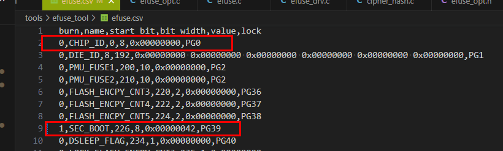
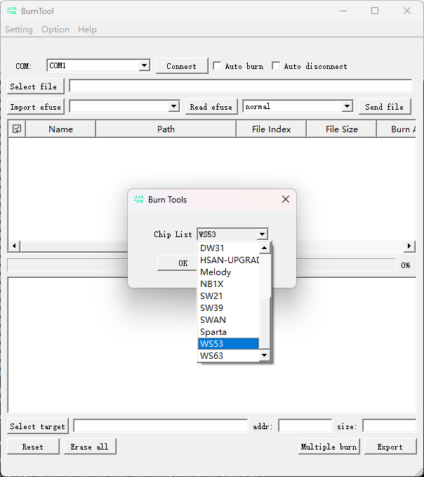
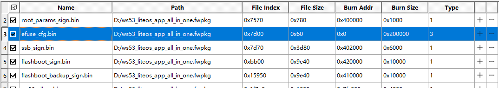
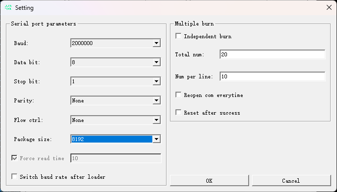
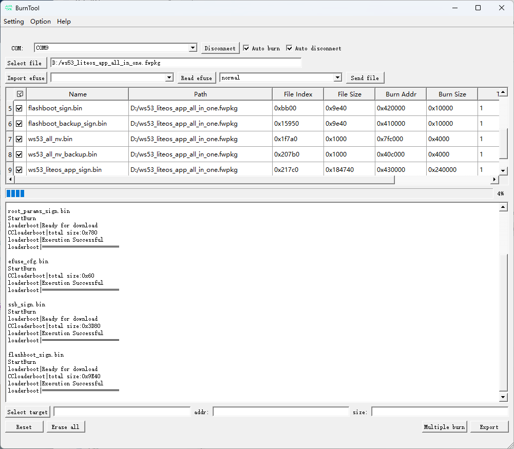
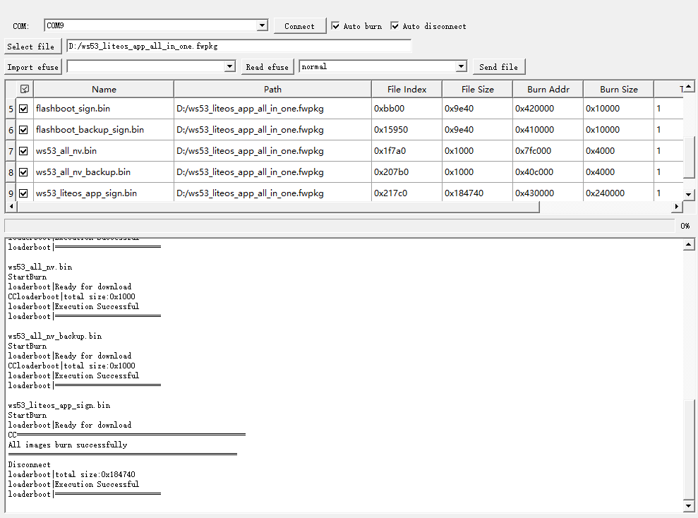

**概述<a name="section4537382116410"></a>**

本文档主要描述了WS53V100的客户预留EFUSE位域的使用方法。

# 概述<a name="ZH-CN_TOPIC_0000001891937762"></a>

EFUSE是一种可编程的存储单元，由于其只可编程一次的特征，多用于芯片保存Chip ID、密钥或其他一次性存储数据。WS53提供了两种使用方式：通过软件驱动接口直接读写用户预留的128bit EFUSE空间；通过烧写工具操作整个2048bit空间。

# 软件编程接口使用指导<a name="ZH-CN_TOPIC_0000001934857517"></a>

eFuse模块提供的接口及功能如下：

头文件路径: include\\driver\\efuse\_user.h

-   uapi\_efuse\_user\_read\_bit：从用户预留的eFuse空间中读取一位。
-   uapi\_efuse\_user\_read\_buffer：从用户预留的eFuse空间中读取多个字节，进入提供的缓冲区。
-   uapi\_efuse\_user\_write\_bit：向用户预留eFuse空间中的对应bit写1。
-   uapi\_efuse\_user\_write\_buffer：从提供的缓冲区向用户预留的eFuse空间写入多个字节。

示例：

1.  按照buffer写eFuse值。

    ```
    uint8_t efuse_data[8] = {0x11,0x22,0x33,0x44,0x55,0x66,0x77,0x88};
    uint32_t byte_number = 1;
    uint16_t length = 8;
    uint32_t ret;
    // 第1Byte开始写入8个字节
    ret = uapi_efuse_user_write_buffer(byte_number, efuse_data, length);
    if (ret != 0) {
        // 异常处理
    }
    
    ```

2.  按照buffer读取efuse值。

    ```
    uint8_t efuse_data[8] = {0};
    uint32_t byte_number = 1;
    uint16_t length = 8;
    uint32_t ret;
    // 第1byte开始读取8个字节
    ret = uapi_efuse_user_read_buffer(byte_number, efuse_data, length);
    if (ret != 0) {
        // 异常处理
    }
    
    ```

1.  按照bit读取efuse值。

    ```
    uint8_t bit_pos = 1;
    uint8_t value;
    uint32_t byte_number = 1;
    uint32_t ret;
    // 读取第一个byte的bit1的值，存入value中（0 or 1）
    ret = uapi_efuse_user_read_bit(byte_number, bit_pos, &value);
    if (ret != 0) {
        // 异常处理
    }
    ```

1.  按照bit写入efuse值。

    ```
    uint8_t value;
    uint32_t byte_number = 1;
    uint32_t ret;
    // 向第一个byte的bit1写入1
    ret = uapi_efuse_user_write_bit(byte_number, bit_pos);
    if (ret != 0) {
        // 异常处理
    }
    ```

# Burntool烧写efuse\_cfg.bin说明<a name="ZH-CN_TOPIC_0000001891777862"></a>

-   **[生成efuse\_cfg.bin](#ZH-CN_TOPIC_0000001891777858)**  

-   **[烧录流程](#ZH-CN_TOPIC_0000001934857513)**  

## 生成efuse\_cfg.bin<a name="ZH-CN_TOPIC_0000001891777858"></a>

1.  数据准备

    

    字段说明：

    burn：

    -   0：当前位域不烧写，
    -   1：当前位域烧写

    name：当前efuse位域名字

    start\_bit：位域起始bit位

    bit\_width：当前位域bit长度

    values：烧写值

    lock：锁定位

    示例：

    0,CHIP\_ID,0,8,0x00000000,PG0：chip\_id 从bit0开始，长度是8bit，不烧写。

    1,SEC\_BOOT,226,8,0x00000042,PG39：SEC\_BOOT从bit226开始，长度为8bit，烧写值为0x42。

1.  烧写文件生成

1.  编译loaderboot，会生成efuse\_cfg.bin。
2.  编译对应的app.bin，编译成功后，会将efuse\_cfg.bin自动打包到app.bin中。

## 烧录流程<a name="ZH-CN_TOPIC_0000001934857513"></a>

准备烧写工具“BurnTool”通过BurnTool工具烧写镜像。具体步骤如下：

1.  在BurnTool界面中，单击“Option”按钮，选择“Change chip”，从“Chip List”下拉菜单中选择“WS53”，并单击“OK”即可，如[图1](#fig749721661114)所示。

    **图 1**  BurnTool更换芯片示例<a name="fig749721661114"></a>  
    

2.  在BurnTool界面中，单击“COM”按钮选择PC机串口（串口选择，请参考开发板使用指南）；单击“Select file”按钮，选择各产品编译生成的固件包，并单击“OK”，如[图2](#fig524843652914)所示。efuse\_cfg.bin为待烧录数据，烧录类型为3。

    **图 2**  烧录文件选择示例<a name="fig524843652914"></a>  
    

3.  勾选“Auto burn”以及“Auto disconnect”选项；

    选择“Setting”→“Settings”，配置串口参数，默认配置如[图3](#fig327052934116)所示，baud配置为2000000，package size配置为8192。

    > **说明：** 
    >Force Read Time：定时读取的时间，以毫秒为单位。勾选时为定时读取串口，不勾选时为事件触发读取串口。适用于不勾选该选项无法正常烧录的场景。

    **图 3**  串口设置示例<a name="fig327052934116"></a>  
    

    选择目标串口号并单击“Connect”按钮（单击后“Connect”变为“Disconnect”），复位单板。自动烧录效果如[图4](#fig680845815298)所示。

    **图 4**  自动烧录示意图<a name="fig680845815298"></a>  
    

    等待传输完成后结束烧写，烧写完成会出现“All images burn successfully”。烧写完成效果如[图5](#fig465721114284)所示。

    **图 5**  烧写完成示意图<a name="fig465721114284"></a>  
    

    > **说明：** 
    >在速率不理想的外部状态下，若多次出现烧写镜像失败的情况，请拷贝至本地烧写


