**概述**

本文档详细描述了WS53V100单板冒烟测试的过程，用于帮助用户快速实现产品的基本功能并进行相关的验证。

# 概述

**冒烟测试**

冒烟测试是在软件开发过程中的一种针对软件版本包的基本功能快速验证策略，是对软件基本功能进行确认验证的手段，并非对软件版本包的深入测试。冒烟测试也是针对软件版本包进行详细测试之前的预测试，执行冒烟测试的主要目的是快速验证软件基本功能是否有缺陷；硬件组网、连线请参考《WS53V100 模组 使用指南》。

**ping**

ping（Packet Internet Groper，包探索器）用于测试网络连接量的程序 。ping用于确定本地主机是否能与另一台主机成功交换（发送与接收）数据包，再根据返回的信息推断TCP/IP参数是否设置正确，以及运行是否正常、网络是否通畅等。

**Iperf**

Iperf 是一个网络性能测试工具。Iperf可以测试最大TCP和UDP带宽性能，具有多种参数，可以根据需要调整，可以报告带宽、延迟抖动和数据包丢失。

> **说明：** 
>ping指令功能正常、Iperf工具流量测试正常即视为单板冒烟测试成功。

# 单板冒烟测试

WS53V100冒烟测试包括四部分：

-   WiFi AP模式冒烟测试
-   WiFi STA模式冒烟测试
-   BLE冒烟测试
-   SLE冒烟测试

> **说明：** 
>-   单板冒烟测试使用AT指令请参见《WS53V100 AT命令 使用指南》。
>-   本文iperf测试使用两块单板，一块作为STA设备使用，另一块做AP设备使用。AP模式单板配置IP为192.168.49.1，STA模式单板自动获取IP为192.168.49.2，用户可以根据实际情况更改；也可以只使用一块单板，先完成STA测试，再完成AP测试。

-   **[WiFi AP模式冒烟测试](#ZH-CN_TOPIC_0000001823994349)**  

-   **[WiFi STA模式冒烟测试](#ZH-CN_TOPIC_0000001823874417)**  

-   **[BLE冒烟测试](#ZH-CN_TOPIC_0000001823874421)**  

-   **[SLE冒烟测试](#ZH-CN_TOPIC_0000001777234846)**  

## WiFi AP模式冒烟测试

-   **[概述](#ZH-CN_TOPIC_0000001823994353)**  

-   **[测试流程](#ZH-CN_TOPIC_0000001823994361)**  

### 概述

无线AP（Access Point，无线接入点）用于无线网络的无线交换机，也是无线网络的核心。WS53V100是一块标准无线网卡，通过驱动程序使其提供与AP一样的无线信号转接、路由等功能（即：Soft-AP），其他便携式设备可以通过802.11协议与其互连。

### 测试流程

1.  复位单板\(AT+RST\)

    

2.  设置单板的MAC地址。初始化阶段软件会按照 读flash nv \> 读efuse\>随机生成，这样的优先级生成一个mac地址放在全局变量中，系统启动后，业务启动之前，可以调用AT+MAC修改这个全局变量mac地址，业务启动时，会调用平台接口按照获取mac地址。sta直接返回这个全局变量的mac，softap 时会将这个全局mac地址倒数第二位加1返回。AT+MAC只会改变系统的保存的这个全局变量，不会改写NV和efuse。
3.  开启AP模式\(AT+STARTAP="my\_ap",13,2,"12345678"\),下发命令后，WS53模组会创建WiFi无线网络，ssid名称为"my\_ap"，工作信道为13，认证方式为WPA2\_PSK，密码为"12345678"。

    

4.  设置IP地址和网关（AT+IFCFG=ap0,192.168.49.1,netmask,255.255.255.0,gateway,192.168.49.1）

    

5.  启动DHCP服务器\(AT+DHCPS=ap0,1\)

    

6.  查看AP配置信息\(AT+IFCFG\)

    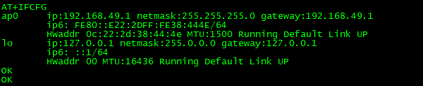

7.  单板AP ping STA测试\(AT+PING=<STA ip addr\>\)。前置条件是WiFi STA已连接到 WS53模组创建的无线网络上。

    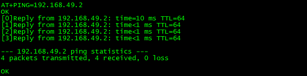

8.  Iperf测试。iperf命令要AP&STA成对输入。
    -   udp接收吞吐量测试\(AT+IPERF=-s,-u,-i,1\),STA执行“udp发送吞吐量测试命令”。

        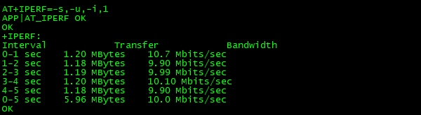

    -   udp发送吞吐量测试\(AT+IPERF=-c,<STA ip addr\>,-u,-b,10M,-t,5,-i,1\),STA提前执行"udp接收吞吐量测试命令"。

        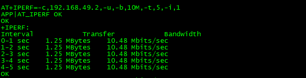

    -   tcp接收吞吐量测试\(AT+IPERF=-s,-i,1\),STA执行"tcp发送吞吐量测试命令"

        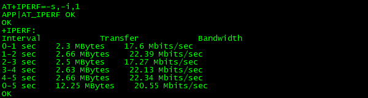

    -   tcp发送吞吐量测试\(AT+IPERF=-c,<STA ip addr\>,-t,5,-i,1\),STA提前执行"tcp接收吞吐量测试命令"

        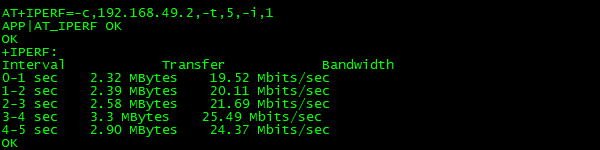

经上述测试，AP模式单板基本功能正常。

## WiFi STA模式冒烟测试

-   **[概述](#ZH-CN_TOPIC_0000001777394494)**  

-   **[测试流程](#ZH-CN_TOPIC_0000001777234834)**  

### 概述

任何一个接入无线AP的设备都可以称为一个站点（STA，Station）。STA模式冒烟测试即实现与AP设备连接并能进行数据通信。

### 测试流程

1.  复位单板\(AT+RST\)

    

2.  设置单板的MAC地址\(AT+MAC=xx:xx:xx:xx:xx:xx\)。两块单板（AP和STA） 的MAC 要设置的不一样。

    

3.  开启STA模式（AT+STARTSTA）

    

4.  扫描可连接的网络\(AT+SCAN\)

    

5.  导出扫描结果，查询可连接的网络\(AT+SCANRESULT\)。

    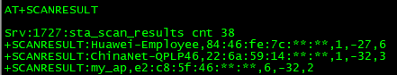

6.  连接网络\(AT+CONN="my\_ap",,"12345678"\),连接ssid为"my\_wifi",密码为"12345678"的AP。

    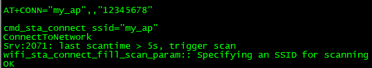

7.  启动DHCP客户端，获取STA设备的IP\(AT+DHCP=wlan0,1\)

    

8.  查看STA配置信息\(AT+IFCFG\)

    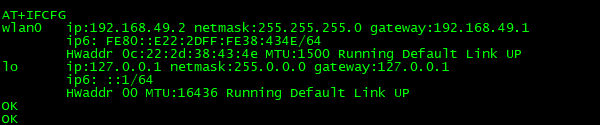

9.  ping测试（AT+PING=<AP ip addr\>）

    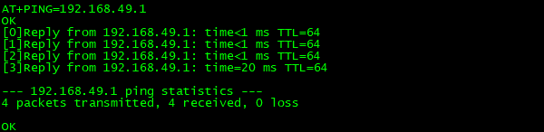

10. Iperf吞吐量测试。
    -   udp接收吞吐量测试\(AT+IPERF=-s,-u,-i,1\),AP执行“udp发送吞吐量测试命令”。

        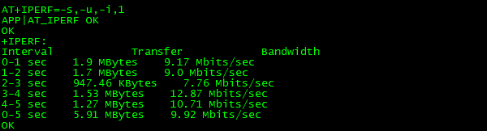

    -   udp发送吞吐量测试\(AT+IPERF=-c,192.168.49.1,-u,-b,10M,-t,5,-i,1\),AP提前执行"udp接收吞吐量测试命令"。

        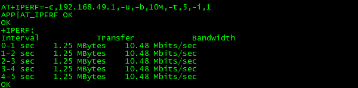

    -   tcp接收吞吐量测试\(AT+IPERF=-s,-i,1\),AP执行“tcp发送吞吐测试命令”。

        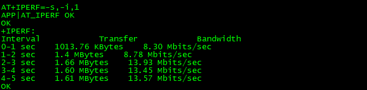

    -   tcp发送吞吐量测试\(AT+IPERF=-c,192.168.49.1,-t,5,-i,1\),AP提前执行"tcp接收吞吐量测试命令"。

        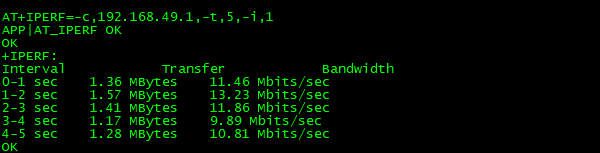

经上述测试，STA模式单板基本功能正常。

## BLE冒烟测试

-   **[概述](#ZH-CN_TOPIC_0000001777394490)**  

-   **[测试流程](#ZH-CN_TOPIC_0000001823874429)**  

### 概述

BLE冒烟测试是一种针对BLE协议栈的快速基本功能验证策略，旨在确认软件BLE基本功能是否正常。

BLE单板连接手机，然后进行数传。

### 测试流程

1.  单板连接手机。

1.  使能BLE \(AT+BLEENABLE\)：

    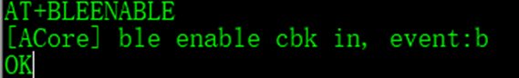

2.  设置蓝牙名称 \(AT+BLESETNAME\)：

    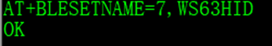

1.  设置蓝牙地址 \(AT+BLESETADDR\)：

    

2.  设置广播数据 \(AT+BLESETADVDATA\)：

    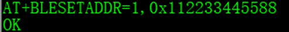

3.  设置广播参数 \(AT+BLESETADVPAR\)：

    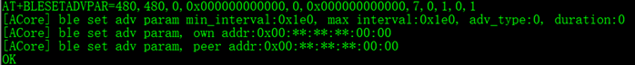

4.  起广播 \(AT+BLESTARTADV\)：

    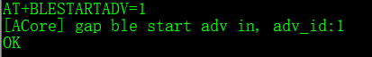

5.  手机测搜索并连接单板

    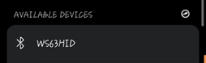

    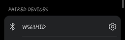

经上述测试，单板BLE基本功能正常。

## SLE冒烟测试

-   **[概述](#ZH-CN_TOPIC_0000001777394486)**  

-   **[测试流程](#ZH-CN_TOPIC_0000001777234838)**  

### 概述

星闪（SLE）冒烟测试主要验证server端与client端的SSAP接口以及服务发现管理的基本功能，以下冒烟功能包括配对连接和服务管理。

### 测试流程

**配对连接**

1.  server端与client端启动SLE（AT+SLEENABLE）。

    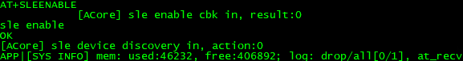

2.  server端设置广播（AT+SLESETADV）。

    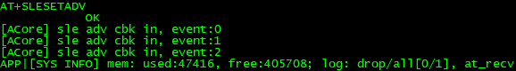

3.  server端起广播（AT+SLEENABLEADV=1）。

    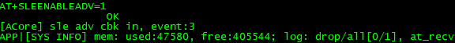

4.  client连接server端（AT+SLECONNADDR=0,0x000000000000）。

    client成功连接到server端。

    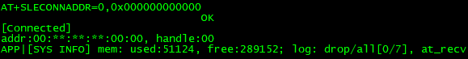

    server端收到client的连接请求，并成功配对连接。

    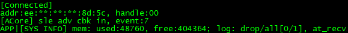

**服务管理**

**server端**

1.  启动SLE（AT+SLEENABLE），截图同配对连接。
2.  注册server（AT+SLEADDSERVER=0x1234）。

    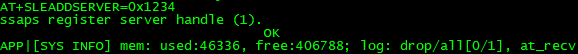

3.  添加服务（AT+SLEADDSERVICE=0x2222,1）。

    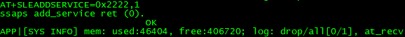

4.  添加属性（AT+SLEADDPROPERTY=1,0x2323,5,5,2,0x1234）。

    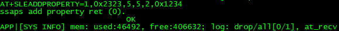

5.  添加属性描述符（AT+SLEADDDESCRIPTOR=1,2,0x3333,5,5,2,2,0x0200）。

     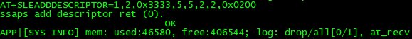

6.  调起服务\(AT+SLESTARTSERVICE=1\)。

    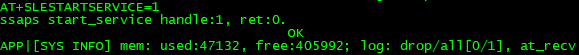

7.  注册服务端回调函数（AT+SLESSAPSERREGISTER）。

    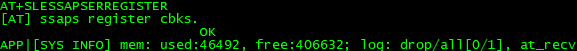

8.  设置广播参数（AT+SLESETADVPAR=1,3,200,200,0,000000000000,0,000000000000）。

    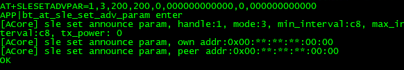

9.  设置广播数据（AT+SLESETADVDATA=1,10,4,aabbccddeeff11223344,11224455）。

    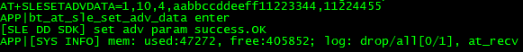

10. 根据设置的参数起广播（AT+SLEENADVBYPAR=1）。

    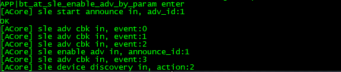

**client端**

1.  启动SLE（AT+SLEENABLE），截图同配对连接。
2.  注册SSAPC回调（AT+SLESSAPCENREGISTER）。

    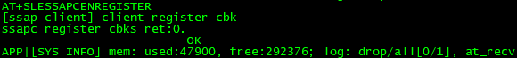

3.  连接对端（AT+SLECONNADDR=0,0x000000000000）。

    

4.  按照uuid发现service（AT+SLEDISCOVERYSERVICES=0,0,1）。

    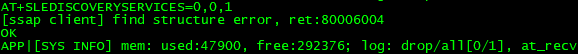

5.  client端向server端写入数据（AT+SLESSAPCENWRITE=0,0,2,0,2,0x8899）。

    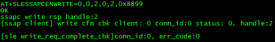

    Server端会同时收到对端写入的数据。

    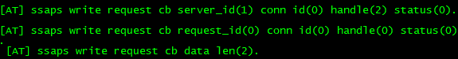

6.  客户端读取服务端属性数据（AT+SLESSAPCENREAD=0,0,2,0）。

    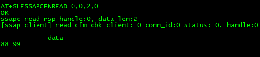

经上述测试，单板星闪基本功能正常。

