**概述<a name="section4537382116410"></a>**

本文档主要介绍WS53V100解决方案中系统/平台模块与Wi-Fi模块常见问题处理和解决办法。使用对象为开发、测试和运维人员，旨在提升WS53V100解决方案问题的定位效率。

# 系统/平台模块<a name="ZH-CN_TOPIC_0000001944703297"></a>

-   **[死机类问题故障定位指导](#ZH-CN_TOPIC_0000001911544050)**  

## 死机类问题故障定位指导<a name="ZH-CN_TOPIC_0000001911544050"></a>

本章节主要介绍系统异常的几种常见类型以及死机信息解析的相关问题。

-   **[系统CPU异常死机](#ZH-CN_TOPIC_0000001911424138)**  

-   **[看门狗挂死](#ZH-CN_TOPIC_0000001911544018)**  

-   **[业务卡死](#ZH-CN_TOPIC_0000001944703293)**  

-   **[离线挂死信息](#ZH-CN_TOPIC_0000001944703289)**  

### 系统CPU异常死机<a name="ZH-CN_TOPIC_0000001911424138"></a>

如果CPU检测到异常（内存访问异常，指令异常等）后，会主动进行一系列异常接管的处理动作，例如打印异常发生时当前函数的调用栈信息、CPU现场信息、异常发生时正在运行的任务信息（包括任务名、任务号、堆栈大小等）等，方便用户定位分析问题，这就是挂死时用户能看到的“死机”信息。

-   **[死机信息组成说明](#ZH-CN_TOPIC_0000001944703313)**  

-   **[死机信息详细说明](#ZH-CN_TOPIC_0000001911544026)**  

-   **[定位步骤](#ZH-CN_TOPIC_0000001944703309)**  

-   **[常见CPU异常死机案例](#ZH-CN_TOPIC_0000001911544042)**  

#### 死机信息组成说明<a name="ZH-CN_TOPIC_0000001944703313"></a>

死机信息主要内容由以下几部分组成，如[表1](#table9508749175620)所示。

**表 1**  死机信息组成说明

<a name="table9508749175620"></a>
<table><thead align="left"><tr id="row10509849155613"><th class="cellrowborder" valign="top" width="19.25%" id="mcps1.2.3.1.1"><p id="p11509204914569"><a name="p11509204914569"></a><a name="p11509204914569"></a>成员</p>
</th>
<th class="cellrowborder" valign="top" width="80.75%" id="mcps1.2.3.1.2"><p id="p12509164915612"><a name="p12509164915612"></a><a name="p12509164915612"></a>描述</p>
</th>
</tr>
</thead>
<tbody><tr id="row175091549175614"><td class="cellrowborder" valign="top" width="19.25%" headers="mcps1.2.3.1.1 "><p id="p1650911499567"><a name="p1650911499567"></a><a name="p1650911499567"></a>CPU异常信息</p>
</td>
<td class="cellrowborder" valign="top" width="80.75%" headers="mcps1.2.3.1.2 "><p id="p05091449205611"><a name="p05091449205611"></a><a name="p05091449205611"></a>打印具体的CPU异常。</p>
</td>
</tr>
<tr id="row12509184935612"><td class="cellrowborder" valign="top" width="19.25%" headers="mcps1.2.3.1.1 "><p id="p146224341657"><a name="p146224341657"></a><a name="p146224341657"></a>详细任务信息</p>
</td>
<td class="cellrowborder" valign="top" width="80.75%" headers="mcps1.2.3.1.2 "><p id="p15621143411512"><a name="p15621143411512"></a><a name="p15621143411512"></a>打印挂死时的所有任务详情。</p>
</td>
</tr>
<tr id="row1350911498567"><td class="cellrowborder" valign="top" width="19.25%" headers="mcps1.2.3.1.1 "><p id="p1250984917569"><a name="p1250984917569"></a><a name="p1250984917569"></a>异常汇总信息</p>
</td>
<td class="cellrowborder" valign="top" width="80.75%" headers="mcps1.2.3.1.2 "><p id="p1950974955616"><a name="p1950974955616"></a><a name="p1950974955616"></a>发生异常时的task名称、taskID、异常类型。</p>
</td>
</tr>
<tr id="row18509174914562"><td class="cellrowborder" valign="top" width="19.25%" headers="mcps1.2.3.1.1 "><p id="p45091849135620"><a name="p45091849135620"></a><a name="p45091849135620"></a>CPU寄存器信息</p>
</td>
<td class="cellrowborder" valign="top" width="80.75%" headers="mcps1.2.3.1.2 "><p id="p45096490564"><a name="p45096490564"></a><a name="p45096490564"></a>发生异常时的CPU寄存器值，包括mepc、mcause、ccause等寄存器。</p>
</td>
</tr>
<tr id="row35092049135611"><td class="cellrowborder" valign="top" width="19.25%" headers="mcps1.2.3.1.1 "><p id="p17509949175615"><a name="p17509949175615"></a><a name="p17509949175615"></a>函数调用栈信息</p>
</td>
<td class="cellrowborder" valign="top" width="80.75%" headers="mcps1.2.3.1.2 "><p id="p8509174914561"><a name="p8509174914561"></a><a name="p8509174914561"></a>任务栈中的代码执行记录，从上到下表示由近及远的代码执行顺序，可以依据此信息得出异常发生时的程序上下文。</p>
</td>
</tr>
</tbody>
</table>

以下是一个典型的挂死信息示例：

```
Store/AMO access fault
PMP access fault
Name                   TaskEntryAddr       TID    Priority   Status       StackSize    WaterLine      StackPoint             TopOfStack             SemID        EventMask  CPUP  CPUP 10.0s  CPUP  1.0s  
----                   -------------       ---    --------   --------     ---------    ----------     ----------             ----------             ----------   ---------  ----  ----------  ----------  
wifi_frw               0x00128d80          0x0    5          Running      0x1000       0x6c8          0x00a39790             0x00a38900             0xffffffff   0x1         0.0     14.4       13.0   
Swt_Task               0x00a0cc1c          0x1    0          Suspend      0x800        0x288          0x00a30630             0x00a2ffa0             0xffffffff   0x0         0.0      0.0        0.0   
IdleCore000            0x00a0c212          0x2    31         Ready        0x400        0x284          0x00a30950             0x00a307c0             0xffffffff   0x0        78.4     14.3        5.0   
dfx_msg                0x002505bc          0x3    5          Pend         0x800        0x1b4          0x00a33530             0x00a32ee0             0xffffffff   0x0         0.0      0.0        0.0   
app                    0x00254ad2          0x4    27         Ready        0x800        0x584          0x00a33f70             0x00a33900             0xffffffff   0x0         0.0      0.0        0.0   
log                    0x003ad238          0x5    25         Pend         0x800        0x194          0x00a34790             0x00a34120             0x1          0x0         0.0      0.0        0.0   
bt                     0x0014d2e4          0x6    1          Pend         0xe00        0x338          0x00a35590             0x00a34940             0xffffffff   0x0         0.0      0.0        0.0   
bt_sdk                 0x002f3f02          0x7    24         Pend         0x800        0x1b8          0x00a35db0             0x00a35760             0xffffffff   0x0         0.0      0.0        0.0   
bth_sdk                0x00307ec4          0x8    19         Pend         0x800        0x164          0x00a36610             0x00a35f70             0x3          0x0         0.0      0.0        0.0   
recvBthDataTask        0x0030b95e          0x9    18         Pend         0x800        0x1d4          0x00a36e00             0x00a36790             0xffffffff   0x0         0.0      0.0        0.0   
bt_service             0x002f2ace          0xa    14         Pend         0x1000       0xae4          0x00a37df0             0x00a36fb0             0xffffffff   0x0         0.9      0.8        0.0   
t_shell                0x00377aba          0xb    9          Pend         0x900        0x4d4          0x00a38720             0x00a37fe0             0xc          0x0         0.0      0.0        0.0   


t_net                  0x0039e1e4          0xf    5          PendTime     0x1000       0x594          0x00a3e320             0x00a3d4f0             0xffffffff   0x0         0.1      0.7        1.0   
schedule_loop          0x002f3136          0x10   22         Pend         0xa00        0x964          0x00a3fdc0             0x00a3f520             0x5          0x0         0.2      3.0        0.0   
wifi_frw_txdata        0x00264afa          0x11   4          Pend         0x1000       0x554          0x00a43910             0x00a42a80             0xffffffff   0x1         0.0      0.8        0.0   
wifi_frw_msg           0x00264afa          0x12   4          Pend         0x1400       0xffffffff     0x00a673f0             0x00a66160             0xffffffff   0x1         0.0      8.1       11.0   
t_uplus                0x00348096          0x14   14         PendTime     0xc00        0xa54          0x00a45bb0             0x00a45150             0xd          0x40        0.4      1.3        0.0   
t_aux0                 0x00348096          0x15   16         Ready        0x1000       0xd14          0x00a477e0             0x00a46980             0xffffffff   0x40        0.1      1.1        0.0   
t_uh                   0x00348118          0x16   15         Ready        0x1200       0x9e4          0x00a48830             0x00a47d40             0xffffffff   0x0         4.9     43.1       70.0   
t_ble                  0x00348096          0x17   15         PendTime     0xe00        0xbd4          0x00a4a930             0x00a49cd0             0x14         0x0         0.6      5.9        0.0   
t_epp                  0x00348096          0x18   14         PendTime     0x1200       0xcfc          0x00a4dac0             0x00a4ca60             0x1d         0x0         0.2      0.6        0.0   
t_serial               0x0035da4c          0x19   13         Pend         0x1000       0x734          0x00a4ea70             0x00a4dc70             0x311001f    0x0         0.6      1.1        0.0   

wpa_supplicant         0x002ae880          0x1c   4          PendTime     0x1800       0xffffffff     0x00a6c490             0x00a6ae90             0xffffffff   0x7         0.0      4.2        0.0   
APP|exception:7
task:wifi_frw
thrdPid:0xffffffff
type:0x7
nestCnt:1
phase:Irq
ccause:0x7
mcause:0x7
mtval:0xa98800
gp:0xa10e0c
mstatus:0x80007880
mepc:0xa0e8f6
ra:0x370038
sp:0xa2daa0
tp:0x0
t0:0xa987ec
t1:0xa0db92
t2:0x0
s0:0x0
s1:0xa2ceec
a0:0xa4f004
a1:0x2
a2:0x32ea28
a3:0x20
a4:0x8
a5:0x2020202
a6:0xa4f00c
a7:0xd7da2c
s2:0xa2ceec
s3:0x4a000000
s4:0xa2d000
s5:0xa19eec
s6:0xffffffff
s7:0x8080808
s8:0x7070707
s9:0x6060606
s10:0x5050505
s11:0x4040404
t3:0x12077e
t4:0x1
t5:0x0
t6:0xa5f2f8
APP|cxcptsc = 0x7
APP|*******backtrace begin*******
fp error, backtrace failed!
APP|*******backtrace end*******
APP|*******stack txt info begin*******
APP|traceback 1 -- sp addr= 0xa2daa4    sp content= 0xa0e8f6
APP|traceback 19 -- sp addr= 0xa2daec    sp content= 0x12077e
APP|traceback 25 -- sp addr= 0xa2db04    sp content= 0x32ea28
APP|traceback 29 -- sp addr= 0xa2db14    sp content= 0xa0db92
APP|traceback 31 -- sp addr= 0xa2db1c    sp content= 0x370038
APP|traceback 55 -- sp addr= 0xa2db7c    sp content= 0xa0c1ba
APP|traceback 59 -- sp addr= 0xa2db8c    sp content= 0xa0d500
APP|traceback 67 -- sp addr= 0xa2dbac    sp content= 0x3a9496
APP|traceback 75 -- sp addr= 0xa2dbcc    sp content= 0xa0d100
APP|traceback 83 -- sp addr= 0xa2dbec    sp content= 0xa0e0b0
APP|*******stack txt info end*******
```

#### 死机信息详细说明<a name="ZH-CN_TOPIC_0000001911544026"></a>

-   CPU异常信息

    挂死信息最开始，AT/DEBUG串口会直接打印挂死的直接原因信息，如下图所示，表示当前挂死是由于写地址异常，CPU写到了一片PMP保护的区域导致挂死：

    

-   详细任务信息

    这一部分会打印运行在当前CPU上所有的任务以及其状态，可以协助用户对当前业务运行的状态有更精准的判断。一个典型的任务信息打印如下：

    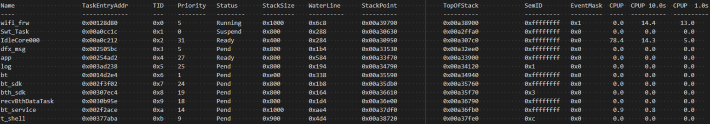

    **表 1**  任务信息

    <a name="table314854143610"></a>
    <table><thead align="left"><tr id="row614854112362"><th class="cellrowborder" valign="top" width="28.42%" id="mcps1.2.3.1.1"><p id="p814884123616"><a name="p814884123616"></a><a name="p814884123616"></a>成员</p>
    </th>
    <th class="cellrowborder" valign="top" width="71.58%" id="mcps1.2.3.1.2"><p id="p1314812416365"><a name="p1314812416365"></a><a name="p1314812416365"></a>描述</p>
    </th>
    </tr>
    </thead>
    <tbody><tr id="row161483416362"><td class="cellrowborder" valign="top" width="28.42%" headers="mcps1.2.3.1.1 "><p id="p17148134114369"><a name="p17148134114369"></a><a name="p17148134114369"></a>Name</p>
    </td>
    <td class="cellrowborder" valign="top" width="71.58%" headers="mcps1.2.3.1.2 "><p id="p7148341103610"><a name="p7148341103610"></a><a name="p7148341103610"></a>任务名。</p>
    </td>
    </tr>
    <tr id="row41481041143612"><td class="cellrowborder" valign="top" width="28.42%" headers="mcps1.2.3.1.1 "><p id="p114894111366"><a name="p114894111366"></a><a name="p114894111366"></a>TID</p>
    </td>
    <td class="cellrowborder" valign="top" width="71.58%" headers="mcps1.2.3.1.2 "><p id="p18149194143614"><a name="p18149194143614"></a><a name="p18149194143614"></a>任务ID。</p>
    </td>
    </tr>
    <tr id="row81491241133614"><td class="cellrowborder" valign="top" width="28.42%" headers="mcps1.2.3.1.1 "><p id="p6149154153611"><a name="p6149154153611"></a><a name="p6149154153611"></a>Priority</p>
    </td>
    <td class="cellrowborder" valign="top" width="71.58%" headers="mcps1.2.3.1.2 "><p id="p8149204193618"><a name="p8149204193618"></a><a name="p8149204193618"></a>任务优先级，数值越小，优先级越高。</p>
    </td>
    </tr>
    <tr id="row1314944173610"><td class="cellrowborder" valign="top" width="28.42%" headers="mcps1.2.3.1.1 "><p id="p314984143619"><a name="p314984143619"></a><a name="p314984143619"></a>Status</p>
    </td>
    <td class="cellrowborder" valign="top" width="71.58%" headers="mcps1.2.3.1.2 "><p id="p814917411366"><a name="p814917411366"></a><a name="p814917411366"></a>任务状态。</p>
    <a name="ul15460115815435"></a><a name="ul15460115815435"></a><ul id="ul15460115815435"><li>Ready：任务处于就绪状态。</li><li>Pend：任务处于阻塞状态。</li><li>PendTime：阻塞的任务处于等待超时状态。</li><li>Suspend：任务处于挂起状态。</li><li>Running：该任务正在运行。</li><li>Delay：任务处于延时等待状态。</li><li>SuspendTime：挂起的任务处于等待超时状态。</li><li>Invalid：非上述任务状态。</li></ul>
    </td>
    </tr>
    <tr id="row15149174114361"><td class="cellrowborder" valign="top" width="28.42%" headers="mcps1.2.3.1.1 "><p id="p1814919414369"><a name="p1814919414369"></a><a name="p1814919414369"></a>StackSize</p>
    </td>
    <td class="cellrowborder" valign="top" width="71.58%" headers="mcps1.2.3.1.2 "><p id="p1814910414362"><a name="p1814910414362"></a><a name="p1814910414362"></a>任务栈大小，单位：字节。</p>
    </td>
    </tr>
    <tr id="row184821312385"><td class="cellrowborder" valign="top" width="28.42%" headers="mcps1.2.3.1.1 "><p id="p648217311381"><a name="p648217311381"></a><a name="p648217311381"></a>WaterLine</p>
    </td>
    <td class="cellrowborder" valign="top" width="71.58%" headers="mcps1.2.3.1.2 "><p id="p54824323820"><a name="p54824323820"></a><a name="p54824323820"></a>任务栈水线，该任务栈已经被使用的内存大小。</p>
    <p id="p5755126184716"><a name="p5755126184716"></a><a name="p5755126184716"></a>预期小于任务栈大小。</p>
    </td>
    </tr>
    <tr id="row1769489382"><td class="cellrowborder" valign="top" width="28.42%" headers="mcps1.2.3.1.1 "><p id="p187691189383"><a name="p187691189383"></a><a name="p187691189383"></a>StackPoint</p>
    </td>
    <td class="cellrowborder" valign="top" width="71.58%" headers="mcps1.2.3.1.2 "><p id="p8398103734412"><a name="p8398103734412"></a><a name="p8398103734412"></a>任务栈指针，表示栈的起始地址。</p>
    </td>
    </tr>
    <tr id="row817412118389"><td class="cellrowborder" valign="top" width="28.42%" headers="mcps1.2.3.1.1 "><p id="p9174111119383"><a name="p9174111119383"></a><a name="p9174111119383"></a>TopOfStack</p>
    </td>
    <td class="cellrowborder" valign="top" width="71.58%" headers="mcps1.2.3.1.2 "><p id="p3779317124120"><a name="p3779317124120"></a><a name="p3779317124120"></a>栈顶地址，预期比栈指针地址小。</p>
    </td>
    </tr>
    <tr id="row10177161712389"><td class="cellrowborder" valign="top" width="28.42%" headers="mcps1.2.3.1.1 "><p id="p1317712179382"><a name="p1317712179382"></a><a name="p1317712179382"></a>CPUP</p>
    </td>
    <td class="cellrowborder" valign="top" width="71.58%" headers="mcps1.2.3.1.2 "><p id="p206308247415"><a name="p206308247415"></a><a name="p206308247415"></a>显示系统启动至今总的CPU占用率。</p>
    </td>
    </tr>
    <tr id="row717814143820"><td class="cellrowborder" valign="top" width="28.42%" headers="mcps1.2.3.1.1 "><p id="p8171014113810"><a name="p8171014113810"></a><a name="p8171014113810"></a>CPUP 10.0s</p>
    </td>
    <td class="cellrowborder" valign="top" width="71.58%" headers="mcps1.2.3.1.2 "><p id="p161712148384"><a name="p161712148384"></a><a name="p161712148384"></a>显示系统最近10s的CPU占用率。</p>
    </td>
    </tr>
    <tr id="row79651855383"><td class="cellrowborder" valign="top" width="28.42%" headers="mcps1.2.3.1.1 "><p id="p1696585183819"><a name="p1696585183819"></a><a name="p1696585183819"></a>CPUP 1.0s</p>
    </td>
    <td class="cellrowborder" valign="top" width="71.58%" headers="mcps1.2.3.1.2 "><p id="p396510583811"><a name="p396510583811"></a><a name="p396510583811"></a>显示系统最近1s的CPU占用率。</p>
    </td>
    </tr>
    </tbody>
    </table>

    任务信息打印中的任务状态以及CPU占用率统计信息，可以判断死机是否是某任务出现异常CPU占用导致看门狗挂死（见“[看门狗挂死](#ZH-CN_TOPIC_0000001911544018)”）。

    任务信息打印还可以协助判断是否死机时某任务是否有踩内存的情况，这里举例说明如何通过task命令判断是否踩内存，如下图所示，有一任务名为shellTask。

    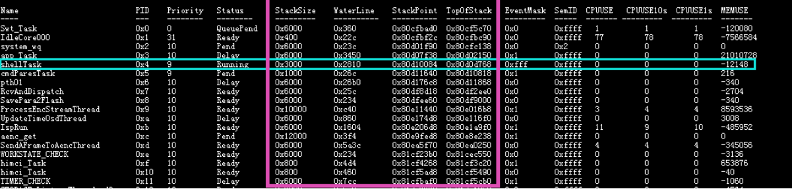

    StackSize = 0x3000（创建该任务时分配的栈大小）

    WaterLine = 0x2810（水线，目前为止该任务栈已经被使用的内存大小）

    StackPoint = 0x80d10084 （任务栈指针， 指向该任务当前的地址）

    Top0fStack = 0x80d0d768（栈顶）

    MaxStackPoint = Top0fStack + StackSize = 0x80d10768（得到该任务栈最大的可访问地址）

    -   若WaterLine \> StackSize，则说明该任务踩内存。
    -   若StackPoint \> MaxStackPoint 或 StackPoint < Top0fStack，则说明该任务踩内存。

-   异常汇总信息

    异常汇总信息包括发生异常时的task名称、taskID、异常类型等。示例如下：

    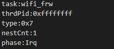

    <a name="table1779874175912"></a>
    <table><thead align="left"><tr id="row47999435918"><th class="cellrowborder" valign="top" width="22.54%" id="mcps1.1.3.1.1"><p id="p479913415911"><a name="p479913415911"></a><a name="p479913415911"></a>成员</p>
    </th>
    <th class="cellrowborder" valign="top" width="77.46%" id="mcps1.1.3.1.2"><p id="p879918465912"><a name="p879918465912"></a><a name="p879918465912"></a>描述</p>
    </th>
    </tr>
    </thead>
    <tbody><tr id="row1379916413593"><td class="cellrowborder" valign="top" width="22.54%" headers="mcps1.1.3.1.1 "><p id="p1779916465915"><a name="p1779916465915"></a><a name="p1779916465915"></a>task</p>
    </td>
    <td class="cellrowborder" valign="top" width="77.46%" headers="mcps1.1.3.1.2 "><p id="p97996425915"><a name="p97996425915"></a><a name="p97996425915"></a>任务名</p>
    </td>
    </tr>
    <tr id="row179916435910"><td class="cellrowborder" valign="top" width="22.54%" headers="mcps1.1.3.1.1 "><p id="p9799174175915"><a name="p9799174175915"></a><a name="p9799174175915"></a>thrdPid</p>
    </td>
    <td class="cellrowborder" valign="top" width="77.46%" headers="mcps1.1.3.1.2 "><p id="p4799204135918"><a name="p4799204135918"></a><a name="p4799204135918"></a>如果在任务中挂死，其值就代表任务ID；在中断或者嵌套挂死，其值是0xffffffff。</p>
    </td>
    </tr>
    <tr id="row15799349598"><td class="cellrowborder" valign="top" width="22.54%" headers="mcps1.1.3.1.1 "><p id="p1279917418595"><a name="p1279917418595"></a><a name="p1279917418595"></a>type</p>
    </td>
    <td class="cellrowborder" valign="top" width="77.46%" headers="mcps1.1.3.1.2 "><p id="p1479916475918"><a name="p1479916475918"></a><a name="p1479916475918"></a>0~17分别代表不同的挂死类型：</p>
    <p id="p1920713561963"><a name="p1920713561963"></a><a name="p1920713561963"></a>"Instruction address misaligned",</p>
    <p id="p42071956167"><a name="p42071956167"></a><a name="p42071956167"></a>"Instruction access fault",</p>
    <p id="p1620717569619"><a name="p1620717569619"></a><a name="p1620717569619"></a>"Illegal instruction",</p>
    <p id="p1320725614617"><a name="p1320725614617"></a><a name="p1320725614617"></a>"Breakpoint",</p>
    <p id="p82071565616"><a name="p82071565616"></a><a name="p82071565616"></a>"Load address misaligned",</p>
    <p id="p92071056462"><a name="p92071056462"></a><a name="p92071056462"></a>"Load access fault",</p>
    <p id="p220712567612"><a name="p220712567612"></a><a name="p220712567612"></a>"Store/AMO address misaligned",</p>
    <p id="p1620719565612"><a name="p1620719565612"></a><a name="p1620719565612"></a>"Store/AMO access fault",</p>
    <p id="p220715561468"><a name="p220715561468"></a><a name="p220715561468"></a>"Environment call from U-mode",</p>
    <p id="p42071156663"><a name="p42071156663"></a><a name="p42071156663"></a>"Environment call from S-mode",</p>
    <p id="p192071561661"><a name="p192071561661"></a><a name="p192071561661"></a>"Reserved",</p>
    <p id="p920711563619"><a name="p920711563619"></a><a name="p920711563619"></a>"Environment call from M-mode",</p>
    <p id="p120712561467"><a name="p120712561467"></a><a name="p120712561467"></a>"Instruction page fault",</p>
    <p id="p8207656666"><a name="p8207656666"></a><a name="p8207656666"></a>"Load page fault",</p>
    <p id="p62071456965"><a name="p62071456965"></a><a name="p62071456965"></a>"Reserved",</p>
    <p id="p122071056965"><a name="p122071056965"></a><a name="p122071056965"></a>"Store page fault",</p>
    <p id="p92071561664"><a name="p92071561664"></a><a name="p92071561664"></a>"Hard fault",         /* Reserved exception code */</p>
    <p id="p172077561163"><a name="p172077561163"></a><a name="p172077561163"></a>"Lock up"             /* Reserved exception code */</p>
    </td>
    </tr>
    <tr id="row197992415594"><td class="cellrowborder" valign="top" width="22.54%" headers="mcps1.1.3.1.1 "><p id="p1799249598"><a name="p1799249598"></a><a name="p1799249598"></a>nestCnt</p>
    </td>
    <td class="cellrowborder" valign="top" width="77.46%" headers="mcps1.1.3.1.2 "><p id="p17996485911"><a name="p17996485911"></a><a name="p17996485911"></a>表示挂死信息的嵌套次数，如果在打印挂死信息时再次出现挂死，嵌套次数加1，以此类推。</p>
    </td>
    </tr>
    <tr id="row47991548598"><td class="cellrowborder" valign="top" width="22.54%" headers="mcps1.1.3.1.1 "><p id="p187991148595"><a name="p187991148595"></a><a name="p187991148595"></a>phase</p>
    </td>
    <td class="cellrowborder" valign="top" width="77.46%" headers="mcps1.1.3.1.2 "><p id="p279912435913"><a name="p279912435913"></a><a name="p279912435913"></a>表示挂死的时机：</p>
    <a name="ul197135413447"></a><a name="ul197135413447"></a><ul id="ul197135413447"><li>Init表示挂死在初始化过程。</li><li>Task表示挂死在任务中。</li><li>Irq表示挂死在中断中。</li></ul>
    </td>
    </tr>
    </tbody>
    </table>

-   CPU寄存器信息

    CPU给软件提供了方便调试的CSR，异常接管时软件会通过读取这些CSR来识别出当前CPU处于什么异常状态。主要如下三个CSR：mcause CSR\(0x342\)、ccause CSR\(0xfc2\)、mtval CSR\(0x343\)。其中mcause CSR是RISCV标准协议定义的CSR；mtval CSR是用来记录发生错误的地址或者指令。除了这三个CSR，还打印了mepc等协助开发人员定位死机位置的定位，示例如下：

    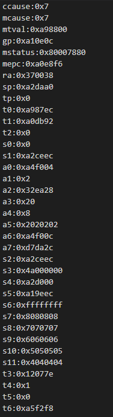

    <a name="table123621851191418"></a>
    <table><thead align="left"><tr id="row1536225118148"><th class="cellrowborder" valign="top" width="12.509999999999998%" id="mcps1.1.3.1.1"><p id="p1436218517146"><a name="p1436218517146"></a><a name="p1436218517146"></a>成员</p>
    </th>
    <th class="cellrowborder" valign="top" width="87.49%" id="mcps1.1.3.1.2"><p id="p1736218515148"><a name="p1736218515148"></a><a name="p1736218515148"></a>描述</p>
    </th>
    </tr>
    </thead>
    <tbody><tr id="row9362165110145"><td class="cellrowborder" valign="top" width="12.509999999999998%" headers="mcps1.1.3.1.1 "><p id="p163621651201414"><a name="p163621651201414"></a><a name="p163621651201414"></a>ccause</p>
    </td>
    <td class="cellrowborder" valign="top" width="87.49%" headers="mcps1.1.3.1.2 "><p id="p3362125171410"><a name="p3362125171410"></a><a name="p3362125171410"></a>ccause CSR是自定义CSR，用来细化更详细的异常信息。</p>
    </td>
    </tr>
    <tr id="row133628518142"><td class="cellrowborder" valign="top" width="12.509999999999998%" headers="mcps1.1.3.1.1 "><p id="p15362125161416"><a name="p15362125161416"></a><a name="p15362125161416"></a>mcause</p>
    </td>
    <td class="cellrowborder" valign="top" width="87.49%" headers="mcps1.1.3.1.2 "><p id="p7362185161411"><a name="p7362185161411"></a><a name="p7362185161411"></a>mcause CSR是机器异常寄存器。保存目前异常或者中断的原因，通过查询表3-5得到目前异常或者中断的类型。</p>
    </td>
    </tr>
    <tr id="row1536235112141"><td class="cellrowborder" valign="top" width="12.509999999999998%" headers="mcps1.1.3.1.1 "><p id="p20362115114141"><a name="p20362115114141"></a><a name="p20362115114141"></a>mtval</p>
    </td>
    <td class="cellrowborder" valign="top" width="87.49%" headers="mcps1.1.3.1.2 "><p id="p1436295117147"><a name="p1436295117147"></a><a name="p1436295117147"></a>机器陷入寄存器。保存地址异常中出错的地址或者发生指令异常的指令本身，对于其他错误，其值为零。</p>
    </td>
    </tr>
    <tr id="row1736211512142"><td class="cellrowborder" valign="top" width="12.509999999999998%" headers="mcps1.1.3.1.1 "><p id="p836215114145"><a name="p836215114145"></a><a name="p836215114145"></a>gp</p>
    </td>
    <td class="cellrowborder" valign="top" width="87.49%" headers="mcps1.1.3.1.2 "><p id="p1536216515144"><a name="p1536216515144"></a><a name="p1536216515144"></a>通用寄存器，在开启特定编译选项时可以用作帧指针寄存器FP，用来实现栈回溯功能。</p>
    </td>
    </tr>
    <tr id="row123621951141412"><td class="cellrowborder" valign="top" width="12.509999999999998%" headers="mcps1.1.3.1.1 "><p id="p436255110141"><a name="p436255110141"></a><a name="p436255110141"></a>mstatus</p>
    </td>
    <td class="cellrowborder" valign="top" width="87.49%" headers="mcps1.1.3.1.2 "><p id="p17362175112148"><a name="p17362175112148"></a><a name="p17362175112148"></a>机器状态寄存器。通过它的最低位判断是否使能中断（0：禁止中断；1：使能中断）。</p>
    </td>
    </tr>
    <tr id="row188859284175"><td class="cellrowborder" valign="top" width="12.509999999999998%" headers="mcps1.1.3.1.1 "><p id="p18885182812177"><a name="p18885182812177"></a><a name="p18885182812177"></a>mepc</p>
    </td>
    <td class="cellrowborder" valign="top" width="87.49%" headers="mcps1.1.3.1.2 "><p id="p3885192811714"><a name="p3885192811714"></a><a name="p3885192811714"></a>机器异常程序计数器。当发生异常时，mepc指向导致异常的指令；对于中断，mepc指向中断处理后应该恢复的位置。</p>
    </td>
    </tr>
    <tr id="row4423173921714"><td class="cellrowborder" valign="top" width="12.509999999999998%" headers="mcps1.1.3.1.1 "><p id="p15423123916178"><a name="p15423123916178"></a><a name="p15423123916178"></a>ra</p>
    </td>
    <td class="cellrowborder" valign="top" width="87.49%" headers="mcps1.1.3.1.2 "><p id="p132801433286"><a name="p132801433286"></a><a name="p132801433286"></a><span>返回地址寄存器</span>，<span>通常用于存储函数调用后的返回地址</span>。</p>
    </td>
    </tr>
    <tr id="row18207542101718"><td class="cellrowborder" valign="top" width="12.509999999999998%" headers="mcps1.1.3.1.1 "><p id="p202074427178"><a name="p202074427178"></a><a name="p202074427178"></a>sp</p>
    </td>
    <td class="cellrowborder" valign="top" width="87.49%" headers="mcps1.1.3.1.2 "><p id="p79681239787"><a name="p79681239787"></a><a name="p79681239787"></a>堆栈指针。</p>
    </td>
    </tr>
    <tr id="row8610263347"><td class="cellrowborder" valign="top" width="12.509999999999998%" headers="mcps1.1.3.1.1 "><p id="p85304461786"><a name="p85304461786"></a><a name="p85304461786"></a>t0~t6</p>
    <p id="p430011568812"><a name="p430011568812"></a><a name="p430011568812"></a>s0~s11</p>
    <p id="p81101811196"><a name="p81101811196"></a><a name="p81101811196"></a>a0~a7</p>
    </td>
    <td class="cellrowborder" valign="top" width="87.49%" headers="mcps1.1.3.1.2 "><p id="p11530046284"><a name="p11530046284"></a><a name="p11530046284"></a>CPU寄存器，需要结合反汇编代码查看其含义。</p>
    </td>
    </tr>
    </tbody>
    </table>

    ccause，mcause，mtval这三个寄存器要结合起来看，判断CPU异常信息详情。这三个CSR的具体组合含义见下表。

    -   取指地址不对齐异常

    <a name="table2419123318236"></a>
    <table><thead align="left"><tr id="row185281533122318"><th class="cellrowborder" valign="top" width="13.13131313131313%" id="mcps1.1.5.1.1"><p id="p7528193319234"><a name="p7528193319234"></a><a name="p7528193319234"></a>Mcause</p>
    <p id="p75281533182310"><a name="p75281533182310"></a><a name="p75281533182310"></a>(0x342)</p>
    </th>
    <th class="cellrowborder" valign="top" width="32.32323232323232%" id="mcps1.1.5.1.2"><p id="p1852814338239"><a name="p1852814338239"></a><a name="p1852814338239"></a>Ccause</p>
    <p id="p55281533202316"><a name="p55281533202316"></a><a name="p55281533202316"></a>(0xfc2)</p>
    </th>
    <th class="cellrowborder" valign="top" width="13.13131313131313%" id="mcps1.1.5.1.3"><p id="p19528103372310"><a name="p19528103372310"></a><a name="p19528103372310"></a>Mtval</p>
    <p id="p11528933112312"><a name="p11528933112312"></a><a name="p11528933112312"></a>(0x343)</p>
    </th>
    <th class="cellrowborder" valign="top" width="41.41414141414141%" id="mcps1.1.5.1.4"><p id="p252819333236"><a name="p252819333236"></a><a name="p252819333236"></a>异常说明</p>
    </th>
    </tr>
    </thead>
    <tbody><tr id="row11528113322319"><td class="cellrowborder" valign="top" width="13.13131313131313%" headers="mcps1.1.5.1.1 "><p id="p1052843382310"><a name="p1052843382310"></a><a name="p1052843382310"></a>Instruction address misaligned</p>
    <p id="p552823316232"><a name="p552823316232"></a><a name="p552823316232"></a>(值为0)</p>
    </td>
    <td class="cellrowborder" valign="top" width="32.32323232323232%" headers="mcps1.1.5.1.2 "><p id="p5528733182317"><a name="p5528733182317"></a><a name="p5528733182317"></a>not available （值为0）</p>
    </td>
    <td class="cellrowborder" valign="top" width="13.13131313131313%" headers="mcps1.1.5.1.3 "><p id="p1752863319234"><a name="p1752863319234"></a><a name="p1752863319234"></a>faulting PC</p>
    </td>
    <td class="cellrowborder" valign="top" width="41.41414141414141%" headers="mcps1.1.5.1.4 "><p id="p1052814337239"><a name="p1052814337239"></a><a name="p1052814337239"></a>取指PC地址不是2byte对齐</p>
    </td>
    </tr>
    </tbody>
    </table>

    -   取指异常

    <a name="table1642393302316"></a>
    <table><thead align="left"><tr id="row1152873342317"><th class="cellrowborder" valign="top" width="13.13131313131313%" id="mcps1.1.5.1.1"><p id="p4528533112320"><a name="p4528533112320"></a><a name="p4528533112320"></a>Mcause</p>
    <p id="p552893302317"><a name="p552893302317"></a><a name="p552893302317"></a>(0x342)</p>
    </th>
    <th class="cellrowborder" valign="top" width="32.32323232323232%" id="mcps1.1.5.1.2"><p id="p18528183352315"><a name="p18528183352315"></a><a name="p18528183352315"></a>Ccause</p>
    <p id="p155288331239"><a name="p155288331239"></a><a name="p155288331239"></a>(0xfc2)</p>
    </th>
    <th class="cellrowborder" valign="top" width="13.13131313131313%" id="mcps1.1.5.1.3"><p id="p165282332231"><a name="p165282332231"></a><a name="p165282332231"></a>Mtval</p>
    <p id="p1952814334231"><a name="p1952814334231"></a><a name="p1952814334231"></a>(0x343)</p>
    </th>
    <th class="cellrowborder" valign="top" width="41.41414141414141%" id="mcps1.1.5.1.4"><p id="p452893312311"><a name="p452893312311"></a><a name="p452893312311"></a>异常说明</p>
    </th>
    </tr>
    </thead>
    <tbody><tr id="row18528833152313"><td class="cellrowborder" rowspan="6" valign="top" width="13.13131313131313%" headers="mcps1.1.5.1.1 "><p id="p195281633132315"><a name="p195281633132315"></a><a name="p195281633132315"></a>Instruction access fault</p>
    <p id="p65281335232"><a name="p65281335232"></a><a name="p65281335232"></a>(值为1)</p>
    </td>
    <td class="cellrowborder" valign="top" width="32.32323232323232%" headers="mcps1.1.5.1.2 "><p id="p2528163317238"><a name="p2528163317238"></a><a name="p2528163317238"></a>memory map region access fault（值为1）</p>
    </td>
    <td class="cellrowborder" valign="top" width="13.13131313131313%" headers="mcps1.1.5.1.3 "><p id="p752893312314"><a name="p752893312314"></a><a name="p752893312314"></a>faulting PC</p>
    </td>
    <td class="cellrowborder" valign="top" width="41.41414141414141%" headers="mcps1.1.5.1.4 "><p id="p1528113342312"><a name="p1528113342312"></a><a name="p1528113342312"></a>取指地址是在memory map region “holes”里面。或者PC地址落在了DTCM/PMEM/SYSTEM memory map region.</p>
    </td>
    </tr>
    <tr id="row11528183318238"><td class="cellrowborder" valign="top" headers="mcps1.1.5.1.1 "><p id="p3528203312313"><a name="p3528203312313"></a><a name="p3528203312313"></a>AXIM error response</p>
    <p id="p9528933192317"><a name="p9528933192317"></a><a name="p9528933192317"></a>(值为2)</p>
    </td>
    <td class="cellrowborder" valign="top" headers="mcps1.1.5.1.2 "><p id="p13528103352318"><a name="p13528103352318"></a><a name="p13528103352318"></a>faulting PC</p>
    </td>
    <td class="cellrowborder" valign="top" headers="mcps1.1.5.1.3 "><p id="p17528133392316"><a name="p17528133392316"></a><a name="p17528133392316"></a>取指时，I-AHB总线返回错误</p>
    </td>
    </tr>
    <tr id="row145281233192318"><td class="cellrowborder" valign="top" headers="mcps1.1.5.1.1 "><p id="p85286332232"><a name="p85286332232"></a><a name="p85286332232"></a>crossing PMP entries(值为4)</p>
    </td>
    <td class="cellrowborder" valign="top" headers="mcps1.1.5.1.2 "><p id="p85281332237"><a name="p85281332237"></a><a name="p85281332237"></a>faulting PC</p>
    </td>
    <td class="cellrowborder" valign="top" headers="mcps1.1.5.1.3 "><p id="p185285337238"><a name="p185285337238"></a><a name="p185285337238"></a>取指地址跨了两个entry地址空间</p>
    </td>
    </tr>
    <tr id="row25281933132311"><td class="cellrowborder" valign="top" headers="mcps1.1.5.1.1 "><p id="p195281133172315"><a name="p195281133172315"></a><a name="p195281133172315"></a>No PMP entry matched (值为6)</p>
    </td>
    <td class="cellrowborder" valign="top" headers="mcps1.1.5.1.2 "><p id="p15528133315231"><a name="p15528133315231"></a><a name="p15528133315231"></a>faulting PC</p>
    </td>
    <td class="cellrowborder" valign="top" headers="mcps1.1.5.1.3 "><p id="p15281333182315"><a name="p15281333182315"></a><a name="p15281333182315"></a>所有的entry无效，或者取指地址不在有效的entry地址空间之内。</p>
    </td>
    </tr>
    <tr id="row2528113314235"><td class="cellrowborder" valign="top" headers="mcps1.1.5.1.1 "><p id="p12529103382315"><a name="p12529103382315"></a><a name="p12529103382315"></a>PMP access fault (值为7)</p>
    </td>
    <td class="cellrowborder" valign="top" headers="mcps1.1.5.1.2 "><p id="p1652923312231"><a name="p1652923312231"></a><a name="p1652923312231"></a>faulting PC</p>
    </td>
    <td class="cellrowborder" valign="top" headers="mcps1.1.5.1.3 "><p id="p1152933315239"><a name="p1152933315239"></a><a name="p1152933315239"></a>取指地址匹配到的entry地址空间可执行权限不正确。</p>
    <p id="p1352918334239"><a name="p1352918334239"></a><a name="p1352918334239"></a>匹配的PMP entry的memory属性是DEV-NB类型。</p>
    </td>
    </tr>
    <tr id="row2052933317230"><td class="cellrowborder" valign="top" headers="mcps1.1.5.1.1 "><p id="p135290333231"><a name="p135290333231"></a><a name="p135290333231"></a>CMO access fault(值为8)</p>
    </td>
    <td class="cellrowborder" valign="top" headers="mcps1.1.5.1.2 "><p id="p17529193322320"><a name="p17529193322320"></a><a name="p17529193322320"></a>invalidation VA</p>
    </td>
    <td class="cellrowborder" valign="top" headers="mcps1.1.5.1.3 "><p id="p652912335231"><a name="p652912335231"></a><a name="p652912335231"></a>ICache invalidation的时候，cache的地址对应的PMP entry没有读权限。</p>
    </td>
    </tr>
    </tbody>
    </table>

    -   非法指令

    <a name="table9430143316237"></a>
    <table><thead align="left"><tr id="row1529153314232"><th class="cellrowborder" valign="top" width="13.13131313131313%" id="mcps1.1.5.1.1"><p id="p252919335239"><a name="p252919335239"></a><a name="p252919335239"></a>Mcause</p>
    <p id="p852993313235"><a name="p852993313235"></a><a name="p852993313235"></a>(0x342)</p>
    </th>
    <th class="cellrowborder" valign="top" width="23.23232323232323%" id="mcps1.1.5.1.2"><p id="p14529193372313"><a name="p14529193372313"></a><a name="p14529193372313"></a>Ccause</p>
    <p id="p1052919330236"><a name="p1052919330236"></a><a name="p1052919330236"></a>(0xfc2)</p>
    </th>
    <th class="cellrowborder" valign="top" width="22.22222222222222%" id="mcps1.1.5.1.3"><p id="p1852973362310"><a name="p1852973362310"></a><a name="p1852973362310"></a>Mtval</p>
    <p id="p7529533132318"><a name="p7529533132318"></a><a name="p7529533132318"></a>(0x343)</p>
    </th>
    <th class="cellrowborder" valign="top" width="41.41414141414141%" id="mcps1.1.5.1.4"><p id="p195291633172316"><a name="p195291633172316"></a><a name="p195291633172316"></a>异常说明</p>
    </th>
    </tr>
    </thead>
    <tbody><tr id="row165292335236"><td class="cellrowborder" rowspan="3" valign="top" width="13.13131313131313%" headers="mcps1.1.5.1.1 "><p id="p105291533122317"><a name="p105291533122317"></a><a name="p105291533122317"></a>Illegal Instruction</p>
    <p id="p3529163315236"><a name="p3529163315236"></a><a name="p3529163315236"></a>(值为2)</p>
    </td>
    <td class="cellrowborder" valign="top" width="23.23232323232323%" headers="mcps1.1.5.1.2 "><p id="p1452943310238"><a name="p1452943310238"></a><a name="p1452943310238"></a>not available（值为0）</p>
    </td>
    <td class="cellrowborder" valign="top" width="22.22222222222222%" headers="mcps1.1.5.1.3 "><p id="p1452933320232"><a name="p1452933320232"></a><a name="p1452933320232"></a>Faulting instruction</p>
    </td>
    <td class="cellrowborder" valign="top" width="41.41414141414141%" headers="mcps1.1.5.1.4 "><p id="p12529113312315"><a name="p12529113312315"></a><a name="p12529113312315"></a>指令解析异常，如下场景：</p>
    <p id="p11529103382319"><a name="p11529103382319"></a><a name="p11529103382319"></a>1.指令不属于RV32IMC ISA</p>
    <p id="p8529143382310"><a name="p8529143382310"></a><a name="p8529143382310"></a>2. SLLI, SRLI, SRAI and C.SLLI, C.SRLI,C.SRAI with imm[5] not equal to 0</p>
    <p id="p152912336230"><a name="p152912336230"></a><a name="p152912336230"></a>3. URET execution</p>
    <p id="p125296334231"><a name="p125296334231"></a><a name="p125296334231"></a>4. MRET execution in user mode</p>
    <p id="p55291033162318"><a name="p55291033162318"></a><a name="p55291033162318"></a>5. WFI rs1 and/or rd are/is non-zero</p>
    </td>
    </tr>
    <tr id="row1652918339233"><td class="cellrowborder" valign="top" headers="mcps1.1.5.1.1 "><p id="p15529113382318"><a name="p15529113382318"></a><a name="p15529113382318"></a>CSR access fault</p>
    <p id="p155291233122310"><a name="p155291233122310"></a><a name="p155291233122310"></a>(值为9)</p>
    </td>
    <td class="cellrowborder" valign="top" headers="mcps1.1.5.1.2 "><p id="p55298339237"><a name="p55298339237"></a><a name="p55298339237"></a>Faulting instruction</p>
    </td>
    <td class="cellrowborder" valign="top" headers="mcps1.1.5.1.3 "><p id="p19529193315238"><a name="p19529193315238"></a><a name="p19529193315238"></a>CSR指令解析异常，如下场景：</p>
    <a name="ol4672424124515"></a><a name="ol4672424124515"></a><ol id="ol4672424124515"><li>User mode accessing machine and debug mode CSRs</li><li>Machine mode accessing debug mode CSRs</li><li>Accessing non-existent CSRs</li><li>Write to read-only CSRs</li><li>Read cycle, time, instret or hpmcounter&lt;n&gt; when mcounteren.CY/TM/IR/HPM&lt;n&gt; is 0.</li><li>Accessing fflags, frm, fcsr if misa[5]=0</li></ol>
    </td>
    </tr>
    <tr id="row13529933122318"><td class="cellrowborder" valign="top" headers="mcps1.1.5.1.1 "><p id="p3529433152318"><a name="p3529433152318"></a><a name="p3529433152318"></a>LDMIA/STMIA instruction fault(值为10)</p>
    </td>
    <td class="cellrowborder" valign="top" headers="mcps1.1.5.1.2 "><p id="p952916331237"><a name="p952916331237"></a><a name="p952916331237"></a>Faulting instruction</p>
    </td>
    <td class="cellrowborder" valign="top" headers="mcps1.1.5.1.3 "><p id="p05298338234"><a name="p05298338234"></a><a name="p05298338234"></a>LDMIA/STMIA指令解析异常，如下场景：</p>
    <a name="ol1463343204518"></a><a name="ol1463343204518"></a><ol id="ol1463343204518"><li>LDMIA/STMIA gpr_mask is 0;</li><li>LDMIA with base address register and one of destination registers;</li><li>rs1 is one of the target registers for LDMIA</li><li>If rcount is 0, or opc is 3 for PUSH/POP/POPRET</li></ol>
    </td>
    </tr>
    </tbody>
    </table>

    -   Load/store地址不对齐

    <a name="table143716331233"></a>
    <table><thead align="left"><tr id="row7529203319238"><th class="cellrowborder" valign="top" width="13.13131313131313%" id="mcps1.1.5.1.1"><p id="p1952963316230"><a name="p1952963316230"></a><a name="p1952963316230"></a>Mcause</p>
    <p id="p853003302314"><a name="p853003302314"></a><a name="p853003302314"></a>(0x342)</p>
    </th>
    <th class="cellrowborder" valign="top" width="20.2020202020202%" id="mcps1.1.5.1.2"><p id="p11530153312316"><a name="p11530153312316"></a><a name="p11530153312316"></a>Ccause</p>
    <p id="p1530123317232"><a name="p1530123317232"></a><a name="p1530123317232"></a>(0xfc2)</p>
    </th>
    <th class="cellrowborder" valign="top" width="25.25252525252525%" id="mcps1.1.5.1.3"><p id="p1653033392311"><a name="p1653033392311"></a><a name="p1653033392311"></a>Mtval</p>
    <p id="p15309334231"><a name="p15309334231"></a><a name="p15309334231"></a>(0x343)</p>
    </th>
    <th class="cellrowborder" valign="top" width="41.41414141414141%" id="mcps1.1.5.1.4"><p id="p145301233142319"><a name="p145301233142319"></a><a name="p145301233142319"></a>异常说明</p>
    </th>
    </tr>
    </thead>
    <tbody><tr id="row4530173311231"><td class="cellrowborder" rowspan="2" valign="top" width="13.13131313131313%" headers="mcps1.1.5.1.1 "><p id="p1653083382316"><a name="p1653083382316"></a><a name="p1653083382316"></a>Load address misaligned</p>
    <p id="p13530233182319"><a name="p13530233182319"></a><a name="p13530233182319"></a>(值为4)</p>
    </td>
    <td class="cellrowborder" valign="top" width="20.2020202020202%" headers="mcps1.1.5.1.2 "><p id="p195301733152313"><a name="p195301733152313"></a><a name="p195301733152313"></a>not available（值为0）</p>
    </td>
    <td class="cellrowborder" valign="top" width="25.25252525252525%" headers="mcps1.1.5.1.3 "><p id="p853018335235"><a name="p853018335235"></a><a name="p853018335235"></a>Faulting address</p>
    </td>
    <td class="cellrowborder" valign="top" width="41.41414141414141%" headers="mcps1.1.5.1.4 "><a name="ol81025819456"></a><a name="ol81025819456"></a><ol id="ol81025819456"><li>读PMEM地址空间地址不对齐，主要涉及外设寄存器地址空间，通过AHBM总线访问。比如如果是word访问，地址不是4byte对齐，如果是halfword访问，地址不是2byte对齐。</li><li>读MMEM空间内Device属性的地址空间地址不对齐，主要是sram地址空间中的device属性地址空间，通过AHBD总线访问。比如如果是word访问，地址不是4byte对齐，如果是halfword访问，地址不是2byte对齐。</li><li>读SYSTEM地址空间不是4byte对齐。</li></ol>
    </td>
    </tr>
    <tr id="row12530133372319"><td class="cellrowborder" valign="top" headers="mcps1.1.5.1.1 "><p id="p17530113362313"><a name="p17530113362313"></a><a name="p17530113362313"></a>LDMIA/STMIA instruction fault(值为10)</p>
    </td>
    <td class="cellrowborder" valign="top" headers="mcps1.1.5.1.2 "><p id="p1253083362317"><a name="p1253083362317"></a><a name="p1253083362317"></a>Base address in LDMIA;</p>
    <p id="p18530133342311"><a name="p18530133342311"></a><a name="p18530133342311"></a>sp(x2) in POP/POPRET.</p>
    </td>
    <td class="cellrowborder" valign="top" headers="mcps1.1.5.1.3 "><p id="p195301433112315"><a name="p195301433112315"></a><a name="p195301433112315"></a>Base address in LDMIA is not word aligned.</p>
    <p id="p3530633132315"><a name="p3530633132315"></a><a name="p3530633132315"></a>sp(x2) in POP/POPRET is not 16 byte aligned.</p>
    </td>
    </tr>
    <tr id="row553093392315"><td class="cellrowborder" rowspan="2" valign="top" width="13.13131313131313%" headers="mcps1.1.5.1.1 "><p id="p195301733122310"><a name="p195301733122310"></a><a name="p195301733122310"></a>store address misaligned</p>
    <p id="p15530193382311"><a name="p15530193382311"></a><a name="p15530193382311"></a>(值为6)</p>
    </td>
    <td class="cellrowborder" valign="top" width="20.2020202020202%" headers="mcps1.1.5.1.2 "><p id="p135301337232"><a name="p135301337232"></a><a name="p135301337232"></a>not available（值为0）</p>
    </td>
    <td class="cellrowborder" valign="top" width="25.25252525252525%" headers="mcps1.1.5.1.3 "><p id="p4530203316235"><a name="p4530203316235"></a><a name="p4530203316235"></a>Faulting address</p>
    </td>
    <td class="cellrowborder" valign="top" width="41.41414141414141%" headers="mcps1.1.5.1.4 "><a name="ol1355618615462"></a><a name="ol1355618615462"></a><ol id="ol1355618615462"><li>写PMEM地址空间地址不对齐，主要涉及外设寄存器地址空间，通过AHBM总线访问。比如如果是word访问，地址不是4byte对齐，如果是halfword访问，地址不是2byte对齐。</li><li>写MMEM空间内Device属性的地址空间地址不对齐，主要是sram地址空间中的device属性地址空间，通过AHBD总线访问。比如如果是word访问，地址不是4byte对齐，如果是halfword访问，地址不是2byte对齐。</li><li>写SYSTEM地址空间不是4byte对齐。</li></ol>
    </td>
    </tr>
    <tr id="row1953073362311"><td class="cellrowborder" valign="top" headers="mcps1.1.5.1.1 "><p id="p1553073382311"><a name="p1553073382311"></a><a name="p1553073382311"></a>LDMIA/STMIA instruction fault(值为10)</p>
    </td>
    <td class="cellrowborder" valign="top" headers="mcps1.1.5.1.2 "><p id="p2530183310232"><a name="p2530183310232"></a><a name="p2530183310232"></a>Base address in STMIA;</p>
    <p id="p1353013336237"><a name="p1353013336237"></a><a name="p1353013336237"></a>sp(x2) in PUSH.</p>
    </td>
    <td class="cellrowborder" valign="top" headers="mcps1.1.5.1.3 "><p id="p4530833172319"><a name="p4530833172319"></a><a name="p4530833172319"></a>Base address in STMIA is not word aligned.</p>
    <p id="p175304337234"><a name="p175304337234"></a><a name="p175304337234"></a>sp(x2) in PUSH is not 16 byte aligned.</p>
    </td>
    </tr>
    </tbody>
    </table>

    -   Load读数据访问异常

    <a name="table16444163392316"></a>
    <table><thead align="left"><tr id="row19530113382320"><th class="cellrowborder" valign="top" width="13.13131313131313%" id="mcps1.1.5.1.1"><p id="p1530163312311"><a name="p1530163312311"></a><a name="p1530163312311"></a>Mcause</p>
    <p id="p15305332239"><a name="p15305332239"></a><a name="p15305332239"></a>(0x342)</p>
    </th>
    <th class="cellrowborder" valign="top" width="23.232323232323232%" id="mcps1.1.5.1.2"><p id="p16530113318238"><a name="p16530113318238"></a><a name="p16530113318238"></a>Ccause</p>
    <p id="p153015338232"><a name="p153015338232"></a><a name="p153015338232"></a>(0xfc2)</p>
    </th>
    <th class="cellrowborder" valign="top" width="20.22202220222022%" id="mcps1.1.5.1.3"><p id="p17530133315232"><a name="p17530133315232"></a><a name="p17530133315232"></a>Mtval</p>
    <p id="p453013331231"><a name="p453013331231"></a><a name="p453013331231"></a>(0x343)</p>
    </th>
    <th class="cellrowborder" valign="top" width="43.41434143414341%" id="mcps1.1.5.1.4"><p id="p5530133317231"><a name="p5530133317231"></a><a name="p5530133317231"></a>异常说明</p>
    </th>
    </tr>
    </thead>
    <tbody><tr id="row1153093332314"><td class="cellrowborder" rowspan="7" valign="top" width="13.13131313131313%" headers="mcps1.1.5.1.1 "><p id="p2530163312234"><a name="p2530163312234"></a><a name="p2530163312234"></a>Load access fault</p>
    <p id="p12530103372315"><a name="p12530103372315"></a><a name="p12530103372315"></a>(值为5)</p>
    </td>
    <td class="cellrowborder" valign="top" width="23.232323232323232%" headers="mcps1.1.5.1.2 "><p id="p653063316237"><a name="p653063316237"></a><a name="p653063316237"></a>memory map region access fault (值为1)</p>
    </td>
    <td class="cellrowborder" valign="top" width="20.22202220222022%" headers="mcps1.1.5.1.3 "><p id="p1953043352315"><a name="p1953043352315"></a><a name="p1953043352315"></a>Faulting address</p>
    </td>
    <td class="cellrowborder" valign="top" width="43.41434143414341%" headers="mcps1.1.5.1.4 "><p id="p165305330236"><a name="p165305330236"></a><a name="p165305330236"></a>读地址是在整个memory map region 的“holes”里面。</p>
    </td>
    </tr>
    <tr id="row4530153313236"><td class="cellrowborder" valign="top" headers="mcps1.1.5.1.1 "><p id="p10530203332320"><a name="p10530203332320"></a><a name="p10530203332320"></a>AXIM error response（值为2）</p>
    </td>
    <td class="cellrowborder" valign="top" headers="mcps1.1.5.1.2 "><p id="p953019333235"><a name="p953019333235"></a><a name="p953019333235"></a>Faulting address</p>
    </td>
    <td class="cellrowborder" valign="top" headers="mcps1.1.5.1.3 "><p id="p7530193313231"><a name="p7530193313231"></a><a name="p7530193313231"></a>读MMEM地址空间，通过AHBD总线，AHBD总线操作返回错误。</p>
    </td>
    </tr>
    <tr id="row353093322315"><td class="cellrowborder" valign="top" headers="mcps1.1.5.1.1 "><p id="p35302339238"><a name="p35302339238"></a><a name="p35302339238"></a>AHBM error response(值为3)</p>
    </td>
    <td class="cellrowborder" valign="top" headers="mcps1.1.5.1.2 "><p id="p19530203342315"><a name="p19530203342315"></a><a name="p19530203342315"></a>Faulting address</p>
    </td>
    <td class="cellrowborder" valign="top" headers="mcps1.1.5.1.3 "><p id="p65302033162310"><a name="p65302033162310"></a><a name="p65302033162310"></a>读PMEM地址空间，通过AHBM总线，AHBM总线操作返回错误。</p>
    </td>
    </tr>
    <tr id="row553014334231"><td class="cellrowborder" valign="top" headers="mcps1.1.5.1.1 "><p id="p75303338237"><a name="p75303338237"></a><a name="p75303338237"></a>crossing PMP entries</p>
    <p id="p12530153342319"><a name="p12530153342319"></a><a name="p12530153342319"></a>(值为4)</p>
    </td>
    <td class="cellrowborder" valign="top" headers="mcps1.1.5.1.2 "><p id="p353017334239"><a name="p353017334239"></a><a name="p353017334239"></a>Faulting address</p>
    </td>
    <td class="cellrowborder" valign="top" headers="mcps1.1.5.1.3 "><p id="p17530193318238"><a name="p17530193318238"></a><a name="p17530193318238"></a>S-BUS或者D-BUS的读地址跨两个PMP区域。</p>
    </td>
    </tr>
    <tr id="row1453003318238"><td class="cellrowborder" valign="top" headers="mcps1.1.5.1.1 "><p id="p16531133302318"><a name="p16531133302318"></a><a name="p16531133302318"></a>system register access fault(值为5)</p>
    </td>
    <td class="cellrowborder" valign="top" headers="mcps1.1.5.1.2 "><p id="p353112331237"><a name="p353112331237"></a><a name="p353112331237"></a>Faulting address</p>
    </td>
    <td class="cellrowborder" valign="top" headers="mcps1.1.5.1.3 "><p id="p1953173352311"><a name="p1953173352311"></a><a name="p1953173352311"></a>读SYSTEM地址空间，访问了不存在的system register。。</p>
    </td>
    </tr>
    <tr id="row353116332236"><td class="cellrowborder" valign="top" headers="mcps1.1.5.1.1 "><p id="p45311133182311"><a name="p45311133182311"></a><a name="p45311133182311"></a>No PMP entry matched (值为6)</p>
    </td>
    <td class="cellrowborder" valign="top" headers="mcps1.1.5.1.2 "><p id="p2531133192314"><a name="p2531133192314"></a><a name="p2531133192314"></a>Faulting address</p>
    </td>
    <td class="cellrowborder" valign="top" headers="mcps1.1.5.1.3 "><p id="p15310339230"><a name="p15310339230"></a><a name="p15310339230"></a>所有的entry无效，或者读地址不在有效的entry地址空间之内。</p>
    </td>
    </tr>
    <tr id="row453113312232"><td class="cellrowborder" valign="top" headers="mcps1.1.5.1.1 "><p id="p14531143362318"><a name="p14531143362318"></a><a name="p14531143362318"></a>PMP access fault (值为7)</p>
    </td>
    <td class="cellrowborder" valign="top" headers="mcps1.1.5.1.2 "><p id="p1353163314236"><a name="p1353163314236"></a><a name="p1353163314236"></a>Faulting address</p>
    </td>
    <td class="cellrowborder" valign="top" headers="mcps1.1.5.1.3 "><p id="p053133312233"><a name="p053133312233"></a><a name="p053133312233"></a>读地址匹配到的entry地址空间读权限不正确。</p>
    </td>
    </tr>
    </tbody>
    </table>

    -   Store写数据访问异常

    <a name="table184491133132312"></a>
    <table><thead align="left"><tr id="row17531133319237"><th class="cellrowborder" valign="top" width="13.19131913191319%" id="mcps1.1.5.1.1"><p id="p8531173392316"><a name="p8531173392316"></a><a name="p8531173392316"></a>Mcause</p>
    <p id="p753116335235"><a name="p753116335235"></a><a name="p753116335235"></a>(0x342)</p>
    </th>
    <th class="cellrowborder" valign="top" width="23.17231723172317%" id="mcps1.1.5.1.2"><p id="p165318331233"><a name="p165318331233"></a><a name="p165318331233"></a>Ccause</p>
    <p id="p19531533162319"><a name="p19531533162319"></a><a name="p19531533162319"></a>(0xfc2)</p>
    </th>
    <th class="cellrowborder" valign="top" width="22.222222222222225%" id="mcps1.1.5.1.3"><p id="p0531203316233"><a name="p0531203316233"></a><a name="p0531203316233"></a>Mtval</p>
    <p id="p85316337239"><a name="p85316337239"></a><a name="p85316337239"></a>(0x343)</p>
    </th>
    <th class="cellrowborder" valign="top" width="41.41414141414141%" id="mcps1.1.5.1.4"><p id="p9531103318230"><a name="p9531103318230"></a><a name="p9531103318230"></a>异常说明</p>
    </th>
    </tr>
    </thead>
    <tbody><tr id="row13531193362317"><td class="cellrowborder" rowspan="9" valign="top" width="13.19131913191319%" headers="mcps1.1.5.1.1 "><p id="p653133382313"><a name="p653133382313"></a><a name="p653133382313"></a>store access fault</p>
    <p id="p17531173310235"><a name="p17531173310235"></a><a name="p17531173310235"></a>(值为7)</p>
    </td>
    <td class="cellrowborder" valign="top" width="23.17231723172317%" headers="mcps1.1.5.1.2 "><p id="p16531163316232"><a name="p16531163316232"></a><a name="p16531163316232"></a>memory map region access fault (值为1)</p>
    </td>
    <td class="cellrowborder" valign="top" width="22.222222222222225%" headers="mcps1.1.5.1.3 "><p id="p16531133322310"><a name="p16531133322310"></a><a name="p16531133322310"></a>Faulting address</p>
    </td>
    <td class="cellrowborder" valign="top" width="41.41414141414141%" headers="mcps1.1.5.1.4 "><p id="p653120339238"><a name="p653120339238"></a><a name="p653120339238"></a>写地址是在整个memory map region 的“holes”。</p>
    </td>
    </tr>
    <tr id="row14531933142317"><td class="cellrowborder" valign="top" headers="mcps1.1.5.1.1 "><p id="p135312335232"><a name="p135312335232"></a><a name="p135312335232"></a>AXIM error response（值为2）</p>
    </td>
    <td class="cellrowborder" valign="top" headers="mcps1.1.5.1.2 "><p id="p1553183312310"><a name="p1553183312310"></a><a name="p1553183312310"></a><strong id="b8425192654110"><a name="b8425192654110"></a><a name="b8425192654110"></a>异步事件，mtval记录不了实际发生错误的地址</strong></p>
    </td>
    <td class="cellrowborder" valign="top" headers="mcps1.1.5.1.3 "><p id="p1053110335239"><a name="p1053110335239"></a><a name="p1053110335239"></a>写MMEM地址空间，通过AHBD总线，AHBD总线操作返回错误。</p>
    </td>
    </tr>
    <tr id="row2053173319232"><td class="cellrowborder" valign="top" headers="mcps1.1.5.1.1 "><p id="p6531233172312"><a name="p6531233172312"></a><a name="p6531233172312"></a>AHBM error response(值为3)</p>
    </td>
    <td class="cellrowborder" valign="top" headers="mcps1.1.5.1.2 "><p id="p145311033172313"><a name="p145311033172313"></a><a name="p145311033172313"></a><strong id="b44261726104118"><a name="b44261726104118"></a><a name="b44261726104118"></a>异步事件，mtval记录不了实际发生错误的地址</strong></p>
    </td>
    <td class="cellrowborder" valign="top" headers="mcps1.1.5.1.3 "><p id="p153193318235"><a name="p153193318235"></a><a name="p153193318235"></a>写PMEM地址空间，通过AHBM总线，AHBM总线操作返回错误。</p>
    </td>
    </tr>
    <tr id="row1653183362318"><td class="cellrowborder" valign="top" headers="mcps1.1.5.1.1 "><p id="p65311833132311"><a name="p65311833132311"></a><a name="p65311833132311"></a>crossing PMP entries</p>
    <p id="p17531333142320"><a name="p17531333142320"></a><a name="p17531333142320"></a>(值为4)</p>
    </td>
    <td class="cellrowborder" valign="top" headers="mcps1.1.5.1.2 "><p id="p19531123315233"><a name="p19531123315233"></a><a name="p19531123315233"></a>Faulting address</p>
    </td>
    <td class="cellrowborder" valign="top" headers="mcps1.1.5.1.3 "><p id="p185315333230"><a name="p185315333230"></a><a name="p185315333230"></a>写地址跨两个PMP区域。</p>
    </td>
    </tr>
    <tr id="row1653114334238"><td class="cellrowborder" valign="top" headers="mcps1.1.5.1.1 "><p id="p105311433162314"><a name="p105311433162314"></a><a name="p105311433162314"></a>system register access fault(值为5)</p>
    </td>
    <td class="cellrowborder" valign="top" headers="mcps1.1.5.1.2 "><p id="p55311233192315"><a name="p55311233192315"></a><a name="p55311233192315"></a>Faulting address</p>
    </td>
    <td class="cellrowborder" valign="top" headers="mcps1.1.5.1.3 "><p id="p95318336232"><a name="p95318336232"></a><a name="p95318336232"></a>写SYSTEM地址空间，访问了不存在的system register。</p>
    </td>
    </tr>
    <tr id="row953111331230"><td class="cellrowborder" valign="top" headers="mcps1.1.5.1.1 "><p id="p1353193318232"><a name="p1353193318232"></a><a name="p1353193318232"></a>No PMP entry matched (值为6)</p>
    </td>
    <td class="cellrowborder" valign="top" headers="mcps1.1.5.1.2 "><p id="p1353193342313"><a name="p1353193342313"></a><a name="p1353193342313"></a>Faulting address</p>
    </td>
    <td class="cellrowborder" valign="top" headers="mcps1.1.5.1.3 "><p id="p165311433172313"><a name="p165311433172313"></a><a name="p165311433172313"></a>所有的entry无效，或者写地址不在有效的entry地址空间之内。</p>
    </td>
    </tr>
    <tr id="row1853193362318"><td class="cellrowborder" valign="top" headers="mcps1.1.5.1.1 "><p id="p1953113319230"><a name="p1953113319230"></a><a name="p1953113319230"></a>PMP access fault (值为7)</p>
    </td>
    <td class="cellrowborder" valign="top" headers="mcps1.1.5.1.2 "><p id="p253173319238"><a name="p253173319238"></a><a name="p253173319238"></a>Faulting address</p>
    </td>
    <td class="cellrowborder" valign="top" headers="mcps1.1.5.1.3 "><p id="p15531233132319"><a name="p15531233132319"></a><a name="p15531233132319"></a>写地址匹配到的entry地址空间写权限不正确。</p>
    </td>
    </tr>
    <tr id="row7531183318239"><td class="cellrowborder" valign="top" headers="mcps1.1.5.1.1 "><p id="p853123352318"><a name="p853123352318"></a><a name="p853123352318"></a>CMO access fault(值为8)</p>
    </td>
    <td class="cellrowborder" valign="top" headers="mcps1.1.5.1.2 "><p id="p14531633192316"><a name="p14531633192316"></a><a name="p14531633192316"></a>invalidation virtual address</p>
    </td>
    <td class="cellrowborder" valign="top" headers="mcps1.1.5.1.3 "><p id="p1853111336231"><a name="p1853111336231"></a><a name="p1853111336231"></a>Dcache invalidation的时候，地址进行PMP校验时，没有读写权限。</p>
    </td>
    </tr>
    <tr id="row1253153319238"><td class="cellrowborder" valign="top" headers="mcps1.1.5.1.1 "><p id="p11531933102310"><a name="p11531933102310"></a><a name="p11531933102310"></a>ITCM write access fault(值为11)</p>
    </td>
    <td class="cellrowborder" valign="top" headers="mcps1.1.5.1.2 "><p id="p0531133122318"><a name="p0531133122318"></a><a name="p0531133122318"></a>faulting address</p>
    </td>
    <td class="cellrowborder" valign="top" headers="mcps1.1.5.1.3 "><p id="p1453223392313"><a name="p1453223392313"></a><a name="p1453223392313"></a>写ITCM的地址为只读。</p>
    </td>
    </tr>
    </tbody>
    </table>

-   函数调用栈信息

    通过堆栈指针可以回溯函数调用栈，显示与异常相关的所有函数调用指令。用户可以根据函数调用栈检查异常发生时函数调用的上下文以方便定位。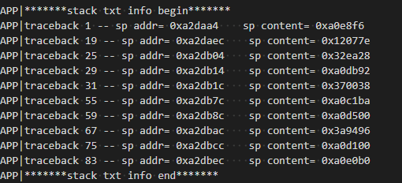

    用户根据sp content里面的指针，对照程序的反汇编asm文件查找对应的函数指令。

    > **说明：** 
    >程序的反汇编文件路径为：output/ws53/acore/ws53\_liteos\_ap/application.asm

#### 定位步骤<a name="ZH-CN_TOPIC_0000001944703309"></a>

如果从死机信息判断是CPU异常死机（看门狗挂死有额外的死机信息，见1.1.2.1），可以按照以下步骤开始排查：

1.  确认问题是否必现，结合业务场景，梳理出最精简的可复现场景。
2.  分析死机前串口打印以及对应时间点的HSO日志，相比正常流程，是否有明显异常打印，如果有，结合CPU异常信息分析异常打印原因。
3.  参考“[死机信息详细说明](#ZH-CN_TOPIC_0000001911544026)”，根据mcause、ccause、mtval获取死机的类型，根据挂死时PC指针以及CPU寄存器的值，结合汇编代码定位死机所在函数指令位置。
4.  根据调用栈信息确认异常函数调用关系，结合业务场景，从代码上下文分析死机发生根因。
5.  根据任务详细信息，如果有明显栈异常，考虑栈溢出、内存踩踏的可能性，可加大任务栈后复现对比测试。
6.  如果挂死和业务场景无关且挂死点随机，并且结合代码分析预计不可能出现该异常，可考虑从硬件供电角度分析，测试芯片电压，是否确保了芯片供电3.3V±10%。（多出现在上下电阶段）

#### 常见CPU异常死机案例<a name="ZH-CN_TOPIC_0000001911544042"></a>

-   案例1：挂死前串口有明显异常，结合串口打印分析。

    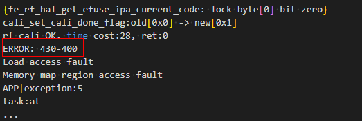

    挂死日志前有明显异常打印，结合该错误码，最终定位该异常分支有异常内存访问的问题导致挂死。

-   案例2：可以找到明确的异常指令，结合业务定位。

    已知死机时mpec =  0x8034d3cc

    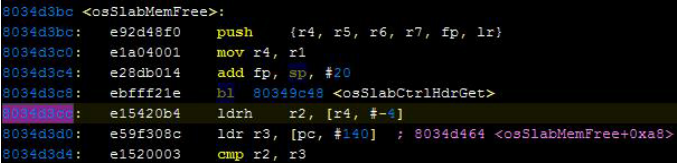

    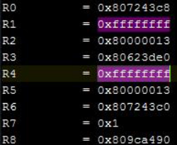

1.  打开编译后生成的asm反汇编文件。
2.  搜索PC指针在asm文件中的位置，找到当前CPU正在执行的指令行。
3.  找到异常时CPU正在执行的指令是ldrh r2, \[r4, \#-4\]， 异常发生在函数osSlabMemFree中。
4.  结合ldrh指令分析，此指令是从内存的\(r4-4\)地址中读值，将其load到寄存器r2中。再结合异常时打印的寄存器信息，查看此时r4的值 = 0xfffffff, 显然，r4的值超出了内存范围，故CPU执行到该指令时发生了数据终止异常。根据汇编知识，从asm文件可以看到，r4是从r1 mov过来，而r1是函数第二个入参，于是可以确认，在调用osSlabMemFree时传入了0xffffffff（或-1）这样一个错误入参。
5.  根据调用栈信息，找到异常时的函数调用关系如下：MNT\_buf\_send\(业务函数\)→free→LOS\_MemFree→osSlabMemFree。
6.  通过排查业务中MNT\_buf\_send实现，发现其中存在错误使用指针的问题，导致free了一个错误地址，引发上述异常。

-   案例3：上电时随机挂死，从硬件供电排查分析。

    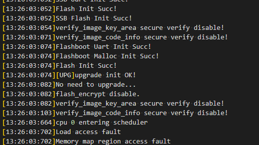

    上电时反复出现挂死，挂死mepc不固定，经过硬件分析，确认是产品单板供电有问题。

### 看门狗挂死<a name="ZH-CN_TOPIC_0000001911544018"></a>

看门狗主要用于防止系统任务异常调度问题。如在某个任务或中断中运行过久、不能在规定时间内喂狗，可以被认定为异常，引起系统主动复位进行保护。

-   **[看门狗挂死说明](#ZH-CN_TOPIC_0000001911544034)**  

-   **[定位步骤](#ZH-CN_TOPIC_0000001911424142)**  

#### 看门狗挂死说明<a name="ZH-CN_TOPIC_0000001911544034"></a>

看门狗的默认超时时间是30秒，也可以在业务中通过**uapi\_watchdog\_set\_time**接口修改**。**系统CPU如果空闲时，会自动在IdleCore00任务中做喂狗操作，防止看门狗超时。如果客户有特定业务需要长时间占用CPU，需要在业务流程中定期调用**uapi\_watchdog\_kick**接口，主动做喂狗操作。

> **说明：** 
>也可以在代码中直接修改看门狗默认超时时间：修改宏定义 WDT\_TIMEOUT\_S
>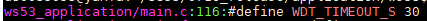

看门狗挂死的挂死日志特征如下，会打印**Oops: NMI**，表示当前的挂死是由不可屏蔽中断触发，mcause是0x8000000c。一般看门狗挂死都是由于IdleCore000任务被阻塞的导致，从任务信息可以找到当前CPU正在忙的任务，并做进一步定位。如下图所示，任务UART0\_loop\_send正在运行，且100%占用CPU，因此触发看门狗挂死。

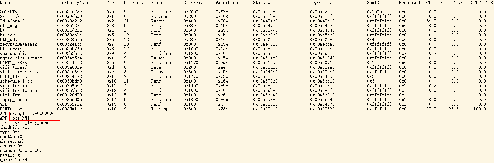

#### 定位步骤<a name="ZH-CN_TOPIC_0000001911424142"></a>

如果在用户某业务场景出现看门狗挂死，可以按照以下步骤排查：

1.  根据任务详细信息，找到阻塞Idle任务喂狗并引发看门狗挂死的任务信息。
2.  对比业务不运行的场景，确认看门狗挂死是否与该业务强相关。如果出现此情况，继续往下排查。否则需要继续找到引发该挂死的业务场景。
3.  需要排查业务是否就有长时间占用CPU的场景需求-如打流。如果出现此情况，建议用户在业务流程中增加喂狗操作，或者考虑加大看门狗超时时间。
4.  根据挂死信息的PC指针以及函数调用栈信息，排查业务代码中是否有循环体反复死循环的场景。如果出现此情况，需要用户进行进一步定位以及修改，避免死循环。
5.  根据挂死信息的PC指针以及函数调用栈信息，排查业务代码中是否有死锁的场景（详情可见“[互斥锁定位](#ZH-CN_TOPIC_0000001911544022)”）。如果出现此情况，需要进行修改。

### 业务卡死<a name="ZH-CN_TOPIC_0000001944703293"></a>

-   **[业务卡死说明](#ZH-CN_TOPIC_0000001911424134)**  

-   **[互斥锁定位](#ZH-CN_TOPIC_0000001911544022)**  

-   **[魔鬼键功能说明](#ZH-CN_TOPIC_0000001911424146)**  

#### 业务卡死说明<a name="ZH-CN_TOPIC_0000001911424134"></a>

还有一类死机问题，未触发CPU异常挂死，也未触发看门狗挂死，因此串口并不会打印挂死日志，但是业务被阻塞，串口可能有消息超时等打印，业务卡死。此类问题出现时，串口有打印说明系统中断正常，但是任务调度卡住，此时应该主动查看任务状态信息，确认CPU当前运行的任务状态。

主动查看任务信息的命令如[表1](#table1290914817145)所示。

**表 1**  查看任务状态命令

<a name="table1290914817145"></a>
<table><thead align="left"><tr id="row149101448171414"><th class="cellrowborder" valign="top" width="10.83%" id="mcps1.2.3.1.1"><p id="p149101748131414"><a name="p149101748131414"></a><a name="p149101748131414"></a>格式</p>
</th>
<th class="cellrowborder" valign="top" width="89.17%" id="mcps1.2.3.1.2"><p id="p2910948121416"><a name="p2910948121416"></a><a name="p2910948121416"></a>AT+SYSINFO</p>
</th>
</tr>
</thead>
<tbody><tr id="row7910148111415"><td class="cellrowborder" valign="top" width="10.83%" headers="mcps1.2.3.1.1 "><p id="p1891013487148"><a name="p1891013487148"></a><a name="p1891013487148"></a>参数说明</p>
</td>
<td class="cellrowborder" valign="top" width="89.17%" headers="mcps1.2.3.1.2 "><p id="p191017485142"><a name="p191017485142"></a><a name="p191017485142"></a>无，该命令会输出SDK版本信息以及任务详情</p>
</td>
</tr>
<tr id="row5910154881412"><td class="cellrowborder" valign="top" width="10.83%" headers="mcps1.2.3.1.1 "><p id="p5910548191416"><a name="p5910548191416"></a><a name="p5910548191416"></a>示例</p>
</td>
<td class="cellrowborder" valign="top" width="89.17%" headers="mcps1.2.3.1.2 "><p id="p199105480143"><a name="p199105480143"></a><a name="p199105480143"></a>AT+SYSINFO</p>
</td>
</tr>
<tr id="row1391004801410"><td class="cellrowborder" valign="top" width="10.83%" headers="mcps1.2.3.1.1 "><p id="p891094817142"><a name="p891094817142"></a><a name="p891094817142"></a>响应</p>
</td>
<td class="cellrowborder" valign="top" width="89.17%" headers="mcps1.2.3.1.2 "><a name="ul133911039151518"></a><a name="ul133911039151518"></a><ul id="ul133911039151518"><li>成功：OK</li><li>失败：INPUT_ERROR or CMD_NOT_FOUND</li></ul>
</td>
</tr>
</tbody>
</table>

示例如下：

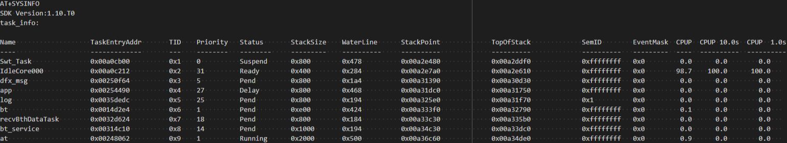

#### 互斥锁定位<a name="ZH-CN_TOPIC_0000001911544022"></a>

此类卡死问题，还有可能是由于多任务场景下，使用互斥锁不合理造成死锁问题。

-   互斥锁说明

    多任务系统使用互斥锁达到资源互斥的目的，其他任务不能强行抢占任务已经占有的资源。使用互斥锁时，可能存在任务间相互等对方释放资源的情况，从而造成死锁。死锁会使任务陷入无限循环等待，导致业务功能障碍。

-   互斥锁死锁检测机制

    任务发生死锁后，无法得到调度，通过记录任务上次调度的时间，设置一个超时时间阈值，如果任务在这段时间内都没有得到调度，则怀疑该任务发生了死锁。

    配置宏LOSCFG\_DEBUG\_DEADLOCK，该宏开关可以通过make menuconfig在菜单项中开启“Enable Mutex Deadlock Debugging”使能，若关闭该菜单项，则关闭死锁检测功能。

    Debug ---\> Enable a Debug Version ---\> Enable Debug LiteOS Kernel Resource ---\> Enable Mutex Deadlock Debugging

#### 魔鬼键功能说明<a name="ZH-CN_TOPIC_0000001911424146"></a>

**使用场景<a name="section203637445525"></a>**

系统未输出挂死相关信息，但是无响应时，可以通过魔法键查看中断是否有响应。在中断有响应的情况下，可以通过魔法键查看task信息中 的CPUP（CPU占用率），找到是哪个任务长时间占用CPU导致系统其他任务无响应（一般为比较高优先级任务一直抢占CPU，导致低优先级任务无响应）。

**功能说明<a name="section41931752185213"></a>**

在UART中断和USB转虚拟串口中断中，嵌入魔法键检查功能，对特殊按键进行识别，输出相关信息。

**使用方法<a name="section1145913185312"></a>**

1.  在kernel/liteos/liteos\_v208.5.0路径下，通过python3 show\_menuconfig.py ws53命令开启魔法键功能。
    1.  该功能依赖于Shell，所以需要先使能Shell。

        Debug ---\> Enable a Debug Version ---\> Enable Shell

    2.  该功能需要配置LOSCFG\_ENABLE\_MAGICKEY=y，若关闭该选项，则魔法键失效，开启该宏开关的菜单项为：

        Debug ---\> Enable MAGIC KEY

        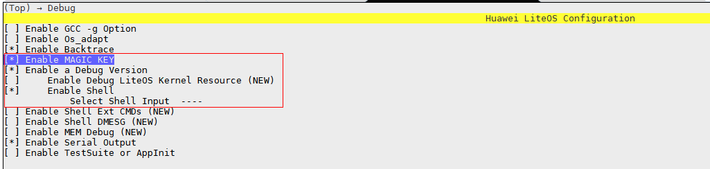

2.  输入“ctrl + r ” 键，打开或者关闭魔法键检测功能。
    1.  在连接UART或者USB转虚拟串口的情况下，输入“ctrl + r ” 键，打开魔法键检测功能，输出 “Magic key on”；再输入一次后，则关闭魔法键检测功能，输出“Magic key off”。魔法键功能如下：

        ● ctrl + z：帮助键，输出相关魔法键简单介绍。

        ● ctrl + t：输出任务相关信息。

        ● ctrl + p：系统主动进入panic，输出panic相关信息后，系统会挂住。

        ● ctrl + e：系统进行简单的内存池完整性检查，检查发现错误则输出相关错误信息，检查正常则输出“system memcheck over, all passed!”。

### 离线挂死信息<a name="ZH-CN_TOPIC_0000001944703289"></a>

在某些场景，由于未连接串口线，或者串口在挂死时本身出现异常时，导致第一手挂死日志信息缺失。为了避免此情况，软件会在挂死后将所有挂死信息也保存一份到FLASH中，WS53提供一块8K的FLASH分区用于保存挂死信息，并提供了相应的维测命令，可以在单板重启后，将挂死信息重新输出。

> **说明：** 
>Crash信息保存区的分区：地址范围【0x07FA000，0x07FC000】
>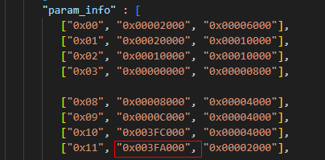

**表 1**  查看任务状态命令

<a name="table1290914817145"></a>
<table><thead align="left"><tr id="row149101448171414"><th class="cellrowborder" valign="top" width="10.83%" id="mcps1.2.3.1.1"><p id="p149101748131414"><a name="p149101748131414"></a><a name="p149101748131414"></a>格式</p>
</th>
<th class="cellrowborder" valign="top" width="89.17%" id="mcps1.2.3.1.2"><p id="p8060118"><a name="p8060118"></a><a name="p8060118"></a>AT+DUMP</p>
</th>
</tr>
</thead>
<tbody><tr id="row7910148111415"><td class="cellrowborder" valign="top" width="10.83%" headers="mcps1.2.3.1.1 "><p id="p1891013487148"><a name="p1891013487148"></a><a name="p1891013487148"></a>参数说明</p>
</td>
<td class="cellrowborder" valign="top" width="89.17%" headers="mcps1.2.3.1.2 "><p id="p191017485142"><a name="p191017485142"></a><a name="p191017485142"></a>无，如果之前有挂死过，输出前一次的挂死信息；如果没有挂死过，输出No crash dump found!</p>
</td>
</tr>
<tr id="row5910154881412"><td class="cellrowborder" valign="top" width="10.83%" headers="mcps1.2.3.1.1 "><p id="p5910548191416"><a name="p5910548191416"></a><a name="p5910548191416"></a>示例</p>
</td>
<td class="cellrowborder" valign="top" width="89.17%" headers="mcps1.2.3.1.2 "><p id="p711491218117"><a name="p711491218117"></a><a name="p711491218117"></a>AT+DUMP</p>
</td>
</tr>
<tr id="row1391004801410"><td class="cellrowborder" valign="top" width="10.83%" headers="mcps1.2.3.1.1 "><p id="p891094817142"><a name="p891094817142"></a><a name="p891094817142"></a>响应</p>
</td>
<td class="cellrowborder" valign="top" width="89.17%" headers="mcps1.2.3.1.2 "><a name="ul133911039151518"></a><a name="ul133911039151518"></a><ul id="ul133911039151518"><li>成功：OK</li><li>失败：INPUT_ERROR or CMD_NOT_FOUND</li></ul>
</td>
</tr>
</tbody>
</table>

示例如下：

AT+DUMP

APP|--------------Last Crash info dump--------------

APP|task:at

thrdPid:0x7

type:0x7

nestCnt:1

phase:Task

ccause:0x7

mcause:0x7

mtval:0x0

gp:0x20014c2a

mstatus:0x1880

mepc:0x5538de

ra:0x48dca2

sp:0x20026c30

tp:0x0

t0:0x20027d74

t1:0x22af8

t2:0x0

s0:0x25580

s1:0xd

a0:0x0

a1:0x20026cbe

a2:0x80808080

a3:0xbbffafb3

a4:0x6

a5:0x5538de

a6:0x20027d74

a7:0x23a28

s2:0x200319fc

s3:0xc0c0c0c

s4:0x0

s5:0xa0a0a0a

s6:0x9090909

s7:0x8080808

s8:0x7070707

s9:0x6060606

s10:0x5050505

s11:0x4040404

t3:0x26cfc

t4:0x20026c80

t5:0x23848

t6:0x23a28

APP|cxcptsc = 0x7

APP|sp addr= 0x20026c6c    sp content= 0x25580

APP|sp addr= 0x20026c70    sp content= 0x23a28

APP|sp addr= 0x20026c74    sp content= 0x23848

APP|sp addr= 0x20026c7c    sp content= 0x26cfc

APP|sp addr= 0x20026c80    sp content= 0x23a28

APP|sp addr= 0x20026ca4    sp content= 0x22af8

APP|sp addr= 0x20026cac    sp content= 0x48dca2

APP|sp addr= 0x20026cd4    sp content= 0x25578

APP|sp addr= 0x20026cdc    sp content= 0x48d554

APP|sp addr= 0x20026cf4    sp content= 0x23a28

APP|acore\_cpu\_trace\_print: addr:0x20021e78-0x2002225c, len:996, sample\_done\_addr\[0x0\] .

APP|acore\_cpu\_trace 0 --- addr 0x20021e78, time: 0x46f7ec, LR: 0xa14932e0, PC: 0x48d470.

APP|acore\_cpu\_trace 1 --- addr 0x20021e84, time: 0x46f7ec, LR: 0xa14933ba, PC: 0x48d470.

APP|acore\_cpu\_trace 2 --- addr 0x20021e90, time: 0x46f7ec, LR: 0xa1493493, PC: 0x48d470.

APP|acore\_cpu\_trace 3 --- addr 0x20021e9c, time: 0x46f7ec, LR: 0xa149356d, PC: 0x48d470.

APP|acore\_cpu\_trace 4 --- addr 0x20021ea8, time: 0x46f7ec, LR: 0xa1493646, PC: 0x48d470.

APP|acore\_cpu\_trace 5 --- addr 0x20021eb4, time: 0x46f7ec, LR: 0xa1493720, PC: 0x48d470.

APP|acore\_cpu\_trace 6 --- addr 0x20021ec0, time: 0x46f7ec, LR: 0xa14938b0, PC: 0x48d470.

APP|acore\_cpu\_trace 7 --- addr 0x20021ecc, time: 0x46f7ec, LR: 0xa1493a40, PC: 0x48d470.

APP|acore\_cpu\_trace 8 --- addr 0x20021ed8, time: 0x46f7ec, LR: 0xa1493a62, PC: 0x48d470.

APP|acore\_cpu\_trace 9 --- addr 0x20021ee4, time: 0x46f7ec, LR: 0xa1493b3b, PC: 0x48d470.

APP|acore\_cpu\_trace 10 --- addr 0x20021ef0, time: 0x46f7ec, LR: 0xa1493c15, PC: 0x48d470.

APP|acore\_cpu\_trace 11 --- addr 0x20021efc, time: 0x46f7ec, LR: 0xa1493da6, PC: 0x48d470.

APP|acore\_cpu\_trace 12 --- addr 0x20021f08, time: 0x46f7ec, LR: 0xa1493e7f, PC: 0x48d470.

APP|acore\_cpu\_trace 13 --- addr 0x20021f14, time: 0x46f7ec, LR: 0xa1493f59, PC: 0x48d470.

APP|acore\_cpu\_trace 14 --- addr 0x20021f20, time: 0x46f7ec, LR: 0xa1494032, PC: 0x48d470.

APP|acore\_cpu\_trace 15 --- addr 0x20021f2c, time: 0x46f7ec, LR: 0xa14941c2, PC: 0x48d470.

APP|acore\_cpu\_trace 16 --- addr 0x20021f38, time: 0x46f7ec, LR: 0xa14941e4, PC: 0x48d470.

APP|acore\_cpu\_trace 17 --- addr 0x20021f44, time: 0x46f7ec, LR: 0xa14942be, PC: 0x48d470.

APP|acore\_cpu\_trace 18 --- addr 0x20021f50, time: 0x46f7ec, LR: 0xa149444f, PC: 0x48d470.

APP|acore\_cpu\_trace 19 --- addr 0x20021f5c, time: 0x46f7ec, LR: 0xa14945df, PC: 0x48d470.

APP|acore\_cpu\_trace 20 --- addr 0x20021f68, time: 0x46f7ec, LR: 0xa14946b8, PC: 0x48d470.

APP|acore\_cpu\_trace 21 --- addr 0x20021f74, time: 0x46f7ec, LR: 0xa1494792, PC: 0x48d470.

APP|acore\_cpu\_trace 22 --- addr 0x20021f80, time: 0x46f7ec, LR: 0xa149486b, PC: 0x48d470.

APP|acore\_cpu\_trace 23 --- addr 0x20021f8c, time: 0x46f7ec, LR: 0xa1494945, PC: 0x48d470.

APP|acore\_cpu\_trace 24 --- addr 0x20021f98, time: 0x46f7ec, LR: 0xa1494967, PC: 0x48d470.

APP|acore\_cpu\_trace 25 --- addr 0x20021fa4, time: 0x46f7ec, LR: 0xa1494a40, PC: 0x48d470.

APP|acore\_cpu\_trace 26 --- addr 0x20021fb0, time: 0x46f7ec, LR: 0xa1494b1a, PC: 0x48d470.

APP|acore\_cpu\_trace 27 --- addr 0x20021fbc, time: 0x46f7ec, LR: 0xa1494cab, PC: 0x48d470.

APP|acore\_cpu\_trace 28 --- addr 0x20021fc8, time: 0x46f7ec, LR: 0xa1494d84, PC: 0x48d470.

APP|acore\_cpu\_trace 29 --- addr 0x20021fd4, time: 0x46f7ec, LR: 0xa1494e5e, PC: 0x48d470.

APP|acore\_cpu\_trace 30 --- addr 0x20021fe0, time: 0x46f7ec, LR: 0xa1494f37, PC: 0x48d470.

APP|acore\_cpu\_trace 31 --- addr 0x20021fec, time: 0x46f7ec, LR: 0xa14950c7, PC: 0x48d470.

APP|acore\_cpu\_trace 32 --- addr 0x20021ff8, time: 0x46f7ec, LR: 0xa14950e9, PC: 0x48d470.

APP|acore\_cpu\_trace 33 --- addr 0x20022004, time: 0x46f7ec, LR: 0xa14951c3, PC: 0x48d470.

APP|acore\_cpu\_trace 34 --- addr 0x20022010, time: 0x46f7ec, LR: 0xa149529c, PC: 0x48d470.

APP|acore\_cpu\_trace 35 --- addr 0x2002201c, time: 0x46f7ec, LR: 0xa1495377, PC: 0x48d470.

APP|acore\_cpu\_trace 36 --- addr 0x20022028, time: 0x46f7ec, LR: 0xa1495450, PC: 0x48d470.

APP|acore\_cpu\_trace 37 --- addr 0x20022034, time: 0x46f7ec, LR: 0xa149552a, PC: 0x48d470.

APP|acore\_cpu\_trace 38 --- addr 0x20022040, time: 0x46f7ec, LR: 0xa14956ba, PC: 0x48d470.

APP|acore\_cpu\_trace 39 --- addr 0x2002204c, time: 0x46f7ec, LR: 0xa1495793, PC: 0x48d470.

APP|acore\_cpu\_trace 40 --- addr 0x20022058, time: 0x46f7ec, LR: 0xa14957b5, PC: 0x48d470.

APP|acore\_cpu\_trace 41 --- addr 0x20022064, time: 0x46f7ec, LR: 0xa1495897, PC: 0x48d470.

APP|acore\_cpu\_trace 42 --- addr 0x20022070, time: 0x46f7ec, LR: 0xa149597a, PC: 0x48d470.

APP|acore\_cpu\_trace 43 --- addr 0x2002207c, time: 0x46f7ec, LR: 0xa1495b0b, PC: 0x48d470.

APP|acore\_cpu\_trace 44 --- addr 0x20022088, time: 0x46f7ec, LR: 0xa1495be4, PC: 0x48d470.

APP|acore\_cpu\_trace 45 --- addr 0x20022094, time: 0x46f7ec, LR: 0xa1495cbe, PC: 0x48d470.

APP|acore\_cpu\_trace 46 --- addr 0x200220a0, time: 0x46f7ec, LR: 0xa1495d97, PC: 0x48d470.

APP|acore\_cpu\_trace 47 --- addr 0x200220ac, time: 0x46f7ec, LR: 0xa1495f27, PC: 0x48d470.

APP|acore\_cpu\_trace 48 --- addr 0x200220b8, time: 0x46f7ec, LR: 0xa1495f49, PC: 0x48d470.

APP|acore\_cpu\_trace 49 --- addr 0x200220c4, time: 0x46f7ec, LR: 0xa1496023, PC: 0x48d470.

APP|acore\_cpu\_trace 50 --- addr 0x200220d0, time: 0x46f7ec, LR: 0xa14960fc, PC: 0x48d470.

APP|acore\_cpu\_trace 51 --- addr 0x200220dc, time: 0x46f7ec, LR: 0xa14961d7, PC: 0x48d470.

APP|acore\_cpu\_trace 52 --- addr 0x200220e8, time: 0x46f7ec, LR: 0xa1496367, PC: 0x48d470.

APP|acore\_cpu\_trace 53 --- addr 0x200220f4, time: 0x46f7ec, LR: 0xa1496440, PC: 0x48d470.

APP|acore\_cpu\_trace 54 --- addr 0x20022100, time: 0x46f7ec, LR: 0xa149651a, PC: 0x48d470.

APP|acore\_cpu\_trace 55 --- addr 0x2002210c, time: 0x46f7ec, LR: 0xa14965f3, PC: 0x48d470.

APP|acore\_cpu\_trace 56 --- addr 0x20022118, time: 0x46f7ec, LR: 0xa1496615, PC: 0x48d470.

APP|acore\_cpu\_trace 57 --- addr 0x20022124, time: 0x46f7ec, LR: 0xa14966ef, PC: 0x48d470.

APP|acore\_cpu\_trace 58 --- addr 0x20022130, time: 0x46f7ec, LR: 0xa1496880, PC: 0x48d470.

APP|acore\_cpu\_trace 59 --- addr 0x2002213c, time: 0x46f7ec, LR: 0xa149695b, PC: 0x48d470.

APP|acore\_cpu\_trace 60 --- addr 0x20022148, time: 0x46f7ec, LR: 0xa1496a34, PC: 0x48d470.

APP|acore\_cpu\_trace 61 --- addr 0x20022154, time: 0x46f7ec, LR: 0xa1496b0e, PC: 0x48d470.

APP|acore\_cpu\_trace 62 --- addr 0x20022160, time: 0x46f7ec, LR: 0xa1496bfb, PC: 0x48d47c.

APP|acore\_cpu\_trace 63 --- addr 0x2002216c, time: 0x20df0, LR: 0xa1496c3f, PC: 0x48dc22.

APP|acore\_cpu\_trace 64 --- addr 0x20022178, time: 0x48d48e, LR: 0xa1496c47, PC: 0x48dc30.

APP|acore\_cpu\_trace 65 --- addr 0x20022184, time: 0x48dc2e, LR: 0xa149724d, PC: 0x48dca2.

APP|acore\_cpu\_trace 66 --- addr 0x20022190, time: 0x48dca0, LR: 0xa14978ad, PC: 0x46c928.

APP|acore\_cpu\_trace 67 --- addr 0x2002219c, time: 0x46c926, LR: 0xa1497c55, PC: 0x46ccba.

APP|acore\_cpu\_trace 68 --- addr 0x200221a8, time: 0x46ccb8, LR: 0xa149233e, PC: 0x48d470.

APP|acore\_cpu\_trace 69 --- addr 0x200221b4, time: 0x46f7ec, LR: 0xa14924ce, PC: 0x48d470.

APP|acore\_cpu\_trace 70 --- addr 0x200221c0, time: 0x46f7ec, LR: 0xa14925a7, PC: 0x48d470.

APP|acore\_cpu\_trace 71 --- addr 0x200221cc, time: 0x46f7ec, LR: 0xa1492681, PC: 0x48d470.

APP|acore\_cpu\_trace 72 --- addr 0x200221d8, time: 0x46f7ec, LR: 0xa1492811, PC: 0x48d470.

APP|acore\_cpu\_trace 73 --- addr 0x200221e4, time: 0x46f7ec, LR: 0xa1492833, PC: 0x48d470.

APP|acore\_cpu\_trace 74 --- addr 0x200221f0, time: 0x46f7ec, LR: 0xa149290c, PC: 0x48d470.

APP|acore\_cpu\_trace 75 --- addr 0x200221fc, time: 0x46f7ec, LR: 0xa1492a9c, PC: 0x48d470.

APP|acore\_cpu\_trace 76 --- addr 0x20022208, time: 0x46f7ec, LR: 0xa1492b76, PC: 0x48d470.

APP|acore\_cpu\_trace 77 --- addr 0x20022214, time: 0x46f7ec, LR: 0xa1492c59, PC: 0x48d470.

APP|acore\_cpu\_trace 78 --- addr 0x20022220, time: 0x46f7ec, LR: 0xa1492de9, PC: 0x48d470.

APP|acore\_cpu\_trace 79 --- addr 0x2002222c, time: 0x46f7ec, LR: 0xa1492f79, PC: 0x48d470.

APP|acore\_cpu\_trace 80 --- addr 0x20022238, time: 0x46f7ec, LR: 0xa1493054, PC: 0x48d470.

APP|acore\_cpu\_trace 81 --- addr 0x20022244, time: 0x46f7ec, LR: 0xa149312d, PC: 0x48d470.

APP|acore\_cpu\_trace 82 --- addr 0x20022250, time: 0x46f7ec, LR: 0xa1493207, PC: 0x48d470.

APP|=================before low power suspend data==================.

APP|acore\_cpu\_trace\_print: addr:0x20021a94-0x20021e78, len:996, sample\_done\_addr\[0x0\] .

APP|acore\_cpu\_trace 0 --- addr 0x20021a94, time: 0xacac3d3b, LR: 0x28fc4, PC: 0x28d54.

APP|acore\_cpu\_trace 1 --- addr 0x20021aa0, time: 0xacac3db5, LR: 0x28fc4, PC: 0x28d00.

APP|acore\_cpu\_trace 2 --- addr 0x20021aac, time: 0xacac3dbe, LR: 0x28d12, PC: 0x20d38.

APP|acore\_cpu\_trace 3 --- addr 0x20021ab8, time: 0xacac3e49, LR: 0x28fc4, PC: 0x28d54.

APP|acore\_cpu\_trace 4 --- addr 0x20021ac4, time: 0xacac3ec3, LR: 0x28fc4, PC: 0x28d00.

APP|acore\_cpu\_trace 5 --- addr 0x20021ad0, time: 0xacac3ecc, LR: 0x28d12, PC: 0x20d38.

APP|acore\_cpu\_trace 6 --- addr 0x20021adc, time: 0xacac3f59, LR: 0x28fc4, PC: 0x28d54.

APP|acore\_cpu\_trace 7 --- addr 0x20021ae8, time: 0xacac3fd1, LR: 0x28fc4, PC: 0x28d00.

APP|acore\_cpu\_trace 8 --- addr 0x20021af4, time: 0xacac3fda, LR: 0x28d12, PC: 0x20d38.

APP|acore\_cpu\_trace 9 --- addr 0x20021b00, time: 0xacac4065, LR: 0x28fc4, PC: 0x28d54.

APP|acore\_cpu\_trace 10 --- addr 0x20021b0c, time: 0xacac40df, LR: 0x28fc4, PC: 0x28d00.

APP|acore\_cpu\_trace 11 --- addr 0x20021b18, time: 0xacac40e8, LR: 0x28d12, PC: 0x20d38.

APP|acore\_cpu\_trace 12 --- addr 0x20021b24, time: 0xacac4173, LR: 0x28fc4, PC: 0x28d54.

APP|acore\_cpu\_trace 13 --- addr 0x20021b30, time: 0xacac41ed, LR: 0x28fc4, PC: 0x28d00.

APP|acore\_cpu\_trace 14 --- addr 0x20021b3c, time: 0xacac41f6, LR: 0x28d12, PC: 0x20d38.

APP|acore\_cpu\_trace 15 --- addr 0x20021b48, time: 0xacac4283, LR: 0x28fc4, PC: 0x28d54.

APP|acore\_cpu\_trace 16 --- addr 0x20021b54, time: 0xacac42fb, LR: 0x28fc4, PC: 0x28d00.

APP|acore\_cpu\_trace 17 --- addr 0x20021b60, time: 0xacac4304, LR: 0x28d12, PC: 0x20d38.

APP|acore\_cpu\_trace 18 --- addr 0x20021b6c, time: 0xacac438f, LR: 0x28fc4, PC: 0x28d54.

APP|acore\_cpu\_trace 19 --- addr 0x20021b78, time: 0xacac4409, LR: 0x28fc4, PC: 0x28d00.

APP|acore\_cpu\_trace 20 --- addr 0x20021b84, time: 0xacac4412, LR: 0x28d12, PC: 0x20d38.

APP|acore\_cpu\_trace 21 --- addr 0x20021b90, time: 0xacac444f, LR: 0x28fc4, PC: 0x28d54.

APP|acore\_cpu\_trace 22 --- addr 0x20021b9c, time: 0xacac4484, LR: 0x28fc4, PC: 0x28d00.

APP|acore\_cpu\_trace 23 --- addr 0x20021ba8, time: 0xacac448d, LR: 0x28d12, PC: 0x20d38.

APP|acore\_cpu\_trace 24 --- addr 0x20021bb4, time: 0xacac4519, LR: 0x28fc4, PC: 0x28d54.

APP|acore\_cpu\_trace 25 --- addr 0x20021bc0, time: 0xacac4592, LR: 0x28fc4, PC: 0x28d00.

APP|acore\_cpu\_trace 26 --- addr 0x20021bcc, time: 0xacac459b, LR: 0x28d12, PC: 0x20d38.

APP|acore\_cpu\_trace 27 --- addr 0x20021bd8, time: 0xacac4627, LR: 0x28fc4, PC: 0x28d54.

APP|acore\_cpu\_trace 28 --- addr 0x20021be4, time: 0xacac46a0, LR: 0x28fc4, PC: 0x28d00.

APP|acore\_cpu\_trace 29 --- addr 0x20021bf0, time: 0xacac46a9, LR: 0x28d12, PC: 0x20d38.

APP|acore\_cpu\_trace 30 --- addr 0x20021bfc, time: 0xacac4735, LR: 0x28fc4, PC: 0x28d54.

APP|acore\_cpu\_trace 31 --- addr 0x20021c08, time: 0xacac47ae, LR: 0x28fc4, PC: 0x28d00.

APP|acore\_cpu\_trace 32 --- addr 0x20021c14, time: 0xacac47b7, LR: 0x28d12, PC: 0x20d38.

APP|acore\_cpu\_trace 33 --- addr 0x20021c20, time: 0xacac4843, LR: 0x28fc4, PC: 0x28d54.

APP|acore\_cpu\_trace 34 --- addr 0x20021c2c, time: 0xacac48bc, LR: 0x28fc4, PC: 0x28d00.

APP|acore\_cpu\_trace 35 --- addr 0x20021c38, time: 0xacac48c5, LR: 0x28d12, PC: 0x20d38.

APP|acore\_cpu\_trace 36 --- addr 0x20021c44, time: 0xacac4902, LR: 0x28fc4, PC: 0x28d54.

APP|acore\_cpu\_trace 37 --- addr 0x20021c50, time: 0xacac4938, LR: 0x28fc4, PC: 0x28d00.

APP|acore\_cpu\_trace 38 --- addr 0x20021c5c, time: 0xacac4941, LR: 0x28d12, PC: 0x20d38.

APP|acore\_cpu\_trace 39 --- addr 0x20021c68, time: 0xacac497e, LR: 0x28fc4, PC: 0x28d54.

APP|acore\_cpu\_trace 40 --- addr 0x20021c74, time: 0xacac49b4, LR: 0x28fc4, PC: 0x28d00.

APP|acore\_cpu\_trace 41 --- addr 0x20021c80, time: 0xacac49bd, LR: 0x28d12, PC: 0x20d38.

APP|acore\_cpu\_trace 42 --- addr 0x20021c8c, time: 0xacac4a48, LR: 0x28fc4, PC: 0x28d54.

APP|acore\_cpu\_trace 43 --- addr 0x20021c98, time: 0xacac4ac6, LR: 0x28fc4, PC: 0x28d00.

APP|acore\_cpu\_trace 44 --- addr 0x20021ca4, time: 0xacac4acf, LR: 0x28d12, PC: 0x20d38.

APP|acore\_cpu\_trace 45 --- addr 0x20021cb0, time: 0xacac4b5c, LR: 0x28fc4, PC: 0x28d54.

APP|acore\_cpu\_trace 46 --- addr 0x20021cbc, time: 0xacac4bd4, LR: 0x28fc4, PC: 0x28d00.

APP|acore\_cpu\_trace 47 --- addr 0x20021cc8, time: 0xacac4bdd, LR: 0x28d12, PC: 0x20d38.

APP|acore\_cpu\_trace 48 --- addr 0x20021cd4, time: 0xacac4c68, LR: 0x28fc4, PC: 0x28d54.

APP|acore\_cpu\_trace 49 --- addr 0x20021ce0, time: 0xacac4ce2, LR: 0x28fc4, PC: 0x28d00.

APP|acore\_cpu\_trace 50 --- addr 0x20021cec, time: 0xacac4ceb, LR: 0x28d12, PC: 0x20d38.

APP|acore\_cpu\_trace 51 --- addr 0x20021cf8, time: 0xacac4d7a, LR: 0x28fc4, PC: 0x28d54.

APP|acore\_cpu\_trace 52 --- addr 0x20021d04, time: 0xacac4dae, LR: 0x28fe2, PC: 0x28fde.

APP|acore\_cpu\_trace 53 --- addr 0x20021d10, time: 0xacac4e90, LR: 0x28964, PC: 0x28fe6.

APP|acore\_cpu\_trace 54 --- addr 0x20021d1c, time: 0xacac4e97, LR: 0x2896a, PC: 0x289c0.

APP|acore\_cpu\_trace 55 --- addr 0x20021d28, time: 0xacac4f8c, LR: 0x2897a, PC: 0x28978.

APP|acore\_cpu\_trace 56 --- addr 0x20021d34, time: 0xacac3387, LR: 0x1b438, PC: 0x20d80.

APP|acore\_cpu\_trace 57 --- addr 0x20021d40, time: 0xacac338c, LR: 0x281e0, PC: 0x282f8.

APP|acore\_cpu\_trace 58 --- addr 0x20021d4c, time: 0xacac348b, LR: 0x1b438, PC: 0x281e4.

APP|acore\_cpu\_trace 59 --- addr 0x20021d58, time: 0xacac349c, LR: 0x1b45e, PC: 0x1b45c.

APP|acore\_cpu\_trace 60 --- addr 0x20021d64, time: 0xacac34aa, LR: 0x1fbb6, PC: 0x1fc30.

APP|acore\_cpu\_trace 61 --- addr 0x20021d70, time: 0xacac35c2, LR: 0x1b45e, PC: 0x1fbbc.

APP|acore\_cpu\_trace 62 --- addr 0x20021d7c, time: 0xacac35c9, LR: 0x1b448, PC: 0x1b444.

APP|acore\_cpu\_trace 63 --- addr 0x20021d88, time: 0xacac35d0, LR: 0x281f4, PC: 0x28310.

APP|acore\_cpu\_trace 64 --- addr 0x20021d94, time: 0xacac35e2, LR: 0x1b448, PC: 0x281f8.

APP|acore\_cpu\_trace 65 --- addr 0x20021da0, time: 0xacac35eb, LR: 0x28f58, PC: 0x1b44c.

APP|acore\_cpu\_trace 66 --- addr 0x20021dac, time: 0xacac375d, LR: 0x28fc4, PC: 0x28d00.

APP|acore\_cpu\_trace 67 --- addr 0x20021db8, time: 0xacac3766, LR: 0x28d12, PC: 0x20d38.

APP|acore\_cpu\_trace 68 --- addr 0x20021dc4, time: 0xacac37f1, LR: 0x28fc4, PC: 0x28d54.

APP|acore\_cpu\_trace 69 --- addr 0x20021dd0, time: 0xacac386f, LR: 0x28fc4, PC: 0x28d00.

APP|acore\_cpu\_trace 70 --- addr 0x20021ddc, time: 0xacac3878, LR: 0x28d12, PC: 0x20d38.

APP|acore\_cpu\_trace 71 --- addr 0x20021de8, time: 0xacac3903, LR: 0x28fc4, PC: 0x28d54.

APP|acore\_cpu\_trace 72 --- addr 0x20021df4, time: 0xacac397d, LR: 0x28fc4, PC: 0x28d00.

APP|acore\_cpu\_trace 73 --- addr 0x20021e00, time: 0xacac3986, LR: 0x28d12, PC: 0x20d38.

APP|acore\_cpu\_trace 74 --- addr 0x20021e0c, time: 0xacac3a11, LR: 0x28fc4, PC: 0x28d54.

APP|acore\_cpu\_trace 75 --- addr 0x20021e18, time: 0xacac3a8b, LR: 0x28fc4, PC: 0x28d00.

APP|acore\_cpu\_trace 76 --- addr 0x20021e24, time: 0xacac3a94, LR: 0x28d12, PC: 0x20d38.

APP|acore\_cpu\_trace 77 --- addr 0x20021e30, time: 0xacac3b1f, LR: 0x28fc4, PC: 0x28d54.

APP|acore\_cpu\_trace 78 --- addr 0x20021e3c, time: 0xacac3b99, LR: 0x28fc4, PC: 0x28d00.

APP|acore\_cpu\_trace 79 --- addr 0x20021e48, time: 0xacac3ba2, LR: 0x28d12, PC: 0x20d38.

APP|acore\_cpu\_trace 80 --- addr 0x20021e54, time: 0xacac3c2d, LR: 0x28fc4, PC: 0x28d54.

APP|acore\_cpu\_trace 81 --- addr 0x20021e60, time: 0xacac3ca7, LR: 0x28fc4, PC: 0x28d00.

APP|acore\_cpu\_trace 82 --- addr 0x20021e6c, time: 0xacac3cb0, LR: 0x28d12, PC: 0x20d38.

APP|--------------Last Crash info dump end--------------

-   **[挂死信息导出](#ZH-CN_TOPIC_0000001944703285)**  

-   **[挂死信息解析](#ZH-CN_TOPIC_0000001944703305)**  

#### 挂死信息导出<a name="ZH-CN_TOPIC_0000001944703285"></a>

如果串口或者AT命令不可用，无法通过AT+DUMP查看挂死信息，还可以通过HSO工具导出挂死日志。

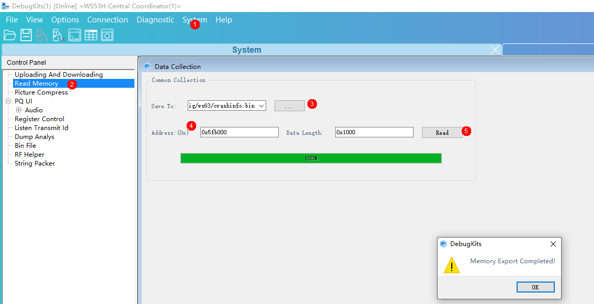

1.  打开HSO工具DebugKits，连接WS53。
2.  打开System菜单，选择Read Memory功能项。
3.  选择保存日志路径以及名字，导出路径为build\\config\\target\_config\\ws53\\，文件命名为crashinfo.bin。
4.  填写需要导出的地址以及长度，地址为crash分区地址0x7fa000, 长度为0x2000。
5.  点击Read按钮导出。

#### 挂死信息解析<a name="ZH-CN_TOPIC_0000001944703305"></a>

1.  进入文件夹 build\\config\\target\_config\\ws53。确定该目录下有crash\_info.py以及crashinfo.bin文件。
2.  在python环境下执行脚本：python crash\_info.py。脚本执行完成后，生成crashinfo.txt，该文件就是解析完成的挂死信息。

示例如下：

执行脚本，解析crashinfo.bin


解析完成，生成crashinfo.txt

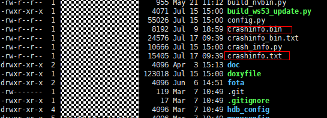

生成的crashinfo.txt内容如下

0xdeadbeef

task\_name:at

==== EXC INFO ====

phase:Task

type:0x7

faultAddr:0x0

thrdPid:0x7

nestCnt:0x1

reserved:0x0

context:0x20026c80

==== EXC CONTEXT INFO ====

ccause:0x7

mcause:0x7

mtval:0x0

gp:0x20014c22

mstatus:0x1880

mepc:0x553546

ra:0x48dc5e

sp:0x20026c90

tp:0x0

t0:0x20027ddc

t1:0x22af8

t2:0x0

s0:0x25580

s1:0xd

a0:0x0

a1:0x20026d1e

a2:0x80808080

a3:0xbbffafb3

a4:0x6

a5:0x553546

a6:0x20027ddc

a7:0x23a28

s2:0x20031a34

s3:0xc0c0c0c

s4:0x0

s5:0xa0a0a0a

s6:0x9090909

s7:0x8080808

s8:0x7070707

s9:0x6060606

s10:0x5050505

s11:0x4040404

t3:0x26cec

t4:0x20026ce0

t5:0x23848

t6:0x23a28

cxcptsc :0x7

==== BACKTRACE INFO ====

backtrace count:10

sp addr : 0x20026ccc , sp content : 0x25580

sp addr : 0x20026cd0 , sp content : 0x23a28

sp addr : 0x20026cd4 , sp content : 0x23848

sp addr : 0x20026cdc , sp content : 0x26cec

sp addr : 0x20026ce0 , sp content : 0x23a28

sp addr : 0x20026d04 , sp content : 0x22af8

sp addr : 0x20026d0c , sp content : 0x48dc5e

sp addr : 0x20026d34 , sp content : 0x25578

sp addr : 0x20026d3c , sp content : 0x48d510

sp addr : 0x20026d54 , sp content : 0x23a28

acore\_cpu\_trace\_print: addr:0x20021ee0 - 0x200222c4, len:996, sample\_done\_addr:0x0

acore\_cpu\_trace 0 --- addr 0x20021ee0, time: 0xa89ee5bf, LR: 0x48d42c, PC: 0x46f7ac.

acore\_cpu\_trace 1 --- addr 0x20021eec, time: 0xa89ee699, LR: 0x48d42c, PC: 0x46f7ac.

acore\_cpu\_trace 2 --- addr 0x20021ef8, time: 0xa89ee77c, LR: 0x48d42c, PC: 0x46f7ac.

acore\_cpu\_trace 3 --- addr 0x20021f04, time: 0xa89ee860, LR: 0x48d42c, PC: 0x46f7ac.

acore\_cpu\_trace 4 --- addr 0x20021f10, time: 0xa89ee9f0, LR: 0x48d42c, PC: 0x46f7ac.

acore\_cpu\_trace 5 --- addr 0x20021f1c, time: 0xa89eea12, LR: 0x48d42c, PC: 0x46f7ac.

acore\_cpu\_trace 6 --- addr 0x20021f28, time: 0xa89eeba3, LR: 0x48d42c, PC: 0x46f7ac.

acore\_cpu\_trace 7 --- addr 0x20021f34, time: 0xa89eec7c, LR: 0x48d42c, PC: 0x46f7ac.

acore\_cpu\_trace 8 --- addr 0x20021f40, time: 0xa89eed56, LR: 0x48d42c, PC: 0x46f7ac.

acore\_cpu\_trace 9 --- addr 0x20021f4c, time: 0xa89eee2f, LR: 0x48d42c, PC: 0x46f7ac.

acore\_cpu\_trace 10 --- addr 0x20021f58, time: 0xa89eef09, LR: 0x48d42c, PC: 0x46f7ac.

acore\_cpu\_trace 11 --- addr 0x20021f64, time: 0xa89ef099, LR: 0x48d42c, PC: 0x46f7ac.

acore\_cpu\_trace 12 --- addr 0x20021f70, time: 0xa89ef172, LR: 0x48d42c, PC: 0x46f7ac.

acore\_cpu\_trace 13 --- addr 0x20021f7c, time: 0xa89ef194, LR: 0x48d42c, PC: 0x46f7ac.

acore\_cpu\_trace 14 --- addr 0x20021f88, time: 0xa89ef26e, LR: 0x48d42c, PC: 0x46f7ac.

acore\_cpu\_trace 15 --- addr 0x20021f94, time: 0xa89ef347, LR: 0x48d42c, PC: 0x46f7ac.

acore\_cpu\_trace 16 --- addr 0x20021fa0, time: 0xa89ef421, LR: 0x48d42c, PC: 0x46f7ac.

acore\_cpu\_trace 17 --- addr 0x20021fac, time: 0xa89ef5b2, LR: 0x48d42c, PC: 0x46f7ac.

acore\_cpu\_trace 18 --- addr 0x20021fb8, time: 0xa89ef68b, LR: 0x48d42c, PC: 0x46f7ac.

acore\_cpu\_trace 19 --- addr 0x20021fc4, time: 0xa89ef765, LR: 0x48d42c, PC: 0x46f7ac.

acore\_cpu\_trace 20 --- addr 0x20021fd0, time: 0xa89ef83e, LR: 0x48d42c, PC: 0x46f7ac.

acore\_cpu\_trace 21 --- addr 0x20021fdc, time: 0xa89ef917, LR: 0x48d42c, PC: 0x46f7ac.

acore\_cpu\_trace 22 --- addr 0x20021fe8, time: 0xa89ef9f0, LR: 0x48d42c, PC: 0x46f7ac.

acore\_cpu\_trace 23 --- addr 0x20021ff4, time: 0xa89efa25, LR: 0x48d438, PC: 0x20df0.

acore\_cpu\_trace 24 --- addr 0x20022000, time: 0xa89efa69, LR: 0x48dbde, PC: 0x48d44a.

acore\_cpu\_trace 25 --- addr 0x2002200c, time: 0xa89efb22, LR: 0x48dbec, PC: 0x48d93a.

acore\_cpu\_trace 26 --- addr 0x20022018, time: 0xa89efeea, LR: 0x48dc5e, PC: 0x48dc5c.

acore\_cpu\_trace 27 --- addr 0x20022024, time: 0xa89f0391, LR: 0x46c8e8, PC: 0x46c8e6.

acore\_cpu\_trace 28 --- addr 0x20022030, time: 0xa89f0739, LR: 0x46cc7a, PC: 0x46f7ac.

acore\_cpu\_trace 29 --- addr 0x2002203c, time: 0xa89eb38f, LR: 0x48d42c, PC: 0x46f7ac.

acore\_cpu\_trace 30 --- addr 0x20022048, time: 0xa89eb469, LR: 0x48d42c, PC: 0x46f7ac.

acore\_cpu\_trace 31 --- addr 0x20022054, time: 0xa89eb543, LR: 0x48d42c, PC: 0x46f7ac.

acore\_cpu\_trace 32 --- addr 0x20022060, time: 0xa89eb6d3, LR: 0x48d42c, PC: 0x46f7ac.

acore\_cpu\_trace 33 --- addr 0x2002206c, time: 0xa89eb7ac, LR: 0x48d42c, PC: 0x46f7ac.

acore\_cpu\_trace 34 --- addr 0x20022078, time: 0xa89eb886, LR: 0x48d42c, PC: 0x46f7ac.

acore\_cpu\_trace 35 --- addr 0x20022084, time: 0xa89eba16, LR: 0x48d42c, PC: 0x46f7ac.

acore\_cpu\_trace 36 --- addr 0x20022090, time: 0xa89ebaef, LR: 0x48d42c, PC: 0x46f7ac.

acore\_cpu\_trace 37 --- addr 0x2002209c, time: 0xa89ebb11, LR: 0x48d42c, PC: 0x46f7ac.

acore\_cpu\_trace 38 --- addr 0x200220a8, time: 0xa89ebbf5, LR: 0x48d42c, PC: 0x46f7ac.

acore\_cpu\_trace 39 --- addr 0x200220b4, time: 0xa89ebccf, LR: 0x48d42c, PC: 0x46f7ac.

acore\_cpu\_trace 40 --- addr 0x200220c0, time: 0xa89ebda9, LR: 0x48d42c, PC: 0x46f7ac.

acore\_cpu\_trace 41 --- addr 0x200220cc, time: 0xa89ebe82, LR: 0x48d42c, PC: 0x46f7ac.

acore\_cpu\_trace 42 --- addr 0x200220d8, time: 0xa89ebf5c, LR: 0x48d42c, PC: 0x46f7ac.

acore\_cpu\_trace 43 --- addr 0x200220e4, time: 0xa89ec0ec, LR: 0x48d42c, PC: 0x46f7ac.

acore\_cpu\_trace 44 --- addr 0x200220f0, time: 0xa89ec1c5, LR: 0x48d42c, PC: 0x46f7ac.

acore\_cpu\_trace 45 --- addr 0x200220fc, time: 0xa89ec355, LR: 0x48d42c, PC: 0x46f7ac.

acore\_cpu\_trace 46 --- addr 0x20022108, time: 0xa89ec42f, LR: 0x48d42c, PC: 0x46f7ac.

acore\_cpu\_trace 47 --- addr 0x20022114, time: 0xa89ec451, LR: 0x48d42c, PC: 0x46f7ac.

acore\_cpu\_trace 48 --- addr 0x20022120, time: 0xa89ec52a, LR: 0x48d42c, PC: 0x46f7ac.

acore\_cpu\_trace 49 --- addr 0x2002212c, time: 0xa89ec604, LR: 0x48d42c, PC: 0x46f7ac.

acore\_cpu\_trace 50 --- addr 0x20022138, time: 0xa89ec795, LR: 0x48d42c, PC: 0x46f7ac.

acore\_cpu\_trace 51 --- addr 0x20022144, time: 0xa89ec86e, LR: 0x48d42c, PC: 0x46f7ac.

acore\_cpu\_trace 52 --- addr 0x20022150, time: 0xa89ec948, LR: 0x48d42c, PC: 0x46f7ac.

acore\_cpu\_trace 53 --- addr 0x2002215c, time: 0xa89eca21, LR: 0x48d42c, PC: 0x46f7ac.

acore\_cpu\_trace 54 --- addr 0x20022168, time: 0xa89ecbb1, LR: 0x48d42c, PC: 0x46f7ac.

acore\_cpu\_trace 55 --- addr 0x20022174, time: 0xa89ecbd3, LR: 0x48d42c, PC: 0x46f7ac.

acore\_cpu\_trace 56 --- addr 0x20022180, time: 0xa89eccad, LR: 0x48d42c, PC: 0x46f7ac.

acore\_cpu\_trace 57 --- addr 0x2002218c, time: 0xa89ece3e, LR: 0x48d42c, PC: 0x46f7ac.

acore\_cpu\_trace 58 --- addr 0x20022198, time: 0xa89ecf17, LR: 0x48d42c, PC: 0x46f7ac.

acore\_cpu\_trace 59 --- addr 0x200221a4, time: 0xa89ecff1, LR: 0x48d42c, PC: 0x46f7ac.

acore\_cpu\_trace 60 --- addr 0x200221b0, time: 0xa89ed0ca, LR: 0x48d42c, PC: 0x46f7ac.

acore\_cpu\_trace 61 --- addr 0x200221bc, time: 0xa89ed25a, LR: 0x48d42c, PC: 0x46f7ac.

acore\_cpu\_trace 62 --- addr 0x200221c8, time: 0xa89ed3ea, LR: 0x48d42c, PC: 0x46f7ac.

acore\_cpu\_trace 63 --- addr 0x200221d4, time: 0xa89ed40c, LR: 0x48d42c, PC: 0x46f7ac.

acore\_cpu\_trace 64 --- addr 0x200221e0, time: 0xa89ed4e6, LR: 0x48d42c, PC: 0x46f7ac.

acore\_cpu\_trace 65 --- addr 0x200221ec, time: 0xa89ed5bf, LR: 0x48d42c, PC: 0x46f7ac.

acore\_cpu\_trace 66 --- addr 0x200221f8, time: 0xa89ed699, LR: 0x48d42c, PC: 0x46f7ac.

acore\_cpu\_trace 67 --- addr 0x20022204, time: 0xa89ed772, LR: 0x48d42c, PC: 0x46f7ac.

acore\_cpu\_trace 68 --- addr 0x20022210, time: 0xa89ed84c, LR: 0x48d42c, PC: 0x46f7ac.

acore\_cpu\_trace 69 --- addr 0x2002221c, time: 0xa89ed925, LR: 0x48d42c, PC: 0x46f7ac.

acore\_cpu\_trace 70 --- addr 0x20022228, time: 0xa89edab5, LR: 0x48d42c, PC: 0x46f7ac.

acore\_cpu\_trace 71 --- addr 0x20022234, time: 0xa89edad7, LR: 0x48d42c, PC: 0x46f7ac.

acore\_cpu\_trace 72 --- addr 0x20022240, time: 0xa89edbb0, LR: 0x48d42c, PC: 0x46f7ac.

acore\_cpu\_trace 73 --- addr 0x2002224c, time: 0xa89edd40, LR: 0x48d42c, PC: 0x46f7ac.

acore\_cpu\_trace 74 --- addr 0x20022258, time: 0xa89ede1a, LR: 0x48d42c, PC: 0x46f7ac.

acore\_cpu\_trace 75 --- addr 0x20022264, time: 0xa89edef3, LR: 0x48d42c, PC: 0x46f7ac.

acore\_cpu\_trace 76 --- addr 0x20022270, time: 0xa89edfcd, LR: 0x48d42c, PC: 0x46f7ac.

acore\_cpu\_trace 77 --- addr 0x2002227c, time: 0xa89ee0a6, LR: 0x48d42c, PC: 0x46f7ac.

acore\_cpu\_trace 78 --- addr 0x20022288, time: 0xa89ee180, LR: 0x48d42c, PC: 0x46f7ac.

acore\_cpu\_trace 79 --- addr 0x20022294, time: 0xa89ee259, LR: 0x48d42c, PC: 0x46f7ac.

acore\_cpu\_trace 80 --- addr 0x200222a0, time: 0xa89ee333, LR: 0x48d42c, PC: 0x46f7ac.

acore\_cpu\_trace 81 --- addr 0x200222ac, time: 0xa89ee40c, LR: 0x48d42c, PC: 0x46f7ac.

acore\_cpu\_trace 82 --- addr 0x200222b8, time: 0xa89ee4e6, LR: 0x48d42c, PC: 0x46f7ac.

=================before low power suspend data==================.

acore\_cpu\_trace\_print: addr:0x20021afc - 0x20021ee0, len:996, sample\_done\_addr:0x0

acore\_cpu\_trace 0 --- addr 0x20021afc, time: 0xa0146b15, LR: 0x28fba, PC: 0x28d44.

acore\_cpu\_trace 1 --- addr 0x20021b08, time: 0xa0146b8f, LR: 0x28fba, PC: 0x28cf0.

acore\_cpu\_trace 2 --- addr 0x20021b14, time: 0xa0146b98, LR: 0x28d02, PC: 0x20d38.

acore\_cpu\_trace 3 --- addr 0x20021b20, time: 0xa0146c23, LR: 0x28fba, PC: 0x28d44.

acore\_cpu\_trace 4 --- addr 0x20021b2c, time: 0xa0146c9d, LR: 0x28fba, PC: 0x28cf0.

acore\_cpu\_trace 5 --- addr 0x20021b38, time: 0xa0146ca6, LR: 0x28d02, PC: 0x20d38.

acore\_cpu\_trace 6 --- addr 0x20021b44, time: 0xa0146d31, LR: 0x28fba, PC: 0x28d44.

acore\_cpu\_trace 7 --- addr 0x20021b50, time: 0xa0146dab, LR: 0x28fba, PC: 0x28cf0.

acore\_cpu\_trace 8 --- addr 0x20021b5c, time: 0xa0146db4, LR: 0x28d02, PC: 0x20d38.

acore\_cpu\_trace 9 --- addr 0x20021b68, time: 0xa0146e3f, LR: 0x28fba, PC: 0x28d44.

acore\_cpu\_trace 10 --- addr 0x20021b74, time: 0xa0146eb9, LR: 0x28fba, PC: 0x28cf0.

acore\_cpu\_trace 11 --- addr 0x20021b80, time: 0xa0146ec2, LR: 0x28d02, PC: 0x20d38.

acore\_cpu\_trace 12 --- addr 0x20021b8c, time: 0xa0146f4d, LR: 0x28fba, PC: 0x28d44.

acore\_cpu\_trace 13 --- addr 0x20021b98, time: 0xa0146fc7, LR: 0x28fba, PC: 0x28cf0.

acore\_cpu\_trace 14 --- addr 0x20021ba4, time: 0xa0146fd0, LR: 0x28d02, PC: 0x20d38.

acore\_cpu\_trace 15 --- addr 0x20021bb0, time: 0xa014705d, LR: 0x28fba, PC: 0x28d44.

acore\_cpu\_trace 16 --- addr 0x20021bbc, time: 0xa01470d5, LR: 0x28fba, PC: 0x28cf0.

acore\_cpu\_trace 17 --- addr 0x20021bc8, time: 0xa01470de, LR: 0x28d02, PC: 0x20d38.

acore\_cpu\_trace 18 --- addr 0x20021bd4, time: 0xa0147169, LR: 0x28fba, PC: 0x28d44.

acore\_cpu\_trace 19 --- addr 0x20021be0, time: 0xa01471e3, LR: 0x28fba, PC: 0x28cf0.

acore\_cpu\_trace 20 --- addr 0x20021bec, time: 0xa01471ec, LR: 0x28d02, PC: 0x20d38.

acore\_cpu\_trace 21 --- addr 0x20021bf8, time: 0xa0147277, LR: 0x28fba, PC: 0x28d44.

acore\_cpu\_trace 22 --- addr 0x20021c04, time: 0xa01472f1, LR: 0x28fba, PC: 0x28cf0.

acore\_cpu\_trace 23 --- addr 0x20021c10, time: 0xa01472fa, LR: 0x28d02, PC: 0x20d38.

acore\_cpu\_trace 24 --- addr 0x20021c1c, time: 0xa0147387, LR: 0x28fba, PC: 0x28d44.

acore\_cpu\_trace 25 --- addr 0x20021c28, time: 0xa01473ff, LR: 0x28fba, PC: 0x28cf0.

acore\_cpu\_trace 26 --- addr 0x20021c34, time: 0xa0147408, LR: 0x28d02, PC: 0x20d38.

acore\_cpu\_trace 27 --- addr 0x20021c40, time: 0xa0147493, LR: 0x28fba, PC: 0x28d44.

acore\_cpu\_trace 28 --- addr 0x20021c4c, time: 0xa014750d, LR: 0x28fba, PC: 0x28cf0.

acore\_cpu\_trace 29 --- addr 0x20021c58, time: 0xa0147516, LR: 0x28d02, PC: 0x20d38.

acore\_cpu\_trace 30 --- addr 0x20021c64, time: 0xa0147553, LR: 0x28fba, PC: 0x28d44.

acore\_cpu\_trace 31 --- addr 0x20021c70, time: 0xa0147588, LR: 0x28fba, PC: 0x28cf0.

acore\_cpu\_trace 32 --- addr 0x20021c7c, time: 0xa0147591, LR: 0x28d02, PC: 0x20d38.

acore\_cpu\_trace 33 --- addr 0x20021c88, time: 0xa014761d, LR: 0x28fba, PC: 0x28d44.

acore\_cpu\_trace 34 --- addr 0x20021c94, time: 0xa0147696, LR: 0x28fba, PC: 0x28cf0.

acore\_cpu\_trace 35 --- addr 0x20021ca0, time: 0xa014769f, LR: 0x28d02, PC: 0x20d38.

acore\_cpu\_trace 36 --- addr 0x20021cac, time: 0xa014772b, LR: 0x28fba, PC: 0x28d44.

acore\_cpu\_trace 37 --- addr 0x20021cb8, time: 0xa01477a4, LR: 0x28fba, PC: 0x28cf0.

acore\_cpu\_trace 38 --- addr 0x20021cc4, time: 0xa01477ad, LR: 0x28d02, PC: 0x20d38.

acore\_cpu\_trace 39 --- addr 0x20021cd0, time: 0xa0147839, LR: 0x28fba, PC: 0x28d44.

acore\_cpu\_trace 40 --- addr 0x20021cdc, time: 0xa01478b2, LR: 0x28fba, PC: 0x28cf0.

acore\_cpu\_trace 41 --- addr 0x20021ce8, time: 0xa01478bb, LR: 0x28d02, PC: 0x20d38.

acore\_cpu\_trace 42 --- addr 0x20021cf4, time: 0xa0147947, LR: 0x28fba, PC: 0x28d44.

acore\_cpu\_trace 43 --- addr 0x20021d00, time: 0xa01479c0, LR: 0x28fba, PC: 0x28cf0.

acore\_cpu\_trace 44 --- addr 0x20021d0c, time: 0xa01479c9, LR: 0x28d02, PC: 0x20d38.

acore\_cpu\_trace 45 --- addr 0x20021d18, time: 0xa0147a06, LR: 0x28fba, PC: 0x28d44.

acore\_cpu\_trace 46 --- addr 0x20021d24, time: 0xa0147a3c, LR: 0x28fba, PC: 0x28cf0.

acore\_cpu\_trace 47 --- addr 0x20021d30, time: 0xa0147a45, LR: 0x28d02, PC: 0x20d38.

acore\_cpu\_trace 48 --- addr 0x20021d3c, time: 0xa0147a82, LR: 0x28fba, PC: 0x28d44.

acore\_cpu\_trace 49 --- addr 0x20021d48, time: 0xa0147ab8, LR: 0x28fba, PC: 0x28cf0.

acore\_cpu\_trace 50 --- addr 0x20021d54, time: 0xa0147ac1, LR: 0x28d02, PC: 0x20d38.

acore\_cpu\_trace 51 --- addr 0x20021d60, time: 0xa0147b4c, LR: 0x28fba, PC: 0x28d44.

acore\_cpu\_trace 52 --- addr 0x20021d6c, time: 0xa0147bca, LR: 0x28fba, PC: 0x28cf0.

acore\_cpu\_trace 53 --- addr 0x20021d78, time: 0xa0147bd3, LR: 0x28d02, PC: 0x20d38.

acore\_cpu\_trace 54 --- addr 0x20021d84, time: 0xa0147c60, LR: 0x28fba, PC: 0x28d44.

acore\_cpu\_trace 55 --- addr 0x20021d90, time: 0xa0147cd8, LR: 0x28fba, PC: 0x28cf0.

acore\_cpu\_trace 56 --- addr 0x20021d9c, time: 0xa0147ce1, LR: 0x28d02, PC: 0x20d38.

acore\_cpu\_trace 57 --- addr 0x20021da8, time: 0xa0147d6c, LR: 0x28fba, PC: 0x28d44.

acore\_cpu\_trace 58 --- addr 0x20021db4, time: 0xa0147de6, LR: 0x28fba, PC: 0x28cf0.

acore\_cpu\_trace 59 --- addr 0x20021dc0, time: 0xa0147def, LR: 0x28d02, PC: 0x20d38.

acore\_cpu\_trace 60 --- addr 0x20021dcc, time: 0xa0147e7e, LR: 0x28fba, PC: 0x28d44.

acore\_cpu\_trace 61 --- addr 0x20021dd8, time: 0xa0147eb2, LR: 0x28fd8, PC: 0x28fd4.

acore\_cpu\_trace 62 --- addr 0x20021de4, time: 0xa0147ffd, LR: 0x28954, PC: 0x28fdc.

acore\_cpu\_trace 63 --- addr 0x20021df0, time: 0xa0148004, LR: 0x2895a, PC: 0x289b0.

acore\_cpu\_trace 64 --- addr 0x20021dfc, time: 0xa0146578, LR: 0x28f4e, PC: 0x28f4a.

acore\_cpu\_trace 65 --- addr 0x20021e08, time: 0xa0146582, LR: 0x1b438, PC: 0x20d80.

acore\_cpu\_trace 66 --- addr 0x20021e14, time: 0xa0146587, LR: 0x281d0, PC: 0x282e8.

acore\_cpu\_trace 67 --- addr 0x20021e20, time: 0xa0146597, LR: 0x1b438, PC: 0x281d4.

acore\_cpu\_trace 68 --- addr 0x20021e2c, time: 0xa01465a8, LR: 0x1b45e, PC: 0x1b45c.

acore\_cpu\_trace 69 --- addr 0x20021e38, time: 0xa01465b6, LR: 0x1fbb6, PC: 0x1fc30.

acore\_cpu\_trace 70 --- addr 0x20021e44, time: 0xa01466c9, LR: 0x1b45e, PC: 0x1fbbc.

acore\_cpu\_trace 71 --- addr 0x20021e50, time: 0xa01466d0, LR: 0x1b448, PC: 0x1b444.

acore\_cpu\_trace 72 --- addr 0x20021e5c, time: 0xa01466d7, LR: 0x281e4, PC: 0x28300.

acore\_cpu\_trace 73 --- addr 0x20021e68, time: 0xa01466ea, LR: 0x1b448, PC: 0x281e8.

acore\_cpu\_trace 74 --- addr 0x20021e74, time: 0xa01466f3, LR: 0x28f4e, PC: 0x1b44c.

acore\_cpu\_trace 75 --- addr 0x20021e80, time: 0xa0146861, LR: 0x28fba, PC: 0x28cf0.

acore\_cpu\_trace 76 --- addr 0x20021e8c, time: 0xa014686a, LR: 0x28d02, PC: 0x20d38.

acore\_cpu\_trace 77 --- addr 0x20021e98, time: 0xa01468f5, LR: 0x28fba, PC: 0x28d44.

acore\_cpu\_trace 78 --- addr 0x20021ea4, time: 0xa0146973, LR: 0x28fba, PC: 0x28cf0.

acore\_cpu\_trace 79 --- addr 0x20021eb0, time: 0xa014697c, LR: 0x28d02, PC: 0x20d38.

acore\_cpu\_trace 80 --- addr 0x20021ebc, time: 0xa0146a07, LR: 0x28fba, PC: 0x28d44.

acore\_cpu\_trace 81 --- addr 0x20021ec8, time: 0xa0146a81, LR: 0x28fba, PC: 0x28cf0.

acore\_cpu\_trace 82 --- addr 0x20021ed4, time: 0xa0146a8a, LR: 0x28d02, PC: 0x20d38.

# Wi-Fi模块<a name="ZH-CN_TOPIC_0000001911424126"></a>

在无线Wi-Fi领域的主要使用场景中，WS53主要作为Wi-Fi STA角色。本节主要归纳WS53作为Wi-Fi STA角色可能会出现的扫描、关联和性能问题，以及出现这些问题时，如何进行高效定位。

> **说明：** 
>本节中提到的STA是指作为Wi-Fi STA角色的WS53设备，AP指WS53设备要连接/扫描的Wi-Fi路由器。

-   **[扫描异常类问题故障定位指导](#ZH-CN_TOPIC_0000001911424114)**  

-   **[关联异常类问题故障定位指导](#ZH-CN_TOPIC_0000001911424110)**  

-   **[性能异常类问题故障定位](#ZH-CN_TOPIC_0000001911544014)**  

## 扫描异常类问题故障定位指导<a name="ZH-CN_TOPIC_0000001911424114"></a>

**问题现象<a name="section2421191013547"></a>**

扫描过程中，“<SCAN RESULT\>:”有扫描结果，但预期AP信息无显示，或者“<SCAN RESULT\>:”中无结果。

> **说明：** 
>有扫描结果指的是“<SCAN RESULT\>:”中存在其他ssid，不是指要关联的AP在“<SCAN RESULT\>:”中。

**可能原因<a name="section1275892585418"></a>**

-   AP所在信道在非管制域信道范围内。
-   周围环境存在超过32个AP信息，而要扫描的AP信号强度较弱。
-   STA端收发包异常。
-   AP端收发包异常。

**定位步骤<a name="section9873837145416"></a>**

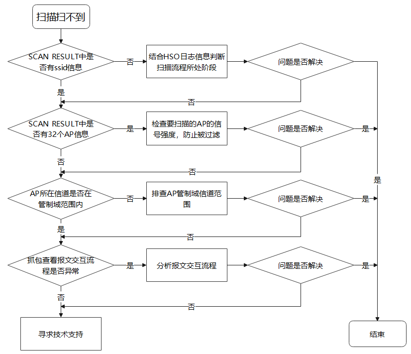

1.  通过查看“<SCAN RESULT\>:”中是否存在ssid等信息

    -   执行**AT+SCANRESULT**命令查看“<SCAN RESULT\>:”是否存在AP信息，若未存在任何AP信息，查看HSO日志是否有ERROR类型日志，进而判断扫描异常阶段；若“<SCAN RESULT\>:”中存在AP信息，进入**[步骤2](#li137192711211)**分析。

    > **说明：** 
    >AT命令详细介绍请参考 [AT 命令使用指南](../../commands/manual/index.md)，HSO工具的使用方法请结合实际工具版本确认。

2.  <a name="li137192711211"></a>检查“<SCAN RESULT\>:”中AP数量。

    驱动根据信号强度排序，最多记录32个AP，当要扫描的AP信号较弱时，可能被过滤，因此不会被上报“<SCAN RESULT\>:”中。

    -   检查是否含有32个AP信息。
        -   如果含有32个AP信息，执行AT+SCANSSID命令指定SSID扫描，观察是否能扫描到该AP，若未能扫描到，进入**[步骤3](#li1181405312917)**分析。
        -   如果少于32个AP信息，则进入**[步骤3](#li1181405312917)**分析。

3.  <a name="li1181405312917"></a>检查AP所在信道是否在管制域范围

    -   如果AP为路由器，查看路由器配置界面，确定路由器所在信道；
    -   执行AT+STASTAT命令查看AP的“channel”信息。

    ```
    +STASTAT: <status>,<ssid>, <bssid >,<chn>,<rssi>
    ```

    若AP所处信道未在管制域范围内，修改此AP的信道配置；若AP所处信道在管制域范围内，则进入**[步骤4](#li22741358153114)**分析。

4.  <a name="li22741358153114"></a>抓包查看报文交互流程

    通过Omnipeek或WireShark等抓包软件抓包分析，正常的扫描交互流程如[图1](#fig3355525617)所示（以Omnipeek软件报文为例）。

    **图 1**  扫描关联过程报文交互流程<a name="fig3355525617"></a>  
    
    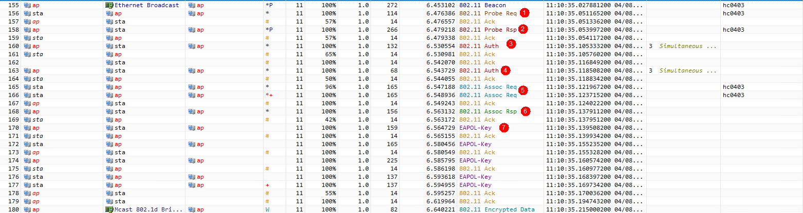

    -   场景一：若STA发出Probe Req报文，AP端未回复ACK，且STA一直重传Probe Req，表示AP未收到Probe Req，可初步确定为AP收包异常。
    -   场景二：若STA发出Probe Req报文，AP回复ACK，但AP发出的Probe Rsp超时，检查STA是否已经切信道发Probe Req。
    -   场景三：若STA发出Probe Req报文，AP回复ACK，且发出Probe Rsp。
        1.  若STA回复了ACK，表示STA收到Probe Rsp，但扫描结果中没有，可查看HSO日志中是否有ERROR日志。
        2.  若STA未回复ACK，表示STA未收到Probe Rsp，需要检查MAC、PHY的状态，可移交开发人员具体定位。

    > **说明：** 
    >针对场景三中的情况2，需要判断未回复ACK的真实性。若在屏蔽环境中进行抓包，没有看到STA回复的ACK报文，大概率是没有抓到；若在开放环境中抓包，可能存在抓包软件没有抓到ACK报文的情况，此时可以观察AP是否有重传Probe Rsp，若有重传，大概率是STA未回复ACK。

## 关联异常类问题故障定位指导<a name="ZH-CN_TOPIC_0000001911424110"></a>

-   **[关联失败](#ZH-CN_TOPIC_0000001944703301)**  

-   **[关联成功后掉线](#ZH-CN_TOPIC_0000001911544046)**  

### 关联失败<a name="ZH-CN_TOPIC_0000001944703301"></a>

**问题现象<a name="section159861744165618"></a>**

STA关联AP失败。

**可能原因<a name="section14716105275614"></a>**

-   未扫描到AP信息。
-   密码格式错误。
-   被AP拉黑。

**定位步骤<a name="section1315732165719"></a>**

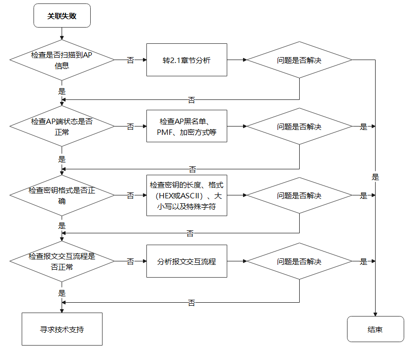

1.  检查扫描结果。

    参考“[扫描异常类问题故障定位指导](#ZH-CN_TOPIC_0000001911424114)”，分析原因。

2.  检查AP端状态。

    1.  检查AP黑名单：登录AP配置界面，查看AP黑名单中是否有STA的MAC地址，若有，尝试将该MAC地址移除黑名单，重新尝试关联。
    2.  检查PMF状态。

        登录AP配置界面，若AP为强制PMF加密方式，可尝试执行“AT+STARTSTA=1,1”命令，在起STA时，强制启动PMF尝试关联。

    > **说明：** 
    >AT命令：AT+STARTSTA=\[<protocol\_mode\>\],\[<pmf\>\]，其中<pmf\>为管理帧保护策略，默认为1，表示PMF自适应，AT命令详情请参考 [AT 命令使用指南](../../commands/manual/index.md)。

    1.  检查加密方式。

    -   若AP为OPEN方式，关联时不需要设置密钥。
    -   若AP为WPA/WPA2/WPA3/WAPI/WEP等加密方式，进入[步骤3](#li165121391525)分析。

3.  <a name="li165121391525"></a>检查密钥格式（AP为WPA/WPA2/WPA3/WAPI/WEP等加密方式）

    1.  确定密钥长度，如WEP加密只支撑5/10/13/26位密钥长度。
    2.  确定密钥是否含有特殊字符、大小写、以及中文字符。
    3.  确定密钥类型是否正确，例如AP配置为ASCII/HEX类型，关联时使用HEX/ASCII类型密钥。

    若检查以上内容无误，进入**步骤4**分析。

4.  检查报文交互流程

    场景一：AUTH报文交互失败。

    -   查看AUTH报文的STATUS CODE，确定原因，如[表1](#table6969112601620)所示。

    **表 1**  Status Code

    <a name="table6969112601620"></a>
    <table><thead align="left"><tr id="row696992641617"><th class="cellrowborder" valign="top" width="22.040000000000003%" id="mcps1.2.4.1.1"><p id="p16969162641612"><a name="p16969162641612"></a><a name="p16969162641612"></a>Status Code</p>
    </th>
    <th class="cellrowborder" valign="top" width="40.12%" id="mcps1.2.4.1.2"><p id="p49691526121620"><a name="p49691526121620"></a><a name="p49691526121620"></a>Name</p>
    </th>
    <th class="cellrowborder" valign="top" width="37.84%" id="mcps1.2.4.1.3"><p id="p59691126111612"><a name="p59691126111612"></a><a name="p59691126111612"></a>Meaning</p>
    </th>
    </tr>
    </thead>
    <tbody><tr id="row796914266167"><td class="cellrowborder" valign="top" width="22.040000000000003%" headers="mcps1.2.4.1.1 "><p id="p9969826171614"><a name="p9969826171614"></a><a name="p9969826171614"></a>0</p>
    </td>
    <td class="cellrowborder" valign="top" width="40.12%" headers="mcps1.2.4.1.2 "><p id="p6969102611164"><a name="p6969102611164"></a><a name="p6969102611164"></a>SUCCESS</p>
    </td>
    <td class="cellrowborder" valign="top" width="37.84%" headers="mcps1.2.4.1.3 "><p id="p179691726101616"><a name="p179691726101616"></a><a name="p179691726101616"></a>Successful</p>
    </td>
    </tr>
    <tr id="row1096915265169"><td class="cellrowborder" valign="top" width="22.040000000000003%" headers="mcps1.2.4.1.1 "><p id="p1496914267169"><a name="p1496914267169"></a><a name="p1496914267169"></a>14</p>
    </td>
    <td class="cellrowborder" valign="top" width="40.12%" headers="mcps1.2.4.1.2 "><p id="p1986173918599"><a name="p1986173918599"></a><a name="p1986173918599"></a>TRANSACTION_SEQUENCE_ERROR</p>
    </td>
    <td class="cellrowborder" valign="top" width="37.84%" headers="mcps1.2.4.1.3 "><p id="p161398316012"><a name="p161398316012"></a><a name="p161398316012"></a>Received an Authentication frame with authentication transaction sequence number out of expected sequence.</p>
    </td>
    </tr>
    <tr id="row12969182661612"><td class="cellrowborder" valign="top" width="22.040000000000003%" headers="mcps1.2.4.1.1 "><p id="p196992612169"><a name="p196992612169"></a><a name="p196992612169"></a>16</p>
    </td>
    <td class="cellrowborder" valign="top" width="40.12%" headers="mcps1.2.4.1.2 "><p id="p296982613167"><a name="p296982613167"></a><a name="p296982613167"></a>REJECTED_SEQUENCE_TIMEOUT</p>
    </td>
    <td class="cellrowborder" valign="top" width="37.84%" headers="mcps1.2.4.1.3 "><p id="p59124421106"><a name="p59124421106"></a><a name="p59124421106"></a>Authentication rejected due to timeout waiting for next frame in sequence.</p>
    </td>
    </tr>
    <tr id="row16969926171613"><td class="cellrowborder" valign="top" width="22.040000000000003%" headers="mcps1.2.4.1.1 "><p id="p59696267165"><a name="p59696267165"></a><a name="p59696267165"></a>30</p>
    </td>
    <td class="cellrowborder" valign="top" width="40.12%" headers="mcps1.2.4.1.2 "><p id="p69691626131615"><a name="p69691626131615"></a><a name="p69691626131615"></a>REFUSED_TEMPORARILY</p>
    </td>
    <td class="cellrowborder" valign="top" width="37.84%" headers="mcps1.2.4.1.3 "><p id="p1196952681619"><a name="p1196952681619"></a><a name="p1196952681619"></a>Association request rejected temporarily; try again later.</p>
    </td>
    </tr>
    <tr id="row4474172818220"><td class="cellrowborder" valign="top" width="22.040000000000003%" headers="mcps1.2.4.1.1 "><p id="p1247414285213"><a name="p1247414285213"></a><a name="p1247414285213"></a>126</p>
    </td>
    <td class="cellrowborder" valign="top" width="40.12%" headers="mcps1.2.4.1.2 "><p id="p747418284213"><a name="p747418284213"></a><a name="p747418284213"></a>SAE_HASH_TO_ELEMENT</p>
    </td>
    <td class="cellrowborder" valign="top" width="37.84%" headers="mcps1.2.4.1.3 "><p id="p16723952323"><a name="p16723952323"></a><a name="p16723952323"></a>SAE authentication uses direct hashing, instead of</p>
    <p id="p87234521829"><a name="p87234521829"></a><a name="p87234521829"></a>looping, to obtain the PWE.</p>
    </td>
    </tr>
    </tbody>
    </table>

    > **说明：** 
    >上述列出的Status Code为常见类型，完整的Status Code可查看802.11标准协议。

    场景二：ASSOC报文交互失败

    -   查看AP回复的Assoc Rsp报文中的status code，分析原因，详细status code如[表1](#table6969112601620)所示。

### 关联成功后掉线<a name="ZH-CN_TOPIC_0000001911544046"></a>

**问题现象<a name="section43321008012"></a>**

此类问题主要体现为关联成功后掉线。

**可能原因<a name="section445681015013"></a>**

-   STA端
    -   信号弱：STA与AP之间的距离过远或者有障碍物阻挡，导致信号弱而无法进行正常通信，故STA掉线。
    -   AP故障：AP掉电或者异常重启等。
    -   网络拥堵：AP连接的STA数量过多，网络拥堵会导致STA掉线。

-   AP端
    -   可能存在兼容性问题。

## 性能异常类问题故障定位<a name="ZH-CN_TOPIC_0000001911544014"></a>

> **说明：** 
>1.  本章节中提到的测试或调试命令均对WS53芯片生效，但本章节命令仅展示关键参数，AT命令格式需使用者自行进行转换。
>    如，本文中介绍的命令格式："wlan0 set\_udata\_rate\_mode fixed"
>    转换为WS53命令：AT+CCPRIV= wlan0,set\_udata\_rate\_mode,fixed
>2.  命令均以wlan0作为举例，实际使用中可换成实际使用的vap名字（如ap0, wlan1等）。

-   **[性能问题概述](#ZH-CN_TOPIC_0000001911544030)**  

-   **[性能问题整体定位思路](#ZH-CN_TOPIC_0000001911424118)**  

### 性能问题概述<a name="ZH-CN_TOPIC_0000001911544030"></a>

**性能问题特征<a name="section1843782332313"></a>**

Wi-Fi性能问题与功能问题相比，在现象上有较为明显的差异：

-   功能问题：一般可通过设备的异常行为直接识别出来，比如：死机、关联失败、ping不通、断流、串口打印异常等。
-   性能问题：一般需要通过与参考对象对比才能发现，比如：在同等测试条件下与标杆进行对比，吞吐量低于标杆、跑流曲线比标杆波动大、覆盖范围比标杆差等。

**性能相关测试场景<a name="section9845185219236"></a>**

Wi-Fi性能相关的测试场景可以大致分为以下几种类型：

-   屏蔽环境：使用屏蔽箱、屏蔽房进行测试，测试环境内无测试相关设备外的其他信号。
-   开放环境：办公室环境、户外环境等，环境中存在其他设备或其他干扰源（Wi-Fi同频/邻频/叠频干扰、微波炉干扰、蓝牙干扰、LTE干扰等）。
-   不同距离/衰减大小：近距离（低衰减）、中距离（中衰减）、远距离（高衰减）。
-   不同打流业务类型：上行/下行/双向、TCP/UDP、视频业务、混合业务等。
-   不同用户数/流数：单用户、多用户、满规格用户等。
-   不同设备工作模式：单STA、STA+softAP、DBAC等。

### 性能问题整体定位思路<a name="ZH-CN_TOPIC_0000001911424118"></a>

如上文描述，Wi-Fi性能的测试场景众多，不同的测试场景下，多种因素的影响下均可能产生不同的性能表现。因此，在遇到性能问题时，需快速针对该问题发生的场景、周围环境、关键影响因素进行排查，缩小该问题的定位范围。此外，由于Wi-Fi性能与Wi-Fi算法中为报文发送选择的参数紧密相关，本文将介绍一些针对关键参数的常见调试手段，可在遇到性能问题时快速进行一系列调优尝试。

-   **[环境排查](#ZH-CN_TOPIC_0000001911544010)**  

-   **[缩小问题范围](#ZH-CN_TOPIC_0000001944703321)**  

-   **[差异分析](#ZH-CN_TOPIC_0000001944703281)**  

-   **[干扰场景](#ZH-CN_TOPIC_0000001911424130)**  

#### 环境排查<a name="ZH-CN_TOPIC_0000001911544010"></a>

由于性能问题往往与周围环境有着强依赖关系，本节记录一些常见的性能环境排查项及排查方法。

**打流方式及工具排查<a name="section1071711415245"></a>**

-   测试周期

    由于环境突变，打流的测试结果同样会出现上下浮动，在环境干扰较多且变化较快的情况下该浮动会更加明显。因此，为确保测试结果的准确性，需保障待测设备与竞品测试的时间相邻，并测试多组数据，防止结果存在瞬时性而影响最终判断。

-   打流工具及命令：

    使用iperf命令进行测试时，需关注以下几个关键参数是否配置正确。

    若使用UDP进行测试，则需添加合适的-b命令（如-b 100M），防止发送端发送的吞吐过小，整体性能不达预期。

    若使用TCP进行测试，则无需配置-b命令，TCP协议会自行进行吞吐调整；但需注意TCP窗口的大小（可在iperf发送及接收端界面上看到该值），过小的窗口同样会影响性能。如默认使用的TCP窗口较小，可使用-w命令（如-w 2M）来调整TCP窗口大小。

**周围环境排查<a name="section11624623251"></a>**

-   测试摆放位置：确认与竞品摆放位置相同。
-   信号强度对比：

    在确认摆放位置相同后，预期待测设备感知到的对端信号强度同样接近。为获取WS53芯片感知到的对端信号强度，可使用扫描命令（scan + scan\_results）进行查看。

-   干扰信息获取：

    如果在开放环境，则可通过以下命令获取环境的干扰信息：

    ```
    AT+CCPRIV = wlan0,alg_cfg,intf_det_enquiry,1
    ```

    该命令的返回值中可以读取到当前的干扰强度、干扰状态、及底噪等信息。干扰强度：0-无干扰，1-中干扰，2-强干扰，3-认证干扰。

**硬件排查<a name="section54462199256"></a>**

-   单板：明确当前问题为单一芯片问题还是通用类问题。
-   天线：

    排查天线的位置摆放，是否为垂直向上、高度与路由平齐、天线是否拧紧等；同时，可确认当前是否与竞品使用同一天线，或同类天线，以排除天线差异。

-   主控：明确当前问题为单一主控问题还是通用类问题。
-   电源：确保当前使用的电源规格满足芯片设计的要求。

#### 缩小问题范围<a name="ZH-CN_TOPIC_0000001944703321"></a>

在排除上述环境相关的因素初步确认问题确实存在后，为帮助后续精准定位，可通过以下几类方法快速缩小问题的范围。

**协议模式<a name="section1172317317266"></a>**

该问题影响的协议模式及带宽（如20M/40M，legacy/HT/HE）。

**打流模式<a name="section19823117132612"></a>**

-   该问题主要针对发送方向or接收方向。
-   该问题是否仅在TCP打流模式时出现问题，还是同样影响UDP；若仅影响TCP，可调整TCP打流窗口大小（iperf –w参数 eg. 窗口大小调整为2M：–w 2M）或打流流数（iperf –P参数 eg.打四条流：–P 4），观察性能结果是否会改变。

**打流现象<a name="section4103532102619"></a>**

观察当前问题场景下的打流结果。最终的性能结果低下可能来源于：

-   整体性能偏低，打流过程中无较高的瞬时吞吐。
-   性能波动较大，有较大的瞬时吞吐，但由于出现掉坑或掉零现象，导致最终整体的性能统计值较低。

**对端设备<a name="section11909124732614"></a>**

该项主要目的在于确认该问题是否为对接特定设备时的兼容性问题。设备可为不同型号的路由（WS53作STA），或不同型号的手机（WS53作softAP）。

-   该问题为通用问题，即更换多款对端设备时均存在该问题。
-   该问题为兼容性问题，即仅在对接特定设备时会出现性能问题，对接其余设备时表现正常；若发现为兼容性问题，则需确认以下几点：
    -   同等规格下，竞品对接该问题设备时是否存在同样的问题现象。
    -   问题设备的规格（型号、天线数、wi-fi芯片厂商等）。

#### 差异分析<a name="ZH-CN_TOPIC_0000001944703281"></a>

通过上述环境排查及影响范围确认，已经可以基本确认问题是否存在，以及在何种场景、打流模式、协议模式下存在。接下来，就可以在上述分析中的问题场景下对问题现象进行初步的分析，并针对以下这些常见的性能影响因素进行逐一排查。

**报文抓包分析<a name="section8407124452911"></a>**

影响Wi-Fi性能的一大因素为报文的发包参数（如速率、聚合度等），而报文的相应发包参数可通过空口中抓到的报文体现出来。因此，通过报文抓包的差异分析，我们可以从以下几个角度排查可能会影响到性能的一些关键参数：

-   **发送参数差异**

抓包观察WS53待测设备与竞品发送的报文是否有明确的速率差异，如竞品发送的多数为MCS7，而WS53使用的大多为MCS5等。此外，由于报文发送速率同样与报文发送的协议模式带宽等参数相关，也可通过抓包观察待测设备是否与竞品使用了相同的协议模式及带宽。

若发现待测设备与竞品使用了不同的发送参数，则可通过固定速率参数的形式，将WS53配置成与竞品使用相同的上述参数，并观察是否会带来性能上的提升。固定参数命令如下：

"wlan0 set\_udata\_rate\_mode \[fixed/auto\]"   使用固定/动态速率模式

"wlan0 set\_udata\_fix\_rate \[11n20M\] \[MCS7\]" 配置想要固定的协议模式\\带宽\\速率

-   **报文聚合度大小**

若发现WS53与竞品使用的发送参数无明显差异，但性能依旧低于竞品时，可进一步排查聚合度大小（即一个ampdu中有多少mpdu）对其性能大小的影响。如果大多数情况下，WS53发送报文的聚合度与竞品相差不大，那么可以排除聚合度的影响。

此外，需要说明的是，虽然在理论情况下聚合个数的增多可带来性能的收益，但针对IoT这类运行资源受限的设备而言，由于聚合个数同样受报文在队列的最大缓存个数、聚合窗口大小、与整体的资源运转流水相关，较低的聚合度可能可以带来更稳定更高的性能。

-   **RTS开启比例**

除报文的发送参数与聚合表现外，抓包中也可以看出WS53与竞品发送RTS的行为差异，如WS53仅发送了少量的RTS，而竞品几乎每次发送数据帧前均发了RTS，或是WS53频繁发送RTS，而竞品仅发送了少量的RTS。若报文抓包中存在以上差异，则可以使用如下命令对比强制开启RTS或关闭RTS时的性能表现：

"wlan0 alg\_cfg rts\_mode \[enable/disable\]"  强制开启RTS或关闭RTS

**发送功率影响<a name="section3575115503920"></a>**

除上述介绍的几个因素之外，报文发送功率的大小同样会影响性能，尤其是在干扰或是远距离场景下。因此，针对报文的发送功率，WS53提供了下列两种方式进行功率调试：

1.  通过命令在现有基础上调整功率大小。
2.  通过修改配置文件的方式修改默认功率配置。

-   命令方式：

    AT+SETPRWR=$protocol,$rate,$offset 参数说明及配置方法与下表一致

    <a name="table2714mcpsimp"></a>
    <table><tbody><tr id="row2719mcpsimp"><th class="firstcol" valign="top" width="26.35%" id="mcps1.1.3.1.1"><p id="p2721mcpsimp"><a name="p2721mcpsimp"></a><a name="p2721mcpsimp"></a>格式</p>
    </th>
    <td class="cellrowborder" valign="top" width="73.65%" headers="mcps1.1.3.1.1 "><p id="p2723mcpsimp"><a name="p2723mcpsimp"></a><a name="p2723mcpsimp"></a>AT+SETRPWR=&lt;protocol_mode&gt;,&lt;rate&gt;,&lt;power_offset&gt;</p>
    </td>
    </tr>
    <tr id="row2724mcpsimp"><th class="firstcol" valign="top" width="26.35%" id="mcps1.1.3.2.1"><p id="p2726mcpsimp"><a name="p2726mcpsimp"></a><a name="p2726mcpsimp"></a>响应</p>
    </th>
    <td class="cellrowborder" valign="top" width="73.65%" headers="mcps1.1.3.2.1 "><a name="ul2488103861514"></a><a name="ul2488103861514"></a><ul id="ul2488103861514"><li>成功：OK</li><li>失败：ERROR</li></ul>
    </td>
    </tr>
    <tr id="row2732mcpsimp"><th class="firstcol" valign="top" width="26.35%" id="mcps1.1.3.3.1"><p id="p2734mcpsimp"><a name="p2734mcpsimp"></a><a name="p2734mcpsimp"></a>参数说明</p>
    </th>
    <td class="cellrowborder" valign="top" width="73.65%" headers="mcps1.1.3.3.1 "><a name="ul797574912517"></a><a name="ul797574912517"></a><ul id="ul797574912517"><li>&lt;protocol_mode&gt;：协议模式<p id="p2631mcpsimp"><a name="p2631mcpsimp"></a><a name="p2631mcpsimp"></a>0：802.11b</p>
    <p id="p2632mcpsimp"><a name="p2632mcpsimp"></a><a name="p2632mcpsimp"></a>1：802.11g</p>
    <p id="p2633mcpsimp"><a name="p2633mcpsimp"></a><a name="p2633mcpsimp"></a>2：802.11n 20M/802.11ax 20M</p>
    <p id="p2634mcpsimp"><a name="p2634mcpsimp"></a><a name="p2634mcpsimp"></a>3：802.11n 40M</p>
    </li><li>&lt;rate&gt;：速率<p id="p2639mcpsimp"><a name="p2639mcpsimp"></a><a name="p2639mcpsimp"></a>802.11b: 0~3  表示1,2,5.5,11Mbps; 4 表示全速率修改；</p>
    <p id="p6135924142118"><a name="p6135924142118"></a><a name="p6135924142118"></a>802.11g: 0-7 表示6,9,12,18,24,36,48,54Mbps; 8 表示全速率修改；</p>
    <p id="p18105848151619"><a name="p18105848151619"></a><a name="p18105848151619"></a>11n/11ax 20M: 0-9 表示mcs0~mcs9; 10 表示全速率修改；</p>
    <p id="p145499438167"><a name="p145499438167"></a><a name="p145499438167"></a>11n 40M: 0~9  表示mcs0~mcs9，10 表示mcs32；11 表示全速率修改。</p>
    </li><li>&lt;power_offset&gt;：功率偏移值。<p id="p1317921812617"><a name="p1317921812617"></a><a name="p1317921812617"></a>范围：-100~40，单位0.1dB，表示相对当前功率的偏移值。</p>
    </li></ul>
    </td>
    </tr>
    <tr id="row2737mcpsimp"><th class="firstcol" valign="top" width="26.35%" id="mcps1.1.3.4.1"><p id="p2739mcpsimp"><a name="p2739mcpsimp"></a><a name="p2739mcpsimp"></a>示例</p>
    </th>
    <td class="cellrowborder" valign="top" width="73.65%" headers="mcps1.1.3.4.1 "><p id="p2741mcpsimp"><a name="p2741mcpsimp"></a><a name="p2741mcpsimp"></a>AT+SETRPWR=0,0,-10</p>
    </td>
    </tr>
    <tr id="row2742mcpsimp"><th class="firstcol" valign="top" width="26.35%" id="mcps1.1.3.5.1"><p id="p2744mcpsimp"><a name="p2744mcpsimp"></a><a name="p2744mcpsimp"></a>注意</p>
    </th>
    <td class="cellrowborder" valign="top" width="73.65%" headers="mcps1.1.3.5.1 "><p id="p2746mcpsimp"><a name="p2746mcpsimp"></a><a name="p2746mcpsimp"></a>此命令需在AT+STARTAP/AT+STARTSTA执行后下发。</p>
    <p id="p0814155361612"><a name="p0814155361612"></a><a name="p0814155361612"></a>11n 20M和11n 40M最大支持到mcs7。</p>
    </td>
    </tr>
    </tbody>
    </table>

    使用上述命令，可实时针对特定协议模式及速率进行功率调整，调大1db或调小1db，观察功率变化对性能的影响。

-   定制化文件方式：

    WS53 – 通过NV的形式来修改各协议模式及速率下的默认功率配置（NV配置可参考 [NV指南](../../system/nv/index.md) 与 [软件开发指南](../../sdk-development/software-development/manual/index.md) 中的“国家码功能配置”章节）

#### 干扰场景<a name="ZH-CN_TOPIC_0000001911424130"></a>

干扰同样是影响Wi-Fi性能的一个关键因素。如果当前测试场景是在屏蔽箱内或屏蔽环境中，可以忽略本章节内容。

若当前测试环境为开放环境，或环境中存在其他的Wi-Fi测试设备或可能产生干扰信号的设备（如微波炉、蓝牙、LTE等），则需要记录当前的环境干扰信息，并根据38xx提供的几条常见的抗干扰调试命令（见下文），结合当前的干扰情况进行初步的抗干扰调试。

**干扰信息获取<a name="section497423441010"></a>**

可在ping包的同时通过如下命令获取芯片采集到的干扰信息：

```
"wlan0 alg_cfg intf_det_enquiry 1"
```

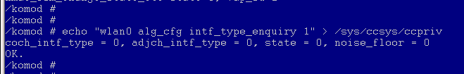

从该命令的回显中，可读取到当前的同频干扰状态coch\_intf\_type（0：无干扰；1：有干扰），临叠频干扰状态adjch\_intf\_type（0：无干扰；1：中等干扰；2：强干扰；3：认证/强干扰），与当前底噪值noise\_floor（值越大表示当前空口噪声越大）。

**MAC抗干扰相关参数调试<a name="section1911014408110"></a>**

-   EDCA退避参数调试

    EDCA机制，通过控制报文发送至空口前的退避相关参数（如CWmin/max，Aifsn，txop等），可影响报文的抢占空口能力。一般情况下，为防止过多的空口碰撞，EDCA参数不建议配置过于激进（参数数值更小）；但当空口出现竞争时，更为激进的EDCA参数配置可能会增大设备成功抢到空口的机会，从而提升竞争下的性能。

    因此，WS53提供了EDCA相关的抗干扰模式命令，可供在存在较强同频干扰的测试环境下调试使用：

    "wlan0 alg\_intrf\_mode edca\_switch 1" ，开启或关闭EDCA抗干扰模式。

    此外，WS53还提供了两套EDCA相关命令，一套可用于读取当前使用的EDCA各项参数数值，一套可用于针对相应参数进行配置：

    "wlan0 get\_edca\_params $para $prio"     

    <a name="table51149591482"></a>
    <table><tbody><tr id="row11165195920816"><th class="firstcol" valign="top" width="15.89%" id="mcps1.1.3.1.1"><p id="p1616585914813"><a name="p1616585914813"></a><a name="p1616585914813"></a>格式</p>
    </th>
    <td class="cellrowborder" valign="top" width="84.11%" headers="mcps1.1.3.1.1 "><p id="p1265311319610"><a name="p1265311319610"></a><a name="p1265311319610"></a>echo "$vap_name get_edca_params $para $prio" &gt; /sys/ccsys/ccpriv</p>
    </td>
    </tr>
    <tr id="row616520591983"><th class="firstcol" valign="top" width="15.89%" id="mcps1.1.3.2.1"><p id="p11651859687"><a name="p11651859687"></a><a name="p11651859687"></a>参数说明</p>
    </th>
    <td class="cellrowborder" valign="top" width="84.11%" headers="mcps1.1.3.2.1 "><a name="ul930614610201"></a><a name="ul930614610201"></a><ul id="ul930614610201"><li>$vap_name：需要维测的vap名字，通常用wlan0。</li><li>$para：查询EDCA BSS广播参数、MIB值和寄存器值，包括AIFS、CwMin、CwMax、TXOP、qAIFS、qCwMin、qCwMax、qTXOP。</li><li>$prio：配置$para对应的优先级，可配置0/1/2/3，表示BE/BK/VI/VO队列。</li></ul>
    </td>
    </tr>
    <tr id="row161656594814"><th class="firstcol" valign="top" width="15.89%" id="mcps1.1.3.3.1"><p id="p191651359181"><a name="p191651359181"></a><a name="p191651359181"></a>示例</p>
    </th>
    <td class="cellrowborder" valign="top" width="84.11%" headers="mcps1.1.3.3.1 "><p id="p322086111317"><a name="p322086111317"></a><a name="p322086111317"></a>echo "wlan0 get_edca_params cwmin 1" &gt; /sys/ccsys/ccpriv</p>
    </td>
    </tr>
    <tr id="row91651759586"><th class="firstcol" valign="top" width="15.89%" id="mcps1.1.3.4.1"><p id="p416516594817"><a name="p416516594817"></a><a name="p416516594817"></a>响应</p>
    </th>
    <td class="cellrowborder" valign="top" width="84.11%" headers="mcps1.1.3.4.1 "><a name="ul168894378179"></a><a name="ul168894378179"></a><ul id="ul168894378179"><li>成功：OK</li><li>失败：INPUT_ERROR or CMD_NOT_FOUND</li></ul>
    </td>
    </tr>
    <tr id="row201659591889"><th class="firstcol" valign="top" width="15.89%" id="mcps1.1.3.5.1"><p id="p1516516592811"><a name="p1516516592811"></a><a name="p1516516592811"></a>注意</p>
    </th>
    <td class="cellrowborder" valign="top" width="84.11%" headers="mcps1.1.3.5.1 "><p id="p1616520598814"><a name="p1616520598814"></a><a name="p1616520598814"></a>-</p>
    </td>
    </tr>
    </tbody>
    </table>

     "wlan0 set\_edca\_params $para $prio $val"

    <a name="table14879197174819"></a>
    <table><tbody><tr id="row1880177194815"><th class="firstcol" valign="top" width="15.72%" id="mcps1.1.3.1.1"><p id="p8880157194817"><a name="p8880157194817"></a><a name="p8880157194817"></a>格式</p>
    </th>
    <td class="cellrowborder" valign="top" width="84.28%" headers="mcps1.1.3.1.1 "><p id="p588016710483"><a name="p588016710483"></a><a name="p588016710483"></a>echo "$vap_name set_edca_params $para $prio $val" &gt; /sys/ccsys/ccpriv</p>
    </td>
    </tr>
    <tr id="row188016713488"><th class="firstcol" valign="top" width="15.72%" id="mcps1.1.3.2.1"><p id="p17880117174818"><a name="p17880117174818"></a><a name="p17880117174818"></a>参数说明</p>
    </th>
    <td class="cellrowborder" valign="top" width="84.28%" headers="mcps1.1.3.2.1 "><a name="ul151761814125"></a><a name="ul151761814125"></a><ul id="ul151761814125"><li>$vap_name：需要维测的vap名字，通常用wlan0。</li><li>$para：配置EDCA BSS广播参数，可配置EDCA BSS广播参数，包括AIFS、CwMin、CwMax、TXOP；可配置EDCA参数MIB值和寄存器值，包括qAIFS、qCwMin、qCwMax、qTXOP。</li><li>$prio：配置$para对应的优先级，可配置0/1/2/3，表示BE/BK/VI/VO队列。</li><li>$val：<p id="p021633341211"><a name="p021633341211"></a><a name="p021633341211"></a>AIFS配置范围：0~15；</p>
    <p id="p1068533417128"><a name="p1068533417128"></a><a name="p1068533417128"></a>CwMin配置范围：0~10；</p>
    <p id="p188058357125"><a name="p188058357125"></a><a name="p188058357125"></a>CwMax配置范围：0~10；</p>
    <p id="p789553111125"><a name="p789553111125"></a><a name="p789553111125"></a>TXOP配置范围：0~65535。</p>
    </li></ul>
    </td>
    </tr>
    <tr id="row788018714482"><th class="firstcol" valign="top" width="15.72%" id="mcps1.1.3.3.1"><p id="p9880127144818"><a name="p9880127144818"></a><a name="p9880127144818"></a>示例</p>
    </th>
    <td class="cellrowborder" valign="top" width="84.28%" headers="mcps1.1.3.3.1 "><p id="p1588019784815"><a name="p1588019784815"></a><a name="p1588019784815"></a>echo "wlan0 set_edca_params cwmin 1 3" &gt; /sys/ccsys/ccpriv</p>
    </td>
    </tr>
    <tr id="row1880071489"><th class="firstcol" valign="top" width="15.72%" id="mcps1.1.3.4.1"><p id="p3880177194811"><a name="p3880177194811"></a><a name="p3880177194811"></a>响应</p>
    </th>
    <td class="cellrowborder" valign="top" width="84.28%" headers="mcps1.1.3.4.1 "><a name="ul148808794818"></a><a name="ul148808794818"></a><ul id="ul148808794818"><li>成功：OK</li><li>失败：INPUT_ERROR or CMD_NOT_FOUND</li></ul>
    </td>
    </tr>
    <tr id="row488011714488"><th class="firstcol" valign="top" width="15.72%" id="mcps1.1.3.5.1"><p id="p1788097164814"><a name="p1788097164814"></a><a name="p1788097164814"></a>注意</p>
    </th>
    <td class="cellrowborder" valign="top" width="84.28%" headers="mcps1.1.3.5.1 "><p id="p198802076488"><a name="p198802076488"></a><a name="p198802076488"></a>-</p>
    </td>
    </tr>
    </tbody>
    </table>

-   CCA阈值调试

    CCA门限主要作用于控制芯片发送报文时的检测，若当前环境中存在强能量，CCA机制会判断当前信道的空口条件较差，减少自身的发包机会；即只有检测到当前能量值小于该阈值时，芯片才会发送报文。因此，若通过上述的干扰信息获取发现当前环境下存在较高的底噪值（如\>-50）时，则可以关注CCA阈值对干扰性能的影响，进行CCA相关的抗干扰模式调试：

    "wlan0 alg\_intrf\_mode cca\_switch \[1/0\]"  开启或关闭CCA抗干扰模式。


