# 前言

**概述**

文档主要介绍WS53V100芯片的封装管脚信息、电气特性参数、原理图设计建议、PCB设计建议、热设计建议、焊接工艺、潮敏参数、接口时序、注意事项等内容。

本文主要为技术服务工程师提供硬件设计的参考。

**产品版本**

与本文档相对应的产品版本如下。

<table><thead align="left"><tr id="row15364171712479"><th class="cellrowborder" valign="top" width="42.77%" id="mcps1.1.3.1.1">
<strong id="b5942730175717">产品名称</strong>

</th>
<th class="cellrowborder" valign="top" width="57.230000000000004%" id="mcps1.1.3.1.2">
<strong id="b1594613304577">产品版本</strong>

</th>
</tr>
</thead>
<tbody><tr id="row997133615471"><td class="cellrowborder" valign="top" width="42.77%" headers="mcps1.1.3.1.1 ">
WS53

</td>
<td class="cellrowborder" valign="top" width="57.230000000000004%" headers="mcps1.1.3.1.2 ">
V100

</td>
</tr>
</tbody>
</table>

**读者对象**

本文档主要适用于以下工程师：

-   单板硬件开发工程师
-   软件工程师
-   技术支持工程师

**符号约定**

在本文中可能出现下列标志，它们所代表的含义如下。

<table><thead align="left"><tr id="row677894355211"><th class="cellrowborder" valign="top" width="20.580000000000002%" id="mcps1.1.3.1.1">
<strong id="b15778194315217">符号</strong>

</th>
<th class="cellrowborder" valign="top" width="79.42%" id="mcps1.1.3.1.2">
<strong id="b197791443195213">说明</strong>

</th>
</tr>
</thead>
<tbody><tr id="row12779743155210"><td class="cellrowborder" valign="top" width="20.580000000000002%" headers="mcps1.1.3.1.1 ">

</td>
<td class="cellrowborder" valign="top" width="79.42%" headers="mcps1.1.3.1.2 ">
表示如不避免则将会导致死亡或严重伤害的具有高等级风险的危害。

</td>
</tr>
<tr id="row97791743205210"><td class="cellrowborder" valign="top" width="20.580000000000002%" headers="mcps1.1.3.1.1 ">

</td>
<td class="cellrowborder" valign="top" width="79.42%" headers="mcps1.1.3.1.2 ">
表示如不避免则可能导致死亡或严重伤害的具有中等级风险的危害。

</td>
</tr>
<tr id="row4779184315526"><td class="cellrowborder" valign="top" width="20.580000000000002%" headers="mcps1.1.3.1.1 ">

</td>
<td class="cellrowborder" valign="top" width="79.42%" headers="mcps1.1.3.1.2 ">
表示如不避免则可能导致轻微或中度伤害的具有低等级风险的危害。

</td>
</tr>
<tr id="row677924319525"><td class="cellrowborder" valign="top" width="20.580000000000002%" headers="mcps1.1.3.1.1 ">

</td>
<td class="cellrowborder" valign="top" width="79.42%" headers="mcps1.1.3.1.2 ">
用于传递设备或环境安全警示信息。如不避免则可能会导致设备损坏、数据丢失、设备性能降低或其它不可预知的结果。

“须知”不涉及人身伤害。

</td>
</tr>
<tr id="row137792043195210"><td class="cellrowborder" valign="top" width="20.580000000000002%" headers="mcps1.1.3.1.1 ">

</td>
<td class="cellrowborder" valign="top" width="79.42%" headers="mcps1.1.3.1.2 ">
对正文中重点信息的补充说明。

“说明”不是安全警示信息，不涉及人身、设备及环境伤害信息。

</td>
</tr>
</tbody>
</table>

**修改记录**

<table><thead align="left"><tr id="row2942532716410"><th class="cellrowborder" valign="top" width="17.86%" id="mcps1.1.4.1.1">
<strong id="b5687322716410">文档版本</strong>

</th>
<th class="cellrowborder" valign="top" width="22.720000000000002%" id="mcps1.1.4.1.2">
<strong id="b5800814916410">发布日期</strong>

</th>
<th class="cellrowborder" valign="top" width="59.419999999999995%" id="mcps1.1.4.1.3">
<strong id="b3316380216410">修改说明</strong>

</th>
</tr>
</thead>
<tbody><tr id="row11718493355"><td class="cellrowborder" valign="top" width="17.86%" headers="mcps1.1.4.1.1 ">
05

</td>
<td class="cellrowborder" valign="top" width="22.720000000000002%" headers="mcps1.1.4.1.2 ">
2026-07-01

</td>
<td class="cellrowborder" valign="top" width="59.419999999999995%" headers="mcps1.1.4.1.3 "><ul id="ul3737112369"><li>更新“<a href="#ZH-CN_TOPIC_0000001505842465">GPIO接口</a>”小节内容。</li><li>更新“<a href="#ZH-CN_TOPIC_0000001505722809">极限工作电压</a>”小节内容。</li><li>更新“<a href="#ZH-CN_TOPIC_0000001456242628">推荐工作条件</a>”小节内容。</li><li>更新“<a href="#ZH-CN_TOPIC_0000001505842481">小系统设计建议</a>”小节内容。</li><li>更新“<a href="#ZH-CN_TOPIC_0000001505842493">控制信号及低功耗应用参考设计</a>”小节内容。</li><li>更新“<a href="#ZH-CN_TOPIC_0000001505882549">UART接口时序</a>”小节内容。</li></ul>
</td>
</tr>
<tr id="row11725379488"><td class="cellrowborder" valign="top" width="17.86%" headers="mcps1.1.4.1.1 ">
04

</td>
<td class="cellrowborder" valign="top" width="22.720000000000002%" headers="mcps1.1.4.1.2 ">
2025-05-28

</td>
<td class="cellrowborder" valign="top" width="59.419999999999995%" headers="mcps1.1.4.1.3 ">
更新“<a href="#ZH-CN_TOPIC_0000001455922820">ADC接口参考设计</a>”小节内容。

</td>
</tr>
<tr id="row12911114210403"><td class="cellrowborder" valign="top" width="17.86%" headers="mcps1.1.4.1.1 ">
03

</td>
<td class="cellrowborder" valign="top" width="22.720000000000002%" headers="mcps1.1.4.1.2 ">
2025-01-24

</td>
<td class="cellrowborder" valign="top" width="59.419999999999995%" headers="mcps1.1.4.1.3 "><ul id="ul193812040152910"><li>更新“<a href="#ZH-CN_TOPIC_0000001456242648">管脚分布</a>”小节内容。</li><li>更新“<a href="#ZH-CN_TOPIC_0000001456082732">管脚排列表</a>”、“<a href="#ZH-CN_TOPIC_0000001505842465">GPIO接口</a>”小节内容。</li><li>更新“<a href="#ZH-CN_TOPIC_0000001505722809">极限工作电压</a>”小节内容。</li><li>更新“<a href="#ZH-CN_TOPIC_0000002018433230">RTC时钟</a>”小节内容。</li><li>更新“<a href="#ZH-CN_TOPIC_0000001455763072">SDIO接口参考设计</a>”、“<a href="#ZH-CN_TOPIC_0000001455922820">ADC接口参考设计</a>”小节内容。</li></ul>
</td>
</tr>
<tr id="row182171239114317"><td class="cellrowborder" valign="top" width="17.86%" headers="mcps1.1.4.1.1 ">
02

</td>
<td class="cellrowborder" valign="top" width="22.720000000000002%" headers="mcps1.1.4.1.2 ">
2024-09-13

</td>
<td class="cellrowborder" valign="top" width="59.419999999999995%" headers="mcps1.1.4.1.3 "><ul id="ul941322310449"><li>更新“<a href="#ZH-CN_TOPIC_0000001456242644">GPIO复用管脚</a>”小节内容。</li><li>新增“<a href="#ZH-CN_TOPIC_0000002018433230">RTC时钟</a>”小节内容。</li></ul>
</td>
</tr>
<tr id="row1327439191611"><td class="cellrowborder" valign="top" width="17.86%" headers="mcps1.1.4.1.1 ">
01

</td>
<td class="cellrowborder" valign="top" width="22.720000000000002%" headers="mcps1.1.4.1.2 ">
2024-08-08

</td>
<td class="cellrowborder" valign="top" width="59.419999999999995%" headers="mcps1.1.4.1.3 ">
第一次正式版本发布。

<ul id="ul144687409162"><li>更新“<a href="#ZH-CN_TOPIC_0000001505603517">外围接口设计建议</a>”小节内容。</li><li>更新“<a href="#ZH-CN_TOPIC_0000001505882545">SDIO时序</a>”小节内容。</li></ul>
</td>
</tr>
<tr id="row1015111120324"><td class="cellrowborder" valign="top" width="17.86%" headers="mcps1.1.4.1.1 ">
00B05

</td>
<td class="cellrowborder" valign="top" width="22.720000000000002%" headers="mcps1.1.4.1.2 ">
2024-07-15

</td>
<td class="cellrowborder" valign="top" width="59.419999999999995%" headers="mcps1.1.4.1.3 "><ul id="ul15404208321"><li>更新“<a href="#ZH-CN_TOPIC_0000001505842465">GPIO接口</a>”、“<a href="#ZH-CN_TOPIC_0000001456242644">GPIO复用管脚</a>”小节内容。</li><li>更新“<a href="#ZH-CN_TOPIC_0000001505603557">上电关键硬件字</a>”小节内容。</li><li>更新“<a href="#ZH-CN_TOPIC_0000001505842481">小系统设计建议</a>”小节内容。</li><li>更新“<a href="#ZH-CN_TOPIC_0000001505603517">外围接口设计建议</a>”、小节内容。</li><li>更新“<a href="#ZH-CN_TOPIC_0000001505842493">控制信号及低功耗应用参考设计</a>”小节内容。</li><li>更新“<a href="#ZH-CN_TOPIC_0000001505882573">DBB布线指导</a>”小节内容。</li><li>更新“<a href="#ZH-CN_TOPIC_0000001505882549">UART接口时序</a>”小节内容。</li><li>更新“<a href="#ZH-CN_TOPIC_0000001505882545">SDIO时序</a>”小节内容。</li><li>更新“<a href="#ZH-CN_TOPIC_0000001456242632">硬件设计</a>”小节内容。</li></ul>
</td>
</tr>
<tr id="row19662103365814"><td class="cellrowborder" valign="top" width="17.86%" headers="mcps1.1.4.1.1 ">
00B04

</td>
<td class="cellrowborder" valign="top" width="22.720000000000002%" headers="mcps1.1.4.1.2 ">
2024-06-11

</td>
<td class="cellrowborder" valign="top" width="59.419999999999995%" headers="mcps1.1.4.1.3 "><ul id="ul37618476587"><li>更新“<a href="#ZH-CN_TOPIC_0000001456242644">GPIO复用管脚</a>”小节内容。</li><li>更新“<a href="#ZH-CN_TOPIC_0000001505603557">上电关键硬件字</a>”小节内容。</li><li>更新“<a href="#ZH-CN_TOPIC_0000001456082748">复位电路</a>”小节内容。</li></ul>
</td>
</tr>
<tr id="row129014382147"><td class="cellrowborder" valign="top" width="17.86%" headers="mcps1.1.4.1.1 ">
00B03

</td>
<td class="cellrowborder" valign="top" width="22.720000000000002%" headers="mcps1.1.4.1.2 ">
2024-05-11

</td>
<td class="cellrowborder" valign="top" width="59.419999999999995%" headers="mcps1.1.4.1.3 "><ul id="ul1218505291416"><li>更新“<a href="#ZH-CN_TOPIC_0000001505842485">参考时钟设计</a>”小节内容。</li><li>更新“<a href="#ZH-CN_TOPIC_0000001456082736">注意事项</a>”小节内容。</li></ul>
</td>
</tr>
<tr id="row166559578114"><td class="cellrowborder" valign="top" width="17.86%" headers="mcps1.1.4.1.1 ">
00B02

</td>
<td class="cellrowborder" valign="top" width="22.720000000000002%" headers="mcps1.1.4.1.2 ">
2024-04-07

</td>
<td class="cellrowborder" valign="top" width="59.419999999999995%" headers="mcps1.1.4.1.3 "><ul id="ul68671103211"><li>更新“<a href="#ZH-CN_TOPIC_0000001505722821">封装与管脚分布</a>”小节内容。</li><li>更新“<a href="#ZH-CN_TOPIC_0000001456242644">GPIO复用管脚</a>”小节内容。</li><li>更新“<a href="#ZH-CN_TOPIC_0000001505842485">参考时钟设计</a>”小节内容。</li></ul>
</td>
</tr>
<tr id="row5947359616410"><td class="cellrowborder" valign="top" width="17.86%" headers="mcps1.1.4.1.1 ">
00B01

</td>
<td class="cellrowborder" valign="top" width="22.720000000000002%" headers="mcps1.1.4.1.2 ">
2024-01-04

</td>
<td class="cellrowborder" valign="top" width="59.419999999999995%" headers="mcps1.1.4.1.3 ">
第一次临时版本发布。

</td>
</tr>
</tbody>
</table>

# 封装与管脚

-   **[封装与管脚分布](#ZH-CN_TOPIC_0000001505722821)**  

-   **[管脚描述](#ZH-CN_TOPIC_0000001455922816)**  

-   **[上电关键硬件字](#ZH-CN_TOPIC_0000001505603557)**  

## 封装与管脚分布

-   **[封装](#ZH-CN_TOPIC_0000001455922796)**  

-   **[管脚分布](#ZH-CN_TOPIC_0000001456242648)**  

### 封装

WS53V100芯片采用QFN52封装，封装尺寸为6mm×6mm，管脚间距为0.4mm，详细封装如[图1](#fig381817005920)、[图2](#toc6995721)和[图3](#toc6995723)所示。

**图 1**  芯片封装顶视图  
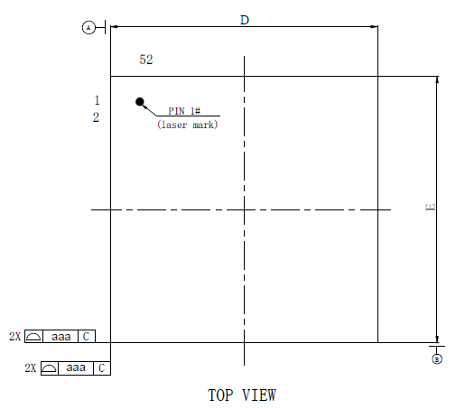

**图 2**  芯片封装底视图  
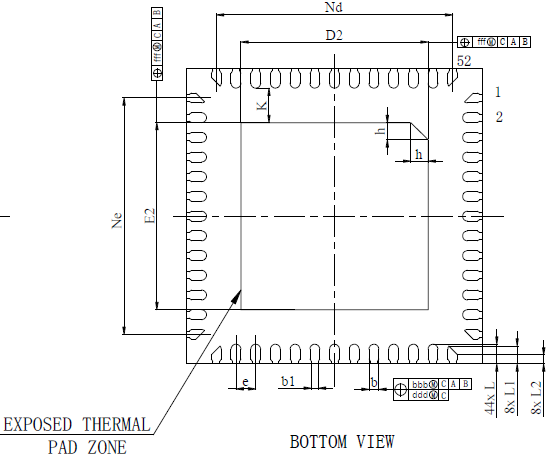

**图 3**  芯片侧面放大图  
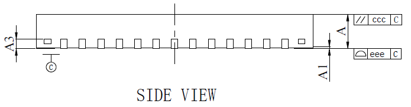

芯片封装尺寸参数如[表1](#table592793102013)所示。

**表 1**  芯片封装参数说明表

<table><thead align="left"><tr id="row13060411200"><th class="cellrowborder" valign="top" id="mcps1.2.8.1.1">
参数

</th>
<th class="cellrowborder" colspan="3" valign="top" id="mcps1.2.8.1.2">
尺寸（mm）

</th>
<th class="cellrowborder" colspan="3" valign="top" id="mcps1.2.8.1.3">
尺寸（inch）

</th>
</tr>
</thead>
<tbody><tr id="row773312305515"><td class="cellrowborder" valign="top" width="14.612922584516905%" headers="mcps1.2.8.1.1 ">
-

</td>
<td class="cellrowborder" valign="top" width="14.052810562112422%" headers="mcps1.2.8.1.2 ">
最小值

</td>
<td class="cellrowborder" valign="top" width="14.332866573314664%" headers="mcps1.2.8.1.2 ">
典型值

</td>
<td class="cellrowborder" valign="top" width="14.32286457291458%" headers="mcps1.2.8.1.2 ">
最大值

</td>
<td class="cellrowborder" valign="top" width="14.012802560512103%" headers="mcps1.2.8.1.3 ">
最小值

</td>
<td class="cellrowborder" valign="top" width="14.332866573314664%" headers="mcps1.2.8.1.3 ">
典型值

</td>
<td class="cellrowborder" valign="top" width="14.332866573314664%" headers="mcps1.2.8.1.3 ">
最大值

</td>
</tr>
<tr id="row83061482016"><td class="cellrowborder" valign="top" width="14.612922584516905%" headers="mcps1.2.8.1.1 ">
A

</td>
<td class="cellrowborder" valign="top" width="14.052810562112422%" headers="mcps1.2.8.1.2 ">
0.80

</td>
<td class="cellrowborder" valign="top" width="14.332866573314664%" headers="mcps1.2.8.1.2 ">
0.85

</td>
<td class="cellrowborder" valign="top" width="14.32286457291458%" headers="mcps1.2.8.1.2 ">
0.90

</td>
<td class="cellrowborder" valign="top" width="14.012802560512103%" headers="mcps1.2.8.1.3 ">
0.031

</td>
<td class="cellrowborder" valign="top" width="14.332866573314664%" headers="mcps1.2.8.1.3 ">
0.033

</td>
<td class="cellrowborder" valign="top" width="14.332866573314664%" headers="mcps1.2.8.1.3 ">
0.035

</td>
</tr>
<tr id="row73077414205"><td class="cellrowborder" valign="top" width="14.612922584516905%" headers="mcps1.2.8.1.1 ">
A1

</td>
<td class="cellrowborder" valign="top" width="14.052810562112422%" headers="mcps1.2.8.1.2 ">
0

</td>
<td class="cellrowborder" valign="top" width="14.332866573314664%" headers="mcps1.2.8.1.2 ">
0.02

</td>
<td class="cellrowborder" valign="top" width="14.32286457291458%" headers="mcps1.2.8.1.2 ">
0.05

</td>
<td class="cellrowborder" valign="top" width="14.012802560512103%" headers="mcps1.2.8.1.3 ">
0.000

</td>
<td class="cellrowborder" valign="top" width="14.332866573314664%" headers="mcps1.2.8.1.3 ">
0.001

</td>
<td class="cellrowborder" valign="top" width="14.332866573314664%" headers="mcps1.2.8.1.3 ">
0.002

</td>
</tr>
<tr id="row103073411202"><td class="cellrowborder" valign="top" headers="mcps1.2.8.1.1 ">
A3

</td>
<td class="cellrowborder" colspan="3" valign="top" headers="mcps1.2.8.1.2 ">
0.203REF

</td>
<td class="cellrowborder" colspan="3" valign="top" headers="mcps1.2.8.1.3 ">
0.008REF

</td>
</tr>
<tr id="row103074420202"><td class="cellrowborder" valign="top" width="14.612922584516905%" headers="mcps1.2.8.1.1 ">
b

</td>
<td class="cellrowborder" valign="top" width="14.052810562112422%" headers="mcps1.2.8.1.2 ">
0.15

</td>
<td class="cellrowborder" valign="top" width="14.332866573314664%" headers="mcps1.2.8.1.2 ">
0.20

</td>
<td class="cellrowborder" valign="top" width="14.32286457291458%" headers="mcps1.2.8.1.2 ">
0.25

</td>
<td class="cellrowborder" valign="top" width="14.012802560512103%" headers="mcps1.2.8.1.3 ">
0.006

</td>
<td class="cellrowborder" valign="top" width="14.332866573314664%" headers="mcps1.2.8.1.3 ">
0.008

</td>
<td class="cellrowborder" valign="top" width="14.332866573314664%" headers="mcps1.2.8.1.3 ">
0.010

</td>
</tr>
<tr id="row136413716306"><td class="cellrowborder" valign="top" headers="mcps1.2.8.1.1 ">
b1

</td>
<td class="cellrowborder" colspan="3" valign="top" headers="mcps1.2.8.1.2 ">
0.14REF

</td>
<td class="cellrowborder" colspan="3" valign="top" headers="mcps1.2.8.1.3 ">
0.006REF

</td>
</tr>
<tr id="row13084482013"><td class="cellrowborder" valign="top" width="14.612922584516905%" headers="mcps1.2.8.1.1 ">
D

</td>
<td class="cellrowborder" valign="top" width="14.052810562112422%" headers="mcps1.2.8.1.2 ">
5.93

</td>
<td class="cellrowborder" valign="top" width="14.332866573314664%" headers="mcps1.2.8.1.2 ">
6.00

</td>
<td class="cellrowborder" valign="top" width="14.32286457291458%" headers="mcps1.2.8.1.2 ">
6.07

</td>
<td class="cellrowborder" valign="top" width="14.012802560512103%" headers="mcps1.2.8.1.3 ">
0.233

</td>
<td class="cellrowborder" valign="top" width="14.332866573314664%" headers="mcps1.2.8.1.3 ">
0.236

</td>
<td class="cellrowborder" valign="top" width="14.332866573314664%" headers="mcps1.2.8.1.3 ">
0.239

</td>
</tr>
<tr id="row630818492014"><td class="cellrowborder" valign="top" width="14.612922584516905%" headers="mcps1.2.8.1.1 ">
E

</td>
<td class="cellrowborder" valign="top" width="14.052810562112422%" headers="mcps1.2.8.1.2 ">
5.93

</td>
<td class="cellrowborder" valign="top" width="14.332866573314664%" headers="mcps1.2.8.1.2 ">
6.00

</td>
<td class="cellrowborder" valign="top" width="14.32286457291458%" headers="mcps1.2.8.1.2 ">
6.07

</td>
<td class="cellrowborder" valign="top" width="14.012802560512103%" headers="mcps1.2.8.1.3 ">
0.233

</td>
<td class="cellrowborder" valign="top" width="14.332866573314664%" headers="mcps1.2.8.1.3 ">
0.236

</td>
<td class="cellrowborder" valign="top" width="14.332866573314664%" headers="mcps1.2.8.1.3 ">
0.239

</td>
</tr>
<tr id="row17308245205"><td class="cellrowborder" valign="top" width="14.612922584516905%" headers="mcps1.2.8.1.1 ">
D2

</td>
<td class="cellrowborder" valign="top" width="14.052810562112422%" headers="mcps1.2.8.1.2 ">
3.70

</td>
<td class="cellrowborder" valign="top" width="14.332866573314664%" headers="mcps1.2.8.1.2 ">
3.80

</td>
<td class="cellrowborder" valign="top" width="14.32286457291458%" headers="mcps1.2.8.1.2 ">
3.90

</td>
<td class="cellrowborder" valign="top" width="14.012802560512103%" headers="mcps1.2.8.1.3 ">
0.146

</td>
<td class="cellrowborder" valign="top" width="14.332866573314664%" headers="mcps1.2.8.1.3 ">
0.150

</td>
<td class="cellrowborder" valign="top" width="14.332866573314664%" headers="mcps1.2.8.1.3 ">
0.154

</td>
</tr>
<tr id="row11309194202019"><td class="cellrowborder" valign="top" width="14.612922584516905%" headers="mcps1.2.8.1.1 ">
E2

</td>
<td class="cellrowborder" valign="top" width="14.052810562112422%" headers="mcps1.2.8.1.2 ">
3.70

</td>
<td class="cellrowborder" valign="top" width="14.332866573314664%" headers="mcps1.2.8.1.2 ">
3.80

</td>
<td class="cellrowborder" valign="top" width="14.32286457291458%" headers="mcps1.2.8.1.2 ">
3.90

</td>
<td class="cellrowborder" valign="top" width="14.012802560512103%" headers="mcps1.2.8.1.3 ">
0.146

</td>
<td class="cellrowborder" valign="top" width="14.332866573314664%" headers="mcps1.2.8.1.3 ">
0.150

</td>
<td class="cellrowborder" valign="top" width="14.332866573314664%" headers="mcps1.2.8.1.3 ">
0.154

</td>
</tr>
<tr id="row153107412017"><td class="cellrowborder" valign="top" headers="mcps1.2.8.1.1 ">
e

</td>
<td class="cellrowborder" colspan="3" valign="top" headers="mcps1.2.8.1.2 ">
0.40BSC

</td>
<td class="cellrowborder" colspan="3" valign="top" headers="mcps1.2.8.1.3 ">
0.016BSC

</td>
</tr>
<tr id="row13552022133120"><td class="cellrowborder" valign="top" headers="mcps1.2.8.1.1 ">
Nd

</td>
<td class="cellrowborder" colspan="3" valign="top" headers="mcps1.2.8.1.2 ">
4.80BSC

</td>
<td class="cellrowborder" colspan="3" valign="top" headers="mcps1.2.8.1.3 ">
0.189BSC

</td>
</tr>
<tr id="row929014176324"><td class="cellrowborder" valign="top" headers="mcps1.2.8.1.1 ">
Ne

</td>
<td class="cellrowborder" colspan="3" valign="top" headers="mcps1.2.8.1.2 ">
4.80BSC

</td>
<td class="cellrowborder" colspan="3" valign="top" headers="mcps1.2.8.1.3 ">
0.189BSC

</td>
</tr>
<tr id="row2310194172018"><td class="cellrowborder" valign="top" width="14.612922584516905%" headers="mcps1.2.8.1.1 ">
L

</td>
<td class="cellrowborder" valign="top" width="14.052810562112422%" headers="mcps1.2.8.1.2 ">
0.35

</td>
<td class="cellrowborder" valign="top" width="14.332866573314664%" headers="mcps1.2.8.1.2 ">
0.40

</td>
<td class="cellrowborder" valign="top" width="14.32286457291458%" headers="mcps1.2.8.1.2 ">
0.45

</td>
<td class="cellrowborder" valign="top" width="14.012802560512103%" headers="mcps1.2.8.1.3 ">
0.014

</td>
<td class="cellrowborder" valign="top" width="14.332866573314664%" headers="mcps1.2.8.1.3 ">
0.016

</td>
<td class="cellrowborder" valign="top" width="14.332866573314664%" headers="mcps1.2.8.1.3 ">
0.018

</td>
</tr>
<tr id="row415954413323"><td class="cellrowborder" valign="top" width="14.612922584516905%" headers="mcps1.2.8.1.1 ">
L1

</td>
<td class="cellrowborder" valign="top" width="14.052810562112422%" headers="mcps1.2.8.1.2 ">
0.285

</td>
<td class="cellrowborder" valign="top" width="14.332866573314664%" headers="mcps1.2.8.1.2 ">
0.36

</td>
<td class="cellrowborder" valign="top" width="14.32286457291458%" headers="mcps1.2.8.1.2 ">
0.435

</td>
<td class="cellrowborder" valign="top" width="14.012802560512103%" headers="mcps1.2.8.1.3 ">
0.011

</td>
<td class="cellrowborder" valign="top" width="14.332866573314664%" headers="mcps1.2.8.1.3 ">
0.014

</td>
<td class="cellrowborder" valign="top" width="14.332866573314664%" headers="mcps1.2.8.1.3 ">
0.017

</td>
</tr>
<tr id="row359928123313"><td class="cellrowborder" valign="top" width="14.612922584516905%" headers="mcps1.2.8.1.1 ">
L2

</td>
<td class="cellrowborder" valign="top" width="14.052810562112422%" headers="mcps1.2.8.1.2 ">
0.105

</td>
<td class="cellrowborder" valign="top" width="14.332866573314664%" headers="mcps1.2.8.1.2 ">
0.18

</td>
<td class="cellrowborder" valign="top" width="14.32286457291458%" headers="mcps1.2.8.1.2 ">
0.255

</td>
<td class="cellrowborder" valign="top" width="14.012802560512103%" headers="mcps1.2.8.1.3 ">
0.004

</td>
<td class="cellrowborder" valign="top" width="14.332866573314664%" headers="mcps1.2.8.1.3 ">
0.007

</td>
<td class="cellrowborder" valign="top" width="14.332866573314664%" headers="mcps1.2.8.1.3 ">
0.010

</td>
</tr>
<tr id="row1495393973319"><td class="cellrowborder" valign="top" width="14.612922584516905%" headers="mcps1.2.8.1.1 ">
h

</td>
<td class="cellrowborder" valign="top" width="14.052810562112422%" headers="mcps1.2.8.1.2 ">
0.30

</td>
<td class="cellrowborder" valign="top" width="14.332866573314664%" headers="mcps1.2.8.1.2 ">
0.35

</td>
<td class="cellrowborder" valign="top" width="14.32286457291458%" headers="mcps1.2.8.1.2 ">
0.40

</td>
<td class="cellrowborder" valign="top" width="14.012802560512103%" headers="mcps1.2.8.1.3 ">
0.012

</td>
<td class="cellrowborder" valign="top" width="14.332866573314664%" headers="mcps1.2.8.1.3 ">
0.014

</td>
<td class="cellrowborder" valign="top" width="14.332866573314664%" headers="mcps1.2.8.1.3 ">
0.016

</td>
</tr>
<tr id="row516343151518"><td class="cellrowborder" valign="top" width="14.612922584516905%" headers="mcps1.2.8.1.1 ">
K

</td>
<td class="cellrowborder" valign="top" width="14.052810562112422%" headers="mcps1.2.8.1.2 ">
0.60

</td>
<td class="cellrowborder" valign="top" width="14.332866573314664%" headers="mcps1.2.8.1.2 ">
0.70

</td>
<td class="cellrowborder" valign="top" width="14.32286457291458%" headers="mcps1.2.8.1.2 ">
0.80

</td>
<td class="cellrowborder" valign="top" width="14.012802560512103%" headers="mcps1.2.8.1.3 ">
0.024

</td>
<td class="cellrowborder" valign="top" width="14.332866573314664%" headers="mcps1.2.8.1.3 ">
0.028

</td>
<td class="cellrowborder" valign="top" width="14.332866573314664%" headers="mcps1.2.8.1.3 ">
0.031

</td>
</tr>
<tr id="row2312842203"><td class="cellrowborder" valign="top" headers="mcps1.2.8.1.1 ">
aaa

</td>
<td class="cellrowborder" colspan="3" valign="top" headers="mcps1.2.8.1.2 ">
0.10

</td>
<td class="cellrowborder" colspan="3" valign="top" headers="mcps1.2.8.1.3 ">
0.004

</td>
</tr>
<tr id="row123126411207"><td class="cellrowborder" valign="top" headers="mcps1.2.8.1.1 ">
bbb

</td>
<td class="cellrowborder" colspan="3" valign="top" headers="mcps1.2.8.1.2 ">
0.07

</td>
<td class="cellrowborder" colspan="3" valign="top" headers="mcps1.2.8.1.3 ">
0.003

</td>
</tr>
<tr id="row9312144207"><td class="cellrowborder" valign="top" headers="mcps1.2.8.1.1 ">
ccc

</td>
<td class="cellrowborder" colspan="3" valign="top" headers="mcps1.2.8.1.2 ">
0.10

</td>
<td class="cellrowborder" colspan="3" valign="top" headers="mcps1.2.8.1.3 ">
0.004

</td>
</tr>
<tr id="row53131348206"><td class="cellrowborder" valign="top" headers="mcps1.2.8.1.1 ">
ddd

</td>
<td class="cellrowborder" colspan="3" valign="top" headers="mcps1.2.8.1.2 ">
0.05

</td>
<td class="cellrowborder" colspan="3" valign="top" headers="mcps1.2.8.1.3 ">
0.002

</td>
</tr>
<tr id="row1831364142018"><td class="cellrowborder" valign="top" headers="mcps1.2.8.1.1 ">
eee

</td>
<td class="cellrowborder" colspan="3" valign="top" headers="mcps1.2.8.1.2 ">
0.08

</td>
<td class="cellrowborder" colspan="3" valign="top" headers="mcps1.2.8.1.3 ">
0.003

</td>
</tr>
<tr id="row103139411202"><td class="cellrowborder" valign="top" headers="mcps1.2.8.1.1 ">
fff

</td>
<td class="cellrowborder" colspan="3" valign="top" headers="mcps1.2.8.1.2 ">
0.10

</td>
<td class="cellrowborder" colspan="3" valign="top" headers="mcps1.2.8.1.3 ">
0.004

</td>
</tr>
</tbody>
</table>

### 管脚分布

WS53V100芯片管脚分布如[图1](#fig1269775433017)所示。

**图 1**  WS53V100芯片TOP View管脚分布图  
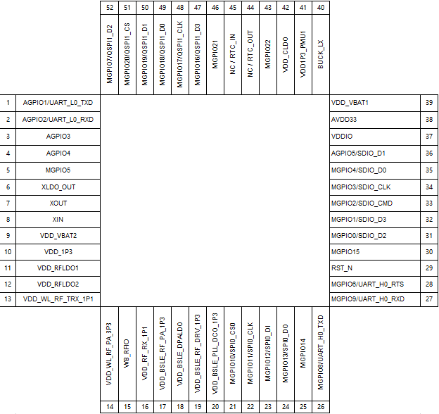

**表 1**  WS53V100关键特性

<table><thead align="left"><tr id="row19413116596"><th class="cellrowborder" valign="top" width="50.57000000000001%" id="mcps1.2.3.1.1">
芯片

</th>
<th class="cellrowborder" valign="top" width="49.43%" id="mcps1.2.3.1.2">
是否支持FLASH

</th>
</tr>
</thead>
<tbody><tr id="row1136643410916"><td class="cellrowborder" valign="top" width="50.57000000000001%" headers="mcps1.2.3.1.1 ">
WS53V100

</td>
<td class="cellrowborder" valign="top" width="49.43%" headers="mcps1.2.3.1.2 ">
内置4MB FLASH

</td>
</tr>
</tbody>
</table>

## 管脚描述

-   **[管脚类型说明](#ZH-CN_TOPIC_0000001505882557)**  

-   **[管脚排列表](#ZH-CN_TOPIC_0000001456082732)**  

-   **[全芯片复位接口](#ZH-CN_TOPIC_0000001505603513)**  

-   **[GPIO接口](#ZH-CN_TOPIC_0000001505842465)**  

-   **[电源管脚](#ZH-CN_TOPIC_0000001505842477)**  

-   **[RF接口](#ZH-CN_TOPIC_0000001456082744)**  

-   **[GND管脚](#ZH-CN_TOPIC_0000001505842473)**  

-   **[GPIO复用管脚](#ZH-CN_TOPIC_0000001456242644)**  

-   **[CLK管脚](#ZH-CN_TOPIC_0000001505722833)**  

### 管脚类型说明

管脚I/O类型说明如[表1](#table24429894)所示。

**表 1**  管脚I/O类型说明

<table><thead align="left"><tr id="row27904713"><th class="cellrowborder" valign="top" width="27.27%" id="mcps1.2.3.1.1">
I/O

</th>
<th class="cellrowborder" valign="top" width="72.72999999999999%" id="mcps1.2.3.1.2">
说明

</th>
</tr>
</thead>
<tbody><tr id="row59389625"><td class="cellrowborder" valign="top" width="27.27%" headers="mcps1.2.3.1.1 ">
I

</td>
<td class="cellrowborder" valign="top" width="72.72999999999999%" headers="mcps1.2.3.1.2 ">
输入信号。

</td>
</tr>
<tr id="row57219378"><td class="cellrowborder" valign="top" width="27.27%" headers="mcps1.2.3.1.1 ">
IPD

</td>
<td class="cellrowborder" valign="top" width="72.72999999999999%" headers="mcps1.2.3.1.2 ">
输入信号，内部下拉。

</td>
</tr>
<tr id="row19954658"><td class="cellrowborder" valign="top" width="27.27%" headers="mcps1.2.3.1.1 ">
IPU

</td>
<td class="cellrowborder" valign="top" width="72.72999999999999%" headers="mcps1.2.3.1.2 ">
输入信号，内部上拉。

</td>
</tr>
<tr id="row46570941"><td class="cellrowborder" valign="top" width="27.27%" headers="mcps1.2.3.1.1 ">
IS

</td>
<td class="cellrowborder" valign="top" width="72.72999999999999%" headers="mcps1.2.3.1.2 ">
输入信号，带施密特触发器。

</td>
</tr>
<tr id="row25979390"><td class="cellrowborder" valign="top" width="27.27%" headers="mcps1.2.3.1.1 ">
ISPD

</td>
<td class="cellrowborder" valign="top" width="72.72999999999999%" headers="mcps1.2.3.1.2 ">
输入信号，带施密特触发器，内部下拉。

</td>
</tr>
<tr id="row5126234"><td class="cellrowborder" valign="top" width="27.27%" headers="mcps1.2.3.1.1 ">
ISPU

</td>
<td class="cellrowborder" valign="top" width="72.72999999999999%" headers="mcps1.2.3.1.2 ">
输入信号，带施密特触发器，内部上垃。

</td>
</tr>
<tr id="row7013644"><td class="cellrowborder" valign="top" width="27.27%" headers="mcps1.2.3.1.1 ">
O

</td>
<td class="cellrowborder" valign="top" width="72.72999999999999%" headers="mcps1.2.3.1.2 ">
输出信号。

</td>
</tr>
<tr id="row19865849"><td class="cellrowborder" valign="top" width="27.27%" headers="mcps1.2.3.1.1 ">
OOD

</td>
<td class="cellrowborder" valign="top" width="72.72999999999999%" headers="mcps1.2.3.1.2 ">
输出，漏极开路。

</td>
</tr>
<tr id="row27798664"><td class="cellrowborder" valign="top" width="27.27%" headers="mcps1.2.3.1.1 ">
I/O

</td>
<td class="cellrowborder" valign="top" width="72.72999999999999%" headers="mcps1.2.3.1.2 ">
双向输入/输出信号。

</td>
</tr>
<tr id="row523045"><td class="cellrowborder" valign="top" width="27.27%" headers="mcps1.2.3.1.1 ">
IPD/O

</td>
<td class="cellrowborder" valign="top" width="72.72999999999999%" headers="mcps1.2.3.1.2 ">
双向，输入下拉。

</td>
</tr>
<tr id="row2785358"><td class="cellrowborder" valign="top" width="27.27%" headers="mcps1.2.3.1.1 ">
IPU/O

</td>
<td class="cellrowborder" valign="top" width="72.72999999999999%" headers="mcps1.2.3.1.2 ">
双向，输入上拉。

</td>
</tr>
<tr id="row33751805"><td class="cellrowborder" valign="top" width="27.27%" headers="mcps1.2.3.1.1 ">
ISPD/O

</td>
<td class="cellrowborder" valign="top" width="72.72999999999999%" headers="mcps1.2.3.1.2 ">
双向，输入下拉，带施密特触发器。

</td>
</tr>
<tr id="row34613479"><td class="cellrowborder" valign="top" width="27.27%" headers="mcps1.2.3.1.1 ">
ISPU/O

</td>
<td class="cellrowborder" valign="top" width="72.72999999999999%" headers="mcps1.2.3.1.2 ">
双向，输入上拉，带施密特触发器。

</td>
</tr>
<tr id="row12999751"><td class="cellrowborder" valign="top" width="27.27%" headers="mcps1.2.3.1.1 ">
IPD/OOD

</td>
<td class="cellrowborder" valign="top" width="72.72999999999999%" headers="mcps1.2.3.1.2 ">
双向，输入下拉，输出漏极开路。

</td>
</tr>
<tr id="row37593705"><td class="cellrowborder" valign="top" width="27.27%" headers="mcps1.2.3.1.1 ">
IPU/OOD

</td>
<td class="cellrowborder" valign="top" width="72.72999999999999%" headers="mcps1.2.3.1.2 ">
双向，输入上拉，输出漏极开路。

</td>
</tr>
<tr id="row52271033"><td class="cellrowborder" valign="top" width="27.27%" headers="mcps1.2.3.1.1 ">
IS/O

</td>
<td class="cellrowborder" valign="top" width="72.72999999999999%" headers="mcps1.2.3.1.2 ">
双向，输入带施密特触发器。

</td>
</tr>
<tr id="row61360575"><td class="cellrowborder" valign="top" width="27.27%" headers="mcps1.2.3.1.1 ">
IS/OOD

</td>
<td class="cellrowborder" valign="top" width="72.72999999999999%" headers="mcps1.2.3.1.2 ">
双向，输入带施密特触发器，输出漏极开路。

</td>
</tr>
<tr id="row12883349"><td class="cellrowborder" valign="top" width="27.27%" headers="mcps1.2.3.1.1 ">
XIN

</td>
<td class="cellrowborder" valign="top" width="72.72999999999999%" headers="mcps1.2.3.1.2 ">
Crystal Oscillator：晶振输入。

</td>
</tr>
<tr id="row2840889"><td class="cellrowborder" valign="top" width="27.27%" headers="mcps1.2.3.1.1 ">
XOUT

</td>
<td class="cellrowborder" valign="top" width="72.72999999999999%" headers="mcps1.2.3.1.2 ">
Crystal Oscillator：晶振输出。

</td>
</tr>
<tr id="row46641368"><td class="cellrowborder" valign="top" width="27.27%" headers="mcps1.2.3.1.1 ">
P

</td>
<td class="cellrowborder" valign="top" width="72.72999999999999%" headers="mcps1.2.3.1.2 ">
电源。

</td>
</tr>
<tr id="row45504511"><td class="cellrowborder" valign="top" width="27.27%" headers="mcps1.2.3.1.1 ">
G

</td>
<td class="cellrowborder" valign="top" width="72.72999999999999%" headers="mcps1.2.3.1.2 ">
地。

</td>
</tr>
</tbody>
</table>

### 管脚排列表

WS53V100采用的封装形式为QFN 52Pin，管脚按位置排列分别如[表1 WS53V100芯片管脚排列](#table3939144)所示。

**表 1**  WS53V100芯片管脚排列

<table><thead align="left"><tr id="row62775401"><th class="cellrowborder" valign="top" width="16.68166816681668%" id="mcps1.2.5.1.1">
位置

</th>
<th class="cellrowborder" valign="top" width="34.87348734873487%" id="mcps1.2.5.1.2">
管脚名称

</th>
<th class="cellrowborder" valign="top" width="16.371637163716375%" id="mcps1.2.5.1.3">
位置

</th>
<th class="cellrowborder" valign="top" width="32.073207320732074%" id="mcps1.2.5.1.4">
管脚名称

</th>
</tr>
</thead>
<tbody><tr id="row53844748"><td class="cellrowborder" valign="top" width="16.68166816681668%" headers="mcps1.2.5.1.1 ">
1

</td>
<td class="cellrowborder" valign="top" width="34.87348734873487%" headers="mcps1.2.5.1.2 ">
AGPIO1/UART_L0_TXD

</td>
<td class="cellrowborder" valign="top" width="16.371637163716375%" headers="mcps1.2.5.1.3 ">
27

</td>
<td class="cellrowborder" valign="top" width="32.073207320732074%" headers="mcps1.2.5.1.4 ">
MGPIO9/UART_H0_RXD

</td>
</tr>
<tr id="row32200631"><td class="cellrowborder" valign="top" width="16.68166816681668%" headers="mcps1.2.5.1.1 ">
2

</td>
<td class="cellrowborder" valign="top" width="34.87348734873487%" headers="mcps1.2.5.1.2 ">
AGPIO2/UART_L0_RXD

</td>
<td class="cellrowborder" valign="top" width="16.371637163716375%" headers="mcps1.2.5.1.3 ">
28

</td>
<td class="cellrowborder" valign="top" width="32.073207320732074%" headers="mcps1.2.5.1.4 ">
MGPIO6/UART_H0_RTS

</td>
</tr>
<tr id="row35275281"><td class="cellrowborder" valign="top" width="16.68166816681668%" headers="mcps1.2.5.1.1 ">
3

</td>
<td class="cellrowborder" valign="top" width="34.87348734873487%" headers="mcps1.2.5.1.2 ">
AGPIO3

</td>
<td class="cellrowborder" valign="top" width="16.371637163716375%" headers="mcps1.2.5.1.3 ">
29

</td>
<td class="cellrowborder" valign="top" width="32.073207320732074%" headers="mcps1.2.5.1.4 ">
RST_N

</td>
</tr>
<tr id="row55788668"><td class="cellrowborder" valign="top" width="16.68166816681668%" headers="mcps1.2.5.1.1 ">
4

</td>
<td class="cellrowborder" valign="top" width="34.87348734873487%" headers="mcps1.2.5.1.2 ">
AGPIO4

</td>
<td class="cellrowborder" valign="top" width="16.371637163716375%" headers="mcps1.2.5.1.3 ">
30

</td>
<td class="cellrowborder" valign="top" width="32.073207320732074%" headers="mcps1.2.5.1.4 ">
MGPIO15

</td>
</tr>
<tr id="row6366624"><td class="cellrowborder" valign="top" width="16.68166816681668%" headers="mcps1.2.5.1.1 ">
5

</td>
<td class="cellrowborder" valign="top" width="34.87348734873487%" headers="mcps1.2.5.1.2 ">
MGPIO5

</td>
<td class="cellrowborder" valign="top" width="16.371637163716375%" headers="mcps1.2.5.1.3 ">
31

</td>
<td class="cellrowborder" valign="top" width="32.073207320732074%" headers="mcps1.2.5.1.4 ">
MGPIO0/SDIO_D2

</td>
</tr>
<tr id="row63653037"><td class="cellrowborder" valign="top" width="16.68166816681668%" headers="mcps1.2.5.1.1 ">
6

</td>
<td class="cellrowborder" valign="top" width="34.87348734873487%" headers="mcps1.2.5.1.2 ">
XLDO_OUT

</td>
<td class="cellrowborder" valign="top" width="16.371637163716375%" headers="mcps1.2.5.1.3 ">
32

</td>
<td class="cellrowborder" valign="top" width="32.073207320732074%" headers="mcps1.2.5.1.4 ">
MGPIO1/SDIO_D3

</td>
</tr>
<tr id="row58558366"><td class="cellrowborder" valign="top" width="16.68166816681668%" headers="mcps1.2.5.1.1 ">
7

</td>
<td class="cellrowborder" valign="top" width="34.87348734873487%" headers="mcps1.2.5.1.2 ">
XOUT

</td>
<td class="cellrowborder" valign="top" width="16.371637163716375%" headers="mcps1.2.5.1.3 ">
33

</td>
<td class="cellrowborder" valign="top" width="32.073207320732074%" headers="mcps1.2.5.1.4 ">
MGPIO2/SDIO_CMD

</td>
</tr>
<tr id="row22907763"><td class="cellrowborder" valign="top" width="16.68166816681668%" headers="mcps1.2.5.1.1 ">
8

</td>
<td class="cellrowborder" valign="top" width="34.87348734873487%" headers="mcps1.2.5.1.2 ">
XIN

</td>
<td class="cellrowborder" valign="top" width="16.371637163716375%" headers="mcps1.2.5.1.3 ">
34

</td>
<td class="cellrowborder" valign="top" width="32.073207320732074%" headers="mcps1.2.5.1.4 ">
MGPIO3/SDIO_CLK

</td>
</tr>
<tr id="row65644149"><td class="cellrowborder" valign="top" width="16.68166816681668%" headers="mcps1.2.5.1.1 ">
9

</td>
<td class="cellrowborder" valign="top" width="34.87348734873487%" headers="mcps1.2.5.1.2 ">
VDD_VBAT2

</td>
<td class="cellrowborder" valign="top" width="16.371637163716375%" headers="mcps1.2.5.1.3 ">
35

</td>
<td class="cellrowborder" valign="top" width="32.073207320732074%" headers="mcps1.2.5.1.4 ">
MGPIO4/SDIO_D0

</td>
</tr>
<tr id="row60214390"><td class="cellrowborder" valign="top" width="16.68166816681668%" headers="mcps1.2.5.1.1 ">
10

</td>
<td class="cellrowborder" valign="top" width="34.87348734873487%" headers="mcps1.2.5.1.2 ">
VDD_1P3

</td>
<td class="cellrowborder" valign="top" width="16.371637163716375%" headers="mcps1.2.5.1.3 ">
36

</td>
<td class="cellrowborder" valign="top" width="32.073207320732074%" headers="mcps1.2.5.1.4 ">
AGPIO5/SDIO_D1

</td>
</tr>
<tr id="row43967757"><td class="cellrowborder" valign="top" width="16.68166816681668%" headers="mcps1.2.5.1.1 ">
11

</td>
<td class="cellrowborder" valign="top" width="34.87348734873487%" headers="mcps1.2.5.1.2 ">
VDD_RFLDO1

</td>
<td class="cellrowborder" valign="top" width="16.371637163716375%" headers="mcps1.2.5.1.3 ">
37

</td>
<td class="cellrowborder" valign="top" width="32.073207320732074%" headers="mcps1.2.5.1.4 ">
VDDIO

</td>
</tr>
<tr id="row24224733"><td class="cellrowborder" valign="top" width="16.68166816681668%" headers="mcps1.2.5.1.1 ">
12

</td>
<td class="cellrowborder" valign="top" width="34.87348734873487%" headers="mcps1.2.5.1.2 ">
VDD_RFLDO2

</td>
<td class="cellrowborder" valign="top" width="16.371637163716375%" headers="mcps1.2.5.1.3 ">
38

</td>
<td class="cellrowborder" valign="top" width="32.073207320732074%" headers="mcps1.2.5.1.4 ">
AVDD33

</td>
</tr>
<tr id="row52327117"><td class="cellrowborder" valign="top" width="16.68166816681668%" headers="mcps1.2.5.1.1 ">
13

</td>
<td class="cellrowborder" valign="top" width="34.87348734873487%" headers="mcps1.2.5.1.2 ">
VDD_WL_RF_TRX_1P1

</td>
<td class="cellrowborder" valign="top" width="16.371637163716375%" headers="mcps1.2.5.1.3 ">
39

</td>
<td class="cellrowborder" valign="top" width="32.073207320732074%" headers="mcps1.2.5.1.4 ">
VDD_VBAT1

</td>
</tr>
<tr id="row16154192"><td class="cellrowborder" valign="top" width="16.68166816681668%" headers="mcps1.2.5.1.1 ">
14

</td>
<td class="cellrowborder" valign="top" width="34.87348734873487%" headers="mcps1.2.5.1.2 ">
VDD_WL_RF_PA_3P3

</td>
<td class="cellrowborder" valign="top" width="16.371637163716375%" headers="mcps1.2.5.1.3 ">
40

</td>
<td class="cellrowborder" valign="top" width="32.073207320732074%" headers="mcps1.2.5.1.4 ">
BUCK_LX

</td>
</tr>
<tr id="row41055134"><td class="cellrowborder" valign="top" width="16.68166816681668%" headers="mcps1.2.5.1.1 ">
15

</td>
<td class="cellrowborder" valign="top" width="34.87348734873487%" headers="mcps1.2.5.1.2 ">
WB_RFIO

</td>
<td class="cellrowborder" valign="top" width="16.371637163716375%" headers="mcps1.2.5.1.3 ">
41

</td>
<td class="cellrowborder" valign="top" width="32.073207320732074%" headers="mcps1.2.5.1.4 ">
VDD1P3_PMU1

</td>
</tr>
<tr id="row37224696"><td class="cellrowborder" valign="top" width="16.68166816681668%" headers="mcps1.2.5.1.1 ">
16

</td>
<td class="cellrowborder" valign="top" width="34.87348734873487%" headers="mcps1.2.5.1.2 ">
VDD_RF_RX_1P1

</td>
<td class="cellrowborder" valign="top" width="16.371637163716375%" headers="mcps1.2.5.1.3 ">
42

</td>
<td class="cellrowborder" valign="top" width="32.073207320732074%" headers="mcps1.2.5.1.4 ">
VDD_CLDO

</td>
</tr>
<tr id="row422023991413"><td class="cellrowborder" valign="top" width="16.68166816681668%" headers="mcps1.2.5.1.1 ">
17

</td>
<td class="cellrowborder" valign="top" width="34.87348734873487%" headers="mcps1.2.5.1.2 ">
VDD_BSLE_RF_PA_1P3

</td>
<td class="cellrowborder" valign="top" width="16.371637163716375%" headers="mcps1.2.5.1.3 ">
43

</td>
<td class="cellrowborder" valign="top" width="32.073207320732074%" headers="mcps1.2.5.1.4 ">
MGPIO22

</td>
</tr>
<tr id="row988613201152"><td class="cellrowborder" valign="top" width="16.68166816681668%" headers="mcps1.2.5.1.1 ">
18

</td>
<td class="cellrowborder" valign="top" width="34.87348734873487%" headers="mcps1.2.5.1.2 ">
VDD_BSLE_DPALDO

</td>
<td class="cellrowborder" valign="top" width="16.371637163716375%" headers="mcps1.2.5.1.3 ">
44

</td>
<td class="cellrowborder" valign="top" width="32.073207320732074%" headers="mcps1.2.5.1.4 ">
NC/RTC_OUT

</td>
</tr>
<tr id="row23511955131512"><td class="cellrowborder" valign="top" width="16.68166816681668%" headers="mcps1.2.5.1.1 ">
19

</td>
<td class="cellrowborder" valign="top" width="34.87348734873487%" headers="mcps1.2.5.1.2 ">
VDD_BSLE_RF_DRV_1P3

</td>
<td class="cellrowborder" valign="top" width="16.371637163716375%" headers="mcps1.2.5.1.3 ">
45

</td>
<td class="cellrowborder" valign="top" width="32.073207320732074%" headers="mcps1.2.5.1.4 ">
NC/RTC_IN

</td>
</tr>
<tr id="row75142594159"><td class="cellrowborder" valign="top" width="16.68166816681668%" headers="mcps1.2.5.1.1 ">
20

</td>
<td class="cellrowborder" valign="top" width="34.87348734873487%" headers="mcps1.2.5.1.2 ">
VDD_BSLE_PLL_DCO_1P3

</td>
<td class="cellrowborder" valign="top" width="16.371637163716375%" headers="mcps1.2.5.1.3 ">
46

</td>
<td class="cellrowborder" valign="top" width="32.073207320732074%" headers="mcps1.2.5.1.4 ">
MGPIO21

</td>
</tr>
<tr id="row155481513164"><td class="cellrowborder" valign="top" width="16.68166816681668%" headers="mcps1.2.5.1.1 ">
21

</td>
<td class="cellrowborder" valign="top" width="34.87348734873487%" headers="mcps1.2.5.1.2 ">
MGPIO10/SPI0_CS0

</td>
<td class="cellrowborder" valign="top" width="16.371637163716375%" headers="mcps1.2.5.1.3 ">
47

</td>
<td class="cellrowborder" valign="top" width="32.073207320732074%" headers="mcps1.2.5.1.4 ">
MGPIO16/QSPI1_D3

</td>
</tr>
<tr id="row17331175371515"><td class="cellrowborder" valign="top" width="16.68166816681668%" headers="mcps1.2.5.1.1 ">
22

</td>
<td class="cellrowborder" valign="top" width="34.87348734873487%" headers="mcps1.2.5.1.2 ">
MGPIO11/SPI0_CLK

</td>
<td class="cellrowborder" valign="top" width="16.371637163716375%" headers="mcps1.2.5.1.3 ">
48

</td>
<td class="cellrowborder" valign="top" width="32.073207320732074%" headers="mcps1.2.5.1.4 ">
MGPIO17/QSPI1_CLK

</td>
</tr>
<tr id="row171339512156"><td class="cellrowborder" valign="top" width="16.68166816681668%" headers="mcps1.2.5.1.1 ">
23

</td>
<td class="cellrowborder" valign="top" width="34.87348734873487%" headers="mcps1.2.5.1.2 ">
MGPIO12/SPI0_DI

</td>
<td class="cellrowborder" valign="top" width="16.371637163716375%" headers="mcps1.2.5.1.3 ">
49

</td>
<td class="cellrowborder" valign="top" width="32.073207320732074%" headers="mcps1.2.5.1.4 ">
MGPIO18/QSPI1_D0

</td>
</tr>
<tr id="row632052371512"><td class="cellrowborder" valign="top" width="16.68166816681668%" headers="mcps1.2.5.1.1 ">
24

</td>
<td class="cellrowborder" valign="top" width="34.87348734873487%" headers="mcps1.2.5.1.2 ">
MGPIO13/SPI0_DO

</td>
<td class="cellrowborder" valign="top" width="16.371637163716375%" headers="mcps1.2.5.1.3 ">
50

</td>
<td class="cellrowborder" valign="top" width="32.073207320732074%" headers="mcps1.2.5.1.4 ">
MGPIO19/QSPI1_D1

</td>
</tr>
<tr id="row7424134918148"><td class="cellrowborder" valign="top" width="16.68166816681668%" headers="mcps1.2.5.1.1 ">
25

</td>
<td class="cellrowborder" valign="top" width="34.87348734873487%" headers="mcps1.2.5.1.2 ">
MGPIO14

</td>
<td class="cellrowborder" valign="top" width="16.371637163716375%" headers="mcps1.2.5.1.3 ">
51

</td>
<td class="cellrowborder" valign="top" width="32.073207320732074%" headers="mcps1.2.5.1.4 ">
MGPIO20/QSPI1_CS

</td>
</tr>
<tr id="row1026023"><td class="cellrowborder" valign="top" width="16.68166816681668%" headers="mcps1.2.5.1.1 ">
26

</td>
<td class="cellrowborder" valign="top" width="34.87348734873487%" headers="mcps1.2.5.1.2 ">
MGPIO8/UART_H0_TXD

</td>
<td class="cellrowborder" valign="top" width="16.371637163716375%" headers="mcps1.2.5.1.3 ">
52

</td>
<td class="cellrowborder" valign="top" width="32.073207320732074%" headers="mcps1.2.5.1.4 ">
MGPIO7/QSPI1_D2

</td>
</tr>
</tbody>
</table>

### 全芯片复位接口

全芯片复位信号如[表1](#table31291646)所示。

**表 1**  全局复位信号管脚列表

<table><thead align="left"><tr id="row21421675"><th class="cellrowborder" valign="top" width="9.21%" id="mcps1.2.7.1.1">
Pin

</th>
<th class="cellrowborder" valign="top" width="14.829999999999998%" id="mcps1.2.7.1.2">
名称

</th>
<th class="cellrowborder" valign="top" width="12.01%" id="mcps1.2.7.1.3">
类型

</th>
<th class="cellrowborder" valign="top" width="17.75%" id="mcps1.2.7.1.4">
频率（MHz）

</th>
<th class="cellrowborder" valign="top" width="15.5%" id="mcps1.2.7.1.5">
电平（V）

</th>
<th class="cellrowborder" valign="top" width="30.7%" id="mcps1.2.7.1.6">
描述

</th>
</tr>
</thead>
<tbody><tr id="row27598869"><td class="cellrowborder" valign="top" width="9.21%" headers="mcps1.2.7.1.1 ">
29

</td>
<td class="cellrowborder" valign="top" width="14.829999999999998%" headers="mcps1.2.7.1.2 ">
RST_N

</td>
<td class="cellrowborder" valign="top" width="12.01%" headers="mcps1.2.7.1.3 ">
I

</td>
<td class="cellrowborder" valign="top" width="17.75%" headers="mcps1.2.7.1.4 ">
&lt;1

</td>
<td class="cellrowborder" valign="top" width="15.5%" headers="mcps1.2.7.1.5 ">
3.3/1.8

</td>
<td class="cellrowborder" valign="top" width="30.7%" headers="mcps1.2.7.1.6 ">
全局芯片复位信号，拉低将复位全芯片。

</td>
</tr>
</tbody>
</table>

### GPIO接口

> **须知：** 
>支持外置RTC功能的芯片，当硬件方案不使用外置RTC时，RTC\_IN管脚板级预留接地电阻位置，若芯片应用场景存在环境或板级干扰，建议RTC\_IN管脚板级接地，RTC\_OUT管脚保持悬空，增强抗干扰能力。板级禁止RTC\_IN和OUT管脚同时接地。

GPIO接口如[表1](#table63646052)所示。

**表 1**  GPIO接口管脚列表

<table><thead align="left"><tr id="row28141317"><th class="cellrowborder" valign="top" width="10.47%" id="mcps1.2.6.1.1">
Pin

</th>
<th class="cellrowborder" valign="top" width="21.48%" id="mcps1.2.6.1.2">
名称

</th>
<th class="cellrowborder" valign="top" width="11.129999999999999%" id="mcps1.2.6.1.3">
类型

</th>
<th class="cellrowborder" valign="top" width="19.040000000000003%" id="mcps1.2.6.1.4">
电平(V)

</th>
<th class="cellrowborder" valign="top" width="37.88%" id="mcps1.2.6.1.5">
描述

</th>
</tr>
</thead>
<tbody><tr id="row21724664"><td class="cellrowborder" valign="top" width="10.47%" headers="mcps1.2.6.1.1 ">
1

</td>
<td class="cellrowborder" valign="top" width="21.48%" headers="mcps1.2.6.1.2 ">
AGPIO1

</td>
<td class="cellrowborder" valign="top" width="11.129999999999999%" headers="mcps1.2.6.1.3 ">
I/O

</td>
<td class="cellrowborder" valign="top" width="19.040000000000003%" headers="mcps1.2.6.1.4 ">
3.3/1.8

</td>
<td class="cellrowborder" valign="top" width="37.88%" headers="mcps1.2.6.1.5 ">
普通GPIO，在深睡模式下，此IO支持输入唤醒或输出。

</td>
</tr>
<tr id="row37621475"><td class="cellrowborder" valign="top" width="10.47%" headers="mcps1.2.6.1.1 ">
2

</td>
<td class="cellrowborder" valign="top" width="21.48%" headers="mcps1.2.6.1.2 ">
AGPIO2

</td>
<td class="cellrowborder" valign="top" width="11.129999999999999%" headers="mcps1.2.6.1.3 ">
I/O

</td>
<td class="cellrowborder" valign="top" width="19.040000000000003%" headers="mcps1.2.6.1.4 ">
3.3/1.8

</td>
<td class="cellrowborder" valign="top" width="37.88%" headers="mcps1.2.6.1.5 ">
普通GPIO，在深睡模式下，此IO支持输入唤醒或输出。

</td>
</tr>
<tr id="row17792110"><td class="cellrowborder" valign="top" width="10.47%" headers="mcps1.2.6.1.1 ">
3

</td>
<td class="cellrowborder" valign="top" width="21.48%" headers="mcps1.2.6.1.2 ">
AGPIO3

</td>
<td class="cellrowborder" valign="top" width="11.129999999999999%" headers="mcps1.2.6.1.3 ">
I/O

</td>
<td class="cellrowborder" valign="top" width="19.040000000000003%" headers="mcps1.2.6.1.4 ">
3.3/1.8

</td>
<td class="cellrowborder" valign="top" width="37.88%" headers="mcps1.2.6.1.5 ">
普通GPIO，在深睡模式下，此IO支持输入唤醒或输出。

</td>
</tr>
<tr id="row44962972"><td class="cellrowborder" valign="top" width="10.47%" headers="mcps1.2.6.1.1 ">
4

</td>
<td class="cellrowborder" valign="top" width="21.48%" headers="mcps1.2.6.1.2 ">
AGPIO4

</td>
<td class="cellrowborder" valign="top" width="11.129999999999999%" headers="mcps1.2.6.1.3 ">
I/O

</td>
<td class="cellrowborder" valign="top" width="19.040000000000003%" headers="mcps1.2.6.1.4 ">
3.3/1.8

</td>
<td class="cellrowborder" valign="top" width="37.88%" headers="mcps1.2.6.1.5 ">
普通GPIO，在深睡模式下，此IO支持输入唤醒或输出。

</td>
</tr>
<tr id="row21913016"><td class="cellrowborder" valign="top" width="10.47%" headers="mcps1.2.6.1.1 ">
5

</td>
<td class="cellrowborder" valign="top" width="21.48%" headers="mcps1.2.6.1.2 ">
MGPIO5

</td>
<td class="cellrowborder" valign="top" width="11.129999999999999%" headers="mcps1.2.6.1.3 ">
I/O

</td>
<td class="cellrowborder" valign="top" width="19.040000000000003%" headers="mcps1.2.6.1.4 ">
3.3/1.8

</td>
<td class="cellrowborder" valign="top" width="37.88%" headers="mcps1.2.6.1.5 ">
普通GPIO

</td>
</tr>
<tr id="row36052245"><td class="cellrowborder" valign="top" width="10.47%" headers="mcps1.2.6.1.1 ">
21

</td>
<td class="cellrowborder" valign="top" width="21.48%" headers="mcps1.2.6.1.2 ">
MGPIO10

</td>
<td class="cellrowborder" valign="top" width="11.129999999999999%" headers="mcps1.2.6.1.3 ">
I/O

</td>
<td class="cellrowborder" valign="top" width="19.040000000000003%" headers="mcps1.2.6.1.4 ">
3.3/1.8

</td>
<td class="cellrowborder" valign="top" width="37.88%" headers="mcps1.2.6.1.5 ">
普通GPIO

</td>
</tr>
<tr id="row37355470"><td class="cellrowborder" valign="top" width="10.47%" headers="mcps1.2.6.1.1 ">
22

</td>
<td class="cellrowborder" valign="top" width="21.48%" headers="mcps1.2.6.1.2 ">
MGPIO11

</td>
<td class="cellrowborder" valign="top" width="11.129999999999999%" headers="mcps1.2.6.1.3 ">
I/O

</td>
<td class="cellrowborder" valign="top" width="19.040000000000003%" headers="mcps1.2.6.1.4 ">
3.3/1.8

</td>
<td class="cellrowborder" valign="top" width="37.88%" headers="mcps1.2.6.1.5 ">
普通GPIO，在深睡模式下，此IO仅支持输入唤醒，不支持输出。

</td>
</tr>
<tr id="row15537542"><td class="cellrowborder" valign="top" width="10.47%" headers="mcps1.2.6.1.1 ">
23

</td>
<td class="cellrowborder" valign="top" width="21.48%" headers="mcps1.2.6.1.2 ">
MGPIO12

</td>
<td class="cellrowborder" valign="top" width="11.129999999999999%" headers="mcps1.2.6.1.3 ">
I/O

</td>
<td class="cellrowborder" valign="top" width="19.040000000000003%" headers="mcps1.2.6.1.4 ">
3.3/1.8

</td>
<td class="cellrowborder" valign="top" width="37.88%" headers="mcps1.2.6.1.5 ">
普通GPIO

</td>
</tr>
<tr id="row32361769"><td class="cellrowborder" valign="top" width="10.47%" headers="mcps1.2.6.1.1 ">
24

</td>
<td class="cellrowborder" valign="top" width="21.48%" headers="mcps1.2.6.1.2 ">
MGPIO13

</td>
<td class="cellrowborder" valign="top" width="11.129999999999999%" headers="mcps1.2.6.1.3 ">
I/O

</td>
<td class="cellrowborder" valign="top" width="19.040000000000003%" headers="mcps1.2.6.1.4 ">
3.3/1.8

</td>
<td class="cellrowborder" valign="top" width="37.88%" headers="mcps1.2.6.1.5 ">
普通GPIO

</td>
</tr>
<tr id="row20226985"><td class="cellrowborder" valign="top" width="10.47%" headers="mcps1.2.6.1.1 ">
25

</td>
<td class="cellrowborder" valign="top" width="21.48%" headers="mcps1.2.6.1.2 ">
MGPIO14

</td>
<td class="cellrowborder" valign="top" width="11.129999999999999%" headers="mcps1.2.6.1.3 ">
I/O

</td>
<td class="cellrowborder" valign="top" width="19.040000000000003%" headers="mcps1.2.6.1.4 ">
3.3/1.8

</td>
<td class="cellrowborder" valign="top" width="37.88%" headers="mcps1.2.6.1.5 ">
普通GPIO

</td>
</tr>
<tr id="row53294272"><td class="cellrowborder" valign="top" width="10.47%" headers="mcps1.2.6.1.1 ">
26

</td>
<td class="cellrowborder" valign="top" width="21.48%" headers="mcps1.2.6.1.2 ">
MGPIO8

</td>
<td class="cellrowborder" valign="top" width="11.129999999999999%" headers="mcps1.2.6.1.3 ">
I/O

</td>
<td class="cellrowborder" valign="top" width="19.040000000000003%" headers="mcps1.2.6.1.4 ">
3.3/1.8

</td>
<td class="cellrowborder" valign="top" width="37.88%" headers="mcps1.2.6.1.5 ">
普通GPIO

</td>
</tr>
<tr id="row66248115"><td class="cellrowborder" valign="top" width="10.47%" headers="mcps1.2.6.1.1 ">
27

</td>
<td class="cellrowborder" valign="top" width="21.48%" headers="mcps1.2.6.1.2 ">
MGPIO9

</td>
<td class="cellrowborder" valign="top" width="11.129999999999999%" headers="mcps1.2.6.1.3 ">
I/O

</td>
<td class="cellrowborder" valign="top" width="19.040000000000003%" headers="mcps1.2.6.1.4 ">
3.3/1.8

</td>
<td class="cellrowborder" valign="top" width="37.88%" headers="mcps1.2.6.1.5 ">
普通GPIO

</td>
</tr>
<tr id="row15114764"><td class="cellrowborder" valign="top" width="10.47%" headers="mcps1.2.6.1.1 ">
28

</td>
<td class="cellrowborder" valign="top" width="21.48%" headers="mcps1.2.6.1.2 ">
MGPIO6

</td>
<td class="cellrowborder" valign="top" width="11.129999999999999%" headers="mcps1.2.6.1.3 ">
I/O

</td>
<td class="cellrowborder" valign="top" width="19.040000000000003%" headers="mcps1.2.6.1.4 ">
3.3/1.8

</td>
<td class="cellrowborder" valign="top" width="37.88%" headers="mcps1.2.6.1.5 ">
普通GPIO，在深睡模式下，此IO仅支持输入唤醒，不支持输出。

</td>
</tr>
<tr id="row24311045"><td class="cellrowborder" valign="top" width="10.47%" headers="mcps1.2.6.1.1 ">
30

</td>
<td class="cellrowborder" valign="top" width="21.48%" headers="mcps1.2.6.1.2 ">
MGPIO15

</td>
<td class="cellrowborder" valign="top" width="11.129999999999999%" headers="mcps1.2.6.1.3 ">
I/O

</td>
<td class="cellrowborder" valign="top" width="19.040000000000003%" headers="mcps1.2.6.1.4 ">
3.3/1.8

</td>
<td class="cellrowborder" valign="top" width="37.88%" headers="mcps1.2.6.1.5 ">
普通GPIO

</td>
</tr>
<tr id="row125454764519"><td class="cellrowborder" valign="top" width="10.47%" headers="mcps1.2.6.1.1 ">
31

</td>
<td class="cellrowborder" valign="top" width="21.48%" headers="mcps1.2.6.1.2 ">
MGPIO0

</td>
<td class="cellrowborder" valign="top" width="11.129999999999999%" headers="mcps1.2.6.1.3 ">
I/O

</td>
<td class="cellrowborder" valign="top" width="19.040000000000003%" headers="mcps1.2.6.1.4 ">
3.3/1.8

</td>
<td class="cellrowborder" valign="top" width="37.88%" headers="mcps1.2.6.1.5 ">
普通GPIO

</td>
</tr>
<tr id="row93005544451"><td class="cellrowborder" valign="top" width="10.47%" headers="mcps1.2.6.1.1 ">
32

</td>
<td class="cellrowborder" valign="top" width="21.48%" headers="mcps1.2.6.1.2 ">
MGPIO1

</td>
<td class="cellrowborder" valign="top" width="11.129999999999999%" headers="mcps1.2.6.1.3 ">
I/O

</td>
<td class="cellrowborder" valign="top" width="19.040000000000003%" headers="mcps1.2.6.1.4 ">
3.3/1.8

</td>
<td class="cellrowborder" valign="top" width="37.88%" headers="mcps1.2.6.1.5 ">
普通GPIO

</td>
</tr>
<tr id="row1846415584454"><td class="cellrowborder" valign="top" width="10.47%" headers="mcps1.2.6.1.1 ">
33

</td>
<td class="cellrowborder" valign="top" width="21.48%" headers="mcps1.2.6.1.2 ">
MGPIO2

</td>
<td class="cellrowborder" valign="top" width="11.129999999999999%" headers="mcps1.2.6.1.3 ">
I/O

</td>
<td class="cellrowborder" valign="top" width="19.040000000000003%" headers="mcps1.2.6.1.4 ">
3.3/1.8

</td>
<td class="cellrowborder" valign="top" width="37.88%" headers="mcps1.2.6.1.5 ">
普通GPIO

</td>
</tr>
<tr id="row161295424617"><td class="cellrowborder" valign="top" width="10.47%" headers="mcps1.2.6.1.1 ">
34

</td>
<td class="cellrowborder" valign="top" width="21.48%" headers="mcps1.2.6.1.2 ">
MGPIO3

</td>
<td class="cellrowborder" valign="top" width="11.129999999999999%" headers="mcps1.2.6.1.3 ">
I/O

</td>
<td class="cellrowborder" valign="top" width="19.040000000000003%" headers="mcps1.2.6.1.4 ">
3.3/1.8

</td>
<td class="cellrowborder" valign="top" width="37.88%" headers="mcps1.2.6.1.5 ">
普通GPIO

</td>
</tr>
<tr id="row212916412468"><td class="cellrowborder" valign="top" width="10.47%" headers="mcps1.2.6.1.1 ">
35

</td>
<td class="cellrowborder" valign="top" width="21.48%" headers="mcps1.2.6.1.2 ">
MGPIO4

</td>
<td class="cellrowborder" valign="top" width="11.129999999999999%" headers="mcps1.2.6.1.3 ">
I/O

</td>
<td class="cellrowborder" valign="top" width="19.040000000000003%" headers="mcps1.2.6.1.4 ">
3.3/1.8

</td>
<td class="cellrowborder" valign="top" width="37.88%" headers="mcps1.2.6.1.5 ">
普通GPIO

</td>
</tr>
<tr id="row1620619174612"><td class="cellrowborder" valign="top" width="10.47%" headers="mcps1.2.6.1.1 ">
36

</td>
<td class="cellrowborder" valign="top" width="21.48%" headers="mcps1.2.6.1.2 ">
AGPIO5

</td>
<td class="cellrowborder" valign="top" width="11.129999999999999%" headers="mcps1.2.6.1.3 ">
I/O

</td>
<td class="cellrowborder" valign="top" width="19.040000000000003%" headers="mcps1.2.6.1.4 ">
3.3/1.8

</td>
<td class="cellrowborder" valign="top" width="37.88%" headers="mcps1.2.6.1.5 ">
普通GPIO，在深睡模式下，此IO支持输入唤醒或输出。

</td>
</tr>
<tr id="row320613914469"><td class="cellrowborder" valign="top" width="10.47%" headers="mcps1.2.6.1.1 ">
43

</td>
<td class="cellrowborder" valign="top" width="21.48%" headers="mcps1.2.6.1.2 ">
MGPIO22

</td>
<td class="cellrowborder" valign="top" width="11.129999999999999%" headers="mcps1.2.6.1.3 ">
I/O

</td>
<td class="cellrowborder" valign="top" width="19.040000000000003%" headers="mcps1.2.6.1.4 ">
3.3/1.8

</td>
<td class="cellrowborder" valign="top" width="37.88%" headers="mcps1.2.6.1.5 ">
普通GPIO

</td>
</tr>
<tr id="row220610911464"><td class="cellrowborder" valign="top" width="10.47%" headers="mcps1.2.6.1.1 ">
44

</td>
<td class="cellrowborder" valign="top" width="21.48%" headers="mcps1.2.6.1.2 ">
NC/RTC_OUT

</td>
<td class="cellrowborder" valign="top" width="11.129999999999999%" headers="mcps1.2.6.1.3 ">
I/O

</td>
<td class="cellrowborder" valign="top" width="19.040000000000003%" headers="mcps1.2.6.1.4 ">
3.3/1.8

</td>
<td class="cellrowborder" valign="top" width="37.88%" headers="mcps1.2.6.1.5 ">
-可用作 RTC 晶体专用 PAD。当无外挂 RC32K 晶体需求时，建议板级保持悬空。

</td>
</tr>
<tr id="row82062944613"><td class="cellrowborder" valign="top" width="10.47%" headers="mcps1.2.6.1.1 ">
45

</td>
<td class="cellrowborder" valign="top" width="21.48%" headers="mcps1.2.6.1.2 ">
NC/RTC_IN

</td>
<td class="cellrowborder" valign="top" width="11.129999999999999%" headers="mcps1.2.6.1.3 ">
I/O

</td>
<td class="cellrowborder" valign="top" width="19.040000000000003%" headers="mcps1.2.6.1.4 ">
3.3/1.8

</td>
<td class="cellrowborder" valign="top" width="37.88%" headers="mcps1.2.6.1.5 ">
-可用作 RTC 晶体专用 PAD。当无外挂 RC32K 晶体需求时，板级预留接地电阻位置，若芯片应用场景存在环境或板级干扰，建议RTC_IN管脚板级接地。

</td>
</tr>
<tr id="row17206149144611"><td class="cellrowborder" valign="top" width="10.47%" headers="mcps1.2.6.1.1 ">
46

</td>
<td class="cellrowborder" valign="top" width="21.48%" headers="mcps1.2.6.1.2 ">
MGPIO21

</td>
<td class="cellrowborder" valign="top" width="11.129999999999999%" headers="mcps1.2.6.1.3 ">
I/O

</td>
<td class="cellrowborder" valign="top" width="19.040000000000003%" headers="mcps1.2.6.1.4 ">
3.3/1.8

</td>
<td class="cellrowborder" valign="top" width="37.88%" headers="mcps1.2.6.1.5 ">
普通GPIO

</td>
</tr>
<tr id="row87182510468"><td class="cellrowborder" valign="top" width="10.47%" headers="mcps1.2.6.1.1 ">
47

</td>
<td class="cellrowborder" valign="top" width="21.48%" headers="mcps1.2.6.1.2 ">
MGPIO16

</td>
<td class="cellrowborder" valign="top" width="11.129999999999999%" headers="mcps1.2.6.1.3 ">
I/O

</td>
<td class="cellrowborder" valign="top" width="19.040000000000003%" headers="mcps1.2.6.1.4 ">
3.3/1.8

</td>
<td class="cellrowborder" valign="top" width="37.88%" headers="mcps1.2.6.1.5 ">
普通GPIO，在深睡模式下，此IO仅支持输入唤醒，不支持输出。

</td>
</tr>
<tr id="row197152510465"><td class="cellrowborder" valign="top" width="10.47%" headers="mcps1.2.6.1.1 ">
48

</td>
<td class="cellrowborder" valign="top" width="21.48%" headers="mcps1.2.6.1.2 ">
MGPIO17

</td>
<td class="cellrowborder" valign="top" width="11.129999999999999%" headers="mcps1.2.6.1.3 ">
I/O

</td>
<td class="cellrowborder" valign="top" width="19.040000000000003%" headers="mcps1.2.6.1.4 ">
3.3/1.8

</td>
<td class="cellrowborder" valign="top" width="37.88%" headers="mcps1.2.6.1.5 ">
普通GPIO

</td>
</tr>
<tr id="row13722564618"><td class="cellrowborder" valign="top" width="10.47%" headers="mcps1.2.6.1.1 ">
49

</td>
<td class="cellrowborder" valign="top" width="21.48%" headers="mcps1.2.6.1.2 ">
MGPIO18

</td>
<td class="cellrowborder" valign="top" width="11.129999999999999%" headers="mcps1.2.6.1.3 ">
I/O

</td>
<td class="cellrowborder" valign="top" width="19.040000000000003%" headers="mcps1.2.6.1.4 ">
3.3/1.8

</td>
<td class="cellrowborder" valign="top" width="37.88%" headers="mcps1.2.6.1.5 ">
普通GPIO

</td>
</tr>
<tr id="row108132584611"><td class="cellrowborder" valign="top" width="10.47%" headers="mcps1.2.6.1.1 ">
50

</td>
<td class="cellrowborder" valign="top" width="21.48%" headers="mcps1.2.6.1.2 ">
MGPIO19

</td>
<td class="cellrowborder" valign="top" width="11.129999999999999%" headers="mcps1.2.6.1.3 ">
I/O

</td>
<td class="cellrowborder" valign="top" width="19.040000000000003%" headers="mcps1.2.6.1.4 ">
3.3/1.8

</td>
<td class="cellrowborder" valign="top" width="37.88%" headers="mcps1.2.6.1.5 ">
普通GPIO

</td>
</tr>
<tr id="row14812250469"><td class="cellrowborder" valign="top" width="10.47%" headers="mcps1.2.6.1.1 ">
51

</td>
<td class="cellrowborder" valign="top" width="21.48%" headers="mcps1.2.6.1.2 ">
MGPIO20

</td>
<td class="cellrowborder" valign="top" width="11.129999999999999%" headers="mcps1.2.6.1.3 ">
I/O

</td>
<td class="cellrowborder" valign="top" width="19.040000000000003%" headers="mcps1.2.6.1.4 ">
3.3/1.8

</td>
<td class="cellrowborder" valign="top" width="37.88%" headers="mcps1.2.6.1.5 ">
普通GPIO

</td>
</tr>
<tr id="row18142515461"><td class="cellrowborder" valign="top" width="10.47%" headers="mcps1.2.6.1.1 ">
52

</td>
<td class="cellrowborder" valign="top" width="21.48%" headers="mcps1.2.6.1.2 ">
MGPIO7

</td>
<td class="cellrowborder" valign="top" width="11.129999999999999%" headers="mcps1.2.6.1.3 ">
I/O

</td>
<td class="cellrowborder" valign="top" width="19.040000000000003%" headers="mcps1.2.6.1.4 ">
3.3/1.8

</td>
<td class="cellrowborder" valign="top" width="37.88%" headers="mcps1.2.6.1.5 ">
普通GPIO，在深睡模式下，此IO仅支持输入唤醒，不支持输出。

</td>
</tr>
</tbody>
</table>

### 电源管脚

电源管脚如[表1](#table10750772)所示。

**表 1**  电源管脚列表

<table><thead align="left"><tr id="row22882960"><th class="cellrowborder" valign="top" width="8.079192080791922%" id="mcps1.2.6.1.1">
Pin

</th>
<th class="cellrowborder" valign="top" width="23.44765523447655%" id="mcps1.2.6.1.2">
名称

</th>
<th class="cellrowborder" valign="top" width="9.68903109689031%" id="mcps1.2.6.1.3">
类型

</th>
<th class="cellrowborder" valign="top" width="12.468753124687531%" id="mcps1.2.6.1.4">
电压(V)

</th>
<th class="cellrowborder" valign="top" width="46.31536846315368%" id="mcps1.2.6.1.5">
描述

</th>
</tr>
</thead>
<tbody><tr id="row7304143"><td class="cellrowborder" valign="top" width="8.079192080791922%" headers="mcps1.2.6.1.1 ">
6

</td>
<td class="cellrowborder" valign="top" width="23.44765523447655%" headers="mcps1.2.6.1.2 ">
XLDO_OUT

</td>
<td class="cellrowborder" valign="top" width="9.68903109689031%" headers="mcps1.2.6.1.3 ">
P

</td>
<td class="cellrowborder" valign="top" width="12.468753124687531%" headers="mcps1.2.6.1.4 ">
1

</td>
<td class="cellrowborder" valign="top" width="46.31536846315368%" headers="mcps1.2.6.1.5 ">
芯片XLDO decap管脚，接板级滤波电容1uF。

</td>
</tr>
<tr id="row18580737"><td class="cellrowborder" valign="top" width="8.079192080791922%" headers="mcps1.2.6.1.1 ">
9

</td>
<td class="cellrowborder" valign="top" width="23.44765523447655%" headers="mcps1.2.6.1.2 ">
VDD_VBAT2

</td>
<td class="cellrowborder" valign="top" width="9.68903109689031%" headers="mcps1.2.6.1.3 ">
P

</td>
<td class="cellrowborder" valign="top" width="12.468753124687531%" headers="mcps1.2.6.1.4 ">
3.3

</td>
<td class="cellrowborder" valign="top" width="46.31536846315368%" headers="mcps1.2.6.1.5 ">
INTLDO和XLDO输入电源，由板级提供3.3V电源。

</td>
</tr>
<tr id="row8674443"><td class="cellrowborder" valign="top" width="8.079192080791922%" headers="mcps1.2.6.1.1 ">
10

</td>
<td class="cellrowborder" valign="top" width="23.44765523447655%" headers="mcps1.2.6.1.2 ">
VDD_1P3

</td>
<td class="cellrowborder" valign="top" width="9.68903109689031%" headers="mcps1.2.6.1.3 ">
P

</td>
<td class="cellrowborder" valign="top" width="12.468753124687531%" headers="mcps1.2.6.1.4 ">
1.3

</td>
<td class="cellrowborder" valign="top" width="46.31536846315368%" headers="mcps1.2.6.1.5 ">
1.3V电压输入，RFLDO1，RFLDO2输入电源。

</td>
</tr>
<tr id="row62618006"><td class="cellrowborder" valign="top" width="8.079192080791922%" headers="mcps1.2.6.1.1 ">
11

</td>
<td class="cellrowborder" valign="top" width="23.44765523447655%" headers="mcps1.2.6.1.2 ">
VDD_RFLDO1

</td>
<td class="cellrowborder" valign="top" width="9.68903109689031%" headers="mcps1.2.6.1.3 ">
P

</td>
<td class="cellrowborder" valign="top" width="12.468753124687531%" headers="mcps1.2.6.1.4 ">
1.15

</td>
<td class="cellrowborder" valign="top" width="46.31536846315368%" headers="mcps1.2.6.1.5 ">
内部LDO电源，输出提供给VDD_WL_RF_TRX_1P1、

VDD_RF_RX_1P1，外接1μF。

</td>
</tr>
<tr id="row35909463"><td class="cellrowborder" valign="top" width="8.079192080791922%" headers="mcps1.2.6.1.1 ">
12

</td>
<td class="cellrowborder" valign="top" width="23.44765523447655%" headers="mcps1.2.6.1.2 ">
VDD_RFLDO2

</td>
<td class="cellrowborder" valign="top" width="9.68903109689031%" headers="mcps1.2.6.1.3 ">
P

</td>
<td class="cellrowborder" valign="top" width="12.468753124687531%" headers="mcps1.2.6.1.4 ">
1.15

</td>
<td class="cellrowborder" valign="top" width="46.31536846315368%" headers="mcps1.2.6.1.5 ">
RFLDO2电源decap管脚，给内部VCO、LO供电，接板级滤波电容1μF。

</td>
</tr>
<tr id="row2098632"><td class="cellrowborder" valign="top" width="8.079192080791922%" headers="mcps1.2.6.1.1 ">
13

</td>
<td class="cellrowborder" valign="top" width="23.44765523447655%" headers="mcps1.2.6.1.2 ">
VDD_WL_RF_TRX_1P1

</td>
<td class="cellrowborder" valign="top" width="9.68903109689031%" headers="mcps1.2.6.1.3 ">
P

</td>
<td class="cellrowborder" valign="top" width="12.468753124687531%" headers="mcps1.2.6.1.4 ">
1.15

</td>
<td class="cellrowborder" valign="top" width="46.31536846315368%" headers="mcps1.2.6.1.5 ">
芯片内部TRX相关模块输入电源。

</td>
</tr>
<tr id="row12577900"><td class="cellrowborder" valign="top" width="8.079192080791922%" headers="mcps1.2.6.1.1 ">
14

</td>
<td class="cellrowborder" valign="top" width="23.44765523447655%" headers="mcps1.2.6.1.2 ">
VDD_WL_RF_PA_3P3

</td>
<td class="cellrowborder" valign="top" width="9.68903109689031%" headers="mcps1.2.6.1.3 ">
P

</td>
<td class="cellrowborder" valign="top" width="12.468753124687531%" headers="mcps1.2.6.1.4 ">
3.3

</td>
<td class="cellrowborder" valign="top" width="46.31536846315368%" headers="mcps1.2.6.1.5 ">
PA 3V3电源输入，由外部电源提供，由VDD_RFLDO1供电。

</td>
</tr>
<tr id="row66793230"><td class="cellrowborder" valign="top" width="8.079192080791922%" headers="mcps1.2.6.1.1 ">
16

</td>
<td class="cellrowborder" valign="top" width="23.44765523447655%" headers="mcps1.2.6.1.2 ">
VDD_RF_RX_1P1

</td>
<td class="cellrowborder" valign="top" width="9.68903109689031%" headers="mcps1.2.6.1.3 ">
P

</td>
<td class="cellrowborder" valign="top" width="12.468753124687531%" headers="mcps1.2.6.1.4 ">
1.15

</td>
<td class="cellrowborder" valign="top" width="46.31536846315368%" headers="mcps1.2.6.1.5 ">
RF LNA供电输入。

</td>
</tr>
<tr id="row40311937"><td class="cellrowborder" valign="top" width="8.079192080791922%" headers="mcps1.2.6.1.1 ">
17

</td>
<td class="cellrowborder" valign="top" width="23.44765523447655%" headers="mcps1.2.6.1.2 ">
VDD_BSLE_RF_PA_1P3

</td>
<td class="cellrowborder" valign="top" width="9.68903109689031%" headers="mcps1.2.6.1.3 ">
P

</td>
<td class="cellrowborder" valign="top" width="12.468753124687531%" headers="mcps1.2.6.1.4 ">
1.3

</td>
<td class="cellrowborder" valign="top" width="46.31536846315368%" headers="mcps1.2.6.1.5 ">
BSLE_RF 1V3电源输入管脚。

</td>
</tr>
<tr id="row9490272"><td class="cellrowborder" valign="top" width="8.079192080791922%" headers="mcps1.2.6.1.1 ">
18

</td>
<td class="cellrowborder" valign="top" width="23.44765523447655%" headers="mcps1.2.6.1.2 ">
VDD_BSLE_DPALDO

</td>
<td class="cellrowborder" valign="top" width="9.68903109689031%" headers="mcps1.2.6.1.3 ">
P

</td>
<td class="cellrowborder" valign="top" width="12.468753124687531%" headers="mcps1.2.6.1.4 ">
1.1

</td>
<td class="cellrowborder" valign="top" width="46.31536846315368%" headers="mcps1.2.6.1.5 ">
DPA LDO输出，外接1μF。

</td>
</tr>
<tr id="row37882063"><td class="cellrowborder" valign="top" width="8.079192080791922%" headers="mcps1.2.6.1.1 ">
19

</td>
<td class="cellrowborder" valign="top" width="23.44765523447655%" headers="mcps1.2.6.1.2 ">
VDD_BSLE_RF_DRV_1P3

</td>
<td class="cellrowborder" valign="top" width="9.68903109689031%" headers="mcps1.2.6.1.3 ">
P

</td>
<td class="cellrowborder" valign="top" width="12.468753124687531%" headers="mcps1.2.6.1.4 ">
1.3

</td>
<td class="cellrowborder" valign="top" width="46.31536846315368%" headers="mcps1.2.6.1.5 ">
BSLE供电输入，给内部BSLE模块供电，外接1μF。

</td>
</tr>
<tr id="row52727095"><td class="cellrowborder" valign="top" width="8.079192080791922%" headers="mcps1.2.6.1.1 ">
20

</td>
<td class="cellrowborder" valign="top" width="23.44765523447655%" headers="mcps1.2.6.1.2 ">
VDD_BSLE_PLL_DCO_1P3

</td>
<td class="cellrowborder" valign="top" width="9.68903109689031%" headers="mcps1.2.6.1.3 ">
P

</td>
<td class="cellrowborder" valign="top" width="12.468753124687531%" headers="mcps1.2.6.1.4 ">
1.3

</td>
<td class="cellrowborder" valign="top" width="46.31536846315368%" headers="mcps1.2.6.1.5 ">
BSLE_PLL 1V3电源输入管脚。

</td>
</tr>
<tr id="row59781901"><td class="cellrowborder" valign="top" width="8.079192080791922%" headers="mcps1.2.6.1.1 ">
37

</td>
<td class="cellrowborder" valign="top" width="23.44765523447655%" headers="mcps1.2.6.1.2 ">
VDDIO

</td>
<td class="cellrowborder" valign="top" width="9.68903109689031%" headers="mcps1.2.6.1.3 ">
P

</td>
<td class="cellrowborder" valign="top" width="12.468753124687531%" headers="mcps1.2.6.1.4 ">
1.8/3.3

</td>
<td class="cellrowborder" valign="top" width="46.31536846315368%" headers="mcps1.2.6.1.5 ">
IO电源输入，支持板级1.8V/3.3V。

</td>
</tr>
<tr id="row1262933115317"><td class="cellrowborder" valign="top" width="8.079192080791922%" headers="mcps1.2.6.1.1 ">
38

</td>
<td class="cellrowborder" valign="top" width="23.44765523447655%" headers="mcps1.2.6.1.2 ">
AVDD33

</td>
<td class="cellrowborder" valign="top" width="9.68903109689031%" headers="mcps1.2.6.1.3 ">
P

</td>
<td class="cellrowborder" valign="top" width="12.468753124687531%" headers="mcps1.2.6.1.4 ">
3.3

</td>
<td class="cellrowborder" valign="top" width="46.31536846315368%" headers="mcps1.2.6.1.5 ">
AVDD33电源输入，由板级提供3.3V。

</td>
</tr>
<tr id="row06291631125312"><td class="cellrowborder" valign="top" width="8.079192080791922%" headers="mcps1.2.6.1.1 ">
39

</td>
<td class="cellrowborder" valign="top" width="23.44765523447655%" headers="mcps1.2.6.1.2 ">
VDD_VBAT1

</td>
<td class="cellrowborder" valign="top" width="9.68903109689031%" headers="mcps1.2.6.1.3 ">
P

</td>
<td class="cellrowborder" valign="top" width="12.468753124687531%" headers="mcps1.2.6.1.4 ">
3.3

</td>
<td class="cellrowborder" valign="top" width="46.31536846315368%" headers="mcps1.2.6.1.5 ">
VBAT电源输入。

</td>
</tr>
<tr id="row176291431155310"><td class="cellrowborder" valign="top" width="8.079192080791922%" headers="mcps1.2.6.1.1 ">
40

</td>
<td class="cellrowborder" valign="top" width="23.44765523447655%" headers="mcps1.2.6.1.2 ">
BUCK_LX

</td>
<td class="cellrowborder" valign="top" width="9.68903109689031%" headers="mcps1.2.6.1.3 ">
P

</td>
<td class="cellrowborder" valign="top" width="12.468753124687531%" headers="mcps1.2.6.1.4 ">
1.3

</td>
<td class="cellrowborder" valign="top" width="46.31536846315368%" headers="mcps1.2.6.1.5 ">
BUCK电源输出，给Pin10/17/19/20/41管脚供电。

</td>
</tr>
<tr id="row1062973165311"><td class="cellrowborder" valign="top" width="8.079192080791922%" headers="mcps1.2.6.1.1 ">
41

</td>
<td class="cellrowborder" valign="top" width="23.44765523447655%" headers="mcps1.2.6.1.2 ">
VDD1P3_PMU1

</td>
<td class="cellrowborder" valign="top" width="9.68903109689031%" headers="mcps1.2.6.1.3 ">
P

</td>
<td class="cellrowborder" valign="top" width="12.468753124687531%" headers="mcps1.2.6.1.4 ">
1.3

</td>
<td class="cellrowborder" valign="top" width="46.31536846315368%" headers="mcps1.2.6.1.5 ">
BUCK 1.3V输入，给内部CLDO供电。

</td>
</tr>
<tr id="row12405174143410"><td class="cellrowborder" valign="top" width="8.079192080791922%" headers="mcps1.2.6.1.1 ">
42

</td>
<td class="cellrowborder" valign="top" width="23.44765523447655%" headers="mcps1.2.6.1.2 ">
VDD_CLDO

</td>
<td class="cellrowborder" valign="top" width="9.68903109689031%" headers="mcps1.2.6.1.3 ">
P

</td>
<td class="cellrowborder" valign="top" width="12.468753124687531%" headers="mcps1.2.6.1.4 ">
1.1

</td>
<td class="cellrowborder" valign="top" width="46.31536846315368%" headers="mcps1.2.6.1.5 ">
CLDO输出，外接滤波电容1μF。

</td>
</tr>
</tbody>
</table>

### RF接口

RF接口如[表1](#table31902563)所示。

**表 1**  RF接口管脚列表

<table><thead align="left"><tr id="row46341445"><th class="cellrowborder" valign="top" width="8.66%" id="mcps1.2.6.1.1">
Pin

</th>
<th class="cellrowborder" valign="top" width="26.1%" id="mcps1.2.6.1.2">
名称

</th>
<th class="cellrowborder" valign="top" width="10.870000000000001%" id="mcps1.2.6.1.3">
类型

</th>
<th class="cellrowborder" valign="top" width="18.490000000000002%" id="mcps1.2.6.1.4">
电平(V)

</th>
<th class="cellrowborder" valign="top" width="35.88%" id="mcps1.2.6.1.5">
描述

</th>
</tr>
</thead>
<tbody><tr id="row50611656"><td class="cellrowborder" valign="top" width="8.66%" headers="mcps1.2.6.1.1 ">
15

</td>
<td class="cellrowborder" valign="top" width="26.1%" headers="mcps1.2.6.1.2 ">
WB_RFIO

</td>
<td class="cellrowborder" valign="top" width="10.870000000000001%" headers="mcps1.2.6.1.3 ">
ANA

</td>
<td class="cellrowborder" valign="top" width="18.490000000000002%" headers="mcps1.2.6.1.4 ">
-

</td>
<td class="cellrowborder" valign="top" width="35.88%" headers="mcps1.2.6.1.5 ">
WLAN/BT/SLE 2.4G RF输入/输出。

</td>
</tr>
</tbody>
</table>

### GND管脚

GND管脚如[表1](#table1348700)所示。

**表 1**  GND管脚列表

<table><thead align="left"><tr id="row12054440"><th class="cellrowborder" valign="top" width="9.84%" id="mcps1.2.5.1.1">
Pin

</th>
<th class="cellrowborder" valign="top" width="29.64%" id="mcps1.2.5.1.2">
名称

</th>
<th class="cellrowborder" valign="top" width="21.01%" id="mcps1.2.5.1.3">
电压(V)

</th>
<th class="cellrowborder" valign="top" width="39.51%" id="mcps1.2.5.1.4">
描述

</th>
</tr>
</thead>
<tbody><tr id="row13908493"><td class="cellrowborder" valign="top" width="9.84%" headers="mcps1.2.5.1.1 ">
Epad

</td>
<td class="cellrowborder" valign="top" width="29.64%" headers="mcps1.2.5.1.2 ">
GND

</td>
<td class="cellrowborder" valign="top" width="21.01%" headers="mcps1.2.5.1.3 ">
-

</td>
<td class="cellrowborder" valign="top" width="39.51%" headers="mcps1.2.5.1.4 ">
EPAD GND管脚。

</td>
</tr>
</tbody>
</table>

### GPIO复用管脚

GPIO（General Purpose Input/Output）管脚如[表1](#table14315403)所示。

> **说明：** 
>复用信号0为上电复位完成后的缺省功能。

**表 1**  GPIO复用管脚描述

<table><thead align="left"><tr id="row14008765"><th class="cellrowborder" valign="top" width="7.130713071307132%" id="mcps1.2.7.1.1">
Pin

</th>
<th class="cellrowborder" valign="top" width="13.281328132813282%" id="mcps1.2.7.1.2">
管脚名称

</th>
<th class="cellrowborder" valign="top" width="8.140814081408141%" id="mcps1.2.7.1.3">
类型

</th>
<th class="cellrowborder" valign="top" width="9.200920092009202%" id="mcps1.2.7.1.4">
驱动(mA)

</th>
<th class="cellrowborder" valign="top" width="17.261726172617266%" id="mcps1.2.7.1.5">
电压(V)

</th>
<th class="cellrowborder" valign="top" width="44.984498449844985%" id="mcps1.2.7.1.6">
描述

</th>
</tr>
</thead>
<tbody><tr id="row37418306"><td class="cellrowborder" valign="top" width="7.130713071307132%" headers="mcps1.2.7.1.1 ">
31

</td>
<td class="cellrowborder" valign="top" width="13.281328132813282%" headers="mcps1.2.7.1.2 ">
MGPIO0

</td>
<td class="cellrowborder" valign="top" width="8.140814081408141%" headers="mcps1.2.7.1.3 ">
ISPU/O

</td>
<td class="cellrowborder" valign="top" width="9.200920092009202%" headers="mcps1.2.7.1.4 ">
可配置

</td>
<td class="cellrowborder" valign="top" width="17.261726172617266%" headers="mcps1.2.7.1.5 ">
3.3/1.8

</td>
<td class="cellrowborder" valign="top" width="44.984498449844985%" headers="mcps1.2.7.1.6 ">
复用信号1：SDIO_D2

复用信号0、2~7：保留

</td>
</tr>
<tr id="row44077297"><td class="cellrowborder" valign="top" width="7.130713071307132%" headers="mcps1.2.7.1.1 ">
32

</td>
<td class="cellrowborder" valign="top" width="13.281328132813282%" headers="mcps1.2.7.1.2 ">
MGPIO1

</td>
<td class="cellrowborder" valign="top" width="8.140814081408141%" headers="mcps1.2.7.1.3 ">
ISPU/O

</td>
<td class="cellrowborder" valign="top" width="9.200920092009202%" headers="mcps1.2.7.1.4 ">
可配置

</td>
<td class="cellrowborder" valign="top" width="17.261726172617266%" headers="mcps1.2.7.1.5 ">
3.3/1.8

</td>
<td class="cellrowborder" valign="top" width="44.984498449844985%" headers="mcps1.2.7.1.6 ">
复用信号1：SDIO_D3

复用信号0、2~7：保留

</td>
</tr>
<tr id="row43072099"><td class="cellrowborder" valign="top" width="7.130713071307132%" headers="mcps1.2.7.1.1 ">
33

</td>
<td class="cellrowborder" valign="top" width="13.281328132813282%" headers="mcps1.2.7.1.2 ">
MGPIO2

</td>
<td class="cellrowborder" valign="top" width="8.140814081408141%" headers="mcps1.2.7.1.3 ">
ISPU/O

</td>
<td class="cellrowborder" valign="top" width="9.200920092009202%" headers="mcps1.2.7.1.4 ">
可配置

</td>
<td class="cellrowborder" valign="top" width="17.261726172617266%" headers="mcps1.2.7.1.5 ">
3.3/1.8

</td>
<td class="cellrowborder" valign="top" width="44.984498449844985%" headers="mcps1.2.7.1.6 ">
复用信号0：MGPIO2

复用信号1：SDIO_CMD

复用信号2：SPI0_DI

复用信号3~7：保留

</td>
</tr>
<tr id="row41172271"><td class="cellrowborder" valign="top" width="7.130713071307132%" headers="mcps1.2.7.1.1 ">
34

</td>
<td class="cellrowborder" valign="top" width="13.281328132813282%" headers="mcps1.2.7.1.2 ">
MGPIO3

</td>
<td class="cellrowborder" valign="top" width="8.140814081408141%" headers="mcps1.2.7.1.3 ">
ISPU/O

</td>
<td class="cellrowborder" valign="top" width="9.200920092009202%" headers="mcps1.2.7.1.4 ">
可配置

</td>
<td class="cellrowborder" valign="top" width="17.261726172617266%" headers="mcps1.2.7.1.5 ">
3.3/1.8

</td>
<td class="cellrowborder" valign="top" width="44.984498449844985%" headers="mcps1.2.7.1.6 ">
复用信号0：MGPIO3

复用信号1：SDIO_CLK

复用信号2：SPI0_CLK

复用信号3~7：保留

</td>
</tr>
<tr id="row38788755"><td class="cellrowborder" valign="top" width="7.130713071307132%" headers="mcps1.2.7.1.1 ">
35

</td>
<td class="cellrowborder" valign="top" width="13.281328132813282%" headers="mcps1.2.7.1.2 ">
MGPIO4

</td>
<td class="cellrowborder" valign="top" width="8.140814081408141%" headers="mcps1.2.7.1.3 ">
ISPU/O

</td>
<td class="cellrowborder" valign="top" width="9.200920092009202%" headers="mcps1.2.7.1.4 ">
可配置

</td>
<td class="cellrowborder" valign="top" width="17.261726172617266%" headers="mcps1.2.7.1.5 ">
3.3/1.8

</td>
<td class="cellrowborder" valign="top" width="44.984498449844985%" headers="mcps1.2.7.1.6 ">
复用信号0：MGPIO4

复用信号1：SDIO_D0

复用信号2：SPI0_DO

复用信号3~7：保留

</td>
</tr>
<tr id="row15167431"><td class="cellrowborder" valign="top" width="7.130713071307132%" headers="mcps1.2.7.1.1 ">
36

</td>
<td class="cellrowborder" valign="top" width="13.281328132813282%" headers="mcps1.2.7.1.2 ">
AGPIO5

</td>
<td class="cellrowborder" valign="top" width="8.140814081408141%" headers="mcps1.2.7.1.3 ">
ISPU/O

</td>
<td class="cellrowborder" valign="top" width="9.200920092009202%" headers="mcps1.2.7.1.4 ">
可配置

</td>
<td class="cellrowborder" valign="top" width="17.261726172617266%" headers="mcps1.2.7.1.5 ">
3.3/1.8

</td>
<td class="cellrowborder" valign="top" width="44.984498449844985%" headers="mcps1.2.7.1.6 ">
复用信号0：AGPIO5

复用信号1：SDIO_D1

复用信号2：SPI0_CS0

复用信号3~7：保留

</td>
</tr>
<tr id="row61804813"><td class="cellrowborder" valign="top" width="7.130713071307132%" headers="mcps1.2.7.1.1 ">
5

</td>
<td class="cellrowborder" valign="top" width="13.281328132813282%" headers="mcps1.2.7.1.2 ">
MGPIO5

</td>
<td class="cellrowborder" valign="top" width="8.140814081408141%" headers="mcps1.2.7.1.3 ">
ISPU/O

</td>
<td class="cellrowborder" valign="top" width="9.200920092009202%" headers="mcps1.2.7.1.4 ">
可配置

</td>
<td class="cellrowborder" valign="top" width="17.261726172617266%" headers="mcps1.2.7.1.5 ">
3.3/1.8

</td>
<td class="cellrowborder" valign="top" width="44.984498449844985%" headers="mcps1.2.7.1.6 ">
复用信号0：MGPIO5

复用信号1：UART_H1_TXD

复用信号2~7：保留

可复用做模拟管脚CLK_XOUT_32M

</td>
</tr>
<tr id="row10722842"><td class="cellrowborder" valign="top" width="7.130713071307132%" headers="mcps1.2.7.1.1 ">
28

</td>
<td class="cellrowborder" valign="top" width="13.281328132813282%" headers="mcps1.2.7.1.2 ">
MGPIO6

</td>
<td class="cellrowborder" valign="top" width="8.140814081408141%" headers="mcps1.2.7.1.3 ">
ISPU/O

</td>
<td class="cellrowborder" valign="top" width="9.200920092009202%" headers="mcps1.2.7.1.4 ">
可配置

</td>
<td class="cellrowborder" valign="top" width="17.261726172617266%" headers="mcps1.2.7.1.5 ">
3.3/1.8

</td>
<td class="cellrowborder" valign="top" width="44.984498449844985%" headers="mcps1.2.7.1.6 ">
复用信号0：MGPIO6

复用信号1：UART_H0_RTS

复用信号2：SPI0_DI

复用信号3：WB_GLP_SYNC_PULSE

复用信号4~7：保留

可复用做模拟管脚ADC_CH7

</td>
</tr>
<tr id="row19289328"><td class="cellrowborder" valign="top" width="7.130713071307132%" headers="mcps1.2.7.1.1 ">
52

</td>
<td class="cellrowborder" valign="top" width="13.281328132813282%" headers="mcps1.2.7.1.2 ">
MGPIO7

</td>
<td class="cellrowborder" valign="top" width="8.140814081408141%" headers="mcps1.2.7.1.3 ">
ISPU/O

</td>
<td class="cellrowborder" valign="top" width="9.200920092009202%" headers="mcps1.2.7.1.4 ">
可配置

</td>
<td class="cellrowborder" valign="top" width="17.261726172617266%" headers="mcps1.2.7.1.5 ">
3.3/1.8

</td>
<td class="cellrowborder" valign="top" width="44.984498449844985%" headers="mcps1.2.7.1.6 ">
复用信号0：MGPIO7

复用信号1：UART_H0_CTS

复用信号2：SPI0_CS0

复用信号3：QSPI1_D2

复用信号6：ANT_SEL2

复用信号7：保留

</td>
</tr>
<tr id="row22868878"><td class="cellrowborder" valign="top" width="7.130713071307132%" headers="mcps1.2.7.1.1 ">
26

</td>
<td class="cellrowborder" valign="top" width="13.281328132813282%" headers="mcps1.2.7.1.2 ">
MGPIO8

</td>
<td class="cellrowborder" valign="top" width="8.140814081408141%" headers="mcps1.2.7.1.3 ">
ISPU/O

</td>
<td class="cellrowborder" valign="top" width="9.200920092009202%" headers="mcps1.2.7.1.4 ">
可配置

</td>
<td class="cellrowborder" valign="top" width="17.261726172617266%" headers="mcps1.2.7.1.5 ">
3.3/1.8

</td>
<td class="cellrowborder" valign="top" width="44.984498449844985%" headers="mcps1.2.7.1.6 ">
复用信号0：MGPIO8

复用信号1：UART_H0_TXD

复用信号2：SPI0_CLK

复用信号3：I2C1_SCL

复用信号4~7：保留

可复用做模拟管脚ADC_CH5

</td>
</tr>
<tr id="row34715636"><td class="cellrowborder" valign="top" width="7.130713071307132%" headers="mcps1.2.7.1.1 ">
27

</td>
<td class="cellrowborder" valign="top" width="13.281328132813282%" headers="mcps1.2.7.1.2 ">
MGPIO9

</td>
<td class="cellrowborder" valign="top" width="8.140814081408141%" headers="mcps1.2.7.1.3 ">
ISPU/O

</td>
<td class="cellrowborder" valign="top" width="9.200920092009202%" headers="mcps1.2.7.1.4 ">
可配置

</td>
<td class="cellrowborder" valign="top" width="17.261726172617266%" headers="mcps1.2.7.1.5 ">
3.3/1.8

</td>
<td class="cellrowborder" valign="top" width="44.984498449844985%" headers="mcps1.2.7.1.6 ">
复用信号0：MGPIO9

复用信号1：UART_H0_RXD

复用信号2：SPI0_DO

复用信号3：I2C1_SDA

复用信号4~7：保留

可复用做模拟管脚ADC_CH6

</td>
</tr>
<tr id="row43212834"><td class="cellrowborder" valign="top" width="7.130713071307132%" headers="mcps1.2.7.1.1 ">
21

</td>
<td class="cellrowborder" valign="top" width="13.281328132813282%" headers="mcps1.2.7.1.2 ">
MGPIO10

</td>
<td class="cellrowborder" valign="top" width="8.140814081408141%" headers="mcps1.2.7.1.3 ">
ISPU/O

</td>
<td class="cellrowborder" valign="top" width="9.200920092009202%" headers="mcps1.2.7.1.4 ">
可配置

</td>
<td class="cellrowborder" valign="top" width="17.261726172617266%" headers="mcps1.2.7.1.5 ">
3.3/1.8

</td>
<td class="cellrowborder" valign="top" width="44.984498449844985%" headers="mcps1.2.7.1.6 ">
复用信号0：MGPIO10

复用信号1：SPI0_CS0

复用信号2：UART_H1_CTS

复用信号4：PWM0P

复用信号5：I2S_WS

复用信号6：ANT_SEL3

复用信号7：保留

</td>
</tr>
<tr id="row27184073"><td class="cellrowborder" valign="top" width="7.130713071307132%" headers="mcps1.2.7.1.1 ">
22

</td>
<td class="cellrowborder" valign="top" width="13.281328132813282%" headers="mcps1.2.7.1.2 ">
MGPIO11

</td>
<td class="cellrowborder" valign="top" width="8.140814081408141%" headers="mcps1.2.7.1.3 ">
ISPU/O

</td>
<td class="cellrowborder" valign="top" width="9.200920092009202%" headers="mcps1.2.7.1.4 ">
可配置

</td>
<td class="cellrowborder" valign="top" width="17.261726172617266%" headers="mcps1.2.7.1.5 ">
3.3/1.8

</td>
<td class="cellrowborder" valign="top" width="44.984498449844985%" headers="mcps1.2.7.1.6 ">
复用信号0：MGPIO11

复用信号1：SPI0_CLK

复用信号2：UART_H1_RTS

复用信号4：PWM0N

复用信号5：I2S_BCLK

复用信号6~7：保留

</td>
</tr>
<tr id="row56350302"><td class="cellrowborder" valign="top" width="7.130713071307132%" headers="mcps1.2.7.1.1 ">
23

</td>
<td class="cellrowborder" valign="top" width="13.281328132813282%" headers="mcps1.2.7.1.2 ">
MGPIO12

</td>
<td class="cellrowborder" valign="top" width="8.140814081408141%" headers="mcps1.2.7.1.3 ">
ISPU/O

</td>
<td class="cellrowborder" valign="top" width="9.200920092009202%" headers="mcps1.2.7.1.4 ">
可配置

</td>
<td class="cellrowborder" valign="top" width="17.261726172617266%" headers="mcps1.2.7.1.5 ">
3.3/1.8

</td>
<td class="cellrowborder" valign="top" width="44.984498449844985%" headers="mcps1.2.7.1.6 ">
复用信号0：MGPIO12

复用信号1：SPI0_DI

复用信号2：UART_H1_TXD

复用信号5：I2S_DI

复用信号6：ANT_SEL4

复用信号7：保留

</td>
</tr>
<tr id="row1985618037"><td class="cellrowborder" valign="top" width="7.130713071307132%" headers="mcps1.2.7.1.1 ">
24

</td>
<td class="cellrowborder" valign="top" width="13.281328132813282%" headers="mcps1.2.7.1.2 ">
MGPIO13

</td>
<td class="cellrowborder" valign="top" width="8.140814081408141%" headers="mcps1.2.7.1.3 ">
ISPU/O

</td>
<td class="cellrowborder" valign="top" width="9.200920092009202%" headers="mcps1.2.7.1.4 ">
可配置

</td>
<td class="cellrowborder" valign="top" width="17.261726172617266%" headers="mcps1.2.7.1.5 ">
3.3/1.8

</td>
<td class="cellrowborder" valign="top" width="44.984498449844985%" headers="mcps1.2.7.1.6 ">
复用信号0：MGPIO13

复用信号1：SPI0_DO

复用信号2：UART_H1_RXD

复用信号3：I2C0_SCL

复用信号5：I2S_DO

复用信号6~7：保留

</td>
</tr>
<tr id="row102803215314"><td class="cellrowborder" valign="top" width="7.130713071307132%" headers="mcps1.2.7.1.1 ">
25

</td>
<td class="cellrowborder" valign="top" width="13.281328132813282%" headers="mcps1.2.7.1.2 ">
MGPIO14

</td>
<td class="cellrowborder" valign="top" width="8.140814081408141%" headers="mcps1.2.7.1.3 ">
ISPU/O

</td>
<td class="cellrowborder" valign="top" width="9.200920092009202%" headers="mcps1.2.7.1.4 ">
可配置

</td>
<td class="cellrowborder" valign="top" width="17.261726172617266%" headers="mcps1.2.7.1.5 ">
3.3/1.8

</td>
<td class="cellrowborder" valign="top" width="44.984498449844985%" headers="mcps1.2.7.1.6 ">
复用信号0：MGPIO14

复用信号1：SPWM1N

复用信号2：I2C0_SDA

复用信号3：WB_GLP_SYNC_PULSE

复用信号4：BT_ACTIVE

复用信号5：UART_H0_CTS

复用信号6：保留

</td>
</tr>
<tr id="row195519269310"><td class="cellrowborder" valign="top" width="7.130713071307132%" headers="mcps1.2.7.1.1 ">
30

</td>
<td class="cellrowborder" valign="top" width="13.281328132813282%" headers="mcps1.2.7.1.2 ">
MGPIO15

</td>
<td class="cellrowborder" valign="top" width="8.140814081408141%" headers="mcps1.2.7.1.3 ">
ISPU/O

</td>
<td class="cellrowborder" valign="top" width="9.200920092009202%" headers="mcps1.2.7.1.4 ">
可配置

</td>
<td class="cellrowborder" valign="top" width="17.261726172617266%" headers="mcps1.2.7.1.5 ">
3.3/1.8

</td>
<td class="cellrowborder" valign="top" width="44.984498449844985%" headers="mcps1.2.7.1.6 ">
复用信号0：MGPIO15

复用信号1：SPWM1P

复用信号2：BT_STATUS

复用信号3：UART_H1_RTS

复用信号4：保留

</td>
</tr>
<tr id="row1855119261531"><td class="cellrowborder" valign="top" width="7.130713071307132%" headers="mcps1.2.7.1.1 ">
47

</td>
<td class="cellrowborder" valign="top" width="13.281328132813282%" headers="mcps1.2.7.1.2 ">
MGPIO16

</td>
<td class="cellrowborder" valign="top" width="8.140814081408141%" headers="mcps1.2.7.1.3 ">
ISPU/O

</td>
<td class="cellrowborder" valign="top" width="9.200920092009202%" headers="mcps1.2.7.1.4 ">
可配置

</td>
<td class="cellrowborder" valign="top" width="17.261726172617266%" headers="mcps1.2.7.1.5 ">
3.3/1.8

</td>
<td class="cellrowborder" valign="top" width="44.984498449844985%" headers="mcps1.2.7.1.6 ">
复用信号0：MGPIO16

复用信号1：QSPI1_D3

复用信号2：PWM3N

复用信号3~7：保留

</td>
</tr>
<tr id="row1527783717310"><td class="cellrowborder" valign="top" width="7.130713071307132%" headers="mcps1.2.7.1.1 ">
48

</td>
<td class="cellrowborder" valign="top" width="13.281328132813282%" headers="mcps1.2.7.1.2 ">
MGPIO17

</td>
<td class="cellrowborder" valign="top" width="8.140814081408141%" headers="mcps1.2.7.1.3 ">
ISPU/O

</td>
<td class="cellrowborder" valign="top" width="9.200920092009202%" headers="mcps1.2.7.1.4 ">
可配置

</td>
<td class="cellrowborder" valign="top" width="17.261726172617266%" headers="mcps1.2.7.1.5 ">
3.3/1.8

</td>
<td class="cellrowborder" valign="top" width="44.984498449844985%" headers="mcps1.2.7.1.6 ">
复用信号0：MGPIO17

复用信号1：QSPI1_CLK

复用信号2：UART_H0_TXD

复用信号3：I2S_BCLK

复用信号5：BT_ACTIVE

复用信号6~7：保留

</td>
</tr>
<tr id="row1127819372312"><td class="cellrowborder" valign="top" width="7.130713071307132%" headers="mcps1.2.7.1.1 ">
49

</td>
<td class="cellrowborder" valign="top" width="13.281328132813282%" headers="mcps1.2.7.1.2 ">
MGPIO18

</td>
<td class="cellrowborder" valign="top" width="8.140814081408141%" headers="mcps1.2.7.1.3 ">
ISPU/O

</td>
<td class="cellrowborder" valign="top" width="9.200920092009202%" headers="mcps1.2.7.1.4 ">
可配置

</td>
<td class="cellrowborder" valign="top" width="17.261726172617266%" headers="mcps1.2.7.1.5 ">
3.3/1.8

</td>
<td class="cellrowborder" valign="top" width="44.984498449844985%" headers="mcps1.2.7.1.6 ">
复用信号0：MGPIO18

复用信号1：QSPI1_D0

复用信号2：UART_H0_RXD

复用信号3：I2S_DO

复用信号4：WB_GLP_SYC_PULSE

复用信号5：BT_STATUS

复用信号6~7：保留

</td>
</tr>
<tr id="row1727818373318"><td class="cellrowborder" valign="top" width="7.130713071307132%" headers="mcps1.2.7.1.1 ">
50

</td>
<td class="cellrowborder" valign="top" width="13.281328132813282%" headers="mcps1.2.7.1.2 ">
MGPIO19

</td>
<td class="cellrowborder" valign="top" width="8.140814081408141%" headers="mcps1.2.7.1.3 ">
ISPU/O

</td>
<td class="cellrowborder" valign="top" width="9.200920092009202%" headers="mcps1.2.7.1.4 ">
可配置

</td>
<td class="cellrowborder" valign="top" width="17.261726172617266%" headers="mcps1.2.7.1.5 ">
3.3/1.8

</td>
<td class="cellrowborder" valign="top" width="44.984498449844985%" headers="mcps1.2.7.1.6 ">
复用信号0：MGPIO19

复用信号1：QSPI1_D1

复用信号2：PWM2P

复用信号3：I2S_DI

复用信号5：BT_FREQ

复用信号6~7：保留

</td>
</tr>
<tr id="row12785377319"><td class="cellrowborder" valign="top" width="7.130713071307132%" headers="mcps1.2.7.1.1 ">
51

</td>
<td class="cellrowborder" valign="top" width="13.281328132813282%" headers="mcps1.2.7.1.2 ">
MGPIO20

</td>
<td class="cellrowborder" valign="top" width="8.140814081408141%" headers="mcps1.2.7.1.3 ">
ISPU/O

</td>
<td class="cellrowborder" valign="top" width="9.200920092009202%" headers="mcps1.2.7.1.4 ">
可配置

</td>
<td class="cellrowborder" valign="top" width="17.261726172617266%" headers="mcps1.2.7.1.5 ">
3.3/1.8

</td>
<td class="cellrowborder" valign="top" width="44.984498449844985%" headers="mcps1.2.7.1.6 ">
复用信号0：MGPIO20

复用信号1：QSPI1_CS

复用信号2：PWM2N

复用信号3：I2S_WS

复用信号5：WLAN_ACTIVE

复用信号6~7：保留

</td>
</tr>
<tr id="row289312304312"><td class="cellrowborder" valign="top" width="7.130713071307132%" headers="mcps1.2.7.1.1 ">
46

</td>
<td class="cellrowborder" valign="top" width="13.281328132813282%" headers="mcps1.2.7.1.2 ">
MGPIO21

</td>
<td class="cellrowborder" valign="top" width="8.140814081408141%" headers="mcps1.2.7.1.3 ">
ISPU/O

</td>
<td class="cellrowborder" valign="top" width="9.200920092009202%" headers="mcps1.2.7.1.4 ">
可配置

</td>
<td class="cellrowborder" valign="top" width="17.261726172617266%" headers="mcps1.2.7.1.5 ">
3.3/1.8

</td>
<td class="cellrowborder" valign="top" width="44.984498449844985%" headers="mcps1.2.7.1.6 ">
复用信号0：MGPIO21

复用信号1：PWM0P

复用信号2：UART_H0_RTS

复用信号3：I2C0_SCL

复用信号4：WB_GLP_SYNC_PULSE

复用信号5：BT_STATUS

复用信号6~7：保留

</td>
</tr>
<tr id="row8893113010317"><td class="cellrowborder" valign="top" width="7.130713071307132%" headers="mcps1.2.7.1.1 ">
43

</td>
<td class="cellrowborder" valign="top" width="13.281328132813282%" headers="mcps1.2.7.1.2 ">
MGPIO22

</td>
<td class="cellrowborder" valign="top" width="8.140814081408141%" headers="mcps1.2.7.1.3 ">
ISPU/O

</td>
<td class="cellrowborder" valign="top" width="9.200920092009202%" headers="mcps1.2.7.1.4 ">
可配置

</td>
<td class="cellrowborder" valign="top" width="17.261726172617266%" headers="mcps1.2.7.1.5 ">
3.3/1.8

</td>
<td class="cellrowborder" valign="top" width="44.984498449844985%" headers="mcps1.2.7.1.6 ">
复用信号0：MGPIO22

复用信号1：PWM3P

复用信号2：UART_H1_CTS

复用信号3：I2C0_SDA

复用信号5：WLAN_ACTIVE

复用信号6：ANT_SEL5

复用信号7：保留

可复用做模拟管脚ADC_CH4

</td>
</tr>
<tr id="row3683502310"><td class="cellrowborder" valign="top" width="7.130713071307132%" headers="mcps1.2.7.1.1 ">
1

</td>
<td class="cellrowborder" valign="top" width="13.281328132813282%" headers="mcps1.2.7.1.2 ">
AGPIO1

</td>
<td class="cellrowborder" valign="top" width="8.140814081408141%" headers="mcps1.2.7.1.3 ">
ISPU/O

</td>
<td class="cellrowborder" valign="top" width="9.200920092009202%" headers="mcps1.2.7.1.4 ">
可配置

</td>
<td class="cellrowborder" valign="top" width="17.261726172617266%" headers="mcps1.2.7.1.5 ">
3.3/1.8

</td>
<td class="cellrowborder" valign="top" width="44.984498449844985%" headers="mcps1.2.7.1.6 ">
复用信号0：AGPIO1

复用信号1：UART_L0_TXD

复用信号2~7：保留

可复用做模拟管脚ADC_CH0

</td>
</tr>
<tr id="row176813501537"><td class="cellrowborder" valign="top" width="7.130713071307132%" headers="mcps1.2.7.1.1 ">
2

</td>
<td class="cellrowborder" valign="top" width="13.281328132813282%" headers="mcps1.2.7.1.2 ">
AGPIO2

</td>
<td class="cellrowborder" valign="top" width="8.140814081408141%" headers="mcps1.2.7.1.3 ">
ISPU/O

</td>
<td class="cellrowborder" valign="top" width="9.200920092009202%" headers="mcps1.2.7.1.4 ">
可配置

</td>
<td class="cellrowborder" valign="top" width="17.261726172617266%" headers="mcps1.2.7.1.5 ">
3.3/1.8

</td>
<td class="cellrowborder" valign="top" width="44.984498449844985%" headers="mcps1.2.7.1.6 ">
复用信号0：AGPIO2

复用信号1：UART_L0_RXD

复用信号2：PWM0P

复用信号3~7：保留

</td>
</tr>
<tr id="row26814501835"><td class="cellrowborder" valign="top" width="7.130713071307132%" headers="mcps1.2.7.1.1 ">
3

</td>
<td class="cellrowborder" valign="top" width="13.281328132813282%" headers="mcps1.2.7.1.2 ">
AGPIO3

</td>
<td class="cellrowborder" valign="top" width="8.140814081408141%" headers="mcps1.2.7.1.3 ">
ISPU/O

</td>
<td class="cellrowborder" valign="top" width="9.200920092009202%" headers="mcps1.2.7.1.4 ">
可配置

</td>
<td class="cellrowborder" valign="top" width="17.261726172617266%" headers="mcps1.2.7.1.5 ">
3.3/1.8

</td>
<td class="cellrowborder" valign="top" width="44.984498449844985%" headers="mcps1.2.7.1.6 ">
复用信号0：AGPIO3

复用信号1：I2C1_SCL

复用信号2：PWM0N

复用信号3~7：保留

可复用做模拟管脚ADC_CH1

</td>
</tr>
<tr id="row36815502319"><td class="cellrowborder" valign="top" width="7.130713071307132%" headers="mcps1.2.7.1.1 ">
4

</td>
<td class="cellrowborder" valign="top" width="13.281328132813282%" headers="mcps1.2.7.1.2 ">
AGPIO4

</td>
<td class="cellrowborder" valign="top" width="8.140814081408141%" headers="mcps1.2.7.1.3 ">
ISPU/O

</td>
<td class="cellrowborder" valign="top" width="9.200920092009202%" headers="mcps1.2.7.1.4 ">
可配置

</td>
<td class="cellrowborder" valign="top" width="17.261726172617266%" headers="mcps1.2.7.1.5 ">
3.3/1.8

</td>
<td class="cellrowborder" valign="top" width="44.984498449844985%" headers="mcps1.2.7.1.6 ">
复用信号0：AGPIO4

复用信号1：I2C1_SDA

复用信号2：UART_H1_RXD

复用信号3~7：保留

可复用做模拟管脚ADC_CH2

</td>
</tr>
<tr id="row12691501136"><td class="cellrowborder" valign="top" width="7.130713071307132%" headers="mcps1.2.7.1.1 ">
29

</td>
<td class="cellrowborder" valign="top" width="13.281328132813282%" headers="mcps1.2.7.1.2 ">
RST_N

</td>
<td class="cellrowborder" valign="top" width="8.140814081408141%" headers="mcps1.2.7.1.3 ">
ISPU/O

</td>
<td class="cellrowborder" valign="top" width="9.200920092009202%" headers="mcps1.2.7.1.4 ">
可配置

</td>
<td class="cellrowborder" valign="top" width="17.261726172617266%" headers="mcps1.2.7.1.5 ">
3.3/1.8

</td>
<td class="cellrowborder" valign="top" width="44.984498449844985%" headers="mcps1.2.7.1.6 ">
全局复位信号

</td>
</tr>
</tbody>
</table>

> **须知：** 
>在使用SDIO一线模式时，SDIO\_D2和SDIO\_D3需要保持悬空状态，不能复用为其他功能.

### CLK管脚

CLK管脚如[表1](#table54948942)所示。

**表 1**  CLK管脚描述

<table><thead align="left"><tr id="row16544703"><th class="cellrowborder" valign="top" width="10%" id="mcps1.2.6.1.1">
Pin

</th>
<th class="cellrowborder" valign="top" width="22.5%" id="mcps1.2.6.1.2">
管脚名称

</th>
<th class="cellrowborder" valign="top" width="16.25%" id="mcps1.2.6.1.3">
类型

</th>
<th class="cellrowborder" valign="top" width="16.34%" id="mcps1.2.6.1.4">
电压(V)

</th>
<th class="cellrowborder" valign="top" width="34.910000000000004%" id="mcps1.2.6.1.5">
描述

</th>
</tr>
</thead>
<tbody><tr id="row25236858"><td class="cellrowborder" valign="top" width="10%" headers="mcps1.2.6.1.1 ">
7

</td>
<td class="cellrowborder" valign="top" width="22.5%" headers="mcps1.2.6.1.2 ">
XOUT

</td>
<td class="cellrowborder" valign="top" width="16.25%" headers="mcps1.2.6.1.3 ">
O

</td>
<td class="cellrowborder" valign="top" width="16.34%" headers="mcps1.2.6.1.4 ">
1

</td>
<td class="cellrowborder" valign="top" width="34.910000000000004%" headers="mcps1.2.6.1.5 ">
晶体时钟引脚

</td>
</tr>
<tr id="row146681559189"><td class="cellrowborder" valign="top" width="10%" headers="mcps1.2.6.1.1 ">
8

</td>
<td class="cellrowborder" valign="top" width="22.5%" headers="mcps1.2.6.1.2 ">
XIN

</td>
<td class="cellrowborder" valign="top" width="16.25%" headers="mcps1.2.6.1.3 ">
I

</td>
<td class="cellrowborder" valign="top" width="16.34%" headers="mcps1.2.6.1.4 ">
1

</td>
<td class="cellrowborder" valign="top" width="34.910000000000004%" headers="mcps1.2.6.1.5 ">
晶体时钟引脚

</td>
</tr>
</tbody>
</table>

## 上电关键硬件字

芯片系统正常启动后必须有正确的硬件配置字，与芯片硬件启动强相关，其电平状态需如[表1](#table41337601)所示。

**表 1**  管脚硬件配置字描述

<table><thead align="left"><tr id="row7972012"><th class="cellrowborder" valign="top" width="8.74%" id="mcps1.2.5.1.1">
Pin

</th>
<th class="cellrowborder" valign="top" width="15.329999999999998%" id="mcps1.2.5.1.2">
名称

</th>
<th class="cellrowborder" valign="top" width="43.1%" id="mcps1.2.5.1.3">
低电平

</th>
<th class="cellrowborder" valign="top" width="32.83%" id="mcps1.2.5.1.4">
高电平

</th>
</tr>
</thead>
<tbody><tr id="row52757779"><td class="cellrowborder" valign="top" width="8.74%" headers="mcps1.2.5.1.1 ">
25

</td>
<td class="cellrowborder" valign="top" width="15.329999999999998%" headers="mcps1.2.5.1.2 ">
MGPIO14

</td>
<td class="cellrowborder" valign="top" width="43.1%" headers="mcps1.2.5.1.3 ">
正常启动

</td>
<td class="cellrowborder" valign="top" width="32.83%" headers="mcps1.2.5.1.4 ">
禁用

</td>
</tr>
<tr id="row32802119"><td class="cellrowborder" valign="top" width="8.74%" headers="mcps1.2.5.1.1 ">
30

</td>
<td class="cellrowborder" valign="top" width="15.329999999999998%" headers="mcps1.2.5.1.2 ">
MGPIO15

</td>
<td class="cellrowborder" valign="top" width="43.1%" headers="mcps1.2.5.1.3 ">
正常启动

</td>
<td class="cellrowborder" valign="top" width="32.83%" headers="mcps1.2.5.1.4 ">
禁用

</td>
</tr>
</tbody>
</table>

# 电性能参数

-   **[电流分布](#ZH-CN_TOPIC_0000001505842489)**  

-   **[极限工作电压](#ZH-CN_TOPIC_0000001505722809)**  

-   **[推荐工作条件](#ZH-CN_TOPIC_0000001456242628)**  

-   **[DC/AC电气参数](#ZH-CN_TOPIC_0000001455763064)**  

-   **[上下电要求](#ZH-CN_TOPIC_0000001762979362)**  

## 电流分布

WS53V100的功耗分布如[表1](#toc257211771)所示。

**表 1**  电流参数

<table><thead align="left"><tr id="row39012433"><th class="cellrowborder" valign="top" width="9.33%" id="mcps1.2.8.1.1">
Pin

</th>
<th class="cellrowborder" valign="top" width="20.96%" id="mcps1.2.8.1.2">
名称

</th>
<th class="cellrowborder" valign="top" width="37.25%" id="mcps1.2.8.1.3">
描述

</th>
<th class="cellrowborder" valign="top" width="8.37%" id="mcps1.2.8.1.4">
最小值

</th>
<th class="cellrowborder" valign="top" width="8.88%" id="mcps1.2.8.1.5">
典型值

</th>
<th class="cellrowborder" valign="top" width="8.35%" id="mcps1.2.8.1.6">
最大值

</th>
<th class="cellrowborder" valign="top" width="6.859999999999999%" id="mcps1.2.8.1.7">
单位

</th>
</tr>
</thead>
<tbody><tr id="row8691190"><td class="cellrowborder" valign="top" width="9.33%" headers="mcps1.2.8.1.1 ">
9

</td>
<td class="cellrowborder" valign="top" width="20.96%" headers="mcps1.2.8.1.2 ">
VDD_VBAT2

</td>
<td class="cellrowborder" valign="top" width="37.25%" headers="mcps1.2.8.1.3 ">
INTLDO和XLDO输入电源，由板级提供3.3V电源

</td>
<td class="cellrowborder" valign="top" width="8.37%" headers="mcps1.2.8.1.4 ">
-

</td>
<td class="cellrowborder" valign="top" width="8.88%" headers="mcps1.2.8.1.5 ">
30

</td>
<td class="cellrowborder" valign="top" width="8.35%" headers="mcps1.2.8.1.6 ">
50

</td>
<td class="cellrowborder" valign="top" width="6.859999999999999%" headers="mcps1.2.8.1.7 ">
mA

</td>
</tr>
<tr id="row15503917153513"><td class="cellrowborder" valign="top" width="9.33%" headers="mcps1.2.8.1.1 ">
10

</td>
<td class="cellrowborder" valign="top" width="20.96%" headers="mcps1.2.8.1.2 ">
VDD_1P3

</td>
<td class="cellrowborder" valign="top" width="37.25%" headers="mcps1.2.8.1.3 ">
1.3V电压输入，RFLDO1，RFLDO2输入电源

</td>
<td class="cellrowborder" valign="top" width="8.37%" headers="mcps1.2.8.1.4 ">
-

</td>
<td class="cellrowborder" valign="top" width="8.88%" headers="mcps1.2.8.1.5 ">
60

</td>
<td class="cellrowborder" valign="top" width="8.35%" headers="mcps1.2.8.1.6 ">
100

</td>
<td class="cellrowborder" valign="top" width="6.859999999999999%" headers="mcps1.2.8.1.7 ">
mA

</td>
</tr>
<tr id="row1381541216357"><td class="cellrowborder" valign="top" width="9.33%" headers="mcps1.2.8.1.1 ">
13

</td>
<td class="cellrowborder" valign="top" width="20.96%" headers="mcps1.2.8.1.2 ">
VDD_WL_RF_TRX_1P1

</td>
<td class="cellrowborder" valign="top" width="37.25%" headers="mcps1.2.8.1.3 ">
芯片内部TRX相关模块输入电源

</td>
<td class="cellrowborder" valign="top" width="8.37%" headers="mcps1.2.8.1.4 ">
-

</td>
<td class="cellrowborder" valign="top" width="8.88%" headers="mcps1.2.8.1.5 ">
30

</td>
<td class="cellrowborder" valign="top" width="8.35%" headers="mcps1.2.8.1.6 ">
50

</td>
<td class="cellrowborder" valign="top" width="6.859999999999999%" headers="mcps1.2.8.1.7 ">
mA

</td>
</tr>
<tr id="row59444767"><td class="cellrowborder" valign="top" width="9.33%" headers="mcps1.2.8.1.1 ">
14

</td>
<td class="cellrowborder" valign="top" width="20.96%" headers="mcps1.2.8.1.2 ">
VDD_WL_RF_PA_3P3

</td>
<td class="cellrowborder" valign="top" width="37.25%" headers="mcps1.2.8.1.3 ">
WiFi PA供电电源，由外部电源提供

</td>
<td class="cellrowborder" valign="top" width="8.37%" headers="mcps1.2.8.1.4 ">
-

</td>
<td class="cellrowborder" valign="top" width="8.88%" headers="mcps1.2.8.1.5 ">
320

</td>
<td class="cellrowborder" valign="top" width="8.35%" headers="mcps1.2.8.1.6 ">
500

</td>
<td class="cellrowborder" valign="top" width="6.859999999999999%" headers="mcps1.2.8.1.7 ">
mA

</td>
</tr>
<tr id="row727693412173"><td class="cellrowborder" valign="top" width="9.33%" headers="mcps1.2.8.1.1 ">
16

</td>
<td class="cellrowborder" valign="top" width="20.96%" headers="mcps1.2.8.1.2 ">
VDD_RF_RX_1P1

</td>
<td class="cellrowborder" valign="top" width="37.25%" headers="mcps1.2.8.1.3 ">
芯片LNA输入电源

</td>
<td class="cellrowborder" valign="top" width="8.37%" headers="mcps1.2.8.1.4 ">
-

</td>
<td class="cellrowborder" valign="top" width="8.88%" headers="mcps1.2.8.1.5 ">
30

</td>
<td class="cellrowborder" valign="top" width="8.35%" headers="mcps1.2.8.1.6 ">
50

</td>
<td class="cellrowborder" valign="top" width="6.859999999999999%" headers="mcps1.2.8.1.7 ">
mA

</td>
</tr>
<tr id="row1146250174017"><td class="cellrowborder" valign="top" width="9.33%" headers="mcps1.2.8.1.1 ">
17

</td>
<td class="cellrowborder" valign="top" width="20.96%" headers="mcps1.2.8.1.2 ">
VDD_BSLE_RF_PA_1P3

</td>
<td class="cellrowborder" valign="top" width="37.25%" headers="mcps1.2.8.1.3 ">
BSLE LDO输入电源

</td>
<td class="cellrowborder" valign="top" width="8.37%" headers="mcps1.2.8.1.4 ">
-

</td>
<td class="cellrowborder" valign="top" width="8.88%" headers="mcps1.2.8.1.5 ">
120

</td>
<td class="cellrowborder" valign="top" width="8.35%" headers="mcps1.2.8.1.6 ">
300

</td>
<td class="cellrowborder" valign="top" width="6.859999999999999%" headers="mcps1.2.8.1.7 ">
mA

</td>
</tr>
<tr id="row79566562403"><td class="cellrowborder" valign="top" width="9.33%" headers="mcps1.2.8.1.1 ">
19

</td>
<td class="cellrowborder" valign="top" width="20.96%" headers="mcps1.2.8.1.2 ">
VDD_BSLE_RF_DRV_1P3

</td>
<td class="cellrowborder" valign="top" width="37.25%" headers="mcps1.2.8.1.3 ">
BSLE LDO输入电源

</td>
<td class="cellrowborder" valign="top" width="8.37%" headers="mcps1.2.8.1.4 ">
-

</td>
<td class="cellrowborder" valign="top" width="8.88%" headers="mcps1.2.8.1.5 ">
50

</td>
<td class="cellrowborder" valign="top" width="8.35%" headers="mcps1.2.8.1.6 ">
70

</td>
<td class="cellrowborder" valign="top" width="6.859999999999999%" headers="mcps1.2.8.1.7 ">
mA

</td>
</tr>
<tr id="row1423214530409"><td class="cellrowborder" valign="top" width="9.33%" headers="mcps1.2.8.1.1 ">
20

</td>
<td class="cellrowborder" valign="top" width="20.96%" headers="mcps1.2.8.1.2 ">
VDD_BSLE_PLL_DCO_1P3

</td>
<td class="cellrowborder" valign="top" width="37.25%" headers="mcps1.2.8.1.3 ">
BSLE LDO输入电源

</td>
<td class="cellrowborder" valign="top" width="8.37%" headers="mcps1.2.8.1.4 ">
-

</td>
<td class="cellrowborder" valign="top" width="8.88%" headers="mcps1.2.8.1.5 ">
10

</td>
<td class="cellrowborder" valign="top" width="8.35%" headers="mcps1.2.8.1.6 ">
40

</td>
<td class="cellrowborder" valign="top" width="6.859999999999999%" headers="mcps1.2.8.1.7 ">
mA

</td>
</tr>
<tr id="row791810511416"><td class="cellrowborder" valign="top" width="9.33%" headers="mcps1.2.8.1.1 ">
37

</td>
<td class="cellrowborder" valign="top" width="20.96%" headers="mcps1.2.8.1.2 ">
VDDIO

</td>
<td class="cellrowborder" valign="top" width="37.25%" headers="mcps1.2.8.1.3 ">
IO电源，由外部电源提供

</td>
<td class="cellrowborder" valign="top" width="8.37%" headers="mcps1.2.8.1.4 ">
-

</td>
<td class="cellrowborder" valign="top" width="8.88%" headers="mcps1.2.8.1.5 ">
50

</td>
<td class="cellrowborder" valign="top" width="8.35%" headers="mcps1.2.8.1.6 ">
150

</td>
<td class="cellrowborder" valign="top" width="6.859999999999999%" headers="mcps1.2.8.1.7 ">
mA

</td>
</tr>
<tr id="row1869317123413"><td class="cellrowborder" valign="top" width="9.33%" headers="mcps1.2.8.1.1 ">
38

</td>
<td class="cellrowborder" valign="top" width="20.96%" headers="mcps1.2.8.1.2 ">
AVDD33

</td>
<td class="cellrowborder" valign="top" width="37.25%" headers="mcps1.2.8.1.3 ">
AVDD33电源输入，由板级提供3.3V

</td>
<td class="cellrowborder" valign="top" width="8.37%" headers="mcps1.2.8.1.4 ">
-

</td>
<td class="cellrowborder" valign="top" width="8.88%" headers="mcps1.2.8.1.5 ">
40

</td>
<td class="cellrowborder" valign="top" width="8.35%" headers="mcps1.2.8.1.6 ">
80

</td>
<td class="cellrowborder" valign="top" width="6.859999999999999%" headers="mcps1.2.8.1.7 ">
mA

</td>
</tr>
<tr id="row2069381264116"><td class="cellrowborder" valign="top" width="9.33%" headers="mcps1.2.8.1.1 ">
39

</td>
<td class="cellrowborder" valign="top" width="20.96%" headers="mcps1.2.8.1.2 ">
VDD_VBAT1

</td>
<td class="cellrowborder" valign="top" width="37.25%" headers="mcps1.2.8.1.3 ">
芯片BUCK输入电源，由外部电源提供

</td>
<td class="cellrowborder" valign="top" width="8.37%" headers="mcps1.2.8.1.4 ">
-

</td>
<td class="cellrowborder" valign="top" width="8.88%" headers="mcps1.2.8.1.5 ">
300

</td>
<td class="cellrowborder" valign="top" width="8.35%" headers="mcps1.2.8.1.6 ">
500

</td>
<td class="cellrowborder" valign="top" width="6.859999999999999%" headers="mcps1.2.8.1.7 ">
mA

</td>
</tr>
<tr id="row14693512144117"><td class="cellrowborder" valign="top" width="9.33%" headers="mcps1.2.8.1.1 ">
41

</td>
<td class="cellrowborder" valign="top" width="20.96%" headers="mcps1.2.8.1.2 ">
VDD1P3_PMU1

</td>
<td class="cellrowborder" valign="top" width="37.25%" headers="mcps1.2.8.1.3 ">
芯片BUCK反馈及CLDO输入

</td>
<td class="cellrowborder" valign="top" width="8.37%" headers="mcps1.2.8.1.4 ">
-

</td>
<td class="cellrowborder" valign="top" width="8.88%" headers="mcps1.2.8.1.5 ">
150

</td>
<td class="cellrowborder" valign="top" width="8.35%" headers="mcps1.2.8.1.6 ">
300

</td>
<td class="cellrowborder" valign="top" width="6.859999999999999%" headers="mcps1.2.8.1.7 ">
mA

</td>
</tr>
<tr id="row189184511414"><td class="cellrowborder" valign="top" width="9.33%" headers="mcps1.2.8.1.1 ">
6

</td>
<td class="cellrowborder" valign="top" width="20.96%" headers="mcps1.2.8.1.2 ">
XLDO_OUT

</td>
<td class="cellrowborder" valign="top" width="37.25%" headers="mcps1.2.8.1.3 ">
芯片XLDO decap管脚，接板级滤波电容

</td>
<td class="cellrowborder" valign="top" width="8.37%" headers="mcps1.2.8.1.4 ">
-

</td>
<td class="cellrowborder" valign="top" width="8.88%" headers="mcps1.2.8.1.5 ">
10

</td>
<td class="cellrowborder" valign="top" width="8.35%" headers="mcps1.2.8.1.6 ">
50

</td>
<td class="cellrowborder" valign="top" width="6.859999999999999%" headers="mcps1.2.8.1.7 ">
mA

</td>
</tr>
<tr id="row109181514116"><td class="cellrowborder" valign="top" width="9.33%" headers="mcps1.2.8.1.1 ">
11

</td>
<td class="cellrowborder" valign="top" width="20.96%" headers="mcps1.2.8.1.2 ">
VDD_RFLDO1

</td>
<td class="cellrowborder" valign="top" width="37.25%" headers="mcps1.2.8.1.3 ">
内部LDO电源，输出提供给VDD_WL_RF_TRX_1P1、

VDD_RF_RX_1P1

</td>
<td class="cellrowborder" valign="top" width="8.37%" headers="mcps1.2.8.1.4 ">
-

</td>
<td class="cellrowborder" valign="top" width="8.88%" headers="mcps1.2.8.1.5 ">
30

</td>
<td class="cellrowborder" valign="top" width="8.35%" headers="mcps1.2.8.1.6 ">
50

</td>
<td class="cellrowborder" valign="top" width="6.859999999999999%" headers="mcps1.2.8.1.7 ">
mA

</td>
</tr>
<tr id="row184811153153619"><td class="cellrowborder" valign="top" width="9.33%" headers="mcps1.2.8.1.1 ">
12

</td>
<td class="cellrowborder" valign="top" width="20.96%" headers="mcps1.2.8.1.2 ">
VDD_RFLDO2

</td>
<td class="cellrowborder" valign="top" width="37.25%" headers="mcps1.2.8.1.3 ">
RFLDO2电源decap管脚，接板级滤波电容

</td>
<td class="cellrowborder" valign="top" width="8.37%" headers="mcps1.2.8.1.4 ">
-

</td>
<td class="cellrowborder" valign="top" width="8.88%" headers="mcps1.2.8.1.5 ">
30

</td>
<td class="cellrowborder" valign="top" width="8.35%" headers="mcps1.2.8.1.6 ">
50

</td>
<td class="cellrowborder" valign="top" width="6.859999999999999%" headers="mcps1.2.8.1.7 ">
mA

</td>
</tr>
<tr id="row19618162510345"><td class="cellrowborder" valign="top" width="9.33%" headers="mcps1.2.8.1.1 ">
18

</td>
<td class="cellrowborder" valign="top" width="20.96%" headers="mcps1.2.8.1.2 ">
VDD_BSLE_DPALDO

</td>
<td class="cellrowborder" valign="top" width="37.25%" headers="mcps1.2.8.1.3 ">
芯片内部BSLE电源decap管脚，接板级滤波电容

</td>
<td class="cellrowborder" valign="top" width="8.37%" headers="mcps1.2.8.1.4 ">
-

</td>
<td class="cellrowborder" valign="top" width="8.88%" headers="mcps1.2.8.1.5 ">
-

</td>
<td class="cellrowborder" valign="top" width="8.35%" headers="mcps1.2.8.1.6 ">
-

</td>
<td class="cellrowborder" valign="top" width="6.859999999999999%" headers="mcps1.2.8.1.7 ">
mA

</td>
</tr>
<tr id="row14418143523815"><td class="cellrowborder" valign="top" width="9.33%" headers="mcps1.2.8.1.1 ">
40

</td>
<td class="cellrowborder" valign="top" width="20.96%" headers="mcps1.2.8.1.2 ">
BUCK_LX

</td>
<td class="cellrowborder" valign="top" width="37.25%" headers="mcps1.2.8.1.3 ">
芯片BUCK LX输出1.3V，接板级电感、电容滤波

</td>
<td class="cellrowborder" valign="top" width="8.37%" headers="mcps1.2.8.1.4 ">
-

</td>
<td class="cellrowborder" valign="top" width="8.88%" headers="mcps1.2.8.1.5 ">
300

</td>
<td class="cellrowborder" valign="top" width="8.35%" headers="mcps1.2.8.1.6 ">
500

</td>
<td class="cellrowborder" valign="top" width="6.859999999999999%" headers="mcps1.2.8.1.7 ">
mA

</td>
</tr>
<tr id="row17181183293917"><td class="cellrowborder" valign="top" width="9.33%" headers="mcps1.2.8.1.1 ">
42

</td>
<td class="cellrowborder" valign="top" width="20.96%" headers="mcps1.2.8.1.2 ">
VDD_CLDO

</td>
<td class="cellrowborder" valign="top" width="37.25%" headers="mcps1.2.8.1.3 ">
芯片内部数字电源，外接1μF滤波电容

</td>
<td class="cellrowborder" valign="top" width="8.37%" headers="mcps1.2.8.1.4 ">
-

</td>
<td class="cellrowborder" valign="top" width="8.88%" headers="mcps1.2.8.1.5 ">
150

</td>
<td class="cellrowborder" valign="top" width="8.35%" headers="mcps1.2.8.1.6 ">
300

</td>
<td class="cellrowborder" valign="top" width="6.859999999999999%" headers="mcps1.2.8.1.7 ">
mA

</td>
</tr>
</tbody>
</table>

## 极限工作电压

> **须知：** 
>极限工作电压参数如[表1](#toc528421896)所示，超过这些数值，可能导致芯片损坏与可靠性问题。芯片ESD防护能力如[表2](#table101071935163912)所示。

**表 1**  极限工作电压参数

<table><thead align="left"><tr id="row52976132"><th class="cellrowborder" valign="top" width="19.2%" id="mcps1.2.6.1.1">
符号

</th>
<th class="cellrowborder" valign="top" width="30.28%" id="mcps1.2.6.1.2">
参数

</th>
<th class="cellrowborder" valign="top" width="19.59%" id="mcps1.2.6.1.3">
最小值

</th>
<th class="cellrowborder" valign="top" width="17.53%" id="mcps1.2.6.1.4">
最大值

</th>
<th class="cellrowborder" valign="top" width="13.4%" id="mcps1.2.6.1.5">
单位

</th>
</tr>
</thead>
<tbody><tr id="row16942194819361"><td class="cellrowborder" valign="top" width="19.2%" headers="mcps1.2.6.1.1 ">
VDD_VBAT1

VDD_VBAT2

</td>
<td class="cellrowborder" valign="top" width="30.28%" headers="mcps1.2.6.1.2 ">
芯片电源，由外部电源提供

</td>
<td class="cellrowborder" valign="top" width="19.59%" headers="mcps1.2.6.1.3 ">
3

</td>
<td class="cellrowborder" valign="top" width="17.53%" headers="mcps1.2.6.1.4 ">
3.6

</td>
<td class="cellrowborder" valign="top" width="13.4%" headers="mcps1.2.6.1.5 ">
V

</td>
</tr>
<tr id="row142179359411"><td class="cellrowborder" valign="top" width="19.2%" headers="mcps1.2.6.1.1 ">
VDD_WL_RF_PA_3P3

</td>
<td class="cellrowborder" valign="top" width="30.28%" headers="mcps1.2.6.1.2 ">
WiFi PA供电电源，由外部电源提供

</td>
<td class="cellrowborder" valign="top" width="19.59%" headers="mcps1.2.6.1.3 ">
3

</td>
<td class="cellrowborder" valign="top" width="17.53%" headers="mcps1.2.6.1.4 ">
3.6

</td>
<td class="cellrowborder" valign="top" width="13.4%" headers="mcps1.2.6.1.5 ">
V

</td>
</tr>
<tr id="row163854152812"><td class="cellrowborder" valign="top" width="19.2%" headers="mcps1.2.6.1.1 ">
AVDD33

</td>
<td class="cellrowborder" valign="top" width="30.28%" headers="mcps1.2.6.1.2 ">
LSADC和REF供电电源，由外部电源提供

</td>
<td class="cellrowborder" valign="top" width="19.59%" headers="mcps1.2.6.1.3 ">
3

</td>
<td class="cellrowborder" valign="top" width="17.53%" headers="mcps1.2.6.1.4 ">
3.6

</td>
<td class="cellrowborder" valign="top" width="13.4%" headers="mcps1.2.6.1.5 ">
V

</td>
</tr>
<tr id="row561618565361"><td class="cellrowborder" valign="top" width="19.2%" headers="mcps1.2.6.1.1 ">
VDDIO

</td>
<td class="cellrowborder" valign="top" width="30.28%" headers="mcps1.2.6.1.2 ">
IO电源，由外部电源提供

</td>
<td class="cellrowborder" valign="top" width="19.59%" headers="mcps1.2.6.1.3 ">
1.62

</td>
<td class="cellrowborder" valign="top" width="17.53%" headers="mcps1.2.6.1.4 ">
3.6

</td>
<td class="cellrowborder" valign="top" width="13.4%" headers="mcps1.2.6.1.5 ">
V

</td>
</tr>
</tbody>
</table>

**表 2**  芯片引脚ESD参数

<table><thead align="left"><tr id="row1210793510390"><th class="cellrowborder" valign="top" width="26.82%" id="mcps1.2.4.1.1">
ESD模型与管脚

</th>
<th class="cellrowborder" valign="top" width="25.619999999999997%" id="mcps1.2.4.1.2">
PIN

</th>
<th class="cellrowborder" valign="top" width="47.56%" id="mcps1.2.4.1.3">
防护能力

</th>
</tr>
</thead>
<tbody><tr id="row1810773523918"><td class="cellrowborder" valign="top" width="26.82%" headers="mcps1.2.4.1.1 ">
ESD-CDM

</td>
<td class="cellrowborder" valign="top" width="25.619999999999997%" headers="mcps1.2.4.1.2 ">
ALL

</td>
<td class="cellrowborder" valign="top" width="47.56%" headers="mcps1.2.4.1.3 ">
CDM 250V

</td>
</tr>
<tr id="row1110716356392"><td class="cellrowborder" rowspan="2" valign="top" width="26.82%" headers="mcps1.2.4.1.1 ">
ESD-HBM

</td>
<td class="cellrowborder" valign="top" width="25.619999999999997%" headers="mcps1.2.4.1.2 ">
14：VDD_WL_RF_PA_3P3

</td>
<td class="cellrowborder" valign="top" width="47.56%" headers="mcps1.2.4.1.3 ">
HBM 2000V

</td>
</tr>
<tr id="row556211434418"><td class="cellrowborder" valign="top" headers="mcps1.2.4.1.1 ">
OTHER PIN

</td>
<td class="cellrowborder" valign="top" headers="mcps1.2.4.1.2 ">
HBM 2500V

</td>
</tr>
</tbody>
</table>

## 推荐工作条件

WS53V100的推荐工作条件如[表1](#toc528421897)所示。

**表 1**  推荐工作条件

<table><thead align="left"><tr id="row33563999"><th class="cellrowborder" valign="top" width="22.47775222477752%" id="mcps1.2.7.1.1">
符号

</th>
<th class="cellrowborder" valign="top" width="25.3974602539746%" id="mcps1.2.7.1.2">
描述

</th>
<th class="cellrowborder" valign="top" width="15.238476152384761%" id="mcps1.2.7.1.3">
最小值

</th>
<th class="cellrowborder" valign="top" width="14.008599140085993%" id="mcps1.2.7.1.4">
典型值

</th>
<th class="cellrowborder" valign="top" width="13.598640135986404%" id="mcps1.2.7.1.5">
最大值

</th>
<th class="cellrowborder" valign="top" width="9.27907209279072%" id="mcps1.2.7.1.6">
单位

</th>
</tr>
</thead>
<tbody><tr id="row533825823911"><td class="cellrowborder" valign="top" width="22.47775222477752%" headers="mcps1.2.7.1.1 ">
VDD_VBAT1

VDD_VBAT2

</td>
<td class="cellrowborder" valign="top" width="25.3974602539746%" headers="mcps1.2.7.1.2 ">
电池电源

</td>
<td class="cellrowborder" valign="top" width="15.238476152384761%" headers="mcps1.2.7.1.3 ">
3.16

</td>
<td class="cellrowborder" valign="top" width="14.008599140085993%" headers="mcps1.2.7.1.4 ">
3.3

</td>
<td class="cellrowborder" valign="top" width="13.598640135986404%" headers="mcps1.2.7.1.5 ">
3.465

</td>
<td class="cellrowborder" valign="top" width="9.27907209279072%" headers="mcps1.2.7.1.6 ">
V

</td>
</tr>
<tr id="row9665175818439"><td class="cellrowborder" valign="top" width="22.47775222477752%" headers="mcps1.2.7.1.1 ">
VDD_WL_RF_PA_3P3

</td>
<td class="cellrowborder" valign="top" width="25.3974602539746%" headers="mcps1.2.7.1.2 ">
PA电源

</td>
<td class="cellrowborder" valign="top" width="15.238476152384761%" headers="mcps1.2.7.1.3 ">
3.16

</td>
<td class="cellrowborder" valign="top" width="14.008599140085993%" headers="mcps1.2.7.1.4 ">
3.3

</td>
<td class="cellrowborder" valign="top" width="13.598640135986404%" headers="mcps1.2.7.1.5 ">
3.465

</td>
<td class="cellrowborder" valign="top" width="9.27907209279072%" headers="mcps1.2.7.1.6 ">
V

</td>
</tr>
<tr id="row5101564015"><td class="cellrowborder" valign="top" width="22.47775222477752%" headers="mcps1.2.7.1.1 ">
VDDIO

</td>
<td class="cellrowborder" valign="top" width="25.3974602539746%" headers="mcps1.2.7.1.2 ">
IO输入电源

</td>
<td class="cellrowborder" valign="top" width="15.238476152384761%" headers="mcps1.2.7.1.3 ">
1.71

</td>
<td class="cellrowborder" valign="top" width="14.008599140085993%" headers="mcps1.2.7.1.4 ">
1.8/3.3

</td>
<td class="cellrowborder" valign="top" width="13.598640135986404%" headers="mcps1.2.7.1.5 ">
3.465

</td>
<td class="cellrowborder" valign="top" width="9.27907209279072%" headers="mcps1.2.7.1.6 ">
V

</td>
</tr>
<tr id="row1751565184415"><td class="cellrowborder" valign="top" width="22.47775222477752%" headers="mcps1.2.7.1.1 ">
VDD1P3_PMU1

VDD_1P3

VDD_BSLE_RF_PA_1P3

VDD_BGLE_PLL_DCO_1P3

</td>
<td class="cellrowborder" valign="top" width="25.3974602539746%" headers="mcps1.2.7.1.2 ">
CLDO、RFLDO1/2输入电源

</td>
<td class="cellrowborder" valign="top" width="15.238476152384761%" headers="mcps1.2.7.1.3 ">
1.1

</td>
<td class="cellrowborder" valign="top" width="14.008599140085993%" headers="mcps1.2.7.1.4 ">
1.3

</td>
<td class="cellrowborder" valign="top" width="13.598640135986404%" headers="mcps1.2.7.1.5 ">
1.45

</td>
<td class="cellrowborder" valign="top" width="9.27907209279072%" headers="mcps1.2.7.1.6 ">
V

</td>
</tr>
</tbody>
</table>

## DC/AC电气参数

**表 1**  DC电气参数表 （VDDIO=1.8V GPIO 功能\)

<table><thead align="left"><tr id="row2822181412575"><th class="cellrowborder" valign="top" width="18.840000000000003%" id="mcps1.2.8.1.1">
符号

</th>
<th class="cellrowborder" valign="top" width="23.430000000000003%" id="mcps1.2.8.1.2">
参数

</th>
<th class="cellrowborder" valign="top" width="11.340000000000002%" id="mcps1.2.8.1.3">
最小值

</th>
<th class="cellrowborder" valign="top" width="11.340000000000002%" id="mcps1.2.8.1.4">
典型值

</th>
<th class="cellrowborder" valign="top" width="10.31%" id="mcps1.2.8.1.5">
最大值

</th>
<th class="cellrowborder" valign="top" width="9.280000000000001%" id="mcps1.2.8.1.6">
单位

</th>
<th class="cellrowborder" valign="top" width="15.46%" id="mcps1.2.8.1.7">
说明

</th>
</tr>
</thead>
<tbody><tr id="row089016561348"><td class="cellrowborder" valign="top" width="18.840000000000003%" headers="mcps1.2.8.1.1 ">
VDDPST

</td>
<td class="cellrowborder" valign="top" width="23.430000000000003%" headers="mcps1.2.8.1.2 ">
接口电压

</td>
<td class="cellrowborder" valign="top" width="11.340000000000002%" headers="mcps1.2.8.1.3 ">
1.62

</td>
<td class="cellrowborder" valign="top" width="11.340000000000002%" headers="mcps1.2.8.1.4 ">
1.8

</td>
<td class="cellrowborder" valign="top" width="10.31%" headers="mcps1.2.8.1.5 ">
1.98

</td>
<td class="cellrowborder" valign="top" width="9.280000000000001%" headers="mcps1.2.8.1.6 ">
V

</td>
<td class="cellrowborder" valign="top" width="15.46%" headers="mcps1.2.8.1.7 ">
-

</td>
</tr>
<tr id="row128221114125710"><td class="cellrowborder" valign="top" width="18.840000000000003%" headers="mcps1.2.8.1.1 ">
VIH

</td>
<td class="cellrowborder" valign="top" width="23.430000000000003%" headers="mcps1.2.8.1.2 ">
高电平输入电压

</td>
<td class="cellrowborder" valign="top" width="11.340000000000002%" headers="mcps1.2.8.1.3 ">
0.65*VDDPST

</td>
<td class="cellrowborder" valign="top" width="11.340000000000002%" headers="mcps1.2.8.1.4 ">
-

</td>
<td class="cellrowborder" valign="top" width="10.31%" headers="mcps1.2.8.1.5 ">
VDDPST+0.3

</td>
<td class="cellrowborder" valign="top" width="9.280000000000001%" headers="mcps1.2.8.1.6 ">
V

</td>
<td class="cellrowborder" valign="top" width="15.46%" headers="mcps1.2.8.1.7 ">
不兼容5V输入

</td>
</tr>
<tr id="row1082301425713"><td class="cellrowborder" valign="top" width="18.840000000000003%" headers="mcps1.2.8.1.1 ">
VIL

</td>
<td class="cellrowborder" valign="top" width="23.430000000000003%" headers="mcps1.2.8.1.2 ">
低电平输入电压

</td>
<td class="cellrowborder" valign="top" width="11.340000000000002%" headers="mcps1.2.8.1.3 ">
–0.3

</td>
<td class="cellrowborder" valign="top" width="11.340000000000002%" headers="mcps1.2.8.1.4 ">
-

</td>
<td class="cellrowborder" valign="top" width="10.31%" headers="mcps1.2.8.1.5 ">
0.35*VDDPST

</td>
<td class="cellrowborder" valign="top" width="9.280000000000001%" headers="mcps1.2.8.1.6 ">
V

</td>
<td class="cellrowborder" valign="top" width="15.46%" headers="mcps1.2.8.1.7 ">
-

</td>
</tr>
<tr id="row88232148573"><td class="cellrowborder" valign="top" width="18.840000000000003%" headers="mcps1.2.8.1.1 ">
IL

</td>
<td class="cellrowborder" valign="top" width="23.430000000000003%" headers="mcps1.2.8.1.2 ">
输入漏电流

</td>
<td class="cellrowborder" valign="top" width="11.340000000000002%" headers="mcps1.2.8.1.3 ">
0.06

</td>
<td class="cellrowborder" valign="top" width="11.340000000000002%" headers="mcps1.2.8.1.4 ">
-

</td>
<td class="cellrowborder" valign="top" width="10.31%" headers="mcps1.2.8.1.5 ">
61.18

</td>
<td class="cellrowborder" valign="top" width="9.280000000000001%" headers="mcps1.2.8.1.6 ">
nA

</td>
<td class="cellrowborder" valign="top" width="15.46%" headers="mcps1.2.8.1.7 ">
-

</td>
</tr>
<tr id="row582316145576"><td class="cellrowborder" valign="top" width="18.840000000000003%" headers="mcps1.2.8.1.1 ">
IOZ

</td>
<td class="cellrowborder" valign="top" width="23.430000000000003%" headers="mcps1.2.8.1.2 ">
三态输出漏电流

</td>
<td class="cellrowborder" valign="top" width="11.340000000000002%" headers="mcps1.2.8.1.3 ">
0.2

</td>
<td class="cellrowborder" valign="top" width="11.340000000000002%" headers="mcps1.2.8.1.4 ">
0.74

</td>
<td class="cellrowborder" valign="top" width="10.31%" headers="mcps1.2.8.1.5 ">
12.69

</td>
<td class="cellrowborder" valign="top" width="9.280000000000001%" headers="mcps1.2.8.1.6 ">
nA

</td>
<td class="cellrowborder" valign="top" width="15.46%" headers="mcps1.2.8.1.7 ">
-

</td>
</tr>
<tr id="row9823141425714"><td class="cellrowborder" valign="top" width="18.840000000000003%" headers="mcps1.2.8.1.1 ">
VOH

</td>
<td class="cellrowborder" valign="top" width="23.430000000000003%" headers="mcps1.2.8.1.2 ">
高电平输出电压

</td>
<td class="cellrowborder" valign="top" width="11.340000000000002%" headers="mcps1.2.8.1.3 ">
VDDPST-0.45

</td>
<td class="cellrowborder" valign="top" width="11.340000000000002%" headers="mcps1.2.8.1.4 ">
-

</td>
<td class="cellrowborder" valign="top" width="10.31%" headers="mcps1.2.8.1.5 ">
-

</td>
<td class="cellrowborder" valign="top" width="9.280000000000001%" headers="mcps1.2.8.1.6 ">
V

</td>
<td class="cellrowborder" valign="top" width="15.46%" headers="mcps1.2.8.1.7 ">
-

</td>
</tr>
<tr id="row10823214165713"><td class="cellrowborder" valign="top" width="18.840000000000003%" headers="mcps1.2.8.1.1 ">
VOL

</td>
<td class="cellrowborder" valign="top" width="23.430000000000003%" headers="mcps1.2.8.1.2 ">
低电平输出电压

</td>
<td class="cellrowborder" valign="top" width="11.340000000000002%" headers="mcps1.2.8.1.3 ">
-

</td>
<td class="cellrowborder" valign="top" width="11.340000000000002%" headers="mcps1.2.8.1.4 ">
-

</td>
<td class="cellrowborder" valign="top" width="10.31%" headers="mcps1.2.8.1.5 ">
0.45

</td>
<td class="cellrowborder" valign="top" width="9.280000000000001%" headers="mcps1.2.8.1.6 ">
V

</td>
<td class="cellrowborder" valign="top" width="15.46%" headers="mcps1.2.8.1.7 ">
-

</td>
</tr>
<tr id="row1582341475718"><td class="cellrowborder" valign="top" width="18.840000000000003%" headers="mcps1.2.8.1.1 ">
RPU

</td>
<td class="cellrowborder" valign="top" width="23.430000000000003%" headers="mcps1.2.8.1.2 ">
内部上拉电阻

</td>
<td class="cellrowborder" valign="top" width="11.340000000000002%" headers="mcps1.2.8.1.3 ">
49.3

</td>
<td class="cellrowborder" valign="top" width="11.340000000000002%" headers="mcps1.2.8.1.4 ">
61.56

</td>
<td class="cellrowborder" valign="top" width="10.31%" headers="mcps1.2.8.1.5 ">
85.07

</td>
<td class="cellrowborder" valign="top" width="9.280000000000001%" headers="mcps1.2.8.1.6 ">
kΩ

</td>
<td class="cellrowborder" valign="top" width="15.46%" headers="mcps1.2.8.1.7 ">
-

</td>
</tr>
<tr id="row1382371418578"><td class="cellrowborder" valign="top" width="18.840000000000003%" headers="mcps1.2.8.1.1 ">
RPD

</td>
<td class="cellrowborder" valign="top" width="23.430000000000003%" headers="mcps1.2.8.1.2 ">
内部下拉电阻

</td>
<td class="cellrowborder" valign="top" width="11.340000000000002%" headers="mcps1.2.8.1.3 ">
54.54

</td>
<td class="cellrowborder" valign="top" width="11.340000000000002%" headers="mcps1.2.8.1.4 ">
70.3

</td>
<td class="cellrowborder" valign="top" width="10.31%" headers="mcps1.2.8.1.5 ">
102.3

</td>
<td class="cellrowborder" valign="top" width="9.280000000000001%" headers="mcps1.2.8.1.6 ">
kΩ

</td>
<td class="cellrowborder" valign="top" width="15.46%" headers="mcps1.2.8.1.7 ">
-

</td>
</tr>
<tr id="row8824111410573"><td class="cellrowborder" rowspan="4" valign="top" width="18.840000000000003%" headers="mcps1.2.8.1.1 ">
IOH

</td>
<td class="cellrowborder" rowspan="4" valign="top" width="23.430000000000003%" headers="mcps1.2.8.1.2 ">
高电平输出电流

</td>
<td class="cellrowborder" valign="top" width="11.340000000000002%" headers="mcps1.2.8.1.3 ">
1.33

</td>
<td class="cellrowborder" valign="top" width="11.340000000000002%" headers="mcps1.2.8.1.4 ">
2.39

</td>
<td class="cellrowborder" valign="top" width="10.31%" headers="mcps1.2.8.1.5 ">
3.79

</td>
<td class="cellrowborder" valign="top" width="9.280000000000001%" headers="mcps1.2.8.1.6 ">
mA

</td>
<td class="cellrowborder" valign="top" width="15.46%" headers="mcps1.2.8.1.7 ">
4驱IO档位1

</td>
</tr>
<tr id="row1682471411579"><td class="cellrowborder" valign="top" headers="mcps1.2.8.1.1 ">
2.66

</td>
<td class="cellrowborder" valign="top" headers="mcps1.2.8.1.2 ">
4.76

</td>
<td class="cellrowborder" valign="top" headers="mcps1.2.8.1.3 ">
7.55

</td>
<td class="cellrowborder" valign="top" headers="mcps1.2.8.1.4 ">
mA

</td>
<td class="cellrowborder" valign="top" headers="mcps1.2.8.1.5 ">
4驱IO档位2

</td>
</tr>
<tr id="row1582471416574"><td class="cellrowborder" valign="top" headers="mcps1.2.8.1.1 ">
3.98

</td>
<td class="cellrowborder" valign="top" headers="mcps1.2.8.1.2 ">
7.15

</td>
<td class="cellrowborder" valign="top" headers="mcps1.2.8.1.3 ">
11.33

</td>
<td class="cellrowborder" valign="top" headers="mcps1.2.8.1.4 ">
mA

</td>
<td class="cellrowborder" valign="top" headers="mcps1.2.8.1.5 ">
4驱IO档位3

</td>
</tr>
<tr id="row10824314115714"><td class="cellrowborder" valign="top" headers="mcps1.2.8.1.1 ">
5.31

</td>
<td class="cellrowborder" valign="top" headers="mcps1.2.8.1.2 ">
9.5

</td>
<td class="cellrowborder" valign="top" headers="mcps1.2.8.1.3 ">
15.04

</td>
<td class="cellrowborder" valign="top" headers="mcps1.2.8.1.4 ">
mA

</td>
<td class="cellrowborder" valign="top" headers="mcps1.2.8.1.5 ">
4驱IO档位4

</td>
</tr>
<tr id="row1982471414572"><td class="cellrowborder" rowspan="4" valign="top" width="18.840000000000003%" headers="mcps1.2.8.1.1 ">
IOL

</td>
<td class="cellrowborder" rowspan="4" valign="top" width="23.430000000000003%" headers="mcps1.2.8.1.2 ">
低电平输出电流

</td>
<td class="cellrowborder" valign="top" width="11.340000000000002%" headers="mcps1.2.8.1.3 ">
1.54

</td>
<td class="cellrowborder" valign="top" width="11.340000000000002%" headers="mcps1.2.8.1.4 ">
3.03

</td>
<td class="cellrowborder" valign="top" width="10.31%" headers="mcps1.2.8.1.5 ">
5.01

</td>
<td class="cellrowborder" valign="top" width="9.280000000000001%" headers="mcps1.2.8.1.6 ">
mA

</td>
<td class="cellrowborder" valign="top" width="15.46%" headers="mcps1.2.8.1.7 ">
4驱IO档位1

</td>
</tr>
<tr id="row1882441414574"><td class="cellrowborder" valign="top" headers="mcps1.2.8.1.1 ">
3.1

</td>
<td class="cellrowborder" valign="top" headers="mcps1.2.8.1.2 ">
6.06

</td>
<td class="cellrowborder" valign="top" headers="mcps1.2.8.1.3 ">
9.99

</td>
<td class="cellrowborder" valign="top" headers="mcps1.2.8.1.4 ">
mA

</td>
<td class="cellrowborder" valign="top" headers="mcps1.2.8.1.5 ">
4驱IO档位2

</td>
</tr>
<tr id="row1082517145571"><td class="cellrowborder" valign="top" headers="mcps1.2.8.1.1 ">
4.65

</td>
<td class="cellrowborder" valign="top" headers="mcps1.2.8.1.2 ">
9.09

</td>
<td class="cellrowborder" valign="top" headers="mcps1.2.8.1.3 ">
15

</td>
<td class="cellrowborder" valign="top" headers="mcps1.2.8.1.4 ">
mA

</td>
<td class="cellrowborder" valign="top" headers="mcps1.2.8.1.5 ">
4驱IO档位3

</td>
</tr>
<tr id="row7825614115713"><td class="cellrowborder" valign="top" headers="mcps1.2.8.1.1 ">
6.21

</td>
<td class="cellrowborder" valign="top" headers="mcps1.2.8.1.2 ">
12.13

</td>
<td class="cellrowborder" valign="top" headers="mcps1.2.8.1.3 ">
19.98

</td>
<td class="cellrowborder" valign="top" headers="mcps1.2.8.1.4 ">
mA

</td>
<td class="cellrowborder" valign="top" headers="mcps1.2.8.1.5 ">
4驱IO档位4

</td>
</tr>
</tbody>
</table>

**表 2**  DC电气参数表 （VDDIO=3.3V GPIO 功能\)

<table><thead align="left"><tr id="row17019248015"><th class="cellrowborder" valign="top" width="22.680000000000003%" id="mcps1.2.8.1.1">
符号

</th>
<th class="cellrowborder" valign="top" width="19.590000000000003%" id="mcps1.2.8.1.2">
参数

</th>
<th class="cellrowborder" valign="top" width="11.340000000000002%" id="mcps1.2.8.1.3">
最小值

</th>
<th class="cellrowborder" valign="top" width="11.330000000000002%" id="mcps1.2.8.1.4">
典型值

</th>
<th class="cellrowborder" valign="top" width="10.320000000000002%" id="mcps1.2.8.1.5">
最大值

</th>
<th class="cellrowborder" valign="top" width="9.280000000000001%" id="mcps1.2.8.1.6">
单位

</th>
<th class="cellrowborder" valign="top" width="15.46%" id="mcps1.2.8.1.7">
说明

</th>
</tr>
</thead>
<tbody><tr id="row54421610464"><td class="cellrowborder" valign="top" width="22.680000000000003%" headers="mcps1.2.8.1.1 ">
VDDPST

</td>
<td class="cellrowborder" valign="top" width="19.590000000000003%" headers="mcps1.2.8.1.2 ">
接口电压

</td>
<td class="cellrowborder" valign="top" width="11.340000000000002%" headers="mcps1.2.8.1.3 ">
2.97

</td>
<td class="cellrowborder" valign="top" width="11.330000000000002%" headers="mcps1.2.8.1.4 ">
3.3

</td>
<td class="cellrowborder" valign="top" width="10.320000000000002%" headers="mcps1.2.8.1.5 ">
3.63

</td>
<td class="cellrowborder" valign="top" width="9.280000000000001%" headers="mcps1.2.8.1.6 ">
V

</td>
<td class="cellrowborder" valign="top" width="15.46%" headers="mcps1.2.8.1.7 ">
-

</td>
</tr>
<tr id="row12020248015"><td class="cellrowborder" valign="top" width="22.680000000000003%" headers="mcps1.2.8.1.1 ">
VIH

</td>
<td class="cellrowborder" valign="top" width="19.590000000000003%" headers="mcps1.2.8.1.2 ">
高电平输入电压

</td>
<td class="cellrowborder" valign="top" width="11.340000000000002%" headers="mcps1.2.8.1.3 ">
2.0

</td>
<td class="cellrowborder" valign="top" width="11.330000000000002%" headers="mcps1.2.8.1.4 ">
-

</td>
<td class="cellrowborder" valign="top" width="10.320000000000002%" headers="mcps1.2.8.1.5 ">
VDDPST+0.3

</td>
<td class="cellrowborder" valign="top" width="9.280000000000001%" headers="mcps1.2.8.1.6 ">
V

</td>
<td class="cellrowborder" valign="top" width="15.46%" headers="mcps1.2.8.1.7 ">
不兼容5V输入

</td>
</tr>
<tr id="row180132410018"><td class="cellrowborder" valign="top" width="22.680000000000003%" headers="mcps1.2.8.1.1 ">
VIL

</td>
<td class="cellrowborder" valign="top" width="19.590000000000003%" headers="mcps1.2.8.1.2 ">
低电平输入电压

</td>
<td class="cellrowborder" valign="top" width="11.340000000000002%" headers="mcps1.2.8.1.3 ">
–0.3

</td>
<td class="cellrowborder" valign="top" width="11.330000000000002%" headers="mcps1.2.8.1.4 ">
-

</td>
<td class="cellrowborder" valign="top" width="10.320000000000002%" headers="mcps1.2.8.1.5 ">
0.8

</td>
<td class="cellrowborder" valign="top" width="9.280000000000001%" headers="mcps1.2.8.1.6 ">
V

</td>
<td class="cellrowborder" valign="top" width="15.46%" headers="mcps1.2.8.1.7 ">
-

</td>
</tr>
<tr id="row905245020"><td class="cellrowborder" valign="top" width="22.680000000000003%" headers="mcps1.2.8.1.1 ">
IL

</td>
<td class="cellrowborder" valign="top" width="19.590000000000003%" headers="mcps1.2.8.1.2 ">
输入漏电流

</td>
<td class="cellrowborder" valign="top" width="11.340000000000002%" headers="mcps1.2.8.1.3 ">
0.12

</td>
<td class="cellrowborder" valign="top" width="11.330000000000002%" headers="mcps1.2.8.1.4 ">
-

</td>
<td class="cellrowborder" valign="top" width="10.320000000000002%" headers="mcps1.2.8.1.5 ">
68.29

</td>
<td class="cellrowborder" valign="top" width="9.280000000000001%" headers="mcps1.2.8.1.6 ">
nA

</td>
<td class="cellrowborder" valign="top" width="15.46%" headers="mcps1.2.8.1.7 ">
-

</td>
</tr>
<tr id="row2019241105"><td class="cellrowborder" valign="top" width="22.680000000000003%" headers="mcps1.2.8.1.1 ">
IOZ

</td>
<td class="cellrowborder" valign="top" width="19.590000000000003%" headers="mcps1.2.8.1.2 ">
三态输出漏电流

</td>
<td class="cellrowborder" valign="top" width="11.340000000000002%" headers="mcps1.2.8.1.3 ">
0.38

</td>
<td class="cellrowborder" valign="top" width="11.330000000000002%" headers="mcps1.2.8.1.4 ">
1

</td>
<td class="cellrowborder" valign="top" width="10.320000000000002%" headers="mcps1.2.8.1.5 ">
127.5

</td>
<td class="cellrowborder" valign="top" width="9.280000000000001%" headers="mcps1.2.8.1.6 ">
nA

</td>
<td class="cellrowborder" valign="top" width="15.46%" headers="mcps1.2.8.1.7 ">
-

</td>
</tr>
<tr id="row140132413017"><td class="cellrowborder" valign="top" width="22.680000000000003%" headers="mcps1.2.8.1.1 ">
VOH

</td>
<td class="cellrowborder" valign="top" width="19.590000000000003%" headers="mcps1.2.8.1.2 ">
高电平输出电压

</td>
<td class="cellrowborder" valign="top" width="11.340000000000002%" headers="mcps1.2.8.1.3 ">
2.4

</td>
<td class="cellrowborder" valign="top" width="11.330000000000002%" headers="mcps1.2.8.1.4 ">
-

</td>
<td class="cellrowborder" valign="top" width="10.320000000000002%" headers="mcps1.2.8.1.5 ">
-

</td>
<td class="cellrowborder" valign="top" width="9.280000000000001%" headers="mcps1.2.8.1.6 ">
V

</td>
<td class="cellrowborder" valign="top" width="15.46%" headers="mcps1.2.8.1.7 ">
-

</td>
</tr>
<tr id="row13162410010"><td class="cellrowborder" valign="top" width="22.680000000000003%" headers="mcps1.2.8.1.1 ">
VOL

</td>
<td class="cellrowborder" valign="top" width="19.590000000000003%" headers="mcps1.2.8.1.2 ">
低电平输出电压

</td>
<td class="cellrowborder" valign="top" width="11.340000000000002%" headers="mcps1.2.8.1.3 ">
-

</td>
<td class="cellrowborder" valign="top" width="11.330000000000002%" headers="mcps1.2.8.1.4 ">
-

</td>
<td class="cellrowborder" valign="top" width="10.320000000000002%" headers="mcps1.2.8.1.5 ">
0.4

</td>
<td class="cellrowborder" valign="top" width="9.280000000000001%" headers="mcps1.2.8.1.6 ">
V

</td>
<td class="cellrowborder" valign="top" width="15.46%" headers="mcps1.2.8.1.7 ">
-

</td>
</tr>
<tr id="row1811024805"><td class="cellrowborder" valign="top" width="22.680000000000003%" headers="mcps1.2.8.1.1 ">
RPU

</td>
<td class="cellrowborder" valign="top" width="19.590000000000003%" headers="mcps1.2.8.1.2 ">
内部上拉电阻

</td>
<td class="cellrowborder" valign="top" width="11.340000000000002%" headers="mcps1.2.8.1.3 ">
50.36

</td>
<td class="cellrowborder" valign="top" width="11.330000000000002%" headers="mcps1.2.8.1.4 ">
60.72

</td>
<td class="cellrowborder" valign="top" width="10.320000000000002%" headers="mcps1.2.8.1.5 ">
74.71

</td>
<td class="cellrowborder" valign="top" width="9.280000000000001%" headers="mcps1.2.8.1.6 ">
kΩ

</td>
<td class="cellrowborder" valign="top" width="15.46%" headers="mcps1.2.8.1.7 ">
-

</td>
</tr>
<tr id="row1911241309"><td class="cellrowborder" valign="top" width="22.680000000000003%" headers="mcps1.2.8.1.1 ">
RPD

</td>
<td class="cellrowborder" valign="top" width="19.590000000000003%" headers="mcps1.2.8.1.2 ">
内部下拉电阻

</td>
<td class="cellrowborder" valign="top" width="11.340000000000002%" headers="mcps1.2.8.1.3 ">
47.84

</td>
<td class="cellrowborder" valign="top" width="11.330000000000002%" headers="mcps1.2.8.1.4 ">
57.42

</td>
<td class="cellrowborder" valign="top" width="10.320000000000002%" headers="mcps1.2.8.1.5 ">
70.73

</td>
<td class="cellrowborder" valign="top" width="9.280000000000001%" headers="mcps1.2.8.1.6 ">
kΩ

</td>
<td class="cellrowborder" valign="top" width="15.46%" headers="mcps1.2.8.1.7 ">
-

</td>
</tr>
<tr id="row13182413016"><td class="cellrowborder" rowspan="4" valign="top" width="22.680000000000003%" headers="mcps1.2.8.1.1 ">
IOH

</td>
<td class="cellrowborder" rowspan="4" valign="top" width="19.590000000000003%" headers="mcps1.2.8.1.2 ">
高电平输出电流

</td>
<td class="cellrowborder" valign="top" width="11.340000000000002%" headers="mcps1.2.8.1.3 ">
3.59

</td>
<td class="cellrowborder" valign="top" width="11.330000000000002%" headers="mcps1.2.8.1.4 ">
7.95

</td>
<td class="cellrowborder" valign="top" width="10.320000000000002%" headers="mcps1.2.8.1.5 ">
13.69

</td>
<td class="cellrowborder" valign="top" width="9.280000000000001%" headers="mcps1.2.8.1.6 ">
mA

</td>
<td class="cellrowborder" valign="top" width="15.46%" headers="mcps1.2.8.1.7 ">
4驱IO档位1

</td>
</tr>
<tr id="row21724003"><td class="cellrowborder" valign="top" headers="mcps1.2.8.1.1 ">
7.16

</td>
<td class="cellrowborder" valign="top" headers="mcps1.2.8.1.2 ">
15.83

</td>
<td class="cellrowborder" valign="top" headers="mcps1.2.8.1.3 ">
27.24

</td>
<td class="cellrowborder" valign="top" headers="mcps1.2.8.1.4 ">
mA

</td>
<td class="cellrowborder" valign="top" headers="mcps1.2.8.1.5 ">
4驱IO档位2

</td>
</tr>
<tr id="row15112247014"><td class="cellrowborder" valign="top" headers="mcps1.2.8.1.1 ">
10.75

</td>
<td class="cellrowborder" valign="top" headers="mcps1.2.8.1.2 ">
23.75

</td>
<td class="cellrowborder" valign="top" headers="mcps1.2.8.1.3 ">
40.87

</td>
<td class="cellrowborder" valign="top" headers="mcps1.2.8.1.4 ">
mA

</td>
<td class="cellrowborder" valign="top" headers="mcps1.2.8.1.5 ">
4驱IO档位3

</td>
</tr>
<tr id="row1916242016"><td class="cellrowborder" valign="top" headers="mcps1.2.8.1.1 ">
14.28

</td>
<td class="cellrowborder" valign="top" headers="mcps1.2.8.1.2 ">
31.52

</td>
<td class="cellrowborder" valign="top" headers="mcps1.2.8.1.3 ">
54.2

</td>
<td class="cellrowborder" valign="top" headers="mcps1.2.8.1.4 ">
mA

</td>
<td class="cellrowborder" valign="top" headers="mcps1.2.8.1.5 ">
4驱IO档位4

</td>
</tr>
<tr id="row1516247014"><td class="cellrowborder" rowspan="4" valign="top" width="22.680000000000003%" headers="mcps1.2.8.1.1 ">
IOL

</td>
<td class="cellrowborder" rowspan="4" valign="top" width="19.590000000000003%" headers="mcps1.2.8.1.2 ">
低电平输出电流

</td>
<td class="cellrowborder" valign="top" width="11.340000000000002%" headers="mcps1.2.8.1.3 ">
2.88

</td>
<td class="cellrowborder" valign="top" width="11.330000000000002%" headers="mcps1.2.8.1.4 ">
4.76

</td>
<td class="cellrowborder" valign="top" width="10.320000000000002%" headers="mcps1.2.8.1.5 ">
6.72

</td>
<td class="cellrowborder" valign="top" width="9.280000000000001%" headers="mcps1.2.8.1.6 ">
mA

</td>
<td class="cellrowborder" valign="top" width="15.46%" headers="mcps1.2.8.1.7 ">
4驱IO档位1

</td>
</tr>
<tr id="row318248018"><td class="cellrowborder" valign="top" headers="mcps1.2.8.1.1 ">
5.75

</td>
<td class="cellrowborder" valign="top" headers="mcps1.2.8.1.2 ">
9.49

</td>
<td class="cellrowborder" valign="top" headers="mcps1.2.8.1.3 ">
13.32

</td>
<td class="cellrowborder" valign="top" headers="mcps1.2.8.1.4 ">
mA

</td>
<td class="cellrowborder" valign="top" headers="mcps1.2.8.1.5 ">
4驱IO档位2

</td>
</tr>
<tr id="row215245014"><td class="cellrowborder" valign="top" headers="mcps1.2.8.1.1 ">
8.63

</td>
<td class="cellrowborder" valign="top" headers="mcps1.2.8.1.2 ">
14.25

</td>
<td class="cellrowborder" valign="top" headers="mcps1.2.8.1.3 ">
20.03

</td>
<td class="cellrowborder" valign="top" headers="mcps1.2.8.1.4 ">
mA

</td>
<td class="cellrowborder" valign="top" headers="mcps1.2.8.1.5 ">
4驱IO档位3

</td>
</tr>
<tr id="row19117241600"><td class="cellrowborder" valign="top" headers="mcps1.2.8.1.1 ">
11.51

</td>
<td class="cellrowborder" valign="top" headers="mcps1.2.8.1.2 ">
18.97

</td>
<td class="cellrowborder" valign="top" headers="mcps1.2.8.1.3 ">
26.61

</td>
<td class="cellrowborder" valign="top" headers="mcps1.2.8.1.4 ">
mA

</td>
<td class="cellrowborder" valign="top" headers="mcps1.2.8.1.5 ">
4驱IO档位4

</td>
</tr>
</tbody>
</table>

**表 3**  DC电气参数表 （VDDIO=3.3V GPIO 功能--SDIO专用\)

<table><thead align="left"><tr id="row184341415142412"><th class="cellrowborder" valign="top" width="22.650000000000002%" id="mcps1.2.8.1.1">
符号

</th>
<th class="cellrowborder" valign="top" width="19.620000000000005%" id="mcps1.2.8.1.2">
参数

</th>
<th class="cellrowborder" valign="top" width="11.340000000000002%" id="mcps1.2.8.1.3">
最小值

</th>
<th class="cellrowborder" valign="top" width="11.340000000000002%" id="mcps1.2.8.1.4">
典型值

</th>
<th class="cellrowborder" valign="top" width="10.31%" id="mcps1.2.8.1.5">
最大值

</th>
<th class="cellrowborder" valign="top" width="9.280000000000001%" id="mcps1.2.8.1.6">
单位

</th>
<th class="cellrowborder" valign="top" width="15.46%" id="mcps1.2.8.1.7">
说明

</th>
</tr>
</thead>
<tbody><tr id="row1743412159243"><td class="cellrowborder" valign="top" width="22.650000000000002%" headers="mcps1.2.8.1.1 ">
VDDPST

</td>
<td class="cellrowborder" valign="top" width="19.620000000000005%" headers="mcps1.2.8.1.2 ">
接口电压

</td>
<td class="cellrowborder" valign="top" width="11.340000000000002%" headers="mcps1.2.8.1.3 ">
2.97

</td>
<td class="cellrowborder" valign="top" width="11.340000000000002%" headers="mcps1.2.8.1.4 ">
3.3

</td>
<td class="cellrowborder" valign="top" width="10.31%" headers="mcps1.2.8.1.5 ">
3.63

</td>
<td class="cellrowborder" valign="top" width="9.280000000000001%" headers="mcps1.2.8.1.6 ">
V

</td>
<td class="cellrowborder" valign="top" width="15.46%" headers="mcps1.2.8.1.7 ">
-

</td>
</tr>
<tr id="row11434161532410"><td class="cellrowborder" valign="top" width="22.650000000000002%" headers="mcps1.2.8.1.1 ">
VIH

</td>
<td class="cellrowborder" valign="top" width="19.620000000000005%" headers="mcps1.2.8.1.2 ">
高电平输入电压

</td>
<td class="cellrowborder" valign="top" width="11.340000000000002%" headers="mcps1.2.8.1.3 ">
2.0

</td>
<td class="cellrowborder" valign="top" width="11.340000000000002%" headers="mcps1.2.8.1.4 ">
-

</td>
<td class="cellrowborder" valign="top" width="10.31%" headers="mcps1.2.8.1.5 ">
3.63

</td>
<td class="cellrowborder" valign="top" width="9.280000000000001%" headers="mcps1.2.8.1.6 ">
V

</td>
<td class="cellrowborder" valign="top" width="15.46%" headers="mcps1.2.8.1.7 ">&nbsp;&nbsp;</td>
</tr>
<tr id="row17435141512247"><td class="cellrowborder" valign="top" width="22.650000000000002%" headers="mcps1.2.8.1.1 ">
VIL

</td>
<td class="cellrowborder" valign="top" width="19.620000000000005%" headers="mcps1.2.8.1.2 ">
低电平输入电压

</td>
<td class="cellrowborder" valign="top" width="11.340000000000002%" headers="mcps1.2.8.1.3 ">
–0.3

</td>
<td class="cellrowborder" valign="top" width="11.340000000000002%" headers="mcps1.2.8.1.4 ">
-

</td>
<td class="cellrowborder" valign="top" width="10.31%" headers="mcps1.2.8.1.5 ">
0.8

</td>
<td class="cellrowborder" valign="top" width="9.280000000000001%" headers="mcps1.2.8.1.6 ">
V

</td>
<td class="cellrowborder" valign="top" width="15.46%" headers="mcps1.2.8.1.7 ">
-

</td>
</tr>
<tr id="row9435191510246"><td class="cellrowborder" valign="top" width="22.650000000000002%" headers="mcps1.2.8.1.1 ">
IL

</td>
<td class="cellrowborder" valign="top" width="19.620000000000005%" headers="mcps1.2.8.1.2 ">
输入漏电流

</td>
<td class="cellrowborder" valign="top" width="11.340000000000002%" headers="mcps1.2.8.1.3 ">
-

</td>
<td class="cellrowborder" valign="top" width="11.340000000000002%" headers="mcps1.2.8.1.4 ">
-

</td>
<td class="cellrowborder" valign="top" width="10.31%" headers="mcps1.2.8.1.5 ">
&plusmn;10

</td>
<td class="cellrowborder" valign="top" width="9.280000000000001%" headers="mcps1.2.8.1.6 ">
μA

</td>
<td class="cellrowborder" valign="top" width="15.46%" headers="mcps1.2.8.1.7 ">
-

</td>
</tr>
<tr id="row154355156240"><td class="cellrowborder" valign="top" width="22.650000000000002%" headers="mcps1.2.8.1.1 ">
IOZ

</td>
<td class="cellrowborder" valign="top" width="19.620000000000005%" headers="mcps1.2.8.1.2 ">
三态输出漏电流

</td>
<td class="cellrowborder" valign="top" width="11.340000000000002%" headers="mcps1.2.8.1.3 ">
-

</td>
<td class="cellrowborder" valign="top" width="11.340000000000002%" headers="mcps1.2.8.1.4 ">
-

</td>
<td class="cellrowborder" valign="top" width="10.31%" headers="mcps1.2.8.1.5 ">
&plusmn;10

</td>
<td class="cellrowborder" valign="top" width="9.280000000000001%" headers="mcps1.2.8.1.6 ">
nA

</td>
<td class="cellrowborder" valign="top" width="15.46%" headers="mcps1.2.8.1.7 ">
-

</td>
</tr>
<tr id="row843511154242"><td class="cellrowborder" valign="top" width="22.650000000000002%" headers="mcps1.2.8.1.1 ">
VOH

</td>
<td class="cellrowborder" valign="top" width="19.620000000000005%" headers="mcps1.2.8.1.2 ">
高电平输出电压

</td>
<td class="cellrowborder" valign="top" width="11.340000000000002%" headers="mcps1.2.8.1.3 ">
2.4

</td>
<td class="cellrowborder" valign="top" width="11.340000000000002%" headers="mcps1.2.8.1.4 ">
-

</td>
<td class="cellrowborder" valign="top" width="10.31%" headers="mcps1.2.8.1.5 ">
-

</td>
<td class="cellrowborder" valign="top" width="9.280000000000001%" headers="mcps1.2.8.1.6 ">
V

</td>
<td class="cellrowborder" valign="top" width="15.46%" headers="mcps1.2.8.1.7 ">
-

</td>
</tr>
<tr id="row443581532412"><td class="cellrowborder" valign="top" width="22.650000000000002%" headers="mcps1.2.8.1.1 ">
VOL

</td>
<td class="cellrowborder" valign="top" width="19.620000000000005%" headers="mcps1.2.8.1.2 ">
低电平输出电压

</td>
<td class="cellrowborder" valign="top" width="11.340000000000002%" headers="mcps1.2.8.1.3 ">
-

</td>
<td class="cellrowborder" valign="top" width="11.340000000000002%" headers="mcps1.2.8.1.4 ">
-

</td>
<td class="cellrowborder" valign="top" width="10.31%" headers="mcps1.2.8.1.5 ">
0.4

</td>
<td class="cellrowborder" valign="top" width="9.280000000000001%" headers="mcps1.2.8.1.6 ">
V

</td>
<td class="cellrowborder" valign="top" width="15.46%" headers="mcps1.2.8.1.7 ">
-

</td>
</tr>
<tr id="row2436101518240"><td class="cellrowborder" valign="top" width="22.650000000000002%" headers="mcps1.2.8.1.1 ">
RPU

</td>
<td class="cellrowborder" valign="top" width="19.620000000000005%" headers="mcps1.2.8.1.2 ">
内部上拉电阻

</td>
<td class="cellrowborder" valign="top" width="11.340000000000002%" headers="mcps1.2.8.1.3 ">
19

</td>
<td class="cellrowborder" valign="top" width="11.340000000000002%" headers="mcps1.2.8.1.4 ">
25

</td>
<td class="cellrowborder" valign="top" width="10.31%" headers="mcps1.2.8.1.5 ">
31

</td>
<td class="cellrowborder" valign="top" width="9.280000000000001%" headers="mcps1.2.8.1.6 ">
kΩ

</td>
<td class="cellrowborder" valign="top" width="15.46%" headers="mcps1.2.8.1.7 ">
-

</td>
</tr>
<tr id="row104362015202414"><td class="cellrowborder" valign="top" width="22.650000000000002%" headers="mcps1.2.8.1.1 ">
RPD

</td>
<td class="cellrowborder" valign="top" width="19.620000000000005%" headers="mcps1.2.8.1.2 ">
内部下拉电阻

</td>
<td class="cellrowborder" valign="top" width="11.340000000000002%" headers="mcps1.2.8.1.3 ">
19

</td>
<td class="cellrowborder" valign="top" width="11.340000000000002%" headers="mcps1.2.8.1.4 ">
25

</td>
<td class="cellrowborder" valign="top" width="10.31%" headers="mcps1.2.8.1.5 ">
31

</td>
<td class="cellrowborder" valign="top" width="9.280000000000001%" headers="mcps1.2.8.1.6 ">
kΩ

</td>
<td class="cellrowborder" valign="top" width="15.46%" headers="mcps1.2.8.1.7 ">
-

</td>
</tr>
<tr id="row12837191018418"><td class="cellrowborder" rowspan="16" valign="top" width="22.650000000000002%" headers="mcps1.2.8.1.1 ">
IOH

</td>
<td class="cellrowborder" rowspan="16" valign="top" width="19.620000000000005%" headers="mcps1.2.8.1.2 ">
高电平输出电流

</td>
<td class="cellrowborder" valign="top" width="11.340000000000002%" headers="mcps1.2.8.1.3 ">
46.31

</td>
<td class="cellrowborder" valign="top" width="11.340000000000002%" headers="mcps1.2.8.1.4 ">
-

</td>
<td class="cellrowborder" valign="top" width="10.31%" headers="mcps1.2.8.1.5 ">
-

</td>
<td class="cellrowborder" valign="top" width="9.280000000000001%" headers="mcps1.2.8.1.6 ">
mA

</td>
<td class="cellrowborder" valign="top" width="15.46%" headers="mcps1.2.8.1.7 ">
16驱IO档位0

</td>
</tr>
<tr id="row083741013413"><td class="cellrowborder" valign="top" headers="mcps1.2.8.1.1 ">
43.59

</td>
<td class="cellrowborder" valign="top" headers="mcps1.2.8.1.2 ">
-

</td>
<td class="cellrowborder" valign="top" headers="mcps1.2.8.1.3 ">
-

</td>
<td class="cellrowborder" valign="top" headers="mcps1.2.8.1.4 ">
mA

</td>
<td class="cellrowborder" valign="top" headers="mcps1.2.8.1.5 ">
16驱IO档位1

</td>
</tr>
<tr id="row2837111013410"><td class="cellrowborder" valign="top" headers="mcps1.2.8.1.1 ">
40.86

</td>
<td class="cellrowborder" valign="top" headers="mcps1.2.8.1.2 ">
-

</td>
<td class="cellrowborder" valign="top" headers="mcps1.2.8.1.3 ">
-

</td>
<td class="cellrowborder" valign="top" headers="mcps1.2.8.1.4 ">
mA

</td>
<td class="cellrowborder" valign="top" headers="mcps1.2.8.1.5 ">
16驱IO档位2

</td>
</tr>
<tr id="row78373102411"><td class="cellrowborder" valign="top" headers="mcps1.2.8.1.1 ">
38.14

</td>
<td class="cellrowborder" valign="top" headers="mcps1.2.8.1.2 ">
-

</td>
<td class="cellrowborder" valign="top" headers="mcps1.2.8.1.3 ">
-

</td>
<td class="cellrowborder" valign="top" headers="mcps1.2.8.1.4 ">
mA

</td>
<td class="cellrowborder" valign="top" headers="mcps1.2.8.1.5 ">
16驱IO档位3

</td>
</tr>
<tr id="row583701013415"><td class="cellrowborder" valign="top" headers="mcps1.2.8.1.1 ">
35.42

</td>
<td class="cellrowborder" valign="top" headers="mcps1.2.8.1.2 ">
-

</td>
<td class="cellrowborder" valign="top" headers="mcps1.2.8.1.3 ">
-

</td>
<td class="cellrowborder" valign="top" headers="mcps1.2.8.1.4 ">
mA

</td>
<td class="cellrowborder" valign="top" headers="mcps1.2.8.1.5 ">
16驱IO档位4

</td>
</tr>
<tr id="row158376103415"><td class="cellrowborder" valign="top" headers="mcps1.2.8.1.1 ">
32.69

</td>
<td class="cellrowborder" valign="top" headers="mcps1.2.8.1.2 ">
-

</td>
<td class="cellrowborder" valign="top" headers="mcps1.2.8.1.3 ">
-

</td>
<td class="cellrowborder" valign="top" headers="mcps1.2.8.1.4 ">
mA

</td>
<td class="cellrowborder" valign="top" headers="mcps1.2.8.1.5 ">
16驱IO档位5

</td>
</tr>
<tr id="row98373101543"><td class="cellrowborder" valign="top" headers="mcps1.2.8.1.1 ">
29.97

</td>
<td class="cellrowborder" valign="top" headers="mcps1.2.8.1.2 ">
-

</td>
<td class="cellrowborder" valign="top" headers="mcps1.2.8.1.3 ">
-

</td>
<td class="cellrowborder" valign="top" headers="mcps1.2.8.1.4 ">
mA

</td>
<td class="cellrowborder" valign="top" headers="mcps1.2.8.1.5 ">
16驱IO档位6

</td>
</tr>
<tr id="row1083713107412"><td class="cellrowborder" valign="top" headers="mcps1.2.8.1.1 ">
27.74

</td>
<td class="cellrowborder" valign="top" headers="mcps1.2.8.1.2 ">
-

</td>
<td class="cellrowborder" valign="top" headers="mcps1.2.8.1.3 ">
-

</td>
<td class="cellrowborder" valign="top" headers="mcps1.2.8.1.4 ">
mA

</td>
<td class="cellrowborder" valign="top" headers="mcps1.2.8.1.5 ">
16驱IO档位7

</td>
</tr>
<tr id="row683713101142"><td class="cellrowborder" valign="top" headers="mcps1.2.8.1.1 ">
24.52

</td>
<td class="cellrowborder" valign="top" headers="mcps1.2.8.1.2 ">
-

</td>
<td class="cellrowborder" valign="top" headers="mcps1.2.8.1.3 ">
-

</td>
<td class="cellrowborder" valign="top" headers="mcps1.2.8.1.4 ">
mA

</td>
<td class="cellrowborder" valign="top" headers="mcps1.2.8.1.5 ">
16驱IO档位8

</td>
</tr>
<tr id="row1183731020411"><td class="cellrowborder" valign="top" headers="mcps1.2.8.1.1 ">
21.79

</td>
<td class="cellrowborder" valign="top" headers="mcps1.2.8.1.2 ">
-

</td>
<td class="cellrowborder" valign="top" headers="mcps1.2.8.1.3 ">
-

</td>
<td class="cellrowborder" valign="top" headers="mcps1.2.8.1.4 ">
mA

</td>
<td class="cellrowborder" valign="top" headers="mcps1.2.8.1.5 ">
16驱IO档位9

</td>
</tr>
<tr id="row78375102411"><td class="cellrowborder" valign="top" headers="mcps1.2.8.1.1 ">
19.07

</td>
<td class="cellrowborder" valign="top" headers="mcps1.2.8.1.2 ">
-

</td>
<td class="cellrowborder" valign="top" headers="mcps1.2.8.1.3 ">
-

</td>
<td class="cellrowborder" valign="top" headers="mcps1.2.8.1.4 ">
mA

</td>
<td class="cellrowborder" valign="top" headers="mcps1.2.8.1.5 ">
16驱IO档位10

</td>
</tr>
<tr id="row148371110349"><td class="cellrowborder" valign="top" headers="mcps1.2.8.1.1 ">
16.35

</td>
<td class="cellrowborder" valign="top" headers="mcps1.2.8.1.2 ">
-

</td>
<td class="cellrowborder" valign="top" headers="mcps1.2.8.1.3 ">
-

</td>
<td class="cellrowborder" valign="top" headers="mcps1.2.8.1.4 ">
mA

</td>
<td class="cellrowborder" valign="top" headers="mcps1.2.8.1.5 ">
16驱IO档位11

</td>
</tr>
<tr id="row188375102412"><td class="cellrowborder" valign="top" headers="mcps1.2.8.1.1 ">
13.62

</td>
<td class="cellrowborder" valign="top" headers="mcps1.2.8.1.2 ">
-

</td>
<td class="cellrowborder" valign="top" headers="mcps1.2.8.1.3 ">
-

</td>
<td class="cellrowborder" valign="top" headers="mcps1.2.8.1.4 ">
mA

</td>
<td class="cellrowborder" valign="top" headers="mcps1.2.8.1.5 ">
16驱IO档位12

</td>
</tr>
<tr id="row2837151015415"><td class="cellrowborder" valign="top" headers="mcps1.2.8.1.1 ">
10.9

</td>
<td class="cellrowborder" valign="top" headers="mcps1.2.8.1.2 ">
-

</td>
<td class="cellrowborder" valign="top" headers="mcps1.2.8.1.3 ">
-

</td>
<td class="cellrowborder" valign="top" headers="mcps1.2.8.1.4 ">
mA

</td>
<td class="cellrowborder" valign="top" headers="mcps1.2.8.1.5 ">
16驱IO档位13

</td>
</tr>
<tr id="row118377101645"><td class="cellrowborder" valign="top" headers="mcps1.2.8.1.1 ">
8.18

</td>
<td class="cellrowborder" valign="top" headers="mcps1.2.8.1.2 ">
-

</td>
<td class="cellrowborder" valign="top" headers="mcps1.2.8.1.3 ">
-

</td>
<td class="cellrowborder" valign="top" headers="mcps1.2.8.1.4 ">
mA

</td>
<td class="cellrowborder" valign="top" headers="mcps1.2.8.1.5 ">
16驱IO档位14

</td>
</tr>
<tr id="row583751013417"><td class="cellrowborder" valign="top" headers="mcps1.2.8.1.1 ">
5.45

</td>
<td class="cellrowborder" valign="top" headers="mcps1.2.8.1.2 ">
-

</td>
<td class="cellrowborder" valign="top" headers="mcps1.2.8.1.3 ">
-

</td>
<td class="cellrowborder" valign="top" headers="mcps1.2.8.1.4 ">
mA

</td>
<td class="cellrowborder" valign="top" headers="mcps1.2.8.1.5 ">
16驱IO档位15

</td>
</tr>
<tr id="row17837131019410"><td class="cellrowborder" rowspan="16" valign="top" width="22.650000000000002%" headers="mcps1.2.8.1.1 ">
IOL

</td>
<td class="cellrowborder" rowspan="16" valign="top" width="19.620000000000005%" headers="mcps1.2.8.1.2 ">
低电平输出电流

</td>
<td class="cellrowborder" valign="top" width="11.340000000000002%" headers="mcps1.2.8.1.3 ">
-

</td>
<td class="cellrowborder" valign="top" width="11.340000000000002%" headers="mcps1.2.8.1.4 ">
-

</td>
<td class="cellrowborder" valign="top" width="10.31%" headers="mcps1.2.8.1.5 ">
36.27

</td>
<td class="cellrowborder" valign="top" width="9.280000000000001%" headers="mcps1.2.8.1.6 ">
mA

</td>
<td class="cellrowborder" valign="top" width="15.46%" headers="mcps1.2.8.1.7 ">
16驱IO档位0

</td>
</tr>
<tr id="row883712104413"><td class="cellrowborder" valign="top" headers="mcps1.2.8.1.1 ">
-

</td>
<td class="cellrowborder" valign="top" headers="mcps1.2.8.1.2 ">
-

</td>
<td class="cellrowborder" valign="top" headers="mcps1.2.8.1.3 ">
34.13

</td>
<td class="cellrowborder" valign="top" headers="mcps1.2.8.1.4 ">
mA

</td>
<td class="cellrowborder" valign="top" headers="mcps1.2.8.1.5 ">
16驱IO档位1

</td>
</tr>
<tr id="row18837310442"><td class="cellrowborder" valign="top" headers="mcps1.2.8.1.1 ">
-

</td>
<td class="cellrowborder" valign="top" headers="mcps1.2.8.1.2 ">
-

</td>
<td class="cellrowborder" valign="top" headers="mcps1.2.8.1.3 ">
32.0

</td>
<td class="cellrowborder" valign="top" headers="mcps1.2.8.1.4 ">
mA

</td>
<td class="cellrowborder" valign="top" headers="mcps1.2.8.1.5 ">
16驱IO档位2

</td>
</tr>
<tr id="row4837181012419"><td class="cellrowborder" valign="top" headers="mcps1.2.8.1.1 ">
-

</td>
<td class="cellrowborder" valign="top" headers="mcps1.2.8.1.2 ">
-

</td>
<td class="cellrowborder" valign="top" headers="mcps1.2.8.1.3 ">
29.86

</td>
<td class="cellrowborder" valign="top" headers="mcps1.2.8.1.4 ">
mA

</td>
<td class="cellrowborder" valign="top" headers="mcps1.2.8.1.5 ">
16驱IO档位3

</td>
</tr>
<tr id="row1883720101144"><td class="cellrowborder" valign="top" headers="mcps1.2.8.1.1 ">
-

</td>
<td class="cellrowborder" valign="top" headers="mcps1.2.8.1.2 ">
-

</td>
<td class="cellrowborder" valign="top" headers="mcps1.2.8.1.3 ">
27.73

</td>
<td class="cellrowborder" valign="top" headers="mcps1.2.8.1.4 ">
mA

</td>
<td class="cellrowborder" valign="top" headers="mcps1.2.8.1.5 ">
16驱IO档位4

</td>
</tr>
<tr id="row158371410444"><td class="cellrowborder" valign="top" headers="mcps1.2.8.1.1 ">
-

</td>
<td class="cellrowborder" valign="top" headers="mcps1.2.8.1.2 ">
-

</td>
<td class="cellrowborder" valign="top" headers="mcps1.2.8.1.3 ">
25.6

</td>
<td class="cellrowborder" valign="top" headers="mcps1.2.8.1.4 ">
mA

</td>
<td class="cellrowborder" valign="top" headers="mcps1.2.8.1.5 ">
16驱IO档位5

</td>
</tr>
<tr id="row1483714108410"><td class="cellrowborder" valign="top" headers="mcps1.2.8.1.1 ">
-

</td>
<td class="cellrowborder" valign="top" headers="mcps1.2.8.1.2 ">
-

</td>
<td class="cellrowborder" valign="top" headers="mcps1.2.8.1.3 ">
23.47

</td>
<td class="cellrowborder" valign="top" headers="mcps1.2.8.1.4 ">
mA

</td>
<td class="cellrowborder" valign="top" headers="mcps1.2.8.1.5 ">
16驱IO档位6

</td>
</tr>
<tr id="row138371610545"><td class="cellrowborder" valign="top" headers="mcps1.2.8.1.1 ">
-

</td>
<td class="cellrowborder" valign="top" headers="mcps1.2.8.1.2 ">
-

</td>
<td class="cellrowborder" valign="top" headers="mcps1.2.8.1.3 ">
21.33

</td>
<td class="cellrowborder" valign="top" headers="mcps1.2.8.1.4 ">
mA

</td>
<td class="cellrowborder" valign="top" headers="mcps1.2.8.1.5 ">
16驱IO档位7

</td>
</tr>
<tr id="row15837111019411"><td class="cellrowborder" valign="top" headers="mcps1.2.8.1.1 ">
-

</td>
<td class="cellrowborder" valign="top" headers="mcps1.2.8.1.2 ">
-

</td>
<td class="cellrowborder" valign="top" headers="mcps1.2.8.1.3 ">
19.2

</td>
<td class="cellrowborder" valign="top" headers="mcps1.2.8.1.4 ">
mA

</td>
<td class="cellrowborder" valign="top" headers="mcps1.2.8.1.5 ">
16驱IO档位8

</td>
</tr>
<tr id="row6837141016415"><td class="cellrowborder" valign="top" headers="mcps1.2.8.1.1 ">
-

</td>
<td class="cellrowborder" valign="top" headers="mcps1.2.8.1.2 ">
-

</td>
<td class="cellrowborder" valign="top" headers="mcps1.2.8.1.3 ">
17.07

</td>
<td class="cellrowborder" valign="top" headers="mcps1.2.8.1.4 ">
mA

</td>
<td class="cellrowborder" valign="top" headers="mcps1.2.8.1.5 ">
16驱IO档位9

</td>
</tr>
<tr id="row1483741019411"><td class="cellrowborder" valign="top" headers="mcps1.2.8.1.1 ">
-

</td>
<td class="cellrowborder" valign="top" headers="mcps1.2.8.1.2 ">
-

</td>
<td class="cellrowborder" valign="top" headers="mcps1.2.8.1.3 ">
14.93

</td>
<td class="cellrowborder" valign="top" headers="mcps1.2.8.1.4 ">
mA

</td>
<td class="cellrowborder" valign="top" headers="mcps1.2.8.1.5 ">
16驱IO档位10

</td>
</tr>
<tr id="row1837810441"><td class="cellrowborder" valign="top" headers="mcps1.2.8.1.1 ">
-

</td>
<td class="cellrowborder" valign="top" headers="mcps1.2.8.1.2 ">
-

</td>
<td class="cellrowborder" valign="top" headers="mcps1.2.8.1.3 ">
12.8

</td>
<td class="cellrowborder" valign="top" headers="mcps1.2.8.1.4 ">
mA

</td>
<td class="cellrowborder" valign="top" headers="mcps1.2.8.1.5 ">
16驱IO档位11

</td>
</tr>
<tr id="row16837810047"><td class="cellrowborder" valign="top" headers="mcps1.2.8.1.1 ">
-

</td>
<td class="cellrowborder" valign="top" headers="mcps1.2.8.1.2 ">
-

</td>
<td class="cellrowborder" valign="top" headers="mcps1.2.8.1.3 ">
10.67

</td>
<td class="cellrowborder" valign="top" headers="mcps1.2.8.1.4 ">
mA

</td>
<td class="cellrowborder" valign="top" headers="mcps1.2.8.1.5 ">
16驱IO档位12

</td>
</tr>
<tr id="row12837510340"><td class="cellrowborder" valign="top" headers="mcps1.2.8.1.1 ">
-

</td>
<td class="cellrowborder" valign="top" headers="mcps1.2.8.1.2 ">
-

</td>
<td class="cellrowborder" valign="top" headers="mcps1.2.8.1.3 ">
8.535

</td>
<td class="cellrowborder" valign="top" headers="mcps1.2.8.1.4 ">
mA

</td>
<td class="cellrowborder" valign="top" headers="mcps1.2.8.1.5 ">
16驱IO档位13

</td>
</tr>
<tr id="row15836111019419"><td class="cellrowborder" valign="top" headers="mcps1.2.8.1.1 ">
-

</td>
<td class="cellrowborder" valign="top" headers="mcps1.2.8.1.2 ">
-

</td>
<td class="cellrowborder" valign="top" headers="mcps1.2.8.1.3 ">
6.401

</td>
<td class="cellrowborder" valign="top" headers="mcps1.2.8.1.4 ">
mA

</td>
<td class="cellrowborder" valign="top" headers="mcps1.2.8.1.5 ">
16驱IO档位14

</td>
</tr>
<tr id="row683514102420"><td class="cellrowborder" valign="top" headers="mcps1.2.8.1.1 ">
-

</td>
<td class="cellrowborder" valign="top" headers="mcps1.2.8.1.2 ">
-

</td>
<td class="cellrowborder" valign="top" headers="mcps1.2.8.1.3 ">
4.268

</td>
<td class="cellrowborder" valign="top" headers="mcps1.2.8.1.4 ">
mA

</td>
<td class="cellrowborder" valign="top" headers="mcps1.2.8.1.5 ">
16驱IO档位15

</td>
</tr>
</tbody>
</table>

**表 4**  DC电气参数表 （VDDIO=1.8V GPIO 功能--SDIO专用\)

<table><thead align="left"><tr id="row19737172583119"><th class="cellrowborder" valign="top" width="22.650000000000002%" id="mcps1.2.8.1.1">
符号

</th>
<th class="cellrowborder" valign="top" width="19.62%" id="mcps1.2.8.1.2">
参数

</th>
<th class="cellrowborder" valign="top" width="11.33%" id="mcps1.2.8.1.3">
最小值

</th>
<th class="cellrowborder" valign="top" width="11.35%" id="mcps1.2.8.1.4">
典型值

</th>
<th class="cellrowborder" valign="top" width="10.31%" id="mcps1.2.8.1.5">
最大值

</th>
<th class="cellrowborder" valign="top" width="9.28%" id="mcps1.2.8.1.6">
单位

</th>
<th class="cellrowborder" valign="top" width="15.459999999999999%" id="mcps1.2.8.1.7">
说明

</th>
</tr>
</thead>
<tbody><tr id="row97371252314"><td class="cellrowborder" valign="top" width="22.650000000000002%" headers="mcps1.2.8.1.1 ">
VDDPST

</td>
<td class="cellrowborder" valign="top" width="19.62%" headers="mcps1.2.8.1.2 ">
接口电压

</td>
<td class="cellrowborder" valign="top" width="11.33%" headers="mcps1.2.8.1.3 ">
1.62

</td>
<td class="cellrowborder" valign="top" width="11.35%" headers="mcps1.2.8.1.4 ">
1.8

</td>
<td class="cellrowborder" valign="top" width="10.31%" headers="mcps1.2.8.1.5 ">
1.98

</td>
<td class="cellrowborder" valign="top" width="9.28%" headers="mcps1.2.8.1.6 ">
V

</td>
<td class="cellrowborder" valign="top" width="15.459999999999999%" headers="mcps1.2.8.1.7 ">
-

</td>
</tr>
<tr id="row10738152513315"><td class="cellrowborder" valign="top" width="22.650000000000002%" headers="mcps1.2.8.1.1 ">
VIH

</td>
<td class="cellrowborder" valign="top" width="19.62%" headers="mcps1.2.8.1.2 ">
高电平输入电压

</td>
<td class="cellrowborder" valign="top" width="11.33%" headers="mcps1.2.8.1.3 ">
1.2

</td>
<td class="cellrowborder" valign="top" width="11.35%" headers="mcps1.2.8.1.4 ">
-

</td>
<td class="cellrowborder" valign="top" width="10.31%" headers="mcps1.2.8.1.5 ">
1.98

</td>
<td class="cellrowborder" valign="top" width="9.28%" headers="mcps1.2.8.1.6 ">
V

</td>
<td class="cellrowborder" valign="top" width="15.459999999999999%" headers="mcps1.2.8.1.7 ">&nbsp;&nbsp;</td>
</tr>
<tr id="row37381425173115"><td class="cellrowborder" valign="top" width="22.650000000000002%" headers="mcps1.2.8.1.1 ">
VIL

</td>
<td class="cellrowborder" valign="top" width="19.62%" headers="mcps1.2.8.1.2 ">
低电平输入电压

</td>
<td class="cellrowborder" valign="top" width="11.33%" headers="mcps1.2.8.1.3 ">
–0.3

</td>
<td class="cellrowborder" valign="top" width="11.35%" headers="mcps1.2.8.1.4 ">
-

</td>
<td class="cellrowborder" valign="top" width="10.31%" headers="mcps1.2.8.1.5 ">
0.6

</td>
<td class="cellrowborder" valign="top" width="9.28%" headers="mcps1.2.8.1.6 ">
V

</td>
<td class="cellrowborder" valign="top" width="15.459999999999999%" headers="mcps1.2.8.1.7 ">
-

</td>
</tr>
<tr id="row207388254316"><td class="cellrowborder" valign="top" width="22.650000000000002%" headers="mcps1.2.8.1.1 ">
IL

</td>
<td class="cellrowborder" valign="top" width="19.62%" headers="mcps1.2.8.1.2 ">
输入漏电流

</td>
<td class="cellrowborder" valign="top" width="11.33%" headers="mcps1.2.8.1.3 ">
-

</td>
<td class="cellrowborder" valign="top" width="11.35%" headers="mcps1.2.8.1.4 ">
-

</td>
<td class="cellrowborder" valign="top" width="10.31%" headers="mcps1.2.8.1.5 ">
&plusmn;10

</td>
<td class="cellrowborder" valign="top" width="9.28%" headers="mcps1.2.8.1.6 ">
μA

</td>
<td class="cellrowborder" valign="top" width="15.459999999999999%" headers="mcps1.2.8.1.7 ">
-

</td>
</tr>
<tr id="row17391925163113"><td class="cellrowborder" valign="top" width="22.650000000000002%" headers="mcps1.2.8.1.1 ">
IOZ

</td>
<td class="cellrowborder" valign="top" width="19.62%" headers="mcps1.2.8.1.2 ">
三态输出漏电流

</td>
<td class="cellrowborder" valign="top" width="11.33%" headers="mcps1.2.8.1.3 ">
-

</td>
<td class="cellrowborder" valign="top" width="11.35%" headers="mcps1.2.8.1.4 ">&nbsp;&nbsp;</td>
<td class="cellrowborder" valign="top" width="10.31%" headers="mcps1.2.8.1.5 ">
&plusmn;10

</td>
<td class="cellrowborder" valign="top" width="9.28%" headers="mcps1.2.8.1.6 ">
nA

</td>
<td class="cellrowborder" valign="top" width="15.459999999999999%" headers="mcps1.2.8.1.7 ">
-

</td>
</tr>
<tr id="row11739132519314"><td class="cellrowborder" valign="top" width="22.650000000000002%" headers="mcps1.2.8.1.1 ">
VOH

</td>
<td class="cellrowborder" valign="top" width="19.62%" headers="mcps1.2.8.1.2 ">
高电平输出电压

</td>
<td class="cellrowborder" valign="top" width="11.33%" headers="mcps1.2.8.1.3 ">
VDDPST-0.45

</td>
<td class="cellrowborder" valign="top" width="11.35%" headers="mcps1.2.8.1.4 ">
-

</td>
<td class="cellrowborder" valign="top" width="10.31%" headers="mcps1.2.8.1.5 ">
-

</td>
<td class="cellrowborder" valign="top" width="9.28%" headers="mcps1.2.8.1.6 ">
V

</td>
<td class="cellrowborder" valign="top" width="15.459999999999999%" headers="mcps1.2.8.1.7 ">
VDDPST=1.8V&plusmn;10%

</td>
</tr>
<tr id="row1973972533114"><td class="cellrowborder" valign="top" width="22.650000000000002%" headers="mcps1.2.8.1.1 ">
VOL

</td>
<td class="cellrowborder" valign="top" width="19.62%" headers="mcps1.2.8.1.2 ">
低电平输出电压

</td>
<td class="cellrowborder" valign="top" width="11.33%" headers="mcps1.2.8.1.3 ">
-

</td>
<td class="cellrowborder" valign="top" width="11.35%" headers="mcps1.2.8.1.4 ">
-

</td>
<td class="cellrowborder" valign="top" width="10.31%" headers="mcps1.2.8.1.5 ">
0.45

</td>
<td class="cellrowborder" valign="top" width="9.28%" headers="mcps1.2.8.1.6 ">
V

</td>
<td class="cellrowborder" valign="top" width="15.459999999999999%" headers="mcps1.2.8.1.7 ">
-

</td>
</tr>
<tr id="row7740142573119"><td class="cellrowborder" valign="top" width="22.650000000000002%" headers="mcps1.2.8.1.1 ">
RPU

</td>
<td class="cellrowborder" valign="top" width="19.62%" headers="mcps1.2.8.1.2 ">
内部上拉电阻

</td>
<td class="cellrowborder" valign="top" width="11.33%" headers="mcps1.2.8.1.3 ">
19

</td>
<td class="cellrowborder" valign="top" width="11.35%" headers="mcps1.2.8.1.4 ">
25

</td>
<td class="cellrowborder" valign="top" width="10.31%" headers="mcps1.2.8.1.5 ">
31

</td>
<td class="cellrowborder" valign="top" width="9.28%" headers="mcps1.2.8.1.6 ">
kΩ

</td>
<td class="cellrowborder" valign="top" width="15.459999999999999%" headers="mcps1.2.8.1.7 ">
-

</td>
</tr>
<tr id="row147401925113113"><td class="cellrowborder" valign="top" width="22.650000000000002%" headers="mcps1.2.8.1.1 ">
RPD

</td>
<td class="cellrowborder" valign="top" width="19.62%" headers="mcps1.2.8.1.2 ">
内部下拉电阻

</td>
<td class="cellrowborder" valign="top" width="11.33%" headers="mcps1.2.8.1.3 ">
19

</td>
<td class="cellrowborder" valign="top" width="11.35%" headers="mcps1.2.8.1.4 ">
25

</td>
<td class="cellrowborder" valign="top" width="10.31%" headers="mcps1.2.8.1.5 ">
31

</td>
<td class="cellrowborder" valign="top" width="9.28%" headers="mcps1.2.8.1.6 ">
kΩ

</td>
<td class="cellrowborder" valign="top" width="15.459999999999999%" headers="mcps1.2.8.1.7 ">
-

</td>
</tr>
<tr id="row6740132503118"><td class="cellrowborder" rowspan="16" valign="top" width="22.650000000000002%" headers="mcps1.2.8.1.1 ">
IOH

</td>
<td class="cellrowborder" rowspan="16" valign="top" width="19.62%" headers="mcps1.2.8.1.2 ">
高电平输出电流

</td>
<td class="cellrowborder" valign="top" width="11.33%" headers="mcps1.2.8.1.3 ">
18.97

</td>
<td class="cellrowborder" valign="top" width="11.35%" headers="mcps1.2.8.1.4 ">
-

</td>
<td class="cellrowborder" valign="top" width="10.31%" headers="mcps1.2.8.1.5 ">
-

</td>
<td class="cellrowborder" valign="top" width="9.28%" headers="mcps1.2.8.1.6 ">
mA

</td>
<td class="cellrowborder" valign="top" width="15.459999999999999%" headers="mcps1.2.8.1.7 ">
16驱IO档位0

</td>
</tr>
<tr id="row8741202543117"><td class="cellrowborder" valign="top" headers="mcps1.2.8.1.1 ">
17.85

</td>
<td class="cellrowborder" valign="top" headers="mcps1.2.8.1.2 ">
-

</td>
<td class="cellrowborder" valign="top" headers="mcps1.2.8.1.3 ">
-

</td>
<td class="cellrowborder" valign="top" headers="mcps1.2.8.1.4 ">
mA

</td>
<td class="cellrowborder" valign="top" headers="mcps1.2.8.1.5 ">
16驱IO档位1

</td>
</tr>
<tr id="row174118255313"><td class="cellrowborder" valign="top" headers="mcps1.2.8.1.1 ">
16.73

</td>
<td class="cellrowborder" valign="top" headers="mcps1.2.8.1.2 ">
-

</td>
<td class="cellrowborder" valign="top" headers="mcps1.2.8.1.3 ">
-

</td>
<td class="cellrowborder" valign="top" headers="mcps1.2.8.1.4 ">
mA

</td>
<td class="cellrowborder" valign="top" headers="mcps1.2.8.1.5 ">
16驱IO档位2

</td>
</tr>
<tr id="row1582420245372"><td class="cellrowborder" valign="top" headers="mcps1.2.8.1.1 ">
15.62

</td>
<td class="cellrowborder" valign="top" headers="mcps1.2.8.1.2 ">
-

</td>
<td class="cellrowborder" valign="top" headers="mcps1.2.8.1.3 ">
-

</td>
<td class="cellrowborder" valign="top" headers="mcps1.2.8.1.4 ">
mA

</td>
<td class="cellrowborder" valign="top" headers="mcps1.2.8.1.5 ">
16驱IO档位3

</td>
</tr>
<tr id="row1021736154013"><td class="cellrowborder" valign="top" headers="mcps1.2.8.1.1 ">
14.5

</td>
<td class="cellrowborder" valign="top" headers="mcps1.2.8.1.2 ">
-

</td>
<td class="cellrowborder" valign="top" headers="mcps1.2.8.1.3 ">
-

</td>
<td class="cellrowborder" valign="top" headers="mcps1.2.8.1.4 ">
mA

</td>
<td class="cellrowborder" valign="top" headers="mcps1.2.8.1.5 ">
16驱IO档位4

</td>
</tr>
<tr id="row1748913115405"><td class="cellrowborder" valign="top" headers="mcps1.2.8.1.1 ">
13.39

</td>
<td class="cellrowborder" valign="top" headers="mcps1.2.8.1.2 ">
-

</td>
<td class="cellrowborder" valign="top" headers="mcps1.2.8.1.3 ">
-

</td>
<td class="cellrowborder" valign="top" headers="mcps1.2.8.1.4 ">
mA

</td>
<td class="cellrowborder" valign="top" headers="mcps1.2.8.1.5 ">
16驱IO档位5

</td>
</tr>
<tr id="row1878159194012"><td class="cellrowborder" valign="top" headers="mcps1.2.8.1.1 ">
12.27

</td>
<td class="cellrowborder" valign="top" headers="mcps1.2.8.1.2 ">
-

</td>
<td class="cellrowborder" valign="top" headers="mcps1.2.8.1.3 ">
-

</td>
<td class="cellrowborder" valign="top" headers="mcps1.2.8.1.4 ">
mA

</td>
<td class="cellrowborder" valign="top" headers="mcps1.2.8.1.5 ">
16驱IO档位6

</td>
</tr>
<tr id="row419514854016"><td class="cellrowborder" valign="top" headers="mcps1.2.8.1.1 ">
11.16

</td>
<td class="cellrowborder" valign="top" headers="mcps1.2.8.1.2 ">
-

</td>
<td class="cellrowborder" valign="top" headers="mcps1.2.8.1.3 ">
-

</td>
<td class="cellrowborder" valign="top" headers="mcps1.2.8.1.4 ">
mA

</td>
<td class="cellrowborder" valign="top" headers="mcps1.2.8.1.5 ">
16驱IO档位7

</td>
</tr>
<tr id="row8216134194016"><td class="cellrowborder" valign="top" headers="mcps1.2.8.1.1 ">
10.04

</td>
<td class="cellrowborder" valign="top" headers="mcps1.2.8.1.2 ">
-

</td>
<td class="cellrowborder" valign="top" headers="mcps1.2.8.1.3 ">
-

</td>
<td class="cellrowborder" valign="top" headers="mcps1.2.8.1.4 ">
mA

</td>
<td class="cellrowborder" valign="top" headers="mcps1.2.8.1.5 ">
16驱IO档位8

</td>
</tr>
<tr id="row1353113153919"><td class="cellrowborder" valign="top" headers="mcps1.2.8.1.1 ">
8.93

</td>
<td class="cellrowborder" valign="top" headers="mcps1.2.8.1.2 ">
-

</td>
<td class="cellrowborder" valign="top" headers="mcps1.2.8.1.3 ">
-

</td>
<td class="cellrowborder" valign="top" headers="mcps1.2.8.1.4 ">
mA

</td>
<td class="cellrowborder" valign="top" headers="mcps1.2.8.1.5 ">
16驱IO档位9

</td>
</tr>
<tr id="row16801142813910"><td class="cellrowborder" valign="top" headers="mcps1.2.8.1.1 ">
7.81

</td>
<td class="cellrowborder" valign="top" headers="mcps1.2.8.1.2 ">
-

</td>
<td class="cellrowborder" valign="top" headers="mcps1.2.8.1.3 ">
-

</td>
<td class="cellrowborder" valign="top" headers="mcps1.2.8.1.4 ">
mA

</td>
<td class="cellrowborder" valign="top" headers="mcps1.2.8.1.5 ">
16驱IO档位10

</td>
</tr>
<tr id="row8648126173914"><td class="cellrowborder" valign="top" headers="mcps1.2.8.1.1 ">
6.69

</td>
<td class="cellrowborder" valign="top" headers="mcps1.2.8.1.2 ">
-

</td>
<td class="cellrowborder" valign="top" headers="mcps1.2.8.1.3 ">
-

</td>
<td class="cellrowborder" valign="top" headers="mcps1.2.8.1.4 ">
mA

</td>
<td class="cellrowborder" valign="top" headers="mcps1.2.8.1.5 ">
16驱IO档位11

</td>
</tr>
<tr id="row18801172423917"><td class="cellrowborder" valign="top" headers="mcps1.2.8.1.1 ">
5.58

</td>
<td class="cellrowborder" valign="top" headers="mcps1.2.8.1.2 ">
-

</td>
<td class="cellrowborder" valign="top" headers="mcps1.2.8.1.3 ">
-

</td>
<td class="cellrowborder" valign="top" headers="mcps1.2.8.1.4 ">
mA

</td>
<td class="cellrowborder" valign="top" headers="mcps1.2.8.1.5 ">
16驱IO档位12

</td>
</tr>
<tr id="row58621522193916"><td class="cellrowborder" valign="top" headers="mcps1.2.8.1.1 ">
4.46

</td>
<td class="cellrowborder" valign="top" headers="mcps1.2.8.1.2 ">
-

</td>
<td class="cellrowborder" valign="top" headers="mcps1.2.8.1.3 ">
-

</td>
<td class="cellrowborder" valign="top" headers="mcps1.2.8.1.4 ">
mA

</td>
<td class="cellrowborder" valign="top" headers="mcps1.2.8.1.5 ">
16驱IO档位13

</td>
</tr>
<tr id="row11530112810372"><td class="cellrowborder" valign="top" headers="mcps1.2.8.1.1 ">
3.35

</td>
<td class="cellrowborder" valign="top" headers="mcps1.2.8.1.2 ">
-

</td>
<td class="cellrowborder" valign="top" headers="mcps1.2.8.1.3 ">
-

</td>
<td class="cellrowborder" valign="top" headers="mcps1.2.8.1.4 ">
mA

</td>
<td class="cellrowborder" valign="top" headers="mcps1.2.8.1.5 ">
16驱IO档位14

</td>
</tr>
<tr id="row6947733193714"><td class="cellrowborder" valign="top" headers="mcps1.2.8.1.1 ">
2.23

</td>
<td class="cellrowborder" valign="top" headers="mcps1.2.8.1.2 ">
-

</td>
<td class="cellrowborder" valign="top" headers="mcps1.2.8.1.3 ">
-

</td>
<td class="cellrowborder" valign="top" headers="mcps1.2.8.1.4 ">
mA

</td>
<td class="cellrowborder" valign="top" headers="mcps1.2.8.1.5 ">
16驱IO档位15

</td>
</tr>
<tr id="row1474114256311"><td class="cellrowborder" rowspan="16" valign="top" width="22.650000000000002%" headers="mcps1.2.8.1.1 ">
IOL

</td>
<td class="cellrowborder" rowspan="16" valign="top" width="19.62%" headers="mcps1.2.8.1.2 ">
低电平输出电流

</td>
<td class="cellrowborder" valign="top" width="11.33%" headers="mcps1.2.8.1.3 ">
-

</td>
<td class="cellrowborder" valign="top" width="11.35%" headers="mcps1.2.8.1.4 ">
-

</td>
<td class="cellrowborder" valign="top" width="10.31%" headers="mcps1.2.8.1.5 ">
17.14

</td>
<td class="cellrowborder" valign="top" width="9.28%" headers="mcps1.2.8.1.6 ">
mA

</td>
<td class="cellrowborder" valign="top" width="15.459999999999999%" headers="mcps1.2.8.1.7 ">
16驱IO档位0

</td>
</tr>
<tr id="row1742325113110"><td class="cellrowborder" valign="top" headers="mcps1.2.8.1.1 ">
-

</td>
<td class="cellrowborder" valign="top" headers="mcps1.2.8.1.2 ">
-

</td>
<td class="cellrowborder" valign="top" headers="mcps1.2.8.1.3 ">
16.13

</td>
<td class="cellrowborder" valign="top" headers="mcps1.2.8.1.4 ">
mA

</td>
<td class="cellrowborder" valign="top" headers="mcps1.2.8.1.5 ">
16驱IO档位1

</td>
</tr>
<tr id="row17953103115431"><td class="cellrowborder" valign="top" headers="mcps1.2.8.1.1 ">
-

</td>
<td class="cellrowborder" valign="top" headers="mcps1.2.8.1.2 ">
-

</td>
<td class="cellrowborder" valign="top" headers="mcps1.2.8.1.3 ">
15.13

</td>
<td class="cellrowborder" valign="top" headers="mcps1.2.8.1.4 ">
mA

</td>
<td class="cellrowborder" valign="top" headers="mcps1.2.8.1.5 ">
16驱IO档位2

</td>
</tr>
<tr id="row4539348124314"><td class="cellrowborder" valign="top" headers="mcps1.2.8.1.1 ">
-

</td>
<td class="cellrowborder" valign="top" headers="mcps1.2.8.1.2 ">
-

</td>
<td class="cellrowborder" valign="top" headers="mcps1.2.8.1.3 ">
14.12

</td>
<td class="cellrowborder" valign="top" headers="mcps1.2.8.1.4 ">
mA

</td>
<td class="cellrowborder" valign="top" headers="mcps1.2.8.1.5 ">
16驱IO档位3

</td>
</tr>
<tr id="row5897135412433"><td class="cellrowborder" valign="top" headers="mcps1.2.8.1.1 ">
-

</td>
<td class="cellrowborder" valign="top" headers="mcps1.2.8.1.2 ">
-

</td>
<td class="cellrowborder" valign="top" headers="mcps1.2.8.1.3 ">
13.11

</td>
<td class="cellrowborder" valign="top" headers="mcps1.2.8.1.4 ">
mA

</td>
<td class="cellrowborder" valign="top" headers="mcps1.2.8.1.5 ">
16驱IO档位4

</td>
</tr>
<tr id="row1718510537437"><td class="cellrowborder" valign="top" headers="mcps1.2.8.1.1 ">
-

</td>
<td class="cellrowborder" valign="top" headers="mcps1.2.8.1.2 ">
-

</td>
<td class="cellrowborder" valign="top" headers="mcps1.2.8.1.3 ">
12.1

</td>
<td class="cellrowborder" valign="top" headers="mcps1.2.8.1.4 ">
mA

</td>
<td class="cellrowborder" valign="top" headers="mcps1.2.8.1.5 ">
16驱IO档位5

</td>
</tr>
<tr id="row988117506433"><td class="cellrowborder" valign="top" headers="mcps1.2.8.1.1 ">
-

</td>
<td class="cellrowborder" valign="top" headers="mcps1.2.8.1.2 ">
-

</td>
<td class="cellrowborder" valign="top" headers="mcps1.2.8.1.3 ">

11.09

</td>
<td class="cellrowborder" valign="top" headers="mcps1.2.8.1.4 ">
mA

</td>
<td class="cellrowborder" valign="top" headers="mcps1.2.8.1.5 ">
16驱IO档位6

</td>
</tr>
<tr id="row13609164644317"><td class="cellrowborder" valign="top" headers="mcps1.2.8.1.1 ">
-

</td>
<td class="cellrowborder" valign="top" headers="mcps1.2.8.1.2 ">
-

</td>
<td class="cellrowborder" valign="top" headers="mcps1.2.8.1.3 ">
10.08

</td>
<td class="cellrowborder" valign="top" headers="mcps1.2.8.1.4 ">
mA

</td>
<td class="cellrowborder" valign="top" headers="mcps1.2.8.1.5 ">
16驱IO档位7

</td>
</tr>
<tr id="row36519440430"><td class="cellrowborder" valign="top" headers="mcps1.2.8.1.1 ">
-

</td>
<td class="cellrowborder" valign="top" headers="mcps1.2.8.1.2 ">
-

</td>
<td class="cellrowborder" valign="top" headers="mcps1.2.8.1.3 ">
9.08

</td>
<td class="cellrowborder" valign="top" headers="mcps1.2.8.1.4 ">
mA

</td>
<td class="cellrowborder" valign="top" headers="mcps1.2.8.1.5 ">
16驱IO档位8

</td>
</tr>
<tr id="row10388194215437"><td class="cellrowborder" valign="top" headers="mcps1.2.8.1.1 ">
-

</td>
<td class="cellrowborder" valign="top" headers="mcps1.2.8.1.2 ">
-

</td>
<td class="cellrowborder" valign="top" headers="mcps1.2.8.1.3 ">
8.07

</td>
<td class="cellrowborder" valign="top" headers="mcps1.2.8.1.4 ">
mA

</td>
<td class="cellrowborder" valign="top" headers="mcps1.2.8.1.5 ">
16驱IO档位9

</td>
</tr>
<tr id="row23144074310"><td class="cellrowborder" valign="top" headers="mcps1.2.8.1.1 ">
-

</td>
<td class="cellrowborder" valign="top" headers="mcps1.2.8.1.2 ">
-

</td>
<td class="cellrowborder" valign="top" headers="mcps1.2.8.1.3 ">

7.06

</td>
<td class="cellrowborder" valign="top" headers="mcps1.2.8.1.4 ">
mA

</td>
<td class="cellrowborder" valign="top" headers="mcps1.2.8.1.5 ">
16驱IO档位10

</td>
</tr>
<tr id="row10129183874315"><td class="cellrowborder" valign="top" headers="mcps1.2.8.1.1 ">
-

</td>
<td class="cellrowborder" valign="top" headers="mcps1.2.8.1.2 ">
-

</td>
<td class="cellrowborder" valign="top" headers="mcps1.2.8.1.3 ">

6.05

</td>
<td class="cellrowborder" valign="top" headers="mcps1.2.8.1.4 ">
mA

</td>
<td class="cellrowborder" valign="top" headers="mcps1.2.8.1.5 ">
16驱IO档位11

</td>
</tr>
<tr id="row52761236174319"><td class="cellrowborder" valign="top" headers="mcps1.2.8.1.1 ">
-

</td>
<td class="cellrowborder" valign="top" headers="mcps1.2.8.1.2 ">
-

</td>
<td class="cellrowborder" valign="top" headers="mcps1.2.8.1.3 ">

5.04

</td>
<td class="cellrowborder" valign="top" headers="mcps1.2.8.1.4 ">
mA

</td>
<td class="cellrowborder" valign="top" headers="mcps1.2.8.1.5 ">
16驱IO档位12

</td>
</tr>
<tr id="row1012283454315"><td class="cellrowborder" valign="top" headers="mcps1.2.8.1.1 ">
-

</td>
<td class="cellrowborder" valign="top" headers="mcps1.2.8.1.2 ">
-

</td>
<td class="cellrowborder" valign="top" headers="mcps1.2.8.1.3 ">
4.03

</td>
<td class="cellrowborder" valign="top" headers="mcps1.2.8.1.4 ">
mA

</td>
<td class="cellrowborder" valign="top" headers="mcps1.2.8.1.5 ">
16驱IO档位13

</td>
</tr>
<tr id="row57451429144315"><td class="cellrowborder" valign="top" headers="mcps1.2.8.1.1 ">
-

</td>
<td class="cellrowborder" valign="top" headers="mcps1.2.8.1.2 ">
-

</td>
<td class="cellrowborder" valign="top" headers="mcps1.2.8.1.3 ">
3.03

</td>
<td class="cellrowborder" valign="top" headers="mcps1.2.8.1.4 ">
mA

</td>
<td class="cellrowborder" valign="top" headers="mcps1.2.8.1.5 ">
16驱IO档位14

</td>
</tr>
<tr id="row7857182718436"><td class="cellrowborder" valign="top" headers="mcps1.2.8.1.1 ">
-

</td>
<td class="cellrowborder" valign="top" headers="mcps1.2.8.1.2 ">
-

</td>
<td class="cellrowborder" valign="top" headers="mcps1.2.8.1.3 ">

2.02

</td>
<td class="cellrowborder" valign="top" headers="mcps1.2.8.1.4 ">
mA

</td>
<td class="cellrowborder" valign="top" headers="mcps1.2.8.1.5 ">
16驱IO档位15

</td>
</tr>
</tbody>
</table>

## 上下电要求

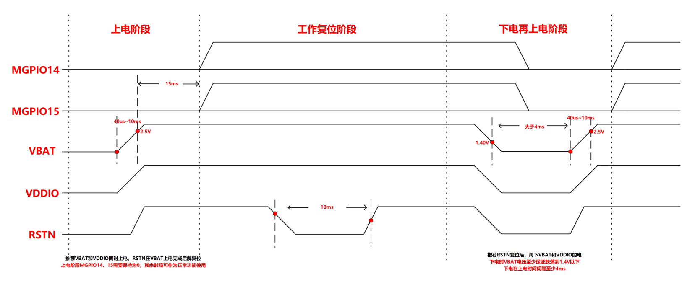

1.  外部电池电源VBAT、IO电源VDDIO处于下电状态，芯片处于下电状态。
2.  外部电源VBAT、VDDIO上电（推荐同时上电）。其中VBAT可能存在慢上电场景、VBAT上电稳定约40μs\~10ms。
3.  VBAT和VDDIO上电后约20ms后、CLDO上电稳定、开始CRG解复位。
4.  WS53V100开机电源系统上无Power-on信号、POR模块主要是对VBAT和内部电源进行检测、当两者都在位时、才会送出芯片内部的解复位信号。
5.  VBAT上电阈值：2.5V；

    VBAT下电阈值： 1.4V。

6.  WS53V100开机电源系统上无Power-on信号、外部有RST\_N负责全芯片复位、其状态由板级电路维护。
7.  VBAT欠压或者撤离时、POR检查到掉电、会复位整个芯片、从而实现安全下电。

> **说明：** 
>-   PMU电源对应管脚：VDD\_VBAT1、VDD\_VBAT2、AVDD33。
>-   VDDIO对应管脚：VDDIO。
>-   当芯片掉电后，需要保证VDDIO和VBAT电平低于200mV。
>-   单板复位通过RST\_N管脚实现。RST\_N行为为拉低、后拉高。其中RST\_N拉低时间需要持续10ms以上。

# 原理图设计建议

-   **[小系统设计建议](#ZH-CN_TOPIC_0000001505842481)**  

-   **[电源参考设计](#ZH-CN_TOPIC_0000001505842445)**  

-   **[外围接口设计建议](#ZH-CN_TOPIC_0000001505603517)**  

-   **[控制信号及低功耗应用参考设计](#ZH-CN_TOPIC_0000001505842493)**  

## 小系统设计建议

小系统指芯片电路能够正常工作的最小外围电路配置，此部分的电路主要包括：时钟电路、复位电路。

-   **[参考时钟设计](#ZH-CN_TOPIC_0000001505842485)**  

-   **[RTC时钟](#ZH-CN_TOPIC_0000002018433230)**  

-   **[复位电路](#ZH-CN_TOPIC_0000001456082748)**  

### 参考时钟设计

晶体时钟支持32MHz，在使用外部晶体时，电路结构如[图1](#fig1341612873619)所示。其中，Cload电容默认不上件，XIN，XOUT串联0Ω电阻，用于调节晶体寄生电容，30Ω为限流电阻（根据晶体的DL参数决定是否上件）。

**图 1**  使用Crystal输入参考时钟的参考电路图  
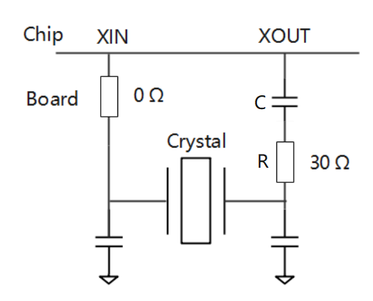

外部Crystal电气特性的要求如[表1](#table8856940134)所示。

**表 1**  Crystal电气特性要求

<table><thead align="left"><tr id="row88573400318"><th class="cellrowborder" valign="top" id="mcps1.2.9.1.1">
参数

</th>
<th class="cellrowborder" valign="top" id="mcps1.2.9.1.2">
符号

</th>
<th class="cellrowborder" colspan="4" valign="top" id="mcps1.2.9.1.3">
晶体选型规格

</th>
<th class="cellrowborder" valign="top" id="mcps1.2.9.1.4">
单位

</th>
<th class="cellrowborder" valign="top" id="mcps1.2.9.1.5">
备注

</th>
</tr>
</thead>
<tbody><tr id="row169487812717"><td class="cellrowborder" valign="top" width="14.48855114488551%" headers="mcps1.2.9.1.1 ">
标称频率

</td>
<td class="cellrowborder" valign="top" width="11.908809119088092%" headers="mcps1.2.9.1.2 ">
f

</td>
<td class="cellrowborder" valign="top" width="10.64893510648935%" headers="mcps1.2.9.1.3 ">
32

</td>
<td class="cellrowborder" valign="top" width="12.1987801219878%" headers="mcps1.2.9.1.3 ">
32

</td>
<td class="cellrowborder" valign="top" width="11.668833116688331%" headers="mcps1.2.9.1.3 ">
32

</td>
<td class="cellrowborder" valign="top" width="11.50884911508849%" headers="mcps1.2.9.1.3 ">
32

</td>
<td class="cellrowborder" valign="top" width="10.608939106089391%" headers="mcps1.2.9.1.4 ">
MHz

</td>
<td class="cellrowborder" valign="top" width="16.96830316968303%" headers="mcps1.2.9.1.5 ">
-

</td>
</tr>
<tr id="row7702643123810"><td class="cellrowborder" valign="top" width="14.48855114488551%" headers="mcps1.2.9.1.1 ">
负载电容

</td>
<td class="cellrowborder" valign="top" width="11.908809119088092%" headers="mcps1.2.9.1.2 ">
CL

</td>
<td class="cellrowborder" valign="top" width="10.64893510648935%" headers="mcps1.2.9.1.3 ">
7

</td>
<td class="cellrowborder" valign="top" width="12.1987801219878%" headers="mcps1.2.9.1.3 ">
8

</td>
<td class="cellrowborder" valign="top" width="11.668833116688331%" headers="mcps1.2.9.1.3 ">
9

</td>
<td class="cellrowborder" valign="top" width="11.50884911508849%" headers="mcps1.2.9.1.3 ">
12[1]

</td>
<td class="cellrowborder" valign="top" width="10.608939106089391%" headers="mcps1.2.9.1.4 ">
pF

</td>
<td class="cellrowborder" valign="top" width="16.96830316968303%" headers="mcps1.2.9.1.5 ">
-

</td>
</tr>
<tr id="row1458152642016"><td class="cellrowborder" valign="top" width="14.48855114488551%" headers="mcps1.2.9.1.1 ">
Xout串联电容

</td>
<td class="cellrowborder" valign="top" width="11.908809119088092%" headers="mcps1.2.9.1.2 ">
C

</td>
<td class="cellrowborder" valign="top" width="10.64893510648935%" headers="mcps1.2.9.1.3 ">
18

</td>
<td class="cellrowborder" valign="top" width="12.1987801219878%" headers="mcps1.2.9.1.3 ">
18

</td>
<td class="cellrowborder" valign="top" width="11.668833116688331%" headers="mcps1.2.9.1.3 ">
27

</td>
<td class="cellrowborder" valign="top" width="11.50884911508849%" headers="mcps1.2.9.1.3 ">
-

</td>
<td class="cellrowborder" valign="top" width="10.608939106089391%" headers="mcps1.2.9.1.4 ">
pF

</td>
<td class="cellrowborder" valign="top" width="16.96830316968303%" headers="mcps1.2.9.1.5 ">
XOUT预留0Ω电阻串位，用于调节晶体寄生电容。其中12pF晶体无需串联电容。

</td>
</tr>
<tr id="row1225143142718"><td class="cellrowborder" valign="top" width="14.48855114488551%" headers="mcps1.2.9.1.1 ">
频率容差

</td>
<td class="cellrowborder" valign="top" width="11.908809119088092%" headers="mcps1.2.9.1.2 ">
f_tol

</td>
<td class="cellrowborder" valign="top" width="10.64893510648935%" headers="mcps1.2.9.1.3 ">
&plusmn;10

</td>
<td class="cellrowborder" valign="top" width="12.1987801219878%" headers="mcps1.2.9.1.3 ">
&plusmn;10

</td>
<td class="cellrowborder" valign="top" width="11.668833116688331%" headers="mcps1.2.9.1.3 ">
&plusmn;10

</td>
<td class="cellrowborder" valign="top" width="11.50884911508849%" headers="mcps1.2.9.1.3 ">
&plusmn;10

</td>
<td class="cellrowborder" valign="top" width="10.608939106089391%" headers="mcps1.2.9.1.4 ">
ppm

</td>
<td class="cellrowborder" valign="top" width="16.96830316968303%" headers="mcps1.2.9.1.5 ">
晶体初始频偏

</td>
</tr>
<tr id="row842213547374"><td class="cellrowborder" valign="top" width="14.48855114488551%" headers="mcps1.2.9.1.1 ">
频率稳定性

</td>
<td class="cellrowborder" valign="top" width="11.908809119088092%" headers="mcps1.2.9.1.2 ">
f_temp

</td>
<td class="cellrowborder" valign="top" width="10.64893510648935%" headers="mcps1.2.9.1.3 ">
&plusmn;10

</td>
<td class="cellrowborder" valign="top" width="12.1987801219878%" headers="mcps1.2.9.1.3 ">
&plusmn;10

</td>
<td class="cellrowborder" valign="top" width="11.668833116688331%" headers="mcps1.2.9.1.3 ">
&plusmn;10

</td>
<td class="cellrowborder" valign="top" width="11.50884911508849%" headers="mcps1.2.9.1.3 ">
&plusmn;10

</td>
<td class="cellrowborder" valign="top" width="10.608939106089391%" headers="mcps1.2.9.1.4 ">
ppm

</td>
<td class="cellrowborder" valign="top" width="16.96830316968303%" headers="mcps1.2.9.1.5 ">
晶体温漂

</td>
</tr>
<tr id="row199381515399"><td class="cellrowborder" valign="top" width="14.48855114488551%" headers="mcps1.2.9.1.1 ">
激励功率

</td>
<td class="cellrowborder" valign="top" width="11.908809119088092%" headers="mcps1.2.9.1.2 ">
DL[2]

</td>
<td class="cellrowborder" valign="top" width="10.64893510648935%" headers="mcps1.2.9.1.3 ">
≥100

</td>
<td class="cellrowborder" valign="top" width="12.1987801219878%" headers="mcps1.2.9.1.3 ">
≥100

</td>
<td class="cellrowborder" valign="top" width="11.668833116688331%" headers="mcps1.2.9.1.3 ">
≥100

</td>
<td class="cellrowborder" valign="top" width="11.50884911508849%" headers="mcps1.2.9.1.3 ">
≥100

</td>
<td class="cellrowborder" valign="top" width="10.608939106089391%" headers="mcps1.2.9.1.4 ">
&micro;W

</td>
<td class="cellrowborder" valign="top" width="16.96830316968303%" headers="mcps1.2.9.1.5 ">
-

</td>
</tr>
<tr id="row37385612615"><td class="cellrowborder" valign="top" width="14.48855114488551%" headers="mcps1.2.9.1.1 ">
等效电阻

</td>
<td class="cellrowborder" valign="top" width="11.908809119088092%" headers="mcps1.2.9.1.2 ">
ESR

</td>
<td class="cellrowborder" valign="top" width="10.64893510648935%" headers="mcps1.2.9.1.3 ">
≤60 max

</td>
<td class="cellrowborder" valign="top" width="12.1987801219878%" headers="mcps1.2.9.1.3 ">
≤60 max

</td>
<td class="cellrowborder" valign="top" width="11.668833116688331%" headers="mcps1.2.9.1.3 ">
≤60 max

</td>
<td class="cellrowborder" valign="top" width="11.50884911508849%" headers="mcps1.2.9.1.3 ">
≤60 max

</td>
<td class="cellrowborder" valign="top" width="10.608939106089391%" headers="mcps1.2.9.1.4 ">
Ω

</td>
<td class="cellrowborder" valign="top" width="16.96830316968303%" headers="mcps1.2.9.1.5 ">
-

</td>
</tr>
<tr id="row17436126192517"><td class="cellrowborder" valign="top" width="14.48855114488551%" headers="mcps1.2.9.1.1 ">
动态电感

</td>
<td class="cellrowborder" valign="top" width="11.908809119088092%" headers="mcps1.2.9.1.2 ">
Lm[3]

</td>
<td class="cellrowborder" valign="top" width="10.64893510648935%" headers="mcps1.2.9.1.3 ">
8.3~10.8

</td>
<td class="cellrowborder" valign="top" width="12.1987801219878%" headers="mcps1.2.9.1.3 ">
7.1~10.0

</td>
<td class="cellrowborder" valign="top" width="11.668833116688331%" headers="mcps1.2.9.1.3 ">
5.8~11.7

</td>
<td class="cellrowborder" valign="top" width="11.50884911508849%" headers="mcps1.2.9.1.3 ">
5.8~9.2

</td>
<td class="cellrowborder" valign="top" width="10.608939106089391%" headers="mcps1.2.9.1.4 ">
mH

</td>
<td class="cellrowborder" valign="top" width="16.96830316968303%" headers="mcps1.2.9.1.5 ">
-

</td>
</tr>
<tr id="row89247481254"><td class="cellrowborder" valign="top" width="14.48855114488551%" headers="mcps1.2.9.1.1 ">
动态电容

</td>
<td class="cellrowborder" valign="top" width="11.908809119088092%" headers="mcps1.2.9.1.2 ">
C1[3]

</td>
<td class="cellrowborder" valign="top" width="10.64893510648935%" headers="mcps1.2.9.1.3 ">
2.3~3

</td>
<td class="cellrowborder" valign="top" width="12.1987801219878%" headers="mcps1.2.9.1.3 ">
2.48~3.5

</td>
<td class="cellrowborder" valign="top" width="11.668833116688331%" headers="mcps1.2.9.1.3 ">
2.12~4.29

</td>
<td class="cellrowborder" valign="top" width="11.50884911508849%" headers="mcps1.2.9.1.3 ">
2.7~5.55

</td>
<td class="cellrowborder" valign="top" width="10.608939106089391%" headers="mcps1.2.9.1.4 ">
fF

</td>
<td class="cellrowborder" valign="top" width="16.96830316968303%" headers="mcps1.2.9.1.5 ">
-

</td>
</tr>
<tr id="row17215133516257"><td class="cellrowborder" valign="top" width="14.48855114488551%" headers="mcps1.2.9.1.1 ">
静态电容

</td>
<td class="cellrowborder" valign="top" width="11.908809119088092%" headers="mcps1.2.9.1.2 ">
C0

</td>
<td class="cellrowborder" valign="top" width="10.64893510648935%" headers="mcps1.2.9.1.3 ">
≤2

</td>
<td class="cellrowborder" valign="top" width="12.1987801219878%" headers="mcps1.2.9.1.3 ">
≤2

</td>
<td class="cellrowborder" valign="top" width="11.668833116688331%" headers="mcps1.2.9.1.3 ">
≤2

</td>
<td class="cellrowborder" valign="top" width="11.50884911508849%" headers="mcps1.2.9.1.3 ">
≤2

</td>
<td class="cellrowborder" valign="top" width="10.608939106089391%" headers="mcps1.2.9.1.4 ">
pF

</td>
<td class="cellrowborder" valign="top" width="16.96830316968303%" headers="mcps1.2.9.1.5 ">
-

</td>
</tr>
<tr id="row19416113931217"><td class="cellrowborder" valign="top" width="14.48855114488551%" headers="mcps1.2.9.1.1 ">
工作温度

</td>
<td class="cellrowborder" valign="top" width="11.908809119088092%" headers="mcps1.2.9.1.2 ">
T

</td>
<td class="cellrowborder" valign="top" width="10.64893510648935%" headers="mcps1.2.9.1.3 ">
-30~+85

</td>
<td class="cellrowborder" valign="top" width="12.1987801219878%" headers="mcps1.2.9.1.3 ">
-30~+85

</td>
<td class="cellrowborder" valign="top" width="11.668833116688331%" headers="mcps1.2.9.1.3 ">
-30~+85

</td>
<td class="cellrowborder" valign="top" width="11.50884911508849%" headers="mcps1.2.9.1.3 ">
-30~+85

</td>
<td class="cellrowborder" valign="top" width="10.608939106089391%" headers="mcps1.2.9.1.4 ">
℃

</td>
<td class="cellrowborder" valign="top" width="16.96830316968303%" headers="mcps1.2.9.1.5 ">
-

</td>
</tr>
<tr id="row18471555104114"><td class="cellrowborder" valign="top" width="14.48855114488551%" headers="mcps1.2.9.1.1 ">
存储温度

</td>
<td class="cellrowborder" valign="top" width="11.908809119088092%" headers="mcps1.2.9.1.2 ">
T_s

</td>
<td class="cellrowborder" valign="top" width="10.64893510648935%" headers="mcps1.2.9.1.3 ">
-40~+125

</td>
<td class="cellrowborder" valign="top" width="12.1987801219878%" headers="mcps1.2.9.1.3 ">
-40~+125

</td>
<td class="cellrowborder" valign="top" width="11.668833116688331%" headers="mcps1.2.9.1.3 ">
-40~+125

</td>
<td class="cellrowborder" valign="top" width="11.50884911508849%" headers="mcps1.2.9.1.3 ">
-40~+125

</td>
<td class="cellrowborder" valign="top" width="10.608939106089391%" headers="mcps1.2.9.1.4 ">
℃

</td>
<td class="cellrowborder" valign="top" width="16.96830316968303%" headers="mcps1.2.9.1.5 ">
-

</td>
</tr>
</tbody>
</table>

其中：

-   CL：Crystal负载电容。
-   ESR：Crystal等效串联电阻。
-   推荐晶体参数：CL 8pF，ESR 60Ω\(max\)，Lm 9.97mH，C1 2.48fF，C0 0.7pF。
-   1612封装因为C1和Lm差异较大，频偏校准范围只支持±20ppm。
-   XIN和XOUT管脚PKG+PCB寄生电容≤1pF。
-   负载电容CL=\(C1×C2\)/\(C1+C2\)+Cs，其中C1为XIN管脚对地总电容，C2为XOUT管脚对地总电容，Cs为XIN和XOUT管脚之间寄生电容，如C1和C2均为14pF，Cs为1pF，则晶体的负载电容为8pF。
-   标注\[1\]：CL为12pF的晶体，XO支撑以慢启方式启动。
-   标注\[2\]：建议晶体选型时DL（max）≥100μW，若晶体DL（max）小于100μW，须在XOUT处串联30Ω电阻R，并且XO频偏校准范围为±20ppm。
-   标注\[3\]：表格里是Type值，Lm和C1覆盖范围是type值±10%。

### RTC时钟

> **说明：** 
>使用此功能前，需确认芯片版本是否支持此功能，详见《芯片用户指南》或《订购须知》描述。

WS53V100支持外部提供32.768kHz RTC时钟，用于低功耗处理。对32.768kHz RTC时钟的电气特性要求如[表1](#table1518714490175)所示。

**表 1**  RTC无源时钟电气特性要求

<table><thead align="left"><tr id="row1318794915173"><th class="cellrowborder" valign="top" width="20%" id="mcps1.2.6.1.1">
参数

</th>
<th class="cellrowborder" valign="top" width="20%" id="mcps1.2.6.1.2">
最小值

</th>
<th class="cellrowborder" valign="top" width="20%" id="mcps1.2.6.1.3">
典型值

</th>
<th class="cellrowborder" valign="top" width="20%" id="mcps1.2.6.1.4">
最大值

</th>
<th class="cellrowborder" valign="top" width="20%" id="mcps1.2.6.1.5">
单位

</th>
</tr>
</thead>
<tbody><tr id="row918718497171"><td class="cellrowborder" valign="top" width="20%" headers="mcps1.2.6.1.1 ">
时钟频率

</td>
<td class="cellrowborder" valign="top" width="20%" headers="mcps1.2.6.1.2 ">
-

</td>
<td class="cellrowborder" valign="top" width="20%" headers="mcps1.2.6.1.3 ">
32.768

</td>
<td class="cellrowborder" valign="top" width="20%" headers="mcps1.2.6.1.4 ">
-

</td>
<td class="cellrowborder" valign="top" width="20%" headers="mcps1.2.6.1.5 ">
kHz

</td>
</tr>
<tr id="row418764951711"><td class="cellrowborder" valign="top" width="20%" headers="mcps1.2.6.1.1 ">
频率误差

</td>
<td class="cellrowborder" valign="top" width="20%" headers="mcps1.2.6.1.2 ">
-

</td>
<td class="cellrowborder" valign="top" width="20%" headers="mcps1.2.6.1.3 ">
≤&plusmn;100

</td>
<td class="cellrowborder" valign="top" width="20%" headers="mcps1.2.6.1.4 ">
-

</td>
<td class="cellrowborder" valign="top" width="20%" headers="mcps1.2.6.1.5 ">
ppm

</td>
</tr>
<tr id="row15187204911714"><td class="cellrowborder" valign="top" width="20%" headers="mcps1.2.6.1.1 ">
负载电容（CL）

</td>
<td class="cellrowborder" valign="top" width="20%" headers="mcps1.2.6.1.2 ">
-

</td>
<td class="cellrowborder" valign="top" width="20%" headers="mcps1.2.6.1.3 ">
7

</td>
<td class="cellrowborder" valign="top" width="20%" headers="mcps1.2.6.1.4 ">
12.5

</td>
<td class="cellrowborder" valign="top" width="20%" headers="mcps1.2.6.1.5 ">
pF

</td>
</tr>
<tr id="row11871749151715"><td class="cellrowborder" valign="top" width="20%" headers="mcps1.2.6.1.1 ">
激励功率DL（max）

</td>
<td class="cellrowborder" valign="top" width="20%" headers="mcps1.2.6.1.2 ">
0.5

</td>
<td class="cellrowborder" valign="top" width="20%" headers="mcps1.2.6.1.3 ">
-

</td>
<td class="cellrowborder" valign="top" width="20%" headers="mcps1.2.6.1.4 ">
1.5

</td>
<td class="cellrowborder" valign="top" width="20%" headers="mcps1.2.6.1.5 ">
μW

</td>
</tr>
</tbody>
</table>

RTC无源时钟参考电路设计如[图1](#fig59311429311)所示，其中C1&C2可以基于晶体负载电容CL计算，典型C1=C2=CL\*2，考虑封装和板级寄生，C1&C2取值可以略小；

**图 1**  RTC无源时钟参考设计电路  
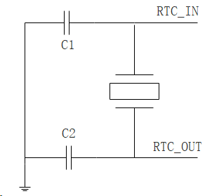

针对无源时钟，需要根据所选晶体的ESR参数，选择相对应的驱动能力，详细参考[表2](#table121851430171013)；

**表 2**  驱动能力与ESR对照表

<table><thead align="left"><tr id="row20186103013104"><th class="cellrowborder" valign="top" width="33.33333333333333%" id="mcps1.2.4.1.1">
CL

</th>
<th class="cellrowborder" valign="top" width="33.33333333333333%" id="mcps1.2.4.1.2">
DS1:DS0

</th>
<th class="cellrowborder" valign="top" width="33.33333333333333%" id="mcps1.2.4.1.3">
ESR_Max

</th>
</tr>
</thead>
<tbody><tr id="row118603081019"><td class="cellrowborder" rowspan="4" valign="top" width="33.33333333333333%" headers="mcps1.2.4.1.1 ">
7p

</td>
<td class="cellrowborder" valign="top" width="33.33333333333333%" headers="mcps1.2.4.1.2 ">
00

</td>
<td class="cellrowborder" valign="top" width="33.33333333333333%" headers="mcps1.2.4.1.3 ">
50kΩ

</td>
</tr>
<tr id="row1418616308107"><td class="cellrowborder" valign="top" headers="mcps1.2.4.1.1 ">
01

</td>
<td class="cellrowborder" valign="top" headers="mcps1.2.4.1.2 ">
90kΩ

</td>
</tr>
<tr id="row3186103081017"><td class="cellrowborder" valign="top" headers="mcps1.2.4.1.1 ">
10

</td>
<td class="cellrowborder" valign="top" headers="mcps1.2.4.1.2 ">
130kΩ

</td>
</tr>
<tr id="row61869301102"><td class="cellrowborder" valign="top" headers="mcps1.2.4.1.1 ">
11

</td>
<td class="cellrowborder" valign="top" headers="mcps1.2.4.1.2 ">
170kΩ

</td>
</tr>
<tr id="row18186103091014"><td class="cellrowborder" rowspan="4" valign="top" width="33.33333333333333%" headers="mcps1.2.4.1.1 ">
12.5p

</td>
<td class="cellrowborder" valign="top" width="33.33333333333333%" headers="mcps1.2.4.1.2 ">
00

</td>
<td class="cellrowborder" valign="top" width="33.33333333333333%" headers="mcps1.2.4.1.3 ">
20kΩ

</td>
</tr>
<tr id="row1718693013102"><td class="cellrowborder" valign="top" headers="mcps1.2.4.1.1 ">
01

</td>
<td class="cellrowborder" valign="top" headers="mcps1.2.4.1.2 ">
35kΩ

</td>
</tr>
<tr id="row41863309107"><td class="cellrowborder" valign="top" headers="mcps1.2.4.1.1 ">
10

</td>
<td class="cellrowborder" valign="top" headers="mcps1.2.4.1.2 ">
50kΩ

</td>
</tr>
<tr id="row73111716111319"><td class="cellrowborder" valign="top" headers="mcps1.2.4.1.1 ">
11

</td>
<td class="cellrowborder" valign="top" headers="mcps1.2.4.1.2 ">
70kΩ

</td>
</tr>
</tbody>
</table>

### 复位电路

WS53V100集成内部 POR （Power On Reset ）电路以及 Watchdog。

**图 1**  WS53V100 RST\_N电路  
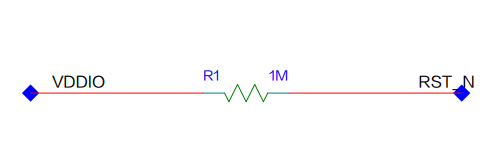

## 电源参考设计

> **说明：** 
>系统电源的设计，详细请参见《WS53V100 DEMO板原理图》。

-   **[电源规格](#ZH-CN_TOPIC_0000001505882577)**  

-   **[VBAT电源](#ZH-CN_TOPIC_0000001505603553)**  

-   **[VDDIO电源](#ZH-CN_TOPIC_0000001455763056)**  

-   **[内部电源滤波电路](#ZH-CN_TOPIC_0000001505603525)**  

-   **[RFLDO1](#ZH-CN_TOPIC_0000001505882541)**  

-   **[BUCK/LDO电源](#ZH-CN_TOPIC_0000001505882569)**  

-   **[PA供电](#ZH-CN_TOPIC_0000001505603537)**  

-   **[注意事项](#ZH-CN_TOPIC_0000001456082736)**  

### 电源规格

WS53V100需要的外部电源包括：

-   电池电源VBAT
-   IO电源VDDIO

芯片内部主要集成了BUCK和多个低压差线性稳压器（LDO）：

-   BUCK：作为一个中间的电源平面给多个LDO提供电源。
-   LDO：分为给数字提供电源的LDO和低噪声LDO。
-   PMU内部有一个BUCK提供1.3V电源。

    推荐工作条件如[表1](#table52313500)所示。

**表 1**  推荐工作条件

<table><thead align="left"><tr id="row39909729"><th class="cellrowborder" valign="top" width="7.5200000000000005%" id="mcps1.2.7.1.1">
Pin

</th>
<th class="cellrowborder" valign="top" width="17.47%" id="mcps1.2.7.1.2">
管脚名称

</th>
<th class="cellrowborder" valign="top" width="36.059999999999995%" id="mcps1.2.7.1.3">
参数说明

</th>
<th class="cellrowborder" valign="top" width="13.01%" id="mcps1.2.7.1.4">
最小值（V）

</th>
<th class="cellrowborder" valign="top" width="12.64%" id="mcps1.2.7.1.5">
典型值（V）

</th>
<th class="cellrowborder" valign="top" width="13.3%" id="mcps1.2.7.1.6">
最大值（V）

</th>
</tr>
</thead>
<tbody><tr id="row37463758"><td class="cellrowborder" valign="top" width="7.5200000000000005%" headers="mcps1.2.7.1.1 ">
9

</td>
<td class="cellrowborder" valign="top" width="17.47%" headers="mcps1.2.7.1.2 ">
VDD_VBAT2

</td>
<td class="cellrowborder" valign="top" width="36.059999999999995%" headers="mcps1.2.7.1.3 ">
INTLDO和XLDO输入电源，由外部电源提供

</td>
<td class="cellrowborder" valign="top" width="13.01%" headers="mcps1.2.7.1.4 ">
3.16

</td>
<td class="cellrowborder" valign="top" width="12.64%" headers="mcps1.2.7.1.5 ">
3.3

</td>
<td class="cellrowborder" valign="top" width="13.3%" headers="mcps1.2.7.1.6 ">
3.6

</td>
</tr>
<tr id="row15277157193513"><td class="cellrowborder" valign="top" width="7.5200000000000005%" headers="mcps1.2.7.1.1 ">
10

</td>
<td class="cellrowborder" valign="top" width="17.47%" headers="mcps1.2.7.1.2 ">
VDD_1P3

</td>
<td class="cellrowborder" valign="top" width="36.059999999999995%" headers="mcps1.2.7.1.3 ">
RFLDO1，RFLDO2输入电源

</td>
<td class="cellrowborder" valign="top" width="13.01%" headers="mcps1.2.7.1.4 ">
-

</td>
<td class="cellrowborder" valign="top" width="12.64%" headers="mcps1.2.7.1.5 ">
1.3

</td>
<td class="cellrowborder" valign="top" width="13.3%" headers="mcps1.2.7.1.6 ">
-

</td>
</tr>
<tr id="row7800184553718"><td class="cellrowborder" valign="top" width="7.5200000000000005%" headers="mcps1.2.7.1.1 ">
13

</td>
<td class="cellrowborder" valign="top" width="17.47%" headers="mcps1.2.7.1.2 ">
VDD_WL_RF_TRX_1P1

</td>
<td class="cellrowborder" valign="top" width="36.059999999999995%" headers="mcps1.2.7.1.3 ">
芯片内部TRX相关模块输入电源

</td>
<td class="cellrowborder" valign="top" width="13.01%" headers="mcps1.2.7.1.4 ">
-

</td>
<td class="cellrowborder" valign="top" width="12.64%" headers="mcps1.2.7.1.5 ">
1.15

</td>
<td class="cellrowborder" valign="top" width="13.3%" headers="mcps1.2.7.1.6 ">
-

</td>
</tr>
<tr id="row429912404329"><td class="cellrowborder" valign="top" width="7.5200000000000005%" headers="mcps1.2.7.1.1 ">
14

</td>
<td class="cellrowborder" valign="top" width="17.47%" headers="mcps1.2.7.1.2 ">
VDD_WL_RF_PA_3P3

</td>
<td class="cellrowborder" valign="top" width="36.059999999999995%" headers="mcps1.2.7.1.3 ">
WiFi PA供电电源，由外部电源提供

</td>
<td class="cellrowborder" valign="top" width="13.01%" headers="mcps1.2.7.1.4 ">
3.16

</td>
<td class="cellrowborder" valign="top" width="12.64%" headers="mcps1.2.7.1.5 ">
3.3

</td>
<td class="cellrowborder" valign="top" width="13.3%" headers="mcps1.2.7.1.6 ">
3.6

</td>
</tr>
<tr id="row40592626"><td class="cellrowborder" valign="top" width="7.5200000000000005%" headers="mcps1.2.7.1.1 ">
16

</td>
<td class="cellrowborder" valign="top" width="17.47%" headers="mcps1.2.7.1.2 ">
VDD_RF_RX_1P1

</td>
<td class="cellrowborder" valign="top" width="36.059999999999995%" headers="mcps1.2.7.1.3 ">
芯片LNA输入电源

</td>
<td class="cellrowborder" valign="top" width="13.01%" headers="mcps1.2.7.1.4 ">
-

</td>
<td class="cellrowborder" valign="top" width="12.64%" headers="mcps1.2.7.1.5 ">
1.15

</td>
<td class="cellrowborder" valign="top" width="13.3%" headers="mcps1.2.7.1.6 ">
-

</td>
</tr>
<tr id="row635014154358"><td class="cellrowborder" valign="top" width="7.5200000000000005%" headers="mcps1.2.7.1.1 ">
17

</td>
<td class="cellrowborder" valign="top" width="17.47%" headers="mcps1.2.7.1.2 ">
VDD_BSLE_RF_PA_1P3

</td>
<td class="cellrowborder" valign="top" width="36.059999999999995%" headers="mcps1.2.7.1.3 ">
BSLE LDO输入电源

</td>
<td class="cellrowborder" valign="top" width="13.01%" headers="mcps1.2.7.1.4 ">
-

</td>
<td class="cellrowborder" valign="top" width="12.64%" headers="mcps1.2.7.1.5 ">
1.3

</td>
<td class="cellrowborder" valign="top" width="13.3%" headers="mcps1.2.7.1.6 ">
-

</td>
</tr>
<tr id="row18313622173510"><td class="cellrowborder" valign="top" width="7.5200000000000005%" headers="mcps1.2.7.1.1 ">
19

</td>
<td class="cellrowborder" valign="top" width="17.47%" headers="mcps1.2.7.1.2 ">
VDD_BSLE_RF_DRV_1P3

</td>
<td class="cellrowborder" valign="top" width="36.059999999999995%" headers="mcps1.2.7.1.3 ">
BSLE LDO输入电源

</td>
<td class="cellrowborder" valign="top" width="13.01%" headers="mcps1.2.7.1.4 ">
-

</td>
<td class="cellrowborder" valign="top" width="12.64%" headers="mcps1.2.7.1.5 ">
1.3

</td>
<td class="cellrowborder" valign="top" width="13.3%" headers="mcps1.2.7.1.6 ">
-

</td>
</tr>
<tr id="row16809195611366"><td class="cellrowborder" valign="top" width="7.5200000000000005%" headers="mcps1.2.7.1.1 ">
20

</td>
<td class="cellrowborder" valign="top" width="17.47%" headers="mcps1.2.7.1.2 ">
VDD_BSLE_PLL_DCO_1P3

</td>
<td class="cellrowborder" valign="top" width="36.059999999999995%" headers="mcps1.2.7.1.3 ">
BSLE LDO输入电源

</td>
<td class="cellrowborder" valign="top" width="13.01%" headers="mcps1.2.7.1.4 ">
-

</td>
<td class="cellrowborder" valign="top" width="12.64%" headers="mcps1.2.7.1.5 ">
1.3

</td>
<td class="cellrowborder" valign="top" width="13.3%" headers="mcps1.2.7.1.6 ">
-

</td>
</tr>
<tr id="row54786185354"><td class="cellrowborder" valign="top" width="7.5200000000000005%" headers="mcps1.2.7.1.1 ">
37

</td>
<td class="cellrowborder" valign="top" width="17.47%" headers="mcps1.2.7.1.2 ">
VDDIO

</td>
<td class="cellrowborder" valign="top" width="36.059999999999995%" headers="mcps1.2.7.1.3 ">
IO电源，由外部电源提供

</td>
<td class="cellrowborder" valign="top" width="13.01%" headers="mcps1.2.7.1.4 ">
1.71

</td>
<td class="cellrowborder" valign="top" width="12.64%" headers="mcps1.2.7.1.5 ">
1.8/3.3

</td>
<td class="cellrowborder" valign="top" width="13.3%" headers="mcps1.2.7.1.6 ">
3.465

</td>
</tr>
<tr id="row7182340"><td class="cellrowborder" valign="top" width="7.5200000000000005%" headers="mcps1.2.7.1.1 ">
38

</td>
<td class="cellrowborder" valign="top" width="17.47%" headers="mcps1.2.7.1.2 ">
AVDD33

</td>
<td class="cellrowborder" valign="top" width="36.059999999999995%" headers="mcps1.2.7.1.3 ">
LSADC和REF供电电源，由外部电源提供

</td>
<td class="cellrowborder" valign="top" width="13.01%" headers="mcps1.2.7.1.4 ">
3.16

</td>
<td class="cellrowborder" valign="top" width="12.64%" headers="mcps1.2.7.1.5 ">
3.3

</td>
<td class="cellrowborder" valign="top" width="13.3%" headers="mcps1.2.7.1.6 ">
3.465

</td>
</tr>
<tr id="row133815122351"><td class="cellrowborder" valign="top" width="7.5200000000000005%" headers="mcps1.2.7.1.1 ">
39

</td>
<td class="cellrowborder" valign="top" width="17.47%" headers="mcps1.2.7.1.2 ">
VDD_VBAT1

</td>
<td class="cellrowborder" valign="top" width="36.059999999999995%" headers="mcps1.2.7.1.3 ">
芯片BUCK输入电源，由外部电源提供

</td>
<td class="cellrowborder" valign="top" width="13.01%" headers="mcps1.2.7.1.4 ">
3.16

</td>
<td class="cellrowborder" valign="top" width="12.64%" headers="mcps1.2.7.1.5 ">
3.3

</td>
<td class="cellrowborder" valign="top" width="13.3%" headers="mcps1.2.7.1.6 ">
3.465

</td>
</tr>
<tr id="row3288825"><td class="cellrowborder" valign="top" width="7.5200000000000005%" headers="mcps1.2.7.1.1 ">
41

</td>
<td class="cellrowborder" valign="top" width="17.47%" headers="mcps1.2.7.1.2 ">
VDD1P3_PMU1

</td>
<td class="cellrowborder" valign="top" width="36.059999999999995%" headers="mcps1.2.7.1.3 ">
芯片BUCK反馈及CLDO输入

</td>
<td class="cellrowborder" valign="top" width="13.01%" headers="mcps1.2.7.1.4 ">
-

</td>
<td class="cellrowborder" valign="top" width="12.64%" headers="mcps1.2.7.1.5 ">
1.3

</td>
<td class="cellrowborder" valign="top" width="13.3%" headers="mcps1.2.7.1.6 ">
-

</td>
</tr>
<tr id="row16175844143619"><td class="cellrowborder" valign="top" width="7.5200000000000005%" headers="mcps1.2.7.1.1 ">
6

</td>
<td class="cellrowborder" valign="top" width="17.47%" headers="mcps1.2.7.1.2 ">
XLDO_OUT

</td>
<td class="cellrowborder" valign="top" width="36.059999999999995%" headers="mcps1.2.7.1.3 ">
芯片XLDO decap管脚，接板级滤波电容

</td>
<td class="cellrowborder" valign="top" width="13.01%" headers="mcps1.2.7.1.4 ">
-

</td>
<td class="cellrowborder" valign="top" width="12.64%" headers="mcps1.2.7.1.5 ">
1

</td>
<td class="cellrowborder" valign="top" width="13.3%" headers="mcps1.2.7.1.6 ">
-

</td>
</tr>
<tr id="row189292416368"><td class="cellrowborder" valign="top" width="7.5200000000000005%" headers="mcps1.2.7.1.1 ">
11

</td>
<td class="cellrowborder" valign="top" width="17.47%" headers="mcps1.2.7.1.2 ">
VDD_RFLDO1

</td>
<td class="cellrowborder" valign="top" width="36.059999999999995%" headers="mcps1.2.7.1.3 ">
内部LDO电源，输出提供给VDD_WL_RF_TRX_1P1、

VDD_RF_RX_1P1

</td>
<td class="cellrowborder" valign="top" width="13.01%" headers="mcps1.2.7.1.4 ">
-

</td>
<td class="cellrowborder" valign="top" width="12.64%" headers="mcps1.2.7.1.5 ">
1.15

</td>
<td class="cellrowborder" valign="top" width="13.3%" headers="mcps1.2.7.1.6 ">
-

</td>
</tr>
<tr id="row1539134317380"><td class="cellrowborder" valign="top" width="7.5200000000000005%" headers="mcps1.2.7.1.1 ">
12

</td>
<td class="cellrowborder" valign="top" width="17.47%" headers="mcps1.2.7.1.2 ">
VDD_RFLDO2

</td>
<td class="cellrowborder" valign="top" width="36.059999999999995%" headers="mcps1.2.7.1.3 ">
RFLDO2电源decap管脚，接板级滤波电容

</td>
<td class="cellrowborder" valign="top" width="13.01%" headers="mcps1.2.7.1.4 ">
-

</td>
<td class="cellrowborder" valign="top" width="12.64%" headers="mcps1.2.7.1.5 ">
1.15

</td>
<td class="cellrowborder" valign="top" width="13.3%" headers="mcps1.2.7.1.6 ">
-

</td>
</tr>
<tr id="row076412389"><td class="cellrowborder" valign="top" width="7.5200000000000005%" headers="mcps1.2.7.1.1 ">
18

</td>
<td class="cellrowborder" valign="top" width="17.47%" headers="mcps1.2.7.1.2 ">
VDD_BSLE_DPALDO

</td>
<td class="cellrowborder" valign="top" width="36.059999999999995%" headers="mcps1.2.7.1.3 ">
芯片内部BSLE电源decap管脚，接板级滤波电容

</td>
<td class="cellrowborder" valign="top" width="13.01%" headers="mcps1.2.7.1.4 ">
-

</td>
<td class="cellrowborder" valign="top" width="12.64%" headers="mcps1.2.7.1.5 ">
1.1

</td>
<td class="cellrowborder" valign="top" width="13.3%" headers="mcps1.2.7.1.6 ">
-

</td>
</tr>
<tr id="row14777133919361"><td class="cellrowborder" valign="top" width="7.5200000000000005%" headers="mcps1.2.7.1.1 ">
40

</td>
<td class="cellrowborder" valign="top" width="17.47%" headers="mcps1.2.7.1.2 ">
BUCK_LX

</td>
<td class="cellrowborder" valign="top" width="36.059999999999995%" headers="mcps1.2.7.1.3 ">
芯片BUCK LX输出1.3V，接板级电感、电容滤波

</td>
<td class="cellrowborder" valign="top" width="13.01%" headers="mcps1.2.7.1.4 ">
-

</td>
<td class="cellrowborder" valign="top" width="12.64%" headers="mcps1.2.7.1.5 ">
1.3

</td>
<td class="cellrowborder" valign="top" width="13.3%" headers="mcps1.2.7.1.6 ">
-

</td>
</tr>
<tr id="row17225737101817"><td class="cellrowborder" valign="top" width="7.5200000000000005%" headers="mcps1.2.7.1.1 ">
42

</td>
<td class="cellrowborder" valign="top" width="17.47%" headers="mcps1.2.7.1.2 ">
VDD_CLDO

</td>
<td class="cellrowborder" valign="top" width="36.059999999999995%" headers="mcps1.2.7.1.3 ">
芯片内部数字电源，外接1μF滤波电容

</td>
<td class="cellrowborder" valign="top" width="13.01%" headers="mcps1.2.7.1.4 ">
-

</td>
<td class="cellrowborder" valign="top" width="12.64%" headers="mcps1.2.7.1.5 ">
1.0

</td>
<td class="cellrowborder" valign="top" width="13.3%" headers="mcps1.2.7.1.6 ">
-

</td>
</tr>
</tbody>
</table>

**表 2**  内部DC-DC产生的1P3电源外围器件要求

<table><thead align="left"><tr id="row17758113912223"><th class="cellrowborder" valign="top" width="41.349999999999994%" id="mcps1.2.3.1.1">
器件名称

</th>
<th class="cellrowborder" valign="top" width="58.650000000000006%" id="mcps1.2.3.1.2">
大小

</th>
</tr>
</thead>
<tbody><tr id="row18759193992214"><td class="cellrowborder" valign="top" width="41.349999999999994%" headers="mcps1.2.3.1.1 ">
电感

</td>
<td class="cellrowborder" valign="top" width="58.650000000000006%" headers="mcps1.2.3.1.2 ">
2.2μH

</td>
</tr>
<tr id="row10759143932219"><td class="cellrowborder" valign="top" width="41.349999999999994%" headers="mcps1.2.3.1.1 ">
电容

</td>
<td class="cellrowborder" valign="top" width="58.650000000000006%" headers="mcps1.2.3.1.2 ">
10μF

</td>
</tr>
</tbody>
</table>

### VBAT电源

WS53V100包含2个VBAT电源输入管脚：

-   VDD\_VBAT1：BUCK的输入电源。
-   VDD\_VBAT2：INTLDO和XLDO输入电源。

VBAT支持3～3.6 V输入，VBAT电源可以由外部PMU芯片或者外部BUCK电路生成提供。

-   **[VBAT参考电路](#ZH-CN_TOPIC_0000001505722801)**  

-   **[VBAT输入电源要求](#ZH-CN_TOPIC_0000001455763052)**  

#### VBAT参考电路

VBAT给芯片提供工作电源，VDD\_VBAT1和VDD\_VBAT2每个输入管脚各放一个电容用于储能滤波。参考电路图如[图1 WS53V100 VBAT输入电路](#toc528421851)所示。

<table><thead align="left"><tr id="row62429864"><th class="cellrowborder" valign="top" width="7.5200000000000005%" id="mcps1.1.4.1.1">
Pin

</th>
<th class="cellrowborder" valign="top" width="20.200000000000003%" id="mcps1.1.4.1.2">
名称

</th>
<th class="cellrowborder" valign="top" width="72.28%" id="mcps1.1.4.1.3">
设计建议

</th>
</tr>
</thead>
<tbody><tr id="row52190020"><td class="cellrowborder" valign="top" width="7.5200000000000005%" headers="mcps1.1.4.1.1 ">
39

</td>
<td class="cellrowborder" valign="top" width="20.200000000000003%" headers="mcps1.1.4.1.2 ">
VDD_VBAT1

</td>
<td class="cellrowborder" valign="top" width="72.28%" headers="mcps1.1.4.1.3 ">
外接4.7μF电容，耐压值≥6.3V。

</td>
</tr>
<tr id="row64182307"><td class="cellrowborder" valign="top" width="7.5200000000000005%" headers="mcps1.1.4.1.1 ">
9

</td>
<td class="cellrowborder" valign="top" width="20.200000000000003%" headers="mcps1.1.4.1.2 ">
VDD_VBAT2

</td>
<td class="cellrowborder" valign="top" width="72.28%" headers="mcps1.1.4.1.3 ">
外接1μF电容，耐压值≥6.3V。

</td>
</tr>
<tr id="row52661449185512"><td class="cellrowborder" valign="top" width="7.5200000000000005%" headers="mcps1.1.4.1.1 ">
38

</td>
<td class="cellrowborder" valign="top" width="20.200000000000003%" headers="mcps1.1.4.1.2 ">
AVDD33

</td>
<td class="cellrowborder" valign="top" width="72.28%" headers="mcps1.1.4.1.3 ">
外接1μF电容，耐压值≥6.3V，布局空间受限可以考虑和VDD_VBAT1共用4.7uF滤波电容。

</td>
</tr>
</tbody>
</table>

**图 1**  WS53V100 VBAT输入电路  

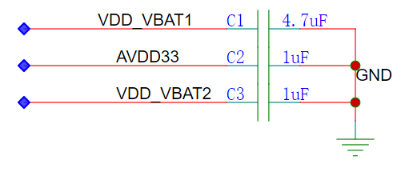

#### VBAT输入电源要求

WS53V100的VBAT输入电源要求如下：

-   要求电源噪声峰峰值在±3%以内。
-   选择合适的电感和输出滤波电容，能够更有效抑制纹波和谐波干扰。

### VDDIO电源

WS53V100有1个VDDIO电源输入管脚：

-   VDDIO

支持1.8V/3.3V电压，推荐设计建议如[表1](#table50845041)所示，参考电路图如[图1](#fig118162314710)所示。

**表 1**  VDDIO电源设计建议

<table><thead align="left"><tr id="row62429864"><th class="cellrowborder" valign="top" width="7.5200000000000005%" id="mcps1.2.4.1.1">
Pin

</th>
<th class="cellrowborder" valign="top" width="20.200000000000003%" id="mcps1.2.4.1.2">
名称

</th>
<th class="cellrowborder" valign="top" width="72.28%" id="mcps1.2.4.1.3">
设计建议

</th>
</tr>
</thead>
<tbody><tr id="row52190020"><td class="cellrowborder" valign="top" width="7.5200000000000005%" headers="mcps1.2.4.1.1 ">
37

</td>
<td class="cellrowborder" valign="top" width="20.200000000000003%" headers="mcps1.2.4.1.2 ">
VDDIO

</td>
<td class="cellrowborder" valign="top" width="72.28%" headers="mcps1.2.4.1.3 ">
外接1μF电容，耐压值≥6.3V。

</td>
</tr>
</tbody>
</table>

**图 1**  VDDIO输入电路  
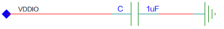

### 内部电源滤波电路

内部电源中的VDD\_CLDO、VDD\_RFLDO2需要外接滤波电容，推荐设计建议如[表1](#table1033313212284)所示，参考电路图如[图1](#toc528421854)所示。

**表 1**  内部电源滤波电路设计建议

<table><thead align="left"><tr id="row333420214287"><th class="cellrowborder" valign="top" width="7.5200000000000005%" id="mcps1.2.4.1.1">
Pin

</th>
<th class="cellrowborder" valign="top" width="46.239999999999995%" id="mcps1.2.4.1.2">
名称

</th>
<th class="cellrowborder" valign="top" width="46.239999999999995%" id="mcps1.2.4.1.3">
设计建议

</th>
</tr>
</thead>
<tbody><tr id="row3845610121710"><td class="cellrowborder" valign="top" width="7.5200000000000005%" headers="mcps1.2.4.1.1 ">
6

</td>
<td class="cellrowborder" valign="top" width="46.239999999999995%" headers="mcps1.2.4.1.2 ">
XLDO_OUT

</td>
<td class="cellrowborder" valign="top" width="46.239999999999995%" headers="mcps1.2.4.1.3 ">
芯片XLDO decap管脚，需外接1μF滤波电容。

</td>
</tr>
<tr id="row13748121331711"><td class="cellrowborder" valign="top" width="7.5200000000000005%" headers="mcps1.2.4.1.1 ">
12

</td>
<td class="cellrowborder" valign="top" width="46.239999999999995%" headers="mcps1.2.4.1.2 ">
VDD_RFLDO2

</td>
<td class="cellrowborder" valign="top" width="46.239999999999995%" headers="mcps1.2.4.1.3 ">
芯片RFLDO2 decap管脚，需外接1μF滤波电容。

</td>
</tr>
<tr id="row123375216287"><td class="cellrowborder" valign="top" width="7.5200000000000005%" headers="mcps1.2.4.1.1 ">
42

</td>
<td class="cellrowborder" valign="top" width="46.239999999999995%" headers="mcps1.2.4.1.2 ">
VDD_CLDO

</td>
<td class="cellrowborder" valign="top" width="46.239999999999995%" headers="mcps1.2.4.1.3 ">
芯片数字电源decap管脚，需外接1μF滤波电容。

</td>
</tr>
</tbody>
</table>

**图 1**  内部电源滤波电路  

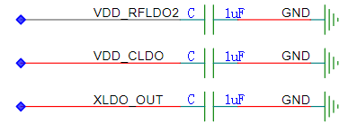

### RFLDO1

RFLDO1电源由WS53V100 管脚VDD\_RFLDO1输出，输出滤波电容1μF。RFLDO1给2个管脚供电，分别是VDD\_RF\_RX\_1P1 和VDD\_WL\_RF\_TRX\_1P1，推荐设计建议如[表1](#table10224544)所示，参考电路见[图1](#fig8285114720720)所示。

**表 1**  RFLDO1电源设计建议

<table><thead align="left"><tr id="row43104852"><th class="cellrowborder" valign="top" width="7.5200000000000005%" id="mcps1.2.4.1.1">
Pin

</th>
<th class="cellrowborder" valign="top" width="34.42%" id="mcps1.2.4.1.2">
名称

</th>
<th class="cellrowborder" valign="top" width="58.06%" id="mcps1.2.4.1.3">
说明

</th>
</tr>
</thead>
<tbody><tr id="row49904360"><td class="cellrowborder" valign="top" width="7.5200000000000005%" headers="mcps1.2.4.1.1 ">
11

</td>
<td class="cellrowborder" valign="top" width="34.42%" headers="mcps1.2.4.1.2 ">
VDD_RFLDO1

</td>
<td class="cellrowborder" valign="top" width="58.06%" headers="mcps1.2.4.1.3 ">
RFLDO1输出，外接1μF滤波电容。

</td>
</tr>
<tr id="row1678420"><td class="cellrowborder" valign="top" width="7.5200000000000005%" headers="mcps1.2.4.1.1 ">
13

</td>
<td class="cellrowborder" valign="top" width="34.42%" headers="mcps1.2.4.1.2 ">
VDD_WL_RF_TRX_1P1

</td>
<td class="cellrowborder" valign="top" width="58.06%" headers="mcps1.2.4.1.3 ">
芯片内部TRX相关模块输入电源，外接1μF滤波电容。

</td>
</tr>
<tr id="row67038639"><td class="cellrowborder" valign="top" width="7.5200000000000005%" headers="mcps1.2.4.1.1 ">
16

</td>
<td class="cellrowborder" valign="top" width="34.42%" headers="mcps1.2.4.1.2 ">
VDD_RF_RX_1P1

</td>
<td class="cellrowborder" valign="top" width="58.06%" headers="mcps1.2.4.1.3 ">
芯片LNA输入电源，外接1μF滤波电容。

</td>
</tr>
</tbody>
</table>

**图 1**  RFLDO1参考电路  

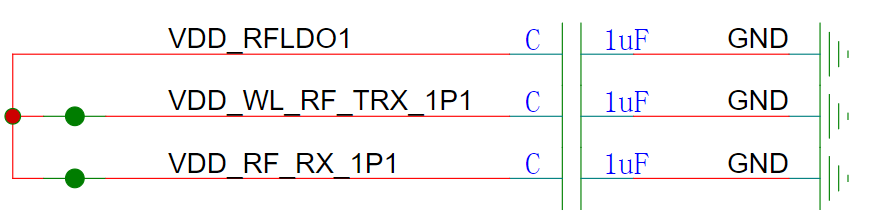

### BUCK/LDO电源

WS53V100包含4个1P3电源输入管脚：

-   VDD\_1P3
-   VDD\_BSLE\_RF\_PA\_1P3
-   VDD\_BSLE\_RF\_DRV\_1P3
-   VDD\_BSLE\_PLL\_DCO\_1P3

该1P3电源可以由芯片内部BUCK（BUCK\_LX）提供

**表 1**  BUCK电源设计建议

<table><thead align="left"><tr id="row6586990"><th class="cellrowborder" valign="top" width="7.5200000000000005%" id="mcps1.2.4.1.1">
Pin

</th>
<th class="cellrowborder" valign="top" width="32.89%" id="mcps1.2.4.1.2">
名称

</th>
<th class="cellrowborder" valign="top" width="59.589999999999996%" id="mcps1.2.4.1.3">
说明

</th>
</tr>
</thead>
<tbody><tr id="row52689776"><td class="cellrowborder" valign="top" width="7.5200000000000005%" headers="mcps1.2.4.1.1 ">
40

</td>
<td class="cellrowborder" valign="top" width="32.89%" headers="mcps1.2.4.1.2 ">
BUCK_LX

</td>
<td class="cellrowborder" valign="top" width="59.589999999999996%" headers="mcps1.2.4.1.3 ">
BUCK LX输出，外接2.2μH电感，10uF电容

</td>
</tr>
<tr id="row137672065117"><td class="cellrowborder" valign="top" width="7.5200000000000005%" headers="mcps1.2.4.1.1 ">
10

</td>
<td class="cellrowborder" valign="top" width="32.89%" headers="mcps1.2.4.1.2 ">
VDD_1P3

</td>
<td class="cellrowborder" valign="top" width="59.589999999999996%" headers="mcps1.2.4.1.3 ">
RFLDO1，RFLDO2输入电源

</td>
</tr>
<tr id="row1160116371317"><td class="cellrowborder" valign="top" width="7.5200000000000005%" headers="mcps1.2.4.1.1 ">
17

</td>
<td class="cellrowborder" valign="top" width="32.89%" headers="mcps1.2.4.1.2 ">
VDD_BSLE_RF_PA_1P3

</td>
<td class="cellrowborder" valign="top" width="59.589999999999996%" headers="mcps1.2.4.1.3 ">
BSLE LDO输入电源，外接1μF滤波电容

</td>
</tr>
<tr id="row132331258145018"><td class="cellrowborder" valign="top" width="7.5200000000000005%" headers="mcps1.2.4.1.1 ">
19

</td>
<td class="cellrowborder" valign="top" width="32.89%" headers="mcps1.2.4.1.2 ">
VDD_BSLE_RF_DRV_1P3

</td>
<td class="cellrowborder" valign="top" width="59.589999999999996%" headers="mcps1.2.4.1.3 ">
BSLE LDO输入电源，外接1μF滤波电容（可以和Pin17管脚共用1μF电容）

</td>
</tr>
<tr id="row27004956"><td class="cellrowborder" valign="top" width="7.5200000000000005%" headers="mcps1.2.4.1.1 ">
20

</td>
<td class="cellrowborder" valign="top" width="32.89%" headers="mcps1.2.4.1.2 ">
VDD_BSLE_PLL_DCO_1P3

</td>
<td class="cellrowborder" valign="top" width="59.589999999999996%" headers="mcps1.2.4.1.3 ">
BSLE LDO输入电源，外接1μF滤波电容

</td>
</tr>
<tr id="row99501048122511"><td class="cellrowborder" valign="top" width="7.5200000000000005%" headers="mcps1.2.4.1.1 ">
18

</td>
<td class="cellrowborder" valign="top" width="32.89%" headers="mcps1.2.4.1.2 ">
VDD_BSLE_DPALDO

</td>
<td class="cellrowborder" valign="top" width="59.589999999999996%" headers="mcps1.2.4.1.3 ">
芯片内部BSLE电源decap管脚，接板级滤波电容

</td>
</tr>
</tbody>
</table>

> **说明：** 
>BUCK电感推荐约束条件：
>-   电感值2.2μH，±20%。
>-   直流电阻（Rdc）≤0.3Ω。
>-   饱和电流≥800mA。
>-   Rdc增大会导致功耗增加，效率变低。
>-   Rdc从0.1Ω增加到0.2Ω，重载效率会降低1\~2个百分点。

内部BUCK由VDD\_VBAT1提供输入电压，由BUCK\_LX输出开关信号，因此需要外接电感和输出电容。

参考电路图如[图1](#fig11667124685)所示。

**图 1**  内置BUCK参考电路  
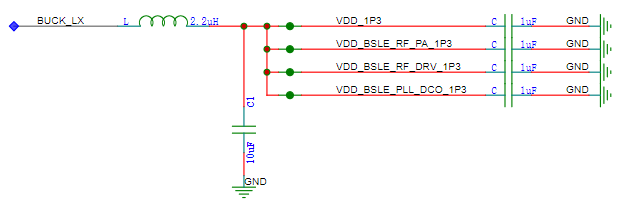

### PA供电

外部提供给VDD\_WL\_RF\_PA\_3P3供电，可与VBAT电源接在一起，设计建议如[表1](#table556428)所示，参考电路图如[图1](#fig13232739986)所示。

**表 1**  PA供电设计建议

<table><thead align="left"><tr id="row9244222"><th class="cellrowborder" valign="top" width="7.5200000000000005%" id="mcps1.2.4.1.1">
Pin

</th>
<th class="cellrowborder" valign="top" width="20.03%" id="mcps1.2.4.1.2">
名称

</th>
<th class="cellrowborder" valign="top" width="72.45%" id="mcps1.2.4.1.3">
设计建议

</th>
</tr>
</thead>
<tbody><tr id="row59416926"><td class="cellrowborder" valign="top" width="7.5200000000000005%" headers="mcps1.2.4.1.1 ">
14

</td>
<td class="cellrowborder" valign="top" width="20.03%" headers="mcps1.2.4.1.2 ">
VDD_WL_RF_PA_3P3

</td>
<td class="cellrowborder" valign="top" width="72.45%" headers="mcps1.2.4.1.3 ">
WLAN PA供电电源，由外部电源提供，VBAT供电，外接1μF、100nF（预留）（靠近芯片从小到大排列）。

</td>
</tr>
</tbody>
</table>

**图 1**  PA供电电路设计参考  
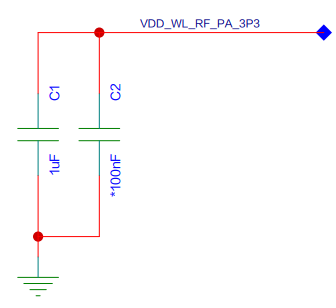

### 注意事项

-   **[RST\_N电路](#ZH-CN_TOPIC_0000001456082712)**  

#### RST\_N电路

RST\_N为上电使能管脚，该管脚上拉到VDDIO电源。

**图 1**  RST\_N参考电路  

## 外围接口设计建议

-   **[SDIO接口参考设计](#ZH-CN_TOPIC_0000001455763072)**  

-   **[UART接口参考设计](#ZH-CN_TOPIC_0000001456242652)**  

-   **[PWM接口参考设计](#ZH-CN_TOPIC_0000001505722789)**  

-   **[I2S接口参考设计](#ZH-CN_TOPIC_0000001505882553)**  

-   **[SPI接口参考设计](#ZH-CN_TOPIC_0000001505722793)**  

-   **[I2C接口参考设计](#ZH-CN_TOPIC_0000001455922812)**  

-   **[ADC接口参考设计](#ZH-CN_TOPIC_0000001455922820)**  

-   **[PTA接口设计](#ZH-CN_TOPIC_0000001456082708)**  

-   **[天线选择接口](#ZH-CN_TOPIC_0000001734928077)**  

-   **[超低功耗接口设计](#ZH-CN_TOPIC_0000001505603533)**  

### SDIO接口参考设计

WS53V100通过SDIO与Host通信。SDIO电平支持1.8V和3.3V，要求Host端也必须是1.8V或3.3V电平；否则两者之间需要增加电平转换器件，选用的电平转换芯片需要符合SDIO速率（50MHz）的传输要求。设计建议如[表1](#table13407557192520)所示。

**表 1**  SDIO接口设计建议

<table><thead align="left"><tr id="row64081557142515"><th class="cellrowborder" valign="top" width="7.519248075192481%" id="mcps1.2.6.1.1">
Pin

</th>
<th class="cellrowborder" valign="top" width="15.218478152184781%" id="mcps1.2.6.1.2">
名称

</th>
<th class="cellrowborder" valign="top" width="16.90830916908309%" id="mcps1.2.6.1.3">
上下拉

</th>
<th class="cellrowborder" valign="top" width="16.20837916208379%" id="mcps1.2.6.1.4">
VDDIO

</th>
<th class="cellrowborder" valign="top" width="44.14558544145585%" id="mcps1.2.6.1.5">
连接方式

</th>
</tr>
</thead>
<tbody><tr id="row1841419576251"><td class="cellrowborder" valign="top" width="7.519248075192481%" headers="mcps1.2.6.1.1 ">
34

</td>
<td class="cellrowborder" valign="top" width="15.218478152184781%" headers="mcps1.2.6.1.2 ">
SDIO_CLK

</td>
<td class="cellrowborder" valign="top" width="16.90830916908309%" headers="mcps1.2.6.1.3 ">
NA

</td>
<td class="cellrowborder" valign="top" width="16.20837916208379%" headers="mcps1.2.6.1.4 ">
3.3/1.8

</td>
<td class="cellrowborder" valign="top" width="44.14558544145585%" headers="mcps1.2.6.1.5 ">
源端串33Ω电阻，走线≤5inch。芯片端预留一个10pF电容。

</td>
</tr>
<tr id="row1941595782510"><td class="cellrowborder" valign="top" width="7.519248075192481%" headers="mcps1.2.6.1.1 ">
33

</td>
<td class="cellrowborder" valign="top" width="15.218478152184781%" headers="mcps1.2.6.1.2 ">
SDIO_CMD

</td>
<td class="cellrowborder" valign="top" width="16.90830916908309%" headers="mcps1.2.6.1.3 ">
NA

</td>
<td class="cellrowborder" valign="top" width="16.20837916208379%" headers="mcps1.2.6.1.4 ">
3.3/1.8

</td>
<td class="cellrowborder" valign="top" width="44.14558544145585%" headers="mcps1.2.6.1.5 ">
VDDIO=3.3V：终端串33/0Ω电阻，走线≤5inch；

VDDIO=1.8V：终端串33/0Ω电阻，走线≤3.5inch。

</td>
</tr>
<tr id="row18415357172511"><td class="cellrowborder" valign="top" width="7.519248075192481%" headers="mcps1.2.6.1.1 ">
35

36

31

32

</td>
<td class="cellrowborder" valign="top" width="15.218478152184781%" headers="mcps1.2.6.1.2 ">
SDIO_D0

SDIO_D1

SDIO_D2

SDIO_D3

</td>
<td class="cellrowborder" valign="top" width="16.90830916908309%" headers="mcps1.2.6.1.3 ">
芯片内置25kΩ上拉，建议单板预留一个上拉电阻位用于调试、建议47kΩ。

</td>
<td class="cellrowborder" valign="top" width="16.20837916208379%" headers="mcps1.2.6.1.4 ">
3.3/1.8

</td>
<td class="cellrowborder" valign="top" width="44.14558544145585%" headers="mcps1.2.6.1.5 ">
VDDIO=3.3V：终端串33/0Ω电阻，走线≤5inch；

VDDIO=1.8V：终端串33/0Ω电阻，走线≤3.5inch。

</td>
</tr>
</tbody>
</table>

> **须知：** 
>在使用SDIO一线模式时，SDIO\_D2和SDIO\_D3需要保持悬空状态，不能复用为其它功能。

### UART接口参考设计

WS53V100支持三组UART信号，UART\_L0用于WS53V100维测打印。UART\_H0和UART\_H1用于与其他设备对接，管脚电平与VDDIO保持一致。设计建议如[表1](#table50417177)所示。

**表 1**  UART接口设计建议

<table><thead align="left"><tr id="row54249298"><th class="cellrowborder" valign="top" width="14.93%" id="mcps1.2.4.1.1">
Pin

</th>
<th class="cellrowborder" valign="top" width="38.35%" id="mcps1.2.4.1.2">
名称

</th>
<th class="cellrowborder" valign="top" width="46.72%" id="mcps1.2.4.1.3">
设计建议

</th>
</tr>
</thead>
<tbody><tr id="row24662915"><td class="cellrowborder" valign="top" width="14.93%" headers="mcps1.2.4.1.1 ">
1

</td>
<td class="cellrowborder" valign="top" width="38.35%" headers="mcps1.2.4.1.2 ">
UART_L0_TXD

</td>
<td class="cellrowborder" valign="top" width="46.72%" headers="mcps1.2.4.1.3 ">
直连，走线≤5inch

</td>
</tr>
<tr id="row63115372"><td class="cellrowborder" valign="top" width="14.93%" headers="mcps1.2.4.1.1 ">
2

</td>
<td class="cellrowborder" valign="top" width="38.35%" headers="mcps1.2.4.1.2 ">
UART_L0_RXD

</td>
<td class="cellrowborder" valign="top" width="46.72%" headers="mcps1.2.4.1.3 ">
直连，走线≤5inch

</td>
</tr>
<tr id="row12200154931317"><td class="cellrowborder" valign="top" width="14.93%" headers="mcps1.2.4.1.1 ">
4/24

</td>
<td class="cellrowborder" valign="top" width="38.35%" headers="mcps1.2.4.1.2 ">
UART_H1_RXD

</td>
<td class="cellrowborder" valign="top" width="46.72%" headers="mcps1.2.4.1.3 ">
直连，走线≤5inch

</td>
</tr>
<tr id="row83661434237"><td class="cellrowborder" valign="top" width="14.93%" headers="mcps1.2.4.1.1 ">
5/23

</td>
<td class="cellrowborder" valign="top" width="38.35%" headers="mcps1.2.4.1.2 ">
UART_H1_TXD

</td>
<td class="cellrowborder" valign="top" width="46.72%" headers="mcps1.2.4.1.3 ">
直连，走线≤5inch

</td>
</tr>
<tr id="row85391720181315"><td class="cellrowborder" valign="top" width="14.93%" headers="mcps1.2.4.1.1 ">
21/43

</td>
<td class="cellrowborder" valign="top" width="38.35%" headers="mcps1.2.4.1.2 ">
UART_H1_CTS

</td>
<td class="cellrowborder" valign="top" width="46.72%" headers="mcps1.2.4.1.3 ">
直连，走线≤5inch

</td>
</tr>
<tr id="row1245314265308"><td class="cellrowborder" valign="top" width="14.93%" headers="mcps1.2.4.1.1 ">
22/30

</td>
<td class="cellrowborder" valign="top" width="38.35%" headers="mcps1.2.4.1.2 ">
UART_H1_RTS

</td>
<td class="cellrowborder" valign="top" width="46.72%" headers="mcps1.2.4.1.3 ">
直连，走线≤5inch

</td>
</tr>
<tr id="row16549833133014"><td class="cellrowborder" valign="top" width="14.93%" headers="mcps1.2.4.1.1 ">
25/52

</td>
<td class="cellrowborder" valign="top" width="38.35%" headers="mcps1.2.4.1.2 ">
UART_H0_CTS

</td>
<td class="cellrowborder" valign="top" width="46.72%" headers="mcps1.2.4.1.3 ">
直连，走线≤5inch

</td>
</tr>
<tr id="row16499182911301"><td class="cellrowborder" valign="top" width="14.93%" headers="mcps1.2.4.1.1 ">
26/48

</td>
<td class="cellrowborder" valign="top" width="38.35%" headers="mcps1.2.4.1.2 ">
UART_H0_TXD

</td>
<td class="cellrowborder" valign="top" width="46.72%" headers="mcps1.2.4.1.3 ">
直连，走线≤5inch

</td>
</tr>
<tr id="row174814277246"><td class="cellrowborder" valign="top" width="14.93%" headers="mcps1.2.4.1.1 ">
27/49

</td>
<td class="cellrowborder" valign="top" width="38.35%" headers="mcps1.2.4.1.2 ">
UART_H0_RXD

</td>
<td class="cellrowborder" valign="top" width="46.72%" headers="mcps1.2.4.1.3 ">
直连，走线≤5inch

</td>
</tr>
<tr id="row99530197316"><td class="cellrowborder" valign="top" width="14.93%" headers="mcps1.2.4.1.1 ">
28/46

</td>
<td class="cellrowborder" valign="top" width="38.35%" headers="mcps1.2.4.1.2 ">
UART_H0_RTS

</td>
<td class="cellrowborder" valign="top" width="46.72%" headers="mcps1.2.4.1.3 ">
直连，走线≤5inch

</td>
</tr>
</tbody>
</table>

### PWM接口参考设计

WS53V100支持8个PWM接口信号输出，PWM0-PWM3为3组互补PWM接口，SPWM 为2个为安全PWM接口，输出电平与VDDIO电平保持一致，占空比输出范围（0-100%），最高可达到30khz以上，步进100Hz。

设计建议如[表1](#table6991874)所示。

**表 1**  PWM接口设计建议

<table><thead align="left"><tr id="row37854045"><th class="cellrowborder" valign="top" width="7.5200000000000005%" id="mcps1.2.4.1.1">
Pin

</th>
<th class="cellrowborder" valign="top" width="47.21%" id="mcps1.2.4.1.2">
名称

</th>
<th class="cellrowborder" valign="top" width="45.269999999999996%" id="mcps1.2.4.1.3">
设计建议

</th>
</tr>
</thead>
<tbody><tr id="row46696577"><td class="cellrowborder" valign="top" width="7.5200000000000005%" headers="mcps1.2.4.1.1 ">
21/2

</td>
<td class="cellrowborder" valign="top" width="47.21%" headers="mcps1.2.4.1.2 ">
PWM0_P

</td>
<td class="cellrowborder" valign="top" width="45.269999999999996%" headers="mcps1.2.4.1.3 ">
直连，走线≤5inch

</td>
</tr>
<tr id="row10306693"><td class="cellrowborder" valign="top" width="7.5200000000000005%" headers="mcps1.2.4.1.1 ">
22/3

</td>
<td class="cellrowborder" valign="top" width="47.21%" headers="mcps1.2.4.1.2 ">
PWM0_N

</td>
<td class="cellrowborder" valign="top" width="45.269999999999996%" headers="mcps1.2.4.1.3 ">
直连，走线≤5inch

</td>
</tr>
<tr id="row144483412593"><td class="cellrowborder" valign="top" width="7.5200000000000005%" headers="mcps1.2.4.1.1 ">
50

</td>
<td class="cellrowborder" valign="top" width="47.21%" headers="mcps1.2.4.1.2 ">
PWM2_P

</td>
<td class="cellrowborder" valign="top" width="45.269999999999996%" headers="mcps1.2.4.1.3 ">
直连，走线≤5inch

</td>
</tr>
<tr id="row18556931185917"><td class="cellrowborder" valign="top" width="7.5200000000000005%" headers="mcps1.2.4.1.1 ">
51

</td>
<td class="cellrowborder" valign="top" width="47.21%" headers="mcps1.2.4.1.2 ">
PWM2_N

</td>
<td class="cellrowborder" valign="top" width="45.269999999999996%" headers="mcps1.2.4.1.3 ">
直连，走线≤5inch

</td>
</tr>
<tr id="row25625616"><td class="cellrowborder" valign="top" width="7.5200000000000005%" headers="mcps1.2.4.1.1 ">
43

</td>
<td class="cellrowborder" valign="top" width="47.21%" headers="mcps1.2.4.1.2 ">
PWM3_P

</td>
<td class="cellrowborder" valign="top" width="45.269999999999996%" headers="mcps1.2.4.1.3 ">
直连，走线≤5inch

</td>
</tr>
<tr id="row1323954121615"><td class="cellrowborder" valign="top" width="7.5200000000000005%" headers="mcps1.2.4.1.1 ">
47

</td>
<td class="cellrowborder" valign="top" width="47.21%" headers="mcps1.2.4.1.2 ">
PWM3_N

</td>
<td class="cellrowborder" valign="top" width="45.269999999999996%" headers="mcps1.2.4.1.3 ">
直连，走线≤5inch

</td>
</tr>
<tr id="row105672238175"><td class="cellrowborder" valign="top" width="7.5200000000000005%" headers="mcps1.2.4.1.1 ">
30

</td>
<td class="cellrowborder" valign="top" width="47.21%" headers="mcps1.2.4.1.2 ">
SPWM1P

</td>
<td class="cellrowborder" valign="top" width="45.269999999999996%" headers="mcps1.2.4.1.3 ">
直连，走线≤5inch

</td>
</tr>
<tr id="row14438155417599"><td class="cellrowborder" valign="top" width="7.5200000000000005%" headers="mcps1.2.4.1.1 ">
25

</td>
<td class="cellrowborder" valign="top" width="47.21%" headers="mcps1.2.4.1.2 ">
SPWM1N

</td>
<td class="cellrowborder" valign="top" width="45.269999999999996%" headers="mcps1.2.4.1.3 ">
直连，走线≤5inch

</td>
</tr>
</tbody>
</table>

### I2S接口参考设计

WS53V100支持一组I2S接口，输入输出电平应与VDDIO电平保持一致。设计建议如[表1](#table6991874)所示。

**表 1**  I2S接口设计建议

<table><thead align="left"><tr id="row37854045"><th class="cellrowborder" valign="top" width="15.58%" id="mcps1.2.4.1.1">
Pin

</th>
<th class="cellrowborder" valign="top" width="39.589999999999996%" id="mcps1.2.4.1.2">
名称

</th>
<th class="cellrowborder" valign="top" width="44.83%" id="mcps1.2.4.1.3">
设计建议

</th>
</tr>
</thead>
<tbody><tr id="row46696577"><td class="cellrowborder" valign="top" width="15.58%" headers="mcps1.2.4.1.1 ">
21/51

</td>
<td class="cellrowborder" valign="top" width="39.589999999999996%" headers="mcps1.2.4.1.2 ">
I2S_WS

</td>
<td class="cellrowborder" valign="top" width="44.83%" headers="mcps1.2.4.1.3 ">
直连，包地处理。

</td>
</tr>
<tr id="row119544818514"><td class="cellrowborder" valign="top" width="15.58%" headers="mcps1.2.4.1.1 ">
22/48

</td>
<td class="cellrowborder" valign="top" width="39.589999999999996%" headers="mcps1.2.4.1.2 ">
I2S_BCLK

</td>
<td class="cellrowborder" valign="top" width="44.83%" headers="mcps1.2.4.1.3 ">
芯片端串33Ω电阻，包地处理。

</td>
</tr>
<tr id="row10306693"><td class="cellrowborder" valign="top" width="15.58%" headers="mcps1.2.4.1.1 ">
23/50

</td>
<td class="cellrowborder" valign="top" width="39.589999999999996%" headers="mcps1.2.4.1.2 ">
I2S_DI

</td>
<td class="cellrowborder" valign="top" width="44.83%" headers="mcps1.2.4.1.3 ">
直连。

</td>
</tr>
<tr id="row19169181358"><td class="cellrowborder" valign="top" width="15.58%" headers="mcps1.2.4.1.1 ">
24/49

</td>
<td class="cellrowborder" valign="top" width="39.589999999999996%" headers="mcps1.2.4.1.2 ">
I2S_D0

</td>
<td class="cellrowborder" valign="top" width="44.83%" headers="mcps1.2.4.1.3 ">
直连。

</td>
</tr>
</tbody>
</table>

### SPI接口参考设计

WS53V100支持两组SPI接口，一组SPI接口，一组QSPI接口，输入输出电平应与VDDIO电平保持一致。设计建议如[表1](#table6991874)所示。

**表 1**  SPI接口设计建议

<table><thead align="left"><tr id="row37854045"><th class="cellrowborder" valign="top" width="15.879999999999999%" id="mcps1.2.4.1.1">
Pin

</th>
<th class="cellrowborder" valign="top" width="30.930000000000003%" id="mcps1.2.4.1.2">
名称

</th>
<th class="cellrowborder" valign="top" width="53.190000000000005%" id="mcps1.2.4.1.3">
设计建议

</th>
</tr>
</thead>
<tbody><tr id="row46696577"><td class="cellrowborder" valign="top" width="15.879999999999999%" headers="mcps1.2.4.1.1 ">
33/23/28

</td>
<td class="cellrowborder" valign="top" width="30.930000000000003%" headers="mcps1.2.4.1.2 ">
SPI0_DI

</td>
<td class="cellrowborder" valign="top" width="53.190000000000005%" headers="mcps1.2.4.1.3 ">
直连，走线≤5inch。

</td>
</tr>
<tr id="row10306693"><td class="cellrowborder" valign="top" width="15.879999999999999%" headers="mcps1.2.4.1.1 ">
34/22/26

</td>
<td class="cellrowborder" valign="top" width="30.930000000000003%" headers="mcps1.2.4.1.2 ">
SPI0_CLK

</td>
<td class="cellrowborder" valign="top" width="53.190000000000005%" headers="mcps1.2.4.1.3 ">
芯片端串接一个33Ω电阻，单根走线包地处理，走线≤5inch。

</td>
</tr>
<tr id="row47890712"><td class="cellrowborder" valign="top" width="15.879999999999999%" headers="mcps1.2.4.1.1 ">
35/24/27

</td>
<td class="cellrowborder" valign="top" width="30.930000000000003%" headers="mcps1.2.4.1.2 ">
SPI0_DO

</td>
<td class="cellrowborder" valign="top" width="53.190000000000005%" headers="mcps1.2.4.1.3 ">
直连，走线≤5inch。

</td>
</tr>
<tr id="row884411371117"><td class="cellrowborder" valign="top" width="15.879999999999999%" headers="mcps1.2.4.1.1 ">
36/21/52

</td>
<td class="cellrowborder" valign="top" width="30.930000000000003%" headers="mcps1.2.4.1.2 ">
SPI0_CS0

</td>
<td class="cellrowborder" valign="top" width="53.190000000000005%" headers="mcps1.2.4.1.3 ">
直连，走线≤5inch。

</td>
</tr>
<tr id="row2844191341116"><td class="cellrowborder" valign="top" width="15.879999999999999%" headers="mcps1.2.4.1.1 ">
47

</td>
<td class="cellrowborder" valign="top" width="30.930000000000003%" headers="mcps1.2.4.1.2 ">
QSPI1_D3

</td>
<td class="cellrowborder" valign="top" width="53.190000000000005%" headers="mcps1.2.4.1.3 ">
直连，走线≤5inch。

</td>
</tr>
<tr id="row12844013191117"><td class="cellrowborder" valign="top" width="15.879999999999999%" headers="mcps1.2.4.1.1 ">
48

</td>
<td class="cellrowborder" valign="top" width="30.930000000000003%" headers="mcps1.2.4.1.2 ">
QSPI1_CLK

</td>
<td class="cellrowborder" valign="top" width="53.190000000000005%" headers="mcps1.2.4.1.3 ">
芯片端串接一个33Ω电阻，单根走线包地处理，走线≤5inch。

</td>
</tr>
<tr id="row2135819111110"><td class="cellrowborder" valign="top" width="15.879999999999999%" headers="mcps1.2.4.1.1 ">
49

</td>
<td class="cellrowborder" valign="top" width="30.930000000000003%" headers="mcps1.2.4.1.2 ">
QSPI1_D0

</td>
<td class="cellrowborder" valign="top" width="53.190000000000005%" headers="mcps1.2.4.1.3 ">
直连，走线≤5inch。

</td>
</tr>
<tr id="row7135111910113"><td class="cellrowborder" valign="top" width="15.879999999999999%" headers="mcps1.2.4.1.1 ">
50

</td>
<td class="cellrowborder" valign="top" width="30.930000000000003%" headers="mcps1.2.4.1.2 ">
QSPI1_D1

</td>
<td class="cellrowborder" valign="top" width="53.190000000000005%" headers="mcps1.2.4.1.3 ">
直连，走线≤5inch。

</td>
</tr>
<tr id="row151351219101110"><td class="cellrowborder" valign="top" width="15.879999999999999%" headers="mcps1.2.4.1.1 ">
51

</td>
<td class="cellrowborder" valign="top" width="30.930000000000003%" headers="mcps1.2.4.1.2 ">
QSPI1_CS

</td>
<td class="cellrowborder" valign="top" width="53.190000000000005%" headers="mcps1.2.4.1.3 ">
直连，走线≤5inch。

</td>
</tr>
<tr id="row71857507125"><td class="cellrowborder" valign="top" width="15.879999999999999%" headers="mcps1.2.4.1.1 ">
52

</td>
<td class="cellrowborder" valign="top" width="30.930000000000003%" headers="mcps1.2.4.1.2 ">
QSPI1_D2

</td>
<td class="cellrowborder" valign="top" width="53.190000000000005%" headers="mcps1.2.4.1.3 ">
直连，走线≤5inch。

</td>
</tr>
</tbody>
</table>

### I2C接口参考设计

WS53V100支持两组I2C接口，输入输出电平应与VDDIO电平保持一致。设计建议如[表1](#table6991874)所示。

**表 1**  I2C接口设计建议

<table><thead align="left"><tr id="row37854045"><th class="cellrowborder" valign="top" width="7.5200000000000005%" id="mcps1.2.4.1.1">
Pin

</th>
<th class="cellrowborder" valign="top" width="39.67%" id="mcps1.2.4.1.2">
名称

</th>
<th class="cellrowborder" valign="top" width="52.81%" id="mcps1.2.4.1.3">
设计建议

</th>
</tr>
</thead>
<tbody><tr id="row46696577"><td class="cellrowborder" valign="top" width="7.5200000000000005%" headers="mcps1.2.4.1.1 ">
24/46

</td>
<td class="cellrowborder" valign="top" width="39.67%" headers="mcps1.2.4.1.2 ">
I2C0_SCL

</td>
<td class="cellrowborder" valign="top" width="52.81%" headers="mcps1.2.4.1.3 ">
直连，走线≤5inch，上拉1kΩ电阻到VDDIO。

</td>
</tr>
<tr id="row10306693"><td class="cellrowborder" valign="top" width="7.5200000000000005%" headers="mcps1.2.4.1.1 ">
25/43

</td>
<td class="cellrowborder" valign="top" width="39.67%" headers="mcps1.2.4.1.2 ">
I2C0_SDA

</td>
<td class="cellrowborder" valign="top" width="52.81%" headers="mcps1.2.4.1.3 ">
直连，走线≤5inch，上拉1kΩ电阻到VDDIO。

</td>
</tr>
<tr id="row15247133217247"><td class="cellrowborder" valign="top" width="7.5200000000000005%" headers="mcps1.2.4.1.1 ">
3/26

</td>
<td class="cellrowborder" valign="top" width="39.67%" headers="mcps1.2.4.1.2 ">
I2C1_SCL

</td>
<td class="cellrowborder" valign="top" width="52.81%" headers="mcps1.2.4.1.3 ">
直连，走线≤5inch，上拉1kΩ电阻到VDDIO。

</td>
</tr>
<tr id="row019011366241"><td class="cellrowborder" valign="top" width="7.5200000000000005%" headers="mcps1.2.4.1.1 ">
4/27

</td>
<td class="cellrowborder" valign="top" width="39.67%" headers="mcps1.2.4.1.2 ">
I2C1_SDA

</td>
<td class="cellrowborder" valign="top" width="52.81%" headers="mcps1.2.4.1.3 ">
直连，走线≤5inch，上拉1kΩ电阻到VDDIO。

</td>
</tr>
</tbody>
</table>

### ADC接口参考设计

WS53V100支持7个ADC接口，ADC电压输入范围0Ｖ～1.715V。设计建议如[表1](#table6991874)所示。ADC输入信号可以通过UART\_L0串口读出信号电平的大小。

**表 1**  ADC接口设计建议

<table><thead align="left"><tr id="row37854045"><th class="cellrowborder" valign="top" width="9.04%" id="mcps1.2.4.1.1">
Pin

</th>
<th class="cellrowborder" valign="top" width="38.65%" id="mcps1.2.4.1.2">
名称

</th>
<th class="cellrowborder" valign="top" width="52.31%" id="mcps1.2.4.1.3">
设计建议

</th>
</tr>
</thead>
<tbody><tr id="row46696577"><td class="cellrowborder" valign="top" width="9.04%" headers="mcps1.2.4.1.1 ">
1

</td>
<td class="cellrowborder" valign="top" width="38.65%" headers="mcps1.2.4.1.2 ">
ADC_CH0

</td>
<td class="cellrowborder" valign="top" width="52.31%" headers="mcps1.2.4.1.3 ">
直连，走线≤5inch。

</td>
</tr>
<tr id="row10306693"><td class="cellrowborder" valign="top" width="9.04%" headers="mcps1.2.4.1.1 ">
3

</td>
<td class="cellrowborder" valign="top" width="38.65%" headers="mcps1.2.4.1.2 ">
ADC_CH1

</td>
<td class="cellrowborder" valign="top" width="52.31%" headers="mcps1.2.4.1.3 ">
直连，走线≤5inch。

</td>
</tr>
<tr id="row47890712"><td class="cellrowborder" valign="top" width="9.04%" headers="mcps1.2.4.1.1 ">
4

</td>
<td class="cellrowborder" valign="top" width="38.65%" headers="mcps1.2.4.1.2 ">
ADC_CH2

</td>
<td class="cellrowborder" valign="top" width="52.31%" headers="mcps1.2.4.1.3 ">
直连，走线≤5inch。

</td>
</tr>
<tr id="row13910478"><td class="cellrowborder" valign="top" width="9.04%" headers="mcps1.2.4.1.1 ">
43

</td>
<td class="cellrowborder" valign="top" width="38.65%" headers="mcps1.2.4.1.2 ">
ADC_CH4

</td>
<td class="cellrowborder" valign="top" width="52.31%" headers="mcps1.2.4.1.3 ">
直连，走线≤5inch。

</td>
</tr>
<tr id="row17318639114020"><td class="cellrowborder" valign="top" width="9.04%" headers="mcps1.2.4.1.1 ">
26

</td>
<td class="cellrowborder" valign="top" width="38.65%" headers="mcps1.2.4.1.2 ">
ADC_CH5

</td>
<td class="cellrowborder" valign="top" width="52.31%" headers="mcps1.2.4.1.3 ">
直连，走线≤5inch。

</td>
</tr>
<tr id="row1015434794019"><td class="cellrowborder" valign="top" width="9.04%" headers="mcps1.2.4.1.1 ">
27

</td>
<td class="cellrowborder" valign="top" width="38.65%" headers="mcps1.2.4.1.2 ">
ADC_CH6

</td>
<td class="cellrowborder" valign="top" width="52.31%" headers="mcps1.2.4.1.3 ">
直连，走线≤5inch。

</td>
</tr>
<tr id="row1941015223417"><td class="cellrowborder" valign="top" width="9.04%" headers="mcps1.2.4.1.1 ">
28

</td>
<td class="cellrowborder" valign="top" width="38.65%" headers="mcps1.2.4.1.2 ">
ADC_CH7

</td>
<td class="cellrowborder" valign="top" width="52.31%" headers="mcps1.2.4.1.3 ">
直连，走线≤5inch。

</td>
</tr>
</tbody>
</table>

### PTA接口设计

WS53V100支持1个PTA（包流量仲裁）接口，用于WIFI和BT的共存管理如[图1](#fig179201718201011)[PTA接口设计](#ZH-CN_TOPIC_0000001456082708)，输入输出电平应与VDDIO电平保持一致。设计建议如[表1](#table6991874)所示。

PTA介于WIFI MAC和BT之间，接收WIFI MAC和BT的TX/RX请求和状态输入，并且输出仲裁结果给WIFI 和BT。

**图 1**  PTA接口设计原理框图  

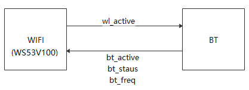

**表 1**  PTA接口设计建议

<table><thead align="left"><tr id="row37854045"><th class="cellrowborder" valign="top" width="9.8%" id="mcps1.2.4.1.1">
Pin

</th>
<th class="cellrowborder" valign="top" width="36.97%" id="mcps1.2.4.1.2">
名称

</th>
<th class="cellrowborder" valign="top" width="53.23%" id="mcps1.2.4.1.3">
设计建议

</th>
</tr>
</thead>
<tbody><tr id="row46696577"><td class="cellrowborder" valign="top" width="9.8%" headers="mcps1.2.4.1.1 ">
50

</td>
<td class="cellrowborder" valign="top" width="36.97%" headers="mcps1.2.4.1.2 ">
BT_FREQ

</td>
<td class="cellrowborder" valign="top" width="53.23%" headers="mcps1.2.4.1.3 ">
直连，走线≤5inch。

</td>
</tr>
<tr id="row10306693"><td class="cellrowborder" valign="top" width="9.8%" headers="mcps1.2.4.1.1 ">
49/30

</td>
<td class="cellrowborder" valign="top" width="36.97%" headers="mcps1.2.4.1.2 ">
BT_STATUS

</td>
<td class="cellrowborder" valign="top" width="53.23%" headers="mcps1.2.4.1.3 ">
直连，走线≤5inch。

</td>
</tr>
<tr id="row25625616"><td class="cellrowborder" valign="top" width="9.8%" headers="mcps1.2.4.1.1 ">
48/25

</td>
<td class="cellrowborder" valign="top" width="36.97%" headers="mcps1.2.4.1.2 ">
BT_ACTIVE

</td>
<td class="cellrowborder" valign="top" width="53.23%" headers="mcps1.2.4.1.3 ">
直连，走线≤5inch。

</td>
</tr>
<tr id="row1399374314274"><td class="cellrowborder" valign="top" width="9.8%" headers="mcps1.2.4.1.1 ">
51

</td>
<td class="cellrowborder" valign="top" width="36.97%" headers="mcps1.2.4.1.2 ">
WLAN_ACTIVE

</td>
<td class="cellrowborder" valign="top" width="53.23%" headers="mcps1.2.4.1.3 ">
直连，走线≤5inch。

</td>
</tr>
</tbody>
</table>

### 天线选择接口

WS53V100有4个天线选择管脚，输出电平应与VDDIO电平保持一致。设计建议如[表1](#table14517951317)所示。

**表 1**  智能天线接口

<table><thead align="left"><tr id="row1352179161312"><th class="cellrowborder" valign="top" width="12.73%" id="mcps1.2.4.1.1">
Pin

</th>
<th class="cellrowborder" valign="top" width="33.82%" id="mcps1.2.4.1.2">
名称

</th>
<th class="cellrowborder" valign="top" width="53.449999999999996%" id="mcps1.2.4.1.3">
设计建议

</th>
</tr>
</thead>
<tbody><tr id="row205279191319"><td class="cellrowborder" valign="top" width="12.73%" headers="mcps1.2.4.1.1 ">
21

</td>
<td class="cellrowborder" valign="top" width="33.82%" headers="mcps1.2.4.1.2 ">
ANT_SEL3

</td>
<td class="cellrowborder" valign="top" width="53.449999999999996%" headers="mcps1.2.4.1.3 ">
直连，走线≤5inch。

</td>
</tr>
<tr id="row15513911318"><td class="cellrowborder" valign="top" width="12.73%" headers="mcps1.2.4.1.1 ">
23

</td>
<td class="cellrowborder" valign="top" width="33.82%" headers="mcps1.2.4.1.2 ">
ANT_SEL4

</td>
<td class="cellrowborder" valign="top" width="53.449999999999996%" headers="mcps1.2.4.1.3 ">
直连，走线≤5inch。

</td>
</tr>
<tr id="row1916085515504"><td class="cellrowborder" valign="top" width="12.73%" headers="mcps1.2.4.1.1 ">
43

</td>
<td class="cellrowborder" valign="top" width="33.82%" headers="mcps1.2.4.1.2 ">
ANT_SEL5

</td>
<td class="cellrowborder" valign="top" width="53.449999999999996%" headers="mcps1.2.4.1.3 ">
直连，走线≤5inch。

</td>
</tr>
<tr id="row1176155865017"><td class="cellrowborder" valign="top" width="12.73%" headers="mcps1.2.4.1.1 ">
52

</td>
<td class="cellrowborder" valign="top" width="33.82%" headers="mcps1.2.4.1.2 ">
ANT_SEL2

</td>
<td class="cellrowborder" valign="top" width="53.449999999999996%" headers="mcps1.2.4.1.3 ">
直连，走线≤5inch。

</td>
</tr>
</tbody>
</table>

### 超低功耗接口设计

WS53V100支持9个AON GPIO，输入电平应与VDDIO电平保持一致。设计建议如[表1](#table14517951317)所示。

**表 1**  超低功耗接口设计建议

<table><thead align="left"><tr id="row1352179161312"><th class="cellrowborder" valign="top" width="11.07%" id="mcps1.2.5.1.1">
Pin

</th>
<th class="cellrowborder" valign="top" width="17.630000000000003%" id="mcps1.2.5.1.2">
名称

</th>
<th class="cellrowborder" valign="top" width="31.22%" id="mcps1.2.5.1.3">
设计建议

</th>
<th class="cellrowborder" valign="top" width="40.08%" id="mcps1.2.5.1.4">
备注

</th>
</tr>
</thead>
<tbody><tr id="row18012005312"><td class="cellrowborder" valign="top" width="11.07%" headers="mcps1.2.5.1.1 ">
1

</td>
<td class="cellrowborder" valign="top" width="17.630000000000003%" headers="mcps1.2.5.1.2 ">
AGPIO1

</td>
<td class="cellrowborder" valign="top" width="31.22%" headers="mcps1.2.5.1.3 ">
直连，走线≤5inch。

</td>
<td class="cellrowborder" valign="top" width="40.08%" headers="mcps1.2.5.1.4 ">
深睡模式下，支持输入唤醒或输出。

</td>
</tr>
<tr id="row164911358165219"><td class="cellrowborder" valign="top" width="11.07%" headers="mcps1.2.5.1.1 ">
2

</td>
<td class="cellrowborder" valign="top" width="17.630000000000003%" headers="mcps1.2.5.1.2 ">
AGPIO2

</td>
<td class="cellrowborder" valign="top" width="31.22%" headers="mcps1.2.5.1.3 ">
直连，走线≤5inch。

</td>
<td class="cellrowborder" valign="top" width="40.08%" headers="mcps1.2.5.1.4 ">
深睡模式下，支持输入唤醒或输出。

</td>
</tr>
<tr id="row815045615215"><td class="cellrowborder" valign="top" width="11.07%" headers="mcps1.2.5.1.1 ">
3

</td>
<td class="cellrowborder" valign="top" width="17.630000000000003%" headers="mcps1.2.5.1.2 ">
AGPIO3

</td>
<td class="cellrowborder" valign="top" width="31.22%" headers="mcps1.2.5.1.3 ">
直连，走线≤5inch。

</td>
<td class="cellrowborder" valign="top" width="40.08%" headers="mcps1.2.5.1.4 ">
深睡模式下，支持输入唤醒或输出。

</td>
</tr>
<tr id="row16107054205210"><td class="cellrowborder" valign="top" width="11.07%" headers="mcps1.2.5.1.1 ">
4

</td>
<td class="cellrowborder" valign="top" width="17.630000000000003%" headers="mcps1.2.5.1.2 ">
AGPIO4

</td>
<td class="cellrowborder" valign="top" width="31.22%" headers="mcps1.2.5.1.3 ">
直连，走线≤5inch。

</td>
<td class="cellrowborder" valign="top" width="40.08%" headers="mcps1.2.5.1.4 ">
深睡模式下，支持输入唤醒或输出。

</td>
</tr>
<tr id="row15513911318"><td class="cellrowborder" valign="top" width="11.07%" headers="mcps1.2.5.1.1 ">
22

</td>
<td class="cellrowborder" valign="top" width="17.630000000000003%" headers="mcps1.2.5.1.2 ">
MGPIO11

</td>
<td class="cellrowborder" valign="top" width="31.22%" headers="mcps1.2.5.1.3 ">
直连，走线≤5inch。

</td>
<td class="cellrowborder" valign="top" width="40.08%" headers="mcps1.2.5.1.4 ">
深睡模式下，仅支持输入唤醒，不支持输出。

</td>
</tr>
<tr id="row55929111319"><td class="cellrowborder" valign="top" width="11.07%" headers="mcps1.2.5.1.1 ">
28

</td>
<td class="cellrowborder" valign="top" width="17.630000000000003%" headers="mcps1.2.5.1.2 ">
MGPIO6

</td>
<td class="cellrowborder" valign="top" width="31.22%" headers="mcps1.2.5.1.3 ">
直连，走线≤5inch。

</td>
<td class="cellrowborder" valign="top" width="40.08%" headers="mcps1.2.5.1.4 ">
深睡模式下，仅支持输入唤醒，不支持输出。

</td>
</tr>
<tr id="row39412282524"><td class="cellrowborder" valign="top" width="11.07%" headers="mcps1.2.5.1.1 ">
36

</td>
<td class="cellrowborder" valign="top" width="17.630000000000003%" headers="mcps1.2.5.1.2 ">
AGPIO5

</td>
<td class="cellrowborder" valign="top" width="31.22%" headers="mcps1.2.5.1.3 ">
直连，走线≤5inch。

</td>
<td class="cellrowborder" valign="top" width="40.08%" headers="mcps1.2.5.1.4 ">
深睡模式下，支持输入唤醒或输出。

</td>
</tr>
<tr id="row396813425211"><td class="cellrowborder" valign="top" width="11.07%" headers="mcps1.2.5.1.1 ">
47

</td>
<td class="cellrowborder" valign="top" width="17.630000000000003%" headers="mcps1.2.5.1.2 ">
MGPIO16

</td>
<td class="cellrowborder" valign="top" width="31.22%" headers="mcps1.2.5.1.3 ">
直连，走线≤5inch。

</td>
<td class="cellrowborder" valign="top" width="40.08%" headers="mcps1.2.5.1.4 ">
深睡模式下，仅支持输入唤醒，不支持输出。

</td>
</tr>
<tr id="row79695310529"><td class="cellrowborder" valign="top" width="11.07%" headers="mcps1.2.5.1.1 ">
52

</td>
<td class="cellrowborder" valign="top" width="17.630000000000003%" headers="mcps1.2.5.1.2 ">
MGPIO7

</td>
<td class="cellrowborder" valign="top" width="31.22%" headers="mcps1.2.5.1.3 ">
直连，走线≤5inch。

</td>
<td class="cellrowborder" valign="top" width="40.08%" headers="mcps1.2.5.1.4 ">
深睡模式下，仅支持输入唤醒，不支持输出。

</td>
</tr>
</tbody>
</table>

> **须知：** 
>在使用MGIO16作为输入唤醒功能时，建议默认状态保持高电平，使用低电平或者下降沿唤醒.

## 控制信号及低功耗应用参考设计

-   **[SDIO四线模式](#ZH-CN_TOPIC_0000001505722797)**  

-   **[SDIO一线模式](#ZH-CN_TOPIC_0000001456242664)**  

### SDIO四线模式

WS53V100 SDIO四线模式根据中断方式可以分成两种：一种是GPIO中断方式，另一种是SDIO中断方式，推荐使用SDIO中断，其中：

-   方式一：GPIO中断方式需要7个Pin脚（SDIO\_CLK，SDIO\_CMD，SDIO\_DATA0，SDIO\_DATA1，SDIO\_DATA2，SDIO\_DATA3，MGPIO13），WS53V100可使用MGPIO13作为中断。
-   方式二：SDIO中断方式需要6个Pin脚（SDIO\_CLK，SDIO\_CMD，SDIO\_DATA0，SDIO\_DATA1，SDIO\_DATA2，SDIO\_DATA3），WS53V100也可使用SDIO\_DATA1中断。

其他控制信号及低功耗应用如[表1](#table59088265)所示。

**表 1**  控制信号及低功耗应用参考设计建议

<table><thead align="left"><tr id="row19465302"><th class="cellrowborder" valign="top" width="37.82%" id="mcps1.2.3.1.1">
名称

</th>
<th class="cellrowborder" valign="top" width="62.18%" id="mcps1.2.3.1.2">
设计建议

</th>
</tr>
</thead>
<tbody><tr id="row44130051"><td class="cellrowborder" valign="top" width="37.82%" headers="mcps1.2.3.1.1 ">
VBAT

</td>
<td class="cellrowborder" valign="top" width="62.18%" headers="mcps1.2.3.1.2 ">
WS53V100芯片电源，由板级供电。

</td>
</tr>
<tr id="row73943159579"><td class="cellrowborder" valign="top" width="37.82%" headers="mcps1.2.3.1.1 ">
RST_N

</td>
<td class="cellrowborder" valign="top" width="62.18%" headers="mcps1.2.3.1.2 ">
复位管脚，由板级或HOST控制。

</td>
</tr>
<tr id="row31476327"><td class="cellrowborder" valign="top" width="37.82%" headers="mcps1.2.3.1.1 ">
DEVICE_WK_HOST

</td>
<td class="cellrowborder" valign="top" width="62.18%" headers="mcps1.2.3.1.2 ">
与HOST芯片直连，用于WS53V100唤醒HOST。

</td>
</tr>
<tr id="row212115416435"><td class="cellrowborder" valign="top" width="37.82%" headers="mcps1.2.3.1.1 ">
HOST_WK_DEVICE

</td>
<td class="cellrowborder" valign="top" width="62.18%" headers="mcps1.2.3.1.2 ">
与HOST芯片直连，用于HOST唤醒WS53V100。

</td>
</tr>
<tr id="row185701344201513"><td class="cellrowborder" valign="top" width="37.82%" headers="mcps1.2.3.1.1 ">
SDIO INTERRUPT

</td>
<td class="cellrowborder" valign="top" width="62.18%" headers="mcps1.2.3.1.2 ">
作为SDIO的中断信号。WS53V100可使用SDIO的DATA1作为中断信号、也可用GPIO充当。

</td>
</tr>
</tbody>
</table>

如果需要低功耗应用，则必须考虑以下设计要求：

-   DEVICE\_WK\_HOST必须连接到HOST常供电的GPIO。
-   HOST\_WK\_DEVICE必须连接到DEVICE常供电的GPIO。
-   
低功耗应用系统连接参考框如[图1](#fig18907620135117)所示。

**图 1**  SDIO四线模式低功耗应用系统连接参考框图  

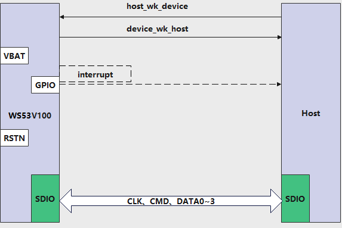

### SDIO一线模式

WS53V100 SDIO一线模式根据中断方式可以分成两种：一种是GPIO中断方式，另一种是SDIO中断方式，其中:

-   方式一：GPIO中断方式需要4个Pin脚（SDIO\_CLK，SDIO\_CMD，DATA0，MGPIO13），可使用MGPIO13作为中断。
-   方式二：SDIO中断方式需要4个Pin脚（SDIO\_CLK，SDIO\_CMD，DATA0，SDIO\_DATA1），可使用SDIO\_DATA1中断。

其他控制管脚和四线模式一致，低功耗应用系统连接参考框图如[图1](#fig10071935011)所示。

**图 1**  SDIO一线模式低功耗应用系统连接参考框图  

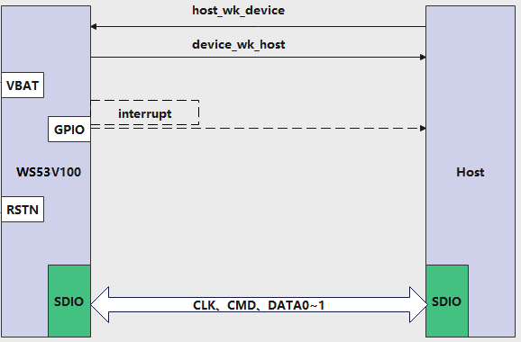

# PCB设计建议

-   **[叠层和布局](#ZH-CN_TOPIC_0000001505722829)**  

-   **[Fanout封装设计建议](#ZH-CN_TOPIC_0000001505603545)**  

-   **[PCB布局](#ZH-CN_TOPIC_0000001455763044)**  

-   **[电源](#ZH-CN_TOPIC_0000001455763036)**  

-   **[RF布线指导](#ZH-CN_TOPIC_0000001455922808)**  

-   **[CMU布线指导](#ZH-CN_TOPIC_0000001455763076)**  

-   **[DBB布线指导](#ZH-CN_TOPIC_0000001505882573)**  

-   **[SDIO接口布线指导](#ZH-CN_TOPIC_0000001505842453)**  

-   **[GND布线指导](#ZH-CN_TOPIC_0000001505603541)**  

## 叠层和布局

WS53V100封装大小，QFN52 6×6mm，PCB支持4层板，支持器件单面贴设计。

-   TOP层：信号走线，信号线尽量走TOP层。
-   L2层：地平面层，保持一个完整的地平面层。
-   L3层：电源平面层，电源走线尽量走第三层，且电源之间需要用地隔开。
-   BOTTOM 层：可以走少量的信号线，尽量保持BOTTOM层为一个完整的地平面层。

PCB设计注意事项：

-   推荐PCB板厚On Board方案一般≥1mm，防止翘曲，过孔10mil/22mil。
-   PCB 典型材料FR4介电常数为4.0\~4.3，表层铜箔厚度建议为1.2mil \(0.5 oz+plating\)，PCB板厚度一般≥1.0mm，典型值为1.2mm，可选用1.0mm。

常用的叠层设计和阻抗控制可参考[表1](#table189541251132311)。

**表 1**  4层板1.2mm参考叠层信息参考

<table><thead align="left"><tr id="row96955272313"><th class="cellrowborder" valign="top" id="mcps1.2.8.1.1">
层标识

</th>
<th class="cellrowborder" colspan="2" valign="top" id="mcps1.2.8.1.2">
层叠图示

</th>
<th class="cellrowborder" valign="top" id="mcps1.2.8.1.3">
RC

</th>
<th class="cellrowborder" valign="top" id="mcps1.2.8.1.4">
设计厚度(μm)

</th>
<th class="cellrowborder" valign="top" id="mcps1.2.8.1.5">
PCB板厂调整厚度(μm)

</th>
<th class="cellrowborder" valign="top" id="mcps1.2.8.1.6">
厂内控制公差(μm)

</th>
</tr>
</thead>
<tbody><tr id="row14696527232"><td class="cellrowborder" valign="top" headers="mcps1.2.8.1.1 ">
阻焊

</td>
<td class="cellrowborder" colspan="2" valign="top" headers="mcps1.2.8.1.2 ">
-

</td>
<td class="cellrowborder" valign="top" headers="mcps1.2.8.1.3 ">
-

</td>
<td class="cellrowborder" valign="top" headers="mcps1.2.8.1.4 ">
-

</td>
<td class="cellrowborder" valign="top" headers="mcps1.2.8.1.5 ">
20

</td>
<td class="cellrowborder" valign="top" headers="mcps1.2.8.1.6 ">
20&plusmn;15

</td>
</tr>
<tr id="row0701652102311"><td class="cellrowborder" rowspan="2" valign="top" headers="mcps1.2.8.1.1 ">
Art01

</td>
<td class="cellrowborder" colspan="2" valign="top" headers="mcps1.2.8.1.2 ">
-

</td>
<td class="cellrowborder" valign="top" headers="mcps1.2.8.1.3 ">
-

</td>
<td class="cellrowborder" valign="top" headers="mcps1.2.8.1.4 ">
1/2oz+plating

</td>
<td class="cellrowborder" valign="top" headers="mcps1.2.8.1.5 ">
40

</td>
<td class="cellrowborder" valign="top" headers="mcps1.2.8.1.6 ">
40&plusmn;15

</td>
</tr>
<tr id="row1670155292317"><td class="cellrowborder" colspan="2" valign="top" headers="mcps1.2.8.1.2 ">
PP_7628

</td>
<td class="cellrowborder" valign="top" headers="mcps1.2.8.1.3 ">
50%

</td>
<td class="cellrowborder" valign="top" headers="mcps1.2.8.1.4 ">
208

</td>
<td class="cellrowborder" valign="top" headers="mcps1.2.8.1.5 ">
215

</td>
<td class="cellrowborder" valign="top" headers="mcps1.2.8.1.6 ">
215&plusmn;20

</td>
</tr>
<tr id="row2701152182318"><td class="cellrowborder" rowspan="2" valign="top" headers="mcps1.2.8.1.1 ">
Art02

</td>
<td class="cellrowborder" colspan="2" valign="top" headers="mcps1.2.8.1.2 ">
-

</td>
<td class="cellrowborder" valign="top" headers="mcps1.2.8.1.3 ">
-

</td>
<td class="cellrowborder" valign="top" headers="mcps1.2.8.1.4 ">
30

</td>
<td class="cellrowborder" valign="top" headers="mcps1.2.8.1.5 ">
30

</td>
<td class="cellrowborder" valign="top" headers="mcps1.2.8.1.6 ">
30&plusmn;5

</td>
</tr>
<tr id="row07055219236"><td class="cellrowborder" colspan="2" valign="top" headers="mcps1.2.8.1.2 ">
core (exclude copper)

</td>
<td class="cellrowborder" valign="top" headers="mcps1.2.8.1.3 ">
-

</td>
<td class="cellrowborder" valign="top" headers="mcps1.2.8.1.4 ">
600

</td>
<td class="cellrowborder" valign="top" headers="mcps1.2.8.1.5 ">
600

</td>
<td class="cellrowborder" valign="top" headers="mcps1.2.8.1.6 ">
600&plusmn;64

</td>
</tr>
<tr id="row127017529232"><td class="cellrowborder" rowspan="2" valign="top" headers="mcps1.2.8.1.1 ">
Art03

</td>
<td class="cellrowborder" colspan="2" valign="top" headers="mcps1.2.8.1.2 ">
-

</td>
<td class="cellrowborder" valign="top" headers="mcps1.2.8.1.3 ">
-

</td>
<td class="cellrowborder" valign="top" headers="mcps1.2.8.1.4 ">
30

</td>
<td class="cellrowborder" valign="top" headers="mcps1.2.8.1.5 ">
30

</td>
<td class="cellrowborder" valign="top" headers="mcps1.2.8.1.6 ">
30&plusmn;5

</td>
</tr>
<tr id="row1871452122318"><td class="cellrowborder" colspan="2" valign="top" headers="mcps1.2.8.1.2 ">
PP_7628

</td>
<td class="cellrowborder" valign="top" headers="mcps1.2.8.1.3 ">
50%

</td>
<td class="cellrowborder" valign="top" headers="mcps1.2.8.1.4 ">
208

</td>
<td class="cellrowborder" valign="top" headers="mcps1.2.8.1.5 ">
214

</td>
<td class="cellrowborder" valign="top" headers="mcps1.2.8.1.6 ">
214&plusmn;20

</td>
</tr>
<tr id="row197135212314"><td class="cellrowborder" valign="top" headers="mcps1.2.8.1.1 ">
Art04

</td>
<td class="cellrowborder" colspan="2" valign="top" headers="mcps1.2.8.1.2 ">
-

</td>
<td class="cellrowborder" valign="top" headers="mcps1.2.8.1.3 ">
-

</td>
<td class="cellrowborder" valign="top" headers="mcps1.2.8.1.4 ">
1/2oz+plating

</td>
<td class="cellrowborder" valign="top" headers="mcps1.2.8.1.5 ">
40

</td>
<td class="cellrowborder" valign="top" headers="mcps1.2.8.1.6 ">
40&plusmn;15

</td>
</tr>
<tr id="row071155232316"><td class="cellrowborder" valign="top" headers="mcps1.2.8.1.1 ">
阻焊

</td>
<td class="cellrowborder" colspan="2" valign="top" headers="mcps1.2.8.1.2 ">
-

</td>
<td class="cellrowborder" valign="top" headers="mcps1.2.8.1.3 ">
-

</td>
<td class="cellrowborder" valign="top" headers="mcps1.2.8.1.4 ">
-

</td>
<td class="cellrowborder" valign="top" headers="mcps1.2.8.1.5 ">
20

</td>
<td class="cellrowborder" valign="top" headers="mcps1.2.8.1.6 ">
20&plusmn;15

</td>
</tr>
<tr id="row471125214234"><td class="cellrowborder" valign="top" headers="mcps1.2.8.1.1 ">
板厚

</td>
<td class="cellrowborder" colspan="2" valign="top" headers="mcps1.2.8.1.2 ">
-

</td>
<td class="cellrowborder" valign="top" headers="mcps1.2.8.1.3 ">
-

</td>
<td class="cellrowborder" valign="top" headers="mcps1.2.8.1.4 ">
1.2&plusmn;0.12mm

</td>
<td class="cellrowborder" valign="top" headers="mcps1.2.8.1.5 ">
1.2&plusmn;0.12mm

</td>
<td class="cellrowborder" valign="top" headers="mcps1.2.8.1.6 ">
-

</td>
</tr>
</tbody>
</table>

**表 2**  单线线宽、阻抗、参考层控制信息

<table><thead align="left"><tr id="row948713431916"><th class="cellrowborder" valign="top" width="16.666666666666664%" id="mcps1.2.7.1.1">
信号层

</th>
<th class="cellrowborder" valign="top" width="16.666666666666664%" id="mcps1.2.7.1.2">
接地层

</th>
<th class="cellrowborder" valign="top" width="16.666666666666664%" id="mcps1.2.7.1.3">
阻抗目标

</th>
<th class="cellrowborder" valign="top" width="16.666666666666664%" id="mcps1.2.7.1.4">
阻抗公差

</th>
<th class="cellrowborder" valign="top" width="16.666666666666664%" id="mcps1.2.7.1.5">
设计线宽（mil）

</th>
<th class="cellrowborder" valign="top" width="16.666666666666664%" id="mcps1.2.7.1.6">
距铜（mil）

</th>
</tr>
</thead>
<tbody><tr id="row9488934131915"><td class="cellrowborder" valign="top" width="16.666666666666664%" headers="mcps1.2.7.1.1 ">
L1

</td>
<td class="cellrowborder" valign="top" width="16.666666666666664%" headers="mcps1.2.7.1.2 ">
L1&L2

</td>
<td class="cellrowborder" valign="top" width="16.666666666666664%" headers="mcps1.2.7.1.3 ">
50Ω

</td>
<td class="cellrowborder" valign="top" width="16.666666666666664%" headers="mcps1.2.7.1.4 ">
10%

</td>
<td class="cellrowborder" valign="top" width="16.666666666666664%" headers="mcps1.2.7.1.5 ">
11

</td>
<td class="cellrowborder" valign="top" width="16.666666666666664%" headers="mcps1.2.7.1.6 ">
6

</td>
</tr>
</tbody>
</table>

## Fanout封装设计建议

WS53V100 四层板Fanout如[图1](#fig20338107123018)所示。

**图 1**  PCB 四层板Fanout参考设计  
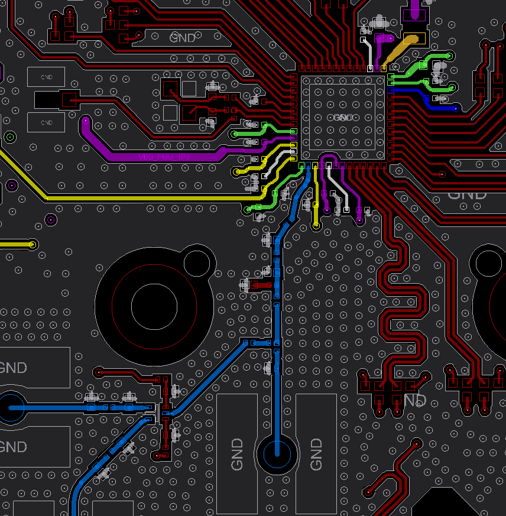

其中：

-   黄色：VDD\_RF\_RX\_1P1、VDD\_WL\_RF\_TRX\_1P1、VDD\_RFLDO1
-   绿色：VDD\_WL\_RF\_PA\_3P3、VDD\_VBAT1、VDD\_VBAT2、AVDD33
-   蓝色：VDDIO
-   紫色：VDD\_1P3、VDD\_BSLE\_RF\_PA\_1P3、VDD\_BSLE\_RF\_DRV\_1P3、VDD\_BSLE\_PLL\_DCO\_1P3、VDD1P3\_PMU1
-   白色：VDD\_RFLDO2、VDD\_BSLE\_DPALDO、VDD\_CLDO
-   橙色：BUCK\_LX
-   淡蓝色：RF

## PCB布局

WS53V100应用支持On Board和模组两种方案。

-   On Board方案
    -   支持4层板设计
    -   贴片器件建议为0201封装（inch）

-   SDIO模组
    -   4层板
    -   贴片器件建议用0201封装（inch）

-   IPC用户

    考虑小型化，一般建议选用模组

-   IOT产品
    -   考虑到板子空间比较小，建议用0201单面贴

PCB设计以 SDIO模组四层板为例，参考设计如[图1](#fig165311918113011)所示。

**图 1**  SDIO模组PCB布局参考  

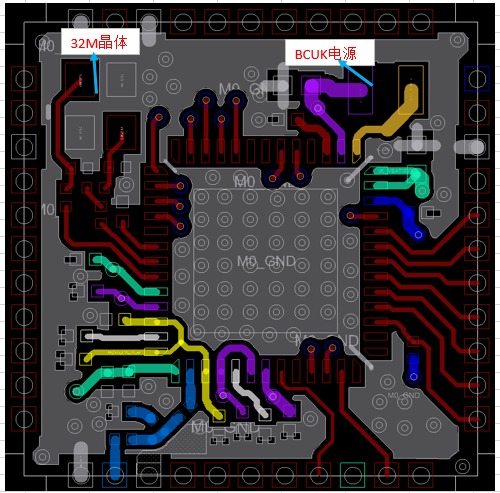

其中：

-   黄色：VDD\_RF\_RX\_1P1，VDD\_WL\_RF\_TRX\_1P1，VDD\_RFLDO1
-   绿色：VDD\_WL\_RF\_PA\_3P3，VDD\_VBAT1，VDD\_VBAT2，AVDD33
-   蓝色：VDDIO
-   紫色：VDD\_1P3，VDD\_BSLE\_RF\_PA\_1P3，VDD\_BSLE\_RF\_DRV\_1P3，VDD1P3\_PMU1
-   白色：VDD\_RFLDO2，VDD\_BSLE\_DPALDO，VDD\_CLDO
-   橙色：BUCK\_LX
-   淡蓝色：RF

## 电源

-   **[VBAT布线指导](#ZH-CN_TOPIC_0000001505882565)**  

-   **[BUCK布线指导](#ZH-CN_TOPIC_0000001455763080)**  

### VBAT布线指导

VBAT布线建议如下：

-   VDD\_VBAT1峰值电流500mA，基于100mA/4mil原则，VBAT1电源走线线宽需≥20mil。滤波电容4.7μF需要靠近管脚放置。
-   VDD\_VBAT2峰值电流50mA。滤波电容1μF需要靠近管脚放置，且电源走线须先经过滤波电容再到芯片的电源管脚。
-   AVDD33峰值电流80mA。有空间单独放置1uF滤波电容，模组空间紧凑可以和VDD\_VBAT1 共用4.7uF电容
-   VDD\_CLDO滤波电容靠近管脚放置，峰值电流300mA，走线线宽建议≥12mil。

电源管脚的滤波电容摆放位置如[图1](#fig15632742191213)所示。

**图 1**  四层板VBAT布线参考  

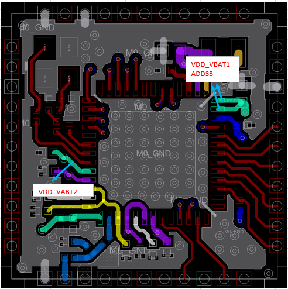

### BUCK布线指导

BUCK的输出、BUCK电感、滤波电容及地形成的最短回流通路十分重要。该环路中包含大量高频开关电流成分，因此PCB走线时应该最小化环路面积。BUCK回流环路面积越大，磁场辐射越强，这将成为噪声扩散的主要来源。

BUCK与RF正好在芯片的对角处，主要为了避免BUCK的电源噪声影响RF（左下方）和模拟部分，因此布局时外接功率电感尽量远离WS53V100的RF和模拟部分，以减少BUCK对射频性能的影响。

PCB走线约束如下：

-   BUCK\_LX：是强干扰源，需要与其他敏感信号保持距离，输出峰值电流500mA，线宽需要≥20mil，且能够尽量包地处理，包地线尽量粗且多打地孔。
-   VDD1P3\_PMU1：BUCK输出反馈给芯片内部CLDO输入，峰值电流300mA，线宽需要≥12mil，滤波电容4.7μF靠近管脚放置。走线源头从1P3的输出电容上取电。走线两端尽量包地处理，包地线尽量粗且多打地孔。
-   VDD\_1P3： BUCK输入给芯片内部RFLDO供电，峰值电流100mA，滤波电容1μF靠近管脚放置。走线源头从1P3的输出电容上取电。走线两端尽量包地处理，包地线尽量粗且多打地孔，背面走线远离芯片Epad，请勿割裂参考地平面。
-   VDD\_BSLE\_RF\_PA\_1P3：BSLE LDO输入电源，峰值电流300mA，滤波电容1μF靠近管脚放置。走线源头从1P3的输出电容上取电。走线两端尽量包地处理，包地线尽量粗且多打地孔，背面走线远离芯片Epad，请勿割裂参考地平面。
-   VDD\_BSLE\_RF\_DRV\_1P3：BSLE LDO输入电源，峰值电流70mA，滤波电容1μF靠近管脚放置（模组空间受限，可以考虑共用VDD\_BSLE\_RF\_PA\_1P3电源的1uF电容）。走线源头从1P3的输出电容上取电。走线两端尽量包地处理，包地线尽量粗且多打地孔，背面走线远离芯片Epad，请勿割裂参考地平面。
-   VDD\_BSLE\_PLL\_DCO\_1P3：BSLE LDO输入电源，峰值电流40mA，滤波电容1μF靠近管脚放置。走线源头从1P3的输出电容上取电。走线两端尽量包地处理，包地线尽量粗且多打地孔，背面走线远离芯片Epad，请勿割裂参考地平面。

**图 1**  四层板BUCK走线参考  

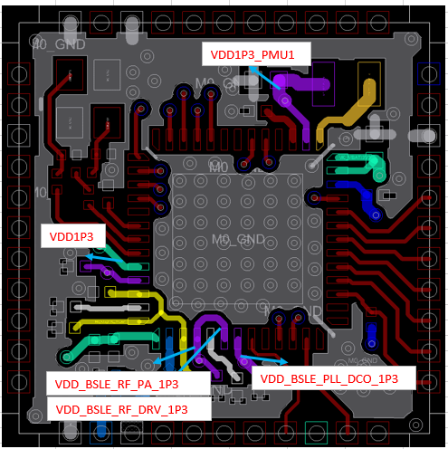

## RF布线指导

RF布线建议如下：

-   RFLDO1电源走线支持串行走线，但星型走线可以带来更好的性能，[图1](#fig13838185716128)中黄色走线即为星形走线。
-   VDD\_RFLDO2外接一个1μF的电容，给芯片内部的RFLDO2电源滤波。
-   VDD\_RFLDO1是芯片内部LDO输出，输出1.15V给RF供电，峰值电流50mA，线宽需要≥5mil。
-   VDD\_WL\_RF\_PA\_3P3给WiFi的PA供电，可以直接连接到VBAT；滤波电容靠芯片管脚放置。
-   PA电源滤波电容放置以及出线不要有过孔，建议与芯片同层出线布局，避免过孔带来寄生参数。走线压降要求<30mV。峰值电流500mA，线宽需要≥20mil。
-   VDD\_RF\_RX\_1P1是给LNA供电的电源，走线要避开RF信号干扰。
-   VDD\_WL\_RF\_TRX\_1P1是芯片内部TRX相关模块输入电源，，走线要避开RF信号干扰。
-   VDD\_RFLDO1、VDD\_RF\_RX\_1P1、VDD\_WL\_RF\_TRX\_1P1、VDD\_WL\_RF\_PA\_3P3给电源走线间尽量错开，避免相互间干扰。
-   WiFi RF前端匹配电路尽量靠近芯片放置，ESD防护电感可以靠近天线端。
-   RF信号线走线尽量短，控制阻抗50Ω，走线两边包地多打地孔。
-   RF射频线远离高速时钟线和电源线，保持射频走线参考面完整；如果射频线参考面被分割，需要通过0Ω电阻跨接保持连通性。
-   射频走线的参考地与芯片主地须保持良好连通，地回路不好的情况下，射频性能会恶化。芯片EPAD需要从两个脚拉出与外部的地连接保持连接。
-   RF匹配滤波电路：如有空间，可以预留trap电路，参考电路如[图2](#fig148115216132)，匹配值需要根据不同Layout和PCB叠层进行实测调整。如模组空间有限，可以采用π型滤波电路。滤波电容需要单点接地不能直接接在TOP层，需要打一个过孔连接到BOTTOM层，如果是多层板过孔不与中间层的地相连，过孔在中间层需要跟TOP层一样做禁空处理。这样处理之后的过孔在RF频率上过孔相当于一个小电感与电容一起组成一个LC电路，起到抑制谐波辐射的目的。前面PCB布局有提到这两个过孔的位置不能太近最好能分布在RF线的两边。

**图 1**  四层板RFLDO1及RF走线布线参考  

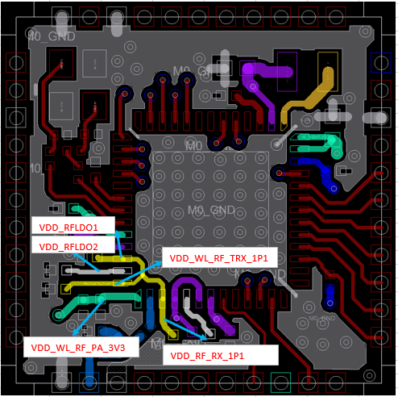

**图 2**  RF匹配电路参考电路图  
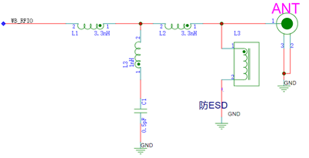

## CMU布线指导

CMU（时钟管理单元）布线建议如下：

-   WiFi系统对时钟要求很高，晶体布局以及XIN和XOUT走线须远离噪声源（RF和BUCK）和热源，避免噪声干扰引起系统相噪变差，或者热源辐射引起晶体温漂。
-   建议在XOUT走线靠近芯片端预留电阻焊盘，用于串接一个30Ω电阻限流。
-   PCB为4层板时，晶体的GND pad建议在TOP层和其他地分割，通过过孔连接到主地，防止单板上的器件发热影响时钟精度；信号pad下面挖空到主地层，减小pad的寄生电容。
-   XIN/XOUT走线尽量短，XIN/XOUT走线寄生电容＜1pF，建议能够包地处理，包地线尽量粗且多打地孔。
-   如果是On Board设计且是双面贴，可以考虑将晶体放到BOTTOM层，XIN/XOUT在靠近芯片管脚处打过孔上来连接到芯片。
-   XIN/XOUT与VBAT之间用地过孔分隔开。

CMU布局及布线参考如[图1](#fig9975133431312)所示。

**图 1**  四层板CMU布线参考  

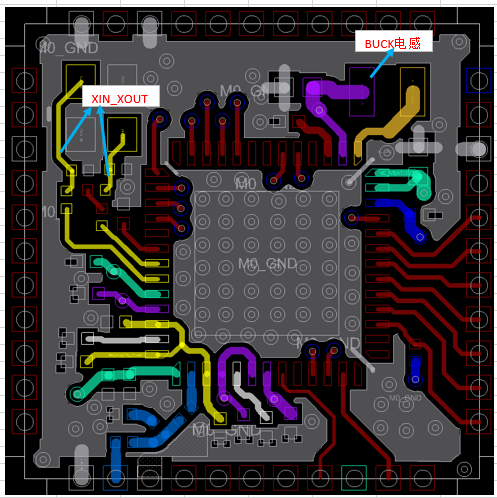

## DBB布线指导

DBB（数字基带）布线建议如下：

-   VDDIO电源滤波电容尽量靠近管脚放置。
-   数字信号设计规则相对宽松，仅需避开敏感的电源、RF和模拟部分。
-   MGPIO16管脚有负电压输入时，可能会导致芯片复位，使用时应避免该管脚出现负压；PCB设计有长走线时，建议走内层，避免受到外部干扰。

## SDIO接口布线指导

接口布线建议如下：

-   SDIO最高支持50MHz，要求布局布线远离敏感的电源、RF和模拟部分，且走线线长尽可能短不要超过5inch。
-   SDIO走线线距严格按照3W原则，即信号与信号线之间保持3倍线宽，避免信号间的串扰；SDIO\_CLK信号包地处理，包地线尽量粗且走线两侧多打地孔。
-   SDIO\_CLK靠近源端串33Ω电阻。
-   SDIO\_DATA（0～3）预留上拉电阻的一端直接接到信号线上，另一端连接到VDDIO。这样可以减少信号的反射。

## GND布线指导

除接地管脚外，WS53V100还需要将Epad焊盘接地。

GND布线建议如下：

-   参考地平面尽量完整，尽量使得每个接地管脚、电容接地都能够和芯片Epad以及系统主地有良好的地回路。
-   Epad焊盘上打通孔，孔中心距一般约23～40 mil，一般情况下建议28mil。

**图 1**  四层板Epad布线参考（Top层）  
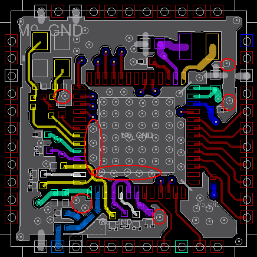

**图 2**  Epad布线参考（Bottom层）  
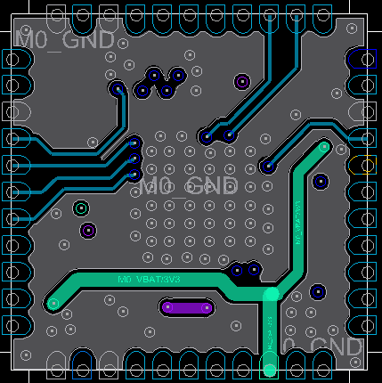

# 热设计建议

-   **[工作条件](#ZH-CN_TOPIC_0000001455922824)**  

-   **[电路热设计参考](#ZH-CN_TOPIC_0000001505603529)**  

## 工作条件

> **须知：** 
>-   芯片的极限结温的最大值为125℃，任何条件下芯片的结温都不能大于该数值。
>-   芯片的长期工作结温的最大值为105℃，正常工作条件下芯片的结温应该小于该数值。
>-   在短期工作条件下，芯片可以容忍超过105℃（长期工作结温的最大值）而小于125℃（极限结温的最大值）的高温，但长时间工作在超过105℃（长期工作结温的最大值）结温下会导致芯片寿命缩减。
>-   根据GR-63-CORE标准，短期工作条件定义为每次持续时间不超过96小时，并且每年累计时间不超过15天。

**表 1**  芯片的结温要求

<table><thead align="left"><tr id="row1710037529"><th class="cellrowborder" valign="top" width="11.41%" id="mcps1.2.7.1.1">
封装形式

</th>
<th class="cellrowborder" valign="top" width="17.76%" id="mcps1.2.7.1.2">
正常工作结温下限(℃)

</th>
<th class="cellrowborder" valign="top" width="18.34%" id="mcps1.2.7.1.3">
长期工作最大结温(℃)

</th>
<th class="cellrowborder" valign="top" width="17.349999999999998%" id="mcps1.2.7.1.4">
短期工作上限结温(℃)

</th>
<th class="cellrowborder" valign="top" width="14.979999999999999%" id="mcps1.2.7.1.5">
破坏性最大结温(℃)

</th>
<th class="cellrowborder" valign="top" width="20.16%" id="mcps1.2.7.1.6">
生命周期定义

</th>
</tr>
</thead>
<tbody><tr id="row15100127525"><td class="cellrowborder" valign="top" width="11.41%" headers="mcps1.2.7.1.1 ">
QFN

</td>
<td class="cellrowborder" valign="top" width="17.76%" headers="mcps1.2.7.1.2 ">
-40

</td>
<td class="cellrowborder" valign="top" width="18.34%" headers="mcps1.2.7.1.3 ">
105

</td>
<td class="cellrowborder" valign="top" width="17.349999999999998%" headers="mcps1.2.7.1.4 ">
125

</td>
<td class="cellrowborder" valign="top" width="14.979999999999999%" headers="mcps1.2.7.1.5 ">
125

</td>
<td class="cellrowborder" valign="top" width="20.16%" headers="mcps1.2.7.1.6 ">
10年

</td>
</tr>
</tbody>
</table>

**表 2**  芯片的封装热阻

<table><thead align="left"><tr id="row81154694219"><th class="cellrowborder" valign="top" id="mcps1.2.6.1.1">
参数

</th>
<th class="cellrowborder" valign="top" id="mcps1.2.6.1.2">
符号

</th>
<th class="cellrowborder" colspan="2" valign="top" id="mcps1.2.6.1.3">
WS53V100

</th>
<th class="cellrowborder" valign="top" id="mcps1.2.6.1.4">
单位

</th>
</tr>
</thead>
<tbody><tr id="row12174694218"><td class="cellrowborder" valign="top" headers="mcps1.2.6.1.1 ">
Junction-to-ambient thermal resistance

</td>
<td class="cellrowborder" valign="top" headers="mcps1.2.6.1.2 ">
θJA

</td>
<td class="cellrowborder" colspan="2" valign="top" headers="mcps1.2.6.1.3 ">
-

</td>
<td class="cellrowborder" valign="top" headers="mcps1.2.6.1.4 ">
℃/W

</td>
</tr>
<tr id="row1216465422"><td class="cellrowborder" valign="top" headers="mcps1.2.6.1.1 ">
Junction-to-case thermal resistance

</td>
<td class="cellrowborder" valign="top" headers="mcps1.2.6.1.2 ">
θJC

</td>
<td class="cellrowborder" colspan="2" valign="top" headers="mcps1.2.6.1.3 ">
28.0

</td>
<td class="cellrowborder" valign="top" headers="mcps1.2.6.1.4 ">
℃/W

</td>
</tr>
<tr id="row82146184219"><td class="cellrowborder" valign="top" headers="mcps1.2.6.1.1 ">
Junction-to-top center of case thermal resistance

</td>
<td class="cellrowborder" valign="top" headers="mcps1.2.6.1.2 ">
ΨJT

</td>
<td class="cellrowborder" colspan="2" valign="top" headers="mcps1.2.6.1.3 ">
-

</td>
<td class="cellrowborder" valign="top" headers="mcps1.2.6.1.4 ">
℃/W

</td>
</tr>
<tr id="row827466424"><td class="cellrowborder" valign="top" headers="mcps1.2.6.1.1 ">
Junction-to-board thermal resistance

</td>
<td class="cellrowborder" valign="top" headers="mcps1.2.6.1.2 ">
θJB

</td>
<td class="cellrowborder" colspan="2" valign="top" headers="mcps1.2.6.1.3 ">
19.5

</td>
<td class="cellrowborder" valign="top" headers="mcps1.2.6.1.4 ">
℃/W

</td>
</tr>
</tbody>
</table>

> **说明：** 
>热阻基于JEDEC JESD51-2标准给出，应用时的系统设计及环境可能与JEDEC JESD51-2标准不同，需要根据应用条件作出分析。

上述封装热阻参数仿真环境是JEDEC标准的4层PCB，如[图1](#fig207135617436)所示。

**图 1**  JEDEC标准的4层PCB参数  
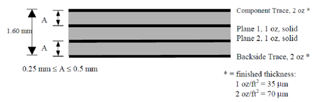

## 电路热设计参考

-   **[器件布局](#ZH-CN_TOPIC_0000001455922792)**  

-   **[PCB](#ZH-CN_TOPIC_0000001505603549)**  

### 器件布局

结合产品结构和热设计，器件布局建议如下：

-   单板上大功耗且易产生热量器件要均匀分布，避免局部过热，影响器件可靠性和散热效率。
-   合理设计结构，保证产品内部与外界有热交换途径。
-   对单板关键发热器件充分进行极端应用场景的温升测试，确保器件在安全的温度范围内长期可靠工作。
-   必要情况下，关键发热器件可以增加散热片，进一步提升散热效果。

### PCB

走线热设计建议如下：

-   芯片底下的过孔采用FULL孔连接，而不是普通的花孔连接，以提高单板散热效率。
-   在热量大的器件正下方和周边尽量增大铜皮面积，发热器件背面的地平面尽量减少分割，完整地平面能够有效分散热量，提高整体散热效果。另外，如果结构允许，将芯片正背面附近地平面进行亮铜处理，也能够进一步提升散热效果。

# 焊接工艺

-   **[概述](#ZH-CN_TOPIC_0000001505842449)**  

-   **[无铅回流焊工艺参数要求](#ZH-CN_TOPIC_0000001455922828)**  

-   **[混合回流焊工艺参数要求](#ZH-CN_TOPIC_0000001456242672)**  

## 概述

本章主要介绍客户端在使用芯片做回流焊时工艺控制：主要是无铅工艺和混合工艺两类。

定义说明：

-   芯片：给客户的芯片均为ROHS产品，均满足无铅要求。
-   无铅工艺：所有器件\(主板/所有IC/电容电阻等\)均为无铅器件，并使用无铅锡膏的纯无铅工艺。

## 无铅回流焊工艺参数要求

无铅回流焊接工艺曲线如[图1](#fig11189932125217)所示。

**图 1**  无铅回流焊接工艺曲线  
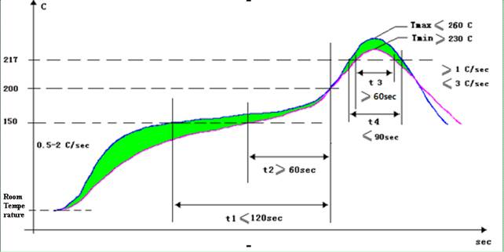

无铅回流焊工艺参数如[表1](#table7961631185211)所示。

**表 1**  无铅回流焊工艺参数

<table><thead align="left"><tr id="row219073225214"><th class="cellrowborder" valign="top" width="26.44%" id="mcps1.2.6.1.1">
区域

</th>
<th class="cellrowborder" valign="top" width="13.22%" id="mcps1.2.6.1.2">
时间

</th>
<th class="cellrowborder" valign="top" width="14.77%" id="mcps1.2.6.1.3">
升温速率

</th>
<th class="cellrowborder" valign="top" width="13.22%" id="mcps1.2.6.1.4">
峰值温度

</th>
<th class="cellrowborder" valign="top" width="32.35%" id="mcps1.2.6.1.5">
降温速率

</th>
</tr>
</thead>
<tbody><tr id="row1519016329524"><td class="cellrowborder" valign="top" width="26.44%" headers="mcps1.2.6.1.1 ">
预热区（40～150℃）

</td>
<td class="cellrowborder" valign="top" width="13.22%" headers="mcps1.2.6.1.2 ">
60～150 s

</td>
<td class="cellrowborder" valign="top" width="14.77%" headers="mcps1.2.6.1.3 ">
≤2.0℃/s

</td>
<td class="cellrowborder" valign="top" width="13.22%" headers="mcps1.2.6.1.4 ">
-

</td>
<td class="cellrowborder" valign="top" width="32.35%" headers="mcps1.2.6.1.5 ">
-

</td>
</tr>
<tr id="row8190832135212"><td class="cellrowborder" valign="top" width="26.44%" headers="mcps1.2.6.1.1 ">
均温区（150～200℃）

</td>
<td class="cellrowborder" valign="top" width="13.22%" headers="mcps1.2.6.1.2 ">
60～120 s

</td>
<td class="cellrowborder" valign="top" width="14.77%" headers="mcps1.2.6.1.3 ">
＜1.0℃/s

</td>
<td class="cellrowborder" valign="top" width="13.22%" headers="mcps1.2.6.1.4 ">
-

</td>
<td class="cellrowborder" valign="top" width="32.35%" headers="mcps1.2.6.1.5 ">
-

</td>
</tr>
<tr id="row1819063212524"><td class="cellrowborder" valign="top" width="26.44%" headers="mcps1.2.6.1.1 ">
回流区（＞217℃）

</td>
<td class="cellrowborder" valign="top" width="13.22%" headers="mcps1.2.6.1.2 ">
60～90 s

</td>
<td class="cellrowborder" valign="top" width="14.77%" headers="mcps1.2.6.1.3 ">
-

</td>
<td class="cellrowborder" valign="top" width="13.22%" headers="mcps1.2.6.1.4 ">
230-260 ℃

</td>
<td class="cellrowborder" valign="top" width="32.35%" headers="mcps1.2.6.1.5 ">
-

</td>
</tr>
<tr id="row519114325526"><td class="cellrowborder" valign="top" width="26.44%" headers="mcps1.2.6.1.1 ">
冷却区（Tmax～180℃）

</td>
<td class="cellrowborder" valign="top" width="13.22%" headers="mcps1.2.6.1.2 ">
-

</td>
<td class="cellrowborder" valign="top" width="14.77%" headers="mcps1.2.6.1.3 ">
-

</td>
<td class="cellrowborder" valign="top" width="13.22%" headers="mcps1.2.6.1.4 ">
-

</td>
<td class="cellrowborder" valign="top" width="32.35%" headers="mcps1.2.6.1.5 ">
1.0℃/s≤Slope≤4.0℃/s

</td>
</tr>
</tbody>
</table>

说明：

-   预热区：温度由40℃～150℃，温度上升速率控制在2℃/s左右，该温区时间为60～150 s。
-   均温区：温度由150℃～200℃，稳定缓慢升温，温度上升速率小于1℃/s，且该区域时间控制在60～120 s**（注意：该区域一定缓慢受热，否则易导致焊接不良）**。
-   回流区：温度由217℃～Tmax～217℃，整个区间时间控制在60～90 s。
-   冷却区：温度由Tmax～180℃，温度下降速率最大不能超过4℃/s。
-   温度从室温25℃升温到250℃时间不应该超过6分钟。
-   该回流焊曲线仅为推荐值，客户端需根据实际生产情况做相应调整。
-   回流时间以60～90 s为目标，对于一些热容较大无法满足时间要求的单板可将回流时间放宽至120s。封装体耐温标准参考IPC/JEDEC J-STD-020D标准，封装体测温方法参考JEP 140标准。

IPC/JEDEC J-STD-020D标准，封装体测温方法按照JEP 140标准要求：IPC/JEDEC 020D中的无铅器件封装体耐温标准如[表2](#table141320324529)所示。

**表 2**  IPC/JEDEC 020D中的无铅器件封装体耐温标准

<table><thead align="left"><tr id="row11192133218527"><th class="cellrowborder" valign="top" width="23.25232523252325%" id="mcps1.2.5.1.1">
Package

Thickness

</th>
<th class="cellrowborder" valign="top" width="24.952495249524954%" id="mcps1.2.5.1.2">
Volume  mm3

＜350

</th>
<th class="cellrowborder" valign="top" width="24.952495249524954%" id="mcps1.2.5.1.3">
Volume  mm3

350～2000

</th>
<th class="cellrowborder" valign="top" width="26.842684268426847%" id="mcps1.2.5.1.4">
Volume  mm3

＞2000

</th>
</tr>
</thead>
<tbody><tr id="row171925327523"><td class="cellrowborder" valign="top" width="23.25232523252325%" headers="mcps1.2.5.1.1 ">
＜1.6mm

</td>
<td class="cellrowborder" valign="top" width="24.952495249524954%" headers="mcps1.2.5.1.2 ">
260℃

</td>
<td class="cellrowborder" valign="top" width="24.952495249524954%" headers="mcps1.2.5.1.3 ">
260℃

</td>
<td class="cellrowborder" valign="top" width="26.842684268426847%" headers="mcps1.2.5.1.4 ">
260℃

</td>
</tr>
<tr id="row141928322526"><td class="cellrowborder" valign="top" width="23.25232523252325%" headers="mcps1.2.5.1.1 ">
1.6mm～2.5mm

</td>
<td class="cellrowborder" valign="top" width="24.952495249524954%" headers="mcps1.2.5.1.2 ">
260℃

</td>
<td class="cellrowborder" valign="top" width="24.952495249524954%" headers="mcps1.2.5.1.3 ">
250℃

</td>
<td class="cellrowborder" valign="top" width="26.842684268426847%" headers="mcps1.2.5.1.4 ">
245℃

</td>
</tr>
<tr id="row21921032115218"><td class="cellrowborder" valign="top" width="23.25232523252325%" headers="mcps1.2.5.1.1 ">
＞2.5mm

</td>
<td class="cellrowborder" valign="top" width="24.952495249524954%" headers="mcps1.2.5.1.2 ">
250℃

</td>
<td class="cellrowborder" valign="top" width="24.952495249524954%" headers="mcps1.2.5.1.3 ">
245℃

</td>
<td class="cellrowborder" valign="top" width="26.842684268426847%" headers="mcps1.2.5.1.4 ">
245℃

</td>
</tr>
</tbody>
</table>

体积计算中不计入器件焊端（焊球，引脚）和外部散热片。

回流焊接工艺曲线测量方法：

JEP140推荐：对于厚度较小的器件，测量封装体温度时，直接将热电偶贴放在器件表面，对于厚度较大的器件，在器件表面钻孔埋入热电偶进行测量。由于量化器件厚度的要求，推荐全部采用在封装体表面钻孔埋入热电偶的方式（特别薄器件，无法钻孔除外）。如[图2](#fig51931632205219)所示。

**图 2**  封装体测温示意图  
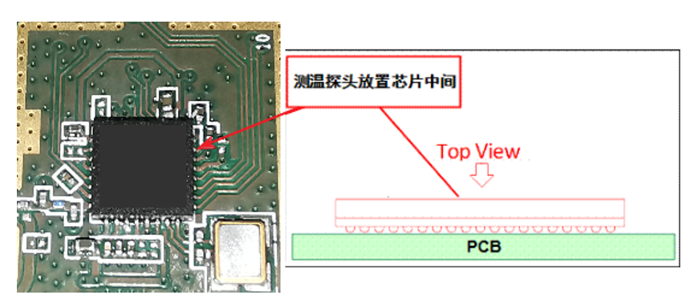

> **说明：** 
>如果是QFP封装的芯片，直接将测温探头放在管脚处即可。

## 混合回流焊工艺参数要求

回流焊接过程中，如果出现器件混装现象，应首先保证无铅器件的正常焊接。具体要求如[表1](#table1143116301540)所示。

**表 1**  混装回流焊工艺参数表

<table><thead align="left"><tr id="row85661306546"><th class="cellrowborder" colspan="2" valign="top" id="mcps1.2.6.1.1">
数值要求

</th>
<th class="cellrowborder" valign="top" id="mcps1.2.6.1.2">
有铅BGA

</th>
<th class="cellrowborder" valign="top" id="mcps1.2.6.1.3">
无铅BGA

</th>
<th class="cellrowborder" valign="top" id="mcps1.2.6.1.4">
其它器件

</th>
</tr>
</thead>
<tbody><tr id="row7566830145419"><td class="cellrowborder" rowspan="2" valign="top" headers="mcps1.2.6.1.1 ">
预热区（40～150 ℃）

</td>
<td class="cellrowborder" valign="top" headers="mcps1.2.6.1.1 ">
时间

</td>
<td class="cellrowborder" colspan="3" valign="top" headers="mcps1.2.6.1.2 mcps1.2.6.1.3 mcps1.2.6.1.4 ">
60～150 s

</td>
</tr>
<tr id="row0566123013543"><td class="cellrowborder" valign="top" headers="mcps1.2.6.1.1 ">
升温斜率

</td>
<td class="cellrowborder" colspan="3" valign="top" headers="mcps1.2.6.1.2 mcps1.2.6.1.3 mcps1.2.6.1.4 ">
＜2.5℃/s

</td>
</tr>
<tr id="row3566153075419"><td class="cellrowborder" rowspan="2" valign="top" headers="mcps1.2.6.1.1 ">
均温区（150～183 ℃）

</td>
<td class="cellrowborder" valign="top" headers="mcps1.2.6.1.1 ">
时间

</td>
<td class="cellrowborder" colspan="3" valign="top" headers="mcps1.2.6.1.2 mcps1.2.6.1.3 mcps1.2.6.1.4 ">
30～90 s

</td>
</tr>
<tr id="row1356703065417"><td class="cellrowborder" valign="top" headers="mcps1.2.6.1.1 ">
升温斜率

</td>
<td class="cellrowborder" colspan="3" valign="top" headers="mcps1.2.6.1.2 mcps1.2.6.1.3 mcps1.2.6.1.4 ">
＜1.0℃/s

</td>
</tr>
<tr id="row20567123045420"><td class="cellrowborder" rowspan="2" valign="top" width="19.191919191919194%" headers="mcps1.2.6.1.1 ">
回流区（＞183 ℃）

</td>
<td class="cellrowborder" valign="top" width="19.191919191919194%" headers="mcps1.2.6.1.1 ">
峰值温度

</td>
<td class="cellrowborder" valign="top" width="29.292929292929294%" headers="mcps1.2.6.1.2 ">
210~240 ℃

</td>
<td class="cellrowborder" valign="top" width="16.161616161616163%" headers="mcps1.2.6.1.3 ">
220~240 ℃

</td>
<td class="cellrowborder" valign="top" width="16.161616161616163%" headers="mcps1.2.6.1.4 ">
210~245 ℃

</td>
</tr>
<tr id="row1556803085417"><td class="cellrowborder" valign="top" headers="mcps1.2.6.1.1 ">
时间

</td>
<td class="cellrowborder" valign="top" headers="mcps1.2.6.1.1 ">
30~120 s

</td>
<td class="cellrowborder" valign="top" headers="mcps1.2.6.1.2 ">
60~120 s

</td>
<td class="cellrowborder" valign="top" headers="mcps1.2.6.1.3 ">
30~120 s

</td>
</tr>
<tr id="row1568103085411"><td class="cellrowborder" valign="top" headers="mcps1.2.6.1.1 ">
冷却区（Tmax～150 ℃）

</td>
<td class="cellrowborder" valign="top" headers="mcps1.2.6.1.1 ">
降温斜率

</td>
<td class="cellrowborder" colspan="3" valign="top" headers="mcps1.2.6.1.2 mcps1.2.6.1.3 mcps1.2.6.1.4 ">
1.0℃/s≤Slope≤4.0℃/s

</td>
</tr>
</tbody>
</table>

> **说明：** 
>以上工艺参数要求均针对焊点温度。单板上焊点最热点和最冷点均需要满足以上规范要求。

曲线调制中，还需要满足单板上元器件的封装体耐温要求。封装体耐温标准按照IPC/JEDEC J-STD-020D标准，封装体测温方法按照JEP 140标准。

IPC/JEDEC 020D中的有铅器件封装体耐温标准如[表2](#table2471123095420)所示。

**表 2**  IPC/JEDEC 020D中的有铅器件封装体耐温标准

<table><thead align="left"><tr id="row185681930165417"><th class="cellrowborder" valign="top" width="30.246975302469753%" id="mcps1.2.4.1.1">
Package

Thickness

</th>
<th class="cellrowborder" valign="top" width="34.02659734026597%" id="mcps1.2.4.1.2">
Volume  mm3

＜350

</th>
<th class="cellrowborder" valign="top" width="35.72642735726427%" id="mcps1.2.4.1.3">
Volume  mm3

≥350

</th>
</tr>
</thead>
<tbody><tr id="row7569330145418"><td class="cellrowborder" valign="top" width="30.246975302469753%" headers="mcps1.2.4.1.1 ">
＜2.5mm

</td>
<td class="cellrowborder" valign="top" width="34.02659734026597%" headers="mcps1.2.4.1.2 ">
235℃

</td>
<td class="cellrowborder" valign="top" width="35.72642735726427%" headers="mcps1.2.4.1.3 ">
220℃

</td>
</tr>
<tr id="row656910308544"><td class="cellrowborder" valign="top" width="30.246975302469753%" headers="mcps1.2.4.1.1 ">
≥2.5mm

</td>
<td class="cellrowborder" valign="top" width="34.02659734026597%" headers="mcps1.2.4.1.2 ">
220℃

</td>
<td class="cellrowborder" valign="top" width="35.72642735726427%" headers="mcps1.2.4.1.3 ">
220℃

</td>
</tr>
</tbody>
</table>

体积计算中不计入器件焊端（焊球，引脚）和外部散热片。

JEP140标准规定测量封装体温度方法同无铅工艺，请参考[无铅回流焊工艺参数](#ZH-CN_TOPIC_0000001455922828)要求详细说明。

# 潮敏参数

-   **[存放与使用](#ZH-CN_TOPIC_0000001456242656)**  

-   **[重新烘烤](#ZH-CN_TOPIC_0000001505882581)**  

## 存放与使用

**【**使用范围】

所有IC（潮敏产品）的存放和使用。

**【**存放环境】

建议产品真空包装存放，存放温度范围：大于等于-40℃，小于等于150℃。推荐存放在25℃的环境温度下。

**【**存储期限】（shelf life）

存放环境<30°C/60% RH下，真空包装存放，存储期限\(shelf life\)不少于12个月。

**【**车间寿命】（floor life）

在环境条件<30°C/60%下，floor life参照表如[表1](#table1614748174417)所示。

**表 1**  车间寿命（floor life）参照表

<table><thead align="left"><tr id="row18148198134415"><th class="cellrowborder" valign="top" width="14.09%" id="mcps1.2.3.1.1">
潮湿敏感等级

（MSL）

</th>
<th class="cellrowborder" valign="top" width="85.91%" id="mcps1.2.3.1.2">
含义（即拆分后放存条件及最长时间）

</th>
</tr>
</thead>
<tbody><tr id="row141482814447"><td class="cellrowborder" valign="top" width="14.09%" headers="mcps1.2.3.1.1 ">
1

</td>
<td class="cellrowborder" valign="top" width="85.91%" headers="mcps1.2.3.1.2 ">
无限制，环境温湿度≦30℃/85% RH（Relative Humidity）

</td>
</tr>
<tr id="row914819854413"><td class="cellrowborder" valign="top" width="14.09%" headers="mcps1.2.3.1.1 ">
2

</td>
<td class="cellrowborder" valign="top" width="85.91%" headers="mcps1.2.3.1.2 ">
1year，30℃/60%RH。

</td>
</tr>
<tr id="row181483819448"><td class="cellrowborder" valign="top" width="14.09%" headers="mcps1.2.3.1.1 ">
2a

</td>
<td class="cellrowborder" valign="top" width="85.91%" headers="mcps1.2.3.1.2 ">
4week，30℃/60%RH。

</td>
</tr>
<tr id="row201488824415"><td class="cellrowborder" valign="top" width="14.09%" headers="mcps1.2.3.1.1 ">
3

</td>
<td class="cellrowborder" valign="top" width="85.91%" headers="mcps1.2.3.1.2 ">
1week，30℃/60%RH。

</td>
</tr>
<tr id="row714818894411"><td class="cellrowborder" valign="top" width="14.09%" headers="mcps1.2.3.1.1 ">
4

</td>
<td class="cellrowborder" valign="top" width="85.91%" headers="mcps1.2.3.1.2 ">
72h，30℃/60%RH。

</td>
</tr>
<tr id="row114818814444"><td class="cellrowborder" valign="top" width="14.09%" headers="mcps1.2.3.1.1 ">
5

</td>
<td class="cellrowborder" valign="top" width="85.91%" headers="mcps1.2.3.1.2 ">
48h，30℃/60%RH。

</td>
</tr>
<tr id="row171490819447"><td class="cellrowborder" valign="top" width="14.09%" headers="mcps1.2.3.1.1 ">
5a

</td>
<td class="cellrowborder" valign="top" width="85.91%" headers="mcps1.2.3.1.2 ">
24h，30℃/60%RH。

</td>
</tr>
<tr id="row5442814124415"><td class="cellrowborder" valign="top" width="14.09%" headers="mcps1.2.3.1.1 ">
6

</td>
<td class="cellrowborder" valign="top" width="85.91%" headers="mcps1.2.3.1.2 ">
Time on Label，30℃/60%RH。

</td>
</tr>
</tbody>
</table>

**【**潮敏产品的使用】

-   产品在≦30℃/60%RH下连续或累计暴露超过2个小时，建议进行重新烘烤后再真空干燥包装。
-   产品在≦30℃/60%RH下暴露累计没有超过2个小时，可以不用重新烘烤，但要更换新的干燥剂，进行真空干燥包装。
-   本产品的潮敏参数等级为3级。

本文没有提到的存储及使用原则，请直接参考JEDEC J-STD-033A。

## 重新烘烤

【适用产品】

所有潮敏产品

【使用范围】

需要重新烘烤的潮敏产品

【重新烘烤参考表】

**表 1**  重新烘烤参考表

<table><thead align="left"><tr id="row105305278453"><th class="cellrowborder" valign="top" width="17.98%" id="mcps1.2.6.1.1">
芯片厚度

</th>
<th class="cellrowborder" valign="top" width="11.77%" id="mcps1.2.6.1.2">
MSL潮敏等级

</th>
<th class="cellrowborder" valign="top" width="20.59%" id="mcps1.2.6.1.3">
烘烤125℃

</th>
<th class="cellrowborder" valign="top" width="25.729999999999997%" id="mcps1.2.6.1.4">
烘烤90℃/≦5% RH

</th>
<th class="cellrowborder" valign="top" width="23.93%" id="mcps1.2.6.1.5">
烘烤40℃/≦5% RH

</th>
</tr>
</thead>
<tbody><tr id="row20530127124519"><td class="cellrowborder" rowspan="5" valign="top" width="17.98%" headers="mcps1.2.6.1.1 ">
≤1.4mm

</td>
<td class="cellrowborder" valign="top" width="11.77%" headers="mcps1.2.6.1.2 ">
2a

</td>
<td class="cellrowborder" valign="top" width="20.59%" headers="mcps1.2.6.1.3 ">
3h

</td>
<td class="cellrowborder" valign="top" width="25.729999999999997%" headers="mcps1.2.6.1.4 ">
11h

</td>
<td class="cellrowborder" valign="top" width="23.93%" headers="mcps1.2.6.1.5 ">
5day

</td>
</tr>
<tr id="row25313271450"><td class="cellrowborder" valign="top" headers="mcps1.2.6.1.1 ">
3

</td>
<td class="cellrowborder" valign="top" headers="mcps1.2.6.1.2 ">
7h

</td>
<td class="cellrowborder" valign="top" headers="mcps1.2.6.1.3 ">
23h

</td>
<td class="cellrowborder" valign="top" headers="mcps1.2.6.1.4 ">
9day

</td>
</tr>
<tr id="row105312027114518"><td class="cellrowborder" valign="top" headers="mcps1.2.6.1.1 ">
4

</td>
<td class="cellrowborder" valign="top" headers="mcps1.2.6.1.2 ">
7h

</td>
<td class="cellrowborder" valign="top" headers="mcps1.2.6.1.3 ">
23h

</td>
<td class="cellrowborder" valign="top" headers="mcps1.2.6.1.4 ">
9day

</td>
</tr>
<tr id="row17531427144514"><td class="cellrowborder" valign="top" headers="mcps1.2.6.1.1 ">
5

</td>
<td class="cellrowborder" valign="top" headers="mcps1.2.6.1.2 ">
7h

</td>
<td class="cellrowborder" valign="top" headers="mcps1.2.6.1.3 ">
24h

</td>
<td class="cellrowborder" valign="top" headers="mcps1.2.6.1.4 ">
10day

</td>
</tr>
<tr id="row753182794516"><td class="cellrowborder" valign="top" headers="mcps1.2.6.1.1 ">
5a

</td>
<td class="cellrowborder" valign="top" headers="mcps1.2.6.1.2 ">
10h

</td>
<td class="cellrowborder" valign="top" headers="mcps1.2.6.1.3 ">
24h

</td>
<td class="cellrowborder" valign="top" headers="mcps1.2.6.1.4 ">
10day

</td>
</tr>
<tr id="row105326274454"><td class="cellrowborder" rowspan="5" valign="top" width="17.98%" headers="mcps1.2.6.1.1 ">
≤2.0mm

</td>
<td class="cellrowborder" valign="top" width="11.77%" headers="mcps1.2.6.1.2 ">
2a

</td>
<td class="cellrowborder" valign="top" width="20.59%" headers="mcps1.2.6.1.3 ">
16h

</td>
<td class="cellrowborder" valign="top" width="25.729999999999997%" headers="mcps1.2.6.1.4 ">
2day

</td>
<td class="cellrowborder" valign="top" width="23.93%" headers="mcps1.2.6.1.5 ">
22day

</td>
</tr>
<tr id="row1853232764518"><td class="cellrowborder" valign="top" headers="mcps1.2.6.1.1 ">
3

</td>
<td class="cellrowborder" valign="top" headers="mcps1.2.6.1.2 ">
17h

</td>
<td class="cellrowborder" valign="top" headers="mcps1.2.6.1.3 ">
2day

</td>
<td class="cellrowborder" valign="top" headers="mcps1.2.6.1.4 ">
23day

</td>
</tr>
<tr id="row0738135174517"><td class="cellrowborder" valign="top" headers="mcps1.2.6.1.1 ">
4

</td>
<td class="cellrowborder" valign="top" headers="mcps1.2.6.1.2 ">
20h

</td>
<td class="cellrowborder" valign="top" headers="mcps1.2.6.1.3 ">
3day

</td>
<td class="cellrowborder" valign="top" headers="mcps1.2.6.1.4 ">
28day

</td>
</tr>
<tr id="row1435295244519"><td class="cellrowborder" valign="top" headers="mcps1.2.6.1.1 ">
5

</td>
<td class="cellrowborder" valign="top" headers="mcps1.2.6.1.2 ">
25h

</td>
<td class="cellrowborder" valign="top" headers="mcps1.2.6.1.3 ">
4day

</td>
<td class="cellrowborder" valign="top" headers="mcps1.2.6.1.4 ">
35day

</td>
</tr>
<tr id="row14915152124512"><td class="cellrowborder" valign="top" headers="mcps1.2.6.1.1 ">
5a

</td>
<td class="cellrowborder" valign="top" headers="mcps1.2.6.1.2 ">
40h

</td>
<td class="cellrowborder" valign="top" headers="mcps1.2.6.1.3 ">
6day

</td>
<td class="cellrowborder" valign="top" headers="mcps1.2.6.1.4 ">
56day

</td>
</tr>
<tr id="row20453175344512"><td class="cellrowborder" rowspan="5" valign="top" width="17.98%" headers="mcps1.2.6.1.1 ">
≤4.5mm

</td>
<td class="cellrowborder" valign="top" width="11.77%" headers="mcps1.2.6.1.2 ">
2a

</td>
<td class="cellrowborder" valign="top" width="20.59%" headers="mcps1.2.6.1.3 ">
48h

</td>
<td class="cellrowborder" valign="top" width="25.729999999999997%" headers="mcps1.2.6.1.4 ">
7day

</td>
<td class="cellrowborder" valign="top" width="23.93%" headers="mcps1.2.6.1.5 ">
67day

</td>
</tr>
<tr id="row543115415453"><td class="cellrowborder" valign="top" headers="mcps1.2.6.1.1 ">
3

</td>
<td class="cellrowborder" valign="top" headers="mcps1.2.6.1.2 ">
48h

</td>
<td class="cellrowborder" valign="top" headers="mcps1.2.6.1.3 ">
8day

</td>
<td class="cellrowborder" valign="top" headers="mcps1.2.6.1.4 ">
67day

</td>
</tr>
<tr id="row115461654194514"><td class="cellrowborder" valign="top" headers="mcps1.2.6.1.1 ">
4

</td>
<td class="cellrowborder" valign="top" headers="mcps1.2.6.1.2 ">
48h

</td>
<td class="cellrowborder" valign="top" headers="mcps1.2.6.1.3 ">
10day

</td>
<td class="cellrowborder" valign="top" headers="mcps1.2.6.1.4 ">
67day

</td>
</tr>
<tr id="row111221155164515"><td class="cellrowborder" valign="top" headers="mcps1.2.6.1.1 ">
5

</td>
<td class="cellrowborder" valign="top" headers="mcps1.2.6.1.2 ">
48h

</td>
<td class="cellrowborder" valign="top" headers="mcps1.2.6.1.3 ">
10day

</td>
<td class="cellrowborder" valign="top" headers="mcps1.2.6.1.4 ">
67day

</td>
</tr>
<tr id="row9649185519456"><td class="cellrowborder" valign="top" headers="mcps1.2.6.1.1 ">
5a

</td>
<td class="cellrowborder" valign="top" headers="mcps1.2.6.1.2 ">
48h

</td>
<td class="cellrowborder" valign="top" headers="mcps1.2.6.1.3 ">
10day

</td>
<td class="cellrowborder" valign="top" headers="mcps1.2.6.1.4 ">
67day

</td>
</tr>
</tbody>
</table>

> **说明：** 
>-   此表中显示的均是受潮后，必须的最小的烘烤时间；
>-   重新烘烤优先选择低温烘烤；
>-   详细情况请参考JEDEC。

# 接口时序

-   **[UART接口时序](#ZH-CN_TOPIC_0000001505882549)**  

-   **[I2C时序](#ZH-CN_TOPIC_0000001456082752)**  

-   **[I2S时序](#ZH-CN_TOPIC_0000001455763060)**  

-   **[SDIO时序](#ZH-CN_TOPIC_0000001505882545)**  

-   **[SPI接口时序](#ZH-CN_TOPIC_0000001456242668)**  

## UART接口时序

WS53V100芯片 支持3组UART接口，其中UART\_L0支持两线连接（RXD、TXD），不支持流控模式，UART\_H0和UART\_H1支持四线的协议（RXD、TXD、CTS、RTS），其中RXD和TXD用于数据传送，RTS和CTS用于流控。

UART接口支持多种波特率，波特率大小和传送速率之间成正比关系，支持的波特率从9600bit/s到5Mbit/s，其速率可以通过寄存器进行配置。

UART\_L0支持最大速率2Mbit/s，UART\_H0和UART\_H1支持最大速率5Mbit/s。

波特率和误码率如[表1](#table14102645174016)所示。

**表 1**  UART接口波特率和误码率

<table><thead align="left"><tr id="row41471145204014"><th class="cellrowborder" valign="top" width="33.673367336733676%" id="mcps1.2.4.1.1">
Desired Rate

</th>
<th class="cellrowborder" valign="top" width="33.673367336733676%" id="mcps1.2.4.1.2">
Actual Rate

</th>
<th class="cellrowborder" valign="top" width="32.653265326532654%" id="mcps1.2.4.1.3">
Error（%）

</th>
</tr>
</thead>
<tbody><tr id="row14979840104916"><td class="cellrowborder" valign="top" width="33.673367336733676%" headers="mcps1.2.4.1.1 ">
5000000

</td>
<td class="cellrowborder" valign="top" width="33.673367336733676%" headers="mcps1.2.4.1.2 ">
5000000

</td>
<td class="cellrowborder" valign="top" width="32.653265326532654%" headers="mcps1.2.4.1.3 ">
0.00

</td>
</tr>
<tr id="row1914814454403"><td class="cellrowborder" valign="top" width="33.673367336733676%" headers="mcps1.2.4.1.1 ">
4000000

</td>
<td class="cellrowborder" valign="top" width="33.673367336733676%" headers="mcps1.2.4.1.2 ">
4000000

</td>
<td class="cellrowborder" valign="top" width="32.653265326532654%" headers="mcps1.2.4.1.3 ">
0.00

</td>
</tr>
<tr id="row1148134519405"><td class="cellrowborder" valign="top" width="33.673367336733676%" headers="mcps1.2.4.1.1 ">
3000000

</td>
<td class="cellrowborder" valign="top" width="33.673367336733676%" headers="mcps1.2.4.1.2 ">
3000000

</td>
<td class="cellrowborder" valign="top" width="32.653265326532654%" headers="mcps1.2.4.1.3 ">
0.00

</td>
</tr>
<tr id="row514864524018"><td class="cellrowborder" valign="top" width="33.673367336733676%" headers="mcps1.2.4.1.1 ">
2000000

</td>
<td class="cellrowborder" valign="top" width="33.673367336733676%" headers="mcps1.2.4.1.2 ">
2000000

</td>
<td class="cellrowborder" valign="top" width="32.653265326532654%" headers="mcps1.2.4.1.3 ">
0.00

</td>
</tr>
<tr id="row1014854517408"><td class="cellrowborder" valign="top" width="33.673367336733676%" headers="mcps1.2.4.1.1 ">
1500000

</td>
<td class="cellrowborder" valign="top" width="33.673367336733676%" headers="mcps1.2.4.1.2 ">
1500000

</td>
<td class="cellrowborder" valign="top" width="32.653265326532654%" headers="mcps1.2.4.1.3 ">
0.00

</td>
</tr>
<tr id="row91484456403"><td class="cellrowborder" valign="top" width="33.673367336733676%" headers="mcps1.2.4.1.1 ">
1444444

</td>
<td class="cellrowborder" valign="top" width="33.673367336733676%" headers="mcps1.2.4.1.2 ">
1454544

</td>
<td class="cellrowborder" valign="top" width="32.653265326532654%" headers="mcps1.2.4.1.3 ">
0.70

</td>
</tr>
<tr id="row6148184516402"><td class="cellrowborder" valign="top" width="33.673367336733676%" headers="mcps1.2.4.1.1 ">
921600

</td>
<td class="cellrowborder" valign="top" width="33.673367336733676%" headers="mcps1.2.4.1.2 ">
923077

</td>
<td class="cellrowborder" valign="top" width="32.653265326532654%" headers="mcps1.2.4.1.3 ">
0.16

</td>
</tr>
<tr id="row11148545164010"><td class="cellrowborder" valign="top" width="33.673367336733676%" headers="mcps1.2.4.1.1 ">
460800

</td>
<td class="cellrowborder" valign="top" width="33.673367336733676%" headers="mcps1.2.4.1.2 ">
461538

</td>
<td class="cellrowborder" valign="top" width="32.653265326532654%" headers="mcps1.2.4.1.3 ">
0.16

</td>
</tr>
<tr id="row7148845124018"><td class="cellrowborder" valign="top" width="33.673367336733676%" headers="mcps1.2.4.1.1 ">
230400

</td>
<td class="cellrowborder" valign="top" width="33.673367336733676%" headers="mcps1.2.4.1.2 ">
230796

</td>
<td class="cellrowborder" valign="top" width="32.653265326532654%" headers="mcps1.2.4.1.3 ">
0.17

</td>
</tr>
<tr id="row4148445194012"><td class="cellrowborder" valign="top" width="33.673367336733676%" headers="mcps1.2.4.1.1 ">
115200

</td>
<td class="cellrowborder" valign="top" width="33.673367336733676%" headers="mcps1.2.4.1.2 ">
115385

</td>
<td class="cellrowborder" valign="top" width="32.653265326532654%" headers="mcps1.2.4.1.3 ">
0.16

</td>
</tr>
<tr id="row1114854516404"><td class="cellrowborder" valign="top" width="33.673367336733676%" headers="mcps1.2.4.1.1 ">
57600

</td>
<td class="cellrowborder" valign="top" width="33.673367336733676%" headers="mcps1.2.4.1.2 ">
57692

</td>
<td class="cellrowborder" valign="top" width="32.653265326532654%" headers="mcps1.2.4.1.3 ">
0.16

</td>
</tr>
<tr id="row814894511405"><td class="cellrowborder" valign="top" width="33.673367336733676%" headers="mcps1.2.4.1.1 ">
38400

</td>
<td class="cellrowborder" valign="top" width="33.673367336733676%" headers="mcps1.2.4.1.2 ">
38400

</td>
<td class="cellrowborder" valign="top" width="32.653265326532654%" headers="mcps1.2.4.1.3 ">
0.00

</td>
</tr>
<tr id="row18148194515408"><td class="cellrowborder" valign="top" width="33.673367336733676%" headers="mcps1.2.4.1.1 ">
28800

</td>
<td class="cellrowborder" valign="top" width="33.673367336733676%" headers="mcps1.2.4.1.2 ">
28846

</td>
<td class="cellrowborder" valign="top" width="32.653265326532654%" headers="mcps1.2.4.1.3 ">
0.16

</td>
</tr>
<tr id="row514824554014"><td class="cellrowborder" valign="top" width="33.673367336733676%" headers="mcps1.2.4.1.1 ">
19200

</td>
<td class="cellrowborder" valign="top" width="33.673367336733676%" headers="mcps1.2.4.1.2 ">
19220

</td>
<td class="cellrowborder" valign="top" width="32.653265326532654%" headers="mcps1.2.4.1.3 ">
0.00

</td>
</tr>
<tr id="row9148545144011"><td class="cellrowborder" valign="top" width="33.673367336733676%" headers="mcps1.2.4.1.1 ">
14400

</td>
<td class="cellrowborder" valign="top" width="33.673367336733676%" headers="mcps1.2.4.1.2 ">
14423

</td>
<td class="cellrowborder" valign="top" width="32.653265326532654%" headers="mcps1.2.4.1.3 ">
0.16

</td>
</tr>
<tr id="row161481845134015"><td class="cellrowborder" valign="top" width="33.673367336733676%" headers="mcps1.2.4.1.1 ">
9600

</td>
<td class="cellrowborder" valign="top" width="33.673367336733676%" headers="mcps1.2.4.1.2 ">
9600

</td>
<td class="cellrowborder" valign="top" width="32.653265326532654%" headers="mcps1.2.4.1.3 ">
0.00

</td>
</tr>
</tbody>
</table>

UART接口的的时序如[图1](#fig170185617418)所示。

**图 1**  UART接口时序图  
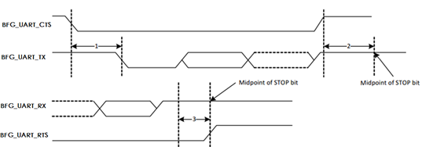

注：图中虚线的信号上升沿按照0.7×VDD，下降沿按照0.3×VDD选取。VDDIO电压为1.8V/3.3V

其中：

-   标注1为CTS信号拉低到TXD信号有效的最大延时。
-   标注2为结束位的中点到CTS信号拉高需要保持的最大时间。
-   标注3为结束位的中点到RTS信号拉高的最大延时。

UART时序约束如[表2](#table104754234216)所示。

**表 2**  UART时序约束表

<table><thead align="left"><tr id="row1583142114218"><th class="cellrowborder" valign="top" width="8.25%" id="mcps1.2.7.1.1">
Ref No

</th>
<th class="cellrowborder" valign="top" width="31.96%" id="mcps1.2.7.1.2">
Characteristics

</th>
<th class="cellrowborder" valign="top" width="12.370000000000001%" id="mcps1.2.7.1.3">
Min.

</th>
<th class="cellrowborder" valign="top" width="13.4%" id="mcps1.2.7.1.4">
Typical

</th>
<th class="cellrowborder" valign="top" width="14.430000000000001%" id="mcps1.2.7.1.5">
Max.

</th>
<th class="cellrowborder" valign="top" width="19.59%" id="mcps1.2.7.1.6">
Unit

</th>
</tr>
</thead>
<tbody><tr id="row1483144264217"><td class="cellrowborder" valign="top" width="8.25%" headers="mcps1.2.7.1.1 ">
1

</td>
<td class="cellrowborder" valign="top" width="31.96%" headers="mcps1.2.7.1.2 ">
CTS low to TXD valid

</td>
<td class="cellrowborder" valign="top" width="12.370000000000001%" headers="mcps1.2.7.1.3 ">
-

</td>
<td class="cellrowborder" valign="top" width="13.4%" headers="mcps1.2.7.1.4 ">
-

</td>
<td class="cellrowborder" valign="top" width="14.430000000000001%" headers="mcps1.2.7.1.5 ">
1.5

</td>
<td class="cellrowborder" valign="top" width="19.59%" headers="mcps1.2.7.1.6 ">
Bit Periods

</td>
</tr>
<tr id="row198324214427"><td class="cellrowborder" valign="top" width="8.25%" headers="mcps1.2.7.1.1 ">
2

</td>
<td class="cellrowborder" valign="top" width="31.96%" headers="mcps1.2.7.1.2 ">
CTS high before mid of stop bit

</td>
<td class="cellrowborder" valign="top" width="12.370000000000001%" headers="mcps1.2.7.1.3 ">
-

</td>
<td class="cellrowborder" valign="top" width="13.4%" headers="mcps1.2.7.1.4 ">
-

</td>
<td class="cellrowborder" valign="top" width="14.430000000000001%" headers="mcps1.2.7.1.5 ">
0.5

</td>
<td class="cellrowborder" valign="top" width="19.59%" headers="mcps1.2.7.1.6 ">
Bit Periods

</td>
</tr>
<tr id="row1583134217427"><td class="cellrowborder" valign="top" width="8.25%" headers="mcps1.2.7.1.1 ">
3

</td>
<td class="cellrowborder" valign="top" width="31.96%" headers="mcps1.2.7.1.2 ">
Mid of stop bit to RTS high

</td>
<td class="cellrowborder" valign="top" width="12.370000000000001%" headers="mcps1.2.7.1.3 ">
-

</td>
<td class="cellrowborder" valign="top" width="13.4%" headers="mcps1.2.7.1.4 ">
-

</td>
<td class="cellrowborder" valign="top" width="14.430000000000001%" headers="mcps1.2.7.1.5 ">
0.5

</td>
<td class="cellrowborder" valign="top" width="19.59%" headers="mcps1.2.7.1.6 ">
Bit Periods

</td>
</tr>
</tbody>
</table>

## I2C时序

I2C传输时序如[图1](#toc528421881)所示。

**图 1**  I2C传输时序图  
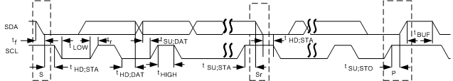

I2C接口时序参数如[表1](#table288661152411)所示。

**表 1**  I2C接口时序参数表

<table><thead align="left"><tr id="row198897115241"><th class="cellrowborder" valign="top" width="18.330000000000002%" id="mcps1.2.10.1.1">
参数

</th>
<th class="cellrowborder" valign="top" width="10.930000000000001%" id="mcps1.2.10.1.2">
符号

</th>
<th class="cellrowborder" valign="top" width="10.500000000000002%" id="mcps1.2.10.1.3">
标准模式（最小值）

</th>
<th class="cellrowborder" valign="top" width="9.38%" id="mcps1.2.10.1.4">
标准模式（最大值）

</th>
<th class="cellrowborder" valign="top" width="9.680000000000001%" id="mcps1.2.10.1.5">
快速模式（最小值）

</th>
<th class="cellrowborder" valign="top" width="12.270000000000001%" id="mcps1.2.10.1.6">
快速模式（最大值）

</th>
<th class="cellrowborder" valign="top" width="9.900000000000002%" id="mcps1.2.10.1.7">
快速+模式（最小值）

</th>
<th class="cellrowborder" valign="top" width="10.500000000000002%" id="mcps1.2.10.1.8">
快速+模式（最大值）

</th>
<th class="cellrowborder" valign="top" width="8.510000000000002%" id="mcps1.2.10.1.9">
单位

</th>
</tr>
</thead>
<tbody><tr id="row17990182714242"><td class="cellrowborder" valign="top" width="18.330000000000002%" headers="mcps1.2.10.1.1 ">
SCL时钟频率

</td>
<td class="cellrowborder" valign="top" width="10.930000000000001%" headers="mcps1.2.10.1.2 ">
fSCL

</td>
<td class="cellrowborder" valign="top" width="10.500000000000002%" headers="mcps1.2.10.1.3 ">
-

</td>
<td class="cellrowborder" valign="top" width="9.38%" headers="mcps1.2.10.1.4 ">
100

</td>
<td class="cellrowborder" valign="top" width="9.680000000000001%" headers="mcps1.2.10.1.5 ">
-

</td>
<td class="cellrowborder" valign="top" width="12.270000000000001%" headers="mcps1.2.10.1.6 ">
400

</td>
<td class="cellrowborder" valign="top" width="9.900000000000002%" headers="mcps1.2.10.1.7 ">
-

</td>
<td class="cellrowborder" valign="top" width="10.500000000000002%" headers="mcps1.2.10.1.8 ">
1000

</td>
<td class="cellrowborder" valign="top" width="8.510000000000002%" headers="mcps1.2.10.1.9 ">
kHz

</td>
</tr>
<tr id="row759052862410"><td class="cellrowborder" valign="top" width="18.330000000000002%" headers="mcps1.2.10.1.1 ">
启动保持时间

</td>
<td class="cellrowborder" valign="top" width="10.930000000000001%" headers="mcps1.2.10.1.2 ">
tHD;STA

</td>
<td class="cellrowborder" valign="top" width="10.500000000000002%" headers="mcps1.2.10.1.3 ">
4.0

</td>
<td class="cellrowborder" valign="top" width="9.38%" headers="mcps1.2.10.1.4 ">
-

</td>
<td class="cellrowborder" valign="top" width="9.680000000000001%" headers="mcps1.2.10.1.5 ">
0.6

</td>
<td class="cellrowborder" valign="top" width="12.270000000000001%" headers="mcps1.2.10.1.6 ">
-

</td>
<td class="cellrowborder" valign="top" width="9.900000000000002%" headers="mcps1.2.10.1.7 ">
0.26

</td>
<td class="cellrowborder" valign="top" width="10.500000000000002%" headers="mcps1.2.10.1.8 ">
-

</td>
<td class="cellrowborder" valign="top" width="8.510000000000002%" headers="mcps1.2.10.1.9 ">
μs

</td>
</tr>
<tr id="row1811462952412"><td class="cellrowborder" valign="top" width="18.330000000000002%" headers="mcps1.2.10.1.1 ">
SCL低电平周期

</td>
<td class="cellrowborder" valign="top" width="10.930000000000001%" headers="mcps1.2.10.1.2 ">
tLOW

</td>
<td class="cellrowborder" valign="top" width="10.500000000000002%" headers="mcps1.2.10.1.3 ">
4.7

</td>
<td class="cellrowborder" valign="top" width="9.38%" headers="mcps1.2.10.1.4 ">
-

</td>
<td class="cellrowborder" valign="top" width="9.680000000000001%" headers="mcps1.2.10.1.5 ">
1.3

</td>
<td class="cellrowborder" valign="top" width="12.270000000000001%" headers="mcps1.2.10.1.6 ">
-

</td>
<td class="cellrowborder" valign="top" width="9.900000000000002%" headers="mcps1.2.10.1.7 ">
0.5

</td>
<td class="cellrowborder" valign="top" width="10.500000000000002%" headers="mcps1.2.10.1.8 ">
-

</td>
<td class="cellrowborder" valign="top" width="8.510000000000002%" headers="mcps1.2.10.1.9 ">
μs

</td>
</tr>
<tr id="row1069012292248"><td class="cellrowborder" valign="top" width="18.330000000000002%" headers="mcps1.2.10.1.1 ">
SCL高电平周期

</td>
<td class="cellrowborder" valign="top" width="10.930000000000001%" headers="mcps1.2.10.1.2 ">
tHIGH

</td>
<td class="cellrowborder" valign="top" width="10.500000000000002%" headers="mcps1.2.10.1.3 ">
4.0

</td>
<td class="cellrowborder" valign="top" width="9.38%" headers="mcps1.2.10.1.4 ">
-

</td>
<td class="cellrowborder" valign="top" width="9.680000000000001%" headers="mcps1.2.10.1.5 ">
0.6

</td>
<td class="cellrowborder" valign="top" width="12.270000000000001%" headers="mcps1.2.10.1.6 ">
-

</td>
<td class="cellrowborder" valign="top" width="9.900000000000002%" headers="mcps1.2.10.1.7 ">
0.26

</td>
<td class="cellrowborder" valign="top" width="10.500000000000002%" headers="mcps1.2.10.1.8 ">
-

</td>
<td class="cellrowborder" valign="top" width="8.510000000000002%" headers="mcps1.2.10.1.9 ">
μs

</td>
</tr>
<tr id="row5298830112413"><td class="cellrowborder" valign="top" width="18.330000000000002%" headers="mcps1.2.10.1.1 ">
启动建立时间

</td>
<td class="cellrowborder" valign="top" width="10.930000000000001%" headers="mcps1.2.10.1.2 ">
tSU;STA

</td>
<td class="cellrowborder" valign="top" width="10.500000000000002%" headers="mcps1.2.10.1.3 ">
4.7

</td>
<td class="cellrowborder" valign="top" width="9.38%" headers="mcps1.2.10.1.4 ">
-

</td>
<td class="cellrowborder" valign="top" width="9.680000000000001%" headers="mcps1.2.10.1.5 ">
0.6

</td>
<td class="cellrowborder" valign="top" width="12.270000000000001%" headers="mcps1.2.10.1.6 ">
-

</td>
<td class="cellrowborder" valign="top" width="9.900000000000002%" headers="mcps1.2.10.1.7 ">
0.26

</td>
<td class="cellrowborder" valign="top" width="10.500000000000002%" headers="mcps1.2.10.1.8 ">
-

</td>
<td class="cellrowborder" valign="top" width="8.510000000000002%" headers="mcps1.2.10.1.9 ">
μs

</td>
</tr>
<tr id="row384243052420"><td class="cellrowborder" valign="top" width="18.330000000000002%" headers="mcps1.2.10.1.1 ">
数据保持时间

</td>
<td class="cellrowborder" valign="top" width="10.930000000000001%" headers="mcps1.2.10.1.2 ">
tHD;DAT

</td>
<td class="cellrowborder" valign="top" width="10.500000000000002%" headers="mcps1.2.10.1.3 ">
0

</td>
<td class="cellrowborder" valign="top" width="9.38%" headers="mcps1.2.10.1.4 ">
-

</td>
<td class="cellrowborder" valign="top" width="9.680000000000001%" headers="mcps1.2.10.1.5 ">
0

</td>
<td class="cellrowborder" valign="top" width="12.270000000000001%" headers="mcps1.2.10.1.6 ">
-

</td>
<td class="cellrowborder" valign="top" width="9.900000000000002%" headers="mcps1.2.10.1.7 ">
0

</td>
<td class="cellrowborder" valign="top" width="10.500000000000002%" headers="mcps1.2.10.1.8 ">
-

</td>
<td class="cellrowborder" valign="top" width="8.510000000000002%" headers="mcps1.2.10.1.9 ">
μs

</td>
</tr>
<tr id="row3466231192416"><td class="cellrowborder" valign="top" width="18.330000000000002%" headers="mcps1.2.10.1.1 ">
数据建立时间

</td>
<td class="cellrowborder" valign="top" width="10.930000000000001%" headers="mcps1.2.10.1.2 ">
tSU;DAT

</td>
<td class="cellrowborder" valign="top" width="10.500000000000002%" headers="mcps1.2.10.1.3 ">
250

</td>
<td class="cellrowborder" valign="top" width="9.38%" headers="mcps1.2.10.1.4 ">
-

</td>
<td class="cellrowborder" valign="top" width="9.680000000000001%" headers="mcps1.2.10.1.5 ">
100

</td>
<td class="cellrowborder" valign="top" width="12.270000000000001%" headers="mcps1.2.10.1.6 ">
-

</td>
<td class="cellrowborder" valign="top" width="9.900000000000002%" headers="mcps1.2.10.1.7 ">
50

</td>
<td class="cellrowborder" valign="top" width="10.500000000000002%" headers="mcps1.2.10.1.8 ">
-

</td>
<td class="cellrowborder" valign="top" width="8.510000000000002%" headers="mcps1.2.10.1.9 ">
ns

</td>
</tr>
<tr id="row1743143216248"><td class="cellrowborder" valign="top" width="18.330000000000002%" headers="mcps1.2.10.1.1 ">
SDA、SCL上升时间

</td>
<td class="cellrowborder" valign="top" width="10.930000000000001%" headers="mcps1.2.10.1.2 ">
tr

</td>
<td class="cellrowborder" valign="top" width="10.500000000000002%" headers="mcps1.2.10.1.3 ">
-

</td>
<td class="cellrowborder" valign="top" width="9.38%" headers="mcps1.2.10.1.4 ">
1000

</td>
<td class="cellrowborder" valign="top" width="9.680000000000001%" headers="mcps1.2.10.1.5 ">
20+0.1Cb

</td>
<td class="cellrowborder" valign="top" width="12.270000000000001%" headers="mcps1.2.10.1.6 ">
300

</td>
<td class="cellrowborder" valign="top" width="9.900000000000002%" headers="mcps1.2.10.1.7 ">
-

</td>
<td class="cellrowborder" valign="top" width="10.500000000000002%" headers="mcps1.2.10.1.8 ">
120

</td>
<td class="cellrowborder" valign="top" width="8.510000000000002%" headers="mcps1.2.10.1.9 ">
ns

</td>
</tr>
<tr id="row108904192416"><td class="cellrowborder" valign="top" width="18.330000000000002%" headers="mcps1.2.10.1.1 ">
SDA、SCL下降时间

</td>
<td class="cellrowborder" valign="top" width="10.930000000000001%" headers="mcps1.2.10.1.2 ">
tf

</td>
<td class="cellrowborder" valign="top" width="10.500000000000002%" headers="mcps1.2.10.1.3 ">
-

</td>
<td class="cellrowborder" valign="top" width="9.38%" headers="mcps1.2.10.1.4 ">
300

</td>
<td class="cellrowborder" valign="top" width="9.680000000000001%" headers="mcps1.2.10.1.5 ">
20+0.1Cb

</td>
<td class="cellrowborder" valign="top" width="12.270000000000001%" headers="mcps1.2.10.1.6 ">
300

</td>
<td class="cellrowborder" valign="top" width="9.900000000000002%" headers="mcps1.2.10.1.7 ">
-

</td>
<td class="cellrowborder" valign="top" width="10.500000000000002%" headers="mcps1.2.10.1.8 ">
120

</td>
<td class="cellrowborder" valign="top" width="8.510000000000002%" headers="mcps1.2.10.1.9 ">
ns

</td>
</tr>
<tr id="row18912011247"><td class="cellrowborder" valign="top" width="18.330000000000002%" headers="mcps1.2.10.1.1 ">
结束建立时间

</td>
<td class="cellrowborder" valign="top" width="10.930000000000001%" headers="mcps1.2.10.1.2 ">
tSU;STO

</td>
<td class="cellrowborder" valign="top" width="10.500000000000002%" headers="mcps1.2.10.1.3 ">
4.0

</td>
<td class="cellrowborder" valign="top" width="9.38%" headers="mcps1.2.10.1.4 ">
-

</td>
<td class="cellrowborder" valign="top" width="9.680000000000001%" headers="mcps1.2.10.1.5 ">
0.6

</td>
<td class="cellrowborder" valign="top" width="12.270000000000001%" headers="mcps1.2.10.1.6 ">
-

</td>
<td class="cellrowborder" valign="top" width="9.900000000000002%" headers="mcps1.2.10.1.7 ">
0.26

</td>
<td class="cellrowborder" valign="top" width="10.500000000000002%" headers="mcps1.2.10.1.8 ">
-

</td>
<td class="cellrowborder" valign="top" width="8.510000000000002%" headers="mcps1.2.10.1.9 ">
μs

</td>
</tr>
<tr id="row12891181152416"><td class="cellrowborder" valign="top" width="18.330000000000002%" headers="mcps1.2.10.1.1 ">
开始与结束之间的总线释放时间

</td>
<td class="cellrowborder" valign="top" width="10.930000000000001%" headers="mcps1.2.10.1.2 ">
tBUF

</td>
<td class="cellrowborder" valign="top" width="10.500000000000002%" headers="mcps1.2.10.1.3 ">
4.7

</td>
<td class="cellrowborder" valign="top" width="9.38%" headers="mcps1.2.10.1.4 ">
-

</td>
<td class="cellrowborder" valign="top" width="9.680000000000001%" headers="mcps1.2.10.1.5 ">
1.3

</td>
<td class="cellrowborder" valign="top" width="12.270000000000001%" headers="mcps1.2.10.1.6 ">
-

</td>
<td class="cellrowborder" valign="top" width="9.900000000000002%" headers="mcps1.2.10.1.7 ">
0.5

</td>
<td class="cellrowborder" valign="top" width="10.500000000000002%" headers="mcps1.2.10.1.8 ">
-

</td>
<td class="cellrowborder" valign="top" width="8.510000000000002%" headers="mcps1.2.10.1.9 ">
μs

</td>
</tr>
<tr id="row148928115249"><td class="cellrowborder" valign="top" width="18.330000000000002%" headers="mcps1.2.10.1.1 ">
总线负载

</td>
<td class="cellrowborder" valign="top" width="10.930000000000001%" headers="mcps1.2.10.1.2 ">
Cb

</td>
<td class="cellrowborder" valign="top" width="10.500000000000002%" headers="mcps1.2.10.1.3 ">
-

</td>
<td class="cellrowborder" valign="top" width="9.38%" headers="mcps1.2.10.1.4 ">
400

</td>
<td class="cellrowborder" valign="top" width="9.680000000000001%" headers="mcps1.2.10.1.5 ">
-

</td>
<td class="cellrowborder" valign="top" width="12.270000000000001%" headers="mcps1.2.10.1.6 ">
400

</td>
<td class="cellrowborder" valign="top" width="9.900000000000002%" headers="mcps1.2.10.1.7 ">
-

</td>
<td class="cellrowborder" valign="top" width="10.500000000000002%" headers="mcps1.2.10.1.8 ">
550

</td>
<td class="cellrowborder" valign="top" width="8.510000000000002%" headers="mcps1.2.10.1.9 ">
pF

</td>
</tr>
<tr id="row78929142412"><td class="cellrowborder" valign="top" width="18.330000000000002%" headers="mcps1.2.10.1.1 ">
低电平噪声容限

</td>
<td class="cellrowborder" valign="top" width="10.930000000000001%" headers="mcps1.2.10.1.2 ">
VnL

</td>
<td class="cellrowborder" valign="top" width="10.500000000000002%" headers="mcps1.2.10.1.3 ">
0.1VDD

</td>
<td class="cellrowborder" valign="top" width="9.38%" headers="mcps1.2.10.1.4 ">
-

</td>
<td class="cellrowborder" valign="top" width="9.680000000000001%" headers="mcps1.2.10.1.5 ">
0.1VDD

</td>
<td class="cellrowborder" valign="top" width="12.270000000000001%" headers="mcps1.2.10.1.6 ">
-

</td>
<td class="cellrowborder" valign="top" width="9.900000000000002%" headers="mcps1.2.10.1.7 ">
0.1VDD

</td>
<td class="cellrowborder" valign="top" width="10.500000000000002%" headers="mcps1.2.10.1.8 ">
-

</td>
<td class="cellrowborder" valign="top" width="8.510000000000002%" headers="mcps1.2.10.1.9 ">
V

</td>
</tr>
<tr id="row13893171202412"><td class="cellrowborder" valign="top" width="18.330000000000002%" headers="mcps1.2.10.1.1 ">
高电平噪声容限

</td>
<td class="cellrowborder" valign="top" width="10.930000000000001%" headers="mcps1.2.10.1.2 ">
VnH

</td>
<td class="cellrowborder" valign="top" width="10.500000000000002%" headers="mcps1.2.10.1.3 ">
0.2VDD

</td>
<td class="cellrowborder" valign="top" width="9.38%" headers="mcps1.2.10.1.4 ">
-

</td>
<td class="cellrowborder" valign="top" width="9.680000000000001%" headers="mcps1.2.10.1.5 ">
0.2VDD

</td>
<td class="cellrowborder" valign="top" width="12.270000000000001%" headers="mcps1.2.10.1.6 ">
-

</td>
<td class="cellrowborder" valign="top" width="9.900000000000002%" headers="mcps1.2.10.1.7 ">
0.2VDD

</td>
<td class="cellrowborder" valign="top" width="10.500000000000002%" headers="mcps1.2.10.1.8 ">
-

</td>
<td class="cellrowborder" valign="top" width="8.510000000000002%" headers="mcps1.2.10.1.9 ">
V

</td>
</tr>
</tbody>
</table>

## I2S时序

I2S接口支持Master模式，支持Slave模式。I2S的时序图如[图1](#fig161821713162418)所示。

**图 1**  I2S接口时序  
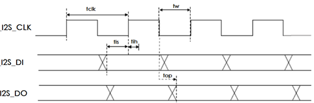

注：图中虚线的信号上升沿按照0.7×VDD，下降沿按照0.3×VDD选取。VDDIO默认l电压为1.8V/3.3V。

图中I2S\_DI、I2S\_DO表示从自身角度而言的输入/输出端口。

上图中的参数定义：

-   tclk：I2S接口时钟的一个周期时间。
-   tw：I2S接口时钟一个周期内的高电平或者低电平时间。
-   tis：输入信号的建立时间，即输入数据在时钟采样前需要的稳定时间。
-   tih：输入的保持时间，即输入数据在时钟采样后需要的保持不变的时间。
-   top：输出信号的输出传输时间。

I2S作为Master的接口时序约束如[表1](#table85071843112515)所示。

**表 1**  I2S的master时序约束

<table><thead align="left"><tr id="row3548543112511"><th class="cellrowborder" valign="top" width="10.311031103110311%" id="mcps1.2.7.1.1">
Symbol

</th>
<th class="cellrowborder" valign="top" width="21.332133213321335%" id="mcps1.2.7.1.2">
Parameter

</th>
<th class="cellrowborder" valign="top" width="12.051205120512053%" id="mcps1.2.7.1.3">
Condition

</th>
<th class="cellrowborder" valign="top" width="24.702470247024706%" id="mcps1.2.7.1.4">
Min

</th>
<th class="cellrowborder" valign="top" width="23.292329232923294%" id="mcps1.2.7.1.5">
Max

</th>
<th class="cellrowborder" valign="top" width="8.310831083108312%" id="mcps1.2.7.1.6">
Unit

</th>
</tr>
</thead>
<tbody><tr id="row175481343152514"><td class="cellrowborder" valign="top" width="10.311031103110311%" headers="mcps1.2.7.1.1 ">
tclk

</td>
<td class="cellrowborder" valign="top" width="21.332133213321335%" headers="mcps1.2.7.1.2 ">
Cycle time

</td>
<td class="cellrowborder" valign="top" width="12.051205120512053%" headers="mcps1.2.7.1.3 ">
-

</td>
<td class="cellrowborder" valign="top" width="24.702470247024706%" headers="mcps1.2.7.1.4 ">
100@1.1V

125@1.0V

</td>
<td class="cellrowborder" valign="top" width="23.292329232923294%" headers="mcps1.2.7.1.5 ">
-

</td>
<td class="cellrowborder" rowspan="6" valign="top" width="8.310831083108312%" headers="mcps1.2.7.1.6 ">
ns

</td>
</tr>
<tr id="row12548154332514"><td class="cellrowborder" valign="top" headers="mcps1.2.7.1.1 ">
tw

</td>
<td class="cellrowborder" valign="top" headers="mcps1.2.7.1.2 ">
pulse width

</td>
<td class="cellrowborder" valign="top" headers="mcps1.2.7.1.3 ">
-

</td>
<td class="cellrowborder" valign="top" headers="mcps1.2.7.1.4 ">
0.45×tclk

</td>
<td class="cellrowborder" valign="top" headers="mcps1.2.7.1.5 ">
0.55×tclk

</td>
</tr>
<tr id="row1254814318254"><td class="cellrowborder" valign="top" headers="mcps1.2.7.1.1 ">
tis

</td>
<td class="cellrowborder" valign="top" headers="mcps1.2.7.1.2 ">
I2S_DI setup time

</td>
<td class="cellrowborder" valign="top" headers="mcps1.2.7.1.3 ">
-

</td>
<td class="cellrowborder" valign="top" headers="mcps1.2.7.1.4 ">
25.74ns    @1.1V

35.86ns    @1.0V

</td>
<td class="cellrowborder" valign="top" headers="mcps1.2.7.1.5 ">
-

</td>
</tr>
<tr id="row1454817439253"><td class="cellrowborder" valign="top" headers="mcps1.2.7.1.1 ">
tih

</td>
<td class="cellrowborder" valign="top" headers="mcps1.2.7.1.2 ">
I2S_DI hold time

</td>
<td class="cellrowborder" valign="top" headers="mcps1.2.7.1.3 ">
-

</td>
<td class="cellrowborder" valign="top" headers="mcps1.2.7.1.4 ">
0

</td>
<td class="cellrowborder" valign="top" headers="mcps1.2.7.1.5 ">
-

</td>
</tr>
<tr id="row17548043182516"><td class="cellrowborder" valign="top" headers="mcps1.2.7.1.1 ">
top

</td>
<td class="cellrowborder" valign="top" headers="mcps1.2.7.1.2 ">
I2S_DO propagation time

</td>
<td class="cellrowborder" valign="top" headers="mcps1.2.7.1.3 ">
10 pF load

</td>
<td class="cellrowborder" valign="top" headers="mcps1.2.7.1.4 ">
0.05

</td>
<td class="cellrowborder" valign="top" headers="mcps1.2.7.1.5 ">
10.25ns @1.1V

18.82ns @1.0V

</td>
</tr>
<tr id="row754864317256"><td class="cellrowborder" valign="top" headers="mcps1.2.7.1.1 ">
top

</td>
<td class="cellrowborder" valign="top" headers="mcps1.2.7.1.2 ">
I2S_WS propagation time

</td>
<td class="cellrowborder" valign="top" headers="mcps1.2.7.1.3 ">
10 pF load

</td>
<td class="cellrowborder" valign="top" headers="mcps1.2.7.1.4 ">
0.05

</td>
<td class="cellrowborder" valign="top" headers="mcps1.2.7.1.5 ">
10.25ns @1.1V

18.82ns @1.0V

</td>
</tr>
</tbody>
</table>

I2S作为Slave的接口时序约束如[表2](#table4251121502713)所示。

**表 2**  I2S的slave时序约束

<table><thead align="left"><tr id="row10290121516277"><th class="cellrowborder" valign="top" width="11.341134113411341%" id="mcps1.2.7.1.1">
Symbol

</th>
<th class="cellrowborder" valign="top" width="20.54205420542054%" id="mcps1.2.7.1.2">
Parameter

</th>
<th class="cellrowborder" valign="top" width="11.681168116811682%" id="mcps1.2.7.1.3">
Condition

</th>
<th class="cellrowborder" valign="top" width="26.422642264226422%" id="mcps1.2.7.1.4">
Min

</th>
<th class="cellrowborder" valign="top" width="21.33213321332133%" id="mcps1.2.7.1.5">
Max

</th>
<th class="cellrowborder" valign="top" width="8.680868086808681%" id="mcps1.2.7.1.6">
Unit

</th>
</tr>
</thead>
<tbody><tr id="row529011592714"><td class="cellrowborder" valign="top" width="11.341134113411341%" headers="mcps1.2.7.1.1 ">
tclk

</td>
<td class="cellrowborder" valign="top" width="20.54205420542054%" headers="mcps1.2.7.1.2 ">
Cycle time

</td>
<td class="cellrowborder" valign="top" width="11.681168116811682%" headers="mcps1.2.7.1.3 ">
-

</td>
<td class="cellrowborder" valign="top" width="26.422642264226422%" headers="mcps1.2.7.1.4 ">
100@1.1V

125@1.0V

</td>
<td class="cellrowborder" valign="top" width="21.33213321332133%" headers="mcps1.2.7.1.5 ">
-

</td>
<td class="cellrowborder" rowspan="7" valign="top" width="8.680868086808681%" headers="mcps1.2.7.1.6 ">
ns

</td>
</tr>
<tr id="row7290715132711"><td class="cellrowborder" valign="top" headers="mcps1.2.7.1.1 ">
tw

</td>
<td class="cellrowborder" valign="top" headers="mcps1.2.7.1.2 ">
pulse width

</td>
<td class="cellrowborder" valign="top" headers="mcps1.2.7.1.3 ">
-

</td>
<td class="cellrowborder" valign="top" headers="mcps1.2.7.1.4 ">
0.45×tCLK

</td>
<td class="cellrowborder" valign="top" headers="mcps1.2.7.1.5 ">
0.55×tCLK

</td>
</tr>
<tr id="row8291161517270"><td class="cellrowborder" valign="top" headers="mcps1.2.7.1.1 ">
tis

</td>
<td class="cellrowborder" valign="top" headers="mcps1.2.7.1.2 ">
I2S_DI setup time

</td>
<td class="cellrowborder" valign="top" headers="mcps1.2.7.1.3 ">
-

</td>
<td class="cellrowborder" valign="top" headers="mcps1.2.7.1.4 ">
20.14ns  @1.1V

28.98ns @1.0V

</td>
<td class="cellrowborder" valign="top" headers="mcps1.2.7.1.5 ">
-

</td>
</tr>
<tr id="row15291101542718"><td class="cellrowborder" valign="top" headers="mcps1.2.7.1.1 ">
tih

</td>
<td class="cellrowborder" valign="top" headers="mcps1.2.7.1.2 ">
I2S_DI hold time

</td>
<td class="cellrowborder" valign="top" headers="mcps1.2.7.1.3 ">
-

</td>
<td class="cellrowborder" valign="top" headers="mcps1.2.7.1.4 ">
0

</td>
<td class="cellrowborder" valign="top" headers="mcps1.2.7.1.5 ">&nbsp;&nbsp;</td>
</tr>
<tr id="row6291111517274"><td class="cellrowborder" valign="top" headers="mcps1.2.7.1.1 ">
tis

</td>
<td class="cellrowborder" valign="top" headers="mcps1.2.7.1.2 ">
I2S_WS setup time

</td>
<td class="cellrowborder" valign="top" headers="mcps1.2.7.1.3 ">
-

</td>
<td class="cellrowborder" valign="top" headers="mcps1.2.7.1.4 ">
20.14ns  @1.1V

28.98ns @1.0V

</td>
<td class="cellrowborder" valign="top" headers="mcps1.2.7.1.5 ">
-

</td>
</tr>
<tr id="row14291515122719"><td class="cellrowborder" valign="top" headers="mcps1.2.7.1.1 ">
tih

</td>
<td class="cellrowborder" valign="top" headers="mcps1.2.7.1.2 ">
I2S_WS hold time

</td>
<td class="cellrowborder" valign="top" headers="mcps1.2.7.1.3 ">
-

</td>
<td class="cellrowborder" valign="top" headers="mcps1.2.7.1.4 ">
0

</td>
<td class="cellrowborder" valign="top" headers="mcps1.2.7.1.5 ">&nbsp;&nbsp;</td>
</tr>
<tr id="row52911815152714"><td class="cellrowborder" valign="top" headers="mcps1.2.7.1.1 ">
top

</td>
<td class="cellrowborder" valign="top" headers="mcps1.2.7.1.2 ">
I2S_DO propagation time

</td>
<td class="cellrowborder" valign="top" headers="mcps1.2.7.1.3 ">
10 pF load

</td>
<td class="cellrowborder" valign="top" headers="mcps1.2.7.1.4 ">
0.05

</td>
<td class="cellrowborder" valign="top" headers="mcps1.2.7.1.5 ">
25.08ns @1.1V

37.86ns @1.0V

</td>
</tr>
</tbody>
</table>

## SDIO时序

WS53V100的SIDO固定充当device，SDIO支持3种SDIO工作模式：

在CLDO为1.1V时、最大接口速度为50MHz。

-   Default speed模式（DS）

    接口时钟频率最高25MHz，包括1bit和4bit两种模式。

-   High speed模式（HS）

    接口时钟频率最高50MHz。

-   SDR25模式

    接口时钟最高频率50MHz。

    > **须知：** 
    >对接host芯片的CLK约束：为了保证SDIO的正常工作，需要host持续提供SDIO CLK，并且没有时钟中断，否则可能导致SDIO业务数据异常。

**Default speed模式**

Default speed模式为SDIO上电之后的默认模式，为了与各种HOST器件保持兼容性，此模式要求的工作速率较低，时钟只支持到25MHz，对时钟的要求如[表1](#table177553920324)所示。

**表 1**  Default speed模式时钟参数表 （VDDIO=3.3V）

<table><thead align="left"><tr id="row1777633913324"><th class="cellrowborder" valign="top" width="31.96%" id="mcps1.2.7.1.1">
参数

</th>
<th class="cellrowborder" valign="top" width="10.31%" id="mcps1.2.7.1.2">
符号

</th>
<th class="cellrowborder" valign="top" width="9.55%" id="mcps1.2.7.1.3">
最小值

</th>
<th class="cellrowborder" valign="top" width="10.36%" id="mcps1.2.7.1.4">
最大值

</th>
<th class="cellrowborder" valign="top" width="9.31%" id="mcps1.2.7.1.5">
单位

</th>
<th class="cellrowborder" valign="top" width="28.51%" id="mcps1.2.7.1.6">
备注

</th>
</tr>
</thead>
<tbody><tr id="row677623923220"><td class="cellrowborder" colspan="6" valign="top" headers="mcps1.2.7.1.1 mcps1.2.7.1.2 mcps1.2.7.1.3 mcps1.2.7.1.4 mcps1.2.7.1.5 mcps1.2.7.1.6 ">
Clock CLK（All value are referred to min(VIH) and max(VIL)）

</td>
</tr>
<tr id="row86261946144713"><td class="cellrowborder" valign="top" width="31.96%" headers="mcps1.2.7.1.1 ">
Clock frequency Date Transfer Mode

</td>
<td class="cellrowborder" valign="top" width="10.31%" headers="mcps1.2.7.1.2 ">
fPP

</td>
<td class="cellrowborder" valign="top" width="9.55%" headers="mcps1.2.7.1.3 ">
-

</td>
<td class="cellrowborder" valign="top" width="10.36%" headers="mcps1.2.7.1.4 ">
25

</td>
<td class="cellrowborder" valign="top" width="9.31%" headers="mcps1.2.7.1.5 ">
MHz

</td>
<td class="cellrowborder" valign="top" width="28.51%" headers="mcps1.2.7.1.6 ">
CCARD≤10pF

</td>
</tr>
<tr id="row197761839143214"><td class="cellrowborder" valign="top" width="31.96%" headers="mcps1.2.7.1.1 ">
Clock frequency Identification Mode

</td>
<td class="cellrowborder" valign="top" width="10.31%" headers="mcps1.2.7.1.2 ">
fOD

</td>
<td class="cellrowborder" valign="top" width="9.55%" headers="mcps1.2.7.1.3 ">
-

</td>
<td class="cellrowborder" valign="top" width="10.36%" headers="mcps1.2.7.1.4 ">
400

</td>
<td class="cellrowborder" valign="top" width="9.31%" headers="mcps1.2.7.1.5 ">
KHz

</td>
<td class="cellrowborder" valign="top" width="28.51%" headers="mcps1.2.7.1.6 ">
CCARD≤10pF

</td>
</tr>
<tr id="row12776183913328"><td class="cellrowborder" valign="top" width="31.96%" headers="mcps1.2.7.1.1 ">
Clock low time

</td>
<td class="cellrowborder" valign="top" width="10.31%" headers="mcps1.2.7.1.2 ">
tWL

</td>
<td class="cellrowborder" valign="top" width="9.55%" headers="mcps1.2.7.1.3 ">
10

</td>
<td class="cellrowborder" valign="top" width="10.36%" headers="mcps1.2.7.1.4 ">
-

</td>
<td class="cellrowborder" valign="top" width="9.31%" headers="mcps1.2.7.1.5 ">
ns

</td>
<td class="cellrowborder" valign="top" width="28.51%" headers="mcps1.2.7.1.6 ">
CCARD≤10pF

</td>
</tr>
<tr id="row8588122754716"><td class="cellrowborder" valign="top" width="31.96%" headers="mcps1.2.7.1.1 ">
Clock high time

</td>
<td class="cellrowborder" valign="top" width="10.31%" headers="mcps1.2.7.1.2 ">
tWH

</td>
<td class="cellrowborder" valign="top" width="9.55%" headers="mcps1.2.7.1.3 ">
10

</td>
<td class="cellrowborder" valign="top" width="10.36%" headers="mcps1.2.7.1.4 ">
-

</td>
<td class="cellrowborder" valign="top" width="9.31%" headers="mcps1.2.7.1.5 ">
ns

</td>
<td class="cellrowborder" valign="top" width="28.51%" headers="mcps1.2.7.1.6 ">
CCARD≤10pF

</td>
</tr>
<tr id="row9588327144718"><td class="cellrowborder" valign="top" width="31.96%" headers="mcps1.2.7.1.1 ">
Clock rise time

</td>
<td class="cellrowborder" valign="top" width="10.31%" headers="mcps1.2.7.1.2 ">
tTLH

</td>
<td class="cellrowborder" valign="top" width="9.55%" headers="mcps1.2.7.1.3 ">
-

</td>
<td class="cellrowborder" valign="top" width="10.36%" headers="mcps1.2.7.1.4 ">
10

</td>
<td class="cellrowborder" valign="top" width="9.31%" headers="mcps1.2.7.1.5 ">
ns

</td>
<td class="cellrowborder" valign="top" width="28.51%" headers="mcps1.2.7.1.6 ">
CCARD≤10pF

</td>
</tr>
<tr id="row75881827174715"><td class="cellrowborder" valign="top" width="31.96%" headers="mcps1.2.7.1.1 ">
Clock fall time

</td>
<td class="cellrowborder" valign="top" width="10.31%" headers="mcps1.2.7.1.2 ">
tTHL

</td>
<td class="cellrowborder" valign="top" width="9.55%" headers="mcps1.2.7.1.3 ">
-

</td>
<td class="cellrowborder" valign="top" width="10.36%" headers="mcps1.2.7.1.4 ">
10

</td>
<td class="cellrowborder" valign="top" width="9.31%" headers="mcps1.2.7.1.5 ">
ns

</td>
<td class="cellrowborder" valign="top" width="28.51%" headers="mcps1.2.7.1.6 ">
CCARD≤10pF

</td>
</tr>
</tbody>
</table>

Default speed模式输入数据时序如[图1](#fig109983594569)所示。其中，tISU为建立时间，即此模式下SDIO接口要求的数据在时钟采样前的稳定时间，tIH为保持时间，即此模式下SDIO接口要求的数据在时钟采样后的保持原电平的时间。

**图 1**  Default speed模式输入时序  

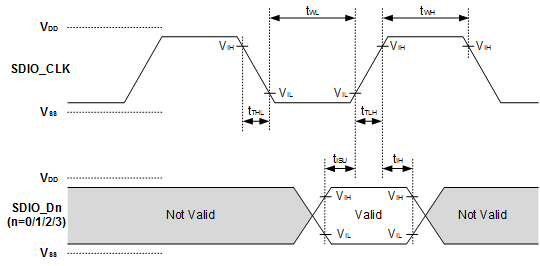

Default speed模式输出数据时序如[图2](#fig5952450155817)所示。其中，tODLY（max）为输出数据相对于时钟上升沿，出现在接口上的最大时延，tODLY（min）为输出数据相对于时钟上升沿，出现在接口上的最小时延。

**图 2**  Default speed模式输出时序  

Default speed模式的时序约束如[表2](#table792495118592)所示。

**表 2**  Default speed模式时序约束表

<table><thead align="left"><tr id="row392513517594"><th class="cellrowborder" valign="top" width="31.96%" id="mcps1.2.7.1.1">
参数

</th>
<th class="cellrowborder" valign="top" width="10.31%" id="mcps1.2.7.1.2">
符号

</th>
<th class="cellrowborder" valign="top" width="9.55%" id="mcps1.2.7.1.3">
最小值

</th>
<th class="cellrowborder" valign="top" width="10.36%" id="mcps1.2.7.1.4">
最大值

</th>
<th class="cellrowborder" valign="top" width="9.31%" id="mcps1.2.7.1.5">
单位

</th>
<th class="cellrowborder" valign="top" width="28.51%" id="mcps1.2.7.1.6">
备注

</th>
</tr>
</thead>
<tbody><tr id="row29251518599"><td class="cellrowborder" colspan="6" valign="top" headers="mcps1.2.7.1.1 mcps1.2.7.1.2 mcps1.2.7.1.3 mcps1.2.7.1.4 mcps1.2.7.1.5 mcps1.2.7.1.6 ">
Inputs CMD, DAT（referred to CLK）

</td>
</tr>
<tr id="row89251951205918"><td class="cellrowborder" valign="top" width="31.96%" headers="mcps1.2.7.1.1 ">
Input set-up time

</td>
<td class="cellrowborder" valign="top" width="10.31%" headers="mcps1.2.7.1.2 ">
tISU

</td>
<td class="cellrowborder" valign="top" width="9.55%" headers="mcps1.2.7.1.3 ">
5ns@1.1V

7ns@1.0V

</td>
<td class="cellrowborder" valign="top" width="10.36%" headers="mcps1.2.7.1.4 ">
-

</td>
<td class="cellrowborder" valign="top" width="9.31%" headers="mcps1.2.7.1.5 ">
ns

</td>
<td class="cellrowborder" valign="top" width="28.51%" headers="mcps1.2.7.1.6 ">
CCARD≤10pF

</td>
</tr>
<tr id="row19925251135910"><td class="cellrowborder" valign="top" width="31.96%" headers="mcps1.2.7.1.1 ">
Input hold time

</td>
<td class="cellrowborder" valign="top" width="10.31%" headers="mcps1.2.7.1.2 ">
tIH

</td>
<td class="cellrowborder" valign="top" width="9.55%" headers="mcps1.2.7.1.3 ">
5

</td>
<td class="cellrowborder" valign="top" width="10.36%" headers="mcps1.2.7.1.4 ">
-

</td>
<td class="cellrowborder" valign="top" width="9.31%" headers="mcps1.2.7.1.5 ">
ns

</td>
<td class="cellrowborder" valign="top" width="28.51%" headers="mcps1.2.7.1.6 ">
CCARD≤10pF

</td>
</tr>
<tr id="row692575135913"><td class="cellrowborder" colspan="6" valign="top" headers="mcps1.2.7.1.1 mcps1.2.7.1.2 mcps1.2.7.1.3 mcps1.2.7.1.4 mcps1.2.7.1.5 mcps1.2.7.1.6 ">
Outputs CMD, DAT(referenced to CLK)

</td>
</tr>
<tr id="row149251251115910"><td class="cellrowborder" valign="top" width="31.96%" headers="mcps1.2.7.1.1 ">
Output Delay time during Data Transfer Mode

</td>
<td class="cellrowborder" valign="top" width="10.31%" headers="mcps1.2.7.1.2 ">
tODLY

</td>
<td class="cellrowborder" valign="top" width="9.55%" headers="mcps1.2.7.1.3 ">
-

</td>
<td class="cellrowborder" valign="top" width="10.36%" headers="mcps1.2.7.1.4 ">
14ns@1.1V

17ns@1.0V

</td>
<td class="cellrowborder" valign="top" width="9.31%" headers="mcps1.2.7.1.5 ">
ns

</td>
<td class="cellrowborder" valign="top" width="28.51%" headers="mcps1.2.7.1.6 ">
CL≤40pF

</td>
</tr>
<tr id="row17925185125917"><td class="cellrowborder" valign="top" width="31.96%" headers="mcps1.2.7.1.1 ">
Output Delay time during Identification Mode

</td>
<td class="cellrowborder" valign="top" width="10.31%" headers="mcps1.2.7.1.2 ">
tODLY

</td>
<td class="cellrowborder" valign="top" width="9.55%" headers="mcps1.2.7.1.3 ">
-

</td>
<td class="cellrowborder" valign="top" width="10.36%" headers="mcps1.2.7.1.4 ">
50

</td>
<td class="cellrowborder" valign="top" width="9.31%" headers="mcps1.2.7.1.5 ">
ns

</td>
<td class="cellrowborder" valign="top" width="28.51%" headers="mcps1.2.7.1.6 ">
CL≤40pF

</td>
</tr>
</tbody>
</table>

说明：Tclk为SDIO CLOCK时钟周期。

**High speed模式**

High speed模式为SDIO上电经过初始化之后，为了使用更高的速率，通过模式切换而进入的模式，此模式要求的工作速率比default speed模式高，其时钟支持到50MHz，对时钟的约束见[表3](#table10852122958)所示。

**表 3**  High speed模式时钟参数表 （VDDIO=3.3V）

<table><thead align="left"><tr id="row38531521513"><th class="cellrowborder" valign="top" width="31.919999999999998%" id="mcps1.2.7.1.1">
参数

</th>
<th class="cellrowborder" valign="top" width="10.34%" id="mcps1.2.7.1.2">
符号

</th>
<th class="cellrowborder" valign="top" width="9.56%" id="mcps1.2.7.1.3">
最小值

</th>
<th class="cellrowborder" valign="top" width="10.36%" id="mcps1.2.7.1.4">
最大值

</th>
<th class="cellrowborder" valign="top" width="9.31%" id="mcps1.2.7.1.5">
单位

</th>
<th class="cellrowborder" valign="top" width="28.51%" id="mcps1.2.7.1.6">
备注

</th>
</tr>
</thead>
<tbody><tr id="row128537218515"><td class="cellrowborder" colspan="6" valign="top" headers="mcps1.2.7.1.1 mcps1.2.7.1.2 mcps1.2.7.1.3 mcps1.2.7.1.4 mcps1.2.7.1.5 mcps1.2.7.1.6 ">
Clock CLK（All value are referred to min(VIH) and max(VIL)）

</td>
</tr>
<tr id="row178531521655"><td class="cellrowborder" valign="top" width="31.919999999999998%" headers="mcps1.2.7.1.1 ">
Clock frequency Date Transfer Mode

</td>
<td class="cellrowborder" valign="top" width="10.34%" headers="mcps1.2.7.1.2 ">
fPP

</td>
<td class="cellrowborder" valign="top" width="9.56%" headers="mcps1.2.7.1.3 ">
-

</td>
<td class="cellrowborder" valign="top" width="10.36%" headers="mcps1.2.7.1.4 ">
50

</td>
<td class="cellrowborder" valign="top" width="9.31%" headers="mcps1.2.7.1.5 ">
MHz

</td>
<td class="cellrowborder" valign="top" width="28.51%" headers="mcps1.2.7.1.6 ">
CCARD≤10pF

</td>
</tr>
<tr id="row17853122552"><td class="cellrowborder" valign="top" width="31.919999999999998%" headers="mcps1.2.7.1.1 ">
Clock low time

</td>
<td class="cellrowborder" valign="top" width="10.34%" headers="mcps1.2.7.1.2 ">
tWL

</td>
<td class="cellrowborder" valign="top" width="9.56%" headers="mcps1.2.7.1.3 ">
7

</td>
<td class="cellrowborder" valign="top" width="10.36%" headers="mcps1.2.7.1.4 ">
-

</td>
<td class="cellrowborder" valign="top" width="9.31%" headers="mcps1.2.7.1.5 ">
ns

</td>
<td class="cellrowborder" valign="top" width="28.51%" headers="mcps1.2.7.1.6 ">
CCARD≤10pF

</td>
</tr>
<tr id="row158531522518"><td class="cellrowborder" valign="top" width="31.919999999999998%" headers="mcps1.2.7.1.1 ">
Clock high time

</td>
<td class="cellrowborder" valign="top" width="10.34%" headers="mcps1.2.7.1.2 ">
tWH

</td>
<td class="cellrowborder" valign="top" width="9.56%" headers="mcps1.2.7.1.3 ">
7

</td>
<td class="cellrowborder" valign="top" width="10.36%" headers="mcps1.2.7.1.4 ">
-

</td>
<td class="cellrowborder" valign="top" width="9.31%" headers="mcps1.2.7.1.5 ">
ns

</td>
<td class="cellrowborder" valign="top" width="28.51%" headers="mcps1.2.7.1.6 ">
CCARD≤10pF

</td>
</tr>
<tr id="row58531025518"><td class="cellrowborder" valign="top" width="31.919999999999998%" headers="mcps1.2.7.1.1 ">
Clock rise time

</td>
<td class="cellrowborder" valign="top" width="10.34%" headers="mcps1.2.7.1.2 ">
tTLH

</td>
<td class="cellrowborder" valign="top" width="9.56%" headers="mcps1.2.7.1.3 ">
-

</td>
<td class="cellrowborder" valign="top" width="10.36%" headers="mcps1.2.7.1.4 ">
3

</td>
<td class="cellrowborder" valign="top" width="9.31%" headers="mcps1.2.7.1.5 ">
ns

</td>
<td class="cellrowborder" valign="top" width="28.51%" headers="mcps1.2.7.1.6 ">
CCARD≤10pF

</td>
</tr>
<tr id="row108531022516"><td class="cellrowborder" valign="top" width="31.919999999999998%" headers="mcps1.2.7.1.1 ">
Clock fall time

</td>
<td class="cellrowborder" valign="top" width="10.34%" headers="mcps1.2.7.1.2 ">
tTHL

</td>
<td class="cellrowborder" valign="top" width="9.56%" headers="mcps1.2.7.1.3 ">
-

</td>
<td class="cellrowborder" valign="top" width="10.36%" headers="mcps1.2.7.1.4 ">
3

</td>
<td class="cellrowborder" valign="top" width="9.31%" headers="mcps1.2.7.1.5 ">
ns

</td>
<td class="cellrowborder" valign="top" width="28.51%" headers="mcps1.2.7.1.6 ">
CCARD≤10pF

</td>
</tr>
</tbody>
</table>

High speed模式输入数据时序如[图3](#fig128551821657)所示。其中，tISU为建立时间，即此模式下SDIO接口要求的数据在时钟采样前的稳定时间，tIH为保持时间，即此模式下SDIO接口要求的数据在时钟采样后的保持原电平的时间。

**图 3**  High speed模式输入时序  

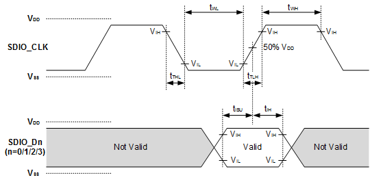

High speed模式输出数据时序如[图4](#fig148558215512)所示。其中，tODLY（max）为输出数据相对于时钟上升沿，出现在接口上的最大时延，tOH为输出数据相对于时钟上升沿，出现在接口上的最小时延。

**图 4**  High speed模式输出时序  

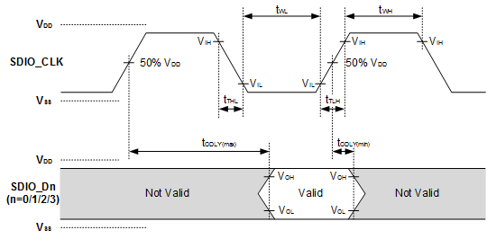

High speed模式的时序约束如[表4](#table138551211514)所示。

**表 4**  High speed模式时序约束表 \(VDDIO=3.3V\)

<table><thead align="left"><tr id="row15855112459"><th class="cellrowborder" valign="top" width="31.96%" id="mcps1.2.7.1.1">
参数

</th>
<th class="cellrowborder" valign="top" width="10.31%" id="mcps1.2.7.1.2">
符号

</th>
<th class="cellrowborder" valign="top" width="9.55%" id="mcps1.2.7.1.3">
最小值

</th>
<th class="cellrowborder" valign="top" width="10.35%" id="mcps1.2.7.1.4">
最大值

</th>
<th class="cellrowborder" valign="top" width="9.32%" id="mcps1.2.7.1.5">
单位

</th>
<th class="cellrowborder" valign="top" width="28.51%" id="mcps1.2.7.1.6">
备注

</th>
</tr>
</thead>
<tbody><tr id="row198550213518"><td class="cellrowborder" colspan="6" valign="top" headers="mcps1.2.7.1.1 mcps1.2.7.1.2 mcps1.2.7.1.3 mcps1.2.7.1.4 mcps1.2.7.1.5 mcps1.2.7.1.6 ">
Inputs CMD, DAT（referred to CLK）

</td>
</tr>
<tr id="row78551211518"><td class="cellrowborder" valign="top" width="31.96%" headers="mcps1.2.7.1.1 ">
Input set-up time

</td>
<td class="cellrowborder" valign="top" width="10.31%" headers="mcps1.2.7.1.2 ">
tISU

</td>
<td class="cellrowborder" valign="top" width="9.55%" headers="mcps1.2.7.1.3 ">
5ns@1.1V

7ns@1.0V

</td>
<td class="cellrowborder" valign="top" width="10.35%" headers="mcps1.2.7.1.4 ">
-

</td>
<td class="cellrowborder" valign="top" width="9.32%" headers="mcps1.2.7.1.5 ">
ns

</td>
<td class="cellrowborder" valign="top" width="28.51%" headers="mcps1.2.7.1.6 ">
CCARD≤10pF

</td>
</tr>
<tr id="row15855102151"><td class="cellrowborder" valign="top" width="31.96%" headers="mcps1.2.7.1.1 ">
Input hold time

</td>
<td class="cellrowborder" valign="top" width="10.31%" headers="mcps1.2.7.1.2 ">
tIH

</td>
<td class="cellrowborder" valign="top" width="9.55%" headers="mcps1.2.7.1.3 ">
2

</td>
<td class="cellrowborder" valign="top" width="10.35%" headers="mcps1.2.7.1.4 ">
-

</td>
<td class="cellrowborder" valign="top" width="9.32%" headers="mcps1.2.7.1.5 ">
ns

</td>
<td class="cellrowborder" valign="top" width="28.51%" headers="mcps1.2.7.1.6 ">
CCARD≤10pF

</td>
</tr>
<tr id="row1856102256"><td class="cellrowborder" colspan="6" valign="top" headers="mcps1.2.7.1.1 mcps1.2.7.1.2 mcps1.2.7.1.3 mcps1.2.7.1.4 mcps1.2.7.1.5 mcps1.2.7.1.6 ">
Outputs CMD, DAT(referenced to CLK)

</td>
</tr>
<tr id="row08565215511"><td class="cellrowborder" valign="top" width="31.96%" headers="mcps1.2.7.1.1 ">
Output Delay time during Data Transfer Mode

</td>
<td class="cellrowborder" valign="top" width="10.31%" headers="mcps1.2.7.1.2 ">
tODLY

</td>
<td class="cellrowborder" valign="top" width="9.55%" headers="mcps1.2.7.1.3 ">
-

</td>
<td class="cellrowborder" valign="top" width="10.35%" headers="mcps1.2.7.1.4 ">
14ns@1.1V

17ns@1.0V

</td>
<td class="cellrowborder" valign="top" width="9.32%" headers="mcps1.2.7.1.5 ">
ns

</td>
<td class="cellrowborder" valign="top" width="28.51%" headers="mcps1.2.7.1.6 ">
CL≤40pF

</td>
</tr>
<tr id="row885615216513"><td class="cellrowborder" valign="top" width="31.96%" headers="mcps1.2.7.1.1 ">
Output Hold time

</td>
<td class="cellrowborder" valign="top" width="10.31%" headers="mcps1.2.7.1.2 ">
tOH

</td>
<td class="cellrowborder" valign="top" width="9.55%" headers="mcps1.2.7.1.3 ">
1.55ns

</td>
<td class="cellrowborder" valign="top" width="10.35%" headers="mcps1.2.7.1.4 ">
-

</td>
<td class="cellrowborder" valign="top" width="9.32%" headers="mcps1.2.7.1.5 ">
ns

</td>
<td class="cellrowborder" valign="top" width="28.51%" headers="mcps1.2.7.1.6 ">
CL≤15pF

</td>
</tr>
<tr id="row1067619190123"><td class="cellrowborder" valign="top" width="31.96%" headers="mcps1.2.7.1.1 ">
Total System Capacitance for each line

</td>
<td class="cellrowborder" valign="top" width="10.31%" headers="mcps1.2.7.1.2 ">
CL

</td>
<td class="cellrowborder" valign="top" width="9.55%" headers="mcps1.2.7.1.3 ">
-

</td>
<td class="cellrowborder" valign="top" width="10.35%" headers="mcps1.2.7.1.4 ">
40

</td>
<td class="cellrowborder" valign="top" width="9.32%" headers="mcps1.2.7.1.5 ">
pF

</td>
<td class="cellrowborder" valign="top" width="28.51%" headers="mcps1.2.7.1.6 ">
1 card

</td>
</tr>
</tbody>
</table>

说明：High speed模式的数据信号时序，其输出数据和输入数据都是由时钟的上升沿为参考。

**SDR25模式**

SDR25模式为SDIO经过电压切换流程之后才能进入的模式，此模式要接口时钟最大支持到50MHz。对时钟的约束如下表所示。

**表 5**  SDR25模式时钟参数表 （VDDIO=1.8V）

<table><thead align="left"><tr id="row1453417458156"><th class="cellrowborder" valign="top" width="31.96%" id="mcps1.2.7.1.1">
参数

</th>
<th class="cellrowborder" valign="top" width="10.31%" id="mcps1.2.7.1.2">
符号

</th>
<th class="cellrowborder" valign="top" width="9.55%" id="mcps1.2.7.1.3">
最小值

</th>
<th class="cellrowborder" valign="top" width="10.35%" id="mcps1.2.7.1.4">
最大值

</th>
<th class="cellrowborder" valign="top" width="9.32%" id="mcps1.2.7.1.5">
单位

</th>
<th class="cellrowborder" valign="top" width="28.51%" id="mcps1.2.7.1.6">
备注

</th>
</tr>
</thead>
<tbody><tr id="row353513452152"><td class="cellrowborder" colspan="6" valign="top" headers="mcps1.2.7.1.1 mcps1.2.7.1.2 mcps1.2.7.1.3 mcps1.2.7.1.4 mcps1.2.7.1.5 mcps1.2.7.1.6 ">
Clock CLK（All value are referred to min(VIH) and max(VIL)）

</td>
</tr>
<tr id="row2053516454157"><td class="cellrowborder" valign="top" width="31.96%" headers="mcps1.2.7.1.1 ">
Clock frequency Date Transfer Mode

</td>
<td class="cellrowborder" valign="top" width="10.31%" headers="mcps1.2.7.1.2 ">
fPP

</td>
<td class="cellrowborder" valign="top" width="9.55%" headers="mcps1.2.7.1.3 ">
-

</td>
<td class="cellrowborder" valign="top" width="10.35%" headers="mcps1.2.7.1.4 ">
50

</td>
<td class="cellrowborder" valign="top" width="9.32%" headers="mcps1.2.7.1.5 ">
MHz

</td>
<td class="cellrowborder" valign="top" width="28.51%" headers="mcps1.2.7.1.6 ">
CCARD≤10pF

</td>
</tr>
<tr id="row13535645111517"><td class="cellrowborder" valign="top" width="31.96%" headers="mcps1.2.7.1.1 ">
Clock low time

</td>
<td class="cellrowborder" valign="top" width="10.31%" headers="mcps1.2.7.1.2 ">
tWL

</td>
<td class="cellrowborder" valign="top" width="9.55%" headers="mcps1.2.7.1.3 ">
3.6

</td>
<td class="cellrowborder" valign="top" width="10.35%" headers="mcps1.2.7.1.4 ">
8.4

</td>
<td class="cellrowborder" valign="top" width="9.32%" headers="mcps1.2.7.1.5 ">
ns

</td>
<td class="cellrowborder" valign="top" width="28.51%" headers="mcps1.2.7.1.6 ">
CCARD≤10pF

</td>
</tr>
<tr id="row653514541514"><td class="cellrowborder" valign="top" width="31.96%" headers="mcps1.2.7.1.1 ">
Clock high time

</td>
<td class="cellrowborder" valign="top" width="10.31%" headers="mcps1.2.7.1.2 ">
tWH

</td>
<td class="cellrowborder" valign="top" width="9.55%" headers="mcps1.2.7.1.3 ">
3.6

</td>
<td class="cellrowborder" valign="top" width="10.35%" headers="mcps1.2.7.1.4 ">
8.4

</td>
<td class="cellrowborder" valign="top" width="9.32%" headers="mcps1.2.7.1.5 ">
ns

</td>
<td class="cellrowborder" valign="top" width="28.51%" headers="mcps1.2.7.1.6 ">
CCARD≤10pF

</td>
</tr>
<tr id="row65351445131516"><td class="cellrowborder" valign="top" width="31.96%" headers="mcps1.2.7.1.1 ">
Clock rise time

</td>
<td class="cellrowborder" valign="top" width="10.31%" headers="mcps1.2.7.1.2 ">
tTLH

</td>
<td class="cellrowborder" valign="top" width="9.55%" headers="mcps1.2.7.1.3 ">
-

</td>
<td class="cellrowborder" valign="top" width="10.35%" headers="mcps1.2.7.1.4 ">
4

</td>
<td class="cellrowborder" valign="top" width="9.32%" headers="mcps1.2.7.1.5 ">
ns

</td>
<td class="cellrowborder" valign="top" width="28.51%" headers="mcps1.2.7.1.6 ">
CCARD≤10pF

</td>
</tr>
<tr id="row353664517150"><td class="cellrowborder" valign="top" width="31.96%" headers="mcps1.2.7.1.1 ">
Clock fall time

</td>
<td class="cellrowborder" valign="top" width="10.31%" headers="mcps1.2.7.1.2 ">
tTHL

</td>
<td class="cellrowborder" valign="top" width="9.55%" headers="mcps1.2.7.1.3 ">
-

</td>
<td class="cellrowborder" valign="top" width="10.35%" headers="mcps1.2.7.1.4 ">
4

</td>
<td class="cellrowborder" valign="top" width="9.32%" headers="mcps1.2.7.1.5 ">
ns

</td>
<td class="cellrowborder" valign="top" width="28.51%" headers="mcps1.2.7.1.6 ">
CCARD≤10pF

</td>
</tr>
</tbody>
</table>

**表 6**  SDR25模式时序约束表 \(VDDIO=1.8V\)

<table><thead align="left"><tr id="row8538164541510"><th class="cellrowborder" valign="top" width="31.96%" id="mcps1.2.7.1.1">
参数

</th>
<th class="cellrowborder" valign="top" width="10.31%" id="mcps1.2.7.1.2">
符号

</th>
<th class="cellrowborder" valign="top" width="9.55%" id="mcps1.2.7.1.3">
最小值

</th>
<th class="cellrowborder" valign="top" width="10.36%" id="mcps1.2.7.1.4">
最大值

</th>
<th class="cellrowborder" valign="top" width="9.31%" id="mcps1.2.7.1.5">
单位

</th>
<th class="cellrowborder" valign="top" width="28.51%" id="mcps1.2.7.1.6">
备注

</th>
</tr>
</thead>
<tbody><tr id="row16538184511159"><td class="cellrowborder" colspan="6" valign="top" headers="mcps1.2.7.1.1 mcps1.2.7.1.2 mcps1.2.7.1.3 mcps1.2.7.1.4 mcps1.2.7.1.5 mcps1.2.7.1.6 ">
Inputs CMD, DAT（referred to CLK）

</td>
</tr>
<tr id="row1553834561517"><td class="cellrowborder" valign="top" width="31.96%" headers="mcps1.2.7.1.1 ">
Input set-up time

</td>
<td class="cellrowborder" valign="top" width="10.31%" headers="mcps1.2.7.1.2 ">
tISU

</td>
<td class="cellrowborder" valign="top" width="9.55%" headers="mcps1.2.7.1.3 ">
4.5ns@1.1V

7.0ns@1.0V

</td>
<td class="cellrowborder" valign="top" width="10.36%" headers="mcps1.2.7.1.4 ">
-

</td>
<td class="cellrowborder" valign="top" width="9.31%" headers="mcps1.2.7.1.5 ">
ns

</td>
<td class="cellrowborder" valign="top" width="28.51%" headers="mcps1.2.7.1.6 ">
CCARD≤10pF

</td>
</tr>
<tr id="row205382045181517"><td class="cellrowborder" valign="top" width="31.96%" headers="mcps1.2.7.1.1 ">
Input hold time

</td>
<td class="cellrowborder" valign="top" width="10.31%" headers="mcps1.2.7.1.2 ">
tIH

</td>
<td class="cellrowborder" valign="top" width="9.55%" headers="mcps1.2.7.1.3 ">
0.8ns

</td>
<td class="cellrowborder" valign="top" width="10.36%" headers="mcps1.2.7.1.4 ">
-

</td>
<td class="cellrowborder" valign="top" width="9.31%" headers="mcps1.2.7.1.5 ">
ns

</td>
<td class="cellrowborder" valign="top" width="28.51%" headers="mcps1.2.7.1.6 ">
CCARD≤10pF

</td>
</tr>
<tr id="row1553815457154"><td class="cellrowborder" colspan="6" valign="top" headers="mcps1.2.7.1.1 mcps1.2.7.1.2 mcps1.2.7.1.3 mcps1.2.7.1.4 mcps1.2.7.1.5 mcps1.2.7.1.6 ">
Outputs CMD, DAT(referenced to CLK)

</td>
</tr>
<tr id="row205382045201513"><td class="cellrowborder" valign="top" width="31.96%" headers="mcps1.2.7.1.1 ">
Output Delay time during Data Transfer Mode

</td>
<td class="cellrowborder" valign="top" width="10.31%" headers="mcps1.2.7.1.2 ">
tODLY

</td>
<td class="cellrowborder" valign="top" width="9.55%" headers="mcps1.2.7.1.3 ">
-

</td>
<td class="cellrowborder" valign="top" width="10.36%" headers="mcps1.2.7.1.4 ">
14ns@1.1V

17ns@1.0V

</td>
<td class="cellrowborder" valign="top" width="9.31%" headers="mcps1.2.7.1.5 ">
ns

</td>
<td class="cellrowborder" valign="top" width="28.51%" headers="mcps1.2.7.1.6 ">
CL≤10pF

</td>
</tr>
<tr id="row053913454157"><td class="cellrowborder" valign="top" width="31.96%" headers="mcps1.2.7.1.1 ">
Output Hold time

</td>
<td class="cellrowborder" valign="top" width="10.31%" headers="mcps1.2.7.1.2 ">
tOH

</td>
<td class="cellrowborder" valign="top" width="9.55%" headers="mcps1.2.7.1.3 ">
1.55ns

</td>
<td class="cellrowborder" valign="top" width="10.36%" headers="mcps1.2.7.1.4 ">
-

</td>
<td class="cellrowborder" valign="top" width="9.31%" headers="mcps1.2.7.1.5 ">
ns

</td>
<td class="cellrowborder" valign="top" width="28.51%" headers="mcps1.2.7.1.6 ">
CL≤15pF

</td>
</tr>
<tr id="row253964510157"><td class="cellrowborder" valign="top" width="31.96%" headers="mcps1.2.7.1.1 ">
Total System Capacitance for each line

</td>
<td class="cellrowborder" valign="top" width="10.31%" headers="mcps1.2.7.1.2 ">
CL

</td>
<td class="cellrowborder" valign="top" width="9.55%" headers="mcps1.2.7.1.3 ">
-

</td>
<td class="cellrowborder" valign="top" width="10.36%" headers="mcps1.2.7.1.4 ">
40

</td>
<td class="cellrowborder" valign="top" width="9.31%" headers="mcps1.2.7.1.5 ">
pF

</td>
<td class="cellrowborder" valign="top" width="28.51%" headers="mcps1.2.7.1.6 ">
1 card

</td>
</tr>
</tbody>
</table>

## SPI接口时序

> **说明：** 
>以下缩略语或字母含义：
>-   MSB：Most Significant Bit
>-   LSB：Least Significant Bit
>-   SPI\_CK\(0\)：spo=0
>-   SPI\_CK\(1\)：spo=1

SPI接口时钟时序如[图1](#fig18479195119258)所示。

**图 1**  SPI接口时序图  
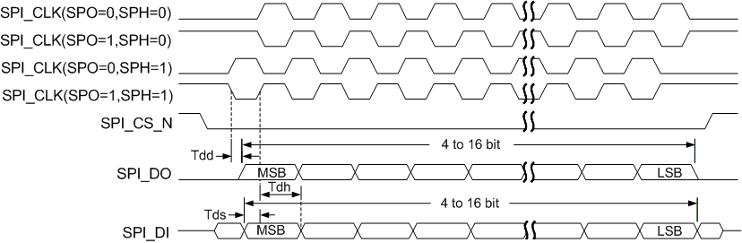

注：

用作Master时，时钟周期最小值为33.3ns@1.1V \(30MHz\)、62.5ns@1.0V（16MHz）；

用作Slave时，时钟周期最小值为80ns@1.1V\(12.5Mhz\)、200ns@1.0V（5Mhz）。

SPO（SPICLKOUT Polarity）表示SPICLKOUT极性，SPH（SPICLKOUT Phase）表示SPICLKOUT相位。

**表 1**  SPI接口时序参数表

<table><thead align="left"><tr id="row8538164541510"><th class="cellrowborder" valign="top" width="34.94%" id="mcps1.2.6.1.1">
参数

</th>
<th class="cellrowborder" valign="top" width="11.940000000000001%" id="mcps1.2.6.1.2">
符号

</th>
<th class="cellrowborder" valign="top" width="12.120000000000001%" id="mcps1.2.6.1.3">
最小值

</th>
<th class="cellrowborder" valign="top" width="23.03%" id="mcps1.2.6.1.4">
最大值

</th>
<th class="cellrowborder" valign="top" width="17.97%" id="mcps1.2.6.1.5">
单位

</th>
</tr>
</thead>
<tbody><tr id="row1553834561517"><td class="cellrowborder" valign="top" width="34.94%" headers="mcps1.2.6.1.1 ">
Master输出数据延迟

</td>
<td class="cellrowborder" valign="top" width="11.940000000000001%" headers="mcps1.2.6.1.2 ">
Tdd

</td>
<td class="cellrowborder" valign="top" width="12.120000000000001%" headers="mcps1.2.6.1.3 ">
0

</td>
<td class="cellrowborder" valign="top" width="23.03%" headers="mcps1.2.6.1.4 ">
6.58ns @1.1V

14.42ns @1.0V

</td>
<td class="cellrowborder" valign="top" width="17.97%" headers="mcps1.2.6.1.5 ">
ns

</td>
</tr>
<tr id="row1263883151012"><td class="cellrowborder" valign="top" width="34.94%" headers="mcps1.2.6.1.1 ">
Slave输出数据延迟

</td>
<td class="cellrowborder" valign="top" width="11.940000000000001%" headers="mcps1.2.6.1.2 ">
Tdd

</td>
<td class="cellrowborder" valign="top" width="12.120000000000001%" headers="mcps1.2.6.1.3 ">
0

</td>
<td class="cellrowborder" valign="top" width="23.03%" headers="mcps1.2.6.1.4 ">
24.8ns @1.1V

84.8ns @1.0V

</td>
<td class="cellrowborder" valign="top" width="17.97%" headers="mcps1.2.6.1.5 ">
ns

</td>
</tr>
<tr id="row205382045181517"><td class="cellrowborder" valign="top" width="34.94%" headers="mcps1.2.6.1.1 ">
输入控制信号建立时间(master)

</td>
<td class="cellrowborder" valign="top" width="11.940000000000001%" headers="mcps1.2.6.1.2 ">
Tds

</td>
<td class="cellrowborder" valign="top" width="12.120000000000001%" headers="mcps1.2.6.1.3 ">
1.64ns @1.1V

6.06ns @1.0V

</td>
<td class="cellrowborder" valign="top" width="23.03%" headers="mcps1.2.6.1.4 ">
-

</td>
<td class="cellrowborder" valign="top" width="17.97%" headers="mcps1.2.6.1.5 ">
ns

</td>
</tr>
<tr id="row205382045201513"><td class="cellrowborder" valign="top" width="34.94%" headers="mcps1.2.6.1.1 ">
输入控制信号保持时间(master)

</td>
<td class="cellrowborder" valign="top" width="11.940000000000001%" headers="mcps1.2.6.1.2 ">
Tdh

</td>
<td class="cellrowborder" valign="top" width="12.120000000000001%" headers="mcps1.2.6.1.3 ">
0

</td>
<td class="cellrowborder" valign="top" width="23.03%" headers="mcps1.2.6.1.4 ">
-

</td>
<td class="cellrowborder" valign="top" width="17.97%" headers="mcps1.2.6.1.5 ">
ns

</td>
</tr>
<tr id="row053913454157"><td class="cellrowborder" valign="top" width="34.94%" headers="mcps1.2.6.1.1 ">
输入控制信号建立时间(slave)

</td>
<td class="cellrowborder" valign="top" width="11.940000000000001%" headers="mcps1.2.6.1.2 ">
Tds

</td>
<td class="cellrowborder" valign="top" width="12.120000000000001%" headers="mcps1.2.6.1.3 ">
34.8ns @1.1V

94.8ns @1.0V

</td>
<td class="cellrowborder" valign="top" width="23.03%" headers="mcps1.2.6.1.4 ">
-

</td>
<td class="cellrowborder" valign="top" width="17.97%" headers="mcps1.2.6.1.5 ">
ns

</td>
</tr>
<tr id="row253964510157"><td class="cellrowborder" valign="top" width="34.94%" headers="mcps1.2.6.1.1 ">
输入控制信号保持时间(slave)

</td>
<td class="cellrowborder" valign="top" width="11.940000000000001%" headers="mcps1.2.6.1.2 ">
Tdh

</td>
<td class="cellrowborder" valign="top" width="12.120000000000001%" headers="mcps1.2.6.1.3 ">
0

</td>
<td class="cellrowborder" valign="top" width="23.03%" headers="mcps1.2.6.1.4 ">
-

</td>
<td class="cellrowborder" valign="top" width="17.97%" headers="mcps1.2.6.1.5 ">
ns

</td>
</tr>
</tbody>
</table>

# 注意事项

-   **[硬件设计](#ZH-CN_TOPIC_0000001456242632)**  

-   **[单板生产工艺](#ZH-CN_TOPIC_0000001505842457)**  

## 硬件设计

在硬件设计中的几个注意事项：

-   针对RST\_N管脚需要做外部上拉，为了满足低功耗设计，建议使用1MΩ电阻，在较强干扰环境，可适当减小阻值增强上拉抗扰能力。
-   支持外置RTC功能的芯片，当硬件方案不使用外置RTC时，RTC\_IN管脚板级预留接地电阻位置，若芯片应用场景存在环境或板级干扰，建议RTC\_IN管脚板级接地，RTC\_OUT管脚保持悬空，增强抗干扰能力。板级禁止RTC\_IN和OUT管脚同时接地。
-   针对硬件配置字等GPIO（比如MGPIO14/15）需要做外部上下拉时，建议使用10kΩ电阻；而且当需要深睡保活时，建议睡眠之前配置该GPIO为高阻（复用成GPIO模式后先配置输入态再关闭IE）且无拉状态，目的是为了降低深睡漏电流。
-   MGPIO16管脚有负电压输入时，可能会导致芯片复位，使用时应避免该管脚出现负压；PCB设计有长走线时，建议走内层，避免受到外部干扰；在使用该IO作为输入唤醒功能时，建议默认状态保持高电平，使用低电平或者下降沿唤醒。
-   当需要在深睡保活状态针对某GPIO进行上拉唤醒时，需要在睡眠之前对该GPIO配置为输入且无拉状态。
-   WS53V100的参考设计单板经过发射EVM、接收灵敏度、认证等WiFi射频指标测试。围绕WS53V100芯片的去耦电容容值及摆放位置尽量不要变动，如果必须修改，需要针对单板发射EVM、接收灵敏度、认证等WiFi射频指标进行详细摸底测试。
-   RF链路使用LC组成的π形低通滤波器建议不要更改，尤其是接地电容的地焊盘和地孔处理方式。
-   建议在RF链路上添加接地的ESD射频电感，感值为10nH，摆放位置靠近天线端。
-   提供的参考设计与器件选型主要是实验室测试与样品测试。用户在量产导入时，建议进行全面的产品硬件测试与评估，按照量产流程逐步完成导入。

## 单板生产工艺

单板生产工艺的几个注意事项：

-   单板分板需要使用机器分板，严禁手工分板。
-   手工焊接前请做好静电放电处理，佩戴静电手镯。
-   PCB存储条件建议：
    -   OSP（Organic Solderability Preservative）板

        真空包装前后的存放条件：温度20℃～30℃，相对湿度50%。真空包装后寿命3个月～1年。储存时间超过6个月时，通常拆封后即可组装，但为了避免板材储藏湿气造成爆板，可以烘烤方式来去除板内湿气，烘烤条件为110℃～120℃，1h（最长时间不要超过1.5h）。

    -   喷锡板

        真空包装前后的存放条件：温度25℃，相对湿度60%。真空包装后寿命1年。储存时间超过6个月时，通常拆封后即可组装，但为了避免板材储藏湿气造成爆板，可以烘烤方式来去除板内湿气，烘烤条件为120℃，1h（最长时间不要超过1.5h）。

# 缩略语

<table><tbody><tr id="row753095115412"><td class="nocellnorowborder" style="border:none" valign="top" width="21.84%">
<strong id="b1028613391353">A</strong>

</td>
<td class="nocellnorowborder" style="border:none" valign="top" width="39.160000000000004%">&nbsp;&nbsp;</td>
<td class="cell-norowborder" style="border:none" valign="top" width="39%">&nbsp;&nbsp;</td>
</tr>
<tr id="row253055114416"><td class="nocellnorowborder" style="border:none" valign="top" width="21.84%">
<strong id="b1928633912356">AC</strong>

</td>
<td class="nocellnorowborder" style="border:none" valign="top" width="39.160000000000004%">
Alternating Current

</td>
<td class="cell-norowborder" style="border:none" valign="top" width="39%">
交流（电）

</td>
</tr>
<tr id="row10530151847"><td class="nocellnorowborder" style="border:none" valign="top" width="21.84%">
<strong id="b328620399355">ADC</strong>

</td>
<td class="nocellnorowborder" style="border:none" valign="top" width="39.160000000000004%">
Analog to Digital Converter

</td>
<td class="cell-norowborder" style="border:none" valign="top" width="39%">
模数转换器

</td>
</tr>
<tr id="row20530851649"><td class="nocellnorowborder" style="border:none" valign="top" width="21.84%">
<strong id="b12861539113511">AGC</strong>

</td>
<td class="nocellnorowborder" style="border:none" valign="top" width="39.160000000000004%">
Automatic Gain Control

</td>
<td class="cell-norowborder" style="border:none" valign="top" width="39%">
自动增益控制

</td>
</tr>
<tr id="row55301451149"><td class="nocellnorowborder" style="border:none" valign="top" width="21.84%">
<strong id="b428718393358">ALE</strong>

</td>
<td class="nocellnorowborder" style="border:none" valign="top" width="39.160000000000004%">
Address Latch Enable

</td>
<td class="cell-norowborder" style="border:none" valign="top" width="39%">
地址锁存使能

</td>
</tr>
<tr id="row053019511647"><td class="nocellnorowborder" style="border:none" valign="top" width="21.84%">
<strong id="b172874391354">AO</strong>

</td>
<td class="nocellnorowborder" style="border:none" valign="top" width="39.160000000000004%">
Audio Output

</td>
<td class="cell-norowborder" style="border:none" valign="top" width="39%">
音频输出

</td>
</tr>
<tr id="row1153017514413"><td class="nocellnorowborder" style="border:none" valign="top" width="21.84%">
<strong id="b102871739193513">ARM</strong>

</td>
<td class="nocellnorowborder" style="border:none" valign="top" width="39.160000000000004%">
Advanced RISC Machine

</td>
<td class="cell-norowborder" style="border:none" valign="top" width="39%">
高级精简指令集处理器

</td>
</tr>
<tr id="row1753055116410"><td class="nocellnorowborder" style="border:none" valign="top" width="21.84%">
<strong id="b5287153911351"></strong>

</td>
<td class="nocellnorowborder" style="border:none" valign="top" width="39.160000000000004%">&nbsp;&nbsp;</td>
<td class="cell-norowborder" style="border:none" valign="top" width="39%">&nbsp;&nbsp;</td>
</tr>
<tr id="row11530155119412"><td class="nocellnorowborder" style="border:none" valign="top" width="21.84%">
<strong id="b112871639183518">C</strong>

</td>
<td class="nocellnorowborder" style="border:none" valign="top" width="39.160000000000004%">&nbsp;&nbsp;</td>
<td class="cell-norowborder" style="border:none" valign="top" width="39%">&nbsp;&nbsp;</td>
</tr>
<tr id="row155301551245"><td class="nocellnorowborder" style="border:none" valign="top" width="21.84%">
<strong id="b8287153903520">CODEC</strong>

</td>
<td class="nocellnorowborder" style="border:none" valign="top" width="39.160000000000004%">
Coder Decoder

</td>
<td class="cell-norowborder" style="border:none" valign="top" width="39%">
编码解码器

</td>
</tr>
<tr id="row45314514412"><td class="nocellnorowborder" style="border:none" valign="top" width="21.84%">
<strong id="b19287123973513">CPU</strong>

</td>
<td class="nocellnorowborder" style="border:none" valign="top" width="39.160000000000004%">
Central Processing Unit

</td>
<td class="cell-norowborder" style="border:none" valign="top" width="39%">
中央处理单元

</td>
</tr>
<tr id="row353112514415"><td class="nocellnorowborder" style="border:none" valign="top" width="21.84%">
<strong id="b52882391354">CS</strong>

</td>
<td class="nocellnorowborder" style="border:none" valign="top" width="39.160000000000004%">
Chip Select

</td>
<td class="cell-norowborder" style="border:none" valign="top" width="39%">
片选

</td>
</tr>
<tr id="row145311351347"><td class="nocellnorowborder" style="border:none" valign="top" width="21.84%">
<strong id="b19288143993512"></strong>

</td>
<td class="nocellnorowborder" style="border:none" valign="top" width="39.160000000000004%">&nbsp;&nbsp;</td>
<td class="cell-norowborder" style="border:none" valign="top" width="39%">&nbsp;&nbsp;</td>
</tr>
<tr id="row453165110414"><td class="nocellnorowborder" style="border:none" valign="top" width="21.84%">
<strong id="b1728843919352">D</strong>

</td>
<td class="nocellnorowborder" style="border:none" valign="top" width="39.160000000000004%">&nbsp;&nbsp;</td>
<td class="cell-norowborder" style="border:none" valign="top" width="39%">&nbsp;&nbsp;</td>
</tr>
<tr id="row95314511640"><td class="nocellnorowborder" style="border:none" valign="top" width="21.84%">
<strong id="b5288113903515">DAC</strong>

</td>
<td class="nocellnorowborder" style="border:none" valign="top" width="39.160000000000004%">
Digital Analog Converter

</td>
<td class="cell-norowborder" style="border:none" valign="top" width="39%">
数字模拟转换器

</td>
</tr>
<tr id="row65315511846"><td class="nocellnorowborder" style="border:none" valign="top" width="21.84%">
<strong id="b142881398352">DC</strong>

</td>
<td class="nocellnorowborder" style="border:none" valign="top" width="39.160000000000004%">
Direct Current

</td>
<td class="cell-norowborder" style="border:none" valign="top" width="39%">
直流(电)

</td>
</tr>
<tr id="row5531151342"><td class="nocellnorowborder" style="border:none" valign="top" width="21.84%">
<strong id="b628833993516">DDR</strong>

</td>
<td class="nocellnorowborder" style="border:none" valign="top" width="39.160000000000004%">
Double Data Rate

</td>
<td class="cell-norowborder" style="border:none" valign="top" width="39%">
双数据速率

</td>
</tr>
<tr id="row14531851147"><td class="nocellnorowborder" style="border:none" valign="top" width="21.84%">
<strong id="b1628893915353">E</strong>

</td>
<td class="nocellnorowborder" style="border:none" valign="top" width="39.160000000000004%">&nbsp;&nbsp;</td>
<td class="cell-norowborder" style="border:none" valign="top" width="39%">&nbsp;&nbsp;</td>
</tr>
<tr id="row75311351242"><td class="nocellnorowborder" style="border:none" valign="top" width="21.84%">
<strong id="b13289639163514">EBI</strong>

</td>
<td class="nocellnorowborder" style="border:none" valign="top" width="39.160000000000004%">
External Bus Interface

</td>
<td class="cell-norowborder" style="border:none" valign="top" width="39%">
外部总线接口

</td>
</tr>
<tr id="row18531151240"><td class="nocellnorowborder" style="border:none" valign="top" width="21.84%">
<strong id="b52891039193517">ECC</strong>

</td>
<td class="nocellnorowborder" style="border:none" valign="top" width="39.160000000000004%">
Error Checking and Correction

</td>
<td class="cell-norowborder" style="border:none" valign="top" width="39%">
差错校验纠正

</td>
</tr>
<tr id="row153125113410"><td class="nocellnorowborder" style="border:none" valign="top" width="21.84%">
<strong id="b14289193953510">ETH</strong>

</td>
<td class="nocellnorowborder" style="border:none" valign="top" width="39.160000000000004%">
Ethernet

</td>
<td class="cell-norowborder" style="border:none" valign="top" width="39%">
以太网

</td>
</tr>
<tr id="row1253155110415"><td class="nocellnorowborder" style="border:none" valign="top" width="21.84%">
<strong id="b14289439163519"></strong>

</td>
<td class="nocellnorowborder" style="border:none" valign="top" width="39.160000000000004%">&nbsp;&nbsp;</td>
<td class="cell-norowborder" style="border:none" valign="top" width="39%">&nbsp;&nbsp;</td>
</tr>
<tr id="row1253115111419"><td class="nocellnorowborder" style="border:none" valign="top" width="21.84%">
<strong id="b2289163914351">F</strong>

</td>
<td class="nocellnorowborder" style="border:none" valign="top" width="39.160000000000004%">&nbsp;&nbsp;</td>
<td class="cell-norowborder" style="border:none" valign="top" width="39%">&nbsp;&nbsp;</td>
</tr>
<tr id="row1053111511142"><td class="nocellnorowborder" style="border:none" valign="top" width="21.84%">
<strong id="b628983923511">FLASH</strong>

</td>
<td class="nocellnorowborder" style="border:none" valign="top" width="39.160000000000004%">
FLASH memory

</td>
<td class="cell-norowborder" style="border:none" valign="top" width="39%">
闪速存储器

</td>
</tr>
<tr id="row1553211514419"><td class="nocellnorowborder" style="border:none" valign="top" width="21.84%">
<strong id="b3289193933514"></strong>

</td>
<td class="nocellnorowborder" style="border:none" valign="top" width="39.160000000000004%">&nbsp;&nbsp;</td>
<td class="cell-norowborder" style="border:none" valign="top" width="39%">&nbsp;&nbsp;</td>
</tr>
<tr id="row14532105111415"><td class="nocellnorowborder" style="border:none" valign="top" width="21.84%">
<strong id="b4290143917359">I</strong>

</td>
<td class="nocellnorowborder" style="border:none" valign="top" width="39.160000000000004%">&nbsp;&nbsp;</td>
<td class="cell-norowborder" style="border:none" valign="top" width="39%">&nbsp;&nbsp;</td>
</tr>
<tr id="row1053212511246"><td class="nocellnorowborder" style="border:none" valign="top" width="21.84%">
<strong id="b18290153911353">I2C</strong>

</td>
<td class="nocellnorowborder" style="border:none" valign="top" width="39.160000000000004%">
The Inter-Integrated Circuit

</td>
<td class="cell-norowborder" style="border:none" valign="top" width="39%">
一种串行总线协议标准

</td>
</tr>
<tr id="row9532115111412"><td class="nocellnorowborder" style="border:none" valign="top" width="21.84%">
<strong id="b22900397357">I2S</strong>

</td>
<td class="nocellnorowborder" style="border:none" valign="top" width="39.160000000000004%">
Inter-IC Sound

</td>
<td class="cell-norowborder" style="border:none" valign="top" width="39%">
一种音频数据传输总线标准

</td>
</tr>
<tr id="row165321151640"><td class="nocellnorowborder" style="border:none" valign="top" width="21.84%">
<strong id="b192901739193516">IO</strong>

</td>
<td class="nocellnorowborder" style="border:none" valign="top" width="39.160000000000004%">
Input Output

</td>
<td class="cell-norowborder" style="border:none" valign="top" width="39%">
输入输出

</td>
</tr>
<tr id="row105325510411"><td class="nocellnorowborder" style="border:none" valign="top" width="21.84%">
<strong id="b1129093943518">IPU</strong>

</td>
<td class="nocellnorowborder" style="border:none" valign="top" width="39.160000000000004%">
Internal Pull-Up

</td>
<td class="cell-norowborder" style="border:none" valign="top" width="39%">
内部上拉

</td>
</tr>
<tr id="row105329511147"><td class="nocellnorowborder" style="border:none" valign="top" width="21.84%">
<strong id="b729073911351">IR</strong>

</td>
<td class="nocellnorowborder" style="border:none" valign="top" width="39.160000000000004%">
Infrared Ray

</td>
<td class="cell-norowborder" style="border:none" valign="top" width="39%">
红外线

</td>
</tr>
<tr id="row135327511545"><td class="nocellnorowborder" style="border:none" valign="top" width="21.84%">
<strong id="b16290103917354"></strong>

</td>
<td class="nocellnorowborder" style="border:none" valign="top" width="39.160000000000004%">&nbsp;&nbsp;</td>
<td class="cell-norowborder" style="border:none" valign="top" width="39%">&nbsp;&nbsp;</td>
</tr>
<tr id="row953216511943"><td class="nocellnorowborder" style="border:none" valign="top" width="21.84%">
<strong id="b3291103917353">J</strong>

</td>
<td class="nocellnorowborder" style="border:none" valign="top" width="39.160000000000004%">&nbsp;&nbsp;</td>
<td class="cell-norowborder" style="border:none" valign="top" width="39%">&nbsp;&nbsp;</td>
</tr>
<tr id="row1653219515419"><td class="nocellnorowborder" style="border:none" valign="top" width="21.84%">
<strong id="b429113399354">JEDEC</strong>

</td>
<td class="nocellnorowborder" style="border:none" valign="top" width="39.160000000000004%">
Joint Electron Device Engineering Council

</td>
<td class="cell-norowborder" style="border:none" valign="top" width="39%">
电子元件工业联合会

</td>
</tr>
<tr id="row155325511249"><td class="nocellnorowborder" style="border:none" valign="top" width="21.84%">
<strong id="b42911439133514">JTAG</strong>

</td>
<td class="nocellnorowborder" style="border:none" valign="top" width="39.160000000000004%">
Joint Test Action Group

</td>
<td class="cell-norowborder" style="border:none" valign="top" width="39%">
联合测试行动小组

</td>
</tr>
<tr id="row115326511342"><td class="nocellnorowborder" style="border:none" valign="top" width="21.84%">
<strong id="b1329183920352"></strong>

</td>
<td class="nocellnorowborder" style="border:none" valign="top" width="39.160000000000004%">&nbsp;&nbsp;</td>
<td class="cell-norowborder" style="border:none" valign="top" width="39%">&nbsp;&nbsp;</td>
</tr>
<tr id="row953210511447"><td class="nocellnorowborder" style="border:none" valign="top" width="21.84%">
<strong id="b92911939123514">L</strong>

</td>
<td class="nocellnorowborder" style="border:none" valign="top" width="39.160000000000004%">&nbsp;&nbsp;</td>
<td class="cell-norowborder" style="border:none" valign="top" width="39%">&nbsp;&nbsp;</td>
</tr>
<tr id="row453217511148"><td class="nocellnorowborder" style="border:none" valign="top" width="21.84%">
<strong id="b72911539163519">LCD</strong>

</td>
<td class="nocellnorowborder" style="border:none" valign="top" width="39.160000000000004%">
Liquid Crystal Display

</td>
<td class="cell-norowborder" style="border:none" valign="top" width="39%">
液晶显示屏

</td>
</tr>
<tr id="row15533115111417"><td class="nocellnorowborder" style="border:none" valign="top" width="21.84%">
<strong id="b122918395351">LED</strong>

</td>
<td class="nocellnorowborder" style="border:none" valign="top" width="39.160000000000004%">
Light Emitting Diode

</td>
<td class="cell-norowborder" style="border:none" valign="top" width="39%">
发光二极管

</td>
</tr>
<tr id="row1253315511242"><td class="nocellnorowborder" style="border:none" valign="top" width="21.84%">
<strong id="b11292173911353">LSB</strong>

</td>
<td class="nocellnorowborder" style="border:none" valign="top" width="39.160000000000004%">
Least Significant Byte

</td>
<td class="cell-norowborder" style="border:none" valign="top" width="39%">
最低有效字节

</td>
</tr>
<tr id="row18533135114419"><td class="nocellnorowborder" style="border:none" valign="top" width="21.84%">
<strong id="b329223912351">LVCMOS</strong>

</td>
<td class="nocellnorowborder" style="border:none" valign="top" width="39.160000000000004%">
Low Voltage Complementary Metal Oxide Semiconductor Transistor

</td>
<td class="cell-norowborder" style="border:none" valign="top" width="39%">
低压互补型金属氧化物半导体

</td>
</tr>
<tr id="row753319515410"><td class="nocellnorowborder" style="border:none" valign="top" width="21.84%">
<strong id="b10292133912358"></strong>

</td>
<td class="nocellnorowborder" style="border:none" valign="top" width="39.160000000000004%">&nbsp;&nbsp;</td>
<td class="cell-norowborder" style="border:none" valign="top" width="39%">&nbsp;&nbsp;</td>
</tr>
<tr id="row953305115419"><td class="nocellnorowborder" style="border:none" valign="top" width="21.84%">
<strong id="b1729273914358">M</strong>

</td>
<td class="nocellnorowborder" style="border:none" valign="top" width="39.160000000000004%">&nbsp;&nbsp;</td>
<td class="cell-norowborder" style="border:none" valign="top" width="39%">&nbsp;&nbsp;</td>
</tr>
<tr id="row8533145117420"><td class="nocellnorowborder" style="border:none" valign="top" width="21.84%">
<strong id="b1292143993512">MDC</strong>

</td>
<td class="nocellnorowborder" style="border:none" valign="top" width="39.160000000000004%">
Message Distribution Center

</td>
<td class="cell-norowborder" style="border:none" valign="top" width="39%">
消息分发中心

</td>
</tr>
<tr id="row4533195120419"><td class="nocellnorowborder" style="border:none" valign="top" width="21.84%">
<strong id="b92931639183520">MDIO</strong>

</td>
<td class="nocellnorowborder" style="border:none" valign="top" width="39.160000000000004%">
Management Data Input/Output

</td>
<td class="cell-norowborder" style="border:none" valign="top" width="39%">
管理数据输入输出接口

</td>
</tr>
<tr id="row453312511412"><td class="nocellnorowborder" style="border:none" valign="top" width="21.84%">
<strong id="b729353943516">MDX</strong>

</td>
<td class="nocellnorowborder" style="border:none" valign="top" width="39.160000000000004%">
Multidimensional Expressions

</td>
<td class="cell-norowborder" style="border:none" valign="top" width="39%">
多维表达式

</td>
</tr>
<tr id="row75331751845"><td class="nocellnorowborder" style="border:none" valign="top" width="21.84%">
<strong id="b11293123973511">MII</strong>

</td>
<td class="nocellnorowborder" style="border:none" valign="top" width="39.160000000000004%">
Media Independent Interface

</td>
<td class="cell-norowborder" style="border:none" valign="top" width="39%">
媒质独立接口

</td>
</tr>
<tr id="row125337511548"><td class="nocellnorowborder" style="border:none" valign="top" width="21.84%">
<strong id="b02933393353">MLC</strong>

</td>
<td class="nocellnorowborder" style="border:none" valign="top" width="39.160000000000004%">
Multi-Level Cell

</td>
<td class="cell-norowborder" style="border:none" valign="top" width="39%">
多bit存储单元

</td>
</tr>
<tr id="row11533195110413"><td class="nocellnorowborder" style="border:none" valign="top" width="21.84%">
<strong id="b122934394352">MSB</strong>

</td>
<td class="nocellnorowborder" style="border:none" valign="top" width="39.160000000000004%">
Most Significant Bit

</td>
<td class="cell-norowborder" style="border:none" valign="top" width="39%">
最高位

</td>
</tr>
<tr id="row5533155111411"><td class="nocellnorowborder" style="border:none" valign="top" width="21.84%">
<strong id="b11294193963519"></strong>

</td>
<td class="nocellnorowborder" style="border:none" valign="top" width="39.160000000000004%">&nbsp;&nbsp;</td>
<td class="cell-norowborder" style="border:none" valign="top" width="39%">&nbsp;&nbsp;</td>
</tr>
<tr id="row5533151546"><td class="nocellnorowborder" style="border:none" valign="top" width="21.84%">
<strong id="b2294163993519">N</strong>

</td>
<td class="nocellnorowborder" style="border:none" valign="top" width="39.160000000000004%">&nbsp;&nbsp;</td>
<td class="cell-norowborder" style="border:none" valign="top" width="39%">&nbsp;&nbsp;</td>
</tr>
<tr id="row17533751943"><td class="nocellnorowborder" style="border:none" valign="top" width="21.84%">
<strong id="b72941839103516">NC</strong>

</td>
<td class="nocellnorowborder" style="border:none" valign="top" width="39.160000000000004%">
No Connection

</td>
<td class="cell-norowborder" style="border:none" valign="top" width="39%">
未连接

</td>
</tr>
<tr id="row953417513415"><td class="nocellnorowborder" style="border:none" valign="top" width="21.84%">
<strong id="b192941439123510">NF</strong>

</td>
<td class="nocellnorowborder" style="border:none" valign="top" width="39.160000000000004%">
NAND Flash

</td>
<td class="cell-norowborder" style="border:none" valign="top" width="39%">
NAND Flash存储器

</td>
</tr>
<tr id="row1553420511141"><td class="nocellnorowborder" style="border:none" valign="top" width="21.84%">
<strong id="b17294113919354"></strong>

</td>
<td class="nocellnorowborder" style="border:none" valign="top" width="39.160000000000004%">&nbsp;&nbsp;</td>
<td class="cell-norowborder" style="border:none" valign="top" width="39%">&nbsp;&nbsp;</td>
</tr>
<tr id="row1953415516410"><td class="nocellnorowborder" style="border:none" valign="top" width="21.84%">
<strong id="b1294173911355">O</strong>

</td>
<td class="nocellnorowborder" style="border:none" valign="top" width="39.160000000000004%">&nbsp;&nbsp;</td>
<td class="cell-norowborder" style="border:none" valign="top" width="39%">&nbsp;&nbsp;</td>
</tr>
<tr id="row1153435113410"><td class="nocellnorowborder" style="border:none" valign="top" width="21.84%">
<strong id="b9295143915358">OD</strong>

</td>
<td class="nocellnorowborder" style="border:none" valign="top" width="39.160000000000004%">
Open Drain

</td>
<td class="cell-norowborder" style="border:none" valign="top" width="39%">
漏极开路门

</td>
</tr>
<tr id="row1053412511045"><td class="nocellnorowborder" style="border:none" valign="top" width="21.84%">
<strong id="b629533915354">OOD</strong>

</td>
<td class="nocellnorowborder" style="border:none" valign="top" width="39.160000000000004%">
Object-Oriented Database

</td>
<td class="cell-norowborder" style="border:none" valign="top" width="39%">
面向对象数据库

</td>
</tr>
<tr id="row165340511941"><td class="nocellnorowborder" style="border:none" valign="top" width="21.84%">
<strong id="b18295739163513">OTP</strong>

</td>
<td class="nocellnorowborder" style="border:none" valign="top" width="39.160000000000004%">
One TimePrograming

</td>
<td class="cell-norowborder" style="border:none" valign="top" width="39%">
一次性编程

</td>
</tr>
<tr id="row125341951248"><td class="nocellnorowborder" style="border:none" valign="top" width="21.84%">
<strong id="b4295143916352"></strong>

</td>
<td class="nocellnorowborder" style="border:none" valign="top" width="39.160000000000004%">&nbsp;&nbsp;</td>
<td class="cell-norowborder" style="border:none" valign="top" width="39%">&nbsp;&nbsp;</td>
</tr>
<tr id="row3534175118418"><td class="nocellnorowborder" style="border:none" valign="top" width="21.84%">
<strong id="b729533963518">P</strong>

</td>
<td class="nocellnorowborder" style="border:none" valign="top" width="39.160000000000004%">&nbsp;&nbsp;</td>
<td class="cell-norowborder" style="border:none" valign="top" width="39%">&nbsp;&nbsp;</td>
</tr>
<tr id="row105344512412"><td class="nocellnorowborder" style="border:none" valign="top" width="21.84%">
<strong id="b12295143973519">PBGA</strong>

</td>
<td class="nocellnorowborder" style="border:none" valign="top" width="39.160000000000004%">
Plastic Ball Grid Array

</td>
<td class="cell-norowborder" style="border:none" valign="top" width="39%">
塑封球栅阵列

</td>
</tr>
<tr id="row10534155114415"><td class="nocellnorowborder" style="border:none" valign="top" width="21.84%">
<strong id="b1629517399353">PCB</strong>

</td>
<td class="nocellnorowborder" style="border:none" valign="top" width="39.160000000000004%">
Physical Control Block

</td>
<td class="cell-norowborder" style="border:none" valign="top" width="39%">
物理控制块

</td>
</tr>
<tr id="row553414515418"><td class="nocellnorowborder" style="border:none" valign="top" width="21.84%">
<strong id="b152961539163512">PCI</strong>

</td>
<td class="nocellnorowborder" style="border:none" valign="top" width="39.160000000000004%">
Peripheral Component Interconnect

</td>
<td class="cell-norowborder" style="border:none" valign="top" width="39%">
外设部件互连

</td>
</tr>
<tr id="row253415110417"><td class="nocellnorowborder" style="border:none" valign="top" width="21.84%">
<strong id="b92963394354">PCM</strong>

</td>
<td class="nocellnorowborder" style="border:none" valign="top" width="39.160000000000004%">
Pulse Code Modulation

</td>
<td class="cell-norowborder" style="border:none" valign="top" width="39%">
脉冲编码调制

</td>
</tr>
<tr id="row1853415110414"><td class="nocellnorowborder" style="border:none" valign="top" width="21.84%">
<strong id="b182967391354">PHY</strong>

</td>
<td class="nocellnorowborder" style="border:none" valign="top" width="39.160000000000004%">
Physical Sublayer & Physical Layer

</td>
<td class="cell-norowborder" style="border:none" valign="top" width="39%">
物理子层,物理层

</td>
</tr>
<tr id="row13534551341"><td class="nocellnorowborder" style="border:none" valign="top" width="21.84%">
<strong id="b10296123913352">PLL</strong>

</td>
<td class="nocellnorowborder" style="border:none" valign="top" width="39.160000000000004%">
Phase-Locked Loop

</td>
<td class="cell-norowborder" style="border:none" valign="top" width="39%">
锁相环

</td>
</tr>
<tr id="row553519514416"><td class="nocellnorowborder" style="border:none" valign="top" width="21.84%">
<strong id="b1429613983518">PWM</strong>

</td>
<td class="nocellnorowborder" style="border:none" valign="top" width="39.160000000000004%">
Pulse Width Modulation

</td>
<td class="cell-norowborder" style="border:none" valign="top" width="39%">
脉宽调制

</td>
</tr>
<tr id="row05357515411"><td class="nocellnorowborder" style="border:none" valign="top" width="21.84%">
<strong id="b6297113912351"></strong>

</td>
<td class="nocellnorowborder" style="border:none" valign="top" width="39.160000000000004%">&nbsp;&nbsp;</td>
<td class="cell-norowborder" style="border:none" valign="top" width="39%">&nbsp;&nbsp;</td>
</tr>
<tr id="row16535251446"><td class="nocellnorowborder" style="border:none" valign="top" width="21.84%">
<strong id="b19297113923510">Q</strong>

</td>
<td class="nocellnorowborder" style="border:none" valign="top" width="39.160000000000004%">&nbsp;&nbsp;</td>
<td class="cell-norowborder" style="border:none" valign="top" width="39%">&nbsp;&nbsp;</td>
</tr>
<tr id="row13535135111418"><td class="nocellnorowborder" style="border:none" valign="top" width="21.84%">
<strong id="b1529713911354">QAM</strong>

</td>
<td class="nocellnorowborder" style="border:none" valign="top" width="39.160000000000004%">
Quadrature Amplitude Modulation

</td>
<td class="cell-norowborder" style="border:none" valign="top" width="39%">
正交幅度调制、正交调幅

</td>
</tr>
<tr id="row115359511448"><td class="nocellnorowborder" style="border:none" valign="top" width="21.84%">
<strong id="b3297163973517"></strong>

</td>
<td class="nocellnorowborder" style="border:none" valign="top" width="39.160000000000004%">&nbsp;&nbsp;</td>
<td class="cell-norowborder" style="border:none" valign="top" width="39%">&nbsp;&nbsp;</td>
</tr>
<tr id="row1553515511743"><td class="nocellnorowborder" style="border:none" valign="top" width="21.84%">
<strong id="b11297163913356">R</strong>

</td>
<td class="nocellnorowborder" style="border:none" valign="top" width="39.160000000000004%">&nbsp;&nbsp;</td>
<td class="cell-norowborder" style="border:none" valign="top" width="39%">&nbsp;&nbsp;</td>
</tr>
<tr id="row95351351641"><td class="nocellnorowborder" style="border:none" valign="top" width="21.84%">
<strong id="b1129743916357">RAM</strong>

</td>
<td class="nocellnorowborder" style="border:none" valign="top" width="39.160000000000004%">
Random Access Memory

</td>
<td class="cell-norowborder" style="border:none" valign="top" width="39%">
随机存取存储器

</td>
</tr>
<tr id="row553519514411"><td class="nocellnorowborder" style="border:none" valign="top" width="21.84%">
<strong id="b1329773912352">RC</strong>

</td>
<td class="nocellnorowborder" style="border:none" valign="top" width="39.160000000000004%">
Readable Only and Self Cleaning after Reading

</td>
<td class="cell-norowborder" style="border:none" valign="top" width="39%">
读清

</td>
</tr>
<tr id="row1553555117417"><td class="nocellnorowborder" style="border:none" valign="top" width="21.84%">
<strong id="b0297173953515">RMII</strong>

</td>
<td class="nocellnorowborder" style="border:none" valign="top" width="39.160000000000004%">
Reduced Media Independent Interface

</td>
<td class="cell-norowborder" style="border:none" valign="top" width="39%">
简化的介质无关接口

</td>
</tr>
<tr id="row25351251841"><td class="nocellnorowborder" style="border:none" valign="top" width="21.84%">
<strong id="b1329833943510">RO</strong>

</td>
<td class="nocellnorowborder" style="border:none" valign="top" width="39.160000000000004%">
Read Only

</td>
<td class="cell-norowborder" style="border:none" valign="top" width="39%">
只读

</td>
</tr>
<tr id="row15535165112418"><td class="nocellnorowborder" style="border:none" valign="top" width="21.84%">
<strong id="b2029811392353">ROM</strong>

</td>
<td class="nocellnorowborder" style="border:none" valign="top" width="39.160000000000004%">
Read Only Memory

</td>
<td class="cell-norowborder" style="border:none" valign="top" width="39%">
只读存储器

</td>
</tr>
<tr id="row205350516418"><td class="nocellnorowborder" style="border:none" valign="top" width="21.84%">
<strong id="b122985399357">RPU</strong>

</td>
<td class="nocellnorowborder" style="border:none" valign="top" width="39.160000000000004%">
Routing Proccess Unit

</td>
<td class="cell-norowborder" style="border:none" valign="top" width="39%">
路由协议处理模块

</td>
</tr>
<tr id="row17535651241"><td class="nocellnorowborder" style="border:none" valign="top" width="21.84%">
<strong id="b122984397356">RST</strong>

</td>
<td class="nocellnorowborder" style="border:none" valign="top" width="39.160000000000004%">
Reset

</td>
<td class="cell-norowborder" style="border:none" valign="top" width="39%">
复位

</td>
</tr>
<tr id="row12535155113412"><td class="nocellnorowborder" style="border:none" valign="top" width="21.84%">
<strong id="b8298439113518">RTT</strong>

</td>
<td class="nocellnorowborder" style="border:none" valign="top" width="39.160000000000004%">
Radio Transmission Technology

</td>
<td class="cell-norowborder" style="border:none" valign="top" width="39%">
无线传输技术

</td>
</tr>
<tr id="row20536151144"><td class="nocellnorowborder" style="border:none" valign="top" width="21.84%">
<strong id="b15298639123517">RX</strong>

</td>
<td class="nocellnorowborder" style="border:none" valign="top" width="39.160000000000004%">
Reception

</td>
<td class="cell-norowborder" style="border:none" valign="top" width="39%">
接收

</td>
</tr>
<tr id="row1653614511443"><td class="nocellnorowborder" style="border:none" valign="top" width="21.84%">
<strong id="b1329853973517"></strong>

</td>
<td class="nocellnorowborder" style="border:none" valign="top" width="39.160000000000004%">&nbsp;&nbsp;</td>
<td class="cell-norowborder" style="border:none" valign="top" width="39%">&nbsp;&nbsp;</td>
</tr>
<tr id="row155363517418"><td class="nocellnorowborder" style="border:none" valign="top" width="21.84%">
<strong id="b32996392350">S</strong>

</td>
<td class="nocellnorowborder" style="border:none" valign="top" width="39.160000000000004%">&nbsp;&nbsp;</td>
<td class="cell-norowborder" style="border:none" valign="top" width="39%">&nbsp;&nbsp;</td>
</tr>
<tr id="row45361513420"><td class="nocellnorowborder" style="border:none" valign="top" width="21.84%">
<strong id="b2299123910359">SATA</strong>

</td>
<td class="nocellnorowborder" style="border:none" valign="top" width="39.160000000000004%">
Serial Advanced Technology Attachment

</td>
<td class="cell-norowborder" style="border:none" valign="top" width="39%">
串行高级连接器

</td>
</tr>
<tr id="row1553616512415"><td class="nocellnorowborder" style="border:none" valign="top" width="21.84%">
<strong id="b72992393354">SCI</strong>

</td>
<td class="nocellnorowborder" style="border:none" valign="top" width="39.160000000000004%">
Smart Card Interface

</td>
<td class="cell-norowborder" style="border:none" valign="top" width="39%">
智能卡接口

</td>
</tr>
<tr id="row653611511147"><td class="nocellnorowborder" style="border:none" valign="top" width="21.84%">
<strong id="b162991539103510">SCL</strong>

</td>
<td class="nocellnorowborder" style="border:none" valign="top" width="39.160000000000004%">
Serial Clock Line

</td>
<td class="cell-norowborder" style="border:none" valign="top" width="39%">
串行时钟线

</td>
</tr>
<tr id="row1353618514415"><td class="nocellnorowborder" style="border:none" valign="top" width="21.84%">
<strong id="b529920399352">SDA</strong>

</td>
<td class="nocellnorowborder" style="border:none" valign="top" width="39.160000000000004%">
Serial Data and Address

</td>
<td class="cell-norowborder" style="border:none" valign="top" width="39%">
串行数据地址线

</td>
</tr>
<tr id="row45369511349"><td class="nocellnorowborder" style="border:none" valign="top" width="21.84%">
<strong id="b11299143919353">SDH</strong>

</td>
<td class="nocellnorowborder" style="border:none" valign="top" width="39.160000000000004%">
Synchronous Digital Hierarchy

</td>
<td class="cell-norowborder" style="border:none" valign="top" width="39%">
同步数字体系

</td>
</tr>
<tr id="row95364511649"><td class="nocellnorowborder" style="border:none" valign="top" width="21.84%">
<strong id="b1429983914358">SDI</strong>

</td>
<td class="nocellnorowborder" style="border:none" valign="top" width="39.160000000000004%">
Service Defect Indication

</td>
<td class="cell-norowborder" style="border:none" valign="top" width="39%">
服务缺陷指示

</td>
</tr>
<tr id="row1853655116420"><td class="nocellnorowborder" style="border:none" valign="top" width="21.84%">
<strong id="b1029903993517">SDRAM</strong>

</td>
<td class="nocellnorowborder" style="border:none" valign="top" width="39.160000000000004%">
Synchronous Dynamic Random Access Memory

</td>
<td class="cell-norowborder" style="border:none" valign="top" width="39%">
同步动态随机存储器

</td>
</tr>
<tr id="row1653617517411"><td class="nocellnorowborder" style="border:none" valign="top" width="21.84%">
<strong id="b1230013914356">SF</strong>

</td>
<td class="nocellnorowborder" style="border:none" valign="top" width="39.160000000000004%">
Spreading Factor

</td>
<td class="cell-norowborder" style="border:none" valign="top" width="39%">
扩频因子

</td>
</tr>
<tr id="row135363512415"><td class="nocellnorowborder" style="border:none" valign="top" width="21.84%">
<strong id="b93004390354">SIM</strong>

</td>
<td class="nocellnorowborder" style="border:none" valign="top" width="39.160000000000004%">
Subscriber Identity Module

</td>
<td class="cell-norowborder" style="border:none" valign="top" width="39%">
用户标识模块

</td>
</tr>
<tr id="row05371517420"><td class="nocellnorowborder" style="border:none" valign="top" width="21.84%">
<strong id="b33001639153516">SIO</strong>

</td>
<td class="nocellnorowborder" style="border:none" valign="top" width="39.160000000000004%">
Serial Input / Output

</td>
<td class="cell-norowborder" style="border:none" valign="top" width="39%">
串行输入输出接口

</td>
</tr>
<tr id="row7537155110410"><td class="nocellnorowborder" style="border:none" valign="top" width="21.84%">
<strong id="b73008391359">SLC</strong>

</td>
<td class="nocellnorowborder" style="border:none" valign="top" width="39.160000000000004%">
Single level cell

</td>
<td class="cell-norowborder" style="border:none" valign="top" width="39%">
单bit存储单元

</td>
</tr>
<tr id="row11537251841"><td class="nocellnorowborder" style="border:none" valign="top" width="21.84%">
<strong id="b9301739173516">SMI</strong>

</td>
<td class="nocellnorowborder" style="border:none" valign="top" width="39.160000000000004%">
Short Message Identifier

</td>
<td class="cell-norowborder" style="border:none" valign="top" width="39%">
短消息标识

</td>
</tr>
<tr id="row1538251041"><td class="nocellnorowborder" style="border:none" valign="top" width="21.84%">
<strong id="b163014398353">SPDIF</strong>

</td>
<td class="nocellnorowborder" style="border:none" valign="top" width="39.160000000000004%">
Sony Philips Digital Interface

</td>
<td class="cell-norowborder" style="border:none" valign="top" width="39%">
索尼/菲利普数字音频接口

</td>
</tr>
<tr id="row1553813518418"><td class="nocellnorowborder" style="border:none" valign="top" width="21.84%">
<strong id="b10301739143514">SPI</strong>

</td>
<td class="nocellnorowborder" style="border:none" valign="top" width="39.160000000000004%">
SDH Physical Interface

</td>
<td class="cell-norowborder" style="border:none" valign="top" width="39%">
SDH物理接口

</td>
</tr>
<tr id="row185382512410"><td class="nocellnorowborder" style="border:none" valign="top" width="21.84%">
<strong id="b113018398359">SSTL</strong>

</td>
<td class="nocellnorowborder" style="border:none" valign="top" width="39.160000000000004%">
Stub Series Terminated Logic

</td>
<td class="cell-norowborder" style="border:none" valign="top" width="39%">
残余连续终结逻辑

</td>
</tr>
<tr id="row25389511046"><td class="nocellnorowborder" style="border:none" valign="top" width="21.84%">
<strong id="b330118396353">STA</strong>

</td>
<td class="nocellnorowborder" style="border:none" valign="top" width="39.160000000000004%">
Static Timing Analysis

</td>
<td class="cell-norowborder" style="border:none" valign="top" width="39%">
静态时序分析

</td>
</tr>
<tr id="row1953805114415"><td class="nocellnorowborder" style="border:none" valign="top" width="21.84%">
<strong id="b133011239203516">STR</strong>

</td>
<td class="nocellnorowborder" style="border:none" valign="top" width="39.160000000000004%">
System Test Report

</td>
<td class="cell-norowborder" style="border:none" valign="top" width="39%">
系统测试报告

</td>
</tr>
<tr id="row1653812511448"><td class="nocellnorowborder" style="border:none" valign="top" width="21.84%">
<strong id="b930143993511">SYNC</strong>

</td>
<td class="nocellnorowborder" style="border:none" valign="top" width="39.160000000000004%">
Synchronization (network)

</td>
<td class="cell-norowborder" style="border:none" valign="top" width="39%">
同步（网）

</td>
</tr>
<tr id="row195381351249"><td class="nocellnorowborder" style="border:none" valign="top" width="21.84%">
<strong id="b230211396351"></strong>

</td>
<td class="nocellnorowborder" style="border:none" valign="top" width="39.160000000000004%">&nbsp;&nbsp;</td>
<td class="cell-norowborder" style="border:none" valign="top" width="39%">&nbsp;&nbsp;</td>
</tr>
<tr id="row115386513411"><td class="nocellnorowborder" style="border:none" valign="top" width="21.84%">
<strong id="b9302439193510">T</strong>

</td>
<td class="nocellnorowborder" style="border:none" valign="top" width="39.160000000000004%">&nbsp;&nbsp;</td>
<td class="cell-norowborder" style="border:none" valign="top" width="39%">&nbsp;&nbsp;</td>
</tr>
<tr id="row15538195117413"><td class="nocellnorowborder" style="border:none" valign="top" width="21.84%">
<strong id="b1530273923520">TFT</strong>

</td>
<td class="nocellnorowborder" style="border:none" valign="top" width="39.160000000000004%">
Thin Film Transistor

</td>
<td class="cell-norowborder" style="border:none" valign="top" width="39%">
薄膜晶体管

</td>
</tr>
<tr id="row1253835116410"><td class="nocellnorowborder" style="border:none" valign="top" width="21.84%">
<strong id="b10303639133518">TSI</strong>

</td>
<td class="nocellnorowborder" style="border:none" valign="top" width="39.160000000000004%">
Time Slot Interchange

</td>
<td class="cell-norowborder" style="border:none" valign="top" width="39%">
时隙交换

</td>
</tr>
<tr id="row5538951347"><td class="nocellnorowborder" style="border:none" valign="top" width="21.84%">
<strong id="b6303193913516"></strong>

</td>
<td class="nocellnorowborder" style="border:none" valign="top" width="39.160000000000004%">&nbsp;&nbsp;</td>
<td class="cell-norowborder" style="border:none" valign="top" width="39%">&nbsp;&nbsp;</td>
</tr>
<tr id="row12538751147"><td class="nocellnorowborder" style="border:none" valign="top" width="21.84%">
<strong id="b1330353993515">U</strong>

</td>
<td class="nocellnorowborder" style="border:none" valign="top" width="39.160000000000004%">&nbsp;&nbsp;</td>
<td class="cell-norowborder" style="border:none" valign="top" width="39%">&nbsp;&nbsp;</td>
</tr>
<tr id="row75386515418"><td class="nocellnorowborder" style="border:none" valign="top" width="21.84%">
<strong id="b16303103903518">UART</strong>

</td>
<td class="nocellnorowborder" style="border:none" valign="top" width="39.160000000000004%">
Universal Asynchronous Receiver & Transmitter

</td>
<td class="cell-norowborder" style="border:none" valign="top" width="39%">
通用异步收发器

</td>
</tr>
<tr id="row4538135113418"><td class="nocellnorowborder" style="border:none" valign="top" width="21.84%">
<strong id="b17304039113518">USB</strong>

</td>
<td class="nocellnorowborder" style="border:none" valign="top" width="39.160000000000004%">
Universal Serial Bus

</td>
<td class="cell-norowborder" style="border:none" valign="top" width="39%">
通用串行总线

</td>
</tr>
<tr id="row0539145112411"><td class="nocellnorowborder" style="border:none" valign="top" width="21.84%">
<strong id="b2304153910359"></strong>

</td>
<td class="nocellnorowborder" style="border:none" valign="top" width="39.160000000000004%">&nbsp;&nbsp;</td>
<td class="cell-norowborder" style="border:none" valign="top" width="39%">&nbsp;&nbsp;</td>
</tr>
<tr id="row95391751343"><td class="nocellnorowborder" style="border:none" valign="top" width="21.84%">
<strong id="b630414394354">V</strong>

</td>
<td class="nocellnorowborder" style="border:none" valign="top" width="39.160000000000004%">&nbsp;&nbsp;</td>
<td class="cell-norowborder" style="border:none" valign="top" width="39%">&nbsp;&nbsp;</td>
</tr>
<tr id="row195390511548"><td class="nocellnorowborder" style="border:none" valign="top" width="21.84%">
<strong id="b930423915352">VI</strong>

</td>
<td class="nocellnorowborder" style="border:none" valign="top" width="39.160000000000004%">
Video Input

</td>
<td class="cell-norowborder" style="border:none" valign="top" width="39%">
视频输入

</td>
</tr>
<tr id="row55391751941"><td class="nocellnorowborder" style="border:none" valign="top" width="21.84%">
<strong id="b1130453953520">VO</strong>

</td>
<td class="nocellnorowborder" style="border:none" valign="top" width="39.160000000000004%">
Video Output

</td>
<td class="cell-norowborder" style="border:none" valign="top" width="39%">
视频输出

</td>
</tr>
<tr id="row125391512418"><td class="nocellnorowborder" style="border:none" valign="top" width="21.84%">
<strong id="b1330419394350">VOU</strong>

</td>
<td class="nocellnorowborder" style="border:none" valign="top" width="39.160000000000004%">
Video Output Unit

</td>
<td class="cell-norowborder" style="border:none" valign="top" width="39%">
视频输出单元

</td>
</tr>
<tr id="row35396511346"><td class="nocellnorowborder" style="border:none" valign="top" width="21.84%">
<strong id="b12304113916358"></strong>

</td>
<td class="nocellnorowborder" style="border:none" valign="top" width="39.160000000000004%">&nbsp;&nbsp;</td>
<td class="cell-norowborder" style="border:none" valign="top" width="39%">&nbsp;&nbsp;</td>
</tr>
<tr id="row1153918512418"><td class="nocellnorowborder" style="border:none" valign="top" width="21.84%">
<strong id="b2305143910352">W</strong>

</td>
<td class="nocellnorowborder" style="border:none" valign="top" width="39.160000000000004%">&nbsp;&nbsp;</td>
<td class="cell-norowborder" style="border:none" valign="top" width="39%">&nbsp;&nbsp;</td>
</tr>
<tr id="row85391251249"><td class="nocellnorowborder" style="border:none" valign="top" width="21.84%">
<strong id="b193054391358">WDG</strong>

</td>
<td class="nocellnorowborder" style="border:none" valign="top" width="39.160000000000004%">
Watch Dog

</td>
<td class="cell-norowborder" style="border:none" valign="top" width="39%">
看门狗

</td>
</tr>
<tr id="row553914511849"><td class="nocellnorowborder" style="border:none" valign="top" width="21.84%">
<strong id="b10305183920353">WE</strong>

</td>
<td class="nocellnorowborder" style="border:none" valign="top" width="39.160000000000004%">
Wrap Enable

</td>
<td class="cell-norowborder" style="border:none" valign="top" width="39%">
倒换使能

</td>
</tr>
<tr id="row15539851849"><td class="row-nocellborder" style="border:none" valign="top" width="21.84%">
<strong id="b1530553913355">WP</strong>

</td>
<td class="row-nocellborder" style="border:none" valign="top" width="39.160000000000004%">
Wireless Profile

</td>
<td class="cellrowborder" style="border:none" valign="top" width="39%">
无线适配的

</td>
</tr>
</tbody>
</table>

