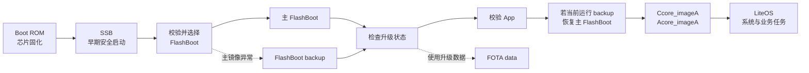
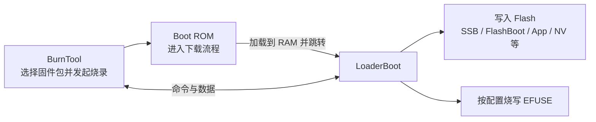

# 启动流程

WS53 有两条用途不同的 Boot 链路：

- **正常上电启动链**：Boot ROM (Read-Only Memory) → SSB (Secure Secondary Boot) → FlashBoot → App。
- **下载与烧录链**：BurnTool 打断正常启动后，由 Boot ROM 将 LoaderBoot 加载到 RAM，LoaderBoot 再完成镜像和 EFUSE (Electronic Fuse) 数据的烧写。

App 启动后，还会继续完成 LiteOS (Huawei LiteOS)、硬件、系统服务和业务入口初始化。LoaderBoot 只参与下载与烧录，不属于正常上电启动链。

## Boot 组件职责

| 组件或镜像 | 主要职责 | 开发边界 |
|------------|----------|----------|
| Boot ROM | 芯片固化的第一阶段启动代码和根信任入口；进入正常启动或下载流程 | 芯片固化，普通开发者不可修改 |
| SSB | 执行早期安全启动并引导后续启动阶段 | 具体源码可能不随 SDK 交付 |
| FlashBoot | 初始化启动所需硬件，处理升级状态，校验 App，必要时执行恢复，最后跳转到 App | SDK 提供源码，修改后需要完整验证启动、升级和恢复流程 |
| FlashBoot backup | 主 FlashBoot 异常时使用的恢复副本；运行后可将备份内容恢复到主分区 | 不作为独立应用开发入口 |
| LoaderBoot | 在 RAM 中运行并与 BurnTool 交互，接收烧写命令和数据 | 通常不需要二次开发，也不参与正常上电启动 |
| Ccore_imageA / Acore_imageA | ID `0x20` 与 ID `0x21` 的地址范围重叠；Acore 镜像包含平台初始化、系统任务和产品业务组件 | 普通应用开发的主要修改范围 |

安全校验是否启用以及具体校验策略由产品安全配置决定。Boot ROM、SSB 和部分预编译安全组件属于芯片或交付件边界，本文只描述开发者可观察的职责。

## 正常上电启动链



当前默认分区同时保留主 FlashBoot 和 `FlashBoot backup`。如果前级启动阶段无法使用主 FlashBoot，则进入备份镜像；备份镜像运行时会将备份分区恢复到主分区，然后继续引导 App。

WS53 默认分区中的 `Ccore_imageA`（ID `0x20`）与 `Acore_imageA`（ID `0x21`）地址范围重叠；升级数据使用 ID `0x22`。不应把 ID `0x20` 与 ID `0x21` 的容量直接相加。只有产品显式启用 A/B 升级配置时，FlashBoot 才会按当前运行区域选择和映射镜像。

分区地址和大小见 [Flash 与 RAM](../memory-layout/index.md)。最终 `.fwpkg` 会组合 SSB、FlashBoot、App、NV (Non-Volatile) 和分区参数等内容，不是单独的 App 二进制。

## 下载与烧录链



BurnTool 通过串口等通道打断正常启动并发起下载。Boot ROM 先接收和校验 LoaderBoot，再将其加载到 RAM 运行；LoaderBoot 初始化通信、Flash 和 EFUSE 后进入命令循环，按照固件包和烧写配置完成后续操作。

LoaderBoot 是临时下载环境，不会常驻在正常启动链中。具体的固件包选择、串口配置和烧写步骤见 [烧录与运行](../../get-started/flash-and-run.md)。

## App 初始化流程

FlashBoot 校验镜像后，跳转到 Acore App 的 `_start`。当前 `ws53_liteos_app` 的主要调用顺序如下：


关键源码调用链：

```text
bootloader/flashboot_ws53/startup/riscv_init.S             # FlashBoot 汇编入口：设置全局指针和栈，清零 BSS
  └─ bootloader/flashboot_ws53/startup/main.c               # FlashBoot C 入口：初始化启动环境，处理并选择 App 镜像
      └─ jump_to_execute_addr()                             # 跳转到已选定 App 镜像的执行地址
          └─ application/ws53/ws53_application/startup.S
              # App 汇编入口：建立全局指针和启动栈，进入 runtime_init()
              └─ application/ws53/ws53_application/main.c
                  # App C 入口：完成平台、内核、硬件和系统服务初始化
                  ├─ runtime_init()                         # 初始化 Acore 内存并进入 main()
                  ├─ patch_init()                           # 初始化 RISC-V 补丁机制
                  ├─ dev_work_clock_init() / uapi_tcxo_init() # 初始化工作时钟与 TCXO
                  ├─ pmp_enable()                           # 配置 RISC-V 物理内存保护 PMP
                  ├─ cpu_cache_init() / prepare_main_task() # 初始化 Cache 并准备主任务环境
                  ├─ BoardConfig()                          # 初始化板级内核配置
                  ├─ osKernelInitialize()                   # 初始化 LiteOS 内核
                  ├─ hw_init()                              # 初始化分区、外设，加载并启动 Ccore，建立 IPC
                  ├─ app_os_init()                          # 按配置创建 SDK 平台与服务任务
                  ├─ app_tasks_init()                       # 未启用 Sample 时在此遍历 app_run() 入口
                  └─ osKernelStart()                        # 启动 LiteOS 调度器，开始运行已创建任务
```

| 阶段 | 主要源码 |
|------|----------|
| FlashBoot | `bootloader/flashboot_ws53/startup/riscv_init.S`、`startup/main.c`、`bootloader/commonboot/src/boot_jump.c` |
| App 入口 | `application/ws53/ws53_application/startup.S`、`main.c`、`app_os_init.c` |
| LiteOS 初始化 | `kernel/liteos/liteos_v208.5.0/Huawei_LiteOS/kernel/init/los_init.c`、`compat/cmsis/cmsis_liteos2.c`、`targets/ws53/board.c` |
| `app_run()` 注册与遍历 | `middleware/utils/app_init/app_init.h`、`app_init.c` |
| 链接段定义 | `drivers/boards/ws53/linker/ws53_app_linker/linker.prelds` |

## 开发者入口：app_run()

应用组件通过 `app_run(func)` 把初始化函数放入链接段 `.zinitcall.app_run*.init`。链接脚本生成起止符号，`app_tasks_init()` 在启动阶段依次调用这些函数。

```c
static void my_app_entry(void)
{
    /* 初始化非阻塞资源，并创建业务任务。 */
}

app_run(my_app_entry);
```

`app_run()` 回调的执行时机由配置决定：未启用 `CONFIG_SAMPLE_ENABLE` 时，`app_os_init()` 在 `osKernelStart()` 前调用 `app_tasks_init()`；启用 Sample 时，由 `app_sample` 任务在调度器启动后调用。

- 可以初始化数据、注册回调、创建任务、定时器和同步对象。
- 仅当确认回调运行在 `app_sample` 任务上下文时，才可调用依赖调度器的阻塞接口；需要兼容两种配置的组件不应在入口中阻塞。
- 耗时业务应放入新建任务，在 LiteOS 调度开始后执行。
- 多个组件都可注册 `app_run()`；不要依赖不同组件之间未明确规定的注册顺序。

系统默认创建的任务和各执行上下文约束见 [运行时架构](../runtime-architecture/index.md)。
