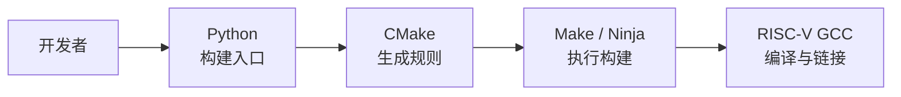
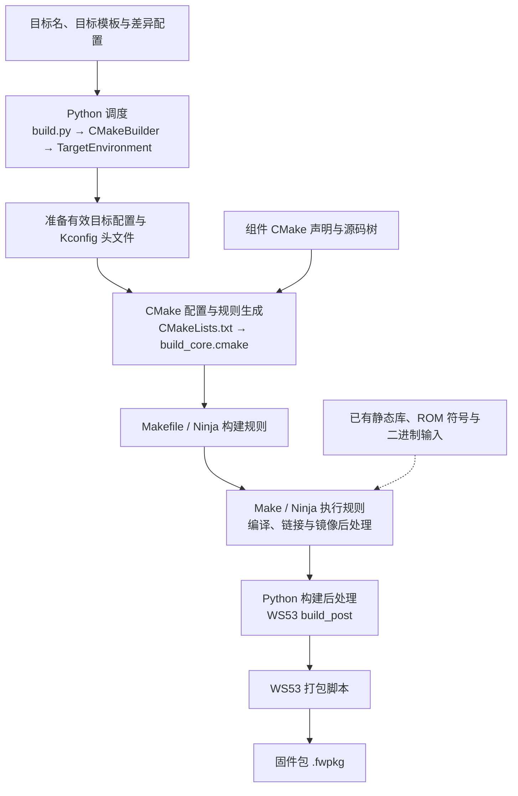
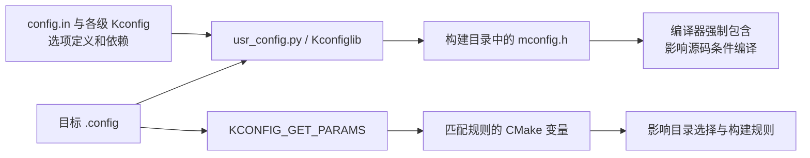

# WS53 构建框架

本文以 SDK 1.10.106 的 `ws53_liteos_app` 目标为主线，分析目标配置、组件源码和已有二进制如何经过构建框架处理，形成 WS53 固件。其他目标共用部分框架，但组件、ROM 处理和后处理分支由各自配置决定。

## 框架总览

开发者通过 Python 入口发起构建，由 CMake 生成规则，Make/Ninja 执行规则并调用 RISC-V GCC 工具链完成编译和链接。

## 构建入口与执行阶段

`src/build.py` 实例化 `CMakeBuilder` 并调用 `build()`。对于普通编译目标，`build_target()` 创建目标环境，依次执行构建前钩子、目标编译、构建后钩子，并在 `packet` 配置启用时发起固件打包。

下图按阶段展示主要输入和结果；实线表示主流程或数据输入，虚线表示已有文件的输入。ROM 相关的条件分支见[链接与 ROM/RAM 处理](#rom-link)。

| 阶段 | 主要执行者 | 职责与结果 |
| --- | --- | --- |
| 目标解析与前置处理 | `TargetEnvironment`、WS53 `build_pre` 钩子 | 合成目标配置，执行芯片相关前置处理；例如缺少 FlashBoot 镜像时触发其构建 |
| 配置与规则生成 | `CMakeBuilder.start()`、`usr_config.py`、CMake | 准备生成头文件和 CMake 参数，生成组件及后处理目标的构建规则 |
| 编译、链接与镜像后处理 | Make/Ninja、工具链、CMake 自定义目标 | 按依赖关系生成库、ELF、镜像及所需辅助数据 |
| 构建后处理与打包 | WS53 `build_post`、`pack_fwpkg()` | 按目标配置整理二进制等输入，并调用 WS53 打包实现 |

CMake 的入口是 `src/CMakeLists.txt`。它加载 `build_core.cmake`，通过 `cfbb_build_prologue()` 准备平台和通用模块，在 `project()` 初始化编译语言后，由 `cfbb_build_epilogue()` 接入组件树、链接脚本和后处理目标。

这里需要区分“声明规则”和“执行规则”：配置阶段处理 `CMakeLists.txt`、创建目标与依赖；编译和大部分镜像后处理在构建工具执行这些规则时发生。Python 调度器也会在 CMake 调用前后运行自己的处理逻辑。

## 目标与配置解析

### 目标配置的合成

目标名表示一组芯片、内核、工具链、组件及后处理配置，不等同于一个源码目录，也不等同于 CMake 内部的库目标。

`ws53_liteos_app` 在 `config.py` 中选择 `target_application_rom_template` 为基础模板。模板位于 `target_config.py`，定义 WS53、`acore`、LiteOS、工具链以及 ROM/RAM 等基础配置；目标再补充或调整组件、宏和功能开关。

`TargetEnvironment` 按以下关系合成有效配置：

1. 加载基础模板，合并目标差异。非列表字段由目标值覆盖，列表字段按实现追加；编译宏还经过专门的合并处理。
2. 加入公共编译和链接配置，展开 `ram_component_set`、`rom_component_set` 和宏集合。
3. 处理列表中的删除标记。以 `-:` 开头的条目用于从合成结果中排除相应条目。
4. 将结果交给 `CMakeBuilder`，转换成 CMake 参数，包括 `RAM_COMPONENT`、`ROM_COMPONENT`、编译宏、链接选项及工具链文件。

因此，最终组件集合需要结合基础模板、目标差异和集合定义理解，不能仅从 `config.py` 的某一段列表判断。

### Kconfig 的两条生效路径

目标配置确定框架使用哪些配置文件。Kconfig 进一步表达功能选项及其依赖；当前目标的配置保存在 `menuconfig/acore/ws53_liteos_app.config` 中。

Python 路径中，`CMakeBuilder.start()` 调用 `mconfig("savemenuconfig", ...)`，由 Kconfiglib 读取配置并生成 `mconfig.h`。组件构建规则在启用 Kconfig 时通过编译选项强制包含这个头文件。

CMake 路径中，`build_core.cmake` 调用 `KCONFIG_GET_PARAMS` 读取同一份目标配置。当前实现仅对值为 `y` 或带引号字符串的匹配项设置变量；不能将其理解为所有配置类型都会等价导入 CMake。源码中的数值配置仍可通过生成头文件生效。

## 组件组织与构建规则生成

### 组件模型与筛选

组件是框架组织源码、编译属性和链接输入的基本单元。框架先通过 `build_core.cmake` 遍历应用、内核、驱动、中间件等源码子树，再由各级 CMake 条件控制子目录是否进入配置过程。

当一个目录调用 `build_component()` 时，框架检查 `COMPONENT_NAME` 是否属于有效的 `RAM_COMPONENT` 或 `ROM_COMPONENT` 集合，并据此选择处理分支。目录存在、被遍历，以及生成实际编译目标，是不同的条件。

源码目录与构建组件也不必一一对应。例如，Hello World 案例向父作用域追加源码，最终由上层 `samples` 组件构建；GPIO 则声明独立组件。

### ROM 组件与 RAM 组件

ROM 组件与 RAM 组件是构建框架对组件的两类划分，用于区分 ROM 侧实现与当前固件中的非 ROM 侧实现：

- **ROM 组件**：属于有效 `ROM_COMPONENT` 集合的组件。默认 `ws53_liteos_app` 目标使用已有 ROM 符号，框架为这些组件提供公开头文件、宏等接口属性，不重新编译其实现；已有 ROM 中的实现通过符号信息供链接时引用。
- **RAM 组件**：属于有效 `RAM_COMPONENT` 集合的组件，其源码或预编译库按构建规则参与当前固件构建。这里的“RAM”是构建分类，不表示组件的所有代码和数据都放在 RAM 中，实际布局由链接脚本决定。

分类依据是目标模板、目标差异和组件集合展开后得到的有效配置，不是源码目录名或组件名称后缀。例如，当前应用模板将 `samples` 列入 `ram_component`，将 `version_rom` 列入 `rom_component`。名称中的 `_rom` 可以帮助阅读，但不是框架判定归属的依据。

这两类组件共用组件声明机制，但采用的编译和链接处理不同。上述 ROM 行为针对默认应用目标；其他配置下的 ROM 构建、符号引用及回调处理见[链接与 ROM/RAM 处理](#rom-link)。

### 从组件声明到构建目标

`build_component.cmake` 将组件声明转换为以下几类构建对象：

| 对象 | 框架中的处理方式 |
| --- | --- |
| 有源码的组件 | `build_library()` 默认创建静态库目标；启用 `BUILD_AS_OBJ` 时创建对象库目标 |
| 预编译库输入 | 源码不可用时按实现查找对应静态库，或通过组件声明的库输入参与链接 |
| 接口属性 | 创建组件接口目标，承载公开头文件目录、宏和编译选项 |
| 最终镜像目标 | 将所需组件库、对象及其他链接输入组合到 ELF 目标中 |

有源码的组件编译时使用自身的私有属性，并通过框架组织的接口目标获取公开属性。框架还根据 ROM 分类和全量链接设置，选择普通链接或 `--whole-archive` 处理。具体模板与字段填写见[创建应用组件](../../guides/sdk-development/create-application/index.md#cmake-template)。

## 链接与 ROM/RAM 处理

### 链接脚本连接组件与内存布局

组件选入构建后，还需要决定代码和数据如何进入镜像。`build_linker.cmake` 根据组件分类生成辅助链接描述，将目标的链接脚本模板、宏和头文件路径交给预处理器，形成最终 `linker.lds`。

ELF 目标使用该脚本及目标链接选项完成链接，同时生成地址映射文件。组件清单决定参与构建的输入，链接脚本决定这些输入的段如何布局；具体地址和分区说明见[内存布局](../memory-layout/index.md)。

### 默认应用目标的 ROM 路径

WS53 的应用模板同时配置 ROM/RAM 组件、`rom_sym_path`、`fixed_rom` 和 `build_rom_callback`。这些配置共同决定处理路径，不能只看到开关存在就认为所有 ROM 处理都会执行。

| 条件 | 当前框架的行为 |
| --- | --- |
| 配置有效的 ROM 符号文件 | `deal_symbol_link()` 为链接器添加 `--just-symbols`；`build_component()` 对 ROM 组件走符号模式分支，提供接口属性及相关登记信息 |
| 回调处理开启且 `fixed_rom` 为真 | `rom_callback()` 跳过自动回调生成过程；随后调度器关闭本轮自动生成开关，加入 `rom_callback` 组件及相关宏 |
| 回调处理开启且不是固定 ROM | 框架先构建并收集未定义符号、重定位和符号表，再调用回调生成逻辑，随后进行后续构建 |
| 进入 `rom_check()` 时仍有 `rom_sym_path` | 直接返回，不执行该函数后续的 ROM 二进制比对 |
| 无 ROM 符号路径且启用固定 ROM | 将本次生成的 ROM 二进制与 `fixed_rom_path` 指定的基线比较 |
| 无 ROM 符号路径、非固定 ROM 且启用 ROM/RAM 检查 | 进入额外检查构建，并按 `rom_ram_compare` 决定是否比对结果 |

默认 `ws53_liteos_app` 模板使用已有 ROM 符号文件和固定 ROM 配置。理解这条路径时，应把已有 ROM 符号的引用、回调组件的接入，以及其他配置下的 ROM 重建和校验区分开。

## 镜像后处理与固件打包

### CMake 构建图内的后处理

ELF 链接完成后，`build_core.cmake` 声明的自定义目标调用 `objcopy` 提取镜像；存在 ROM 组件定义时，规则包含分别提取普通镜像和 ROM 段的处理。

后续任务按配置加入构建图，而不是统一的一条串行命令：

- `build_sign.cmake` 为 WS53 声明 `WS53_GENERAT_SIGNBIN`，调用芯片签名脚本 `params_and_bin_sign.py`，并依赖镜像生成目标。
- `build_nv_bin.cmake` 根据 NV 配置和更新开关组织配置数据与 NV 镜像生成。
- `build_partition_bin.cmake` 在存在分区配置时声明分区数据生成规则。
- 其他模块按目标需要补充启动镜像、镜像信息和辅助数据处理。

这些任务的先后关系由各自的依赖声明确定。某个 CMake 模块被加载，并不表示其中的每个生成任务都会启用。

### Python 后处理与包输入汇总

目标编译及相应 ROM 检查返回后，`build_target()` 调用 WS53 的 `build_post` 钩子。该钩子根据配置执行启动镜像整理、eFuse 配置生成、ROM 合并等处理；各处理受独立开关和目标条件控制。

随后，启用 `packet` 的目标由 `pack_fwpkg()` 调用 `tools/pkg/packet.py`，再分派到 `chip_packet/ws53/packet.py`。WS53 打包实现按包类型和配置组织应用签名镜像、LoaderBoot、启动参数、SSB、FlashBoot、NV 等输入，并生成固件包；可选输入由相应条件控制。

因此，固件包是多个构建产物与已有二进制的组合，不是给应用 ELF 换一个扩展名。具体产物路径、包的选用及烧录方法见[烧录与运行验证](../../guides/sdk-development/flash-and-run/index.md)。
