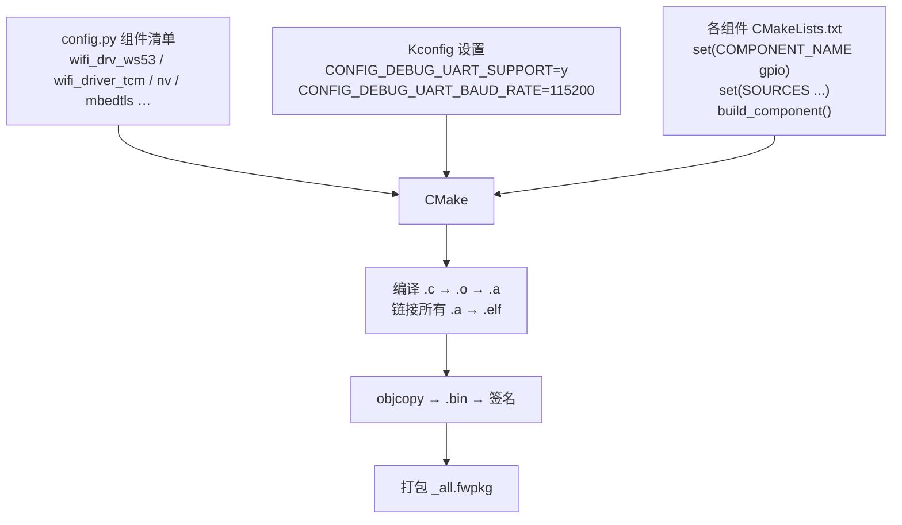
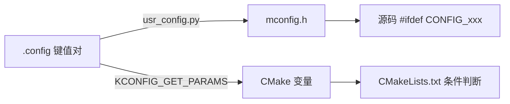

# 构建系统

## 概述

WS53 SDK采用组件化构建体系，通过 config.py 选定组件、Kconfig 配置参数、CMake 执行编译，最终打包为可烧录的 .fwpkg 固件文件。SDK 中每个软件模块都是一个组件，一个 App 固件由上百个组件组合而成。



## 组件化配置

### 组件模型

SDK 中每个软件模块都是一个组件。以 gpio 为例：

```
drivers/drivers/driver/gpio/
├── gpio.c
└── CMakeLists.txt
```

每个组件的 CMakeLists.txt 按统一模板声明：

```cmake
set(COMPONENT_NAME "gpio")

set(SOURCES
    ${CMAKE_CURRENT_SOURCE_DIR}/gpio.c
)

set(PUBLIC_HEADER
)

set(PRIVATE_HEADER
)

set(PRIVATE_DEFINES
)

set(PUBLIC_DEFINES
)

#use this when you want to add ccflags like -include xxx
set(COMPONENT_PUBLIC_CCFLAGS
)

set(COMPONENT_CCFLAGS
)

set(WHOLE_LINK
    true
)

set(MAIN_COMPONENT
    false
)

build_component()
```

### 组件清单

构建一个 target 时，并非所有组件都参与编译。config.py 为每个 target 定义了组件清单：

```
src/build/config/target_config/ws53/config.py
```

```python
'ws53_liteos_app': {
    'ram_component': [
        'mbedtls_v3.6.0',
        'wifi_drv_ws53',
        'wifi_driver_tcm',
        'nv',
        'nv_ws53',
        # ... 上百个组件
    ],
}
```

`ws53_liteos_app` 会继承 `target_application_rom_template` 中的基础组件，再合并自身的 `ram_component` 和 `ram_component_set`。最终合并后的组件清单参与构建；以 `-:` 前缀声明的组件会从清单中排除。

### Kconfig 参数配置

组件进入清单后，内部还有更细的控制需求：用 UART0 还是 UART1 做调试口？波特率多少？这些由 Kconfig 管理，配置以键值对形式存在 .config 文件中：

```
src/build/config/target_config/ws53/menuconfig/acore/ws53_liteos_app.config
```

```
CONFIG_SAMPLE_ENABLE=y
CONFIG_ENABLE_BT_SAMPLE=y
CONFIG_DEBUG_UART_SUPPORT=y
CONFIG_UART_DEBUG_PORT_L0=y
CONFIG_DEBUG_UART_BAUD_RATE=115200
```

.config 通过两条路径生效：



修改配置推荐使用 `fbb menuconfig <target>`。交互式菜单按模块层级组织，方向键移动、空格切换开关，保存退出后 `.config` 和 `mconfig.h` 自动更新：

```bash
fbb menuconfig ws53_liteos_app
```

自动化脚本和 CI 推荐使用无交互的 `fbb config`。该命令会校验 Kconfig 依赖和 choice 互斥关系：

```bash
fbb config --target ws53_liteos_app get CONFIG_SAMPLE_ENABLE
fbb config --target ws53_liteos_app set CONFIG_SAMPLE_ENABLE=y
fbb config --target ws53_liteos_app unset CONFIG_SAMPLE_ENABLE
```

## 推荐的应用工程入口

产品应用使用 SDK 外的独立工程，不直接修改 `application/ws53/ws53_application/main.c`。升级后的 fbb CLI (Command Line Interface) 提供工程脚手架：

```bash
fbb create-project my_ws53_app --chip ws53
cd my_ws53_app
fbb build
```

生成的工程包含：

```text
my_ws53_app/
├── fbb-project.toml        # 芯片、target 和依赖
├── CMakeLists.txt          # 外置工程构建入口
└── main/
    ├── CMakeLists.txt
    └── app.c               # app_run() 业务入口
```

业务可以继续拆分到 `components/`。外置工程通过 `FBB_SDK_DIR` 接入 SDK 组件树，应用代码与 SDK 源码分开管理。

## 新增组件

> 本节面向维护 SDK 平台组件的开发者。普通产品业务优先在外置工程的 `main/` 或 `components/` 中扩展，不要为了增加业务功能直接修改 SDK 的 `config.py`。

向 SDK 中添加一个新的软件模块时，按以下步骤操作。以新增 `my_driver` 组件为例：

**第一步：创建源码和 CMakeLists.txt**

```
drivers/drivers/driver/my_driver/
├── my_driver.c
└── CMakeLists.txt
```

```cmake
set(COMPONENT_NAME "my_driver")

set(SOURCES
    ${CMAKE_CURRENT_SOURCE_DIR}/my_driver.c
)

set(PUBLIC_HEADER
)

set(PRIVATE_HEADER
)

set(PRIVATE_DEFINES
)

set(PUBLIC_DEFINES
)

set(COMPONENT_CCFLAGS
)

set(WHOLE_LINK
    true
)

set(MAIN_COMPONENT
    false
)

build_component()
```

模板中各字段含义：

| 字段 | 必填 | 说明 |
|------|:---:|------|
| COMPONENT_NAME | 是 | 组件名，需与 config.py 中注册的名称一致 |
| SOURCES | 是 | 源文件列表，使用 `${CMAKE_CURRENT_SOURCE_DIR}` 拼接路径 |
| PUBLIC_HEADER | 否 | 公开头文件，暴露给其他组件使用 |
| PRIVATE_HEADER | 否 | 私有头文件，仅本组件内部使用 |
| PRIVATE_DEFINES | 否 | 组件内部宏定义，不对外暴露 |
| PUBLIC_DEFINES | 否 | 公开宏定义，其他组件依赖本组件时自动继承 |
| COMPONENT_PUBLIC_CCFLAGS | 否 | 公开编译选项，其他组件依赖本组件时自动追加 |
| COMPONENT_CCFLAGS | 否 | 组件私有编译选项，仅本组件使用 |
| WHOLE_LINK | 否 | 是否全量链接，true 表示即使未被引用也保留所有符号 |
| MAIN_COMPONENT | 否 | 是否为主组件，每个 target 有且仅有一个 |

**第二步：注册到目标 target**

在 config.py 的 ram_component 列表中添加组件名：

```python
'ws53_liteos_app': {
    'ram_component': [
        # ... 已有组件 ...
        'my_driver',         # 新增
    ],
}
```

**第三步（可选）：添加 Kconfig 开关**

如果组件需要可配置，在对应目录下新建或编辑 Kconfig：

```kconfig
config MY_DRIVER_ENABLE
    bool "Enable My Driver"
    default y
```

源码中使用方式：

```c
#ifdef CONFIG_MY_DRIVER_ENABLE
    /* 初始化 */
    my_driver_init();
    /* 创建任务 */
    osal_kthread_lock();
    osal_task *task = osal_kthread_create((osal_kthread_handler)my_driver_task,
                                           0, "MyDriver", 0x1000);
    if (task != NULL) {
        osal_kthread_set_priority(task, 26);
        osal_kfree(task);
    }
    osal_kthread_unlock();
#endif
```

**第四步：重新构建**

```bash
fbb build ws53_liteos_app
```

## 构建操作 <a id="构建操作"></a>

### 环境准备

**安装 uv（Python 包管理器）**：

```powershell
irm https://astral.sh/uv/install.ps1 | iex
```

**安装或更新 fbb CLI**：

```powershell
uv tool install --force 'git+https://gitcode.com/HiSpark/hs-fbb-cli.git'
fbb -V
```

WS53 SDK 要求 `fbb` 不低于 `1.1.0`，本文命令已使用 `fbb 1.2.0` 验证。团队项目可另行固定经过验证的 CLI 提交。

**初始化构建环境并安装 SDK 与工具链**：

```bash
fbb setup
fbb sdk install ws53          # 安装匹配的 SDK 与 RISC-V 工具链
fbb doctor                    # 环境检查
fbb describe --json           # 查看 CLI、SDK、工具链和可用 target
```

> `fbb sdk install` 会下载 SDK 源码并安装该 SDK 声明的匹配工具链。团队项目应在开发说明中固定 SDK tag 或 commit；不要只执行 `git clone` 后假设本机已有匹配工具链。

### 查看可用 Target

```bash
fbb list-targets --json       # 列出所有可构建的 target
fbb describe --json            # 完整环境探测（SDK、工具链、target 等）
```

常用 target：

| Target | 用途 |
|--------|------|
| `ws53_liteos_app` | 主应用镜像（默认） |
| `ws53-flashboot` | FlashBoot 引导 |
| `ws53_liteos_xts` | LiteOS XTS 测试镜像 |

可设置默认 target 后续省略：

```bash
fbb set-target ws53_liteos_app
fbb get-target                 # 查看当前默认 target
```

### 构建

```bash
fbb build ws53_liteos_app              # 增量构建
fbb build --clean ws53_liteos_app      # 全量重编（修改 .config 后必须 --clean）
fbb build ws53_liteos_app -j8          # 指定并行任务数
```

> 修改过 `.config` 后必须 `--clean`，否则 CMake 缓存会导致改动不生效。

构建成功需同时满足：
1. 进程退出码为 `0`
2. `src/output/ws53/fwpkg/<target>/<target>_all.fwpkg` 存在且时间戳更新
3. 使用 `_all.fwpkg`，不要使用 `_load_only.fwpkg`

### 烧录

```bash
fbb flash ws53_liteos_app                                 # 自动检测串口
fbb flash ws53_liteos_app --port COM3 --baud 921600       # 指定串口和波特率
```

## 构建产物

构建产物位于 `src/output/ws53/`：

```
src/output/ws53/
├── acore/
│   ├── ws53_liteos_app/
│   │   ├── application.elf            # ELF（含调试符号，GDB 用）
│   │   ├── application.map            # 函数 / 变量地址映射
│   │   ├── application.lst            # 反汇编清单
│   │   ├── application.bin            # App 裸二进制
│   │   ├── ws53_liteos_app.bin       # 裸二进制
│   │   ├── ws53_liteos_app_sign.bin  # 签名固件
│   │   └── mconfig.h                 # Kconfig 生成的头文件
│   ├── ws53-flashboot/               # FlashBoot 产物
│   ├── boot_bin/                      # SSB、LoaderBoot 等启动镜像
│   ├── nv_bin/                        # NV 全量与出厂数据
│   └── param_bin/params.bin           # 分区表
└── fwpkg/
    └── ws53_liteos_app/
        └── ws53_liteos_app_all.fwpkg  # ★ 最终烧录文件
```

| 产物 | 说明 |
|------|------|
| .fwpkg | 最终烧录文件，含 Bootloader + App + NV (Non-Volatile) + 分区表 |
| .elf | 完整 ELF (Executable and Linkable Format)，含调试符号和段信息，GDB (GNU Debugger) 调试用，不可烧录 |
| .bin | ELF 经 objcopy 提取的裸二进制 |
| `_sign.bin` | 签名固件，安全启动需要 |
| .map | 所有函数 / 变量的地址映射，崩溃时配合 PC / LR 定位 |
| .lst | 源码与汇编一一对照，深度调试用 |
