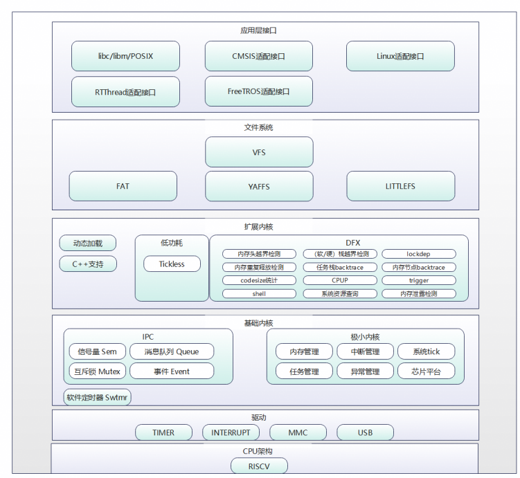

# LiteOS

> 轻量级实时操作系统，WS53 默认内核

## 概述

LiteOS (Huawei LiteOS) 是华为面向物联网领域的轻量级实时操作系统，版本 v208.5.0，为 WS53 的默认内核，代码位于 `kernel/liteos/`。

LiteOS 的基础内核包括不可裁剪的极小内核和可裁剪的其他模块。极小内核包含任务管理和调度相关的基本功能。可裁剪的模块包括信号量、互斥锁、队列管理、事件管理、软件定时器、内存管理、中断管理、异常管理和系统时钟 Tick。LiteOS 支持在单核环境上运行。

## 特性优势

- 高实时性，高稳定性
- 低功耗，支持动态加载、分散加载
- 支持功能静态裁剪
- 快速启动

## 内核模块

| 模块 | 说明 |
|------|------|
| 任务管理 | 任务的创建、删除、延迟、挂起、恢复，支持按优先级抢占调度和同优先级时间片轮转调度 |
| 内存管理 | 静态内存（Box 算法）与动态内存（bestfit / bestfit_little 算法），支持内存统计与越界检测 |
| 中断管理 | 中断的创建、删除、使能、禁止及请求位清除 |
| 异常管理 | 系统异常时跳转至异常处理模块，打印调用栈或保存当前状态 |
| 系统时钟（Tick） | 操作系统调度的基本时间单位，由用户配置 |
| 消息队列 | 消息队列的创建、删除、发送和接收 |
| 事件 | 读事件和写事件功能 |
| 信号量 | 信号量的创建、删除、申请和释放 |
| 互斥锁 | 互斥锁的创建、删除、申请和释放 |
| 软件定时器 | 定时器的创建、删除、启动、停止 |
| Tickless 低功耗 | 通过计算下一次有效时钟中断的时间，减少不必要的时钟中断以降低系统功耗 |

## 扩展内核 / 维测

| 功能 | 说明 |
|------|------|
| CPU 占用率 | 获取系统或指定任务的 CPU 占用率 |
| Trace 事件监测 | 实时获取事件发生的上下文，支持自定义缓冲区和模块过滤 |
| Perf | 性能分析工具，通过配置采样事件定位性能瓶颈和热点代码 |
| Shell | 通过串口或 Telnet 接收命令，支持系统、文件、网络、动态加载等调试命令，支持自定义命令 |

## 使用约束

- WS53 应用和普通组件统一使用 OSAL (Operating System Abstraction Layer) ，不直接调用 LiteOS 原生接口。OSAL 位于 LiteOS 之上，用于统一任务、同步、内存、定时器和中断等系统能力的使用方式。
- LiteOS 支持 POSIX (Portable Operating System Interface) 和 CMSIS 兼容接口，但它们主要用于移植已有软件。新代码只有在对应组件明确要求时才使用，并且不能与 OSAL 或 LiteOS 原生接口混合管理同一个任务、锁、信号量或内存对象。
- 外设访问使用驱动 UAPI (Unified API) ；HAL (Hardware Abstraction Layer) 、Porting 和寄存器接口仅供驱动及板级适配代码使用。
