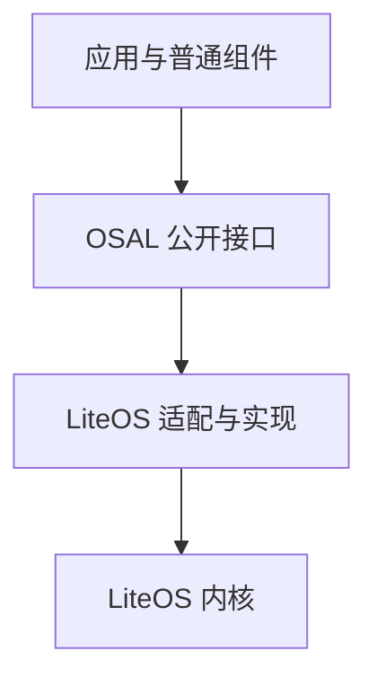

# OS 抽象层

> WS53 应用在 LiteOS (Huawei LiteOS) 上统一使用的操作系统接口

## 概述

当前 WS53 应用固件只支持 LiteOS 。LiteOS 提供任务调度、中断、内存、定时器和同步原语等基础能力，同时兼容部分 POSIX (Portable Operating System Interface) 和 CMSIS 接口。

为了避免应用和普通组件直接依赖 LiteOS 的具体类型与资源管理方式，SDK 在 LiteOS 之上提供 OSAL (Operating System Abstraction Layer)。新开发的应用、示例和普通组件统一调用 `osal_*` 接口。

OSAL 的目标是统一 SDK 内部的操作系统使用方式，当前实现与本文均以 LiteOS 为准。

## 源码组成

| 路径 | 作用 |
|------|------|
| `kernel/osal/include/` | OSAL 公共头文件，`soc_osal.h` 是常用聚合入口 |
| `kernel/osal/src/liteos/` | OSAL 在 LiteOS 上的主要实现 |
| `kernel/osal/adapt/liteos/` | LiteOS 相关的补充适配 |
| `kernel/osal_adapt/` | SDK 其他子系统使用的 OSAL 适配辅助组件 |
| `kernel/liteos/` | LiteOS 内核及其兼容接口实现 |

应用不应包含 `kernel/osal/src/`、`kernel/osal/adapt/` 或 LiteOS 内核内部头文件。

## 模块概览

| 模块 | 主要头文件 | 覆盖的能力 |
|------|------------|-----------|
| 任务管理 | `osal_task.h` | 创建、删除、优先级、挂起/恢复、调度锁 |
| 信号量 | `osal_semaphore.h` | 计数信号量、任务与中断间同步 |
| 互斥锁 | `osal_mutex.h` | 互斥访问、超时等待 |
| 消息队列 | `osal_msgqueue.h` | 任务间消息传递 |
| 事件 | `osal_event.h` | 事件位等待与通知 |
| 定时器 | `osal_timer.h` | 单次和周期定时回调 |
| 内存管理 | `memory/osal_addr.h` | 动态内存分配与释放 |
| 中断处理 | `osal_interrupt.h` | 中断注册、使能、锁定与恢复 |
| 时间与休眠 | `schedule/osal_task.h`、`time/osal_timer.h` | 任务休眠、延时和时间管理 |
| 工作队列与等待 | `osal_workqueue.h`、`osal_wait.h` | 延后执行和条件等待 |

实际可用接口以 `kernel/osal/include/` 和 [OSAL API 参考](../../api-reference/osal/index.md) 为准。

## 使用规则

1. **操作系统能力统一使用 OSAL。** 任务、锁、信号量、队列、事件、定时器、内存和中断等均优先选择 `osal_*` 接口。
2. **外设能力使用驱动 UAPI (Unified API) 。** GPIO (General Purpose Input/Output) 、UART (Universal Asynchronous Receiver/Transmitter) 、SPI (Serial Peripheral Interface) 、I2C (Inter-Integrated Circuit) 、PWM (Pulse Width Modulation) 、ADC (Analog-to-Digital Converter) 、DMA (Direct Memory Access) 等通过 `uapi_*` 接口访问。
3. **不直接调用 HAL (Hardware Abstraction Layer) 、Porting 或寄存器接口。** 这些接口属于驱动与板级适配内部实现。
4. **不混用资源生命周期。** 不能用 POSIX 或 LiteOS 接口创建对象，再使用 OSAL 销毁或释放，反向同样不允许。
5. **POSIX/CMSIS 只用于明确的移植场景。** LiteOS 支持这些兼容接口，但新 WS53 应用不把它们作为默认编程接口。

## 执行上下文约束

- 普通任务可以使用可能等待或阻塞的 OSAL 接口。
- ISR (Interrupt Service Routine) 中只能调用文档明确标注为中断安全的接口，不能休眠或执行可能阻塞的操作。
- 定时器回调和系统回调应保持短小；耗时工作应转交任务或工作队列。
- `app_run()` 的执行上下文取决于构建配置：未启用 Sample 时在调度器启动前调用；启用 Sample 时由 `app_sample` 任务在调度器启动后调用。调用阻塞接口前应先确认当前配置和执行上下文。

更完整的上下文与系统任务说明见 [运行时架构](../runtime-architecture/index.md)。
