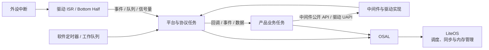

# 运行时架构

> 基于 `ws53_liteos_app` 当前源码，说明 LiteOS (Huawei LiteOS) 开始调度后系统中的任务组成、执行上下文、通信边界和资源约束

本文从 `osKernelStart()` 启动调度器之后开始描述。上电、镜像校验、App 初始化和业务入口注册过程见 [启动流程](../boot-flow/index.md)。

## 运行时任务拓扑

LiteOS 负责调度系统任务、协议任务和产品业务任务。外设中断、软件定时器及工作队列提供异步执行入口；应用通过中间件公开 API、驱动 UAPI (Unified API) 和回调与平台能力交互。

这张图表达的是运行时关系，不代表每次 API 调用都会切换任务。接口是同步执行还是异步投递、回调在哪个上下文触发，应以对应 API 文档和实现为准。

## 系统中的任务

平台任务表定义在 `application/ws53/ws53_application/app_os_init.c` 的 `g_app_tasks[]` 中。实际固件只包含当前 target 和 Kconfig 选中的任务，并非下表任务会同时存在。

| 运行域 | 典型任务 | 启用条件 | 运行时职责 |
|--------|----------|----------|------------|
| 系统监控 | `app` | 始终创建 | 完成时钟校准；非 `TEST_SUITE` 构建中周期输出内存使用量 |
| Sample 入口 | `app_sample` | `CONFIG_SAMPLE_ENABLE` | 在调度器启动后执行 `app_tasks_init()` |
| 诊断与控制 | `cmd_loop`、`log`、`at` | `TEST_SUITE`、非设备模式且使用非压缩日志、`AT_COMMAND` | 处理测试命令、诊断日志和 AT 消息 |
| Wi-Fi | `wifi` | `CONFIG_SUPPORT_WIFI` | 运行 Wi-Fi Host 协议处理逻辑 |
| 蓝牙 Host | `bt_sdk`、`bt_service` | `BTH_TASK_EXIST`，其中 `bt_sdk` 还要求 `BTH_SDK_TASK_SUPPORT` | 处理蓝牙 SDK 消息和服务流程 |
| OpenHarmony | `ohos_start` | `CONFIG_SUPPORT_OHOS_SUPPORT` | 延时后调用 `OHOS_SystemInit()` |
| 产品业务 | 由产品组件定义 | 取决于产品配置 | 运行设备状态机、传感器处理和产品功能 |

平台与协议任务拥有各自模块的内部状态。产品业务应通过公开接口、事件或回调与它们交互，不应直接访问协议栈内部对象，也不应依赖平台任务未公开的执行顺序。

## 执行上下文

同一段业务逻辑处在不同上下文时，可使用的接口和允许的耗时不同。

| 执行上下文 | 阻塞规则 | 适合的工作 | 主要约束 |
|------------|----------|------------|----------|
| 平台或协议任务 | 按模块设计执行 | 协议状态机、消息处理和后台服务 | 不在处理路径中加入产品侧长耗时逻辑，不直接暴露内部状态 |
| 产品业务任务 | 可以使用 OSAL (Operating System Abstraction Layer) 等待 | 产品状态机、网络业务、文件和传感器处理 | 避免忙等和长时间占用 CPU，控制栈和共享资源范围 |
| ISR (Interrupt Service Routine) | 不可阻塞 | 读取并清除中断状态，保存最小现场，通知后续处理 | 只调用中断安全接口，不执行复杂协议、不申请大块内存 |
| Bottom Half / 工作队列 | 应保持短小 | 把 ISR 或回调中的工作延后到任务上下文 | 共享队列可能服务多个模块，不应长期占用 |
| 软件定时器回调 | 按非阻塞回调处理 | 更新时间、置位状态、投递轻量事件 | 耗时工作转交任务，不在回调中等待业务完成 |
| API 回调 | 默认按不可阻塞处理 | 保存结果、更新轻量状态、投递业务事件 | 回调线程由具体模块决定；未确认上下文前不要休眠、加长锁或调用耗时接口 |

对于上下文没有明确说明的回调，安全做法是复制必要数据或转移所有权，然后通过队列、事件或信号量通知业务任务处理。

## 通信与资源所有权

运行时问题通常不是“接口能否调用”，而是调用所在上下文、共享对象归属和数据生命周期没有约定清楚。

| 对象或场景 | 推荐边界 |
|------------|----------|
| 协议栈状态 | 由 Wi-Fi、蓝牙等协议任务维护；应用只通过公开 API 和回调交互 |
| 外设资源 | 由驱动管理；产品代码使用驱动 UAPI，不直接调用 HAL (Hardware Abstraction Layer) 、Porting 或寄存器接口 |
| 产品状态 | 尽量由单一业务任务维护；其他上下文通过消息或事件请求变更 |
| ISR 到任务 | 使用中断安全的事件、信号量或队列接口，只传递最小必要信息 |
| 回调到业务任务 | 明确数据是复制、借用还是移交；借用数据不得在回调返回后继续访问 |
| 共享缓冲区 | 明确申请方、消费者、释放方和最大长度，避免多个任务无保护地修改 |
| 共享硬件或全局对象 | 使用 OSAL 互斥锁保护，临界区保持短小，锁内不执行不可控耗时操作 |
| OS (Operating System) 对象 | 统一使用 OSAL 创建、等待和销毁，不混用 OSAL、POSIX (Portable Operating System Interface) 与 LiteOS 原生接口管理同一对象 |

消息队列适合传递离散命令和数据，事件适合表达状态组合，信号量适合计数或唤醒，互斥锁只用于保护共享资源。不要用无延时轮询代替这些同步机制，否则会压制低优先级任务并影响系统进入空闲或低功耗状态。

## 调度、裁剪与资源占用

`g_app_tasks[]` 使用 CMSIS `osPriority_t` 优先级，具体值由 `TASK_PRIORITY_*` 宏给出；在当前 CMSIS 适配中，数值越大表示优先级越高。CMSIS、OSAL 与 LiteOS 原生接口的优先级表示方式并不相同，调整任务时应通过对应适配层确认映射关系，不要直接比较不同接口中的数值。

开发者新增或调整任务时应注意：

1. 不要仅为“运行更快”而盲目提高任务优先级。持续运行的高优先级业务任务可能使 Wi-Fi、蓝牙、日志或系统监控任务得不到调度。
2. 使用 OSAL 等待、队列或事件让任务在无工作时阻塞，不使用无延时的永久轮询。
3. 根据最大调用深度、局部变量和所调用协议库确定栈大小；任务栈会占用运行时 RAM (Random Access Memory) 。
4. 检查任务创建和优先级设置返回值。平台任务创建失败时会调用 `panic(PANIC_TASK_CREATE_FAILED, i)`，其中 `i` 是 `g_app_tasks[]` 的任务索引。
5. 任务是否存在由编译配置决定。定位问题时先核对 Kconfig 和预处理宏，再检查任务是否成功创建，不要只根据源码中存在任务函数判断它已运行。

## 运行状态与问题定位

“任务已经创建”不等于“服务已经就绪”。建议把运行状态分成四层观察：

| 层次 | 需要确认的内容 |
|------|----------------|
| 编译裁剪 | 对应 Kconfig 是否启用，任务和组件是否进入当前镜像 |
| 任务存在 | 任务创建是否成功，栈和优先级设置是否正常 |
| 服务就绪 | 协议、驱动或业务模块是否给出明确的 ready 事件或成功日志 |
| 持续健康 | CPU 是否被单个任务长期占用，栈和堆是否充足，消息队列是否积压，日志是否持续丢失 |

非 `TEST_SUITE` 构建中的 `app` 任务会周期输出 `[SYS INFO]`，包含系统内存已用量和空闲量，可用于观察长期运行趋势。需要进一步定位时，可结合 LiteOS 任务/CPU 统计、内存信息、串口日志、异常信息以及 `.map`、`.elf` 分析：

- `.map` 和 `.elf` 用于确认静态代码、数据和符号布局，不代表任务运行状态。
- 任务或 CPU 统计用于确认任务是否得到调度、是否长期占用处理器。
- 内存和栈信息用于区分堆耗尽、任务栈不足和持续泄漏。
- 串口日志应区分“任务创建成功”“模块初始化完成”和“业务功能可用”。

启动阶段的调用顺序和业务入口注册方式见 [启动流程](../boot-flow/index.md)，操作系统接口规则见 [OSAL 抽象层](../kernel/os-abstract.md)。
