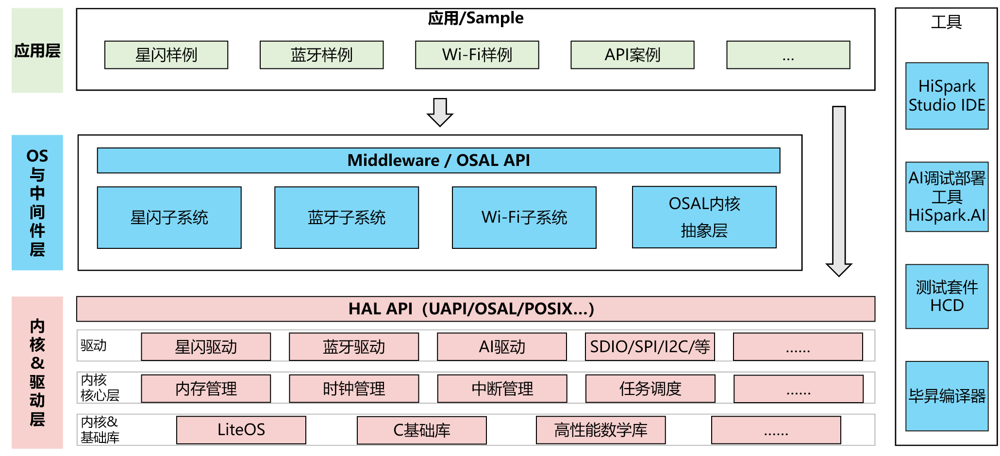
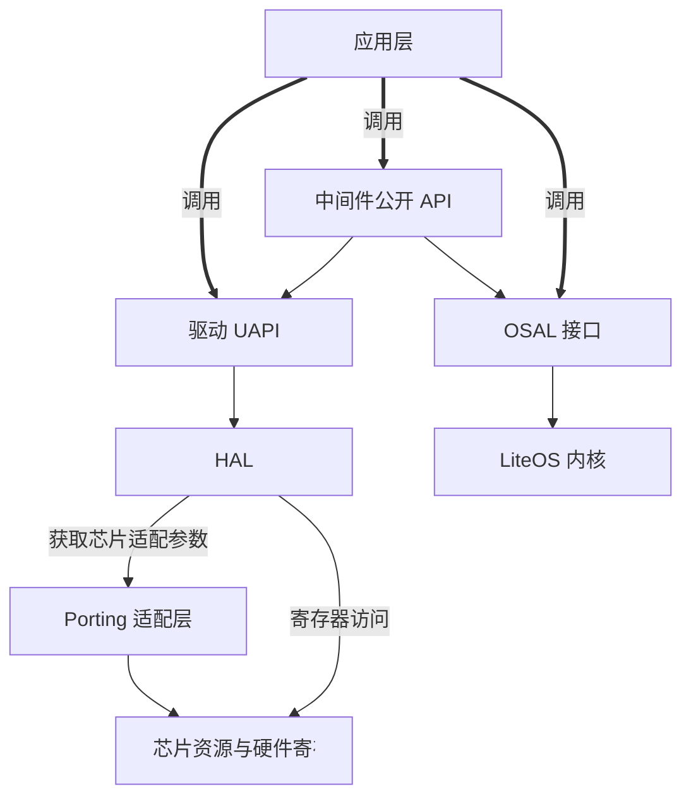

# 软件架构介绍

## 概述

WS53 是一款面向物联网和短距无线通信的 SoC 芯片，其 SDK采用分层架构设计，自上而下分为三层：**应用层** → **中间件层** → **内核与驱动层**，同时配套完整的构建工具与配置体系。

---

## 应用层 — 应用入口

应用层面向开发者，调用下层 API 构建产品应用。

主应用工程是系统初始化的入口，完成硬件初始化、创建任务、启动协议栈。

示例代码覆盖 RTOS (Real-Time Operating System) 基础、无线连接、外设驱动、网络协议、安全加密、系统服务等场景，可直接基于示例工程开始开发。

---

## 中间件层 — 协议栈与服务

中间件层将无线协议栈、系统服务、开源组件封装为统一 API。

**无线协议栈**：SLE (SparkLink Low Energy)、BLE (Bluetooth Low Energy)、Wi-Fi。

**系统服务**：NV (Non-Volatile) 持久化存储、LittleFS 文件系统、OTA (Over-The-Air) 升级、AT 指令、诊断日志。

**开源组件**：lwIP (Lightweight IP)、mbedTLS (mbed Transport Layer Security)、cJSON、MQTT (Message Queuing Telemetry Transport)、libcoap、LittleFS。

---

## 内核与驱动层 — 硬件抽象

最底层，为上层屏蔽芯片差异。

**驱动**：操控 WS53 通用外设——GPIO (General Purpose Input/Output) / UART (Universal Asynchronous Receiver/Transmitter) / SPI (Serial Peripheral Interface) / I2C (Inter-Integrated Circuit) / PWM (Pulse Width Modulation) / ADC (Analog-to-Digital Converter) / DMA (Direct Memory Access) / SFC (Serial Flash Controller) / 安全模块。对外提供 UAPI（统一外设接口），供应用层直接调用。

**HAL (Hardware Abstraction Layer)**（硬件抽象层）：SDK 内部层，封装芯片寄存器差异，对上提供统一接口，不对应用层暴露。

**内核**：当前 WS53 应用固件只支持 LiteOS (Huawei LiteOS)，由 LiteOS 提供任务调度、中断管理、内存管理等基础能力。LiteOS 同时提供原生、CMSIS 和 POSIX (Portable Operating System Interface) 兼容接口；为统一 SDK 内的软件使用方式，应用和普通组件应优先使用 OSAL (Operating System Abstraction Layer)，不要直接依赖 LiteOS 原生接口。

---

## 开发约束 — API 调用规则

应用层只应依赖 SDK 明确公开的接口，HAL、Porting 和寄存器操作属于驱动内部实现。

应用层推荐调用以下三类接口：

| 接口类别 | 说明 | 使用场景 |
|----------|------|----------|
| 中间件公开 API | 面向完整能力和协议流程的接口 | Wi-Fi / BLE / SLE 连接、OTA、AT 命令、NV 存储等 |
| 驱动 UAPI | 面向外设的稳定公开接口，通常以 `uapi_*` 命名 | GPIO、UART、SPI、I2C、PWM、ADC、DMA 等外设操作 |
| OSAL | LiteOS 之上的统一操作系统接口 | 任务、互斥锁、信号量、消息队列、定时器、内存和中断管理 |

以下接口不作为应用层接口：

- **HAL**：外设驱动对硬件能力的内部抽象。
- **Porting**：芯片、板级或操作系统相关的适配实现，由驱动或 HAL 内部调用。
- **寄存器接口**：由驱动和芯片适配代码管理，应用直接访问会绕过资源、时钟和并发控制。

---

## 构建与配置

SDK 使用 **CMake** + **Kconfig** 构建体系，通过 `fbb` CLI (Command Line Interface) 完成编译与固件打包。详见 [构建系统](build-system/index.md) 和 [目录结构](source-tree/index.md)。
