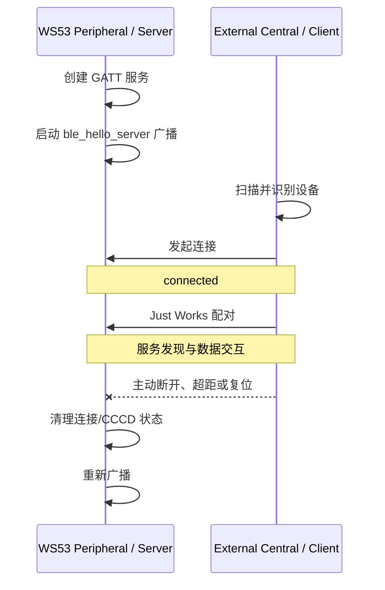
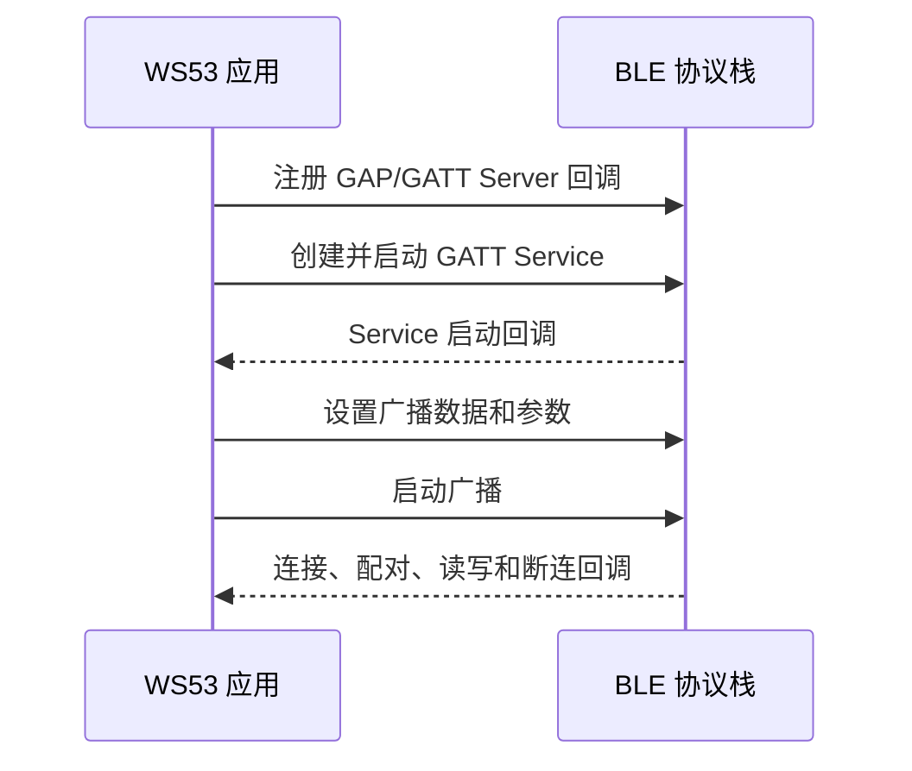

# Hello BLE

> 本篇是 BLE (Bluetooth Low Energy) Hello 系列的基础入口，统一说明广播、连接、公共任务入口以及 Server 的构建烧录。[Hello Notify](./hello-notify.md) 和 [Hello ReadWrite](./hello-readwrite.md) 说明连接建立后的通知与读写能力。

> 广播与连接 — BLE 设备发现、连接管理

## 学习目标

- 理解 BLE 广播和连接的作用
- 能够配置 GAP (Generic Access Profile) Peripheral 的可连接广播
- 理解 Peripheral/Central 与 GATT (Generic Attribute Profile) Server/Client 是两组不同概念
- 理解 BLE API 的异步回调驱动方式
- 能够使用外部 BLE Client 连接 WS53 并验证断连恢复

## 规格与功能

WS53 不支持 BLE Central（中心设备）/GATT Client（客户端）功能。本案例将 WS53 作为 Server，由 WS63、手机或 PC BLE 调试工具承担 Client。

| 规格项 | WS53 Server | 外部 Client |
| --- | --- | --- |
| GAP 角色 | Peripheral，被连接方 | Central，连接发起方 |
| GATT 角色 | GATT Server | GATT Client |
| 广播类型 | 可连接非定向广播 | - |
| 广播名称 | `ble_hello_server` | 扫描并识别该名称 |
| 广播间隔 | 30 ms | - |
| 广播信道 | 37、38、39 | - |
| 安全模式 | Bondable、NoInputNoOutput、Mode 1 Level 2 | 兼容 Just Works 配对 |
| 断连行为 | 清理连接和 CCCD 状态并重新广播 | 由 Client 自行处理重连 |

程序启动后依次执行：

1. WS53 建立 GATT 表并广播 `ble_hello_server`。
2. 外部 Client 扫描并连接 WS53。
3. 两端完成 Just Works 配对。
4. Client 发现 GATT 服务并进行通知订阅、读取和写入。
5. 连接断开后，WS53 清理连接状态并重新广播。

通知、读取和写入分别在后两篇说明，三篇使用的是同一个 `ble_hello` 集成案例和同一个 Server 配置项。

## 基本概念

### BLE 通信流程

BLE 应用通常经历四个阶段：

```text
发现 → 连接与安全 → 服务发现 → 数据交互
```

本篇重点说明前两个阶段。连接成功后，Client 才能继续发现 GATT 服务、订阅通知和读写特征。

### Peripheral/Central 与 GATT Server/Client

| 角色组 | 含义 | 本案例 |
| --- | --- | --- |
| Peripheral / Central | GAP 连接角色，描述谁广播、谁发起连接 | WS53 为 Peripheral；外部设备为 Central |
| GATT Server / Client | 数据角色，描述谁提供属性、谁访问属性 | WS53 提供 GATT 表；外部设备发现并访问 |

常见设备通常将 Peripheral 与 GATT Server 组合、Central 与 GATT Client 组合，但这两组角色属于不同协议层。当前 WS53 方案仅提供 Peripheral/GATT Server 能力。

### 广播：让 Central 发现 WS53

WS53 在 37、38、39 三个广播信道发送以下 AD（Advertising Data）字段：

| AD Type | 内容 | 用途 |
| --- | --- | --- |
| `0x01` Flags | `0x06` | General Discoverable、BR/EDR Not Supported |
| `0x03` Complete 16-bit UUID (Universally Unique Identifier) | `0x3333` | 声明 Hello Service UUID |
| `0x09` Complete Local Name | `ble_hello_server` | 供 Client 识别设备 |
| `0x16` Service Data 16-bit | UUID `0x3333` + 状态字节 | 指示 Data 当前是否为默认值 |

状态字节 `0x00` 表示 Data 为默认值 `device_status_ok`，`0x01` 表示 Server RAM (Random Access Memory) 中保留了 Client 写入的新值。该字段是本案例的应用约定，不是通用 BLE 协议要求。

### 广播参数

| 参数 | 当前值 | 说明 |
| --- | --- | --- |
| 广播类型 | `0x00` | 可连接非定向广播 |
| 最小/最大间隔 | `0x30` | `0x30 × 0.625 ms = 30 ms` |
| 持续时间 | `0` | 持续广播 |
| 信道图 | `0x07` | 启用 37、38、39 信道 |
| 过滤策略 | `0x00` | 接受所有设备的扫描和连接请求 |

### 连接与断连流程



### 回调驱动模式

BLE 接口是异步的。函数返回成功只表示请求已提交，不代表无线操作已经完成。应用需要根据协议栈回调继续推进下一步流程。



## 涉及 API

| API | 用途 |
| --- | --- |
| `enable_ble()` | 启用 BLE 协议栈 |
| `gap_ble_register_callbacks()` | 注册连接状态和配对结果回调 |
| `gap_ble_set_sec_param()` | 配置 Bondable、IO 能力和安全等级 |
| `gatts_register_server()` | 注册 GATT Server |
| `gatts_add_service_sync()` | 创建 Hello Primary Service |
| `gatts_add_characteristic_sync()` | 创建 Data 和 Hello 特征 |
| `gatts_add_descriptor_sync()` | 为 Hello 特征创建 CCCD |
| `gatts_start_service()` | 启动 GATT Service |
| `gap_ble_set_adv_data()` | 设置 AD 数据 |
| `gap_ble_set_adv_param()` | 设置广播间隔、类型、信道和过滤策略 |
| `gap_ble_start_adv()` | 启动广播 |

## 案例操作指导

### 第一步：配置案例

在 WS53 配置中启用：

```ini
CONFIG_SAMPLE_ENABLE=y
CONFIG_ENABLE_BT_SAMPLE=y
CONFIG_SAMPLE_SUPPORT_BLE_SAMPLE=y
CONFIG_SAMPLE_SUPPORT_BLE_HELLO_SERVER_SAMPLE=y
```

角色配置位于 `src/application/samples/bt/ble/Kconfig`。BLE 案例使用 Kconfig `choice` 互斥选择，同一固件中只能启用一个 BLE 示例。

### 第二步：编译和烧录

```powershell
fbb build ws53_liteos_app
fbb flash ws53_liteos_app
```

### 第三步：连接 WS53

1. 使用 WS63 BLE Client、手机或 PC BLE 调试工具扫描 `ble_hello_server`。
2. 连接设备并完成 Just Works 配对。
3. 确认 WS53 串口依次输出服务就绪、广播启动、连接和配对结果。

```text
[ble hello server] service ready: service=0x000e data=0x0010 notify=0x0012 notify_cccd=0x0013
[ble hello server] init ok, ret=0x0
[ble hello server] advertising started: ble_hello_server
[ble hello server] connected, conn_id=0x0000
[ble hello server] pair complete, conn_id=0x0000, status=0x0
```

日志中的 Handle 由协议栈分配，实际数值可能变化。`conn_id` 可以为 `0x0000`，判断连接成功应以连接状态和后续回调为准。

### 第四步：验证断连恢复

断开 Client 后，WS53 应输出断连原因并重新广播：

```text
[ble hello server] disconnected, reason=0x13, re-advertising
```

## 关键配置

本案例使用 NoInputNoOutput Just Works 配对，不需要输入 PIN，也不提供 MITM (Man-in-the-Middle) 身份认证。该方式适合开发验证；正式产品应根据威胁模型选择认证方式、密钥保存和重连策略。

## 代码详解

### 源码结构

```text
src/application/samples/bt/ble/ble_hello/
├── ble_hello.c
└── ble_hello_server/
    ├── inc/
    │   ├── ble_hello_server.h
    │   └── ble_hello_server_adv.h
    └── src/
        ├── ble_hello_server.c
        └── ble_hello_server_adv.c
```

- `ble_hello.c` 创建案例任务并调用 `ble_hello_server_init()`。
- `ble_hello_server.c` 创建 GATT 表并处理连接、配对、读写和通知。
- `ble_hello_server_adv.c` 构造广播数据并设置广播参数。

Service 启动回调成功后才开始广播；断开连接时清理 `g_connected` 和 CCCD 使能状态，再重新调用广播启动接口。
