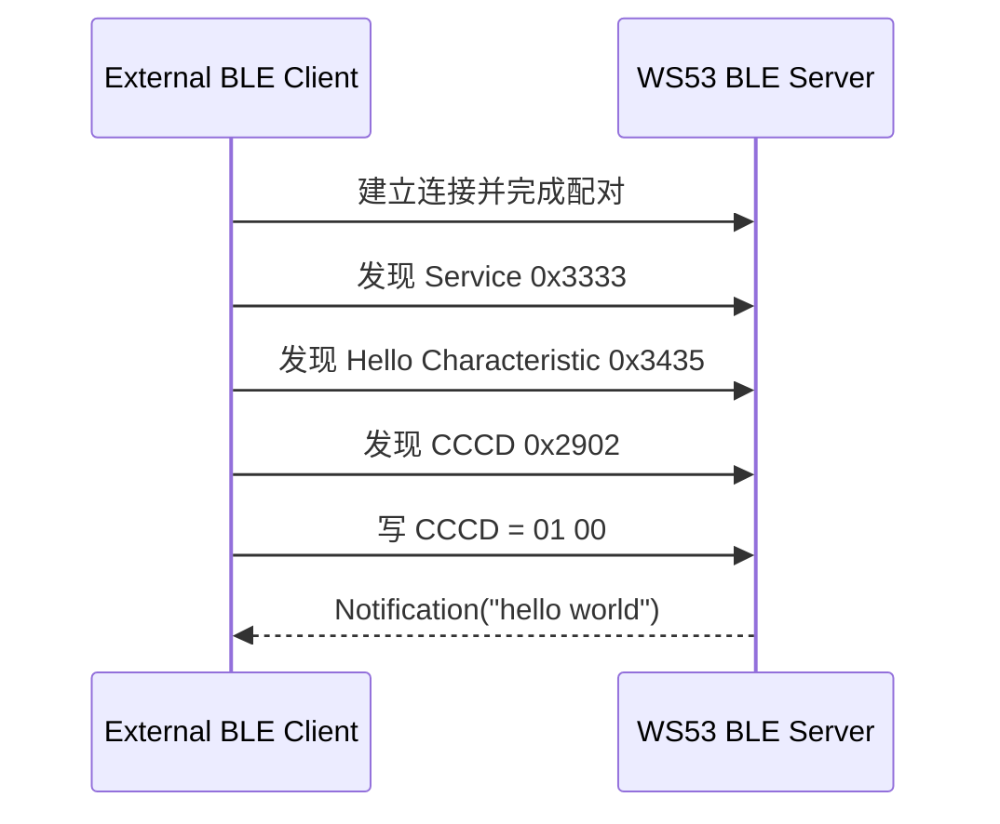

# Hello Notify

> 在 [Hello BLE](./hello-connect.md) 已建立连接的基础上，增加 GATT (Generic Attribute Profile) 服务发现、CCCD (Client Characteristic Configuration Descriptor) 订阅和 Notification 推送。

## 本篇新增内容

- WS53 注册支持 Notification 的 Hello Characteristic 和 CCCD。
- 外部 Client 按 UUID (Universally Unique Identifier) 发现 Service、Characteristic 和 CCCD。
- Client 向 CCCD 写入 `01 00` 开启 Notification。
- WS53 在订阅成功后发送 `hello world`。

广播、连接、公共配置、构建和烧录步骤不在本篇重复说明。三篇 Hello 文档共用 `CONFIG_SAMPLE_SUPPORT_BLE_HELLO_SERVER_SAMPLE`。

## 数据交互流程



连接成功只表示链路已经建立。Client 必须发现目标特征并写入 CCCD，WS53 才会发送 Notification。

## 关键对象

| 对象 | 本案例用途 |
| --- | --- |
| Service UUID `0x3333` | 标识 Hello 服务 |
| Data Characteristic `0x3434` | 供后续读写交互使用 |
| Hello Characteristic `0x3435` | WS53 推送 `hello world` |
| CCCD `0x2902` | Client 写入 `01 00` 开启 Notification |

Notification 不要求对端逐包确认，适合状态变化和周期数据上报；Indication 要求对端确认，可靠性更高，但交互开销更大。

## 源码对应关系

```text
src/application/samples/bt/ble/ble_hello/
└── ble_hello_server/src/ble_hello_server.c
```

重点查看：

- `ble_hello_add_notify_characteristic()`：创建 Hello 特征和 CCCD。
- `ble_hello_handle_cccd_write()`：校验 CCCD 长度和值。
- `ble_hello_server_send_notification()`：发送 `hello world`。

CCCD 仅接受以下两个 little-endian 值：

| 写入值 | 含义 |
| --- | --- |
| `00 00` | 关闭 Notification |
| `01 00` | 开启 Notification |

长度不是 2 字节时返回 `GATT_STATUS_INVALID_ATTRIBUTE_VALUE_LENGTH`，值不为 0 或 1 时返回 `GATT_STATUS_VALUE_NOT_ALLOWED`。

## 操作与验证

按照 [Hello BLE](./hello-connect.md) 配置、编译、烧录并连接 WS53，然后执行：

1. 发现 Service `0x3333`。
2. 在该服务下发现 Hello Characteristic `0x3435`。
3. 找到其 CCCD `0x2902`，写入 `01 00`。
4. 检查 Client 是否收到长度为 11 字节的 `hello world`。

WS53 正常输出：

```text
[ble hello server] hello CCCD enabled
[ble hello server] notification sent: hello world
```

若已经连接但收不到通知，检查写入的是 Hello Characteristic 对应的 CCCD Handle，而不是 Characteristic 声明 Handle 或 Data Characteristic Handle。

## 下一步

[Hello ReadWrite](./hello-readwrite.md) 在相同连接和 GATT 表基础上增加 Client 主动读取和写入。
