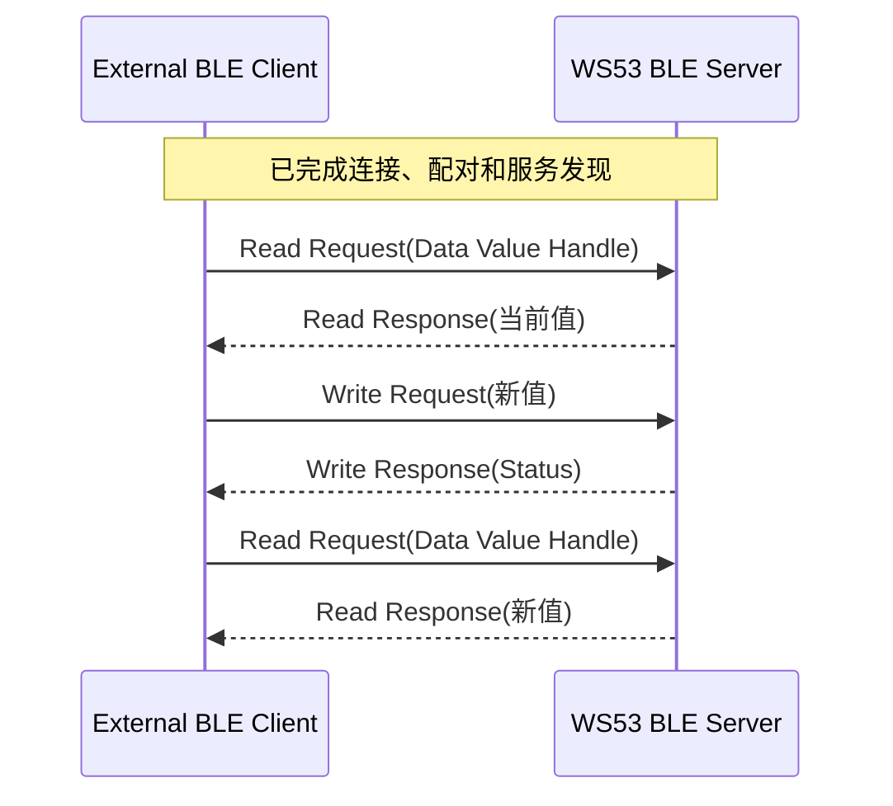

# Hello ReadWrite

> 在 [Hello Notify](./hello-notify.md) 的服务发现和订阅流程上，增加 Client 主动读取和写入 Characteristic。

## 本篇新增内容

- Data Characteristic 提供 Read、Write 属性和相应权限。
- WS53 在读请求回调中返回当前值。
- WS53 在写请求回调中校验 Handle 和长度，再更新 RAM (Random Access Memory) 中的值。
- 外部 Client 按实际 Value Handle 发起读写并处理响应状态。

连接、配对、服务发现、CCCD (Client Characteristic Configuration Descriptor) 和 Notification 流程请参考前两篇。本篇仍使用同一个 `ble_hello` Sample，不需要切换配置项。

## 三种交互方式

| 方式 | 发起方 | 适用场景 |
| --- | --- | --- |
| Notification | WS53 Server | 状态变化和周期数据推送 |
| Read | 外部 Client | 查询版本、状态或当前配置 |
| Write | 外部 Client | 下发参数、控制命令或配置 |

## 数据交互流程



## Data Characteristic

| 项目 | 当前值 |
| --- | --- |
| UUID | `0x3434` |
| 属性 | Read、Write |
| 初始值 | `device_status_ok` |
| 缓冲区大小 | 32 字节 |
| 合法写入长度 | 1～31 字节 |

WS53 不会把远端数据直接当作无界 C 字符串使用。写入前会检查 Handle 和长度，清空本地缓冲区后再复制数据，从而为字符串结束符保留空间。

| 异常情况 | 返回状态 |
| --- | --- |
| 读取或写入错误 Handle | `GATT_STATUS_INVALID_HANDLE` |
| 写入长度为 0 或大于等于 32 字节 | `GATT_STATUS_INVALID_ATTRIBUTE_VALUE_LENGTH` |
| 本地复制失败 | `GATT_STATUS_UNLIKELY_ERROR` |

## 广播状态字节

写入成功后，Sample 会同步更新广播 Service Data 中的状态字节：

| 状态字节 | Data 当前状态 |
| --- | --- |
| `0x00` | 当前值为默认值 `device_status_ok` |
| `0x01` | RAM 中保存了其他写入值 |

状态字节只反映当前运行期间的 RAM 值。WS53 复位后，Data 恢复为默认值。

## 源码对应关系

```text
src/application/samples/bt/ble/ble_hello/
└── ble_hello_server/src/ble_hello_server.c
```

重点查看：

- `ble_hello_read_request_cb()`：校验 Handle 并返回当前 Data。
- `ble_hello_write_request_cb()`：校验写入并更新 RAM 值。
- `ble_hello_send_response()`：发送 GATT 读写响应。

## 操作与验证

按照 [Hello BLE](./hello-connect.md) 配置、编译、烧录并连接 WS53，然后执行：

1. 发现 Service `0x3333` 和 Data Characteristic `0x3434`。
2. 读取 Data，确认返回 `device_status_ok`。
3. 向 Data 写入不超过 31 字节的新值，例如 `new_config_value`。
4. 再次读取 Data，确认返回新值。
5. 尝试写入空数据或 32 字节数据，确认 WS53 拒绝更新。

WS53 正常输出：

```text
[ble hello server] read response sent: value=device_status_ok
[ble hello server] property updated: new_config_value
[ble hello server] write response sent: success
```

该示例只在 RAM 中保存数据，不提供 NV (Non-Volatile) 持久化。只重连 Client 时可以读取当前值；WS53 复位后恢复默认值。
