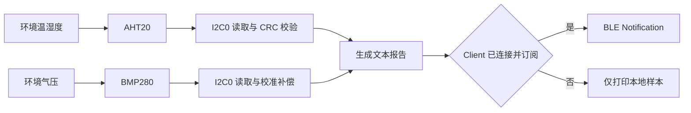
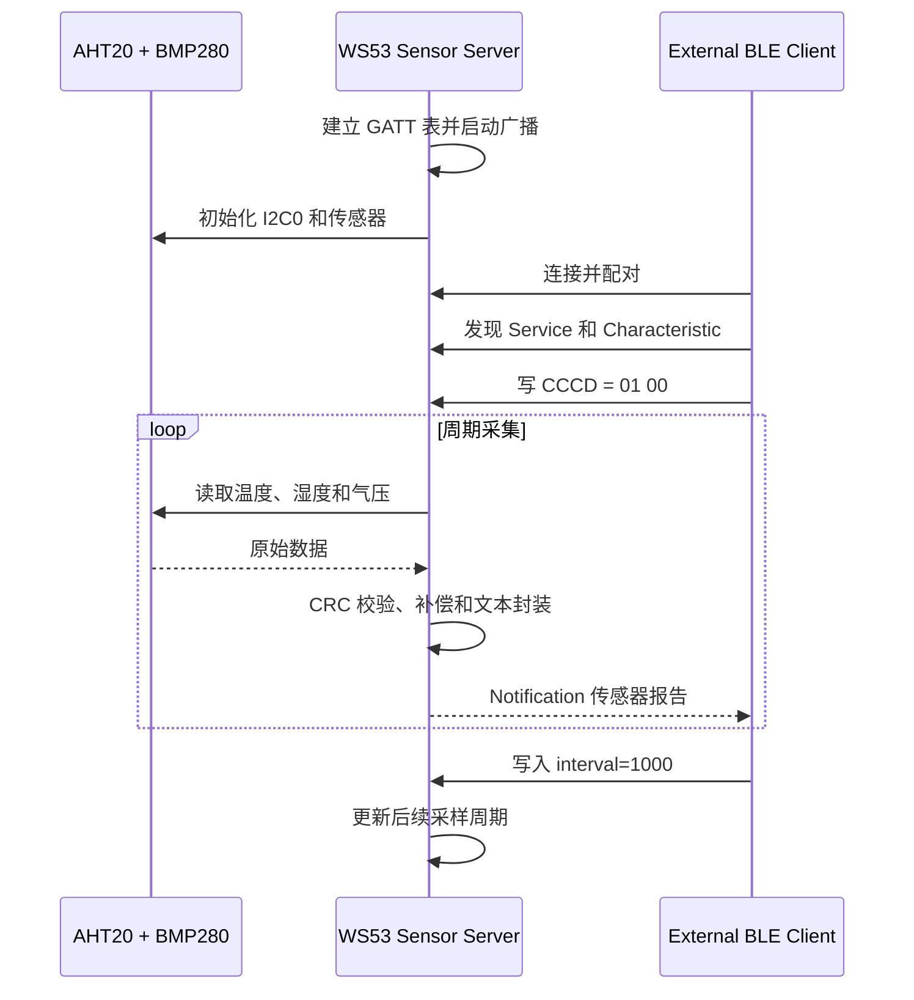

# 传感器上报

> AHT20 温湿度、BMP280 气压采集与 BLE (Bluetooth Low Energy) Notification 周期上报

> 前置阅读：[Hello BLE](../basics/hello-connect.md)、[Hello Notify](../basics/hello-notify.md)、[Hello ReadWrite](../basics/hello-readwrite.md)

## 学习目标

- 理解 AHT20 与 BMP280 共用 I2C 总线的连接和初始化方式
- 理解传感器采集、定点换算、文本封装和 BLE 上报流程
- 掌握 GATT (Generic Attribute Profile) Notification 与 CCCD (Client Characteristic Configuration Descriptor) 的使用方法
- 理解为什么传感器读取应在应用任务中完成，而不是阻塞 BLE 回调
- 能够使用外部 BLE Client 接收报告并修改采样周期

## 规格与功能

WS53 不支持 BLE Central（中心设备）/GATT Client（客户端）功能。本案例将 WS53 作为传感器 Server，由 WS63 Sensor Client、手机或 PC BLE 调试工具承担数据采集 Client。

| 规格项 | WS53 传感器 Server | 外部 Client |
| --- | --- | --- |
| BLE 角色 | Peripheral / GATT Server | Central / GATT Client |
| 设备发现 | 广播 `sensor_node` | 扫描并识别该设备 |
| GATT Service UUID | `0x3333` | 发现 `0x3333` |
| Data Characteristic | `0x3434`，Read / Write | 写入采样周期命令 |
| Report Characteristic | `0x3435`，Notify | 订阅并接收传感器报告 |
| 传感器接口 | I2C0，100 kHz | - |
| I2C 引脚 | SDA=MGPIO22、SCL=MGPIO21、`PIN_MODE_3` | - |
| 传感器 | AHT20、BMP280 | 解析温度、湿度和气压文本 |
| 默认周期 | 1000 ms | 可写入 `interval=1000` |
| 可设置周期 | 200～60000 ms | 通过 Data Characteristic 写入 |
| 传感器异常 | BLE 保持运行，按当前周期重试初始化或读取 | 连接不受影响，但收不到有效报告 |
| 断连行为 | 清除 CCCD 状态并重新广播 | 由 Client 自行重连和订阅 |

程序运行流程：

1. WS53 创建传感器上报任务并初始化 BLE GATT Server。
2. WS53 建立 GATT 服务并广播 `sensor_node`。
3. 应用循环初始化 I2C0、AHT20 和 BMP280，失败时等待当前周期后重试。
4. 外部 Client 连接、配对、发现服务并向 CCCD 写入 `01 00`。
5. WS53 周期读取传感器，生成文本报告并发送 Notification。
6. Client 向 Data Characteristic 写入 `interval=<ms>`，更新后续采样周期。

## 基本概念

### 传感器数据上报链路

一次完整上报包含采集、换算、封装和发送：



传感器读取和本地日志不依赖 BLE 订阅。只有连接已建立且 Client 开启 CCCD 时，WS53 才调用 Notification 接口。

### AHT20 与 BMP280

| 器件 | I2C 地址 | 输出数据 | 驱动处理 |
| --- | --- | --- | --- |
| AHT20 | `0x38` | 温度、相对湿度 | 检查标定状态、触发测量、等待转换、校验 CRC-8、换算物理量 |
| BMP280 | `0x76` 或 `0x77` | 气压、内部温度 | 校验芯片 ID `0x58`、读取校准参数并执行补偿计算 |

AHT20 和 BMP280 地址不同，可以共用 SDA、SCL。驱动会依次探测 BMP280 地址 `0x76` 和 `0x77`。

### 为什么不在 BLE 回调中读取传感器

AHT20 测量需要等待，I2C 访问也可能因接线或总线异常失败。如果在连接或写请求回调中同步读取，会阻塞 BLE 回调链。

本案例在独立任务中循环执行：

```text
初始化或重试传感器 → 读取 AHT20/BMP280 → 生成报告 → 按需发送 Notification → 延时
```

BLE 回调只维护连接、CCCD、读写请求和采样周期状态。

### 上报报文格式

报告使用可读 ASCII 文本：

```text
seq=<序号>,temp=<温度>,hum=<相对湿度>,press=<气压>
```

示例：

```text
seq=33,temp=20.5,hum=58.8,press=1009.5
```

| 字段 | 格式 | 单位 |
| --- | --- | --- |
| `seq` | 递增无符号整数 | - |
| `temp` | 有符号数，保留 1 位小数 | ℃ |
| `hum` | 无符号数，保留 1 位小数 | %RH |
| `press` | 无符号数，保留 1 位小数 | hPa |

文本格式便于直接调试，但带宽效率低于二进制协议。需要紧凑传输时可以参考[网关传感器节点](../verticals/gateway.md)的 14 字节二进制报告。

### GATT 数据通道

| UUID | 属性 | 用途 |
| --- | --- | --- |
| `0x3434` | Read / Write | 读取状态；写入 `interval=<毫秒>` 修改采样周期 |
| `0x3435` | Notify | 周期上报传感器文本 |
| `0x2902` | Read / Write | Client 写入 `01 00` 开启 Notification |

控制数据与周期报告使用不同 Characteristic，避免采样周期命令覆盖通知值，也便于后续扩展控制命令。

## 涉及 API

| API | 用途 |
| --- | --- |
| `uapi_pin_set_mode()` | 将 MGPIO21、MGPIO22 配置为 I2C0 复用功能 |
| `uapi_i2c_master_init()` | 以 100 kHz 初始化 I2C0 主机 |
| `uapi_i2c_master_write()` | 发送 AHT20 命令或写入 BMP280 寄存器 |
| `uapi_i2c_master_read()` | 读取 AHT20 测量结果 |
| `uapi_i2c_master_writeread()` | 读取 BMP280 寄存器数据 |
| `gatts_add_service_sync()` | 创建 Sensor Service |
| `gatts_add_characteristic_sync()` | 创建 Data 和 Report Characteristic |
| `gatts_add_descriptor_sync()` | 创建 Notification CCCD |
| `gatts_notify_indicate()` | 发送传感器 Notification |
| `gatts_send_response()` | 回复 Data 和 CCCD 读写请求 |

## 案例说明

### 案例流程



### 源码对应关系

| 内容 | 源码位置 |
| --- | --- |
| Sample 入口和上报循环启动 | `src/application/samples/bt/ble/ble_sensor_report/ble_sensor_report.c` |
| GATT、连接、CCCD 和周期控制 | `ble_sensor_report_server/src/ble_sensor_report_server.c` |
| 广播数据和参数 | `ble_sensor_report_server/src/ble_sensor_report_server_adv.c` |
| AHT20、BMP280 和 I2C0 驱动 | `ble_sensor_report_server/src/aht20_bmp280.c` |
| Sample 配置 | `src/application/samples/bt/ble/Kconfig` |

## 案例操作指导

### 第一步：连接传感器

准备 WS53 开发板、AHT20、BMP280 和杜邦线：

| 传感器信号 | WS53 | 说明 |
| --- | --- | --- |
| VCC | 3.3 V | 使用 3.3 V 供电 |
| GND | GND | 模块与开发板共地 |
| SDA | MGPIO22 | I2C0 数据线，`PIN_MODE_3` |
| SCL | MGPIO21 | I2C0 时钟线，`PIN_MODE_3` |

模块与开发板均断电后再接线，以模块 PCB 丝印为准，不要只根据排线颜色判断。

### 第二步：配置案例

```ini
CONFIG_SAMPLE_ENABLE=y
CONFIG_ENABLE_BT_SAMPLE=y
CONFIG_SAMPLE_SUPPORT_BLE_SAMPLE=y
CONFIG_SAMPLE_SUPPORT_BLE_SENSOR_REPORT_SERVER_SAMPLE=y
```

BLE Sample 使用 Kconfig `choice` 互斥选择，同一固件中只能启用一个 BLE 示例。

### 第三步：编译和烧录

```powershell
fbb build ws53-liteos-app
fbb flash ws53-liteos-app
```

### 第四步：连接并订阅

1. 复位 WS53，检查传感器初始化和 `sensor_node` 广播。
2. 使用 WS63 Sensor Client 或 BLE 调试工具连接 WS53。
3. 发现 Service `0x3333` 和 Report Characteristic `0x3435`。
4. 向 Report 对应的 CCCD `0x2902` 写入 `01 00`。

### 第五步：验证报告和周期设置

Client 应周期收到类似内容：

```text
seq=33,temp=20.5,hum=58.8,press=1009.5
```

向 Data Characteristic `0x3434` 写入：

```text
interval=1000
```

WS53 正常输出：

```text
[ble sensor report server] sensor initialized: I2C0 SDA=GPIO22 SCL=GPIO21
[ble sensor report server] sensor sample: seq=33,temp=20.5,hum=58.8,press=1009.5
[ble sensor report server] report interval updated: 1000 ms
```

传感器数值会随环境变化。判断案例是否成功，应关注传感器初始化、BLE 连接、CCCD 订阅和 Notification 接收状态，不应依赖固定读数或固定 Handle。

## 关键配置

### I2C 与传感器

| 配置项 | 当前值 | 说明 |
| --- | --- | --- |
| I2C 控制器 | I2C0 | AHT20 和 BMP280 共用 |
| SDA | MGPIO22，`PIN_MODE_3` | I2C0 数据线 |
| SCL | MGPIO21，`PIN_MODE_3` | I2C0 时钟线 |
| 总线速率 | 100 kHz | 标准模式 |
| AHT20 地址 | `0x38` | 固定地址 |
| BMP280 地址 | 自动探测 `0x76`、`0x77` | 兼容不同模块配置 |

修改引脚或 I2C 控制器时，需要同步调整引脚复用、总线编号和硬件接线。

### 采样周期

默认周期为 1000 ms。Data Characteristic 接受以下命令：

```text
interval=<毫秒>
```

只接受 200～60000 范围内的十进制整数。格式错误、含非数字字符或超出范围时保留原周期。

| 周期范围 | 适用场景 | 影响 |
| --- | --- | --- |
| 200～1000 ms | 变化较快、需要及时显示 | I2C 与无线活动频繁，功耗较高 |
| 1000～10000 ms | 常规环境监测 | 响应速度和功耗较均衡 |
| 10000～60000 ms | 缓慢变化或低功耗采集 | 数据更新较慢，平均功耗较低 |

### GATT 配置

| 对象 | UUID | 关键属性 |
| --- | --- | --- |
| Sensor Service | `0x3333` | Primary Service |
| Data Characteristic | `0x3434` | Read、Write |
| Report Characteristic | `0x3435` | Notify |
| Report CCCD | `0x2902` | Read、Write |

Notification 不要求对端逐包确认。产品要求每条数据均被对端确认时，需要改用 Indication 或在应用协议中增加确认和重传机制。

## 代码详解

### 1. 传感器初始化

`aht20_bmp280_init()` 配置 I2C0 后初始化 AHT20，并依次探测 BMP280 地址 `0x76`、`0x77`。AHT20 和 BMP280 均就绪后才生成完整环境样本。

初始化失败不会终止 BLE Server。上报循环等待当前周期后重新调用初始化，串口输出 `sensor init pending`。

### 2. AHT20 数据读取

AHT20 流程如下：

```text
发送测量命令 → 等待转换 → 读取 7 字节 → 检查 Busy 位 → 校验 CRC-8 → 换算温湿度
```

### 3. BMP280 数据读取

驱动读取 BMP280 的校准参数和原始温度、气压值，先计算 `t_fine`，再执行 64 位定点气压补偿，最终得到 Pa。原始值无效、补偿分母为 0 或 I2C 读取失败时，本轮采样不会发送无效报告。

### 4. 报告生成与周期更新

上报循环将定点温度、湿度和气压格式化为一位小数的文本。序号递增并跳过 0；未连接或 CCCD 未使能时仍完成本地采样，但不发送 Notification。

写请求回调解析 `interval=<ms>`，检查数字格式、整数范围和允许区间。合法值从后续循环开始生效，无需重启设备或 BLE 连接。

## 常见问题

- 提示 AHT20 初始化失败：检查 3.3 V、GND、SDA 和 SCL 接线，确认 SDA 为 MGPIO22、SCL 为 MGPIO21。
- 提示 `BMP280 not found`：确认模块包含 BMP280；驱动会自动探测 `0x76` 和 `0x77`。
- 能采样但收不到 Notification：确认 Client 已连接目标设备并成功写入 Report CCCD。
- 写入周期后没有变化：确认命令是完整 ASCII 文本，数值处于 200～60000 ms。
- 传感器未接但 BLE 仍能连接：这是预期行为，WS53 会保持 Server 运行并周期重试传感器。
- 数据带宽占用较大：文本格式便于调试；需要紧凑传输时使用二进制报告格式。
