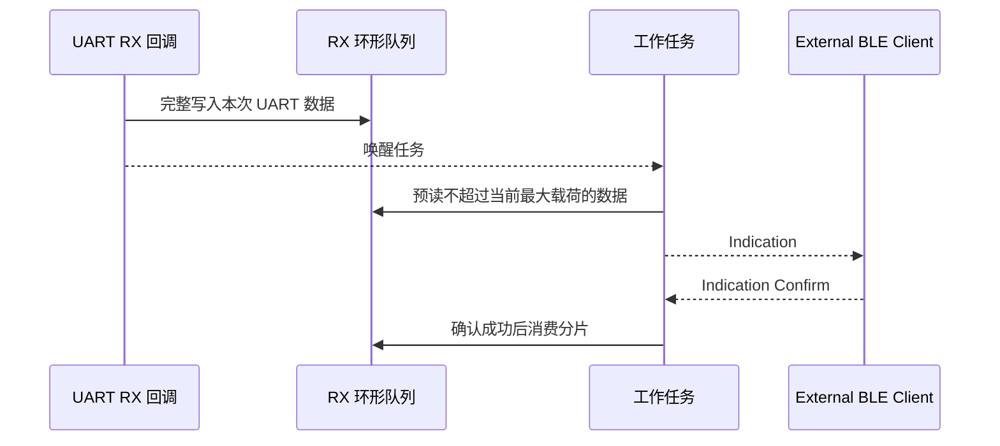

# UART 透传

> BLE (Bluetooth Low Energy) GATT (Generic Attribute Profile) Indication、Write Request 与 UART (Universal Asynchronous Receiver/Transmitter) 双向数据桥接

> 前置阅读：[Hello BLE](../basics/hello-connect.md)、[Hello Notify](../basics/hello-notify.md)、[Hello ReadWrite](../basics/hello-readwrite.md)

## 学习目标

- 理解 UART 字节流与 BLE 属性数据包之间的差异
- 掌握 WS53 UART_H1 的接线、初始化和中断接收方式
- 理解使用环形队列将 UART 回调、BLE 回调和工作任务解耦的方法
- 理解 ATT MTU、分片、Indication 确认和背压处理
- 能够使用外部 BLE Client 验证 UART_H1 与 BLE 的双向透传

## 规格与功能

WS53 不支持 BLE Central（中心设备）/GATT Client（客户端）功能。本案例将 WS53 作为透传 Server，由 WS63 BLE UART Bridge Client、手机或 PC BLE 调试工具承担 Client。

| 规格项 | WS53 透传 Server | 外部 Client |
| --- | --- | --- |
| BLE 角色 | Peripheral / GATT Server | Central / GATT Client |
| 设备发现 | 广播 `uart1_bridge` | 扫描并识别该设备 |
| GATT Service UUID | `0x4444` | 发现 `0x4444` |
| Data Characteristic | `0x4545`，Read / Write / Write Without Response | 写入需要通过 UART 输出的数据 |
| UART Indication Characteristic | `0x4546`，Indicate | 订阅并接收 UART 输入数据 |
| UART 接口 | UART_H1，MGPIO12 TX、AGPIO4 RX | 根据 Client 平台确定 |
| UART 参数 | 115200 bit/s、8 数据位、1 停止位、无校验、无流控 | - |
| UART 工作方式 | 中断接收，不使用 DMA | - |
| 软件环形队列 | RX、TX 各 640 字节存储，有效容量各 639 字节 | - |
| 目标 ATT MTU | 247 字节 | 需要支持并完成协商 |
| 单个 BLE 分片 | 最大 244 字节 | 同左 |
| 断连行为 | 重新广播并保留尚未确认的数据 | 由 Client 自行恢复连接和订阅 |

程序运行流程：

1. WS53 初始化 UART_H1、事件信号量、双向环形队列和 BLE Server。
2. WS53 建立 GATT 服务并广播 `uart1_bridge`。
3. 外部 Client 连接、配对、协商 MTU、发现服务并向 CCCD 写入 `02 00`。
4. WS53 先发送 `uart_from_peripheral` 握手 Indication；收到确认后才开放 UART 数据发送通道。
5. UART_H1 收到数据后写入 RX 队列，工作任务按当前 MTU 分片发送 Indication。
6. Client 向 Data Characteristic 写入数据后，WS53 将数据写入 TX 队列，再由工作任务输出到 UART_H1。
7. UART 数据 Indication 只有确认成功后才消费 RX 队列；失败或断连时保留数据并重试。

## 基本概念

### UART 字节流与 BLE 数据包

UART 提供连续字节流。发送方一次写入多少字节，不代表接收回调会一次返回相同长度；串口空闲、驱动缓冲区状态和任务调度都可能改变回调分段。

BLE GATT 以具有明确长度的属性操作传输数据。ATT MTU 为 247 时，扣除 3 字节协议开销，本案例每个分片最多承载 244 字节。

| 对比项 | UART | BLE GATT |
| --- | --- | --- |
| 数据模型 | 连续字节流 | 有长度的数据包 |
| 单次边界 | 不保证与发送调用一致 | 每个属性操作有明确长度 |
| 速度约束 | 波特率和帧格式 | 连接参数、MTU 和协议栈队列 |
| 拥塞表现 | 驱动或软件队列溢出 | API 返回忙、失败或等待确认 |
| 本案例处理 | 写入环形队列 | 取出不超过当前 MTU 限制的分片 |

透传表示保持字节内容和顺序，不表示 UART 的每次写调用与 Client 的每次接收回调一一对应。验证长数据时应比较总长度和完整内容，而不是比较回调次数。

### 双向数据路径


UART 到 BLE 方向使用 Indication；BLE 到 UART 方向使用 Write Request 或 Write Without Response。Client 使用 Write Without Response 时不会收到 ATT 写响应，仍需在应用层自行判断业务是否成功。

### 为什么使用两个环形队列

UART 和 BLE 回调由驱动或协议栈触发，不适合执行长时间阻塞操作。本案例使用两个独立队列：

| 队列 | 生产者 | 消费者 | 保存的数据 |
| --- | --- | --- | --- |
| UART RX 队列 | UART 接收回调 | BLE 工作任务 | 等待发给 Client 的数据 |
| UART TX 队列 | BLE 写回调 | UART 工作任务 | 等待写入 UART_H1 的数据 |

每个队列使用“保留一个空槽”的方式区分队空和队满，因此 640 字节数组的有效容量为 639 字节。只有当前数据能够完整写入时才更新队列头指针；空间不足时整段拒绝，避免消费者读取到半段数据。

### Indication 确认

同一时刻只保留一个在途 UART 数据分片。工作任务预读队列数据并发送 Indication，收到确认成功回调后才推进队列尾指针。

Client 向 CCCD 写入 `02 00` 后，Server 会先发送 20 字节 ASCII 握手消息 `uart_from_peripheral`。该握手使用同一个 `0x4546` Indication Characteristic，但不属于 UART RX 队列数据；Server 收到握手确认前不会发送队列中的 UART 数据。Client 应识别并确认该消息，再开始校验透传载荷。



Indication 确认只表示 Client 协议栈接收了当前分片，不表示 Client 应用或外部 UART 设备已经处理数据。产品需要端到端可靠性时，应增加序号、确认和重传协议。

### 缓冲、背压与溢出

环形队列可以吸收短时间突发数据，但不能无限提高 BLE 链路吞吐量。本案例采用以下策略：

- RX 或 TX 队列空间不足时整段拒绝，并累计丢弃帧数和字节数。
- BLE 提交或确认失败时不消费 RX 队列，短暂退避后重试。
- UART 驱动拒绝写入时保留数据；部分写入时只消费实际写入的字节。
- UART、BLE 状态和发送完成事件通过信号量唤醒工作任务，队列为空时任务阻塞等待。

持续 UART 输入速率高于 BLE 实际传输速率时，最终仍会出现 `UART RX/TX queue overflow`。

## 涉及 API

| API | 用途 |
| --- | --- |
| `uapi_pin_set_mode()` | 配置 UART_H1 引脚复用 |
| `uapi_uart_init()` | 以 115200 8N1 初始化 UART_H1 |
| `uapi_uart_register_rx_callback()` | 注册 UART 接收回调 |
| `uapi_uart_write()` | 将 BLE 接收数据写入 UART_H1 |
| `osal_sem_init()` / `osal_sem_up()` / `osal_sem_down()` | 在回调和工作任务之间传递事件 |
| `gap_ble_register_callbacks()` | 注册连接和配对回调 |
| `gatts_register_callbacks()` | 注册 GATT Server 读写、MTU 和 Indication 确认回调 |
| `gatts_set_mtu_size()` | 设置 Server 接收 MTU 上限 |
| `gatts_exchange_mtu_req()` | 连接后请求 MTU 交换 |
| `gatts_add_service_sync()` | 创建 UART Bridge Service |
| `gatts_add_characteristic_sync()` | 创建 Data 和 UART Indication Characteristic |
| `gatts_add_descriptor_sync()` | 创建 Indication CCCD |
| `gatts_notify_indicate()` | 发送 UART 数据 Indication |

## 案例说明

### GATT 服务

| 对象 | UUID | 属性 | 用途 |
| --- | --- | --- | --- |
| UART Bridge Service | `0x4444` | Primary Service | 标识透传服务 |
| Data Characteristic | `0x4545` | Read、Write、Write Without Response | Client 向 WS53 发送 UART 数据 |
| UART Indication Characteristic | `0x4546` | Indicate | WS53 向 Client 发送 UART 数据 |
| CCCD | `0x2902` | Read、Write | 写入 `02 00` 开启 Indication |

### 源码对应关系

| 内容 | 源码位置 |
| --- | --- |
| 应用入口、UART 初始化、双环形队列和工作任务 | `src/application/samples/bt/ble/ble_uart_bridge/ble_uart_bridge.c` |
| 公共最大载荷和跨模块接口 | `src/application/samples/bt/ble/ble_uart_bridge/ble_uart_bridge.h` |
| GATT Server 逻辑 | `ble_uart_bridge_server/src/ble_uart_bridge_server.c` |
| 广播数据和参数 | `ble_uart_bridge_server/src/ble_uart_bridge_server_adv.c` |
| Sample 配置 | `src/application/samples/bt/ble/Kconfig` |

## 案例操作指导

### 第一步：连接 UART_H1

准备 WS53 开发板、3.3 V USB-TTL 模块和杜邦线：

| USB-TTL | WS53 | 说明 |
| --- | --- | --- |
| TXD | 板上 pin 4 / AGPIO4 | UART_H1 RX |
| RXD | 板上 pin 12 / MGPIO12 | UART_H1 TX |
| GND | GND | 两端必须共地 |

WS53 由自身 USB 接口供电时，不需要连接 USB-TTL 的 VCC。不要连接 USB-TTL 的 5 V 或 3.3 V 电源脚，也不要将 5 V TTL 信号接入 WS53。

开发板调试串口用于烧录和日志，外接 USB-TTL 用于 UART_H1 透传数据，两类端口用途不同。

### 第二步：配置案例

```ini
CONFIG_SAMPLE_ENABLE=y
CONFIG_ENABLE_BT_SAMPLE=y
CONFIG_SAMPLE_SUPPORT_BLE_SAMPLE=y
CONFIG_SAMPLE_SUPPORT_BLE_UART_BRIDGE_SERVER_SAMPLE=y
```

该选项自动选择 `UART_SUPPORT_LPM`。为了保持 UART 连续接收，Sample 会持有 sleep veto，功耗高于允许深睡的应用。

BLE Sample 使用 Kconfig `choice` 互斥选择，同一固件中只能启用一个 BLE 示例。

### 第三步：编译和烧录

```powershell
fbb build ws53-liteos-app
fbb flash ws53-liteos-app
```

### 第四步：建立 BLE 通道

1. 复位 WS53，确认 UART_H1 初始化和 `uart1_bridge` 广播日志。
2. 使用 WS63 BLE UART Bridge Client 或 BLE 调试工具连接 WS53。
3. 完成配对和 MTU 协商。
4. 发现 Service `0x4444`、Data `0x4545` 和 UART Indication `0x4546`。
5. 向 `0x4546` 对应的 CCCD 写入 `02 00`。
6. 确认 Client 首先收到 20 字节 ASCII 握手消息 `uart_from_peripheral`，并完成 Indication 确认。

```text
[ble uart bridge] UART_H1 ready: IRQ mode, RX queue=639, TX queue=639, no DMA, UART_H1 TX=MGPIO12 RX=AGPIO4 mode2 115200 8N1
[ble uart bridge server] ATT MTU updated: 247
[ble uart bridge server] UART RX indication CCCD enabled
```

### 第五步：验证双向透传

从 USB-TTL 向 WS53 发送：

```text
WS53_H1_TO_BLE_OK
```

完成握手后，Client 应通过 Indication 收到与 UART 输入相同的字节。再由 Client 向 `0x4545` 写入：

```text
uart_from_central
```

USB-TTL 应收到相同字节，WS53 输出：

```text
[ble uart bridge server] BLE write queued to UART TX: bytes=17
```

## 关键配置

| 参数 | 当前值 | 影响 |
| --- | --- | --- |
| UART 波特率 | 115200 bit/s | 外部串口必须使用相同参数 |
| UART RX/TX 队列 | 各 639 字节有效容量 | 只能吸收有限突发数据 |
| 目标 ATT MTU | 247 字节 | 协商成功时最大载荷为 244 字节 |
| CCCD | `02 00` | 开启 Indication；`00 00` 关闭 |
| 初始握手 | `uart_from_peripheral`，20 字节 | 开启 CCCD 后首先发送；确认完成前暂停 UART 队列发送 |
| BLE 提交失败退避 | 短暂退避后重试 | 保留未确认数据 |

当前固定 BLE 地址可能与其他 Sample 冲突。量产应用应使用唯一地址或通过 NV (Non-Volatile) 配置地址。

## 代码详解

### 1. UART 回调与工作任务

UART RX 回调只把完整数据写入 RX 环形队列并唤醒工作任务。工作任务根据连接、CCCD 和 MTU 状态决定是否发送下一包 Indication，不在中断回调中调用耗时的 BLE 流程。

### 2. BLE 写入到 UART

GATT 写回调先区分 CCCD Handle 和 Data Handle。Data 数据能够完整进入 TX 队列时才返回成功；随后工作任务调用 `uapi_uart_write()`，并按驱动实际接受的字节数推进队列。

### 3. 断连恢复

断连时 Sample 清除连接、CCCD 和当前 MTU 状态，将在途 Indication 标记为失败但不消费数据，然后重新广播。Client 重连并再次订阅后，工作任务可以继续发送保留的数据。

## 常见问题

- 扫描不到 `uart1_bridge`：确认固件启用了 UART Bridge Server Sample，并检查 WS53 是否输出广播启动日志。
- 已连接但收不到 UART 数据：确认 Client 已向 `0x4546` 对应的 CCCD 写入 `02 00`。
- USB-TTL 没有输出：检查 TX/RX 是否交叉连接、是否共地以及串口参数是否为 115200 8N1。
- 只能单向传输：分别检查 `0x4545` 写入和 `0x4546` Indication 订阅。
- 出现 queue overflow：降低持续输入速率、增加应用层流控，或扩大队列并重新评估 RAM 占用。
- MTU 未达到 247：实际分片会按协商结果缩小，不应假设每包始终为 244 字节。
