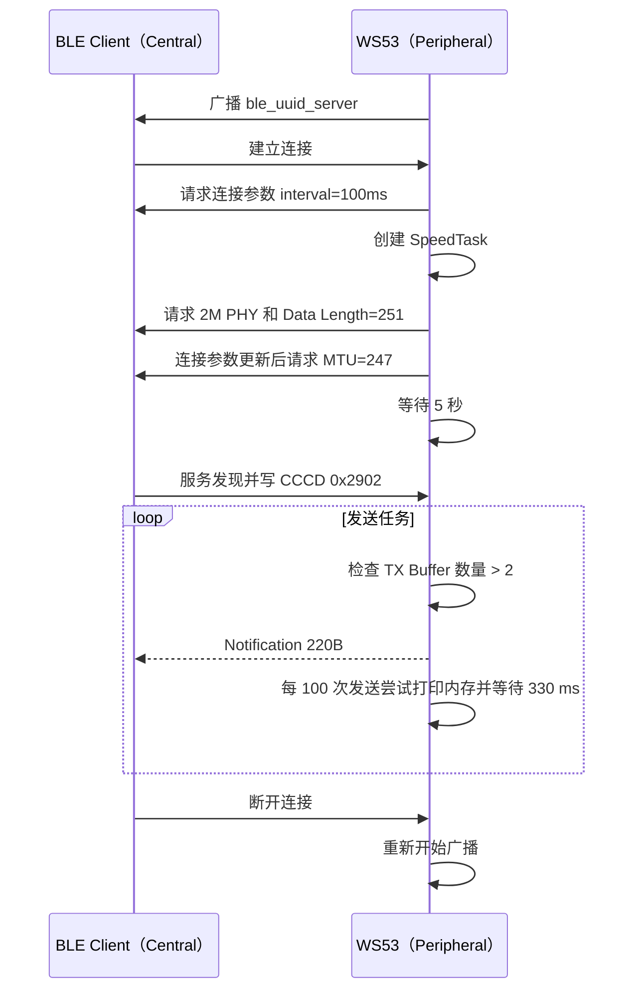

# BLE 高吞吐传输

WS53 作为 BLE Peripheral（外设）建立 GATT Server。默认启用 `CONFIG_BLE_SPEED_TEST` 时，设备在连接建立后通过 Notification 持续向 BLE Central（中心设备）发送测试数据；关闭该配置后，案例切换为 Write Without Response 到 Indication 的回环模式。

WS53 不支持 BLE Central（中心设备）/GATT Client（客户端）功能，验证本案例需要使用 WS63 Speed Client、手机、PC 或其他支持 GATT Client 的外部设备。

## 学习目标

- 理解 PHY、Data Length Extension、MTU 和连接参数对吞吐量的影响。
- 掌握 WS53 高吞吐 Server 的 Service、Characteristic 和 CCCD 配置。
- 使用 BLE Client 订阅 Notification，验证 220 字节数据包和递增序号。
- 区分默认吞吐模式与可选回环模式的特征属性和数据方向。
- 区分 WS53 当前实现与理想高吞吐参数，正确解读测试结果。

## 基本概念

### 默认吞吐数据经过哪些层


MTU 决定 GATT 层一次可承载的数据大小，Data Length 决定链路层数据包上限，PHY 决定空口速率。三者不会自动保证应用吞吐量，连接间隔、协议栈缓存、对端能力和射频环境同样重要。

### WS53 源码参数

| 参数 | 源码值 | 说明 |
| --- | --- | --- |
| PHY | TX/RX 均请求 `GAP_BLE_PHY_2M` | `gap_ble_set_phy()` 请求 2M，最终值取决于协商 |
| Data Length | `251` 字节 | `maxtxoctets` |
| Data Length 时间 | `2000` µs | `maxtxtime` |
| ATT MTU | `247` 字节 | 连接参数更新回调中请求 |
| 连接间隔 | `0x50` | BLE 单位为 1.25 ms，即 100 ms |
| 从机延迟 | `0` | 不跳过连接事件 |
| 监督超时 | `0x1f4` | BLE 单位为 10 ms，即 5 s |
| 应用数据包 | `220` 字节 | `DATA_LEN` |

WS53 源码请求的连接间隔是 100 ms，并不是 WS63 通用说明中的 7.5 ms；实际参数仍取决于对端是否接受，因此不能直接套用 WS63 的理论吞吐量。

### Notification 与 CCCD

Client 必须在 CCCD（UUID `0x2902`）中写入 Notification Enable。WS53 在连接成功回调中创建发送任务，任务完成 PHY 和 Data Length 请求后等待 5 秒，再开始循环发送。源码不会检查 CCCD 是否已经使能，因此 Client 应在这段等待时间内完成服务发现和订阅。

## 广播：让 Client 找到测试设备

| 位置 | 内容 |
| --- | --- |
| 广播包 | 通用广播标志、Appearance（Keyboard）、完整设备名 `ble_uuid_server` |
| 扫描响应 | Tx Power，源码配置值为 `0` |
| 扫描响应 | 完整设备名 `ble_uuid_server` |

广播间隔范围为 `0x30`～`0x60`。BLE 广播间隔单位为 0.625 ms，因此对应 30～60 ms；广播持续时间为永久。源码设置的测试本地地址为 `11:22:33:63:88:63`，地址类型为 Public。

## GATT Service 设计

| 项目 | UUID / 属性 | 用途 |
| --- | --- | --- |
| Service | `0xABCD` | 吞吐测试服务 |
| Report Characteristic | `0xCDEF` | 承载吞吐数据或回环数据 |
| 吞吐模式属性 | Read、Notify、Write Without Response | 持续发送 Notification；写入仅记录日志，不回传 |
| 回环模式属性 | Read、Indicate、Write Without Response | 将 Client 写入的数据通过 Indication 原样返回 |
| CCCD | `0x2902` | 吞吐模式开启 Notification；回环模式开启 Indication |

源码通过 `gatts_notify_indicate_by_uuid()` 按 UUID 查找 `0xCDEF`，Client 不需要依赖固定 Attribute Handle。

## 数据格式

默认吞吐模式下，每个 Notification 固定为 220 字节：

| 偏移 | 长度 | 内容 |
| --- | --- | --- |
| `0` | 2 字节 | 发送序号，大端序，范围 `0`～`99`，循环递增 |
| `2` | 218 字节 | 吞吐测试填充数据 |

`data` 是全局数组，除序号外没有写入特定模式，因此剩余字节初始为 `0`。序号到 99 后回到 0，不能作为全局唯一 ID。

关闭 `CONFIG_BLE_SPEED_TEST` 后，不再使用上述固定格式。Client 应先向 CCCD 写入 `02 00` 开启 Indication，再向 `0xCDEF` 执行 Write Without Response；Server 将收到的有效载荷按原长度和内容通过 `0xCDEF` Indication 返回。

## 默认吞吐模式发送流程



`SpeedTask` 只在首次连接时创建一次，并持续运行。断开连接后源码重新开始广播；再次连接时更新全局连接句柄，已有发送任务继续工作，不会重复创建任务。

## 涉及 API

| API | 阶段 | 用途 |
| --- | --- | --- |
| `enable_ble()` | 初始化 | 使能 BLE |
| `gap_ble_register_callbacks()` | 初始化 | 注册连接、配对和连接参数回调 |
| `gatts_register_callbacks()` | 初始化 | 注册服务启动、读写请求和 MTU 回调 |
| `gatts_register_server()` | 初始化 | 注册 GATT Server |
| `gatts_add_service_sync()` | 初始化 | 添加 `0xABCD` Service |
| `gatts_add_characteristic_sync()` | 初始化 | 添加 `0xCDEF` Characteristic |
| `gatts_add_descriptor_sync()` | 初始化 | 添加 CCCD |
| `gap_ble_set_adv_data()` | 广播 | 设置广播和扫描响应 |
| `gap_ble_start_adv()` | 广播 | 开始广播 |
| `gap_ble_set_phy()` | 连接后 | 请求 2M PHY |
| `gap_ble_set_data_length()` | 连接后 | 设置 Data Length=251 |
| `gap_ble_connect_param_update()` | 连接后 | 请求连接参数 |
| `gatts_exchange_mtu_req()` | 参数回调 | 请求 MTU=247 |
| `gatts_notify_indicate_by_uuid()` | 发送任务 | 按 UUID 发送 Notification |
| `gatts_notify_indicate()` | 回环模式 | 按 Handle 返回 Indication |
| `ble_get_tx_number_by_handle()` | 发送任务 | 查询发送缓存数量 |

## 案例说明

设备启动后广播 `ble_uuid_server`。首次建立连接后，Server 创建发送任务；任务请求 2M PHY 和 251 字节 Data Length，连接参数更新回调请求 247 字节 MTU。任务随后等待 5 秒，为 Client 发现 `0xCDEF` 并写入 CCCD 预留时间。协议栈 TX Buffer 数量大于 2 时，任务尝试发送一包 220 字节 Notification；每进行 100 次发送尝试，打印一次内存状态并等待 330 ms。源码没有根据 Notification 接口的返回值回退序号或发送计数，因此接收端可能观察到序号跳变。

| 规格项 | WS53 实现 |
| --- | --- |
| 角色 | Peripheral / GATT Server |
| Service / Characteristic | `0xABCD` / `0xCDEF` |
| 单包长度 | 220 字节 |
| 序号 | 0～99 循环，大端序 |
| PHY / Data Length / MTU | 请求 2M / 251 字节 / 247 字节 |
| 连接间隔 | 请求 100 ms |
| 发送任务启动条件 | 首次建立连接 |
| 发送前等待 | 5 秒，用于服务发现和 CCCD 订阅 |
| 流控条件 | `ble_get_tx_number_by_handle() > 2` |
| 周期退避 | 每 100 次发送尝试等待 330 ms |
| 断开行为 | 重新广播；已创建的发送任务继续运行 |

## 案例操作指导

### 第一步：配置案例

```text
CONFIG_SAMPLE_ENABLE=y
CONFIG_ENABLE_BT_SAMPLE=y
CONFIG_SAMPLE_SUPPORT_BLE_SAMPLE=y
CONFIG_SAMPLE_SUPPORT_BLE_SPEED_SERVER_SAMPLE=y
CONFIG_BLE_SPEED_TEST=y
```

`CONFIG_BLE_SPEED_TEST=y` 选择本文主要说明的持续 Notification 吞吐模式。将其设为 `n` 时，`0xCDEF` 切换为 Write Without Response/Indication 回环模式，Client 和验证步骤也需要相应调整。

### 第二步：编译和烧录

```bash
fbb build ws53-liteos-app
fbb flash ws53-liteos-app
```

完整步骤请参考[快速入门](../../../get-started/quick-start.md)。

### 第三步：连接和订阅

1. 打开串口日志，确认出现 `init status:0x0` 和广播启动成功回调。
2. 使用支持配对和自定义 GATT 操作的 BLE Client 扫描 `ble_uuid_server`。
3. 建立连接并完成配对。
4. 发现 Service `0xABCD` 和 Characteristic `0xCDEF`。
5. 写入 CCCD `0x2902` 的 Notification Enable 值 `01 00`。
6. 确认串口出现：

```text
start send notify info.
```

### 第四步：验证数据

1. 检查每包长度是否为 220 字节。
2. 检查前两个字节的序号是否在 0～99 之间循环。
3. 统计 Client 实际接收的应用数据字节数和持续时间，计算 `接收字节数 × 8 ÷ 秒数`。该结果是应用层有效载荷吞吐率，不是包含 ATT、链路层和空口开销的物理层速率。
4. 每进行 100 次 Notification 发送尝试，串口会打印一次内存使用情况，并暂停发送约 330 ms；该日志不表示 Client 已成功接收 100 包。
5. 对比不同 Client、距离和 PHY 协商结果时，应记录实际连接参数，而不是只记录源码请求值。

### 第五步：断开和重连

断开后源码调用 `gap_ble_start_adv()` 重新广播。发送任务不会退出或重复创建；重新连接后全局连接句柄更新，任务也不会再次等待 5 秒。Client 需要尽快重新完成 CCCD 订阅，订阅完成前的发送尝试不会形成有效的应用接收数据。

## 关键配置

`CONFIG_BLE_SPEED_TEST` 是 Kconfig 模式开关；其余参数固定定义在 `ble_speed_server.c` 中：

| 宏 | 值 | 作用 |
| --- | --- | --- |
| `CONFIG_BLE_SPEED_TEST` | `y` | `y` 为持续 Notification；`n` 为 Write/Indication 回环 |
| `DATA_LEN` | `220` | 单个数据包长度 |
| `SEND_PKT_CNT` | `100` | 发送尝试计数和内存日志周期 |
| `DEFAULT_BLE_SPEED_MTU_SIZE` | `247` | 请求 MTU |
| `GAP_MAX_TX_OCTETS` | `251` | 请求 Data Length |
| `GAP_MAX_TX_TIME` | `2000` | 请求 TX 时间（µs） |
| `WAIT_DISCOVERY_MS` | `5000` | 开始持续发送前的等待时间（ms） |
| `FLOW_CONTROL_TIME_MS` | `330` | 每 100 包后的退避时间（ms） |
| `SPEED_DEFAULT_CONN_INTERVAL` | `0x50` | 连接间隔（100 ms） |
| `SPEED_DEFAULT_SLAVE_LATENCY` | `0` | 从机延迟 |
| `SPEED_DEFAULT_TIMEOUT_MULTIPLIER` | `0x1f4` | 监督超时（5 s） |
| `BLE_SPEED_TASK_PRIO` | `26` | 初始化任务优先级；`SpeedTask` 实际设置为 `27` |
| `BLE_SPEED_STACK_SIZE` | `0x2000` | 初始化任务和发送任务栈大小 |

## 代码详解

### 文件结构

```text
src/application/samples/bt/ble/ble_speed_server/
├── inc/
│   ├── ble_speed_server.h       # UUID、属性和发送接口
│   └── ble_speed_server_adv.h   # 广播结构和参数
├── src/
│   ├── ble_speed_server.c       # GATT Server、回调和发送任务
│   ├── ble_speed_server_adv.c   # 广播包和扫描响应
│   └── CMakeLists.txt
└── CMakeLists.txt
```

### GATT Service 创建

```c
stream_data_to_uuid(BLE_UUID_UUID_SERVER_SERVICE, &service_uuid);
gatts_add_service_sync(BLE_UUID_SERVER_ID, &service_uuid, true, &handle);
stream_data_to_uuid(BLE_UUID_UUID_SERVER_REPORT, &server_uuid);
character.properties = UUID_SERVER_PROPERTIES;
gatts_add_characteristic_sync(server_id, srvc_handle, &character, &result);
stream_data_to_uuid(BLE_UUID_CLIENT_CHARACTERISTIC_CONFIGURATION, &ccc_uuid);
gatts_add_descriptor_sync(server_id, srvc_handle, &descriptor, &handle);
```

`ccc_uuid` 是栈上定义的 `bt_uuid_t` 对象，其 `uuid` 成员是结构体内嵌数组。当前源码在添加 CCCD 后直接结束函数，不会对 `ccc_uuid.uuid` 执行释放操作。

### 链路参数设置

吞吐模式下，连接参数回调请求 MTU，发送任务请求 PHY 和 Data Length：

```c
gap_ble_set_phy(&phy_param);
gap_ble_set_data_length(&data_param);
gatts_exchange_mtu_req(conn_id, DEFAULT_BLE_SPEED_MTU_SIZE);
```

这些 API 是协商请求，最终值需要 Client 和控制器共同支持。

### 发送循环和流控

```c
while (1) {
    data[0] = (i >> 8) & 0xFF;
    data[1] = i & 0xFF;
    uint8_t buffer_num = ble_get_tx_number_by_handle(g_conn_hdl);
    if (buffer_num > 2) {
        i++;
        ble_uuid_server_send_report_by_uuid(data, DATA_LEN);
    }
    if (i == SEND_PKT_CNT) {
        i = 0;
        /* 打印内存状态 */
        osal_msleep(FLOW_CONTROL_TIME_MS);
    }
}
```

发送循环不等待单包 Notification 完成，也不检查发送接口返回值；每进行 100 次发送尝试会主动等待 330 ms。实际应用层有效载荷吞吐率由该退避策略、协议栈缓存、连接参数、对端能力和射频环境共同决定。
