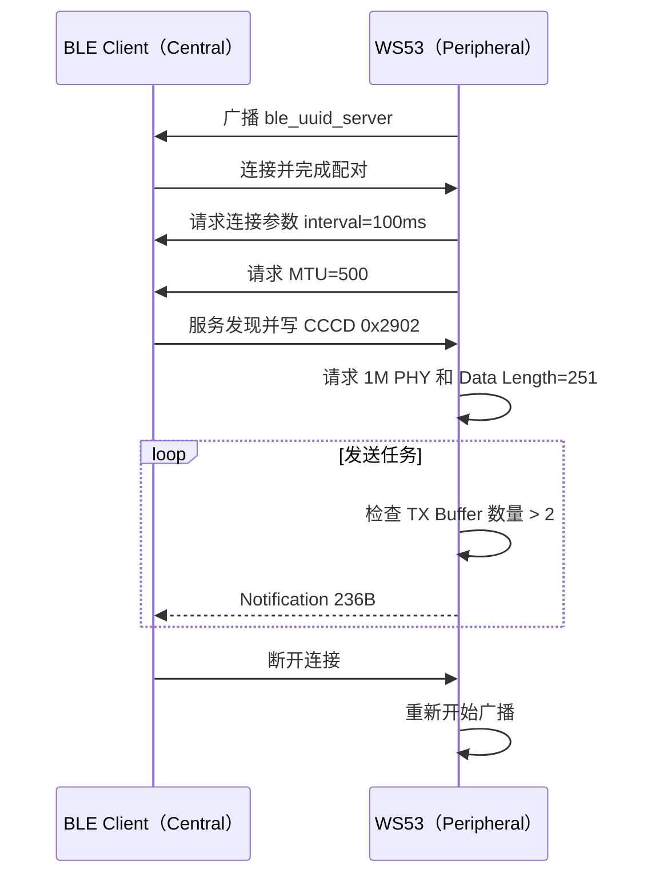

# BLE 高吞吐传输

WS53 作为 BLE Peripheral（外设）建立 GATT Server，连接并配对成功后，通过 Notification 持续向 BLE Central（中心设备）发送测试数据。

## 学习目标

- 理解 PHY、Data Length Extension、MTU 和连接参数对吞吐量的影响。
- 掌握 WS53 高吞吐 Server 的 Service、Characteristic 和 CCCD 配置。
- 使用 BLE Client 订阅 Notification，验证 236 字节数据包和递增序号。
- 区分 WS53 当前实现与理想高吞吐参数，正确解读测试结果。

## 基本概念

### 数据经过哪些层


MTU 决定 GATT 层一次可承载的数据大小，Data Length 决定链路层数据包上限，PHY 决定空口速率。三者不会自动保证应用吞吐量，连接间隔、协议栈缓存、对端能力和射频环境同样重要。

### WS53 源码参数

| 参数 | 源码值 | 说明 |
| --- | --- | --- |
| PHY | TX/RX 均请求 `1` | `gap_ble_set_phy()` 明确请求 1M，最终值取决于协商 |
| Data Length | `251` 字节 | `maxtxoctets` |
| Data Length 时间 | `2200` µs | `maxtxtime` |
| ATT MTU | `500` 字节 | 连接参数更新回调中请求 |
| 连接间隔 | `0x50` | BLE 单位为 1.25 ms，即 100 ms |
| 从机延迟 | `0` | 不跳过连接事件 |
| 监督超时 | `0x1f4` | BLE 单位为 10 ms，即 5 s |
| 应用数据包 | `236` 字节 | `DATA_LEN` |

WS53 的连接间隔是 100 ms，并不是 WS63 通用说明中的 7.5 ms，因此不能直接套用 WS63 的理论吞吐量。

### Notification 与 CCCD

Client 必须在 CCCD（UUID `0x2902`）中写入 Notification Enable。WS53 的发送任务在配对成功回调中启动；配对成功不等于 Notification 已订阅。

## 广播：让 Client 找到测试设备

| 位置 | 内容 |
| --- | --- |
| 广播包 | 通用广播标志、Appearance（Keyboard） |
| 扫描响应 | Tx Power，源码配置值为 `0` |
| 扫描响应 | 完整设备名 `ble_uuid_server` |

广播间隔范围为 `0x30`～`0x60`，对应 18.75～37.5 ms，持续时间为永久。源码设置的测试本地地址为 `11:22:33:63:88:63`，地址类型为 Public。

## GATT Service 设计

| 项目 | UUID / 属性 | 用途 |
| --- | --- | --- |
| Service | `0xABCD` | 吞吐测试服务 |
| Report Characteristic | `0xCDEF` | Client 读取或订阅测试数据 |
| Characteristic Property | Read、Notify | 支持读取当前值和持续通知 |
| CCCD | `0x2902` | Client 开启 Notification |

源码通过 `gatts_notify_indicate_by_uuid()` 按 UUID 查找 `0xCDEF`，Client 不需要依赖固定 Attribute Handle。

## 数据格式

每个 Notification 固定为 236 字节：

| 偏移 | 长度 | 内容 |
| --- | --- | --- |
| `0` | 2 字节 | 发送序号，大端序，范围 `0`～`99`，循环递增 |
| `2` | 234 字节 | 吞吐测试填充数据 |

`data` 是全局数组，除序号外没有写入特定模式，因此剩余字节初始为 `0`。序号到 99 后回到 0，不能作为全局唯一 ID。

## 数据发送流程



源码在 `pair_result_cbk` 收到成功状态后创建 `SpeedTask`，不是在单纯建立连接时开始发送。

## 涉及 API

| API | 阶段 | 用途 |
| --- | --- | --- |
| `enable_ble()` | 初始化 | 使能 BLE |
| `gap_ble_register_callbacks()` | 初始化 | 注册连接、配对、MTU 和参数回调 |
| `gatts_register_server()` | 初始化 | 注册 GATT Server |
| `gatts_add_service_sync()` | 初始化 | 添加 `0xABCD` Service |
| `gatts_add_characteristic_sync()` | 初始化 | 添加 `0xCDEF` Characteristic |
| `gatts_add_descriptor_sync()` | 初始化 | 添加 CCCD |
| `gap_ble_set_adv_data()` | 广播 | 设置广播和扫描响应 |
| `gap_ble_start_adv()` | 广播 | 开始广播 |
| `gap_ble_set_phy()` | 连接后 | 请求 1M PHY |
| `gap_ble_set_data_length()` | 连接后 | 设置 Data Length=251 |
| `gap_ble_connect_param_update()` | 连接后 | 请求连接参数 |
| `gatts_exchange_mtu_req()` | 参数回调 | 请求 MTU=500 |
| `gatts_notify_indicate_by_uuid()` | 发送任务 | 按 UUID 发送 Notification |
| `ble_get_tx_number_by_handle()` | 发送任务 | 查询发送缓存数量 |

## 案例说明

设备启动后广播 `ble_uuid_server`。配对成功后，Server 创建发送任务；任务请求 1M PHY 和 251 字节 Data Length，连接参数更新回调请求 500 字节 MTU。Client 还需要发现 `0xCDEF` 并写入 CCCD 才能接收 Notification。协议栈 TX Buffer 数量大于 2 时，任务尝试发送一包 236 字节 Notification。

| 规格项 | WS53 实现 |
| --- | --- |
| 角色 | Peripheral / GATT Server |
| Service / Characteristic | `0xABCD` / `0xCDEF` |
| 单包长度 | 236 字节 |
| 序号 | 0～99 循环，大端序 |
| PHY / Data Length / MTU | 请求 1M / 251 字节 / 500 字节 |
| 连接间隔 | 100 ms |
| 发送启动条件 | 配对成功 |
| 流控条件 | `ble_get_tx_number_by_handle() > 2` |
| 断开行为 | 重新广播 |

## 案例操作指导

### 第一步：配置案例

```text
CONFIG_ENABLE_BT_SAMPLE=y
CONFIG_SAMPLE_SUPPORT_BLE_SAMPLE=y
CONFIG_SAMPLE_SUPPORT_BLE_SPEED_SERVER_SAMPLE=y
```

### 第二步：编译和烧录

```bash
fbb build ws53-liteos-app
fbb flash ws53-liteos-app
```

完整步骤请参考[快速入门](../../../get-started/quick-start.md)。

### 第三步：连接和订阅

1. 打开串口日志，确认出现 `init ok` 和 `adv ok`。
2. 使用支持配对和自定义 GATT 操作的 BLE Client 扫描 `ble_uuid_server`。
3. 建立连接并完成配对。
4. 发现 Service `0xABCD` 和 Characteristic `0xCDEF`。
5. 写入 CCCD `0x2902` 的 Notification Enable 值 `01 00`。
6. 确认串口出现：

```text
start send notify info.
```

### 第四步：验证数据

1. 检查每包长度是否为 236 字节。
2. 检查前两个字节的序号是否在 0～99 之间循环。
3. 统计接收字节数和持续时间，计算 `接收字节数 × 8 ÷ 秒数`。
4. 每发送 100 个数据包，串口会打印一次内存使用情况。
5. 对比不同 Client、距离和 PHY 协商结果时，应记录实际连接参数，而不是只记录源码请求值。

### 第五步：断开和重连

断开后源码调用 `gap_ble_start_adv()` 重新广播。重新连接并配对成功后，发送任务再次启动。

## 关键配置

以下参数在 `ble_speed_server.c` 中固定，没有单独的 Kconfig 项：

| 宏 | 值 | 作用 |
| --- | --- | --- |
| `DATA_LEN` | `236` | 单个数据包长度 |
| `SEND_PKT_CNT` | `100` | 内存日志周期 |
| `DEFAULT_BLE_SPEED_MTU_SIZE` | `500` | 请求 MTU |
| `GAP_MAX_TX_OCTETS` | `251` | 请求 Data Length |
| `GAP_MAX_TX_TIME` | `2200` | 请求 TX 时间（µs） |
| `SPEED_DEFAULT_CONN_INTERVAL` | `0x50` | 连接间隔（100 ms） |
| `SPEED_DEFAULT_SLAVE_LATENCY` | `0` | 从机延迟 |
| `SPEED_DEFAULT_TIMEOUT_MULTIPLIER` | `0x1f4` | 监督超时（5 s） |
| `BLE_SPEED_TASK_PRIO` | `26` | 发送任务优先级 |
| `BLE_SPEED_STACK_SIZE` | `0x2000` | 发送任务栈大小 |

## 代码详解

### 文件结构

```text
src/application/samples/bt/ble/ble_speed_server/
├── inc/
│   ├── ble_speed_server.h       # UUID、属性和发送接口
│   └── ble_speed_server_adv.h   # 广播结构和参数
├── src/
│   ├── ble_speed_server.c       # GATT Server、回调和发送任务
│   ├── ble_speed_server_adv.c   # 广播包和扫描响应
│   └── CMakeLists.txt
└── CMakeLists.txt
```

### GATT Service 创建

```c
stream_data_to_uuid(BLE_UUID_UUID_SERVER_SERVICE, &service_uuid);
gatts_add_service_sync(BLE_UUID_SERVER_ID, &service_uuid, true, &handle);
stream_data_to_uuid(BLE_UUID_UUID_SERVER_REPORT, &server_uuid);
character.properties = UUID_SERVER_PROPERTIES;
gatts_add_characteristic_sync(server_id, srvc_handle, &character, &result);
stream_data_to_uuid(BLE_UUID_CLIENT_CHARACTERISTIC_CONFIGURATION, &ccc_uuid);
gatts_add_descriptor_sync(server_id, srvc_handle, &descriptor, &handle);
```

### 链路参数设置

连接参数回调请求 MTU，发送任务请求 PHY 和 Data Length：

```c
gap_ble_set_phy(&phy_param);
gap_ble_set_data_length(&data_param);
gatts_exchange_mtu_req(conn_id, DEFAULT_BLE_SPEED_MTU_SIZE);
```

这些 API 是协商请求，最终值需要 Client 和控制器共同支持。

### 发送循环和流控

```c
while (1) {
    data[0] = (i >> 8) & 0xFF;
    data[1] = i & 0xFF;
    uint8_t buffer_num = ble_get_tx_number_by_handle(g_conn_hdl);
    if (buffer_num > 2) {
        i++;
        ble_uuid_server_send_report_by_uuid(data, DATA_LEN);
    }
}
```

发送任务不会主动 sleep 或等待 Notification 完成，实际速率由协议栈缓存、连接事件和对端能力共同决定。

## 源码修正要求

`ble_uuid_server_add_descriptors()` 在创建 CCCD 后调用 `osal_vfree(ccc_uuid.uuid)`，但 `bt_uuid_t::uuid` 是结构体内嵌数组，并非独立动态分配对象。该调用存在非法释放风险；进行持续吞吐测试前，应先在源码中移除这次释放并完成回归验证。
