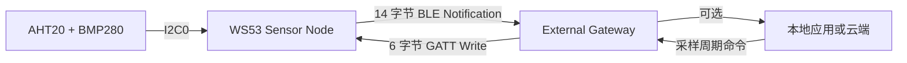
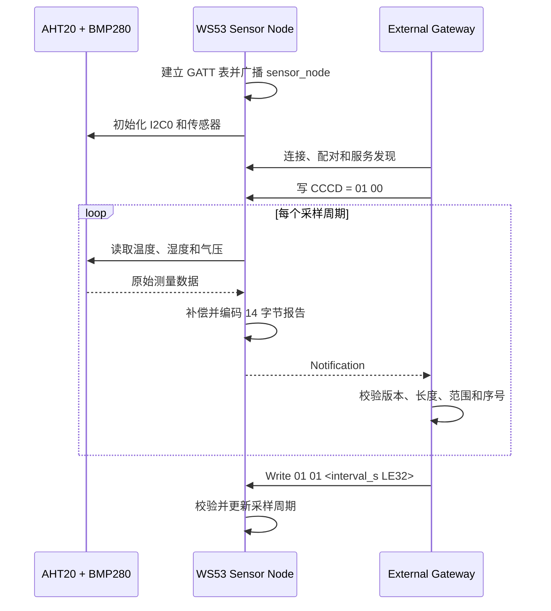

# BLE 网关传感器节点

> AHT20 + BMP280 → WS53 BLE (Bluetooth Low Energy) Sensor Node → 外部 Gateway，支持二进制环境数据上报和采样周期回写

> 前置阅读：[Hello Notify](../basics/hello-notify.md) 和[传感器上报](../data-comm/sensor-report.md)

WS53 不支持 BLE Central（中心设备）/GATT Client（客户端）功能。本案例仅实现网关场景中的 Sensor Node Server：采集温度、湿度和气压，通过 BLE 向外部 Gateway 上报。Gateway 可使用 WS63 配套 Client 或其他支持 GATT Client 的设备实现。

## 学习目标

- 完成 AHT20、BMP280 共用 I2C0 总线的数据采集
- 理解文本传感器报告与固定长度二进制协议的取舍
- 掌握 14 字节环境报告的 little-endian 编解码方式
- 理解 Gateway 如何通过 GATT Write 回写采样周期
- 能够验证传感器采集、Notification 上报和周期更新

## 基本概念

### 为什么 Sensor Node 需要 Gateway

Sensor Node 负责传感器采集和低功耗近距离通信，不直接承担 Wi-Fi、云端鉴权或 MQTT 等 IP 网络功能。Gateway 在 BLE 与上层网络之间完成协议转换。



WS53 仓库不提供 Gateway Client、Wi-Fi 桥接或云端上报实现。外部 Gateway 接收报告后的存储、JSON 转换、网络上传和安全认证由其应用自行完成。

### 二进制环境报告

Sensor Node 每次发送固定 14 字节报告：

| 偏移 | 长度 | 字段 | 编码与单位 |
| --- | --- | --- | --- |
| 0 | 1 | `version` | 协议版本，当前为 1 |
| 1 | 1 | `node_id` | 节点 ID，当前固定为 1 |
| 2 | 4 | `sequence` | 递增序号，little-endian |
| 6 | 2 | `temperature_x10` | 有符号温度，单位 0.1 ℃，little-endian |
| 8 | 2 | `humidity_x10` | 相对湿度，单位 0.1%RH，little-endian |
| 10 | 4 | `pressure_pa` | 气压，单位 Pa，little-endian |

协议允许的字段范围：

| 字段 | 范围 |
| --- | --- |
| `node_id` | 必须为 1 |
| `sequence` | 不能为 0 |
| 温度 | -40.0～85.0 ℃ |
| 相对湿度 | 0.0～100.0%RH |
| 气压 | 30000～110000 Pa |

固定长度二进制格式比[传感器上报](../data-comm/sensor-report.md)的 ASCII 文本更紧凑，但 Client 必须严格按偏移、符号位和字节序解析。

### 采样周期命令

Gateway 通过 Data Characteristic 写入固定 6 字节命令：

| 偏移 | 长度 | 字段 | 说明 |
| --- | --- | --- | --- |
| 0 | 1 | `version` | 必须为 1 |
| 1 | 1 | `command` | `1` 表示设置采样周期 |
| 2 | 4 | `interval_s` | 5～3600 秒，little-endian |

设置 10 秒周期的命令为：

```text
01 01 0A 00 00 00
```

WS53 先检查 Handle、长度、协议版本、命令类型和周期范围，只有全部通过后才更新周期并返回成功。

### GATT 数据通道

| 对象 | UUID | 属性 | 用途 |
| --- | --- | --- | --- |
| Environment Service | `0x3333` | Primary Service | 标识环境节点服务 |
| Data Characteristic | `0x3434` | Read、Write | 接收采样周期命令 |
| Report Characteristic | `0x3435` | Notify | 上报 14 字节环境报告 |
| Report CCCD | `0x2902` | Read、Write | Gateway 写入 `01 00` 开启 Notification |

### 端到端流程



## 涉及 API

| API | 用途 |
| --- | --- |
| `uapi_pin_set_mode()` | 配置 MGPIO21、MGPIO22 的 I2C0 复用 |
| `uapi_i2c_master_init()` | 以 100 kHz 初始化 I2C0 |
| `uapi_i2c_master_write()` / `uapi_i2c_master_read()` | 访问 AHT20 |
| `uapi_i2c_master_writeread()` | 读取 BMP280 寄存器 |
| `gatts_register_server()` | 注册 Sensor Node GATT Server |
| `gatts_add_service_sync()` | 创建 Environment Service |
| `gatts_add_characteristic_sync()` | 创建 Data 和 Report Characteristic |
| `gatts_add_descriptor_sync()` | 创建 Report CCCD |
| `gatts_notify_indicate()` | 发送环境报告 Notification |
| `gatts_send_response()` | 回复周期命令写请求 |

## 案例说明

### 功能规格

| 规格项 | 当前实现 |
| --- | --- |
| I2C 总线 | I2C0，SDA=MGPIO22、SCL=MGPIO21、100 kHz |
| 传感器 | AHT20 `0x38`、BMP280 `0x76/0x77` |
| BLE 设备名 | `sensor_node` |
| BLE Service UUID | `0x3333` |
| 报告长度 | 14 字节 |
| 默认节点 ID | 1，不支持运行时修改或持久化 |
| 默认采样周期 | 10 秒 |
| 周期范围 | 5～3600 秒 |
| 连接角色 | WS53 仅作为 Peripheral/GATT Server |

### 源码对应关系

| 内容 | 源码位置 |
| --- | --- |
| Sample 入口 | `src/application/samples/bt/ble/ble_gateway/ble_gateway.c` |
| 二进制协议编解码和范围检查 | `ble_gateway/inc/ble_gateway_protocol.h` |
| GATT Server 和报告循环 | `ble_gateway_server/src/ble_gateway_server.c` |
| AHT20/BMP280 驱动 | `ble_gateway_server/src/ble_gateway_sensor.c` |
| 广播数据和参数 | `ble_gateway_server/src/ble_gateway_server_adv.c` |

## 案例操作指导

### 第一步：连接传感器

| 传感器信号 | WS53 | 说明 |
| --- | --- | --- |
| VCC | 3.3 V | 使用 3.3 V 供电 |
| GND | GND | 必须共地 |
| SDA | MGPIO22 | I2C0 数据线，`PIN_MODE_3` |
| SCL | MGPIO21 | I2C0 时钟线，`PIN_MODE_3` |

模块与开发板均断电后再接线，以模块 PCB 丝印为准。

### 第二步：配置案例

```ini
CONFIG_SAMPLE_ENABLE=y
CONFIG_ENABLE_BT_SAMPLE=y
CONFIG_SAMPLE_SUPPORT_BLE_SAMPLE=y
CONFIG_SAMPLE_SUPPORT_BLE_GATEWAY_SERVER_SAMPLE=y
```

BLE Sample 使用 Kconfig `choice` 互斥选择，同一固件中只能启用一个 BLE 示例。

### 第三步：编译和烧录

```powershell
fbb build ws53-liteos-app
fbb flash ws53-liteos-app
```

### 第四步：验证传感器节点

1. 复位 WS53，确认 AHT20、BMP280 初始化成功并开始广播 `sensor_node`。
2. 使用 WS63 Gateway Client 或 BLE 调试工具连接 WS53。
3. 发现 Service `0x3333` 和 Report Characteristic `0x3435`。
4. 向 Report CCCD 写入 `01 00`。
5. 接收并按协议解析 14 字节报告。

```text
[aht20+bmp280] AHT20 ready, status=0x0c
[aht20+bmp280] BMP280 ready, addr=0x77 id=0x58
[ble environment node] sample ready: node=1 seq=2 temp_x10=301 hum_x10=548 pressure=100984 Pa
```

### 第五步：验证周期回写

向 Data Characteristic `0x3434` 写入：

```text
01 01 14 00 00 00
```

该命令将周期设置为 20 秒。除检查写响应成功外，还应观察后续至少两次样本的间隔是否变为约 20 秒。

## 关键配置

| 参数 | 当前值 | 说明 |
| --- | --- | --- |
| 协议版本 | 1 | Client 必须检查版本再解析 |
| 节点 ID | 1 | 当前只支持单个固定节点 ID |
| 报告长度 | 14 字节 | 长度不符时应拒绝解析 |
| 命令长度 | 6 字节 | 长度、版本或类型错误时 WS53 拒绝执行 |
| 采样周期 | 默认 10 秒，范围 5～3600 秒 | 调小会增加 I2C 和无线活动 |
| 多字节编码 | little-endian | 包括序号、物理量和周期 |

当前协议没有节点 ID 持久化、协议版本协商或多节点连接管理。扩展产品功能时，应新增版本对应的解析分支，不要直接改变现有字段含义。

## 代码详解

### 1. 报告编码

`ble_gateway_encode_report()` 按固定偏移写入报告。温度先转换为 `int16_t` 的补码表示，再按 little-endian 写入；Gateway 解析时需要恢复有符号值。

### 2. 周期命令校验

`ble_gateway_decode_interval_command()` 依次检查数据指针、6 字节长度、版本、命令类型和 5～3600 秒范围。校验通过后才更新上报循环使用的周期。

### 3. 传感器异常恢复

传感器初始化或读取失败时，上报任务保留 BLE Server 并按当前周期重试，不因一次 I2C 错误退出。传感器恢复后可以继续产生报告。

## 常见问题

- AHT20 或 BMP280 初始化失败：检查 3.3 V、共地、MGPIO22/MGPIO21、I2C 上拉和 BMP280 地址。
- 能看到采样日志但收不到报告：确认 Gateway 已连接并成功写入 Report CCCD。
- 报告解析失败：检查长度是否为 14、协议版本是否为 1，以及多字节字段是否按 little-endian 解码。
- 周期命令被拒绝：检查长度是否为 6、命令类型是否为 1、周期是否处于 5～3600 秒。
- 需要上云：WS53 Sample 不包含 Gateway Client、Wi-Fi 或云端代码，需要在外部 Gateway 上实现。
