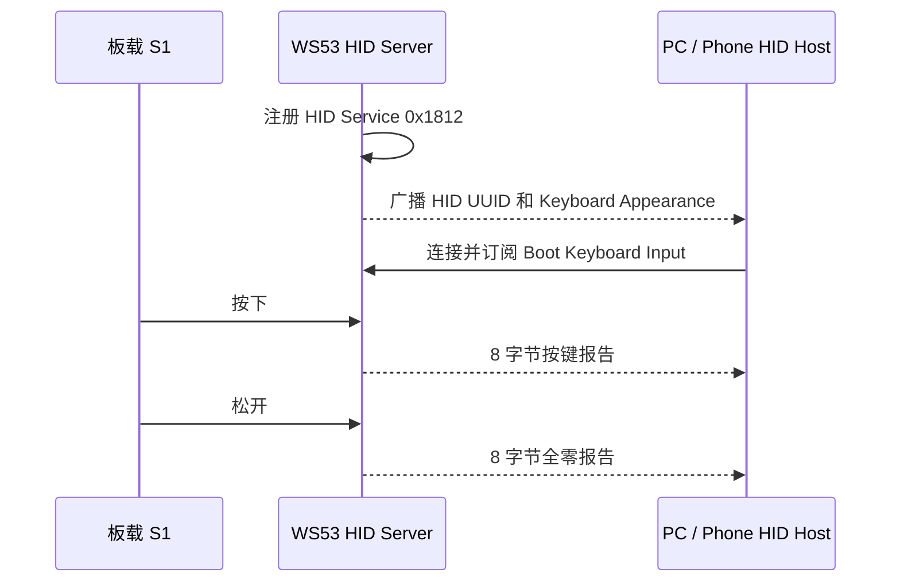
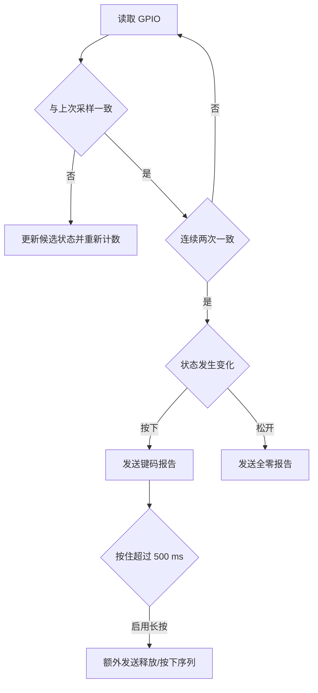

# HID 按键

> GPIO (General Purpose Input/Output) 按键 → BLE (Bluetooth Low Energy) 键盘 — HID (Human Interface Device) over GATT (Generic Attribute Profile) Boot 模式

> 前置阅读：[Hello BLE](../basics/hello-connect.md) 和 [Hello Notify](../basics/hello-notify.md)

## 学习目标

- 理解 HID over GATT 的服务结构和 Boot Keyboard Report 格式
- 掌握 WS53 板载 S1 按键的 GPIO 映射、消抖和长按处理
- 理解按下报告与释放报告必须成对发送的原因
- 能够将 WS53 配置为免驱 BLE 键盘外设并验证 Page Down 输入

## 基本概念

### HID over GATT

BLE HID 通过 GATT 承载。WS53 作为 Peripheral/GATT Server，注册标准 HID Service `0x1812`；PC 或手机作为 Central/GATT Client，发现服务并通过 Notification 接收键盘报告。



WS53 不支持 BLE Central/GATT Client 功能；本案例中的 Client/Host 是外部 PC 或手机。

### HID Service 结构

| Characteristic | UUID | Property | 说明 |
| --- | --- | --- | --- |
| HID Information | `0x2A4A` | Read | HID 1.11、Remote Wake、Normally Connectable |
| HID Control Point | `0x2A4C` | Write Without Response | 注册标准属性；当前未实现 Suspend / Exit Suspend 业务 |
| Protocol Mode | `0x2A4E` | Read、Write Without Response | 注册标准属性；当前按键发送路径固定使用 Boot 模式 |
| Report Map | `0x2A4B` | Read | 68 字节键盘报告描述符 |
| Boot Keyboard Input | `0x2A22` | Read、Notify | 8 字节按键报告，带 CCCD `0x2902` |
| Boot Keyboard Output | `0x2A32` | Read、Write、Write Without Response | 注册标准属性；当前未解析键盘 LED 输出 |

当前 Sample 只完整实现 Boot Keyboard Input Report 的按键发送，不实现复杂组合键、多键同时按下或 Consumer Control Report。HID Control Point、Protocol Mode 和 Boot Keyboard Output 已注册到 GATT 表，但共用写回调尚未按 Handle 分流：任意 1 字节写入都会更新 `g_protocol_mode`，Suspend / Exit Suspend、键盘 LED 输出和完整 Report Mode 发送路径尚未实现。该限制已记录，后续应在源码中保存各可写属性的 Value Handle，并按 Handle 分别校验和处理。

### Boot Keyboard Input Report

输入报告固定为 8 字节：

| 字节 | 字段 | 说明 |
| --- | --- | --- |
| 0 | Modifier | Ctrl、Shift、Alt 等修饰键位图，本 Sample 固定为 0 |
| 1 | Reserved | 固定为 0 |
| 2～7 | Keycodes | 最多 6 个普通键码，本 Sample 只使用第一个 |

默认 Page Down 按下和松开报告：

| 状态 | 报告 |
| --- | --- |
| 按下 | `00 00 4E 00 00 00 00 00` |
| 松开 | `00 00 00 00 00 00 00 00` |

如果只发送按下报告而不发送释放报告，Host 会认为按键仍处于按下状态，可能产生连续输入。

### BLE 广播

广播数据包含：

| AD 字段 | 内容 |
| --- | --- |
| Flags | `0x06` |
| Complete 16-bit Service UUIDs | HID `0x1812` |
| Appearance | Keyboard `0x03C1` |

扫描响应包含 `CONFIG_BLE_HID_DEVICE_NAME`，默认设备名为 `ble_hid_btn`。广播间隔为 20～30 ms，使用 37、38、39 三个广播信道。

### 按键消抖与长按

Sample 每 20 ms 读取一次按键，连续两次读到相同状态后确认变化。默认板载 S1 使用 MGPIO6，高电平有效且不启用内部上下拉。



配置其他 GPIO 时，源码走低电平有效、内部上拉的通用分支，需要结合实际硬件复核电平和上下拉。

## 涉及 API

| API | 用途 |
| --- | --- |
| `enable_ble()` | 启用 BLE 协议栈 |
| `gap_ble_register_callbacks()` | 注册广播和连接状态回调 |
| `gap_ble_set_local_name()` | 设置可发现设备名 |
| `gap_ble_set_adv_data()` | 同时设置 HID 广播数据和扫描响应数据 |
| `gap_ble_set_adv_param()` / `gap_ble_start_adv()` | 配置并启动可连接广播 |
| `gatts_register_server()` | 注册 GATT Server |
| `gatts_add_service_sync()` | 创建 HID Service `0x1812` |
| `gatts_add_characteristic_sync()` | 创建 HID 标准 Characteristic |
| `gatts_add_descriptor_sync()` | 为 Boot Keyboard Input 创建 CCCD |
| `gatts_notify_indicate()` | 发送 8 字节按键报告 |
| `uapi_pin_set_mode()` / `uapi_gpio_set_dir()` | 配置 S1 GPIO 输入 |
| `uapi_gpio_get_val()` | 周期读取按键电平 |

## 案例说明

### 功能规格

| 规格项 | 当前实现 |
| --- | --- |
| BLE 角色 | Peripheral / GATT Server |
| Service UUID | HID `0x1812` |
| 输入报告 | Boot Keyboard Input `0x2A22`，8 字节 |
| 默认按键 | 板载 S1 / MGPIO6，高电平有效 |
| 采样和消抖 | 20 ms 采样，连续 2 次确认 |
| 默认键码 | `0x4E`，Page Down |
| 长按 | 默认开启，超过 500 ms 额外重复一次 |
| 设备名 | `ble_hid_btn`，可通过 Kconfig 修改 |
| 断连行为 | 自动重新广播 |

### 案例流程

1. WS53 注册 HID GATT Server 并启动广播。
2. 按键任务配置板载 S1，开始周期采样和消抖。
3. PC 或手机连接 `ble_hid_btn` 并订阅 Boot Keyboard Input。
4. S1 按下时发送配置键码，松开时发送全零报告。
5. Host 断开后 WS53 重新广播。

### 源码对应关系

| 内容 | 源码位置 |
| --- | --- |
| Sample 入口、GPIO 和按键状态机 | `src/application/samples/bt/ble/ble_hid_btn/src/ble_hid_btn_sample.c` |
| HID GATT Service 和报告发送 | `src/application/samples/bt/ble/ble_hid_btn/src/ble_hid_btn.c` |
| 广播和扫描响应 | `src/application/samples/bt/ble/ble_hid_btn/src/ble_hid_adv.c` |
| 用户配置 | `src/application/samples/bt/ble/ble_hid_btn/Kconfig` |

## 案例操作指导

### 第一步：配置案例

```ini
CONFIG_SAMPLE_ENABLE=y
CONFIG_ENABLE_BT_SAMPLE=y
CONFIG_SAMPLE_SUPPORT_BLE_SAMPLE=y
CONFIG_SAMPLE_SUPPORT_BLE_HID_BTN_SAMPLE=y
CONFIG_BLE_HID_BTN_PIN=6
CONFIG_BLE_HID_BTN_KEYCODE=78
CONFIG_BLE_HID_BTN_LONGPRESS=y
CONFIG_BLE_HID_DEVICE_NAME="ble_hid_btn"
```

BLE Sample 使用 Kconfig `choice` 互斥选择，同一固件中只能启用一个 BLE 示例。

### 第二步：准备硬件

默认配置直接使用 WS53 板载 S1，无需外接按键。S1 映射为逻辑 MGPIO6，对应 `S_MGPIO6` / `pin_t 32`，高电平表示按下。

### 第三步：编译和烧录

```powershell
fbb build ws53_liteos_app
fbb flash ws53_liteos_app
```

### 第四步：验证

1. 在 PC 或手机上搜索并连接 `ble_hid_btn`。
2. 打开能够接收键盘输入或响应 Page Down 的应用。
3. 短按板载 S1，确认应用收到一次 Page Down。
4. 按住 S1 超过 500 ms，检查长按重复行为。
5. 使用通用 GATT 工具时，手动订阅 HID Service `0x1812` 下的 Boot Keyboard Input `0x2A22`。

WS53 正常输出：

```text
[ble_hid_btn_sample] task started, gpio=6 pin_t=32 keycode=0x4E active=high
[ble_hid_btn_sample] press key=0x4E
[ble_hid_btn_sample] release
```

## 关键配置

| 配置项 | 默认值 | 说明 |
| --- | --- | --- |
| `CONFIG_BLE_HID_BTN_PIN` | `6` | 逻辑 MGPIO 编号；6 对应板载 S1 |
| `CONFIG_BLE_HID_BTN_KEYCODE` | `78` | USB HID Usage ID，即 `0x4E` Page Down |
| `CONFIG_BLE_HID_BTN_LONGPRESS` | `y` | 启用一次长按重复 |
| `CONFIG_BLE_HID_DEVICE_NAME` | `ble_hid_btn` | PC 或手机扫描时显示的名称 |

常见 Keyboard Page 键码包括 `0x4B` Page Up、`0x4E` Page Down、`0x2C` Space 和 `0x28` Enter。`0xE9`、`0xEA` 属于 Consumer Page 音量键，不能直接作为普通 Keyboard Page 键码使用。

## 代码详解

### 1. HID Report

`hid_kb_report_t` 固定为 8 字节。按下时将配置键码写入 `keys[0]`，松开时发送全零结构体。`ble_hid_btn_send_report()` 仅在 Host 已连接时调用 `gatts_notify_indicate()`。

### 2. HID Service 注册

`build_hid_service()` 创建 Service `0x1812`，随后依次添加 Protocol Mode、Report Map、Boot Keyboard Input/Output、HID Information 和 HID Control Point。只有 Boot Keyboard Input 带 CCCD，用于发送 Notification。

当前写回调没有区分 Protocol Mode、Boot Keyboard Output 和 HID Control Point 的 Handle，因此这些标准属性仅完成注册，尚未形成完整业务闭环。后续实现需增加 Handle 分流、取值校验、挂起状态、LED 位图处理，以及与 Protocol Mode 对应的发送路径。

### 3. 按键任务

`hid_btn_task()` 配置 GPIO 并以 20 ms 周期采样。`hid_button_update_level()` 完成连续两次确认消抖，`hid_button_handle_state()` 处理按下、松开和长按重复。

### 4. 断连恢复

连接状态回调在 Host 断开后调用 `ble_hid_adv_restart()`，重新等待 PC 或手机连接。

## 常见问题

- 扫描不到设备：确认 Sample 已启用，并检查广播启动日志和设备名配置。
- 已连接但按键无效：确认 Host 已识别 HID Service，或使用 GATT 工具订阅 `0x2A22`。
- 按一次却连续翻页：确认松开时发送了全零报告，并检查按键电平与消抖日志。
- 修改 GPIO 后状态相反：非 MGPIO6 配置默认使用低电平有效和内部上拉，需要按实际电路调整。
- 修改为音量键后无效：当前报告描述符使用 Keyboard Page，不支持直接发送 Consumer Page 键码。
