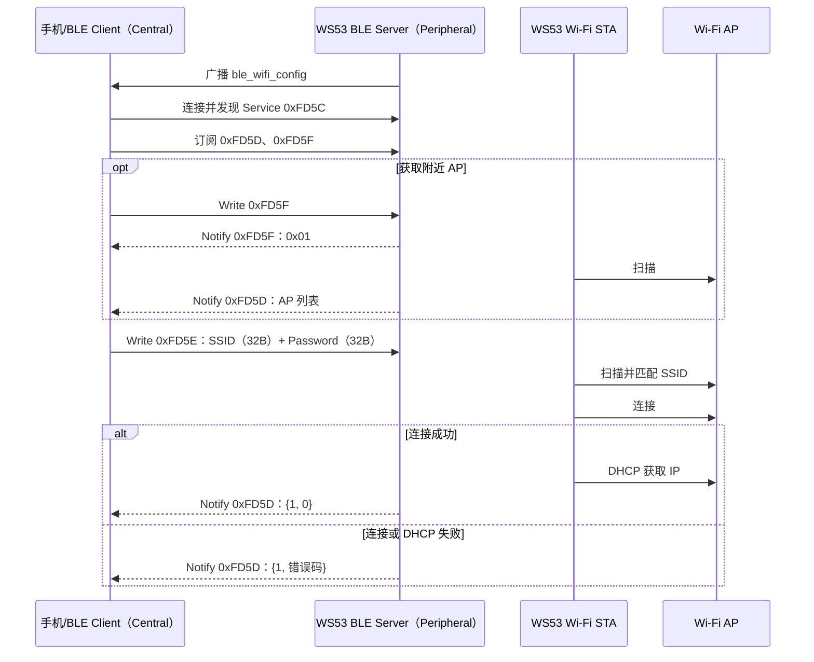
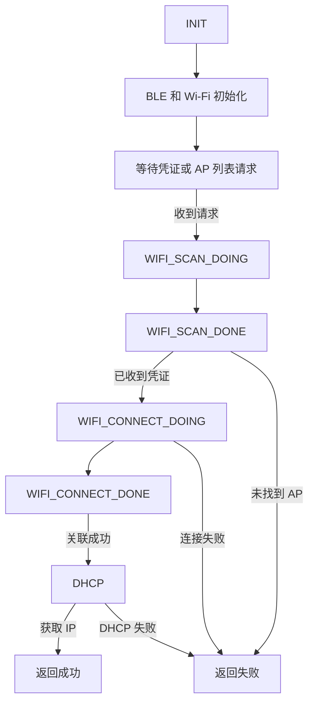

# Wi-Fi 配网

> BLE (Bluetooth Low Energy) GATT (Generic Attribute Profile) 配网服务、Wi-Fi STA 接入与结果回传

> 前置阅读：[Hello BLE](../basics/hello-connect.md)、[Hello Notify](../basics/hello-notify.md)、[Hello ReadWrite](../basics/hello-readwrite.md)

通过 BLE（Bluetooth Low Energy）将手机或其他 BLE Client 下发的 Wi-Fi 凭证传给 WS53。设备收到凭证后扫描并连接目标 AP（Access Point），完成 DHCP（Dynamic Host Configuration Protocol）后，再通过 BLE 返回配网结果。

本案例由 BLE GATT Server 和 Wi-Fi STA 两部分组成，不依赖 GPIO、LED、按键等外设。

## 学习目标

- 理解 BLE Wi-Fi 配网流程：BLE 广播 → Client 连接 → 接收凭证 → 扫描 AP → 连接 Wi-Fi → DHCP → 返回结果。
- 理解配网 Service `0xFD5C` 下三个 Characteristic 的分工。
- 掌握 SSID、密码、AP 列表和配网结果的数据格式。
- 能够在 WS53 上编译、烧录并验证 BLE Wi-Fi 配网案例。

## 基本概念

### 配网流程



WS53 当前示例只执行一次配网任务：不会把凭证保存到 NV，也没有自动重试和下次上电自动连接。重新启动后，设备仍会进入 BLE 广播并等待新的配网数据。

### 广播：让 Client 找到配网设备

WS53 使用可连接、非定向广播，允许任意 Client 扫描和连接。Client 扫描时可以看到：

| 位置 | 内容 |
| --- | --- |
| 广播包 | Flags 和固定厂商数据；源码配置的有效广播长度为 23 字节 |
| 扫描响应 | 发射功率（Tx Power，源码值为 0） |
| 扫描响应 | 完整设备名 `ble_wifi_config` |

广播参数由 `ble_wifi_cfg_adv.c` 配置。设备启动后调用 `ble_wifi_cfg_start_adv()`，广播成功时串口会输出 `Ble Adv State:0`。

### 配网 Service 设计

WS53 作为 GATT Server，注册 Service `0xFD5C`，其中包含三个 Characteristic：

| Characteristic | UUID | Property | 主要方向 | 用途 |
| --- | --- | --- | --- | --- |
| Control Point | `0xFD5D` | Notify、Write Without Response | WS53 → Client | 上报 AP 列表和最终配网结果 |
| Wi-Fi Info | `0xFD5E` | Indicate、Write Without Response | Client → WS53 | 接收 SSID 和密码，共 64 字节 |
| Request / Report | `0xFD5F` | Notify、Write Without Response | 双向 | Client 请求 AP 列表；WS53 先返回请求确认 |

三个 Characteristic 后均添加 CCCD（Client Characteristic Configuration Descriptor，UUID `0x2902`）。Client 在接收 Notify 或 Indicate 前，应写入对应 CCCD 完成订阅。

### 配网状态

源码使用 `g_bgwc_state` 记录 Wi-Fi 处理状态：



| 状态 | 含义 |
| --- | --- |
| `CONFIG_DEMO_INIT` | 任务初始状态 |
| `CONFIG_DEMO_WIFI_INIT` | Wi-Fi STA 已进入待配置状态 |
| `CONFIG_DEMO_WIFI_SCAN_DOING` | 预留的扫描中状态，当前源码未显式赋值 |
| `CONFIG_DEMO_WIFI_SCAN_DONE` | AP 扫描完成 |
| `CONFIG_DEMO_WIFI_CONNECT_DOING` | 正在连接目标 AP |
| `CONFIG_DEMO_WIFI_CONNECT_DONE` | 连接事件已经返回 |
| `CONFIG_DEMO_WIFI_DHCP_DONE` | 预留的 DHCP 完成状态，当前源码未显式赋值 |

### 错误码

设备通过 `0xFD5D` 返回两个字节：第一个字节固定为 `1`，表示 Wi-Fi 状态；第二个字节是结果码。

| 错误码 | 含义 |
| --- | --- |
| `0` | 成功 |
| `1` | 未找到 SSID |
| `2` | 密码错误 |
| `3` | DHCP 失败 |
| `4` | Beacon 丢失，通常表示链路质量较差或 AP 离线 |
| `5` | 其他错误 |

## 涉及 API

| API | 调用阶段 | 用途 | 头文件 |
| --- | --- | --- | --- |
| `enable_ble()` | 初始化 | 使能 BLE | `bts_device_manager.h` |
| `gatts_register_server()` | 初始化 | 注册 GATT Server | `bts_gatt_server.h` |
| `gatts_add_service_sync()` | 初始化 | 添加 `0xFD5C` Service | `bts_gatt_server.h` |
| `gatts_add_characteristic_sync()` | 初始化 | 添加三个 Characteristic | `bts_gatt_server.h` |
| `gatts_add_descriptor_sync()` | 初始化 | 为 Characteristic 添加 CCCD | `bts_gatt_server.h` |
| `gatts_notify_indicate_by_uuid()` | 数据上报 | 通过 `0xFD5D` 上报 AP 列表或配网结果 | `bts_gatt_server.h` |
| `gatts_notify_indicate()` | 请求确认 | 按 Handle 返回 AP 列表请求确认 | `bts_gatt_server.h` |
| `gap_ble_register_callbacks()` | 初始化 | 注册广播和连接状态回调 | `bts_le_gap.h` |
| `gap_ble_set_adv_data()` | 广播配置 | 设置广播包和扫描响应 | `bts_le_gap.h` |
| `gap_ble_start_adv()` | 启动 | 开始 BLE 广播 | `bts_le_gap.h` |
| `wifi_sta_enable()` | 初始化 | 使能 Wi-Fi STA | `wifi_hotspot.h` |
| `wifi_sta_scan()` | 配网 | 扫描附近 AP | `wifi_hotspot.h` |
| `wifi_sta_get_scan_info()` | 扫描回调 | 获取 AP 扫描结果 | `wifi_hotspot.h` |
| `wifi_sta_connect()` | 配网 | 连接目标 AP | `wifi_hotspot.h` |
| `wifi_register_event_cb()` | 初始化 | 注册扫描和连接事件回调 | `wifi_hotspot.h` |
| `netifapi_dhcp_start()` | 联网 | 启动 DHCP 获取 IP | `lwip/netifapi.h` |

## 案例说明

### 案例简介

设备启动后同时初始化 BLE Server 和 Wi-Fi STA。Client 连接配网服务并写入 SSID 与密码后，设备扫描附近 AP，按 SSID 匹配目标网络，复制扫描结果中的 BSSID 和安全类型，再调用 `wifi_sta_connect()`。关联成功后，设备通过 `wlan0` 启动 DHCP，并通过 BLE 返回最终结果。

### 功能规格

| 规格项 | WS53 实现 |
| --- | --- |
| 广播名称 | `ble_wifi_config` |
| Service UUID | `0xFD5C` |
| 凭证格式 | SSID 32 字节 + Password 32 字节，共 64 字节 |
| 单次扫描上限 | 64 个 AP |
| AP 列表上报上限 | 10 个 AP |
| DHCP 检查次数 | 100 次，每次间隔 10 tick |
| NV 持久化 | 不支持 |
| 自动重试 | 不支持 |
| 配网超时 | 未实现 |
| LED/按键指示 | 未实现 |
| BLE Client 参考源码 | WS53 当前源码未提供，需使用手机 App 或自行实现 |

### 数据格式

#### Wi-Fi 凭证

向 `0xFD5E` 写入固定 64 字节：

| 偏移 | 长度 | 内容 |
| --- | --- | --- |
| `0` | 32 字节 | SSID；不足 32 字节时以 `0x00` 结尾并补齐，恰好为 32 字节时可不带结束符 |
| `32` | 32 字节 | Password；不足 32 字节时以 `0x00` 结尾并补齐，恰好为 32 字节时可不带结束符 |

WS53 将两个字段分别复制到 33 字节的缓冲区，并在第 33 字节补 `\0`，因此 SSID 和密码字段均可包含最多 32 字节。字段不足 32 字节时，应使用 `0x00` 填充剩余空间。

**凭证传输要求：**Server 只接受 `offset=0`、非 Prepared Write 的完整 64 字节配置包；非零 offset、Prepared Write 和长度不等于 64 字节的请求都会被拒绝。Client 应先将 ATT MTU 协商到至少 67 字节，再将完整配置包作为一次 Write Without Response 写入。本案例不支持分片拼接。

#### AP 列表请求和确认

Client 向 `0xFD5F` 写入任意请求数据后，设备立即通过同一 Characteristic 返回一字节 `0x01` 作为确认，并触发 Wi-Fi 扫描。

扫描完成后，设备通过 `0xFD5D` 上报 AP 列表：

| 字段 | 长度 | 含义 |
| --- | --- | --- |
| 类型 | 1 字节 | 固定为 `2`，表示 AP 列表 |
| AP 数量 | 1 字节 | 本次返回的 AP 数量，最大为 10 |
| AP 信息 | 每项 34 字节 | SSID 33 字节，后接 1 字节有符号 RSSI |

完整 10 项列表长度为 `2 + 34 × 10 = 342` 字节。要通过一次 Notification 完整接收，Client 侧 ATT MTU 至少需要 345 字节；若 Client 或协议栈不支持该 MTU，应在应用中减少上报项数或拆分列表。

#### 配网结果

设备通过 `0xFD5D` 上报 `[类型, 状态码]`：

```text
01 00    # Wi-Fi 状态，配网成功
01 01    # Wi-Fi 状态，未找到 SSID
01 03    # Wi-Fi 状态，DHCP 失败
```

## 案例操作指导

### 第一步：配置案例

在 Kconfig 中同时启用 BT 和 Wi-Fi 示例，并选择各自的配网子项。生成的 `.config` 应包含：

```text
CONFIG_ENABLE_BT_SAMPLE=y
CONFIG_SAMPLE_SUPPORT_BLE_SAMPLE=y
CONFIG_SAMPLE_SUPPORT_BLE_CFG_SAMPLE=y
CONFIG_ENABLE_WIFI_SAMPLE=y
CONFIG_SAMPLE_SUPPORT_BLE_WIFI_CFG_SAMPLE=y
```

BLE 示例和 Wi-Fi 示例分别位于两个 `choice` 中，缺少任意一侧都会导致配网案例不完整。

### 第二步：编译

```bash
fbb build ws53_liteos_app
```

完整构建方法请参考[快速入门](../../../../get-started/quick-start.md)。

### 第三步：烧录

```bash
fbb flash ws53_liteos_app
```

### 第四步：验证广播和服务

1. 设备上电并打开串口日志。
2. 确认日志出现 `Ble Init State:0` 和 `Ble Adv State:0`。
3. 使用支持自定义 GATT 操作的 BLE Client 扫描 `ble_wifi_config`。
4. 连接设备并发现 Service `0xFD5C`。
5. 订阅 `0xFD5D` 和 `0xFD5F` 的 Notification。`0xFD5E` 在当前案例中仅用于接收 Wi-Fi 凭证，案例代码不会通过该特征发送 Indication。

### 第五步：请求 AP 列表

1. 向 `0xFD5F` 写入一个字节，例如 `01`。
2. 确认 Client 先收到 `0xFD5F` 返回的 `01`。
3. 等待 Wi-Fi 扫描完成，确认 `0xFD5D` 收到以 `02` 开头的 AP 列表。
4. 可同时在串口查看每个 AP 的 SSID 和 RSSI。

### 第六步：下发凭证

1. 将 SSID 编码为最多 32 字节；不足 32 字节时末尾补 `0x00`，再补齐到 32 字节。
2. 将密码按相同规则编码并补齐到 32 字节。
3. 拼接为完整 64 字节，并确保 Client 不会分片写入。
4. 向 `0xFD5E` 执行 Write Without Response。
5. 观察串口中的扫描、关联和 DHCP 日志。
6. 在 `0xFD5D` 检查两字节结果；`01 00` 表示成功。

成功时可看到类似日志：

```text
STA DHCP start.
STA DHCP Succ.
result code:0.
```

本案例的调试日志会打印目标 SSID、扫描到的 AP 信息，以及包含 SSID 和密码的 64 字节原始写入数据。请仅使用测试凭证；分享串口日志前，应删除或脱敏 SSID、密码等网络信息。

## 关键配置

WS53 当前案例没有 WS63 文档中的 `CONFIG_BLE_PROV_*` 配置项。实际参与构建的配置如下：

| 配置项 | 作用 |
| --- | --- |
| `CONFIG_ENABLE_BT_SAMPLE` | 打开 BT 示例总开关 |
| `CONFIG_SAMPLE_SUPPORT_BLE_SAMPLE` | 选择 BLE 示例类别 |
| `CONFIG_SAMPLE_SUPPORT_BLE_CFG_SAMPLE` | 编译 BLE Wi-Fi 配网 GATT Server |
| `CONFIG_ENABLE_WIFI_SAMPLE` | 打开 Wi-Fi 示例总开关 |
| `CONFIG_SAMPLE_SUPPORT_BLE_WIFI_CFG_SAMPLE` | 编译 Wi-Fi 配网任务 |

## 代码详解

### 1. 文件结构

```text
src/application/samples/
├── wifi/ble_wifi_cfg_sample/
│   ├── ble_wifi_cfg_sample.c       # 配网任务、AP 扫描、Wi-Fi 连接和 DHCP
│   └── CMakeLists.txt
└── bt/ble/ble_wifi_cfg_server/
    ├── inc/
    │   ├── ble_wifi_cfg_adv.h      # 广播接口和参数定义
    │   └── ble_wifi_cfg_server.h   # GATT Server 接口和特征属性
    ├── src/
    │   ├── ble_wifi_cfg_adv.c      # 广播包、扫描响应和广播启动
    │   ├── ble_wifi_cfg_server.c   # 0xFD5C 服务、特征和 GATT 回调
    │   └── CMakeLists.txt
    └── CMakeLists.txt
```

WS53 当前目录中没有 `ble_wifi_cfg_client`、NV、LED 或按键模块。

### 2. 入口和任务创建

Wi-Fi 配网任务由 `app_run()` 注册，任务优先级为 26，栈大小为 `0x1000`：

```c
#define BGWC_TASK_PRIO (osPriority_t)(26)
#define BGWC_TASK_STACK_SIZE 0x1000

static void bgle_wifi_cfg_entry(void)
{
    osal_kthread_lock();
    osal_task *task = osal_kthread_create(
        (osal_kthread_handler)ble_wifi_cfg_example_task, 0,
        "bgle_wifi_cfg_task", BGWC_TASK_STACK_SIZE);
    if (task != NULL) {
        osal_kthread_set_priority(task, BGWC_TASK_PRIO);
        osal_kfree(task);
    }
    osal_kthread_unlock();
}

app_run(bgle_wifi_cfg_entry);
```

### 3. BLE 和 Wi-Fi 初始化

任务启动后先初始化 BLE Server、配置广播，再使能 Wi-Fi STA 并注册事件回调：

```c
static void bgwc_ble_start(void)
{
    errcode_t ret = ERRCODE_SUCC;
    ret |= ble_wifi_cfg_server_init();
    ret |= ble_wifi_cfg_start_adv();
}

static int bgwc_wifi_start(void)
{
    g_bgwc_state = CONFIG_DEMO_WIFI_INIT;
    if (wifi_sta_enable() != 0) {
        return -1;
    }
    if (wifi_register_event_cb(&ble_wifi_cfg_event_cb) != 0) {
        return -1;
    }
    return 0;
}
```

### 4. 凭证写入回调

Client 向 `0xFD5E` 写入数据时，GATT Server 先检查协议栈状态、数据指针、offset 和 Prepared Write 标志，再根据 Characteristic Handle 调用 `set_wifi_cfg_info()`。核心处理如下：

```c
if (status != ERRCODE_BT_SUCCESS) {
    rsp_status = GATT_STATUS_UNLIKELY_ERROR;
} else if ((write_cb_para->length > 0) && (write_cb_para->value == NULL)) {
    rsp_status = GATT_STATUS_INVALID_ATTRIBUTE_VALUE_LENGTH;
} else if ((write_cb_para->offset != 0) || write_cb_para->is_prep) {
    rsp_status = GATT_STATUS_REQUEST_NOT_SUPPORTED;
} else if (write_cb_para->handle == g_chara_cfg_hdl) {
    if (set_wifi_cfg_info(write_cb_para->value, write_cb_para->length) != 0) {
        rsp_status = GATT_STATUS_INVALID_ATTRIBUTE_VALUE_LENGTH;
    }
}
```

`set_wifi_cfg_info()` 只接受完整的 64 字节配置包，检查复制结果，并在数据完整复制后设置凭证就绪标志：

```c
int set_wifi_cfg_info(const uint8_t *info, uint16_t info_len)
{
    if ((info == NULL) || (info_len != sizeof(g_data))) {
        return -1;
    }

    if (memcpy_s(g_data, sizeof(g_data), info, info_len) != EOK) {
        return -1;
    }

    set_wifi_cfg_info_flag(1);
    return 0;
}
```

写回调使用 `uint16_t` 遍历写入数据；当请求需要响应时，还会根据上述检查结果返回对应的 GATT 状态。长度错误、复制失败、非零 offset 或 Prepared Write 均不会设置凭证就绪标志。

### 5. AP 列表生成

扫描完成回调最多选择 10 个非空 SSID，每项包含 SSID 和 RSSI：

```c
report_data[0] = CFG_TYPE_AP_LIST;
/* 依次写入 bgwc_wifi_bss：char ssid[33] + int8_t rssi */
report_data[1] = (uint8_t)count;

ble_wifi_cfg_server_send_report_by_uuid(
    report_data,
    sizeof(bgwc_wifi_bss) * report_data[1] + WIFI_AP_LIST_PREFIX_LEN);
```

`ble_wifi_cfg_server_send_report_by_uuid()` 固定查找 `0xFD5D`，所以 AP 列表最终从 Control Point 上报，而不是从 `0xFD5F` 上报。

### 6. Wi-Fi 连接和 DHCP

`example_get_match_network()` 从扫描结果中精确匹配 SSID，并填充 BSSID、安全类型和密码。主任务随后连接 AP，并在 `wlan0` 上启动 DHCP：

```c
if (bgwc_wifi_connect() == 0) {
    g_bgwc_state = CONFIG_DEMO_WIFI_CONNECT_DOING;
}

netif_p = netifapi_netif_find("wlan0");
netifapi_dhcp_start(netif_p);
```

当接口获得非零 IP 地址时，结果码置为 `0`；否则保持为 `3`（DHCP 失败）。最终通过 `0xFD5D` 返回两个字节。
