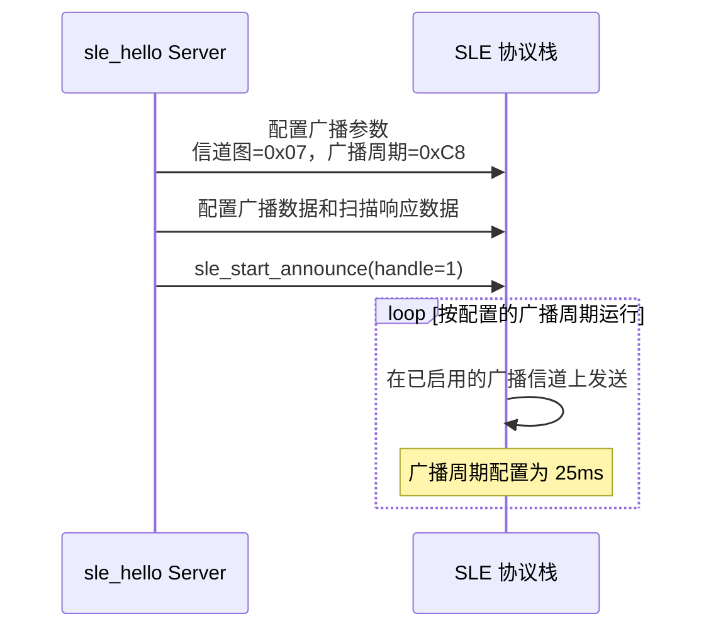
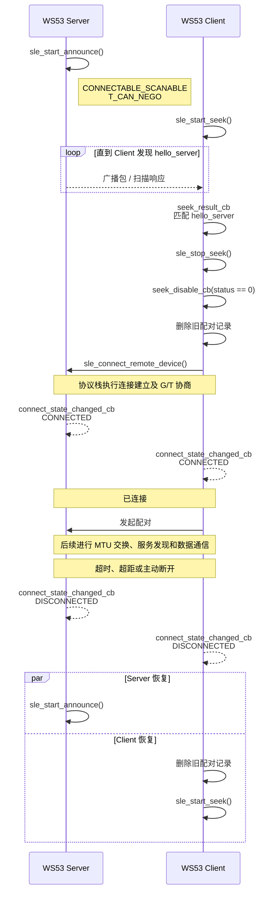
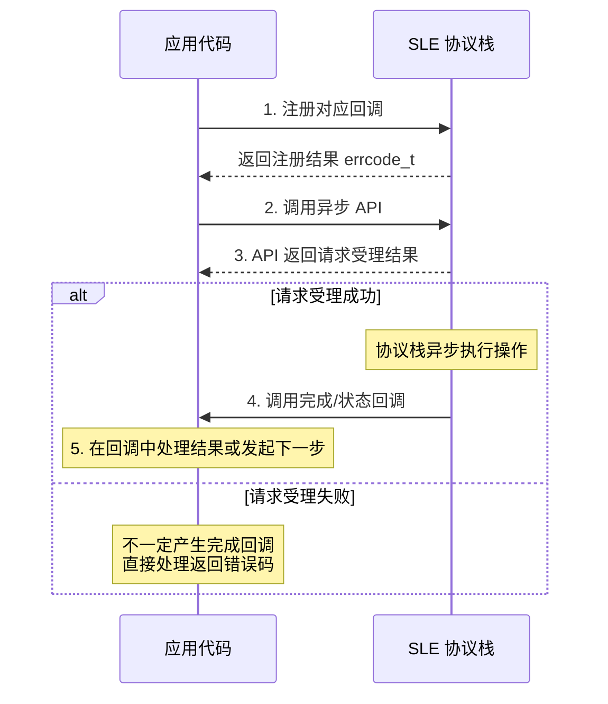
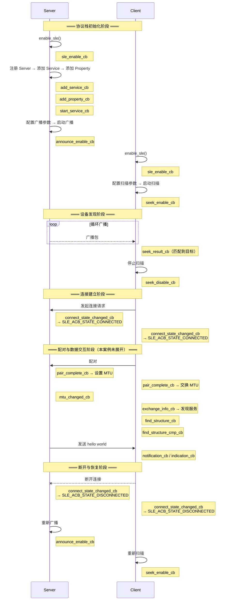
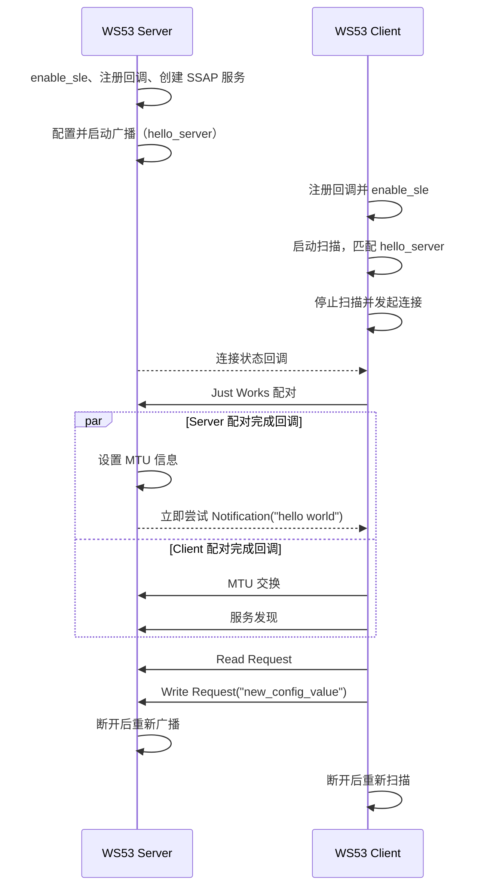

# Hello SLE

> 本篇是 SLE（SparkLink Low Energy，星闪）Hello 系列的基础入口，说明广播、扫描、连接、配对和公共回调流程。[通知推送（Notify）](./hello-notify.md) 和 [属性读写（Read/Write）](./hello-readwrite.md) 在此基础上介绍连接建立后的增量能力。

## 学习目标

- 理解 SLE 广播和扫描如何让两块开发板发现彼此。
- 掌握 Server/Client 角色、G/T 角色和回调驱动的基本概念。
- 能够配置并启动 Server 广播、Client 扫描，并完成连接和配对。
- 能够在两块 WS53 开发板上分别烧录 Server 和 Client，确认链路恢复行为。

## 适用范围与硬件准备

本案例用于验证两块 WS53 的最小 SLE 通信链路，不依赖外接传感器或其他外设。准备以下设备：

- 两块 WS53 开发板；
- 两根 USB 数据线；
- 两个可用的日志串口；
- 一台可执行 `fbb` 命令的开发主机。

Server 与 Client 使用同一个 `sle_hello` 工程，通过 Kconfig 选择角色；同一份固件只能选择一个角色。

## 规格与功能

本案例覆盖从设备发现到基础 SSAP 交互的完整链路。本文重点讲解建链公共流程，通知和属性读写由后续两篇增量说明展开。

| 规格项 | Server 端 | Client 端 |
| --- | --- | --- |
| 应用角色 | 提供广播和 SSAP 服务 | 扫描、连接并访问服务 |
| 广播/扫描 | 以 `hello_server` 名称广播 | 扫描结果中匹配 `hello_server` |
| 连接与配对 | 等待连接，支持 Just Works | 发起连接和 Just Works 配对 |
| MTU | 配对完成后设置 520 字节 | 配对完成后请求 520 字节 |
| 服务交互 | 发送通知、处理读写请求 | 接收通知、发起读写请求 |
| 断链恢复 | 重新启动广播 | 重新启动扫描 |

运行顺序如下：

1. Server 注册连接、SSAP 和广播回调，创建服务并启动广播。
2. Client 注册扫描、连接和 SSAP Client 回调，启动 SLE 后开始扫描。
3. Client 在扫描数据中匹配 `hello_server`，停止扫描并发起连接。
4. 双方收到连接回调后完成配对；Server 在自己的配对完成回调中设置 MTU 信息并立即尝试发送通知，Client 则在自己的配对完成回调中发起 MTU 交换。
5. Client 在 MTU 交换回调中发现 Service、Property 和 Descriptor，发现完成后读取属性，读确认成功后再写入属性。Server 的通知与这条 Client 回调链并没有顺序保证。

## 基本概念

### SLE 通信阶段

把 SLE 应用理解为一次“找人、建立通道、交换数据、保持连接”的过程，会比直接记 API 更容易：

```text
发现 → 连接 → 服务交互 → 持续维护
```

Hello SLE 覆盖这四个阶段：Server 广播、Client 扫描和连接属于发现与连接阶段；配对后的服务发现、通知和属性读写属于服务交互阶段；断开后的重新广播和重新扫描属于持续维护阶段。

### 广播：发布设备信息

**广播（Announce）**是 Server 端周期性向周围发送的数据包，类似一个人站在广场上每隔几秒喊一声自己的名字。

一个广播过程通常涉及：

- 设备地址（MAC (Media Access Control) 地址）；
- 设备名称（本案例为 `hello_server`）；
- 发现等级（一般 / 优先 / 仅配对设备）；
- 接入模式（公开 / 受限）；
- 发射功率（便于对方估算距离）。

广播有两个关键的时间参数：

- **广播间隔（announce interval）**：广播事件的周期配置。当前案例将最小值和最大值都设为 `0xC8`，单位为 125μs，即配置周期为 25ms。
- **广播信道图（announce channel map）**：当前案例使用 `SLE_ADV_CHANNEL_MAP_DEFAULT`（`0x07`）启用默认的三个广播信道。应用只配置信道图，不控制协议栈内部的逐信道发包顺序。

!!! note "广播信道编号"

    WS53 公共 API 注释将信道图的三个位标为 76、77、78，而当前 `sle_hello` 的本地枚举名称写成 77、78、79。两处命名不一致，因此本页按源码统一表述为“默认三个广播信道”，不依据案例枚举名称推断实际射频信道编号。



### 扫描：听见别人的广播

**扫描（Seek）**是 Client 端主动监听周围广播的过程。扫描也有两个时间参数：

- **扫描间隔**：两次扫描窗口开始之间的时间。
- **扫描窗口**：每次实际监听广播的持续时间。

扫描窗口必须小于或等于扫描间隔：

| 配置关系 | 行为 | 代价 |
| --- | --- | --- |
| 窗口 = 间隔 | 持续监听，发现速度快 | 功耗较高 |
| 窗口 < 间隔 | 监听一段时间后休眠 | 更省电，但可能错过广播 |

WS53 案例将 `seek_interval[0]` 和 `seek_window[0]` 都设置为 `100`，优先保证入门案例的发现成功率。识别流程为：

```text
扫描结果 → strstr 匹配 hello_server → 保存地址 → 停止扫描 → 发起连接
```

### Server/Client 与 G/T

| 概念 | 含义 | 决定位置 |
| --- | --- | --- |
| Server / Client | 谁提供服务、谁访问服务 | 应用层 |
| G（Grant）/ T（Terminal） | 谁负责连接调度节奏 | 建链时协商 |

- Server 通常是数据的来源（比如传感器），经常做 T
- Client 通常是数据的消费者（比如手机），经常做 G

但这不是绝对的。一块板子可以同时是 Server 和 Client，但一次连接中只能是一种 G/T 角色。

本案例 Server 使用 `SLE_ANNOUNCE_ROLE_T_CAN_NEGO`，表示设备优先协商为终端角色；若对端不接受，则允许协商为其他角色。随后由 Client 主动发起连接。

### 广播模式：可见性和可连接性的组合

| 模式 | 能被扫描到 | 能接受连接 | 典型用途 |
| --- | --- | --- | --- |
| 不可连接、不可扫描 | 否 | 否 | 仅发送内部状态 |
| 可连接、不可扫描 | 否 | 是 | 已知对端直连 |
| 不可连接、可扫描 | 是 | 否 | 只发布信息 |
| 可连接、可扫描 | 是 | 是 | 常规交互，Hello SLE 使用此模式 |
| 定向可连接、可扫描 | 仅目标设备 | 是 | 已配对设备快速重连 |

**差异总结**：前四种模式的核心区别在于"扫描"和"连接"两个能力的排列组合，决定了一个设备对周边世界的可见程度和交互方式。第五种定向模式则是在"可连接可扫描"基础上增加了目标地址过滤——只在广播中携带对端地址（`peer_addr`），只有该地址对应的设备才能发现并连接，适合需要快速恢复已有连接的场景（如手表离开手机范围后自动重连）。

### 连接状态：从建立到恢复

一条 SLE 连接至少要关注“已连接”和“已断开”两个状态：




Server 在断开回调中重新调用 `sle_start_announce()`；Client 清理旧配对信息后重新调用 `sle_hello_client_start_scan()`。

> `SLE_ACB_STATE_CONNECTED` 和 `SLE_ACB_STATE_DISCONNECTED` 是两个最重要的回调参数，你的代码就靠判断这两个值来得知当前连接状态。

### 回调驱动模式

SLE API 不是“调用后立刻得到结果”的同步模式，而是“注册回调、发起操作、等待结果”的异步模式：



> 关键原则是：调用 `sle_start_announce()`、`sle_start_seek()` 或 `sle_connect_remote_device()` 后，函数会先返回；真正的成功、失败和数据结果由协议栈通过回调通知。依赖结果的下一步操作必须放在对应回调中。**永远不要把后续操作写在 API 调用之后，必须写在回调函数里。**

### 通信流程:回调调用生命周期

Server 和 Client 各自注册了多组回调，它们并非同时触发，而是在协议栈的不同阶段被依次调用。理解这个调用顺序是写出正确异步代码的关键。下面这张图展示了全套回调的触发时机——本案例只用到了其中的连接阶段，数据交互阶段的回调将在后续文档中介绍。




本案例 Client 的主要回调链为：

```text
sle_enable_cb
  → seek_result_cb（匹配 hello_server）
  → seek_disable_cb
  → connect_state_changed_cb
  → pair_complete_cb
  → ssapc_exchange_info_req
  → exchange_info_cb
  → 服务发现完成
  → Read Confirm
  → Write Confirm
```

Server 的配对完成回调同时会调用 `sle_hello_server_send_data()`。该通知不在上面的 Client 回调链末尾，可能早于服务发现完成；当前案例没有应用层“Client 已就绪”握手。

`sle_start_announce()`、`sle_start_seek()` 和 `sle_connect_remote_device()` 都是异步 API，不能假设函数返回就代表操作完成。理解这条链后，再阅读[通知推送](./hello-notify.md)和[属性读写](./hello-readwrite.md)，可以直接定位每个 SSAP 操作所处的阶段。

本案例（hello-connect）聚焦前三个阶段——从协议栈初始化到连接建立。看到某个回调被触发，你就知道协议栈当前处于什么状态、下一步应该做什么。

## 涉及的主要 API

| API | 使用端 | 用途 |
| --- | --- | --- |
| `enable_sle()` | Server、Client | 使能 SLE 协议栈 |
| `sle_dev_manager_register_callbacks()` | Client | 注册 SLE 使能回调 |
| `sle_announce_seek_register_callbacks()` | Server、Client | 注册广播/扫描回调 |
| `sle_connection_register_callbacks()` | Server、Client | 注册连接状态和配对回调 |
| `sle_set_announce_param()` | Server | 配置广播参数 |
| `sle_set_announce_data()` | Server | 配置广播与扫描响应数据 |
| `sle_start_announce()` | Server | 启动广播 |
| `sle_set_seek_param()` | Client | 配置扫描参数 |
| `sle_start_seek()` / `sle_stop_seek()` | Client | 启动或停止扫描 |
| `sle_connect_remote_device()` | Client | 发起连接 |
| `sle_pair_remote_device()` | Client | 发起配对 |
| `ssaps_register_server()` | Server | 注册 SSAP Server |
| `ssaps_add_service_sync()` | Server | 添加 Service |
| `ssaps_add_property_sync()` | Server | 添加 Property |
| `ssaps_add_descriptor_sync()` | Server | 添加 Descriptor |
| `ssaps_start_service()` | Server | 启动服务 |
| `ssaps_notify_indicate()` | Server | 发送通知或指示 |
| `ssapc_exchange_info_req()` | Client | 发起 MTU/版本交换 |
| `ssapc_find_structure()` | Client | 发现 Service、Property 和 Descriptor |
| `ssapc_read_req()` / `ssapc_write_req()` | Client | 发起属性读取或写入 |

## 通信流程



## 源码结构与职责

```text
src/application/samples/bt/sle/sle_hello/
├── CMakeLists.txt
├── Kconfig
├── sle_hello.c
├── sle_hello_server/
│   └── src/
│       ├── sle_hello_server.c
│       ├── sle_hello_server.h
│       ├── sle_hello_server_adv.c
│       └── sle_hello_server_adv.h
└── sle_hello_client/
    └── src/
        ├── sle_hello_client.c
        └── sle_hello_client.h
```

| 文件 | 作用 |
| --- | --- |
| `sle_hello.c` | 注册 `app_run` 入口，根据 Kconfig 创建 Server 或 Client 任务，并处理 Client 侧回调。 |
| `sle_hello_server.c` | 注册 SSAP 服务、处理读写请求，并在配对完成后发送 `hello world`。 |
| `sle_hello_server_adv.c` | 配置 `hello_server` 广播数据、扫描响应数据和广播参数。 |
| `sle_hello_client.c` | 完成扫描、连接、配对、服务发现以及属性读写。 |

## 关键配置

### Kconfig 角色选择

| 角色 | 配置符号 | 作用 |
| --- | --- | --- |
| Server | `CONFIG_SAMPLE_SUPPORT_SLE_HELLO_SERVER_SAMPLE=y` | 构建广播和 SSAP Server 固件 |
| Client | `CONFIG_SAMPLE_SUPPORT_SLE_HELLO_CLIENT_SAMPLE=y` | 构建扫描和 SSAP Client 固件 |

两个选项属于同一个角色选择，同一份固件不能同时启用 Server 和 Client。

### 广播参数

Server 在 `sle_set_default_announce_param()` 中配置：

| 参数 | WS53 案例设置 | 说明 |
| --- | --- | --- |
| `announce_mode` | `SLE_ANNOUNCE_MODE_CONNECTABLE_SCANABLE` | 允许被扫描并接受连接 |
| `announce_handle` | `SLE_ADV_HANDLE_DEFAULT` | 使用默认广播句柄 |
| `announce_gt_role` | `SLE_ANNOUNCE_ROLE_T_CAN_NEGO` | 优先作为 T，允许协商 |
| `announce_level` | `SLE_ANNOUNCE_LEVEL_NORMAL` | 普通发现等级 |
| `announce_channel_map` | `SLE_ADV_CHANNEL_MAP_DEFAULT` | 使用默认广播信道集合 |
| 广播间隔 | `SLE_ADV_INTERVAL_MIN_DEFAULT` / `MAX_DEFAULT` | 使用 SDK 默认值 |
| 连接间隔 | `SLE_CONN_INTV_MIN_DEFAULT` / `MAX_DEFAULT` | 使用 SDK 默认值 |
| 监管超时 | `SLE_CONN_SUPERVISION_TIMEOUT_DEFAULT` | 使用 SDK 默认值 |
| 发射功率 | `SLE_ANNOUNCE_TX_POWER_DBM` | 使用案例默认值 |

广播数据由 `sle_set_adv_data()` 生成，扫描响应数据由 `sle_set_scan_response_data()` 生成；本地名称 `hello_server` 放在扫描响应数据中，Client 通过该名称识别目标设备。

### 扫描参数

Client 在 `sle_hello_client_start_scan()` 中使用以下配置：

| 参数 | 设置 | 说明 |
| --- | --- | --- |
| `own_addr_type` | `0` | 使用默认本地地址类型 |
| `filter_duplicates` | `0` | 不过滤重复扫描结果 |
| `seek_filter_policy` | `0` | 使用默认过滤策略 |
| `seek_phys` | `1` | 使用默认扫描 PHY |
| `seek_type[0]` | `1` | 使用默认扫描类型 |
| `seek_interval[0]` | `100` | 扫描间隔 |
| `seek_window[0]` | `100` | 扫描窗口与间隔相同，持续扫描 |

扫描窗口等于扫描间隔时发现速度快但功耗较高；产品化场景可根据功耗目标调小窗口，并重新验证发现成功率。

### SSAP 服务定义

| 项目 | 值 |
| --- | --- |
| Service UUID | `0x3333` |
| Property UUID | `0x3434` |
| Property 权限 | READ / WRITE |
| Operation indication | READ / NOTIFY / WRITE |
| MTU | 520 字节 |

## 关键代码流程

### 应用入口

`sle_hello_entry()` 根据 Kconfig 创建一个任务：

```c
#if defined(CONFIG_SAMPLE_SUPPORT_SLE_HELLO_SERVER_SAMPLE)
    task_handle = osal_kthread_create(sle_hello_server_task, ...);
#elif defined(CONFIG_SAMPLE_SUPPORT_SLE_HELLO_CLIENT_SAMPLE)
    task_handle = osal_kthread_create(sle_hello_client_task, ...);
#endif
app_run(sle_hello_entry);
```

Server 任务调用 `sle_hello_server_init()`；Client 任务调用 `sle_hello_client_init()`，并传入通知、指示、读确认和写确认回调。

### Server 流程

1. 注册广播、连接和 SSAP Server 回调。
2. 注册 SSAP Server，添加 Service、Property 和 Descriptor，启动服务。
3. 配置广播参数和广播/扫描响应数据，启动 `hello_server` 广播。
4. 配对完成回调设置 520 字节 MTU 信息，并立即调用 `sle_hello_server_send_data()` 尝试发送 `hello world`；源码没有等待 Client 服务发现或应用层就绪确认。
5. 收到 Read/Write 请求时分别由 `sle_hello_read_request_cb()` 和 `sle_hello_write_request_cb()` 处理。
6. 断开后清理连接句柄并重新调用 `sle_start_announce()`。

### Client 流程

1. 保存用户回调，等待 SLE 核心就绪后注册设备、扫描、连接和 SSAP Client 回调。
2. `sle_enable_cb` 触发 `sle_hello_client_start_scan()`。
3. `sle_hello_seek_result_info_cbk()` 匹配 `hello_server`，保存地址并停止扫描。
4. `sle_hello_seek_disable_cbk()` 调用 `sle_connect_remote_device()`。
5. 连接成功后调用 `sle_pair_remote_device()`；配对完成后调用 `ssapc_exchange_info_req()`。
6. MTU 交换完成后调用 `ssapc_find_structure()`，保存实际 Property Handle。
7. 服务发现完成后发起 `ssapc_read_req()`；读确认回调再调用 `sle_hello_client_send_write_req()` 发起写请求。
8. 断开后删除配对信息并重新启动扫描。

Client 不应写死 Property Handle；必须使用服务发现回调返回的实际句柄。

## 构建、烧录与运行

### 编译 Server

```powershell
fbb config set CONFIG_SAMPLE_SUPPORT_SLE_HELLO_SERVER_SAMPLE=y --target ws53_liteos_app
fbb build ws53_liteos_app --clean
```

### 编译 Client

切换角色后重新配置和构建：

```powershell
fbb config set CONFIG_SAMPLE_SUPPORT_SLE_HELLO_CLIENT_SAMPLE=y --target ws53_liteos_app
fbb build ws53_liteos_app --clean
```

两种角色共享固件输出路径，切换角色后应重新构建，避免烧录上一角色的固件。

### 烧录与监视

将 Server 固件和 Client 固件分别烧录到两块 WS53：

```powershell
fbb flash ws53_liteos_app --port <SERVER_COM> --json-summary
fbb flash ws53_liteos_app --port <CLIENT_COM> --json-summary

fbb monitor --port <CLIENT_COM> --until "hello world" --timeout 30 --json-summary
```

固件输出目录和串口号以当前 SDK 与主机实际配置为准。构建、烧录和串口参数可参考[快速入门](../../../../get-started/index.md)。

### 预期日志

Server 端应看到类似日志：

```text
[sle hello server] start announce success.
[sle hello server] waiting for connection...
[sle hello server] conn state changed, conn_id:0x.., state:...
[sle hello server] pair complete conn_id:..., status:0
[sle hello server] hello world sent.
```

Client 端应看到类似日志：

```text
[sle hello client] start seek...
[sle hello client] scan data: hello_server
[sle hello client] found hello_server, stopping seek...
[sle hello client] connecting to remote device...
[sle hello client] connected, conn_id=0x..
[SLE Hello Client] Received: hello world
[SLE Hello Client] Read result: ...
[SLE Hello Client] Write cfm: success, handle=0x..
```

日志前缀和连接句柄会随版本和运行次数变化。连接、配对、MTU/发现、读确认和写确认应分别按回调状态验收；由于当前通知存在时序竞争，单次未收到 `hello world` 不能单独判定建链失败。

## 常见问题与限制

| 现象 | 优先检查项 |
| --- | --- |
| Client 一直扫描不到目标 | 确认 Server 角色配置、广播是否启动、两块板供电和距离是否正常，并确认名称为 `hello_server`。 |
| 已发现但无法连接 | 检查 Client 是否停止扫描、旧配对信息是否清除，以及两端是否使用互补角色。 |
| 已连接但没有通知 | 当前 Server 在配对完成后立即发送，可能早于 Client 服务发现完成；先确认其余回调成功，再增加 Client 就绪握手或在就绪后重发。 |
| 读取或写入失败 | 检查 Property 权限、操作指示、实际 Handle、请求长度和回调返回状态。 |
| 断开后不再恢复 | 检查 Server 的 `sle_start_announce()` 和 Client 的 `sle_hello_client_start_scan()` 是否在断开回调中执行。 |

本案例的 Just Works 配对不提供中间人攻击防护，仅用于功能验证；生产产品应按安全要求选择合适的配对方式。案例不覆盖吞吐量、功耗和异常链路压力测试，相关内容请参阅后续数据通信和连接管理案例。

若产品要求首包通知可靠到达，应由 Client 在发现目标 Property 并完成必要订阅后发送应用层 Ready，Server 收到 Ready 后再通知；也可以设计带状态检查、重试和超时的等价机制。不能把“双方都收到配对成功回调”当成跨设备的执行屏障。

## 下一步

- [通知推送（Notify）](./hello-notify.md)：拆解 SSAP 服务发现、MTU 交换和 Notification。
- [属性读写（Read/Write）](./hello-readwrite.md)：拆解 Client 主动读取、写入和确认处理。
- [SLE 案例](../index.md)：继续学习 UART 透传、设备配置、分片传输和连接管理案例。
