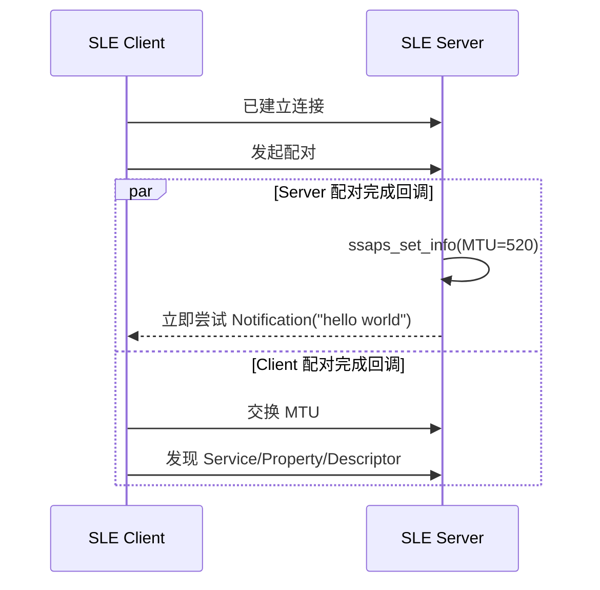

# 通知推送（Notify）

> 在 [Hello SLE](./hello-connect.md) 完成广播、扫描和连接后，增加 SSAP（SLE Service Access Protocol）服务发现、MTU（Maximum Transmission Unit）交换和通知推送。

## 本篇新增内容

- Server 注册 Service、Property 和 Descriptor。
- Client 完成配对、MTU 交换和服务发现。
- Server 通过通知向 Client 推送 `hello world`。
- Client 在通知回调中按显式长度处理数据。

广播、扫描、连接、任务入口以及公共构建烧录流程不在本篇重复说明。

## SSAP 数据模型

```text
Server
└── Service
    └── Property
        └── Descriptor
```

Property 决定数据是否可读、可写或可通知；Descriptor 保存补充配置。Client 必须完成服务发现并保存实际 Property Handle，不能使用写死的句柄。

## 增量流程



通知适合 Server 主动上报且允许应用层自行处理丢包的场景；需要逐包确认时使用指示，需要 Client 主动查询或修改数据时使用读写请求。

### 首包时序

Server 在自己的配对完成回调中立即发送 `hello world`，而 Client 要在另一条独立回调链中完成 MTU 交换和服务发现。源码没有等待 Client 发现 Property，也没有应用层 Ready/订阅确认，因此不能保证通知一定发生在服务发现之后。可靠业务应在 Client 就绪后显式通知 Server，再由 Server 发送或重发首包。

## 源码对应关系

本篇与 Hello SLE 共用同一个 WS53 案例：

```text
src/application/samples/bt/sle/sle_hello/
├── sle_hello_server/src/sle_hello_server.c
└── sle_hello_client/src/sle_hello_client.c
```

重点查看：

- Server 端 SSAP 服务、Property 和 Descriptor 注册。
- Client 端配对、MTU 交换和服务发现回调链。
- Server 通知发送与 Client 通知接收回调。

## 操作与验证

按 [Hello SLE](./hello-connect.md) 构建和烧录 Server、Client。连接成功后应看到配对、MTU、服务发现以及 Server 尝试发送通知的日志，但不要假设两端日志之间存在固定先后顺序。

若已经连接但没有数据：

1. 确认配对、MTU 交换和服务发现的回调状态均成功。
2. 确认 Client 已发现目标 Property 并保存真实 Handle。
3. 检查 Server 的通知是否早于 Client 就绪；当前源码发生这种情况时不会自动重发。
4. 若需要稳定验收，增加 Ready 握手或重试后再测试首包通知。
5. 打印数据时使用回调提供的长度，不能假设数据以 `\0` 结尾。

## 下一步

[属性读写（Read/Write）](./hello-readwrite.md) 在相同 SSAP 模型上增加 Client 主动读写。
