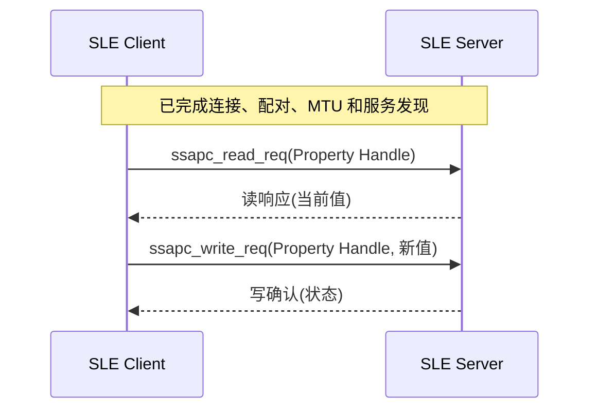

# 属性读写

> 在 [通知推送（Notify）](./hello-notify.md) 的连接、配对、MTU（Maximum Transmission Unit）和服务发现基础上，增加 Client 主动读写 Property。

## 本篇新增内容

- Property 增加读写操作指示和相应权限。
- Server 实现读请求、写请求回调。
- Client 使用发现到的 Handle 发起读写请求。
- 双方处理确认结果、错误码和输入长度。

前两篇已经介绍的连接与通知流程不再重复。

## 交互方式对比

| 方式 | 发起方 | 典型用途 |
| --- | --- | --- |
| 通知 | Server | 状态或传感器主动上报 |
| 读取 | Client | 查询版本、状态和配置 |
| 写入 | Client | 下发控制命令或配置 |

## 增量流程



权限配置决定协议栈是否允许操作，业务回调决定具体数据是否合法。两者必须同时正确：协议权限不能替代长度、范围和状态校验。

## 源码对应关系

```text
src/application/samples/bt/sle/sle_hello/
├── sle_hello_server/src/sle_hello_server.c
└── sle_hello_client/src/sle_hello_client.c
```

重点查看：

- Server 的读请求和写请求处理。
- Property 的 `permissions` 与 `operate_indication` 配置。
- Client 的 `ssapc_read_req()`、`ssapc_write_req()` 及确认回调。

## 操作与验证

沿用 [Hello SLE](./hello-connect.md) 的构建和烧录步骤。Client 端读写回调链为：

```text
连接 → 配对 → MTU → 服务发现 → Read → Read Confirm → Write → Write Confirm
```

Server 的 `hello world` Notification 在另一条配对完成回调中立即尝试发送，可能出现在 Client 服务发现之前或期间，不是 Read/Write 链中的固定一步。

验证时应确认：

- Client 使用服务发现得到的实际 Handle。
- Server 读响应返回当前值。
- 合法写入更新 Server 状态，并返回成功确认。
- 合法长度的写入会更新 Server 缓冲区前 `length` 个字节；若请求需要响应，源码发送成功状态。
- 当前写回调不校验请求 Handle。长度超过缓冲区或 `memcpy_s()` 失败时，源码直接返回，也没有为 `need_rsp` 请求构造失败响应；属性权限问题可能在进入应用回调前由协议栈拒绝。测试时不能把这些异常概括为“均返回失败且旧值不变”。

## 使用建议

- 配置数据应定义版本、长度和取值范围。
- 远端字节流不能直接当作 C 字符串使用。
- 需要掉电保存时再接入 NV（Non-Volatile）；不要在协议回调中执行耗时写入，可投递给业务任务处理。
- 产品化时应先校验 Handle、offset、长度和业务取值；所有需要响应的失败分支都应返回明确错误状态。
