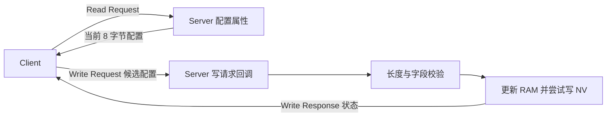
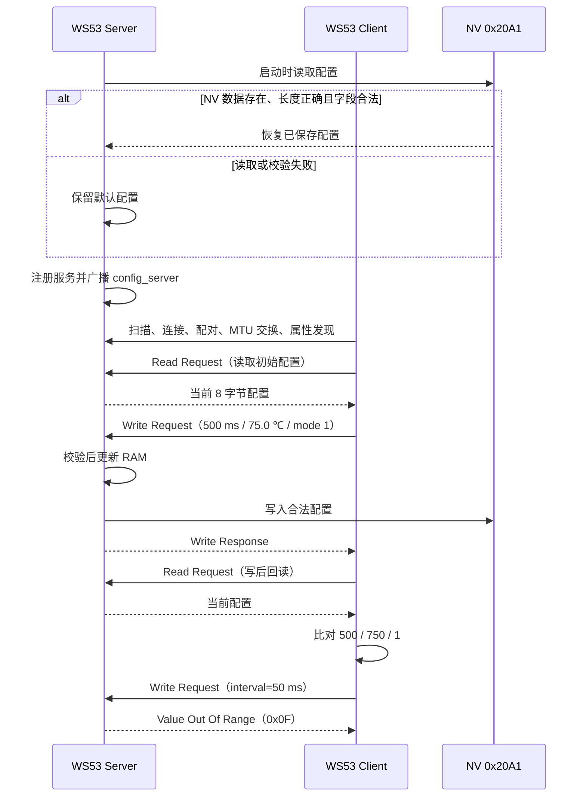

# 参数配置与持久化

> 使用技术：SLE、SSAP（SLE Service Access Protocol）属性读写、应用层校验、NV（Non-Volatile Storage）持久化

> 前置阅读：必须了解 [Hello SLE](../basics/hello-connect.md) 的扫描与连接流程，建议先完成 [属性读写](../basics/hello-readwrite.md) 的属性读写实验。

本案例使用两块 WS53 演示设备配置链路：Client 先读取 Server 当前配置，再写入合法配置、回读比对，并写入一组非法配置验证拒绝路径；Server 对候选值进行校验并保存到 NV，复位后重新加载。案例中的配置字段只用于验证读写和持久化流程，尚未接入实际业务模块。

## 学习目标

- 完成 SLE Server 与 Client 的扫描、连接、配对、MTU 交换和 SSAP 属性发现。
- 使用 SSAP Read Request 和 Write Request 读写 8 字节设备配置。
- 理解授权属性为何会把读写请求交给 Server 应用回调处理。
- 掌握配置长度、Magic、版本和业务字段范围的校验方法。
- 区分“写响应成功”“写后回读一致”和“Server 复位后从 NV 恢复”三个验收层次。
- 了解当前源码先更新 RAM、再写 NV 的实际顺序及其失败边界。

## 基本概念

### 业务参数与协议栈参数

业务参数用于控制产品功能，例如上报周期、告警阈值和工作模式。协议栈参数用于控制通信链路，例如广播间隔、连接间隔、发射功率、PHY、MCS 和 MTU。两类参数的归属、合法范围和生效模块不同，不能混用同一套配置接口或数据模型。

本案例中的 `report_interval_ms`、`alarm_threshold_decicelsius` 和 `mode` 都属于业务参数。SLE 只负责在 Client 与 Server 之间传输这些参数；修改它们不会自动改变 SLE 的连接间隔、PHY、MCS 或其他协议栈行为。

当前 WS53 源码只验证业务配置的读取、写入、校验和 NV 恢复，没有使用这些字段控制真实的上报周期、告警逻辑或工作模式。

### SSAP 属性读写模型

Server 注册服务 `0x3333` 和配置属性 `0x3434`。属性权限包含读、写和 `SSAP_PERMISSION_AUTHORIZATION_NEED`，操作能力声明为读、写和 Notify。由于读写需要应用授权，请求会进入 Server 注册的 `read_request_cb` 和 `write_request_cb`，由应用决定响应数据和状态码。



Client API 和 Server 响应均按异步流程工作：

- `ssapc_read_req()`、`ssapc_write_req()` 返回成功，只表示请求已提交。
- 最终读取结果在 Client 的 `read_cfm_cb` 中取得。
- 最终写入状态在 Client 的 `write_cfm_cb` 中取得。
- Server 通过 `ssaps_send_response()` 返回读取数据或写入状态。

虽然属性声明了 Notify，源码也注册了 Notification 回调和发送辅助函数，但本案例的自动测试流程只使用 Read Request 和 Write Request，没有实际发送配置 Notification。

### RAM 与 NV

`g_device_config` 是 Server 当前运行期配置，NV ID `0x20A1` 保存复位后需要恢复的配置。两者承担的职责不同：

| 存储位置 | 用途 | 复位后是否保留 |
|---|---|---|
| RAM：`g_device_config` | 当前读请求返回的数据 | 否 |
| NV：`0x20A1` | 下次启动时恢复配置 | 是 |

Server 启动时读取 NV，同时检查读取状态、实际长度和全部字段合法性。只有三项均满足时才覆盖默认配置，否则继续使用编译期默认值。

当前源码处理合法写入的顺序是：

```text
校验候选值 → 更新 g_device_config → 写 NV → 返回写响应
```

这意味着 NV 写入失败时，Client 会收到“资源不足”状态，但 RAM 中的当前配置已经改变；复位后仍会恢复上一次成功保存到 NV 的值。若产品要求 RAM 与 NV 始终一致，应改为先写 NV，成功后再更新 RAM，或者增加回滚机制。

## 涉及 API

API 按实际调用阶段排列。详细参数和返回值请查阅对应 API Reference。

| 阶段 | 前置状态 | 核心 API | 调用方 | 作用 |
|---|---|---|---|---|
| Server 初始化 | 案例任务启动 | `ssaps_register_callbacks()`、`ssaps_register_server()`、`ssaps_add_service_sync()`、`ssaps_add_property_sync()`、`ssaps_start_service()` | Server | 注册配置服务、授权读写属性和回调 |
| 扫描与连接 | SLE 已使能 | `sle_start_seek()`、`sle_connect_remote_device()`、`sle_pair_remote_device()` | Client | 查找 `config_server` 并完成连接、配对 |
| MTU 与发现 | 配对成功 | `ssapc_exchange_info_req()`、`ssapc_find_structure()` | Client | 请求 MTU 520 并取得配置属性 handle |
| 读取配置 | 属性 handle 有效 | `ssapc_read_req()`、`ssaps_send_response()` | Client / Server | 读取当前 8 字节配置 |
| 写入配置 | 属性 handle 有效 | `ssapc_write_req()`、`ssaps_send_response()` | Client / Server | 提交候选值并返回接受或拒绝状态 |
| 持久化 | 候选值校验通过 | `uapi_nv_write()`、`uapi_nv_read()` | Server | 保存合法配置并在启动时恢复 |
| 断链恢复 | 连接断开 | `sle_start_announce()`、`sle_start_seek()` | Server / Client | Server 恢复广播，Client 恢复扫描 |

## 案例说明

### 功能规格

| 规格项 | WS53 源码值 |
|---|---|
| Server 广播名称 | `config_server` |
| 服务 UUID | `0x3333` |
| 配置属性 UUID | `0x3434` |
| 配置结构长度 | 8 字节 |
| 默认配置 | `1000 ms / 80.0 ℃ / mode 0` |
| Client 合法测试值 | `500 ms / 75.0 ℃ / mode 1` |
| Client 非法测试值 | `interval=50 ms`，其余字段合法 |
| NV ID | `0x20A1` |
| SSAP MTU 请求值 | 520 字节，版本 1 |
| 角色选择 | 顶层 SLE Sample `choice`，Server 与 Client 互斥 |

### 公共配置结构体

Client 和 Server 共用 `src/application/samples/bt/sle/sle_device_config/sle_device_config_protocol.h`：

```c
typedef struct {
    uint16_t magic;
    uint16_t report_interval_ms;
    int16_t alarm_threshold_decicelsius;
    uint8_t mode;
    uint8_t version;
} sle_device_config_t;
```

当前 WS53 编译环境下结构体长度为 8 字节，各字段的源码约束如下：

| 字段 | 类型 | 约束和说明 |
|---|---|---|
| `magic` | `uint16_t` | 固定为 `0x5343`，用于识别配置数据 |
| `report_interval_ms` | `uint16_t` | 100～60000 ms |
| `alarm_threshold_decicelsius` | `int16_t` | -200～1000，单位 0.1 ℃ |
| `mode` | `uint8_t` | 0 或 1；当前案例未定义两种取值对应的实际业务行为 |
| `version` | `uint8_t` | 固定为 1，用于识别结构格式 |

温度使用放大 10 倍的整数表示，例如 750 表示 75.0 ℃，从而避免在线协议中传输浮点数。

案例直接传输结构体内存，适用于两端使用相同 WS53 工具链的当前验证场景。若需要跨编译器或跨架构互通，应明确规定字节序、字段偏移和编码方式，并改为逐字段序列化，不能依赖 C 结构体布局。

### 端到端交互流程



Client 使用状态变量推进自动测试，实际顺序为：

1. 服务发现完成后先读取当前配置。首次运行通常读到默认值；如果 Server 已保存过配置，也可能读到 NV 恢复值。
2. 初始读取成功后发送合法配置。
3. 合法写确认成功后再次读取配置。
4. 写后回读的三个业务字段等于 500、750、1 时输出 `persisted config verified`。
5. 随后发送 `interval=50 ms` 的非法配置。
6. 收到非成功写确认后输出非法配置被拒绝和 `test passed`。
7. 复位 Server，通过 Server 启动日志单独验证 NV 恢复。

### 三个验收层次

以下三个结果不能互相替代：

| 层次 | 证据 | 能证明什么 |
|---|---|---|
| 写响应成功 | `valid config accepted` | Server 接受了合法写请求，并返回成功状态 |
| 写后回读一致 | `persisted config verified` | 当前 RAM 中三个业务字段与 Client 预期一致 |
| 复位后恢复 | `config loaded from NV` | Server 重新启动后确实从 NV 读回合法配置 |

源码中的日志名 `persisted config verified` 容易被理解为已经完成掉电验证，但该日志实际出现在 Server 复位前，只是写后回读比对。真正的持久化验收必须复位同一块 Server 板并观察 `config loaded from NV`。

### 设计与限制

- 配置字段只用于演示，没有驱动传感器、周期任务、告警或模式切换模块。
- Server 与 Client 属于同一个 Kconfig `choice`，同一份固件只能选择一个角色。
- 配置直接按 8 字节 C 结构体传输，不适合作为未经定义的跨平台线协议。
- 只维护一份全局配置，没有多 Client 并发写仲裁、配置所有者或更高层访问控制策略。
- 当前只支持结构版本 1，没有旧版本迁移、升级或回滚逻辑。
- Server 先更新 RAM 再写 NV；NV 失败时不会回滚 RAM。
- Client 写后回读只比较周期、温度阈值和模式，没有比较 Magic 与版本。
- 即使写后回读字段不匹配，Client 仍会继续发送非法配置；因此验收时必须同时看到 `persisted config verified`，不能只看最后的 `test passed`。
- 属性声明了 Notify，但当前自动测试不使用 Notification。

## 案例操作指导

### 准备开发板

准备两块 WS53 开发板和两个调试串口，分别作为 Server 和 Client。本案例不需要外接传感器或其他业务外设。持久化验证时必须复位原来的 Server 板。

### 配置、构建并烧录 Server

在 SDK 根目录执行：

```powershell
fbb config set CONFIG_SAMPLE_SUPPORT_SLE_DEVICE_CONFIG_SERVER_SAMPLE=y --target ws53_liteos_app
fbb build ws53_liteos_app --clean
fbb flash ws53_liteos_app --port <SERVER_COM> --json-summary
```

对应的 Kconfig 选择链为：

```text
CONFIG_ENABLE_BT_SAMPLE=y
CONFIG_SAMPLE_SUPPORT_SLE_SAMPLE=y
CONFIG_SAMPLE_SUPPORT_SLE_DEVICE_CONFIG_SERVER_SAMPLE=y
```

### 配置、构建并烧录 Client

Server 烧录完成后切换到 Client 角色并重新构建：

```powershell
fbb config set CONFIG_SAMPLE_SUPPORT_SLE_DEVICE_CONFIG_CLIENT_SAMPLE=y --target ws53_liteos_app
fbb build ws53_liteos_app --clean
fbb flash ws53_liteos_app --port <CLIENT_COM> --json-summary
```

对应的 Kconfig 选择链为：

```text
CONFIG_ENABLE_BT_SAMPLE=y
CONFIG_SAMPLE_SUPPORT_SLE_SAMPLE=y
CONFIG_SAMPLE_SUPPORT_SLE_DEVICE_CONFIG_CLIENT_SAMPLE=y
```

Server 与 Client 角色互斥。切换角色后必须重新构建，不能把同一个镜像烧录到两块板上充当不同角色。

固件包位于：

```text
output/ws53/fwpkg/ws53-liteos-app/ws53-liteos-app_all.fwpkg
```

### 运行与首次验收

1. 打开两块板的调试串口。
2. 先启动 Server，确认出现 `using default config` 或 `config loaded from NV`，并进入等待连接状态。
3. 再启动 Client，等待自动完成扫描、连接、配对、MTU 交换和服务发现。
4. 同时检查 Server 与 Client 日志。

合法写入和写后回读的关键日志如下：

```text
[sle device config server] config saved: interval=500, threshold=750, mode=1
[sle device config client] valid config accepted, handle=0x..
[sle device config client] read config: interval=500, threshold=750, mode=1
[sle device config client] persisted config verified
```

非法写入应被拒绝：

```text
[sle device config server] rejected: interval=50, threshold=750, mode=1
[sle device config client] invalid config rejected, status=0xf
[sle device config client] test passed
```

### 复位后验证 NV

在看到合法保存和非法拒绝日志后，只复位原来的 Server 板。Server 启动时应输出：

```text
[sle device config server] config loaded from NV: interval=500, threshold=750, mode=1
```

这条启动日志才是本案例中复位持久化成功的直接证据。若重新构建或烧录流程会擦除用户 NV，应采用不会擦除该区域的复位或烧录方式完成验证。

### 常见问题

| 现象 | 检查项 |
|---|---|
| Client 一直扫描 | 确认 Server 已烧录 Server 角色，并广播名称 `config_server` |
| 已连接但不开始读配置 | 查看配对、MTU 交换和服务发现回调是否成功，属性 handle 是否有效 |
| 合法写入未被接受 | 查看 Server 是否报告长度错误、字段越界或 NV 写入失败 |
| 只看到 `test passed` | 继续检查是否同时出现 `persisted config verified`，否则写后回读并未通过 |
| Server 复位后使用默认值 | 检查此前是否出现 `config saved`，以及复位/烧录操作是否保留用户 NV |

## 关键配置

### 角色与能力

顶层 SLE Sample `choice` 定义两个互斥角色：

```text
CONFIG_SAMPLE_SUPPORT_SLE_DEVICE_CONFIG_SERVER_SAMPLE
CONFIG_SAMPLE_SUPPORT_SLE_DEVICE_CONFIG_CLIENT_SAMPLE
```

选择 Server 后自动使能 `SUPPORT_SLE_PERIPHERAL`；选择 Client 后自动使能 `SUPPORT_SLE_CENTRAL`。

### 协议与测试值

| 常量或配置 | 值 | 源码位置 |
|---|---|---|
| `SLE_DEVICE_CONFIG_MAGIC` | `0x5343` | `sle_device_config_protocol.h` |
| `SLE_DEVICE_CONFIG_VERSION` | 1 | `sle_device_config_protocol.h` |
| 周期范围 | 100～60000 ms | `sle_device_config_protocol.h` |
| 温度阈值范围 | -200～1000 | `sle_device_config_protocol.h` |
| `SLE_DEVICE_CONFIG_NV_ID` | `0x20A1` | `sle_device_config_server.c` |
| `SLE_DEVICE_CONFIG_MTU_SIZE` | 520 | `sle_device_config_server.c` |
| 合法测试值 | 500 / 750 / 1 | `sle_device_config_client.c`、`sle_device_config.c` |
| 非法周期 | 50 ms | `sle_device_config_client.c` |

修改字段范围或测试值时，必须同步检查协议头、Server 校验和 Client 预期值。修改结构体布局或版本时，还要处理已经保存到 NV 的旧数据，不能只修改 `sizeof`。

## 代码详解

### 1. 代码目录与调用关系

```text
src/application/samples/bt/sle/sle_device_config/
├── sle_device_config.c
│   ├── sle_device_config_entry()
│   ├── Server / Client 角色任务
│   └── Client 自动测试状态推进
├── sle_device_config_protocol.h
│   └── 公共结构体、Magic、版本和字段范围
├── sle_device_config_server/src/
│   ├── sle_device_config_server.c
│   └── sle_device_config_server_adv.c
└── sle_device_config_client/src/
    └── sle_device_config_client.c
```

`sle_device_config_entry()` 根据 Kconfig 创建 `SLEConfigServer` 或 `SLEConfigClient` 任务，任务优先级为 28、栈大小为 `0x1000`。

### 2. 为什么读写请求会进入应用回调

Server 属性权限包含：

```c
#define SLE_DEVICE_CONFIG_TEST_PROPERTIES \
    (SSAP_PERMISSION_READ | SSAP_PERMISSION_WRITE | \
     SSAP_PERMISSION_AUTHORIZATION_NEED)
```

Server 随后把回调注册给 SSAPS：

```c
ssaps_cbk.read_request_cb = sle_device_config_read_request_cb;
ssaps_cbk.write_request_cb = sle_device_config_write_request_cb;
ssaps_register_callbacks(&ssaps_cbk);
```

读回调将当前 `g_device_config` 放入响应；写回调负责解释候选结构体、校验字段、保存配置并返回状态。这是“协议栈负责传递、应用负责决策”的实现位置。

### 3. Server 校验候选配置

写回调首先要求数据长度恰好等于 8 字节，并把数据复制到局部变量 `candidate`。只有复制成功后才检查字段：

```c
static bool sle_device_config_is_valid(const sle_device_config_t *config)
{
    return (config->magic == SLE_DEVICE_CONFIG_MAGIC) &&
           (config->version == SLE_DEVICE_CONFIG_VERSION) &&
           (config->report_interval_ms >= SLE_DEVICE_CONFIG_INTERVAL_MIN_MS) &&
           (config->report_interval_ms <= SLE_DEVICE_CONFIG_INTERVAL_MAX_MS) &&
           (config->alarm_threshold_decicelsius >= SLE_DEVICE_CONFIG_THRESHOLD_MIN) &&
           (config->alarm_threshold_decicelsius <= SLE_DEVICE_CONFIG_THRESHOLD_MAX) &&
           (config->mode <= SLE_DEVICE_CONFIG_MODE_MAX);
}
```

长度或复制失败返回 `ERRCODE_SSAP_INCORRECT_DATA_TYPE`；字段越界返回 `ERRCODE_SSAP_VALUE_OUT_OF_RANGE`，Client 日志中的低字节为 `0x0F`。

### 4. Server 保存配置并发送响应

当前实现的关键顺序如下：

```c
g_device_config = candidate;
errcode_t nv_ret = uapi_nv_write(SLE_DEVICE_CONFIG_NV_ID,
    (const uint8_t *)&g_device_config, sizeof(g_device_config));
if (nv_ret != ERRCODE_SUCC) {
    response_status = (uint8_t)ERRCODE_SSAP_INSUFFICIENT_RESOURCES;
}
```

如果请求要求响应，Server 再把 `response_status` 放入 `ssaps_send_response()`。因此 Client 能区分接受、越界和资源不足；但 NV 失败不会撤销前面的 `g_device_config = candidate`，这是阅读源码和设计产品逻辑时必须注意的边界。

### 5. Client 按回调推进自动测试

Client 没有使用固定延时猜测对端何时完成，而是按以下回调推进：

```text
服务发现完成
  → 发起初始 Read Request
  → read_cfm_cb：发送合法 Write Request
  → write_cfm_cb：合法写成功后再次 Read Request
  → read_cfm_cb：比对业务字段并发送非法 Write Request
  → write_cfm_cb：确认非法写被拒绝
```

这种写法符合异步协议栈模型。不过，当前状态变量不会在断连回调中重置，自动测试主要面向一次上电后的单轮验证；复位持久化应以 Server 启动日志为准。

### 6. Server 启动时恢复 NV 配置

Server 初始化时不会仅凭 `uapi_nv_read()` 返回成功就采用数据，还会检查实际长度并复用字段合法性校验：

```c
ret = uapi_nv_read(SLE_DEVICE_CONFIG_NV_ID, sizeof(saved_config),
                   &actual_len, (uint8_t *)&saved_config);
if ((ret == ERRCODE_SUCC) &&
    (actual_len == sizeof(saved_config)) &&
    sle_device_config_is_valid(&saved_config)) {
    g_device_config = saved_config;
} else {
    /* 保留编译期默认配置 */
}
```

这样可以阻止长度不符、Magic 错误、版本不符或业务字段越界的 NV 数据直接进入运行期配置，但当前没有给出旧版本数据迁移方案。
