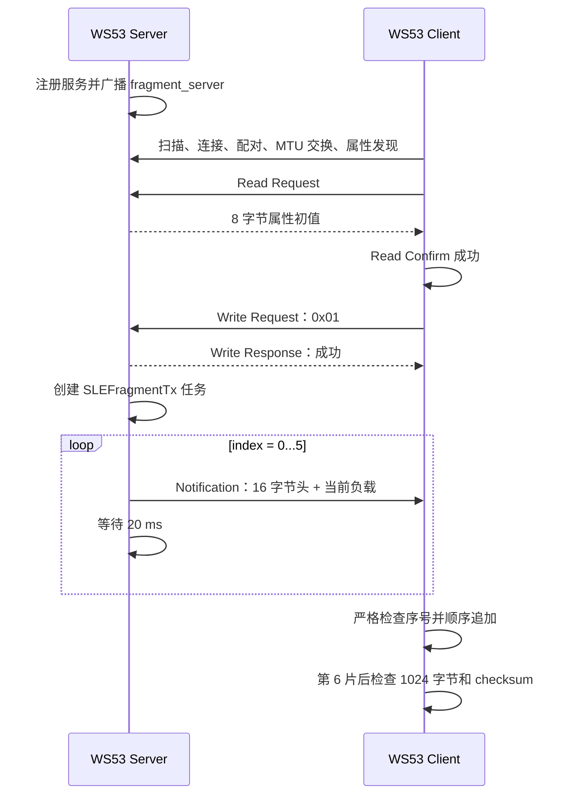

# 分片传输

> 使用技术：SLE、SSAP 属性读写、Notification、应用层分片与顺序重组、累加校验和

> 前置阅读：必须了解 [Hello SLE](../basics/hello-connect.md) 的扫描与连接流程，建议先完成 [Hello Notify](../basics/hello-notify.md) 的 Notification 实验。

本案例使用两块 WS53 演示固定长度的大数据传输：Client 通过 SSAP 写请求触发传输；Server 将 1024 字节测试数据拆成 6 个 Notification；Client 按分片序号顺序追加负载，并在最后一片到达后检查总长度和校验和。

## 学习目标

- 理解 SSAP MTU、分片头、单片负载和原始数据长度之间的关系。
- 掌握 Magic、传输 ID、片序号、总片数、负载长度和校验和的作用。
- 理解 WS53 当前实现是“严格顺序追加”，不是“携带偏移的乱序重组”。
- 掌握 Client 收包前的头部、长度、序号和缓冲区边界检查。
- 区分“触发请求已接受”“Server 已发送完成”和“Client 重组校验通过”三个验收层次。
- 了解 Notification 不提供应用层逐片确认，以及当前案例在丢片、乱序和并发传输方面的限制。

## 基本概念

### MTU 与有效负载

SSAP MTU 限制一次属性数据可承载的最大规模。本案例双方请求 MTU 520，但没有把 520 字节全部作为业务负载，而是把每片业务负载固定为 180 字节，并在前面增加分片头。

在当前 WS53 工具链下，`offsetof(sle_fragmentation_packet_t, payload)` 为 16，因此：

| 分片 | 业务负载 | 实际属性数据长度 |
|---|---|---|
| 第 1～5 片 | 180 字节 | 16 + 180 = 196 字节 |
| 第 6 片 | 124 字节 | 16 + 124 = 140 字节 |

最大属性数据长度 196 字节，小于请求的 MTU 520。MTU 是链路允许值，180 字节是本案例自行选择的应用层分片负载，两者不能混为同一个参数。

### 分片与重组

总片数使用向上取整公式计算：

```text
total = (data_size + payload_size - 1) / payload_size
```

Server 通过 `offset = index × 180` 从源缓冲区取出当前片，但这个 `offset` 只存在于 Server 局部计算中，并没有写进分片头。Client 要求收到的 `index` 必须等于 `g_next_fragment`，校验通过后把负载追加到 `g_reassembly_buffer[g_reassembly_length]`。

因此，当前实现只能重组从 0 开始、严格连续到达的分片，不具备按偏移接收乱序分片的能力。

### 分片元数据与接收状态

公共协议结构定义如下：

```c
typedef struct {
    uint16_t magic;
    uint16_t transfer_id;
    uint16_t index;
    uint16_t total;
    uint16_t payload_len;
    uint16_t reserved;
    uint32_t checksum;
    uint8_t payload[SLE_FRAGMENTATION_PAYLOAD_SIZE];
} sle_fragmentation_packet_t;
```

当前 16 字节头的字段为：

| 字段 | 长度 | WS53 当前值或作用 |
|---|---|---|
| `magic` | 2 | 固定为 `0x5346`，识别分片协议 |
| `transfer_id` | 2 | 固定为 1，识别传输会话 |
| `index` | 2 | 从 0 开始的片序号 |
| `total` | 2 | 固定为 6 |
| `payload_len` | 2 | 当前片有效负载长度，最大 180 |
| `reserved` | 2 | 保留字段；当前发送为 0，Client 不检查 |
| `checksum` | 4 | 完整 1024 字节源数据的累加和 |

需要特别注意：WS53 当前协议头没有 `offset` 字段。源码 README 中“分片头携带偏移”“按偏移重组”的描述与实际 `sle_fragmentation_protocol.h`、Client 实现不一致；本文以实际 C 源码为准，按 `reserved` 字段和严格顺序追加说明。

Client 使用两个全局状态量：

- `g_reassembly_length`：已经追加的有效字节数。
- `g_next_fragment`：下一片必须匹配的序号。

收到 `index == 0` 的分片时，Client 无条件把两者清零，开始或重新开始一次传输。

### Notification 与应用层可靠性

Notification 适合连续上报，不要求对端逐片返回应用确认。本案例每发送一片等待 20 ms，目的是降低连续提交速度，但固定等待不等于可靠传输机制。

当前协议没有：

- 分片 ACK/NACK；
- 接收位图；
- 丢片超时；
- 指定分片重传；
- 断点续传；
- 完成确认。

因此，Server 输出 `transfer complete` 只表示 6 次本地发送调用均返回成功，不能证明 Client 已经收齐并通过校验。

### 完整性检查不等于可靠传输

长度和校验值用于判断重组结果是否完整、内容是否变化，但不能自动恢复丢失或错误的数据。简单累加和实现成本低，但错误检测能力有限；CRC 更适合检测传输错误，带密钥的消息认证码则用于验证数据来源和防止篡改。

可靠传输解决“数据出错后怎样恢复”，完整性检查解决“怎样发现数据不完整或已变化”，两者不能互相替代。

## 涉及 API

API 按实际调用阶段排列。详细参数和返回值请查阅对应 API Reference。

| 阶段 | 前置状态 | 核心 API | 调用方 | 作用 |
|---|---|---|---|---|
| Server 初始化 | 案例任务启动 | `ssaps_register_callbacks()`、`ssaps_register_server()`、`ssaps_add_service_sync()`、`ssaps_add_property_sync()` | Server | 注册读、写和 Notify 属性 |
| 扫描与连接 | SLE 已使能 | `sle_start_seek()`、`sle_connect_remote_device()`、`sle_pair_remote_device()` | Client | 查找 `fragment_server` 并完成配对 |
| MTU 与发现 | 配对成功 | `ssapc_exchange_info_req()`、`ssapc_find_structure()` | Client | 请求 MTU 520 并取得属性 handle |
| 传输前读取 | 服务发现完成 | `ssapc_read_req()`、`ssaps_send_response()` | Client / Server | 确认属性读流程成功；读取数据本身不参与分片协议 |
| 触发传输 | 读确认成功 | `ssapc_write_req()`、`ssaps_send_response()` | Client / Server | 写入单字节 `0x01` 并返回触发状态 |
| 创建发送任务 | 触发值合法 | `osal_kthread_create()` | Server | 创建 `SLEFragmentTx` 任务 |
| 发送分片 | 发送任务运行 | `ssaps_notify_indicate()` | Server | 发送单个 Notification 分片 |
| 片间节流 | 单片发送成功 | `osal_msleep()` | Server | 相邻分片之间等待 20 ms |

## 案例说明

### 功能规格

| 规格项 | WS53 源码值 |
|---|---|
| Server 广播名称 | `fragment_server` |
| 服务 UUID | `0x3333` |
| 属性 UUID | `0x3434` |
| 触发命令 | 单字节 `0x01` |
| 原始数据长度 | 1024 字节 |
| 单片最大负载 | 180 字节 |
| 当前头长度 | 16 字节 |
| 最大/最小属性数据长度 | 196 / 140 字节 |
| 总片数 | 6 |
| MTU 请求值 | 520 字节，版本 1 |
| Magic | `0x5346` |
| Transfer ID | 1 |
| 片间等待 | 20 ms |
| 发送任务 | 优先级 27，栈大小 `0x1000` |

### 公共分片结构体

Client 和 Server 共用 `src/application/samples/bt/sle/sle_fragmentation/sle_fragmentation_protocol.h`。总片数由公共常量计算：

```c
#define SLE_FRAGMENTATION_DATA_SIZE 1024
#define SLE_FRAGMENTATION_PAYLOAD_SIZE 180
#define SLE_FRAGMENTATION_TOTAL_FRAGMENTS \
    ((SLE_FRAGMENTATION_DATA_SIZE + SLE_FRAGMENTATION_PAYLOAD_SIZE - 1) / \
     SLE_FRAGMENTATION_PAYLOAD_SIZE)
```

Server 不发送整个 `sle_fragmentation_packet_t` 的固定大小，而是根据当前有效负载计算实际长度：

```c
uint16_t packet_len =
    (uint16_t)(offsetof(sle_fragmentation_packet_t, payload) +
               packet.payload_len);
```

这样最后一片只发送 124 字节有效负载，不会发送 `payload[180]` 中剩余的未使用空间。

案例直接传输 C 结构体头，并在 Client 侧把接收缓冲区转换为结构体指针。跨编译器或跨架构使用时，应显式定义字节序、头长度、字段偏移和对齐方式，不能依赖当前编译器的结构体布局。

### 端到端交互流程



实际流程中，Client 不是在服务发现完成后直接写入 `0x01`：它先读取属性；只有 `read_cfm_cb` 收到成功状态才调用 `sle_fragmentation_client_send_write_req()`。Server 返回的 8 字节属性初值不参与后续分片重组，这个 Read Request 主要充当传输前的属性可读性和流程就绪检查。

### 三个验收层次

| 层次 | 关键日志 | 能证明什么 |
|---|---|---|
| 触发请求接受 | `transfer request accepted` | Server 接受了单字节 `0x01` 的写请求 |
| Server 发送完成 | `transfer complete` | 6 次本地 Notification 发送调用均返回成功 |
| Client 重组通过 | `reassembly complete` 和 `test passed` | Client 按序收到 6 片，总长度为 1024，最终累加和匹配 |

触发请求响应在创建发送任务之前返回，而且 `sle_fragmentation_start_transfer()` 不向写回调报告任务创建失败。因此 `transfer request accepted` 不能证明发送任务已经成功运行。最终功能验收必须以 Client 的 `test passed` 为准。

## 案例操作指导

### 准备开发板

准备两块 WS53 开发板和两个调试串口，分别作为 Server 和 Client。本案例不需要外接硬件。

### 配置、构建并烧录 Server

在 SDK 根目录执行：

```powershell
fbb config set CONFIG_SAMPLE_SUPPORT_SLE_FRAGMENTATION_SERVER_SAMPLE=y --target ws53_liteos_app
fbb build ws53_liteos_app --clean
fbb flash ws53_liteos_app --port <SERVER_COM> --json-summary
```

对应的 Kconfig 选择链为：

```text
CONFIG_ENABLE_BT_SAMPLE=y
CONFIG_SAMPLE_SUPPORT_SLE_SAMPLE=y
CONFIG_SAMPLE_SUPPORT_SLE_FRAGMENTATION_SERVER_SAMPLE=y
```

### 配置、构建并烧录 Client

Server 烧录完成后，切换到 Client 角色并重新构建：

```powershell
fbb config set CONFIG_SAMPLE_SUPPORT_SLE_FRAGMENTATION_CLIENT_SAMPLE=y --target ws53_liteos_app
fbb build ws53_liteos_app --clean
fbb flash ws53_liteos_app --port <CLIENT_COM> --json-summary
```

对应的 Kconfig 选择链为：

```text
CONFIG_ENABLE_BT_SAMPLE=y
CONFIG_SAMPLE_SUPPORT_SLE_SAMPLE=y
CONFIG_SAMPLE_SUPPORT_SLE_FRAGMENTATION_CLIENT_SAMPLE=y
```

固件包位于：

```text
output/ws53/fwpkg/ws53-liteos-app/ws53-liteos-app_all.fwpkg
```

### 运行与验收

1. 打开两块板的调试串口。
2. 先启动 Server，确认进入等待连接状态。
3. 再启动 Client。两端会自动完成建链和传输，无需人工输入。
4. 先检查 Server 的触发与发送日志，再以 Client 的重组日志做最终判定。

Server 关键日志应包含：

```text
[sle fragmentation server] transfer start: bytes=1024, fragments=6, checksum=130560
[sle fragmentation server] fragment sent: 1/6, payload=180
[sle fragmentation server] fragment sent: 6/6, payload=124
[sle fragmentation server] transfer complete
```

Client 关键日志应包含：

```text
[sle fragmentation client] transfer request accepted, handle=0x..
[sle fragmentation client] fragment received: 1/6, total_bytes=180
[sle fragmentation client] fragment received: 6/6, total_bytes=1024
[sle fragmentation client] reassembly complete: bytes=1024, checksum=130560
[sle fragmentation client] test passed
```

若 Server 已输出 `transfer complete`，但 Client 没有 `test passed`，仍应判定接收端验证失败。

### 常见问题

| 现象 | 检查项 |
|---|---|
| Client 一直扫描 | 确认 Server 已烧录 Server 角色，并广播 `fragment_server` |
| 服务发现后没有触发传输 | 查看 Read Confirm 是否成功；Client 只有读确认成功才发送 `0x01` |
| `transfer request failed` | 检查写入长度和值是否为单字节 `0x01`，非法值返回 `ERRCODE_SSAP_INCORRECT_DATA_VALUE` |
| `packet header rejected` | 检查 Magic、Transfer ID、总片数、负载长度和实际接收长度 |
| `sequence error` | 检查是否丢片、乱序或出现并发传输；当前实现不会自动恢复 |
| `checksum failed` | 对比实际总长度、实际累加和与最后一片携带的期望值 |

## 关键配置

### 角色与能力

顶层 SLE Sample `choice` 定义两个互斥角色：

```text
CONFIG_SAMPLE_SUPPORT_SLE_FRAGMENTATION_SERVER_SAMPLE
CONFIG_SAMPLE_SUPPORT_SLE_FRAGMENTATION_CLIENT_SAMPLE
```

选择 Server 后自动使能 `SUPPORT_SLE_PERIPHERAL`；选择 Client 后自动使能 `SUPPORT_SLE_CENTRAL`。

### 协议与任务参数

| 常量 | 值 | 源码位置 |
|---|---|---|
| `SLE_FRAGMENTATION_MAGIC` | `0x5346` | `sle_fragmentation_protocol.h` |
| `SLE_FRAGMENTATION_TRANSFER_ID` | 1 | `sle_fragmentation_protocol.h` |
| `SLE_FRAGMENTATION_DATA_SIZE` | 1024 | `sle_fragmentation_protocol.h` |
| `SLE_FRAGMENTATION_PAYLOAD_SIZE` | 180 | `sle_fragmentation_protocol.h` |
| `SLE_FRAGMENTATION_TOTAL_FRAGMENTS` | 6 | `sle_fragmentation_protocol.h` |
| `SLE_FRAGMENTATION_MTU_SIZE` | 520 | `sle_fragmentation_server.c` |
| `SLE_FRAGMENTATION_SEND_INTERVAL_MS` | 20 ms | `sle_fragmentation_server.c` |
| `SLE_FRAGMENTATION_SEND_TASK_PRIORITY` | 27 | `sle_fragmentation_server.c` |
| `SLE_FRAGMENTATION_SEND_TASK_STACK_SIZE` | `0x1000` | `sle_fragmentation_server.c` |

修改数据长度或负载长度时，应同时检查：总片数公式、发送任务栈占用、Client 重组缓冲区、最大属性数据长度和实际 MTU。修改协议头时必须同步修改两端，不能只调整 Server 的 `packet_len`。

## 代码详解

### 1. 代码目录与调用关系

```text
src/application/samples/bt/sle/sle_fragmentation/
├── sle_fragmentation.c
│   ├── sle_fragmentation_entry()
│   ├── Client 重组缓冲区与 Notification 回调
│   └── Client 最终长度和 checksum 验证
├── sle_fragmentation_protocol.h
│   └── 公共分片结构和长度常量
├── sle_fragmentation_server/src/
│   ├── sle_fragmentation_server.c
│   └── sle_fragmentation_server_adv.c
└── sle_fragmentation_client/src/
    └── sle_fragmentation_client.c
```

`sle_fragmentation_entry()` 根据 Kconfig 创建 `SLEFragmentServer` 或 `SLEFragmentClient` 任务，角色任务优先级为 28、栈大小为 `0x1000`。Server 收到触发后另建优先级 27 的 `SLEFragmentTx` 任务执行实际发送。

### 2. Server 只接受明确的触发值

Server 写回调只接受长度为 1、首字节为 1 的请求：

```c
bool valid_trigger =
    (write_cb_para->length == 1) &&
    (write_cb_para->value[0] == 1);
```

如果请求需要响应，合法触发返回成功，其他内容返回 `ERRCODE_SSAP_INCORRECT_DATA_VALUE`。响应发送完成后，合法请求才调用 `sle_fragmentation_start_transfer()`。

由于启动函数返回 `void`，任务创建失败无法反馈到已经发送的写响应；源码也没有使用忙标志拒绝第二个合法触发。

### 3. Server 计算边界并逐片发送

发送任务生成递增测试数据并计算完整校验和：

```c
for (uint16_t index = 0; index < sizeof(source); index++) {
    source[index] = (uint8_t)(index & 0xFF);
}
```

每轮根据片序号计算源数据偏移和剩余长度：

```c
uint16_t offset = index * SLE_FRAGMENTATION_PAYLOAD_SIZE;
uint16_t remaining = (uint16_t)(sizeof(source) - offset);
packet.payload_len =
    (remaining > SLE_FRAGMENTATION_PAYLOAD_SIZE) ?
    SLE_FRAGMENTATION_PAYLOAD_SIZE : remaining;
```

复制和 Notification 发送任一失败都会立即结束任务，不再发送后续分片。全部 6 片的发送调用都返回成功后，Server 才输出 `transfer complete`。

### 4. Client 先校验再写入缓冲区

Notification 回调依次执行以下检查：

| 检查 | 失败日志 |
|---|---|
| 回调状态成功，数据长度不少于当前头长度 | `invalid packet` |
| Magic、Transfer ID 和总片数匹配 | `packet header rejected` |
| `payload_len <= 180` | `packet header rejected` |
| 实际数据长度严格等于头长度加负载长度 | `packet header rejected` |
| `index == g_next_fragment` | `sequence error` |
| 追加后不超过 1024 字节缓冲区 | `sequence error` |
| `memcpy_s()` 成功 | `payload copy failed` |

只有全部检查通过，Client 才追加负载、增加累计长度并递增下一片序号。源码不保存乱序分片，也不在序号错误后跳过缺失位置。

### 5. 0 号片重置接收状态

回调在进行序号检查之前处理：

```c
if (packet->index == 0) {
    g_reassembly_length = 0;
    g_next_fragment = 0;
}
```

这让新一轮传输可以从 0 号片重新开始，但没有同时检查新的 Transfer ID，因为 Transfer ID 始终固定为 1。重复或并发到达的 0 号片也会清空当前进度。

### 6. 最后一片触发完整性校验

每接收一片，`g_next_fragment` 加 1。当它等于头中的 `total` 时，Client 对当前重组缓冲区重新求和：

```c
if ((g_reassembly_length == SLE_FRAGMENTATION_DATA_SIZE) &&
    (checksum == packet->checksum)) {
    osal_printk("[sle fragmentation client] test passed\r\n");
}
```

因此 `test passed` 的成立条件是：6 片按序通过检查、累计长度恰好 1024，并且计算结果等于最后一片头中的 `checksum`。它不代表协议具备重传、安全校验或多会话隔离能力。
