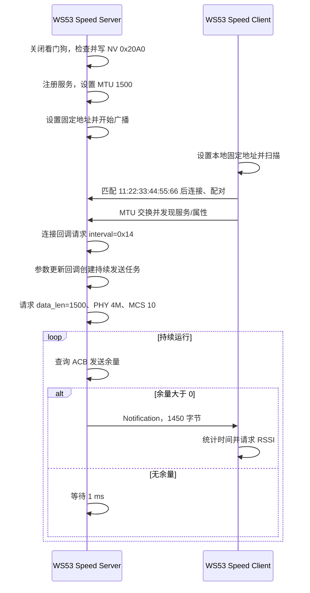

# 高吞吐传输

> 使用技术：SLE、SSAP Notification、MTU 与链路数据长度、连接参数、PHY/MCS、发送流控、TCXO 吞吐统计

> 前置阅读：必须了解 [Hello Connect](../basics/hello-connect.md) 的扫描与连接流程，建议先完成 [Hello Notify](../basics/hello-notify.md) 的 Notification 实验。

本案例的意图是使用两块 WS53 建立持续 Notification 链路：Server 请求较大的 MTU 和链路数据长度，设置 PHY/MCS，并根据发送余量连续提交 1450 字节数据；Client 使用 TCXO 时间戳计算应用层接收速率，并周期读取 RSSI。

## 构建前置修正

当前 WS53 `src/application/samples/bt/sle/Kconfig` 把 `LARGE_THROUGHPUT_SERVER` 放在 SLE Sample 的同一个 `choice` 内，同时又让它依赖 `SAMPLE_SUPPORT_SLE_SPEED_SERVER_SAMPLE`。按标准 Kconfig `choice` 语义，两个选项不能同时为 `y`；只选择 Server 时，受 `#ifdef CONFIG_LARGE_THROUGHPUT_SERVER` 保护的发送任务可能不会编译。执行吞吐测试前必须先修正该 Kconfig 结构，并检查最终配置中两个宏确实同时生效。

## 学习目标

- 区分应用层吞吐量、PHY 标称能力和空口总开销。
- 理解 SSAP MTU、链路数据长度与单个 Notification 数据长度的关系。
- 掌握 `sle_set_data_len()`、`sle_set_phy_param()` 和 `sle_set_mcs()` 的调用位置。
- 理解连接参数请求值与实际生效值的区别，并识别源码中的范围冲突。
- 理解发送余量检查的作用，以及当前封装没有返回真实发送结果的限制。
- 掌握 Client 统计窗口、RSSI 平均值和日志判读方法。
- 识别当前 Kconfig、NV、看门狗和发送任务生命周期方面的源码风险。

## 基本概念

### 应用层吞吐量

Client 统计的是 Notification 回调收到的属性数据量，不是 PHY 标称速率，也不包含协议头、连接事件、确认、重传和空口调度等开销。源码使用：

```text
speed(bit/s) = data_len(byte) × RECV_PKT_CNT × 8 ÷ time(s)
             = data_len × 100 × 8 ÷ time
```

正常发送时 `data_len` 为 1450。若 100 个统计间隔耗时为 `T` 秒，则日志中的速率为：

```text
1450 × 100 × 8 ÷ T = 1,160,000 ÷ T bit/s
```

Client 的计数逻辑使用第 1 个 Notification 回调记录起点，在第 101 个回调记录终点。因此第一次输出需要经历 101 次回调，计算的是两次时间锚点之间的 100 个回调间隔。后续窗口以上一次终点作为新起点。

### PHY 与 MCS

PHY 决定无线帧类型、收发 PHY 和导频密度，MCS 表示调制与编码策略索引。发送任务请求以下固定参数：

```c
sle_set_phy_t phy_parm = {
    .tx_format = SLE_RADIO_FRAME_2,
    .rx_format = SLE_RADIO_FRAME_2,
    .tx_phy = SLE_PHY_4M,
    .rx_phy = SLE_PHY_4M,
    .tx_pilot_density = SLE_PHY_PILOT_DENSITY_16_TO_1,
    .rx_pilot_density = SLE_PHY_PILOT_DENSITY_16_TO_1,
    .g_feedback = 0,
    .t_feedback = 0,
};

sle_set_phy_param(g_sle_conn_hdl, &phy_parm);
sle_set_mcs(g_sle_conn_hdl, 10);
```

源码没有检查这两个 API 的返回值，也没有通过完成事件确认最终参数。因此文档只能把它们表述为“请求 PHY 4M、MCS 10”，不能根据随后打印的文本认定配置已经生效。

Server 日志包含：

```text
code: ploar MCS10, PHY 4MHZ, power: 20dbm
```

该日志是无条件打印的固定字符串。其中 “MCS10/PHY 4MHZ” 没有绑定 API 返回结果，“power: 20dbm” 也不是发送任务调用功率设置 API 后得到的确认值，不能作为实测配置证据。

### MTU、链路数据长度与应用包长

三者位于不同层次：

| 层次 | WS53 源码请求值 | 作用 |
|---|---:|---|
| SSAP MTU | 1500 | Server `ssaps_set_info()` 和 Client MTU 交换的请求值 |
| 链路数据长度 | 1500 | `sle_set_data_len()` 请求的首选最大发送 payload 字节数 |
| Notification 数据长度 | 1450 | 每次 `ssaps_notify_indicate()` 提交的应用数据长度 |

应用包长小于 MTU 和链路数据长度。任一层实际协商或实现的上限更小，都会限制最终数据长度。看到 Server 打印 `set info` 不能代替 Client 的 MTU 交换回调；验证时应检查 Client 日志中的实际 `mtu size`。

### 连接间隔请求与源码冲突

Server 和 Client 都把默认连接间隔设置为 `0x14`，Server 连接后还通过 `sle_update_connect_param()` 再次请求相同值，监督超时请求值为 `0x1F4`。

WS53 `sle_device_discovery.h` 对连接间隔的定义是：

```text
合法范围：0x001E～0x3E80
时间换算：interval × 0.25 ms
```

据此，`0x14` 换算为 5 ms，但低于最小合法值 `0x001E`（7.5 ms）。`sle_speed_server_adv.c` 中“`0x14` 表示 12.5 ms、单位 125 us”的注释与数值计算、当前 API 头文件也不一致。

此外，Server 没有检查 `sle_update_connect_param()` 的直接返回值；参数更新回调又忽略 `status`。因此：

- `0x14` 只能称为源码请求值；
- 不能写成“实际连接间隔为 5 ms”或“实际为 12.5 ms”；
- 应以参数更新回调中的 `interval` 和 `status` 为准；
- 修正案例时，应把请求值调整到当前 WS53 API 声明的合法范围。

### 发送流控

发送任务通过内部函数 `gle_tx_acb_data_num_get()` 获取可用 ACB 发送数量：

```c
if (sle_flow_ctrl_flag() > 0) {
    /* 提交下一包 */
} else {
    osal_msleep(1);
}
```

这个判断可以避免在没有发送余量时持续忙等提交，但它不是完整的可靠发送机制。当前 `sle_uuid_server_send_report_by_handle_id()` 调用 `ssaps_notify_indicate()` 后丢弃其返回值，并固定返回成功；发送任务也不检查这个固定返回值。因此即使协议栈提交失败，Server 仍会继续循环，源码没有失败计数、退避或终止逻辑。

## 涉及 API

| 阶段 | 前置状态 | 核心 API | 调用方 | 作用与当前限制 |
|---|---|---|---|---|
| Server 初始化 | 角色任务启动 | `uapi_watchdog_disable()` | Server | 关闭看门狗；当前案例运行期间不会恢复 |
| NV 初始化 | Server 启动 | `uapi_nv_read()`、`uapi_nv_write()` | Server | 将 NV `0x20A0` 调整为 7 |
| SSAP 初始化 | SLE 已使能 | `ssaps_set_info()`、`ssaps_add_service_sync()`、`ssaps_add_property_sync()` | Server | 请求 MTU 1500，注册 Notify 属性 |
| 扫描与连接 | 双方就绪 | `sle_start_seek()`、`sle_connect_remote_device()`、`sle_pair_remote_device()` | Client | 按固定地址查找并连接 Server |
| MTU 与发现 | 配对成功 | `ssapc_exchange_info_req()`、`ssapc_find_structure()` | Client | 请求 MTU 1500 并发现服务、属性 |
| 连接参数 | 已连接 | `sle_update_connect_param()` | Server | 请求 `0x14`；返回值未检查且请求值低于 API 下限 |
| 链路数据长度 | 发送任务启动 | `sle_set_data_len()` | Server | 请求 1500；返回值未检查 |
| PHY/MCS | 发送任务启动 | `sle_set_phy_param()`、`sle_set_mcs()` | Server | 请求 PHY 4M、MCS 10；返回值未检查 |
| Notification | 有发送余量 | `ssaps_notify_indicate()` | Server | 提交 1450 字节；真实返回值被封装函数丢弃 |
| 时间统计 | Client 收包 | `uapi_tcxo_get_us()` | Client | 记录微秒时间戳并计算 bit/s |
| RSSI 统计 | 每次收包 | `sle_read_remote_device_rssi()` | Client | 异步读取 RSSI，每 100 次回调输出平均值 |

## 案例说明

### 功能规格

| 规格项 | WS53 源码值或状态 |
|---|---|
| Server 固定地址 | `11:22:33:44:55:66` |
| Client 固定地址 | `13:67:5C:07:00:51` |
| Server 扫描响应名称 | `sle_speed_server` |
| Client 筛选条件 | 只比较 Server 固定地址，不比较名称或服务 UUID |
| 服务 UUID | `0x060B` |
| Notification 属性 UUID | `0x1122` |
| SSAP MTU 请求值 | 1500 |
| 链路数据长度请求值 | 1500 |
| 单包应用数据 | 1450 字节 |
| 包内容 | 前 2 字节为递增计数，剩余字节为静态零初始化缓冲区 |
| 统计间隔数 | 100 |
| PHY/MCS 请求值 | `SLE_PHY_4M` / 10 |
| 连接间隔请求值 | `0x14`，低于当前 API 下限 |
| 监督超时请求值 | `0x1F4`，即 5 s |
| 广播功率参数 | 20；仅为广播配置请求值 |
| Server NV 操作 | NV ID `0x20A0` 被调整为 7 |
| 发送任务开关 | `CONFIG_LARGE_THROUGHPUT_SERVER`；当前 Kconfig 布局存在冲突 |

### 端到端交互流程



需要注意，参数更新回调没有判断 `status` 就尝试创建任务，所以图中的“参数更新回调创建任务”不等同于“连接参数更新已成功”。

### 验收层次

| 层次 | 证据 | 能证明什么 |
|---|---|---|
| 建链与 MTU | Client 配对、`exchange mtu` 和服务发现日志 | 双方已连接，Client 收到 MTU 交换结果 |
| 发送任务运行 | `kthread success` 和固定 PHY/MCS 文本 | 参数更新回调走到了任务创建路径；不能证明各参数 API 成功 |
| Client 持续收包 | 连续出现 `speed = ... bps` | Notification 回调持续收到数据并完成时间窗口统计 |
| RSSI 统计 | `rssi average = ... dbm` | RSSI 回调累计了 100 次结果 |

本案例没有序号校验、总包数、结束条件或已知数据校验，所以 `speed` 日志只能证明回调收到了数据，不能证明期间无丢包、无乱序或内容正确。

### 源码副作用与限制

- 当前 Kconfig 把 `LARGE_THROUGHPUT_SERVER` 放在同一个 `choice` 内并依赖 Server 选项，按标准语义无法与 Server 同时选择；不修正时可能只有建链，没有连续发送。
- Server 初始化立即调用 `uapi_watchdog_disable()`，之后没有重新使能看门狗。
- Server 会读写 NV ID `0x20A0`，将一字节值设置为 7。源码注释称其为 BT 功率档位，但没有在本案例中提供该值到实际 dBm 的权威映射。
- NV 读取调用的最大长度写成 `sizeof(uint16_t)`，接收变量却是 `uint8_t`；长度声明与缓冲区大小不一致，应在产品使用前修正为 `sizeof(nv_value)`。
- Server 和 Client 使用硬编码本地地址；Client 只认固定 Server 地址，修改任一侧地址时必须同步检查筛选逻辑。
- 连接间隔 `0x14` 低于当前 API 头文件声明下限，源码注释的单位和换算也不一致。
- 参数更新回调忽略 `status`；数据长度、PHY 和 MCS API 返回值也全部被忽略。
- `ssaps_notify_indicate()` 的真实返回值被丢弃，Server 没有准确的发送失败日志。
- 发送线程是无限循环，没有连接状态门控、停止标志或退出路径；断链时 Server 只恢复广播，没有停止线程。
- `g_ssap_handle` 在创建任务后被释放但仍作为非空哨兵使用，重连时不会再创建新任务。
- 每包只有前两字节写入递增值，Client 不解析该值，因此不检测丢包、重复、乱序或 16 位回绕。
- Client Notification 回调忽略回调 `status`，也没有校验数据指针和长度是否符合 1450。
- 吞吐计算没有防止时间差为 0，使用单精度 `float`，小数输出为截断而非严格四舍五入。
- Client 每个 Notification 都请求一次 RSSI，测量调用本身可能影响高吞吐场景的调度负载。
- 源码没有提供 WS53 板级吞吐基线或保证值，不能在文档中给出固定合格速率。

## 案例操作指导

### 准备开发板

准备两块 WS53 开发板和两个调试串口，分别作为 Speed Server 和 Speed Client。本案例不需要外接硬件。首次验证时让两块板近距离放置，并记录固件版本、距离和射频环境。

### 先处理 Kconfig 阻塞项

当前源树不能把下面两个配置当作普通的独立开关直接同时选择：

```text
CONFIG_SAMPLE_SUPPORT_SLE_SPEED_SERVER_SAMPLE=y
CONFIG_LARGE_THROUGHPUT_SERVER=y
```

原因是 `LARGE_THROUGHPUT_SERVER` 位于 SLE Sample 的 `choice` 内。要执行连续发送，应先在源码中完成以下等价修正之一：

- 将 `config LARGE_THROUGHPUT_SERVER` 移到 `endchoice` 之后，使其成为依赖 Server 角色的普通布尔选项；或
- 删除单独的 `LARGE_THROUGHPUT_SERVER` 条件，让连续发送代码直接随 Speed Server 角色编译。

本文不替用户选择具体源码修复方案。修正后必须检查最终 `.config` 或生成配置头，确认以下两个宏同时存在，再进行吞吐验证。

### 配置、构建并烧录 Server

Kconfig 结构修正后，在 SDK 根目录执行：

```powershell
fbb config set CONFIG_SAMPLE_SUPPORT_SLE_SPEED_SERVER_SAMPLE=y --target ws53_liteos_app
fbb config set CONFIG_LARGE_THROUGHPUT_SERVER=y --target ws53_liteos_app
fbb build ws53_liteos_app --clean
fbb flash ws53_liteos_app --port <SERVER_COM> --json-summary
```

对应选择链为：

```text
CONFIG_ENABLE_BT_SAMPLE=y
CONFIG_SAMPLE_SUPPORT_SLE_SAMPLE=y
CONFIG_SAMPLE_SUPPORT_SLE_SPEED_SERVER_SAMPLE=y
CONFIG_LARGE_THROUGHPUT_SERVER=y
```

烧录该 Server 固件前，应确认 NV `0x20A0` 的修改和关闭看门狗符合当前测试环境要求。

### 配置、构建并烧录 Client

```powershell
fbb config set CONFIG_SAMPLE_SUPPORT_SLE_SPEED_CLIENT_SAMPLE=y --target ws53_liteos_app
fbb build ws53_liteos_app --clean
fbb flash ws53_liteos_app --port <CLIENT_COM> --json-summary
```

对应选择链为：

```text
CONFIG_ENABLE_BT_SAMPLE=y
CONFIG_SAMPLE_SUPPORT_SLE_SAMPLE=y
CONFIG_SAMPLE_SUPPORT_SLE_SPEED_CLIENT_SAMPLE=y
```

Server 与 Client 属于同一个 SLE Sample `choice`，需要分别构建和烧录。固件包位于：

```text
output/ws53/fwpkg/ws53-liteos-app/ws53-liteos-app_all.fwpkg
```

### 运行与首次检查

1. 先启动 Server，检查 NV、服务、固定地址和广播相关日志。
2. 再启动 Client，检查是否匹配固定地址并完成连接、配对、MTU 交换和服务发现。
3. 检查参数更新回调报告的 `interval`，不要根据 `0x14` 的源码注释推断实际间隔。
4. 确认发送任务启动后，观察 Client 是否连续输出吞吐量和 RSSI 平均值。

Server 可能输出：

```text
[speed server] The value of nv is set to 7.
[ssap server] update state changed conn_id:..., interval = ...
kthread success
code: ploar MCS10, PHY 4MHZ, power: 20dbm
```

最后一行只是固定文本，不能作为参数设置成功的确认。

Client 每个统计窗口输出：

```text
g_count_after_get_us = ..., g_count_before_get_us = ..., data_len = 1450
time = ... s
speed = ... bps
rssi average = ... dbm
```

### 如何记录吞吐结果

至少记录以下条件：

| 条件 | 建议记录内容 |
|---|---|
| 固件 | SDK/提交版本、Server 与 Client 配置 |
| 链路 | 参数更新回调报告的实际 interval、MTU 交换结果 |
| 射频请求 | PHY/MCS 请求值；若有确认接口，再记录实际值 |
| 环境 | 板间距离、遮挡、信道干扰、供电方式 |
| 数据 | 连续多个 `speed` 窗口、RSSI 平均值、异常日志 |

不要只取单个最高窗口作为结果。建议丢弃刚建链后的首个窗口，连续记录多个稳定窗口，再计算平均值、最小值和波动范围。不同固件或环境之间比较时，应保持统计窗口和链路条件一致。

### 常见问题

| 现象 | 检查项 |
|---|---|
| Client 一直扫描 | 检查 Server 固定地址是否仍为 `11:22:33:44:55:66`；Client 不按名称连接 |
| 能连接但没有 `kthread success` | 检查 `CONFIG_LARGE_THROUGHPUT_SERVER` 是否实际编译，以及参数更新回调是否发生 |
| `kthread success` 后没有吞吐日志 | 检查 MTU、属性发现、Notification 接收和发送余量；源码缺少真实发送错误返回 |
| interval 与文档换算不一致 | 以当前 API 头文件和回调实际值为准，修正 `0x14` 请求值 |
| 吞吐波动较大 | 同时查看 RSSI、板间距离、干扰、任务负载和多个统计窗口 |
| 重连后行为异常 | 当前发送线程没有断链退出和重建机制，需要先修正任务生命周期 |

## 关键配置

### 角色与高速发送条件

```text
CONFIG_SAMPLE_SUPPORT_SLE_SPEED_SERVER_SAMPLE
CONFIG_SAMPLE_SUPPORT_SLE_SPEED_CLIENT_SAMPLE
CONFIG_LARGE_THROUGHPUT_SERVER
```

前两个角色属于 SLE Sample `choice`。第三个配置在当前源码中位置错误，不能按普通依赖项理解。

### 链路与统计常量

| 常量 | 值 | 源码位置 |
|---|---:|---|
| `PKT_DATA_LEN` | 1450 | `sle_speed_server.c` |
| `DEFAULT_SLE_SPEED_DATA_LEN` | 1500 | `sle_speed_server.c` |
| `DEFAULT_SLE_SPEED_MTU_SIZE` | 1500 | `sle_speed_server.c` |
| `DEFAULT_SLE_SPEED_MCS` | 10 | `sle_speed_server.c` |
| `SPEED_DEFAULT_CONN_INTERVAL` | `0x14`，当前非法请求值 | Server / Client |
| `SPEED_DEFAULT_TIMEOUT_MULTIPLIER` | `0x1F4` | Server / Client |
| `RECV_PKT_CNT` | 100 | `sle_speed_client.c` |
| Server 任务优先级/栈 | 26 / `0x2000` | `sle_speed_server.c` |
| 发送任务优先级/栈 | 27 / `0x2000` | `sle_speed_server.c` |
| Client 任务优先级/栈 | 26 / `0x2000` | `sle_speed_client.c` |

修改单包长度时，应同步检查 SSAP MTU、链路数据长度、协议栈支持范围和 Client 统计假设。修改 `RECV_PKT_CNT` 只改变统计窗口和 RSSI 输出周期，不会直接提高吞吐量。

## 代码详解

### 代码目录与调用关系

```text
src/application/samples/bt/sle/
├── sle_speed_server/
│   ├── inc/sle_speed_server.h
│   └── src/
│       ├── sle_speed_server.c
│       └── sle_speed_server_adv.c
└── sle_speed_client/
    └── src/sle_speed_client.c
```

Server 和 Client 是两个独立入口：Server 创建名为 `speed` 的任务，Client 创建名为 `RadarTask` 的任务。两者不是由共享的业务入口文件统一选择。

### Server 初始化的额外操作

`sle_speed_server_init()` 的顺序是：

```text
关闭看门狗
  → 读取并可能写入 NV 0x20A0
  → 注册连接与 SSAPS 回调
  → 使能 SLE
  → 注册服务并请求 MTU 1500
  → 设置默认连接参数
  → 设置固定本地地址
  → 开始广播
```

初始化函数没有逐项检查这些调用的返回值，最终仍返回 `ERRCODE_SLE_SUCCESS`。排查问题时必须查看各阶段日志，不能只依赖入口返回值。

### Client 只匹配固定地址

扫描结果回调使用以下条件：

```c
uint8_t mac[SLE_ADDR_LEN] =
    {0x11, 0x22, 0x33, 0x44, 0x55, 0x66};
if (memcmp(seek_result_data->addr.addr, mac, SLE_ADDR_LEN) == 0) {
    /* 保存地址并停止扫描 */
}
```

虽然 Server 扫描响应包含名称 `sle_speed_server`，Client 没有解析该名称，也没有在扫描阶段按服务 UUID 筛选。

### 参数更新回调创建发送任务

Server 连接回调提交 `sle_update_connect_param()`。随后 `sle_sample_update_cbk()` 无论 `status` 值如何，只要 `g_ssap_handle == NULL` 就尝试创建 `SsapSampleTask`。

因此发送任务启动条件实际上是“收到参数更新回调”，不是“确认参数更新成功”。生产实现应先检查回调 `status` 和实际参数，再决定是否启动高负载发送。

### Server 请求高速参数

发送任务启动后依次调用：

```c
sle_set_data_len(g_sle_conn_hdl, 1500);
sle_set_phy_param(g_sle_conn_hdl, &phy_parm);
sle_set_mcs(g_sle_conn_hdl, 10);
```

三个返回值均未保存。若需要可验证的实验，应记录每个 API 的返回值，并在协议栈提供相应事件时记录最终生效参数。

### Server 根据发送余量连续提交

发送缓冲区是 1450 字节静态数组。每次有余量时递增 `i`，把低 16 位按高字节、低字节写入 `data[0]` 和 `data[1]`，其余字节保持为 0，然后提交 Notification。

```c
i++;
data[0] = (i >> 8) & 0xFF;
data[1] = i & 0xFF;
sle_uuid_server_send_report_by_handle_id(
    data, PKT_DATA_LEN, g_sle_conn_hdl);
```

当前 Client 不解析这两个字节，所以它们还没有发挥丢包检测作用。若增加校验，需要定义 16 位回绕和断连重置规则。

### 发送封装隐藏错误

当前封装为：

```c
ssaps_notify_indicate(g_server_id, connect_id, &param);
return ERRCODE_SLE_SUCCESS;
```

它没有返回 `ssaps_notify_indicate()` 的真实结果。更合理的实现应直接返回该 API 的返回值，并让发送循环根据错误类型执行统计、退避或退出。

### Client 计算应用层吞吐量

Notification 回调第一次进入时保存 `g_count_before_get_us`；当进入回调前的计数等于 100 时，读取结束时间并计算：

```c
float time =
    (float)(g_count_after_get_us - g_count_before_get_us) /
    1000000.0;
float speed = data->data_len * RECV_PKT_CNT * 8 / time;
```

计算假设窗口内每包长度都与当前 `data->data_len` 相同。当前 Server 固定发送 1450 字节，因此该假设在正常路径成立；若未来支持变长包，应累计每包实际字节数，而不是用最后一个长度乘以 100。

### RSSI 统计与吞吐统计相互独立

每次 Notification 回调都会调用 `sle_read_remote_device_rssi(conn_id)`。RSSI 回调把返回值相加，累计 100 次后输出整数平均值。由于 RSSI 读取是异步的，RSSI 的 100 次回调不一定与某一个吞吐窗口逐包严格对应；分析时应把它视为邻近时段的链路质量参考。
