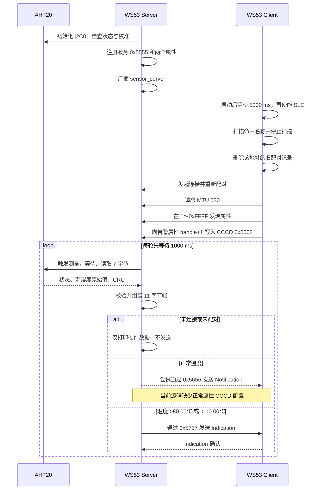

# 传感器上报

> 使用技术：SLE(SparkLink Low Energy)、SSAP(SLE Service Access Protocol) Notification/Indication、AHT20、I2C0、定长应用帧、阈值告警

> 前置阅读：必须了解 [Hello SLE](../basics/hello-connect.md) 的扫描与连接流程，建议先完成 [Hello Notify](../basics/hello-notify.md) 的 Notification 实验。

本案例使用两块 WS53：Server 通过 I2C0 读取 AHT20 兼容温湿度传感器，按固定延时循环组装 11 字节数据帧；Client 扫描名为 `sensor_server` 的设备，连接、配对并完成服务发现后接收数据。

## 运行前置修正

当前 WS53 源码存在两个会影响端到端验证的问题。第一，Server 广播参数中的连接间隔、最大时延和监管超时组合不满足当前 API 的监管超时约束，但 `sle_set_announce_param()` 的返回值被忽略。第二，常规数据属性 `0x5656` 只添加了用户描述符，没有客户端配置描述符（CCCD）；Client 也只为告警属性写入 `0x0002`，没有为常规属性写入 `0x0001`。根据 `ssaps_notify_indicate()` 的 API 说明，Notification/Indication 的发送状态取决于 CCCD。执行完整上报实验前应先修正这两处源码问题。

## 学习目标

- 掌握 WS53 I2C0 与 AHT20 兼容传感器的接线、初始化、测量和 CRC 校验流程。
- 理解 11 字节定长应用帧的字段、缩放、端序和时间戳限制。
- 区分固定延时工作任务与周期定时器，理解当前上报周期为何大于 1000 ms。
- 理解正常数据属性和告警属性的操作位、描述符及 CCCD 配置关系。
- 掌握 Client 的扫描、配对、MTU 交换、属性发现和数据接收流程。
- 能分层验证传感器采样、SLE 建链、常规 Notification、告警 Indication 和指示确认。
- 识别当前广播参数、描述符配置、属性发现和业务协议方面的源码限制。

## 基本概念

### 固定延时循环不是周期定时器

Server 入口创建一个永久工作任务。初始化成功后，任务每轮先休眠 1000 ms，再同步读取传感器并尝试发送：

```c
while (1) {
    (void)osal_msleep(SENSOR_REPORT_INTERVAL_MS);
    sle_sensor_report_server_process();
}
```

源码没有使用 `osal_timer_init()`、`osal_timer_start()` 或定时器回调。因此 `SENSOR_REPORT_INTERVAL_MS = 1000` 表示相邻两次处理之间的固定等待时间，不是严格的 1 秒采样周期。

AHT20 每次测量至少还包含 80 ms 测量等待，并可能包含状态查询和忙重试等待。串口输出和协议栈调用也会占用时间。因此相邻两次采样的实际间隔通常大于：

```text
1000 ms + 80 ms
```

若产品要求固定采样频率，应使用绝对时间基准补偿处理耗时，不能直接把这个循环称为“精确 1 秒定时器”。

### 采样与无线发送是两个阶段

`sle_sensor_report_server_process()` 先调用 `sensor_aht20_read()`，成功后组帧、打印硬件数据，最后才检查：

```c
if (!g_connected || !g_reporting_enabled) {
    return;
}
```

因此：

- Server 未连接时仍会周期读取 AHT20 并打印 `source=hardware`；
- 已连接但配对尚未成功时也会采样，但不会调用 `ssaps_notify_indicate()`；
- `g_reporting_enabled` 只在配对成功回调中置为 `true`；
- 断链时先关闭上报门控，再清除连接状态和连接句柄。

“串口有传感器数据”只能证明硬件采样成功，不能证明数据已经通过 SLE 发出。

### AHT20 测量值与校验

Server 使用地址 `0x38` 的 AHT20 兼容器件。驱动的主要步骤为：

1. 配置 MIO21/MIO22 的 PinMux，并以 100 kHz 初始化 I2C0。
2. 读取状态并等待设备空闲；未校准时发送 `{0xBE, 0x08, 0x00}`。
3. 每次测量发送 `{0xAC, 0x33, 0x00}`，等待 80 ms 后读取 7 字节响应。
4. 检查忙状态、校准状态和第 7 字节 CRC。
5. 把 20 位原始值换算为温度放大 100 倍和整数湿度百分比。

CRC-8 的初值为 `0xFF`，多项式为 `0x31`，计算范围是响应的前 6 字节。温度换算结果只接受 -40.00～85.00 ℃，湿度四舍五入到 0～100 的整数百分比。

这里的 CRC 只校验 AHT20 的 I2C 测量响应。11 字节 SLE 应用帧本身没有 CRC，不能把传感器 CRC 当成端到端无线数据完整性校验。

### 两个属性与 CCCD

Server 在服务 `0x5555` 下添加两个属性：

| 属性 | 操作指示位 | 当前描述符 | 源码意图 |
|---|---|---|---|
| `0x5656` | READ、NOTIFY | USER_DESCRIPTION，值 `{0x01,0x00}` | 正常温度数据 Notification |
| `0x5757` | READ、INDICATE | CLIENT_CONFIGURATION，初值 `{0x02,0x00}` | 越阈值数据 Indication |

`SSAP_DESCRIPTOR_USER_DESCRIPTION` 是属性说明描述符，不是 CCCD。把 `{0x01,0x00}` 放在用户描述符中，不等于允许 Notification。

WS53 `ssaps_notify_indicate()` 的 API 说明明确给出客户端配置描述符值：

```text
0x0000：不允许 Notification 和 Indication
0x0001：允许 Notification
0x0002：允许 Indication
```

当前 Client 在服务发现完成后只向 `g_alarm_property_handle + 1` 写入 `0x0002`，没有给正常数据属性写入 `0x0001`。要可靠验证正常上报，至少需要让 `0x5656` 具有可写 CCCD，并由 Client 向发现到的真实 CCCD handle 写入 `0x0001`。

### 告警是周期采样结果，不是即时中断

源码的告警条件为：

```c
bool is_alarm = (frame.temperature > TEMP_ALARM_HIGH ||
                 frame.temperature < TEMP_ALARM_LOW);
```

其中高阈值为 80.00 ℃，低阈值为 -10.00 ℃。比较使用严格大于和严格小于，所以恰好 80.00 ℃或 -10.00 ℃仍走常规路径。

告警判断只在每次固定延时循环采样后执行，不是传感器中断触发的“立即告警”。只要温度持续越界，每一轮都会尝试发送告警 Indication；源码没有告警边沿检测、去抖、迟滞或最小重复间隔。

头文件还定义了 `HUMIDITY_ALARM_LOW = 20`，但业务判断没有使用该宏。低湿度不会触发告警。

### 11 字节应用帧

Server 和 Client 分别定义了布局相同的 packed 结构体：

```c
typedef struct {
    uint8_t  frame_type;
    uint8_t  sensor_count;
    uint32_t timestamp;
    int16_t  temperature;
    uint8_t  humidity;
    uint16_t light;
} __attribute__((packed)) sensor_data_frame_t;
```

| 偏移 | 字段 | 长度 | 当前取值或含义 |
|---|---|---|---|
| 0 | `frame_type` | 1 | `0x01` 正常帧，`0x02` 告警帧 |
| 1 | `sensor_count` | 1 | 固定为 2，表示温度和湿度 |
| 2 | `timestamp` | 4 | `osal_gettimeofday()` 换算的低 32 位毫秒值 |
| 6 | `temperature` | 2 | 摄氏度放大 100 倍，有符号 |
| 8 | `humidity` | 1 | 四舍五入后的相对湿度百分比 |
| 9 | `light` | 2 | 当前固定为 0，日志显示 `N/A` |

各字段长度之和为：

```text
1 + 1 + 4 + 2 + 1 + 2 = 11 字节
```

当前代码直接复制 packed 结构体，未定义网络字节序；Client 也直接把接收缓冲区强转为结构体。两端都是 WS53 时布局一致，但这不是可移植的跨架构协议。`uint32_t` 毫秒时间戳约 49.7 天回绕一次，帧中也没有版本、序号或应用层校验字段。

## 涉及 API

| 阶段 | 核心 API | 调用方 | 当前用途与注意事项 |
|---|---|---|---|
| I2C 引脚 | `uapi_pin_set_ie()`、`uapi_pin_set_mode()` | Server | 可选使能输入，配置 MIO21/MIO22 为 Pin Mode 3 |
| I2C 初始化 | `uapi_i2c_master_init()` | Server | 初始化 I2C0，100 kHz；接受“已经初始化”返回值 |
| 传感器命令 | `uapi_i2c_master_write()`、`uapi_i2c_master_read()` | Server | AHT20 状态、校准和测量 |
| BMP280 探测 | `uapi_i2c_master_writeread()` | Server | 只读地址 `0x76`/`0x77` 的 `0xD0` 芯片 ID |
| 广播 | `sle_set_announce_param()`、`sle_set_announce_data()`、`sle_start_announce()` | Server | 配置并启动 `sensor_server`；当前设置返回值处理不完整 |
| 扫描与建链 | `sle_start_seek()`、`sle_connect_remote_device()`、`sle_pair_remote_device()` | Client | 按名称查找 Server、连接并配对 |
| MTU 与发现 | `ssapc_exchange_info_req()`、`ssapc_find_structure()` | Client | 请求 MTU 520，在 `1～0xFFFF` 范围发现属性 |
| 服务注册 | `ssaps_register_server()`、`ssaps_add_service_sync()`、`ssaps_add_property_sync()` | Server | 注册服务和两个数据属性 |
| 描述符 | `ssaps_add_descriptor_sync()`、`ssapc_write_cmd()` | 两端 | Server 添加描述符；Client 当前只写告警 CCCD |
| 数据发送 | `ssaps_notify_indicate()` | Server | 根据属性和 CCCD 状态发送 Notification 或 Indication |
| 指示确认 | `ssaps_indicate_cfm_cb` | Server | 只打印确认结果，没有失败重试 |
| 时间戳 | `osal_gettimeofday()` | Server | 秒和微秒换算为 32 位毫秒值 |

## 案例说明

### 功能规格

| 项目 | Server | Client |
|---|---|---|
| 硬件 | WS53 + 3.3 V AHT20 兼容模块 | WS53，不接传感器 |
| 角色 | SLE Peripheral、SSAP Server | SLE Central、SSAP Client |
| 广播/匹配 | 扫描响应名称 `sensor_server` | 在原始扫描数据中查找该字符串 |
| 本端地址 | 固定 `{01,02,03,04,05,06}` | 由当前 Client 初始化流程决定 |
| 采样方式 | 任务固定延时循环，真实 I2C 数据 | 不采样 |
| 数据帧 | packed 11 字节 | 要求接收长度严格等于 11 字节 |
| 正常路径 | 属性 `0x5656`，意图为 Notification | Notification 回调打印完整帧 |
| 告警路径 | 属性 `0x5757`，Indication | Indication 回调打印温度和类型 |
| MTU 请求 | 配对成功后调用 `ssaps_set_info()` 设置 520 | 配对成功后请求 520 |
| 断链恢复 | 关闭发送门控并重新广播 | 重新扫描 |

### 端到端流程



### 验收层次

| 层次 | 直接证据 | 不能据此证明 |
|---|---|---|
| I2C 初始化 | `i2c ready` | AHT20 测量已经成功 |
| AHT20 可用 | `aht20 compatible device ready` 和连续合理读数 | SLE 已连接或已发送 |
| SLE 建链 | 两端 `connected`、`pair complete` | CCCD 已正确配置 |
| 服务发现 | Client `find structure complete` | `ssapc_write_cmd()` 成功 |
| 正常接收 | Client Notification 回调打印 `type=0x01` | 告警 Indication 正常 |
| 告警接收 | Client 打印 `** ALARM **` | Server 收到确认 |
| 指示确认 | Server `indicate cfm cbk` 且状态成功 | 应用层已持久化或处理告警 |

必须以接收端回调作为数据到达的证据。Server 的 `source=hardware` 日志只说明本地采样成功；`service discovery done, waiting for sensor data...` 又是在 Client 忽略 CCCD 写命令返回值后直接打印的，也不能单独作为接收配置成功的证据。

### 当前源码阻塞项与限制

1. **广播首选连接参数不满足监管超时约束。** `interval = 0x64`、`max_latency = 0x1F3`、`timeout = 0x1F4`，换算后不满足严格大于条件。
2. **广播设置错误可能被隐藏。** `sle_sensor_report_server_adv_init()` 忽略参数和数据设置结果；`sle_set_default_announce_data()` 无论底层成功与否都返回成功。
3. **正常 Notification 缺少 CCCD 使能链路。** 用户描述符不能替代客户端配置描述符，Client 也没有写 `0x0001`。
4. **Client 假设 CCCD handle 等于属性 handle 加 1。** 当前 Server 添加顺序恰好符合，但 Client 没有发现并核对真实描述符 handle。
5. **Client 按操作位而非 UUID 选择告警属性。** 它在全范围发现中保存最后一个带 INDICATE 位的属性；若服务中出现其他指示属性，可能选错。
6. **扫描名称匹配不是结构化解析。** Client 对原始广播数据使用 `strstr()`，未按 AD Type 和长度解析完整本地名称，存在误匹配和缓冲区终止假设。
7. **已配对连接路径不完整。** Client 只在 `pair_state == SLE_PAIR_NONE` 时发起配对，而 MTU 交换只在配对完成回调中启动；扫描停止后虽尝试删除旧配对记录，但返回值被忽略。
8. **接收回调忽略 `status`。** Notification 和 Indication 回调只检查指针和长度，没有先确认回调状态成功。
9. **Indication 没有业务重试。** Server 会打印发送失败和确认结果，但没有确认超时、失败重传或告警队列。
10. **业务协议缺少演进和完整性字段。** 没有版本、序号、应用 CRC、端序约定或重复检测。

## 案例操作指导

### 准备硬件并接线

准备两块 WS53 和一个使用 3.3 V 的 AHT20 兼容模块。传感器只连接到 Server：

| AHT20 模块 | WS53 Server |
|---|---|
| VDD/VCC | 3.3 V |
| GND | GND |
| SCL | MIO21 / I2C0_SCL，源码 README 标注排针位置 36 |
| SDA | MIO22 / I2C0_SDA，源码 README 标注排针位置 5 |

不得向只支持 3.3 V 的模块供入 5 V。若模块没有板载 I2C 上拉电阻，应依据模块和开发板硬件设计为 SDA/SCL 配置合适的上拉。

Server 启动还会探测 `0x76` 和 `0x77` 的 BMP280，但 BMP280 不是温湿度上报的前置条件。没有 BMP280 时会打印两次探测失败或未发现信息，不应据此判定 AHT20 失败。

### 先处理源码阻塞项

完整双板实验前至少应完成以下修正，并重新检查最终代码：

- 重新选择合法的 `conn_interval_*`、`conn_max_latency` 和 `conn_supervision_timeout`，满足当前 WS53 API 的范围与监管超时约束；同时检查并向上返回 `sle_set_announce_param()`、`sle_set_announce_data()` 的实际结果。
- 为常规数据属性配置客户端配置描述符，让 Client 发现真实 CCCD handle 并写入 `0x0001`；告警属性写入 `0x0002`。不要用用户描述符值代替 CCCD。
- Client 应按服务 UUID、属性 UUID 和描述符类型保存 handle，而不是只按操作位和 `property_handle + 1` 推算。

本文不直接选择具体源码改法。修正后应通过日志或回调确认每个配置 API 成功，再进行业务验收。

### 配置、构建并烧录 Server

在 SDK 根目录执行：

```powershell
fbb config set CONFIG_SAMPLE_SUPPORT_SLE_SENSOR_REPORT_SERVER_SAMPLE=y --target ws53_liteos_app
fbb build ws53_liteos_app --clean
fbb flash ws53_liteos_app --port <SERVER_COM> --json-summary
```

对应的 Kconfig 选择链为：

```text
CONFIG_ENABLE_BT_SAMPLE=y
CONFIG_SAMPLE_SUPPORT_SLE_SAMPLE=y
CONFIG_SAMPLE_SUPPORT_SLE_SENSOR_REPORT_SERVER_SAMPLE=y
CONFIG_SUPPORT_SLE_PERIPHERAL=y
```

### 配置、构建并烧录 Client

Server 烧录完成后，切换到 Client 角色并重新构建：

```powershell
fbb config set CONFIG_SAMPLE_SUPPORT_SLE_SENSOR_REPORT_CLIENT_SAMPLE=y --target ws53_liteos_app
fbb build ws53_liteos_app --clean
fbb flash ws53_liteos_app --port <CLIENT_COM> --json-summary
```

对应的 Kconfig 选择链为：

```text
CONFIG_ENABLE_BT_SAMPLE=y
CONFIG_SAMPLE_SUPPORT_SLE_SAMPLE=y
CONFIG_SAMPLE_SUPPORT_SLE_SENSOR_REPORT_CLIENT_SAMPLE=y
CONFIG_SUPPORT_SLE_CENTRAL=y
```

Server 与 Client 位于同一个 SLE Sample `choice` 中，需要分别构建和烧录。固件包位于：

```text
output/ws53/fwpkg/ws53-liteos-app/ws53-liteos-app_all.fwpkg
```

### 运行与分层验收

1. 打开两块板的调试串口，先启动接有传感器的 Server。
2. 检查 I2C 和 AHT20 日志；即使 Client 尚未启动，Server 也应继续采样。
3. 再启动 Client。Client 初始化会先等待 5000 ms，然后扫描 `sensor_server`。
4. 检查两端是否完成连接和配对，Client 是否完成 MTU 交换和属性发现。
5. 源码阻塞项修正后，检查 Client 是否持续收到 `type=0x01` 的 Notification。
6. 使用受控测试固件调整告警阈值，或在传感器安全工作范围内改变环境温度，验证 `type=0x02` 的 Indication 和 Server 确认回调。

Server 硬件侧日志可能包括：

```text
[sensor hw] i2c ready: bus=0, scl=GPIO21, sda=GPIO22, rate=100000
[sensor hw] bmp280 detected: addr=0x77, id=0x58 (pressure disabled)
[sensor hw] aht20 compatible device ready
[sensor server] source=hardware temp=32.10C hum=54% light=N/A
```

没有 BMP280 时，对应日志可能是：

```text
[sensor hw] bmp280 not detected at 0x76/0x77 (pressure disabled)
```

正常数据真正到达 Client 后，Notification 回调输出形式为：

```text
[sensor client] [T=12345ms] temp=32.10C, hum=54%, light=N/A, type=0x01
```

告警链路的三层证据为：

```text
[sensor server] ** ALARM ** temp=80.01C, using IND Indicate
[sensor client] ** ALARM ** temp=80.01C exceeds threshold! type=0x02
[sensor server] indicate cfm cbk, conn_id: ..., result: ..., status: 0x0
```

具体温度、连接 ID 和确认结果以实际运行值为准。不要为了触发告警而对传感器进行可能损坏器件或造成人身风险的极端加热、冷却。

### 常见问题

| 现象 | 检查项 |
|---|---|
| Server 没有 `i2c ready` | 检查 MIO21/MIO22 PinMux、供电、I2C0 是否被其他模块占用 |
| 有 I2C 日志但没有 `aht20 compatible device ready` | 检查地址 `0x38`、接线、上拉、校准状态和 CRC 失败阶段 |
| 每隔若干轮打印 `read failed` | 源码只打印首次和每 10 次连续失败；根据 `stage` 区分状态、校准、触发、测量或 CRC 问题 |
| BMP280 探测失败 | 只影响气压器件识别，不影响地址 `0x38` 的 AHT20 温湿度读取 |
| Client 一直扫描 | 确认 Server 广播已成功启动、名称为 `sensor_server`，并检查广播参数设置返回值 |
| 已连接但不做服务发现 | 检查旧配对删除和配对回调；当前 MTU 交换只由配对成功回调触发 |
| 服务发现完成但没有正常数据 | 首先修正常规属性 CCCD，并确认 Client 成功写入 `0x0001` |
| 告警属性没有启用 | 检查选中的属性是否确为 UUID `0x5757`，以及 CCCD handle 和 `0x0002` 写入结果 |
| Server 有发送失败日志 | 检查连接门控、CCCD、在途 Indication 和协议栈返回码；当前源码不会自动重试 |
| 周期不是精确 1 秒 | 当前是 1000 ms 固定休眠加同步测量时间，不是周期定时器 |
| 低湿度不告警 | `HUMIDITY_ALARM_LOW` 只定义未使用，当前判断仅检查温度 |

## 关键配置

### 传感器与任务参数

| 参数 | WS53 当前值 | 说明 |
|---|---|---|
| `SENSOR_REPORT_INTERVAL_MS` | 1000 ms | 每轮处理前的休眠时间 |
| Server 任务优先级 | 28 | `SLE_SENSOR_REPORT_TASK_PRIO` |
| Server 任务栈 | `0x1000` | Client 任务也使用同样大小 |
| I2C 控制器 | I2C0 | `I2C_BUS_0` |
| I2C 速率 | 100000 bit/s | 高速码参数为 0 |
| SCL/SDA | MIO21/MIO22 | 两者 Pin Mode 均为 3 |
| AHT20 地址 | `0x38` | 7 字节测量响应 |
| 测量等待 | 80 ms | 忙时最多再检查 3 次，每次间隔 10 ms |
| 温度有效范围 | -40.00～85.00 ℃ | 超范围则本轮失败 |
| 高/低告警阈值 | 80.00/-10.00 ℃ | 只在严格越界时告警 |
| `sensor_count` | 2 | 温度和湿度；光照未实现 |

### 服务与扫描参数

| 参数 | WS53 当前值 | 说明 |
|---|---|---|
| Server 应用 UUID | `{0x12,0x34}` | 注册 SSAP Server |
| Service UUID | `0x5555` | 传感器服务 |
| 正常数据 UUID | `0x5656` | READ、NOTIFY |
| 告警数据 UUID | `0x5757` | READ、INDICATE |
| MTU 请求 | 520 | 两端都使用版本 1 |
| Client 启动等待 | 5000 ms | 等待后才调用 `enable_sle()` |
| 扫描 PHY | `SLE_SEEK_PHY_1M` | 主动扫描 |
| 扫描间隔/窗口 | 100/100 | API 单位 0.125 ms，即均为 12.5 ms |
| 重复过滤 | 关闭 | `filter_duplicates = 0` |

### 广播连接参数的合法性

| 参数 | 原始值 | 按当前 API 的含义 |
|---|---|---|
| 广播间隔 | `0xC8` | 200 × 0.125 ms = 25 ms |
| 首选连接间隔 | `0x64` | 100 × 0.25 ms = 25 ms |
| 最大时延 | `0x1F3` | 499 个连接事件，不是 4990 ms |
| 监管超时 | `0x1F4` | 500 × 10 ms = 5 s |

源码把 `0x64` 注释为 12.5 ms，把最大时延注释为 4990 ms；这两处注释与当前 WS53 API 的连接参数定义不一致。监管超时应满足：

```text
supervision_timeout × 20 > (max_latency + 1) × interval_max
```

代入当前值：

```text
500 × 20       = 10000
(499 + 1) × 100 = 50000
```

左侧没有严格大于右侧，因此参数组合不合法。修正时可以降低 `max_latency`、提高合法范围内的监管超时，或重新设计整组连接参数；不能只改注释。

此外，Server 请求的广播发射功率为 18 dBm，但扫描响应中的 TX Power Level 字段写的是 10。这两个值分别是参数请求和广播元数据，源码没有提供最终射频功率的确认结果。

## 代码详解

### 代码目录与调用关系

```text
sle_sensor_report/
├── sle_sensor_report.c
├── Kconfig
├── sle_sensor_report_server/src/
│   ├── sensor_aht20.c
│   ├── sensor_aht20.h
│   ├── sle_sensor_report_server.c
│   ├── sle_sensor_report_server.h
│   └── sle_sensor_report_server_adv.c
└── sle_sensor_report_client/src/
    └── sle_sensor_report_client.c
```

Server 任务的主调用链为：

```text
sle_sensor_report_entry()
  -> sle_sensor_report_server_task()
     -> sle_sensor_report_server_init()
        -> sensor_aht20_init()
        -> enable_sle()
        -> 注册广播、连接和 SSAPS 回调
        -> 注册服务和两个属性
        -> sle_sensor_report_server_adv_init()
     -> osal_msleep(1000)
     -> sle_sensor_report_server_process()
        -> sensor_aht20_read()
        -> 组帧并选择属性
        -> ssaps_notify_indicate()
```

### 传感器故障会自动重试并节流日志

任一读取阶段失败都会执行：

```c
g_sensor_ready = false;
g_failure_pending = true;
g_consecutive_failures++;
```

下一轮 `sensor_aht20_read()` 会重新进入 `sensor_aht20_init()`。失败日志只在第 1 次和每累计 10 次连续失败时输出；恢复后的首次成功读取会打印 `sensor recovered` 并清零计数。

BMP280 探测只执行一次。它会在 I2C 初始化后额外等待 500 ms，检查 `0x76` 和 `0x77` 的 `0xD0` 寄存器是否等于 `0x58`，但不执行复位、校准、补偿或压力上报。

### Server 在发送前做二次连接快照检查

处理函数先检查连接和上报门控，再保存连接句柄快照。帧复制完成后会再次检查：

```c
if (!g_connected || !g_reporting_enabled ||
    (g_sle_conn_hdl != conn_handle)) {
    return;
}
```

这可以降低采样、组帧期间发生断链后仍使用旧连接句柄的风险。随后 `ssaps_notify_indicate()` 的直接返回值会被检查并打印，但源码没有排队重试。

### Client 的发现范围和 CCCD 推算

MTU 交换成功后，Client 在完整 handle 范围发现 Property：

```c
find_param.type = SSAP_FIND_TYPE_PROPERTY;
find_param.start_hdl = 1;
find_param.end_hdl = 0xFFFF;
```

属性回调只判断 `SSAP_OPERATE_INDICATION_BIT_INDICATE`，不检查服务 UUID 或属性 UUID。发现完成后又直接使用：

```c
wparam.handle = g_alarm_property_handle + 1;
wparam.type = SSAP_DESCRIPTOR_CLIENT_CONFIGURATION;
wparam.data = cccd_val; /* {0x02, 0x00} */
(void)ssapc_write_cmd(0, g_conn_id, &wparam);
```

这段代码依赖“告警 CCCD 紧跟属性”的注册顺序，并隐藏写命令的直接返回值。更稳健的实现应发现并校验服务、属性和描述符 UUID/类型，再保存真实 handle。

### Client 只严格检查帧长度

Notification 和 Indication 回调都会拒绝空指针和非 11 字节数据，这避免了按错误长度读取结构体。但回调没有检查：

- `status` 是否成功；
- `sensor_count` 是否为 2；
- Notification 是否携带 `frame_type == 0x01`；
- Indication 是否携带 `frame_type == 0x02`；
- 时间戳、温湿度是否在业务允许范围；
- 是否存在重复、丢失或倒序帧。

因此“长度为 11 字节”只是内存边界检查，不是完整的业务协议校验。
