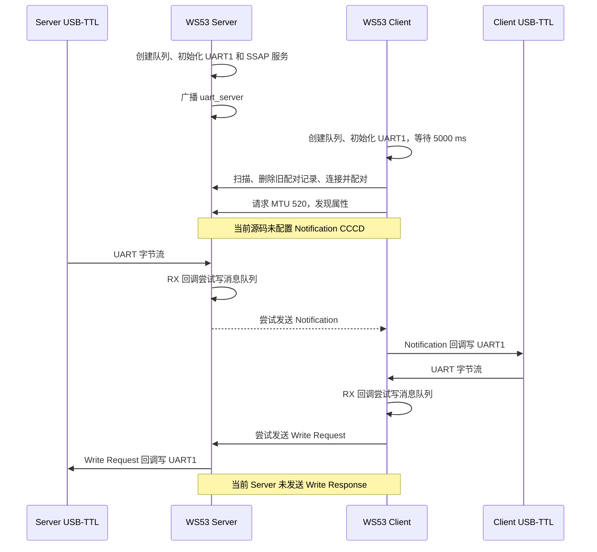

# UART 透传

> 使用技术：SLE、SSAP Notification/Write Request、UART1、中断接收、任务转发、消息队列

> 前置阅读：必须了解 [Hello Connect](../basics/hello-connect.md) 的扫描与连接流程，建议先完成 [Hello Notify](../basics/hello-notify.md) 的 Notification 实验。

本案例的设计目标是把两块 WS53 的 UART1 通过 SLE 组成双向数据桥：Server 串口收到的字节块通过 Notification 发给 Client；Client 串口收到的字节块通过 SSAP Write Request 发给 Server；无线接收端再把数据写入本地 UART TX。

## 运行前置修正

当前 WS53 源码存在会影响完整透传验证的阻塞项：UART RX 回调运行在中断上下文，却调用了 LiteOS OSAL 头文件明确不支持在中断中使用的 `osal_msg_queue_write_copy()`；默认连接间隔 Kconfig 使用 1.25 ms 语义，但原始值被直接传入单位为 0.25 ms、最小值为 `0x001E` 的协议栈字段；Notification 属性没有客户端配置描述符（CCCD），Client 也没有写入 `0x0001`；Client 使用 `ssapc_write_req()`，Server 收到需要响应的写请求时却没有调用 `ssaps_send_response()`。执行双向持续透传实验前应先修正这些问题。

## 学习目标

- 理解 UART 字节流和 SLE 属性数据块之间的双向映射。
- 理解 UART RX 回调的触发条件、缓冲区生命周期和中断上下文限制。
- 掌握消息队列、工作任务与 SLE API 的分工，并识别当前 LiteOS 上下文冲突。
- 区分 Notification、Write Request、直接 API 返回值和异步确认。
- 理解 UART RX 缓冲区、队列项大小、队列深度和 MTU 的不同作用。
- 能正确连接两套 3.3 V USB-TTL，并分层验证两个方向的数据转发。
- 识别连接参数、CCCD、服务发现、部分 UART 写和断链竞态等源码限制。

## 基本概念

### 典型使用场景

UART 透传桥接是常见的 SLE 应用形态：两块 WS53 分别连接两台 MCU、PC 或串口设备，中间通过 SLE 链路转发 UART 数据。两侧上层业务不需要直接调用 SLE API，但 UART 数据的回调分块和时间间隔可能被无线转发过程改变，因此这里的“透明”是指不解析业务内容，并不代表严格保持串口电气特性和时序。

- **工业传感器网关**：传感器通过 UART 输出数据，或经过外置 RS485-UART 收发器连接 WS53，再由 SLE 汇聚到网关。当前案例不包含 RS485 收发器、方向控制或 Modbus RTU 分帧。
- **无线调试器**：把远端 MCU 的调试串口通过 SLE 转发到本地 WS53，再接入 PC 串口工具。
- **传统数传模块替代验证**：评估使用 SLE 替代原有串口数传链路。带宽、延迟、距离、功耗和丢包率必须在目标环境实测，本文不预设其优于 433 MHz 或其他 2.4 GHz 方案。
- **设备配置通道**：由另一块 WS53 网关或主机端向设备发送配置指令并接收结果。若要由手机直接配置，还需要手机侧 SLE 能力和配套应用，不属于当前双 WS53 案例。
- **传感器与控制器分离部署**：把传感器板的串口数据转发给位置不同的控制器，并通过反向通道发送命令。
- **SLE 数据通道原型验证**：验证 UART 中断接收、任务调度、SSAP Notification 和 Write Request 的组合流程。

当前案例更适合作为双向数据通道的学习和原型代码，不应未经扩展直接用于以下场景：

| 场景 | 当前实现不满足的要求 |
|---|---|
| 无损串口线替代 | 没有端到端流控、序号、确认、重传和断线缓存 |
| 持续高速数据采集 | UART RX 回调、消息队列和 SLE 输出之间可能出现丢包和背压不足 |
| 依赖帧间静默时间的串口协议 | UART 回调和无线转发会改变原始分块及时间间隔 |
| 安全关键控制 | 没有应用层完整性校验、重复检测、超时处置和故障安全状态 |
| 长时间低功耗设备 | 启用 UART 低功耗支持时，案例会持续占用 sleep veto |

### “透传”不等于保留应用报文边界

UART 是连续字节流。案例不解析输入内容，也没有定义业务帧头、长度、序号、CRC 或转义规则，只把一次 UART RX 回调交付的字节块作为一次 SLE 操作提交。

RX 回调注册参数为：

```c
uapi_uart_register_rx_callback(
    CONFIG_UART_BUS_ID,
    UART_RX_CONDITION_FULL_OR_SUFFICIENT_DATA_OR_IDLE,
    1,
    rx_handler);
```

回调可能因为接收缓冲区已满、至少收到指定长度或线路空闲而触发。即使发送端一次写入完整业务报文，接收驱动也可能拆成多个回调；相邻输入也可能因调度和积压在同一回调中交付。因此：

- 一次 UART 写入不保证对应一次 SLE Notification 或 Write Request；
- 一次 SLE 数据块也不应被应用直接当成完整业务帧；
- 需要稳定报文边界时，必须在透传层之上增加明确的分帧和重组协议。

### 双向数据路径并不对称

```text
Server USB-TTL
  -> Server UART1 RX 回调
  -> Server 待发队列
  -> Server 工作任务
  -> SSAP Notification
  -> Client Notification 回调
  -> Client UART1 TX
  -> Client USB-TTL

Client USB-TTL
  -> Client UART1 RX 回调
  -> Client 待发队列
  -> Client 工作任务
  -> SSAP Write Request
  -> Server Write Request 回调
  -> Server UART1 TX
  -> Server USB-TTL
```

Server→Client 使用无逐包业务响应的 Notification；Client→Server 使用有异步写结果回调的 Write Request。两条路径的可靠性证据、流控方式和失败处理不能混为一谈。

### UART RX 回调与 LiteOS 消息队列冲突

WS53 `uart.h` 说明 RX 回调在中断上下文执行，并指出回调返回后驱动缓冲区会被释放。案例因此不能保存 `buffer` 指针，而是尝试使用 `osal_msg_queue_write_copy()` 复制数据。

但 WS53 `osal_msgqueue.h` 同时明确说明：除 FreeRTOS 外，不要在中断等非阻塞上下文中读写该消息队列 API。本案例构建目标是 `ws53_liteos_app`，所以当前“中断回调直接写 OSAL 消息队列”的实现不满足该 API 在 LiteOS 下的上下文要求。

此外，UART 驱动说明在 RX 回调处理期间新到达的数据不再接收，可能直接丢弃。回调中的串口日志、连接检查和不受支持的队列操作都会增加回调占用时间。修正时应采用 LiteOS 支持的 ISR 安全延后处理机制或经过验证的无锁缓冲方案，并让中断回调保持尽可能短。

### 队列容量不是无线可靠性保证

两端默认各创建一个队列：

```text
队列深度：16
单项上限：520 字节
名义载荷容量：16 × 520 = 8320 字节
```

UART RX 回调使用超时 0 写入队列。队列满或写入长度不符合队列限制时，当前数据块立即丢弃。丢弃计数只打印前 3 次，之后每累计 100 次打印一次；计数不会在重连后清零。

工作任务使用 `OSAL_WAIT_FOREVER` 阻塞读取队列，因此空闲时不会忙轮询。但队列只能吸收短时速率差，不能解决以下问题：

- UART 持续输入速率高于 SLE 有效输出速率；
- Notification 未启用或协议栈持续拒绝提交；
- Write Request 等待响应而无法持续推进；
- 断链期间继续输入；
- UART RX 回调本身丢失数据。

### 连接、配对、发现和业务就绪是不同状态

两端 RX 回调只检查 `g_connected`。该状态在 `SLE_ACB_STATE_CONNECTED` 时已经置为 `true`，早于配对、MTU 交换、服务发现和 Notification CCCD 配置。

Client 的 `g_write_param.handle` 只在属性发现回调中赋值。若 UART 数据在“已连接但尚未发现属性”期间到达，RX 回调仍会入队，工作任务可能使用初始 handle 0 发起写请求。

Server 也可能在 Client 尚未完成 Notification 配置时从队列取数据并尝试通知。因此稳健实现至少需要独立的业务就绪标志，例如：

```text
Server：已连接 + 已配对 + Notification CCCD 已启用
Client：已连接 + MTU 交换成功 + 目标属性及 CCCD 已发现并配置
```

当前源码没有这样的完整门控。

### Notification 必须有正确的 CCCD 配置

属性 `0x2323` 的操作位包含 READ、WRITE 和 NOTIFY，但 Server 添加的是：

```c
descriptor.type = SSAP_DESCRIPTOR_USER_DESCRIPTION;
descriptor.value = (uint8_t[]){0x01, 0x00};
```

用户描述符不是客户端配置描述符。根据 `ssaps_notify_indicate()` API 说明，发送状态取决于 CCCD：`0x0001` 允许 Notification，`0x0002` 允许 Indication。当前 Client 完全没有发现或写入 CCCD，因此不能把用户描述符中的 `{0x01,0x00}` 当作“Notification 已启用”。

### Write Request 需要响应闭环

Client 工作任务调用：

```c
ssapc_write_req(0, g_conn_id, &g_write_param);
```

该 API 的异步写结果通过 `ssapc_write_cfm_callback` 返回。Server 写回调虽然把数据写入 UART，却没有检查 `write_cb_para->need_rsp`，也没有构造 `ssaps_send_rsp_t` 调用 `ssaps_send_response()`。Client 的写确认回调又是空函数。

因此当前日志只能证明：

- Client 工作任务尝试发起写请求；
- Server 回调若被触发，会尝试写 UART；

不能证明 Write Request 已完成响应闭环。修正时应二选一并保持两端语义一致：需要确认时由 Server 正确响应并由 Client 检查确认；不需要确认时评估是否改用 Write Command，并检查直接返回值。

### MTU、队列项与 UART 缓冲区

| 参数 | 默认值 | 所属层次 | 作用 |
|---|---|---|---|
| UART RX 缓冲区 | 512 字节 | UART 驱动 | 驱动接收缓冲区大小 |
| 消息队列单项 | 520 字节 | OSAL/应用 | 一次回调复制到队列的最大消息大小 |
| 消息队列深度 | 16 | OSAL/应用 | 最多暂存的数据块数量 |
| SSAP MTU 请求 | 520 字节 | SSAP | 两端请求的交换信息值 |

这几个值恰好接近，不代表它们是同一个限制。实际可发送的属性数据还取决于协议栈协商结果和实现开销。修改任一参数时必须同步检查 UART 回调最大长度、队列限制、实际 MTU、任务栈和 `sle_uart_server_send_notification()` 的变长栈数组。

## 涉及 API

| 阶段 | 核心 API | 调用方 | 当前用途与限制 |
|---|---|---|---|
| PinMux | `uapi_pin_set_ie()`、`uapi_pin_set_mode()` | 两端 | 配置 UART1 RX 输入和 MIO17/MIO18；部分返回值被忽略或仅打印 |
| UART 初始化 | `uapi_uart_deinit()`、`uapi_uart_init()` | 两端 | 115200、8N1、无 CTS/RTS；deinit 返回值被忽略 |
| UART 接收 | `uapi_uart_register_rx_callback()` | 两端 | 注册中断上下文 RX 回调，触发阈值为 1 |
| UART 发送 | `uapi_uart_write()` | 两端 | timeout 为 0；Client 不检查结果，Server 只检查负值、不检查短写 |
| 队列创建 | `osal_msg_queue_create()` | 两端 | 创建 16×520 字节待发队列 |
| 队列写入 | `osal_msg_queue_write_copy()` | UART RX 回调 | timeout 为 0；当前 LiteOS 中断上下文使用不符合 OSAL 头文件约束 |
| 队列读取 | `osal_msg_queue_read_copy()` | 工作任务/断链回调 | 工作任务永久等待；断链回调用 timeout 0 清空队列 |
| Notification | `ssaps_notify_indicate()` | Server | Server→Client；当前缺少 CCCD 配置，工作任务忽略返回值 |
| 写请求 | `ssapc_write_req()` | Client | Client→Server；直接返回值被忽略，响应闭环缺失 |
| 写响应 | `ssaps_send_response()` | Server | 当前 UART 案例没有调用，需修正 Write Request 路径 |
| MTU 交换 | `ssaps_set_info()`、`ssapc_exchange_info_req()` | 两端 | 请求 520；部分状态和返回值未检查 |
| 服务发现 | `ssapc_find_structure()` | Client | 在 `1～0xFFFF` 发现属性，当前未按 UUID 筛选 |
| 低功耗 veto | `uapi_pm_add_sleep_veto()` | 两端 | 启用 UART LPM 支持时使用 `PM_USER0_VETO_ID`，运行期不释放 |

## 案例说明

### 功能规格

| 项目 | Server | Client |
|---|---|---|
| 板卡 | WS53 | WS53 |
| SLE 角色 | Peripheral、SSAP Server | Central、SSAP Client |
| UART | UART1，115200、8N1 | UART1，115200、8N1 |
| UART 引脚 | TX=MIO17，RX=MIO18，Pin Mode 2 | 同 Server |
| 硬件流控 | 无，CTS/RTS 为 `PIN_NONE` | 同 Server |
| 无线发送方向 | UART RX → Notification | UART RX → Write Request |
| 无线接收方向 | Write Request → UART TX | Notification → UART TX |
| 广播/匹配名称 | `uart_server` | 结构化解析 Complete Local Name |
| Service/Property | `0x2222` / `0x2323` | 当前保存发现到的最后一个属性 handle |
| 断链动作 | 清空队列并重新广播 | 清空队列、删除配对记录并重新扫描 |

### 端到端流程



### 验收层次

| 层次 | 直接证据 | 不能据此证明 |
|---|---|---|
| UART 初始化 | `uart init ok`、`uart rx callback registered ok` | 中断期间队列写入合法或无丢字节 |
| 广播/扫描 | 广播启用回调和 `found uart_server` | 连接参数已按 15 ms 生效 |
| 连接 | 两端 `connected` | 配对、发现、CCCD 已完成 |
| 配对/发现 | 成功状态回调和目标 handle 已核对 | 双向业务均可发送 |
| Server 提交 Notification | `ssaps_notify_indicate()` 直接返回成功 | Client UART 已输出全部字节 |
| Client 收到 Notification | Notification 回调状态成功且长度正确 | `uapi_uart_write()` 已完整写出 |
| Client 提交 Write Request | `ssapc_write_req()` 直接返回成功 | Server 已接收或已响应 |
| Server 收到写请求 | Server 写回调收到正确数据 | Client 收到成功 Write Confirm |
| 端到端通过 | 目标 USB-TTL 收到长度和内容均一致的数据 | 持续负载下无丢包 |

源码当前在调用 SLE API 之前就打印 `send notify ...` 或 `send ...`，并丢弃 API 返回值。因此这些发送日志只能视为“准备/尝试发送”，不能作为无线提交成功的直接证据。`=== bridge ready ===` 也不可靠：Server 配对回调忽略 `status` 后仍打印，Client 服务发现完成回调同样不根据 `status` 或目标 handle 打印。

### 当前源码阻塞项与限制

1. **LiteOS 中断上下文错误使用消息队列。** UART RX 回调运行在中断中，而 OSAL 头文件禁止 LiteOS 在中断等非阻塞上下文调用该队列读写 API。
2. **连接间隔单位不匹配。** Kconfig 把 `12` 定义为 `12 × 1.25 ms = 15 ms`，源码却直接把 12 传给单位 0.25 ms、合法下限 30 的字段。
3. **监管超时参数需要整组重算。** 若按意图把 15 ms 编码为原始值 60，当前 `max_latency=499`、`timeout=500` 又不满足监管超时严格大于约束。
4. **广播错误处理不完整。** 参数和数据设置结果被忽略，数据设置函数即使底层失败也返回成功；Server 任务还忽略初始化和广播初始化返回值。
5. **Notification 缺少 CCCD。** Server 只有 USER_DESCRIPTION，Client 没有写 `0x0001`。
6. **Write Request 没有响应闭环。** Server 未调用 `ssaps_send_response()`，Client 确认回调为空。
7. **连接状态过早作为业务就绪。** Client 可能在属性 handle 仍为 0 时发送；Server 可能在 Notification 尚未启用时发送。
8. **属性发现未按 UUID 筛选。** Client 在全 handle 范围内让每次属性回调覆盖 `g_write_param.handle`，最后一个属性获胜。
9. **多个回调缺少空指针和状态检查。** 包括 MTU、服务和属性回调；Client Notification 回调没有检查 `data->data`，Server 写回调没有检查 `write_cb_para`。
10. **UART 完整写出没有验证。** `uapi_uart_write()` 返回实际写出长度；Client 完全忽略，Server 只检查负值而没有检查短写。
11. **连接地址日志格式错误。** Server 两处地址日志包含 3 个 `%02x`，却只提供 2 个地址参数，属于可变参数格式不匹配。
12. **属性初始长度未设置。** Server 为属性分配 1 字节初值但没有设置 `property.value_len`，结构体零初始化后长度仍为 0。
13. **没有应用层可靠协议。** 无帧头、长度、序号、CRC、ACK/NACK、重传、重复检测或断点恢复。

## 案例操作指导

### 准备硬件

准备两块 WS53、两个 3.3 V 电平 USB-TTL 和两个串口终端。每块板分别接一个 USB-TTL：

| USB-TTL | WS53 |
|---|---|
| TXD | MIO18 / UART1_RX |
| RXD | MIO17 / UART1_TX |
| GND | GND |
| VCC | 不连接 |

TX/RX 必须交叉连接并可靠共地。开发板已经单独供电时，不要再通过 USB-TTL 的 VCC 给板卡供电。两个数据终端均设置为 115200 bit/s、8 数据位、无校验、1 停止位、无硬件流控。

调试日志串口和本案例 UART1 的用途不同。透传测试数据必须从 MIO17/MIO18 对应的 USB-TTL 输入和观察，不能把日志控制台当作透传口。

### 先处理源码阻塞项

完整实验前至少应完成以下修正：

- 使用 LiteOS 支持的 ISR 安全机制把 UART 数据延后到任务上下文，不在 RX 中断回调中调用不受支持的 OSAL 消息队列 API，也尽量避免在回调中打印日志。
- 若 Kconfig 继续以 1.25 ms 为单位，应在写入协议栈字段前换算为 0.25 ms 原始值，例如意图为 15 ms 时写入 60；同时重新选择 `max_latency` 和 `supervision_timeout`，并检查设置返回值。
- 给 `0x2323` 添加可写 CCCD，让 Client 发现真实描述符 handle 并写入 `0x0001`；只有完成后才置业务就绪标志。
- 为 Client→Server 明确选择 Write Request 或 Write Command。使用 Write Request 时，Server 必须按 `request_id` 返回响应，Client 必须检查直接返回值和确认状态。
- Client 按 Service UUID `0x2222`、Property UUID `0x2323` 和描述符类型筛选 handle，不使用“最后一次属性回调”的结果。
- 修正回调空指针/状态检查、地址日志参数、属性 `value_len` 和 UART 短写处理。

本文只整改文档，不替用户直接选择或修改上述源码实现。

### 配置、构建并烧录 Server

在 SDK 根目录执行：

```powershell
fbb config set CONFIG_SAMPLE_SUPPORT_SLE_UART_SERVER_SAMPLE=y --target ws53_liteos_app
fbb build ws53_liteos_app --clean
fbb flash ws53_liteos_app --port <SERVER_COM> --json-summary
```

对应的 Kconfig 选择链为：

```text
CONFIG_ENABLE_BT_SAMPLE=y
CONFIG_SAMPLE_SUPPORT_SLE_SAMPLE=y
CONFIG_SAMPLE_SUPPORT_SLE_UART_SERVER_SAMPLE=y
CONFIG_SUPPORT_SLE_PERIPHERAL=y
```

### 配置、构建并烧录 Client

Server 烧录完成后，切换到 Client 角色并重新构建：

```powershell
fbb config set CONFIG_SAMPLE_SUPPORT_SLE_UART_CLIENT_SAMPLE=y --target ws53_liteos_app
fbb build ws53_liteos_app --clean
fbb flash ws53_liteos_app --port <CLIENT_COM> --json-summary
```

对应的 Kconfig 选择链为：

```text
CONFIG_ENABLE_BT_SAMPLE=y
CONFIG_SAMPLE_SUPPORT_SLE_SAMPLE=y
CONFIG_SAMPLE_SUPPORT_SLE_UART_CLIENT_SAMPLE=y
CONFIG_SUPPORT_SLE_CENTRAL=y
```

Server 与 Client 位于同一个 SLE Sample `choice` 中，需要分别构建和烧录。固件包位于：

```text
output/ws53/fwpkg/ws53-liteos-app/ws53-liteos-app_all.fwpkg
```

### 启动与就绪检查

1. 打开两块板的调试日志串口和两个 UART1 数据终端。
2. 先启动 Server，检查队列、UART、服务、广播相关 API 的实际返回和回调状态。
3. 再启动 Client。Client 在初始化 SLE 前固定等待 5000 ms。
4. 检查 Client 是否按结构化 Complete Local Name 找到 `uart_server`，并完成连接、配对和 MTU 交换。
5. 检查发现结果确实属于服务 `0x2222`、属性 `0x2323`，并确认 Notification CCCD 写入成功。
6. 只有两端业务就绪标志成立后再从 USB-TTL 输入测试数据。

不要仅以当前源码的 `=== bridge ready ===` 为依据，应检查对应回调 `status`、目标 handle、CCCD 写结果和写响应闭环。

### 验证 Server 到 Client

在 Server 的 UART1 数据终端发送 11 字节 ASCII：

```text
S2C_OK_B4Y5
```

修正源码并增加返回值日志后，应依次确认：

1. Server RX 回调安全地把 11 字节交给任务上下文。
2. Server 调用 `ssaps_notify_indicate()` 返回成功。
3. Client Notification 回调收到状态成功、长度 11、内容一致的数据。
4. Client `uapi_uart_write()` 返回 11。
5. Client USB-TTL 实际收到相同 11 字节。

当前源码可能打印：

```text
[sle uart server] send notify 11 bytes: S2C_OK_B4Y5
[sle uart client] recv 11 bytes from server: S2C_OK_B4Y5
```

第一条打印发生在 Notification API 调用之前，第二条也没有验证 UART 写出长度，因此仍要以最终 USB-TTL 数据为准。

### 验证 Client 到 Server

在 Client 的 UART1 数据终端发送：

```text
C2S_OK_F3U4
```

修正后的验收顺序为：

1. Client RX 数据安全进入任务上下文。
2. `ssapc_write_req()` 直接返回成功。
3. Server 写回调收到状态成功、长度 11、内容一致的数据。
4. Server `uapi_uart_write()` 返回 11。
5. Server 按请求 ID 返回成功响应，Client 写确认回调收到成功。
6. Server USB-TTL 实际收到相同 11 字节。

当前源码日志形式为：

```text
[sle uart client] send 11 bytes: C2S_OK_F3U4
[sle uart server] recv 11 bytes from client: C2S_OK_F3U4
```

同样不能只凭发送日志判定成功。

### 验证二进制和持续负载

日志使用 `%.*s` 演示文本数据。精度限制可以避免越过当前长度读取，但遇到 `0x00` 会提前结束显示，控制字符也可能干扰终端。因此二进制验证应在 USB-TTL 工具中使用十六进制发送/接收，并逐字节比较，不要根据日志字符串判断。

完成短字符串验证后，再逐步增加负载并记录：

| 指标 | 建议记录内容 |
|---|---|
| 输入数据 | 总字节数、块大小、发送间隔、是否包含二进制 0 |
| 连接 | 协议栈实际接受/报告的连接间隔和 MTU |
| 队列 | 队列满丢弃次数、最大积压、断链清理次数 |
| SLE | Notification/Write API 直接失败次数、写确认失败或超时次数 |
| UART | 短写次数、RX 错误回调次数、目标端实际收到字节数 |
| 端到端 | 丢失、重复、乱序、分块变化和延迟分布 |

源码 README 记录过 11 字节短串约 58～88 ms 的特定实板结果，但该数值没有测量代码、环境条件或统计分布支撑，而且当前源码存在上述阻塞项。修正后应重新测量，不能把该范围作为协议保证或验收阈值。

### 常见问题

| 现象 | 检查项 |
|---|---|
| UART 初始化失败 | 检查 UART1、MIO17/MIO18 PinMux、其他模块占用和 `uapi_uart_init()` 返回码 |
| USB-TTL 没有数据 | 检查 3.3 V 电平、TX/RX 交叉、共地、数据口与日志口是否混淆 |
| Client 一直扫描 | 确认广播设置成功、扫描响应包含完整名称 `uart_server` |
| 广播启动失败 | 首先修正连接间隔单位和监管超时组合，并检查参数设置实际返回值 |
| 已连接但发送使用 handle 0 | UART 输入早于服务发现完成；增加业务就绪门控并按 UUID 保存 handle |
| Server→Client 无数据 | 修正 Notification CCCD，确认 Client 写入 `0x0001`，检查 Notify API 返回值 |
| Client→Server 首包后停滞 | 检查 Write Request 是否收到 Server 响应；当前 Server 没有调用 `ssaps_send_response()` |
| `msgq full` | 输入速率超过消费速率或 SLE 发送异常；当前数据已丢失，不能自动恢复 |
| 未连接时日志刷屏 | RX 回调对每个未连接数据块打印，且发生在中断上下文；应删除或节流 |
| 文本日志长度不完整 | 数据可能含 `0x00` 或控制字符；改用十六进制端到端比较 |
| 目标 UART 少字节 | 检查 `uapi_uart_write()` 是否短写；当前 Client 忽略结果，Server 不检查返回长度 |
| 重连后数据异常 | 队列清理不能撤回工作任务已经取出的在途数据，发送前还需重新检查连接与业务就绪 |

## 关键配置

### UART、任务与队列参数

| 配置 | 默认值 | 当前含义 |
|---|---|---|
| `CONFIG_UART_BUS_ID` | 1 | UART1 |
| `CONFIG_UART_TXD_PIN` | 17 | MIO17 |
| `CONFIG_UART_RXD_PIN` | 18 | MIO18 |
| `CONFIG_UART_TXD_PIN_MODE` | 2 | TX PinMux |
| `CONFIG_UART_RXD_PIN_MODE` | 2 | RX PinMux |
| `CONFIG_SLE_UART_BAUDRATE` | 115200 | UART 波特率 |
| `CONFIG_SLE_UART_RX_BUF_SIZE` | 512 | 静态 RX 缓冲区大小 |
| `CONFIG_SLE_UART_MSGQ_LEN` | 16 | 待发队列深度 |
| `CONFIG_SLE_UART_MSGQ_ITEM_SIZE` | 520 | 单个队列节点上限 |
| 任务优先级 | 28 | Server/Client 相同 |
| 任务栈 | `0x1000` | 发送路径还会使用变长栈数组 |

UART 配置为 8 数据位、1 停止位、无校验；CTS 和 RTS 均为 `PIN_NONE`。源码先调用 `uapi_uart_deinit()`，再使用静态 RX 缓冲区初始化 UART。

### SLE 服务与扫描参数

| 参数 | 当前值 | 说明 |
|---|---|---|
| Server 应用 UUID | `{0x12,0x34}` | 注册 SSAP Server |
| Service UUID | `0x2222` | UART Bridge 服务 |
| Property UUID | `0x2323` | READ、WRITE、NOTIFY |
| 请求 MTU | 520 | 两端版本均为 1 |
| Server 固定地址 | `{01,02,03,04,05,06}` | 地址类型 0 |
| 广播名称 | `uart_server` | 位于扫描响应 Complete Local Name 字段 |
| Client 启动等待 | 5000 ms | 等待后使能 SLE |
| 扫描间隔/窗口 | 100/100 | 单位 0.125 ms，即均为 12.5 ms |
| 重复过滤 | 关闭 | `filter_duplicates = 0` |
| 广播间隔 | `0xC8` | 200 × 0.125 ms = 25 ms |

Server 请求的广播发射功率为 18 dBm，扫描响应中的 TX Power Level 元数据为 10。源码没有提供最终射频发射功率的确认值，不能把任一常量直接当作实测功率。

### 连接间隔单位与范围冲突

Kconfig 定义：

```text
CONFIG_SLE_UART_CONN_INTERVAL=12
单位：1.25 ms
范围：6～32
```

按 Kconfig 意图，默认值应表示 15 ms。但 `sle_uart_server_adv.c` 直接执行：

```c
param.conn_interval_min = CONFIG_SLE_UART_CONN_INTERVAL;
param.conn_interval_max = CONFIG_SLE_UART_CONN_INTERVAL;
```

当前 WS53 `sle_device_discovery.h` 对连接间隔原始值的定义是：

```text
范围：0x001E～0x3E80
单位：0.25 ms
```

因此原始值 12 低于最小合法值 30，不能解释成协议栈已经使用 15 ms。如果保留 Kconfig 的 1.25 ms 业务单位，传入协议栈前需要乘以 5：

```text
12 × 1.25 ms = 15 ms
15 ms ÷ 0.25 ms = 原始值 60
```

但只修正间隔编码仍不够。当前还配置：

```text
max_latency = 499
supervision_timeout = 500（5 s）
```

监管超时必须满足：

```text
supervision_timeout × 20 > (max_latency + 1) × interval_max
```

若按 15 ms 的正确原始值 60 代入：

```text
500 × 20       = 10000
(499 + 1) × 60 = 30000
```

约束仍不成立。因此需要同时重新设计连接间隔、最大时延和监管超时，而不是只把默认值从 12 改成 60。

## 关键性能指标

### 端到端延迟

应从一侧 UART 输入的时间锚点测到另一侧 UART 实际输出完成，而不是测到“send”日志。延迟由 UART 分块、任务调度、队列等待、连接事件调度、Write Response 和目标 UART 写出共同组成。

### 有效吞吐量

UART 115200 bit/s 的标称线速率不是业务吞吐量。8N1 每个数据字节通常还需要起始位和停止位，SLE 路径又有属性和空口开销。持续测试应使用目标端实际收到的有效业务字节除以时间，并同时记录丢失和重复；只统计发送端提交量会高估吞吐。

### 丢包与背压

当前实现没有端到端背压：

- UART 没有 CTS/RTS；
- RX 中断处理期间可能丢新数据；
- 队列满后直接丢弃；
- Notification 没有应用 ACK；
- Write Request 响应闭环未实现；
- UART 短写不重试。

因此性能验收必须把目标端字节一致性和各层错误计数放在吞吐数值之前。

## 代码详解

### 代码目录与调用关系

```text
sle_uart/
├── sle_uart.c
├── Kconfig
├── sle_uart_server/src/
│   ├── sle_uart_server.c
│   ├── sle_uart_server.h
│   └── sle_uart_server_adv.c
└── sle_uart_client/src/
    ├── sle_uart_client.c
    └── sle_uart_client.h
```

Server 主调用链：

```text
sle_uart_entry()
  -> sle_uart_server_task()
     -> osal_msg_queue_create()
     -> sle_uart_initialize_uart()
     -> sle_uart_server_init()
     -> sle_uart_server_adv_init()
     -> uapi_uart_register_rx_callback()
     -> sle_uart_server_forward()
        -> osal_msg_queue_read_copy()
        -> sle_uart_server_send_notification()
           -> ssaps_notify_indicate()
```

Client 主调用链：

```text
sle_uart_entry()
  -> sle_uart_client_task()
     -> osal_msg_queue_create()
     -> sle_uart_client_initialize_uart()
     -> sle_uart_client_init()
     -> uapi_uart_register_rx_callback()
     -> sle_uart_client_forward()
        -> osal_msg_queue_read_copy()
        -> ssapc_write_req()
```

### UART 初始化允许部分 PinMux 错误后继续

两端初始化逻辑相似。RX 输入使能的返回值被忽略；TX/RX `uapi_pin_set_mode()` 失败时只打印日志，仍继续 deinit 和 init UART。若 UART 初始化本身成功，源码就打印 `uart init ok`。

因此排查引脚问题时不能只看最后一条 UART 初始化日志，还要检查前面的 PinMux 失败信息。

### RX 回调只检查连接，不检查业务就绪

Server 和 Client RX 回调的核心逻辑都是：

```c
if (!role_is_connected()) {
    /* 打印并丢弃 */
    return;
}

osal_msg_queue_write_copy(queue_id, (void *)buffer, length, 0);
```

这种结构表达了“回调只复制、任务负责无线发送”的正确分层意图，但当前所选 OSAL API 不支持 LiteOS ISR 上下文，而且连接门控粒度不足。修正时应保留任务化发送思想，同时替换中断到任务的交接机制并增加业务就绪状态。

### Server 发送日志早于真实 API 结果

Server 工作任务先打印：

```c
osal_printk("[sle uart server] send notify ...");
sle_uart_server_send_notification(rx_buf, (uint16_t)rx_len);
```

第二行返回的 `errcode_t` 没有保存。封装内部使用长度为 `len` 的变长栈数组复制数据，再把 `ssaps_notify_indicate()` 的真实返回值交给调用方；但调用方最终丢弃它。

若调大 `CONFIG_SLE_UART_MSGQ_ITEM_SIZE`，这个变长数组会同步扩大，而任务栈固定为 `0x1000`。因此不能只增加队列项大小来支持更长数据。

### Client 发现到的最后一个属性覆盖写 handle

Client 从 handle 1 搜索到 `0xFFFF`，每收到一个属性都执行：

```c
g_write_param.handle = property->handle;
g_write_param.type = SSAP_PROPERTY_TYPE_VALUE;
```

没有 UUID 筛选，也没有检查 `status` 和指针。因此当前实现只在“对端恰好只有目标属性，且回调均成功”的简单服务布局下可能得到预期 handle。

### Client 写请求复用栈缓冲区

Client 工作任务把局部数组 `data` 的地址写入全局 `g_write_param`，随后调用 `ssapc_write_req()`：

```c
g_write_param.data = data;
g_write_param.data_len = data_len;
ssapc_write_req(0, g_conn_id, &g_write_param);
```

循环下一轮会复用同一栈数组。当前代码假设 API 在调用期间完成必要的数据复制；若协议栈要求数据在异步确认前保持有效，则还存在缓冲区生命周期风险。修正时应依据该 API 的实际实现约定选择持久缓冲区或发送完成后再复用。

### 无线接收到 UART 的路径不检查完整写出

Client Notification 回调直接调用 `uapi_uart_write()` 并忽略返回值。Server 写请求回调只判断返回值是否小于 0。由于 UART API 返回“实际写出的数据长度”，正确检查应比较：

```text
uart_write_return == requested_length
```

返回非负但小于请求长度时同样属于短写，需要统计、重试或由上层协议恢复。

### 断链清队列不能撤回在途数据

断链回调使用 timeout 0 循环读取并丢弃队列项，然后 Server 重启广播、Client 重启扫描。这能删除仍在队列中的旧数据，但工作任务可能已经取出一项并准备调用 SLE API。

发送前没有再次检查当前连接句柄和业务就绪状态，所以队列清理不能完全消除断链竞态。稳健实现应在任务取出数据后、提交前重新校验连接代次或会话 ID。

### 低功耗 veto 在运行期不释放

启用 `CONFIG_UART_SUPPORT_LPM` 时，两端调用：

```c
uapi_pm_add_sleep_veto(PM_USER0_VETO_ID);
```

案例运行期间没有删除 veto。这样可以避免深睡影响持续 UART RX，但会增加空闲功耗；如果添加 veto 失败，UART 初始化函数把错误返回给角色任务，任务直接结束。产品需要结合连接状态、队列状态和 UART 唤醒能力设计动态低功耗策略。
