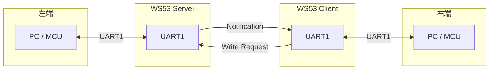
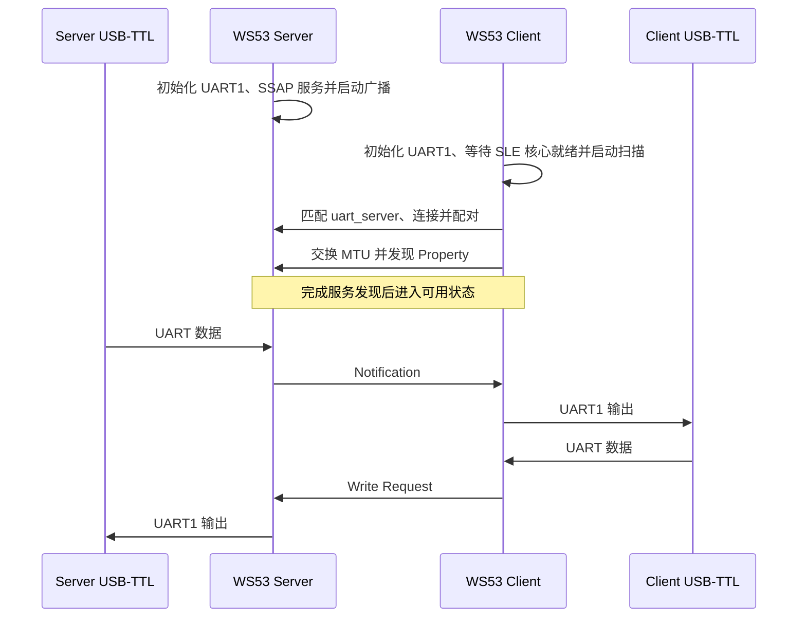
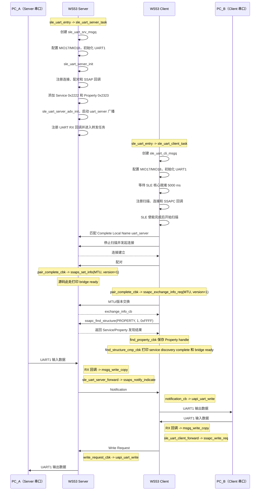

# UART 透传

> 使用技术：SLE、SSAP Notification/Write Request、UART1、中断接收、任务转发和消息队列。

> 前置阅读：[Hello SLE](../basics/hello-connect.md)、[通知推送（Notify）](../basics/hello-notify.md)、[属性读写（Read/Write）](../basics/hello-readwrite.md)。

## 学习目标

- 理解 UART 字节流与 SLE 属性数据之间的双向映射关系。
- 掌握 Server 端 UART RX -> Notification -> Client UART TX 的数据链路。
- 掌握 Client 端 UART RX -> Write Request -> Server UART TX 的数据链路。
- 理解 UART 接收回调、消息队列和工作任务之间的职责划分。
- 能够在两块 WS53 开发板上完成构建、烧录和双向透传验证。

## 规格与功能

本案例将两块 WS53 的 UART1 通过 SLE 连接成双向数据桥。Server 负责广播和提供 SSAP 服务，Client 负责扫描、连接和服务发现；建立连接后，数据方向由两端 UART 的输入决定。

| 规格项 | Server | Client |
| --- | --- | --- |
| SLE 角色 | Peripheral、SSAP Server | Central、SSAP Client |
| UART | UART1，默认 115200 bit/s、8N1 | UART1，默认 115200 bit/s、8N1 |
| UART 引脚 | TX=MIO17，RX=MIO18，Pin Mode=2 | 与 Server 相同 |
| 无线发送方向 | UART RX -> Notification | UART RX -> Write Request |
| 无线接收方向 | Write Request -> UART TX | Notification -> UART TX |
| 发现名称 | 广播 `uart_server` | 按 Complete Local Name 匹配 `uart_server` |
| Service/Property | `0x2222` / `0x2323` | 通过服务发现获取句柄 |
| 断链处理 | 清理队列并重新广播 | 清理队列、删除配对记录并重新扫描 |

程序运行流程：

1. Server 上电，创建消息队列，初始化 UART1，注册 SSAP Server 及可读、可写、可通知的 Property，然后启动广播。
2. Client 上电，创建消息队列，初始化 UART1，等待 SLE 核心就绪后扫描并连接 Server，随后完成配对、MTU 交换和 Property 服务发现。
3. 双方完成连接建立所需流程后进入“透传就绪”状态；UART RX 回调负责将数据拷贝到消息队列，工作任务负责调用 SLE API。
4. PC_A 通过串口向 Server 发送数据，数据依次经过 Server UART RX、消息队列和 SLE Notification，到达 Client 后由 UART TX 输出，PC_B 收到数据。
5. PC_B 通过串口向 Client 发送数据，数据依次经过 Client UART RX、消息队列和 SLE Write Request，到达 Server 后由 UART TX 输出，PC_A 收到数据。

> Hello 三部曲已经覆盖连接、通知和读写的基础能力。本案例将这些能力与 UART 驱动和消息队列组合起来，形成双向数据通道。

Server 和 Client 属于同一个 SLE 案例选择项，必须分别构建并烧录。透传层不定义包头、长度、CRC 或重传协议；UART 回调产生的数据块可能因驱动和调度被拆分为多个块。

## 基本概念

### 典型使用场景

透传桥接适合以下场景。两端 PC 或 MCU 只需要连接各自的 UART，不需要感知中间的 SLE 链路：

- **工业传感器网关**：传感器或外置 RS485-UART 收发器连接一块 WS53，另一块 WS53 将采集数据转发到网关。
- **无线调试串口**：将远端 MCU 的调试串口通过 SLE 转发到另一块 WS53，再连接 PC 串口工具进行远程日志查看或命令交互。
- **传统数传模块替代验证**：用两块 WS53 和 SLE 链路替换原有串口数传模块，比较目标环境中的吞吐量、延迟、距离、功耗和丢包情况。
- **设备配置通道**：由网关或主机端通过反向 UART 通道发送配置命令，并从另一端接收响应。

### 什么是透传

透传 = 透明传输。对两端设备来说，它们只是在和各自的 UART 串口通信，并不感知中间 SLE 无线链路的存在。发送方串口收什么，接收方串口就吐什么，数据内容不做任何解析或修改。

> 两个 WS53 之间通过 SLE 无线连接，但两端的 PC/MCU 看到的是标准的 UART 接口——对它们来说，这就是一根"无线串口延长线"。

### 双向数据流

hello-notify 是单向（Server→Client），hello-readwrite 是 Client 主动的双向交互；而透传桥接是**全双工**的——Server 和 Client 随时可能向对方发数据，方向完全由串口数据驱动。两端设备地位完全对等，没有"谁主动"的概念。



- Server -> Client：Server UART RX 回调将数据拷贝到消息队列，工作任务调用 `ssaps_notify_indicate()`，Client 的 Notification 回调再调用 `uapi_uart_write()`。
- Client -> Server：Client UART RX 回调将数据拷贝到消息队列，工作任务调用 `ssapc_write_req()`，Server 的 Write Request 回调再调用 `uapi_uart_write()`。

两条链路相互独立。SLE API 在任务上下文中调用，UART RX 回调只执行校验、连接状态检查和队列写入。

### 通信流程



### 与 Hello 示例的递进关系

| 示例 | 主题 | 数据方向 | 主动方 |
| --- | --- | --- | --- |
| hello-connect | 广播与连接 | - | 由角色决定 |
| hello-notify | 通知推送 | Server -> Client | Server |
| hello-readwrite | 属性读写 | Client <-> Server | Client |
| UART 透传 | 双向数据通道 | Server <-> Client | UART 数据驱动 |

hello 三部曲覆盖了 SLE 开发的三块基石。透传桥接是这三块基石的**组合应用**：用通知实现 Server→Client 链路，用写入实现 Client→Server 链路，用连接管理保证链路可用。

## 涉及 API

| API | 调用方 | 用途 |
| --- | --- | --- |
| `uapi_pin_set_ie()` | Server、Client | 使能 UART1 RX 输入（由配置宏控制） |
| `uapi_pin_set_mode()` | Server、Client | 设置 MIO17/MIO18 的引脚复用 |
| `uapi_uart_deinit()` / `uapi_uart_init()` | Server、Client | 配置 UART1、115200 8N1 和 RX 缓冲区 |
| `uapi_uart_register_rx_callback()` | Server、Client | 注册 UART RX 回调；回调运行于中断上下文 |
| `uapi_uart_write()` | Server、Client | 将 SLE 收到的数据输出到本地 UART1 |
| `osal_msg_queue_create()` | Server、Client | 创建待发送消息队列 |
| `osal_msg_queue_write_copy()` | UART RX 回调 | 将驱动缓冲区内容拷贝到队列 |
| `osal_msg_queue_read_copy()` | 工作任务 | 取出队列数据并转发 |
| `ssaps_notify_indicate()` | Server | 发送 Notification |
| `ssapc_write_req()` | Client | 发送 Write Request |
| `ssaps_set_info()` | Server | 配对完成后设置 SSAP MTU 和版本 |
| `ssapc_exchange_info_req()` | Client | 配对完成后发起 MTU 交换 |
| `ssapc_find_structure()` | Client | 发现远端 Property |

当前示例实际使用 Notification 和 Write Request，不使用 Indication。Write Request 的确认回调已注册，但当前透传路径未据此实现应用层重传；需要可靠传输时，应在上层增加序号、确认和重传机制。

## 案例说明

### 案例简介

两块 WS53 各连接一个 USB-TTL 模块。Server 侧串口输入的数据从无线 Notification 到达 Client，Client 侧串口输入的数据通过 Write Request 到达 Server。

### 硬件连接

```text
PC_A <-> USB-TTL <-> WS53 Server  ~~~~ SLE ~~~~  WS53 Client <-> USB-TTL <-> PC_B
```

每块开发板独立供电。每块 WS53 通过 UART1 (TX/RX/GND)连接到USB-TTL，USB-TTL插入PC。

### 通信模型

与 hello 三部曲不同，透传桥接没有"谁主动"的概念——两端都是被动的数据搬运工，数据方向完全由串口决定。Server 和 Client 的角色仅在 SLE 连接层面有意义（Server 广播 + 持有服务，Client 扫描 + 发起连接），在数据层面两者完全对等。

### 案例流程说明

下图根据 WS53 `sle_uart` 案例源码中的任务入口、SLE 回调和 UART 转发函数整理。Server 和 Client 的初始化任务相互独立；连接建立后，两条 UART 数据链路可以同时运行。



对应源码的执行顺序如下：

1. `sle_uart_entry()` 根据 Kconfig 创建 Server 或 Client 任务，任务优先级为 28，栈大小为 `0x1000`。
2. 两端任务先创建各自的消息队列，再配置 UART1：使能 RX 输入（若目标启用 Pin IE）、设置 MIO17/MIO18 复用、去初始化并重新初始化 UART1，最后注册 RX 回调。
3. Server 调用 `sle_uart_server_init()` 注册 SLE 回调、注册 SSAP Server、添加 Service `0x2222` 和 Property `0x2323`，随后由 `sle_uart_server_adv_init()` 设置广播参数并广播 `uart_server`。
4. Client 调用 `sle_uart_client_init()` 等待 SLE 核心就绪，注册扫描/连接/SSAPC 回调；SLE 使能完成后扫描广播数据，按 Complete Local Name 匹配 `uart_server`，停止扫描并连接。
5. 连接建立后 Client 发起配对。配对完成时，Server 调用 `ssaps_set_info()` 设置 MTU 和版本，Client 调用 `ssapc_exchange_info_req()` 发起 MTU 交换；交换完成后 Client 调用 `ssapc_find_structure()` 发现远端 Property，并在回调中保存写入句柄。
6. Server 方向由 `sle_uart_server_forward()` 阻塞读取消息队列并调用 `ssaps_notify_indicate()`；Client 的 Notification 回调收到数据后调用 `uapi_uart_write()` 输出到 UART1。
7. Client 方向由 `sle_uart_client_forward()` 阻塞读取消息队列并调用 `ssapc_write_req()`；Server 的 Write Request 回调收到数据后调用 `uapi_uart_write()` 输出到 UART1。
8. 断链时 Server 清理待发送队列并重新广播；Client 清理队列、删除配对记录并重新扫描。队列中的数据块可能因 UART 驱动触发条件而分包，不能将一次回调视为完整业务报文。


## 案例操作指导

### 第一步：准备硬件

准备两块 WS53 开发板、两个 3.3 V USB-TTL 模块和两个串口工具。USB-TTL 与 WS53 交叉连接：

| USB-TTL | WS53 |
| --- | --- |
| TXD | MIO18 / UART1_RX |
| RXD | MIO17 / UART1_TX |
| GND | GND |
| VCC | 不连接 |

不要将 5 V TTL 信号或 USB-TTL 的电源脚接入开发板。两端串口工具均设置为 115200 bit/s、8 数据位、无校验、1 停止位、无硬件流控。

### 第二步：构建并烧录 Server

在 SDK 根目录执行：

```powershell
fbb config set CONFIG_SAMPLE_SUPPORT_SLE_UART_SERVER_SAMPLE=y --target ws53_liteos_app
fbb build ws53_liteos_app --clean
fbb flash ws53_liteos_app --port <SERVER_COM> --json-summary
```

Server 选择项会启用以下关键配置：

```text
CONFIG_ENABLE_BT_SAMPLE=y
CONFIG_SAMPLE_SUPPORT_SLE_SAMPLE=y
CONFIG_SAMPLE_SUPPORT_SLE_UART_SERVER_SAMPLE=y
CONFIG_SUPPORT_SLE_PERIPHERAL=y
```

### 第三步：构建并烧录 Client

Server 烧录完成后，为另一块板切换 Client 选择项并重新构建：

```powershell
fbb config set CONFIG_SAMPLE_SUPPORT_SLE_UART_CLIENT_SAMPLE=y --target ws53_liteos_app
fbb build ws53_liteos_app --clean
fbb flash ws53_liteos_app --port <CLIENT_COM> --json-summary
```

Client 选择项会启用以下关键配置：

```text
CONFIG_ENABLE_BT_SAMPLE=y
CONFIG_SAMPLE_SUPPORT_SLE_SAMPLE=y
CONFIG_SAMPLE_SUPPORT_SLE_UART_CLIENT_SAMPLE=y
CONFIG_SUPPORT_SLE_CENTRAL=y
```

实际固件路径以构建输出为准，默认完整固件包（`.fwpkg`）为 `output/ws53/fwpkg/pack_all_core/ws53_liteos_app/ws53_liteos_app_all_in_one.fwpkg`。不要把其他芯片的固件目录或构建目标名称复制到 WS53 命令中。

### 第四步：启动和就绪检查

1. 先给 Server 上电，打开调试日志串口。
2. 确认 Server 输出广播启动和 UART RX 回调注册成功的日志。
3. 再给 Client 上电。Client 在初始化时等待 SLE 核心就绪，随后开始扫描。
4. 确认 Client 找到 Complete Local Name 为 `uart_server` 的设备，并完成连接、配对、MTU 交换和 Property 发现。
5. 两端输出 `=== bridge ready ===` 只能作为流程提示；端到端是否成功必须通过下一步串口数据验证。

### 第五步：验证 Server 到 Client

在 Server 侧 UART1 发送以下 ASCII 字符串：

```text
S2C_OK_B4Y5
```

依次检查：

1. Server RX 回调成功把数据写入消息队列。
2. Server 转发任务调用 `ssaps_notify_indicate()`。
3. Client Notification 回调收到长度为 11 的相同内容。
4. Client USB-TTL 实际收到相同的 11 个字节。

### 第六步：验证 Client 到 Server

在 Client 侧 UART1 发送：

```text
C2S_OK_F3U4
```

依次检查：

1. Client RX 回调成功把数据写入消息队列。
2. Client 转发任务调用 `ssapc_write_req()`。
3. Server Write Request 回调收到长度为 11 的相同内容。
4. Server USB-TTL 实际收到相同的 11 个字节。

如果只有一个方向成功，先分别检查该方向的 SLE API、回调状态、目标句柄和 UART 写出长度；如果消息队列满，降低输入速率或调整队列深度后重试。

## 关键配置

### UART、缓冲区和队列参数

| 配置项 | 默认值 | 说明 |
| --- | --- | --- |
| `CONFIG_UART_BUS_ID` | `1` | 使用 UART1 |
| `CONFIG_UART_TXD_PIN` | `17` | MIO17，UART1 TX |
| `CONFIG_UART_RXD_PIN` | `18` | MIO18，UART1 RX |
| `CONFIG_UART_TXD_PIN_MODE` | `2` | TX 引脚复用模式 |
| `CONFIG_UART_RXD_PIN_MODE` | `2` | RX 引脚复用模式 |
| `CONFIG_SLE_UART_BAUDRATE` | `115200` | UART 波特率 |
| `CONFIG_SLE_UART_RX_BUF_SIZE` | `512` | UART 驱动 RX 缓冲区大小，单位为字节 |
| `CONFIG_SLE_UART_MSGQ_LEN` | `16` | 消息队列深度 |
| `CONFIG_SLE_UART_MSGQ_ITEM_SIZE` | `520` | 单个队列项的最大字节数 |
| `CONFIG_SLE_UART_MTU_SIZE` | `520` | 申请的 SLE MTU 大小 |

队列项大小、UART 回调最大长度和实际协商 MTU 不是同一个限制。调整其中一项时，应同步检查另外两项以及发送任务的栈空间。

### SLE 服务和扫描参数

| 参数 | 当前值 | 来源/说明 |
| --- | --- | --- |
| App UUID | `{0x12, 0x34}` | Server 注册 SSAP Server 时使用 |
| Service UUID | `0x2222` | UART 透传服务 |
| Property UUID | `0x2323` | 读、写和通知属性 |
| Property 权限 | READ \| WRITE | `sle_uart_server.h` |
| 操作指示 | READ \| WRITE \| NOTIFY | `sle_uart_server.h` |
| Server 名称 | `uart_server` | 广播扫描响应中的 Complete Local Name |
| 扫描间隔/窗口 | `100` / `100` | Client 源码默认值，单位以 SLE 接口定义为准 |
| 重复过滤 | 关闭 | Client 设置 `filter_duplicates = 0` |
| 广播间隔 | `0xC8` | Server 广播参数源码；单位以 SLE 接口定义为准 |
| 广播发射功率参数 | `18` | Server 广播配置请求值，不等同于实测射频功率 |

连接间隔由 `CONFIG_SLE_UART_CONN_INTERVAL` 配置，默认值为 `12`，Kconfig 注释定义单位为 1.25 ms，并限制范围为 6～32。协议栈接口实际接受的单位和合法范围应以 WS53 SLE 头文件及芯片资料为准，文档不将未经确认的换算值作为实测结论。

### 低功耗限制

当 `CONFIG_UART_SUPPORT_LPM` 生效时，初始化代码会申请 `PM_USER0_VETO_ID`，以避免 UART 连续接收期间进入不适合的低功耗状态。当前案例（Sample）运行期间不会主动释放该 veto，因此功耗评估应单独进行。

## 关键性能指标

### 端到端延迟

延迟应从发送端 UART 输入时间测量到接收端 UART 实际输出完成，不能用 `send` 日志时间代替。延迟受 UART 回调分段、消息队列等待、任务调度、SLE 连接事件和目标 UART 写出共同影响。

### 有效吞吐量

115200 bit/s、8N1 的 UART 侧是本案例的主要输入上限。有效吞吐量还受 SLE MTU、连接间隔、协议栈调度和队列容量影响，应使用目标板端到端收到的有效字节数计算：

```text
有效吞吐量 = 接收端实际收到的有效字节数 / 测量时间
```

未进行 WS53 实测前，不应将参考芯片的吞吐量、功耗或重连时间直接写入本案例结论。

### 丢包与背压

当前实现具有以下限制：

- 未连接时收到的 UART 数据直接丢弃。
- 消息队列写入使用非阻塞方式，队列满时丢弃当前数据块。
- Notification 没有应用层 ACK；Write Request 的确认回调未用于重传。
- UART 使用无硬件流控配置，输入速率超过无线转发能力时可能产生丢数。

需要可靠传输时，应在应用层增加流控、序号、确认和重传机制，而不是仅增大单个缓冲区。

## 代码详解

### 1. 工程目录结构

```text
src/application/samples/bt/sle/sle_uart/
├── CMakeLists.txt
├── Kconfig
├── sle_uart.c                         # 入口、UART 初始化、任务和转发
├── sle_uart_server/
│   ├── CMakeLists.txt
│   └── src/
│       ├── sle_uart_server.h          # Server 接口、UUID 和权限宏
│       ├── sle_uart_server.c          # 服务注册、回调和 Notification
│       └── sle_uart_server_adv.c      # 广播参数
└── sle_uart_client/
    ├── CMakeLists.txt
    └── src/
        ├── sle_uart_client.h          # Client 接口和全局句柄
        └── sle_uart_client.c          # 扫描、连接、配对和服务发现
```

### 2. 初始化和任务入口

`sle_uart_entry()` 根据 Kconfig 创建一个角色任务，任务优先级为 `28`，栈大小为 `0x1000`。任务主体负责创建消息队列、初始化 UART、初始化 SLE 角色、注册 UART RX 回调，然后进入转发函数。

```c
#define SLE_UART_TASK_PRIO 28
#define SLE_UART_TASK_STACK_SIZE 0x1000

static void sle_uart_entry(void)
{
    osal_task *task_handle = NULL;
    osal_kthread_lock();
#if defined(CONFIG_SAMPLE_SUPPORT_SLE_UART_SERVER_SAMPLE)
    task_handle = osal_kthread_create((osal_kthread_handler)sle_uart_server_task, 0,
                                      "SLEUartServer", SLE_UART_TASK_STACK_SIZE);
#elif defined(CONFIG_SAMPLE_SUPPORT_SLE_UART_CLIENT_SAMPLE)
    task_handle = osal_kthread_create((osal_kthread_handler)sle_uart_client_task, 0,
                                      "SLEUartClient", SLE_UART_TASK_STACK_SIZE);
#endif
    if (task_handle != NULL) {
        osal_kthread_set_priority(task_handle, SLE_UART_TASK_PRIO);
    }
    osal_kthread_unlock();
}

app_run(sle_uart_entry);
```

UART 初始化由 Server 和 Client 任务分别调用，配置来自 `Kconfig`：

| 配置项 | WS53 默认值 | 用途 |
| --- | --- | --- |
| `CONFIG_UART_BUS_ID` | `1` | UART 总线编号 |
| `CONFIG_UART_TXD_PIN` | `17` | UART TX 引脚 |
| `CONFIG_UART_RXD_PIN` | `18` | UART RX 引脚 |
| `CONFIG_SLE_UART_BAUDRATE` | `115200` | 波特率 |
| `CONFIG_SLE_UART_RX_BUF_SIZE` | `512` | UART 接收缓冲区大小 |
| `CONFIG_SLE_UART_MSGQ_LEN` | `16` | 消息队列深度 |
| `CONFIG_SLE_UART_MSGQ_ITEM_SIZE` | `520` | 消息队列单项大小 |
| `CONFIG_SLE_UART_MTU_SIZE` | `520` | SLE MTU 大小 |

```c
static errcode_t sle_uart_initialize_uart(const char *role)
{
    uart_attr_t uart_attr = {
        .baud_rate = CONFIG_SLE_UART_BAUDRATE,
        .data_bits = UART_DATA_BIT_8,
        .stop_bits = UART_STOP_BIT_1,
        .parity = UART_PARITY_NONE
    };
    uart_pin_config_t pin_config = {
        .tx_pin = CONFIG_UART_TXD_PIN,
        .rx_pin = CONFIG_UART_RXD_PIN,
        .cts_pin = PIN_NONE,
        .rts_pin = PIN_NONE
    };
    uart_buffer_config_t buffer_config = {
        .rx_buffer = g_uart_rx_buffer,
        .rx_buffer_size = CONFIG_SLE_UART_RX_BUF_SIZE
    };

#if defined(CONFIG_PINCTRL_SUPPORT_IE)
    uapi_pin_set_ie(CONFIG_UART_RXD_PIN, PIN_IE_ENABLE);
#endif
    uapi_pin_set_mode(CONFIG_UART_TXD_PIN, CONFIG_UART_TXD_PIN_MODE);
    uapi_pin_set_mode(CONFIG_UART_RXD_PIN, CONFIG_UART_RXD_PIN_MODE);
    uapi_uart_deinit(CONFIG_UART_BUS_ID);
    errcode_t ret = uapi_uart_init(CONFIG_UART_BUS_ID, &pin_config, &uart_attr,
                                    NULL, &buffer_config);
    if (ret != ERRCODE_SUCC) {
        return ret;
    }
    return sle_uart_keep_uart_awake(role);
}
```

### 3. Server：UART RX 到 Notification

Server 的 RX 回调将数据复制到 `sle_uart_srv_msgq`，`sle_uart_server_forward()` 从队列读取后调用 `sle_uart_server_send_notification()`。

```c
unsigned long g_sle_uart_server_msgq_id;

static void sle_uart_server_rx_handler(const void *buffer, uint16_t length, bool error)
{
    if (error || buffer == NULL || length == 0) {
        return;
    }
    if (!sle_uart_server_is_connected()) {
        return;
    }
    if (osal_msg_queue_write_copy(g_sle_uart_server_msgq_id, (void *)buffer,
                                  (uint32_t)length, 0) != OSAL_SUCCESS) {
        osal_printk("[sle uart server] msgq full\r\n");
    }
}

static void sle_uart_server_forward(void)
{
    uint8_t rx_buf[CONFIG_SLE_UART_MSGQ_ITEM_SIZE];
    uint32_t rx_len;

    while (1) {
        rx_len = CONFIG_SLE_UART_MSGQ_ITEM_SIZE;
        if (osal_msg_queue_read_copy(g_sle_uart_server_msgq_id, rx_buf, &rx_len,
                                     OSAL_WAIT_FOREVER) != OSAL_SUCCESS) {
            continue;
        }
        if (rx_len == 0) {
            continue;
        }
        sle_uart_server_send_notification(rx_buf, (uint16_t)rx_len);
    }
}
```

`sle_uart_server_send_notification()` 使用服务注册阶段保存的 Property handle：

```c
errcode_t sle_uart_server_send_notification(const uint8_t *data, uint16_t len)
{
    ssaps_ntf_ind_t param = {0};
    uint8_t send_buf[len];

    param.handle = g_property_handle;
    param.type = SSAP_PROPERTY_TYPE_VALUE;
    param.value = send_buf;
    param.value_len = len;
    if (memcpy_s(send_buf, len, data, len) != EOK) {
        return ERRCODE_SLE_FAIL;
    }
    return ssaps_notify_indicate(g_server_id, g_sle_conn_hdl, &param);
}
```

### 4. Server：Write Request 到 UART TX

Server 收到 Client 对 Property 的写请求后，在写回调中直接输出到本地 UART：

```c
static void sle_uart_server_write_cbk(uint8_t server_id,
                                      uint16_t conn_id,
                                      ssaps_req_write_cb_t *write_cb_para,
                                      errcode_t status)
{
    unused(server_id);
    unused(conn_id);
    unused(status);
    if (write_cb_para == NULL || write_cb_para->value == NULL ||
        write_cb_para->length == 0) {
        return;
    }
    uapi_uart_write(CONFIG_UART_BUS_ID, write_cb_para->value,
                    write_cb_para->length, 0);
}
```

Server 服务使用 `0x2222` Service UUID 和 `0x2323` Property UUID，Property 支持读、写和通知，定义位于 `sle_uart_server.h`。

### 5. Client：UART RX 到 Write Request

Client RX 回调写入 `sle_uart_cli_msgq`，转发任务取出数据后复用全局 `g_write_param` 调用 `ssapc_write_req()`：

```c
unsigned long g_sle_uart_client_msgq_id;
ssapc_write_param_t g_write_param = {0};

static void sle_uart_client_rx_handler(const void *buffer, uint16_t length, bool error)
{
    if (error || buffer == NULL || length == 0) {
        return;
    }
    if (!sle_uart_client_is_connected()) {
        return;
    }
    osal_msg_queue_write_copy(g_sle_uart_client_msgq_id, (void *)buffer,
                              (uint32_t)length, 0);
}

static void sle_uart_client_forward(void)
{
    uint8_t data[CONFIG_SLE_UART_MSGQ_ITEM_SIZE];
    uint32_t data_len;

    while (1) {
        data_len = CONFIG_SLE_UART_MSGQ_ITEM_SIZE;
        if (osal_msg_queue_read_copy(g_sle_uart_client_msgq_id, data, &data_len,
                                     OSAL_WAIT_FOREVER) != OSAL_SUCCESS) {
            continue;
        }
        if (data_len == 0) {
            continue;
        }
        g_write_param.data = data;
        g_write_param.data_len = data_len;
        ssapc_write_req(0, g_conn_id, &g_write_param);
    }
}
```

服务发现完成后保存写入所需的句柄和类型：

```c
static void sle_uart_client_find_property_cbk(uint8_t client_id,
                                              uint16_t conn_id,
                                              ssapc_find_property_result_t *property,
                                              errcode_t status)
{
    unused(client_id);
    unused(conn_id);
    unused(status);
    g_write_param.handle = property->handle;
    g_write_param.type = SSAP_PROPERTY_TYPE_VALUE;
}
```

### 6. Client：Notification 到 UART TX

Client 收到 Server Notification 后，直接写入本地 UART：

```c
static void sle_uart_client_notification_cb(uint8_t client_id,
                                            uint16_t conn_id,
                                            ssapc_handle_value_t *data,
                                            errcode_t status)
{
    unused(client_id);
    unused(conn_id);
    if (status != ERRCODE_SLE_SUCCESS || data == NULL || data->data_len == 0) {
        return;
    }
    uapi_uart_write(CONFIG_UART_BUS_ID, data->data, data->data_len, 0);
}
```

### 7. 消息队列和数据传递

本案例使用复制式消息队列传递 UART RX 数据。相关调用及上下文如下：

| API | 调用位置 | 用途 |
| --- | --- | --- |
| `osal_msg_queue_create()` | Server/Client 任务 | 创建消息队列 |
| `osal_msg_queue_write_copy()` | UART RX 回调 | 复制当前接收数据到队列 |
| `osal_msg_queue_read_copy()` | Server/Client 转发函数 | 读取队列数据 |

队列单项大小使用 `CONFIG_SLE_UART_MSGQ_ITEM_SIZE`，转发任务的本地缓冲区也使用同一配置。RX 回调不把 UART 驱动缓冲区指针直接传给异步任务。

### 8. 连接状态、断链处理和异常处理

Server 连接成功后保存 `g_sle_conn_hdl` 并置 `g_connected`，断开后清零、清空队列并重新广播：

```c
if (conn_state == SLE_ACB_STATE_CONNECTED) {
    g_sle_conn_hdl = conn_id;
    g_connected = true;
} else if (conn_state == SLE_ACB_STATE_DISCONNECTED) {
    g_sle_conn_hdl = 0;
    g_connected = false;

    uint8_t dummy[CONFIG_SLE_UART_MSGQ_ITEM_SIZE];
    uint32_t len = CONFIG_SLE_UART_MSGQ_ITEM_SIZE;
    while (osal_msg_queue_read_copy(g_sle_uart_server_msgq_id, dummy, &len, 0) == OSAL_SUCCESS) {
        len = CONFIG_SLE_UART_MSGQ_ITEM_SIZE;
    }
    sle_start_announce(SLE_ADV_HANDLE_DEFAULT);
}
```

Client 连接成功后保存 `g_conn_id` 并在未配对时发起配对；断开后清零、删除配对记录、清空队列并重新扫描：

```c
if (conn_state == SLE_ACB_STATE_CONNECTED) {
    g_conn_id = conn_id;
    g_connected = true;
    if (pair_state == SLE_PAIR_NONE) {
        sle_pair_remote_device(&g_remote_addr);
    }
} else if (conn_state == SLE_ACB_STATE_DISCONNECTED) {
    g_conn_id = 0;
    g_connected = false;
    sle_remove_paired_remote_device(&g_remote_addr);

    uint8_t dummy[CONFIG_SLE_UART_MSGQ_ITEM_SIZE];
    uint32_t len = CONFIG_SLE_UART_MSGQ_ITEM_SIZE;
    while (osal_msg_queue_read_copy(g_sle_uart_client_msgq_id, dummy, &len, 0) == OSAL_SUCCESS) {
        len = CONFIG_SLE_UART_MSGQ_ITEM_SIZE;
    }
    sle_uart_client_start_scan();
}
```

Client 配对完成后发起 MTU 交换，交换完成后搜索 Property；`find_property_cbk` 保存 `g_write_param.handle`，`find_structure_cmp_cbk` 打印服务发现完成日志。

### 9. UART 接收数据的分包处理

UART RX 回调每次收到的数据长度由 UART 驱动和接收条件决定，可能一次收到完整数据，也可能分成多个数据块。案例代码按回调收到的长度写入消息队列并逐块转发，不在透传层拼接应用帧。

例如上位机连续发送 `HelloWorld` 时，回调可能收到一个 10 字节数据块，也可能先后收到 4 字节和 6 字节；两种数据都会按实际回调长度进入 SLE 链路。
