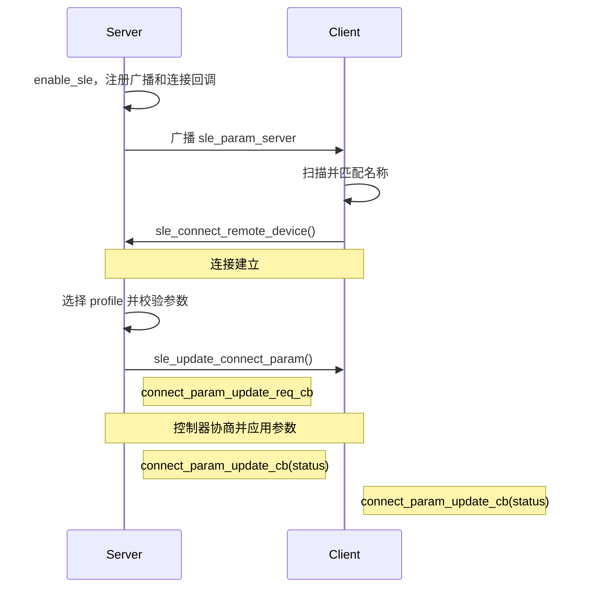

# 连接参数动态更新

> 使用技术：SLE 连接参数更新、连接间隔、从机延迟和监督超时

## 学习目标

- 理解连接间隔、从机延迟和监督超时的单位、范围及相互约束。
- 掌握 `sle_update_connect_param()` 的在线更新流程。
- 观察参数更新请求回调和更新完成回调。
- 通过 Kconfig 在 Low Power、Balanced 和 Low Latency 三个编译期档位之间选择。
- 能在两块 WS53 开发板上验证双方最终生效的连接参数。

## 案例说明

本案例使用两块 WS53 开发板:

- Server 广播设备名 `sle_param_server`，连接建立后发起参数更新。
- Client 扫描并连接目标设备，输出收到的参数更新请求。
- 双方通过 `connect_param_update_cb` 输出最终生效的参数。
- 断连后 Server 重新广播，Client 重新扫描。


源码目录为：

```text
src/application/samples/bt/sle/sle_conn_param_tuning/
```

## 基本概念

### 三个核心参数

| 参数 | 含义 | 单位 | 当前 SDK 范围 |
|---|---|---|---|
| `interval_min` / `interval_max` | 两个连接事件之间的调度间隔 | 0.25 ms | `0x001E`～`0x3E80`，即 7.5 ms～4 s |
| `max_latency` | 允许终端在无数据时跳过的最大连接事件数 | 次 | 0～499 |
| `supervision_timeout` | 多久未收到对端数据后判定断连 | 10 ms | 10～3200，即 100 ms～32 s |

连接间隔越短，通常延迟越低、射频活动越频繁；连接间隔越长，通常更利于降低功耗，但响应延迟会上升。

`max_latency` 只允许设备在无数据时跳过连接事件。设备有数据要发送时，不需要等满整个休眠周期。

### 监督超时约束

监督超时必须严格大于最大休眠连接间隔的两倍：

```text
timeout_ms > 2 × (max_latency + 1) × interval_ms
```

换算成当前 SDK 的原始配置值：

```text
supervision_timeout × 20 > (max_latency + 1) × interval_max
```

以源码中的 Low Power profile 为例：

```text
(49 + 1) × 400 = 20000
1200 × 20      = 24000
```

因此 12 秒超时满足严格大于约束。若使用 10 秒，左右两边相等，不满足要求。源码会在调用 `sle_update_connect_param()` 前执行这一校验。

### 参数档位

源码中的 `interval` 单位为 0.25 ms，`supervision_timeout` 单位为 10 ms。Server 的三种 profile 如下：

| 档位 | interval | 折算连接间隔 | max_latency | timeout | 折算监督超时 | 适用方向 |
|---|---|---|---|---|---|---|
| Low Power | 400 | 100 ms | 49 | 1200 | 12 s | 低频上报、低功耗 |
| Balanced（默认） | 50 | 12.5 ms | 0 | 500 | 5 s | 通用交互 |
| Low Latency | 30 | 7.5 ms | 0 | 200 | 2 s | 实时控制、HID |

表中的“折算”值由源码单位换算得到：`interval × 0.25 ms`、`timeout × 10 ms`。这些是请求参数的时间换算，不等同于整机功耗、吞吐量或端到端时延的实测结果；最终是否被控制器采用，应以双方 `update complete` 回调中的参数和 `status` 为准。

### 参数定义

WS53 源码使用静态 profile 保存档位名称、连接间隔、从机延迟和监督超时，并通过 Kconfig 在编译期选择：

```c
typedef struct {
    const char *name;
    uint16_t interval;
    uint16_t latency;
    uint16_t timeout;
} sle_conn_param_profile_t;

#if defined(CONFIG_SLE_CONN_PARAM_PROFILE_LOW_POWER)
static const sle_conn_param_profile_t PROFILE = {"low-power", 400, 49, 1200};
#elif defined(CONFIG_SLE_CONN_PARAM_PROFILE_LOW_LATENCY)
static const sle_conn_param_profile_t PROFILE = {"low-latency", 30, 0, 200};
#else
static const sle_conn_param_profile_t PROFILE = {"balanced", 50, 0, 500};
#endif
```

### 参数合法性校验

Server 在调用协议栈前检查源码定义的范围：`interval` 为 `0x001E`～`0x3E80`，`max_latency` 不大于 `0x01F3`，`supervision_timeout` 为 `0x000A`～`0x0C80`，且最小间隔不大于最大间隔。

监督超时约束在源码中通过以下计算检查：

```c
timeout_scaled = (uint32_t)param->supervision_timeout * 20U;
max_connection_gap = ((uint32_t)param->max_latency + 1U) * param->interval_max;

if (timeout_scaled <= max_connection_gap) {
    return ERRCODE_INVALID_PARAM;
}
```

不满足时，Server 打印 `invalid profile`，不会发送更新请求。

### 发起参数更新

Server 在连接状态回调收到 `SLE_ACB_STATE_CONNECTED` 后构造参数，并将同一个 `PROFILE.interval` 写入最小和最大连接间隔：

```c
sle_connection_param_update_t param = {
    .conn_id = conn_id,
    .interval_min = PROFILE.interval,
    .interval_max = PROFILE.interval,
    .max_latency = PROFILE.latency,
    .supervision_timeout = PROFILE.timeout,
};

sle_update_connect_param(&param);
```

连接回调运行于 SLE service 上下文，不能在其中执行长时间阻塞操作；本案例不会在回调中调用 `sleep()`。

## 工作流程



当前 SDK 没有 `sle_connect_param_update_rsp()`。`connect_param_update_req_cb` 用于观察请求参数，最终结果由 `connect_param_update_cb` 报告，案例不演示应用层显式接受或拒绝。

## 代码结构

```text
sle_conn_param_tuning/
├── CMakeLists.txt
├── Kconfig
├── README.md
├── sle_conn_param_tuning.c
├── sle_conn_param_tuning_server/src/
│   ├── sle_conn_param_tuning_server.c
│   ├── sle_conn_param_tuning_server.h
│   ├── sle_conn_param_tuning_server_adv.c
│   └── sle_conn_param_tuning_server_adv.h
└── sle_conn_param_tuning_client/src/
    ├── sle_conn_param_tuning_client.c
    └── sle_conn_param_tuning_client.h
```

| 文件或函数 | 作用 |
|---|---|
| `sle_conn_param_tuning.c` / `sle_conn_param_tuning_entry()` | 根据 Kconfig 创建 Server 或 Client 启动任务。 |
| `sle_conn_param_tuning_server.c` | 定义 profile，校验参数并请求更新。 |
| `sle_conn_param_tuning_server_adv.c` | 配置 `sle_param_server` 广播。 |
| `sle_conn_param_tuning_client.c` | 扫描、连接并记录请求和最终更新结果。 |
| `sle_conn_param_validate()` | 检查协议范围及监督超时约束。 |
| `sle_conn_param_request_update()` | 建链回调中组装 `sle_connection_param_update_t` 并调用 `sle_update_connect_param()`。 |

## 相关 API

| API | 角色 | 用途 |
|---|---|---|
| `enable_sle()` | Server、Client | 启动 SLE 协议栈。 |
| `sle_announce_seek_register_callbacks()` | Server、Client | 注册广播或扫描回调。 |
| `sle_connection_register_callbacks()` | Server、Client | 注册连接状态、参数请求和更新完成回调。 |
| `sle_set_announce_param()` / `sle_start_announce()` | Server | 配置并启动广播。 |
| `sle_set_seek_param()` / `sle_start_seek()` | Client | 配置并启动扫描。 |
| `sle_connect_remote_device()` | Client | 发起连接。 |
| `sle_update_connect_param()` | Server | 请求更新连接参数。 |

## Kconfig 配置

角色选项为：

```text
CONFIG_SAMPLE_SUPPORT_SLE_CONN_PARAM_TUNING_SERVER_SAMPLE
CONFIG_SAMPLE_SUPPORT_SLE_CONN_PARAM_TUNING_CLIENT_SAMPLE
```

Server 的 profile 是一个 Kconfig choice，默认 `CONFIG_SLE_CONN_PARAM_PROFILE_BALANCED=y`：

```text
CONFIG_SLE_CONN_PARAM_PROFILE_LOW_POWER
CONFIG_SLE_CONN_PARAM_PROFILE_BALANCED
CONFIG_SLE_CONN_PARAM_PROFILE_LOW_LATENCY
```

Server 和 Client 角色互斥构建；每次更换 profile 后，应重新构建 Server 固件。

## 编译、烧录和验证

在 SDK 根目录执行。`<SERVER_COM>` 和 `<CLIENT_COM>` 替换为实际串口；构建目标使用工程中的 `ws53_liteos_app`。

### 第一步：构建并烧录 Server

```powershell
fbb config set CONFIG_SAMPLE_SUPPORT_SLE_CONN_PARAM_TUNING_SERVER_SAMPLE=y --target ws53_liteos_app
fbb config set CONFIG_SLE_CONN_PARAM_PROFILE_BALANCED=y --target ws53_liteos_app
fbb build ws53_liteos_app --clean
fbb flash ws53_liteos_app --port <SERVER_COM> --json-summary
```

### 第二步：构建并烧录 Client
```powershell
fbb config set CONFIG_SAMPLE_SUPPORT_SLE_CONN_PARAM_TUNING_CLIENT_SAMPLE=y --target ws53_liteos_app
fbb build ws53_liteos_app --clean
fbb flash ws53_liteos_app --port <CLIENT_COM> --json-summary
```

### 第三步：验证 Client

```powershell
fbb monitor --port COM_CLIENT --reset --until "\[sle conn param client\] update complete:.*status=0x0" --timeout 45 --json-summary
```

平衡模式的关键日志：

```text
[sle conn param client] found sle_param_server, stop seek
[sle conn param client] connected, conn_id=0x00
[sle conn param client] update requested: conn_id=0x00, status=0x0, interval=50-50, latency=0, timeout=500
[sle conn param client] update complete: conn_id=0x00, status=0x0, interval=50, latency=0, timeout=500
```

### 第四步：验证 Server

```shell
fbb monitor --port COM_SERVER --reset --until "\[sle conn param server\] update complete:.*status=0x0" --timeout 45 --json-summary
```

平衡模式的关键日志：

```text
[sle conn param server] selected profile=balanced
[sle conn param server] start announce, name=sle_param_server
[sle conn param server] connected, conn_id=0x00
[sle conn param server] update request: profile=balanced, interval=50 (0.25ms), latency=0, timeout=500 (10ms)
[sle conn param server] update request sent, status=0x0
[sle conn param server] update complete: conn_id=0x00, status=0x0, interval=50, latency=0, timeout=500
```
## 常见问题

### Client 扫描不到 Server

- 确认先启动 Server，串口出现 `start announce, name=sle_param_server`。
- 确认两块板烧录的是不同角色，而不是同一固件。
- 确认 Client 日志中出现 `start seek`。

### 更新请求返回失败

- 检查连接间隔、Latency 和监管超时是否在 SDK 范围内。
- 检查监管超时是否严格满足约束，不能只取临界相等值。
- 使用 `connect_param_update_cb` 的 `status` 判断最终结果。

### 只有系统心跳，没有案例日志

检查目标文件是否包含：

```text
sle_conn_param_tuning.c.obj
sle_conn_param_tuning_server.c.obj
sle_conn_param_tuning_server_adv.c.obj
```

或 Client 对应的 `sle_conn_param_tuning_client.c.obj`。若对象文件缺失，重新执行 `--clean` 构建并检查 Kconfig choice。


## 限制

- profile 在编译期选择，运行时不能动态切换。
- 示例验证的是参数协商和回调结果，不是功耗、吞吐或端到端时延基准。
- 实际结果还受业务流量、PHY、射频环境和睡眠策略影响。
