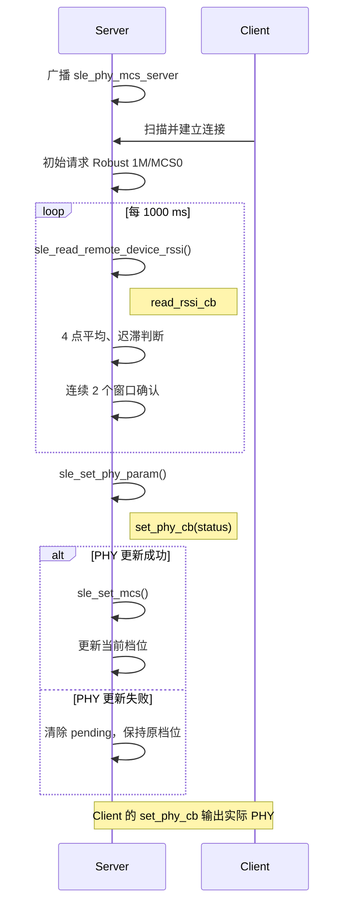

# 无线链路自适应（PHY/MCS）

> 使用技术：SLE (SparkLink Low Energy) RSSI (Received Signal Strength Indicator) 读取、PHY (Physical Layer) 更新、MCS (Modulation and Coding Scheme) 设置、平均窗口和迟滞状态机

> 前置阅读：[Hello SLE](../basics/hello-connect.md)

## 学习目标

- 理解 PHY、MCS 的含义及其对链路速率和鲁棒性的影响，以及 PHY/MCS 切换与连接参数动态更新的区别。
- 掌握 `sle_read_remote_device_rssi()`、`sle_set_phy_param()` 和 `sle_set_mcs()` 的调用关系。
- 根据 RSSI 在 Robust、Balanced、Fast 三个链路档位之间自适应切换。
- 理解平均窗口、迟滞门限和连续窗口确认如何抑制档位抖动。
- 能使用两块 WS53 开发板观察并验证 RSSI 触发的 PHY/MCS 自动升档和降档。

## 案例说明

本案例定期读取连接设备的 RSSI，并将其作为当前链路质量的观测量。RSSI 较高时，示例切换到更高的 PHY/MCS 档位；RSSI 较低时，示例回退到更稳健的档位，从而在吞吐能力和链路鲁棒性之间进行选择。

### PHY 和 MCS 是什么

- **PHY（Physical Layer，物理层）**决定无线信号采用哪种基础传输速率，例如本案例使用的 1M、2M 和 4M。速率越高，发送同样数据所需的时间越短，但对信号质量的要求也越高。
- **MCS（Modulation and Coding Scheme，调制与编码方案）**决定数据采用什么调制方式，以及加入多少纠错保护。较低的 MCS 传输速度较慢，但抗干扰能力更强；较高的 MCS 可以传输更多数据，但在信号较弱时更容易出现丢包和重传。

可以将 PHY 理解为基础传输速率，将 MCS 理解为调制方式与编码保护的组合。两者共同影响链路吞吐能力和鲁棒性：

| PHY/MCS 选择 | 吞吐方向 | 对链路质量的要求 | 适用方向 |
|---|---|---|---|
| 较低档位 | 较低 | 较低，弱信号下更稳健 | 距离较远、遮挡或干扰较强 |
| 较高档位 | 较高 | 较高，弱信号下更容易出现重传 | 距离较近、信号条件良好 |

PHY/MCS 并不是越高越好。实际吞吐和丢包率还与业务数据长度、发射功率、天线、多径、干扰及重传有关，本案例不把档位名称作为产品性能规格。

### 系统组成

本案例使用两块 WS53 开发板：

- Server 广播设备名 `sle_phy_mcs_server`。
- Client 扫描并连接 Server。
- Server 建链后先设置 Robust 档位，再周期读取 Client 的 RSSI。
- Server 根据平均 RSSI、迟滞门限和连续确认窗口选择目标档位。
- Server 先异步更新 PHY，收到成功回调后再设置 MCS。
- Client 输出控制器应用的 PHY 更新结果。
- 断连后 Server 重新广播，Client 重新扫描。

案例源码位于：

```text
src/application/samples/bt/sle/sle_phy_mcs_switch/
```

## 与连接参数动态更新的区别

| 对比项 | 连接参数动态更新 | 无线链路自适应（PHY/MCS） |
|---|---|---|
| 调整对象 | 连接间隔、`max_latency`、监督超时 | 收发 PHY、导频密度和 MCS |
| 示例输入 | 编译期选择的低功耗、均衡或低时延 profile | 周期读取的连接态 RSSI |
| 主要目标 | 平衡功耗与响应时延 | 平衡吞吐能力与链路鲁棒性 |
| 核心 API | `sle_update_connect_param()` | `sle_set_phy_param()`、`sle_set_mcs()` |

连接参数决定“多久通信一次”，PHY/MCS 决定“每次用多快、多稳的方式通信”，二者可以同时使用。

## 切换策略

### 示例档位

WS53 源码定义了以下三个有效档位，三档的导频密度均为 `SLE_PHY_PILOT_DENSITY_16_TO_1`：

| 档位 | PHY | MCS | 调制编码 | 方向 |
|---|---:|---:|---|---|
| Robust | 1M | 0 | BPSK 1/4 | 链路鲁棒性优先 |
| Balanced | 2M | 4 | QPSK 1/2 | 吞吐与鲁棒性平衡 |
| Fast | 4M | 10 | 8PSK 3/4 | 吞吐能力优先 |

> 档位组合和 RSSI 门限是教学示例，不是产品性能规格。实际产品必须结合天线、结构、发射功率、吞吐、丢包率和功耗进行实测标定。

### RSSI 平均与迟滞

Server 每 1000 ms 请求一次 RSSI。每收到 4 个有效样本计算一次平均值；只有连续 2 个平均窗口选择同一个新档位时，才发起切换。

| 当前档位 | 平均 RSSI 条件 | 目标档位 |
|---|---|---|
| Robust | RSSI ≥ -70 dBm | Balanced |
| Balanced | RSSI ≤ -78 dBm | Robust |
| Balanced | RSSI ≥ -50 dBm | Fast |
| Fast | RSSI ≤ -62 dBm | Balanced |

升档和降档使用不同门限，形成迟滞区间。例如，Balanced 升到 Fast 需要达到 -50 dBm，而 Fast 降回 Balanced 需要降低到 -62 dBm 或更低。RSSI 在 -62～-50 dBm 之间波动时，当前档位保持不变。

在 RSSI 请求连续成功且没有 PHY 更新占用任务的情况下，一个平均窗口约需 4 秒，连续确认两个窗口最快约需 8 秒。因此，RSSI 跨过门限后不会立即切换。

## 工作流程



`sle_set_phy_param()` 是异步操作。API 返回成功表示请求已提交，最终结果由 `set_phy_cb` 的 `status` 报告。Server 仅在 PHY 回调成功后调用 `sle_set_mcs()`；切换期间 `g_phy_update_pending` 保持为 `true`，避免重复读取 RSSI 或重入切换。

链路断开时，Server 会清除当前档位、目标档位、候选窗口和 RSSI 累加状态并恢复广播；Client 会清除目标标志并重新扫描。

## 涉及 API

| API | 调用方 | 用途 |
|---|---|---|
| `enable_sle()` | 双方 | 启动 SLE 协议栈。 |
| `sle_announce_seek_register_callbacks()` | 双方 | 注册广播或扫描回调。 |
| `sle_connection_register_callbacks()` | 双方 | 注册连接、RSSI 读取和 PHY 更新回调。 |
| `sle_set_announce_param()` / `sle_start_announce()` | Server | 配置并启动 `sle_phy_mcs_server` 广播。 |
| `sle_set_seek_param()` / `sle_start_seek()` | Client | 配置并启动主动扫描。 |
| `sle_connect_remote_device()` | Client | 连接匹配名称的 Server。 |
| `sle_read_remote_device_rssi()` | Server | 异步读取对端连接态 RSSI。 |
| `sle_set_phy_param()` | Server | 异步设置收发 PHY、帧格式和导频密度。 |
| `sle_set_mcs()` | Server | PHY 更新成功后设置 MCS。 |

## 代码目录

```text
sle_phy_mcs_switch/
├── CMakeLists.txt
├── Kconfig
├── README.md
├── sle_phy_mcs_switch.c
├── sle_phy_mcs_switch_server/
│   ├── CMakeLists.txt
│   └── src/
│       ├── sle_phy_mcs_switch_server.c
│       ├── sle_phy_mcs_switch_server.h
│       ├── sle_phy_mcs_switch_server_adv.c
│       └── sle_phy_mcs_switch_server_adv.h
└── sle_phy_mcs_switch_client/
    ├── CMakeLists.txt
    └── src/
        ├── sle_phy_mcs_switch_client.c
        └── sle_phy_mcs_switch_client.h
```

顶层 `sle_phy_mcs_switch.c` 根据 Kconfig 创建 Server 或 Client 任务。Server 目录负责广播、RSSI 采样、档位决策和 PHY/MCS 切换；Client 目录负责扫描、连接和 PHY 更新观察。

角色选项为：

```text
CONFIG_SAMPLE_SUPPORT_SLE_PHY_MCS_SWITCH_SERVER_SAMPLE
CONFIG_SAMPLE_SUPPORT_SLE_PHY_MCS_SWITCH_CLIENT_SAMPLE
```

这两个选项位于同一个 SLE Sample Kconfig choice 中，角色互斥构建。

## 关键代码

### 档位定义

```c
static const sle_phy_mcs_profile_t PROFILES[] = {
    {"invalid", SLE_PHY_1M, SLE_MCS_00, SLE_PHY_PILOT_DENSITY_16_TO_1},
    {"robust", SLE_PHY_1M, SLE_MCS_00, SLE_PHY_PILOT_DENSITY_16_TO_1},
    {"balanced", SLE_PHY_2M, SLE_MCS_04, SLE_PHY_PILOT_DENSITY_16_TO_1},
    {"fast", SLE_PHY_4M, SLE_MCS_10, SLE_PHY_PILOT_DENSITY_16_TO_1},
};
```

`invalid` 是尚未设置初始档位时的内部状态，不是用户档位。建链后的自适应任务会先请求 Robust。

### 周期读取 RSSI

案例创建名为 `SLEPhyAdapt` 的 OSAL (Operating System Abstraction Layer) 任务。任务在已连接且没有 PHY 更新进行时读取 RSSI：

```c
static void *sle_phy_mcs_adapt_task(const char *arg)
{
    unused(arg);
    while (1) {
        if (!g_connected || g_phy_update_pending) {
            (void)osal_msleep(SLE_PHY_MCS_SAMPLE_INTERVAL_MS);
            continue;
        }
        if (g_current_profile == SLE_PHY_MCS_PROFILE_INVALID) {
            (void)sle_phy_mcs_request_profile(SLE_PHY_MCS_PROFILE_ROBUST);
        } else {
            errcode_t ret = sle_read_remote_device_rssi(g_conn_id);
            if (ret != ERRCODE_SLE_SUCCESS) {
                osal_printk("%s RSSI request failed: 0x%x\r\n", SLE_PHY_MCS_SERVER_LOG, ret);
            }
        }
        (void)osal_msleep(SLE_PHY_MCS_SAMPLE_INTERVAL_MS);
    }
    return NULL;
}
```

RSSI 回调累加样本，达到 4 点后计算整数平均值。选中的新档位必须连续出现 2 个窗口，才会调用 `sle_phy_mcs_request_profile()`。

### PHY 更新后设置 MCS

请求阶段根据目标 profile 同时设置 TX/RX PHY 和导频密度：

```c
g_target_profile = profile_id;
g_phy_update_pending = true;
ret = sle_set_phy_param(g_conn_id, &phy_param);
```

PHY 更新完成回调中，只有 `status` 成功才继续设置 MCS：

```c
if (status != ERRCODE_SLE_SUCCESS) {
    g_phy_update_pending = false;
    g_candidate_windows = 0;
    return;
}
ret = sle_set_mcs(conn_id, target->mcs);
if (ret == ERRCODE_SLE_SUCCESS) {
    g_current_profile = g_target_profile;
}
g_phy_update_pending = false;
g_candidate_windows = 0;
```

## 案例操作指导

以下命令中的 `<SERVER_COM>` 和 `<CLIENT_COM>` 是占位符，请替换为两块 WS53 开发板对应的串口号。构建 Client 会覆盖同一目标的固件包，因此应先构建并烧录 Server，再切换角色构建 Client。

### 第一步：构建并烧录 Server

```powershell
fbb config set CONFIG_ENABLE_BT_SAMPLE=y --target ws53_liteos_app
fbb config set CONFIG_SAMPLE_SUPPORT_SLE_SAMPLE=y --target ws53_liteos_app
fbb config set CONFIG_SAMPLE_SUPPORT_SLE_PHY_MCS_SWITCH_SERVER_SAMPLE=y --target ws53_liteos_app
fbb build ws53_liteos_app --clean
fbb flash ws53_liteos_app --port <SERVER_COM> --json-summary
```

### 第二步：构建并烧录 Client

```powershell
fbb config set CONFIG_ENABLE_BT_SAMPLE=y --target ws53_liteos_app
fbb config set CONFIG_SAMPLE_SUPPORT_SLE_SAMPLE=y --target ws53_liteos_app
fbb config set CONFIG_SAMPLE_SUPPORT_SLE_PHY_MCS_SWITCH_CLIENT_SAMPLE=y --target ws53_liteos_app
fbb build ws53_liteos_app --clean
fbb flash ws53_liteos_app --port <CLIENT_COM> --json-summary
```

### 第三步：验证 Server

先让 Server 上电并开始广播，再复位 Client。监控 Server 串口：

```powershell
fbb monitor --port <SERVER_COM> --reset
```

首先应看到建链和 Robust 初始化：

```text
[sle phy mcs server] policy: robust<-78/-70, balanced<-62/-50, 4 samples x 2 windows
[sle phy mcs server] start announce, name=sle_phy_mcs_server
[sle phy mcs server] connected, conn_id=0x00
[sle phy mcs server] switch complete: profile=robust, phy=1M, mcs=0, status=0x0
```

信号满足升档门限后，应依次出现平均窗口、候选确认和切换完成日志：

```text
[sle phy mcs server] RSSI window: average=<rssi> dBm, current=robust, selected=balanced
[sle phy mcs server] candidate=balanced, confirm=2/2
[sle phy mcs server] switch complete: profile=balanced, phy=2M, mcs=4, status=0x0
[sle phy mcs server] RSSI window: average=<rssi> dBm, current=balanced, selected=fast
[sle phy mcs server] candidate=fast, confirm=2/2
[sle phy mcs server] switch complete: profile=fast, phy=4M, mcs=10, status=0x0
```

### 第四步：验证 Client

监控 Client 串口：

```powershell
fbb monitor --port <CLIENT_COM> --reset
```

Client 会输出连接状态和控制器实际应用的 PHY：

```text
[sle phy mcs client] connected, conn_id=0x00
[sle phy mcs client] PHY changed: conn_id=0x00, status=0x0, tx_phy=1M, rx_phy=1M
[sle phy mcs client] PHY changed: conn_id=0x00, status=0x0, tx_phy=2M, rx_phy=2M
[sle phy mcs client] PHY changed: conn_id=0x00, status=0x0, tx_phy=4M, rx_phy=4M
```

Client 的回调只报告 PHY，不打印 MCS；MCS 设置结果应查看 Server 的 `switch complete` 或 `sle_set_mcs failed` 日志。

### 第五步：验证降档

保持两端串口监控，逐步增加两块板之间的距离，或加入可重复的遮挡和衰减。当平均 RSSI 连续两个窗口满足降档门限时，应看到 Fast → Balanced → Robust。恢复良好信号后，应按相反方向逐级升档。

避免用手直接接触天线区域；人体遮挡会引入较大且不稳定的衰减，不利于重复验证。

## 验证结论

WS53 案例源码 README 记录：Robust 1M/MCS0、Balanced 2M/MCS4 和 Fast 4M/MCS10 三个档位均已完成双板上板验证。该结论验证档位和调用链可以生效，不表示本文门限适用于所有产品环境。

## 常见问题

### RSSI 变化但没有立即切换

这是预期行为。案例每 4 个样本计算一个平均窗口，并要求连续 2 个窗口选择同一新档位。采样连续成功时，最快也约需 8 秒完成确认。

### PHY 更新成功但没有出现 `switch complete`

检查 Server 是否输出 `sle_set_mcs failed`。案例只有在 PHY 回调成功且 `sle_set_mcs()` 返回成功后，才将目标档位写入当前档位。

### 档位一直保持 Robust

- 检查是否持续出现 `RSSI request failed` 或 `RSSI read failed`。
- 检查平均 RSSI 是否达到 Robust → Balanced 的 -70 dBm 门限。
- 确认候选档位是否连续出现两次 `confirm=2/2`。

### Client 扫描不到 Server

- 确认 Server 日志出现 `start announce, name=sle_phy_mcs_server`。
- 确认两块板烧录的是不同角色，而不是同一个固件。
- 确认 Client 日志出现 `start seek`。

## 限制

- RSSI 只反映接收信号强度，不能直接代表吞吐、误包率或干扰水平。
- RSSI 会受遮挡、天线方向、多径和环境干扰影响，门限需要在产品现场重新标定。
- 本示例只演示链路自适应，不提供吞吐量、丢包率或功耗的定量测量。
- Fast 降档等门限触发需要实际改变射频环境，切换至少包含两个统计窗口。
- Server 与 Client 角色互斥构建，不需要外接硬件。
