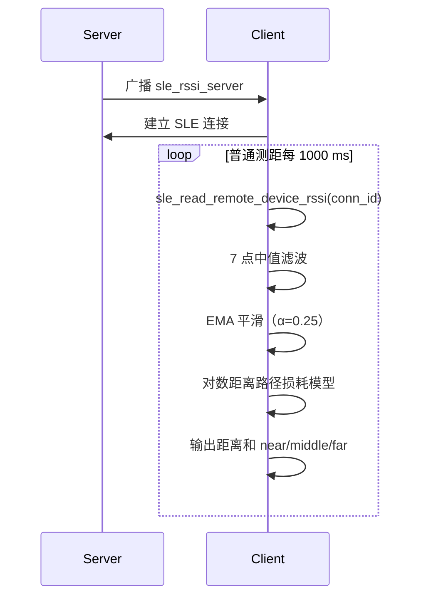
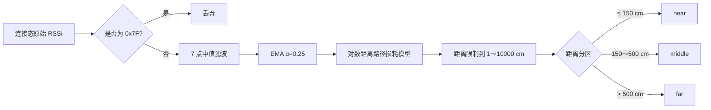
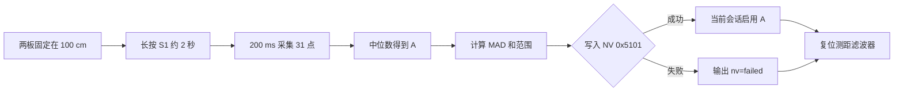

# RSSI 测距

> 使用技术：SLE (SparkLink Low Energy) 连接态 RSSI (Received Signal Strength Indicator) 读取、7 点中值滤波、指数移动平均、对数距离路径损耗模型、一米校准和 NV 持久化

> 前置阅读：[Hello SLE](../basics/hello-connect.md)

## 学习目标

- 理解 RSSI 与传播距离之间的统计关系，不把单次 RSSI 当成精确距离。
- 掌握 `sle_read_remote_device_rssi()` 及异步回调的使用方法。
- 使用 7 点中值滤波和指数移动平均（EMA）平滑 RSSI。
- 使用对数距离路径损耗模型估算距离，并完成 `near`、`middle`、`far` 分区。
- 在 Client 上长按板载 S1 完成 100 cm 单点校准，并将校准记录保存到 NV。
- 理解 RSSI 测距的适用场景、标定方法和固有限制。

## 案例的核心指导点

普通 SLE 连接通常只关心链路能否稳定通信。本案例进一步将连接态 RSSI 变成一条完整的粗粒度测距处理链：

1. Client 每秒读取一次连接态 RSSI。
2. 使用中值滤波抑制突发离群值，再用 EMA 平滑短时波动。
3. 将平滑后的 RSSI 代入经过标定的传播模型。
4. 同时输出估算距离和近、中、远分区。
5. 在 100 cm 处长按 S1，采集 31 个样本更新一米参考值 `A`。

因此，本案例适合接近检测、离开提醒、资产距离趋势和区域触发等场景；不适合厘米级定位、计费测距或仅凭 RSSI 作出安全门禁判断。

它与 PHY/MCS 自适应案例也不同：两者都调用 `sle_read_remote_device_rssi()`，但 PHY/MCS 案例把 RSSI 作为调整链路速率和鲁棒性的依据，本案例则把 RSSI 输入滤波与传播模型，输出距离估计。两者输入 API 相同，控制目标和后续算法不同。

## 系统组成

本案例使用两块 WS53 开发板：

| 角色 | 功能 |
|---|---|
| Server | 广播名称 `sle_rssi_server`，接受 Client 连接。 |
| Client | 扫描、连接、周期读取 RSSI、估算距离并执行一米校准。 |



断连时，Server 恢复广播；Client 清除当前滤波状态并重新扫描。校准过程中若断连，当前校准会取消，已收集的样本不会跨连接继续使用。

案例源码位于：

```text
src/application/samples/bt/sle/sle_rssi_ranging/
```

## 基本原理

### RSSI 表示什么

RSSI 表示接收端观测到的信号强度，单位为 dBm。数值通常为负数，越接近 0 表示信号越强。例如，`-40 dBm` 一般比 `-70 dBm` 强。

无线信号在传播中会衰减。当环境、发射功率、PHY 和天线方向保持相对稳定时，RSSI 的长期统计值通常随距离增加而下降，因此可以使用经验模型反推距离。但墙体遮挡、人体吸收、天线方向和多径反射也会改变 RSSI，所以结果只能作为估计值。

### 算法处理链



#### 第一步：读取并筛选 RSSI

Client 的 `SLERssiPoll` 任务在已连接时调用 `sle_read_remote_device_rssi()`。普通测距模式每 1000 ms 请求一次；API 异步返回，结果由 `read_rssi_cb` 处理。

回调会检查连接 ID、连接状态和 `status`。源码将 `0x7F` 定义为无效 RSSI，收到该值时直接丢弃，不进入滤波或校准流程。

扫描结果中的 RSSI 也按有符号 8 位数解释。源码使用 `(int8_t)result->rssi` 输出扫描值，避免将 `-35 dBm` 一类数据误打印为 `221`。

#### 第二步：7 点中值滤波

Client 保存最近 7 个有效 RSSI 样本，排序后取中位数。中值滤波可以抑制某一次突然升高或降低的离群值，并且不会像简单平均那样被极端样本明显拉偏。

连接刚建立时，窗口会从 1 个样本逐步增长到 7 个；填满后以环形窗口持续替换最旧样本。日志中的 `samples` 表示当前有效窗口大小。

#### 第三步：指数移动平均

中值继续进入 EMA：

```text
RSSI_filtered(k) = 0.75 × RSSI_filtered(k-1) + 0.25 × RSSI_median(k)
```

源码使用 Q8 定点数保存 EMA 状态，旧值权重为 3，新中值权重为 1。`α=0.25` 在响应速度和平滑程度之间取折中：输出比原始 RSSI 稳定，但设备移动后会有一定跟随延迟。

链路重建或校准值更新后，示例会清空中值窗口和 EMA，避免旧链路或旧标定值影响后续结果。

#### 第四步：对数距离路径损耗模型

传播模型为：

```text
RSSI(d) = A - 10 × n × log10(d / d0)
```

反推距离：

```text
d = d0 × 10 ^ ((A - RSSI_filtered) / (10 × n))
```

其中：

| 参数 | 含义 | 案例默认值 |
|---|---|---|
| `d0` | 参考距离 | 1 m |
| `A` | 参考距离处的 RSSI | -45 dBm |
| `n` | 路径损耗指数 | 2.0 |
| `RSSI_filtered` | 中值滤波和 EMA 后的 RSSI | 运行时得到 |

源码直接计算厘米值：

```text
d_cm = 100 × 10 ^ ((A - RSSI_filtered) / (10 × n))
```

结果四舍五入为整数并限制在 1～10000 cm，然后按以下阈值分区：

| 分区 | 距离范围 |
|---|---|
| `near` | ≤ 150 cm |
| `middle` | 150 cm < 距离 ≤ 500 cm |
| `far` | > 500 cm |

## 方案分析

RSSI 测距实现简单、资源开销较低，适合根据接收信号变化判断设备的大致距离和移动趋势。选型时可与 HADM (High Accuracy Distance Measurement) 等高精度方案比较：

| 需求 | RSSI 本案例 | HADM 等高精度测距 |
|---|---|---|
| 近/中/远分区 | 适合 | 适合，但实现成本通常更高 |
| 距离变化趋势 | 适合 | 适合 |
| 准确米级或厘米级距离 | 不保证 | 更合适 |
| 抗遮挡、多径 | 较弱 | 通常更强，但仍受环境影响 |
| 安全可信距离 | 不适合单独使用 | 仍需结合安全协议和威胁模型 |

工程上应优先使用 RSSI 表示“接近概率”和“变化趋势”，而不是把输出的厘米数视为可靠几何距离。若业务必须获得高精度距离，应选择 HADM、信道探测、到达时间测量或其他专用定位技术。

## RSSI 测距方案的限制

该方案的核心限制是：RSSI 不只由距离决定。同样的真实距离可能得到明显不同的 RSSI，同样的 RSSI 也可能对应不同距离。

| 影响因素 | 对结果的影响 |
|---|---|
| 墙体、人体和设备外壳遮挡 | 产生额外衰减，模型通常把距离估得更远。 |
| 地面、墙面和家具造成多径 | 反射信号可能相长或相消，设备静止时 RSSI 也会波动。 |
| 天线方向、安装位置和板卡个体差异 | 同距离的不同设备可能相差数 dB。 |
| PHY、信道和发射功率变化 | 原标定参数可能失效，前后结果不再可比。 |
| 环境人员走动或开关门 | `A` 和 `n` 对应的传播条件变化，结果产生漂移。 |
| 中值和 EMA 滤波 | 输出更稳定，但移动时存在响应延迟。 |

模型包含指数运算，因此 RSSI 误差会被非线性放大。例如在 `n=2.0` 时，RSSI 相差 6 dB，估算距离约相差 2 倍。滤波只能减少随机抖动，不能消除遮挡引起的系统性偏差。

RSSI 只能反映接收功率，无法区分“远距离无遮挡”和“近距离被人体遮挡”，也不能证明对端的真实几何位置。因此，不应单独用于安全门禁、防中继或可信距离判断。

## 为什么必须标定

默认的 `A=-45 dBm` 和 `n=2.0` 只用于演示，不能代表所有 WS53 开发板和部署场地。实际应用建议：

1. 固定 Server、Client 的安装方式、天线方向、PHY 和发射功率。
2. 在目标环境中相距 1 m 放置，采集足够多的 RSSI 样本。
3. 去除异常值后取中位数或稳定均值，作为 `A`。
4. 再选择一个已知距离 `d` 采样，按下式估算 `n`：

```text
n = (A - RSSI(d)) / (10 × log10(d / 1 m))
```

5. 在多个已知距离点验证误差，必要时对不同区域分别标定。

本案例实现了 100 cm 单点校准，只更新 `A`，不会自动计算 `n`。若要拟合 `n`，至少还需要另一个已知距离点；产品化时推荐使用多个距离点进行回归并记录拟合误差。

### WS53 S1 一键校准

Client 使用 WS53 板载 S1 完成一米校准。源码中的硬件映射和状态如下：

| 硬件或资源 | WS53 源码配置 |
|---|---|
| S1 | `S_MGPIO6`（MIO06），高电平按下，`PIN_PULL_NONE`。 |
| 按键检测 | 每 50 ms 轮询；连续 3 次相同电平完成 150 ms 消抖；持续 40 个周期判定为约 2 s 长按。 |
| 可选 SK6805-EC20 DIN | GPIO5；蓝色闪烁表示采集，绿色表示保存成功，红色表示失败或中断。 |
| 用户 NV | ID `0x5101`，保存带 Magic、版本和校验值的校准记录。 |

校准必须在 SLE 已连接时启动。未连接时长按会输出 `long press ignored: SLE is not connected`；校准过程中断链会取消本轮采集并输出 `calibration cancelled: SLE disconnected`。

校准步骤：

1. 保持 Server 和 Client 连接，将两块板固定在 100 cm，并保持实际部署时的天线方向。
2. 长按 Client 板载 S1 约 2 秒后松开。
3. Client 暂停普通测距处理，将 RSSI 请求间隔切换为 200 ms。
4. 收集 31 个原始 RSSI 样本，采集约 6.2 秒。
5. 对样本排序，取中位数作为新的 `A=RSSI@1m`。
6. 计算 MAD（中位绝对偏差）以及最小、最大 RSSI，用于观察校准环境稳定性。
7. 将记录写入 NV `0x5101`；新 `A` 在当前会话立即生效，随后清空普通测距滤波器。



典型日志：

```text
[sle rssi cal] long press detected, calibration start: distance=100 cm, samples=31
[sle rssi cal] recording: 5/31, rssi=<rssi> dBm
[sle rssi cal] calibration complete: A=-46 dBm, MAD=1 dB, range=[-56,-44] dBm, samples=31, nv=ok
```

#### NV 记录和加载

校准记录包含以下字段：

```c
typedef struct {
    uint32_t magic;
    uint32_t version;
    int32_t rssi_at_1m;
    uint32_t mad;
    int32_t min_rssi;
    int32_t max_rssi;
    uint32_t sample_count;
    uint32_t checksum;
} sle_rssi_calibration_nv_t;
```

正常启动时，程序检查记录长度、Magic、版本、`A` 范围、MAD、最小/最大值、样本数和校验值。记录有效时自动加载，否则使用 Kconfig 默认值。对应日志为：

```text
[sle rssi cal] NV calibration loaded: A=-46 dBm, MAD=1 dB, range=[-56,-44] dBm, samples=31
```

或：

```text
[sle rssi cal] no valid NV calibration, use default A=-45 dBm
```

#### 可选 SK6805 状态灯

源码保留了 GPIO5 驱动 SK6805-EC20 的实现：按 GRB 顺序、最高位优先发送 24 位颜色数据，帧后保持 1 ms 低电平完成锁存。采集时蓝灯以约 250 ms 半周期闪烁，NV 保存成功后绿灯保持约 3 秒，失败或断链取消时红灯保持约 3 秒。

SK6805 会锁存最后一次颜色。源码在 SLE 建链稳定约 500 ms 后发送两次全黑帧，清除复位前可能残留的颜色，并输出：

```text
[sle rssi cal] stale LED state cleared after SLE connection
```

> GPIO5 灯效和软件波形尚未在 WS53 实物上完成验证。串口日志不依赖该灯，没有 SK6805 或未使用灯效时仍可完成测距和校准验收。

### Kconfig 参数

| 配置项 | 范围 | 默认值 | 说明 |
|---|---|---|---|
| `CONFIG_SLE_RSSI_RANGING_RSSI_AT_1M` | -100～-20 | -45 | 无有效 NV 记录时的一米参考 RSSI，单位 dBm。 |
| `CONFIG_SLE_RSSI_RANGING_PATH_LOSS_TENTHS` | 10～60 | 20 | `n × 10`，即默认 `n=2.0`。 |

例如路径损耗指数为 2.7 时，应将 `CONFIG_SLE_RSSI_RANGING_PATH_LOSS_TENTHS` 配置为 `27`。

## 涉及 API

| API | 调用方 | 用途 |
|---|---|---|
| `enable_sle()` | 双方 | 启动 SLE 协议栈。 |
| `sle_announce_seek_register_callbacks()` | 双方 | 注册广播、扫描相关回调。 |
| `sle_set_announce_param()` / `sle_start_announce()` | Server | 配置并启动 `sle_rssi_server` 广播。 |
| `sle_set_seek_param()` / `sle_start_seek()` | Client | 配置并启动扫描。 |
| `sle_connect_remote_device()` | Client | 与目标 Server 建立连接。 |
| `sle_connection_register_callbacks()` | 双方 | 注册连接状态和 RSSI 回调。 |
| `sle_read_remote_device_rssi()` | Client | 异步发起连接态 RSSI 读取。 |
| `uapi_gpio_get_val()` | Client | 轮询 MIO06 上的 S1 按键状态。 |
| `uapi_nv_read()` / `uapi_nv_write()` | Client | 加载和保存一米校准记录。 |

## 代码结构

```text
sle_rssi_ranging/
├── CMakeLists.txt
├── Kconfig
├── README.md
├── sle_rssi_ranging.c
├── sle_rssi_ranging_client/
│   ├── CMakeLists.txt
│   └── src/
│       ├── sle_rssi_ranging_calibration.c
│       ├── sle_rssi_ranging_calibration.h
│       ├── sle_rssi_ranging_client.c
│       └── sle_rssi_ranging_client.h
└── sle_rssi_ranging_server/
    ├── CMakeLists.txt
    └── src/
        ├── sle_rssi_ranging_server.c
        ├── sle_rssi_ranging_server.h
        ├── sle_rssi_ranging_server_adv.c
        └── sle_rssi_ranging_server_adv.h
```

顶层 `sle_rssi_ranging.c` 根据 Kconfig 创建 Server 或 Client 任务。Server 负责广播和连接状态；Client 负责扫描、连接、RSSI 轮询、滤波、测距、按键校准和 NV 持久化。

角色配置位于同一个 SLE 案例Kconfig choice 中，角色互斥构建：

```text
CONFIG_SAMPLE_SUPPORT_SLE_RSSI_RANGING_SERVER_SAMPLE
CONFIG_SAMPLE_SUPPORT_SLE_RSSI_RANGING_CLIENT_SAMPLE
```

### RSSI 回调分流

关键处理集中在 Client。异步回调先过滤错误和无效值，再根据校准状态将原始 RSSI 分流到校准或普通测距：

```c
static void sle_rssi_read_cb(uint16_t conn_id, int8_t rssi, errcode_t status)
{
    if ((conn_id != g_conn_id) || !g_connected || (status != ERRCODE_SLE_SUCCESS)) {
        osal_printk("%s RSSI read failed: conn_id=0x%02x, status=0x%x\r\n", SLE_RSSI_CLIENT_LOG, conn_id, status);
        return;
    }
    if (rssi == SLE_RSSI_INVALID_VALUE) {
        osal_printk("%s ignore invalid RSSI=0x7f\r\n", SLE_RSSI_CLIENT_LOG);
        return;
    }
    if (sle_rssi_calibration_is_active()) {
        if (sle_rssi_calibration_add_sample(rssi)) {
            sle_rssi_reset_filter();
        }
        return;
    }
    sle_rssi_process_sample(rssi);
}
```

### 距离计算

源码将 Q8 格式的滤波 RSSI 转换为浮点数，仅在路径损耗模型阶段使用 `powf()`：

```c
float filtered_rssi = (float)filtered_rssi_q8 / 256.0f;
float path_loss = (float)CONFIG_SLE_RSSI_RANGING_PATH_LOSS_TENTHS / 10.0f;
float exponent = ((float)sle_rssi_calibration_get_rssi_at_1m() - filtered_rssi) /
                 (10.0f * path_loss);
float distance_cm = 100.0f * powf(10.0f, exponent);
```

## 编译、烧录和验证

以下命令中的 `<SERVER_COM>` 和 `<CLIENT_COM>` 是占位符，请替换为两块 WS53 开发板对应的串口号。构建 Client 会覆盖同一目标的固件包，因此应先构建并烧录 Server，再切换角色构建 Client。

### 第一步：构建并烧录 Server

```powershell
fbb config set CONFIG_ENABLE_BT_SAMPLE=y --target ws53_liteos_app
fbb config set CONFIG_SAMPLE_SUPPORT_SLE_SAMPLE=y --target ws53_liteos_app
fbb config set CONFIG_SAMPLE_SUPPORT_SLE_RSSI_RANGING_SERVER_SAMPLE=y --target ws53_liteos_app
fbb build ws53_liteos_app --clean
fbb flash ws53_liteos_app --port <SERVER_COM> --json-summary
```

### 第二步：构建并烧录 Client

```powershell
fbb config set CONFIG_ENABLE_BT_SAMPLE=y --target ws53_liteos_app
fbb config set CONFIG_SAMPLE_SUPPORT_SLE_SAMPLE=y --target ws53_liteos_app
fbb config set CONFIG_SAMPLE_SUPPORT_SLE_RSSI_RANGING_CLIENT_SAMPLE=y --target ws53_liteos_app
fbb build ws53_liteos_app --clean
fbb flash ws53_liteos_app --port <CLIENT_COM> --json-summary
```

### 第三步：检查测距日志

先让 Server 上电并广播，再复位 Client。可以等待首条完整 7 点窗口输出：

```powershell
fbb monitor --port <CLIENT_COM> --reset --until "\[sle rssi client\] range:.*samples=7.*distance=.*zone=" --timeout 30 --json-summary
```

典型日志：

```text
[sle rssi client] found sle_rssi_server, scan_rssi=<scan_rssi> dBm, stop seek
[sle rssi client] connected, conn_id=0x00, calibration=-45 dBm@1m, path_loss=2.0
[sle rssi client] range: raw=<raw> dBm, median=<median> dBm, filtered=<filtered> dBm, samples=7, distance=<distance> cm, zone=<zone>
```

日志中的 `distance` 是模型输出，不是用尺子独立测得的真实距离。

### 第四步：验证校准和 NV 加载

将两块板固定在 100 cm，保持天线方向不变，长按 Client 板载 S1。可以等待校准完成：

```powershell
fbb monitor --port <CLIENT_COM> --until "\[sle rssi cal\] calibration complete:.*nv=ok" --timeout 30 --json-summary
```

校准完成后复位 Client，再验证 NV 记录被重新加载：

```powershell
fbb monitor --port <CLIENT_COM> --reset --until "\[sle rssi cal\] NV calibration loaded: A=" --timeout 30 --json-summary
```

复位后连接日志中的 `calibration=... dBm@1m` 应与校准完成日志中的 `A` 一致。在 100 cm 保持板卡不动时，滤波稳定后的估算距离应接近 100 cm，但不应要求单次输出严格等于 100 cm。

## 验证结论

WS53 案例源码 README 记录：S1 长按、31 点校准、NV 持久化、重启加载和 100 cm 测距链路均已完成双板验证；一次 100 cm 实测曾输出约 89 cm。该数值仅代表当时环境，不构成精度保证。GPIO5 的可选 SK6805 灯效和波形尚未完成实物验证。

## 常见问题

### RSSI 变强，距离为什么偶尔反而变远

中值窗口和 EMA 会引入短暂滞后，当前输出同时受最近多个样本影响。持续移动一段时间后，结果才会逐步跟随新的信号水平。

### 为什么换一个房间后误差明显变大

路径损耗指数 `n` 和一米参考值 `A` 都与环境有关。开放空间、走廊和房间具有不同的遮挡和多径结构，应在目标部署环境中重新标定。

### 可以直接使用默认的 -45 dBm 和 2.0 吗

可以用于跑通案例和观察算法流程，不应直接作为产品测距参数。产品化前至少要完成一米参考点和多个已知距离点的标定验证。

### 长按 S1 没有开始校准

- 确认按下的是 Client 板载 S1（MIO06），不是 Server。
- 确认 Client 已输出 `connected`；未连接时长按会被拒绝。
- 按键为高电平有效，需要持续按住约 2 秒。
- 检查是否输出 `long press ignored` 或 `calibration cancelled`。

### 重启后没有加载校准值

- 检查校准完成日志是否为 `nv=ok`。
- 检查是否输出 `no valid NV calibration`；该日志表示记录未通过长度、Magic、版本、范围、样本数或校验值检查。
- 若 NV 写入失败，当前会话仍会使用新 `A`，但重启后会回退到 Kconfig 默认值。

### Client 扫描不到 Server

- 确认 Server 日志出现 `start announce, name=sle_rssi_server`。
- 确认两块板烧录的是不同角色，而不是同一个固件。
- 确认 Client 日志出现 `start seek`。

## 限制

- RSSI 测距易受遮挡、多径、天线方向、PHY 和板卡个体差异影响，只适合趋势和粗粒度分区。
- 100 cm 单点只能校准偏移 `A`，不能同时拟合路径损耗指数 `n`。
- 默认 `A` 和 `n` 仅用于示例；产品化前应在目标环境中使用多个已知距离点重新标定。
- 本案例不能替代 HADM 等高精度测距方案，也不能单独用于安全可信距离判断。
- 普通测距每秒读取一次 RSSI；提高采样频率不一定提高精度，还会增加调度和日志开销。
- Server 与 Client 角色互斥构建；校准按键位于 Client 板。
- 可选 SK6805 灯效未完成实物验证，不作为测距和校准主功能的验收条件。
