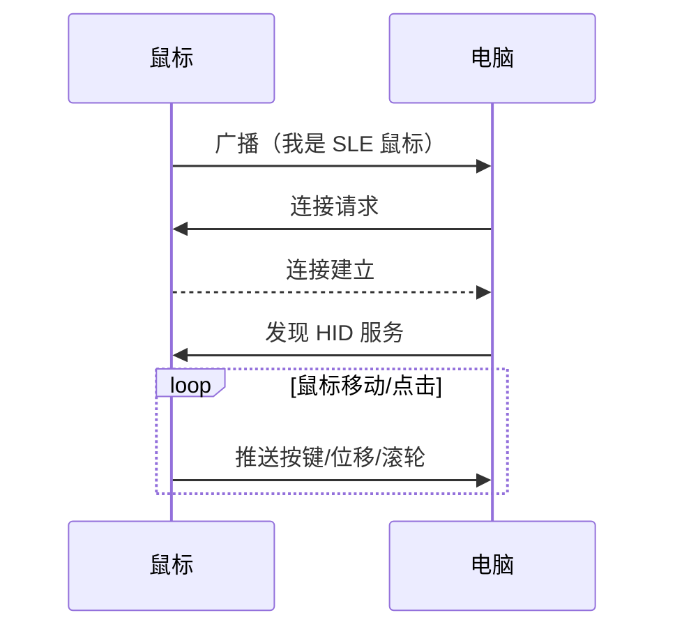
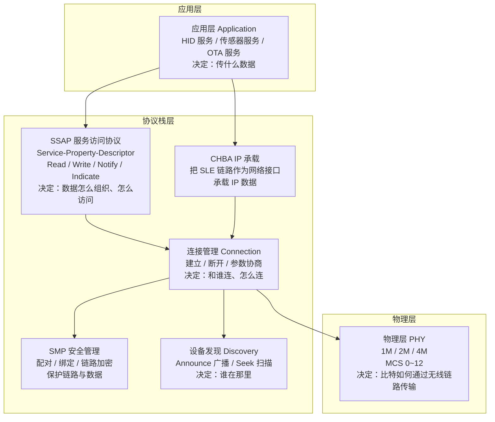

# 概述

## 认识星闪

**星闪（SparkLink）** 是新一代无线短距离通信技术标准，设计目标是在功耗、速率、时延、连接数和抗干扰等方面满足消费电子、智能家居、工业互联和车载等场景的需求。

星闪 1.0 标准定义了两大接入模式：

| 模式 | 定位 | 特点 | 典型场景 |
| --- | --- | --- | --- |
| **SLB（SparkLink Basic）** | 基础高速率 | 高带宽、高吞吐 | 音视频传输、文件分享、无线投屏 |
| **SLE（SparkLink Low Energy）** | 低功耗低时延 | 低功耗、低时延、多连接 | 鼠标键盘、游戏手柄、传感器、可穿戴设备 |

> 本参考文档聚焦 SLE。如果应用场景是鼠标、键盘、传感器上报、固件升级等短距交互场景，可以优先了解 SLE。

---

## SLE 的通信模型

理解 SLE 的工作方式，可以从一组具体的通信场景入手。以常见的“鼠标连接电脑”为例：



通信过程分为四个阶段：

**第一阶段：发现。** 鼠标上电后，不断向外发送广播包。电脑打开扫描搜索周边设备，当电脑收到鼠标的广播包时就发现了鼠标。

**第二阶段：连接。** 电脑向鼠标发起连接请求，双方建立专用的 ACL（Asynchronous Connection-Less）通信通道。

**第三阶段：服务交互。** 鼠标通过 SLE 定义 HID（Human Interface Device）服务，包含按键状态、X/Y 轴位移和滚轮值等属性。电脑发现服务后订阅属性，鼠标移动时通过 Notify 推送数据。

**第四阶段：持续维护。** 双方根据需要调整连接参数（静止时省电、移动时提速）、切换 PHY 模式，断连后自动恢复广播或扫描。

> 小结：SLE 通信 = **发现 → 连接 → 服务交互 → 持续维护**。WS53 的 [Hello SLE](../basics/hello-connect.md) 完整演示了这条基础链路。

---

## SLE 协议栈结构

SLE 的软件实现是一个分层协议栈，从底层无线信号到上层应用数据，每一层承担不同职责：



初学者不需要一次记住所有模块。普通属性服务走 SSAP 路径，CHBA/IP 承载是另一条应用路径；两者都会使用连接管理和底层 SLE 能力。图中箭头表示案例使用关系，不表示完整协议规范的严格分层。

---

## 核心概念

### 角色模型：G 和 T

SLE 把连接中的两个设备称为 **G（Grant，授权端）** 和 **T（Terminal，终端）**。

| 角色 | 职责 | 常见设备形态 |
| --- | --- | --- |
| **G（Grant）** | 管理连接参数、调度通信时隙 | 电脑、手机、网关 |
| **T（Terminal）** | 按照 G 的调度进行通信 | 鼠标、键盘、传感器 |

G/T 和 Server/Client 是两套独立概念。G/T 描述谁管理连接，Server/Client 描述谁提供数据、谁消费数据。阅读 Sample 时应分别确认广播/扫描行为、连接发起方和 SSAP 数据角色。

### 设备发现：广播与扫描

SLE 设备在建立连接前，需要通过“发现”找到彼此：

- **Announce（广播）**：设备周期发送广播数据，内容可以包含设备名称、地址和业务标识。设备可以声明为可连接，也可以只广播而不接受连接。
- **Seek（扫描）**：设备在指定 PHY 上监听广播，解析对端信息并决定是否发起连接。

典型流程为：T 端广播 → G 端扫描 → 发现目标 → 发起连接 → 连接建立。

WS53 SDK 通过 `sle_announce_seek_register_callbacks()` 注册发现回调，Server 常调用 `sle_start_announce()`，Client 常调用 `sle_start_seek()`。

### SSAP：数据如何组织和访问

**SSAP** 是 SLE 的上层服务访问协议，定义设备之间如何组织和访问数据。它采用 **Service → Property → Descriptor** 三级结构：

```text
Service（服务）                 ← 一个功能模块
  ├── Property（属性）           ← 一个数据项，带读写权限
  │     ├── Value               ← 数据本身
  │     └── Descriptor（描述符） ← 属性的元信息或客户端配置
  └── Property
        └── ...
```

以温度传感器为例：

| 层级 | 实际内容 |
| --- | --- |
| Service | 环境监测服务 |
| Property 1 | 当前温度，权限为只读并支持通知 |
| Property 2 | 上报间隔，权限为可读可写 |
| Descriptor | 属性说明或客户端是否订阅通知 |

数据交互有五种常用操作：

| 操作 | 发起方 | 说明 | 举例 |
| --- | --- | --- | --- |
| **Read** | Client | 请求读取属性值，Server 返回数据 | 读取当前温度 |
| **Write Request** | Client | 写入数据并等待 Server 确认 | 修改上报间隔 |
| **Write Command** | Client | 写入数据但不等待确认 | 连续下发允许少量丢失的数据 |
| **Notify** | Server | 主动推送，不要求 Client 确认 | 周期上报温度 |
| **Indicate** | Server | 主动推送，Client 必须确认 | 上报必须送达的告警 |

Property 通过权限位控制访问规则，例如读、写、加密、认证和授权。生产应用应根据数据敏感程度组合权限，不应仅依赖应用层数据格式。

### 连接管理

连接建立后，协议栈提供一组接口管理连接状态和质量：

- **连接参数**：连接间隔、从机延迟和监督超时共同决定功耗、响应速度和断链判定。
- **PHY 切换**：SLE 提供 1M、2M、4M PHY，可以在传输速率与链路可靠性之间选择。
- **MCS（Modulation and Coding Scheme）**：不同调制编码档位对信号质量和速率的要求不同。
- **RSSI（Received Signal Strength Indicator）**：用于观察连接态信号强度或估算距离趋势，但会受到遮挡、多径和天线方向影响。
- **多连接**：通过 `conn_id` 区分不同链路；最大连接数量以具体芯片和 SDK 配置为准。
- **断开与重连**：断开可能由本地请求、对端请求、监督超时或无线环境引起，应用应恢复广播或扫描。

WS53 已提供[连接参数动态更新](../link-mgmt/conn-param-tuning.md)、[PHY/MCS 自适应](../link-mgmt/phy-mcs-switch.md)和[RSSI 测距](../link-mgmt/rssi-ranging.md)案例。

### 配对与安全

SLE 的安全机制包括多个层次：

| 层次 | 作用 | 说明 |
| --- | --- | --- |
| **配对** | 首次建立信任关系并交换密钥材料 | 可根据设备交互能力选择配对方式 |
| **绑定** | 将配对信息保存到非易失存储 | 后续连接可以复用已有信任关系 |
| **链路加密** | 保护链路层传输数据 | 防止明文空中传输 |
| **属性保护** | 对特定 SSAP 属性增加访问限制 | 可组合加密、认证或授权权限 |

Hello SLE 使用 Just Works 完成基础配对，适合功能验证，但不提供中间人攻击防护。产品应根据设备输入输出能力和安全等级选择配对方式。

---

## SLE 还能做什么

除了基础读写和通知推送，SLE 还提供多种进阶能力。

### CHBA：让 SLE 承载 IP 数据

CHBA 是 WS53 SDK 提供的 SLE 网络承载机制，可以将 SLE 链路接入网络接口，使上层 TCP/IP 协议栈通过该链路收发数据。当前仓内头文件和案例只使用 `CHBA` 缩写，未给出可核验的英文全称，因此本文不扩展该缩写。WS53 提供 [SLE CHBA](../verticals/chba.md) 案例，并在目标配置打开 `CHBA_LWIP_SWITCH` 时接入 lwIP。

### Low Latency：低时延调度

SLE 低时延接口提供多档调度频率，用于输入设备等对响应速度敏感的场景。WS53 当前 SDK 头文件定义了 125 Hz、250 Hz、500 Hz、1 kHz、2 kHz、4 kHz 和 8 kHz 档位。

| 速率 | 上报间隔 | 典型用途 |
| --- | --- | --- |
| 125 Hz | 8 ms | 普通办公外设 |
| 500 Hz | 2 ms | 低时延输入设备 |
| 1 kHz / 2 kHz | 1 ms / 0.5 ms | 高性能鼠标或手柄 |
| 4 kHz / 8 kHz | 0.25 ms / 0.125 ms | 极低时延场景 |

调度档位存在于接口层不等同于当前已有独立 Sample。实际使用前还需要确认产品时钟、功耗、链路质量和对端支持情况。

### OTA：固件无线升级

SLE OTA Service 可用于通过无线链路传输固件并管理升级状态。WS53 SDK 包含 `sle_ota.h` 接口，但当前 `src/application/samples/` 没有独立的 SLE OTA 案例，因此本节暂不提供构建和烧录步骤。

### HADM：高精度测距

**HADM（High Accuracy Distance Measurement）** 通过 Channel Sounding 等过程获取测距所需数据，精度目标高于普通 RSSI 距离估算。WS53 SDK 包含 `sle_hadm_manager.h` 接口，但当前没有独立 HADM Sample；现有案例为 RSSI 粗粒度测距。

### 射频测试

产线和认证场景可以通过 SLE Factory Manager 配置射频测试。WS53 SDK 包含 `sle_factory_manager.h`，但具体频率、功率、PHY、调制方式和测试流程应以产品认证方案为准。

---

## 开发模型

### 回调驱动模式

SLE API 采用**回调驱动（Callback-driven）**模式：

- 应用调用 API 发起操作，例如扫描、连接或服务发现。
- 操作由协议栈异步执行。
- 操作完成后，协议栈调用应用提前注册的回调函数报告结果。

这种模式不会阻塞主任务，适合嵌入式并发事件处理。应用应在回调中推进状态机，不应在 API 返回后轮询等待异步结果。

```c
/* 1. 定义连接状态回调。 */
static void connect_state_changed_cb(uint16_t conn_id, const sle_addr_t *addr,
    sle_acb_state_t state, sle_pair_state_t pair_state, sle_disc_reason_t reason)
{
    if (state == SLE_ACB_STATE_CONNECTED) {
        /* 连接成功，在这里触发后续服务发现或业务操作。 */
    }
}

/* 2. 注册回调。 */
sle_connection_callbacks_t callbacks = {
    .connect_state_changed_cb = connect_state_changed_cb,
};
sle_connection_register_callbacks(&callbacks);

/* 3. 发起异步连接。 */
sle_connect_remote_device(&peer_addr);
```

> 示例代码用于说明回调结构，具体类型和回调字段请以当前 SDK 头文件及案例源码为准。

### Server 开发：建立数据提供方

Server 是提供数据的一方，典型流程如下：

1. 注册设备发现和连接回调。
2. 调用 `ssaps_register_server()` 注册 Server 身份。
3. 添加 Service、Property 和 Descriptor。
4. 启动 Service，使其可被 Client 发现。
5. 配置 Announce 参数和数据并开始广播。
6. 在 Read/Write 回调中处理 Client 请求，或通过 Notify/Indicate 主动上报。

```c
uint8_t server_id;
uint16_t service_handle;

ssaps_register_server(&app_uuid, &server_id);
ssaps_add_service_sync(server_id, &service_uuid, true, &service_handle);
/* 继续添加 Property、Descriptor 并启动 Service。 */
sle_start_announce(announce_handle);
```

### Client 开发：建立数据消费方

Client 是发现和消费数据的一方，典型流程如下：

1. 调用 `ssapc_register_client()` 注册 Client。
2. 配置 Seek 并开始扫描。
3. 在扫描回调中筛选目标地址并发起连接。
4. 建链后调用 `ssapc_find_structure()` 发现服务和属性。
5. 根据业务发起 Read/Write，或订阅并接收 Notify/Indicate。
6. 断链后清理连接状态并恢复扫描。

```c
uint8_t client_id;
ssapc_register_client(&app_uuid, &client_id);
sle_start_seek();

/* 在扫描回调中保存目标地址并连接。 */
sle_connect_remote_device(&target_addr);

/* 建链后发起服务发现。 */
ssapc_find_structure(client_id, conn_id, &find_param);
```

### 回调注册一览

协议栈各子模块采用统一的回调注册模式：

```c
/* 连接状态、参数更新、配对和 RSSI。 */
sle_connection_register_callbacks(&conn_callbacks);

/* 广播启停和扫描结果。 */
sle_announce_seek_register_callbacks(&discovery_callbacks);

/* SSAP Server：读写请求和发送结果。 */
ssaps_register_callbacks(&server_callbacks);

/* SSAP Client：发现、读写完成和推送数据。 */
ssapc_register_callbacks(&client_callbacks);
```

理解回调驱动是 SLE 开发的关键。Hello SLE 的 Server 和 Client 源码可以作为最小实现参考。

---

## WS53 当前 SLE 能力与案例

下表只描述当前 WS53 仓库中能够由源码目录和构建入口对应到的案例：

| 分类 | 案例 | 主要能力 |
| --- | --- | --- |
| 基础入门 | [Hello SLE](../basics/hello-connect.md) | 广播、扫描、连接、配对、发现、通知和属性读写 |
| 数据通信 | [参数配置与持久化](../data-comm/device-config.md) | 配置读写、合法性校验和 NV |
| 数据通信 | [分片传输](../data-comm/fragmentation.md) | 1024 字节数据分片、重组和校验 |
| 数据通信 | [高吞吐传输](../data-comm/high-throughput.md) | 独立 Client/Server 吞吐测试 |
| 数据通信 | [传感器上报](../data-comm/sensor-report.md) | AHT20 采集及 Notify/Indicate 上报 |
| 数据通信 | [UART 透传](../data-comm/uart-bridge.md) | UART 与 SLE 双向透明传输 |
| 连接管理 | [连接参数动态更新](../link-mgmt/conn-param-tuning.md) | 低功耗、均衡和低时延参数档位 |
| 连接管理 | [无线链路自适应](../link-mgmt/phy-mcs-switch.md) | 基于 RSSI 的 PHY/MCS 动态切换 |
| 连接管理 | [RSSI 测距](../link-mgmt/rssi-ranging.md) | 滤波、粗测距、一米校准和 NV |
| 行业方案 | [CHBA](../verticals/chba.md) | CHBA 组网及可选 lwIP 数据通道 |

建议先完成 Hello SLE，再依次学习数据通信和连接管理案例，最后根据产品需求组合传感器、NV、低时延、OTA、HADM 或 CHBA 能力。

> 本页的 SLE 通用原理与 WS63 概述保持一致。涉及最大发射功率、最大连接数、连接参数边界等芯片规格时，应以 WS53 对应版本的芯片资料和 SDK 头文件为准，不直接套用 WS63 数值。
