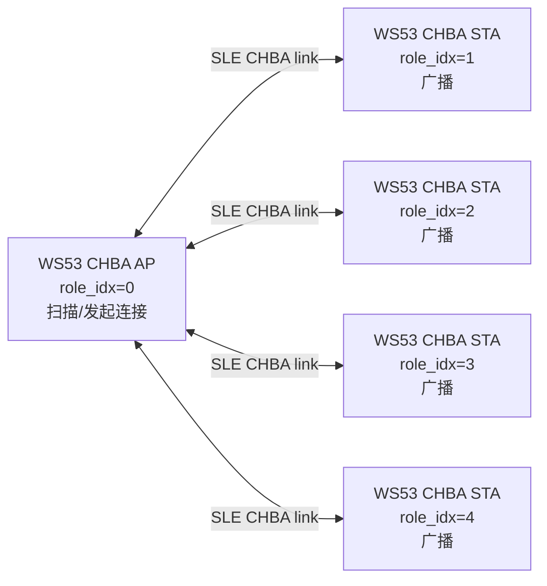
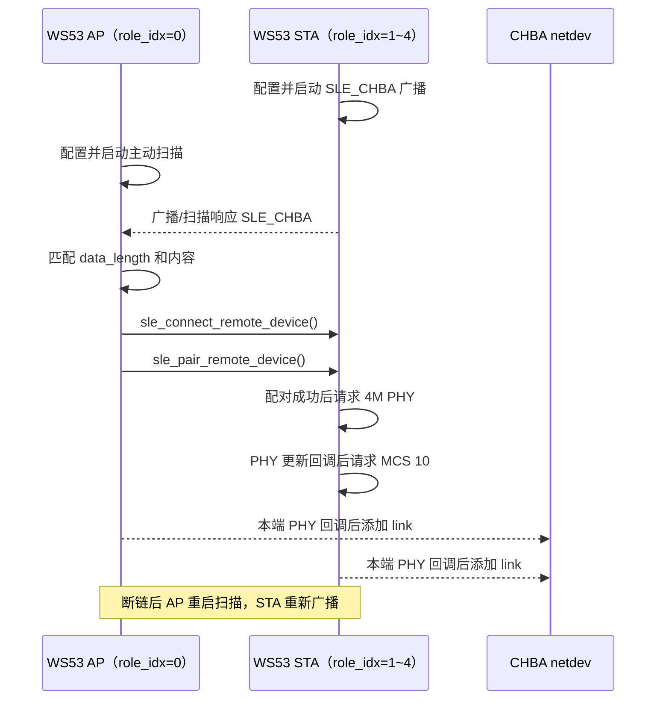
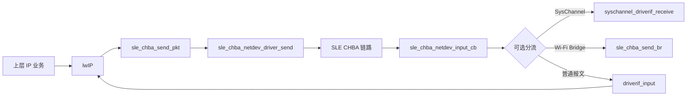

# SLE CHBA

> 前置阅读：[SLE 概述](../overview/index.md)和[连接参数动态更新](../link-mgmt/conn-param-tuning.md)

本案例使用两块 WS53 建立 SLE CHBA 链路：AP 角色扫描并连接 STA，STA 角色发布固定发现数据；配对和 PHY/MCS 更新完成后，案例把连接加入 CHBA 网络设备，并在目标配置允许时接入 lwIP `sle` 网络接口。源码位于 `src/application/samples/bt/sle_chba/`，不使用 SSAP Service、Property、Descriptor 或 CCCD。

## 学习目标

- 理解 CHBA AP/STA、SLE Client/Server 与 G/T 角色之间的区别。
- 掌握 NV 角色配置、扫描、广播、连接、配对和断链恢复流程。
- 理解 1M 初始建链以及 4M PHY、MCS 10 更新的调用顺序。
- 掌握 CHBA link、lwIP `sle` 接口和可选 SysChannel/Wi-Fi Bridge 的数据路径。
- 能使用两块 WS53 验证发现、连接、配对、链路加入和断链恢复。
- 根据当前源码判断参数请求值、回调结果和 IP 通信条件。

## 基本概念

### CHBA 角色与拓扑

CHBA 角色由 NV 中的 `role_idx` 决定，不是两个独立的 Kconfig Sample：

| `role_idx` | CHBA 角色 | SLE 行为 | 拓扑职责 |
| --- | --- | --- | --- |
| `0` | `CHBA_ROLE_AP` | 扫描并主动连接，公共头文件称为 SLE Client 侧 | 网络中心，可管理 STA |
| `1`～`4` | `CHBA_ROLE_STA` | 发布 `SLE_CHBA` 广播，公共头文件称为 SLE Server 侧 | 叶子节点，等待 AP 连接 |
| 大于 `4` | 无效 | 初始化函数直接返回 | 不启动发现流程 |

CHBA AP/STA 是网络拓扑角色，G/T 是 SLE 链路调度角色。STA 广播使用 `SLE_ANNOUNCE_ROLE_T_CAN_NEGO`，AP 建链参数打开 `gt_negotiate`，因此不能仅凭 AP/STA 名称推断最终 G/T 结果，应以连接回调和协商结果为准。



源码链路表最多保存 4 条连接，与最多四个 STA 的拓扑目标一致；链路记录按 `conn_id` 分配，并不使用 `role_idx` 作为数组下标。

### 发现与建链流程

STA 使用广播句柄 `2`，在广播包和扫描响应中都发布 `SLE_CHBA`。AP 进行 1M 主动扫描，只接受长度和内容都完全匹配的报告，然后发起连接。



连接建立时 AP 使用 `initiate_phys=1`，即以 1M 发起。非 AP 端在配对成功回调中请求 4M；本端收到 PHY 更新回调后再请求 MCS 10，并调用 `sle_chba_netdev_add_link()`。这些都是异步请求，实际 PHY 和状态应以回调参数为准。

### CHBA 网络数据路径

`CHBA_LWIP_SWITCH=1` 时，案例创建名为 `sle` 的 lwIP `netif`。发送和接收路径如下：



`chba_adapter_netdev_init()` 将接口注册为默认 netif，并设置为 administratively up，但初始 link 状态为 down。IP、掩码和网关均初始化为 `0.0.0.0`；案例没有启动 DHCP，也没有提供静态 IP 配置命令。因此，链路加入成功只表示 CHBA 数据通道就绪，不代表可以直接执行 `ping`。

### 链路状态

每条连接使用 `sle_chba_user_link_t` 保存以下状态：

| 字段 | 用途 |
| --- | --- |
| `conn_id` | SLE 连接标识，空闲值为 `0xFFFF` |
| `remote_addr` | 远端 SLE 地址 |
| `status` | Ready、参数更新、PHY 更新或加密阶段 |
| `link_param` | 已记录的 interval、PHY、MCS 和 latency |
| `link_ready` | PHY 回调完成并加入 CHBA netdev 后置为 `true` |

连接回调从四项静态表中分配记录；断开时删除 CHBA link、清理记录，然后根据角色恢复扫描或广播。

## 涉及 API

| API | 阶段 | 用途 |
| --- | --- | --- |
| `uapi_nv_read()` | 初始化 | 读取 `chba_mode` 和 `role_idx` |
| `enable_sle()` | 初始化 | 使能 SLE 协议栈 |
| `sle_connection_register_callbacks()` | 初始化 | 注册连接、参数、PHY 和配对回调 |
| `sle_announce_seek_register_callbacks()` | 初始化 | 注册扫描和广播回调 |
| `sle_set_seek_param()` / `sle_start_seek()` | AP 发现 | 配置并启动主动扫描 |
| `sle_set_announce_param()` / `sle_set_announce_data()` | STA 发现 | 配置广播参数和 `SLE_CHBA` 数据 |
| `sle_start_announce()` | STA 发现 | 启动广播 |
| `sle_default_connection_param_set()` | AP 建链 | 设置初始 PHY、扫描和连接参数 |
| `sle_connect_remote_device()` | AP 建链 | 连接扫描到的 STA |
| `sle_pair_remote_device()` | AP 配对 | 连接成功后发起配对 |
| `sle_set_phy_param()` | 链路调整 | 请求 4M PHY |
| `sle_set_mcs()` | 链路调整 | PHY 回调后请求 MCS 10 |
| `sle_update_connect_param()` | 参数更新辅助函数 | 请求更新连接间隔；当前入口没有调用该辅助函数 |
| `sle_chba_netdev_create()` | 网络设备 | 按 AP/STA 角色创建 CHBA netdev |
| `sle_chba_netdev_add_link()` / `sle_chba_netdev_del_link()` | 链路管理 | 添加或删除连接映射 |
| `sle_chba_netdev_register_callbacks()` | 数据通道 | 注册队列、link 和接收回调 |
| `netifapi_netif_add()` | lwIP | 创建 `sle` 网络接口 |

## 案例说明

### 案例简介

同一份 CHBA Sample 通过 NV 决定 AP/STA 角色。AP 持续扫描固定发现数据，STA 持续广播；连接、配对和 PHY/MCS 更新完成后，连接被加入网络设备。案例提供网络接口适配和可选桥接代码，但不提供独立的 IP 地址分配服务或上层 TCP/UDP 测试任务。

### 功能规格

| 规格项 | WS53 当前实现 |
| --- | --- |
| 源码目录 | `src/application/samples/bt/sle_chba/` |
| Kconfig | `CONFIG_SAMPLE_SUPPORT_CHBA_SAMPLE` |
| AP/STA 选择 | NV ID `0x2160` 中的 `role_idx` |
| 默认 NV | `[chba_mode=0, role_idx=1]`，即 STA |
| 最大链路记录 | 4 |
| 广播句柄 | 2 |
| 发现数据 | `SLE_CHBA`，源码长度为 9 字节 |
| 初始建链 PHY | 1M |
| 目标 PHY / MCS | 4M / MCS 10 |
| 监督超时 | 原始值 500，即 5 s |
| 断链恢复 | AP 重启扫描；STA 重新广播 |
| lwIP 接口 | 名称 `sle`，初始地址 `0.0.0.0` |
| SSAP | 不使用 |

### 发现数据格式

源码定义：

```c
#define CHBA_ADV_DATA "SLE_CHBA"

sle_announce_data_t adv_data = {
    .announce_data_len = sizeof(CHBA_ADV_DATA),
    .seek_rsp_data_len = sizeof(CHBA_ADV_DATA),
    .announce_data = (uint8_t *)&CHBA_ADV_DATA,
    .seek_rsp_data = (uint8_t *)&CHBA_ADV_DATA,
};
```

`sizeof("SLE_CHBA")` 包含结尾的 `\0`，因此发布和匹配长度都是 9 字节：

| 偏移 | 长度 | 内容 |
| --- | --- | --- |
| 0～7 | 8 字节 | ASCII `SLE_CHBA` |
| 8 | 1 字节 | `0x00` |

AP 同时检查 `report->data_length == sizeof(CHBA_ADV_DATA)` 和字符串内容。自定义对端若只发送 8 个可见字符，将不会被当前扫描回调接受。

### NV 角色格式

NV ID `0x2160` 对应：

```c
typedef struct {
    uint8_t chba_mode;
    uint8_t role_idx;
} chba_cfg_t;
```

仓内 `src/middleware/chips/ws53/nv/nv_config/cfg/acore/app.json` 默认值为 `[0, 1]`。两块板都使用默认 NV 时会同时作为 STA 广播，没有 AP 发起扫描和连接。双板测试必须准备一份 `role_idx=0` 的 AP NV 和一份 `role_idx=1`～`4` 的 STA NV。

未定义 `ACHBA_SUPPORT` 时，源码强制使用 `chba_mode=0`。定义该宏且 `chba_mode=1` 时，当前初始化函数在创建 netdev 和注册回调后返回，不进入本文描述的用户态扫描/广播流程；本文操作步骤只覆盖 `chba_mode=0`。

### 地址策略

案例优先调用 `get_dev_addr(..., IFTYPE_SLE)` 获取设备地址。读取失败时，按 `role_idx` 使用固定回退地址：

| `role_idx` | 回退地址 |
| --- | --- |
| 0 | `02:02:02:02:02:02` |
| 1 | `12:12:12:12:12:12` |
| 2 | `22:22:22:22:22:22` |
| 3 | `32:32:32:32:32:32` |
| 4 | `42:42:42:42:42:42` |

随后调用 `sle_set_local_addr()` 设置 SLE 地址，并把该地址写入 lwIP netif 的 `hwaddr`；写入 netif 时会清除首字节最低位，确保不是组播地址。

## 案例操作指导

### 第一步：配置案例

CHBA 与 BLE、普通 SLE Sample 位于 `src/application/samples/bt/Kconfig` 的同一个 `choice`，只能选择其中一个：

```text
CONFIG_ENABLE_BT_SAMPLE=y
CONFIG_SAMPLE_SUPPORT_CHBA_SAMPLE=y
```

可通过 FBB 配置：

```powershell
fbb config set CONFIG_SAMPLE_SUPPORT_CHBA_SAMPLE=y --target ws53_liteos_app
```

### 第二步：准备 AP 和 STA 的 NV

使用项目现有 NV 生成和烧录流程准备两套配置：

```text
AP : [chba_mode=0, role_idx=0]
STA: [chba_mode=0, role_idx=1]
```

也可以把 STA 的 `role_idx` 设为 2～4，但同一拓扑中的地址和角色编号不能冲突。当前 CHBA Sample 没有提供运行时修改 `NV_ID_CHBA_MODE_CFG` 的命令，不能仅靠同一份默认固件完成互补角色配置。

### 第三步：编译

每次切换 NV 角色后都要重新构建。可以在切换角色前立即烧录对应开发板，也可以使用项目已有的产物归档方式分别保存 AP、STA 固件，避免后一次构建覆盖前一次输出：

```powershell
fbb build ws53_liteos_app --clean
```

默认固件输出路径为：

```text
output/ws53/fwpkg/pack_all_core/ws53_liteos_app/ws53_liteos_app_all_in_one.fwpkg
```

### 第四步：烧录

按“配置 AP NV → 构建 → 烧录 AP 板 → 配置 STA NV → 构建 → 烧录 STA 板”的顺序操作。下面两条命令执行时，当前输出目录必须分别对应 AP 和 STA，不能在只完成一次构建后连续烧录：

```powershell
fbb flash ws53_liteos_app --port <AP_COM> --json-summary
fbb flash ws53_liteos_app --port <STA_COM> --json-summary
```

通用构建、烧录和串口监视方法参见[快速入门](../../../../get-started/quick-start.md)。

### 第五步：验证广播、扫描和连接

建议先启动 STA，再启动 AP。

STA 端应出现类似日志：

```text
announce_id 2 status 0x0
sle_chba_user_config_adv
```

AP 端应出现类似日志：

```text
scan enable, status 0x0
sle_chba_user_start_scan
Find CHBA support, addr: ..:**:**:**:..:..!
```

连接后检查两端的状态迁移和配对日志：

```text
sle_chba_user_conn_state_cb: STATUS ...
pair complete! conn_id: ..., status: 0x0!
sle_chba_user_set_phy_cb: handle:..., status 0x0, txphy ..., rxphy ...
```

日志中的句柄、地址和状态编号会随运行变化。验收时应关注回调 `status`、实际 TX/RX PHY，以及是否完成 CHBA link 添加，不要只检查是否打印了函数名。

### 第六步：验证网络接口

`CHBA_LWIP_SWITCH=1` 时确认 `sle` netif 已创建，并在链路建立后转为 link up。当前案例不会自动获得 IP；若要验证 ICMP、TCP 或 UDP，需要由产品网络配置为两端设置同网段地址，并增加对应上层业务或测试工具。

单纯看到 `pair complete` 或 PHY 回调，不代表 IP 路由已经配置完成。排查顺序应为：

```text
SLE 发现 → 连接 → 配对 → PHY 回调 → CHBA link → sle netif → IP 地址 → 上层协议
```

### 第七步：验证断链恢复

主动断开或拉远两块板，确认打印断链原因。AP 应重新调用扫描流程，STA 应重新配置并启动广播；恢复到覆盖范围后应能够再次发现和连接。

## 关键配置

| 配置或宏 | 当前值 | 说明 |
| --- | --- | --- |
| `NV_ID_CHBA_MODE_CFG` | `0x2160` | 保存 `chba_mode` 和 `role_idx` |
| `CHBA_AP_IDX` | `0` | AP 角色编号 |
| `SLE_CHBA_LINK_NUM_MAX` | `4` | 静态链路表容量 |
| `CHBA_ADV_HANDLE` | `2` | 广播句柄 |
| `CHBA_SLE_SCAN_INTERVAL` | `800` | 扫描间隔；公共 API 单位 0.125 ms，即 100 ms |
| `CHBA_SLE_SCAN_WINDOW` | `800` | 扫描窗口 100 ms，与间隔相同 |
| `CHBA_SLE_ADV_INTERVAL` | `800` | 广播周期；公共 API 单位 0.125 ms，即 100 ms |
| `SLE_CHBA_DEFAULT_INTERVAL` | `60` | 初始连接间隔原始值，见下方单位说明 |
| `SLE_CHBA_LINK_TIMEOUT` | `500` | 监督超时单位 10 ms，即 5 s |
| `SLE_CHBA_DEFAULT_PHY` | `SLE_PHY_4M` | 配对后目标 PHY |
| `SLE_CHBA_DEFAULT_MCS` | `SLE_MCS_10` | PHY 回调后目标 MCS |
| `CHBA_SLE_UPD_CON_INTERVAL` | `20` | 参数更新辅助函数中的原始值，当前入口未调用 |
| `announce_tx_power` | `0x7F` | 不指定特定发射功率 |
| `CHBA_LWIP_SWITCH` | WS53 目标为 `1` | 编译 lwIP netif 适配 |

`sle_chba_opt.h` 把 `SLE_CHBA_DEFAULT_INTERVAL=60` 注释为 1.25 ms 单位，而 WS53 公共 SLE 连接参数结构说明 interval 使用 0.25 ms 单位。两处注释不一致，因此本文保留原始值，不直接把它断言为 75 ms 或 15 ms；应以连接参数回调中的实际 interval 和对应版本 API 定义为准。

`CHBA_SLE_UPD_CON_INTERVAL=20` 小于公共连接参数接口规定的最小原始值 `0x001E`。当前 `sle_chba_user_connection_update()` 没有被案例入口调用；若后续启用该辅助函数，应先把参数调整到合法范围并检查 API 返回值。

## 代码详解

### 1. 文件结构

```text
src/application/samples/bt/sle_chba/
├── CMakeLists.txt
├── inc/
│   ├── sle_chba_bridge.h
│   ├── sle_chba_netif_mng.h
│   ├── sle_chba_opt.h
│   └── sle_chba_server.h
└── src/
    ├── CMakeLists.txt
    ├── sle_chba_bridge.c
    ├── sle_chba_link_mng.c
    ├── sle_chba_netif_mng.c
    └── sle_chba_server.c
```

| 文件 | 主要职责 |
| --- | --- |
| `sle_chba_server.c` | 读取 NV、注册回调、发现、连接、配对和 PHY/MCS 更新 |
| `sle_chba_link_mng.c` | 管理四项静态连接记录 |
| `sle_chba_netif_mng.c` | 创建 lwIP netif、注册 CHBA 回调和转发 pbuf |
| `sle_chba_bridge.c` | `_PRE_WLAN_FEATURE_SLE_BRIDGE` 下的 SLE/Wi-Fi 桥接 |
| `sle_chba_opt.h` | 默认连接、PHY、MCS 和超时宏 |

### 2. 入口和初始化

`app_run(chba_speed_entry)` 创建 `chbaTask`，任务调用 `sle_chba_sample_init()`：

```text
读取 NV
→ 清理链路表
→ enable_sle()
→ 创建 lwIP netif（CHBA_LWIP_SWITCH）
→ 设置本地地址
→ sle_chba_netdev_create()
→ 注册连接和发现回调
→ 注册 netdev 回调
→ AP 扫描或 STA 广播
```

`CHECK_RC` 只打印错误，不会统一终止初始化。因此调试时需要逐条查看返回状态，不能把最后一条启动日志当作前面所有步骤都成功。

### 3. AP 扫描与匹配

AP 配置主动扫描，interval 和 window 都为 800，并打开重复过滤：

```c
sle_seek_param_t scan_params = {
    .own_addr_type = SLE_ADDRESS_TYPE_PUBLIC,
    .filter_duplicates = 1,
    .seek_filter_policy = SLE_SEEK_FILTER_ALLOW_ALL,
    .seek_phys = 1,
    .seek_type[0] = SLE_SEEK_ACTIVE,
    .seek_interval[0] = CHBA_SLE_SCAN_INTERVAL,
    .seek_window[0] = CHBA_SLE_SCAN_WINDOW,
};
```

扫描报告只在长度和 `SLE_CHBA` 内容都匹配时调用 `sle_chba_user_create_connection()`。

### 4. STA 广播

STA 使用可连接、可扫描广播，并允许 G/T 协商：

```c
sle_announce_param_t adv_params = {
    .announce_handle = CHBA_ADV_HANDLE,
    .announce_mode = SLE_ANNOUNCE_MODE_CONNECTABLE_SCANABLE,
    .announce_gt_role = SLE_ANNOUNCE_ROLE_T_CAN_NEGO,
    .announce_interval_min = CHBA_SLE_ADV_INTERVAL,
    .announce_interval_max = CHBA_SLE_ADV_INTERVAL,
    .conn_interval_min = SLE_CHBA_DEFAULT_INTERVAL,
    .conn_interval_max = SLE_CHBA_DEFAULT_INTERVAL,
    .conn_max_latency = 0,
    .conn_supervision_timeout = SLE_CHBA_LINK_TIMEOUT,
};
```

广播包和扫描响应使用相同的 9 字节发现数据。

### 5. 连接、配对和链路升级

连接成功后，AP 调用 `sle_pair_remote_device()`。配对成功时，非 AP 端请求 4M PHY：

```c
if (g_chba_cfg.role_idx != CHBA_AP_IDX) {
    sle_chba_user_set_phy(link, SLE_CHBA_DEFAULT_PHY);
}
```

PHY 回调记录实际 `tx_phy`，再请求 MCS 10、添加 CHBA link，并设置 `link_ready=true`：

```c
link->link_param.phy = param->tx_phy;
sle_chba_user_set_mcs(link, SLE_CHBA_DEFAULT_MCS);
sle_chba_netdev_add_link(conn_id, &link->remote_addr);
link->link_ready = true;
```

当前函数即使 `sle_set_mcs()` 或 `sle_chba_netdev_add_link()` 返回失败，也只打印错误并继续把 `link_ready` 置为 `true`。因此验收时必须同时检查 API 返回日志和 netdev 的实际 link 状态，不能只读取该布尔值。

链路表满时 `sle_chba_user_get_new_linkinfo()` 会返回 `NULL`，而连接回调没有检查返回值。产品化代码需要在写入 `link->conn_id` 前检查容量，并在失败时拒绝或断开新连接。

### 6. lwIP netif 创建

`chba_adapter_netdev_init()` 设置发送函数、硬件地址长度和接口名，然后以全零 IP 参数调用 `netifapi_netif_add()`：

```c
g_sle_chba_netdev.drv_send = sle_chba_send_pkt;
g_sle_chba_netdev.hwaddr_len = SLE_ADDR_LEN;
memcpy_s(g_sle_chba_netdev.name, NETIF_NAMESIZE,
         SLE_CHBA_NETIF_NAME, sizeof(SLE_CHBA_NETIF_NAME));
netifapi_netif_add(&g_sle_chba_netdev, &ip, &netmask, &gw);
netif_set_default(&g_sle_chba_netdev);
netifapi_netif_set_up(&g_sle_chba_netdev);
netifapi_netif_set_link_down(&g_sle_chba_netdev);
```

上层发送时，`sle_chba_send_pkt()` 把 pbuf payload 和长度交给 CHBA 驱动。接收回调分配 pbuf、复制数据，并根据编译宏先尝试 SysChannel 或 Wi-Fi Bridge 分流，普通报文通过 `driverif_input()` 进入 lwIP。

### 7. 断链恢复

断开回调先删除 netdev link 和本地链路记录：

```c
sle_chba_netdev_del_link(conn_id, addr);
sle_chba_user_del_linkinfo_by_connid(link->conn_id);
```

随后 AP 调用 `sle_chba_user_start_scan()`，STA 调用 `sle_chba_user_config_adv()`，因此两端都具备自动恢复发现流程的代码路径。

## 常见问题

| 现象 | 检查项 |
| --- | --- |
| 两块板都只打印广播日志 | 两端可能都使用默认 `role_idx=1`；将其中一块 NV 配为 `role_idx=0` |
| AP 扫描不到 STA | 检查 STA 广播状态，并确认发现数据包含结尾 `0x00`、总长度为 9 字节 |
| 扫描到设备但无法连接 | 检查 `sle_default_connection_param_set()` 和 `sle_connect_remote_device()` 返回值，以及两端地址是否冲突 |
| 连接后没有配对成功日志 | 确认 AP 端进入连接状态回调并调用 `sle_pair_remote_device()` |
| 配对成功但没有 link ready | 检查非 AP 端的 PHY 请求、两端 PHY 回调状态和 `sle_chba_netdev_add_link()` 返回值 |
| 有 CHBA link 但不能 ping | `sle` 接口默认是 `0.0.0.0`；还需要配置两端 IP、掩码、路由和上层测试业务 |
| 第五条连接出现异常 | 静态链路表容量只有 4，当前连接回调没有处理表满返回值 |
| 断开后不再发现 | AP 检查重扫调用，STA 检查重新广播调用及对应回调状态 |
