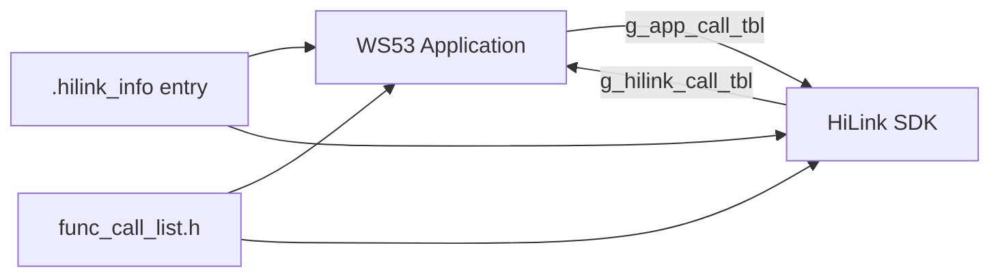

# HiLink 独立升级

> WS53 通过双向函数地址表隔离应用与 HiLink SDK，使独立交付的 HiLink 组件能够调用系统适配能力，并向应用暴露 HiLink 服务接口。

## 学习目标

- 理解应用函数表、HiLink 函数表和入口信息区的作用。
- 识别 HiLink 独立升级组件的构建入口、预编译库和链接段依赖。
- 在修改函数表或升级镜像前完成接口兼容性与回滚验证。

## 案例说明

源码位于 `src/application/samples/wifi/hilink_indie_upgrade/`。该目录提供地址映射和适配层，不是可直接烧录运行的完整单板案例：

```text
hilink_indie_upgrade/
└── address_mapping/
    ├── application/    # 应用侧函数表及 HiLink API 调用封装
    ├── hilinksdk/      # HiLink 侧函数表及系统 API 调用封装
    └── include/        # 双方共享的函数编号
```



`func_call_list.h` 为双方定义稳定的函数编号。HiLink SDK 通过应用函数表访问 KV、内存、线程、Socket、TLS、密码算法、BLE、网络和 OTA 等系统能力；应用通过 HiLink 函数表调用设备注册、配网、状态上报和日志等 HiLink 能力。

## 关键配置

- Wi-Fi sample 构建脚本仅在 `DEFINES` 包含 `CONFIG_SUPPORT_HILINK_INDIE_UPGRADE` 时加入该目录。
- `hilinksdk/CMakeLists.txt` 依赖 `application/samples/wifi/libhilink/` 下的 `libhilinkdevicesdk.a`、`libhilinkota.a` 和 `libhilinkbtsdk.a`。当前源码树未包含 `libhilink/` 目录，必须由匹配的 HiLink SDK 或产品工程提供。
- `app_addr_map` 和 `hilink_addr_map` 组件输出到 `${BIN_DIR}/${CHIP}/libs/wifi/${TARGET_COMMAND}`，并以 whole-link 方式参与链接。
- 链接脚本必须正确放置 `.hilink_tbl`、`.hilink_info` 以及 HiLink 独立镜像的 SRAM text、data 和 bss 段。
- 分区布局、镜像地址、升级包格式、签名密钥和设备身份信息必须与目标产品一致。

| 检查项 | 对应位置 | 约束 |
| --- | --- | --- |
| 应用函数编号 | `address_mapping/include/func_call_list.h` 中的 `APP_CALL_*` | SDK 和应用必须使用完全相同的顺序 |
| HiLink 函数编号 | `func_call_list.h` 中的 `HILINK_CALL_*` | 只能按兼容规则追加或变更 |
| 应用函数表 | `application/app_function_mapping.c` | 每个编号必须映射到签名一致的实现 |
| HiLink 函数表 | `hilinksdk/hilink_function_mapping.c` | 表位于 `.hilink_tbl` 段 |
| 入口信息 | `hilink_function_mapping.c` 中的 `hilink_info` | 位于 `.hilink_info` 段，地址由链接脚本提供 |
| 预编译库 | `application/samples/wifi/libhilink/` | 版本和 ABI 必须与函数表一致 |

## 代码详解

### 定义稳定的函数编号

`func_call_list.h` 分别维护应用调用编号和 HiLink 调用编号：

```c
typedef enum {
    APP_CALL_BASE = 0,
    APP_CALL_HILINK_KV_STORE_INIT,
    APP_CALL_HILINK_SET_VALUE,
    APP_CALL_HILINK_GET_VALUE,
    /* 省略其他系统适配接口。 */
    APP_CALL_MAX
} app_call_func_list;

typedef enum {
    HILINK_CALL_BASE = 0,
    HILINK_CALL_HILINK_REGISTER_BASE_CALLBACK,
    HILINK_CALL_HILINK_MAIN,
    HILINK_CALL_HILINK_RESET,
    /* 省略其他 HiLink 接口。 */
    HILINK_CALL_MAX
} hilink_call_func_list;
```

函数表以枚举值作为数组下标，因此调整既有枚举顺序会改变后续全部接口的 ABI。新增接口时应同步修改枚举、函数表和调用封装，并对旧版本兼容策略进行评审。

### 建立应用函数表

应用侧使用指定初始化器把函数编号映射到 WS53 适配实现：

```c
static const void *g_app_call_tbl[APP_CALL_MAX] = {
    [APP_CALL_HILINK_KV_STORE_INIT] = HILINK_KVStoreInit,
    [APP_CALL_HILINK_MALLOC] = HILINK_Malloc,
    [APP_CALL_HILINK_SOCKET] = HILINK_Socket,
    [APP_CALL_HILINK_TLS_CLIENT_CREATE] = HILINK_TlsClientCreate,
    [APP_CALL_HILINK_OTA_ADAPTER_FLASH_WRITE] = HILINK_OtaAdapterFlashWrite,
};
```

表项的函数签名必须与 HiLink SDK 调用端一致。不能只检查函数名是否存在，还要核对返回类型、参数宽度、指针所有权、结构体布局和错误码约定。

HiLink 侧通过 `app_call0()`～`app_call7()` 宏按编号取出函数指针并调用：

```c
#define APP_TBL get_app_tbl()
#define app_call2(nr, ret_t, t1, p1, t2, p2) \
    ((ret_t (*)(t1, t2))(APP_TBL[nr]))(p1, p2)
```

调用前必须确保地址表已经完成交换；表指针为空、编号越界或签名不一致都会导致不可恢复的异常。

### 建立 HiLink 函数表

HiLink 侧将对应用开放的接口放入 `.hilink_tbl`：

```c
const void *g_hilink_call_tbl[HILINK_CALL_MAX]
    __attribute__((section(".hilink_tbl"))) = {
    [HILINK_CALL_HILINK_REGISTER_BASE_CALLBACK] = HILINK_RegisterBaseCallback,
    [HILINK_CALL_HILINK_MAIN] = HILINK_Main,
    [HILINK_CALL_HILINK_RESET] = HILINK_Reset,
};
```

应用侧通过 `hilink_call0()`～`hilink_call7()` 调用这些函数，机制与应用函数表相同。链接后应在 map 文件中确认 `.hilink_tbl` 的地址、大小和镜像归属符合分区设计。

### 交换地址表并初始化独立镜像

HiLink 镜像在 `.hilink_info` 中暴露入口：

```c
static void hilink_info_entry(void **hilink_call_tbl, void *app_call_tbl)
{
    copy_bin_to_ram(&__sram_text_begin__, &__sram_text_load__,
        (unsigned int)&__sram_text_size__);
    copy_bin_to_ram(&__data_begin__, &__data_load__,
        (unsigned int)&__data_size__);
    init_mem_value(&__bss_begin__, &__bss_end__, 0);

    *hilink_call_tbl = g_hilink_call_tbl;
    g_app_tbl = app_call_tbl;
}

__attribute__((used, section(".hilink_info")))
struct hilink_info_stru hilink_info = {
    hilink_info_entry,
};
```

应用侧的 `hilink_func_map_init()` 从链接符号 `hilink_info_addr` 取得入口，并交换两张函数表：

```c
void hilink_func_map_init(void)
{
    if (g_hilink_info->entry != NULL) {
        g_hilink_info->entry((void **)&g_hilink_tbl, g_app_call_tbl);
    }
}
```

当前目录未提供调用 `hilink_func_map_init()` 的通用启动入口，产品工程必须在使用任何表调用宏之前完成初始化，并校验链接地址和镜像有效性。

## 案例操作指导

1. 获取与目标产品和接口表版本匹配的 HiLink SDK 预编译库，并放入构建脚本要求的位置。
2. 在产品构建中加入 `CONFIG_SUPPORT_HILINK_INDIE_UPGRADE`，确认生成 `app_addr_map`、`hilink_addr_map` 和三个 HiLink 库组件。
3. 检查链接 map，确认 `.hilink_info`、`.hilink_tbl`、SRAM text、data 和 bss 段地址与分区设计一致。
4. 确认启动流程在首次 HiLink API 调用前执行 `hilink_func_map_init()`，并检查两张函数表非空。
5. 依次验证 KV、内存、线程、网络、TLS、BLE 和 OTA 等跨表调用，重点检查错误路径和资源所有权。
6. 在隔离测试设备上验证版本检查、下载、擦写、校验、切换、异常掉电和失败回滚。

构建基础流程参见[快速入门](../../../get-started/quick-start.md)。该组件会涉及持久化存储和运行镜像，不能直接套用其他产品的库、地址或分区配置；首次验证必须保留可恢复的烧录和回滚手段。
